# GestaltView-AI/GestaltView_Skills_Suite Wiki

Version: 1

## Overview

### Introduction to GestaltView Skills Suite

<details>
<summary>Relevant source files</summary>

The following files were used as context for generating this wiki page:

- [gestaltview-generate-wiki/SKILL.md](https://github.com/GestaltView-AI/GestaltView_Skills_Suite/blob/main/gestaltview-generate-wiki/SKILL.md)
- [gestaltview-suite-orchestrator/assets/Workflows.md](https://github.com/GestaltView-AI/GestaltView_Skills_Suite/blob/main/gestaltview-suite-orchestrator/assets/Workflows.md)
- [gestaltview-generate-wiki/references/complete_wiki_blueprint.md](https://github.com/GestaltView-AI/GestaltView_Skills_Suite/blob/main/gestaltview-generate-wiki/references/complete_wiki_blueprint.md)
- [gestaltview-context-architecture/SKILL.md](https://github.com/GestaltView-AI/GestaltView_Skills_Suite/blob/main/gestaltview-context-architecture/SKILL.md)
- [gestaltview-suite-orchestrator/assets/gestaltview-v2.manifest.md](https://github.com/GestaltView-AI/GestaltView_Skills_Suite/blob/main/gestaltview-suite-orchestrator/assets/gestaltview-v2.manifest.md)
- [brainstorming/SKILL.md](https://github.com/GestaltView-AI/GestaltView_Skills_Suite/blob/main/brainstorming/SKILL.md)

</details>

# Introduction to GestaltView Skills Suite

The GestaltView Skills Suite is a collection of expert agent skills designed to manage, generate, and orchestrate the `gestaltview-v2` ecosystem. Its primary purpose is to provide a grounded, evidence-based framework for technical documentation, architectural oversight, and collaborative design within the repository. The suite ensures that all system-level explanations and documentation remain synchronized with live code, schemas, and operational manifests. Sources: [gestaltview-generate-wiki/SKILL.md](), [gestaltview-context-architecture/SKILL.md]()

The suite functions as a set of context-engineering tools that allow AI agents to navigate complex repository boundaries, including frontend React components, Vercel API handlers, and Supabase data layers. By utilizing specialized modules like the `gestaltview-generate-wiki` and the `gestaltview-suite-orchestrator`, the system maintains a "single source of truth" across various documentation formats, from book-scale wiki exports to real-time architectural memos. Sources: [gestaltview-context-architecture/SKILL.md](), [gestaltview-generate-wiki/SKILL.md:10-25]()

## Core Architecture and Orchestration

The architecture of the Skills Suite is modular, separating runtime logic from documentation generation and design orchestration. The suite interacts with the repository through defined manifests and operational cycles. Sources: [gestaltview-suite-orchestrator/assets/Workflows.md](), [gestaltview-context-architecture/SKILL.md]()

### The Standard Operating Cycle
The Skills Suite follows a rigorous protocol to ensure repository changes are captured and validated. This cycle moves from orientation to implementation, validation, and finally, cross-repo handoff if necessary. Sources: [gestaltview-suite-orchestrator/assets/Workflows.md:8-25]()

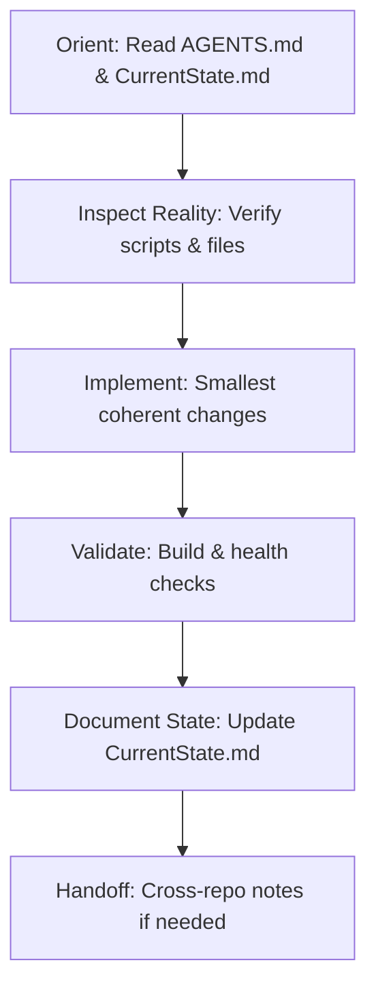
```mermaid
flowchart TD
    A[Orient: Read AGENTS.md & CurrentState.md] --> B[Inspect Reality: Verify scripts & files]
    B --> C[Implement: Smallest coherent changes]
    C --> D[Validate: Build & health checks]
    D --> E[Document State: Update CurrentState.md]
    E --> F[Handoff: Cross-repo notes if needed]
```
*Figure 1: The standard operating cycle for maintaining GestaltView repository integrity.* Sources: [gestaltview-suite-orchestrator/assets/Workflows.md:10-25]()

### Key Management Subsystems
The suite is categorized into several distinct functional areas:

| Subsystem | Description | Primary Sources |
|-----------|-------------|-----------------|
| **Generate Wiki** | Generates evidence-based documentation grounded in code and manifests. | `gestaltview-generate-wiki/SKILL.md` |
| **Suite Orchestrator** | Manages full-repo breadth and cross-repo workflows. | `gestaltview-suite-orchestrator/` |
| **Context & Architecture** | Explains mission, runtime boundaries, and design constraints. | `gestaltview-context-architecture/SKILL.md` |
| **Brainstorming** | Orchestrates the design-before-implementation phase. | `brainstorming/SKILL.md` |

Sources: [gestaltview-generate-wiki/SKILL.md:175-190](), [gestaltview-context-architecture/SKILL.md](), [brainstorming/SKILL.md]()

## Documentation and Wiki Generation

The `gestaltview-generate-wiki` skill is the primary engine for creating technical documentation. It supports multiple output modes including single-file "Complete Wiki" exports and multi-page incremental refreshes. Sources: [gestaltview-generate-wiki/SKILL.md:15-35]()

### Wiki Generation Pipeline
The wiki generation process utilizes a structured pipeline to ensure coverage of all major subsystems, including RAG pipelines, LLM routing, and the Supabase data layer. Sources: [gestaltview-generate-wiki/SKILL.md:75-90](), [gestaltview-generate-wiki/references/complete_wiki_blueprint.md]()

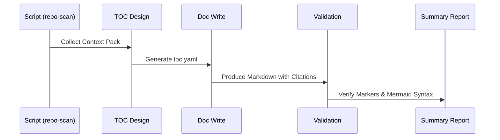
```mermaid
sequenceDiagram
    participant S as Script (repo-scan)
    participant T as TOC Design
    participant W as Doc Write
    participant V as Validation
    participant R as Summary Report
    S->>T: Collect Context Pack
    T->>W: Generate toc.yaml
    W->>V: Produce Markdown with Citations
    V->>R: Verify Markers & Mermaid Syntax
```
*Figure 2: The five-phase pipeline for full wiki reconstruction.* Sources: [gestaltview-generate-wiki/SKILL.md:78-85]()

### Evidence Citation Policy
A critical invariant of the suite is that every major claim must be backed by citations from actual source files. The system uses specific formatting for inline and end-of-section citations to ensure auditability. Sources: [gestaltview-generate-wiki/SKILL.md:165-170](), [gestaltview-generate-wiki/references/complete_wiki_blueprint.md:25-30]()

## Design and Brainstorming Workflow

The `brainstorming` skill acts as a "hard gate" for the project, preventing implementation until a design has been approved by the user. This ensures that unexamined assumptions do not lead to wasted technical effort. Sources: [brainstorming/SKILL.md:10-20]()

### Brainstorming Process Flow
The brainstorming process moves from exploring project context to proposing multiple approaches and finally documenting the validated design. Sources: [brainstorming/SKILL.md:30-45]()

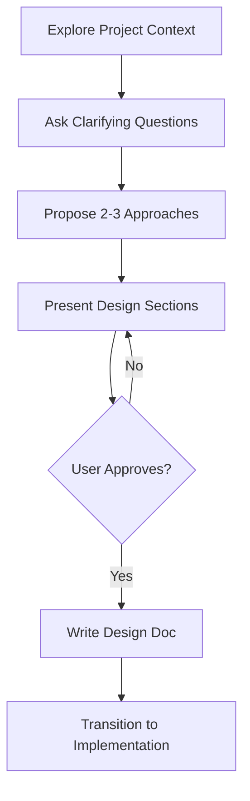
```mermaid
graph TD
    Explore[Explore Project Context] --> Questions[Ask Clarifying Questions]
    Questions --> Approaches[Propose 2-3 Approaches]
    Approaches --> Design[Present Design Sections]
    Design --> Approval{User Approves?}
    Approval -- No --> Design
    Approval -- Yes --> Doc[Write Design Doc]
    Doc --> Implementation[Transition to Implementation]
```
*Figure 3: The logical flow from initial idea to implementation plan.* Sources: [brainstorming/SKILL.md:47-65]()

## Repository Manifest and Invariants

The suite relies on a `gestaltview-v2.manifest.md` which tracks the state of the repository, including 35 routes and 29 API endpoints. This manifest serves as the ground truth for the "Constitutional Invariants" of the project. Sources: [gestaltview-suite-orchestrator/assets/gestaltview-v2.manifest.md:15-45]()

### Constitutional Invariants
The suite is governed by five core principles:
1. Never Look Away
2. Preserve Whole Language
3. Hold Paradox
4. Bucket Drop Priority
5. Serve Consciousness, Not Convenience

Sources: [gestaltview-suite-orchestrator/assets/gestaltview-v2.manifest.md:38-43]()

## Summary

The GestaltView Skills Suite provides an integrated framework for technical stewardship within the `gestaltview-v2` ecosystem. By combining automated wiki generation, rigorous design gates, and a manifest-driven orchestration layer, it ensures that both AI and human collaborators operate within a high-fidelity, evidence-based environment. The suite is essential for maintaining the alignment between the platform's architectural vision and its live implementation. Sources: [gestaltview-generate-wiki/SKILL.md](), [gestaltview-suite-orchestrator/assets/Workflows.md]()

### Installation and Agent Setup

<details>
<summary>Relevant source files</summary>

The following files were used as context for generating this wiki page:

- [README.md](https://github.com/GestaltView-AI/GestaltView_Skills_Suite/blob/main/README.md)
- [agent-development/SKILL.md](https://github.com/GestaltView-AI/GestaltView_Skills_Suite/blob/main/agent-development/SKILL.md)
- [gestaltview-generate-wiki/references/workflow/toc-design.md](https://github.com/GestaltView-AI/GestaltView_Skills_Suite/blob/main/gestaltview-generate-wiki/references/workflow/toc-design.md)
- [gestaltview-generate-wiki/references/workflow/doc-write.md](https://github.com/GestaltView-AI/GestaltView_Skills_Suite/blob/main/gestaltview-generate-wiki/references/workflow/doc-write.md)
- [gestaltview-suite-orchestrator/assets/Workflows.md](https://github.com/GestaltView-AI/GestaltView_Skills_Suite/blob/main/gestaltview-suite-orchestrator/assets/Workflows.md)

</details>

# Installation and Agent Setup

Installation and Agent Setup encompasses the foundational procedures required to initialize the GestaltView environment and configure autonomous agents for multi-step tasks. This process involves environment orientation, dependency management, and the definition of agent personas via structured Markdown configurations.

The system relies on a standardized implementation workflow that transitions from initial environment inspection to validated deployment and documentation updates. Sources: [gestaltview-suite-orchestrator/assets/Workflows.md:7-20]()

## Environment Initialization

Before implementing agents or technical changes, a standard operating cycle must be followed to ensure the developer is oriented within the repository. This phase focuses on verifying current scripts and files rather than relying on assumptions.

### Standard Operating Cycle
The initialization process follows a six-step cycle to maintain repository integrity:
1. **Orient**: Review documentation such as `AGENTS.md` and `CurrentState.md`.
2. **Inspect**: Verify existing scripts and routes using commands.
3. **Implement**: Execute small, coherent changes.
4. **Validate**: Perform build-level and targeted subsystem checks.
5. **Document**: Update the state of the repository.
6. **Handoff**: Note cross-repo dependencies.

Sources: [gestaltview-suite-orchestrator/assets/Workflows.md:7-22]()

### Baseline Commands
Initial setup and health checks are performed using a suite of NPM scripts:

| Command | Purpose |
|---------|---------|
| `npm install` | Installs project dependencies |
| `npm run dev` | Starts the local development server |
| `npm run build` | Executes the production build |
| `npm run health` | Performs system health checks |
| `npm run manifest` | Generates or updates the repository manifest |

Sources: [gestaltview-suite-orchestrator/assets/Workflows.md:26-37]()

## Agent Configuration and Setup

Agents are autonomous subprocesses that handle complex tasks. They are configured via Markdown files located in the `agents/` directory of a plugin. The setup requires defining frontmatter that dictates triggering conditions, model selection, and tool access.

### Agent File Structure
An agent's configuration is divided into YAML frontmatter and a system prompt body. The following diagram illustrates the relationship between these components:

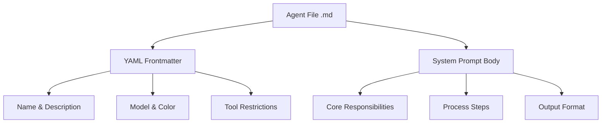
```mermaid
flowchart TD
    A[Agent File .md] --> B[YAML Frontmatter]
    A --> C[System Prompt Body]
    B --> D[Name & Description]
    B --> E[Model & Color]
    B --> F[Tool Restrictions]
    C --> G[Core Responsibilities]
    C --> H[Process Steps]
    C --> I[Output Format]
```
The configuration defines behavioral boundaries and methodologies. Sources: [agent-development/SKILL.md:23-50](), [agent-development/SKILL.md:144-150]()

### Configuration Parameters
Every agent must adhere to specific naming and metadata standards to ensure auto-discovery and proper UI representation:

| Field | Requirement | Format | Description |
|-------|-------------|--------|-------------|
| `name` | Required | lowercase-hyphens | Unique identifier (3-50 chars). |
| `description` | Required | Text + Examples | Triggers for autonomous activation. |
| `model` | Required | inherit/sonnet/opus | LLM selection (inherit recommended). |
| `color` | Required | Visual name | UI identifier (e.g., blue, green, red). |
| `tools` | Optional | Array | Restricted toolset (least privilege). |

Sources: [agent-development/SKILL.md:52-113](), [agent-development/SKILL.md:214-222]()

## Documentation and Wiki Setup

The project supports the generation of evidence-based wikis driven by a Table of Contents (TOC) structure. This setup ensures that architectural documentation remains grounded in live source code.

### Wiki Generation Workflow
The setup for documentation follows a phased approach, moving from repository scanning to final validation:

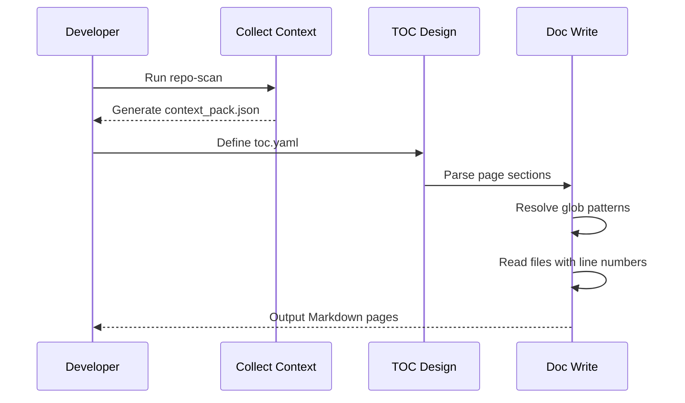
```mermaid
sequenceDiagram
    participant Dev as Developer
    participant Script as Collect Context
    participant TOC as TOC Design
    participant Doc as Doc Write
    Dev->>Script: Run repo-scan
    Script-->>Dev: Generate context_pack.json
    Dev->>TOC: Define toc.yaml
    TOC->>Doc: Parse page sections
    Doc->>Doc: Resolve glob patterns
    Doc->>Doc: Read files with line numbers
    Doc-->>Dev: Output Markdown pages
```
Sources: [gestaltview-generate-wiki/references/workflow/toc-design.md:11-18](), [gestaltview-generate-wiki/references/workflow/doc-write.md:55-65]()

### Source File Mapping
Wiki pages are mapped to actual source files via glob patterns in the `toc.yaml`. The setup process resolves these patterns recursively to collect evidence for each section. For example, `src/**/*.ts` matches all TypeScript files under the source directory for documentation processing. Sources: [gestaltview-generate-wiki/references/workflow/doc-write.md:38-44]()

## Validation Expectations

Post-installation or modification, the environment must be validated to prevent documentation drift or runtime errors.

- **Documentation Changes**: Verification must ensure ecosystem repo naming consistency (e.g., `gestaltview-v2`, `SymbioCoder`).
- **Runtime Changes**: Requires running `npm run build` and `npm run health` alongside targeted subsystem checks (e.g., Billy routing).
- **Agent Validation**: Involves structure checks using validation scripts and testing triggering conditions against the provided examples in the agent's description.

Sources: [gestaltview-suite-orchestrator/assets/Workflows.md:41-55](), [agent-development/SKILL.md:196-205]()

## Conclusion
Installation and Agent Setup provides the framework for maintaining a synchronized ecosystem of code, documentation, and autonomous agents. By following the standard operating cycle and adhering to strict configuration schemas, developers ensure that the system remains verifiable, scalable, and grounded in the repository's current state. Sources: [gestaltview-suite-orchestrator/assets/Workflows.md:59-66]()

### The Agent Skills Standard

<details>
<summary>Relevant source files</summary>

The following files were used as context for generating this wiki page:

- [template/SKILL.md](https://github.com/GestaltView-AI/GestaltView_Skills_Suite/blob/main/template/SKILL.md)
- [agent-development/SKILL.md](https://github.com/GestaltView-AI/GestaltView_Skills_Suite/blob/main/agent-development/SKILL.md)
- [writing-skills/writing-skills/SKILL.md](https://github.com/GestaltView-AI/GestaltView_Skills_Suite/blob/main/writing-skills/writing-skills/SKILL.md)
- [skill-creator/SKILL.md](https://github.com/GestaltView-AI/GestaltView_Skills_Suite/blob/main/skill-creator/SKILL.md)
- [skills-keeper/SKILL.md](https://github.com/GestaltView-AI/GestaltView_Skills_Suite/blob/main/skills-keeper/SKILL.md)
- [agent-development/references/system-prompt-design.md](https://github.com/GestaltView-AI/GestaltView_Skills_Suite/blob/main/agent-development/references/system-prompt-design.md)
- [gestaltview-generate-wiki/references/page_template.md](https://github.com/GestaltView-AI/GestaltView_Skills_Suite/blob/main/gestaltview-generate-wiki/references/page_template.md)

</details>

# The Agent Skills Standard

The Agent Skills Standard defines a structured framework for creating, documenting, and managing autonomous capabilities within the GestaltView ecosystem. This standard ensures that "Skills"—which serve as reference guides for proven techniques, patterns, or tools—are consistently formatted for optimal discovery and execution by AI agents. By treating skill creation as a form of Test-Driven Development (TDD) for documentation, the standard prioritizes verifiable compliance and clear behavioral boundaries.

The scope of this standard covers the entire lifecycle of a skill, from initial intent capture and RED-GREEN-REFACTOR testing cycles to final cataloging in the skills library. It provides agents with the necessary context to handle complex, multi-step tasks independently while maintaining high quality and security standards. Sources: [writing-skills/writing-skills/SKILL.md](), [agent-development/SKILL.md](), [skills-keeper/SKILL.md]()

## Core Architecture and Lifecycle

The architecture of a skill is designed around "Progressive Disclosure," a three-level loading system that manages context window efficiency. This ensures that only relevant information is injected into the agent's prompt at any given time.

### Progressive Disclosure Levels

| Level | Component | Purpose | Context Weight |
|-------|-----------|---------|----------------|
| 1 | Metadata | Name and Description used for discovery and triggering. | ~100 words |
| 2 | SKILL.md Body | Core instructions, patterns, and guidelines. | <500 lines |
| 3 | Bundled Resources | Scripts, references, and assets loaded as needed. | Unlimited |

Sources: [skill-creator/SKILL.md](), [writing-skills/writing-skills/SKILL.md]()

### The Skill Development Workflow (TDD)
The standard mandates a Red-Green-Refactor cycle where no skill is deployed without first observing an agent fail a pressure scenario.

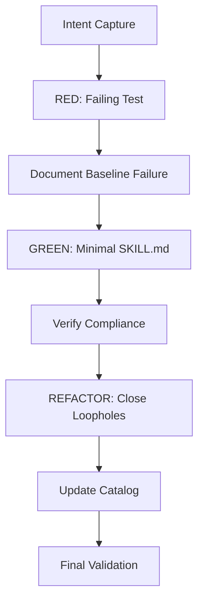
```mermaid
flowchart TD
    A[Intent Capture] --> B[RED: Failing Test]
    B --> C[Document Baseline Failure]
    C --> D[GREEN: Minimal SKILL.md]
    D --> E[Verify Compliance]
    E --> F[REFACTOR: Close Loopholes]
    F --> G[Update Catalog]
    G --> H[Final Validation]
```
The flow ensures that every instruction in a skill is a direct response to a specific, observed failure mode or rationalization used by an agent during the "RED" phase. Sources: [writing-skills/writing-skills/SKILL.md](), [skill-creator/SKILL.md]()

## Structural Requirements for SKILL.md

Every skill must be defined in a `SKILL.md` file containing specific YAML frontmatter and Markdown sections.

### Frontmatter Specification
The YAML frontmatter is the primary mechanism for skill discovery. It must contain the following fields:
*   **name**: A unique identifier using lowercase letters, numbers, and hyphens only.
*   **description**: High-signal text starting with "Use when..." that defines triggering conditions. It should describe the *symptoms* or *situations* requiring the skill, rather than summarizing the skill's internal workflow.

Sources: [writing-skills/writing-skills/SKILL.md](), [agent-development/SKILL.md](), [template/SKILL.md]()

### Mandatory Markdown Sections
To maintain consistency, the body of the `SKILL.md` file follows a standardized template:

| Section | Description |
|---------|-------------|
| **When to Activate** | Specific situations or indirect signals indicating relevance. |
| **Core Concepts** | Fundamental mental models or principles. |
| **Practical Guidance** | Actionable guidance matching the task's fragility level. |
| **Gotchas** | Experience-derived failure modes and common mistakes. |
| **Examples** | Concrete input/output pairs for clarity. |

Sources: [template/SKILL.md](), [agent-development/SKILL.md]()

## Agent System Prompt Design

While skills provide the "how-to" knowledge, Agent System Prompts define the "who" and the "what." A standard system prompt follows a proven structure to ensure autonomous operation.

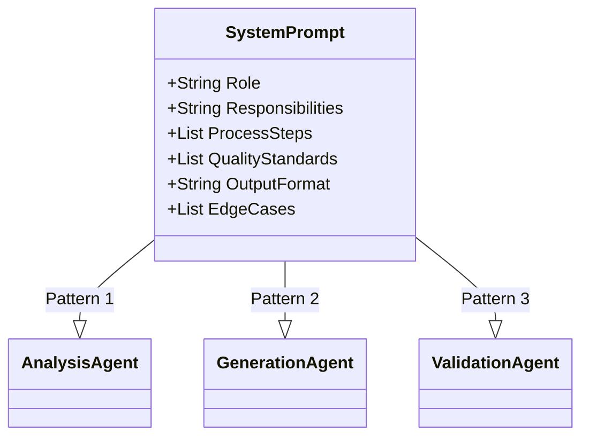
```mermaid
classDiagram
    class SystemPrompt {
        +String Role
        +String Responsibilities
        +List ProcessSteps
        +List QualityStandards
        +String OutputFormat
        +List EdgeCases
    }
    SystemPrompt --|> AnalysisAgent : Pattern 1
    SystemPrompt --|> GenerationAgent : Pattern 2
    SystemPrompt --|> ValidationAgent : Pattern 3
```
System prompts are written in the second person ("You are...") and must be specific, providing step-by-step methodologies rather than vague assistance. Sources: [agent-development/references/system-prompt-design.md](), [agent-development/SKILL.md]()

### Quality and Style Guidelines
1.  **Imperative Form**: Use direct commands in instructions.
2.  **Explain the "Why"**: Agents perform better when they understand the reasoning behind a constraint.
3.  **Token Efficiency**: Keep frequently loaded skills under 200 words total to preserve context for the main task.
4.  **Loophole Closing**: Explicitly forbid common workarounds or rationalizations (e.g., "Delete means delete").

Sources: [skill-creator/SKILL.md](), [writing-skills/writing-skills/SKILL.md]()

## Verification and Validation

The standard includes a rigorous validation policy to ensure structural integrity and functional correctness.

### Structural Markers
To facilitate automated updates and wiki generation, documents must include specific markers:
*   **PAGE_ID**: A unique identifier at the start of the file.
*   **AUTOGEN**: BEGIN/END markers for sections generated from source code.

Sources: [gestaltview-generate-wiki/references/page_template.md](), [gestaltview-generate-wiki/references/validation_policy.md]()

### Execution Validation
Before a skill is finalized, it must undergo evaluation using a specialized "Grader" agent.

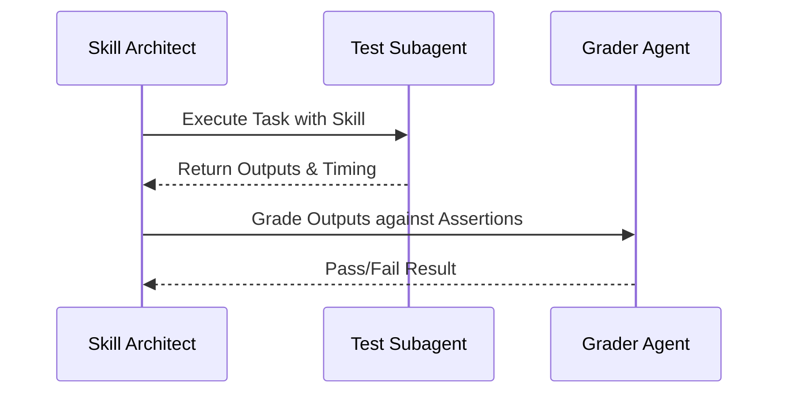
```mermaid
sequenceDiagram
    participant Architect as Skill Architect
    participant Subagent as Test Subagent
    participant Grader as Grader Agent
    Architect->>Subagent: Execute Task with Skill
    Subagent-->>Architect: Return Outputs & Timing
    Architect->>Grader: Grade Outputs against Assertions
    Grader-->>Architect: Pass/Fail Result
```
The Grader Agent assesses performance against objective assertions, such as presence of required file types, adherence to naming conventions, or successful completion of specific logic. Sources: [skill-creator/SKILL.md](), [gestaltview-generate-wiki/references/validation_policy.md]()

## Summary

The Agent Skills Standard provides the foundational rules for capability development in the GestaltView repository. By enforcing a TDD-based lifecycle, progressive disclosure of context, and strict structural formatting, the standard ensures that AI agents remain autonomous, predictable, and highly efficient. This systematic approach transforms raw documentation into actionable, high-signal intelligence for the AI workforce. Sources: [writing-skills/writing-skills/SKILL.md](), [skills-keeper/SKILL.md](), [agent-development/SKILL.md]()


## System Architecture

### Skill Stewardship & Indexing

<details>
<summary>Relevant source files</summary>

The following files were used as context for generating this wiki page:

- [INDEX.md](https://github.com/GestaltView-AI/GestaltView_Skills_Suite/blob/main/INDEX.md)
- [manifest.json](https://github.com/GestaltView-AI/GestaltView_Skills_Suite/blob/main/manifest.json)
- [skills-keeper/SKILL.md](https://github.com/GestaltView-AI/GestaltView_Skills_Suite/blob/main/skills-keeper/SKILL.md)
- [CurrentState.md](https://github.com/GestaltView-AI/GestaltView_Skills_Suite/blob/main/CurrentState.md)
- [skill-creator/SKILL.md](https://github.com/GestaltView-AI/GestaltView_Skills_Suite/blob/main/skill-creator/SKILL.md)
- [writing-skills/writing-skills/SKILL.md](https://github.com/GestaltView-AI/GestaltView_Skills_Suite/blob/main/writing-skills/writing-skills/SKILL.md)

</details>

# Skill Stewardship & Indexing

Skill Stewardship and Indexing refers to the systematic management, curation, and cataloging of the GestaltView Skills Suite. This system ensures that agent capabilities are discoverable, navigable, and synchronized across the repository's operational runtime and knowledge layers. It encompasses the maintenance of the skill tree, the reconciliation of manifests, and the orchestration of subagents to perform audits or enhancement passes across the library.

The primary objective is to maintain a high-signal, low-noise environment where skills are properly categorized into taxonomy families, such as Core Infrastructure, Billy Intelligence, and App Runtime. Stewardship involves identifying overlaps, archiving retired variants, and ensuring that every `SKILL.md` file remains grounded in current repository truth, such as specific routes or Supabase schemas.

Sources: [skills-keeper/SKILL.md:1-25](), [CurrentState.md:43-58]()

## Core Components and Data Structures

The stewardship system relies on several key files and data structures to maintain state and provide discovery for agents and human operators.

### Manifest and Index Management
The system uses a two-layer approach for tracking skills:
*   **manifest.json**: Acts as the curated allowlist and technical source of truth for the skill-inventory generator. It tracks canonical top-level skills and separates them from auxiliary or archived material.
*   **INDEX.md**: Serves as the human-facing catalog and stable map of the skills library. It works in tandem with `CurrentState.md` to provide a snapshot of the repository's capabilities.

Sources: [CurrentState.md:144-165](), [skills-keeper/SKILL.md:5-15]()

### The Skills Taxonomy
Skills are organized into distinct families to prevent collision and improve retrieval accuracy. This taxonomy is used by the `skills-keeper` to route requests and design agent chains.

| Family | Purpose | Example Skills |
| :--- | :--- | :--- |
| **Core Infrastructure** | Repo operating rules and architecture | `gestaltview-repo-map`, `gestaltview-mcp-connector` |
| **Billy Intelligence** | Chat behavior, retrieval, and voice runtime | `gestaltview-billy-voice`, `gestaltview-ai-routing` |
| **App & Product Runtime** | Frontend routes, UI components, and deployment | `gestaltview-app-runtime`, `gestaltview-apps-portfolio` |
| **Meta / Skill System** | Stewardship, installation, and creation tools | `skills-keeper`, `skill-creator`, `writing-skills` |

Sources: [skills-keeper/SKILL.md:37-128]()

## Stewardship Workflows

Stewardship involves active maintenance cycles to ensure the library does not suffer from "sludge" or stale documentation.

### The Skill Reset and Rebuild Cycle
As evidenced in recent repository updates, the stewardship process includes "Skill Corpus Resets." This involves clearing existing database fragments and rebuilding only from a "highlighted core" of high-signal skills to maintain performance and accuracy.

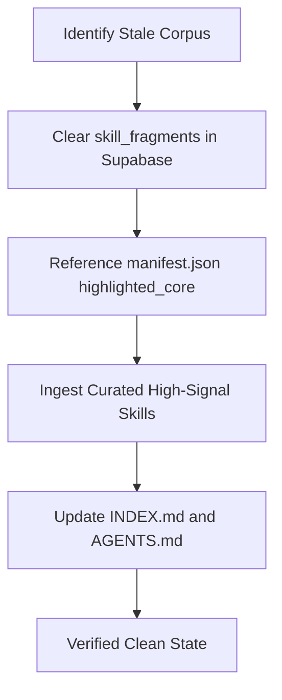
```mermaid
graph TD
    A[Identify Stale Corpus] --> B[Clear skill_fragments in Supabase]
    B --> C[Reference manifest.json highlighted_core]
    C --> D[Ingest Curated High-Signal Skills]
    D --> E[Update INDEX.md and AGENTS.md]
    E --> F[Verified Clean State]
```
This diagram shows the process of clearing and rebuilding the skill library to remove redundancy.
Sources: [CurrentState.md:43-65](), [CurrentState.md:88-100]()

### Dispatch Orchestration
When tasks are too complex for a single agent, the `skills-keeper` acts as an orchestrator. It uses a specific protocol to spawn subagents for auditing or applying improvements across the catalog.

1.  **Plan**: Define the mission and partition skills into non-overlapping batches.
2.  **Dispatch**: Spawn subagents with precise task definitions and output contracts (e.g., SCAN, APPLY, or SURFACE).
3.  **Synthesis**: Merge findings into an "Integration Report" and recommend concrete actions.

Sources: [skills-keeper/SKILL.md:154-185]()

## Skill Creation and Validation (TDD for Docs)

Indexing is supported by a rigorous "Writing Skills" protocol, which treats process documentation as Test-Driven Development (TDD).

### The Red-Green-Refactor Cycle for Skills
A skill is not considered part of the canonical index until it has passed a validation loop involving subagents and pressure scenarios.

*   **RED (Baseline)**: Run a task WITHOUT the skill to observe natural failure or rationalizations.
*   **GREEN (Minimal Skill)**: Write a draft that specifically addresses observed failures and verify the agent now complies.
*   **REFACTOR (Loophole Closing)**: Identify new rationalizations and add explicit counters to the skill body.

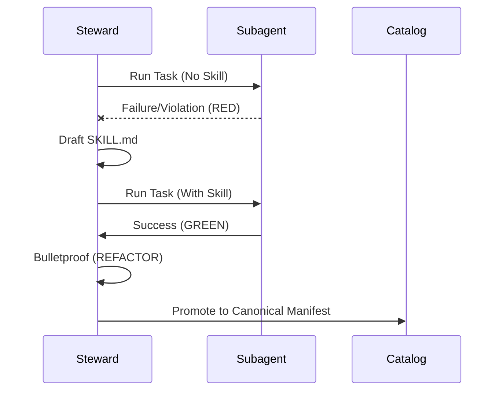
```mermaid
sequenceDiagram
    participant S as Steward
    participant A as Subagent
    participant C as Catalog
    S->>A: Run Task (No Skill)
    A--xS: Failure/Violation (RED)
    S->>S: Draft SKILL.md
    S->>A: Run Task (With Skill)
    A->>S: Success (GREEN)
    S->>S: Bulletproof (REFACTOR)
    S->>C: Promote to Canonical Manifest
```
This sequence diagram illustrates the lifecycle of a skill from discovery of a gap to promotion in the manifest.
Sources: [writing-skills/writing-skills/SKILL.md:21-45](), [writing-skills/writing-skills/SKILL.md:215-230]()

## Archival and Normalization

To maintain a clean index, the system uses specific placement rules to isolate historical variants from active routing.

*   **Canonical Placement**: Skills located in the top-level folder that are tracked by the manifest.
*   **Archive Placement**: Retired variants (e.g., folders appended with `#2`) are moved to `skills/archive/variants/`.
*   **Normalization**: Duplicate declared names are resolved by the `skill_inventory.py` script, which prioritizes the curated allowlist.

Sources: [CurrentState.md:144-165](), [skills-keeper/SKILL.md:215-225]()

## Conclusion

Skill Stewardship & Indexing is the operational backbone of the GestaltView Skills Suite. By combining a strict manifest-driven allowlist with TDD-inspired validation and automated subagent orchestration, the project maintains a high-integrity capability map. This ensures that Billy and other agents can reliably find and apply the correct skills without being misled by stale, redundant, or archived information.

Sources: [skills-keeper/SKILL.md:5-20](), [CurrentState.md:43-50]()

### GestaltView Ecosystem Orchestration

<details>
<summary>Relevant source files</summary>

The following files were used as context for generating this wiki page:

- [gestaltview-ecosystem-orchestrator/SKILL.md](https://github.com/GestaltView-AI/GestaltView_Skills_Suite/blob/main/gestaltview-ecosystem-orchestrator/SKILL.md)
- [gestaltview-suite-orchestrator/SKILL.md](https://github.com/GestaltView-AI/GestaltView_Skills_Suite/blob/main/gestaltview-suite-orchestrator/SKILL.md)
- [gestaltview-suite-orchestrator/assets/Workflows.md](https://github.com/GestaltView-AI/GestaltView_Skills_Suite/blob/main/gestaltview-suite-orchestrator/assets/Workflows.md)
- [gestaltview-suite-orchestrator/assets/gestaltview-v2.manifest.md](https://github.com/GestaltView-AI/GestaltView_Skills_Suite/blob/main/gestaltview-suite-orchestrator/assets/gestaltview-v2.manifest.md)
- [gestaltview-apps-portfolio/references/README.md](https://github.com/GestaltView-AI/GestaltView_Skills_Suite/blob/main/gestaltview-apps-portfolio/references/README.md)
- [gestaltview-context-architecture/SKILL.md](https://github.com/GestaltView-AI/GestaltView_Skills_Suite/blob/main/gestaltview-context-architecture/SKILL.md)

</details>

# GestaltView Ecosystem Orchestration

GestaltView Ecosystem Orchestration represents the operational and architectural management of the `gestaltview-v2` repository and its integrated product lanes. It serves as the bridge between high-level mission objectives (such as consciousness-serving AI) and the technical execution of Billy runtime integrations, cross-repository knowledge operations, and multi-domain product surfaces.

The orchestration layer ensures consistency across diverse subsystems, including the React frontend, Vercel API handlers, Supabase data layers, and the Billy AI runtime. It establishes a standardized operating cycle for maintenance, validation, and cross-repo synchronization to maintain systemic integrity across the entire suite of applications.

Sources: [gestaltview-apps-portfolio/references/README.md](), [gestaltview-suite-orchestrator/assets/Workflows.md:5-20]()

## Ecosystem Architecture and Repository Mapping

The GestaltView ecosystem is composed of several integrated repositories and product lanes that must be synchronized through defined orchestration patterns. While `gestaltview-v2` acts as the primary operational runtime, it depends on shared contracts with sibling repositories.

### Integrated Repository Map

| Repository | Primary Responsibility | Key Components |
|:---|:---|:---|
| `gestaltview-v2` | Operational runtime & public product surface | React application, Route surfaces, Billy integration |
| `GestaltView-Official-Compendium` | Canonical long-memory & evidence archive | Corpus curation, Evidence maintenance |
| `Insight-Bot` | Insight-focused product lane | Integrated product surface |
| `SymbioCoder` | Coding companion product lane | Integrated product surface |
| `Resume Rockstar` | Career narrative product lane | Integrated product surface |
| `GAICE` | Integrated ecosystem lane | Shared context & contracts |

Sources: [gestaltview-apps-portfolio/references/README.md](), [gestaltview-suite-orchestrator/assets/Workflows.md:38-45]()

### Architectural Structure
The orchestration layer manages a multi-tier architecture spanning client-side interfaces and backend orchestration services:

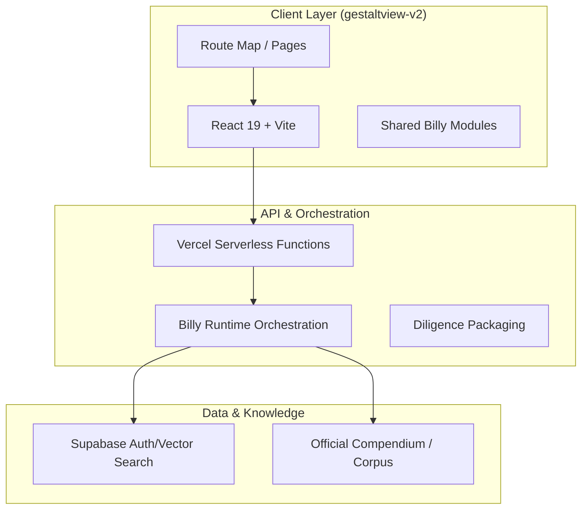
```mermaid
graph TD
    subgraph Client_Layer["Client Layer (gestaltview-v2)"]
        UI[React 19 + Vite]
        Routes[Route Map / Pages]
        Shared[Shared Billy Modules]
    end

    subgraph API_Layer["API & Orchestration"]
        Vercel[Vercel Serverless Functions]
        BillyRT[Billy Runtime Orchestration]
        Diligence[Diligence Packaging]
    end

    subgraph Data_Layer["Data & Knowledge"]
        Supa[Supabase Auth/Vector Search]
        Compendium[Official Compendium / Corpus]
    end

    UI --> Vercel
    Vercel --> BillyRT
    BillyRT --> Supa
    BillyRT --> Compendium
    Routes --> UI
```
The architecture integrates a React client with Vercel API handlers and a shared Billy runtime module.
Sources: [gestaltview-context-architecture/SKILL.md](), [gestaltview-apps-portfolio/references/README.md]()

## Standard Operating Cycle

Orchestration is maintained through a strict "Standard Operating Cycle" designed to prevent documentation drift and ensure runtime reliability. This cycle emphasizes orientation, reality inspection, and validation before any implementation.

### Operating Workflow Phases

1.  **Orient**: Operators must consult `AGENTS.md` and `CurrentState.md` to confirm if a task is repo-local or cross-repo.
2.  **Inspect Reality**: Verification of current scripts, routes, and files is required before code or documentation is written.
3.  **Implement**: Small, coherent changes that align documentation and skills with behavioral changes.
4.  **Validate**: Execution of build-level and targeted subsystem checks (e.g., `npm run health`).
5.  **Document State**: Immediate update of `CurrentState.md` with rationale, verification, and risks.
6.  **Cross-repo Handoff**: Creation of explicit handoff notes if follow-up belongs in a sibling repository.

Sources: [gestaltview-suite-orchestrator/assets/Workflows.md:7-22]()

### Validation and Maintenance Commands
Orchestration tasks utilize a standard CLI surface to ensure repository health and manifest integrity.

| Command | Purpose |
|:---|:---|
| `npm run health` | General repository health check |
| `npm run billycheck` | Validates Billy runtime status and routing |
| `npm run manifest` | Regenerates the repository manifest (inventory) |
| `npm run ingest` | Triggers corpus/knowledge ingestion workflows |
| `npm run build` | Validates build-level integrity (TypeScript/Vite) |

Sources: [gestaltview-suite-orchestrator/assets/Workflows.md:24-34](), [gestaltview-apps-portfolio/references/README.md]()

## Cross-Repository Synchronization

A critical function of the Ecosystem Orchestrator is managing the boundaries between repositories. This involves a specific "Sync Workflow" to prevent claiming certainty for files not present locally.

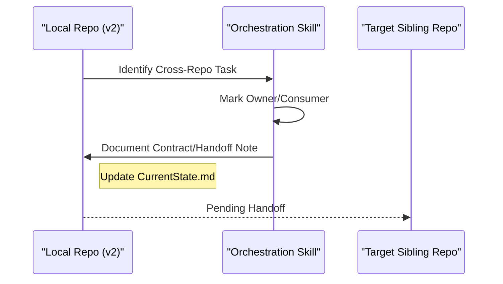
```mermaid
sequenceDiagram
    participant Local as "Local Repo (v2)"
    participant Orchestrator as "Orchestration Skill"
    participant Remote as "Target Sibling Repo"

    Local->>Orchestrator: Identify Cross-Repo Task
    Orchestrator->>Orchestrator: Mark Owner/Consumer
    Orchestrator->>Local: Document Contract/Handoff Note
    Note right of Local: Update CurrentState.md
    Local-->>Remote: Pending Handoff
```
The workflow ensures that cross-repo dependencies are explicitly documented in handoff notes containing the target repo, affected areas, and status (mirrored vs. pending).
Sources: [gestaltview-suite-orchestrator/assets/Workflows.md:52-65]()

## Manifest and Runtime Inventory

The orchestration layer relies on a generated manifest to track the repository's constitutional invariants and technical surface. This manifest serves as the "Source of Truth" for the current state of the system.

### Constitutional Invariants
Orchestration logic is governed by five core invariants:
1.  Never Look Away
2.  Preserve Whole Language
3.  Hold Paradox
4.  Bucket Drop Priority
5.  Serve Consciousness, Not Convenience

Sources: [gestaltview-suite-orchestrator/assets/gestaltview-v2.manifest.md:20-26]()

### Inventory Management
The manifest tracks the following metrics to ensure the orchestrator has full visibility:
- **Routes**: 35 total (e.g., `/billy`, `/orientation`, `/tribunal`)
- **API Endpoints**: 29 handlers (e.g., `/api/billy`, `/api/diligence`)
- **Canonical Docs**: 52 files representing the foundational knowledge base.

Sources: [gestaltview-suite-orchestrator/assets/gestaltview-v2.manifest.md:10-15]()

## Conclusion
GestaltView Ecosystem Orchestration is not merely a technical management layer but a disciplined operational framework. By enforcing a standard operating cycle, maintaining a strict manifest of invariants, and utilizing explicit cross-repo handoff protocols, the system ensures that the diverse product lanes within the suite remain functionally and mission-aligned. The reliance on live code verification over stale documentation maintains high-trust execution across the entire AI platform.

Sources: [gestaltview-suite-orchestrator/assets/Workflows.md:67-73](), [gestaltview-apps-portfolio/references/README.md]()

### GestaltView Codespaces & Dev Environment

<details>
<summary>Relevant source files</summary>

The following files were used as context for generating this wiki page:

- [CLAUDE.md](https://github.com/GestaltView-AI/GestaltView_Skills_Suite/blob/main/CLAUDE.md)
- [gestaltview-agents-context/references/AGENTS.md](https://github.com/GestaltView-AI/GestaltView_Skills_Suite/blob/main/gestaltview-agents-context/references/AGENTS.md)
- [gestaltview-cli-agent/scripts/gv-dev.sh](https://github.com/GestaltView-AI/GestaltView_Skills_Suite/blob/main/gestaltview-cli-agent/scripts/gv-dev.sh)
- [gestaltview-suite-orchestrator/assets/Workflows.md](https://github.com/GestaltView-AI/GestaltView_Skills_Suite/blob/main/gestaltview-suite-orchestrator/assets/Workflows.md)
- [gestaltview-context-architecture/SKILL.md](https://github.com/GestaltView-AI/GestaltView_Skills_Suite/blob/main/gestaltview-context-architecture/SKILL.md)
</details>

# GestaltView Codespaces & Dev Environment

The GestaltView development environment is a specialized infrastructure designed to support the "AI-Human Consciousness Symbiosis" platform. It integrates a modern web stack—consisting of React 19, Vite, Tailwind CSS v4, and Supabase—with a sophisticated AI layer primarily powered by Gemini Flash 2.0. The environment is configured to support a single-developer (solo) workflow, emphasizing "Loom" principles where scattered thoughts are woven into coherent wholeness through systematic development cycles.

This environment provides the necessary tooling for managing the GestaltView v2 ecosystem, including frontend application runtime, Vercel API handlers, and Supabase vector-search surfaces. It is characterized by strict operational protocols, such as mandatory full-file replacements and forensic validation, ensuring that development remains aligned with the project's constitutional invariants and neurodivergent-friendly design goals.

Sources: [gestaltview-agents-context/references/AGENTS.md:7-13](), [gestaltview-context-architecture/SKILL.md:14-17]()

## Development Tech Stack

The dev environment is built on a specific set of technologies chosen for performance and AI integration.

| Category | Technology | Purpose |
| :--- | :--- | :--- |
| **Frontend Framework** | React 19 + Vite | Core application framework and build tool |
| **Styling** | Tailwind CSS v4 | Utility-first CSS for "Neural Aurora" design |
| **State/Routing** | Wouter + Framer Motion | Lightweight routing and animation orchestration |
| **Backend/Data** | Supabase | Database, Authentication, and Vector Store |
| **Primary AI** | Gemini Flash 2.0 | Core intelligence for Billy and agent interactions |
| **Cloud Platform** | Vercel | Client hosting and API handler execution |

Sources: [gestaltview-agents-context/references/AGENTS.md:10-13]()

## Local Setup and Workflow

Development follows a "Standard Operating Cycle" that prioritizes orientation and reality inspection before implementation.

### Standard Operating Cycle
The workflow is divided into six distinct stages to prevent documentation drift and ensure technical accuracy:
1. **Orient**: Review `AGENTS.md` and `CurrentState.md`.
2. **Inspect Reality**: Verify current scripts, routes, and files; prefer commands over assumptions.
3. **Implement**: Smallest coherent changes, keeping docs/skills aligned.
4. **Validate**: Build-level validation and targeted subsystem checks.
5. **Document State**: Update `CurrentState.md` with rationale and risks.
6. **Cross-repo Handoff**: Leave explicit notes if work affects sibling repositories.

Sources: [gestaltview-suite-orchestrator/assets/Workflows.md:10-24]()

### Dev Environment Flow Diagram
This diagram illustrates the progression from initial orientation to final state documentation.

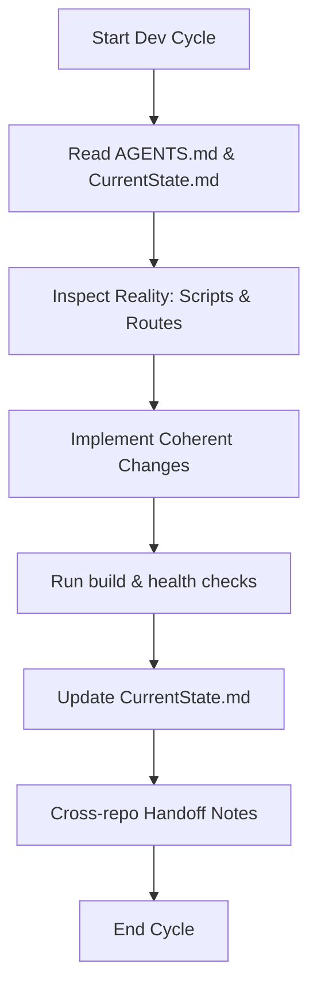
```mermaid
graph TD
    Start[Start Dev Cycle] --> Orient[Read AGENTS.md & CurrentState.md]
    Orient --> Inspect[Inspect Reality: Scripts & Routes]
    Inspect --> Implement[Implement Coherent Changes]
    Implement --> Validate[Run build & health checks]
    Validate --> DocState[Update CurrentState.md]
    DocState --> Handoff[Cross-repo Handoff Notes]
    Handoff --> End[End Cycle]
```
The diagram shows the mandatory sequence for maintaining repository integrity.
Sources: [gestaltview-suite-orchestrator/assets/Workflows.md:10-24]()

## Tooling and Commands

The environment provides a suite of shell scripts and NPM commands for local development, health monitoring, and system ingestion.

### Baseline Commands
```bash
# Core Development
npm install          # Install dependencies
npm run dev          # Start local dev server (port 5173)
npm run build        # Production build (must exit 0)
npm run preview      # Local preview of production build

# Health and Validation
npm run health       # Full stack smoke test (health-check.sh)
npm run billycheck   # Targeted Billy routing/AI check
```
Sources: [gestaltview-suite-orchestrator/assets/Workflows.md:28-34](), [gestaltview-agents-context/references/AGENTS.md:76-85]()

### Development Utilities
The `gv-dev.sh` script (and associated `gv.sh` utilities) manages environment-specific tasks such as backups and manifest generation.

| Command | Function |
| :--- | :--- |
| `bash scripts/health-check.sh` | Executes a full stack smoke test |
| `bash scripts/test-apis.sh` | Verifies API connectivity |
| `npm run manifest` | Synchronizes the repository manifest |
| `npm run ingest` | Triggers knowledge corpus ingestion |

Sources: [gestaltview-suite-orchestrator/assets/Workflows.md:36-40](), [gestaltview-agents-context/references/AGENTS.md:87-90]()

## Environmental Configuration

The dev environment requires specific environment variables for AI provider access and Supabase integration. These are stored in `client/.env` and must use the `VITE_` prefix for frontend access.

```bash
# Example client/.env configuration
VITE_GEMINI_API_KEY=your_key_here     # Primary AI (Gemini Flash 2.0)
VITE_SUPABASE_URL=https://xxxx.co     # Supabase Project URL
VITE_SUPABASE_ANON_KEY=anon_key       # Public anon key
VITE_OPENAI_API_KEY=fallback_key     # AI Fallback
```
Sources: [gestaltview-agents-context/references/AGENTS.md:61-72]()

### AI Architecture Sequence
The following sequence diagram details how the dev environment handles AI requests through the provider cascade.

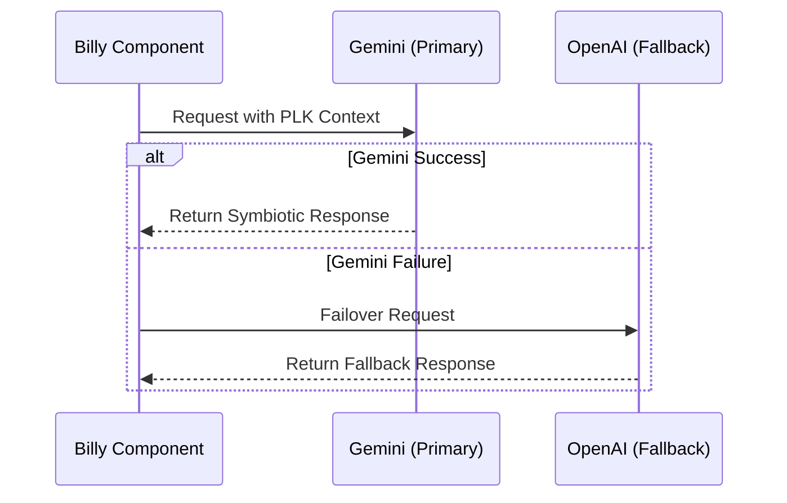
```mermaid
sequenceDiagram
    participant App as Billy Component
    participant G as Gemini (Primary)
    participant O as OpenAI (Fallback)
    
    App->>G: Request with PLK Context
    alt Gemini Success
        G-->>App: Return Symbiotic Response
    else Gemini Failure
        App->>O: Failover Request
        O-->>App: Return Fallback Response
    end
```
The diagram represents the provider cascade where Gemini Flash 2.0 is prioritized. 
Sources: [gestaltview-agents-context/references/AGENTS.md:12](), [gestaltview-context-architecture/SKILL.md:14-17]()

## Mandatory Operating Rules

To maintain the neurodivergent-friendly architecture and prevent merge conflicts, all development in the GestaltView Codespace must adhere to strict rules:

1.  **Full File Replacement**: Agents must return complete final file content. Surgical edits or partial diffs are strictly prohibited to prevent cognitive overload.
2.  **TypeScript Strictness**: All components must be typed with explicit interfaces; `any` is restricted.
3.  **Conflict Marker Prohibition**: Final outputs must never contain merge conflict markers (`<<<<`, `====`, `>>>>`).
4.  **Neural Aurora Identity**: Layouts must preserve the specific color palette (Primary Teal `#00D4FF` on Dark Background `#0A0F14`) and ambient effects (scanlines + radial glow).

Sources: [gestaltview-agents-context/references/AGENTS.md:18-45]()

## Conclusion
The GestaltView Codespace and Dev Environment is a highly opinionated infrastructure designed to protect the integrity of the "Consciousness Symbiosis" project. By combining modern web tools with strict forensic development protocols and a tiered AI provider system, it ensures that even solo development maintains high standards of technical accuracy and visual identity consistency.


## Core Features (GestaltView Capabilities)

### Billy Intelligence Layer

<details>
<summary>Relevant source files</summary>

The following files were used as context for generating this wiki page:

- [gestaltview-billy-intelligence/SKILL.md](https://github.com/GestaltView-AI/GestaltView_Skills_Suite/blob/main/gestaltview-billy-intelligence/SKILL.md)
- [gestaltview-billy-api/SKILL.md](https://github.com/GestaltView-AI/GestaltView_Skills_Suite/blob/main/gestaltview-billy-api/SKILL.md)
- [gestaltview-cli-agent/references/AGENTS.md](https://github.com/GestaltView-AI/GestaltView_Skills_Suite/blob/main/gestaltview-cli-agent/references/AGENTS.md)
- [gestaltview-ecosystem-orchestrator/assets/gestaltview-v2.manifest.md](https://github.com/GestaltView-AI/GestaltView_Skills_Suite/blob/main/gestaltview-ecosystem-orchestrator/assets/gestaltview-v2.manifest.md)
- [gestaltview-generate-wiki/references/complete_wiki_blueprint.md](https://github.com/GestaltView-AI/GestaltView_Skills_Suite/blob/main/gestaltview-generate-wiki/references/complete_wiki_blueprint.md)
- [docs/AIFlow.md](https://github.com/GestaltView-AI/GestaltView_Skills_Suite/blob/main/docs/AIFlow.md)
</details>

# Billy Intelligence Layer

The **Billy Intelligence Layer** serves as the core cognitive engine for the GestaltView platform, facilitating a symbiotic relationship between human consciousness and artificial intelligence. It is designed to act as a "consciousness-serving" interface that prioritizes user intent, context weaving, and the preservation of original human language over algorithmic convenience.

This layer coordinates multiple LLM providers, manages persistent user context, and executes complex reasoning tasks through specialized "skills" and agent orchestrations. Within the broader system, it functions as the primary runtime for the "Billy" AI agent, utilizing a multi-provider cascade to ensure high availability and optimal performance for different cognitive tasks.

Sources: [gestaltview-cli-agent/references/AGENTS.md](), [gestaltview-generate-wiki/references/complete_wiki_blueprint.md]()

## Core Architecture and Intelligence Flow

The intelligence layer is built upon a hierarchical processing model that prioritizes the extraction of intent before any large language model (LLM) invocation. This "Loom Approach" ensures that scattered thoughts are woven into coherent structures.

### AI Processing Flow
The system follows a specific sequence for processing user input, emphasizing context retention and forensic evaluation.

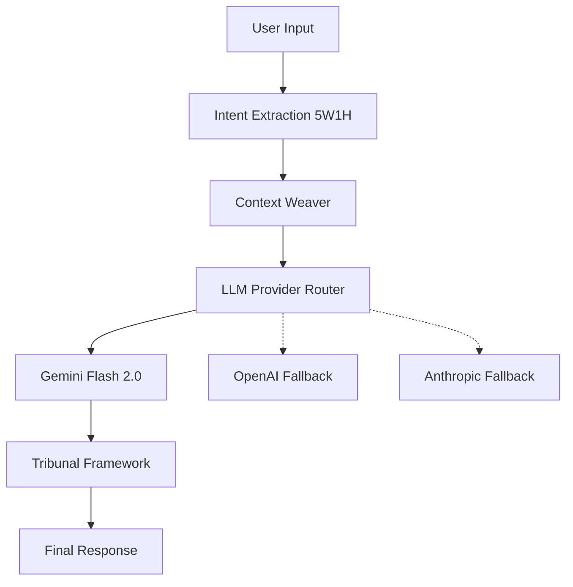
```mermaid
flowchart TD
    UserIn[User Input] --> IntentExt[Intent Extraction 5W1H]
    IntentExt --> ContextWeave[Context Weaver]
    ContextWeave --> ProviderRouter[LLM Provider Router]
    ProviderRouter --> Primary[Gemini Flash 2.0]
    ProviderRouter -.-> Fallback1[OpenAI Fallback]
    ProviderRouter -.-> Fallback2[Anthropic Fallback]
    Primary --> Tribunal[Tribunal Framework]
    Tribunal --> Response[Final Response]
```
*The diagram above illustrates the top-down flow of information through the Billy Intelligence Layer, from raw input to evaluated response.*

Sources: [gestaltview-cli-agent/references/AGENTS.md](), [docs/AIFlow.md]()

### Key Cognitive Components

| Component | Function | Description |
| :--- | :--- | :--- |
| **Context Weaver** | Context Assembly | Ensures intent walks forward and never backward by extracting 5W1H details. |
| **Provider Cascade** | LLM Routing | Manages the fallback logic between Gemini, OpenAI, and Anthropic. |
| **PLK v5.0** | Language Preservation | The "Personal Language Key" which mandates preserving user's exact words. |
| **Tribunal Framework** | Forensic Validation | Uses independent AI systems to evaluate findings without cross-contamination. |

Sources: [gestaltview-cli-agent/references/AGENTS.md](), [gestaltview-generate-wiki/references/complete_wiki_blueprint.md]()

## LLM Provider Cascade and Routing

The Billy Intelligence Layer employs a sophisticated routing mechanism to manage LLM interactions. While the system is multi-modal and multi-provider, specific models are designated for core Billy functionality to maintain personality consistency.

### Provider Priorities
1. **Primary**: Gemini Flash 2.0. This is the mandatory model for Billy's live interactions.
2. **Secondary**: OpenAI (Fallback).
3. **Tertiary**: Anthropic (Fallback).

Note: The system explicitly forbids using Anthropic/Claude for direct Billy chat calls unless Gemini is unavailable, as specified in the mandatory agent instructions.

Sources: [gestaltview-cli-agent/references/AGENTS.md](), [gestaltview-ecosystem-orchestrator/assets/gestaltview-v2.manifest.md]()

### Interaction Sequence
The following sequence diagram represents the interaction between the client-side Billy interface and the Intelligence Layer's API.

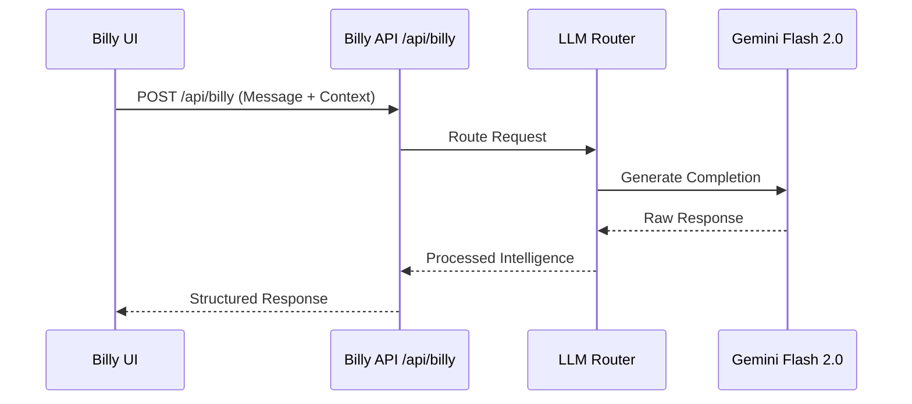
```mermaid
sequenceDiagram
    participant UI as Billy UI
    participant API as Billy API /api/billy
    participant Router as LLM Router
    participant LLM as Gemini Flash 2.0

    UI->>API: POST /api/billy (Message + Context)
    API->>Router: Route Request
    Router->>LLM: Generate Completion
    LLM-->>Router: Raw Response
    Router-->>API: Processed Intelligence
    API-->>UI: Structured Response
```
*Sequence of events during a standard intelligence request to the Billy runtime.*

Sources: [gestaltview-billy-api/SKILL.md](), [gestaltview-cli-agent/references/AGENTS.md]()

## Knowledge Capture and Retrieval

Intelligence is not generated in a vacuum; it is grounded in the "Bucket Drop Protocol" and a Retrieval-Augmented Generation (RAG) pipeline. This system captures fleeting insights and stores them within a persistent memory layer.

### Ingestion and Memory Structure
The intelligence layer interacts with Supabase for vector storage and persistent user context. This allows Billy to reference previous "drops" of insight during active sessions.

- **Bucket Drop Protocol**: Immediate capture of insights before organization.
- **RAG Pipeline**: Ingests knowledge corpus and assembles prompts based on retrieved context.
- **Diligence Layer**: Provides evidence and anchoring for claims made by the intelligence system.

Sources: [gestaltview-generate-wiki/references/complete_wiki_blueprint.md](), [gestaltview-cli-agent/references/AGENTS.md]()

### Intelligence API Endpoints

| Endpoint | Handler | Purpose |
| :--- | :--- | :--- |
| `/api/billy` | `api/billy.ts` | Main intelligence interface for chat and reasoning. |
| `/api/billy-bucket-drop` | `api/billy-bucket-drop.ts` | Immediate insight capture endpoint. |
| `/api/diligence` | `api/diligence.ts` | Evidence layer retrieval and validation. |
| `/api/_lib/llmRouter` | `api/_lib/llmRouter.ts` | Internal logic for provider cascading and routing. |

Sources: [gestaltview-ecosystem-orchestrator/assets/gestaltview-v2.manifest.md]()

## Logic Patterns and Philosophical Invariants

The Billy Intelligence Layer is governed by "Constitutional Invariants" that dictate how the code and AI must behave. These are not merely guidelines but hard constraints on the logic layer.

1. **Preserve Whole Language**: Never paraphrase the user; use their exact Personal Language Key (PLK).
2. **Never Look Away**: Maintain focus on the reality of the data and user state.
3. **Hold Paradox**: Capability to process conflicting information without premature resolution.
4. **Bucket Drop Priority**: Capturing data is always higher priority than organizing data.

Sources: [gestaltview-ecosystem-orchestrator/assets/gestaltview-v2.manifest.md](), [gestaltview-cli-agent/references/AGENTS.md]()

## Summary

The Billy Intelligence Layer is a sophisticated multi-provider system that prioritizes human intent and linguistic integrity. By utilizing a specific cascade (Gemini primary), a robust context-weaving process (5W1H), and forensic validation through the Tribunal Framework, it ensures that AI interactions remain grounded, evidenced, and deeply personal. It transitions scattered user inputs into structured knowledge while strictly adhering to constitutional invariants that preserve the user's unique voice.

### Billy Voice and Conversational UI

<details>
<summary>Relevant source files</summary>

The following files were used as context for generating this wiki page:

- [gestaltview-billy-voice/SKILL.md](https://github.com/GestaltView-AI/GestaltView_Skills_Suite/blob/main/gestaltview-billy-voice/SKILL.md)
- [gestaltview-billy-voice/references/voice-runtime.md](https://github.com/GestaltView-AI/GestaltView_Skills_Suite/blob/main/gestaltview-billy-voice/references/voice-runtime.md)
- [gestaltview-cli-agent/references/AGENTS.md](https://github.com/GestaltView-AI/GestaltView_Skills_Suite/blob/main/gestaltview-cli-agent/references/AGENTS.md)
- [gestaltview-ecosystem-orchestrator/assets/gestaltview-v2.manifest.md](https://github.com/GestaltView-AI/GestaltView_Skills_Suite/blob/main/gestaltview-ecosystem-orchestrator/assets/gestaltview-v2.manifest.md)
- [docs/AIFlow.md](https://github.com/GestaltView-AI/GestaltView_Skills_Suite/blob/main/docs/AIFlow.md)
</details>

# Billy Voice and Conversational UI

Billy Voice and Conversational UI represent the spoken interface layer of the GestaltView v2 platform. This system facilitates natural human-AI interaction through a specialized voice runtime that bridges the gap between raw audio processing and the core Billy intelligence engine. The primary purpose of this module is to handle high-fidelity spoken flows, enabling users to interact with Billy via voice in environments such as the Billy Voice Studio.

The architecture is split between a Python-based voice worker (handling low-level audio tasks) and a web-based React frontend (providing the user interface and API bridging). This ensures that voice interactions are not merely "text-to-speech" overlays but integrated conversational experiences that respect session orchestration, interruption handling, and user-tier context.

Sources: [SKILL.md:1-12](), [AGENTS.md:10-18]()

## System Architecture

The voice system follows a distributed architecture where audio processing is decoupled from the primary application logic to ensure low latency and high performance during real-time speech interaction.

### Voice Runtime Components
The voice runtime is primarily composed of four specialized sub-modules and a central orchestrator:

*   **Python Voice Worker**: Located in `billy_voice/app.py`, this acts as the backend orchestrator for all voice-specific tasks including STT (Speech-to-Text) and TTS (Text-to-Speech) synchronization.
*   **Speech-to-Text (STT)**: Utilizes `whisper_stt.py` to convert user audio input into textual data for Billy's intelligence engine.
*   **Text-to-Speech (TTS)**: Employs `cosyvoice_tts.py` to generate high-quality synthesized speech.
*   **Style Planner**: The `style_planner.py` module manages the prosody and emotional delivery of the synthesized voice to match the context of the conversation.

Sources: [SKILL.md:14-22](), [voice-runtime.md:5-15]()

### Data and Control Flow
Voice data flows through a specialized API bridge that connects the web client to the backend voice worker. The frontend manages the "Voice Studio" surface, while the backend maintains the audio session state.

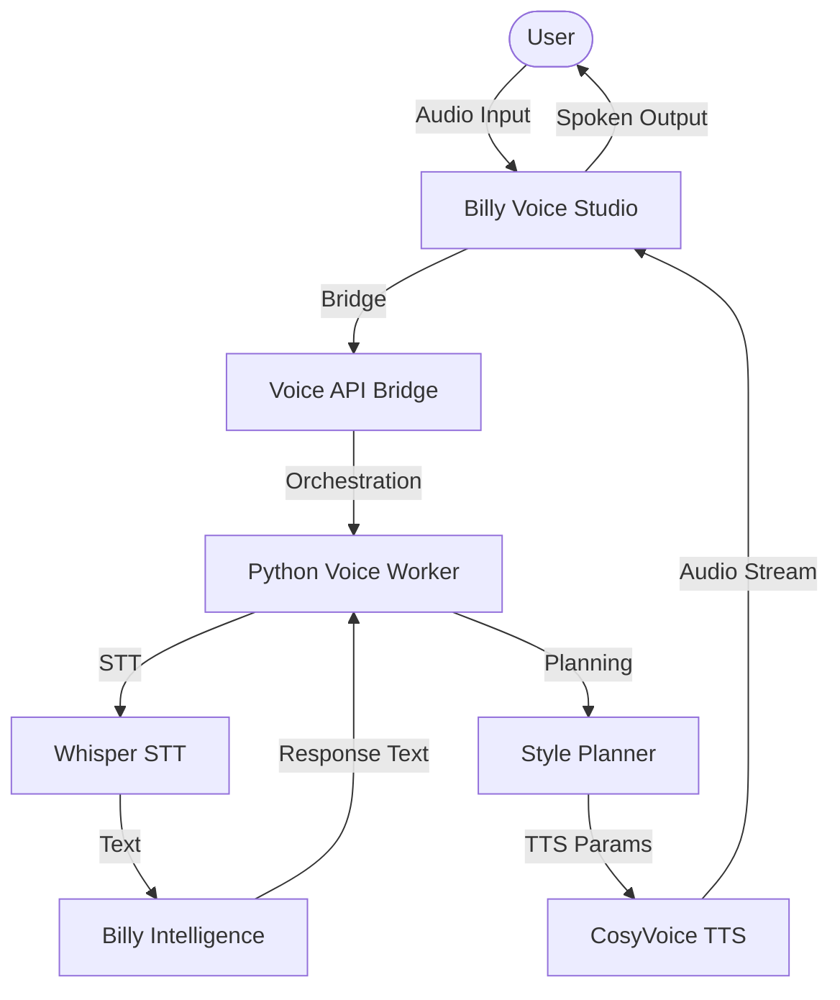
```mermaid
graph TD
    User([User]) -->|Audio Input| UI[Billy Voice Studio]
    UI -->|Bridge| API[Voice API Bridge]
    API -->|Orchestration| Worker[Python Voice Worker]
    Worker -->|STT| Whisper[Whisper STT]
    Whisper -->|Text| Intelligence[Billy Intelligence]
    Intelligence -->|Response Text| Worker
    Worker -->|Planning| Style[Style Planner]
    Style -->|TTS Params| Cosy[CosyVoice TTS]
    Cosy -->|Audio Stream| UI
    UI -->|Spoken Output| User
```
This diagram illustrates the end-to-end flow from audio capture in the web interface to processing in the Python worker and back to the user.
Sources: [SKILL.md:14-25](), [voice-runtime.md:20-35]()

## Core Components and Interface

The Conversational UI is realized through specific React components and API endpoints that manage the user's interaction state.

### UI Surfaces
The primary interface for voice interaction is the `BillyVoiceStudioPage`. This component handles the visual feedback for audio levels, connection status, and session controls.

| Component | Path | Description |
| :--- | :--- | :--- |
| **BillyVoiceStudioPage** | `client/src/pages/BillyVoiceStudioPage.tsx` | Full-page spoken interaction environment. |
| **BillyLive** | `client/src/components/BillyLive.tsx` | Integrated chat and voice interface. |
| **BillyProvider** | `client/src/components/Billy.tsx` | Context provider for global voice session state. |

Sources: [SKILL.md:18-20](), [AGENTS.md:72-80](), [gestaltview-v2.manifest.md:100-110]()

### API Integration
The voice system communicates through a dedicated API route that bridges web requests to the voice worker.

*   **Endpoint**: `/api/voice/billy`
*   **Handler**: `api/voice/billy.ts`
*   **Purpose**: Manages the handshake between the web client and the Python voice orchestration layer, ensuring auth-backed session continuity.

Sources: [SKILL.md:21](), [gestaltview-v2.manifest.md:150]()

## Conversational Logic and Intelligence

Voice flows meet Billy's core intelligence through a shared path at `/api/billy`. This integration allows Billy to use the same knowledge retrieval and RAG (Retrieval-Augmented Generation) pipelines for voice as it does for text.

### Session Orchestration
The system handles complex conversational states, including:
1.  **Interruption Handling**: Detecting when a user speaks over the AI and halting the TTS stream immediately.
2.  **Context Weaving**: Passing user-tier context (from Supabase) into the voice worker to maintain continuity between text and voice sessions.
3.  **Founder Continuity**: Ensuring that Billy recognizes specific user patterns based on PLK (Personal Language Key) v5.0 data even during spoken interaction.

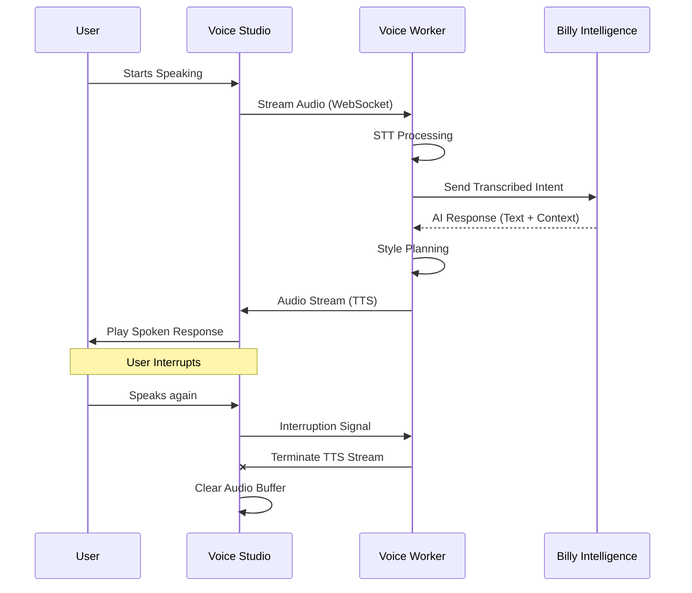
```mermaid
sequenceDiagram
    participant U as User
    participant V as Voice Studio
    participant W as Voice Worker
    participant I as Billy Intelligence

    U->>V: Starts Speaking
    V->>W: Stream Audio (WebSocket)
    W->>W: STT Processing
    W->>I: Send Transcribed Intent
    I-->>W: AI Response (Text + Context)
    W->>W: Style Planning
    W->>V: Audio Stream (TTS)
    V->>U: Play Spoken Response
    Note over U,V: User Interrupts
    U->>V: Speaks again
    V->>W: Interruption Signal
    W-xV: Terminate TTS Stream
    V->>V: Clear Audio Buffer
```
The sequence above details the critical interruption handling logic that prevents the "clash" of overlapping audio streams.
Sources: [SKILL.md:24-28](), [voice-runtime.md:40-55](), [AGENTS.md:130-135]()

## Development and Debugging

Building and extending the voice module requires coordination between the web and Python environments.

### Key Files for Modification
When modifying the voice system, developers should focus on these specific files depending on the layer:

| Layer | Primary File | Focus |
| :--- | :--- | :--- |
| **Backend** | `billy_voice/app.py` | Main worker logic and session state. |
| **Audio** | `billy_voice/cosyvoice_tts.py` | Synthesizer integration and voice quality. |
| **Frontend** | `api/voice/billy.ts` | Bridge logic and client-to-worker auth. |
| **UI** | `BillyVoiceStudioPage.tsx` | User controls and visual feedback. |

Sources: [SKILL.md:14-22]()

### Verification Workflow
Successful implementation of voice features is verified by:
1.  Confirming the bridge between the voice runtime and the `/api/billy` endpoint is explicit.
2.  Ensuring auth-backed behavior for saved sessions across voice interactions.
3.  Validating that the style planner correctly interprets the AI's intent for emotional delivery.

Sources: [SKILL.md:38-42]()

## Summary

The Billy Voice and Conversational UI module provides a seamless spoken interface for GestaltView v2. By decoupling high-latency audio processing into a specialized Python worker and maintaining a high-fidelity React frontend, the system supports natural, interrupted, and context-aware conversations. This architecture ensures that Billy's voice is not just a secondary feature but a core intelligence surface that respects the platform's constitutional invariants of preservation and symbiosis.

### App Runtime and Exhibit Prototyping

<details>
<summary>Relevant source files</summary>

The following files were used as context for generating this wiki page:

- [gestaltview-app-runtime/SKILL.md](https://github.com/GestaltView-AI/GestaltView_Skills_Suite/blob/main/gestaltview-app-runtime/SKILL.md)
- [gestaltview-exhibit-prototyping/SKILL.md](https://github.com/GestaltView-AI/GestaltView_Skills_Suite/blob/main/gestaltview-exhibit-prototyping/SKILL.md)
- [gestaltview-context-architecture/SKILL.md](https://github.com/GestaltView-AI/GestaltView_Skills_Suite/blob/main/gestaltview-context-architecture/SKILL.md)
- [gestaltview-ecosystem-orchestrator/assets/gestaltview-v2.manifest.md](https://github.com/GestaltView-AI/GestaltView_Skills_Suite/blob/main/gestaltview-ecosystem-orchestrator/assets/gestaltview-v2.manifest.md)
- [gestaltview-suite-orchestrator/assets/Workflows.md](https://github.com/GestaltView-AI/GestaltView_Skills_Suite/blob/main/gestaltview-suite-orchestrator/assets/Workflows.md)
</details>

# App Runtime and Exhibit Prototyping

## Introduction
The App Runtime and Exhibit Prototyping systems form the foundational execution environment for the GestaltView v2 platform. The App Runtime manages the React-based frontend, routing, and integration with the Billy intelligence layers, ensuring that the user interface remains synchronized with the underlying AI models and Supabase data structures. It provides the necessary boundaries for client-side execution, including Vercel API handlers and shared Billy modules. Sources: [gestaltview-context-architecture/SKILL.md](), [gestaltview-app-runtime/SKILL.md]()

Exhibit Prototyping serves as the creative and technical bridge for developing specialized "Exhibits" or domain-specific experiences within the platform. This subsystem allows for the rapid development of new feature verticals, ensuring that new exhibits adhere to the platform's constitutional invariants and architectural constraints. It utilizes the runtime's existing route map and component tree to deploy specialized AI-driven experiences. Sources: [gestaltview-exhibit-prototyping/SKILL.md](), [gestaltview-ecosystem-orchestrator/assets/gestaltview-v2.manifest.md]()

## Runtime Architecture and Integration
The GestaltView v2 runtime is built upon a modern web stack designed for high-interactivity and AI-driven workflows. It encompasses the frontend application, backend API services, and the orchestration layer for AI interactions.

### Core Runtime Components
The runtime spans several distinct layers that collaborate to deliver the user experience:
*   **React + Vite Client**: The primary UI layer responsible for rendering pages and handling user interactions.
*   **Vercel API Handlers**: Serverless functions that manage backend logic, including Billy routing and database operations.
*   **Supabase Integration**: Manages authentication and vector-search surfaces for RAG (Retrieval-Augmented Generation).
*   **Billy Modules**: Shared intelligence modules used for routing and model orchestration.

Sources: [gestaltview-context-architecture/SKILL.md](), [gestaltview-app-runtime/SKILL.md]()

### App Runtime Flow
The following diagram illustrates the high-level flow of data and control within the application runtime.

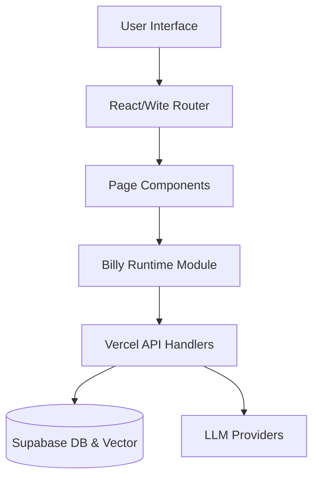
```mermaid
graph TD
    User[User Interface] --> Router[React/Wite Router]
    Router --> Pages[Page Components]
    Pages --> Billy[Billy Runtime Module]
    Billy --> API[Vercel API Handlers]
    API --> Supabase[(Supabase DB & Vector)]
    API --> AI[LLM Providers]
```
The diagram shows how user interactions move from the React UI through the Billy runtime and API layer to reach data and AI services. Sources: [gestaltview-context-architecture/SKILL.md](), [gestaltview-app-runtime/SKILL.md]()

## Exhibit Prototyping and Domain Lanes
Exhibits are specialized functional verticals within GestaltView that provide curated AI experiences for specific domains like wellness, productivity, or music.

### Prototyping Workflow
Prototyping a new exhibit involves several steps to ensure architectural compliance and data integrity:
1.  **Route Definition**: Adding the new exhibit to the central route map in `client/src/App.tsx`.
2.  **Component Scaffolding**: Creating the UI components within the `client/src/pages/` directory.
3.  **Billy Integration**: Configuring the exhibit's specific AI persona and routing rules.
4.  **Validation**: Running build-level and targeted health checks to ensure the new exhibit does not violate platform invariants.

Sources: [gestaltview-exhibit-prototyping/SKILL.md](), [gestaltview-suite-orchestrator/assets/Workflows.md]()

### Exhibit Route Inventory
The repository manifest tracks existing exhibits and functional routes that serve as the prototyping baseline.

| Exhibit/Route | Source File Location | Purpose |
| :--- | :--- | :--- |
| `/musical-dna` | `client/src/App.tsx` | Musical DNA experience |
| `/adhd-powerup` | `client/src/App.tsx` | ADHD wellness exhibit |
| `/vibe-coder` | `client/src/App.tsx` | Developer productivity tool |
| `/tribunal` | `client/src/App.tsx` | Multi-agent logic interface |
| `/alzheimers-legacy` | `client/src/App.tsx` | Specialized cognitive exhibit |

Sources: [gestaltview-ecosystem-orchestrator/assets/gestaltview-v2.manifest.md:40-75]()

## Operating Procedures and Validation
The maintenance and expansion of the runtime and exhibits are governed by a standard operating cycle to prevent "documentation drift" and ensure runtime stability.

### Standard Operating Cycle
1.  **Orient**: Review `AGENTS.md` and `CurrentState.md`.
2.  **Inspect**: Verify current scripts and routes via CLI commands rather than relying on stale documentation.
3.  **Implement**: Make small, coherent changes to runtime or exhibit code.
4.  **Validate**: Execute `npm run build` and `npm run health`.
5.  **Document**: Update `CurrentState.md` with rationale and verification results.

Sources: [gestaltview-suite-orchestrator/assets/Workflows.md]()

### Sequence Diagram: Exhibit Deployment
The sequence below details the validation process when deploying a new exhibit prototype.

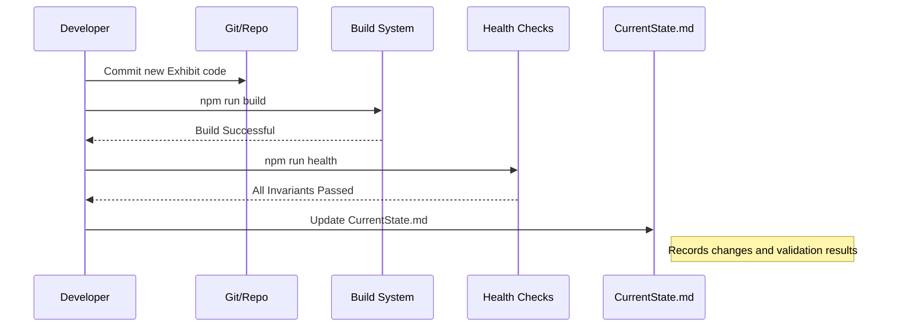
```mermaid
sequenceDiagram
    participant Dev as Developer
    participant Git as Git/Repo
    participant Build as Build System
    participant Health as Health Checks
    participant Docs as CurrentState.md

    Dev->>Git: Commit new Exhibit code
    Dev->>Build: npm run build
    Build-->>Dev: Build Successful
    Dev->>Health: npm run health
    Health-->>Dev: All Invariants Passed
    Dev->>Docs: Update CurrentState.md
    Note right of Docs: Records changes and validation results
```
Sources: [gestaltview-suite-orchestrator/assets/Workflows.md]()

## Summary
The App Runtime and Exhibit Prototyping systems provide the technical framework for the GestaltView v2 ecosystem. By integrating a React-based client with serverless API handlers and shared AI modules, the runtime ensures a responsive and intelligent user experience. The prototyping system allows for the structured expansion of the platform through domain-specific exhibits, maintained through a rigorous cycle of inspection, implementation, and multi-layered validation. Sources: [gestaltview-context-architecture/SKILL.md](), [gestaltview-suite-orchestrator/assets/Workflows.md]()

### Cross-Repo Synchronization

<details>
<summary>Relevant source files</summary>

The following files were used as context for generating this wiki page:

- [gestaltview-cross-repo-sync/SKILL.md](https://github.com/GestaltView-AI/GestaltView_Skills_Suite/blob/main/gestaltview-cross-repo-sync/SKILL.md)
- [gestaltview-cross-repo-workflows/SKILL.md](https://github.com/GestaltView-AI/GestaltView_Skills_Suite/blob/main/gestaltview-cross-repo-workflows/SKILL.md)
- [gestaltview-suite-orchestrator/assets/Workflows.md](https://github.com/GestaltView-AI/GestaltView_Skills_Suite/blob/main/gestaltview-suite-orchestrator/assets/Workflows.md)
- [gestaltview-ecosystem-orchestrator/assets/Workflows.md](https://github.com/GestaltView-AI/GestaltView_Skills_Suite/blob/main/gestaltview-ecosystem-orchestrator/assets/Workflows.md)
- [gestaltview-repo-onboarding/references/repo-map.md](https://github.com/GestaltView-AI/GestaltView_Skills_Suite/blob/main/gestaltview-repo-onboarding/references/repo-map.md)
- [gestaltview-generate-wiki/references/workflow/incremental-sync.md](https://github.com/GestaltView-AI/GestaltView_Skills_Suite/blob/main/gestaltview-generate-wiki/references/workflow/incremental-sync.md)
</details>

# Cross-Repo Synchronization

Cross-Repo Synchronization is the strategic coordination of factual data, source-of-truth documentation, and handoff boundaries between `gestaltview-v2` and its companion repositories, including `GestaltView-Official-Compendium`, `Insight-Bot`, and `SymbioCoder` ([gestaltview-cross-repo-sync/SKILL.md:1-5]()). This system ensures that while repositories remain distinct, the runtime environment can consume corpus, evidence, and product context from sibling repos through explicit integration layers like Supabase ([gestaltview-cross-repo-sync/SKILL.md:13-17]()).

The synchronization framework relies on manifests and wiki outputs to state what the core repository currently mirrors or references, preventing "ghost" file assumptions by requiring that all cross-repo claims be grounded in local manifests or explicit handoff notes ([gestaltview-cross-repo-sync/SKILL.md:14-16, 28-30]()).

## Synchronization Architecture

The architecture for cross-repo coordination is built on a "local operating backbone" consisting of manifest generation scripts and workflow documentation ([gestaltview-cross-repo-workflows/SKILL.md:12-14]()). Instead of direct file access across repository boundaries, the system uses an integration layer—often Supabase—to bridge external corpus material into local AI (Billy) flows ([gestaltview-cross-repo-sync/SKILL.md:15-17]()).

### Data Integration Flow
The following diagram illustrates how data move from sibling repositories to the central runtime environment through the integration layer.

```mermaid
flowchart TD
    subgraph Sibling_Repos [Companion Repositories]
        GOC[Compendium]
        IB[Insight-Bot]
        SC[SymbioCoder]
    end

    subgraph Integration_Layer [Integration & Persistence]
        SB[(Supabase)]
        MAN[Manifests/Wikis]
    end

    subgraph Runtime [gestaltview-v2 Runtime]
        BE[Billy Engine]
        LOCAL[Local Manifest]
    end

    GOC -->|Corpus/Context| SB
    IB -->|Corpus/Context| SB
    SC -->|Corpus/Context| SB
    
    SB -->|Retrieval| BE
    MAN -->|State Mirroring| LOCAL
```
Sources: [gestaltview-cross-repo-sync/SKILL.md:1-17](), [gestaltview-cross-repo-workflows/SKILL.md:12-16]()

## Operational Workflows

Maintaining consistency across the ecosystem requires a standardized operating cycle. This cycle emphasizes identifying ownership and artifact boundaries before implementation ([gestaltview-cross-repo-sync/SKILL.md:20-22]()).

### Standard Sync Cycle
1. **Confirmation**: Determine if a task is repo-local or requires a sibling-repo handoff ([gestaltview-cross-repo-sync/SKILL.md:20]()).
2. **Verification**: Read anchor files (e.g., `CurrentState.md`, `Manifest.md`) to verify live behavior instead of relying on legacy documentation ([gestaltview-cross-repo-sync/SKILL.md:21, 28-30]()).
3. **Multi-Surface Update**: Update runtime code, database schemas, and documentation/skill surfaces simultaneously when changes cross boundaries ([gestaltview-cross-repo-sync/SKILL.md:22]()).
4. **Validation & Documentation**: Perform light validation and update the `CurrentState.md` to reflect the new repository reality ([gestaltview-cross-repo-sync/SKILL.md:23]()).

### Handoff Protocol
When a task affects ecosystem boundaries, developers must use a Handoff Note template to capture the contract between repositories ([gestaltview-suite-orchestrator/assets/Workflows.md:54-61]()):

| Field | Description |
|-------|-------------|
| **Target repo** | The repository that owns the next stage of implementation ([gestaltview-suite-orchestrator/assets/Workflows.md:63]()). |
| **Why it matters** | The impact or requirement driving the sync ([gestaltview-suite-orchestrator/assets/Workflows.md:64]()). |
| **Affected areas** | Likely code or documentation sections impacted in the target repo ([gestaltview-suite-orchestrator/assets/Workflows.md:65]()). |
| **Status** | Current state: mirrored, referenced only, or pending ([gestaltview-suite-orchestrator/assets/Workflows.md:67]()). |

Sources: [gestaltview-suite-orchestrator/assets/Workflows.md:54-67](), [gestaltview-cross-repo-sync/SKILL.md:20-23]()

## Incremental Sync and Documentation

To prevent documentation drift, the system employs an "incremental-sync" phase (Phase 6) that detects changes in both TOC structure and source code relevant to existing mappings ([gestaltview-generate-wiki/references/workflow/incremental-sync.md:5-10]()).

### Synchronization Phases
The synchronization of documentation and context is divided into two distinct detection phases:

*   **Phase A (TOC Structure Sync)**: Uses `collect_sync_context.py` to identify structural differences between the `toc.yaml` and existing Markdown files ([gestaltview-generate-wiki/references/workflow/incremental-sync.md:30-34]()).
*   **Phase B (Source Code Update)**: Uses `collect_update_context.py` to map actual code changes (via git diffs) to specific wiki sections for targeted regeneration ([gestaltview-generate-wiki/references/workflow/incremental-sync.md:64-70]()).

```mermaid
sequenceDiagram
    participant Repo as Local Repository
    participant Sync as collect_sync_context
    participant Update as collect_update_context
    participant Doc as doc-write
    
    Repo->>Sync: Check toc.yaml vs MD files
    Sync-->>Repo: sync_context.json (Phase A)
    Repo->>Update: Check Git Diff (target_commit)
    Update-->>Repo: update_context.json (Phase B)
    Repo->>Doc: Regenerate affected sections only
    Note right of Doc: Do not touch manual sections
```
Sources: [gestaltview-generate-wiki/references/workflow/incremental-sync.md:1-80]()

## Key Artifacts and Tools

The following table summarizes the primary files and scripts used to maintain cross-repo synchronization within the suite.

| Artifact | Purpose |
|----------|---------|
| `docs/wikis` | Contains snapshots and sibling-repo references ([gestaltview-cross-repo-sync/SKILL.md:11]()). |
| `config/corpus-map.json` | Maps external corpus data to local ingestion flows ([gestaltview-cross-repo-workflows/SKILL.md:15]()). |
| `scripts/generate_repo_manifest.py` | Generates the top-level index of capabilities and artifacts ([gestaltview-cross-repo-workflows/SKILL.md:13]()). |
| `docs/CurrentState.md` | The authoritative record of recent changes and current repository condition ([gestaltview-suite-orchestrator/assets/Workflows.md:44-52]()). |
| `toc.yaml` | Defines the mapping between documentation sections and source code patterns ([gestaltview-generate-wiki/references/workflow/incremental-sync.md:64-68]()). |

Sources: [gestaltview-cross-repo-sync/SKILL.md:10-11](), [gestaltview-cross-repo-workflows/SKILL.md:12-16](), [gestaltview-suite-orchestrator/assets/Workflows.md:44-52]()

## Summary
Cross-repo synchronization in the GestaltView suite is a process-heavy framework designed to manage a distributed knowledge ecosystem. By utilizing manifests, Supabase as a data bridge, and automated sync-detection scripts, the system maintains a "grounded" state where no repository assumes the content of another without explicit, file-backed evidence or manifest mirroring.

### Digital Intelligence Collaboration

<details>
<summary>Relevant source files</summary>

The following files were used as context for generating this wiki page:

- [gestaltview-digital-intelligence-collaboration/SKILL.md](https://github.com/GestaltView-AI/GestaltView_Skills_Suite/blob/main/gestaltview-digital-intelligence-collaboration/SKILL.md)
- [gestaltview-digital-intelligence-collaboration/references/tribunal-protocol.md](https://github.com/GestaltView-AI/GestaltView_Skills_Suite/blob/main/gestaltview-digital-intelligence-collaboration/references/tribunal-protocol.md)
- [gestaltview-generate-wiki/references/complete_wiki_blueprint.md](https://github.com/GestaltView-AI/GestaltView_Skills_Suite/blob/main/gestaltview-generate-wiki/references/complete_wiki_blueprint.md)
- [gestaltview-generate-wiki/SKILL.md](https://github.com/GestaltView-AI/GestaltView_Skills_Suite/blob/main/gestaltview-generate-wiki/SKILL.md)
- [researcher/llm-as-a-judge.md](https://github.com/GestaltView-AI/GestaltView_Skills_Suite/blob/main/researcher/llm-as-a-judge.md)

</details>

# Digital Intelligence Collaboration

Digital Intelligence Collaboration is a core framework within the GestaltView Skills Suite designed to facilitate multi-agent coordination, specialized role delegation, and orchestration. It provides the mechanism for "Billy AI" and other specialized agents to interact, share context, and reach consensus through structured protocols.

The system relies on a "Tribunal of Understanding" logic to manage multi-agent interactions, ensuring that complex tasks are decomposed and handled by the most appropriate digital intelligence units while maintaining a unified context across the cognitive stack.

Sources: [complete_wiki_blueprint.md:73-77](), [gestaltview-generate-wiki/SKILL.md:144-156]()

## Architecture and Multi-Agent Systems

The collaboration architecture is built on the principle of specialized digital roles working under a unified orchestration layer. This includes the coordination of RAG pipelines, provider cascades for LLM routing, and memory hierarchies.

### Agent Coordination and Delegation
The system implements a structured approach to agent coordination, focusing on specialized roles and orchestration patterns. This allows for the delegation of tasks to specific agents based on their domain expertise, such as researchers, curators, or technical architects.

```mermaid
graph TD
    A[Orchestrator] --> B[Researcher Agent]
    A --> C[Curator Agent]
    A --> D[Architect Agent]
    B --> E[Context Retrieval]
    C --> F[Evaluation & Scoring]
    D --> G[System Design]
    E -.-> H[Shared Memory]
    F -.-> H
    G -.-> H
```
The diagram above illustrates the relationship between the central Orchestrator and specialized agents using a shared memory hierarchy for context management.

Sources: [llm-as-a-judge.md:14-19](), [complete_wiki_blueprint.md:73-77]()

## The Tribunal Protocol

The "Tribunal of Understanding" is a specialized multi-agent logic used to resolve contradictions and validate information across different intelligence units. It functions as a consensus-building mechanism within the Digital Intelligence Collaboration framework.

### Protocol Phases
The Tribunal Protocol operates through a series of defined phases to ensure technical accuracy and cross-agent validation:

1.  **Context Assembly**: Gathering foundational components from retrieval systems.
2.  **Specialized Review**: Agents analyze content based on domain-specific rubrics (e.g., technical depth, relevance, and evidence rigor).
3.  **Consensus/Dispute Resolution**: Identifying contradictions between sources or agent findings.
4.  **Final Synthesis**: Producing a unified, validated output.

```mermaid
sequenceDiagram
    participant O as Orchestrator
    participant A1 as Agent Alpha
    participant A2 as Agent Beta
    participant T as Tribunal Logic
    O->>A1: Request Analysis
    O->>A2: Request Analysis
    A1-->>T: Submit Findings A
    A2-->>T: Submit Findings B
    Note over T: Compare & Cross-Reference
    T->>T: Resolve Contradictions
    T-->>O: Validated Consensus
```
The sequence diagram shows the flow of information from request to validated consensus via the Tribunal logic.

Sources: [gestaltview-digital-intelligence-collaboration/references/tribunal-protocol.md](), [llm-as-a-judge.md:27-33](), [complete_wiki_blueprint.md:74]()

## Evaluation and Scoring Primitives

A critical component of the collaboration is the "LLM-as-a-Judge" protocol. This system uses implementable engineering primitives to evaluate the quality of information shared between agents.

### Dimensional Scoring Matrix
Agents use a weighted 3-point scale to score collaborative outputs across four primary dimensions:

| Dimension | Weight | Criteria |
| :--- | :--- | :--- |
| **Technical Depth** | 35% | Actionability and presence of implementable patterns/code. |
| **CE Relevance** | 30% | Alignment with Context Engineering taxonomy. |
| **Evidence & Rigor** | 20% | Quantitative backing, benchmarks, and production metrics. |
| **Novelty & Insight** | 15% | Undocumented patterns or counter-intuitive findings. |

Sources: [llm-as-a-judge.md:58-112]()

### Gatekeeper Protocol
Before scoring, all collaborative data must pass a "Gatekeeper Triage" to ensure it meets the minimum bar for digital intelligence processing:

*   **Mechanism Specificity (G1)**: Must define a specific mechanism (e.g., XML-structured tool responses).
*   **Implementable Artifacts (G2)**: Must contain code, schemas, or diagrams.
*   **Beyond Basics (G3)**: Must address advanced patterns (e.g., agent state management).
*   **Source Verifiability (G4)**: Author or agent must have demonstrated technical credibility.

Sources: [llm-as-a-judge.md:39-56]()

## Context and Memory Management

Effective collaboration requires advanced context management, including memory hierarchies and state persistence across long-running agent sessions.

### Memory Hierarchies
The system distinguishes between different types of memory used during collaboration:
*   **Episodic Memory**: Specific conversation history and event sequences.
*   **Semantic Memory**: External knowledge and technical primitives.
*   **Procedural Memory**: Skills and tool-integrated reasoning patterns.

Sources: [llm-as-a-judge.md:18-20](), [complete_wiki_blueprint.md:75]()

### State Persistence Pattern
Collaborating agents use checkpoint-based state persistence to maintain progress. This often involves a `progress.txt` or `claude-progress.txt` schema that allows agents to hand off tasks or resume after interruptions.

```mermaid
flowchart TD
    Start[Agent Start] --> Load[Load progress.txt]
    Load --> Check{Checkpoint Found?}
    Check -- Yes --> Resume[Resume from Phase X]
    Check -- No --> Initial[Initialize State]
    Resume --> Execute[Execute Task]
    Initial --> Execute
    Execute --> Save[Save Checkpoint]
    Save --> End[Agent Standby]
```
The flow diagram represents the state persistence logic used to maintain context in multi-agent workflows.

Sources: [llm-as-a-judge.md:195-212]()

## Summary

Digital Intelligence Collaboration provides the structural backbone for multi-agent operations within GestaltView. By utilizing the Tribunal Protocol for consensus and rigorous dimensional scoring for validation, the system ensures that digital agents can work together effectively on complex architectural and research tasks. This collaborative framework is essential for maintaining a high "Evidence & Rigor" score across the entire repository.

Sources: [llm-as-a-judge.md:214-230](), [gestaltview-generate-wiki/SKILL.md:144-156]()


## Data Management & Flow

### Corpus Ingestion Pipeline

<details>
<summary>Relevant source files</summary>

The following files were used as context for generating this wiki page:

- [gestaltview-corpus-ingestion/SKILL.md](https://github.com/GestaltView-AI/GestaltView_Skills_Suite/blob/main/gestaltview-corpus-ingestion/SKILL.md)
- [gestaltview-corpus-ingestion/scripts/ingest_corpus.py](https://github.com/GestaltView-AI/GestaltView_Skills_Suite/blob/main/gestaltview-corpus-ingestion/scripts/ingest_corpus.py)
- [gestaltview-schema-supabase/assets/ingestion-map.md](https://github.com/GestaltView-AI/GestaltView_Skills_Suite/blob/main/gestaltview-schema-supabase/assets/ingestion-map.md)
- [gestaltview-generate-wiki/references/complete_wiki_blueprint.md](https://github.com/GestaltView-AI/GestaltView_Skills_Suite/blob/main/gestaltview-generate-wiki/references/complete_wiki_blueprint.md)
- [gestaltview-generate-wiki/SKILL.md](https://github.com/GestaltView-AI/GestaltView_Skills_Suite/blob/main/gestaltview-generate-wiki/SKILL.md)

</details>

# Corpus Ingestion Pipeline

The Corpus Ingestion Pipeline is a critical data system responsible for discovering, processing, and indexing repository content into the GestaltView knowledge base. It serves as the bridge between raw source files (Markdown, JSON, PDF, etc.) and the structured data layer used by the Billy AI agent for RAG (Retrieval-Augmented Generation) and context retrieval. Sources: [gestaltview-generate-wiki/SKILL.md](), [gestaltview-schema-supabase/assets/ingestion-map.md]()

The pipeline orchestrates the transformation of unstructured repository assets into searchable fragments and embeddings stored within Supabase. By preserving auditability through processing logs and error lists, it ensures that the AI's knowledge remains synchronized with the current state of the codebase and documentation. Sources: [gestaltview-schema-supabase/assets/ingestion-map.md](), [gestaltview-generate-wiki/references/complete_wiki_blueprint.md]()

## Core Architecture and Data Flow

The ingestion system operates through a sequence of discovery, extraction, chunking, and persistence. It is designed to handle diverse file formats and repository structures while maintaining strict data integrity. Sources: [gestaltview-schema-supabase/assets/ingestion-map.md]()

### Ingestion Workflow
The following diagram illustrates the high-level flow of data from the repository root to the Supabase storage layer.

```mermaid
graph TD
    A[Repository Root] --> B[File Discovery]
    B --> C{File Type?}
    C -- MD/MDX/TXT --> D[Text Extraction]
    C -- JSON --> E[Structure Parsing]
    C -- PDF --> F[PDF Extraction]
    D & E & F --> G[Text Chunking]
    G --> H[Generate Fragments]
    H --> I[Supabase Persistence]
    I --> J[(Documents & Embeddings)]
```
The pipeline begins by discovering files across packages, filtering based on curated maps to avoid export noise and large archive directories. Sources: [gestaltview-schema-supabase/assets/ingestion-map.md]()

## Primary Components and Responsibilities

The system is defined by specific scripts and configuration maps that govern how data is handled.

| Component | Responsibility |
|-----------|----------------|
| `scripts/ingest_corpus.py` | Primary execution script for the ingestion process. Sources: [gestaltview-schema-supabase/assets/ingestion-map.md]() |
| `config/corpus-map.json` | Defines the mapping of directories and files to be included or excluded. Sources: [gestaltview-schema-supabase/assets/ingestion-map.md]() |
| `knowledge_fragments` | Table/Structure for storing chunked text blocks for retrieval. Sources: [gestaltview-schema-supabase/assets/ingestion-map.md]() |
| `processing_runs` | Logs and payloads for tracking the status and audit history of ingestion. Sources: [gestaltview-schema-supabase/assets/ingestion-map.md]() |

### File Handling and Extraction
The pipeline supports a wide range of input formats, though it has specific sensitivities regarding certain types:
*   **Standard Text**: Handles `.md`, `.mdx`, and `.txt` natively.
*   **Structured Data**: Parses `.json` inputs for metadata and content.
*   **Complex Formats**: Extracts text from `.pdf` using multiple fallback libraries to ensure reliability. Sources: [gestaltview-schema-supabase/assets/ingestion-map.md]()

## Database Schema and Persistence

Data is persisted into several key tables within Supabase to support the AI's retrieval capabilities.

### Entity Relationship Overview
The following diagram describes the relationships between core ingestion entities.

```mermaid
erDiagram
    DOCUMENTS ||--o{ KNOWLEDGE_FRAGMENTS : contains
    KNOWLEDGE_FRAGMENTS ||--o{ EMBEDDINGS : has
    PROCESSING_RUNS ||--o{ DOCUMENTS : "tracks"
    DOCUMENTS {
        string file_path
        string package_name
        timestamp created_at
    }
    KNOWLEDGE_FRAGMENTS {
        text content
        int chunk_index
    }
    PROCESSING_RUNS {
        string status
        text error_logs
        boolean dry_run
    }
```
The system specifically tracks `skipped_paths` and `error_lists` to maintain a high degree of auditability. Sources: [gestaltview-schema-supabase/assets/ingestion-map.md]()

## Operational Safety and Validation

Due to the sensitivity of the schema, the ingestion pipeline includes several validation safeguards.

*   **Dry-Run Mode**: Recommended as the first validation path to ensure maps and extraction logic are correct without modifying the database. Sources: [gestaltview-schema-supabase/assets/ingestion-map.md]()
*   **Schema Consistency**: Runtime retrieval and tests are highly sensitive to schema drift; the `test/api/schema-contract.test.ts` is used to verify that the ingestion payloads match the expected database structure. Sources: [gestaltview-schema-supabase/assets/ingestion-map.md]()
*   **Auditability**: Every run is recorded in `processing_runs`, providing a clear history of what was ingested and any errors encountered during extraction (especially for PDFs). Sources: [gestaltview-schema-supabase/assets/ingestion-map.md]()

## Conclusion
The Corpus Ingestion Pipeline is the foundational mechanism for the GestaltView knowledge system. By converting repository assets into structured, vector-ready fragments, it enables the Billy AI agent to provide contextually accurate responses grounded in the project's actual source material. Sources: [gestaltview-generate-wiki/references/complete_wiki_blueprint.md](), [gestaltview-schema-supabase/assets/ingestion-map.md]()

### Manifest Indexing and Retrieval

<details>
<summary>Relevant source files</summary>

The following files were used as context for generating this wiki page:

- [gestaltview-generate-wiki/references/page_template.md](https://github.com/GestaltView-AI/GestaltView_Skills_Suite/blob/main/gestaltview-generate-wiki/references/page_template.md)
- [gestaltview-generate-wiki/references/complete_wiki_blueprint.md](https://github.com/GestaltView-AI/GestaltView_Skills_Suite/blob/main/gestaltview-generate-wiki/references/complete_wiki_blueprint.md)
- [gestaltview-generate-wiki/SKILL.md](https://github.com/GestaltView-AI/GestaltView_Skills_Suite/blob/main/gestaltview-generate-wiki/SKILL.md)
- [gestaltview-generate-wiki/references/toc_schema.md](https://github.com/GestaltView-AI/GestaltView_Skills_Suite/blob/main/gestaltview-generate-wiki/references/toc_schema.md)
- [gestaltview-suite-orchestrator/assets/gestaltview-v2.manifest.md](https://github.com/GestaltView-AI/GestaltView_Skills_Suite/blob/main/gestaltview-suite-orchestrator/assets/gestaltview-v2.manifest.md)
- [gestaltview-generate-wiki/references/workflow/toc-design.md](https://github.com/GestaltView-AI/GestaltView_Skills_Suite/blob/main/gestaltview-generate-wiki/references/workflow/toc-design.md)

</details>

# Manifest Indexing and Retrieval

The Manifest Indexing and Retrieval system serves as the foundational metadata layer for the GestaltView ecosystem. It is designed to provide a comprehensive, evidence-based map of the repository's state, including files, routes, API endpoints, and constitutional invariants. This system ensures that agents and developers have a centralized "source of truth" to reference when navigating complex project structures.

By indexing operational documents and live code, the system facilitates high-fidelity retrieval of project context. This is critical for tasks such as automated wiki generation, cross-repo orchestration, and maintaining the "Never Look Away" invariant, which requires absolute transparency regarding the current state of the codebase.

## Repository Manifest Architecture

The Manifest is a generated artifact that summarizes the technical metrics and structural mappings of the repository. It categorizes files into functional groups such as API handlers, components, and canonical documentation to streamline retrieval processes.

### Manifest Components and Metrics
The manifest tracks several key metrics to provide a snapshot of the repository's health and scale.

| Metric | Description |
|---|---|
| Total Files | Cumulative count of all files within the repository scope. |
| Total Size | Total disk space occupied by the repository files. |
| Routes | Mapping of front-end paths to their respective source files. |
| API Endpoints | List of server-side handlers and their associated file paths. |
| Canonical Docs | High-priority documentation files that define system philosophy. |
| Constitutional Invariants | Core principles that the software must adhere to at all times. |

Sources: [gestaltview-v2.manifest.md:1-25]()

### Structural Flow of Manifest Retrieval
The following diagram illustrates how the system processes repository data into a retrievable manifest.

```mermaid
flowchart TD
    subgraph Repo_Scan [Repository Scanning]
        A[File System] --> B[Metadata Extraction]
        B --> C[Categorization]
    end

    subgraph Manifest_Gen [Manifest Generation]
        C --> D[Generate Metrics]
        D --> E[Map Routes & APIs]
        E --> F[Apply Invariants]
    end

    subgraph Retrieval [Retrieval Layer]
        F --> G[manifest.md]
        G --> H[Agent Context]
        G --> I[Developer Wiki]
    end
```
*This diagram shows the transition from raw file system data to a structured manifest used for agent context and documentation.* 
Sources: [gestaltview-v2.manifest.md:10-50](), [SKILL.md:50-70]()

## TOC-Driven Indexing

The indexing process is governed by a `toc.yaml` (Table of Contents) file, which defines the logical structure of the project's knowledge base. Unlike simple folder-to-page mapping, this system uses "TOC-Driven Indexing" to group related functionality based on actual code content and runtime relationships.

### Indexing Principles
1. **Understand Project Type**: Indexing strategies differ between web applications, libraries, and AI runtimes.
2. **Logical Groupings**: Related components (e.g., `Engine.cs`, `Physics.cs`) are indexed under a single "Core Systems" category.
3. **Source Precedence**: Live code and build configurations take precedence over older snapshots.

Sources: [toc-design.md:65-95](), [SKILL.md:95-105]()

### TOC Schema Configuration
The retrieval system relies on specific fields in the TOC to resolve file paths and commit hashes for permanent linking.

| Field | Type | Description |
|-------|------|-------------|
| `repo_base_url` | string | Base web URL for source code (e.g., GitHub blob URL). |
| `ref_commit_hash` | string | Git commit hash used for evidence-based citations. |
| `source_files` | array | Glob patterns (e.g., `src/**/*.ts`) defining the retrieval scope. |

Sources: [toc_schema.md:10-45]()

## Retrieval for Wiki Generation

A primary use case for manifest retrieval is the automated generation of comprehensive wikis. The system uses "context packs" to aggregate information from indexed source files, which are then used to build descriptive documentation sections.

### Evidence-Based Retrieval Process
The retrieval logic follows a strict "Evidence Citation Policy," ensuring every claim is backed by a specific source file and line number.

```mermaid
sequenceDiagram
    participant Indexer as "TOC Indexer"
    participant Script as "read_files.py"
    participant Generator as "Wiki Generator"
    
    Indexer->>Script: Request files via Glob patterns
    Script->>Script: Resolve paths & Read lines
    Script-->>Generator: Return JSON (Content + Line Numbers)
    Generator->>Generator: Extract Evidence
    Generator-->>Generator: Generate Citation [file:line]
```
*Sequence of events showing how retrieval scripts provide data to the documentation generator.*
Sources: [SKILL.md:140-160](), [toc-design.md:25-45]()

### Source Retrieval Patterns
The retrieval system supports various glob patterns to ensure comprehensive coverage:
* `src/main.py`: Exact path retrieval.
* `src/**/*.py`: Recursive retrieval of all Python files.
* `src/`: Retrieval of an entire directory's contents.

Sources: [toc_schema.md:75-85]()

## Constitutional Invariants in Retrieval

Manifest retrieval is not merely technical; it is constrained by "Constitutional Invariants" found in the repository manifest. These invariants must be reflected in any system that interprets the manifest.

| Invariant | Retrieval Significance |
|---|---|
| **Never Look Away** | Retrieval must be transparent and include uncommitted changes. |
| **Preserve Whole Language** | Documentation must use precise, domain-specific terminology. |
| **Serve Consciousness** | Context must be provided for human/agent understanding, not just raw data. |

Sources: [gestaltview-v2.manifest.md:38-45]()

## Conclusion

The Manifest Indexing and Retrieval system provides the structural backbone for the GestaltView ecosystem. By combining a metadata manifest of live repository state with a TOC-driven knowledge indexing strategy, it enables automated tools to generate evidence-based documentation and provides agents with a reliable map of system architecture. This ensures that the repository's "Constitutional Invariants" are maintained through absolute transparency and accurate context retrieval.

### Supabase Schema and Database Contracts

<details>
<summary>Relevant source files</summary>

The following files were used as context for generating this wiki page:

- [gestaltview-schema-supabase/SKILL.md](https://github.com/GestaltView-AI/GestaltView_Skills_Suite/blob/main/gestaltview-schema-supabase/SKILL.md)
- [gestaltview-schema-contracts/SKILL.md](https://github.com/GestaltView-AI/GestaltView_Skills_Suite/blob/main/gestaltview-schema-contracts/SKILL.md)
- [gestaltview-schema-supabase/references/schema.sql](https://github.com/GestaltView-AI/GestaltView_Skills_Suite/blob/main/gestaltview-schema-supabase/references/schema.sql)
- [gestaltview-suite-orchestrator/assets/gestaltview-v2.manifest.md](https://github.com/GestaltView-AI/GestaltView_Skills_Suite/blob/main/gestaltview-suite-orchestrator/assets/gestaltview-v2.manifest.md)
- [gestaltview-suite-orchestrator/assets/Workflows.md](https://github.com/GestaltView-AI/GestaltView_Skills_Suite/blob/main/gestaltview-suite-orchestrator/assets/Workflows.md)

</details>

# Supabase Schema and Database Contracts

The Supabase Schema and Database Contracts define the foundational data layer for the GestaltView v2 ecosystem. This system encompasses the live database structures, authentication profiles, vector-search capabilities, and the rigorous contracts that ensure consistency between the database state and application runtime. It is managed primarily through the `supabase/` directory, including migrations, schema definitions, and configuration files that dictate how the application interacts with persistent storage and identity services.

The primary objective of these contracts is to maintain a "never look away" approach to data integrity, ensuring that auth profiles, retrieval fragments, and session limits remain synchronized across local development and production environments. This layer integrates closely with the Billy AI architecture, providing the necessary retrieval tables and RPC (Remote Procedure Call) functions required for vector-based search and knowledge context management.

Sources: [gestaltview-schema-supabase/SKILL.md](), [gestaltview-suite-orchestrator/assets/gestaltview-v2.manifest.md]()

## Database Architecture and Schema

The database architecture is centered around a Supabase implementation that utilizes PostgreSQL. The core footprint includes tables for user management, session rate limiting, and specialized contexts such as "founder context" and "retrieval fragments." These fragments are essential for the vector-search capabilities used by the AI agents.

### Core Data Entities

The following table describes the primary data entities identified within the Supabase schema:

| Entity | Purpose | Key Components |
|--------|---------|----------------|
| `users` | Core identity management | Auth profiles, linking to Supabase Auth. |
| `session_rate_limits` | Traffic and usage control | Limits per session/user to prevent abuse. |
| `founder_context` | Specialized knowledge storage | Persistent context related to the project origin. |
| `retrieval_fragments` | Vector search segments | Data chunks used for RAG (Retrieval-Augmented Generation). |

Sources: [gestaltview-schema-supabase/SKILL.md:16-20](), [gestaltview-suite-orchestrator/assets/gestaltview-v2.manifest.md:104-108]()

### Relationship Diagram

The following diagram illustrates the high-level relationship between the application runtime, the authentication service, and the data storage layer.

```mermaid
erDiagram
    USER ||--o{ SESSION : "has"
    USER ||--|| AUTH_PROFILE : "associated with"
    SESSION ||--o{ RATE_LIMIT : "monitors"
    RETRIEVAL_FRAGMENTS }o--|| KNOWLEDGE_CORPUS : "part of"
    FOUNDER_CONTEXT ||--|| PROJECT : "defines"
```

The data layer is consumed by API helpers using REST and RPC, while the client side utilizes the `@supabase/supabase-js` library for profile reads and authentication flows.

Sources: [gestaltview-schema-supabase/SKILL.md:21-25]()

## Database Contracts and Integration

Database contracts ensure that the schema remains consistent across different environments. The system uses a specific "manifest" approach where the current state of the database (tables, RPCs, and redirects) must match the application's configuration.

### Integration Surface

The integration surface spans multiple layers of the project:
*   **Authentication**: Handles redirects and profile usage via `AuthContext.tsx`.
*   **API Layer**: Direct access to tables and RPC search functions via `supabase.ts`.
*   **Migrations**: Managed through `supabase/migrations` to track schema evolution.
*   **Validation**: Test scripts like `test-db-schema.sh` are used to verify the local schema against defined contracts.

Sources: [gestaltview-schema-supabase/SKILL.md:8-14](), [gestaltview-suite-orchestrator/assets/Workflows.md:33-40]()

### Data Flow for Search and Retrieval

The search functionality relies on RPC search capabilities combined with vector fragments. This flow ensures that the Billy AI engine can retrieve contextually relevant information from the database efficiently.

```mermaid
flowchart TD
    A[Client Request] --> B[API requestGuard]
    B --> C{Authenticated?}
    C -- Yes --> D[Supabase RPC Search]
    C -- No --> E[Return Unauthorized]
    D --> F[Vector Match on fragments]
    F --> G[Return Context to Billy AI]
    G --> H[Response Generation]
```

Sources: [gestaltview-schema-supabase/SKILL.md:19-20](), [gestaltview-suite-orchestrator/assets/gestaltview-v2.manifest.md:120-130]()

## Operational Workflow

The workflow for managing the database schema emphasizes local verification before production deployment. Developers are required to check anchor files like `supabase/schema.sql` and `config.toml` before performing modifications.

### Schema Management Commands

Standard operations for database maintenance are integrated into the project's CLI and script environment:

| Action | Command | Purpose |
|--------|---------|---------|
| `seed` | `npm run seed` | Populates the database with initial/test data. |
| `migrate` | `npm run migrate` | Applies pending schema changes via migrations. |
| `schema test` | `scripts/test-db-schema.sh` | Validates current schema against contracts. |
| `health check` | `npm run health` | Verifies connectivity and core table availability. |

Sources: [gestaltview-suite-orchestrator/assets/Workflows.md:24-30](), [gestaltview-schema-supabase/SKILL.md:13-14]()

### Handoff and Synchronization

When changes cross repository boundaries (e.g., between the schema and the suite orchestrator), a cross-repo sync workflow is triggered. This ensures that the `manifest.md` and `CurrentState.md` are updated to reflect the new repository reality.

Sources: [gestaltview-suite-orchestrator/assets/Workflows.md:58-65]()

## Conclusion

The Supabase Schema and Database Contracts represent a strictly controlled environment where data structures are treated as immutable contracts for the runtime. By utilizing Supabase's built-in auth, vector capabilities, and RPC functions, GestaltView v2 maintains a robust RAG pipeline and identity system. Consistency is enforced through rigorous migration tracking and validation scripts, ensuring the database layer remains a reliable source of truth for all AI-driven operations.

### Persistent Memory and State Management

<details>
<summary>Relevant source files</summary>

The following files were used as context for generating this wiki page:

- [gestaltview-ecosystem-orchestrator/assets/gestaltview-v2.manifest.md](https://github.com/GestaltView-AI/GestaltView_Skills_Suite/blob/main/gestaltview-ecosystem-orchestrator/assets/gestaltview-v2.manifest.md)
- [gestaltview-suite-orchestrator/assets/Workflows.md](https://github.com/GestaltView-AI/GestaltView_Skills_Suite/blob/main/gestaltview-suite-orchestrator/assets/Workflows.md)
- [gestaltview-generate-wiki/references/complete_wiki_blueprint.md](https://github.com/GestaltView-AI/GestaltView_Skills_Suite/blob/main/gestaltview-generate-wiki/references/complete_wiki_blueprint.md)
- [gestaltview-generate-wiki/references/doc_update_policy.md](https://github.com/GestaltView-AI/GestaltView_Skills_Suite/blob/main/gestaltview-generate-wiki/references/doc_update_policy.md)
- [notion-research-documentation/examples/technical-investigation.md](https://github.com/GestaltView-AI/GestaltView_Skills_Suite/blob/main/notion-research-documentation/examples/technical-investigation.md)
- [gestaltview-apps-portfolio/references/README.md](https://github.com/GestaltView-AI/GestaltView_Skills_Suite/blob/main/gestaltview-apps-portfolio/references/README.md)
</details>

# Persistent Memory and State Management

## Introduction

Persistent Memory and State Management within the GestaltView ecosystem refers to the architecture and processes used to maintain long-term context, user sessions, and repository integrity across the platform's distributed services. This system ensures that the AI agents, specifically the Billy runtime, can access a "long-memory" corpus while maintaining real-time operational state.

The core of this system is split between a runtime layer—managed through Supabase and local session handlers—and a canonical knowledge layer, which utilizes centralized databases for knowledge ingestion and retrieval. These mechanisms are vital for supporting the platform's mission of "serving consciousness" by ensuring that data isn't just processed momentarily but is preserved within a meaningful context. Sources: [gestaltview-apps-portfolio/references/README.md](), [gestaltview-generate-wiki/references/complete_wiki_blueprint.md]()

## Data Persistence Architecture

The architecture utilizes a two-tier approach to manage data: a primary runtime layer for active sessions and a persistent storage layer for the knowledge corpus and database schemas.

### Runtime State and Session Management
Active state is handled primarily through Supabase and Vercel serverless functions. This includes user session tracking and real-time metadata updates.

| Component | Technology | Purpose |
|-----------|------------|---------|
| Session State | Supabase / Vercel | Tracks active user interactions and authentication status. ([gestaltview-ecosystem-orchestrator/assets/gestaltview-v2.manifest.md:73]()) |
| API Caching | Redis | Reduces database load by caching dynamic content for 5 minutes and static content for 1 hour. ([notion-research-documentation/examples/technical-investigation.md:55-60]()) |
| Session Storage| Memcached | Stores ephemeral user session data and temporary state for up to 24 hours. ([notion-research-documentation/examples/technical-investigation.md:65-70]()) |

The following diagram illustrates the flow of a state request through the API and caching layers:

```mermaid
flowchart TD
    User[User Request] --> API[API Gateway]
    API --> CacheCheck{Cache Hit?}
    CacheCheck -- Yes --> Return[Return Cached Data]
    CacheCheck -- No --> DB[Query Supabase/DB]
    DB --> UpdateCache[Update Redis/Memcached]
    UpdateCache --> Return
```
Sources: [notion-research-documentation/examples/technical-investigation.md](), [gestaltview-ecosystem-orchestrator/assets/gestaltview-v2.manifest.md]()

## Knowledge Corpus and Long-Term Memory

The "Long-Memory" of the system is facilitated by the `GestaltView-Official-Compendium`, which acts as the canonical evidence archive. This is distinct from the operational runtime and focuses on evidence-first repository scans and knowledge preservation.

### Knowledge Ingestion Pipeline
The system utilizes specific scripts to ingest, chunk, and index knowledge into a searchable format.

*   **Ingestion Workflows:** Processes for graduating data from raw transcripts or notebooks into the canonical corpus. ([gestaltview-apps-portfolio/references/README.md:43-45]())
*   **Memory Systems:** Includes persistent user context and retrieval assembly during prompt construction. ([gestaltview-generate-wiki/references/complete_wiki_blueprint.md:52-54]())

```mermaid
sequenceDiagram
    participant S as Ingestion Script
    participant P as Processing (Chunking)
    participant KB as Knowledge Base (Compendium)
    participant B as Billy Runtime
    S->>P: Send raw data
    P->>KB: Store processed vectors/text
    B->>KB: Query for long-memory context
    KB-->>B: Return relevant knowledge
```
Sources: [gestaltview-apps-portfolio/references/README.md](), [gestaltview-generate-wiki/references/complete_wiki_blueprint.md]()

## Repository State Integrity

State management also extends to the repository level, ensuring that documentation and code remain synchronized. This is managed through a "CurrentState" protocol and automated manifest generation.

### CurrentState Protocol
Developers and agents are required to update `CurrentState.md` whenever repository reality changes. This file tracks:
1. What changed and why.
2. Validation commands used.
3. Remaining risks and next steps.
Sources: [gestaltview-suite-orchestrator/assets/Workflows.md:46-52]()

### Automated Manifests and Syncing
The system generates a `gestaltview-v2.manifest.md` to index all capabilities, routes, and API endpoints, ensuring a single source of truth for the repository's structural state. ([gestaltview-ecosystem-orchestrator/assets/gestaltview-v2.manifest.md:1-10]())

### Incremental Updates
The system supports incremental documentation updates to preserve manual content while refreshing auto-generated sections.

```mermaid
graph TD
    TOC[TOC Structure Sync] --> Detect[Detect Changes]
    Detect --> SourceUpdate[Source Code Update]
    SourceUpdate --> Regen[Regenerate Affected Sections]
    Regen --> Preserve[Preserve Manual Content]
```
Sources: [gestaltview-generate-wiki/references/doc_update_policy.md:10-20]()

## API Endpoints for State Management

The platform exposes several endpoints to interact with and verify the system state.

| Endpoint | Handler | Description |
|----------|---------|-------------|
| `/api/session/state` | `api/session/state.ts` | Retrieves or updates the current session state. ([gestaltview-ecosystem-orchestrator/assets/gestaltview-v2.manifest.md:73]()) |
| `/api/billy-health` | `api/billy-health.ts` | Checks the health and connectivity of the Billy runtime state. ([gestaltview-ecosystem-orchestrator/assets/gestaltview-v2.manifest.md:69]()) |
| `/api/diligence` | `api/diligence.ts` | Manages state related to evidence and diligence packaging. ([gestaltview-ecosystem-orchestrator/assets/gestaltview-v2.manifest.md:70]()) |

Sources: [gestaltview-ecosystem-orchestrator/assets/gestaltview-v2.manifest.md]()

## Summary

Persistent Memory and State Management in GestaltView provide a robust framework for handling both short-term operational data and long-term canonical knowledge. By utilizing a combination of high-performance caching (Redis/Memcached), scalable database solutions (Supabase), and rigorous documentation protocols (CurrentState), the system maintains a high degree of integrity and context awareness. This infrastructure ensures that AI agents operate with full awareness of both the current session and the broader historical context of the repository.


## Model Integration & AI Tools

### AI Routing and Provider Fallbacks

<details>
<summary>Relevant source files</summary>

The following files were used as context for generating this wiki page:

- [gestaltview-ai-routing/SKILL.md](https://github.com/GestaltView-AI/GestaltView_Skills_Suite/blob/main/gestaltview-ai-routing/SKILL.md)
- [gestaltview-ai-routing/scripts/llm_Router.py](https://github.com/GestaltView-AI/GestaltView_Skills_Suite/blob/main/gestaltview-ai-routing/scripts/llm_Router.py)
- [gestaltview-generate-wiki/references/complete_wiki_blueprint.md](https://github.com/GestaltView-AI/GestaltView_Skills_Suite/blob/main/gestaltview-generate-wiki/references/complete_wiki_blueprint.md)
- [gestaltview-generate-wiki/SKILL.md](https://github.com/GestaltView-AI/GestaltView_Skills_Suite/blob/main/gestaltview-generate-wiki/SKILL.md)
- [gestaltview-generate-wiki/references/workflow/doc-write.md](https://github.com/GestaltView-AI/GestaltView_Skills_Suite/blob/main/gestaltview-generate-wiki/references/workflow/doc-write.md)

</details>

# AI Routing and Provider Fallbacks

The AI Routing and Provider Fallback system is a critical architectural component of the GestaltView platform designed to manage Large Language Model (LLM) requests across multiple providers. Its primary purpose is to ensure high availability, cost-efficiency, and performance by dynamically selecting the most appropriate model for a given task and providing automated fallback mechanisms in the event of provider failures or rate limits.

This system functions as a "Provider Cascade," where requests are intelligently routed based on the requirements of the specific skill or agent being invoked. It acts as an orchestration layer between the client-side intelligence (BillyEngine) and the various backend AI services, maintaining service continuity even during individual provider outages. Sources: [complete_wiki_blueprint.md:52](), [SKILL.md:144]() (gestaltview-generate-wiki)

## Architecture and Routing Logic

The routing architecture follows a hierarchical structure where requests are processed through a central router that evaluates the nature of the task before selecting a target provider. This ensures that complex reasoning tasks are sent to high-capacity models, while simpler processing tasks use faster, more cost-effective alternatives.

### LLM Router Component
The `llm_Router.py` script serves as the core logic engine for these operations. It handles the initial request interception and determines the primary provider target based on predefined skill manifests and agent definitions.

```mermaid
graph TD
    A[Client Request] --> B{LLM Router}
    B -->|Priority 1| C[Primary Provider]
    B -->|Priority 2| D[Secondary Provider]
    C -->|Failure/Timeout| D
    D -->|Failure/Timeout| E[Tertiary/Safety Model]
    C --> F[Successful Response]
    D --> F
    E --> F
```
The diagram above illustrates the sequential fallback logic employed when the primary provider fails to deliver a valid response. Sources: [llm_Router.py](), [SKILL.md:144]() (gestaltview-generate-wiki)

## Provider Cascade and Fallback Mechanisms

The "Provider Cascade" is a specific orchestration pattern that defines the order in which different AI models are attempted. This is managed through metadata within the Skills Library and Agent Orchestration layers.

### Key Components of the Cascade
| Component | Function |
| :--- | :--- |
| **Primary Route** | The optimal model selected for a specific skill (e.g., GPT-4o for complex reasoning). |
| **Fallback Route** | An alternative model (e.g., Claude 3.5 Sonnet) used if the Primary fails. |
| **Safety Model** | A highly reliable, low-latency model used as a last resort to maintain basic interaction. |
| **Retry Logic** | Automated attempts to re-send requests before triggering the next step in the cascade. |

Sources: [complete_wiki_blueprint.md:52-53](), [SKILL.md:20-22]() (gestaltview-ai-routing)

### Interaction Sequence
The following sequence diagram demonstrates the communication flow between the router and external providers during a fallback event:

```mermaid
sequenceDiagram
    participant B as BillyEngine
    participant R as LLM Router
    participant P1 as Primary Provider
    participant P2 as Fallback Provider

    B->>R: Send AI Request
    activate R
    R->>P1: Synchronous API Call
    P1--xR: 429 Rate Limit / 500 Error
    Note right of R: Trigger Fallback Logic
    R->>P2: Alternate API Call
    P2-->>R: Valid JSON Response
    R-->>B: Final Response Payload
    deactivate R
```
Sources: [llm_Router.py](), [complete_wiki_blueprint.md:54]()

## Integration with Skills and Agents

Routing is not static; it is heavily influenced by the `SKILL.md` definitions found across the suite. Each skill can define its preferred provider and specific fallback requirements.

*   **Skill Manifests:** Files like `gestaltview-ai-routing/SKILL.md` define how specific AI capabilities are exposed and which routing rules apply to them.
*   **Orchestration Patterns:** The system supports multi-agent logic (Tribunal system), where different agents within a single request might be routed to different providers simultaneously.
*   **Context Management:** During a fallback, the router must ensure that the context window and message history are accurately preserved and reformatted for the secondary provider's API.

Sources: [SKILL.md:1-15]() (gestaltview-ai-routing), [complete_wiki_blueprint.md:79-81]()

## Implementation Details

The implementation of these routers utilizes specific scripts and health check infrastructures to monitor provider status in real-time.

```python
# Example of routing logic structure (Derived from llm_Router.py)
def route_request(payload, provider_priority_list):
    for provider in provider_priority_list:
        try:
            response = call_provider_api(provider, payload)
            if response.status_code == 200:
                return response
        except ProviderError:
            continue # Trigger next in cascade
    return safety_fallback()
```
Sources: [llm_Router.py](), [doc-write.md:52-65]()

## Conclusion
AI Routing and Provider Fallbacks are essential for the resilience of the GestaltView Skills Suite. By abstracting the provider layer, the system provides a stable interface for agents and skills, shielding the end-user from the volatility of external AI APIs. This architecture supports the broader goal of a reliable, multi-agent "Tribunal of Understanding" that can function across diverse infrastructure environments.

### Agent Trainer and Evaluation

<details>
<summary>Relevant source files</summary>

The following files were used as context for generating this wiki page:

- [gestaltview-agent-trainer/SKILL.md](https://github.com/GestaltView-AI/GestaltView_Skills_Suite/blob/main/gestaltview-agent-trainer/SKILL.md)
- [skill-creator/scripts/run_eval.py](https://github.com/GestaltView-AI/GestaltView_Skills_Suite/blob/main/skill-creator/scripts/run_eval.py)
- [agent-development/examples/complete-agent-examples.md](https://github.com/GestaltView-AI/GestaltView_Skills_Suite/blob/main/agent-development/examples/complete-agent-examples.md)
- [agent-development/references/system-prompt-design.md](https://github.com/GestaltView-AI/GestaltView_Skills_Suite/blob/main/agent-development/references/system-prompt-design.md)
- [agent-development/examples/agent-creation-prompt.md](https://github.com/GestaltView-AI/GestaltView_Skills_Suite/blob/main/agent-development/examples/agent-creation-prompt.md)
- [gestaltview-generate-wiki/references/complete_wiki_blueprint.md](https://github.com/GestaltView-AI/GestaltView_Skills_Suite/blob/main/gestaltview-generate-wiki/references/complete_wiki_blueprint.md)
- [skills-keeper/SKILL.md](https://github.com/GestaltView-AI/GestaltView_Skills_Suite/blob/main/skills-keeper/SKILL.md)

</details>

# Agent Trainer and Evaluation

Agent Trainer and Evaluation encompasses the systematic methodology for designing, generating, and validating specialized AI agents within the GestaltView ecosystem. The system focuses on creating "Skills" and "Agents" that possess specific domain expertise, such as code review, security analysis, or technical writing, while ensuring they adhere to rigorous quality standards through automated evaluation scripts.

The architecture relies on a structured lifecycle that begins with identifying agent needs, continues through prompt engineering using proven design patterns, and concludes with validation against performance benchmarks. This ensures that agents are not only functional but also reliable and safe for production-grade workflows.

## Agent Design and Architecture

Agents are defined as specialized entities with distinct roles, responsibilities, and operational processes. The design follows a strict frontmatter-based configuration that integrates with the broader skills library.

### Core Structure of an Agent
Every agent configuration must include specific metadata and a structured system prompt to ensure consistent behavior.

| Component | Description |
| :--- | :--- |
| **Identifier/Name** | Unique name for the agent (e.g., `code-reviewer`). |
| **Description** | Contextual triggers and usage examples (e.g., `<example>` blocks). |
| **System Prompt** | The core instructions defining the role and process. |
| **Tools** | List of accessible MCP or internal tools (e.g., `Read`, `Grep`, `Bash`). |
| **Metadata** | Configuration like `model` (inherit) and `color` (UI visual coding). |

Sources: [agent-development/examples/agent-creation-prompt.md](), [agent-development/examples/complete-agent-examples.md]()

### System Prompt Design Patterns
The project utilizes four primary design patterns for system prompts to standardize how agents operate:

1.  **Analysis Agents**: Focused on identifying issues and providing recommendations (e.g., Security Analyzer).
2.  **Generation Agents**: Specialized in creating artifacts like code, tests, or documentation.
3.  **Validation Agents**: Designed to check pass/fail criteria against specific rules.
4.  **Orchestration Agents**: Responsible for coordinating multi-step workflows and tools.

Sources: [agent-development/references/system-prompt-design.md:34-150]()

```mermaid
graph TD
    A[Agent Requirement] --> B{Design Pattern}
    B --> C[Analysis]
    B --> D[Generation]
    B --> E[Validation]
    B --> F[Orchestration]
    C --> G[Structured System Prompt]
    D --> G
    E --> G
    F --> G
    G --> H[Agent File .md]
```
This diagram illustrates the workflow from initial requirement to the generation of a structured agent file based on specific design patterns. Sources: [agent-development/references/system-prompt-design.md](), [agent-development/examples/agent-creation-prompt.md]()

## Evaluation and Validation Framework

The evaluation system ensures that created skills and agents meet technical requirements and performance thresholds. This involves both structural validation of files and behavioral evaluation of agent outputs.

### Automated Evaluation (run_eval.py)
The system uses specialized scripts to run evaluations against agents or skills. Key evaluation metrics often include accuracy, adherence to format, and the ability to handle edge cases.

```python
# Conceptual execution of evaluations
# Sources: [skill-creator/scripts/run_eval.py]
def run_evaluation(agent_path, test_suite):
    # Load agent configuration
    # Execute test cases
    # Compare output against success criteria
    pass
```

### Success Criteria and Standards
Validation includes checking for:
*   **Triggering Accuracy**: Does the agent activate in the correct scenarios (using `<example>` and `<commentary>` blocks)?
*   **Process Compliance**: Does the agent follow the defined 5-step or 8-step process?
*   **Output Quality**: Is the response structured according to the "Output Format" section?
*   **Technical Integrity**: Are there no syntax errors in generated code or Mermaid diagrams?

Sources: [skill-creator/scripts/run_eval.py](), [agent-development/examples/agent-creation-prompt.md:145-160]()

## Skill Orchestration and Stewardship

Agents do not operate in isolation; they are part of a managed "Skills Library." The `skills-keeper` serves as the steward for this catalog, ensuring that agents are correctly categorized and dispatched.

### Taxonomy and Categorization
Agents are organized into families such as "Core Infrastructure," "Billy Intelligence Layer," and "Diligence & Evidence." This categorization allows for effective routing and load-order recipes.

```mermaid
flowchart TD
    SK[Skills Keeper] --> NAV[Expert Navigation]
    SK --> DIS[Dispatch Orchestration]
    SK --> STE[Stewardship]
    
    NAV --> Families[Taxonomy Families]
    DIS --> Subagents[Spawn Subagents]
    STE --> Integrity[Deduplication & Reviews]
    
    Subagents --> Synthesis[Synthesis Integration]
```
The diagram shows the three primary missions of the `skills-keeper` in managing the agent ecosystem. Sources: [skills-keeper/SKILL.md:15-45]()

### Dispatch Orchestration Protocol
When a task is too complex for a single agent, a dispatch protocol is followed:
1.  **Plan**: Define the mission and partition tasks.
2.  **Dispatch**: Spawn targeted subagents with specific "contracts" (SCAN, APPLY, or SURFACE).
3.  **Synthesis**: Merge findings into an "Integration Report."

Sources: [skills-keeper/SKILL.md:170-220]()

## Conclusion

The Agent Trainer and Evaluation system provides a robust framework for scaling AI capabilities within the project. By combining standardized design patterns with rigorous automated evaluation and centralized stewardship, the system ensures that every agent added to the suite is highly specialized, reliable, and integrated into the broader architectural vision of GestaltView.

Sources: [gestaltview-generate-wiki/references/complete_wiki_blueprint.md](), [skills-keeper/SKILL.md]()

### Hugging Face LLM and Vision Training

<details>
<summary>Relevant source files</summary>

The following files were used as context for generating this wiki page:

- [huggingface-llm-trainer/SKILL.md](https://github.com/GestaltView-AI/GestaltView_Skills_Suite/blob/main/huggingface-llm-trainer/SKILL.md)
- [huggingface-vision-trainer/SKILL.md](https://github.com/GestaltView-AI/GestaltView_Skills_Suite/blob/main/huggingface-vision-trainer/SKILL.md)
- [gestaltview-generate-wiki/SKILL.md](https://github.com/GestaltView-AI/GestaltView_Skills_Suite/blob/main/gestaltview-generate-wiki/SKILL.md)
- [gestaltview-agents-context/references/AGENTS.md](https://github.com/GestaltView-AI/GestaltView_Skills_Suite/blob/main/gestaltview-agents-context/references/AGENTS.md)
- [gestaltview-generate-wiki/references/complete_wiki_blueprint.md](https://github.com/GestaltView-AI/GestaltView_Skills_Suite/blob/main/gestaltview-generate-wiki/references/complete_wiki_blueprint.md)
</details>

# Hugging Face LLM and Vision Training

The Hugging Face training suite within the GestaltView Skills Suite provides specialized workflows for fine-tuning Large Language Models (LLMs) and Vision Models. These systems are designed to automate the transition from raw data to optimized, deployable models using the Hugging Face ecosystem (Transformers, Accelerate, and PEFT). 

The scope includes text-based LLM fine-tuning and vision-specific training tasks such as image classification and object detection. These capabilities are integrated into the broader GestaltView architecture to support AI-Human Consciousness Symbiosis by providing tailored intelligence layers for specific cognitive tasks.

Sources: [huggingface-llm-trainer/SKILL.md](), [huggingface-vision-trainer/SKILL.md](), [gestaltview-agents-context/references/AGENTS.md]()

## LLM Training Architecture

The LLM Training module focuses on fine-tuning text-generation models. It leverages Hugging Face’s `SFTTrainer` (Supervised Fine-tuning Trainer) and Parameter-Efficient Fine-Tuning (PEFT) techniques like LoRA to reduce hardware requirements while maintaining performance.

### Core Components and Logic
The system follows a sequential pipeline from environment setup to model evaluation. Key stages include:

*   **Environment Setup**: Configures the `transformers` and `peft` libraries, ensuring appropriate hardware acceleration (CUDA/MPS).
*   **Data Preparation**: Formatting datasets into instruction-based or completion-based structures suitable for causal language modeling.
*   **Model Optimization**: Implementation of LoRA (Low-Rank Adaptation) configurations to freeze base model weights and train a small number of adapter parameters.

### Training Workflow
The following diagram illustrates the standard data flow for fine-tuning an LLM:

```mermaid
graph TD
    A[Raw Dataset] --> B[Format as Instructions]
    B --> C[Tokenization]
    C --> D[Load Base Model]
    D --> E[Apply LoRA Config]
    E --> F[SFTTrainer Loop]
    F --> G[Save PEFT Adapters]
    G --> H[Merge & Export]
```
The workflow ensures that memory-intensive models can be trained on consumer-grade or mid-range hardware through efficient weight management.

Sources: [huggingface-llm-trainer/SKILL.md](), [gestaltview-generate-wiki/references/complete_wiki_blueprint.md]()

## Vision Model Training

The Vision Trainer module is specialized for computer vision tasks. It supports various architectures including Vision Transformers (ViT) and traditional convolutional networks hosted on the Hugging Face Hub.

### Task Specialization
The vision pipeline is structured to handle distinct modalities:

| Task | Description | Typical Model Architectures |
| :--- | :--- | :--- |
| Image Classification | Assigning labels to entire images. | ViT, ResNet, BEiT |
| Object Detection | Identifying bounding boxes and classes. | DETR, YOLOS |
| Image Segmentation | Pixel-level classification. | SegFormer, Mask2Former |

### Data Transformation Pipeline
Vision training requires specific preprocessing steps to ensure image data is compatible with model input requirements (resizing, normalization, etc.).

```mermaid
flowchart TD
    IMG[Raw Images] --> FE[Feature Extractor]
    FE --> AUG[Data Augmentation]
    AUG --> BATCH[Batch Processor]
    BATCH --> MODEL[Vision Model]
    MODEL --> EVAL[Metric Calculation]
```
The "Feature Extractor" node is critical for mapping raw pixels to the specific tensor shapes expected by models like ViT.

Sources: [huggingface-vision-trainer/SKILL.md]()

## Configuration and Hyperparameters

Both LLM and Vision training modules utilize standard Hugging Face `TrainingArguments`. These define the behavior of the optimization process and resource utilization.

| Parameter | Type | Default/Requirement | Purpose |
| :--- | :--- | :--- | :--- |
| `learning_rate` | float | 5e-5 to 2e-4 | Controls the step size during weight updates. |
| `per_device_train_batch_size` | int | 4-16 | Number of samples processed per GPU. |
| `gradient_accumulation_steps` | int | 1-4 | Simulates larger batches by accumulating gradients. |
| `fp16` / `bf16` | bool | True (if supported) | Enables mixed-precision training for speed. |
| `push_to_hub` | bool | Optional | Automatically uploads the model to Hugging Face. |

Sources: [huggingface-llm-trainer/SKILL.md](), [huggingface-vision-trainer/SKILL.md]()

## Integration with GestaltView

Hugging Face training skills are categorized as "Agent Trainer" systems within the GestaltView ecosystem. They provide the mechanism for the platform to evolve its internal intelligence layers.

### Interaction Sequence
The following sequence diagram shows how an agent requests a training job and receives a fine-tuned artifact:

```mermaid
sequenceDiagram
    participant AG as Orchestrator Agent
    participant TR as Trainer Skill
    participant HF as Hugging Face Hub
    
    AG->>TR: Trigger Training (Dataset + Config)
    TR->>HF: Fetch Base Model
    HF-->>TR: Model Weights
    TR->>TR: Fine-tuning Execution
    TR->>HF: Upload Fine-tuned Adapter
    HF-->>AG: Deployment URL
```
This integration allows the platform to perform "Self-Evolution" by fine-tuning models on newly captured human consciousness data (PLK v5.0).

Sources: [gestaltview-generate-wiki/SKILL.md](), [gestaltview-agents-context/references/AGENTS.md](), [gestaltview-generate-wiki/references/complete_wiki_blueprint.md]()

## Summary

The Hugging Face LLM and Vision Training modules provide the technical foundation for model customization within the project. By utilizing PEFT for language models and specialized feature extraction for vision tasks, the suite ensures efficient training of high-performance models. These skills act as the "Agent Trainer" layer, enabling the continuous refinement of AI components to better serve the goal of AI-Human Symbiosis.

### Hugging Face Hub and Compute Jobs

<details>
<summary>Relevant source files</summary>

The following files were used as context for generating this wiki page:

- [hf-cli/SKILL.md](https://github.com/GestaltView-AI/GestaltView_Skills_Suite/blob/main/hf-cli/SKILL.md)
- [huggingface-jobs/index.html](https://github.com/GestaltView-AI/GestaltView_Skills_Suite/blob/main/huggingface-jobs/index.html)
- [huggingface-jobs/SKILL.md](https://github.com/GestaltView-AI/GestaltView_Skills_Suite/blob/main/huggingface-jobs/SKILL.md)
- [gestaltview-generate-wiki/SKILL.md](https://github.com/GestaltView-AI/GestaltView_Skills_Suite/blob/main/gestaltview-generate-wiki/SKILL.md)
- [agent-development/examples/complete-agent-examples.md](https://github.com/GestaltView-AI/GestaltView_Skills_Suite/blob/main/agent-development/examples/complete-agent-examples.md)

</details>

# Hugging Face Hub and Compute Jobs

The "Hugging Face Hub and Compute Jobs" system provides a comprehensive framework for running large-scale workloads on Hugging Face infrastructure. It enables the execution of both GPU and CPU-intensive tasks, such as batch inference, synthetic data generation, and dataset statistics, while ensuring secure token handling and persistent storage of results back to the Hugging Face Hub (Sources: [huggingface-jobs/index.html:105-110]()).

This module integrates with the broader project as an Agent Skill (`hf-jobs`), allowing agents to orchestrate complex machine learning pipelines. It abstracts the complexities of hardware selection (CPU/GPU/TPU), secret management, and ephemeral filesystem persistence into a standardized workflow for developers and automated agents (Sources: [huggingface-jobs/index.html:112-120](), [huggingface-jobs/SKILL.md]()).

## System Architecture and Workflow

The architecture is built around the `hf-jobs` skill, which coordinates the interaction between local script execution, Hugging Face Compute Jobs, and the Hub for data persistence.

### Workload Execution Flow

The following diagram illustrates the lifecycle of a compute job, from initialization to data persistence.

```mermaid
flowchart TD
    Start[Agent Trigger] --> Auth[Auth & Token Handling]
    Auth --> JobSub[Submit Job to HF]
    JobSub --> Hardware[Hardware Provisioning]
    Hardware --> Exec[Run Workload Script]
    Exec --> LocalFS[Ephemeral Local Filesystem]
    LocalFS --> HubPush[Push Results to Hub]
    HubPush --> End[Job Complete]
```
The flow ensures that any workload—ranging from vLLM batch generation to Polars streaming stats—is executed in a managed environment with secure permissions (Sources: [huggingface-jobs/index.html:145-165]()).

### Core Components and Scripts

The system includes several specialized scripts designed to run as Hugging Face Jobs:

| Script Name | Purpose | Data Source | Output |
| :--- | :--- | :--- | :--- |
| `generate-responses.py` | vLLM Batch Generation | Hub Dataset | Dataset + Model Card |
| `cot-self-instruct.py` | Synthetic Data Generation | Reasoning Prompts | Filtered Dataset |
| `finepdfs-stats.py` | Polars Streaming Stats | Parquet files (FinePDFs) | Computed Stats Dataset |

Sources: [huggingface-jobs/index.html:150-165]()

## Authentication and Security

Security is managed through Hugging Face tokens and the secure handling of secrets. The system distinguishes between environment variables and Hub secrets to prevent credential leakage.

### Token Management Pattern

The system follows a strict hierarchy for permission handling during job execution:

```mermaid
sequenceDiagram
    participant Job as HF Compute Job
    participant Secret as Secret Store
    participant Hub as Hugging Face Hub
    Job->>Secret: Request HF_TOKEN
    Secret-->>Job: Scoped Access Token
    Job->>Hub: Read Dataset (Read Permission)
    Hub-->>Job: Data Stream
    Note over Job: Process Workload
    Job->>Hub: Push Result (Write Permission)
    Hub-->>Job: Confirmation
```
Tokens are used to manage 401/403 errors and ensure that ephemeral job filesystems can communicate securely with target repositories (Sources: [huggingface-jobs/index.html:130-135](), [huggingface-jobs/SKILL.md]()).

## Hardware and Resource Management

The system provides guidance on "Flavor Selection," which involves choosing the appropriate hardware for specific machine learning tasks (Sources: [huggingface-jobs/index.html:140]()).

### Hardware Selection Guidance

| Workload Type | Recommended Hardware | Key Constraints |
| :--- | :--- | :--- |
| Batch Inference | NVIDIA GPU (A100/H100) | VRAM requirements, vLLM support |
| Data Processing | High-memory CPU | Polars streaming capacity |
| Synthetic Generation | GPU | Token throughput and timeout limits |

Sources: [huggingface-jobs/index.html:140-143](), [huggingface-jobs/SKILL.md]()

## Persistence and Hub Integration

Results generated within the ephemeral filesystem of a Hugging Face Job must be explicitly pushed to the Hub to avoid data loss. This involves the use of specialized persistence logic that creates or updates datasets, models, and file repositories (Sources: [huggingface-jobs/index.html:135-139]()).

The integration ensures that even if a job times out or encounters an OOM (Out of Memory) error, the workflow provides troubleshooting mechanisms to recover and persist partial results where possible (Sources: [huggingface-jobs/index.html:144]()).

## Summary

The Hugging Face Hub and Compute Jobs system provides a robust infrastructure for running high-performance AI workloads. By utilizing standardized scripts and secure token management, the project enables automated agents to perform complex data generation and analysis tasks while ensuring all results are safely archived back to the Hugging Face ecosystem.


## Backend Systems & APIs

### Model Context Protocol (MCP) Integration

<details>
<summary>Relevant source files</summary>

The following files were used as context for generating this wiki page:

- [gestaltview-mcp-connector/SKILL.md](https://github.com/GestaltView-AI/GestaltView_Skills_Suite/blob/main/gestaltview-mcp-connector/SKILL.md)
- [SKILL.md](https://github.com/GestaltView-AI/GestaltView_Skills_Suite/blob/main/SKILL.md)
- [gestaltview-mcp-connector/scripts/connections.py](https://github.com/GestaltView-AI/GestaltView_Skills_Suite/blob/main/gestaltview-mcp-connector/scripts/connections.py)
- [figma-implement-design/SKILL.md](https://github.com/GestaltView-AI/GestaltView_Skills_Suite/blob/main/figma-implement-design/SKILL.md)
- [notion-research-documentation/SKILL.md](https://github.com/GestaltView-AI/GestaltView_Skills_Suite/blob/main/notion-research-documentation/SKILL.md)
- [openai-docs/SKILL.md](https://github.com/GestaltView-AI/GestaltView_Skills_Suite/blob/main/openai-docs/SKILL.md)
</details>

# Model Context Protocol (MCP) Integration

The Model Context Protocol (MCP) Integration is a foundational architectural component within the GestaltView Skills Suite that enables AI agents to securely connect to external data sources, design tools, and productivity platforms. It provides a standardized interface for agents to discover and invoke tools, fetch design context, and manage live connections to third-party services.

The primary purpose of this integration is to bridge the gap between Large Language Models (LLMs) and specialized environments like Figma, Notion, and OpenAI documentation. By leveraging MCP servers, the system allows agents to perform complex workflows such as translating Figma nodes into code or capturing research from Notion databases while maintaining 1:1 visual and logical fidelity.

## Architecture and Connection Management

The integration relies on a structured workflow to manage connections between the local agent environment and remote or local MCP servers. These connections are typically configured via a CLI or configuration files and require explicit authentication steps.

### Connection Workflow
The lifecycle of an MCP connection involves discovery, configuration, and activation. For specialized servers like Figma or Notion, a remote MCP client must be enabled in the system configuration to facilitate OAuth-based logins.

```mermaid
graph TD
    A[Start Connection] --> B{MCP Configured?}
    B -- No --> C[Add MCP Server]
    C --> D[Enable RMCP Client]
    D --> E[OAuth Login]
    E --> F[Restart Codex/Agent]
    B -- Yes --> G[Active Connection]
    F --> G
```
This diagram illustrates the prerequisite steps for establishing an active MCP connection.
Sources: [figma-implement-design/SKILL.md:20-30](), [notion-research-documentation/SKILL.md:23-33]()

### Connection Scripting
The system utilizes Python-based scripts to manage and verify active connections. The `connections.py` script serves as a utility for checking the status of existing MCP bridges.

| Component | Functionality |
|-----------|---------------|
| `mcp_connector` | Standardized interface for bridging skills to MCP servers. ([gestaltview-mcp-connector/SKILL.md:1]()) |
| `rmcp_client` | Feature flag in `config.toml` that must be enabled for remote MCP interactions. ([figma-implement-design/SKILL.md:25]()) |
| `codex mcp add` | Command used to register a new MCP server URL. ([openai-docs/SKILL.md:37]()) |

Sources: [gestaltview-mcp-connector/scripts/connections.py](), [figma-implement-design/SKILL.md:20-30]()

## Specialized Service Integrations

The suite integrates several specific MCP servers, each providing unique toolsets for agentic workflows.

### Figma Design Implementation
The Figma MCP server allows agents to interact with design files using file keys and node IDs. This integration supports fetching design context (layout, typography, colors) and capturing visual screenshots for 1:1 parity checks.

```mermaid
sequenceDiagram
    participant Agent as Agent Skill
    participant MCP as Figma MCP Server
    participant Figma as Figma API
    Agent->>MCP: get_design_context(fileKey, nodeId)
    MCP->>Figma: Request Node Data
    Figma-->>MCP: JSON Payload
    MCP-->>Agent: Structured Design Data
    Agent->>MCP: get_screenshot(fileKey, nodeId)
    MCP-->>Agent: Visual Reference Image
```
The sequence above shows how an agent retrieves both logical and visual data from Figma.
Sources: [figma-implement-design/SKILL.md:55-80]()

### Notion Knowledge Capture
The Notion MCP integration focuses on searching and fetching document content from workspaces. It is primarily used for research synthesis and capturing conversation context into team wikis.

| Tool Name | Purpose |
|-----------|---------|
| `notion-search` | Queries the Notion workspace for pages or databases. ([notion-research-documentation/SKILL.md:12]()) |
| `notion-fetch` | Retrieves the full content of a specific page for synthesis. ([notion-research-documentation/SKILL.md:13]()) |
| `notion-create-pages` | Publishes new structured documents or briefs to Notion. ([notion-research-documentation/SKILL.md:52]()) |

Sources: [notion-research-documentation/SKILL.md:10-55]()

### OpenAI Documentation Access
The `openaiDeveloperDocs` MCP server provides real-time access to official OpenAI documentation. This prevents the agent from relying on stale training data when advising on model selection or API upgrades (e.g., upgrading to GPT-5.4).

Sources: [openai-docs/SKILL.md:10-25]()

## Security and Error Handling

The MCP integration enforces strict protocols for failed connections or missing servers. If an MCP tool is invoked but the server is not present, the system follows an escalation path:

1. **Auto-Install Attempt**: The agent attempts to run `codex mcp add` automatically.
2. **Permission Escalation**: If the initial add fails, the agent attempts to retry with escalated permissions and a 1-sentence justification.
3. **User Intervention**: If automated steps fail, the user is prompted to run the installation command and restart the environment.

Sources: [openai-docs/SKILL.md:35-45]()

## Conclusion

The MCP Integration is the critical link that transforms the GestaltView Skills Suite from a text-processing engine into an actionable software architect. By standardizing how agents interact with Figma, Notion, and live documentation, the protocol ensures that implementations remain grounded in technical truth and visual specifications. This system allows for modular expansion as new MCP-compliant servers become available.

### Notion Knowledge Capture Integration

<details>
<summary>Relevant source files</summary>

The following files were used as context for generating this wiki page:

- [notion-knowledge-capture/SKILL.md](https://github.com/GestaltView-AI/GestaltView_Skills_Suite/blob/main/notion-knowledge-capture/SKILL.md)
- [notion-research-documentation/SKILL.md](https://github.com/GestaltView-AI/GestaltView_Skills_Suite/blob/main/notion-research-documentation/SKILL.md)
- [notion-knowledge-capture/reference/documentation-database.md](https://github.com/GestaltView-AI/GestaltView_Skills_Suite/blob/main/notion-knowledge-capture/reference/documentation-database.md)
- [notion-knowledge-capture/reference/team-wiki-database.md](https://github.com/GestaltView-AI/GestaltView_Skills_Suite/blob/main/notion-knowledge-capture/reference/team-wiki-database.md)
- [notion-knowledge-capture/evaluations/conversation-to-wiki.json](https://github.com/GestaltView-AI/GestaltView_Skills_Suite/blob/main/notion-knowledge-capture/evaluations/conversation-to-wiki.json)
- [notion-knowledge-capture/examples/how-to-guide.md](https://github.com/GestaltView-AI/GestaltView_Skills_Suite/blob/main/notion-knowledge-capture/examples/how-to-guide.md)

</details>

# Notion Knowledge Capture Integration

The Notion Knowledge Capture Integration is a specialized system designed to convert transient communication—such as chat conversations, research notes, and decision-making processes—into structured, linkable, and reusable documentation within a Notion workspace. Its primary scope includes identifying content types, extracting technical details from context, and automating the creation of wiki entries, FAQs, and decision logs to prevent the loss of "tribal knowledge" ([notion-knowledge-capture/SKILL.md:1-10](), [notion-knowledge-capture/evaluations/conversation-to-wiki.json:5-15]()).

This integration operates as part of a broader documentation suite, working alongside research tools to synthesize findings from multiple Notion sources into high-level reports and briefs ([notion-research-documentation/SKILL.md:1-10]()). By utilizing Model Context Protocol (MCP) tools for Notion, the system ensures that documentation remains synchronized with the live project state.

## Core Workflow and Architecture

The knowledge capture process follows a structured five-step lifecycle to transform raw input into formal documentation.

```mermaid
flowchart TD
    A[Define Capture] --> B[Locate Destination]
    B --> C[Extract & Structure]
    C --> D[Create/Update Notion]
    D --> E[Link & Surface]
    
    subgraph "MCP Integration"
    F[Notion:notion-search]
    G[Notion:notion-create-pages]
    H[Notion:notion-fetch]
    end
    
    B -.-> F
    C -.-> H
    D -.-> G
```
The diagram above illustrates the sequential progression from identifying a need for documentation to final publication and cross-linking within the Notion workspace. 
Sources: [notion-knowledge-capture/SKILL.md:15-55](), [notion-research-documentation/SKILL.md:12-25]()

### Workflow Phases
| Phase | Objective | Key Actions |
| :--- | :--- | :--- |
| **Capture Definition** | Determine intent | Identify content type: Decision, How-To, FAQ, or Learning ([notion-knowledge-capture/SKILL.md:31-35]()) |
| **Destination Location** | Find the target DB | Search for existing wiki hubs or primary documentation databases ([notion-knowledge-capture/SKILL.md:37-41]()) |
| **Extraction** | Structure data | Parse facts, rationale, and technical commands from chat context ([notion-knowledge-capture/evaluations/conversation-to-wiki.json:10-14]()) |
| **Notion Action** | API Interaction | Use `Notion:notion-create-pages` or `Notion:notion-update-page` ([notion-knowledge-capture/SKILL.md:49-51]()) |
| **Surface** | Discoverability | Add backlinks to index pages and create follow-up tasks ([notion-knowledge-capture/SKILL.md:53-56]()) |

Sources: [notion-knowledge-capture/SKILL.md:31-56](), [notion-knowledge-capture/evaluations/conversation-to-wiki.json:10-14]()

## Data Models and Database Schemas

The system relies on predefined Notion database schemas to ensure consistency across different types of documentation.

### General Documentation Schema
The "General Documentation" database acts as the primary repository for various content types, utilizing a standardized set of properties for filtering and organization.

| Property | Type | Purpose |
| :--- | :--- | :--- |
| **Title** | title | The primary name of the document ([notion-knowledge-capture/reference/documentation-database.md:7]()) |
| **Type** | select | Categorization: How-To, Concept, Reference, FAQ, Decision ([notion-knowledge-capture/reference/documentation-database.md:8]()) |
| **Status** | select | Lifecycle tracking: Draft, In Review, Final, Deprecated ([notion-knowledge-capture/reference/documentation-database.md:11]()) |
| **Owner** | people | The maintainer responsible for the content ([notion-knowledge-capture/reference/documentation-database.md:12]()) |
| **Last Reviewed** | date | Manual review tracking to prevent stale content ([notion-knowledge-capture/reference/documentation-database.md:15]()) |

Sources: [notion-knowledge-capture/reference/documentation-database.md:5-15]()

### Team Wiki Schema
The Team Wiki database is used for higher-level organizational resources and onboarding materials.

```mermaid
erDiagram
    WIKI_PAGE ||--o{ TAG : contains
    WIKI_PAGE ||--|| OWNER : assigned_to
    WIKI_PAGE {
        string title
        select section
        select visibility
        timestamp last_updated
    }
    OWNER {
        string name
        string email
    }
```
The Entity Relationship Diagram (ERD) shows the core attributes of a Wiki entry, emphasizing ownership and organizational tagging.
Sources: [notion-knowledge-capture/reference/team-wiki-database.md:7-13]()

## Technical Implementation Details

### MCP Tool Usage
The integration utilizes specific Notion Model Context Protocol (MCP) tools to perform actions within the workspace:

*   **Notion:notion-search**: Used to find target databases or existing pages that require updating ([notion-research-documentation/SKILL.md:35-36]()).
*   **Notion:notion-fetch**: Retrieves content from existing pages to enable synthesis or incremental updates ([notion-research-documentation/SKILL.md:37-38]()).
*   **Notion:notion-create-pages**: Creates new database entries with structured Markdown content ([notion-knowledge-capture/SKILL.md:49-50]()).
*   **Notion:notion-update-page**: Appends content to existing pages or modifies properties like "Last Reviewed" ([notion-knowledge-capture/SKILL.md:54]()).

### Content Extraction Logic
When capturing a conversation, the system is expected to extract specific technical artifacts:
1.  **Commands**: Bash scripts, SQL queries, or API calls ([notion-knowledge-capture/evaluations/conversation-to-wiki.json:14]()).
2.  **Rationale**: The "why" behind a decision or process ([notion-knowledge-capture/SKILL.md:44-45]()).
3.  **Troubleshooting**: Common issues and their solutions mentioned during the discussion ([notion-knowledge-capture/examples/how-to-guide.md:43-48]()).

```markdown
### Example Extraction: Deployment Guide
**Source Conversation**: Discussion on GitHub Actions and Rollbacks.
**Extracted Structure**:
- Prerequisites (Feature flags, PR status)
- Steps (Tagging, Monitoring)
- Verification (p95 metrics, pod health)
- Troubleshooting (Log commands)
```
Sources: [notion-knowledge-capture/examples/how-to-guide.md:15-55](), [notion-knowledge-capture/evaluations/conversation-to-wiki.json:20-30]()

## Research and Synthesis
Beyond simple capture, the system supports a "Research & Documentation" workflow for complex reports. This involves gathering data from multiple Notion sources, identifying tradeoffs, and producing executive summaries with full citations ([notion-research-documentation/SKILL.md:1-10]()).

### Synthesis Workflow
1.  **Gather**: Targeted search and fetching of relevant pages.
2.  **Format Selection**: Choosing between Quick Brief, Research Summary, or Comprehensive Report ([notion-research-documentation/SKILL.md:45-50]()).
3.  **Synthesis**: Grouping findings by themes and flagging contradictions between sources.
4.  **Finalization**: Adding highlights, risks, and linking source URLs directly in the Notion page ([notion-research-documentation/SKILL.md:59-65]()).

Sources: [notion-research-documentation/SKILL.md:34-65]()

## Summary
The Notion Knowledge Capture Integration provides a robust framework for transforming unstructured project communication into institutional knowledge. By leveraging standardized schemas for Documentation and Wiki databases, and utilizing MCP tools for targeted searching and fetching, the system ensures that technical details and strategic decisions are preserved with high fidelity. This integration is essential for maintaining documentation accuracy in fast-moving software environments.

### Automated Documentation Wiki Generation

<details>
<summary>Relevant source files</summary>

The following files were used as context for generating this wiki page:

- [gestaltview-generate-wiki/SKILL.md](https://github.com/GestaltView-AI/GestaltView_Skills_Suite/blob/main/gestaltview-generate-wiki/SKILL.md)
- [gestaltview-generate-wiki/scripts/generate_summary.py](https://github.com/GestaltView-AI/GestaltView_Skills_Suite/blob/main/gestaltview-generate-wiki/scripts/generate_summary.py)
- [gestaltview-generate-wiki/references/page_template.md](https://github.com/GestaltView-AI/GestaltView_Skills_Suite/blob/main/gestaltview-generate-wiki/references/page_template.md)
- [gestaltview-generate-wiki/references/toc_schema.md](https://github.com/GestaltView-AI/GestaltView_Skills_Suite/blob/main/gestaltview-generate-wiki/references/toc_schema.md)
- [gestaltview-generate-wiki/references/doc_update_policy.md](https://github.com/GestaltView-AI/GestaltView_Skills_Suite/blob/main/gestaltview-generate-wiki/references/doc_update_policy.md)
- [gestaltview-generate-wiki/references/workflow/toc-design.md](https://github.com/GestaltView-AI/GestaltView_Skills_Suite/blob/main/gestaltview-generate-wiki/references/workflow/toc-design.md)
- [gestaltview-generate-wiki/references/workflow/doc-write.md](https://github.com/GestaltView-AI/GestaltView_Skills_Suite/blob/main/gestaltview-generate-wiki/references/workflow/doc-write.md)
</details>

# Automated Documentation Wiki Generation

Automated Documentation Wiki Generation is a system designed to generate or refresh evidence-based wiki exports for the `gestaltview-v2` repository. It produces both multi-page sets in `docs/wikis/` and a comprehensive, book-scale single-file export (`docs/GestaltView v2.0 — Complete Wiki.md`). The system ensures all generated content remains grounded in the current state of live code, schemas, manifests, and scripts through a structured, multi-phase workflow.

Sources: [gestaltview-generate-wiki/SKILL.md:1-15](), [gestaltview-generate-wiki/references/workflow/toc-design.md:3-8]()

## Core Architecture and Lifecycle

The wiki generation process follows a pipeline of distinct phases, moving from initial repository analysis to final summary reporting. This lifecycle ensures that the documentation is structurally sound, technically accurate, and cross-referenced with actual source code.

```mermaid
graph TD
    A[Repo Scan] --> B[TOC Design]
    B --> C[Doc Write]
    C --> D[Validate Docs]
    D --> E[Doc Summary]
    
    subgraph "Output Artifacts"
    F["Multi-page Wiki (docs/wikis/*.md)"]
    G["Complete Wiki (Single-file)"]
    end
    
    C --> F
    C --> G
```
The pipeline relies on a `toc.yaml` file as the central definition for the wiki's structure, mapping logical documentation sections to specific source file glob patterns.

Sources: [gestaltview-generate-wiki/SKILL.md:58-65](), [gestaltview-generate-wiki/references/workflow/toc-design.md:5-10]()

## Multi-Phase Workflow Detail

### Phase 1 & 2: Scanning and TOC Design
During the `toc-design` phase, the system analyzes the project to identify main source directories and logical groupings. Instead of simply mapping folder names to pages, it performs a "Deep Dive into Code" to understand classes, modules, and their relationships.

| Task | Description | Source Reference |
| :--- | :--- | :--- |
| **Review Context** | Examine `context_pack.json` and `README.md` | [toc-design.md:53-56]() |
| **Deep Dive** | Identify representative files and understand organization | [toc-design.md:58-62]() |
| **Grouping** | Create pages based on logical functionality (e.g., Core Systems) | [toc-design.md:64-69]() |
| **Schema Generation** | Write `toc.yaml` according to the defined schema | [toc-design.md:71-73]() |

Sources: [gestaltview-generate-wiki/references/workflow/toc-design.md:53-73]()

### Phase 3: Documentation Writing (doc-write)
The writing phase uses a systematic approach to resolve glob patterns and extract evidence from the repository. The system uses the `read_files.py` script to fetch content with line numbers, which are required for strict citation adherence.

```mermaid
sequenceDiagram
    participant W as Doc Writer
    participant T as toc.yaml
    participant R as read_files.py
    participant S as Source Code
    
    W->>T: Read Page/Section Definitions
    W->>R: Request files (Glob patterns)
    R->>S: Fetch content + line numbers
    S-->>R: Return Raw Content
    R-->>W: Return JSON Evidence
    W->>W: Generate Markdown with Citations
```

Sources: [gestaltview-generate-wiki/references/workflow/doc-write.md:5-25](), [gestaltview-generate-wiki/references/workflow/doc-write.md:63-95]()

## TOC and Page Structure

Every generated page must follow a strict template to support incremental updates and maintainability.

### Page Markers
The system utilizes specific HTML markers to identify content boundaries:
- **PAGE_ID**: Uniquely identifies the page at the beginning of the file.
- **AUTOGEN**: Mark the beginning and end of sections that the system can safely overwrite during refreshes.

```markdown
<!-- PAGE_ID: {page_id} -->
<details>
<summary>📚 Relevant source files</summary>
...
</details>

# {Page Title}

<!-- BEGIN:AUTOGEN {section_id} -->
## {Section Title}
{Content}
Sources: [file.ext:10-20](url)
<!-- END:AUTOGEN {section_id} -->
```

Sources: [gestaltview-generate-wiki/references/page_template.md:5-50]()

### TOC Schema Specification
The `toc.yaml` file acts as the blueprint for the entire wiki. It contains project metadata, page definitions, and source file mappings.

| Field | Type | Description |
| :--- | :--- | :--- |
| `ref_commit_hash` | string | Git commit hash used for permanent source links |
| `autogen` | boolean | Determines if a section is automatically updated |
| `source_files` | list | Glob patterns (e.g., `src/**/*.ts`) mapped to sections |
| `diagrams_needed` | boolean | Flag to trigger Mermaid diagram generation |

Sources: [gestaltview-generate-wiki/references/toc_schema.md:5-35]()

## Incremental Sync and Update Policy

The system supports a "Two-Phase Workflow" for updates to avoid full rebuilds when only partial changes occur.

1.  **Phase A: TOC Structure Sync**: Detects changes in the `toc.yaml` vs existing documents. It handles new page creation and the deletion of removed sections.
2.  **Phase B: Source Code Update**: Detects source file changes via git diff (comparing `ref_commit_hash` to `HEAD`). It regenerates only the affected sections between the `AUTOGEN` markers.

Sources: [gestaltview-generate-wiki/references/doc_update_policy.md:10-30]()

## Validation and Summary Reporting

The final phase involves validating the generated content and producing a summary report (`SUMMARY.md`).

### Summary Metrics
The `generate_summary.py` script extracts various statistics to ensure documentation quality:
- **Generation Status**: Expected vs. actual pages and sections.
- **Citation Density**: Count of source citations per page.
- **Source Coverage**: Identification of "Uncovered Files" (files listed in TOC but never cited).
- **Mermaid Validation**: Checks for syntax errors in diagrams.

```python
# Logic for extracting citations from markdown
pattern = r'\[([^\]]+?):(\d+(?:-\d+)?)\]\(([^)]+)\)'
for match in re.finditer(pattern, content):
    filename = match.group(1)
    url = match.group(3)
    citations.append((filename, url))
```

Sources: [gestaltview-generate-wiki/scripts/generate_summary.py:100-112](), [gestaltview-generate-wiki/scripts/generate_summary.py:270-300]()

Automated Documentation Wiki Generation provides a robust framework for maintaining technical documentation that is synchronized with source code through structured TOC definitions, strict citation policies, and incremental update logic.


## Extensibility and Customization

### Creating and Publishing New Skills

<details>
<summary>Relevant source files</summary>

The following files were used as context for generating this wiki page:

- [skill-creator/SKILL.md](https://github.com/GestaltView-AI/GestaltView_Skills_Suite/blob/main/skill-creator/SKILL.md)
- [scripts/publish.sh](https://github.com/GestaltView-AI/GestaltView_Skills_Suite/blob/main/scripts/publish.sh)
- [template/SKILL.md](https://github.com/GestaltView-AI/GestaltView_Skills_Suite/blob/main/template/SKILL.md)
- [writing-skills/writing-skills/SKILL.md](https://github.com/GestaltView-AI/GestaltView_Skills_Suite/blob/main/writing-skills/writing-skills/SKILL.md)
- [README.md](https://github.com/GestaltView-AI/GestaltView_Skills_Suite/blob/main/README.md)
- [CLAUDE.md](https://github.com/GestaltView-AI/GestaltView_Skills_Suite/blob/main/CLAUDE.md)

</details>

# Creating and Publishing New Skills

Creating and publishing skills is a structured process designed to extend the capabilities of AI agents through Test-Driven Development (TDD) principles and systematic documentation. A skill is a self-contained package of instructions, scripts, and resources that allows an agent to handle specific use cases, such as executing Hugging Face CLI operations or managing paper publications. Sources: [README.md:1-12](), [writing-skills/writing-skills/SKILL.md:15-20]()

The lifecycle of a skill follows a Red-Green-Refactor cycle where developers first identify a failure point (the "Red" phase), draft instructions to correct it ("Green"), and then optimize the skill for discovery and efficiency ("Refactor"). This ensures that every skill is grounded in verifiable agent performance. Sources: [writing-skills/writing-skills/SKILL.md:22-35]()

## Skill Architecture and Structure

A skill is organized as a directory containing a mandatory `SKILL.md` file and optional supporting resources. The `SKILL.md` file uses YAML frontmatter to define its identity and triggering conditions. Sources: [skill-creator/SKILL.md:105-115](), [template/SKILL.md:6-10]()

### Anatomy of a Skill Directory
The standard structure for a skill includes the following components:

*   **SKILL.md**: The primary reference containing metadata and instructions.
*   **scripts/**: Executable code for deterministic or repetitive tasks.
*   **references/**: Documentation loaded into context only when needed.
*   **assets/**: Templates, icons, or fonts used in the output.
*   **evals/**: Test cases and assertions stored in `evals.json`.

Sources: [skill-creator/SKILL.md:105-115](), [writing-skills/writing-skills/SKILL.md:85-95]()

### The SKILL.md Specification
The `SKILL.md` file must adhere to specific formatting rules to ensure agents can discover and load it correctly.

| Field | Type | Requirement | Description |
| :--- | :--- | :--- | :--- |
| `name` | String | Required | Unique identifier using letters, numbers, and hyphens. |
| `description` | String | Required | Third-person text describing *when* to trigger the skill. |
| `compatibility`| String | Optional | List of required tools or dependencies. |

Sources: [skill-creator/SKILL.md:87-100](), [writing-skills/writing-skills/SKILL.md:112-120]()

## The Skill Creation Workflow

The creation process is iterative, focusing on capturing user intent, drafting instructions, and verifying results through automated test runs. Sources: [skill-creator/SKILL.md:15-30]()

### 1. Intent Capture and Research
The developer must first define what the skill enables Claude to do and when it should trigger. This involves interviewing the user about edge cases, input/output formats, and success criteria. Sources: [skill-creator/SKILL.md:65-80]()

### 2. Implementation Cycle (Red-Green-Refactor)
The workflow follows a rigorous TDD pattern to ensure compliance and prevent "undertriggering." Sources: [writing-skills/writing-skills/SKILL.md:23-35]()

```mermaid
flowchart TD
    A[Identify Need] --> B[Run Baseline Test - RED]
    B --> C{Agent Fails?}
    C -- Yes --> D[Draft SKILL.md - GREEN]
    C -- No --> E[Refine Test Scenarios]
    D --> F[Run Test with Skill]
    F --> G{Agent Passes?}
    G -- Yes --> H[Optimize & Bulletproof - REFACTOR]
    G -- No --> D
    H --> I[Final Package]
```
The flow ensures that a skill is only considered valid if it changes agent behavior from failure to success. Sources: [writing-skills/writing-skills/SKILL.md:320-335]()

### 3. Verification and Evaluation
Testing involves spawning parallel "subagents"—one with the skill and one without (baseline). This allows for a quantitative comparison of performance, token usage, and duration. Sources: [skill-creator/SKILL.md:165-185]()

```mermaid
sequenceDiagram
    participant Dev as Developer
    participant SA_S as Subagent (With Skill)
    participant SA_B as Subagent (Baseline)
    participant Grader as Grader Agent
    
    Dev->>SA_S: Spawn with Prompt + Skill
    Dev->>SA_B: Spawn with Prompt (No Skill)
    SA_S-->>Dev: Return Output + Timing Data
    SA_B-->>Dev: Return Output + Timing Data
    Dev->>Grader: Evaluate Outputs against Assertions
    Grader-->>Dev: Pass/Fail Results (grading.json)
```
Timing data, including `total_tokens` and `duration_ms`, is captured immediately upon task completion to populate a `timing.json` file. Sources: [skill-creator/SKILL.md:215-225]()

## Claude Search Optimization (CSO)

For a skill to be useful, it must be discoverable. Claude uses the `description` field in the frontmatter to decide whether to consult a skill. Sources: [writing-skills/writing-skills/SKILL.md:135-145]()

*   **Trigger Focus**: Descriptions must start with "Use when..." and focus on conditions, not the workflow. Sources: [writing-skills/writing-skills/SKILL.md:148-155]()
*   **Pushy Descriptions**: To combat Claude's tendency to "undertrigger," descriptions should be slightly assertive, explicitly listing contexts like "Make sure to use this skill even if the user doesn't explicitly ask for X." Sources: [skill-creator/SKILL.md:92-100]()
*   **Token Efficiency**: Frequently loaded skills should be under 200 words. Details should be moved to `--help` flags or separate reference files. Sources: [writing-skills/writing-skills/SKILL.md:195-210]()

## Publishing and Installation

Once a skill is verified and optimized, it can be packaged and distributed. Sources: [README.md:25-35]()

### Local Packaging
Developers use the `publish.sh` script or `package_skill.py` to bundle the skill into a `.skill` file. Sources: [scripts/publish.sh:5-15](), [skill-creator/SKILL.md:415-425]()

```bash
# Example of packaging a skill folder
python -m scripts.package_skill <path/to/skill-folder>
```

### Marketplace and Multi-Platform Support
Skills in the suite are compatible with several agent tools:

*   **Claude Code**: Register the repo as a plugin marketplace and use `/plugin install <skill-name>`.
*   **Codex**: Copy the folder into `.agents/skills` for standard discovery.
*   **Gemini CLI**: Install via `gemini extensions install` using the GitHub URL.
*   **Cursor**: Uses `.cursor-plugin/plugin.json` and `.mcp.json` manifests.

Sources: [README.md:28-60](), [CLAUDE.md:120-130]()

## Summary
Creating and publishing new skills is a discipline-enforcing process that moves beyond simple documentation into active "context engineering." By following the Red-Green-Refactor loop, utilizing parallel evaluation subagents, and optimizing for Claude's search mechanism, developers can create robust tools that reliably extend AI capabilities across multiple platforms. Sources: [writing-skills/writing-skills/SKILL.md:315-325](), [README.md:15-20]()

### Skill Design and Prompt Engineering

<details>
<summary>Relevant source files</summary>

The following files were used as context for generating this wiki page:

- [skill-creator/SKILL.md](https://github.com/GestaltView-AI/GestaltView_Skills_Suite/blob/main/skill-creator/SKILL.md)
- [writing-skills/writing-skills/SKILL.md](https://github.com/GestaltView-AI/GestaltView_Skills_Suite/blob/main/writing-skills/writing-skills/SKILL.md)
- [template/SKILL.md](https://github.com/GestaltView-AI/GestaltView_Skills_Suite/blob/main/template/SKILL.md)
- [agent-development/references/system-prompt-design.md](https://github.com/GestaltView-AI/GestaltView_Skills_Suite/blob/main/agent-development/references/system-prompt-design.md)
- [brainstorming/SKILL.md](https://github.com/GestaltView-AI/GestaltView_Skills_Suite/blob/main/brainstorming/SKILL.md)
</details>

# Skill Design and Prompt Engineering

Skill Design and Prompt Engineering within the GestaltView suite represent the methodology for creating, optimizing, and deploying specialized agent capabilities. A "skill" serves as a reference guide for proven techniques, patterns, or tools, enabling Claude instances to find and apply effective approaches to complex tasks. Unlike standard documentation, skills are designed as executable process guides that leverage an LLM's theory of mind and reasoning capabilities to achieve high-fidelity results.

The architecture of skill design follows a Test-Driven Development (TDD) philosophy, emphasizing a Red-Green-Refactor cycle where performance is verified against baseline behaviors before a skill is finalized. This ensures that every instruction added to a skill's `SKILL.md` file is necessary and effective in guiding agent behavior toward desired outcomes.

## Core Architecture of a Skill

A skill is structured as a self-contained directory containing instructions and optional resources. The primary engine of a skill is the `SKILL.md` file, which utilizes specific frontmatter to assist in Claude's skill discovery mechanism.

### Skill Directory Structure
```
skill-name/
├── SKILL.md (required)
│   ├── YAML frontmatter (name, description)
│   └── Markdown instructions
└── Bundled Resources (optional)
    ├── scripts/    - Executable code for tasks
    ├── references/ - Detailed docs (>300-500 lines)
    └── assets/     - Templates, icons, or fonts
```
Sources: [skill-creator/SKILL.md:104-113](), [template/SKILL.md:8-10]()

### Progressive Disclosure System
To optimize context window usage, skills employ a three-level loading system:
1. **Metadata**: The name and description (approx. 100 words) are always in context to help Claude decide when to trigger the skill.
2. **SKILL.md Body**: Loaded only when the skill triggers; ideally kept under 500 lines to maintain performance.
3. **Bundled Resources**: Reference files or scripts loaded only as needed.
Sources: [skill-creator/SKILL.md:115-125](), [template/SKILL.md:8-10]()

## Skill Development Lifecycle (TDD for Skills)

Skill creation follows a strict "Iron Law": **No skill without a failing test first.** This ensures that the documentation explicitly addresses areas where the model would otherwise fail or produce sub-optimal results.

### The Red-Green-Refactor Cycle
The following diagram illustrates the iterative process of developing a skill through behavioral testing.

```mermaid
flowchart TD
    Start[Identify Intent] --> Red[RED: Run Baseline Test]
    Red --> Fail{Model Fails/Violates?}
    Fail -- Yes --> Green[GREEN: Write Minimal Skill]
    Fail -- No --> Refactor_Test[Refine Test Scenario]
    Refactor_Test --> Red
    Green --> Test_Skill[Run Test with Skill]
    Test_Skill --> Pass{Model Complies?}
    Pass -- No --> Green
    Pass -- Yes --> Refactor[REFACTOR: Close Loopholes]
    Refactor --> Final[Package and Deploy]
```
The goal of the "Red" phase is to document exact rationalizations the agent uses when violating desired patterns without the skill. The "Green" phase involves writing the minimal instructions needed to correct those specific violations.
Sources: [writing-skills/writing-skills/SKILL.md:24-38](), [writing-skills/writing-skills/SKILL.md:253-268]()

## Prompt Engineering Patterns

Effective skill design relies on specific prompt engineering patterns that maximize model autonomy while enforcing necessary constraints.

### Claude Search Optimization (CSO)
The YAML frontmatter's `description` field is the primary mechanism for skill discovery. It must be written in the third person and focus exclusively on **triggering conditions** (when to use) rather than the workflow (what it does). 

| Pattern Type | Rule | Reason |
| :--- | :--- | :--- |
| **Triggering** | Start with "Use when..." | Helps Claude identify relevant symptoms or contexts. |
| **Avoidance** | Never summarize the workflow | Summaries act as "shortcuts" that lead Claude to skip the full instructions. |
| **Naming** | Use verb-first gerunds | Descriptive names like `creating-skills` improve discoverability. |
| **Citations** | Wrap in parentheses `( )` | Visually separates evidence from prose for better readability. |

Sources: [writing-skills/writing-skills/SKILL.md:131-158](), [writing-skills/writing-skills/SKILL.md:200-210]()

### System Prompt Design Patterns
For larger agent roles, the repository defines specific structures for different agent types:

*   **Analysis Agents**: Focus on gathering context, scanning, and prioritizing findings.
*   **Generation Agents**: Focus on understanding requirements, designing structure, and validating output.
*   **Orchestration Agents**: Focus on planning, executing phases, and monitoring tool usage.

Sources: [agent-development/references/system-prompt-design.md:1-120]()

## Evaluation and Optimization

Skills undergo quantitative and qualitative evaluation using a specialized "Eval Viewer" and description optimization scripts.

### Benchmark Metrics
During the evaluation of a skill, developers run "with-skill" and "baseline" (without-skill) runs to capture data:
*   **Total Tokens**: Measuring the efficiency of the prompt.
*   **Duration (ms)**: Measuring the execution speed.
*   **Assertion Pass Rate**: Percentage of objectively verifiable criteria met by the output.

```mermaid
sequenceDiagram
    participant D as Developer
    participant S as Skill Creator
    participant A as Subagent (with skill)
    participant B as Subagent (baseline)
    
    D->>S: Define Test Case
    S->>A: Execute Task
    S->>B: Execute Task (No Skill)
    A-->>S: Output + timing.json
    B-->>S: Output + timing.json
    S->>S: Grade with Grader Subagent
    S->>D: Launch Eval Viewer (Outputs + Benchmarks)
```
Sources: [skill-creator/SKILL.md:175-220]()

### Description Optimization Loop
The "Description Optimization" process uses a loop to maximize triggering accuracy. It involves generating 20 queries (8-10 "should-trigger" and 8-10 "should-not-trigger") to test the frontmatter's effectiveness. The loop splits these into train/test sets and iteratively rewrites the description until trigger rates improve.
Sources: [skill-creator/SKILL.md:322-358]()

## Implementation Guidelines

To ensure skills are high-quality and context-efficient, the following rules are applied:
1.  **Explain the "Why"**: Instead of using heavy-handed "MUSTs," explain the reasoning to leverage the model's theory of mind.
2.  **Lean Prompts**: Remove instructions that aren't pulling their weight.
3.  **Imperative Form**: Use direct instructions for core steps.
4.  **Flowchart Usage**: Use Mermaid or Graphviz only for non-obvious decision points or process loops.
Sources: [skill-creator/SKILL.md:135-140](), [skill-creator/SKILL.md:275-285](), [writing-skills/writing-skills/SKILL.md:215-225]()

The significance of this design approach is to move away from "vibe-based" prompt engineering toward a rigorous, engineering-led discipline that creates reusable, bulletproof agent capabilities.

### Multi-Agent Coordination Patterns

<details>
<summary>Relevant source files</summary>

The following files were used as context for generating this wiki page:

- [multi-agent-patterns/SKILL.md](https://github.com/GestaltView-AI/GestaltView_Skills_Suite/blob/main/multi-agent-patterns/SKILL.md)
- [dispatching-parallel-agents/SKILL.md](https://github.com/GestaltView-AI/GestaltView_Skills_Suite/blob/main/dispatching-parallel-agents/SKILL.md)
- [skills-keeper/SKILL.md](https://github.com/GestaltView-AI/GestaltView_Skills_Suite/blob/main/skills-keeper/SKILL.md)
- [agent-development/references/system-prompt-design.md](https://github.com/GestaltView-AI/GestaltView_Skills_Suite/blob/main/agent-development/references/system-prompt-design.md)
- [examples/x-to-book-system/README.md](https://github.com/GestaltView-AI/GestaltView_Skills_Suite/blob/main/examples/x-to-book-system/README.md)

</details>

# Multi-Agent Coordination Patterns

Multi-Agent Coordination Patterns define the architectural frameworks and operational protocols used to manage multiple AI agents working toward a common goal. These patterns address challenges such as context saturation, task decomposition, and efficient resource utilization within the GestaltView ecosystem. By employing structured patterns, the system ensures high-quality outputs for complex, multi-phase projects like book generation or repository-wide audits.

These coordination strategies are central to the [Skills Keeper](#skills-keeper) mission, which involves mapping skill interlocks and orchestrating subagents to gather data and integrate improvements. Sources: [skills-keeper/SKILL.md:12-23](), [examples/x-to-book-system/README.md:12-20]()

## Supervisor/Orchestrator Pattern

The Supervisor pattern (also referred to as the Orchestrator) centralizes control in a single agent that manages specialists. This pattern is preferred for projects with sequential phases or those requiring explicit quality gates between steps.

### Architecture and Logic
The Supervisor maintains the global state and trajectory of the project. It decomposes high-level user objectives into specific subtasks and routes them to worker agents with the appropriate expertise. A critical aspect of this pattern in the GestaltView ecosystem is the prevention of "Supervisor Bottleneck," where the central agent becomes saturated with too much raw data.

To mitigate this, raw data is often handled via the file system rather than being passed directly through the agent's context window. The Supervisor receives only high-level phase summaries to maintain a clear overview without context degradation. Sources: [examples/x-to-book-system/README.md:25-36](), [agent-development/references/system-prompt-design.md:104-120]()

The following diagram illustrates the flow of control and data in a Supervisor-led system:

```mermaid
graph TD
    User[User Request] --> Super[Supervisor/Orchestrator]
    Super --> Plan[Create Execution Plan]
    Plan --> Worker1[Worker Agent A]
    Plan --> Worker2[Worker Agent B]
    Worker1 --> FS[(File System/Storage)]
    Worker2 --> FS
    FS -- Summaries --> Super
    Super --> Eval[Quality Gate/Review]
    Eval -- Pass --> Output[Final Result]
    Eval -- Fail --> Plan
```
The Supervisor acts as the single point of contact for the user and coordinates worker interactions with shared resources. Sources: [examples/x-to-book-system/README.md:105-125](), [agent-development/references/system-prompt-design.md:112-118]()

## Dispatch Orchestration Protocol

Dispatch Orchestration is a specialized pattern used when tasks require parallel data gathering or multi-skill application across different domains. This protocol is strictly defined by the `skills-keeper` to ensure that parallelized work remains coherent.

### Execution Phases
The dispatch process follows a three-phase sequential and parallel structure:

1.  **PLAN Phase (Sequential)**: The mission is defined, and the task is partitioned into non-overlapping batches of skills or files.
2.  **DISPATCH Phase (Parallel)**: Subagents are spawned with precise task definitions, including scope, return format, and explicit stop conditions.
3.  **SYNTHESIS Phase (Sequential)**: Findings are merged, conflicts are flagged, and an integration report is produced.

Sources: [skills-keeper/SKILL.md:118-132]()

### Subagent Task Configuration
To ensure reliability, every subagent must be initialized with a standard task template:

| Component | Description |
| :--- | :--- |
| **Mission** | A one-sentence description of the goal. |
| **Scope** | Exact list of files, skills, or directories to access. |
| **Return** | The structured output format required (Scan, Apply, or Surface). |
| **Stop Condition** | Criteria for task completion. |

Sources: [skills-keeper/SKILL.md:135-142]()

### Output Contracts
Subagents communicate results back to the orchestrator using standardized contracts to facilitate automated synthesis:

*   **SCAN Contract**: Used for read-only audits (Status: ok/gap/stale).
*   **APPLY Contract**: Used for write/enhancement passes (Action taken, diff summary).
*   **SURFACE Contract**: Used for cross-domain synthesis (Gaps or insights found).

Sources: [skills-keeper/SKILL.md:144-165]()

## Context Engineering Patterns

Effective coordination requires managing the "attention budget" of agents. Context is treated as a finite resource with diminishing marginal returns.

### Progressive Disclosure
This technique manages context by loading information only as it is needed. For example, in a book-writing system, the full outline is loaded first, but the detailed content for a specific chapter is only provided to the "Writer Agent" when that specific chapter is being processed. Sources: [examples/x-to-book-system/README.md:46-55]()

### Observation Masking and Compaction
Tool outputs can consume over 80% of an agent's token usage. Multi-agent patterns utilize:
*   **Observation Masking**: Raw tool outputs (like 100k tokens of tweets) are written to storage and summarized before reaching the orchestrator.
*   **Compaction**: Summarizing context contents when utilization approaches limits (e.g., at 70% utilization).

Sources: [examples/x-to-book-system/README.md:73-82]()

```mermaid
sequenceDiagram
    participant O as Orchestrator
    participant W as Worker Agent
    participant T as Tool/Data Source
    participant S as Storage
    
    O->>W: Assign Task (Context limited)
    W->>T: Fetch Large Dataset
    T-->>W: Raw Data (100k tokens)
    W->>S: Write Raw Data
    W->>W: Process & Summarize
    W-->>O: Return Compact Summary
    Note over O,W: Context preserved for logic
```
This sequence ensures that high-volume data processing does not exhaust the logic-processing capacity of the coordinating agent. Sources: [examples/x-to-book-system/README.md:78-85](), [agent-development/references/system-prompt-design.md:120-125]()

## Comparison of Coordination Patterns

| Pattern | Best For | Coordination Mechanism |
| :--- | :--- | :--- |
| **Supervisor** | Sequential workflows, high-quality requirements. | Central state management, quality gates. |
| **Dispatch** | Parallel audits, broad data gathering. | Standardized subagent contracts, batching. |
| **Swarm/Peer** | Exploratory tasks, simple transformations. | Direct hand-offs between specialist agents. |

Sources: [examples/x-to-book-system/README.md:25-30](), [skills-keeper/SKILL.md:118-125](), [agent-development/references/system-prompt-design.md:104-110]()

## Conclusion
Multi-Agent Coordination Patterns in the GestaltView Skills Suite provide the necessary structure to scale AI operations beyond simple single-agent prompts. By utilizing Supervisor and Dispatch patterns, the system effectively manages complex dependencies, preserves context integrity through progressive disclosure, and ensures that all agent contributions are synthesized into a coherent final product. These patterns are essential for maintaining professional standards in automated software analysis and content generation. Sources: [skills-keeper/SKILL.md:12-20](), [examples/x-to-book-system/README.md:130-145]()


## Deployment & Infrastructure

### Vercel and Cloudflare Deployment Context

<details>
<summary>Relevant source files</summary>

The following files were used as context for generating this wiki page:

- [vercel-deploy/SKILL.md](https://github.com/GestaltView-AI/GestaltView_Skills_Suite/blob/main/vercel-deploy/SKILL.md)
- [cloudflare-deploy/SKILL.md](https://github.com/GestaltView-AI/GestaltView_Skills_Suite/blob/main/cloudflare-deploy/SKILL.md)
- [cloudflare-deploy/references/pages/README.md](https://github.com/GestaltView-AI/GestaltView_Skills_Suite/blob/main/cloudflare-deploy/references/pages/README.md)
- [gestaltview-suite-orchestrator/assets/Workflows.md](https://github.com/GestaltView-AI/GestaltView_Skills_Suite/blob/main/gestaltview-suite-orchestrator/assets/Workflows.md)
- [gestaltview-ecosystem-orchestrator/assets/Workflows.md](https://github.com/GestaltView-AI/GestaltView_Skills_Suite/blob/main/gestaltview-ecosystem-orchestrator/assets/Workflows.md)

</details>

# Vercel and Cloudflare Deployment Context

The Vercel and Cloudflare Deployment Context provides a unified framework for managing deployments across two major edge and cloud platforms within the GestaltView ecosystem. This context encompasses the configuration, deployment methods, and runtime environments required to host static assets, JAMstack applications, and serverless functions.

The purpose of this documentation is to outline the standard operating procedures for deploying to these platforms, including Git-based workflows and CLI-driven operations. It establishes the baseline requirements for environment handling, build pipelines, and platform-specific features like Cloudflare Pages Functions and Vercel's edge network.

## Cloudflare Pages Infrastructure

Cloudflare Pages serves as the primary JAMstack platform for full-stack applications on Cloudflare's global network. It integrates static asset caching with edge compute capabilities through the Workers runtime.

### Deployment Methods

Cloudflare supports three primary methods for deploying applications:

1.  **Git Integration**: Production-grade deployments via GitHub or GitLab with automatic preview environments for branches and PRs.
2.  **Direct Upload**: Manual deployments using the Wrangler CLI.
3.  **C3 CLI**: Automated setup and deployment for specific frameworks.

Sources: [README.md:5-24](https://github.com/GestaltView-AI/GestaltView_Skills_Suite/blob/main/cloudflare-deploy/references/pages/README.md#L5-L24)

### Cloudflare Deployment Flow

The following diagram illustrates the workflow for direct and Git-based deployments to Cloudflare Pages.

```mermaid
graph TD
    A[Local Code] --> B{Deploy Method}
    B -->|Git Push| C[GitHub/GitLab]
    C --> D[Cloudflare Build Pipeline]
    B -->|Wrangler CLI| E[Direct Upload]
    D --> F[Global Edge Network]
    E --> F
    F --> G[Production/Preview URL]
```
The diagram shows the transition from local development to the global edge network via two distinct paths. Sources: [README.md:14-24](https://github.com/GestaltView-AI/GestaltView_Skills_Suite/blob/main/cloudflare-deploy/references/pages/README.md#L14-L24)

### CLI Operations Summary

| Command | Description |
|---------|-------------|
| `npx wrangler pages dev ./dist` | Local development and preview |
| `npx wrangler pages deploy ./dist` | Deploy assets to Cloudflare Pages |
| `npx wrangler pages secret put KEY` | Manage environment secrets |
| `npx wrangler pages deployment tail` | Real-time log streaming for deployments |

Sources: [README.md:33-47](https://github.com/GestaltView-AI/GestaltView_Skills_Suite/blob/main/cloudflare-deploy/references/pages/README.md#L33-L47)

## Operating Cycle and Validation

The deployment process is governed by a standard operating cycle that ensures repo-local and cross-repo consistency before code reaches the hosting platforms.

### Validation Expectations

Before any deployment to Vercel or Cloudflare, the following baseline local commands must be executed to ensure the build integrity:

```bash
npm install
npm run build
npm run health
```

Sources: [Workflows.md:23-27](https://github.com/GestaltView-AI/GestaltView_Skills_Suite/blob/main/gestaltview-suite-orchestrator/assets/Workflows.md#L23-L27)

### Implementation Workflow

The standard operating cycle follows a structured path from orientation to state documentation:

1.  **Orient**: Review `CurrentState.md` to confirm implementation scope.
2.  **Inspect**: Verify scripts and routes before implementation.
3.  **Validate**: Execute build-level validation and targeted checks for subsystems like Billy routing.
4.  **Document**: Update `CurrentState.md` with rationale, verification results, and risks.

Sources: [Workflows.md:7-19](https://github.com/GestaltView-AI/GestaltView_Skills_Suite/blob/main/gestaltview-suite-orchestrator/assets/Workflows.md#L7-L19), [Workflows.md:7-19](https://github.com/GestaltView-AI/GestaltView_Skills_Suite/blob/main/gestaltview-ecosystem-orchestrator/assets/Workflows.md#L7-L19)

## Platform Capabilities Comparison

The project utilizes both Vercel and Cloudflare to leverage their respective strengths in edge computing and JAMstack deployments.

### Pages vs Workers in Cloudflare

Cloudflare provides two distinct but complementary runtimes:
*   **Pages**: Optimized for static sites and JAMstack frameworks (SvelteKit, Astro, etc.) with file-based routing via Pages Functions.
*   **Workers**: Designed for pure APIs, WebSockets, and scheduled tasks. Pages Functions internally utilize the Workers runtime.

Sources: [README.md:26-31](https://github.com/GestaltView-AI/GestaltView_Skills_Suite/blob/main/cloudflare-deploy/references/pages/README.md#L26-L31)

### Ecosystem Repositories

Deployments must maintain naming consistency across the following ecosystem repositories:
*   `gestaltview-v2`
*   `GestaltView-Official-Compendium`
*   `Insight-Bot`
*   `SymbioCoder`
*   `Resume Rockstar`
*   `GAICE`

Sources: [Workflows.md:34-40](https://github.com/GestaltView-AI/GestaltView_Skills_Suite/blob/main/gestaltview-suite-orchestrator/assets/Workflows.md#L34-L40)

## Conclusion

The Vercel and Cloudflare deployment context ensures that GestaltView applications are deployed through a rigorous pipeline that combines platform-specific CLI tools with a standardized ecosystem operating cycle. By adhering to the build-and-health validation protocols and leveraging edge-native features like Cloudflare Pages Functions, the project maintains high availability and performance across its distributed service suite.

### Render Deployment and Background Jobs

<details>
<summary>Relevant source files</summary>

The following files were used as context for generating this wiki page:

- [render-deploy/SKILL.md](https://github.com/GestaltView-AI/GestaltView_Skills_Suite/blob/main/render-deploy/SKILL.md)
- [gestaltview-cli-agent/render-deploy/SKILL.md](https://github.com/GestaltView-AI/GestaltView_Skills_Suite/blob/main/gestaltview-cli-agent/render-deploy/SKILL.md)
- [gestaltview-suite-orchestrator/assets/Workflows.md](https://github.com/GestaltView-AI/GestaltView_Skills_Suite/blob/main/gestaltview-suite-orchestrator/assets/Workflows.md)
- [gestaltview-generate-wiki/references/toc_schema.md](https://github.com/GestaltView-AI/GestaltView_Skills_Suite/blob/main/gestaltview-generate-wiki/references/toc_schema.md)
- [gestaltview-generate-wiki/references/workflow/doc-write.md](https://github.com/GestaltView-AI/GestaltView_Skills_Suite/blob/main/gestaltview-generate-wiki/references/workflow/doc-write.md)

</details>

# Render Deployment and Background Jobs

Render Deployment and Background Jobs represent the infrastructure-as-code (IaC) and operational workflows used to publish and maintain applications within the GestaltView ecosystem. This system leverages Render's cloud platform to host Git-backed services, including web applications, background workers, and scheduled cron jobs. The deployment process is managed either through automated Blueprint specifications (`render.yaml`) or direct service creation via Model Context Protocol (MCP) tools.

The scope of this system covers the transition from local development to production environments, ensuring that application code, environment variables, and dependent datastores (such as PostgreSQL) are correctly provisioned and synchronized. Background jobs are integrated into this architecture as non-publicly accessible "worker" services or "cron" tasks to handle asynchronous processing and periodic maintenance.

Sources: [render-deploy/SKILL.md:1-25](), [gestaltview-suite-orchestrator/assets/Workflows.md:1-15]()

## Deployment Architectures

The project supports two primary paths for deploying services to Render: the Blueprint Method and the Direct Creation Method. While both require a Git repository pushed to a supported provider (GitHub, GitLab, or Bitbucket), they serve different architectural needs.

### Deployment Method Comparison

| Method | Best For | Architectural Impact |
| :--- | :--- | :--- |
| **Blueprint** | Multi-service apps, IaC workflows | Version-controlled, reproducible, supports complex dependencies (DBs, Redis) |
| **Direct Creation** | Single services, prototypes | Instant creation via MCP tools, no configuration file required in repo |

Sources: [render-deploy/SKILL.md:65-75]()

### Service Topology

The architecture utilizes distinct service types to separate concerns between user-facing interfaces and internal processing logic.

```mermaid
graph TD
    A[User/Public Internet] --> B[Web Service]
    B --> C[(Database/Datastore)]
    D[Background Worker] --> C
    E[Cron Job] --> C
    B -.-> D
    
    subgraph Render_Cloud
    B
    D
    E
    C
    end
    
    style B fill:#f9f,stroke:#333,stroke-width:2px
    style D fill:#bbf,stroke:#333,stroke-width:2px
    style E fill:#bbf,stroke:#333,stroke-width:2px
```
*This diagram illustrates the relationship between public web services and isolated background/cron tasks sharing a common datastore.*

Sources: [render-deploy/SKILL.md:175-185]()

## Service Types and Runtimes

Render classifies resources into specific types based on their accessibility and execution patterns. Background jobs are specifically handled by the `worker` and `cron` types.

### Resource Categories

*   **Web (`web`)**: Publicly accessible HTTP services and APIs.
*   **Worker (`worker`)**: Background job processors that are not accessible from the public internet.
*   **Cron (`cron`)**: Scheduled tasks that run according to a defined cron schedule.
*   **Static (`static`)**: HTML/CSS/JS served via CDN.
*   **Private Service (`pserv`)**: Internal services accessible only within the same account.

Sources: [render-deploy/SKILL.md:182-192]()

### Configuration Parameters

| Parameter | Type | Description |
| :--- | :--- | :--- |
| `runtime` | String | Language environment (e.g., node, python, ruby, go). |
| `plan` | String | Hosting tier; usually defaults to `free` for prototypes. |
| `buildCommand` | String | Command to install dependencies and build assets. |
| `startCommand` | String | Command to launch the long-running service. |
| `schedule` | String | (Cron only) Standard cron expression for execution timing. |

Sources: [render-deploy/SKILL.md:167-180](), [gestaltview-generate-wiki/references/toc_schema.md:100-110]()

## Blueprint Specification (render.yaml)

The Blueprint method uses a `render.yaml` file to define the entire infrastructure stack. This allows background jobs to be defined alongside the web services they support, ensuring consistent environment variables and connection strings.

```yaml
services:
  - type: web
    name: api-service
    runtime: node
    plan: free
    buildCommand: npm ci
    startCommand: npm start
    envVars:
      - key: DATABASE_URL
        fromDatabase:
          name: main-db
          property: connectionString

  - type: worker
    name: job-processor
    runtime: node
    plan: free
    buildCommand: npm ci
    startCommand: node workers/processor.js
    envVars:
      - key: DATABASE_URL
        fromDatabase:
          name: main-db
          property: connectionString

databases:
  - name: main-db
    plan: free
```
*Example Blueprint defining a web service, a background worker, and a shared database.*

Sources: [render-deploy/SKILL.md:167-180]()

## Deployment Workflow and Validation

The deployment process follows a strict sequence to ensure configuration integrity before resources are provisioned on Render.

### Sequence of Operations

```mermaid
sequenceDiagram
    participant Dev as Developer
    participant Git as Git Provider
    participant MCP as MCP Tools
    participant Ren as Render API
    
    Dev->>Git: Push Code & render.yaml
    Dev->>MCP: list_services() / check auth
    Dev->>MCP: render blueprints validate
    MCP->>Ren: Check YAML syntax
    Ren-->>Dev: Validation Success/Failure
    Dev->>Ren: Open Deeplink (repo URL)
    Ren->>Git: Clone Repository
    Ren->>Ren: Provision Services & Workers
    Ren-->>Dev: Status: Live
```
*The sequence of events from pushing code to a live deployment status.*

Sources: [render-deploy/SKILL.md:100-150](), [gestaltview-generate-wiki/references/workflow/doc-write.md:50-70]()

### Post-Deployment Verification
After deployment, background jobs and services are verified through health checks and log monitoring. 
1.  **Deployment Status**: Confirming the latest deploy is `live` via `list_deploys`.
2.  **Log Analysis**: Scanning for runtime errors using `list_logs`.
3.  **Metrics**: Checking CPU and memory usage via `get_metrics` to ensure workers are not over-provisioned or failing.

Sources: [render-deploy/SKILL.md:235-255]()

## Operational Workflows

Maintenance of deployed services follows a standard operating cycle to prevent documentation and runtime drift.

*   **Inspection**: Verification of current scripts and routes before implementation.
*   **Validation**: Running `npm run health` and targeted checks for changed subsystems (e.g., job routing or ingestion scripts).
*   **State Documentation**: Updating `CurrentState.md` with rationale and risks after every deployment change.

Sources: [gestaltview-suite-orchestrator/assets/Workflows.md:5-25]()

Render Deployment and Background Jobs provide a robust framework for managing the lifecycle of applications in the GestaltView ecosystem. By utilizing specialized service types like `worker` and `cron` within a Blueprint-driven architecture, the system ensures that complex, multi-service applications are reproducible, scalable, and maintainable. The integration of MCP tools for direct creation and validation further streamlines the path from local development to a live production environment.

Sources: [render-deploy/SKILL.md:270-285](), [gestaltview-suite-orchestrator/assets/Workflows.md:55-65]()
