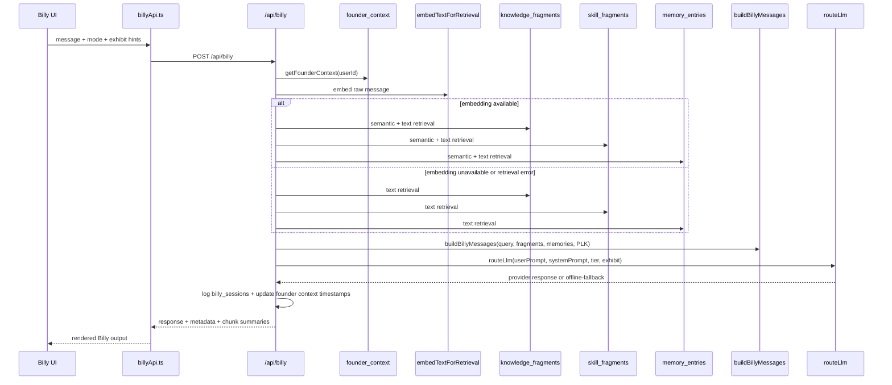
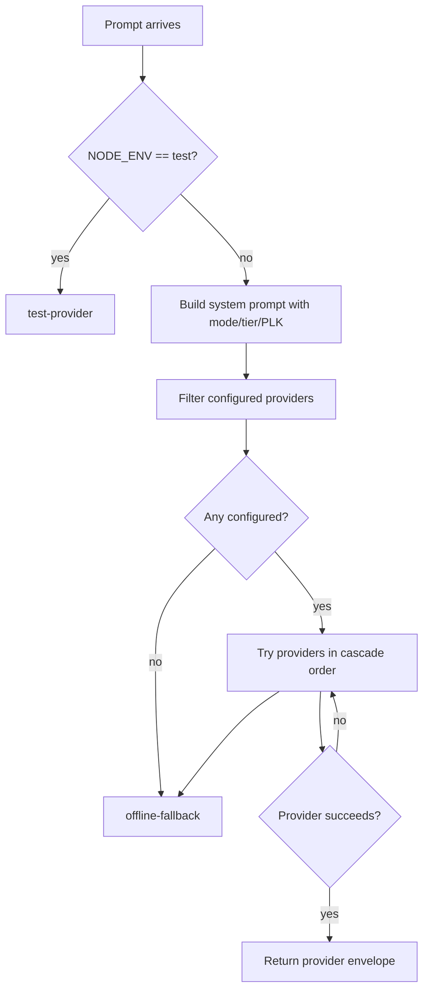

# AIFlow — GestaltView v2

> **Last updated:** 2026-05-07
> **Repo:** `DigitalConsciousness/gestaltview-v2.0`
> **Status:** Active / production-facing runtime

This document describes how AI-adjacent execution actually works in `gestaltview-v2.0` today: Billy bootstrap and chat, retrieval and memory grounding, provider routing, actions-mode prompt envelopes, gate/workbook/persona surfaces, trainer orchestration, and the voice path.

---

## 1. Current AI surfaces

| Surface | Entry point | Retrieval context | Primary execution surface |
|---|---|---|---|
| Billy bootstrap + chat | `client/src/components/BillyLive.tsx` -> `client/src/lib/billyApi.ts` | Yes: knowledge, skills, memory, founder context | `/api/billy` |
| Billy client fallback | `client/src/lib/BillyEngine.ts` via `legacyBillyCall(...)` | Legacy/local only | Browser |
| Persistent memory | dashboard + authenticated callers | Yes: `memory_entries` semantic/text search | `/api/session/memory` |
| Actions API | `/api/actions/*` | No Billy retrieval by default | `routeLlm(...)` |
| Gate, workbook, workspaces, documents | product/package surfaces | Usually prompt-routing or CRUD helpers, not Billy retrieval | `/api/gate/*`, `/api/workbook/*`, `/api/workspaces`, `/api/documents` |
| Consciousness and persona routing | specialized runtime surfaces | Usually prompt envelope only | `/api/consciousness/[surface]`, `/api/persona-chat`, `/api/llm-proxy` |
| Trainer orchestration | `/agent-trainer` -> `client/src/features/agent-trainer/lib/trainerApi.ts` | Structured scenario/run context, not Billy retrieval | `/api/trainer/*` + `server/agent-trainer/*` |
| Voice output | `useBillyVoice`, `/billy/voicestudio` | No Billy retrieval | `/api/voice/billy` |

The most important current facts are:

- Billy is API-first.
- The browser does not primarily talk straight to Gemini for normal Billy use.
- Persistent memory is now a first-class grounded context source beside `knowledge_fragments` and `skill_fragments`.
- Gate, workbook, workspaces, and persona-routing surfaces are intentionally lighter than Billy and usually use dedicated handlers rather than the retrieval stack.
- Trainer AI flows are admin-gated and separate from Billy's user-facing runtime.

---

## 2. Billy request lifecycle

### 2.1 Bootstrap

When Billy loads, `BillyLive.tsx` calls `bootstrapBillySession()` in `client/src/lib/billyApi.ts`, which sends:

```ts
POST /api/billy
{
  bootstrap: true,
  mode: "synthesis" | "chat"
}
```

On bootstrap, `/api/billy`:

1. resolves the caller and optional authenticated user,
2. reads `founder_context` when available,
3. builds a founder-aware opening prompt,
4. calls `routeLlm(...)`,
5. returns a metadata-rich envelope with `retrievalMode: "none"`.

### 2.2 Standard Billy message

Normal Billy messages currently move through this path:



### 2.3 Request and metadata highlights

`/api/billy` accepts the live message plus runtime hints such as:

- `message`
- `mode`
- `section`
- `exhibitDomain`
- `topK`
- `userTier`

Authenticated callers send the Supabase bearer token through `getAuthHeader()`.

The response metadata can currently include:

- `conversationMode`
- `retrievalMode`
- `contextSources`
- `skillSources`
- `memorySources`
- `memoryRetrievalMode`
- `packageFilter`
- `founderSessionActive`
- `founderContext`
- `sessionThread`
- `modePreference`
- `embedBackend`
- `embedModel`

---

## 3. Retrieval and memory grounding

Billy currently grounds responses against three distinct context surfaces:

1. `knowledge_fragments`
2. `skill_fragments`
3. `memory_entries`

### 3.1 Knowledge and skill retrieval

Billy uses:

- `matchKnowledgeFragments(...)`
- `searchKnowledgeFragments(...)`
- `matchSkillFragments(...)`
- `searchSkillFragments(...)`

The resulting chunks are merged with reciprocal-rank fusion, deduplicated, and capped before prompt assembly. Skill chunks are intentionally limited so the knowledge corpus remains the primary context spine.

### 3.2 Persistent memory retrieval

`api/_lib/memory.ts` now gives Billy a user-specific memory channel backed by `memory_entries`.

Key facts:

- retrieval supports semantic + text search
- memory ranking weights `importance` and `pinned` state
- scope and kind filtering are supported
- memory retrieval degrades gracefully to text-only if embeddings are unavailable

This means Billy context is no longer just corpus retrieval plus founder continuity; it can now incorporate a persistent user memory bank as well.

### 3.3 Founder continuity

Billy also reads and returns metadata from `founder_context`, including:

- `currentState`
- `sessionThread`
- `modePreference`
- `confirmedAdult`
- optional PLK snapshot

For normal chat/synthesis requests, the handler updates `last_session_at` and `mode_preference`.

---

## 4. Provider routing

Provider routing is centralized in `api/_lib/llmRouter.ts`.

The current cascade is ordered, not "first arbitrary key wins":

1. `ollama`
2. `groq`
3. `huggingface`
4. `openrouter`
5. `gemini`
6. `anthropic`
7. `openai`

If all configured providers fail, `routeLlm()` returns `offline-fallback`.



### 4.1 Test mode

When `NODE_ENV === "test"`, `routeLlm()` short-circuits to `test-provider`.

### 4.2 Offline fallback

`offline-fallback` is a resilience path, not the preferred architecture. On the client side, `client/src/lib/billyApi.ts` may also fall back to the older in-browser `BillyEngine` path when the API path fails.

---

## 5. Actions API flow

`api/actions/[...path].ts` handles prompt-only or mode-specific flows such as:

- `chat`
- `consciousness/reflect`
- `billy/synthesize`
- `billy/loom`
- `billy/code`
- `bucket-drops`
- `musical-dna/*`
- `tribunal/*`
- `chat` and `consciousness/reflect` are thin prompt-envelope routes
- `api/gate/*`, `api/workbook/*`, `api/workspaces`, and `api/documents` have dedicated handlers and do not route through the actions catch-all

These routes generally:

1. normalize the requested path,
2. validate minimal required fields,
3. route the prompt through `routeLlm(...)`,
4. return JSON envelopes with mode-specific metadata.

They do **not** run Billy's knowledge/skill/memory retrieval pipeline by default.

---

## 6. Trainer AI flow

The trainer lane is a separate AI system from Billy.

Admin-gated trainer calls move through:

- client: `client/src/features/agent-trainer/lib/trainerApi.ts`
- API: `/api/trainer/*`
- orchestration: `server/agent-trainer/orchestrator.ts`
- provider abstraction: `server/agent-trainer/providers.ts`
- worker loop: `worker/trainer/main.ts`

The trainer stack currently:

- synthesizes or loads scenario packs,
- authors structured agent specs,
- runs local safety review and blocking-finding checks,
- persists run state and versions,
- supports approval, rejection, and deploy operations.

The provider layer is separate from Billy's user-facing envelope path. Treat trainer generation as an operator/admin workflow, not as part of normal end-user Billy chat.

---

## 7. Voice path

Billy voice is split between:

- browser hooks such as `useVoiceChat` and `useBillyVoice`
- the route `/billy/voicestudio`
- the ElevenLabs proxy `/api/voice/billy`
- the separate Python worker under `billy_voice/`

The hosted API voice surface is primarily TTS output. The full spoken runtime still spans browser hooks plus the local Python worker.

---

## 8. Related documents

- [`APIFlow.md`](./APIFlow.md)
- [`ArchitecturalStructure.md`](./ArchitecturalStructure.md)
- [`Manifest.md`](./Manifest.md)
- [`CurrentState.md`](./CurrentState.md)
