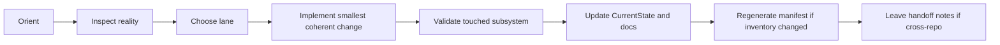
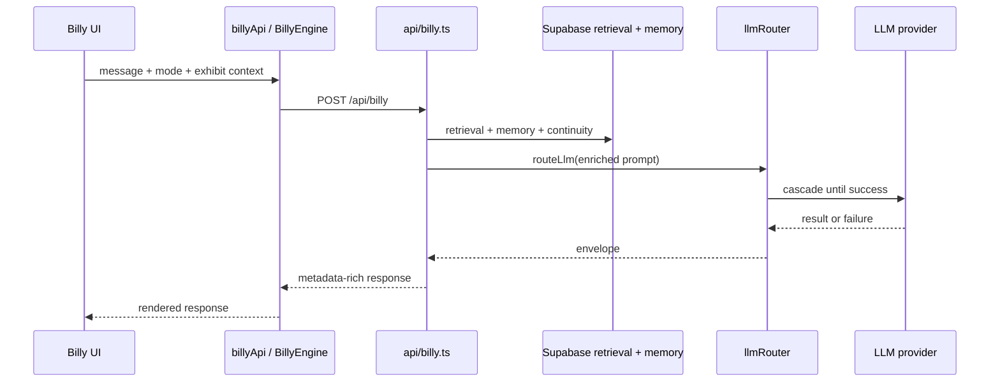
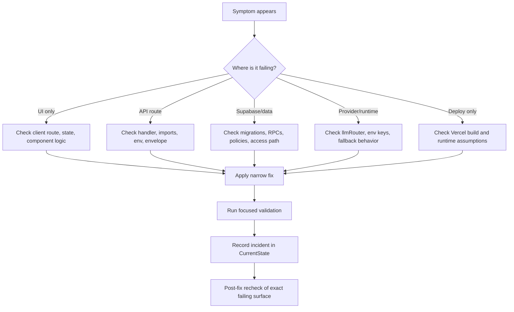

# GestaltView v2 Operator Manual

> **Version:** 2.0 draft  
> **Repo:** `DigitalConsciousness/gestaltview-v2.0`
> **Status:** Active operator field guide  
> **Companion docs:** `docs/PlaybookSpec.md`, `docs/PLAYBOOK_CHECKLIST.md`, `docs/CurrentState.md`, `docs/AIFlow.md`, `docs/APIFlow.md`, `docs/ArchitecturalStructure.md`, `docs/Manifest.md`, `docs/SymbioticWorkflow.md`, `docs/Workflows.md`

---

## 1. What this manual is for

This manual is the practical operating guide for working inside `gestaltview-v2.0`.

It is designed to help a founder, collaborator, or coding agent do five things without dropping threads:

1. orient quickly,
2. change the right layer,
3. validate honestly,
4. externalize state before context drifts,
5. leave the repository more coherent than they found it.

This is a neurodivergent-first manual. That means:

- state is externalized instead of assumed
- work is grouped into clear lanes
- checklists are short and reusable
- drift warnings stay visible
- the next move is easy to find

When this manual conflicts with code, code wins. When it conflicts with older prose, `docs/CurrentState.md` and live runtime files win.

---

## 2. Three ways to use this manual

### Mode A: 5-minute orientation

Read these in order:

1. `README.md`
2. `docs/CurrentState.md`
3. `docs/PLAYBOOK_CHECKLIST.md`
4. the subsystem section in this manual that matches your task

### Mode B: focused subsystem work

Jump straight to the relevant playbook:

- Billy runtime
- account/dashboard/memory
- exhibits and domain lanes
- trainer
- diligence/evidence
- docs/manifest/skills

### Mode C: incident response

Jump to:

- Section 9: incident triage
- Section 10: release and verification
- `docs/CurrentState.md`

---

## 3. Source-of-truth ladder

Use this order whenever surfaces disagree.

1. **Live runtime code**
   - `client/src/**`
   - `api/**`
   - `shared/**`
   - `supabase/**`
   - `vite.config.ts`
   - `vercel.json`
2. **Operational state log**
   - `docs/CurrentState.md`
3. **Architecture and workflow docs**
   - `docs/ArchitecturalStructure.md`
   - `docs/AIFlow.md`
   - `docs/APIFlow.md`
   - `docs/Manifest.md`
   - `docs/SymbioticWorkflow.md`
   - `docs/Workflows.md`
4. **Repository framing docs**
   - `README.md`
   - `COLAB.md`
5. **Generated or archival surfaces**
   - generated manifests
   - older snapshot docs

### Rule of thumb

The wiki is an accelerator, not a constitution. Use it for map-making, then verify against live files.

---

## 4. Terrain atlas

Treat this repo like a city with districts instead of one giant maze.

### 4.1 District map

```mermaid
graph TD
  A[Client Runtime] --> A1[Routes]
  A --> A2[Billy UI]
  A --> A3[Exhibits]
  A --> A4[Dashboard]
  A --> A5[Trainer UI]
  A --> A6[Scaffold + Inner World]

  B[API Runtime] --> B1[Billy]
  B --> B2[Session + Memory]
  B --> B3[Stripe]
  B --> B4[Voice]
  B --> B5[Diligence]
  B --> B6[Trainer]
  B --> B7[Gate + Workbook + Documents]

  C[Shared Logic] --> C1[Billy runtime]
  C --> C2[PLK]
  C --> C3[Tribunal]
  C --> C4[Trainer contracts]

  D[Data Layer] --> D1[Users + Auth]
  D --> D2[Founder context]
  D --> D3[Retrieval]
  D --> D4[Memory bank]
  D --> D5[Trainer tables]

  E[Operations Layer] --> E1[Scripts]
  E --> E2[Docs]
  E --> E3[Skills]
  E --> E4[Manifest]
```



### 4.2 Quick district guide

| District | What it owns | First files to inspect |
|---|---|---|
| Client runtime | routes, UX, page state, Billy UI | `client/src/App.tsx`, `client/src/pages/**`, `client/src/components/**` |
| API runtime | request handling, orchestration, billing, voice, trainer | `api/billy.ts`, `api/_lib/**`, `api/session/**`, `api/gate/**`, `api/workbook/**`, `api/workspaces/**`, `api/documents/index.ts`, `api/trainer/**` |
| Shared logic | prompt shaping, types, tribunal, trainer contracts | `shared/billy/**`, `shared/llm/plk.ts`, `shared/tribunal/**`, `shared/agent-trainer/**` |
| Data layer | schema, RLS, retrieval RPCs, memory, auth-linked state | `supabase/schema.sql`, `supabase/migrations/**`, `api/_lib/supabase.ts` |
| Operations | CLI, health checks, manifests, docs, skills | `scripts/**`, `docs/**`, `skills/**`, `agents/**` |

---

## 5. Neurodivergent operating defaults

These are operational defaults, not decorative philosophy.

### 5.1 Capture before compression

If the task is fuzzy, write down the real problem in concrete language before changing code.

### 5.2 One main spine per pass

A pass should have one main job:

- fix a bug
- add a route
- align docs
- harden a policy
- improve a trainer flow

Coupled changes are fine. Unrelated adventures in one backpack are not.

### 5.3 Externalize state

When repo reality changes, update the visible memory of the repo:

- `docs/CurrentState.md`
- related architecture/workflow docs
- manifest outputs if inventory changed materially
- skills/agents if discoverability changed

If collaboration continuity matters across sessions, also record the operator preference or shared working rule in retrievable memory instead of trusting chat history to carry it.

### 5.4 Prefer reversible moves

Choose changes that are easy to reason about, easy to validate, and easy to back out.

### 5.5 Say exactly what was validated

Never write victory prose over untested ground.

---

## 6. The standard operating loop



### Step 1. Orient

Read:

- `README.md`
- `docs/CurrentState.md`
- `docs/Workflows.md`
- the local subsystem anchors

### Step 2. Inspect reality

Verify current code, route behavior, schema, and operational scripts before changing prose or implementation.

### Step 3. Choose lane

Classify the task:

- Billy runtime
- account/dashboard/memory
- exhibit lane
- trainer
- diligence/evidence
- docs/manifest/skills
- deployment/incident

### Step 4. Implement

Make the smallest coherent change set that actually solves the problem.

### Step 5. Validate

Run the lightest meaningful checks that prove the touched behavior.

### Step 6. Update visible memory

Document:

- what changed
- why it changed
- what was validated
- what remains risky

### Step 7. Regenerate manifest when needed

If routes, APIs, docs, scripts, or migrations changed materially:

```bash
python3 scripts/generate_repo_manifest.py
```

### Step 8. Handoff if needed

If another repo owns the next move, say so explicitly.

---

## 7. Validation matrix

| Change type | Minimum validation |
|---|---|
| Docs only | verify claims against live files; fix stale references; do not invent tests |
| Client/runtime | `npm run build` and touched route/component sanity checks |
| API/Billy | `npm run build` plus focused API/Vitest checks where available |
| Supabase/schema | inspect schema + migrations + affected access paths |
| Trainer | align UI, API, shared, server, worker, and Supabase lineage |
| Deployment incident | re-check the exact failing endpoint or route after the fix |

### Important note

There is a bundled umbrella script at `scripts/run-comprehensive-tests.sh`, but the safest operator habit is still to verify the specific underlying commands and scripts the touched subsystem actually depends on.

---

## 8. Subsystem playbooks

## 8.1 Billy runtime playbook

Use when touching:

- `api/billy.ts`
- `api/_lib/llmRouter.ts`
- `api/_lib/memory.ts`
- `client/src/lib/billyApi.ts`
- `client/src/lib/BillyEngine.ts`
- `client/src/components/Billy*`
- `shared/billy/runtime.ts`
- retrieval, founder continuity, memory grounding, bucket drops, voice-adjacent chat behavior

### Mental model

Billy is not one file. It is a chain:



### What to check first

1. Is the failure in UI state, API plumbing, retrieval, memory, provider routing, or fallback?
2. Is the response wrong, or is the wrong layer responding?
3. Is degraded mode replacing a valid server response?
4. Is Billy over-performing scripted empathy instead of responding cleanly?
5. Are durable facts being captured or retrieved when they should be?
6. Are the docs describing the runtime honestly?

### Default validation

- `npm run build`
- focused API tests if the route changed
- inspect fallback behavior, especially `offline-fallback`
- verify authenticated memory capture metadata if Billy memory extraction changed
- verify `guest-user` remains a persistence no-op unless that rule was intentionally changed
- verify metadata still tells the truth

### Done means

- the user gets a coherent response
- retrieval and memory are context, not accidental raw output
- durable memory capture is selective and does not turn every turn into a memory write
- fallback behavior is explicit
- docs reflect the current provider and memory posture

---

## 8.2 Account + dashboard + memory playbook

Use when touching:

- `client/src/contexts/AuthContext.tsx`
- `client/src/pages/SignIn.tsx`
- `client/src/pages/AuthCallback.tsx` (legacy compatibility redirect)
- `client/src/pages/DashboardPage.tsx`
- `api/session/**`
- `api/_lib/memory.ts`
- founder/admin bootstrap logic
- persistent memory behavior

### What to check first

1. Is the issue auth loading, session restoration, redirect memory, profile hydration, dashboard state, or persistent memory behavior?
2. Is the problem browser-side or server-backed?
3. Did a migration or bootstrap rule change user state?
4. Is continuity supposed to live in user memory, shared collaboration memory, or both?

### Default validation

- signed-out load
- sign-in path
- callback path
- `/dashboard` access behavior
- memory list/search/create/delete behavior when relevant
- pinned shared-memory retrieval behavior when collaboration continuity is involved
- founder/admin edge cases if relevant

### Done means

- users are not trapped in loading state
- redirect return works
- tier/admin state is legible
- dashboard reflects server truth
- memory behavior stays aligned between UI, API, and Billy grounding
- shared collaboration memories can be retrieved even when exact semantic wording drifts

---

## 8.3 Exhibits playbook

Use when touching:

- `client/src/data/exhibits.ts`
- `client/src/components/exhibits/**`
- `client/src/hooks/useBillyExhibitBridge.ts`
- exhibit pages such as ADHD, recovery, memory care, musical DNA, and developer lanes

### What to check first

1. Is the issue route wiring, exhibit definition, bridge payload, or Billy scoping?
2. Is this a visual bug or a domain-context bug?
3. Does the exhibit need PLK or Never Look Away protection?

### Default validation

- route opens the intended exhibit
- bridge context actually reaches Billy
- leaving the exhibit clears context appropriately
- sensitive-domain guardrails still make sense

### Done means

- the lane feels scoped instead of generic
- Billy receives the right domain cues
- the exhibit can be used without hidden state leaks

---

## 8.4 Agent trainer playbook

Use when touching:

- `/agent-trainer`
- `client/src/features/agent-trainer/**`
- `api/trainer/study-sources.ts`
- `api/trainer/**`
- `server/agent-trainer/**`
- `server/agent-trainer/study-sources.ts`
- `shared/agent-trainer/**`
- `worker/trainer/main.ts`
- trainer migrations and policies
- `knowledge_fragments`, `memory_entries`, and trainer lineage tables when the data path is involved

### What to check first

1. Is the change about runs, scenarios, queueing, scoring, approval, deploy, or generated outputs?
2. Which layers must stay in lockstep: UI, API, shared contracts, server orchestration, worker, Supabase?
3. Did discoverability change in docs, skills, or agent metadata?
4. Is the run generic because the study pack is weak, or because the authoring path ignored the study pack?
5. Are live corpus sources, local subagent specs from `agents/categories/**`, local reference materials from `agents/references/**`, collaboration memory, and synthesized understanding all reaching the stages that need them?

### Expert-context default

The trainer is strongest when it studies before it writes.

Prefer this order of operations:

1. choose live study sources from `knowledge_fragments`
2. add relevant local subagent specs when the repo already contains a useful specialist pattern
3. add relevant `agents/references/**` source materials when the agent depends on tool use, function calling, MCP, routing, or memory patterns
4. add a concrete `studyFocus`
5. include relevant shared collaboration memories when continuity matters
6. verify the assembled study pack produces synthesized understanding, not just raw excerpts
7. only then judge the authored agent on scenarios, policy, and deploy readiness

When local subagent families are already known, prefer category-aware reference bundles over raw keyword matching alone. For example, meta-orchestration agents should bias toward routing and memory/reference bundles even if the brief is phrased generically.

### Default validation

- list study sources from the trainer source picker when that surface changed
- verify local subagent entries from `agents/categories/**` appear when catalog discovery changed
- verify relevant `agents/references/**` bundles appear when the local reference lane changed
- trace one run from submission to persistence when practical
- inspect whether the persisted stage payloads include `studySourceFiles`, `studyFocus`, and synthesized understanding when that path changed
- verify shared collaboration memory is present in the study pack when expected
- verify approval/rejection/deploy semantics if touched
- verify policies if tables changed
- confirm deterministic artifact expectations still hold

### Done means

- trainer flow is coherent end to end
- run lineage is traceable
- policies are explicit
- the trainer can study live corpus context, repo-local subagent patterns, and repo-local tool/function reference material instead of relying on generic prompt assembly
- synthesized understanding actually changes curriculum, scenarios, and authoring behavior
- the trainer remains a first-class documented subsystem

---

## 8.5 Diligence and evidence playbook

Use when touching:

- `api/diligence.ts`
- `api/diligence/ots.ts`
- `client/src/components/DiligenceExplorer/**`
- `Diligence_Reports/**`
- evidence-facing UI and OTS surfaces

### What to check first

1. Is the issue data ingestion, parsing, rendering, or proof display?
2. Is the change in canonical evidence files or presentation only?
3. Are blockchain/OTS labels still truthful?

### Default validation

- verify the underlying files exist and parse
- verify UI mode still maps to actual data
- avoid claiming verification paths that are not present

### Done means

- the evidence layer remains legible
- data sources are explicit
- trust signals are not exaggerated

---

## 8.6 Docs + manifest + skills playbook

Use when touching:

- `docs/**`
- `skills/**`
- `agents/**`
- generated manifest outputs

### What to check first

1. Which doc is canonical, operational, generated, or archival?
2. Did runtime reality change, or only the explanation of it?
3. Are skill and agent catalogs still discoverable from their official surfaces?
4. Did docs/routes/scripts/migrations change enough to regenerate the manifest?

### Default validation

- compare claims against live code
- fix stale route/API/file references
- regenerate manifest outputs if inventory changed materially
- update `docs/CurrentState.md` if repo reality changed

### Done means

- docs reduce confusion instead of creating a second reality
- discoverability improves
- manifest outputs are current when they should be
- future operators know where to start

---

## 9. Incident triage

Use this when production, preview, or local behavior breaks.



### Incident rules

- classify blast radius first
- fix the narrowest broken layer first
- validate the exact failing endpoint or route
- record dates and symptoms precisely
- do not let a temporary workaround become invisible doctrine

---

## 10. Release and verification

### Pre-release gate

1. touched subsystem behaves as intended
2. minimum meaningful validation actually ran
3. docs are updated where needed
4. `docs/CurrentState.md` reflects the pass
5. manifest outputs are refreshed if inventory changed materially
6. any cross-repo next step is written down

### Post-release spot checks

| Area | Recheck |
|---|---|
| Billy changes | `/api/billy`, `/api/billy-health`, affected UI surface |
| Auth changes | `/login`, `/auth/callback`, `/dashboard` |
| Memory changes | `/api/session/memory` plus affected dashboard/Billy flow |
| Shared continuity changes | pinned/shared memory retrieval plus affected Billy/trainer flow |
| Pricing/billing | pricing page, checkout start, success path |
| Trainer | study-source listing, run submission, detail visibility, approval/deploy path |
| Exhibits | affected route plus Billy scoping inside it |

---

## 11. Cross-repo handoff card

Use this template whenever the next move belongs elsewhere.

```md
- Target repo:
- Why it matters:
- Likely affected areas:
- What this repo now assumes:
- Recommended next action:
- Status in this repo: mirrored / referenced only / pending
```

### Rule

Never imply a sibling repo was updated unless it was actually inspected and changed.

---

## 12. Drift watchlist

### 12.1 Provider posture drift

Higher-level prose can lag behind `api/_lib/llmRouter.ts`.

**Operational rule:** `api/_lib/llmRouter.ts` is runtime truth.

### 12.2 Manifest drift

Generated manifest outputs are useful, but they are snapshots.

**Operational rule:** regenerate after material inventory changes; live files still win.

### 12.3 Wiki confidence drift

The complete wiki is highly useful, but parts of it can go stale faster than code.

**Operational rule:** use the wiki for map-making, then confirm against live files.

### 12.4 Validation wrapper drift

Umbrella scripts can drift from the exact package scripts or handler layout.

**Operational rule:** verify the underlying commands before trusting a convenience wrapper as the sole proof.

---

## 13. Weekly maintenance rhythm

### Monday: reality sync

- review `docs/CurrentState.md`
- review recent runtime changes
- fix obvious doc drift

### Midweek: subsystem hardening

- choose one unstable lane
- run focused validation
- reduce one class of ambiguity

### Friday: handoff hygiene

- update state logs
- update docs/skills if discoverability changed
- refresh manifest outputs when inventory changed
- leave next-step breadcrumbs for future-you

---

## 14. Definition of done

A pass is done when:

1. the real issue is resolved or honestly narrowed
2. validation appropriate to the subsystem actually ran
3. visible repo memory was updated
4. drift was reduced, not multiplied
5. the next operator can tell what happened without reading tea leaves

---

## 15. Fast route index

These are the high-traffic routes worth remembering during triage.

| Route | Primary surface |
|---|---|
| `/` | Home |
| `/billy` | BillyLive |
| `/billy/voicestudio` | Billy Voice Studio |
| `/engine` | EnginePage |
| `/record` | DiligenceExplorer |
| `/pricing` | Pricing |
| `/signup` | Signup billing bridge |
| `/login` | SignIn |
| `/dashboard` | DashboardPage |
| `/agent-trainer` | AgentTrainerPage |
| `/musical-dna` | MusicalDNAPage |
| `/adhd-powerup` | ADHDPowerUpStation |
| `/alzheimers-legacy` | AlzheimersLegacyExhibit |
| `/addiction-recovery` | AddictionRecoveryExhibit |
| `/bucket-drops` | BucketDropsPage |
| `/symbiocoder` | SymbioCoderDemo |
| `/tribunal` | TribunalPage |

---

**© 2026 Keith Soyka / GestaltView — All Rights Reserved**
