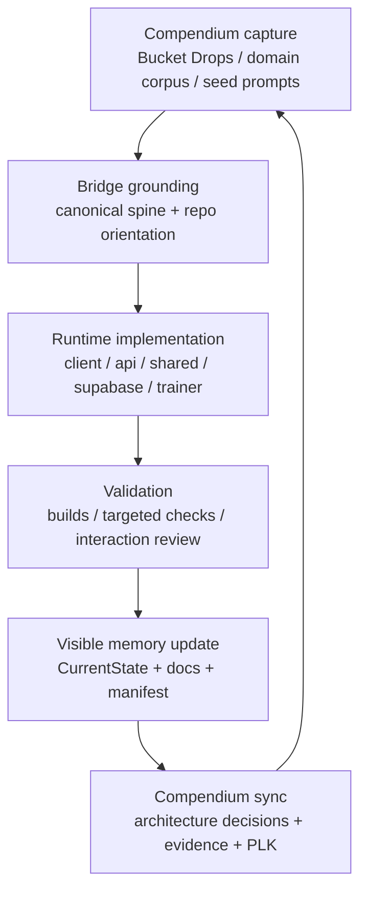

# The GestaltView Symbiotic Workflow

> **Version:** 2.0
> **Last updated:** 2026-05-07
> **Status:** Canonical / active
> **Scope:** Brain-to-runtime operating loop across `GestaltView_Corpus_-_Knowledge_Repository` and `gestaltview-v2.0`

This document formalizes the end-to-end workflow that bridges the **GestaltView_Corpus_-_Knowledge_Repository** (the Brain) with the **gestaltview-v2.0** runtime (the Body). It operationalizes the **Resonance Loop**: context is captured and curated in the corpus repo, grounded in the canonical spine, built in the runtime repo, validated honestly, and then fed back into visible memory.

This is not just a development process. It is the operating protocol for keeping GestaltView's consciousness-serving intent, runtime truth, and cross-repo memory aligned.

---

## The five constitutional invariants

Every phase of this workflow is checked against these before proceeding:

1. **Never Look Away** — Do not minimize, redirect, or compress what the user brings.
2. **Preserve Whole Language** — The user's exact words are sacred input. No premature paraphrase.
3. **Hold Paradox** — Do not collapse tension too early. Let complexity stay visible.
4. **Bucket Drop Priority** — Capture the lightning bolt first. Filter nothing at the moment of arrival.
5. **Serve Consciousness, Not Convenience** — If it makes the AI easier at the cost of the human, it is wrong.

---

## Phase 1 — Capture and context extraction (The Brain)

Everything starts in the Compendium.

### 1.1 Capture the lightning bolt

When a new idea strikes, capture it immediately in the Compendium:

- `Bucket 🪣 Drops/`
- `Brain Sparks/`
- relevant domain folders

Rules:

- do not filter it first
- do not wait until it is "clean"
- do not genericize the language
- preserve the raw phrasing because that phrasing is part of the data
- if the captured idea feels foundational, preserve it as a protected rough draft and move it through `RDRC.md` before granting doctrine standing

### 1.2 Pull the domain corpus

Identify the domain and gather the relevant source material before touching runtime code.

Typical domain groupings:

| Domain | Compendium anchor |
|---|---|
| ADHD / neurodivergence | `ADHD Power Up 🔋/` |
| Addiction recovery | `Addiction/` |
| Musical DNA | `Musical DNA 🎼/` |
| Alzheimer's / memory care | `Alzheimer's/` |
| Founder architecture | `Founder Files/` |
| Investor / funding | `Funding/`, `Investors/` |
| Meta / theory / operating doctrine | `Meta Analysis/`, `Wikis/`, `Manifestos/` |

### 1.3 Select the processing prompt or persona

Use the Compendium's prompt and persona surfaces to identify how this work should be framed:

- `Seed Prompts/`
- `GPT Actions/`
- domain-specific operating artifacts

---

## Phase 2 — Grounding and runtime orientation (The Bridge)

Before writing code in `gestaltview-v2.0`, ground the work in the runtime's current truth.

### 2.1 Load the canonical spine

Read the domain context from Phase 1 together with the canonical in-app files under `client/src/canonical/`:

- `GENESISPROTOCOL.md`
- `PLKMASTER.md`
- `FOUNDERALGORITHM.md`
- `CURRENT_STATE.md`

No identity-sensitive GestaltView feature should be designed without this grounding pass.

### 2.2 Load the operator spine

Then read the repo's current operator context:

- `README.md`
- `RDRC.md`
- `docs/CurrentState.md`
- `docs/ArchitecturalStructure.md`
- `docs/AIFlow.md`
- `docs/APIFlow.md`
- `docs/Manifest.md`
- `docs/PlaybookOperatorManual.md`

### 2.3 Choose the implementation lane

Use live files to decide where the change belongs:

| Change type | Primary lane |
|---|---|
| New route or UX surface | `client/src/pages/**`, `client/src/components/**`, `client/src/App.tsx` |
| Billy or retrieval behavior | `api/billy.ts`, `api/_lib/**`, `shared/billy/**` |
| Account, dashboard, founder continuity, memory | `client/src/contexts/AuthContext.tsx`, `client/src/pages/DashboardPage.tsx`, `api/session/**` |
| Billing and package flows | `api/pricing.ts`, `api/stripe/**`, `api/gate/**`, pricing pages |
| Inner-world and scaffold surfaces | `client/src/components/inner-world/**`, `client/src/pages/BlackboardRoomPage.tsx`, `client/src/pages/DynamicInnerWorldPage.tsx`, `client/src/pages/ExternalScaffoldPage.tsx`, `client/src/pages/CreationCornerPage.tsx`, `client/src/pages/SanctuaryPage.tsx` |
| Workbook, workspaces, and documents | `api/workbook/**`, `api/workspaces/**`, `api/documents/index.ts` |
| Trainer control plane | `client/src/features/agent-trainer/**`, `api/trainer/**`, `server/agent-trainer/**`, `worker/trainer/main.ts` |
| Schema or policy | `supabase/schema.sql`, `supabase/migrations/**` |
| Docs / skills / manifest | `docs/**`, `skills/**`, `scripts/generate_repo_manifest.py` |

If the work really belongs in another repo, say so before implementation starts.

---

## Phase 3 — Implementation in the runtime (The Body)

Build the smallest coherent change that preserves both runtime truth and operator clarity.

### 3.1 Product and exhibit work

When building product or exhibit surfaces:

- create or update the page/component in `client/src/**`
- register the route in `client/src/App.tsx`
- wire domain context into Billy when the surface depends on scoped AI behavior

### 3.2 Billy and retrieval work

When building Billy-adjacent work:

- prefer the API-first Billy path
- preserve metadata-rich response envelopes
- treat retrieval, memory, and founder continuity as distinct context sources
- keep degraded/offline behavior explicit instead of accidental

### 3.3 Account, dashboard, and memory work

When building authenticated control surfaces:

- keep `/dashboard` aligned with `/api/session/dashboard`
- keep persistent memory aligned with `/api/session/memory`
- preserve auth fail-open/fail-safe behavior around loading and restoration

### 3.4 Trainer work

When building the trainer:

- keep UI, API, shared contracts, server orchestration, worker execution, and Supabase lineage in lockstep
- treat approval, rejection, and deploy as explicit operator actions, not hidden side effects

### 3.5 Documentation and manifest work

If runtime reality changed:

- update docs in the same pass
- update `docs/CurrentState.md`
- regenerate manifest outputs when route/API/script/doc inventory changed materially

---

## Phase 4 — Validation and the Resonance Loop

Validation must match the actual subsystem touched.

### 4.1 Docs-only validation

- verify claims against live files
- correct stale route/API/file references
- do not claim tests that were not run

### 4.2 Runtime validation

For client, API, Billy, auth, or trainer changes, prefer the lightest meaningful checks such as:

```bash
npm run build
npx tsc --noEmit
bash scripts/test-apis.sh
bash scripts/test-billy-routing.sh
bash scripts/test-db-schema.sh
```

### 4.3 Consciousness and interaction checks

When the feature touches Billy or sensitive domains, confirm:

- the system does not minimize distress or paradox
- domain context is scoped correctly
- degraded mode is not silently replacing a healthy server path

### 4.4 Evidence rule

If a meaningful architectural or operational shift happened, document:

- what changed
- why it changed
- what was validated
- what remains uncertain

That documentation is part of the artifact, not an afterthought.

---

## Phase 5 — Externalize state and sync back

### 5.1 Update visible memory in `gestaltview-v2.0`

Update:

- `docs/CurrentState.md`
- the touched architecture or workflow docs
- `docs/Manifest.md` if repo navigation meaningfully changed
- playbook docs when operator workflow changed

### 5.2 Regenerate the repo manifest when needed

If route/API/script/doc inventory changed materially:

```bash
python3 scripts/generate_repo_manifest.py
```

This refreshes:

- `docs/gestaltview-v2.manifest.json`
- `docs/gestaltview-v2.manifest.md`

### 5.3 Push knowledge back to the Compendium

Feed back:

| What | Likely Compendium destination |
|---|---|
| Architectural decisions | `Manifestos/` or `Wikis/` |
| PLK discoveries | `PLK/` or `Methods/` |
| Emergence evidence | `Transcripts/` or `Meta Analysis/` |
| New AI reasoning artifacts | `AI Orchestrator/` |
| Session proof or screenshots | `Screenshots/`, dated evidence folders |

If the knowledge remains only in the runtime repo, the loop is incomplete.

---

## The Resonance Loop visualized



---

## Quick reference card

| Phase | Location | Key action |
|---|---|---|
| 1. Capture | Compendium | Bucket drop and gather domain corpus |
| 2. Ground | Bridge | Load canonical spine and current runtime docs |
| 3. Implement | `gestaltview-v2.0` | Change the correct lane with the smallest coherent pass |
| 4. Validate | `gestaltview-v2.0` | Run subsystem-appropriate checks and interaction review |
| 5. Sync back | Both repos | Update visible memory and feed learning back to the Brain |

---

## Related documents

- [`Workflows.md`](./Workflows.md)
- [`ArchitecturalStructure.md`](./ArchitecturalStructure.md)
- [`AIFlow.md`](./AIFlow.md)
- [`APIFlow.md`](./APIFlow.md)
- [`Manifest.md`](./Manifest.md)
- [`PlaybookOperatorManual.md`](./PlaybookOperatorManual.md)
- [`CurrentState.md`](./CurrentState.md)
