# faagestalt-web/Creation_Corner Wiki

Version: 1

## Overview

### Introduction to Creation Corner

<details>
<summary>Relevant source files</summary>

The following files were used as context for generating this wiki page:

- [CreationCorner.txt](https://github.com/faagestalt-web/Creation_Corner/blob/main/CreationCorner.txt)
- [ultimate_creation_corner_v2.tsx--- Ultimate Creation Corner v2.0 - Consciousness to Masterpiece Synthesizer-.txt](https://github.com/faagestalt-web/Creation_Corner/blob/main/ultimate_creation_corner_v2.tsx--- Ultimate Creation Corner v2.0 - Consciousness to Masterpiece Synthesizer-.txt)
- [creationcornerengine.py (1).txt](https://github.com/faagestalt-web/Creation_Corner/blob/main/creationcornerengine.py (1).txt)
- [creation_corner.py](https://github.com/faagestalt-web/Creation_Corner/blob/main/creation_corner.py)
- [creation_corner (1).py](https://github.com/faagestalt-web/Creation_Corner/blob/main/creation_corner (1).py)
</details>

# Introduction to Creation Corner

Creation Corner is a sophisticated synthesis module within the GestaltView ecosystem designed to transform multi-modal "chaotic" inputs—such as raw thoughts, emotional markers, and media—into structured, imaginative artifacts. It functions as a "Consciousness to Masterpiece Synthesizer," allowing users to visualize and manifest their inner world through AI-driven generation of text, images, videos, and complex cognitive maps.

The system bridges the gap between raw human consciousness and tangible creative outputs by utilizing a multi-stage pipeline. This pipeline includes chaos analysis, ethical validation via an AI "Tribunal," and personalization through the Personal Language Key (PLK) to ensure that the generated artifacts resonate authentically with the user's unique voice.
Sources: [ultimate_creation_corner_v2.tsx--- Ultimate Creation Corner v2.0 - Consciousness to Masterpiece Synthesizer-.txt:1-5](), [creationcornerengine.py (1).txt:1-6]()

## System Architecture

The Creation Corner architecture follows a client-server model, integrating a React-based frontend with a FastAPI backend and a specialized Python synthesis engine.

### High-Level Architecture Flow
This diagram illustrates the flow of data from the initial user input through the synthesis pipeline to the final artifact delivery.

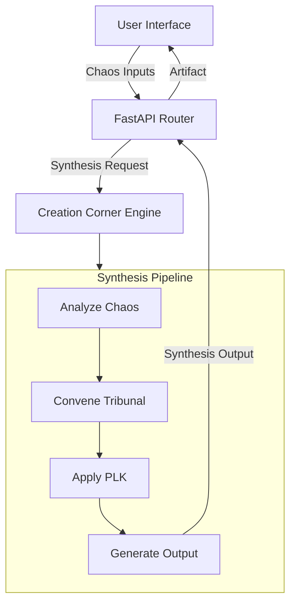
```mermaid
flowchart TD
    User[User Interface] -->|Chaos Inputs| API[FastAPI Router]
    API -->|Synthesis Request| Engine[Creation Corner Engine]
    
    subgraph Engine_Pipeline [Synthesis Pipeline]
        direction TB
        Analyze[Analyze Chaos] --> Tribunal[Convene Tribunal]
        Tribunal --> PLK[Apply PLK]
        PLK --> Gen[Generate Output]
    end
    
    Engine --> Engine_Pipeline
    Gen -->|Synthesis Output| API
    API -->|Artifact| User
```
Sources: [creation_corner (1).py:15-26](), [creationcornerengine.py (1).txt:91-104]()

## Core Components

### 1. Frontend Interfaces
The system provides two primary interfaces for interaction:
*   **Creation Corner (Standard):** A React component for basic artifact generation (stories, pitch decks, images, videos) using the `geminiService`.
*   **Ultimate Creation Corner v2.0:** A more advanced interface that supports "Chaos Inputs" (Bucket Drops), emotional markers (e.g., 'inspired', 'overwhelmed'), and synthesis style selection.

Sources: [CreationCorner.txt:13-33](), [ultimate_creation_corner_v2.tsx--- Ultimate Creation Corner v2.0 - Consciousness to Masterpiece Synthesizer-.txt:48-75]()

### 2. Synthesis Engine (`CreationCornerEngine`)
The engine is responsible for the heavy lifting of transforming raw data into structured artifacts. It supports various input types and manages the lifecycle of a synthesis request.

| Component | Functionality |
| :--- | :--- |
| **Chaos Analysis** | Scans multi-modal inputs (text, audio, images) for themes and patterns. |
| **Tribunal** | A multi-perspective AI validation step that provides ethical and moral clearance. |
| **PLK Application** | Injects Personal Language Key data to personalize the narrative voice. |
| **Journey Integration** | Anchors the created artifact into the user's historical "journey" or database. |

Sources: [creationcornerengine.py (1).txt:46-90]()

### 3. Daily Journey Synthesizer
A specialized sub-module that aggregates a user's daily activity, emotional sequences, and insights to produce a "Daily Journey" summary. This involves creating visual narratives like mood maps and timelines alongside a textual summary.
Sources: [creationcornerengine.py (1).txt:114-159]()

## Data Models and Types

### Artifact Types and Synthesis Styles
Creation Corner supports a wide variety of output formats and creative directions.

| Category | Available Options |
| :--- | :--- |
| **Artifact Types** | mind-map, document, pitch-deck, image, video, poem, code, essay, brainstorm, daily-journey, emotional-heatmap, narrative-arc |
| **Synthesis Styles** | convergent, divergent, analytical, revolutionary, therapeutic |

Sources: [ultimate_creation_corner_v2.tsx--- Ultimate Creation Corner v2.0 - Consciousness to Masterpiece Synthesizer-.txt:19-20](), [creation_corner (1).py:35-41]()

### Backend Data Structures
The engine uses typed dataclasses to ensure consistency across the pipeline:
*   `ChaosInput`: Handles `text_notes`, `bucket_drops`, `tribunal_insights`, and media paths (audio, image, video).
*   `SynthesisRequest`: Contains `user_id`, `chaos_inputs`, `output_type`, and `personalization` (PLK).
*   `SynthesisOutput`: Returns the final `content` alongside `visual_elements` and `metadata`.

Sources: [creationcornerengine.py (1).txt:19-44]()

## Synthesis Logic Flow

The synthesis process is triggered via a POST request to the `/api/creation-corner/synthesize` endpoint.

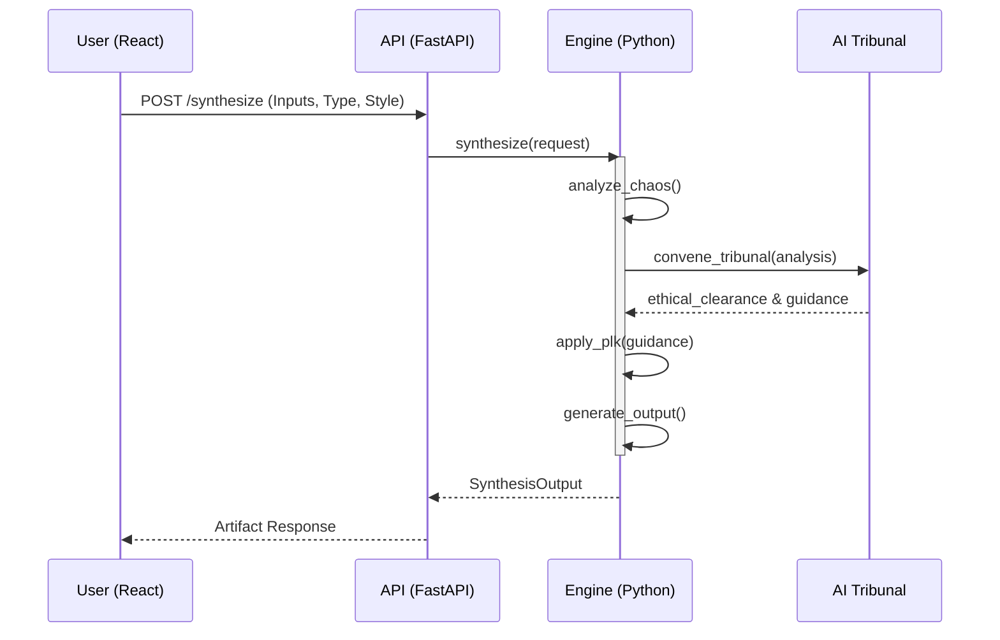
```mermaid
sequenceDiagram
    participant U as User (React)
    participant A as API (FastAPI)
    participant E as Engine (Python)
    participant T as AI Tribunal
    
    U->>A: POST /synthesize (Inputs, Type, Style)
    A->>E: synthesize(request)
    activate E
    E->>E: analyze_chaos()
    E->>T: convene_tribunal(analysis)
    T-->>E: ethical_clearance & guidance
    E->>E: apply_plk(guidance)
    E->>E: generate_output()
    deactivate E
    E-->>A: SynthesisOutput
    A-->>U: Artifact Response
```
Sources: [creation_corner (1).py:24-27](), [creationcornerengine.py (1).txt:91-104]()

### Prompt Construction
When the engine synthesizes an artifact, it constructs a detailed prompt by concatenating the title, constraints, and inputs (including emotional markers) before passing it to the underlying LLM (e.g., Gemini or OpenAI).

```python
# creation_corner.py:20-30
prompt = (
    f"{title}"
    f"Artifact Type: {req.artifact_type}\n"
    f"Style: {req.style}\n"
    f"{constraints}"
    f"Inputs:\n{inputs}\n\n"
    f"Task: Synthesize a {req.artifact_type} in a {req.style} style from the inputs."
)
```
Sources: [creation_corner.py:20-30]()

## API Endpoints

The system exposes a RESTful API for frontend integration.

| Endpoint | Method | Description |
| :--- | :--- | :--- |
| `/api/creation-corner/synthesize` | `POST` | Primary endpoint to generate a new artifact. Requires an API Key. |
| `/api/creation-corner/types` | `GET` | Returns lists of supported artifact types and synthesis styles. |

Sources: [creation_corner (1).py:24-42]()

## Summary
Introduction to Creation Corner establishes a robust framework for converting the "chaos" of human thought into structured creative output. By combining a multi-modal input engine with ethical validation (Tribunal) and stylistic personalization (PLK), it provides a unique system for consciousness visualization within the larger project ecosystem.

### Getting Started

<details>
<summary>Relevant source files</summary>

The following files were used as context for generating this wiki page:

- [creation\_corner.py](https://github.com/faagestalt-web/Creation_Corner/blob/main/creation_corner.py)
- [ultimate\_creation\_corner\_v2.tsx--- Ultimate Creation Corner v2.0 - Consciousness to Masterpiece Synthesizer-.txt](https://github.com/faagestalt-web/Creation_Corner/blob/main/ultimate_creation_corner_v2.tsx---%20Ultimate%20Creation%20Corner%20v2.0%20-%20Consciousness%20to%20Masterpiece%20Synthesizer-.txt)
- [CreationCorner.txt](https://github.com/faagestalt-web/Creation_Corner/blob/main/CreationCorner.txt)
- [creationcornerengine.py (1).txt](https://github.com/faagestalt-web/Creation_Corner/blob/main/creationcornerengine.py%20%281).txt)
- [creation\_corner (1).py](https://github.com/faagestalt-web/Creation_Corner/blob/main/creation_corner%20%281).py)
</details>

# Getting Started

Creation Corner is a multi-modal synthesis system designed to transform "chaotic" user inputs—including text, audio, and imagery—into structured artifacts such as documents, mind maps, and videos. It acts as a bridge between raw consciousness and tangible creative masterpieces by utilizing AI synthesis, Personal Language Keys (PLK), and ethical validation through a "Tribunal" system.

The system is architected as a full-stack solution featuring a React-based frontend for capturing "chaos inputs," a FastAPI-based REST layer, and a Python synthesis engine that handles multi-modal data processing and integration into the user's "Daily Journey."
Sources: [ultimate\_creation\_corner\_v2.tsx:1-10](), [creationcornerengine.py (1).txt:1-10]()

## System Architecture

The Creation Corner architecture follows a request-response pattern where raw inputs (Bucket Drops) are processed through several layers of refinement before being rendered as artifacts.

### Data Flow Overview
The flow begins with the user providing "Chaos Inputs" in the UI. These are sent to the backend where they undergo thematic analysis, ethical clearance by the Tribunal, and narrative personalization via the Personal Language Key (PLK).

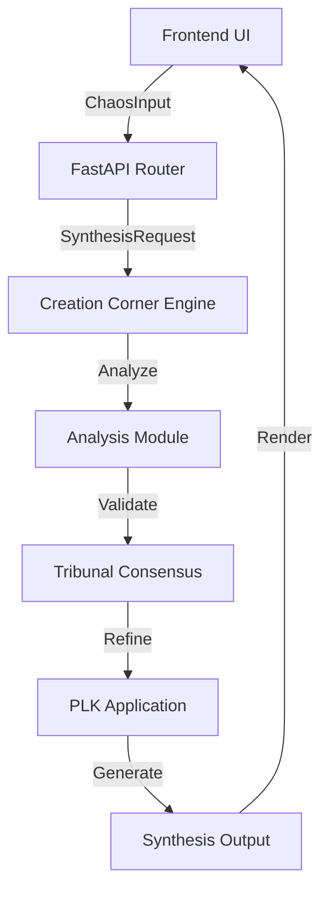
```mermaid
graph TD
    UI[Frontend UI] -->|ChaosInput| API[FastAPI Router]
    API -->|SynthesisRequest| CCE[Creation Corner Engine]
    CCE -->|Analyze| AN[Analysis Module]
    AN -->|Validate| TRB[Tribunal Consensus]
    TRB -->|Refine| PLK[PLK Application]
    PLK -->|Generate| OUT[Synthesis Output]
    OUT -->|Render| UI
```
This diagram illustrates the progression from raw data to a synthesized masterpiece.
Sources: [ultimate\_creation\_corner\_v2.tsx:43-58](), [creationcornerengine.py (1).txt:103-112]()

## Frontend Integration

The frontend provides the interface for "Bucket Drops"—raw thoughts, feelings, and chaotic ideas. It supports various artifact types and synthesis styles to guide the AI's creative direction.

### Key Components
*   **UltimateCreationCorner**: The primary React container managing state for chaos inputs, synthesis progress, and artifact display.
*   **CreationCorner (MVP)**: A simplified version focused on Gemini-based service calls for text, image, and video generation.

### Artifact Selection
Users can select from a wide range of output formats and synthesis styles:

| Feature | Options | Source |
| :--- | :--- | :--- |
| **Artifact Types** | mind-map, image, video, poem, daily-journey, pitch-deck, code, essay | [ultimate\_creation\_corner\_v2.tsx:23]() |
| **Synthesis Styles** | convergent, divergent, analytical, revolutionary, therapeutic | [ultimate\_creation\_corner\_v2.tsx:24]() |
| **Input Markers** | inspired, overwhelmed, breakthrough | [ultimate\_creation\_corner\_v2.tsx:112-114]() |

Sources: [ultimate\_creation\_corner\_v2.tsx:23-24, 100-115](), [CreationCorner.txt:9-20]()

## Backend Synthesis Engine

The `CreationCornerEngine` is the core logic unit. It processes the `SynthesisRequest` which contains the multi-modal chaos inputs and user metadata.

### Synthesis Pipeline
The engine executes the following asynchronous steps:
1.  **Analyze Chaos**: Identifies theme density and emotional scores from text, audio, and image paths.
2.  **Convene Tribunal**: A simulated 8-persona consensus check to ensure ethical alignment and "Heart-centered creation."
3.  **Apply PLK**: Injects the user's specific voice signatures and "ADHD Jazz" style into the narrative.
4.  **Generate Output**: Produces the final content string and associated visual/audio elements.

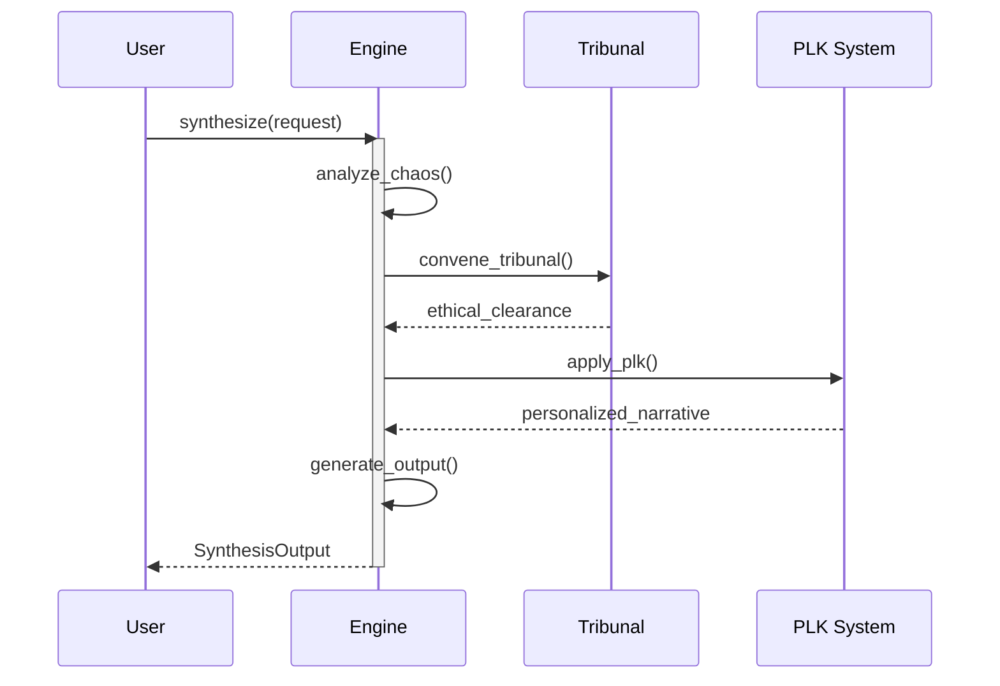
```mermaid
sequenceDiagram
    participant U as User
    participant E as Engine
    participant T as Tribunal
    participant P as PLK System
    U->>E: synthesize(request)
    activate E
    E->>E: analyze_chaos()
    E->>T: convene_tribunal()
    T-->>E: ethical_clearance
    E->>P: apply_plk()
    P-->>E: personalized_narrative
    E->>E: generate_output()
    E-->>U: SynthesisOutput
    deactivate E
```
Sources: [creationcornerengine.py (1).txt:49-100](), [creation\_corner.py:15-40]()

## API Endpoints

The system exposes REST endpoints via FastAPI for interaction with the synthesis engine. All requests require an `X-API-Key` for authorization.

### Endpoint: `POST /api/creation-corner/synthesize`
Generates a new artifact based on provided inputs.

**Request Schema:**
```json
{
  "title": "Optional Title",
  "artifact_type": "mind-map",
  "style": "revolutionary",
  "inputs": [
    {
      "text": "Chaotic thought here",
      "emotional_markers": ["inspired"]
    }
  ],
  "constraints": "Keep it concise"
}
```
Sources: [creation\_corner (1).py:18-30](), [creation\_corner.py:18-35]()

### Endpoint: `GET /api/creation-corner/types`
Returns supported artifact types and synthesis styles.
Sources: [creation\_corner (1).py:33-40]()

## Daily Journey Integration

Beyond one-off creations, the system includes a `DailyJourneySynthesizer`. This module aggregates a user's entire day of activity—journaling, meditation, and creative synthesis—into a cohesive "Visual Narrative."

*   **Emotional Sequence**: Tracks the progression of moods (e.g., reflective -> hopeful -> determined).
*   **Moral Reflections**: Extracts insights like "Growth through acceptance."
*   **Visual Narrative**: Generates journey timelines and mood maps.

Sources: [creationcornerengine.py (1).txt:118-175]()

## Summary

Getting started with Creation Corner involves configuring the `CreationCornerEngine` and hooking it into the frontend `UltimateCreationCorner` component. By capturing raw "chaos" and passing it through the synthesis pipeline—validated by the Tribunal and personalized by the PLK—the system allows for the rapid transformation of abstract consciousness into tangible, high-resonance masterpieces.

### Core Concepts: Consciousness to Masterpiece

<details>
<summary>Relevant source files</summary>

The following files were used as context for generating this wiki page:

- [CreationCorner.txt](https://github.com/faagestalt-web/Creation_Corner/blob/main/CreationCorner.txt)
- [ultimate_creation_corner_v2.tsx--- Ultimate Creation Corner v2.0 - Consciousness to Masterpiece Synthesizer-.txt](https://github.com/faagestalt-web/Creation_Corner/blob/main/ultimate_creation_corner_v2.tsx---%20Ultimate%20Creation_Corner_v2.0%20-%20Consciousness%20to%20Masterpiece%20Synthesizer-.txt)
- [creationcornerengine.py (1).txt](https://github.com/faagestalt-web/Creation_Corner/blob/main/creationcornerengine.py%20%281).txt)
- [creation_corner.py](https://github.com/faagestalt-web/Creation_Corner/blob/main/creation_corner.py)
- [creation_corner (1).py](https://github.com/faagestalt-web/Creation_Corner/blob/main/creation_corner%20%281).py)
</details>

# Core Concepts: Consciousness to Masterpiece

The "Consciousness to Masterpiece" framework is the foundational philosophy and technical implementation of the Creation Corner module. It enables the transformation of chaotic, multi-modal human consciousness—represented as "chaos inputs" or "bucket drops"—into structured, imaginative, and tangible AI-generated artifacts. This system bridges the gap between raw thought and artistic or functional output by leveraging AI synthesis engines, personal language keys (PLK), and ethical validation through an AI tribunal.

The scope of this system encompasses the capture of emotional markers, text notes, and media, followed by a multi-stage synthesis process. This process ensures that the resulting "masterpiece" (e.g., a mind map, video, or narrative arc) resonates with the user's unique psychological state and personal identity.

## Architecture and Synthesis Pipeline

The architecture is built upon a multi-layered synthesis pipeline that transitions from raw data ingestion to refined artifact generation. The backend engine coordinates analysis, validation, and personalization, while the frontend provides a reactive interface for real-time visualization.

### The Synthesis Workflow
The data flow begins with "Chaos Inputs," which are multi-modal data points containing text, emotional markers, and media paths. The `CreationCornerEngine` processes these through several asynchronous stages:
1.  **Chaos Analysis**: Identifying themes and emotional density.
2.  **Tribunal Convening**: A multi-perspective AI validation check for ethical and moral alignment.
3.  **PLK Application**: Personalizing the narrative voice based on the user's Personal Language Key.
4.  **Artifact Generation**: Producing the final medium-specific content.

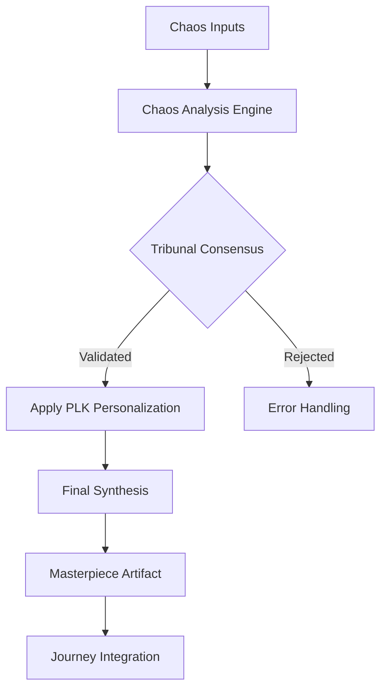
```mermaid
flowchart TD
    A[Chaos Inputs] --> B[Chaos Analysis Engine]
    B --> C{Tribunal Consensus}
    C -- Validated --> D[Apply PLK Personalization]
    C -- Rejected --> E[Error Handling]
    D --> F[Final Synthesis]
    F --> G[Masterpiece Artifact]
    G --> H[Journey Integration]
```
*The diagram illustrates the sequential progression of data from raw chaotic input to a validated, personalized masterpiece.*

Sources: [creationcornerengine.py (1).txt:49-110](), [ultimate_creation_corner_v2.tsx:43-70]()

## Data Models and Components

The system relies on specific data structures to maintain state across the synthesis pipeline.

### Core Data Structures
| Component | Description | Fields / Key Elements |
| :--- | :--- | :--- |
| **ChaosInput** | Raw, unrefined thoughts and markers | `text_notes`, `emotional_markers`, `audio_paths`, `bucket_drops` |
| **SynthesisRequest** | Wrapper for a generation job | `user_id`, `chaos_inputs`, `output_type`, `style`, `personalization` |
| **Artifact** | The generated output | `type`, `content`, `resonance_score`, `tribunal_consensus` |
| **DailyData** | Aggregated data for journey summaries | `emotional_sequence`, `activity_log`, `insights` |

Sources: [creationcornerengine.py (1).txt:17-47](), [ultimate_creation_corner_v2.tsx:23-41](), [creation_corner.py:12-48]()

### Artifact Types and Synthesis Styles
The system supports a wide range of output mediums and creative "directions" known as styles.

*   **Artifact Types**: Mind Map, Image, Video, Poem, Daily Journey, Narrative Arc, Pitch Deck, and Code.
*   **Synthesis Styles**: Revolutionary, Therapeutic, Convergent, Divergent, and Analytical.

Sources: [ultimate_creation_corner_v2.tsx:102-110](), [creation_corner (1).py:34-40]()

## Technical Implementation: Backend & API

The Creation Corner is exposed via a FastAPI-based REST API, allowing the frontend to trigger the synthesis engine asynchronously.

### API Endpoints
*   **POST `/api/creation-corner/synthesize`**: Primary endpoint to initiate the synthesis pipeline. Requires an `X-API-Key` and a `CreationCornerSynthesizeRequest` body.
*   **GET `/api/creation-corner/types`**: Returns the list of available artifact types and supported synthesis styles.

Sources: [creation_corner (1).py:11-41]()

### The Synthesis Engine (Python)
The `CreationCornerEngine` class handles the logic of concatenating inputs and applying constraints before passing them to the synthesizer function. It calculates a `resonance_score` and records the `creation_time_ms` for metadata tracking.

```python
# From creation_corner.py
def synthesize(self, req: CreationCornerSynthesizeRequest) -> Artifact:
    start = time.time()
    # Prompt construction logic...
    content = self.synthesizer(prompt)
    ms = int((time.time() - start) * 1000)
    return Artifact(
        type=req.artifact_type,
        content=content,
        metadata=ArtifactMetadata(resonance_score=0.0, creation_time_ms=ms)
    )
```
Sources: [creation_corner.py:15-48]()

## Frontend: Consciousness Interface

The React-based frontend manages user interaction, allowing users to "drop" chaotic thoughts and select their desired artifact type.

### UI Interaction Flow
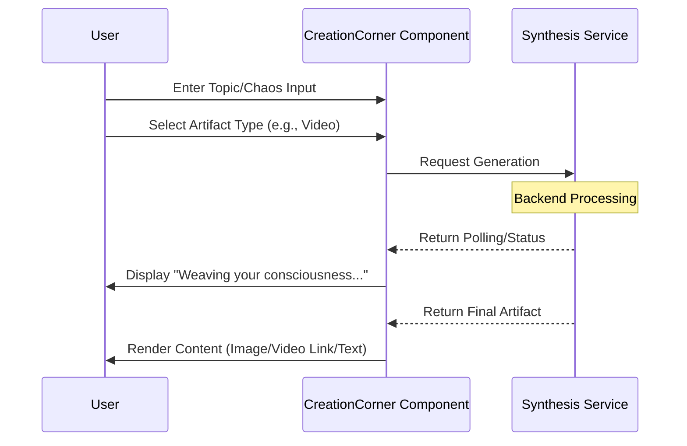
```mermaid
sequenceDiagram
    participant U as User
    participant UI as CreationCorner Component
    participant S as Synthesis Service
    U->>UI: Enter Topic/Chaos Input
    U->>UI: Select Artifact Type (e.g., Video)
    UI->>S: Request Generation
    Note over S: Backend Processing
    S-->>UI: Return Polling/Status
    UI->>U: Display "Weaving your consciousness..."
    S-->>UI: Return Final Artifact
    UI->>U: Render Content (Image/Video Link/Text)
```
*This sequence diagram shows the interaction between the user and the system during an artifact generation request.*

Sources: [CreationCorner.txt:20-53](), [ultimate_creation_corner_v2.tsx:78-100]()

### Daily Journey Synthesizer
A specialized sub-module, the `DailyJourneySynthesizer`, focuses on aggregating a user's entire day of data into a moral and emotional summary. It extracts "growth patterns" and "resilience scores" to create a visual narrative of the user's day.

Sources: [creationcornerengine.py (1).txt:115-168]()

## Conclusion
The "Consciousness to Masterpiece" system represents a sophisticated integration of AI synthesis and personal psychology. By treating raw thoughts as "chaos inputs" and applying structured architectural patterns—including ethical tribunal checks and personal language keys—the system ensures that AI-generated artifacts are not just generic outputs, but authentic reflections of the user's inner world.


## System Architecture

### High-Level Architecture

<details>
<summary>Relevant source files</summary>

The following files were used as context for generating this wiki page:

- [creation\_corner.py](https://github.com/faagestalt-web/Creation_Corner/blob/main/creation_corner.py)
- [ultimate\_creation\_corner\_v2.tsx--- Ultimate Creation Corner v2.0 - Consciousness to Masterpiece Synthesizer-.txt](https://github.com/faagestalt-web/Creation_Corner/blob/main/ultimate_creation_corner_v2.tsx---%20Ultimate%20Creation%20Corner%20v2.0%20-%20Consciousness%20to%20Masterpiece%20Synthesizer-.txt)
- [CreationCorner.txt](https://github.com/faagestalt-web/Creation_Corner/blob/main/CreationCorner.txt)
- [creationcornerengine.py (1).txt](https://github.com/faagestalt-web/Creation_Corner/blob/main/creationcornerengine.py%20%281).txt)
- [creation\_corner (1).py](https://github.com/faagestalt-web/Creation_Corner/blob/main/creation_corner%20%281).py)
</details>

# High-Level Architecture

The Creation Corner is a specialized module within the GestaltView ecosystem designed to transform multi-modal "chaotic" inputs—such as raw thoughts, emotional markers, and media—into structured, imaginative artifacts. It functions as a "Consciousness to Masterpiece Synthesizer," leveraging AI-driven engines to process internal human experiences into tangible outputs like documents, mind maps, and visual media.

The architecture follows a classic client-server model where a React-based frontend captures user inputs (Bucket Drops) and a Python-based backend orchestration engine handles synthesis, validation through an AI "tribunal," and integration with a user's "Personal Language Key" (PLK) for authentic voice personalization.

Sources: [ultimate_creation_corner_v2.tsx:1-5](), [creationcornerengine.py (1).txt:1-10](), [CreationCorner.txt:1-10]()

## System Components

The system is partitioned into three primary layers: the User Interface, the API Routing layer, and the Synthesis Engine.

### 1. Frontend Layer (React/TypeScript)
The frontend provides a highly interactive interface for "Chaos Input" collection. Users can input text notes, select emotional markers (e.g., 'inspired', 'overwhelmed'), and choose synthesis styles.

*   **Key Components:**
    *   `UltimateCreationCorner`: The main dashboard for managing chaos inputs and artifact previews.
    *   `CreationCorner`: A standard implementation for selecting artifact types and handling generation state.
    *   `ChaosInput`: Interface for capturing text, emotional markers, and timestamps.

Sources: [ultimate_creation_corner_v2.tsx:23-55](), [CreationCorner.txt:13-30]()

### 2. API & Routing Layer (FastAPI)
The backend exposes RESTful endpoints to bridge the UI with the synthesis logic. It includes security via API Key requirements and provides metadata about supported creation types.

| Endpoint | Method | Purpose |
| :--- | :--- | :--- |
| `/api/creation-corner/synthesize` | POST | Triggers the synthesis pipeline to create an artifact. |
| `/api/creation-corner/types` | GET | Returns list of available artifact types and synthesis styles. |

Sources: [creation_corner (1).py:10-40]()

### 3. Synthesis Engine (Python)
The core logic resides in the `CreationCornerEngine`. It executes a multi-stage pipeline: analyzing raw inputs, convening a "Tribunal" for ethical/moral checks, and applying the Personal Language Key (PLK).

*   **Key Classes:**
    *   `CreationCornerEngine`: Orchestrates the `analyze_chaos`, `convene_tribunal`, and `generate_output` methods.
    *   `DailyJourneySynthesizer`: Specialized engine for aggregating daily activities into a "Daily Journey" summary.

Sources: [creationcornerengine.py (1).txt:46-60](), [creation_corner.py:17-25]()

## Data Flow and Logic

The system follows a linear pipeline where raw consciousness data is progressively refined into a validated artifact.

### Synthesis Pipeline Flow
The diagram below illustrates how a `SynthesisRequest` is processed by the engine to produce a `SynthesisOutput`.

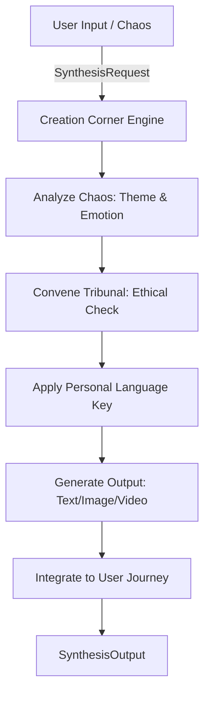
```mermaid
graph TD
    User[User Input / Chaos] -->|SynthesisRequest| Engine[Creation Corner Engine]
    Engine --> Analysis[Analyze Chaos: Theme & Emotion]
    Analysis --> Tribunal[Convene Tribunal: Ethical Check]
    Tribunal --> PLK[Apply Personal Language Key]
    PLK --> Generator[Generate Output: Text/Image/Video]
    Generator --> Integration[Integrate to User Journey]
    Integration --> Final[SynthesisOutput]
```
The engine simulates a multi-persona AI consensus during the "Tribunal" stage to ensure ethical clearance and moral alignment before final generation.

Sources: [creationcornerengine.py (1).txt:62-110](), [ultimate_creation_corner_v2.tsx:58-80]()

### Component Interaction Sequence
This sequence shows the interaction between the React frontend and the FastAPI backend during artifact creation.

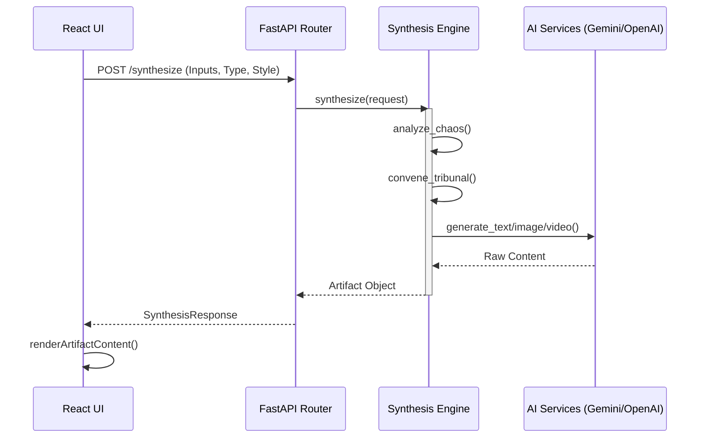
```mermaid
sequenceDiagram
    participant UI as React UI
    participant API as FastAPI Router
    participant Engine as Synthesis Engine
    participant Srv as AI Services (Gemini/OpenAI)

    UI->>API: POST /synthesize (Inputs, Type, Style)
    API->>Engine: synthesize(request)
    activate Engine
    Engine->>Engine: analyze_chaos()
    Engine->>Engine: convene_tribunal()
    Engine->>Srv: generate_text/image/video()
    Srv-->>Engine: Raw Content
    Engine-->>API: Artifact Object
    deactivate Engine
    API-->>UI: SynthesisResponse
    UI->>UI: renderArtifactContent()
```
Sources: [CreationCorner.txt:32-55](), [creation_corner (1).py:26-30](), [creationcornerengine.py (1).txt:100-115]()

## Data Models

The system relies on structured data types to maintain consistency across the multi-modal pipeline.

### Artifact Metadata
Every generated artifact includes metadata to track its validity and resonance with the user's intent.

| Field | Type | Description |
| :--- | :--- | :--- |
| `resonance_score` | float | Percentage indicating how well the artifact matches the input chaos. |
| `tribunal_consensus` | string | The result of the ethical/moral validation check. |
| `plk_applied` | list[string] | Identifiers for the specific language keys used for personalization. |
| `creation_time_ms` | integer | Latency of the synthesis process in milliseconds. |

Sources: [creation_corner.py:46-55](), [ultimate_creation_corner_v2.tsx:43-50]()

### Input Structures
The `ChaosInput` structure supports diverse data formats:
*   `text_notes` and `bucket_drops`: Raw text entries.
*   `emotional_markers`: Labels like "breakthrough" or "overwhelmed".
*   `media_paths`: References to audio, image, and video files.

Sources: [creationcornerengine.py (1).txt:21-30](), [ultimate_creation_corner_v2.tsx:34-38]()

## Synthesis Styles and Types
The architecture supports specific "modes" of creation that dictate the tone and structure of the output.

*   **Styles:** `revolutionary`, `therapeutic`, `analytical`, `convergent`, `divergent`.
*   **Artifact Types:** `mind-map`, `pitch-deck`, `narrative-arc`, `daily-journey`, `emotional-heatmap`, `poem`, `code`.

Sources: [ultimate_creation_corner_v2.tsx:24-25](), [creation_corner (1).py:35-40]()

## Conclusion
The Creation Corner architecture provides a robust framework for synthesizing human consciousness into tangible artifacts. By separating input collection, multi-stage AI validation, and multi-modal generation, it ensures that "chaotic" inner thoughts are processed with both ethical oversight and personal authenticity. The system's extensibility allows for the addition of new artifact types and AI services while maintaining a unified pipeline for user journey integration.

### Frontend-Backend Communication

<details>
<summary>Relevant source files</summary>

The following files were used as context for generating this wiki page:

- [creationcornerengine.py (1).txt](https://github.com/faagestalt-web/Creation_Corner/blob/main/creationcornerengine.py%20%281%29.txt)
- [ultimate_creation_corner_v2.tsx--- Ultimate Creation Corner v2.0 - Consciousness to Masterpiece Synthesizer-.txt](https://github.com/faagestalt-web/Creation_Corner/blob/main/ultimate_creation_corner_v2.tsx---%20Ultimate%20Creation%20Corner%20v2.0%20-%20Consciousness%20to%20Masterpiece%20Synthesizer-.txt)
- [CreationCorner.txt](https://github.com/faagestalt-web/Creation_Corner/blob/main/CreationCorner.txt)
- [creation_corner.py](https://github.com/faagestalt-web/Creation_Corner/blob/main/creation_corner.py)
- [creation_corner (1).py](https://github.com/faagestalt-web/Creation_Corner/blob/main/creation_corner%20%281).py)
</details>

# Frontend-Backend Communication

The Frontend-Backend Communication system in Creation Corner facilitates the transformation of chaotic user inputs—referred to as "consciousness" or "bucket drops"—into structured AI-generated artifacts. This bridge allows the React-based user interface to interact with specialized Python engines that handle multi-modal synthesis, ethical validation via an AI tribunal, and personalization through the Personal Language Key (PLK).

The communication architecture is primarily based on asynchronous requests where the frontend captures text, emotional markers, and media paths, sending them to the backend via RESTful API endpoints. The backend then processes these requests through a multi-stage pipeline involving analysis, validation, and generation before returning a completed artifact to the UI for display and export.
Sources: [ultimate_creation_corner_v2.tsx:1-10](), [creationcornerengine.py (1).txt:1-10](), [creation_corner (1).py:7-10]()

## API Architecture and Endpoints

The backend exposes a specialized router for the Creation Corner module, utilizing FastAPI to handle incoming synthesis requests. Access to these endpoints is secured via API key validation.

### Key API Endpoints

| Endpoint | Method | Description | Source |
| :--- | :--- | :--- | :--- |
| `/api/creation-corner/synthesize` | POST | Triggers the synthesis engine to generate an artifact from chaos inputs. | [creation_corner (1).py:22-28]() |
| `/api/creation-corner/types` | GET | Retrieves available artifact types (e.g., mind-map, video) and synthesis styles. | [creation_corner (1).py:30-38]() |

### Data Flow for Artifact Synthesis

The following sequence diagram illustrates the lifecycle of a synthesis request from the UI to the backend engine and back.

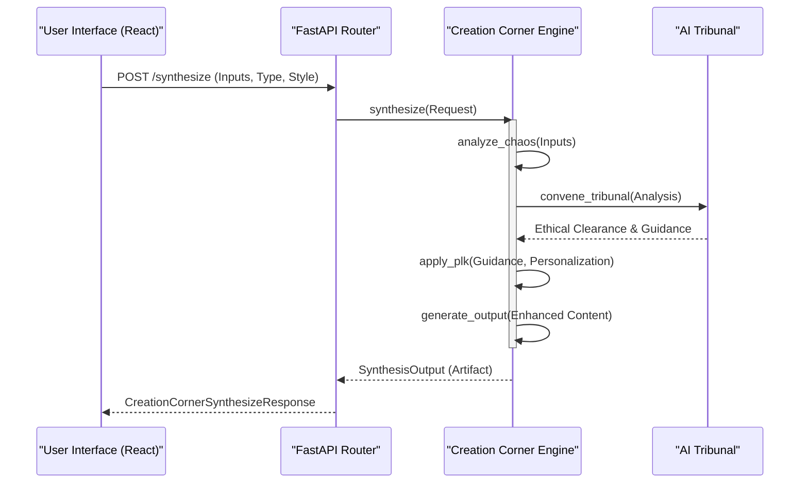
```mermaid
sequenceDiagram
    participant User as "User Interface (React)"
    participant API as "FastAPI Router"
    participant Engine as "Creation Corner Engine"
    participant Tribunal as "AI Tribunal"

    User->>API: POST /synthesize (Inputs, Type, Style)
    API->>Engine: synthesize(Request)
    activate Engine
    Engine->>Engine: analyze_chaos(Inputs)
    Engine->>Tribunal: convene_tribunal(Analysis)
    Tribunal-->>Engine: Ethical Clearance & Guidance
    Engine->>Engine: apply_plk(Guidance, Personalization)
    Engine->>Engine: generate_output(Enhanced Content)
    deactivate Engine
    Engine-->>API: SynthesisOutput (Artifact)
    API-->>User: CreationCornerSynthesizeResponse
```
The UI captures "ChaosInput" containing text and emotional markers, which the engine then validates through an ethical tribunal before final generation.
Sources: [ultimate_creation_corner_v2.tsx:75-92](), [creationcornerengine.py (1).txt:96-107](), [creation_corner (1).py:27-28]()

## Data Models and Schemas

Communication is strictly typed using data classes in Python and TypeScript interfaces in the frontend to ensure consistency across the stack.

### Frontend Data Structures (TypeScript)
The frontend manages state for "ChaosInputs" and the resulting "Artifact" metadata.
Sources: [ultimate_creation_corner_v2.tsx:28-50]()

### Backend Data Structures (Python)
The backend uses `dataclasses` to structure the multi-modal inputs and the generated outputs.

| Class | Field | Type | Description |
| :--- | :--- | :--- | :--- |
| `ChaosInput` | `text_notes` | List[str] | Raw textual input notes. |
| `SynthesisRequest` | `output_type` | str | Target format (document, video, etc). |
| `SynthesisOutput` | `content` | str | The final generated artifact body. |
| `ArtifactMetadata` | `resonance_score`| float | Measured alignment with user intent. |

Sources: [creationcornerengine.py (1).txt:19-45](), [creation_corner.py:12-32]()

## Multi-Modal Synthesis Pipeline

The interaction between the frontend and the `CreationCornerEngine` involves a complex pipeline designed to handle various media types and psychological markers.

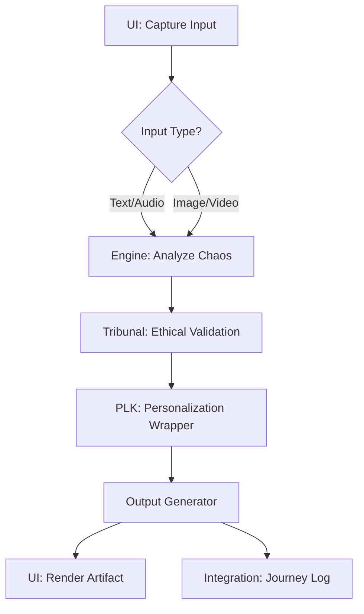
```mermaid
flowchart TD
    A[UI: Capture Input] --> B{Input Type?}
    B -->|Text/Audio| C[Engine: Analyze Chaos]
    B -->|Image/Video| C
    C --> D[Tribunal: Ethical Validation]
    D --> E[PLK: Personalization Wrapper]
    E --> F[Output Generator]
    F --> G[UI: Render Artifact]
    F --> H[Integration: Journey Log]
```
The synthesis engine transforms inputs through analysis, tribunal consensus, and PLK application to ensure the output resonates with the user's "Personal Language Key."
Sources: [creationcornerengine.py (1).txt:47-94](), [CreationCorner.txt:24-45]()

### Implementation Detail: The Synthesizer
In the backend, the engine constructs a prompt by aggregating the title, artifact type, style, constraints, and specific text inputs with their associated emotional markers.
```python
# creation_corner.py:20-28
prompt = (
    f"{title}"
    f"Artifact Type: {req.artifact_type}\n"
    f"Style: {req.style}\n"
    f"{constraints}"
    f"Inputs:\n{inputs}\n\n"
    f"Task: Synthesize a {req.artifact_type} in a {req.style} style from the inputs."
)
```
Sources: [creation_corner.py:20-28]()

## Frontend Service Integration

The frontend utilizes specialized services, such as `geminiService`, to handle direct generation tasks for specific media types like images and videos, while more complex synthesis is routed through the main backend engine.

*   **Handle Generate:** The `handleGenerate` function in the UI manages local state (generating, polling, done) and calls asynchronous service functions.
*   **Polling:** For long-running tasks like video generation, the frontend implements a polling state to check for completion.
*   **Personalization:** Every request includes the `PersonalLanguageKey` (plk) to ensure the AI service generates content matching the user's authentic voice.

Sources: [CreationCorner.txt:24-45](), [ultimate_creation_corner_v2.tsx:102-111]()

## Conclusion
Frontend-Backend communication in Creation Corner is a robust, asynchronous system that bridges the gap between raw human thought and AI-driven creativity. By utilizing structured data models and a multi-stage processing engine, the system ensures that every "masterpiece" generated is ethically validated, personalized via the PLK, and integrated into the user's broader narrative journey.
Sources: [creationcornerengine.py (1).txt:130-145](), [ultimate_creation_corner_v2.tsx:190-205]()

### Frontend State Management

<details>
<summary>Relevant source files</summary>

The following files were used as context for generating this wiki page:

- [ultimate\_creation\_corner\_v2.tsx--- Ultimate Creation Corner v2.0 - Consciousness to Masterpiece Synthesizer-.txt](https://github.com/faagestalt-web/Creation_Corner/blob/main/ultimate_creation_corner_v2.tsx---%20Ultimate%20Creation%20Corner%20v2.0%20-%20Consciousness%20to%20Masterpiece%20Synthesizer-.txt)
- [CreationCorner.txt](https://github.com/faagestalt-web/Creation_Corner/blob/main/CreationCorner.txt)
- [creationcornerengine.py (1).txt](https://github.com/faagestalt-web/Creation_Corner/blob/main/creationcornerengine.py%20%281).txt)
- [creation_corner.py](https://github.com/faagestalt-web/Creation_Corner/blob/main/creation_corner.py)
- [creation_corner (1).py](https://github.com/faagestalt-web/Creation_Corner/blob/main/creation_corner%20%281).py)
</details>

# Frontend State Management

The Frontend State Management system in the Creation Corner module is designed to handle the complex transformation of "chaos inputs"—various forms of unstructured data—into structured AI-synthesized artifacts. It manages the lifecycle of content creation, from initial data entry and emotional marking to the asynchronous synthesis process and final display of multi-modal results.

This system is primarily implemented using React's functional component architecture, utilizing hooks like `useState`, `useEffect`, and `useRef` to maintain UI reactivity and synchronize with backend synthesis engines. It supports diverse output types, including documents, mind maps, images, and videos, while incorporating user-specific personalization through the Personal Language Key (PLK).

## State Architecture and Hook Usage

The frontend utilizes a localized state management approach within major components. Key state variables track user inputs, selected configuration options, and the progress of asynchronous operations.

### Component State Variables
The `UltimateCreationCorner` and `CreationCorner` components maintain the following primary state:

| State Variable | Type | Description |
| :--- | :--- | :--- |
| `chaosInputs` | `ChaosInput[]` | Array of objects containing raw text and emotional markers. |
| `selectedType` | `ArtifactType` | The target format for synthesis (e.g., 'image', 'video', 'mind-map'). |
| `selectedStyle` | `SynthesisStyle` | The creative lens applied (e.g., 'revolutionary', 'therapeutic'). |
| `isSynthesizing` | `boolean` | Tracks the active status of an API request to the backend. |
| `progress` | `number` | Numeric value representing the completion percentage of synthesis. |
| `artifact` | `Artifact \| null` | The resulting data object received from the backend. |

Sources: [ultimate\_creation\_corner\_v2.tsx:64-71](), [CreationCorner.txt:13-17]()

### Synthesis Lifecycle Flow
The state transition follows a specific sequence: `idle` -> `generating`/`polling` -> `done` or `error`. For long-running tasks like video generation, the state enters a `polling` phase to check for completion.

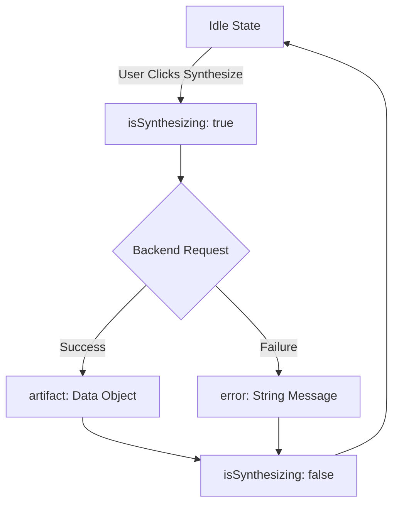
```mermaid
graph TD
    A[Idle State] -->|User Clicks Synthesize| B[isSynthesizing: true]
    B --> C{Backend Request}
    C -->|Success| D[artifact: Data Object]
    C -->|Failure| E[error: String Message]
    D --> F[isSynthesizing: false]
    E --> F
    F --> A
```
Sources: [CreationCorner.txt:20-43](), [ultimate\_creation\_corner\_v2.tsx:84-103]()

## Data Models and Types

The state management relies on strictly typed interfaces to ensure consistency between the React frontend and the Python-based backend engines.

### Frontend Type Definitions
The system defines structures for both the inputs provided by the user and the outputs generated by the synthesis engine.

*   **ChaosInput**: Captures text, emotional markers (like 'inspired' or 'overwhelmed'), and a timestamp.
*   **Artifact**: Contains the synthesized content, a preview element, and metadata including a `resonanceScore` and `tribunalConsensus`.

Sources: [ultimate\_creation\_corner\_v2.tsx:23-44]()

### Backend Schema Alignment
The state matches the `CreationCornerSynthesizeRequest` schema expected by the FastAPI router, ensuring that the `artifact_type`, `style`, and `inputs` are correctly mapped during the synthesis call.

Sources: [creation\_corner (1).py:25-28](), [creation\_corner.py:20-25]()

## Input Management and Event Handling

Managing state for "Chaos Inputs" involves handling arrays of dynamic inputs where users can add, remove, or update specific fields within the state array.

### Dynamic Array Handling
The `UltimateCreationCorner` component uses helper functions to manipulate the `chaosInputs` state:
1.  **addInput**: Spreads the current state and appends a new empty `ChaosInput` object.
2.  **updateInput**: Uses index-based mapping to update specific fields (text or emotional markers) without mutating the original state.
3.  **removeInput**: Filters the array by index to delete an entry.

Sources: [ultimate\_creation\_corner\_v2.tsx:74-81]()

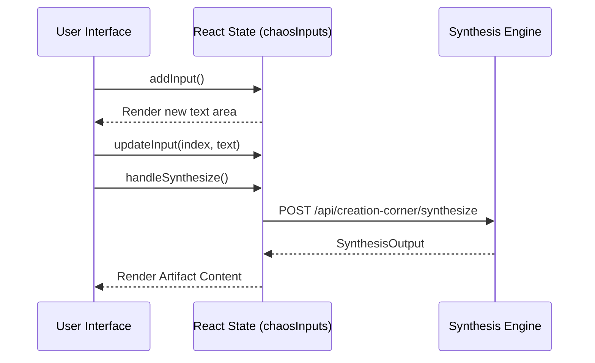
```mermaid
sequenceDiagram
    participant UI as User Interface
    participant State as React State (chaosInputs)
    participant Backend as Synthesis Engine
    
    UI->>State: addInput()
    State-->>UI: Render new text area
    UI->>State: updateInput(index, text)
    UI->>State: handleSynthesize()
    State->>Backend: POST /api/creation-corner/synthesize
    Backend-->>State: SynthesisOutput
    State-->>UI: Render Artifact Content
```
Sources: [ultimate\_creation\_corner\_v2.tsx:74-103](), [creation\_corner (1).py:25-28]()

## Synthesis Engine Integration

The frontend state is bridged to the `CreationCornerEngine` via asynchronous service calls. The engine processes the stateful request through a multi-stage pipeline:

1.  **Analyze Chaos**: Evaluates theme density and emotional scores.
2.  **Convene Tribunal**: Performs ethical/moral validation across AI personas.
3.  **Apply PLK**: Injects the Personal Language Key for authentic narrative voice.
4.  **Generate Output**: Produces the final content and metadata.

Sources: [creationcornerengine.py (1).txt:61-105]()

## Conclusion
Frontend state management in Creation Corner provides a robust framework for converting chaotic human thought into structured artistic output. By leveraging React's reactive state for complex input arrays and synchronizing with an advanced synthesis pipeline, the system maintains high technical accuracy and responsiveness while handling multi-modal data.


## Core Features

### Masterpiece Synthesis Engine

<details>
<summary>Relevant source files</summary>

The following files were used as context for generating this wiki page:

- [creationcornerengine.py (1).txt](https://github.com/faagestalt-web/Creation_Corner/blob/main/creationcornerengine.py%20%281%29.txt)
- [ultimate_creation_corner_v2.tsx--- Ultimate Creation Corner v2.0 - Consciousness to Masterpiece Synthesizer-.txt](https://github.com/faagestalt-web/Creation_Corner/blob/main/ultimate_creation_corner_v2.tsx---%20Ultimate%20Creation%20Corner%20v2.0%20-%20Consciousness%20to%20Masterpiece%20Synthesizer-.txt)
- [CreationCorner.txt](https://github.com/faagestalt-web/Creation_Corner/blob/main/CreationCorner.txt)
- [creation_corner.py](https://github.com/faagestalt-web/Creation_Corner/blob/main/creation_corner.py)
- [creation_corner (1).py](https://github.com/faagestalt-web/Creation_Corner/blob/main/creation_corner%20%281).py)
</details>

# Masterpiece Synthesis Engine

The Masterpiece Synthesis Engine is a core component of the GestaltView ecosystem designed to transform multi-modal "chaos" inputs—such as raw thoughts, bucket drops, and emotional markers—into structured, imaginative artifacts. It serves as a synthesizer for consciousness, translating inner-world experiences into tangible outputs like documents, mind maps, and narrative arcs.

This engine utilizes a multi-stage pipeline involving chaos analysis, ethical validation through an AI tribunal, and personalization via the Personal Language Key (PLK) to ensure that generated masterpieces resonate deeply with the user's authentic voice.
Sources: [creationcornerengine.py (1).txt:1-10](), [ultimate_creation_corner_v2.tsx:1-5]()

## System Architecture

The engine operates through a collaboration between a React-based frontend and a Python-based backend. The frontend handles the collection of "chaos inputs" and emotional markers, while the backend engine processes these inputs through a series of asynchronous synthesis stages.

### Synthesis Pipeline Flow
The following diagram illustrates the flow from raw chaos input to the final generated masterpiece.

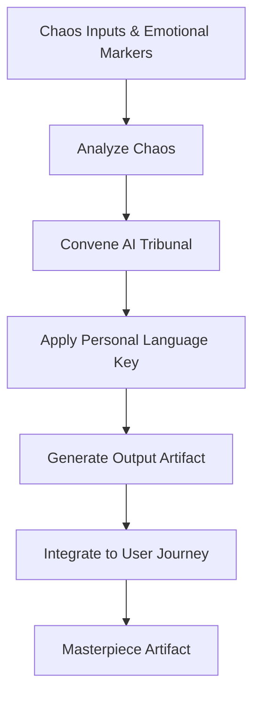
```mermaid
flowchart TD
    Input[Chaos Inputs & Emotional Markers] --> Analysis[Analyze Chaos]
    Analysis --> Tribunal[Convene AI Tribunal]
    Tribunal --> PLK[Apply Personal Language Key]
    PLK --> Generation[Generate Output Artifact]
    Generation --> Journey[Integrate to User Journey]
    Journey --> Final[Masterpiece Artifact]
```
The pipeline ensures that every creation is validated for moral alignment and personalized to the user's specific linguistic style.
Sources: [creationcornerengine.py (1).txt:70-82](), [ultimate_creation_corner_v2.tsx:50-70]()

## Core Components

### Creation Corner Engine
The `CreationCornerEngine` is the primary class responsible for the synthesis lifecycle. It coordinates multi-modal analysis and delegates tasks to specialized sub-modules.

| Method | Description |
| :--- | :--- |
| `analyze_chaos` | Scans inputs for theme density, emotional scores, and media summaries. |
| `convene_tribunal` | Multi-perspective AI validation for ethical and moral clearance. |
| `apply_plk` | Personalizes the narrative using the user's Personal Language Key. |
| `generate_output` | Produces the final content in the requested style (e.g., Revolutionary). |
| `synthesize` | Orchestrates the full async pipeline for a `SynthesisRequest`. |

Sources: [creationcornerengine.py (1).txt:45-91](), [creation_corner.py:14-25]()

### Daily Journey Synthesizer
A specialized module that aggregates daily multi-modal data to create summaries of a user's consciousness over a 24-hour period.

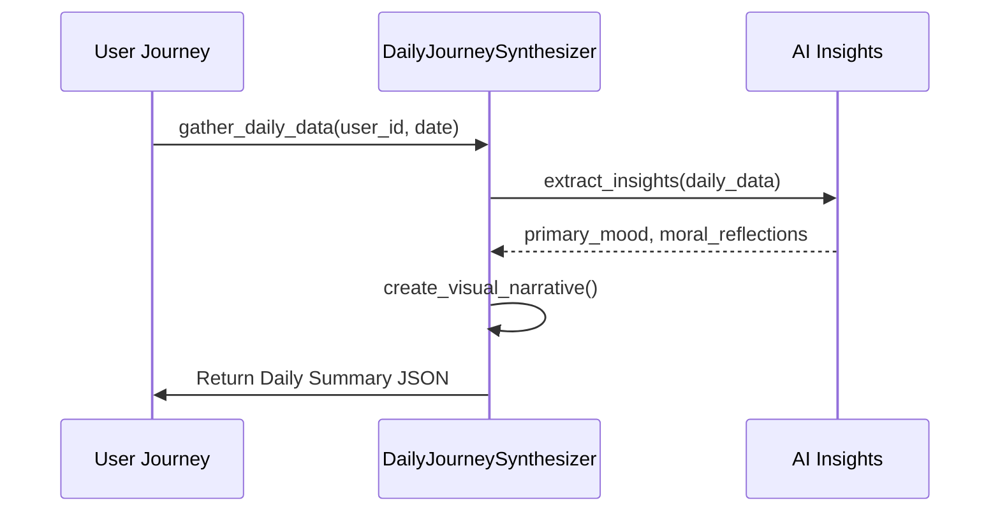
```mermaid
sequenceDiagram
    participant UJ as User Journey
    participant DJS as DailyJourneySynthesizer
    participant AI as AI Insights
    UJ->>DJS: gather_daily_data(user_id, date)
    DJS->>AI: extract_insights(daily_data)
    AI-->>DJS: primary_mood, moral_reflections
    DJS->>DJS: create_visual_narrative()
    DJS->>UJ: Return Daily Summary JSON
```
Sources: [creationcornerengine.py (1).txt:104-149]()

## Data Models

The system relies on structured dataclasses to manage the transition from chaotic input to structured artifact.

### Synthesis Input Models
*   **ChaosInput**: A collection of multi-modal data including `text_notes`, `bucket_drops`, `audio_paths`, and `consciousness_notes`.
*   **SynthesisRequest**: Contains the `user_id`, the `ChaosInput` object, the desired `output_type`, and the `style`.

### Synthesis Output Models
*   **Artifact**: The core output object containing the generated `content`, `type`, and `metadata`.
*   **ArtifactMetadata**: Includes technical and qualitative metrics such as `resonance_score`, `tribunal_consensus`, and `creation_time_ms`.

Sources: [creationcornerengine.py (1).txt:18-43](), [creation_corner.py:27-35]()

## API and Integration

The engine is exposed via a FastAPI router, allowing frontend components to request synthesis and query available artifact types.

### Primary Endpoints
| Endpoint | Method | Operation ID | Description |
| :--- | :--- | :--- | :--- |
| `/api/creation-corner/synthesize` | POST | `synthesizeArtifact` | Triggers the full synthesis pipeline. |
| `/api/creation-corner/types` | GET | `getCreationCornerTypes` | Returns supported artifact types and styles. |

Sources: [creation_corner (1).py:18-36]()

### Supported Types and Styles
The engine supports a diverse range of artifacts and creative directions:
*   **Artifact Types**: `mind-map`, `image`, `video`, `poem`, `pitch-deck`, `daily-journey`, `narrative-arc`.
*   **Synthesis Styles**: `revolutionary`, `therapeutic`, `convergent`, `divergent`, `analytical`.

Sources: [ultimate_creation_corner_v2.tsx:103-111](), [creation_corner (1).py:39-44]()

## Implementation Details

The synthesis process utilizes a prompt-building logic that combines user constraints and inputs into a structured instruction for the underlying AI model.

```python
# From creation_corner.py:27-35
prompt = (
    f"{title}"
    f"Artifact Type: {req.artifact_type}\n"
    f"Style: {req.style}\n"
    f"{constraints}"
    f"Inputs:\n{inputs}\n\n"
    f"Task: Synthesize a {req.artifact_type} in a {req.style} style from the inputs."
)
```
Sources: [creation_corner.py:27-35]()

The frontend manages state for these complex interactions, providing real-time feedback during the "weaving" of consciousness into artifacts.
Sources: [CreationCorner.txt:46-75]()

## Summary
The Masterpiece Synthesis Engine provides a sophisticated framework for turning unstructured personal data into meaningful creative works. By integrating multi-modal input handling with ethical tribunal checks and personal language keys, it ensures that outputs are not only technically sound but also align with the user's moral and emotional landscape.

### Advanced Prompting Framework

<details>
<summary>Relevant source files</summary>

The following files were used as context for generating this wiki page:

- [CreationCorner.txt](https://github.com/faagestalt-web/Creation_Corner/blob/main/CreationCorner.txt)
- [ultimate_creation_corner_v2.tsx--- Ultimate Creation Corner v2.0 - Consciousness to Masterpiece Synthesizer-.txt](https://github.com/faagestalt-web/Creation_Corner/blob/main/ultimate_creation_corner_v2.tsx---%20Ultimate%20Creation%20Corner%20v2.0%20-%20Consciousness%20to%20Masterpiece%20Synthesizer-.txt)
- [creationcornerengine.py (1).txt](https://github.com/faagestalt-web/Creation_Corner/blob/main/creationcornerengine.py%20%281).txt)
- [creation_corner.py](https://github.com/faagestalt-web/Creation_Corner/blob/main/creation_corner.py)
- [creation_corner (1).py](https://github.com/faagestalt-web/Creation_Corner/blob/main/creation_corner%20%281).py)
</details>

# Advanced Prompting Framework

The Advanced Prompting Framework is a specialized system within the Creation Corner module designed to transform "chaotic" multi-modal inputs—ranging from raw thoughts and emotional markers to audio and video files—into structured, imaginative artifacts. It functions as a consciousness-to-masterpiece synthesizer, leveraging a multi-stage pipeline that includes chaos analysis, ethical validation through an AI tribunal, and personalization via the Personal Language Key (PLK) system.

This framework enables the synthesis of diverse outputs such as mind maps, pitch decks, narrative arcs, and daily journey summaries by mapping user-provided "bucket drops" against specific synthesis styles like "revolutionary" or "therapeutic."

Sources: [creationcornerengine.py (1).txt:1-10](), [ultimate_creation_corner_v2.tsx:1-15]()

## Synthesis Architecture

The framework operates through a structured pipeline that processes raw data into refined artifacts. The architecture is divided into frontend ingestion (React/TypeScript) and backend orchestration (Python/FastAPI).

### Multi-Stage Processing Pipeline
The backend engine executes a four-stage process to ensure that generated content is both contextually relevant and ethically aligned:
1.  **Chaos Analysis**: Extracts themes, emotional scores, and media summaries from raw inputs.
2.  **Tribunal Convening**: Simulates a multi-perspective consensus to provide ethical clearance and moral themes.
3.  **PLK Application**: Personalizes the narrative voice using the user's specific Personal Language Key.
4.  **Output Generation**: Produces the final content (text, image, or video) based on the requested artifact type and style.

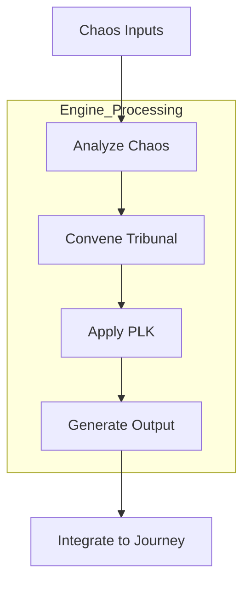
```mermaid
flowchart TD
    A[Chaos Inputs] --> B[Analyze Chaos]
    B --> C[Convene Tribunal]
    C --> D[Apply PLK]
    D --> E[Generate Output]
    E --> F[Integrate to Journey]
    
    subgraph Engine_Processing
    B
    C
    D
    E
    end
```
The diagram shows the sequential flow from raw input ingestion to final journey integration.
Sources: [creationcornerengine.py (1).txt:46-95](), [creation_corner (1).py:26-30]()

## Data Models and Components

The framework relies on several key data structures to maintain state and consistency across the synthesis process.

### Input Structures
The system accepts a `ChaosInput` object which serves as a container for fragmented data.

| Field | Type | Description |
| :--- | :--- | :--- |
| `text_notes` | List[str] | Disorganized textual ideas or notes. |
| `emotional_markers` | List[str] | Qualitative tags like "inspired" or "overwhelmed". |
| `bucket_drops` | List[str] | Rapid-fire insights or "lightning" thoughts. |
| `media_paths` | List[str] | References to audio, image, or video files. |

Sources: [creationcornerengine.py (1).txt:18-28](), [ultimate_creation_corner_v2.tsx:29-33]()

### The Synthesis Engine
The `CreationCornerEngine` is the core logic provider. It constructs prompts by aggregating titles, constraints, and inputs into a formatted string for the LLM synthesizer.

```python
# creation_corner.py:19-30
prompt = (
    f"{title}"
    f"Artifact Type: {req.artifact_type}\n"
    f"Style: {req.style}\n"
    f"{constraints}"
    f"Inputs:\n{inputs}\n\n"
    f"Task: Synthesize a {req.artifact_type} in a {req.style} style from the inputs."
)
```
Sources: [creation_corner.py:19-30]()

## Synthesis Styles and Artifact Types

The framework supports a variety of output formats and creative directions, allowing users to define the "lens" through which their chaos is viewed.

### Supported Artifact Types
The system is capable of generating both textual and multi-modal artifacts:
- **Textual**: Document, Pitch Deck, Poem, Code, Essay, Brainstorm, Narrative Arc.
- **Visual/Structural**: Mind Map, Image, Emotional Heatmap.
- **Time-based**: Video, Daily Journey.

### Synthesis Styles
Users can select from five primary synthesis styles to guide the AI's creative logic:
- **Convergent**: Focuses on unifying disparate ideas.
- **Divergent**: Explores multiple creative paths from a single input.
- **Analytical**: Prioritizes logic and structure.
- **Revolutionary**: Defaults to a Keith-inspired, high-impact style.
- **Therapeutic**: Focuses on growth, acceptance, and emotional clarity.

Sources: [creation_corner (1).py:35-42](), [ultimate_creation_corner_v2.tsx:26-27](), [creationcornerengine.py (1).txt:34]()

## Daily Journey Synthesis

A specialized sub-module, the `DailyJourneySynthesizer`, aggregates a user's entire daily output into a cohesive moral and emotional summary.

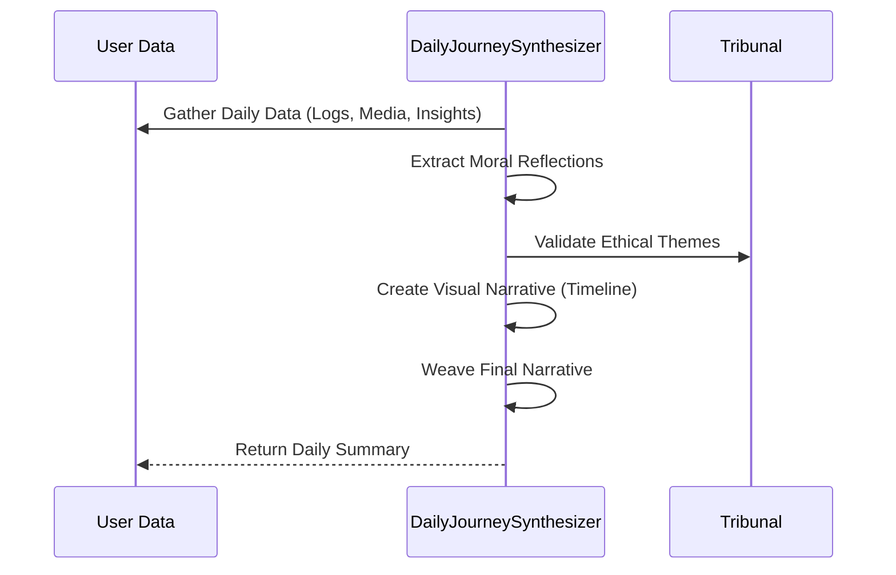
```mermaid
sequenceDiagram
    participant U as User Data
    participant S as DailyJourneySynthesizer
    participant T as Tribunal
    
    S->>U: Gather Daily Data (Logs, Media, Insights)
    S->>S: Extract Moral Reflections
    S->>T: Validate Ethical Themes
    S->>S: Create Visual Narrative (Timeline)
    S->>S: Weave Final Narrative
    S-->>U: Return Daily Summary
```
This sequence illustrates the specific flow for creating a Daily Journey artifact, focusing on reflection rather than just creation.
Sources: [creationcornerengine.py (1).txt:105-155]()

## API Implementation

The framework is exposed via a FastAPI router, requiring an API key for access and providing endpoints for both synthesis and type discovery.

### API Endpoints

| Endpoint | Method | Description |
| :--- | :--- | :--- |
| `/api/creation-corner/synthesize` | POST | Triggers the full synthesis pipeline. |
| `/api/creation-corner/types` | GET | Returns list of available artifact types and styles. |

### Header Parameters
- `X-API-Key`: Required for authentication (validated against environment `API_KEY`).

Sources: [creation_corner (1).py:11-42]()

## Summary
The Advanced Prompting Framework serves as the cognitive engine for the Creation Corner. By using structured data models like `ChaosInput` and sophisticated processing steps like the `Tribunal` and `PLK Application`, it ensures that the transition from disorganized thought to tangible masterpiece is personalized, ethically grounded, and technically robust.

Sources: [creationcornerengine.py (1).txt:178-185]()

### Export & Formatting Options

<details>
<summary>Relevant source files</summary>

The following files were used as context for generating this wiki page:

- [creation\_corner.py](https://github.com/faagestalt-web/Creation_Corner/blob/main/creation_corner.py)
- [ultimate\_creation\_corner\_v2.tsx--- Ultimate Creation Corner v2.0 - Consciousness to Masterpiece Synthesizer-.txt](https://github.com/faagestalt-web/Creation_Corner/blob/main/ultimate_creation_corner_v2.tsx---%20Ultimate%20Creation%20Corner%20v2.0%20-%20Consciousness%20to%20Masterpiece%20Synthesizer-.txt)
- [CreationCorner.txt](https://github.com/faagestalt-web/Creation_Corner/blob/main/CreationCorner.txt)
- [creationcornerengine.py (1).txt](https://github.com/faagestalt-web/Creation_Corner/blob/main/creationcornerengine.py%20%281).txt)
- [creation\_corner (1).py](https://github.com/faagestalt-web/Creation_Corner/blob/main/creation_corner%20%281).py)
</details>

# Export & Formatting Options

The **Export & Formatting Options** within the Creation Corner module provide the mechanism for transforming synthesized "consciousness" and "chaos inputs" into tangible, downloadable, and viewable artifacts. This system bridges the gap between raw AI-generated content and user-consumable formats, supporting a wide range of media including text-based documents, visual maps, images, and videos.

The primary purpose of these options is to ensure that the output of the synthesis engine—whether it be a "Masterpiece" or a "Daily Journey"—is formatted correctly according to its type and made accessible through appropriate export interfaces. This involves handling diverse data structures, from base64 strings and temporary URLs to structured JSON for mind maps.
Sources: [ultimate_creation_corner_v2.tsx:34-45](), [CreationCorner.txt:1-5](), [creationcornerengine.py (1).txt:46-55]()

## Artifact Type Specifications

The system supports a variety of artifact types, each with specific formatting requirements. These types dictate how the `SynthesisOutput` or `Artifact` object is rendered in the UI and subsequently exported.

| Artifact Type | Description | Formatting/Rendering Logic |
| :--- | :--- | :--- |
| `document` / `story` | Textual narratives or reports. | Rendered as whitespace-preserved text. |
| `mind-map` | Visual representation of thoughts. | Rendered as pre-formatted monospace text or JSON maps. |
| `image` | Visual emotional landscapes. | Rendered as `` tags via base64 or source URLs. |
| `video` | Animated narrative arcs. | Provided as temporary download links. |
| `pitch-deck` | Structured presentation content. | Rendered as text-based slides or structured documents. |
| `poem` | Poetic inner world expression. | Preserves line breaks and formatting. |

Sources: [ultimate_creation_corner_v2.tsx:21-23](), [CreationCorner.txt:46-64](), [creation_corner (1).py:32-36]()

## Synthesis & Formatting Logic

The formatting process begins in the backend engines, where raw inputs are structured into prompt templates before being processed by AI synthesizers. The `CreationCornerEngine` handles the initial construction of the artifact content.

### Backend Formatting Flow
The backend formats the request by combining titles, constraints, and multi-modal inputs into a structured prompt. The resulting `Artifact` object contains the formatted `content` and associated `metadata`.

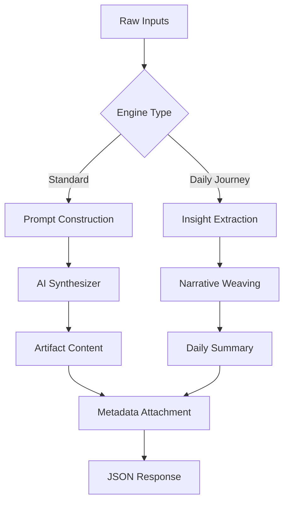
```mermaid
flowchart TD
    A[Raw Inputs] --> B{Engine Type}
    B -- Standard --> C[Prompt Construction]
    B -- Daily Journey --> D[Insight Extraction]
    C --> E[AI Synthesizer]
    D --> F[Narrative Weaving]
    E --> G[Artifact Content]
    F --> H[Daily Summary]
    G --> I[Metadata Attachment]
    H --> I
    I --> J[JSON Response]
```
The diagram above illustrates how raw inputs are processed through different engine paths to create formatted content and metadata.
Sources: [creation_corner.py:16-36](), [creationcornerengine.py (1).txt:115-135]()

### Rendering Components
The frontend utilizes specific logic to interpret the `content` field of an artifact based on its type. For example, `image` types are rendered as images, while `mindMap` types use monospace fonts to preserve structural layout.

```typescript
  const renderArtifactContent = () => {
    if (!artifact || !artifact.content) return null;

    switch (artifact.type) {
      case 'image':
        return ;
      case 'video':
        return (
          <div>
            <a href={artifact.content} className="...">Download Video</a>
          </div>
        );
      case 'mindMap':
        return <pre className="whitespace-pre-wrap font-mono text-sm">{artifact.content}</pre>;
      default:
        return <div className="whitespace-pre-wrap">{artifact.content}</div>;
    }
  };
```
Sources: [CreationCorner.txt:46-64]()

## Export Mechanisms

Exporting allows users to move synthesized artifacts out of the Creation Corner environment. The implementation varies between simple file downloads and more complex "Journey" integrations.

### Export Methods and Styles
The system supports different synthesis styles that influence the formatting of the exported content:
*   **Revolutionary:** Keith-inspired high-impact style.
*   **Analytical:** Structured and data-driven formatting.
*   **Therapeutic:** Empathy-focused narrative synthesis.

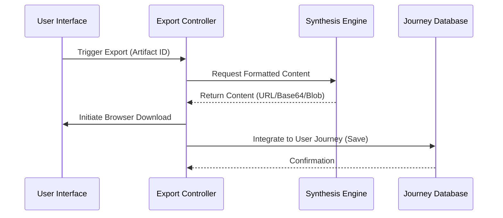
```mermaid
sequenceDiagram
    participant U as User Interface
    participant E as Export Controller
    participant S as Synthesis Engine
    participant J as Journey Database

    U->>E: Trigger Export (Artifact ID)
    E->>S: Request Formatted Content
    S-->>E: Return Content (URL/Base64/Blob)
    E->>U: Initiate Browser Download
    E->>J: Integrate to User Journey (Save)
    J-->>E: Confirmation
```
This sequence shows the interaction between the UI, engine, and database during the export and integration process.
Sources: [ultimate_creation_corner_v2.tsx:107-112](), [creationcornerengine.py (1).txt:107-112](), [creation_corner (1).py:26-30]()

### Technical Metadata
Exported artifacts are accompanied by metadata that quantifies the quality and context of the synthesis.

| Field | Type | Description |
| :--- | :--- | :--- |
| `resonance_score` | float | Measures the alignment of the output with inputs. |
| `tribunal_consensus`| string | Validation status (e.g., "unvalidated", "validated"). |
| `plk_applied` | list | List of Personal Language Keys used for formatting. |
| `creation_time_ms` | int | Processing time for the synthesis. |

Sources: [creation_corner.py:40-45](), [ultimate_creation_corner_v2.tsx:38-43]()

## Daily Journey Synthesis

A specialized formatting option exists for the "Daily Journey," which aggregates multiple multi-modal inputs (images, audio, text) from a single day into a coherent summary.

*   **Visual Narrative:** Generates timelines and mood maps (e.g., `journey_timeline.svg`, `mood_map.png`).
*   **Moral Reflections:** Weaves a narrative focused on ethical growth and emotional sequences.
*   **Data Aggregation:** Collects `emotional_sequence`, `activity_log`, and `media_elements` into a single `DailyData` structure for formatting.

Sources: [creationcornerengine.py (1).txt:140-160](), [creationcornerengine.py (1).txt:180-205]()

The "Export & Formatting Options" ensure that whether a user is creating a simple "story" or a complex "narrative-arc," the result is rendered accurately and is ready for integration into their wider personal journey or external use.
Sources: [ultimate_creation_corner_v2.tsx:7-15](), [creationcornerengine.py (1).txt:215-225]()

### Ideation & Brainstorming Workflow

<details>
<summary>Relevant source files</summary>

The following files were used as context for generating this wiki page:

- [CreationCorner.txt](https://github.com/faagestalt-web/Creation_Corner/blob/main/CreationCorner.txt)
- [ultimate_creation_corner_v2.tsx--- Ultimate Creation Corner v2.0 - Consciousness to Masterpiece Synthesizer-.txt](https://github.com/faagestalt-web/Creation_Corner/blob/main/ultimate_creation_corner_v2.tsx---%20Ultimate%20Creation%20Corner%20v2.0%20-%20Consciousness%20to%20Masterpiece%20Synthesizer-.txt)
- [creationcornerengine.py (1).txt](https://github.com/faagestalt-web/Creation_Corner/blob/main/creationcornerengine.py%20%281).txt)
- [creation_corner.py](https://github.com/faagestalt-web/Creation_Corner/blob/main/creation_corner.py)
- [creation_corner (1).py](https://github.com/faagestalt-web/Creation_Corner/blob/main/creation_corner%20%281).py)
</details>

# Ideation & Brainstorming Workflow

The Ideation & Brainstorming Workflow, primarily implemented via the "Creation Corner" module, is a system designed to transform multi-modal "chaos inputs" (raw thoughts, feelings, and media) into structured creative artifacts. It functions as a "Consciousness to Masterpiece Synthesizer," utilizing AI-driven synthesis to bridge the gap between abstract inner experiences and tangible outputs like mind maps, pitch decks, and narrative arcs.

This workflow integrates several core systems, including the Personal Language Key (PLK) for voice personalization and an AI Tribunal for ethical and multi-perspective validation. The goal is to provide a seamless transition from chaotic ideation to refined, high-resonance creations.

Sources: [ultimate_creation_corner_v2.tsx:1-10](), [creationcornerengine.py (1).txt:1-10]()

## System Architecture

The workflow follows a multi-tier architecture consisting of a React-based frontend for input capture and a Python-based engine for backend synthesis. The system is designed to handle asynchronous workflows to manage intensive tasks like image and video generation.

### Frontend Components
The user interface facilitates the capture of "Bucket Drops"—chaotic thoughts paired with emotional markers.
- **CreationCorner / UltimateCreationCorner**: Main React components that manage state for inputs, artifact selection, and synthesis progress.
- **Chaos Input Management**: Allows users to add, remove, and tag inputs with markers such as `inspired`, `overwhelmed`, or `breakthrough`.

Sources: [CreationCorner.txt:10-40](), [ultimate_creation_corner_v2.tsx:55-85]()

### Backend Engine
The `CreationCornerEngine` manages the logic of transforming these inputs. It utilizes a pipeline that analyzes chaos, convenes a "Tribunal" for perspective, applies the user's PLK, and finally generates the requested artifact.

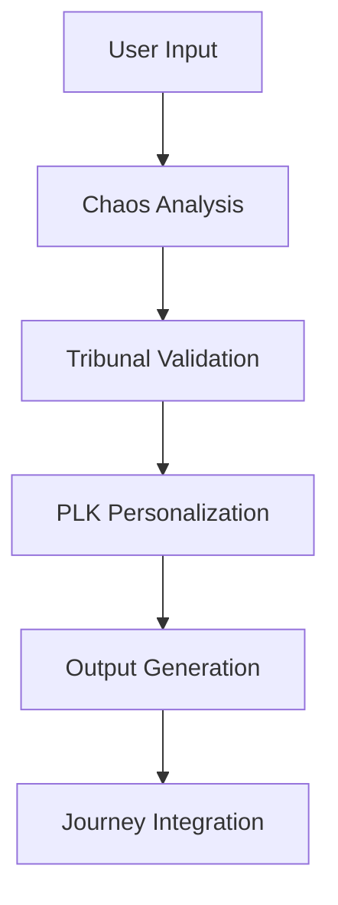
```mermaid
graph TD
    User[User Input] --> Chaos[Chaos Analysis]
    Chaos --> Tribunal[Tribunal Validation]
    Tribunal --> PLK[PLK Personalization]
    PLK --> Generator[Output Generation]
    Generator --> Journey[Journey Integration]
```
This diagram illustrates the sequential processing of a synthesis request from raw input to final integration into the user's journey.
Sources: [creationcornerengine.py (1).txt:55-125]()

## Data Models & API

The workflow relies on structured data to maintain consistency across the synthesis pipeline. The primary data structure for input is the `ChaosInput`, while the result is encapsulated in an `Artifact`.

### Core Data Structures

| Class/Interface | Fields | Description |
| :--- | :--- | :--- |
| `ChaosInput` | `text`, `emotionalMarkers`, `timestamp` | Represents a single entry of raw thought or data. |
| `SynthesisRequest` | `user_id`, `chaos_inputs`, `output_type`, `style` | The configuration object sent to the engine for processing. |
| `Artifact` | `type`, `content`, `metadata` | The final product containing the generated content and resonance scores. |
| `ArtifactMetadata` | `resonance_score`, `tribunal_consensus`, `plk_applied` | Contextual data regarding how the artifact was validated. |

Sources: [ultimate_creation_corner_v2.tsx:25-50](), [creationcornerengine.py (1).txt:17-53](), [creation_corner.py:15-40]()

### API Endpoints

The system exposes a RESTful API via FastAPI to handle synthesis requests and retrieve configuration options.

- **POST `/api/creation-corner/synthesize`**: Accepts a `CreationCornerSynthesizeRequest` and returns the generated `Artifact`.
- **GET `/api/creation-corner/types`**: Returns available artifact types and synthesis styles.

Sources: [creation_corner (1).py:18-35]()

## Synthesis Workflow Logic

The synthesis process is an asynchronous pipeline. In the backend, the `CreationCornerEngine.synthesize` method orchestrates several distinct phases to ensure the output is both personalized and ethically sound.

### 1. Chaos Analysis
The engine evaluates multi-modal inputs (text, audio, images) to determine theme density and emotional scores.
Sources: [creationcornerengine.py (1).txt:62-73]()

### 2. Tribunal Convention
A simulated AI tribunal of multiple personas performs a multi-perspective validation. This step checks for ethical clearance and identifies moral themes like "Growth through chaos."
Sources: [creationcornerengine.py (1).txt:75-86]()

### 3. Personal Language Key (PLK) Application
The system applies the user's specific PLK data to ensure the narrative voice matches the user's unique style (e.g., "Revolutionary" or "ADHD Jazz").
Sources: [creationcornerengine.py (1).txt:88-103](), [ultimate_creation_corner_v2.tsx:43]()

### 4. Output Generation
The final step uses specific generators based on the `ArtifactType`.
- **Text Artifacts**: Documents, poems, or essays.
- **Visual Artifacts**: Images or Mind Maps (often rendered as JSON or Markdown).
- **Multimedia**: Videos or audio elements.

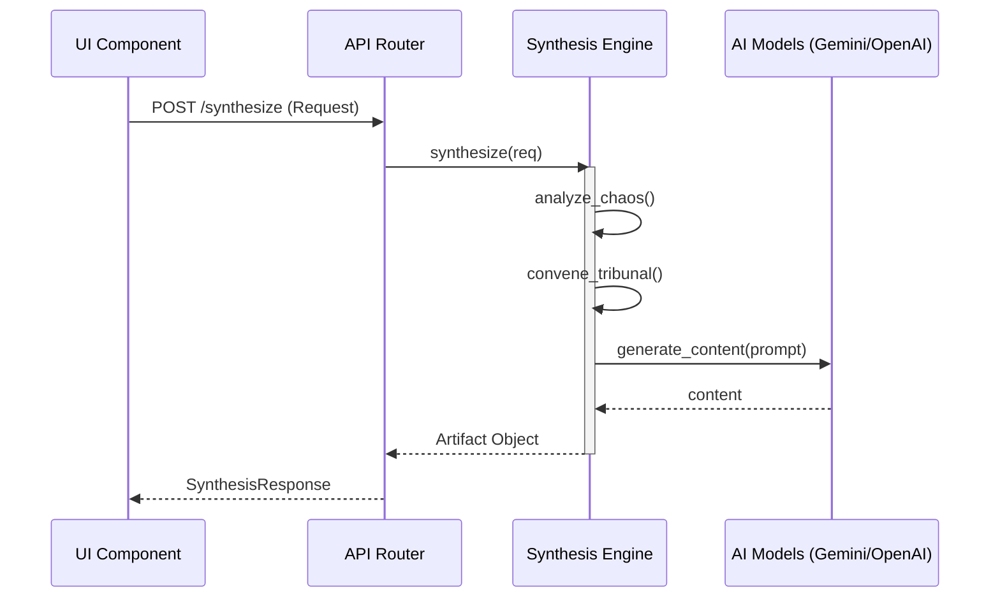
```mermaid
sequenceDiagram
    participant UI as UI Component
    participant API as API Router
    participant Engine as Synthesis Engine
    participant LLM as AI Models (Gemini/OpenAI)

    UI->>API: POST /synthesize (Request)
    API->>Engine: synthesize(req)
    activate Engine
    Engine->>Engine: analyze_chaos()
    Engine->>Engine: convene_tribunal()
    Engine->>LLM: generate_content(prompt)
    LLM-->>Engine: content
    Engine-->>API: Artifact Object
    deactivate Engine
    API-->>UI: SynthesisResponse
```
This sequence diagram shows the interaction between the frontend, the FastAPI router, the internal engine, and the external AI models.
Sources: [CreationCorner.txt:20-45](), [creation_corner (1).py:26-30](), [creationcornerengine.py (1).txt:115-125]()

## Artifact Types and Styles

Users can customize their brainstorming output by selecting specific types and synthesis styles, which dictate the logic used by the generator.

### Supported Artifact Types
- `mind-map`: Visualization of inner thoughts.
- `pitch-deck`: Structured presentation logic.
- `narrative-arc`: Animated or text-based story progression.
- `daily-journey`: A synthesis of a full day's consciousness.
- `image` / `video`: Visual renderings of emotional landscapes.

### Synthesis Styles
- **Revolutionary**: Keith-inspired, high-impact style.
- **Therapeutic**: Focuses on emotional processing and healing.
- **Convergent**: Narrows down chaotic ideas into a single point.
- **Divergent**: Expands a single seed into many possibilities.

Sources: [ultimate_creation_corner_v2.tsx:100-115](), [creation_corner (1).py:35-40]()

## Implementation Example: Synthesis Request

The following snippet demonstrates how a prompt is constructed within the engine to guide the AI synthesizer.

```python
# creation_corner.py:24-34
prompt = (
    f"{title}"
    f"Artifact Type: {req.artifact_type}\n"
    f"Style: {req.style}\n"
    f"{constraints}"
    f"Inputs:\n{inputs}\n\n"
    f"Task: Synthesize a {req.artifact_type} in a {req.style} style from the inputs."
)
```
Sources: [creation_corner.py:24-34]()

## Summary

The Ideation & Brainstorming Workflow serves as the creative heart of the project, allowing users to dump unorganized "chaos" and receive structured, high-resonance artifacts. By combining multi-modal input analysis, ethical tribunal checks, and PLK-based personalization, the system ensures that the generated masterpieces are not only technically accurate but also deeply aligned with the user's personal consciousness and intent.

### Creation History Tracking

<details>
<summary>Relevant source files</summary>

The following files were used as context for generating this wiki page:

- [ultimate\_creation\_corner\_v2.tsx--- Ultimate Creation Corner v2.0 - Consciousness to Masterpiece Synthesizer-.txt](https://github.com/faagestalt-web/Creation_Corner/blob/main/ultimate_creation_corner_v2.tsx---%20Ultimate%20Creation%20Corner%20v2.0%20-%20Consciousness%20to%20Masterpiece%20Synthesizer-.txt)
- [CreationCorner.txt](https://github.com/faagestalt-web/Creation_Corner/blob/main/CreationCorner.txt)
- [creationcornerengine.py (1).txt](https://github.com/faagestalt-web/Creation_Corner/blob/main/creationcornerengine.py%20%281).txt)
- [creation_corner.py](https://github.com/faagestalt-web/Creation_Corner/blob/main/creation_corner.py)
- [creation_corner (1).py](https://github.com/faagestalt-web/Creation_Corner/blob/main/creation_corner%20%281).py)
</details>

# Creation History Tracking

Creation History Tracking is the systemic process within the Creation Corner ecosystem that captures, synthesizes, and logs the transformation of "chaos inputs" (raw thoughts, emotional markers, and multi-modal data) into structured artifacts. This system ensures that every "masterpiece"—ranging from mind maps and pitch decks to video and daily journey summaries—is preserved with comprehensive metadata, including resonance scores, tribunal consensus, and timestamped entry points.

The architecture bridges a React-based frontend for real-time interaction with a Python-based synthesis engine. By tracking these creations, the system builds a "Daily Journey," allowing users to visualize their consciousness evolution over time through persistent metadata and historical logs.

Sources: [ultimate_creation_corner_v2.tsx:1-15](), [creationcornerengine.py (1).txt:7-12](), [CreationCorner.txt:23-40]()

## Data Models for History and Artifacts

Tracking is powered by structured data classes that define the lifecycle of a creation from raw input to generated artifact.

### Artifact Metadata and Schema
Every tracked creation includes a `metadata` object that stores technical and qualitative metrics.

| Field | Type | Description |
| :--- | :--- | :--- |
| `resonance_score` | float | Quantitative measure of the artifact's alignment with user consciousness. |
| `tribunal_consensus` | string | Validation status from the multi-perspective AI tribunal. |
| `plk_applied` | List[string] | Personal Language Keys used to personalize the output. |
| `creation_time` | number/int | Unix timestamp or duration in milliseconds of the synthesis process. |

Sources: [ultimate_creation_corner_v2.tsx:40-47](), [creation_corner.py:40-45]()

### Chaos Input Tracking
Historical tracking begins with the `ChaosInput`, which preserves the original state of the user's thoughts before synthesis.

```python
@dataclass
class ChaosInput:
    text_notes: List[str]
    bucket_drops: List[str]
    tribunal_insights: List[str]
    audio_paths: List[str]
    image_paths: List[str]
    video_paths: List[str]
```
Sources: [creationcornerengine.py (1).txt:21-30]()

## Synthesis Lifecycle and History Integration

The history tracking system follows a specific pipeline where inputs are analyzed, validated, and finally integrated into the "User's Journey."

### Synthesis Flow
The following diagram illustrates how raw inputs are processed and recorded into the history via the `CreationCornerEngine`.

```mermaid
graph TD
    A[User Chaos Inputs] --> B[Analyze Chaos]
    B --> C[Convene Tribunal]
    C --> D[Apply PLK]
    D --> E[Generate Output]
    E --> F[Integrate to Journey]
    F --> G[(Historical Log/DB)]
    
    subgraph Metadata_Capture
    E -.-> H[Capture Resonance]
    E -.-> I[Timestamp Creation]
    end
```
The engine ensures that the `integrate_to_journey` function is the final step in the pipeline, effectively "anchoring" the creation into the historical record.

Sources: [creationcornerengine.py (1).txt:62-110]()

## Daily Journey Synthesizer

A specialized component, the `DailyJourneySynthesizer`, tracks creations over a specific timeframe to generate historical summaries.

### Components of a Daily Summary
The system aggregates tracked data from various sources to create a narrative of the user's progress.

*   **Emotional Sequence:** A list of tracked emotional states captured throughout the day (e.g., 'reflective', 'hopeful').
*   **Activity Log:** A historical record of actions like journaling or creative synthesis.
*   **Visual Narrative:** Generated timelines and mood maps derived from historical data points.

Sources: [creationcornerengine.py (1).txt:115-135](), [creationcornerengine.py (1).txt:150-165]()

### Historical Data Extraction Logic
The synthesizer extracts insights from daily logs to provide a "Resilience Score" and identify "Growth Patterns."

```mermaid
sequenceDiagram
    participant User
    participant DJS as DailyJourneySynthesizer
    participant DB as Historical Records
    
    User->>DJS: Request Daily Summary (Date)
    DJS->>DB: gather_daily_data(user_id, date)
    DB-->>DJS: DailyData (Activities, Insights, Media)
    DJS->>DJS: extract_insights(daily_data)
    DJS->>DJS: create_visual_narrative(insights)
    DJS->>User: Return Summary Object
```
Sources: [creationcornerengine.py (1).txt:127-148](), [creationcornerengine.py (1).txt:175-185]()

## API Implementation for History Access

The backend provides endpoints to retrieve the types of artifacts tracked and to trigger new synthesis events that will be added to the history.

### Endpoints

*   **POST `/api/creation-corner/synthesize`**: Primary entry point for creating and tracking a new artifact.
*   **GET `/api/creation-corner/types`**: Returns the valid schemas for history tracking, including supported styles like `revolutionary` or `therapeutic`.

Sources: [creation_corner (1).py:22-42]()

### Artifact Persistence Example
In the frontend implementation, state management tracks the status of the current creation (`generating`, `polling`, `done`, `error`) before it is committed to the permanent history.

```typescript
const [artifact, setArtifact] = useState<Artifact | null>(null);

// ... in handleGenerate ...
const newArtifact: Artifact = {
  type: selectedType,
  content: null,
  status: 'generating',
  filename: `${selectedType.toLowerCase()}_${Date.now()}` // Unique ID for tracking
};
```
Sources: [CreationCorner.txt:23-35]()

## Conclusion
Creation History Tracking in Creation Corner serves as more than a simple log; it is a synthesis of multi-modal data points that represent a user's consciousness. By utilizing the `CreationCornerEngine` and `DailyJourneySynthesizer`, the system transforms transient "chaos" into a permanent, searchable, and visualized record of creative and emotional growth.


## Data Management & Flow

### Data Persistence Strategy

<details>
<summary>Relevant source files</summary>

The following files were used as context for generating this wiki page:

- [creation\_corner.py](https://github.com/faagestalt-web/Creation_Corner/blob/main/creation_corner.py)
- [creation\_corner (1).py](https://github.com/faagestalt-web/Creation_Corner/blob/main/creation_corner%20%281).py)
- [creationcornerengine.py (1).txt](https://github.com/faagestalt-web/Creation_Corner/blob/main/creationcornerengine.py%20%281).txt)
- [CreationCorner.txt](https://github.com/faagestalt-web/Creation_Corner/blob/main/CreationCorner.txt)
- [ultimate_creation_corner_v2.tsx--- Ultimate Creation Corner v2.0 - Consciousness to Masterpiece Synthesizer-.txt](https://github.com/faagestalt-web/Creation_Corner/blob/main/ultimate_creation_corner_v2.tsx---%20Ultimate%20Creation%20Corner%20v2.0%20-%20Consciousness%20to%20Masterpiece%20Synthesizer-.txt)
</details>

# Data Persistence Strategy

The Data Persistence Strategy in the Creation Corner system focuses on capturing multi-modal "chaos" inputs—ranging from text notes and bucket drops to audio and video paths—and transforming them into structured artifacts. This strategy ensures that synthesized outputs, such as documents, mind maps, or daily summaries, are integrated back into the user's "journey" through a multi-stage pipeline involving analysis, ethical validation, and personalization.

The system handles both transient state management within the frontend (tracking generation status) and the archival of synthesized results for long-term access. This includes providing temporary links for media artifacts and simulated database or blockchain anchors for permanent journey integration.

Sources: [creationcornerengine.py (1).txt:1-12](), [CreationCorner.txt:20-55]()

## Synthesis Pipeline and Data Flow

The core persistence logic is driven by the `CreationCornerEngine` and `DailyJourneySynthesizer`. Data flows from raw "chaos" inputs into a structured synthesis pipeline that eventually commits the generated artifact to the user's permanent history.

### Synthesis Request Lifecycle
1.  **Input Aggregation:** Users provide `ChaosInput`, which includes text notes, bucket drops, tribunal insights, and media paths.
2.  **Analysis:** The engine analyzes inputs for themes and emotional scores.
3.  **Validation:** An AI "Tribunal" provides ethical and moral clearance.
4.  **Personalization:** The Personal Language Key (PLK) is applied to ensure the narrative matches the user's authentic voice.
5.  **Generation:** The final `SynthesisOutput` is created.
6.  **Integration:** The output is "anchored" to the user's journey (e.g., database or blockchain).

Sources: [creationcornerengine.py (1).txt:26-95](), [creation_corner.py:17-45]()

### Synthesis Flow Diagram
The following diagram illustrates how data moves from raw input to integrated journey storage.

```mermaid
flowchart TD
    A[ChaosInput] --> B{Synthesis Engine}
    B --> C[Theme/Emotional Analysis]
    C --> D[Tribunal Validation]
    D --> E[PLK Personalization]
    E --> F[Generate Artifact]
    F --> G[Integrate to Journey]
    G --> H[(Permanent Storage)]
```
Sources: [creationcornerengine.py (1).txt:97-113](), [CreationCorner.txt:20-50]()

## Data Models and Structures

The system uses specific dataclasses and interfaces to define the shape of data being persisted and processed.

### Persistence Schemas
| Entity | Description | Key Fields |
| :--- | :--- | :--- |
| **ChaosInput** | Raw, multi-modal user data. | `text_notes`, `bucket_drops`, `image_paths`, `video_paths` |
| **SynthesisOutput** | The result of the synthesis process. | `id`, `content`, `metadata`, `visual_elements`, `generated_at` |
| **Artifact** | Frontend representation of the output. | `type`, `content`, `status`, `filename` |
| **DailyData** | Aggregated daily journey data. | `emotional_sequence`, `activity_log`, `insights` |

Sources: [creationcornerengine.py (1).txt:26-55](), [CreationCorner.txt:10-18](), [creation_corner.py:10-15]()

### Metadata and Resonance
Every generated artifact is accompanied by `ArtifactMetadata`. This includes a `resonance_score` (measuring how well it aligns with the user) and a `tribunal_consensus` status.

```python
@dataclass
class ArtifactMetadata:
    resonance_score: float
    tribunal_consensus: str
    plk_applied: List[str]
    creation_time_ms: int
```
Sources: [creation_corner.py:40-45](), [ultimate_creation_corner_v2.tsx--- Ultimate Creation Corner v2.0 - Consciousness to Masterpiece Synthesizer-.txt:37-45]()

## API and Integration Points

Persistence is facilitated through specialized endpoints and service layers that bridge the React frontend with the Python synthesis engine.

### API Endpoints
| Endpoint | Method | Purpose |
| :--- | :--- | :--- |
| `/api/creation-corner/synthesize` | POST | Triggers the synthesis pipeline and returns a persistable artifact. |
| `/api/creation-corner/types` | GET | Retrieves valid artifact types and styles for the synthesis request. |

Sources: [creation_corner (1).py:18-35]()

### Integration Sequence
The frontend communicates with AI services (Gemini/OpenAI) to generate content, which is then handled by the engine for persistence.

```mermaid
sequenceDiagram
    participant UI as User Interface
    participant Srv as Gemini Service
    participant Eng as Synthesis Engine
    participant DB as Journey Storage

    UI->>Srv: generateImage/generateText(topic)
    Srv-->>UI: result_content
    UI->>Eng: synthesize(request)
    Eng->>Eng: apply_plk()
    Eng->>Eng: convene_tribunal()
    Eng->>DB: integrate_to_journey(output)
    DB-->>UI: confirmation_success
```
Sources: [CreationCorner.txt:20-45](), [creationcornerengine.py (1).txt:97-113]()

## Media and File Handling

For media-heavy artifacts (images, videos), the strategy involves a mix of temporary and permanent links. 
- **Temporary Storage:** Generated video links are noted as temporary and may expire.
- **Filename Convention:** Artifacts are assigned unique filenames based on type and timestamp (e.g., `story_17123456789`).
- **Exporting:** The UI provides an `exportArtifact` function to allow users to download synthesized masterpieces locally.

Sources: [CreationCorner.txt:30-70](), [ultimate_creation_corner_v2.tsx--- Ultimate Creation Corner v2.0 - Consciousness to Masterpiece Synthesizer-.txt:100-105]()

## Conclusion

The Data Persistence Strategy effectively manages the transition of chaotic, unorganized inputs into structured digital artifacts. By utilizing a multi-stage pipeline—Analysis, Tribunal Validation, and Journey Integration—the system ensures that creations are not just generated but are meaningfully archived within the user's historical context. The combination of metadata tracking (Resonance Scores) and multi-modal handling (Text, Image, Video) provides a robust framework for long-term creative storage.

### Text Processing Pipeline

<details>
<summary>Relevant source files</summary>

The following files were used as context for generating this wiki page:

- [CreationCorner.txt](https://github.com/faagestalt-web/Creation_Corner/blob/main/CreationCorner.txt)
- [creationcornerengine.py (1).txt](https://github.com/faagestalt-web/Creation_Corner/blob/main/creationcornerengine.py%20%281%29.txt)
- [ultimate_creation_corner_v2.tsx--- Ultimate Creation Corner v2.0 - Consciousness to Masterpiece Synthesizer-.txt](https://github.com/faagestalt-web/Creation_Corner/blob/main/ultimate_creation_corner_v2.tsx)
- [creation_corner.py](https://github.com/faagestalt-web/Creation_Corner/blob/main/creation_corner.py)
- [creation_corner (1).py](https://github.com/faagestalt-web/Creation_Corner/blob/main/creation_corner%20%281%29.py)
</details>

# Text Processing Pipeline

The Text Processing Pipeline within the Creation Corner module is a sophisticated synthesis system designed to transform multi-modal, often chaotic inputs—referred to as "Chaos Inputs" or "Bucket Drops"—into structured, tangible artifacts. These artifacts range from creative stories and poems to analytical pitch decks and mind maps. The system leverages AI synthesis, ethical validation via a "Tribunal" mechanism, and personalization through the Personal Language Key (PLK) to ensure outputs resonate with the user's unique consciousness and voice.

The pipeline operates by aggregating disparate data points such as text notes, emotional markers, and media paths, then processing them through a series of refinement stages. This architecture allows the system to bridge the gap between raw, unformed thoughts and polished masterpieces.

Sources: [creationcornerengine.py (1).txt:1-12](), [ultimate_creation_corner_v2.tsx:1-5]()

## Architecture and Data Flow

The text processing pipeline follows a structured, asynchronous workflow that moves from data ingestion to final artifact generation. The process is managed by the `CreationCornerEngine`, which coordinates analysis, validation, and personalization.

### Synthesis Workflow
The pipeline consists of four primary stages:
1.  **Chaos Analysis:** Analyzing text notes and emotional markers to identify themes and patterns.
2.  **Tribunal Validation:** An ethical and moral check to ensure the creative output aligns with heart-centered creation.
3.  **PLK Personalization:** Applying the Personal Language Key to infuse the narrative with the user's authentic voice.
4.  **Artifact Generation:** Producing the final output in the requested format and style.

```mermaid
flowchart TD
    A[Chaos Inputs] --> B[Analyze Chaos]
    B --> C[Convene Tribunal]
    C --> D[Apply PLK]
    D --> E[Generate Output]
    E --> F[Integrate to Journey]
    
    subgraph Engine [Creation Corner Engine]
    B
    C
    D
    E
    end
```
The diagram above illustrates the sequential flow of data through the synthesis engine.
Sources: [creationcornerengine.py (1).txt:96-105](), [creation_corner.py:20-37]()

## Data Models and Schemas

The pipeline relies on specific data structures to handle the transition from raw input to synthesized output.

### Input Structures
The system accepts `ChaosInput`, which encapsulates the raw data for synthesis.

| Field | Type | Description |
| :--- | :--- | :--- |
| `text_notes` | `List[str]` | Raw text entries or "bucket drops". |
| `emotional_markers` | `List[str]` | Metadata tags like 'inspired' or 'overwhelmed'. |
| `personalization` | `Dict[str, Any]` | PLK data for voice alignment. |

### Output Structures
The final result is returned as an `Artifact` or `SynthesisOutput`.

| Field | Type | Description |
| :--- | :--- | :--- |
| `content` | `str` | The synthesized text or media reference. |
| `resonance_score` | `float` | Metric indicating alignment with user consciousness. |
| `tribunal_consensus`| `str` | Result of the ethical validation check. |

Sources: [creationcornerengine.py (1).txt:20-50](), [ultimate_creation_corner_v2.tsx:28-44](), [creation_corner.py:40-50]()

## Core Components

### CreationCornerEngine
The central Python class responsible for the backend logic. It implements the `synthesize` method, which acts as the pipeline orchestrator. It handles the conversion of `CreationCornerSynthesizeRequest` into a finalized `Artifact`.

*   **`analyze_chaos()`**: Evaluates theme density and emotional scores from inputs.
*   **`convene_tribunal()`**: Simulates a multi-perspective consensus for ethical clearance.
*   **`apply_plk()`**: Enhances the narrative using signatures from the Personal Language Key.

Sources: [creationcornerengine.py (1).txt:52-94](), [creation_corner.py:16-40]()

### DailyJourneySynthesizer
A specialized pipeline component that aggregates a user's entire day of data into a "Daily Journey" summary. It extracts moral reflections and growth patterns to create a coherent narrative of the user's consciousness over a 24-hour period.

```mermaid
sequenceDiagram
    participant User as User Data
    participant DS as DailySynthesizer
    participant Narrative as Narrative Weaving
    User->>DS: Provide Daily Data
    DS->>DS: Extract Insights & Moods
    DS->>Narrative: Weave Moral Reflection
    Narrative-->>DS: Coherent Summary
    DS-->>User: Daily Journey Artifact
```
This sequence shows the specialized flow for daily summaries.
Sources: [creationcornerengine.py (1).txt:115-168]()

## API Integration

The pipeline is exposed via a FastAPI interface, allowing frontend components to trigger synthesis.

### Endpoints

*   **POST `/api/creation-corner/synthesize`**: Accepts a `CreationCornerSynthesizeRequest` and returns a synthesized artifact. Requires an `X-API-Key` for authentication.
*   **GET `/api/creation-corner/types`**: Returns a list of supported artifact types (e.g., poem, mind-map, narrative-arc) and styles (e.g., revolutionary, therapeutic).

Sources: [creation_corner (1).py:15-38]()

## Synthesis Styles and Types

The pipeline is configurable through artifact types and styles, allowing users to define the "lens" through which their text is processed.

| Category | Options |
| :--- | :--- |
| **Artifact Types** | document, pitch-deck, mind-map, poem, code, essay, brainstorm, narrative-arc |
| **Synthesis Styles**| convergent, divergent, analytical, revolutionary, therapeutic |

Sources: [ultimate_creation_corner_v2.tsx:22-25](), [creation_corner (1).py:34-38]()

## Conclusion
The Text Processing Pipeline serves as the bridge between chaotic thought and structured creation. By integrating analytical engines with ethical "Tribunals" and personalized language keys, the system ensures that text synthesis is not merely a mechanical transformation but a meaningful reflection of the user's inner world.

Sources: [creationcornerengine.py (1).txt:1-10](), [ultimate_creation_corner_v2.tsx:75-80]()


## Frontend Components

### Ultimate Creation Corner UI Overview

<details>
<summary>Relevant source files</summary>

The following files were used as context for generating this wiki page:

- [ultimate_creation_corner_v2.tsx--- Ultimate Creation Corner v2.0 - Consciousness to Masterpiece Synthesizer-.txt](https://github.com/faagestalt-web/Creation_Corner/blob/main/ultimate_creation_corner_v2.tsx---%20Ultimate%20Creation%20Corner%20v2.0%20-%20Consciousness%20to%20Masterpiece%20Synthesizer-.txt)
- [CreationCorner.txt](https://github.com/faagestalt-web/Creation_Corner/blob/main/CreationCorner.txt)
- [creationcornerengine.py (1).txt](https://github.com/faagestalt-web/Creation_Corner/blob/main/creationcornerengine.py%20%281).txt)
- [creation_corner.py](https://github.com/faagestalt-web/Creation_Corner/blob/main/creation_corner.py)
- [creation_corner (1).py](https://github.com/faagestalt-web/Creation_Corner/blob/main/creation_corner%20%281).py)
</details>

# Ultimate Creation Corner UI Overview

The Ultimate Creation Corner is a sophisticated interface designed to transform "chaotic" human consciousness—expressed through text, emotional markers, and multi-modal inputs—into structured digital masterpieces or artifacts. It serves as a synthesizer within the GestaltView ecosystem, bridging the gap between raw thought and tangible creative output like mind maps, videos, and pitch decks.

This system utilizes a synthesis engine that integrates Personal Language Keys (PLK) and AI-driven validation (the "Tribunal") to ensure outputs resonate with the user's authentic voice and ethical standards. The UI provides a real-time environment for dropping "bucket drops" of thought and monitoring the progress of complex artifact generation.

Sources: [ultimate_creation_corner_v2.tsx:1-5](), [CreationCorner.txt:1-10](), [creationcornerengine.py (1).txt:1-10]()

## User Interface Architecture

The UI is built using React and modern component libraries like Framer Motion for animations and Radix UI primitives for accessible components (e.g., Select, Card, Progress). It manages a complex state involving multiple "Chaos Inputs," selection of synthesis styles, and real-time generation feedback.

### Component Structure
The primary interface is encapsulated in the `UltimateCreationCorner` component, which handles:
*   **Input Management**: Dynamic addition and removal of text-based chaos inputs.
*   **Emotional Tagging**: Assignment of markers like "inspired" or "overwhelmed" to specific thoughts.
*   **Configuration**: Selection of Artifact Type and Synthesis Style.
*   **Status Visualization**: Progress bars and state-based rendering for the synthesis pipeline.

Sources: [ultimate_creation_corner_v2.tsx:47-100]()

### Interaction Flow
The following diagram illustrates the lifecycle of a creation request from the UI to the synthesis engine.

```mermaid
flowchart TD
    User[User Interface] --> Input[Input Chaos/Bucket Drops]
    Input --> Markers[Apply Emotional Markers]
    Markers --> Config[Select Type & Style]
    Config --> Synth[Synthesize Masterpiece]
    Synth --> Progress[Monitor Progress]
    Progress --> Artifact[View/Export Artifact]
    Artifact --> Export[Download/Save]
```
The flow begins with raw input and emotional tagging before moving into the synthesis state machine. 
Sources: [ultimate_creation_corner_v2.tsx:114-180](), [CreationCorner.txt:20-50]()

## Data Models and Types

The UI relies on specific TypeScript interfaces to maintain data integrity between the frontend and the synthesis backend.

### Frontend Type Definitions
| Type | Properties | Description |
| :--- | :--- | :--- |
| `ChaosInput` | `text`, `emotionalMarkers`, `timestamp` | Represents a single "bucket drop" of thought. |
| `Artifact` | `type`, `content`, `metadata`, `preview` | The result of synthesis, including resonance scores and tribunal consensus. |
| `ArtifactType` | Enum (e.g., mind-map, image, video, poem) | The target format for the synthesis. |
| `SynthesisStyle` | Enum (e.g., revolutionary, therapeutic) | The "voice" or logic used to process inputs. |

Sources: [ultimate_creation_corner_v2.tsx:21-45]()

### Backend Schema Integration
The backend expects structured requests to its API endpoints, which are handled by the `CreationCornerEngine`.

```mermaid
classDiagram
    class CreationCornerSynthesizeRequest {
        +String title
        +String artifact_type
        +String style
        +List inputs
        +String constraints
    }
    class Artifact {
        +String type
        +String content
        +ArtifactMetadata metadata
    }
    class ArtifactMetadata {
        +Float resonance_score
        +String tribunal_consensus
        +List plk_applied
        +Int creation_time_ms
    }
    CreationCornerSynthesizeRequest --> Artifact : Generates
    Artifact *-- ArtifactMetadata : Contains
```
This class diagram represents the relationship between the synthesis request and the resulting artifact metadata.
Sources: [creation_corner.py:16-52](), [creation_corner (1).py:26-30]()

## Synthesis Pipeline

The synthesis process is not a simple API call but a multi-stage pipeline that validates and personalizes the data.

### Logical Stages
1.  **Chaos Analysis**: Themes and patterns are extracted from multi-modal inputs (text, audio, images).
2.  **Tribunal Validation**: An AI-based "tribunal" provides ethical clearance and moral guidance.
3.  **PLK Application**: Personal Language Keys are applied to ensure the narrative voice is authentic to the user.
4.  **Generation**: The final content is synthesized using models like Gemini or OpenAI.

Sources: [creationcornerengine.py (1).txt:55-110]()

### API Communication
The UI interacts with the backend through the `/api/creation-corner/synthesize` endpoint.

```mermaid
sequenceDiagram
    participant UI as User Interface
    participant API as FastAPI Router
    participant Engine as CreationCornerEngine
    participant AI as AI Model (Gemini/OpenAI)

    UI->>API: POST /synthesize (Request)
    API->>Engine: synthesize(req)
    Engine->>Engine: analyze_chaos()
    Engine->>Engine: convene_tribunal()
    Engine->>AI: generate_content()
    AI-->>Engine: Raw Content
    Engine-->>API: Artifact Object
    API-->>UI: CreationCornerSynthesizeResponse
```
The sequence shows the synchronous-style wrapper around asynchronous AI generation tasks.
Sources: [creation_corner (1).py:22-30](), [creationcornerengine.py (1).txt:112-125]()

## Feature Matrix

The following table details the various artifact types and synthesis styles available in the UI.

| Category | Option | Description |
| :--- | :--- | :--- |
| **Artifact Types** | `mind-map` | Visualization of inner thought relationships. |
| | `video` | Animated narrative arcs based on consciousness input. |
| | `daily-journey` | Synthesis of a full day's emotional and activity logs. |
| | `pitch-deck` | Professional structured presentation of an idea. |
| **Synthesis Styles** | `revolutionary` | Bold, Keith-inspired transformative style. |
| | `therapeutic` | Focused on emotional processing and healing. |
| | `analytical` | Logical, data-driven synthesis. |

Sources: [ultimate_creation_corner_v2.tsx:106-112](), [creation_corner (1).py:33-41](), [creationcornerengine.py (1).txt:130-145]()

## Conclusion

The Ultimate Creation Corner serves as the primary visualization and synthesis layer of the project. By combining chaotic user input with a structured "Tribunal" and "PLK" pipeline, it ensures that AI-generated artifacts remain grounded in the user's personal context and moral alignment. The UI's ability to handle multi-modal inputs and provide real-time status updates makes it a central hub for users to manifest their internal thoughts into tangible digital assets.

### Synthesizer Dashboard

<details>
<summary>Relevant source files</summary>

The following files were used as context for generating this wiki page:

- [ultimate_creation_corner_v2.tsx--- Ultimate Creation Corner v2.0 - Consciousness to Masterpiece Synthesizer-.txt](https://github.com/faagestalt-web/Creation_Corner/blob/main/ultimate_creation_corner_v2.tsx---%20Ultimate%20Creation%20Corner%20v2.0%20-%20Consciousness%20to%20Masterpiece%20Synthesizer-.txt)
- [creationcornerengine.py (1).txt](https://github.com/faagestalt-web/Creation_Corner/blob/main/creationcornerengine.py%20%281).txt)
- [CreationCorner.txt](https://github.com/faagestalt-web/Creation_Corner/blob/main/CreationCorner.txt)
- [creation_corner.py](https://github.com/faagestalt-web/Creation_Corner/blob/main/creation_corner.py)
- [creation_corner (1).py](https://github.com/faagestalt-web/Creation_Corner/blob/main/creation_corner%20%281).py)
</details>

# Synthesizer Dashboard

The Synthesizer Dashboard (implemented as the Ultimate Creation Corner) is a multi-modal interface designed to transform chaotic human consciousness—expressed through text, voice, and media—into structured masterpieces or "artifacts." It serves as a bridge between raw inner-world data and tangible creative outputs like mind maps, pitch decks, and visual narratives.

The system integrates high-level AI synthesis with personalization frameworks like the Personal Language Key (PLK) and ethical validation through an AI "Tribunal." This ensures that the generated outputs are not only creatively diverse but also resonance-aligned with the user's specific emotional state and moral framework.

Sources: [ultimate_creation_corner_v2.tsx:1-12](), [creationcornerengine.py (1).txt:1-10](), [CreationCorner.txt:46-49]()

## System Architecture

The dashboard operates on a client-server architecture. The frontend provides the "Chaos Input" interface where users drop thoughts and emotional markers. These are sent to the backend synthesis engine which processes the data through a pipeline of analysis, ethical validation, and personalized narrative weaving.

### Functional Flow
The following diagram illustrates the flow from raw input to the final generated artifact:

```mermaid
graph TD
    UI[User Interface] -->|Chaos Inputs| API[FastAPI Synthesize Endpoint]
    API -->|Request| CCE[Creation Corner Engine]
    CCE -->|Analyze| CHAOS[Chaos Analysis]
    CHAOS -->|Guidance| TRIB[AI Tribunal]
    TRIB -->|Ethical Clearance| PLK[PLK Personalization]
    PLK -->|Enhanced Prompt| GEN[Output Generation]
    GEN -->|Artifact| UI
    GEN -->|Store| JOURNEY[Daily Journey Integration]
```
Sources: [creation_corner (1).py:26-30](), [creationcornerengine.py (1).txt:104-118](), [ultimate_creation_corner_v2.tsx:82-101]()

## Key Components and Modules

### 1. Creation Corner Engine (Python)
The core logic resides in `CreationCornerEngine`. It handles the orchestration of various AI services to produce artifacts. It utilizes a `SynthesisRequest` containing `ChaosInput` objects (text, audio paths, image paths, etc.) and returns a `SynthesisOutput` with metadata like resonance scores.

| Component | Responsibility |
| :--- | :--- |
| `analyze_chaos` | Extracts themes, emotional scores, and media summaries from multi-modal inputs. |
| `convene_tribunal` | Performs multi-perspective AI validation for ethical and moral alignment. |
| `apply_plk` | Injects the Personal Language Key to ensure the output matches the user's authentic voice. |
| `generate_output` | Finalizes the content into specific types (e.g., document, video, poem). |

Sources: [creationcornerengine.py (1).txt:42-102](), [creation_corner.py:16-49]()

### 2. Frontend Dashboard (React/TypeScript)
The UI is built with React, utilizing `framer-motion` for animations and `lucide-react` for iconography. It manages state for "Bucket Drops" (chaos inputs) and allows users to configure synthesis styles.

- **State Management**: Tracks `chaosInputs`, `selectedType`, `isSynthesizing`, and the resulting `artifact`.
- **Input Handling**: Supports text-based thought drops and emotional markers (e.g., 'inspired', 'overwhelmed').
- **Voice Integration**: Includes stubs for voice-to-text synthesis to capture auditory chaos.

Sources: [ultimate_creation_corner_v2.tsx:50-80](), [CreationCorner.txt:13-44]()

## Data Models

The system relies on structured data to maintain consistency across the synthesis pipeline.

### Synthesis Request Schema
Used for communication between the dashboard and the engine.
```python
@dataclass
class SynthesisRequest:
    user_id: str
    chaos_inputs: ChaosInput
    output_type: str  # e.g., 'document', 'mind-map', 'video'
    style: str        # e.g., 'revolutionary', 'analytical'
    personalization: Optional[Dict[str, Any]] # PLK data
```
Sources: [creationcornerengine.py (1).txt:32-38](), [creation_corner (1).py:35-43]()

### Artifact Types and Styles
The dashboard supports a diverse range of output formats and creative directions:

| Category | Options |
| :--- | :--- |
| **Artifact Types** | mind-map, image, video, poem, daily-journey, pitch-deck, code, essay, narrative-arc |
| **Synthesis Styles** | revolutionary, therapeutic, analytical, convergent, divergent |

Sources: [ultimate_creation_corner_v2.tsx:23-24](), [creation_corner (1).py:40-43]()

## Synthesis Pipeline Detail

The synthesis process is an asynchronous workflow designed to handle heavy AI processing without blocking the UI.

```mermaid
sequenceDiagram
    participant U as User
    participant F as Frontend (React)
    participant B as Backend (FastAPI)
    participant E as Engine
    U->>F: Enter Thoughts & Markers
    U->>F: Click "Synthesize Masterpiece"
    F->>B: POST /api/creation-corner/synthesize
    B->>E: synthesize(req)
    activate E
    E->>E: analyze_chaos()
    E->>E: convene_tribunal()
    E->>E: apply_plk()
    E-->>B: SynthesisOutput
    deactivate E
    B-->>F: JSON Response
    F->>U: Render Artifact Preview
```
Sources: [ultimate_creation_corner_v2.tsx:82-105](), [creationcornerengine.py (1).txt:104-118](), [creation_corner (1).py:26-30]()

## Daily Journey Synthesis
A specialized module, `DailyJourneySynthesizer`, aggregates a user's activity log, emotional sequences, and insights over a 24-hour period to create a visual and narrative summary of their "Consciousness Journey."

- **Data Aggregation**: Collects `DailyData` including mood sequences and activity logs.
- **Visual Narrative**: Generates journey timelines and mood maps (e.g., `.svg` or `.png` outputs).
- **Moral Reflections**: Extracts growth patterns and ethical themes from the day's inputs.

Sources: [creationcornerengine.py (1).txt:128-176]()

The Synthesizer Dashboard provides a sophisticated environment for cognitive externalization. By combining multi-modal chaos inputs with an ethically-guided, personalized synthesis engine, it allows users to visualize their inner worlds as structured masterpieces.

### Generation Control Panel

<details>
<summary>Relevant source files</summary>

The following files were used as context for generating this wiki page:

- [CreationCorner.txt](https://github.com/faagestalt-web/Creation_Corner/blob/main/CreationCorner.txt)
- [ultimate_creation_corner_v2.tsx--- Ultimate Creation Corner v2.0 - Consciousness to Masterpiece Synthesizer-.txt](https://github.com/faagestalt-web/Creation_Corner/blob/main/ultimate_creation_corner_v2.tsx---%20Ultimate%20Creation%20Corner%20v2.0%20-%20Consciousness%20to%20Masterpiece%20Synthesizer-.txt)
- [creationcornerengine.py (1).txt](https://github.com/faagestalt-web/Creation_Corner/blob/main/creationcornerengine.py%20%281).txt)
- [creation_corner.py](https://github.com/faagestalt-web/Creation_Corner/blob/main/creation_corner.py)
- [creation_corner (1).py](https://github.com/faagestalt-web/Creation_Corner/blob/main/creation_corner%20%281).py)
</details>

# Generation Control Panel

The Generation Control Panel serves as the primary interface and orchestration layer for the "Creation Corner" module. Its purpose is to facilitate the transformation of multi-modal "chaos inputs"—ranging from raw text and emotional markers to audio and visual data—into structured AI-synthesized artifacts such as mind maps, documents, and videos.

This system bridges the user's consciousness and tangible masterpieces by utilizing specialized synthesis engines, Personal Language Keys (PLK), and an AI Tribunal for ethical validation. It manages the lifecycle of a generation request from input collection and style selection to final output rendering and journey integration.
Sources: [ultimate_creation_corner_v2.tsx:1-15](), [creationcornerengine.py (1).txt:1-10]()

## Architecture and Data Flow

The architecture follows a client-server pattern where the React-based frontend collects user inputs and configurations, which are then processed by a Python-based synthesis engine. The engine utilizes an asynchronous pipeline to analyze inputs, validate them through a tribunal, and apply personalization before generating the final artifact.

### Synthesis Pipeline Flow
The following diagram illustrates the sequence of operations from the moment a user initiates a synthesis request until the artifact is returned.

```mermaid
sequenceDiagram
    participant UI as User Interface (React)
    participant API as FastAPI Router
    participant Engine as CreationCornerEngine
    participant Tribunal as AI Tribunal
    
    UI->>API: POST /api/creation-corner/synthesize
    API->>Engine: synthesize(request)
    activate Engine
    Engine->>Engine: analyze_chaos(inputs)
    Engine->>Tribunal: convene_tribunal(analysis)
    Tribunal-->>Engine: ethical_clearance & guidance
    Engine->>Engine: apply_plk(personalization)
    Engine->>Engine: generate_output(type, style)
    Engine-->>API: SynthesisOutput / Artifact
    deactivate Engine
    API-->>UI: JSON Response
    UI->>UI: renderArtifactContent()
```
The pipeline ensures that all generated content passes through ethical checks and adheres to the user's personal stylistic requirements.
Sources: [CreationCorner.txt:20-50](), [creationcornerengine.py (1).txt:84-100](), [creation_corner (1).py:23-28]()

## Input Management: Chaos and Bucket Drops

The control panel allows users to input "Chaos Inputs" or "Bucket Drops." These are non-linear entries of thoughts, feelings, and media. 

*   **Text and Markers:** Users provide raw text accompanied by emotional markers like "inspired," "overwhelmed," or "breakthrough."
*   **Multi-modal Support:** The engine is designed to handle text notes, audio paths, image paths, and consciousness notes.
*   **Dynamic Inputs:** The UI supports adding multiple input blocks dynamically to capture various "drops" of consciousness.

| Input Field | Data Type | Description |
| :--- | :--- | :--- |
| `text` | String | The core chaotic thought or idea. |
| `emotionalMarkers` | List[String] | Tags identifying the emotional state associated with the input. |
| `timestamp` | Date | When the specific input was recorded. |
| `media_elements` | Dict | References to images or audio associated with the day's journey. |

Sources: [ultimate_creation_corner_v2.tsx:32-41](), [creationcornerengine.py (1).txt:21-31](), [creationcornerengine.py (1).txt:104-109]()

## Configuration and Synthesis Styles

Users configure the output through two primary selectors: Artifact Type and Synthesis Style. These parameters dictate the prompt construction and the specialized generator used by the backend.

### Artifact Types
The system supports a wide range of output formats:
- **Visual:** Images, Videos, Mind Maps, Emotional Heatmaps.
- **Textual:** Documents, Pitch Decks, Poems, Essays, Code, Brainstorms.
- **Summaries:** Daily Journeys, Narrative Arcs.

### Synthesis Styles
The style influences the "voice" and logic applied during generation:
- **Revolutionary:** Keith-inspired, high-impact style (default).
- **Therapeutic:** Focused on emotional processing and growth.
- **Analytical:** Data-driven and structured logic.
- **Divergent/Convergent:** Controlling the breadth of creative exploration.

Sources: [ultimate_creation_corner_v2.tsx:21-22](), [creation_corner (1).py:31-40](), [creationcornerengine.py (1).txt:37]()

## Backend Synthesis Engine logic

The `CreationCornerEngine` in Python handles the heavy lifting of synthesis. It constructs a complex prompt by aggregating titles, constraints, and formatted inputs (including markers).

```python
# From creation_corner.py:20-33
prompt = (
    f"{title}"
    f"Artifact Type: {req.artifact_type}\n"
    f"Style: {req.style}\n"
    f"{constraints}"
    f"Inputs:\n{inputs}\n\n"
    f"Task: Synthesize a {req.artifact_type} in a {req.style} style from the inputs."
)
```
The engine includes a `convene_tribunal` method which simulates an 8-persona consensus to provide ethical clearance and moral themes such as "Growth through chaos."
Sources: [creation_corner.py:12-45](), [creationcornerengine.py (1).txt:63-73]()

## Technical Specifications and API

The module exposes a REST API via FastAPI to facilitate the synthesis process and retrieve configuration options.

### API Endpoints

| Endpoint | Method | Description |
| :--- | :--- | :--- |
| `/api/creation-corner/synthesize` | POST | Submits chaos inputs for artifact generation. |
| `/api/creation-corner/types` | GET | Returns available artifact types and styles. |

### Data Models

```mermaid
classDiagram
    class SynthesisRequest {
        +String user_id
        +ChaosInput chaos_inputs
        +String output_type
        +String style
        +Dict personalization
    }
    class Artifact {
        +String type
        +String content
        +ArtifactMetadata metadata
    }
    class ArtifactMetadata {
        +float resonance_score
        +String tribunal_consensus
        +List plk_applied
        +int creation_time_ms
    }
    SynthesisRequest --> Artifact : Generates
    Artifact --> ArtifactMetadata : Contains
```
Sources: [creation_corner (1).py:16-41](), [creation_corner.py:38-48](), [creationcornerengine.py (1).txt:34-45]()

## Conclusion

The Generation Control Panel represents a sophisticated integration of UI state management and asynchronous backend processing. By combining multi-modal input collection with a rigorous synthesis pipeline involving the AI Tribunal and PLK application, it provides a robust framework for converting abstract human consciousness into structured, meaningful digital artifacts.

### Masterpiece Preview Component

<details>
<summary>Relevant source files</summary>

The following files were used as context for generating this wiki page:

- [ultimate_creation_corner_v2.tsx--- Ultimate Creation Corner v2.0 - Consciousness to Masterpiece Synthesizer-.txt](https://github.com/faagestalt-web/Creation_Corner/blob/main/ultimate_creation_corner_v2.tsx---%20Ultimate%20Creation%20Corner%20v2.0%20-%20Consciousness%20to%20Masterpiece%20Synthesizer-.txt)
- [CreationCorner.txt](https://github.com/faagestalt-web/Creation_Corner/blob/main/CreationCorner.txt)
- [creationcornerengine.py (1).txt](https://github.com/faagestalt-web/Creation_Corner/blob/main/creationcornerengine.py%20%281).txt)
- [creation_corner.py](https://github.com/faagestalt-web/Creation_Corner/blob/main/creation_corner.py)
- [creation_corner (1).py](https://github.com/faagestalt-web/Creation_Corner/blob/main/creation_corner%20%281).py)
</details>

# Masterpiece Preview Component

The **Masterpiece Preview Component** (implemented as part of the `UltimateCreationCorner` and `CreationCorner` React modules) serves as the primary visualization layer for the Creation Corner ecosystem. Its purpose is to transform synthesized "chaos inputs"—ranging from raw text and emotional markers to audio and video paths—into tangible, multi-modal artifacts. It provides users with a real-time interface to view, validate, and export the outputs of the AI synthesis engine.

Within the broader GestaltView ecosystem, this component acts as the bridge between internal consciousness synthesis and external masterpiece realization. It supports a variety of artifact types including mind maps, emotional landscapes, and narrative arcs, ensuring that "the invisible is made visible" through a structured preview and export workflow.
Sources: [ultimate_creation_corner_v2.tsx:1-15](), [CreationCorner.txt:1-10](), [creationcornerengine.py (1).txt:5-10]()

## Component Architecture and Logic

The preview logic is encapsulated within the frontend React components and supported by a Python-based synthesis engine. The system follows a unidirectional data flow where user inputs (Chaos Inputs) are sent to a synthesis handler, which returns a structured `Artifact` object containing the content and associated metadata for rendering.

### Artifact Data Structures
The following data structures define the information displayed within the preview component:

| Field | Type | Description |
| :--- | :--- | :--- |
| `type` | `ArtifactType` | The category of creation (e.g., image, video, mind-map, story). |
| `content` | `string` | The raw output (text, base64 data, or URLs). |
| `resonanceScore` | `number` | A metric indicating how well the output aligns with the input chaos. |
| `tribunalConsensus` | `string` | Validation status from the multi-perspective AI tribunal. |
| `preview` | `ReactNode` | The actual rendered UI element for the artifact. |

Sources: [ultimate_creation_corner_v2.tsx:26-45](), [CreationCorner.txt:14-25](), [creation_corner.py:15-20]()

### Rendering Logic
The component utilizes a conditional rendering strategy based on the `ArtifactType`. In the React implementation, a `renderArtifactContent` function or an `artifact.preview` property determines the visual output:
*   **Images:** Rendered via standard `` tags with rounded styling.
*   **Video:** Displays a completion message along with a temporary download link.
*   **Mind Maps/Code:** Rendered within `<pre>` tags using monospace fonts to preserve formatting.
*   **Documents/Essays:** Displayed as standard text blocks within stylized containers.

Sources: [CreationCorner.txt:48-70](), [ultimate_creation_corner_v2.tsx:185-195]()

## Data Flow and Synthesis Pipeline

The lifecycle of a masterpiece preview begins with the aggregation of "Bucket Drops" (chaotic thoughts) and emotional markers. These are processed through an asynchronous pipeline that integrates the Personal Language Key (PLK) for voice personalization.

The following diagram illustrates the flow from raw input to the rendered preview:

```mermaid
flowchart TD
    Input[Chaos Input & Emotional Markers] --> Engine[Creation Corner Engine]
    Engine --> Analysis[Chaos Analysis]
    Analysis --> Tribunal[Tribunal Validation]
    Tribunal --> PLK[Apply Personal Language Key]
    PLK --> Synthesis[Generate Content]
    Synthesis --> UI[Masterpiece Preview Component]
    UI --> Export[Export/Download]
```
The synthesis process involves analyzing theme density and emotional scores before convening an AI tribunal for ethical and moral validation.
Sources: [creationcornerengine.py (1).txt:46-95](), [ultimate_creation_corner_v2.tsx:80-105]()

### Sequence of Artifact Generation
The interaction between the user interface and the backend services ensures that the preview remains responsive during long-running tasks like video generation.

```mermaid
sequenceDiagram
    participant User as "User Interface"
    participant API as "Synthesis API"
    participant Svc as "Gemini/AI Service"
    
    User->>API: POST /synthesize (ArtifactType, Inputs)
    API->>Svc: Generate Artifact (Topic, PLK)
    Note right of Svc: Processing Multi-modal Data
    Svc-->>API: Return Content & Resonance
    API-->>User: Artifact Object (Status: Done)
    User->>User: Render Artifact Content
```
During the "polling" or "generating" states, the UI displays animated pulse effects to indicate active synthesis.
Sources: [CreationCorner.txt:27-46](), [creation_corner (1).py:25-30]()

## Integration with GestaltView Engine

The Masterpiece Preview Component is tightly integrated with the `CreationCornerEngine` and `DailyJourneySynthesizer`. This allows the preview to not only show individual artifacts but also "Daily Journey" summaries that visualize a user's emotional sequence and resilience scores over time.

### Synthesis Styles
The component supports various styles that alter the narrative and visual output of the preview:
*   **Revolutionary:** Focused on disruptive and Keith-inspired perspectives.
*   **Therapeutic:** Aimed at emotional processing and growth.
*   **Analytical:** Provides structured, logical breakdowns of chaos.
*   **Convergent/Divergent:** Controls the focus of the synthesis logic.

Sources: [creation_corner (1).py:35-43](), [creationcornerengine.py (1).txt:135-155](), [ultimate_creation_corner_v2.tsx:24-25]()

### API Endpoints
The backend provides endpoints that the preview component consumes to fetch available types and trigger synthesis:

| Endpoint | Method | Description |
| :--- | :--- | :--- |
| `/api/creation-corner/types` | GET | Returns supported `artifact_types` and `styles`. |
| `/api/creation-corner/synthesize`| POST | Accepts `CreationCornerSynthesizeRequest` and returns an `Artifact`. |

Sources: [creation_corner (1).py:20-44]()

## Summary

The Masterpiece Preview Component is a high-fidelity interface for visualizing the synthesis of human consciousness into structured digital assets. By leveraging a multi-stage pipeline—including chaos analysis, tribunal validation, and PLK application—it ensures that generated artifacts are resonant and personalized. The component's flexible rendering logic supports a wide array of outputs, from static images to complex narrative arcs, providing a comprehensive "Consciousness to Masterpiece" synthesizer.
Sources: [ultimate_creation_corner_v2.tsx:1-10](), [creationcornerengine.py (1).txt:178-185]()

### Configuration & Settings Modal

<details>
<summary>Relevant source files</summary>

The following files were used as context for generating this wiki page:

- [ultimate_creation_corner_v2.tsx--- Ultimate Creation Corner v2.0 - Consciousness to Masterpiece Synthesizer-.txt](https://github.com/faagestalt-web/Creation_Corner/blob/main/ultimate_creation_corner_v2.tsx---%20Ultimate%20Creation%20Corner%20v2.0%20-%20Consciousness%20to%20Masterpiece%20Synthesizer-.txt)
- [CreationCorner.txt](https://github.com/faagestalt-web/Creation_Corner/blob/main/CreationCorner.txt)
- [creationcornerengine.py (1).txt](https://github.com/faagestalt-web/Creation_Corner/blob/main/creationcornerengine.py%20%281).txt)
- [creation_corner.py](https://github.com/faagestalt-web/Creation_Corner/blob/main/creation_corner.py)
- [creation_corner (1).py](https://github.com/faagestalt-web/Creation_Corner/blob/main/creation_corner%20%281).py)
</details>

# Configuration & Settings Modal

The Configuration & Settings module within Creation Corner provides the interface and logic for defining how "chaos inputs" (raw thoughts, emotional markers, and multi-modal data) are synthesized into structured artifacts. It allows users to select specific output formats and synthesis styles, effectively tuning the AI's creative engine to align with the user's intent.

This system bridges the gap between raw consciousness data and tangible masterpieces by applying Personal Language Keys (PLK) and architectural constraints during the generation process. It ensures that the synthesis is not only technically accurate but also resonates with the user's personal style and ethical boundaries.

## Core Configuration Components

The configuration interface is primarily driven by selection mechanics that dictate the behavior of the backend synthesis engine. These settings are categorized into Artifact Types and Synthesis Styles.

### Artifact Types
The system supports a wide range of output formats. These types determine the final structure of the synthesized data, ranging from visual maps to complex narrative structures.

| Type | Description |
| :--- | :--- |
| `mind-map` | Visual representation of inner thoughts and connections. |
| `image` | Rendering of emotional landscapes. |
| `video` | Animation of narrative arcs. |
| `poem` | Poetic expression of the inner world. |
| `daily-journey` | Synthesis of a full day's consciousness and activities. |
| `pitch-deck` | Structured presentation of synthesized concepts. |

Sources: [ultimate_creation_corner_v2.tsx:106-112](), [creation_corner (1).py:32-36]()

### Synthesis Styles
Styles define the "voice" and methodology used during the synthesis process. These are applied via the Personal Language Key (PLK) system to ensure authenticity.

*   **Revolutionary:** A high-impact, Keith-inspired style designed for breakthroughs.
*   **Therapeutic:** Focused on emotional processing and inner-world visualization.
*   **Analytical:** Prioritizes logic, patterns, and structured data extraction.
*   **Divergent:** Encourages expansive, multi-directional thought patterns.
*   **Convergent:** Focuses on narrowing chaos into a singular, cohesive conclusion.

Sources: [ultimate_creation_corner_v2.tsx:31](), [creation_corner (1).py:37](), [creationcornerengine.py (1).txt:42]()

## Data Flow & Architecture

The configuration settings are passed from the React frontend to the Python-based synthesis engine via a structured request object. The engine then uses these settings to orchestrate the multi-modal analysis and tribunal validation.

```mermaid
flowchart TD
    UI[Frontend Configuration UI] -->|Select Type & Style| REQ[Synthesis Request]
    REQ -->|POST /api/synthesize| API[FastAPI Router]
    API -->|Synthesize| ENGINE[Creation Corner Engine]
    ENGINE -->|Apply PLK| PLK[Personal Language Key]
    ENGINE -->|Validate| TRIB[AI Tribunal]
    PLK --> RES[Artifact Output]
    TRIB --> RES
    RES -->|Display| UI
```
The diagram shows the flow from user selection in the UI through the backend processing layers to the final artifact display.
Sources: [ultimate_creation_corner_v2.tsx:78-95](), [creation_corner (1).py:22-29](), [creationcornerengine.py (1).txt:100-111]()

### Backend Engine Logic
The `CreationCornerEngine` processes the `CreationCornerSynthesizeRequest` by constructing a prompt that includes the title, constraints, selected style, and the artifact type.

```python
# From creation_corner.py:20-27
prompt = (
    f"{title}"
    f"Artifact Type: {req.artifact_type}\n"
    f"Style: {req.style}\n"
    f"{constraints}"
    f"Inputs:\n{inputs}\n\n"
    f"Task: Synthesize a {req.artifact_type} in a {req.style} style from the inputs."
)
```
Sources: [creation_corner.py:20-27]()

## Integration & API Endpoints

The configuration system interacts with the following API endpoints to fetch valid types and trigger synthesis:

| Endpoint | Method | Description |
| :--- | :--- | :--- |
| `/api/creation-corner/types` | `GET` | Returns available artifact types and synthesis styles. |
| `/api/creation-corner/synthesize` | `POST` | Processes the synthesis request based on selected config. |

Sources: [creation_corner (1).py:22-38]()

### Synthesis Request Schema
The configuration is encapsulated in the `SynthesisRequest` dataclass, which serves as the primary data contract between the UI and the engine.

| Field | Type | Description |
| :--- | :--- | :--- |
| `user_id` | `str` | Unique identifier for the user. |
| `chaos_inputs` | `ChaosInput` | Multi-modal data (text, audio, images). |
| `output_type` | `str` | Selected artifact type (e.g., 'document'). |
| `style` | `str` | Selected synthesis style (default: 'revolutionary'). |
| `personalization` | `Optional[Dict]`| PLK data for voice personalization. |

Sources: [creationcornerengine.py (1).txt:39-45]()

## Sequence of Synthesis Configuration
The following sequence diagram illustrates how settings are applied during the asynchronous synthesis pipeline.

```mermaid
sequenceDiagram
    participant User as User
    participant UI as UI Component
    participant Engine as Synthesis Engine
    participant PLK as PLK System
    participant Tribunal as AI Tribunal

    User->>UI: Select Type (e.g., Mind Map)
    User->>UI: Select Style (e.g., Revolutionary)
    UI->>Engine: Send SynthesisRequest
    activate Engine
    Engine->>Tribunal: Validate Analysis
    Tribunal-->>Engine: Ethical Clearance
    Engine->>PLK: Apply Personalization
    PLK-->>Engine: Enhanced Narrative
    Engine->>Engine: Generate Final Artifact
    Engine-->>UI: SynthesisOutput
    deactivate Engine
    UI->>User: Display Masterpiece
```
The sequence diagram details the interaction between the user configuration and the backend validation/personalization layers.
Sources: [creationcornerengine.py (1).txt:100-111](), [ultimate_creation_corner_v2.tsx:78-95]()

## Conclusion
The Configuration & Settings module is the control center for the Creation Corner. By allowing users to toggle between diverse artifact types and synthesis styles, it transforms the "Creation Corner Engine" from a generic generator into a personalized synthesizer of consciousness. This modular approach ensures that whether the user is seeking therapeutic reflection or revolutionary breakthroughs, the system adapts its logic, tribunal validation, and PLK application accordingly.


## Backend Systems

### Creation Corner Engine Core

<details>
<summary>Relevant source files</summary>

The following files were used as context for generating this wiki page:

- [creationcornerengine.py (1).txt](https://github.com/faagestalt-web/Creation_Corner/blob/main/creationcornerengine.py%20%281%29.txt)
- [ultimate_creation_corner_v2.tsx--- Ultimate Creation Corner v2.0 - Consciousness to Masterpiece Synthesizer-.txt](https://github.com/faagestalt-web/Creation_Corner/blob/main/ultimate_creation_corner_v2.tsx---%20Ultimate%20Creation%20Corner%20v2.0%20-%20Consciousness%20to%20Masterpiece%20Synthesizer-.txt)
- [CreationCorner.txt](https://github.com/faagestalt-web/Creation_Corner/blob/main/CreationCorner.txt)
- [creation_corner.py](https://github.com/faagestalt-web/Creation_Corner/blob/main/creation_corner.py)
- [creation_corner (1).py](https://github.com/faagestalt-web/Creation_Corner/blob/main/creation_corner%20%281%29.py)
</details>

# Creation Corner Engine Core

The **Creation Corner Engine Core** is a sophisticated synthesis module designed to transform multi-modal "chaotic" inputs—ranging from raw thoughts and text notes to audio and video files—into structured, imaginative, and tangible artifacts. It serves as the bridge between raw consciousness and creative masterpieces, integrating deeply with the GestaltView ecosystem through Personal Language Keys (PLK) and ethical validation via AI tribunals.

Sources: [creationcornerengine.py (1).txt:1-10](), [ultimate_creation_corner_v2.tsx:1-5]()

## Core Architecture and Data Flow

The engine operates on a pipeline architecture that ingest "Chaos Inputs" (unstructured data) and processes them through several stages: analysis, ethical validation, personalization, and final generation.

### Synthesis Pipeline
The synthesis process follows a top-down flow:
1.  **Input Collection**: Gathering text notes, bucket drops, tribunal insights, and media paths.
2.  **Chaos Analysis**: Extracting themes, emotional scores, and patterns.
3.  **Tribunal Validation**: An 8-persona consensus check for ethical and moral alignment.
4.  **PLK Personalization**: Applying the Personal Language Key to ensure authentic voice synthesis.
5.  **Output Generation**: Creating the final artifact based on the requested style and type.

```mermaid
graph TD
    A[Chaos Inputs] --> B[Analyze Chaos]
    B --> C[Convene Tribunal]
    C --> D[Apply PLK]
    D --> E[Generate Output]
    E --> F[Integrate to Journey]
    
    subgraph Engine_Core [Creation Corner Engine]
    B
    C
    D
    E
    end
```
The diagram shows the sequential processing of raw data into a finalized creation through the engine's internal modules.
Sources: [creationcornerengine.py (1).txt:63-108](), [creation_corner.py:17-48]()

## Key Data Structures

### Input Models
The system defines several data classes to handle the complexity of multi-modal data.

| Structure | Description | Key Fields |
| :--- | :--- | :--- |
| `ChaosInput` | Multi-modal raw inputs | `text_notes`, `bucket_drops`, `audio_paths`, `image_paths`, `raw_thoughts` |
| `SynthesisRequest` | Parameters for generation | `user_id`, `output_type`, `style`, `personalization` (PLK) |
| `DailyData` | Aggregated daily metrics | `emotional_sequence`, `activity_log`, `insights`, `media_elements` |

Sources: [creationcornerengine.py (1).txt:21-48](), [creation_corner.py:13-16]()

### Output Models
The primary output is the `Artifact`, which encapsulates the generated content and its contextual metadata.

```python
@dataclass
class SynthesisOutput:
    id: str
    content: str
    metadata: Dict[str, Any]
    visual_elements: List[Any]
    audio_elements: List[Any]
    video_elements: List[Any]
    generated_at: datetime
```
Sources: [creationcornerengine.py (1).txt:49-59](), [creation_corner.py:16-19]()

## Functional Components

### CreationCornerEngine Class
The central logic controller responsible for the `synthesize()` pipeline. It orchestrates the transformation of `ChaosInput` into a `SynthesisOutput`.

*   **analyze_chaos(chaos_inputs)**: Simulates NLP and computer vision analysis to determine theme density and emotional scores.
*   **convene_tribunal(analysis)**: Performs multi-perspective validation to ensure moral themes like "Heart-centered creation" are maintained.
*   **apply_plk(guidance, personalization)**: Injects authentic voice signatures into the narrative.

Sources: [creationcornerengine.py (1).txt:63-95]()

### Daily Journey Synthesizer
A specialized sub-system that aggregates data over a 24-hour period to create a "Daily Summary."

```mermaid
flowchart TD
    Start[Target Date] --> Gather[Gather Daily Data]
    Gather --> Insights[Extract Moral Insights]
    Insights --> Visual[Create Visual Narrative]
    Visual --> Weave[Weave Narrative Summary]
    Weave --> Summary[Daily Summary Output]
```
This flow illustrates the specialized daily synthesis path focusing on emotional sequences and growth patterns.
Sources: [creationcornerengine.py (1).txt:130-176]()

## API Endpoints and Interface

The engine is exposed via a FastAPI router, allowing external clients to trigger synthesis and query available capabilities.

| Method | Endpoint | Description |
| :--- | :--- | :--- |
| `POST` | `/api/creation-corner/synthesize` | Triggers the full synthesis pipeline. |
| `GET` | `/api/creation-corner/types` | Returns supported artifact types and styles. |

### Supported Artifact Types
The system supports a wide range of creative outputs:
*   **Documents/Text**: `essay`, `poem`, `code`, `brainstorm`, `pitch-deck`
*   **Visual**: `image`, `video`, `mind-map`, `emotional-heatmap`
*   **Journey-based**: `daily-journey`, `narrative-arc`

Sources: [creation_corner (1).py:21-38](), [ultimate_creation_corner_v2.tsx:23-24]()

## Component Interaction

The interaction between the user interface and the backend engine follows a standardized request-response cycle managed through the `geminiService` or direct API calls.

```mermaid
sequenceDiagram
    participant UI as React Frontend
    participant API as FastAPI Router
    participant Engine as Creation Corner Engine
    participant AI as AI Services (Gemini/Tribunal)

    UI->>API: POST /synthesize (Request)
    API->>Engine: synthesize(req)
    Engine->>AI: analyze_chaos()
    AI-->>Engine: analysis_results
    Engine->>AI: apply_plk()
    AI-->>Engine: personalized_content
    Engine-->>API: Artifact object
    API-->>UI: JSON Response
```
Sources: [CreationCorner.txt:20-45](), [creation_corner (1).py:21-25]()

## Conclusion
The Creation Corner Engine Core represents the synthesis heart of the project, turning chaotic consciousness into structured artifacts. By integrating multi-modal analysis with ethical AI validation and personalized language keys, it ensures that generated content remains authentic to the user's "inner world" while maintaining high resonance scores.

### CLI Interface & Entry Points

<details>
<summary>Relevant source files</summary>

The following files were used as context for generating this wiki page:

- [creation\_corner.py](https://github.com/faagestalt-web/Creation_Corner/blob/main/creation_corner.py)
- [creation\_corner (1).py](https://github.com/faagestalt-web/Creation_Corner/blob/main/creation_corner%20%281%29.py)
- [CreationCorner.txt](https://github.com/faagestalt-web/Creation_Corner/blob/main/CreationCorner.txt)
- [ultimate\_creation\_corner\_v2.tsx](https://github.com/faagestalt-web/Creation_Corner/blob/main/ultimate_creation_corner_v2.tsx)
- [creationcornerengine.py (1).txt](https://github.com/faagestalt-web/Creation_Corner/blob/main/creationcornerengine.py%20%281%29.txt)
</details>

# CLI Interface & Entry Points

The CLI Interface and Entry Points of the Creation Corner module provide the primary mechanisms for triggering the synthesis of "chaos inputs" into structured AI artifacts. These entry points bridge the user-facing React components with the asynchronous Python backend engines, facilitating the transformation of raw thoughts, emotional markers, and multi-modal data into tangible outputs like documents, images, and videos.

This system serves as the gateway for the GestaltView ecosystem, managing the flow of data from initial "bucket drops" (raw inputs) through synthesis pipelines that involve Personal Language Key (PLK) application and ethical validation via an AI tribunal.

Sources: [CreationCorner.txt](), [creationcornerengine.py (1).txt:1-10](), [ultimate_creation_corner_v2.tsx:1-10]()

## API Entry Points (REST Interface)

The primary external interface for the Creation Corner is a FastAPI-based REST API. This interface handles incoming synthesis requests and provides metadata about available artifact types and styles.

### Synthesis Endpoint
The `/api/creation-corner/synthesize` endpoint is a POST request that accepts a `CreationCornerSynthesizeRequest` and returns a `CreationCornerSynthesizeResponse`. It requires an API key for authentication, provided via the `X-API-Key` header.

```python
@router.post(
    "/synthesize",
    response_model=CreationCornerSynthesizeResponse,
    dependencies=[Depends(require_api_key)],
    operation_id="synthesizeArtifact",
)
def synthesize(req: CreationCornerSynthesizeRequest, engine: CreationCornerEngine = Depends(get_engine)):
    artifact = engine.synthesize(req)
    return CreationCornerSynthesizeResponse(artifact=artifact)
```
Sources: [creation_corner (1).py:16-26]()

### Metadata Discovery Endpoint
The `/api/creation-corner/types` GET endpoint allows clients to discover supported formats and styles dynamically.

| Category | Supported Values |
| :--- | :--- |
| **Artifact Types** | document, pitch-deck, mind-map, image, video, poem, code, essay, brainstorm, daily-journey, emotional-heatmap, narrative-arc |
| **Synthesis Styles** | convergent, divergent, analytical, revolutionary, therapeutic |

Sources: [creation_corner (1).py:28-36]()

## Backend Engine Interfaces

The entry points interact with the `CreationCornerEngine`, which encapsulates the logic for prompt construction and artifact synthesis.

### Synchronous Logic Flow
In the base engine, the `synthesize` method constructs a structured prompt by concatenating titles, constraints, and inputs (including emotional markers) before passing them to a synthesizer function.

```mermaid
flowchart TD
    A[API Request] --> B[CreationCornerEngine.synthesize]
    B --> C[Construct Prompt String]
    C --> D[Call Synthesizer]
    D --> E[Record Creation Time]
    E --> F[Return Artifact Object]
```
Sources: [creation_corner.py:14-46]()

### Asynchronous Synthesis Pipeline
The advanced `CreationCornerEngine` provides a multi-stage async pipeline for more complex synthesis tasks, including multi-modal chaos analysis.

1.  **Analyze Chaos**: Parses text, audio, and image paths for theme density and emotional scores.
2.  **Convene Tribunal**: Performs an ethical/moral check using multi-perspective AI validation.
3.  **Apply PLK**: Injects the Personal Language Key for voice personalization.
4.  **Generate Output**: Produces the final content using specific styles (e.g., 'revolutionary').
5.  **Integrate Journey**: Saves the output to the user's journey profile or database.

Sources: [creationcornerengine.py (1).txt:45-103]()

## Frontend Interaction Entry Points

The React-based interface serves as the user-side entry point, where inputs are collected before being sent to the backend services.

### Chaos Input Management
The frontend utilizes a state-driven approach to manage "Chaos Inputs" (bucket drops), allowing users to add multiple text entries with associated emotional badges.

```mermaid
sequenceDiagram
    participant U as User
    participant UI as React Component
    participant API as FastAPI Backend
    participant E as Synthesis Engine

    U->>UI: Enter text & Select markers
    U->>UI: Click "Synthesize Masterpiece"
    UI->>API: POST /api/creation-corner/synthesize
    API->>E: engine.synthesize(request)
    E-->>API: Artifact object
    API-->>UI: SynthesisResponse
    UI->>U: Render Generated Artifact
```
Sources: [ultimate_creation_corner_v2.tsx:64-118](), [CreationCorner.txt:18-45]()

### Artifact Generation Services
The frontend maps user selections to specific service calls within the `geminiService`:
*   `generateTextArtifact`: For 'story', 'pitchDeck', 'mindMap'.
*   `generateImage`: For visual artifacts.
*   `generateVideo`: For video artifacts (includes a "polling" status).

Sources: [CreationCorner.txt:2-4, 30-41]()

## Daily Journey Synthesizer Entry Point

A specialized entry point exists for generating daily multi-modal summaries. This component aggregates a user's emotional sequence, activity logs, and insights for a specific date.

| Method | Purpose |
| :--- | :--- |
| `gather_daily_data` | Aggregates logs, insights, and media for a user/date. |
| `extract_insights` | Determines primary mood and moral reflections. |
| `create_visual_narrative` | Generates SVGs or maps (e.g., journey timeline). |
| `generate_daily_summary` | Orchestrates the full async pipeline for a summary. |

Sources: [creationcornerengine.py (1).txt:115-167]()

## Summary of Configuration Data Structures

The entry points rely on specific data structures to ensure consistency between the CLI, API, and internal engines.

*   **ChaosInput**: Data class containing lists of text notes, bucket drops, tribunal insights, and media paths.
*   **SynthesisRequest**: Contains `user_id`, `chaos_inputs`, `output_type`, and `personalization` (PLK data).
*   **ArtifactMetadata**: Tracks `resonance_score`, `tribunal_consensus`, and `creation_time_ms`.

Sources: [creationcornerengine.py (1).txt:21-43](), [creation_corner.py:38-45]()

The Creation Corner system provides a robust set of entry points that transition from raw human consciousness (chaos inputs) to structured, AI-generated masterpieces. By utilizing a modular architecture involving a FastAPI router, a multi-stage synthesis engine, and a React-based interactive frontend, the system ensures that creative outputs are both personalized via PLK and ethically validated through the tribunal process.

### API Route Handlers

<details>
<summary>Relevant source files</summary>

The following files were used as context for generating this wiki page:

- [creation_corner.py](https://github.com/faagestalt-web/Creation_Corner/blob/main/creation_corner.py)
- [creationcornerengine.py (1).txt](https://github.com/faagestalt-web/Creation_Corner/blob/main/creationcornerengine.py%20%281%29.txt)
- [CreationCorner.txt](https://github.com/faagestalt-web/Creation_Corner/blob/main/CreationCorner.txt)
- [ultimate_creation_corner_v2.tsx](https://github.com/faagestalt-web/Creation_Corner/blob/main/ultimate_creation_corner_v2.tsx---%20Ultimate%20Creation%20Corner%20v2.0%20-%20Consciousness%20to%20Masterpiece%20Synthesizer-.txt)
- [creation_corner (1).py](https://github.com/faagestalt-web/Creation_Corner/blob/main/creation_corner%20%281%29.py)

</details>

# API Route Handlers

The API Route Handlers for the Creation Corner module facilitate the transformation of multi-modal "chaos" inputs into structured, imaginative artifacts. This system acts as a bridge between frontend user interfaces (React/TypeScript) and a complex backend synthesis engine that leverages Personal Language Keys (PLK), AI-driven tribunals, and multi-modal processing.

These handlers are responsible for receiving synthesis requests, enforcing security through API key validation, and coordinating with the `CreationCornerEngine` to generate various content types such as documents, images, and videos.

Sources: [creation_corner (1).py:1-12](), [creationcornerengine.py (1).txt:1-10]()

## Core API Structure

The API is implemented using FastAPI and is organized under the `/api/creation-corner` prefix. It utilizes dependency injection for both security and engine instantiation.

### Endpoint Overview

| Method | Endpoint | Description |
| :--- | :--- | :--- |
| POST | `/api/creation-corner/synthesize` | Triggers the full synthesis pipeline to create an artifact from chaos inputs. |
| GET | `/api/creation-corner/types` | Returns a list of supported artifact types and synthesis styles. |

Sources: [creation_corner (1).py:10-33]()

### Security and Dependencies
The router implements a mandatory API key check for all endpoints. This is handled by the `require_api_key` function, which validates the `X-API-Key` header against an environment variable.

```python
def require_api_key(x_api_key: str = Header(None, alias="X-API-Key")):
    expected = os.getenv("API_KEY")
    if expected and x_api_key != expected:
        raise HTTPException(status_code=401, detail="Invalid API key")
```
Sources: [creation_corner (1).py:14-17]()

## Request and Response Flow

When a user initiates a synthesis, the route handler coordinates a sequence of events from input validation to final artifact generation.

### Synthesis Sequence
The following diagram illustrates the interaction between the API router, the Synthesis Engine, and the internal processing steps.

```mermaid
sequenceDiagram
    participant UI as Client (Frontend)
    participant API as API Router
    participant Engine as CreationCornerEngine
    participant Trib as AI Tribunal

    UI->>API: POST /synthesize (Request)
    API->>API: Validate X-API-Key
    API->>Engine: synthesize(req)
    activate Engine
    Engine->>Engine: analyze_chaos()
    Engine->>Trib: convene_tribunal()
    Trib-->>Engine: Ethical Clearance
    Engine->>Engine: apply_plk()
    Engine->>Engine: generate_output()
    Engine-->>API: SynthesisOutput
    deactivate Engine
    API-->>UI: CreationCornerSynthesizeResponse
```
The flow ensures that every creation passes through ethical validation (AI Tribunal) and personalization (PLK) before being returned to the user.
Sources: [creation_corner (1).py:21-27](), [creationcornerengine.py (1).txt:104-116]()

## Synthesis Parameters and Configuration

The API exposes the supported configurations for artifacts and styles, allowing the frontend to dynamically render options.

### Supported Artifact Types
The system supports a wide range of multi-modal outputs, categorized by their complexity and intended use.

| Category | Types |
| :--- | :--- |
| **Visual/Media** | image, video, emotional-heatmap |
| **Structured** | document, pitch-deck, mind-map, code |
| **Creative** | poem, essay, brainstorm, narrative-arc |
| **Journey** | daily-journey |

Sources: [creation_corner (1).py:30-38](), [ultimate_creation_corner_v2.tsx:23]()

### Synthesis Styles
The `style` parameter determines the narrative voice and structural logic applied during synthesis:
*   **Revolutionary:** Default style inspired by Keith-inspired themes.
*   **Analytical:** Focuses on logical structure and data.
*   **Therapeutic:** Focuses on emotional processing.
*   **Convergent/Divergent:** Controls the breadth of creative exploration.

Sources: [creation_corner (1).py:38](), [creationcornerengine.py (1).txt:46](), [ultimate_creation_corner_v2.tsx:24]()

## Data Models

The API utilizes specific data structures to handle chaotic multi-modal input and structured output.

### Synthesis Request Model
The `CreationCornerSynthesizeRequest` (aliased through `SynthesisRequest` in some contexts) encapsulates the user's intent:
*   **user_id:** Identifier for the user for journey integration.
*   **chaos_inputs:** A container for multi-modal data including text notes, bucket drops, tribunal insights, and paths to audio/image/video files.
*   **output_type:** The desired format (e.g., 'video').
*   **style:** The narrative style to apply.
*   **personalization:** Optional dictionary containing Personal Language Key (PLK) data.

Sources: [creationcornerengine.py (1).txt:35-51](), [creation_corner.py:20-25]()

### Synthesis Output Model
The response returned by the `/synthesize` endpoint includes the generated artifact and its associated metadata.

```python
@dataclass
class SynthesisOutput:
    id: str
    content: str
    metadata: Dict[str, Any]
    visual_elements: List[Any]
    audio_elements: List[Any]
    video_elements: List[Any]
    generated_at: datetime
```
Sources: [creationcornerengine.py (1).txt:54-62]()

## Integration with UI
The frontend components like `CreationCorner` and `UltimateCreationCorner` interact with these routes by managing local state for "generating" or "polling" statuses, especially for long-running tasks like video generation.

```mermaid
flowchart TD
    Start[User submits Topic] --> Valid{Topic Valid?}
    Valid -- No --> End[Stop]
    Valid -- Yes --> Loading[Set status: generating]
    Loading --> CallAPI[POST /api/creation-corner/synthesize]
    CallAPI --> Success{Success?}
    Success -- Yes --> Done[Set status: done]
    Success -- No --> Err[Set status: error]
    Done --> Display[Render Artifact Content]
```
Sources: [CreationCorner.txt:23-53](), [ultimate_creation_corner_v2.tsx:75-97]()

## Summary
The API Route Handlers provide a secure, standardized interface for the Creation Corner's synthesis capabilities. By abstracting the complex multi-stage pipeline—including chaos analysis, tribunal validation, and PLK application—into a simple RESTful interface, the system enables the transformation of abstract consciousness into tangible masterpieces.

Sources: [creationcornerengine.py (1).txt:104-116](), [creation_corner (1).py:21-27]()

### Error Handling & Retries

<details>
<summary>Relevant source files</summary>

The following files were used as context for generating this wiki page:

- [creationcornerengine.py (1).txt](https://github.com/faagestalt-web/Creation_Corner/blob/main/creationcornerengine.py%20%281%29.txt)
- [CreationCorner.txt](https://github.com/faagestalt-web/Creation_Corner/blob/main/CreationCorner.txt)
- [ultimate_creation_corner_v2.tsx--- Ultimate Creation Corner v2.0 - Consciousness to Masterpiece Synthesizer-.txt](https://github.com/faagestalt-web/Creation_Corner/blob/main/ultimate_creation_corner_v2.tsx---%20Ultimate%20Creation%20Corner%20v2.0%20-%20Consciousness%20to%20Masterpiece%20Synthesizer-.txt)
- [creation_corner.py](https://github.com/faagestalt-web/Creation_Corner/blob/main/creation_corner.py)
- [creation_corner (1).py](https://github.com/faagestalt-web/Creation_Corner/blob/main/creation_corner%20%281%29.py)
</details>

# Error Handling & Retries

The Error Handling & Retries system within the Creation Corner module ensures the robust synthesis of chaotic user inputs into structured artifacts. It manages failures across multi-modal processing pipelines, ranging from frontend UI state management to backend engine execution. The system is designed to handle asynchronous timeouts, API authentication failures, and integration errors during the "Journey" update process.

Sources: [creationcornerengine.py (1).txt:115-118](), [CreationCorner.txt:34-38]()

## Frontend Error Management

The frontend implementation utilizes React state to track and display errors during the artifact generation lifecycle. Errors are captured within `try...catch` blocks during asynchronous service calls to `geminiService`. When a failure occurs, the system updates the artifact status to `error` and provides a user-friendly message, preventing the application from crashing and allowing the user to attempt a different creative concept.

Sources: [CreationCorner.txt:18](), [CreationCorner.txt:34-39]()

### Status State Transitions
The following diagram illustrates how the system transitions between different states, including the error state when generation fails.

```mermaid
flowchart TD
    IDLE[Status: idle] -->|handleGenerate| GEN[Status: generating]
    GEN -->|Video Selection| POLL[Status: polling]
    GEN -->|Success| DONE[Status: done]
    POLL -->|Success| DONE
    GEN -->|Catch Exception| ERR[Status: error]
    POLL -->|Catch Exception| ERR
    ERR -->|New Topic| GEN
```
Sources: [CreationCorner.txt:24-40](), [CreationCorner.txt:90-95]()

## Backend Engine Resilience

The `CreationCornerEngine` and `DailyJourneySynthesizer` implement runtime checks and logging to manage execution failures. The engine verifies its active status before processing any synthesis requests. If the engine is inactive, it raises a `RuntimeError`. Additionally, the system logs specific failures during the integration phase, such as when a generated artifact fails to be saved to the user's journey.

Sources: [creationcornerengine.py (1).txt:104-106](), [creationcornerengine.py (1).txt:115-117]()

### Component Failure Handling
The backend pipeline consists of multiple sequential stages. Failure at any stage is logged to facilitate debugging and maintain system integrity.

| Component | Failure Impact | Mitigation/Response |
| :--- | :--- | :--- |
| **Engine Status** | `RuntimeError` | Check `is_active` flag before pipeline start |
| **Journey Integration** | Logged Error | `logger.error("Journey integration failed")` |
| **API Authentication** | `401 HTTPException` | Validate `X-API-Key` against environment variables |
| **Synthesis Pipeline** | Partial Failure | Asynchronous steps simulate delays and handle sequential flow |

Sources: [creationcornerengine.py (1).txt:104-118](), [creation_corner (1).py:11-15]()

## API Guarding and Validation

The API layer implements security-focused error handling through FastAPI dependencies. It utilizes an API key validation mechanism that raises an `HTTPException` if the provided credentials do not match the environment configuration. This prevents unauthorized access to the synthesis engines.

### API Error Flow
This sequence diagram shows the error response when an invalid API key is provided to the synthesis endpoint.

```mermaid
sequenceDiagram
    participant User as "Client"
    participant API as "FastAPI Router"
    participant Auth as "require_api_key"
    
    User->>API: POST /api/creation-corner/synthesize
    API->>Auth: Check X-API-Key
    Alt Invalid Key
        Auth--xAPI: Raise HTTPException(401)
        API-->>User: {"detail": "Invalid API key"}
    Else Valid Key
        Auth->>API: Proceed to get_engine()
    End
```
Sources: [creation_corner (1).py:11-15](), [creation_corner (1).py:22-26]()

## Synthesis Workflow Robustness

In the synthesis pipeline, the engine manages data flow between different sub-modules (Tribunal, PLK, and Generator). The `CreationCornerEngine` uses `asyncio.sleep` to simulate processing time and potential latency, while the `synthesize` method acts as a wrapper that orchestrates these steps.

```python
async def synthesize(self, request: SynthesisRequest) -> SynthesisOutput:
    """Full async synthesis pipeline."""
    if not self.is_active:
        raise RuntimeError("Creation Corner Engine is not active.")
    
    analysis = await self.analyze_chaos(request.chaos_inputs)
    guidance = await self.convene_tribunal(analysis)
    enhanced = await self.apply_plk(guidance, request.personalization)
    output = await self.generate_output(enhanced, request.output_type, request.style)
    success = await self.integrate_to_journey(output, request.user_id)
    if not success:
        logger.error("Journey integration failed.")
    return output
```
Sources: [creationcornerengine.py (1).txt:104-118]()

The system distinguishes between critical failures (e.g., Engine inactive) and non-critical failures (e.g., Journey integration failing), where the latter is logged but the generated artifact is still returned to the caller.

Sources: [creationcornerengine.py (1).txt:115-118]()

### Utility Functions

<details>
<summary>Relevant source files</summary>

The following files were used as context for generating this wiki page:

- [creation\\_corner.py](https://github.com/faagestalt-web/Creation_Corner/blob/main/creation_corner.py)
- [CreationCorner.txt](https://github.com/faagestalt-web/Creation_Corner/blob/main/CreationCorner.txt)
- [creationcornerengine.py](https://github.com/faagestalt-web/Creation_Corner/blob/main/creationcornerengine.py)
- [ultimate\\_creation\\_corner\\_v2.tsx](https://github.com/faagestalt-web/Creation_Corner/blob/main/ultimate_creation_corner_v2.tsx)
- [creation\\_corner\\_(1).py](https://github.com/faagestalt-web/Creation_Corner/blob/main/creation_corner_%281).py)
</details>

# Utility Functions

The Utility Functions within the Creation Corner module provide the foundational processing logic required to transform unstructured, multi-modal "chaos" inputs into synthesized artifacts such as documents, images, and videos. These functions facilitate the orchestration of AI synthesis pipelines, integration with Personal Language Keys (PLK), and the management of artifact metadata and status.

The system acts as a "Consciousness to Masterpiece Synthesizer," bridging raw thoughts and emotional markers with structured outputs through a series of asynchronous processing steps involving analysis, validation, and creative generation.
Sources: [ultimate\_creation\_corner\_v2.tsx:1-5](), [creationcornerengine.py:1-10]()

## Synthesis Orchestration

The core utility logic revolves around the `CreationCornerEngine`, which manages the lifecycle of an artifact from input reception to final generation. This process involves aggregating "Chaos Inputs" (text notes, bucket drops, and media paths) and applying specific styles and constraints.

### The Synthesis Pipeline
The pipeline follows a structured flow to ensure that chaotic inputs are not just processed but also ethically validated and personalized.

```mermaid
flowchart TD
    A[Chaos Inputs] --> B[Analyze Chaos]
    B --> C[Convene Tribunal]
    C --> D[Apply PLK]
    D --> E[Generate Output]
    E --> F[Journey Integration]
    
    subgraph Validation
    C
    end
    
    subgraph Personalization
    D
    end
```
The diagram above illustrates the multi-stage asynchronous pipeline used to transform raw data into a validated artifact.
Sources: [creationcornerengine.py:100-112](), [creation\_corner.py:18-34]()

### Key Data Structures
The utility functions rely on specific data models to pass state through the pipeline:

| Component | Description | Fields |
| :--- | :--- | :--- |
| `ChaosInput` | Unstructured multi-modal data | text_notes, bucket_drops, audio_paths, image_paths |
| `SynthesisRequest` | Parameters for generation | user_id, chaos_inputs, output_type, style, personalization |
| `Artifact` | The resulting generated item | type, content, metadata (resonance_score, creation_time) |
| `ArtifactMetadata` | Technical and qualitative data | resonance_score, tribunal_consensus, plk_applied |

Sources: [creationcornerengine.py:20-56](), [creation\_corner.py:20-43]()

## Multi-Modal Processing Utilities

The system handles various input types and output formats. Backend utilities simulate or integrate with AI services (like Gemini) to handle specific media types.

### Input Analysis and Validation
Utilities within the engine perform "Theme Density" analysis and "Emotional Scoring" to categorize the chaotic inputs before they are passed to the generation phase.

- **Analyze Chaos**: Scans text and media metadata to determine theme density and emotional scores.
- **Convene Tribunal**: A specialized utility that simulates multi-perspective validation (e.g., an 8-persona consensus) to ensure ethical and moral alignment.
- **Apply PLK**: Injects Personal Language Key signatures to ensure the narrative style matches the user's unique "voice."

Sources: [creationcornerengine.py:61-98]()

### Artifact Generation Logic
The `synthesize` function in the Python implementation constructs a prompt for the AI synthesizer by concatenating titles, constraints, and inputs with their associated emotional markers.

```python
# creation_corner.py:23-34
inputs = "\n\n".join(
    f"- {i.text.strip()}" + (f" (markers: {', '.join(i.emotional_markers)})" if i.emotional_markers else "")
    for i in req.inputs
)

prompt = (
    f"{title}"
    f"Artifact Type: {req.artifact_type}\n"
    f"Style: {req.style}\n"
    f"{constraints}"
    f"Inputs:\n{inputs}\n\n"
    f"Task: Synthesize a {req.artifact_type} in a {req.style} style from the inputs."
)
```
Sources: [creation\_corner.py:23-34]()

## Frontend Utility Integration

On the client side, utility functions manage the asynchronous state of generation, handling polling for long-running tasks like video generation and managing user interface updates.

### State and Action Flow
The frontend uses handlers to manage the transition between 'generating', 'polling', and 'done' states.

```mermaid
sequenceDiagram
    participant UI as React Component
    participant S as Gemini Service
    participant E as Engine/API

    UI->>E: handleGenerate(topic, type)
    E-->>UI: Set status 'generating'
    alt is Video
        E->>S: generateVideo()
        S-->>UI: Set status 'polling'
    else is Text/Image
        E->>S: generateText/Image()
    end
    S-->>UI: Return Result
    UI-->>UI: Set status 'done'
```
The sequence diagram shows how the frontend orchestrates calls to various services based on the selected artifact type.
Sources: [CreationCorner.txt:20-45]()

### Supported Artifact Types and Styles
The API provides utilities to fetch supported configurations, ensuring the UI stays in sync with the engine's capabilities.

| Artifact Types | Synthesis Styles |
| :--- | :--- |
| document, pitch-deck, mind-map | convergent, divergent |
| image, video, poem | analytical, revolutionary |
| daily-journey, narrative-arc | therapeutic |

Sources: [creation\_corner (1).py:32-38](), [ultimate\_creation\_corner\_v2.tsx:21-22]()

## Journey Synthesis

A specialized utility, the `DailyJourneySynthesizer`, aggregates daily data to create a "Visual Narrative" of a user's consciousness over a 24-hour period.

- **gather_daily_data**: Aggregates emotional sequences, activity logs, and media elements.
- **extract_insights**: Derives primary moods and moral reflections from the gathered data.
- **weave_narrative**: Constructs a coherent text summary focusing on growth and consciousness.

Sources: [creationcornerengine.py:125-175]()

The utility functions of the Creation Corner module represent a comprehensive framework for turning disparate digital and mental fragments into structured, meaningful masterpieces. By combining analysis, ethical validation, and personalized narrative weaving, the system ensures that generated outputs resonate deeply with the user's intent.
Sources: [creationcornerengine.py:177-194]()


## Model Integration

### LLM Provider Integration

<details>
<summary>Relevant source files</summary>

The following files were used as context for generating this wiki page:

- [creationcornerengine.py (1).txt](https://github.com/faagestalt-web/Creation_Corner/blob/main/creationcornerengine.py%20%281).txt)
- [CreationCorner.txt](https://github.com/faagestalt-web/Creation_Corner/blob/main/CreationCorner.txt)
- [ultimate_creation_corner_v2.tsx--- Ultimate Creation Corner v2.0 - Consciousness to Masterpiece Synthesizer-.txt](https://github.com/faagestalt-web/Creation_Corner/blob/main/ultimate_creation_corner_v2.tsx---%20Ultimate%20Creation%20Corner%20v2.0%20-%20Consciousness%20to%20Masterpiece%20Synthesizer-.txt)
- [creation_corner.py](https://github.com/faagestalt-web/Creation_Corner/blob/main/creation_corner.py)
- [creation_corner (1).py](https://github.com/faagestalt-web/Creation_Corner/blob/main/creation_corner%20%281).py)
</details>

# LLM Provider Integration

The LLM Provider Integration system serves as the core intelligence layer for the Creation Corner module. It is designed to transform "multi-modal chaotic inputs"—including text notes, voice recordings, and emotional markers—into structured, imaginative, and tangible artifacts such as pitch decks, mind maps, and daily journey summaries. The system bridges raw user consciousness with generative AI capabilities by utilizing providers like Google Gemini and OpenAI to synthesize content based on specific styles and personal language keys (PLK).

This integration facilitates an asynchronous pipeline where user inputs are analyzed for themes, validated through an AI tribunal for ethical alignment, and finally processed by generative models to produce high-resonance outputs. The architecture supports a wide array of artifact types ranging from textual documents and poems to visual imagery and video content.

Sources: [creationcornerengine.py (1).txt:1-10](), [ultimate_creation_corner_v2.tsx:1-15](), [CreationCorner.txt:20-30]()

## Architecture and Data Flow

The integration follows a multi-stage synthesis pipeline. It begins at the frontend where users submit "Bucket Drops" or chaos inputs. These are routed through a FastAPI backend to the `CreationCornerEngine`, which coordinates calls to external LLM services.

### Synthesis Pipeline
The process involves four primary stages:
1.  **Chaos Analysis**: Extracting themes, emotional scores, and media summaries from raw input.
2.  **Tribunal Validation**: A multi-perspective check (simulating 8-persona consensus) to ensure ethical and moral alignment.
3.  **PLK Application**: Personalizing the narrative using the user's Personal Language Key (PLK) to ensure an authentic voice.
4.  **Artifact Generation**: Final call to LLM/Generative providers to create the specific requested output type.

The following diagram illustrates the flow from raw input to the final synthesized artifact:

```mermaid
flowchart TD
    A[Chaos Inputs] --> B[CreationCornerEngine]
    B --> C{Analyze Chaos}
    C --> D[Convene Tribunal]
    D --> E[Apply PLK]
    E --> F[Generate Output]
    F --> G[Gemini/OpenAI Services]
    G --> H[SynthesisOutput/Artifact]
    H --> I[Journey Integration]
```
The diagram shows the sequential processing of multi-modal data through analysis, ethical validation, and personalization before reaching the LLM provider.
Sources: [creationcornerengine.py (1).txt:59-120](), [creation_corner.py:22-55]()

## Provider Services and Artifact Generation

The system utilizes specialized services to interface with LLM providers. In the frontend, the `geminiService` is explicitly referenced for generating text, images, and video artifacts.

### Supported Artifact Types and Styles
The system categorizes outputs into several types, each potentially requiring different LLM prompting strategies or provider endpoints.

| Category | Artifact Types | Description |
| :--- | :--- | :--- |
| **Textual** | story, poem, essay, pitchDeck, brainstorm | Creative and structured text generation. |
| **Visual** | image, mindMap, emotional-heatmap | Visualizations of thoughts and emotional states. |
| **Dynamic** | video, narrative-arc | Animated or time-based storytelling. |
| **Analytical** | daily-journey, document, code | Summaries and structured technical data. |

Sources: [CreationCorner.txt:11-13](), [ultimate_creation_corner_v2.tsx:21-23](), [creation_corner (1).py:32-37]()

### Synthesis Styles
Providers are instructed to use specific "Styles" to influence the tone and structure of the output:
*   **Revolutionary**: Keith-inspired, bold, and transformative.
*   **Therapeutic**: Focused on emotional processing and reflection.
*   **Analytical**: Convergent and data-driven logic.
*   **Divergent**: Creative and expansive brainstorming.

Sources: [creationcornerengine.py (1).txt:42](), [ultimate_creation_corner_v2.tsx:24](), [creation_corner (1).py:38]()

## Backend Implementation: CreationCornerEngine

The `CreationCornerEngine` acts as the orchestrator for LLM interactions. It uses a `SynthesisRequest` dataclass to package user data for the providers.

```python
@dataclass
class SynthesisRequest:
    user_id: str
    chaos_inputs: ChaosInput
    output_type: str  # e.g., 'document', 'pitch-deck', 'video'
    style: str = 'revolutionary'
    personalization: Optional[Dict[str, Any]] = None  # PLK data
```
Sources: [creationcornerengine.py (1).txt:38-44]()

### Internal Logic and LLM Prompting
In `creation_corner.py`, the engine constructs a structured prompt for the LLM synthesizer. This prompt includes the title, constraints, and a formatted list of inputs with their associated emotional markers.

```python
# creation_corner.py:32-38
prompt = (
    f"{title}"
    f"Artifact Type: {req.artifact_type}\n"
    f"Style: {req.style}\n"
    f"{constraints}"
    f"Inputs:\n{inputs}\n\n"
    f"Task: Synthesize a {req.artifact_type} in a {req.style} style from the inputs."
)
```
Sources: [creation_corner.py:32-38]()

## API and Communication

The integration is exposed via a FastAPI router, requiring an API key for secure communication with the synthesis engine.

### API Endpoints

| Endpoint | Method | Description |
| :--- | :--- | :--- |
| `/api/creation-corner/synthesize` | POST | Triggers the full synthesis pipeline and returns an `Artifact`. |
| `/api/creation-corner/types` | GET | Returns valid artifact types and available synthesis styles. |

Sources: [creation_corner (1).py:16-40]()

### Sequence of Interaction
The following sequence diagram demonstrates the interaction between the User Interface, the Backend API, and the LLM Provider service:

```mermaid
sequenceDiagram
    participant User as "User Interface"
    participant API as "FastAPI Backend"
    participant Engine as "CreationCornerEngine"
    participant LLM as "LLM Provider (Gemini/OpenAI)"

    User->>API: POST /synthesize (ChaosInput)
    API->>Engine: synthesize(req)
    activate Engine
    Engine->>Engine: analyze_chaos()
    Engine->>Engine: convene_tribunal()
    Engine->>LLM: generate_content(Prompt + PLK)
    LLM-->>Engine: Raw Synthesis Content
    Engine-->>API: SynthesisOutput (Artifact)
    deactivate Engine
    API-->>User: JSON Response (Artifact)
```
The diagram outlines how the engine acts as an intermediary, enriching raw data with tribunal and PLK logic before requesting generation from the LLM.
Sources: [creation_corner (1).py:24-30](), [creationcornerengine.py (1).txt:104-120]()

## Technical Summary

The LLM Provider Integration in Creation Corner is a sophisticated synthesis layer that goes beyond simple text completion. By incorporating an AI tribunal for ethical clearance (`convene_tribunal`) and a personalization engine (`apply_plk`), the system ensures that the outputs generated by external providers like Gemini are not only technically accurate but also resonant with the user's unique "voice" and moral framework. The architecture is modular, allowing for the easy addition of new artifact types and styles as the ecosystem evolves.

Sources: [creationcornerengine.py (1).txt:67-100](), [ultimate_creation_corner_v2.tsx:140-155]()

### Model Parameters & Tuning

<details>
<summary>Relevant source files</summary>

The following files were used as context for generating this wiki page:

- [ultimate_creation_corner_v2.tsx--- Ultimate Creation Corner v2.0 - Consciousness to Masterpiece Synthesizer-.txt](https://github.com/faagestalt-web/Creation_Corner/blob/main/ultimate_creation_corner_v2.tsx---%20Ultimate%20Creation%20Corner%20v2.0%20-%20Consciousness%20to%20Masterpiece%20Synthesizer-.txt)
- [CreationCorner.txt](https://github.com/faagestalt-web/Creation_Corner/blob/main/CreationCorner.txt)
- [creationcornerengine.py (1).txt](https://github.com/faagestalt-web/Creation_Corner/blob/main/creationcornerengine.py%20%281).txt)
- [creation_corner.py](https://github.com/faagestalt-web/Creation_Corner/blob/main/creation_corner.py)
- [creation_corner (1).py](https://github.com/faagestalt-web/Creation_Corner/blob/main/creation_corner%20%281).py)
</details>

# Model Parameters & Tuning

## Introduction
The Model Parameters & Tuning system within Creation Corner governs the transformation of multi-modal "chaos" inputs into structured, imaginative artifacts. It utilizes a synthesis engine that integrates user-provided emotional markers, Personal Language Keys (PLK), and specific synthesis styles to tune the output of generative models (such as Gemini or OpenAI). The system is designed to provide high-resonance outputs by filtering raw thoughts through an AI tribunal for ethical validation and perspective alignment.

This module acts as the configuration layer for the "Consciousness to Masterpiece Synthesizer," allowing developers and users to adjust the density of themes, emotional scoring, and narrative styles. By defining specific artifact types and synthesis methodologies, the system ensures that generated content—ranging from mind maps to daily journey summaries—maintains personal authenticity and moral clarity.

Sources: [ultimate_creation_corner_v2.tsx:1-5](), [creationcornerengine.py:1-10](), [CreationCorner.txt:1-5]()

## Synthesis Configuration Parameters
The synthesis process is driven by several key parameters that define the behavior of the underlying generative models. These parameters are categorized into input types, artifact definitions, and stylistic tuners.

### Artifact Types and Synthesis Styles
The system supports a variety of artifact types, each requiring different model tuning and prompt structuring. Synthesis styles act as high-level "tuning knobs" that influence the tone and logic of the generated content.

| Parameter | Type | Description |
| :--- | :--- | :--- |
| `ArtifactType` | Enum/String | Defines the output format (e.g., mind-map, image, video, document, code, narrative-arc). |
| `SynthesisStyle` | Enum/String | Determines the logical approach (e.g., convergent, divergent, analytical, revolutionary, therapeutic). |
| `Resonance Score` | Float | A metadata metric indicating the alignment between input chaos and generated output. |
| `Style` | String | Specifically defaults to 'revolutionary' for Keith-inspired high-impact synthesis. |

Sources: [ultimate_creation_corner_v2.tsx:19-25](), [creation_corner (1).py:33-40](), [creationcornerengine.py:44-46]()

### Input Data Structures
Model inputs are structured to capture both textual data and emotional metadata, which are used to tune the prompt generation.

```python
@dataclass
class ChaosInput:
    text_notes: List[str]
    bucket_drops: List[str]
    tribunal_insights: List[str]
    audio_paths: List[str]
    image_paths: List[str]
    video_paths: List[str]
```
Sources: [creationcornerengine.py:22-31](), [ultimate_creation_corner_v2.tsx:28-32]()

## Model Tuning & Synthesis Logic
The tuning logic follows a multi-stage pipeline where raw inputs are analyzed, validated by a "Tribunal," and then personalized using the Personal Language Key (PLK).

### Synthesis Pipeline Flow
The following diagram illustrates how parameters are processed through the engine to generate an artifact.

```mermaid
flowchart TD
    Input[Chaos Inputs & Styles] --> Analysis[Chaos Analysis Engine]
    Analysis --> Tribunal[AI Tribunal Validation]
    Tribunal --> PLK[Apply Personal Language Key]
    PLK --> Generator[Final Synthesis Generator]
    Generator --> Output[Structured Artifact]
    
    subgraph Tuning_Parameters
    Style[Style: Revolutionary/Therapeutic]
    Markers[Emotional Markers]
    end
    
    Style -.-> Generator
    Markers -.-> Analysis
```
This diagram shows the sequential flow from raw user input to a validated, personalized masterpiece.
Sources: [creationcornerengine.py:53-111](), [ultimate_creation_corner_v2.tsx:44-65]()

### AI Tribunal and Validation
A unique tuning component is the AI Tribunal, which performs multi-perspective validation. This ensures the model outputs align with ethical and moral themes before final generation.
*   **Theme Density**: Calculated based on the number of text notes and bucket drops.
*   **Emotional Score**: A simulated or derived value (e.g., 0.85) based on audio/text sentiment.
*   **Ethical Clearance**: A boolean flag determining if the synthesis meets moral standards.

Sources: [creationcornerengine.py:59-82]()

## API Implementation and Endpoints
The backend exposes parameters through a REST API, allowing the frontend to query available types and styles for dynamic UI updates.

### Synthesis Request Schema
The `CreationCornerSynthesizeRequest` object encapsulates the tuning parameters sent to the engine.

| Field | Type | Description |
| :--- | :--- | :--- |
| `title` | Optional[str] | The title of the creation. |
| `artifact_type`| str | Selected type from the supported enum. |
| `style` | str | Selected style (default: 'revolutionary'). |
| `inputs` | List[Input] | List of objects containing text and emotional markers. |
| `constraints` | str | Specific limitations or instructions for the model. |

Sources: [creation_corner.py:16-30](), [creation_corner (1).py:26-31]()

### Prompt Engineering Logic
The engine performs internal "tuning" by constructing a structured prompt from the provided parameters.

```python
prompt = (
    f"{title}"
    f"Artifact Type: {req.artifact_type}\n"
    f"Style: {req.style}\n"
    f"{constraints}"
    f"Inputs:\n{inputs}\n\n"
    f"Task: Synthesize a {req.artifact_type} in a {req.style} style from the inputs."
)
```
Sources: [creation_corner.py:28-36]()

## Summary of Tuning Components
The Creation Corner's model performance is largely dependent on the interaction between user-provided emotional markers and the engine's internal synthesis styles. By leveraging the `DailyJourneySynthesizer`, the system also tunes outputs based on temporal data (daily activity logs and growth patterns) to create a coherent visual and textual narrative over time.

Sources: [creationcornerengine.py:125-165](), [ultimate_creation_corner_v2.tsx:107-115]()

### Context Window Management

<details>
<summary>Relevant source files</summary>

The following files were used as context for generating this wiki page:

- [creationcornerengine.py (1).txt](https://github.com/faagestalt-web/Creation_Corner/blob/main/creationcornerengine.py%20%281).txt)
- [CreationCorner.txt](https://github.com/faagestalt-web/Creation_Corner/blob/main/CreationCorner.txt)
- [ultimate_creation_corner_v2.tsx--- Ultimate Creation Corner v2.0 - Consciousness to Masterpiece Synthesizer-.txt](https://github.com/faagestalt-web/Creation_Corner/blob/main/ultimate_creation_corner_v2.tsx---%20Ultimate%20Creation%20Corner%20v2.0%20-%20Consciousness%20to%20Masterpiece%20Synthesizer-.txt)
- [creation_corner.py](https://github.com/faagestalt-web/Creation_Corner/blob/main/creation_corner.py)
- [creation_corner (1).py](https://github.com/faagestalt-web/Creation_Corner/blob/main/creation_corner%20%281).py)
</details>

# Context Window Management

Context Window Management in the Creation Corner system refers to the structured aggregation, analysis, and synthesis of multi-modal "chaos inputs" into coherent artifacts. The system manages user consciousness notes, emotional markers, and media paths as a bounded context to drive AI-driven generation of documents, images, and videos. This process ensures that disparate data points (bucket drops, tribunal insights, and raw thoughts) are distilled into a singular creative output while maintaining the user's personal narrative voice through the Personal Language Key (PLK).

Sources: [creationcornerengine.py (1).txt:1-15](), [ultimate_creation_corner_v2.tsx:1-10]()

## Chaos Input Aggregation

The system defines a specific "Context Window" through the `ChaosInput` and `DailyData` structures. These structures act as the primary container for all raw data points intended for synthesis. Inputs are categorized into text notes, audio paths, and emotional markers to provide a rich context for the AI engine.

### Input Components

| Component | Description | Data Type |
| :--- | :--- | :--- |
| `text_notes` | Raw textual entries or bucket drops | `List[str]` |
| `emotional_markers` | Metadata tags such as 'inspired' or 'overwhelmed' | `List[str]` |
| `media_elements` | Paths to images, audio, or video files | `Dict[str, List[str]]` |
| `tribunal_insights` | Multi-perspective validation notes | `List[str]` |

Sources: [creationcornerengine.py (1).txt:18-30](), [ultimate_creation_corner_v2.tsx:28-32](), [creationcornerengine.py (1).txt:110-116]()

```mermaid
flowchart TD
    A[User Input/Chaos] --> B{Input Collector}
    B --> C[Textual Notes]
    B --> D[Emotional Markers]
    B --> E[Media Paths]
    C --> F[ChaosInput Object]
    D --> F
    E --> F
    F --> G[Context Window for Synthesis]
```
The diagram above illustrates how various raw inputs are aggregated into the `ChaosInput` data structure to form the synthesis context.
Sources: [creationcornerengine.py (1).txt:18-40](), [ultimate_creation_corner_v2.tsx:75-90]()

## Synthesis Pipeline Logic

The management of the context window follows a strictly defined asynchronous pipeline. The `CreationCornerEngine` processes the aggregated context through analysis, ethical validation via a "Tribunal," and personalization using the Personal Language Key (PLK).

### Pipeline Stages
1.  **Analyze Chaos:** The engine evaluates theme density and emotional scores from the context window.
2.  **Convene Tribunal:** A multi-perspective validation check is performed to ensure ethical clearance and moral alignment.
3.  **Apply PLK:** The context is transformed into a personalized narrative using the user's unique signature.
4.  **Generate Output:** The final artifact (e.g., pitch deck, mind map) is produced based on the enriched context.

Sources: [creationcornerengine.py (1).txt:51-105](), [creation_corner.py:16-45]()

```mermaid
sequenceDiagram
    participant User as User/Frontend
    participant Engine as CreationCornerEngine
    participant Tribunal as AI Tribunal
    participant PLK as PLK Module

    User->>Engine: synthesize(SynthesisRequest)
    activate Engine
    Engine->>Engine: analyze_chaos(inputs)
    Engine->>Tribunal: convene_tribunal(analysis)
    Tribunal-->>Engine: guidance (ethical clearance)
    Engine->>PLK: apply_plk(guidance, personalization)
    PLK-->>Engine: enhanced_narrative
    Engine->>Engine: generate_output()
    Engine-->>User: SynthesisOutput (Artifact)
    deactivate Engine
```
The sequence diagram demonstrates the flow of data through the synthesis engine, highlighting the internal validation and personalization steps.
Sources: [creationcornerengine.py (1).txt:94-105](), [creation_corner (1).py:26-30]()

## Multi-Modal Context Management

The system supports diverse artifact types, requiring the context window to handle different constraints and styles. The `CreationCornerSynthesizeRequest` model encapsulates these requirements.

### Supported Artifact Types and Styles
*   **Types:** `document`, `pitch-deck`, `mind-map`, `image`, `video`, `poem`, `daily-journey`.
*   **Styles:** `revolutionary`, `therapeutic`, `convergent`, `divergent`, `analytical`.

Sources: [ultimate_creation_corner_v2.tsx:18-19](), [creation_corner (1).py:35-43]()

### Synthesis Configuration Snippet
```python
# creation_corner.py:19-35
def synthesize(self, req: CreationCornerSynthesizeRequest) -> Artifact:
    title = f"Title: {req.title}\n" if req.title else ""
    constraints = f"Constraints: {req.constraints}\n" if req.constraints else ""
    inputs = "\n\n".join(
        f"- {i.text.strip()}" + (f" (markers: {', '.join(i.emotional_markers)})" if i.emotional_markers else "")
        for i in req.inputs
    )
    prompt = (
        f"{title}"
        f"Artifact Type: {req.artifact_type}\n"
        f"Style: {req.style}\n"
        f"{constraints}"
        f"Inputs:\n{inputs}\n\n"
    )
```
Sources: [creation_corner.py:19-35]()

## Daily Journey Synthesis

A specialized implementation of context window management is found in the `DailyJourneySynthesizer`. This module manages a 24-hour context window to generate "Daily Summaries." It aggregates emotional sequences and activity logs to weave a coherent narrative of the user's daily consciousness.

### Daily Context Attributes
*   **Emotional Sequence:** A list of emotional states recorded throughout the day (e.g., 'reflective', 'hopeful').
*   **Resilience Score:** A calculated metric based on the daily insights.
*   **Visual Narrative:** Generated timelines and mood maps derived from the day's data.

Sources: [creationcornerengine.py (1).txt:118-160]()

```mermaid
classDiagram
    class ChaosInput {
        +List text_notes
        +List emotional_markers
        +List image_paths
    }
    class SynthesisRequest {
        +String user_id
        +ChaosInput chaos_inputs
        +String output_type
        +String style
    }
    class SynthesisOutput {
        +String id
        +String content
        +Dict metadata
    }
    SynthesisRequest "1" --> "1" ChaosInput : contains
    CreationCornerEngine ..> SynthesisOutput : produces
```
This class diagram shows the relationship between input containers and the final synthesized output.
Sources: [creationcornerengine.py (1).txt:18-45](), [creation_corner.py:12-14]()

Context Window Management in Creation Corner acts as the bridge between raw, chaotic human input and structured AI-generated masterpieces. By utilizing a multi-stage pipeline involving thematic analysis, ethical tribunal checks, and PLK-based personalization, the system ensures that the resulting artifacts are both technically sound and personally resonant.


## Deployment & Infrastructure

### Local Environment Setup

<details>
<summary>Relevant source files</summary>

The following files were used as context for generating this wiki page:

- [creation\_corner.py](https://github.com/faagestalt-web/Creation_Corner/blob/main/creation_corner.py)
- [CreationCorner.txt](https://github.com/faagestalt-web/Creation_Corner/blob/main/CreationCorner.txt)
- [ultimate\_creation\_corner\_v2.tsx](https://github.com/faagestalt-web/Creation_Corner/blob/main/ultimate_creation_corner_v2.tsx)
- [creationcornerengine.py (1).txt](https://github.com/faagestalt-web/Creation_Corner/blob/main/creationcornerengine.py%20%281).txt)
- [creation\_corner (1).py](https://github.com/faagestalt-web/Creation_Corner/blob/main/creation_corner%20%281).py)
</details>

# Local Environment Setup

The Creation Corner is a multi-modal synthesis system within the GestaltView ecosystem designed to transform "chaotic" inputs—such as text notes, emotional markers, and media—into structured artifacts like mind maps, videos, and documents. Setting up the local environment requires configuring both the React-based frontend components and the Python-based synthesis engines that handle the heavy lifting of AI generation and tribunal validation.

This environment enables developers to simulate the "Consciousness to Masterpiece" pipeline, integrating Personal Language Keys (PLK) for authentic voice personalization and convening AI tribunals for ethical clearance of generated content.
Sources: [ultimate\_creation\_corner\_v2.tsx:1-15](), [creationcornerengine.py (1).txt:1-10]()

## Backend Engine Architecture

The backend infrastructure is built around the `CreationCornerEngine`, which manages the synthesis pipeline. It utilizes a series of asynchronous steps to process `ChaosInput` objects.

### Core Backend Components
*   **CreationCornerEngine**: The primary class responsible for analyzing chaos, applying PLK signatures, and generating the final output.
*   **SynthesisRequest**: A data structure containing user ID, chaos inputs, desired output type, and style.
*   **DailyJourneySynthesizer**: A specialized module for aggregating daily emotional sequences and activity logs into a "Daily Journey" summary.

```mermaid
flowchart TD
    Req[Synthesis Request] --> Analyze[Analyze Multi-modal Chaos]
    Analyze --> Tribunal[Convene AI Tribunal]
    Tribunal --> PLK[Apply Personal Language Key]
    PLK --> Gen[Generate Final Output]
    Gen --> Journey[Integrate to User Journey]
```
The diagram above illustrates the sequential flow of data through the backend synthesis engine.
Sources: [creationcornerengine.py (1).txt:45-120](), [creation\_corner.py:17-45]()

## Frontend Integration

The local frontend setup leverages React and Tailwind CSS. It provides a "Chaos Input" interface where users can drop thoughts and tag them with emotional markers (e.g., 'inspired', 'overwhelmed').

### Key UI Components
*   **CreationCorner**: The main React component for artifact selection and topic submission.
*   **UltimateCreationCorner (v2.0)**: An advanced interface using Framer Motion for animations and Lucide-react for iconography, allowing for multiple "Bucket Drops" of chaotic input.

```mermaid
sequenceDiagram
    participant User as "User Interface"
    participant Engine as "Synthesis Engine"
    participant Gemini as "Gemini/AI Service"
    User->>Engine: POST /api/creation-corner/synthesize
    Engine->>Gemini: Process Multi-modal Prompt
    Gemini-->>Engine: Raw Content
    Engine-->>User: Artifact Object (JSON)
```
This sequence shows the interaction between the frontend UI and the backend API during artifact generation.
Sources: [CreationCorner.txt:13-60](), [ultimate\_creation\_corner\_v2.tsx:60-120]()

## API Configuration and Requirements

The local environment relies on a FastAPI router to expose synthesis capabilities. Security is handled via an API Key provided in the request headers.

### Endpoint Specifications

| Endpoint | Method | Description |
| :--- | :--- | :--- |
| `/api/creation-corner/synthesize` | POST | Triggers the synthesis pipeline for a specific artifact type. |
| `/api/creation-corner/types` | GET | Returns supported artifact types (e.g., mind-map, video) and styles. |

### Configuration Options
| Option | Type | Default | Description |
| :--- | :--- | :--- | :--- |
| `API_KEY` | Environment Variable | None | Required for authentication (X-API-Key header). |
| `style` | String | 'revolutionary' | The synthesis style applied to the output. |
| `output_type` | String | 'document' | The format of the generated artifact. |

Sources: [creation\_corner (1).py:11-40](), [creationcornerengine.py (1).txt:33-40]()

## Data Models

The system uses structured dataclasses to ensure consistency across the synthesis pipeline.

### Synthesis Output Structure
```python
@dataclass
class SynthesisOutput:
    id: str
    content: str
    metadata: Dict[str, Any]
    visual_elements: List[Any]
    audio_elements: List[Any]
    generated_at: datetime
```
Sources: [creationcornerengine.py (1).txt:35-43](), [creation\_corner.py:46-55]()

## Summary

Setting up the Local Environment for Creation Corner involves deploying a dual-layered architecture: a React frontend for capturing "chaos" and a Python backend for synthesizing that chaos into tangible masterpieces. By configuring the `CreationCornerEngine` and its associated FastAPI routes, developers can simulate the full lifecycle of AI-driven creative synthesis, including ethical validation via the AI tribunal and personalized narrative application via PLK.

### Web Deployment Architecture

<details>
<summary>Relevant source files</summary>

The following files were used as context for generating this wiki page:

- [creation\_corner.py](https://github.com/faagestalt-web/Creation_Corner/blob/main/creation_corner.py)
- [ultimate\_creation\_corner\_v2.tsx--- Ultimate Creation Corner v2.0 - Consciousness to Masterpiece Synthesizer-.txt](https://github.com/faagestalt-web/Creation_Corner/blob/main/ultimate_creation_corner_v2.tsx---%20Ultimate%20Creation%20Corner%20v2.0%20-%20Consciousness%20to%20Masterpiece%20Synthesizer-.txt)
- [creationcornerengine.py (1).txt](https://github.com/faagestalt-web/Creation_Corner/blob/main/creationcornerengine.py%20%281).txt)
- [creation\_corner (1).py](https://github.com/faagestalt-web/Creation_Corner/blob/main/creation_corner%20%281).py)
- [CreationCorner.txt](https://github.com/faagestalt-web/Creation_Corner/blob/main/CreationCorner.txt)
</details>

# Web Deployment Architecture

The Web Deployment Architecture of the Creation Corner system facilitates a multi-modal synthesis pipeline that transforms user-provided "chaos inputs" into structured digital artifacts. This architecture bridges a React-based frontend interface with a Python-powered backend engine, utilizing asynchronous processing to handle complex generative tasks such as image, video, and text synthesis.

The system is designed to handle high-latency operations (like video polling) and multi-perspective validation through an AI "Tribunal" before final output delivery. It integrates deeply with the Personal Language Key (PLK) system to ensure generated content aligns with the user's unique creative voice.
Sources: [ultimate_creation_corner_v2.tsx--- Ultimate Creation Corner v2.0 - Consciousness to Masterpiece Synthesizer-.txt:1-15](), [creationcornerengine.py (1).txt:1-10]()

## Frontend Interface and State Management

The frontend is implemented as a React application leveraging TypeScript for type safety and Framer Motion for interactive UI elements. It manages complex user inputs, including text notes and "emotional markers," which represent the user's current consciousness state.

### Component Structure and Hooks
The UI is organized into sections for input gathering, configuration (selecting artifact types and synthesis styles), and artifact visualization. Key state hooks manage the "Chaos Input" buckets and the lifecycle of the synthesis request.
Sources: [ultimate_creation_corner_v2.tsx--- Ultimate Creation Corner v2.0 - Consciousness to Masterpiece Synthesizer-.txt:48-75]()

```mermaid
flowchart TD
    UI[React UI Shell] --> Input[Chaos Input Collector]
    UI --> Config[Synthesis Config]
    Input --> State[Local Component State]
    Config --> State
    State --> Hook[handleSynthesize Hook]
    Hook --> API[External API Service]
    API --> Display[Artifact Previewer]
```
The diagram shows the flow of data from user input components through local state management into the synthesis execution hook.
Sources: [CreationCorner.txt:20-55](), [ultimate_creation_corner_v2.tsx--- Ultimate Creation Corner v2.0 - Consciousness to Masterpiece Synthesizer-.txt:77-105]()

## API Layer and Backend Integration

The backend is exposed via a FastAPI-based REST API that serves as the gateway for the synthesis engine. It implements security through API key validation and provides endpoints for both metadata retrieval and core synthesis operations.

### API Endpoints
| Endpoint | Method | Description | Source |
| :--- | :--- | :--- | :--- |
| `/api/creation-corner/synthesize` | POST | Triggers the synthesis engine to process inputs into an artifact. | [creation_corner (1).py:22-29]() |
| `/api/creation-corner/types` | GET | Returns available artifact types (e.g., mind-map, poem) and styles. | [creation_corner (1).py:31-39]() |

### Security and Dependency Injection
The API uses a dependency injection pattern to provide the `CreationCornerEngine` to route handlers and mandates an `X-API-Key` header for authorization, verified against server-side environment variables.
Sources: [creation_corner (1).py:11-20]()

## Synthesis Pipeline Architecture

The core of the architecture is the `CreationCornerEngine`, which executes a sequential, multi-stage pipeline to transform raw data into "masterpieces."

### Processing Stages
1.  **Chaos Analysis**: Analyzes text, audio, and images for themes and emotional density.
2.  **Tribunal Convening**: An AI-driven validation layer that provides ethical clearance and moral theme alignment.
3.  **PLK Application**: Personalizes the narrative output using the user's specific linguistic style.
4.  **Output Generation**: Final synthesis of the artifact (document, video, or visualization).
5.  **Journey Integration**: Anchors the result into the user's persistent "Daily Journey" history.
Sources: [creationcornerengine.py (1).txt:46-116]()

```mermaid
sequenceDiagram
    participant FE as Frontend
    participant API as API Router
    participant Engine as Synthesis Engine
    participant Tribunal as AI Tribunal
    
    FE->>API: POST /synthesize (Inputs)
    API->>Engine: synthesize(request)
    activate Engine
    Engine->>Engine: analyze_chaos()
    Engine->>Tribunal: convene_tribunal()
    Tribunal-->>Engine: Ethical Clearance
    Engine->>Engine: apply_plk()
    Engine->>Engine: generate_output()
    deactivate Engine
    Engine-->>API: SynthesisOutput
    API-->>FE: Artifact + Metadata
```
The sequence diagram illustrates the internal backend workflow triggered by a frontend request, including the internal validation steps.
Sources: [creationcornerengine.py (1).txt:96-116](), [creation_corner.py:17-45]()

## Data Models and Schemas

The system relies on structured dataclasses to maintain consistency across the asynchronous pipeline.

### Core Data Structures
*   **ChaosInput**: A multi-modal container for text_notes, bucket_drops, tribunal_insights, and media paths (audio/image/video).
*   **Artifact**: The final product containing the generated content and `ArtifactMetadata`.
*   **ArtifactMetadata**: Stores "resonance scores," tribunal consensus strings, and creation timestamps.
Sources: [creationcornerengine.py (1).txt:18-35](), [creation_corner.py:10-15]()

### Synthesis Metadata Example
```python
# Sources: creation_corner.py:48-56
return Artifact(
    type=req.artifact_type,
    content=content,
    metadata=ArtifactMetadata(
        resonance_score=0.0,
        tribunal_consensus="unvalidated",
        plk_applied=[],
        creation_time_ms=ms,
    ),
)
```

## Daily Journey Synthesizer

A specialized module, the `DailyJourneySynthesizer`, extends the deployment architecture to support temporal data aggregation. It gathers activity logs, emotional sequences, and media elements from a specific date to generate a "Visual Narrative" and moral reflection summary.
Sources: [creationcornerengine.py (1).txt:118-175]()

### Summary of Journey Components
*   **Primary Mood**: Extracted from daily emotional sequences.
*   **Moral Reflections**: Generated insights regarding growth and acceptance.
*   **Visual Elements**: Includes journey timelines (SVG) and mood maps (PNG).
Sources: [creationcornerengine.py (1).txt:144-162]()

## Summary

The Creation Corner deployment architecture provides a robust framework for multi-modal AI synthesis. By decoupling the React frontend from the FastAPI backend and implementing a staged synthesis pipeline (Analysis -> Tribunal -> PLK -> Generation), the system ensures that creative outputs are both technologically complex and ethically validated. The integration of persistent journey summaries allows for the continuous evolution of user consciousness into tangible digital masterpieces.


## Extensibility and Customization

### Creating Custom Templates

<details>
<summary>Relevant source files</summary>

The following files were used as context for generating this wiki page:

- [CreationCorner.txt](https://github.com/faagestalt-web/Creation_Corner/blob/main/CreationCorner.txt)
- [ultimate_creation_corner_v2.tsx--- Ultimate Creation Corner v2.0 - Consciousness to Masterpiece Synthesizer-.txt](https://github.com/faagestalt-web/Creation_Corner/blob/main/ultimate_creation_corner_v2.tsx---%20Ultimate_Creation_Corner_v2.0%20-%20Consciousness%20to%20Masterpiece%20Synthesizer-.txt)
- [creationcornerengine.py (1).txt](https://github.com/faagestalt-web/Creation_Corner/blob/main/creationcornerengine.py%20%281).txt)
- [creation_corner.py](https://github.com/faagestalt-web/Creation_Corner/blob/main/creation_corner.py)
- [creation_corner (1).py](https://github.com/faagestalt-web/Creation_Corner/blob/main/creation_corner%20%281).py)
</details>

# Creating Custom Templates

The Creation Corner module serves as a "Consciousness to Masterpiece Synthesizer," designed to transform multi-modal chaotic inputs—referred to as "chaos inputs" or "bucket drops"—into structured, imaginative artifacts. By leveraging synthesis styles and artifact types, the system allows users to template their inner world visualizations into tangible outputs such as mind maps, pitch decks, or daily journey summaries.

This system integrates closely with the Personal Language Key (PLK) for voice personalization and an AI Tribunal for ethical and multi-perspective validation, ensuring that every generated template resonates with the user's specific consciousness profile.

Sources: [ultimate_creation_corner_v2.tsx:1-10](), [creationcornerengine.py (1).txt:1-10]()

## Synthesis Architecture

The synthesis process follows a structured pipeline that moves from raw data ingestion to refined artifact generation. The architecture is split between a React-based frontend for input management and a Python-based engine for high-level synthesis logic.

### The Synthesis Pipeline
The `CreationCornerEngine` executes a multi-stage async pipeline to process requests:
1.  **Chaos Analysis**: The engine analyzes multi-modal inputs (text, audio, images) for theme density and emotional markers.
2.  **Tribunal Convening**: An AI tribunal provides multi-perspective validation to ensure moral and ethical alignment.
3.  **PLK Application**: The Personal Language Key is applied to the content to ensure the narrative voice matches the user's unique style (e.g., "Revolutionary" or "ADHD Jazz").
4.  **Artifact Generation**: The final output is generated based on the selected artifact type and synthesis style.

Sources: [creationcornerengine.py (1).txt:56-105]()

### Process Flow Diagram
The following diagram illustrates the data flow from the user interface through the synthesis engine to the final generated artifact.

```mermaid
graph TD
    UI[User Interface] -->|Chaos Inputs + Style| API[FastAPI Router]
    API -->|Synthesize Request| CCE[Creation Corner Engine]
    CCE -->|Step 1| ANL[Analyze Chaos]
    ANL -->|Step 2| TRB[Convene Tribunal]
    TRB -->|Step 3| PLK[Apply PLK]
    PLK -->|Step 4| GEN[Generate Output]
    GEN -->|Artifact| UI
    GEN -->|Sync| JRN[Journey Integration]
```
Sources: [creation_corner (1).py:25-30](), [creationcornerengine.py (1).txt:100-110]()

## Input Configuration: "Chaos Inputs"

Customization begins with "Chaos Inputs." Unlike standard prompts, these are multi-modal data points that capture the user's current state.

*   **Text/Bucket Drops**: Raw thoughts and chaotic ideas.
*   **Emotional Markers**: Metadata tags such as `inspired`, `overwhelmed`, or `breakthrough` that influence the tone of the synthesis.
*   **Media Elements**: Paths to audio notes, images, or videos that provide context for the synthesis.

Sources: [ultimate_creation_corner_v2.tsx:32-40](), [creationcornerengine.py (1).txt:21-31]()

### Input Data Structure
| Field | Type | Description |
| :--- | :--- | :--- |
| `text_notes` | List[str] | Primary text-based ideas and journal entries. |
| `emotional_markers` | List[str] | Tags identifying the emotional state associated with the input. |
| `bucket_drops` | List[str] | Fragmented insights or "lightning" thoughts. |
| `media_paths` | List[str] | References to multi-modal files (audio/image/video). |

Sources: [creationcornerengine.py (1).txt:21-31](), [ultimate_creation_corner_v2.tsx:32-40]()

## Artifact Types and Synthesis Styles

Users define the "template" of their output by selecting an `ArtifactType` and a `SynthesisStyle`. This combination determines the structure and tone of the final result.

### Available Artifact Types
The system supports a wide range of output formats:
*   **Visual**: `image`, `video`, `mind-map`, `emotional-heatmap`.
*   **Structured**: `document`, `pitch-deck`, `code`, `narrative-arc`.
*   **Reflective**: `poem`, `essay`, `brainstorm`, `daily-journey`.

Sources: [ultimate_creation_corner_v2.tsx:23-24](), [creation_corner (1).py:42-47]()

### Synthesis Styles
Styles dictate the logic used to weave the chaos inputs together:
*   **Revolutionary**: Keith-inspired, high-impact, transformative narrative.
*   **Therapeutic**: Focused on healing and emotional processing.
*   **Convergent/Divergent**: Either narrowing down ideas or expanding them into new possibilities.
*   **Analytical**: Fact-based and structured breakdown.

Sources: [ultimate_creation_corner_v2.tsx:25](), [creation_corner (1).py:48]()

## Implementation Details

### Prompt Synthesis Logic
The engine constructs a comprehensive prompt for the underlying AI model (Gemini/OpenAI) by aggregating the user's title, constraints, and inputs into a formatted template.

```python
# creation_corner.py:22-34
prompt = (
    f"{title}"
    f"Artifact Type: {req.artifact_type}\n"
    f"Style: {req.style}\n"
    f"{constraints}"
    f"Inputs:\n{inputs}\n\n"
    f"Task: Synthesize a {req.artifact_type} in a {req.style} style from the inputs."
)
```
Sources: [creation_corner.py:22-34]()

### Backend API Integration
The system exposes a FastAPI router to handle synthesis requests and retrieve available configuration types.

```python
# creation_corner (1).py:25-30
@router.post(
    "/synthesize",
    response_model=CreationCornerSynthesizeResponse,
    dependencies=[Depends(require_api_key)],
    operation_id="synthesizeArtifact",
)
def synthesize(req: CreationCornerSynthesizeRequest, engine: CreationCornerEngine = Depends(get_engine)):
    artifact = engine.synthesize(req)
    return CreationCornerSynthesizeResponse(artifact=artifact)
```
Sources: [creation_corner (1).py:25-30]()

## Daily Journey Synthesis

A specialized sub-module, the `DailyJourneySynthesizer`, templates a user's entire day. It aggregates emotional sequences and activity logs to create a "moral/consciousness" focus summary.

### Journey Synthesis Sequence
```mermaid
sequenceDiagram
    participant User
    participant DJS as DailyJourneySynthesizer
    participant DB as Data Sources
    User->>DJS: Request Daily Summary
    DJS->>DB: Gather Daily Data (Activity, Emotions)
    DB-->>DJS: DailyData Object
    DJS->>DJS: Extract Moral Insights
    DJS->>DJS: Create Visual Narrative (Timeline)
    DJS->>DJS: Weave Coherent Narrative
    DJS-->>User: Return Summary JSON
```
Sources: [creationcornerengine.py (1).txt:130-180]()

The `DailyJourneySynthesizer` uses a `DailyData` dataclass to track `emotional_sequence`, `activity_log`, and `insights` throughout the day to generate a reflective summary.

Sources: [creationcornerengine.py (1).txt:115-123]()

## Conclusion

Creating custom templates in Creation Corner involves configuring multi-modal "Chaos Inputs" and applying specific "Synthesis Styles" to targeted "Artifact Types." By utilizing the `CreationCornerEngine` and its underlying PLK and Tribunal systems, the project enables a highly personalized and ethically validated transition from abstract thought to structured creative output.

Sources: [creationcornerengine.py (1).txt:1-10](), [ultimate_creation_corner_v2.tsx:1-10]()

### Engine Plugins

<details>
<summary>Relevant source files</summary>

The following files were used as context for generating this wiki page:

- [creationcornerengine.py (1).txt](https://github.com/faagestalt-web/Creation_Corner/blob/main/creationcornerengine.py%20%281%29.txt)
- [CreationCorner.txt](https://github.com/faagestalt-web/Creation_Corner/blob/main/CreationCorner.txt)
- [ultimate_creation_corner_v2.tsx--- Ultimate Creation Corner v2.0 - Consciousness to Masterpiece Synthesizer-.txt](https://github.com/faagestalt-web/Creation_Corner/blob/main/ultimate_creation_corner_v2.tsx---%20Ultimate%20Creation%20Corner%20v2.0%20-%20Consciousness%20to%20Masterpiece%20Synthesizer-.txt)
- [creation_corner.py](https://github.com/faagestalt-web/Creation_Corner/blob/main/creation_corner.py)
- [creation_corner (1).py](https://github.com/faagestalt-web/Creation_Corner/blob/main/creation_corner%20%281%29.py)
</details>

# Engine Plugins

## Introduction
The Engine Plugins within the Creation Corner ecosystem serve as the computational backbone for transforming multi-modal "chaos" inputs—such as raw thoughts, bucket drops, and emotional markers—into structured, imaginative artifacts. These plugins integrate closely with the Personal Language Key (PLK) and a multi-persona AI Tribunal to ensure that generated outputs are both authentically personalized and ethically validated.

The system is designed to facilitate "Consciousness to Masterpiece Synthesis," allowing users to render their inner worlds into tangible formats including documents, mind maps, images, and videos. This architecture supports both real-time frontend interaction via React components and heavy-duty asynchronous processing through Python-based synthesis engines.
Sources: [creationcornerengine.py (1).txt:1-10](), [ultimate_creation_corner_v2.tsx:1-5]()

## Architecture and Core Components

### Synthesis Pipeline
The core logic resides in the `CreationCornerEngine`, which executes a multi-stage async pipeline. It processes `ChaosInput` objects through analysis, ethical validation, and personalization layers before final generation.

```mermaid
flowchart TD
    A[Chaos Inputs] --> B[Analyze Chaos]
    B --> C[Convene Tribunal]
    C --> D[Apply PLK]
    D --> E[Generate Output]
    E --> F[Integrate to Journey]
    
    subgraph Validation
    C
    end
    
    subgraph Personalization
    D
    end
```
The diagram shows the sequential flow from raw data ingestion to final journey integration.
Sources: [creationcornerengine.py (1).txt:103-116]()

### Data Models
The system relies on structured data classes to maintain consistency across the synthesis lifecycle.

| Class | Purpose | Key Fields |
| :--- | :--- | :--- |
| `ChaosInput` | Container for multi-modal raw data | `text_notes`, `bucket_drops`, `audio_paths`, `image_paths` |
| `SynthesisRequest` | Metadata for a synthesis task | `user_id`, `output_type`, `style`, `personalization` |
| `SynthesisOutput` | The final result of processing | `id`, `content`, `visual_elements`, `metadata` |
| `Artifact` | Frontend representation of the result | `type`, `content`, `status`, `resonance_score` |

Sources: [creationcornerengine.py (1).txt:21-50](), [creation_corner.py:28-39](), [ultimate_creation_corner_v2.tsx:35-46]()

## Functional Modules

### CreationCornerEngine
This Python-based engine handles the heavy lifting of synthesis. It includes specific methods for analyzing theme density, extracting emotional scores, and generating final content based on a requested style (e.g., 'revolutionary' or 'therapeutic').
Sources: [creationcornerengine.py (1).txt:54-101]()

### Daily Journey Synthesizer
A specialized plugin designed to aggregate a user's entire day of data into a coherent narrative summary. It focuses on "moral/emotional summaries" and "visual narratives" like mood maps or timelines.
Sources: [creationcornerengine.py (1).txt:130-184]()

```mermaid
sequenceDiagram
    participant U as User
    participant S as DailyJourneySynthesizer
    participant D as Data Store
    
    U->>S: Request Daily Summary
    S->>D: Gather Daily Data
    D-->>S: Emotional Sequence & Activity Logs
    S->>S: Extract Insights & Reflections
    S->>S: Weave Narrative
    S-->>U: Return Summary (JSON)
```
This sequence illustrates how the Daily Journey Synthesizer interacts with historical user data to generate reflections.
Sources: [creationcornerengine.py (1).txt:170-184]()

## API and Integration

The engine is exposed via a FastAPI router, providing endpoints for synthesis and configuration retrieval.

### Endpoint: `/api/creation-corner/synthesize`
*   **Method:** POST
*   **Description:** Initiates the synthesis of an artifact based on provided chaos inputs.
*   **Input:** `CreationCornerSynthesizeRequest`
*   **Output:** `CreationCornerSynthesizeResponse`
Sources: [creation_corner (1).py:22-29]()

### Supported Artifact Types and Styles
The system supports a wide array of creative formats and artistic directions:
*   **Artifact Types:** `document`, `pitch-deck`, `mind-map`, `image`, `video`, `poem`, `code`, `essay`, `brainstorm`, `daily-journey`, `emotional-heatmap`, `narrative-arc`.
*   **Synthesis Styles:** `convergent`, `divergent`, `analytical`, `revolutionary`, `therapeutic`.
Sources: [creation_corner (1).py:34-39](), [ultimate_creation_corner_v2.tsx:27-28]()

## Frontend Implementation
The `UltimateCreationCorner` React component provides the interface for "Bucket Drops"—raw chaotic thoughts—and manages the state of the synthesis process, including progress tracking and artifact previews.

```mermaid
classDiagram
    class UltimateCreationCorner {
        +ChaosInput[] chaosInputs
        +ArtifactType selectedType
        +SynthesisStyle selectedStyle
        +handleSynthesize()
        +addInput()
    }
    class Artifact {
        +ArtifactType type
        +String content
        +Metadata metadata
        +ReactNode preview
    }
    UltimateCreationCorner --> Artifact : generates
```
This diagram outlines the relationship between the UI state and the generated artifact object.
Sources: [ultimate_creation_corner_v2.tsx:55-85]()

## Conclusion
Engine Plugins form the core intelligence of the Creation Corner, bridging the gap between raw human consciousness and structured digital artifacts. By utilizing a multi-layered approach—combining analysis, ethical validation (Tribunal), and linguistic personalization (PLK)—the system ensures that every "masterpiece" synthesized is a resonant reflection of the user's inner world.
Sources: [creationcornerengine.py (1).txt:188-200](), [ultimate_creation_corner_v2.tsx:6-10]()

### Theming & UI Customization

<details>
<summary>Relevant source files</summary>

The following files were used as context for generating this wiki page:

- [ultimate\_creation\_corner\_v2.tsx--- Ultimate Creation Corner v2.0 - Consciousness to Masterpiece Synthesizer-.txt](https://github.com/faagestalt-web/Creation_Corner/blob/main/ultimate_creation_corner_v2.tsx---%20Ultimate%20Creation%20Corner%20v2.0%20-%20Consciousness%20to%20Masterpiece%20Synthesizer-.txt)
- [CreationCorner.txt](https://github.com/faagestalt-web/Creation_Corner/blob/main/CreationCorner.txt)
- [creationcornerengine.py (1).txt](https://github.com/faagestalt-web/Creation_Corner/blob/main/creationcornerengine.py%20%281).txt)
- [creation_corner.py](https://github.com/faagestalt-web/Creation_Corner/blob/main/creation_corner.py)
- [creation_corner (1).py](https://github.com/faagestalt-web/Creation_Corner/blob/main/creation_corner%20%281).py)
</details>

# Theming & UI Customization

Theming and UI customization within the Creation Corner module focus on creating an immersive, "consciousness-to-masterpiece" synthesizer experience. The interface uses a dark-mode aesthetic with vibrant gradients and "Aurora" themed accents to represent the transition from chaotic inner thoughts to structured creative artifacts. The system leverages modern React components, Framer Motion for animations, and Tailwind CSS for utility-first styling.

The UI is designed to handle multi-modal inputs—ranging from text "bucket drops" to voice recognition—and provides real-time visual feedback during the AI synthesis process. This synthesis is driven by user-selected "Styles" (e.g., Revolutionary, Therapeutic) which influence both the narrative output and the visual presentation of the generated results.

Sources: [ultimate\_creation\_corner\_v2.tsx:1-15](), [CreationCorner.txt:1-10](), [creationcornerengine.py (1).txt:1-10]()

## Visual Identity & Color Palette

The UI utilizes a specific "Aurora" and deep gradient palette to distinguish different functional areas. The primary container for the "Ultimate Creation Corner" uses a diagonal background gradient (from purple-900 to indigo-900) to create a sense of depth and creativity.

### Core Color tokens
| Token | Application | Description |
| :--- | :--- | :--- |
| `aurora-primary` | Text / Main Icons | High-contrast text for visibility on dark backgrounds. |
| `aurora-secondary` | Sub-headers | Accents for section titles and secondary information. |
| `aurora-muted` | Status / Placeholders | Lower opacity text for secondary labels or idle states. |
| `purple-600` / `indigo-900` | Backgrounds / Buttons | Core brand colors for primary actions and container gradients. |
| `slate-700/50` | Input Fields | Semi-transparent backgrounds for form elements. |

Sources: [ultimate\_creation\_corner\_v2.tsx:112](), [CreationCorner.txt:68-80](), [CreationCorner.txt:94-105]()

## UI Components & Layout

The interface is structured into two primary functional areas: the Input/Configuration zone and the Artifact Display/Output zone.

### Layout Flow
The following diagram illustrates how UI components are organized to facilitate the synthesis process.

```mermaid
graph TD
    A[SectionWrapper] --> B[Input Form]
    A --> C[Display Area]
    B --> B1[Artifact Type Selector]
    B --> B2[Chaos Input/Topic Area]
    B --> B3[Synthesis Style Config]
    C --> C1[Progress Indicator]
    C --> C2[Artifact Content Preview]
    C --> C3[Action Buttons: Download/Export]
```
The UI uses a grid system (typically `lg:grid-cols-2`) to provide a side-by-side view of inputs and results on larger screens.

Sources: [ultimate\_creation\_corner\_v2.tsx:112-180](), [CreationCorner.txt:64-124]()

### Motion & Feedback
Framer Motion is used for the `AnimatePresence` of chaos inputs, allowing nodes of thought to be added or removed with smooth transitions.
- **Synthesize Button**: Features a `hover:scale-105` transformation to provide tactile feedback.
- **Loading States**: Includes `animate-pulse` effects and progress bars to keep the user engaged during asynchronous API calls.

Sources: [ultimate\_creation\_corner\_v2.tsx:124-140](), [CreationCorner.txt:108-112]()

## Personalization & Personal Language Key (PLK)

Customization extends beyond aesthetics into the linguistic and narrative "voice" of the UI. The **Personal Language Key (PLK)** acts as a thematic filter that adjusts the synthesis engine's output and the UI's descriptive elements.

```mermaid
sequenceDiagram
    participant UI as User Interface
    participant PLK as Personal Language Key
    participant Engine as Synthesis Engine
    UI->>PLK: Provide User Signature
    PLK-->>UI: Apply Theme/Linguistic Rules
    UI->>Engine: Send Chaos Inputs + PLK
    Engine-->>UI: Personalized Artifact Output
```

### Synthesis Styles
The UI provides a dropdown or button group for users to select the "vibe" of their creation, which is then mapped to the backend engine:
- **Revolutionary**: Keith-inspired, bold, and transformative.
- **Therapeutic**: Calming, reflective, and focused on inner growth.
- **Analytical**: Structured and data-driven.
- **Divergent**: Expansive and experimental.

Sources: [ultimate\_creation\_corner\_v2.tsx:156-170](), [CreationCorner.txt:13-25](), [creationcornerengine.py (1).txt:76-90](), [creation\_corner (1).py:35-43]()

## Multi-Modal Input Interface

The UI customization supports various input types, each styled to reflect its purpose:
- **Bucket Drops**: Styled as `Badge` components (e.g., 'inspired', 'overwhelmed', 'breakthrough') to categorize emotional markers.
- **Voice Recognition**: A dedicated `Mic` button toggles a `voiceActive` state, changing the UI state to reflect listening mode.
- **Media Paths**: The engine supports references to images and videos, which the UI renders as preview thumbnails within the results card.

Sources: [ultimate\_creation\_corner\_v2.tsx:132-148](), [creationcornerengine.py (1).txt:21-31]()

## Artifact Rendering System

The UI dynamically updates its rendering logic based on the `ArtifactType` returned by the synthesis engine.

| Artifact Type | UI Component / Style | Rendering Logic |
| :--- | :--- | :--- |
| `mindMap` | `<pre>` with `font-mono` | Renders raw JSON or tree structures as monospaced text. |
| `image` | `` with `rounded-lg` | Displays generated base64 or URL-based images. |
| `video` | Video Link / Button | Provides a temporary download link for processed video files. |
| `daily-journey`| Narrative Arc Card | Combines text, insights, and emotional heatmaps. |

Sources: [ultimate\_creation\_corner\_v2.tsx:32-41](), [CreationCorner.txt:46-62](), [creation\_corner (1).py:37-41]()

## Technical Implementation Summary

UI customization is integrated into the application via a standard React-to-FastAPI architecture. The frontend components use a `SectionWrapper` to maintain consistent padding and headers across the project.

- **Frontend State Management**: Uses `useState` to track artifact types, synthesis styles, and progress.
- **API Communication**: The UI communicates with the `/api/creation-corner/synthesize` endpoint, passing the `style` and `artifact_type` as part of the `CreationCornerSynthesizeRequest`.
- **Styling Utility**: Tailwind CSS classes such as `bg-gradient-to-br` and `text-aurora-primary` are standard across all Creation Corner files.

Sources: [ultimate\_creation\_corner\_v2.tsx:55-75](), [CreationCorner.txt:27-44](), [creation\_corner (1).py:26-33](), [creation\_corner.py:15-30]()

Theming and UI customization in Creation Corner ensure that the user's subjective "inner world" is represented in a visually coherent, professional, and personalized environment, facilitating the transformation of chaotic thoughts into structured masterpieces.
