# faagestalt-web/ADHD_Power_Up Wiki

Version: 1

## Overview

### Introduction & Project Overview

<details>
<summary>Relevant source files</summary>

The following files were used as context for generating this wiki page:

- [GestaltView_ADHD_MVP_v2.0.py](https://github.com/faagestalt-web/ADHD_Power_Up/blob/main/GestaltView_ADHD_MVP_v2.0.py)
- [BrainSparksStation.tsx](https://github.com/faagestalt-web/ADHD_Power_Up/blob/main/BrainSparksStation.tsx)
- [brain-sparks-core.py.txt](https://github.com/faagestalt-web/ADHD_Power_Up/blob/main/brain-sparks-core.py.txt)
- [ADHDPowerUpStation.tsx](https://github.com/faagestalt-web/ADHD_Power_Up/blob/main/ADHDPowerUpStation.tsx)
- [brain_sparks_routes.py](https://github.com/faagestalt-web/ADHD_Power_Up/blob/main/brain_sparks_routes.py)
- [adhd_power_up_routes.py](https://github.com/faagestalt-web/ADHD_Power_Up/blob/main/adhd_power_up_routes.py)
- [lightning_bolt (1).py](https://github.com/faagestalt-web/ADHD_Power_Up/blob/main/lightning_bolt%20%281).py)
</details>

# Introduction & Project Overview

GestaltView ADHD Power-Up (Brain Sparks) is a consciousness-serving AI platform designed to support neurodivergent individuals, specifically those with ADHD and those in addiction recovery. The system acts as a "state-aware partner," transforming chaotic internal experiences into actionable insights, structured tasks, and creative "lightning bolt" captures. It utilizes advanced linguistic patterns, multi-modal processing, and empathetic AI orchestration to bridge the gap between neurodivergent cognitive styles and traditional productivity requirements.

The project encompasses a suite of interactive "stations" including the Brain Sparks Station for thought capture and the ADHD Power-Up Station for cognitive scaffolding. By integrating a Personal Language Key (PLK) and a Rapid Prototype Engine (RPE), the platform ensures that AI interactions remain authentic, supportive, and grounded in the user's current emotional and energy state.

Sources: [GestaltView_ADHD_MVP_v2.0.py:19-25](), [brain-sparks-core.py.txt:4-10]()

## Core System Architecture

The architecture is divided into a FastAPI-based backend providing AI orchestration and a React/TypeScript frontend offering immersive user interfaces. The backend manages complex logic such as sentiment analysis, cognitive state tracking, and encryption of sensitive user data.

### High-Level Data Flow
The following diagram illustrates how user input moves from the interface through the consciousness-aware processing layers to generate supportive responses and captured insights.

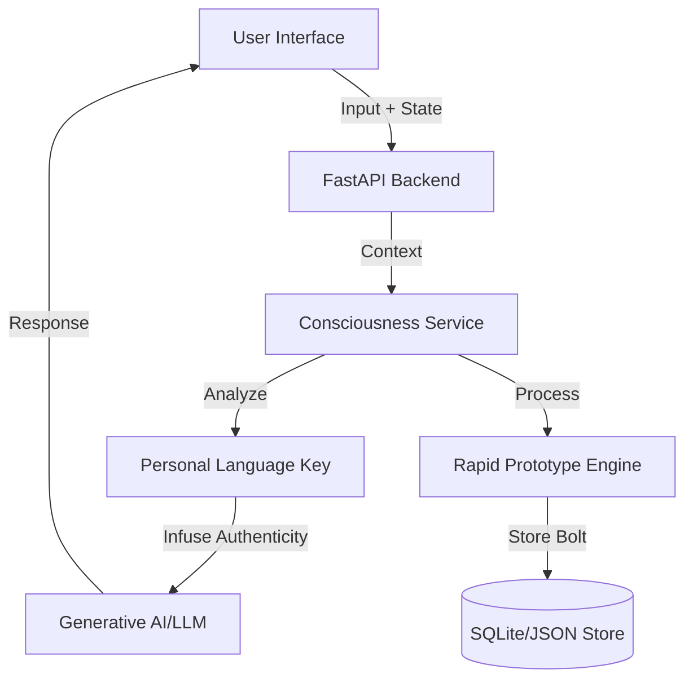
```mermaid
flowchart TD
    UI[User Interface] -->|Input + State| API[FastAPI Backend]
    API -->|Context| CS[Consciousness Service]
    CS -->|Analyze| PLK[Personal Language Key]
    CS -->|Process| RPE[Rapid Prototype Engine]
    PLK -->|Infuse Authenticity| AI[Generative AI/LLM]
    AI -->|Response| UI
    RPE -->|Store Bolt| DB[(SQLite/JSON Store)]
```
The system captures "lightning bolt" thoughts by analyzing input resonance against established linguistic patterns.
Sources: [GestaltView_ADHD_MVP_v2.0.py:302-315](), [brain-sparks-core.py.txt:269-290]()

## Key Functional Modules

The platform is structured around several specialized engines that handle different aspects of neurodivergent support.

### 1. Personal Language Key (PLK)
The PLK is a linguistic framework that ensures communication is "consciousness-serving." It avoids clinical or stigmatizing language (e.g., "deficit," "broken") in favor of empowering metaphors like the "Exploded Picture Mind" for ADHD processing.
Sources: [brain-sparks-core.py.txt:64-115]()

### 2. Rapid Prototype Engine (RPE)
The RPE captures creative insights, known as "Lightning Bolts," at high velocity. It scores these insights based on resonance with the user's PLK and identifies patterns across disparate thoughts.
Sources: [brain-sparks-core.py.txt:256-295]()

### 3. ADHD Executive Function Agent
This agent orchestrates tasks based on the user's "Consciousness Context," which includes emotional state, energy level, and sentiment. For instance, if a user is "overwhelmed," the agent suggests "gentle nudges" like grounding exercises rather than complex tasks.
Sources: [GestaltView_ADHD_MVP_v2.0.py:126-145]()

### Component Summary Table

| Component | Description | Primary File Reference |
| :--- | :--- | :--- |
| **ADHDExecutiveFunctionAgent** | Suggests tasks based on emotional/energy context. | [GestaltView_ADHD_MVP_v2.0.py:126]() |
| **RapidPrototypeEngine** | Captures and tags high-intensity "Lightning Bolts." | [brain-sparks-core.py.txt:269]() |
| **StigmaShieldProtocol** | Protects users from internal/external shame via affirmations. | [brain-sparks-core.py.txt:341]() |
| **MultiModalProcessor** | Fuses text and audio metadata for unified AI processing. | [brain-sparks-core.py.txt:402]() |
| **CreationCornerEngine** | Synthesizes "chaos" inputs into structured reflections. | [brain-sparks-core.py.txt:441]() |

## Interactive User Stations

The project features specialized frontend interfaces designed for different cognitive needs.

### Brain Sparks Station
Focuses on the immediate capture of thoughts. It uses "Electric Effects" and "Neural Network" visualizations to provide sensory feedback during the processing of a "Spark."
Sources: [BrainSparksStation.tsx:43-70]()

### ADHD Power-Up Station
Provides cognitive scaffolding through:
*   **Power-Ups**: Short, timed activities (e.g., "5-Minute Focus Sprint," "Box Breathing").
*   **AI Companion**: A chat interface for talking through overwhelm.
*   **Private Journal**: A safe space for unfiltered reflection stored locally.
Sources: [ADHDPowerUpStation.tsx:44-55](), [ADHDPowerUpStation.tsx:238-270]()

## API and Integration Layer

The backend uses a routing system to connect the UI to the AI models. The `universal_consciousness_router` acts as the primary gateway for exhibit requests, ensuring that neurodivergent support parameters are passed to the underlying LLM.

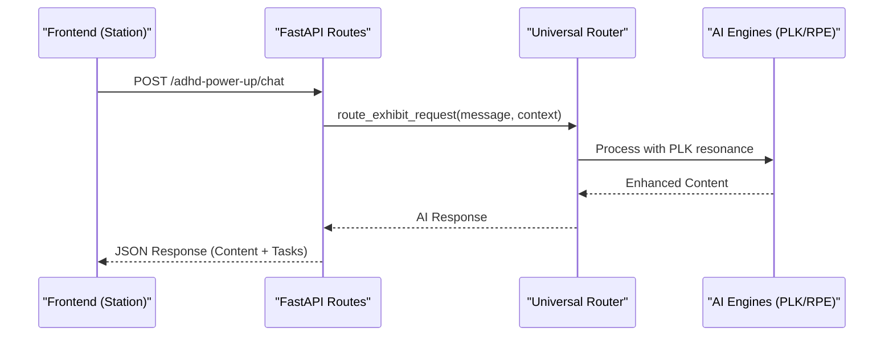
```mermaid
sequenceDiagram
    participant User as "Frontend (Station)"
    participant Routes as "FastAPI Routes"
    participant Router as "Universal Router"
    participant Engine as "AI Engines (PLK/RPE)"

    User->>Routes: POST /adhd-power-up/chat
    Routes->>Router: route_exhibit_request(message, context)
    Router->>Engine: Process with PLK resonance
    Engine-->>Router: Enhanced Content
    Router-->>Routes: AI Response
    Routes-->>User: JSON Response (Content + Tasks)
```
Sources: [adhd_power_up_routes.py:22-38](), [brain_sparks_routes.py:23-45]()

### Primary API Endpoints

| Endpoint | Method | Purpose | Source |
| :--- | :--- | :--- | :--- |
| `/initialize` | POST | Starts a user session and generates a profile. | [GestaltView_ADHD_MVP_v2.0.py:301]() |
| `/chat` | POST | Processes input with energy/state awareness. | [adhd_power_up_routes.py:22]() |
| `/api/lightning-bolt/capture` | POST | Persists a specific "Lightning Bolt" to the database. | [lightning_bolt (1).py:26]() |
| `/analytics/{user_id}` | GET | Returns session stats and state distribution. | [GestaltView_ADHD_MVP_v2.0.py:321]() |

## Summary
The GestaltView ADHD Power-Up system represents a shift from "deficit-based" AI tools to "consciousness-serving" partners. By leveraging a complex backend of linguistic resonance and state-aware agents, it provides a supportive environment where neurodivergent users can navigate overwhelm and capture brilliance. The integration of specialized protocols like the Stigma Shield and the Creation Corner ensures that the system serves the whole person, prioritizing emotional well-being alongside productivity.

### Getting Started & Local Setup

<details>
<summary>Relevant source files</summary>

The following files were used as context for generating this wiki page:

- [GestaltView_ADHD_MVP_v2.0.py](https://github.com/faagestalt-web/ADHD_Power_Up/blob/main/GestaltView_ADHD_MVP_v2.0.py)
- [brain-sparks-core.py.txt](https://github.com/faagestalt-web/ADHD_Power_Up/blob/main/brain-sparks-core.py.txt)
- [ADHDPowerUpStation.tsx](https://github.com/faagestalt-web/ADHD_Power_Up/blob/main/frontend/src/components/ADHDPowerUpStation.tsx)
- [BrainSparksStation.tsx](https://github.com/faagestalt-web/ADHD_Power_Up/blob/main/frontend/src/components/BrainSparksStation.tsx)
- [adhd_power_up_routes.py](https://github.com/faagestalt-web/ADHD_Power_Up/blob/main/backend/routes/adhd_power_up_routes.py)
- [brain_sparks_routes.py](https://github.com/faagestalt-web/ADHD_Power_Up/blob/main/backend/routes/brain_sparks_routes.py)
- [lightning_bolt (1).py](https://github.com/faagestalt-web/ADHD_Power_Up/blob/main/backend/routes/lightning_bolt.py)

</details>

# Getting Started & Local Setup

The ADHD Power-Up project is a "consciousness-serving" AI platform designed to support neurodivergent experiences, specifically for individuals with ADHD and those in addiction recovery. It functions as a state-aware partner that provides agentic task orchestration, emotional support through AI-powered insights, and tools for "lightning bolt" thought capture. Sources: [GestaltView_ADHD_MVP_v2.0.py:19-25](), [brain-sparks-core.py.txt:5-10]()

The system is architected as a decoupled application with a FastAPI-based backend and a React/TypeScript frontend. It integrates advanced cognitive modeling via the Personal Language Key (PLK) and the Rapid Prototype Engine (RPE) to map human cognitive complexity into actionable data. Sources: [GestaltView_ADHD_MVP_v2.0.py:118-124](), [brain-sparks-core.py.txt:58-65]()

## Prerequisites & Environment Configuration

Before setting up the environment, ensure the following software is installed:
*   **Python 3.9+** for backend services.
*   **Docker** (optional) for containerized deployment.
*   **Node.js/npm** for frontend development.
Sources: [GestaltView_ADHD_MVP_v2.0.py:32-35]()

### Environment Variables
A `.env` file must be created in the `backend/` directory. If a `MASTER_KEY` is not provided, the system generates a temporary one on startup for encryption (not recommended for production). Sources: [GestaltView_ADHD_MVP_v2.0.py:79-82](), [GestaltView_ADHD_MVP_v2.0.py:186-191]()

| Variable | Requirement | Description |
| :--- | :--- | :--- |
| `HUGGINGFACE_API_TOKEN` | Required | Token for generative text (Mistral-7B) and emotion analysis. |
| `MASTER_KEY` | Optional | 32-byte key for encrypting user feedback; auto-generated if missing. |
| `API_KEY` | Optional | Used for securing lightning bolt capture endpoints. |
| `LIGHTNING_BOLT_DB_PATH`| Optional | Path to the SQLite database for storing captured thoughts. |

Sources: [GestaltView_ADHD_MVP_v2.0.py:84-95](), [lightning_bolt (1).py:16-25]()

## Backend Installation

The backend relies on several core Python libraries for API routing, data science, and encryption. Sources: [GestaltView_ADHD_MVP_v2.0.py:101-112]()

1.  **Environment Setup**:
    ```bash
    cd backend
    python -m venv venv
    source venv/bin/activate  # On Windows: venv\Scripts\activate
    ```
2.  **Install Dependencies**:
    ```bash
    pip install -r requirements.txt
    ```
3.  **Core Dependencies**:
    *   `fastapi` & `uvicorn`: Web server and API routing.
    *   `cryptography`: Secure handling of user feedback.
    *   `scikit-learn` & `numpy`: Multi-modal processing and TF-IDF vectorization.
    *   `google-cloud-language`: Optional sentiment analysis.
Sources: [GestaltView_ADHD_MVP_v2.0.py:101-112](), [brain-sparks-core.py.txt:22-30]()

## Local Development Execution

The application requires two separate processes to run concurrently. Sources: [GestaltView_ADHD_MVP_v2.0.py:53-65]()

### Starting the Backend
From the `backend` directory, start the Uvicorn server:
```bash
uvicorn gestaltview_api:app --reload
```
The API becomes available at `http://localhost:8000`. Sources: [GestaltView_ADHD_MVP_v2.0.py:59-60]()

### Starting the Frontend
The frontend is built with React and Tailwind CSS. While a simple HTTP server can serve the build, development is typically done via npm:
```bash
cd frontend
python -m http.server 3000
```
Sources: [GestaltView_ADHD_MVP_v2.0.py:63-65]()

## System Architecture & Data Flow

The architecture focuses on the relationship between the user's "Consciousness Context" and the AI's "Personal Language Key" (PLK) resonance. Sources: [GestaltView_ADHD_MVP_v2.0.py:126-135](), [brain-sparks-core.py.txt:67-75]()

### Processing Flow Diagram
The following diagram illustrates how user input (text or metadata) is processed through the multi-modal engine and recorded.

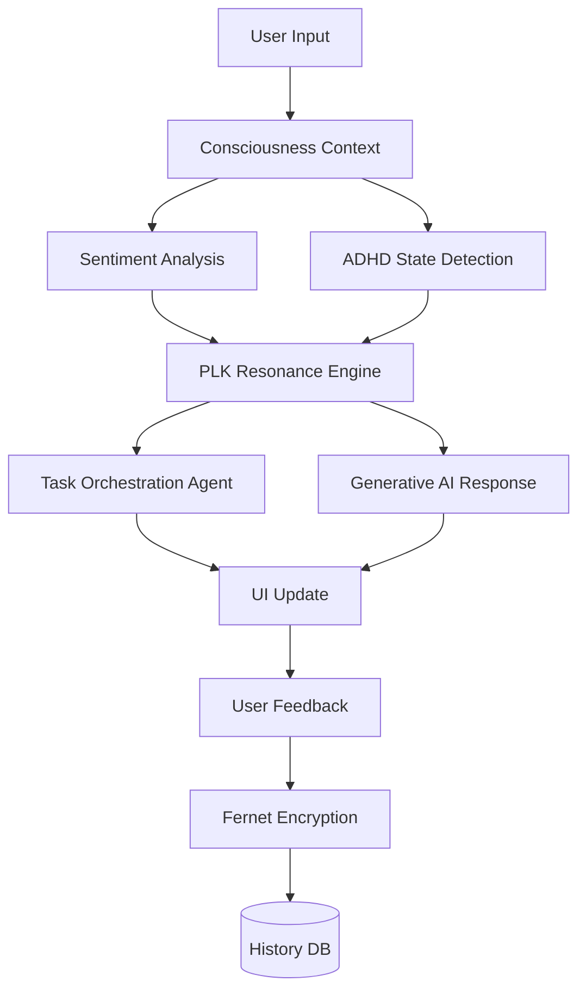
```mermaid
flowchart TD
    User[User Input] --> Context[Consciousness Context]
    Context --> Sentiment[Sentiment Analysis]
    Context --> State[ADHD State Detection]
    Sentiment & State --> PLK_Engine[PLK Resonance Engine]
    PLK_Engine --> Task_Agent[Task Orchestration Agent]
    PLK_Engine --> Gen_AI[Generative AI Response]
    Task_Agent --> UI[UI Update]
    Gen_AI --> UI
    UI --> Feedback[User Feedback]
    Feedback --> Encryption[Fernet Encryption]
    Encryption --> DB[(History DB)]
```
This diagram shows the flow from user input through cognitive state detection to final encrypted storage. Sources: [GestaltView_ADHD_MVP_v2.0.py:171-205](), [brain-sparks-core.py.txt:416-435]()

### Core Components
| Component | File Path | Responsibility |
| :--- | :--- | :--- |
| `GestaltViewADHDMVP` | `GestaltView_ADHD_MVP_v2.0.py` | Orchestrates sessions, state tracking, and feedback. |
| `EnhancedPersonalLanguageKey` | `brain-sparks-core.py.txt` | Calculates "resonance" and infuses authentic voice. |
| `ADHDExecutiveFunctionAgent` | `GestaltView_ADHD_MVP_v2.0.py` | Suggests tasks based on energy/emotional state. |
| `LightningBoltEngine` | `lightning_bolt (1).py` | Captures and stores creative insights in SQLite. |
| `MultiModalProcessor` | `brain-sparks-core.py.txt` | Fuses text vectors with audio/music metadata. |

Sources: [GestaltView_ADHD_MVP_v2.0.py:171-180](), [brain-sparks-core.py.txt:72-80](), [brain-sparks-core.py.txt:405-415]()

## API Endpoint Reference

The backend exposes several RESTful endpoints for session management and feature interaction. Sources: [GestaltView_ADHD_MVP_v2.0.py:270-305](), [adhd_power_up_routes.py:17-40]()

| Method | Endpoint | Description |
| :--- | :--- | :--- |
| `POST` | `/initialize` | Starts a new session and generates a `profile_id`. |
| `POST` | `/chat` | Processes user input and returns AI response + tasks. |
| `POST` | `/api/lightning-bolt/capture`| Records high-intensity creative insights. |
| `POST` | `/brain-sparks/ignite` | Explores neural pathways from a single thought. |
| `GET` | `/analytics/{user_id}` | Retrieves session statistics and state distribution. |

Sources: [GestaltView_ADHD_MVP_v2.0.py:284-302](), [brain_sparks_routes.py:17-25](), [lightning_bolt (1).py:27-35]()

### Interaction Sequence
This sequence shows the interaction during a typical "Chat" event where the state is updated.

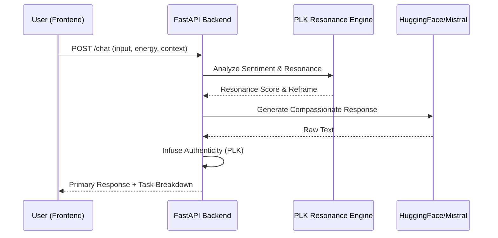
```mermaid
sequenceDiagram
    participant U as User (Frontend)
    participant API as FastAPI Backend
    participant PLK as PLK Resonance Engine
    participant LLM as HuggingFace/Mistral
    
    U->>API: POST /chat (input, energy, context)
    API->>PLK: Analyze Sentiment & Resonance
    PLK-->>API: Resonance Score & Reframe
    API->>LLM: Generate Compassionate Response
    LLM-->>API: Raw Text
    API->>API: Infuse Authenticity (PLK)
    API-->>U: Primary Response + Task Breakdown
```
Sources: [GestaltView_ADHD_MVP_v2.0.py:205-235](), [adhd_power_up_routes.py:27-35]()

## Local Testing
To ensure the backend logic remains intact during setup, run the integrated test suite:
```bash
cd backend
pytest
```
The test suite includes mocks for AI services to test grounding logic for "overwhelmed" states and full API flow integration. Sources: [GestaltView_ADHD_MVP_v2.0.py:315-345]()

## Summary
Setting up ADHD Power-Up locally requires configuring a Python environment with access to generative AI tokens (HuggingFace). The system uses a unique PLK resonance engine to provide empathetic support, supported by a FastAPI backend that handles encrypted feedback and task orchestration based on real-time emotional and energy states. Sources: [GestaltView_ADHD_MVP_v2.0.py:19-28](), [brain-sparks-core.py.txt:530-545]()


## System Architecture

### System Architecture Overview

<details>
<summary>Relevant source files</summary>

The following files were used as context for generating this wiki page:

- [GestaltView_ADHD_MVP_v2.0.py](https://github.com/faagestalt-web/ADHD_Power_Up/blob/main/GestaltView_ADHD_MVP_v2.0.py)
- [brain-sparks-core.py.txt](https://github.com/faagestalt-web/ADHD_Power_Up/blob/main/brain-sparks-core.py.txt)
- [BrainSparksStation.tsx](https://github.com/faagestalt-web/ADHD_Power_Up/blob/main/BrainSparksStation.tsx)
- [ADHDPowerUpStation.tsx](https://github.com/faagestalt-web/ADHD_Power_Up/blob/main/ADHDPowerUpStation.tsx)
- [adhd_power_up_routes.py](https://github.com/faagestalt-web/ADHD_Power_Up/blob/main/adhd_power_up_routes.py)
- [brain_sparks_routes.py](https://github.com/faagestalt-web/ADHD_Power_Up/blob/main/brain_sparks_routes.py)
- [lightning_bolt (1).py](https://github.com/faagestalt-web/ADHD_Power_Up/blob/main/lightning_bolt%20%281).py)
</details>

# System Architecture Overview

The ADHD Power-Up platform (also referred to as GestaltView) is a consciousness-serving AI architecture designed specifically for neurodivergent individuals. The system functions as a "state-aware partner," integrating multi-modal data processing, agentic task orchestration, and empathetic AI feedback loops to support users in navigating emotional states and executive function challenges.

The architecture is built on a decoupled Client-Server model, utilizing a FastAPI backend for core logic and AI integration, and React/HTML5 frontends for interactive user interfaces. It emphasizes "cognitive scaffolding" through specialized modules like the Personal Language Key (PLK) and the Rapid Prototype Engine (RPE).
Sources: [GestaltView_ADHD_MVP_v2.0.py:12-25](), [brain-sparks-core.py.txt:14-20](), [ADHDPowerUpStation.tsx:43-48]()

## Core Backend Components

The backend architecture centers around several specialized engines and services that manage user state, AI responses, and data security.

### 1. Personal Language Key (PLK) & Resonance Engine
The PLK is a linguistic framework that ensures "consciousness-serving communication." It uses signature metaphors and energy words to infuse authenticity into AI responses while avoiding identified trigger words. A resonance engine calculates a "resonance score" to measure how effectively a piece of text aligns with the user's cognitive style.
Sources: [brain-sparks-core.py.txt:59-100](), [brain-sparks-core.py.txt:143-160]()

### 2. ADHD Executive Function Agent
This agent acts as a task orchestrator. It consumes a `ConsciousnessContext`—composed of emotional state, energy levels, and ADHD-specific clues—to dynamically suggest grounding exercises or low-energy activities when a user is overwhelmed.
Sources: [GestaltView_ADHD_MVP_v2.0.py:116-130]()

### 3. Rapid Prototype Engine (RPE) & Lightning Bolt Capture
The RPE manages "Lightning Bolts," which are high-intensity creative insights captured at velocity. These insights are tagged, scored for resonance, and stored with contextual metadata to track "thought evolution pathways."
Sources: [brain-sparks-core.py.txt:202-230](), [lightning_bolt (1).py:26-32]()

### Backend Component Interaction
The following diagram illustrates how core backend classes interact to process user input.

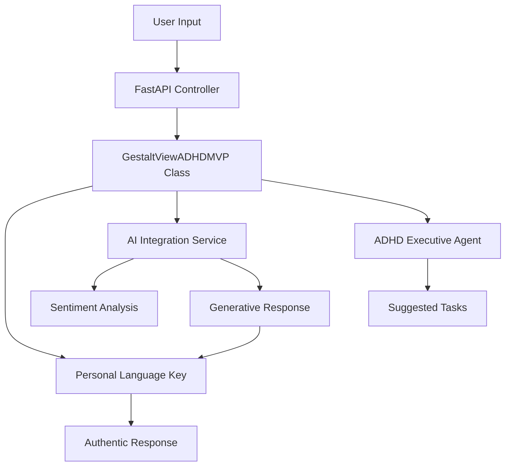
```mermaid
flowchart TD
    UI[User Input] --> API[FastAPI Controller]
    API --> MVP[GestaltViewADHDMVP Class]
    MVP --> PLK[Personal Language Key]
    MVP --> AI[AI Integration Service]
    MVP --> AGENT[ADHD Executive Agent]
    AGENT --> TASK[Suggested Tasks]
    AI --> SENT[Sentiment Analysis]
    AI --> GEN[Generative Response]
    GEN --> PLK
    PLK --> RESP[Authentic Response]
```
Sources: [GestaltView_ADHD_MVP_v2.0.py:202-248](), [brain-sparks-core.py.txt:436-455]()

## Frontend Stations and Modules

The system presents different "Stations" to the user, each tailored to specific neurodivergent needs.

| Station | Purpose | Key Features |
| :--- | :--- | :--- |
| **ADHD Power-Up** | Cognitive Scaffolding | Focus sprints, Box breathing, AI Companion chat |
| **Brain Sparks** | Insight Capture | Lightning bolt capturing, PLK pattern analysis, Neural visualizations |
| **Creation Corner** | Synthesis | Transforming "chaos" inputs into structured creations/insights |
| **Journal** | Reflection | Private, local-first storage for unfiltered thoughts |

Sources: [ADHDPowerUpStation.tsx:16-25](), [BrainSparksStation.tsx:16-25](), [brain-sparks-core.py.txt:414-428]()

## Data Flow and API Structure

The system uses a set of RESTful endpoints to manage sessions, capture data, and retrieve analytics.

### Chat and Feedback Flow
When a user sends a message, the system performs sentiment analysis and context mapping before generating a response.

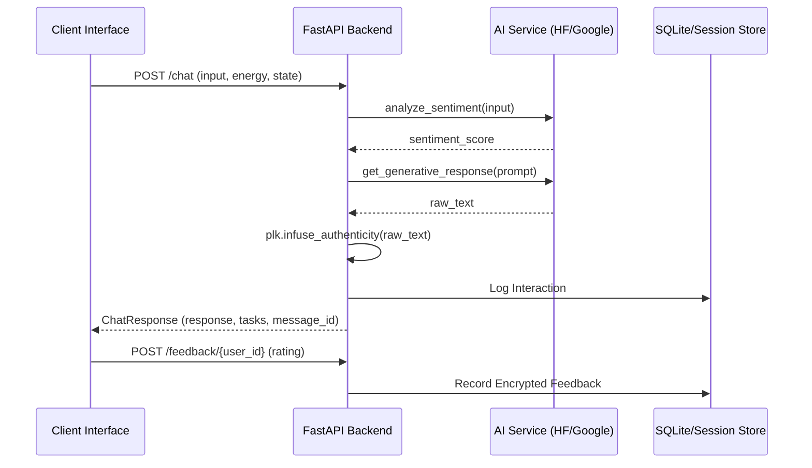
```mermaid
sequenceDiagram
    participant User as Client Interface
    participant API as FastAPI Backend
    participant AI as AI Service (HF/Google)
    participant DB as SQLite/Session Store

    User->>API: POST /chat (input, energy, state)
    API->>AI: analyze_sentiment(input)
    AI-->>API: sentiment_score
    API->>AI: get_generative_response(prompt)
    AI-->>API: raw_text
    API->>API: plk.infuse_authenticity(raw_text)
    API->>DB: Log Interaction
    API-->>User: ChatResponse (response, tasks, message_id)
    User->>API: POST /feedback/{user_id} (rating)
    API->>DB: Record Encrypted Feedback
```
Sources: [GestaltView_ADHD_MVP_v2.0.py:270-285](), [adhd_power_up_routes.py:22-38]()

### API Endpoints
| Endpoint | Method | Description | Source |
| :--- | :--- | :--- | :--- |
| `/initialize` | POST | Creates a new user session and profile ID. | [GestaltView_ADHD_MVP_v2.0.py:265]() |
| `/chat` | POST | Processes text through AI services and the ADHD agent. | [adhd_power_up_routes.py:22]() |
| `/api/lightning-bolt/capture` | POST | Stores a high-intensity creative "bolt." | [lightning_bolt (1).py:26]() |
| `/analytics/{user_id}` | GET | Retrieves session stats and feedback distribution. | [GestaltView_ADHD_MVP_v2.0.py:287]() |
| `/brain-sparks/ignite` | POST | Explores neural pathways for a given thought. | [brain_sparks_routes.py:20]() |

## Data Models and Security

### Encryption and Privacy
The system implements a "Privacy-First" design. User feedback is encrypted using a `Fernet` encryption manager before storage. Additionally, the Journal module in the frontend is designed for local-only storage (using `localStorage`) to ensure unfiltered reflections remain private.
Sources: [GestaltView_ADHD_MVP_v2.0.py:195-200](), [ADHDPowerUpStation.tsx:180-185]()

### Core Data Entities
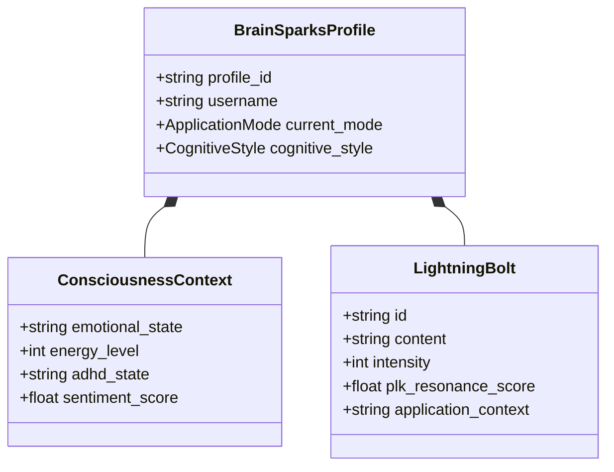
```mermaid
classDiagram
    class ConsciousnessContext {
        +string emotional_state
        +int energy_level
        +string adhd_state
        +float sentiment_score
    }
    class LightningBolt {
        +string id
        +string content
        +int intensity
        +float plk_resonance_score
        +string application_context
    }
    class BrainSparksProfile {
        +string profile_id
        +string username
        +ApplicationMode current_mode
        +CognitiveStyle cognitive_style
    }
    BrainSparksProfile *-- ConsciousnessContext
    BrainSparksProfile *-- LightningBolt
```
Sources: [brain-sparks-core.py.txt:436-470](), [GestaltView_ADHD_MVP_v2.0.py:108-114]()

## System Summary

The architecture effectively bridges the gap between raw AI processing and neurodivergent usability through the use of the Personal Language Key and ADHD-specific agents. By decoupling the interactive "Stations" (Power-Up, Brain Sparks) from the core "Consciousness-Serving" backend, the system allows for modular expansion of support features while maintaining a consistent, empathetic user experience.
Sources: [GestaltView_ADHD_MVP_v2.0.py:16-30](), [brain-sparks-core.py.txt:540-555]()


## Core Features

### ADHD Power Up Station

<details>
<summary>Relevant source files</summary>

The following files were used as context for generating this wiki page:

- [ADHDPowerUpStation.tsx](https://github.com/faagestalt-web/ADHD_Power_Up/blob/main/ADHDPowerUpStation.tsx)
- [adhd\_power\_up\_routes.py](https://github.com/faagestalt-web/ADHD_Power_Up/blob/main/adhd_power_up_routes.py)
- [GestaltView_ADHD_MVP_v2.0.py](https://github.com/faagestalt-web/ADHD_Power_Up/blob/main/GestaltView_ADHD_MVP_v2.0.py)
- [brain-sparks-core.py.txt](https://github.com/faagestalt-web/ADHD_Power_Up/blob/main/brain-sparks-core.py.txt)
- [brain_sparks_routes.py](https://github.com/faagestalt-web/ADHD_Power_Up/blob/main/brain_sparks_routes.py)
- [BrainSparksStation.tsx](https://github.com/faagestalt-web/ADHD_Power_Up/blob/main/BrainSparksStation.tsx)
</details>

# ADHD Power Up Station

The **ADHD Power Up Station** is a specialized "cognitive scaffolding hub" designed to support neurodivergent users through state-aware AI interactions, task orchestration, and rapid behavioral resets. It functions as a consciousness-serving interface that helps users navigate internal states such as overwhelm, hyperfocus, and understimulation by providing empathetic feedback and actionable "Power-Ups."

The system integrates high-level AI orchestration with local user data to create a privacy-first environment for reflection and executive function support. It operates alongside the [Brain Sparks Station](#brain-sparks-station) to map "lightning bolt" thoughts into actionable knowledge patterns.

Sources: [ADHDPowerUpStation.tsx:39-47](), [GestaltView_ADHD_MVP_v2.0.py:12-18]()

## System Architecture

The station utilizes a React-based frontend for the user interface and a FastAPI backend for processing consciousness context and AI responses.

### Frontend Components
The frontend is structured into three primary functional areas:
1.  **Power-Up Selector**: Provides timed exercises (Focus, Calm, Energy) to help users reset their cognitive state.
2.  **AI Companion**: A chat interface that communicates with the backend to provide "cognitive scaffolding."
3.  **Private Journal**: A client-side storage module for unfiltered reflection, ensuring privacy by keeping data local.

Sources: [ADHDPowerUpStation.tsx:32-35](), [ADHDPowerUpStation.tsx:55-59]()

### Backend Logic & AI Orchestration
The backend employs an `ADHDExecutiveFunctionAgent` and a `UniversalConsciousnessRouter` to process user input based on their current "Consciousness Context."

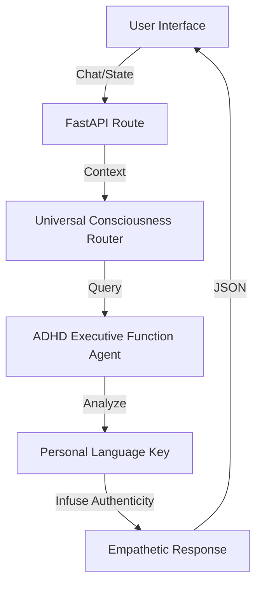
```mermaid
flowchart TD
    User[User Interface] -->|Chat/State| API[FastAPI Route]
    API -->|Context| Router[Universal Consciousness Router]
    Router -->|Query| Agent[ADHD Executive Function Agent]
    Agent -->|Analyze| PLK[Personal Language Key]
    PLK -->|Infuse Authenticity| Response[Empathetic Response]
    Response -->|JSON| User
```
This diagram illustrates the flow from a user's input through the AI orchestration layer to generate a "consciousness-serving" response.
Sources: [adhd_power_up_routes.py:23-35](), [GestaltView_ADHD_MVP_v2.0.py:92-109](), [brain-sparks-core.py.txt:495-515]()

## Data Models and State Management

The system tracks several neurodivergent-specific states and energy levels to tailor its interventions.

### ADHD States
The system recognizes four primary states:
| State | Description |
| :--- | :--- |
| `focused` | High attention, balanced energy. |
| `overwhelmed` | High cognitive load, requires "Gentle Nudges." |
| `hyperfocus` | Intense absorption, may require reminders to break. |
| `understimulated` | Low engagement, requires "Energy Sparks." |

Sources: [ADHDPowerUpStation.tsx:36](), [GestaltView_ADHD_MVP_v2.0.py:161-163]()

### The Consciousness Context
The `ConsciousnessContext` data structure is used to package user state for the AI agent:
```python
@dataclass
class ConsciousnessContext:
    emotional_state: str
    energy_level: int
    adhd_state: str
    sentiment_score: float
```
Sources: [GestaltView_ADHD_MVP_v2.0.py:86-90]()

## Key Features

### Power-Up Interventions
Power-Ups are categorized interventions designed for rapid state shifts.
| Category | Title | Description | Duration |
| :--- | :--- | :--- | :--- |
| **Focus** | 5-Minute Focus Sprint | Work on one task without distraction. | 300s |
| **Focus** | The Two-Minute Rule | Complete a small task immediately. | 120s |
| **Calm** | Box Breathing | Regulate the nervous system (4-4-4-4). | 180s |
| **Energy** | Energy Spark | Physical movement (jumping jacks). | 60s |

Sources: [ADHDPowerUpStation.tsx:16-24]()

### AI Companion & PLK Integration
The AI Companion uses the **Enhanced Personal Language Key (PLK)** to ensure communication is "consciousness-serving." It avoids trigger words like "fix" or "normal" and instead uses "energy words" such as "revolutionary," "authentic," and "sovereign."

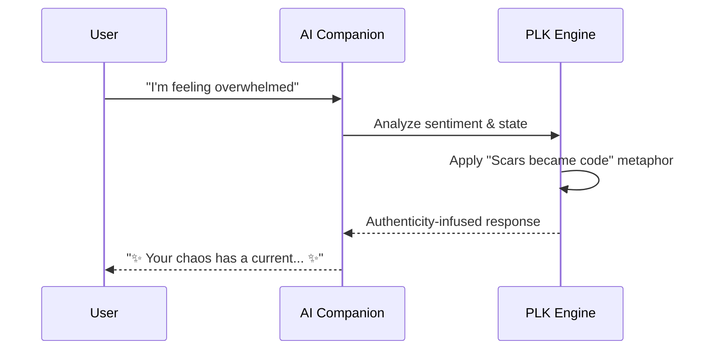
```mermaid
sequenceDiagram
    participant U as User
    participant C as AI Companion
    participant P as PLK Engine
    U->>C: "I'm feeling overwhelmed"
    C->>P: Analyze sentiment & state
    P->>P: Apply "Scars became code" metaphor
    P-->>C: Authenticity-infused response
    C-->>U: "✨ Your chaos has a current... ✨"
```
The sequence diagram shows how the PLK Engine modifies raw AI output to align with the project's empathetic communication standards.
Sources: [brain-sparks-core.py.txt:68-120](), [GestaltView_ADHD_MVP_v2.0.py:177-183]()

## API Endpoints

The station interacts with the backend via the following routes:

### `POST /api/adhd-power-up/chat`
Processes user messages within the specific exhibit context.
- **Request Body**: `message` (string), `energy_level` (int 1-10), `adhd_state` (string).
- **Functionality**: Routes the request through the `universal_consciousness_router` with `neurodivergent_support` enabled.
Sources: [adhd_power_up_routes.py:13-35](), [ADHDPowerUpStation.tsx:185-191]()

### `GET /analytics/{user_id}`
Retrieves session insights including:
- **State Distribution**: Frequency of states like "overwhelmed" or "focused."
- **Feedback by State**: Ratio of positive feedback per cognitive state.
Sources: [GestaltView_ADHD_MVP_v2.0.py:206-228](), [GestaltView_ADHD_MVP_v2.0.py:270-273]()

## Implementation Details: Task Orchestration

The `ADHDExecutiveFunctionAgent` dynamically generates tasks based on the `ConsciousnessContext`. If a user is identified as "overwhelmed," the agent automatically prioritizes "Gentle Nudge" tasks, such as grounding exercises.

```python
async def discover_tasks(self, context: ConsciousnessContext) -> List[Dict]:
    tasks = []
    if context.adhd_state == "overwhelmed" or context.sentiment_score < -0.5:
        tasks.append({
            "description": self.plk.infuse_authenticity("Practice a 2-minute grounding exercise."),
            "priority": TaskPriority.GENTLE_NUDGE
        })
    return tasks
```
Sources: [GestaltView_ADHD_MVP_v2.0.py:96-103]()

## Summary
The ADHD Power Up Station serves as a critical interface for neurodivergent users within the platform. By combining real-time state analysis with the Personal Language Key and specific behavioral interventions, it provides a "cognitive scaffold" that translates chaotic internal states into manageable, authentic actions.

### Brain Sparks Station

<details>
<summary>Relevant source files</summary>

The following files were used as context for generating this wiki page:

- [BrainSparksStation.tsx](https://github.com/faagestalt-web/ADHD_Power_Up/blob/main/BrainSparksStation.tsx)
- [brain-sparks-core.py.txt](https://github.com/faagestalt-web/ADHD_Power_Up/blob/main/brain-sparks-core.py.txt)
- [brain\_sparks\_routes.py](https://github.com/faagestalt-web/ADHD_Power_Up/blob/main/brain_sparks_routes.py)
- [lightning_bolt (1).py](https://github.com/faagestalt-web/ADHD_Power_Up/blob/main/lightning_bolt%20%281).py)
- [ADHDPowerUpStation.tsx](https://github.com/faagestalt-web/ADHD_Power_Up/blob/main/ADHDPowerUpStation.tsx)
</details>

# Brain Sparks Station

The **Brain Sparks Station** is a specialized exhibit and technical framework within the ADHD Power Up ecosystem designed to capture, analyze, and synthesize "lightning bolt" thoughts—high-velocity creative insights—into structured knowledge patterns. It acts as a bridge between raw human consciousness and structured AI output, utilizing a proprietary "Personal Language Key" (PLK) to ensure communication resonance and authenticity.

The system serves both as a standalone thought-capture interface and as a foundational engine for other modules, such as the [ADHD Power-Up Station](#adhd-powerup-station), where it powers task orchestration through cognitive scaffolding.
Sources: [BrainSparksStation.tsx:1-24](), [brain-sparks-core.py.txt:1-12](), [ADHDPowerUpStation.tsx:210-220]()

## System Architecture

The Brain Sparks Station utilizes a decoupled architecture consisting of a React-based frontend for immersive visualization and a Python-based backend for cognitive processing and pattern matching.

### High-Level Component Overview

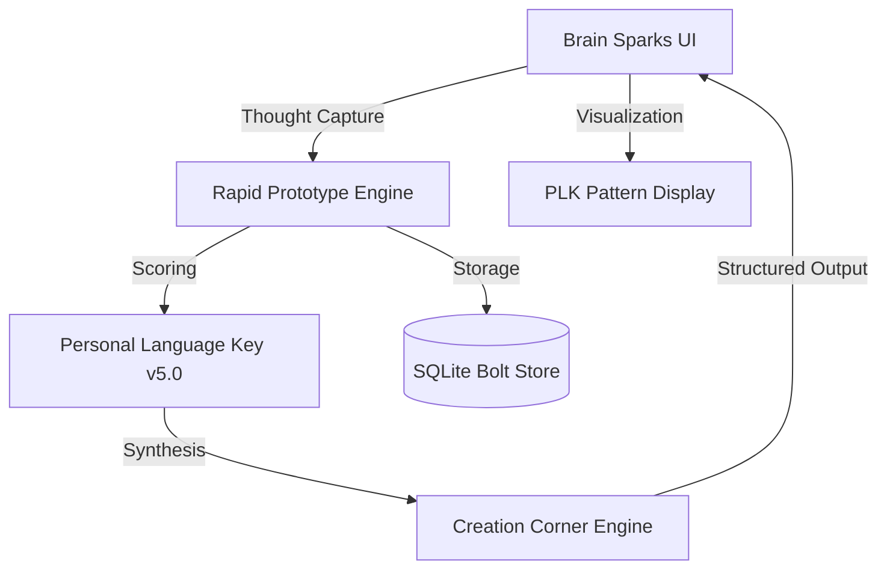
```mermaid
graph TD
    UI[Brain Sparks UI] -->|Thought Capture| RPE[Rapid Prototype Engine]
    UI -->|Visualization| PLK_Viz[PLK Pattern Display]
    RPE -->|Scoring| PLK[Personal Language Key v5.0]
    RPE -->|Storage| DB[(SQLite Bolt Store)]
    PLK -->|Synthesis| CC[Creation Corner Engine]
    CC -->|Structured Output| UI
```
The architecture demonstrates the flow of a captured insight through the Rapid Prototype Engine (RPE) for scoring via the PLK before being synthesized in the Creation Corner.
Sources: [BrainSparksStation.tsx:68-120](), [brain-sparks-core.py.txt:180-210](), [lightning_bolt (1).py:16-25]()

## Core Cognitive Engines

### Personal Language Key (PLK) v5.0
The PLK is the "linguistic fingerprint" of the system, designed to facilitate "consciousness-serving" communication. It utilizes a library of signature metaphors and energy words to calculate a **Resonance Score** (0-100) for every captured thought.

| Feature | Description |
| :--- | :--- |
| **Signature Metaphors** | Concepts like "Beautiful Tapestry" (consciousness) or "Exploded Picture Mind" (ADHD processing). |
| **Resonance Scoring** | A calculation based on metaphor usage, energy words (e.g., "revolutionary", "authentic"), and avoidance of trigger words (e.g., "broken", "disorder"). |
| **Authenticity Infusion** | A post-processing step that adds signature metaphors and visual icons (e.g., 🌟, ✨) to AI responses. |

Sources: [brain-sparks-core.py.txt:62-110](), [brain-sparks-core.py.txt:120-150]()

### Rapid Prototype Engine (RPE)
The RPE is responsible for the velocity-based capture of insights. It transforms raw text into `LightningBolt` objects, which include metadata such as intensity, PLK resonance scores, and automated tags (e.g., "breakthrough", "adhd").
Sources: [brain-sparks-core.py.txt:182-205](), [lightning_bolt (1).py:26-32]()

## Data Flow: Insight Capture & Synthesis

When a user submits a thought via the `BrainSparksStation` interface, the system initiates a multi-stage processing pipeline.

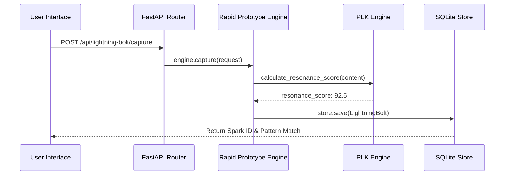
```mermaid
sequenceDiagram
    participant U as User Interface
    participant API as FastAPI Router
    participant RPE as Rapid Prototype Engine
    participant PLK as PLK Engine
    participant DB as SQLite Store

    U->>API: POST /api/lightning-bolt/capture
    API->>RPE: engine.capture(request)
    RPE->>PLK: calculate_resonance_score(content)
    PLK-->>RPE: resonance_score: 92.5
    RPE->>DB: store.save(LightningBolt)
    DB-->>U: Return Spark ID & Pattern Match
```
The sequence shows the transition from raw user input to a stored, scored, and categorized "Lightning Bolt" insight.
Sources: [BrainSparksStation.tsx:82-110](), [lightning_bolt (1).py:26-32](), [brain-sparks-core.py.txt:190-205]()

### Processing Stages
The frontend visualizes the backend processing through five distinct stages:
1.  **Capturing**: Initial ingestion of the text input.
2.  **Analyzing**: Tokenization and initial metadata extraction.
3.  **Connecting**: Identifying related neural pathways or previously stored bolts.
4.  **Integrating**: Mapping the thought to PLK patterns.
5.  **Complete**: Final synthesis and readiness for export.

Sources: [BrainSparksStation.tsx:39](), [BrainSparksStation.tsx:88-95]()

## Specialized Integration: Addiction Recovery

The system includes a specialized "Addiction Recovery Mode" that leverages the PLK for trauma-to-strength transformation. This module introduces specific data structures to support long-term recovery.

*   **Stigma Shield Protocol**: Provides shame-interrupt patterns and self-compassion frameworks (e.g., "You are not your addiction").
*   **Recovery Journey Map**: Tracks stages from Early Recovery to Long-Term Recovery (5+ years).
*   **Musical DNA Profile**: Maps emotional associations to musical themes, such as the "When I Know My Path Of Struggle" reference for resilience.

Sources: [brain-sparks-core.py.txt:46-56](), [brain-sparks-core.py.txt:230-260](), [brain-sparks-core.py.txt:298-315]()

## API Reference

### Brain Sparks Ignite
`POST /brain-sparks/ignite`
Explores neural pathways based on a specific thought type.

| Parameter | Type | Description |
| :--- | :--- | :--- |
| `thought` | string | The raw text to process. |
| `spark_type` | string | Category (e.g., "Insight Genesis"). |
| `context` | dict | Optional metadata for the LLM router. |

Sources: [brain_sparks_routes.py:15-30]()

### Lightning Bolt Capture
`POST /api/lightning-bolt/capture`
Saves a high-intensity insight to the persistent SQLite store.

| Requirement | Value |
| :--- | :--- |
| **Auth** | X-API-Key Header |
| **Engine** | `LightningBoltEngine` |
| **Storage** | `SQLiteBoltStore` |

Sources: [lightning_bolt (1).py:20-32]()

## Technical Implementation Snippet: Resonance Calculation

The following Python logic demonstrates how the system calculates the resonance of a thought against the PLK framework:

```python
def calculate_resonance_score(self, text: str, recovery_context: bool = False) -> float:
    text_lower = text.lower()
    score = 0.0
    
    # Core metaphor scoring
    for metaphor in self.signature_metaphors:
        if metaphor.metaphor.lower() in text_lower:
            base_score = metaphor.emotional_resonance * 2
            if recovery_context and metaphor.recovery_relevance:
                base_score *= 1.5  # Boost recovery-relevant metaphors
            score += base_score
    
    # Energy words boost and Trigger words penalty
    score += sum(12 for word in self.energy_words if word.lower() in text_lower)
    score -= sum(25 for word in self.trigger_words_avoid if word.lower() in text_lower)
    
    return min(100.0, max(0.0, score))
```
Sources: [brain-sparks-core.py.txt:123-146]()

## Conclusion
The Brain Sparks Station provides a robust infrastructure for capturing the transient insights common in neurodivergent cognition. By combining high-speed "lightning bolt" capture with the resonance-based Personal Language Key, the system ensures that user insights are not only preserved but transformed into actionable knowledge patterns that support executive function and emotional resilience.

### Creation Corner Engine

<details>
<summary>Relevant source files</summary>

The following files were used as context for generating this wiki page:

- [brain-sparks-core.py.txt](https://github.com/faagestalt-web/ADHD_Power_Up/blob/main/brain-sparks-core.py.txt)
- [GestaltView_ADHD_MVP_v2.0.py](https://github.com/faagestalt-web/ADHD_Power_Up/blob/main/GestaltView_ADHD_MVP_v2.0.py)
- [BrainSparksStation.tsx](https://github.com/faagestalt-web/ADHD_Power_Up/blob/main/BrainSparksStation.tsx)
- [ADHDPowerUpStation.tsx](https://github.com/faagestalt-web/ADHD_Power_Up/blob/main/ADHDPowerUpStation.tsx)
- [adhd_power_up_routes.py](https://github.com/faagestalt-web/ADHD_Power_Up/blob/main/adhd_power_up_routes.py)
- [brain_sparks_routes.py](https://github.com/faagestalt-web/ADHD_Power_Up/blob/main/brain_sparks_routes.py)
</details>

# Creation Corner Engine

The Creation Corner Engine is a core synthesis module within the Brain Sparks platform designed to transform "chaotic" or fragmented user inputs into structured, meaningful outputs. It serves as a cognitive scaffolding tool, particularly for neurodivergent users, by applying pattern recognition and the Personal Language Key (PLK) to synthesize "lightning bolt" insights into actionable reflections or creative summaries.

The engine operates by analyzing unstructured data—often referred to as "chaos inputs"—and mapping them against emotional resonance scores and specific output types like recovery reflections or creative insights. It acts as the bridge between raw consciousness capture and the structured orchestration of tasks found in the [ADHD Power-Up Station](#adhd-power-up-station).

Sources: [brain-sparks-core.py.txt:378-385](), [brain-sparks-core.py.txt:469-472]()

## Core Architecture and Logic

The Creation Corner Engine relies on a combination of linguistic analysis and state-aware context to process information. It is integrated directly into the `BrainSparksProfile` and utilizes the `EnhancedPersonalLanguageKey` (PLK) to ensure that the generated outputs resonate with the user's authentic voice and emotional state.

### Synthesis Mechanism
The primary function of the engine is `synthesize_chaos_to_creation`. This asynchronous method takes a list of strings (chaos inputs) and an output type to generate a structured result. It calculates a resonance score using the PLK and applies specific templates based on whether the context is general, creative, or related to addiction recovery.

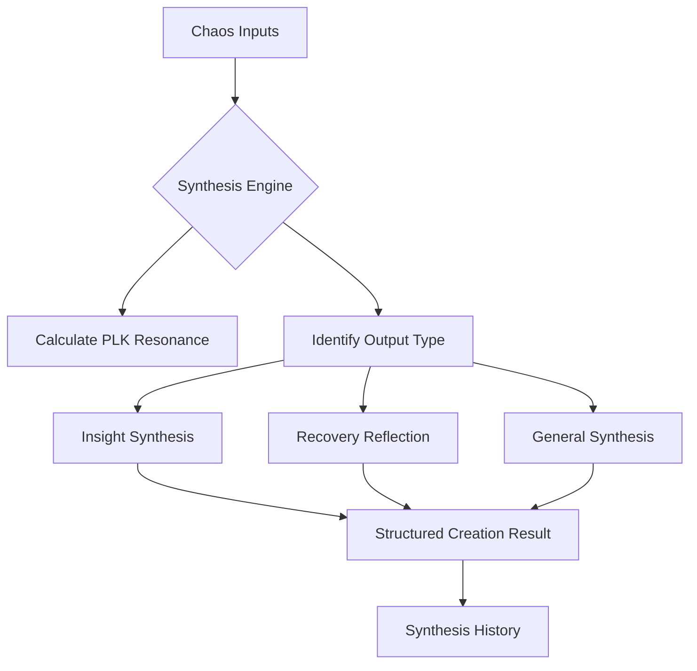
```mermaid
graph TD
    A[Chaos Inputs] --> B{Synthesis Engine}
    B --> C[Calculate PLK Resonance]
    B --> D[Identify Output Type]
    D --> E[Insight Synthesis]
    D --> F[Recovery Reflection]
    D --> G[General Synthesis]
    E & F & G --> H[Structured Creation Result]
    H --> I[Synthesis History]
```
The flow of data from raw input to structured synthesis.
Sources: [brain-sparks-core.py.txt:387-410]()

### Output Generations
The engine provides specialized generators for different cognitive needs:

| Output Type | Description | Key Features |
| :--- | :--- | :--- |
| **Insight** | Focuses on pattern recognition and "Lightning Bolt" captures. | Uses ADHD-specific metaphors like "exploded picture mind." |
| **Recovery Reflection** | Tailored for the addiction recovery journey. | Emphasizes "active recovery work" and "strength recognition." |
| **General Synthesis** | A broader creative summary. | Focuses on emerging patterns and "next steps" for exploration. |

Sources: [brain-sparks-core.py.txt:413-467]()

## Integration with PLK and RPE

The Creation Corner Engine is deeply coupled with the **Personal Language Key (PLK)** and the **Rapid Prototype Engine (RPE)**. While the RPE captures individual "Lightning Bolts" (creative insights), the Creation Corner synthesizes multiple bolts into a cohesive narrative.

### Resonance Scoring
The engine uses the PLK to calculate a `resonance_score` for the combined inputs. This score determines how well the synthesis aligns with the user's "linguistic fingerprint," including signature metaphors like the "Beautiful Tapestry" or "Scars became code."

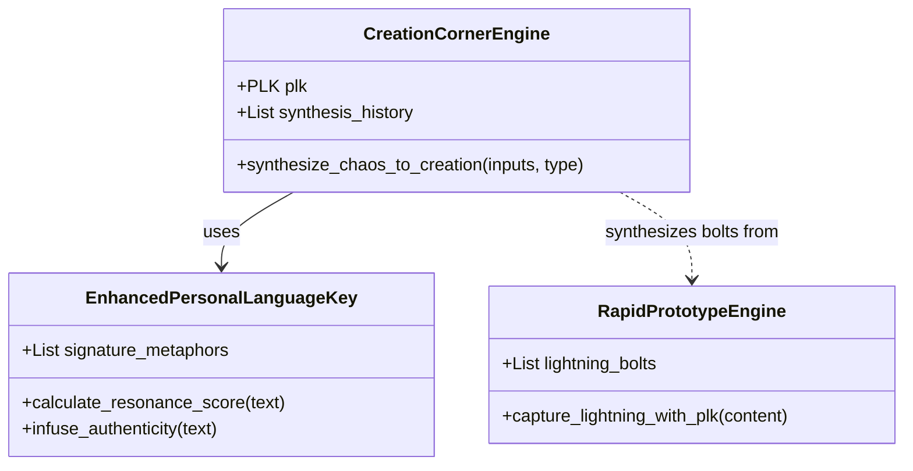
```mermaid
classDiagram
    class CreationCornerEngine {
        +PLK plk
        +List synthesis_history
        +synthesize_chaos_to_creation(inputs, type)
    }
    class EnhancedPersonalLanguageKey {
        +List signature_metaphors
        +calculate_resonance_score(text)
        +infuse_authenticity(text)
    }
    class RapidPrototypeEngine {
        +List lightning_bolts
        +capture_lightning_with_plk(content)
    }
    CreationCornerEngine --> EnhancedPersonalLanguageKey : uses
    CreationCornerEngine ..> RapidPrototypeEngine : synthesizes bolts from
```
Class relationships showing how the engine utilizes the PLK for resonance and RPE for source data.
Sources: [brain-sparks-core.py.txt:71-85](), [brain-sparks-core.py.txt:381-385](), [brain-sparks-core.py.txt:203-210]()

## Data Structures and API Interaction

The engine's results are typically packaged into a dictionary containing metadata for the user interface, such as the `BrainSparksStation.tsx` or `ADHDPowerUpStation.tsx`.

### Creation Result Schema
| Field | Type | Description |
| :--- | :--- | :--- |
| `id` | UUID | Unique identifier for the synthesis. |
| `synthesis` | String | The formatted, text-based output infused with authenticity. |
| `resonance_score`| Float | The calculated emotional resonance (0-100). |
| `output_type` | String | The category of the synthesis (e.g., "insight"). |
| `chaos_inputs` | List | The original raw inputs used for generation. |

Sources: [brain-sparks-core.py.txt:402-409]()

### API Routing
The engine's functionality is exposed via routes that handle user thoughts and context. For instance, the `/brain-sparks/ignite` endpoint takes a `BrainSparkQuery` and returns an expanded spark with related neural connections, leveraging the underlying synthesis logic.

Sources: [brain_sparks_routes.py:21-35](), [adhd_power_up_routes.py:22-35]()

## Implementation Example
The following snippet demonstrates how the engine processes a list of scattered thoughts into a structured "Lightning Bolt Synthesis."

```python
# From brain-sparks-core.py.txt
async def _generate_insight(self, inputs: List[str], recovery_context: bool) -> str:
    if recovery_context:
        # Specialized recovery logic
        return f"🌟 **Recovery Insight Synthesis**\nYour journey speaks volumes: {' | '.join(inputs[:3])}..."
    else:
        # Standard creative logic
        return f"⚡ **Lightning Bolt Synthesis**\nYour exploded picture mind has captured: {' | '.join(inputs[:3])}..."
```
Sources: [brain-sparks-core.py.txt:413-433]()

## Summary
The Creation Corner Engine acts as the "pattern weaver" of the ADHD Power-Up ecosystem. By transforming chaotic, high-velocity thoughts into structured reflections, it provides the necessary cognitive scaffolding to help users move from raw ideation to actionable self-awareness and task orchestration. Its integration with the PLK ensures that these synthesized outputs remain empathetic and personally relevant to the user's specific neurodivergent or recovery-oriented experience.

### Musical DNA Profile

<details>
<summary>Relevant source files</summary>

The following files were used as context for generating this wiki page:

- [brain-sparks-core.py.txt](https://github.com/faagestalt-web/ADHD_Power_Up/blob/main/brain-sparks-core.py.txt)
- [BrainSparksStation.tsx](https://github.com/faagestalt-web/ADHD_Power_Up/blob/main/BrainSparksStation.tsx)
- [ADHDPowerUpStation.tsx](https://github.com/faagestalt-web/ADHD_Power_Up/blob/main/ADHDPowerUpStation.tsx)
- [GestaltView_ADHD_MVP_v2.0.py](https://github.com/faagestalt-web/ADHD_Power_Up/blob/main/GestaltView_ADHD_MVP_v2.0.py)
- [brain_sparks_routes.py](https://github.com/faagestalt-web/ADHD_Power_Up/blob/main/brain_sparks_routes.py)
</details>

# Musical DNA Profile

The **Musical DNA Profile** is a specialized system within the Brain Sparks platform designed for emotional architecture discovery. It maps a user's musical preferences and associations to their emotional states, providing a framework for "emotional mapping" that supports neurodivergent cognitive styles and addiction recovery journeys.

This module acts as a bridge between auditory sensory input and internal consciousness states, allowing the AI to suggest resonant content or interventions based on a user's unique "Linguistic Fingerprint" and musical history.

## Architecture and Core Components

The system is structured as a dataclass-based profile that integrates with the broader `BrainSparksProfile`. It captures preferences, emotional associations, and specific playlists curated for recovery and resilience.

### Data Structures

The primary data structure is the `MusicalDNAProfile` class, which stores mapping data used by the multi-modal processing engine.

| Field | Type | Description |
| :--- | :--- | :--- |
| `musical_preferences` | `Dict[str, Any]` | Stores user-defined musical tastes and genres. |
| `emotional_associations` | `Dict[str, List[str]]` | Maps emotions (e.g., strength, peace) to specific musical characteristics. |
| `recovery_playlist` | `List[Dict[str, str]]` | A curated list of tracks for recovery milestones. |
| `mood_correlations` | `Dict[str, str]` | Direct links between specific moods and musical responses. |

Sources: [brain-sparks-core.py.txt:310-333]()

### Integration Flow

The Musical DNA Profile is consumed by the `MultiModalProcessor`, which fuses text input with audio metadata to determine the "resonance" of an interaction.

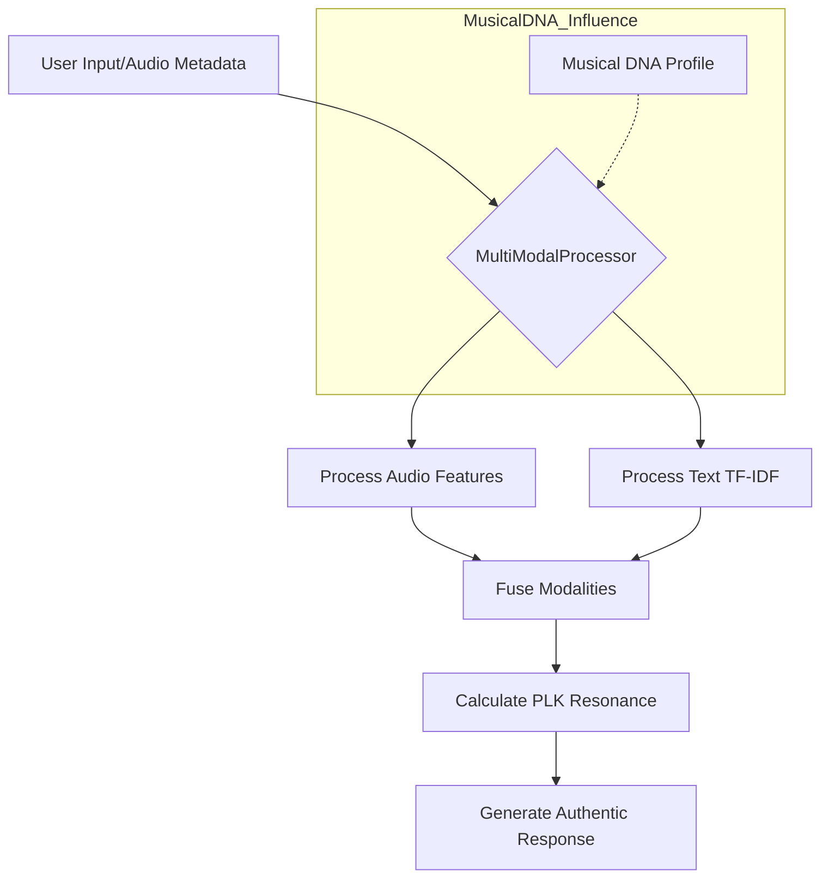
```mermaid
flowchart TD
    A[User Input/Audio Metadata] --> B{MultiModalProcessor}
    B --> C[Process Audio Features]
    B --> D[Process Text TF-IDF]
    C --> E[Fuse Modalities]
    D --> E
    E --> F[Calculate PLK Resonance]
    F --> G[Generate Authentic Response]
    
    subgraph MusicalDNA_Influence
    H[Musical DNA Profile] -.-> B
    end
```
The diagram shows how the Musical DNA Profile informs the `MultiModalProcessor` to calculate resonance based on fused audio and text features.
Sources: [brain-sparks-core.py.txt:339-375](), [brain-sparks-core.py.txt:449-460]()

## Emotional Associations and Mapping

The system initializes with default mappings that correlate specific musical styles with cognitive and emotional outcomes. These mappings are designed to support the "Exploded Picture Mind" typical of ADHD processing.

### Default Emotional Mappings
*   **Strength**: Rock, metal, and powerful vocals.
*   **Peace**: Acoustic, ambient, and nature sounds.
*   **Motivation**: Upbeat, energetic, and inspirational tracks.
*   **Processing**: Jazz, complex harmonies, and instrumental music.

Sources: [brain-sparks-core.py.txt:326-333]()

### Reference Implementation: Recovery Playlist
A key feature is the inclusion of the "When I Know My Path Of Struggle" reference, which serves as a baseline for mapping resilience through adversity within the DNA profile.
Sources: [brain-sparks-core.py.txt:317-324]()

## Multi-Modal Processing Logic

The `MultiModalProcessor` uses the Musical DNA data to normalize and analyze incoming audio metadata. It specifically tracks three core metrics:

1.  **Tempo**: Normalized mapping (Tempo/200.0) to represent speed/arousal.
2.  **Energy**: A 0.0 to 1.0 scale representing the intensity of the track.
3.  **Valence**: A 0.0 to 1.0 scale representing the positivity or emotional "charge" of the music.

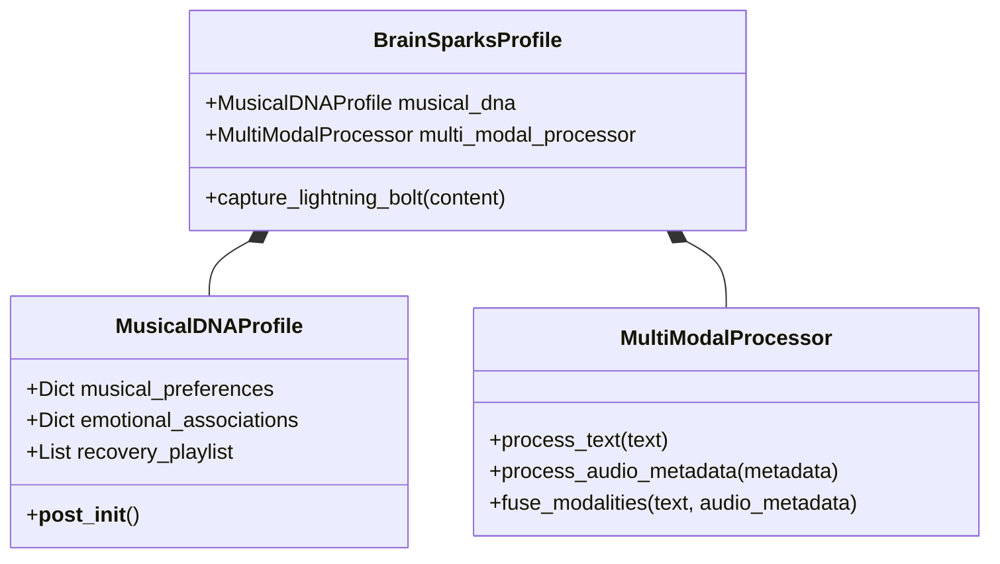
```mermaid
classDiagram
    class MusicalDNAProfile {
        +Dict musical_preferences
        +Dict emotional_associations
        +List recovery_playlist
        +__post_init__()
    }
    class MultiModalProcessor {
        +process_text(text)
        +process_audio_metadata(metadata)
        +fuse_modalities(text, audio_metadata)
    }
    class BrainSparksProfile {
        +MusicalDNAProfile musical_dna
        +MultiModalProcessor multi_modal_processor
        +capture_lightning_bolt(content)
    }
    BrainSparksProfile *-- MusicalDNAProfile
    BrainSparksProfile *-- MultiModalProcessor
```
This class diagram illustrates the relationship between the profile, the processor, and the top-level Brain Sparks system.
Sources: [brain-sparks-core.py.txt:339-375](), [brain-sparks-core.py.txt:414-428]()

## System Interactions

The Musical DNA Profile interacts with other specialized modules like the `RapidPrototypeEngine` (RPE) and the `EnhancedPersonalLanguageKey` (PLK). When a user's musical resonance score exceeds a certain threshold (e.g., 80% for creative insights or 70% for recovery), the system triggers a "Lightning Bolt" capture.

### API and Routing
While the core logic resides in Python, the system is exposed via FastAPI routes and consumed by React components like the `BrainSparksStation`.

*   **Route**: `/brain-sparks/ignite` - Processes thoughts and triggers neural connections based on context.
*   **Frontend**: `BrainSparksStation.tsx` provides the "Neural Network" visualization and electric effects that reflect the "sparking" of ideas through the DNA profile.

Sources: [brain_sparks_routes.py:21-30](), [BrainSparksStation.tsx:40-66]()

## Summary
The Musical DNA Profile is a foundational element of the project's "Consciousness-Serving" architecture. By quantifying the relationship between music, tempo, and emotion, it enables the platform to provide "Cognitive Scaffolding" for users in ADHD states or addiction recovery. It ensures that the AI's response is not just textually accurate but emotionally resonant with the user's current cognitive state.

### Rapid Prototype Engine

<details>
<summary>Relevant source files</summary>

The following files were used as context for generating this wiki page:

- [brain-sparks-core.py.txt](https://github.com/faagestalt-web/ADHD_Power_Up/blob/main/brain-sparks-core.py.txt)
- [GestaltView_ADHD_MVP_v2.0.py](https://github.com/faagestalt-web/ADHD_Power_Up/blob/main/GestaltView_ADHD_MVP_v2.0.py)
- [lightning_bolt (1).py](https://github.com/faagestalt-web/ADHD_Power_Up/blob/main/lightning_bolt%20%281).py)
- [BrainSparksStation.tsx](https://github.com/faagestalt-web/ADHD_Power_Up/blob/main/BrainSparksStation.tsx)
- [ADHDPowerUpStation.tsx](https://github.com/faagestalt-web/ADHD_Power_Up/blob/main/ADHDPowerUpStation.tsx)
</details>

# Rapid Prototype Engine

The **Rapid Prototype Engine (RPE)** serves as the high-velocity creative core within the Brain Sparks platform. It is designed to capture fleeting creative insights, referred to as "Lightning Bolts," and transform them into structured cognitive scaffolding. By integrating with the Personal Language Key (PLK), the RPE ensures that every captured thought resonates with the user's unique neurodivergent cognitive style, providing a bridge between chaotic internal states and actionable system features.

The engine facilitates "pattern weaving" and "creative synthesis," allowing the system to build prototypes of support structures—such as task orchestration and addiction recovery modules—at lightning speed. It operates as part of a larger "consciousness-serving" architecture that prioritizes radical empathy and cognitive justice for individuals with ADHD.

Sources: [brain-sparks-core.py.txt:236-242](), [GestaltView_ADHD_MVP_v2.0.py:16-22]()

## Core Architecture and Components

The RPE is structured around the lifecycle of an insight, starting from raw input capture to resonance analysis and eventual synthesis into the user's profile.

### Lightning Bolt Model
The primary data structure in the RPE is the `LightningBolt`. This object represents an individual creative insight captured at velocity. It includes metadata for tracking intensity, tags, and emotional resonance.

| Field | Type | Description |
| :--- | :--- | :--- |
| `id` | UUID/String | Unique identifier for the captured insight. |
| `content` | String | The raw text of the thought or insight. |
| `timestamp` | ISO String | When the bolt was captured. |
| `intensity` | Integer | A scale (default 8) representing the cognitive weight of the thought. |
| `plk_resonance_score` | Float | Calculated score based on the Personal Language Key. |
| `tags` | List[String] | Auto-generated or manual categorization (e.g., "adhd", "breakthrough"). |

Sources: [brain-sparks-core.py.txt:244-253](), [lightning_bolt (1).py:30-34]()

### Creative State Machine
The engine transitions through various `CreativeState` enums to manage the synthesis process:
- **LIGHTNING_CAPTURE**: Active gathering of raw thoughts.
- **HYPERFOCUS_SESSION**: Intensive processing of specific themes.
- **PATTERN_WEAVING**: Identifying connections between disparate bolts.
- **CREATIVE_SYNTHESIS**: Generating structured outputs like recovery insights or task lists.

Sources: [brain-sparks-core.py.txt:51-55](), [brain-sparks-core.py.txt:256-258]()

## Data Flow: From Spark to Synthesis

The following diagram illustrates the flow of a thought through the Rapid Prototype Engine, from initial capture in the UI to synthesis in the backend.

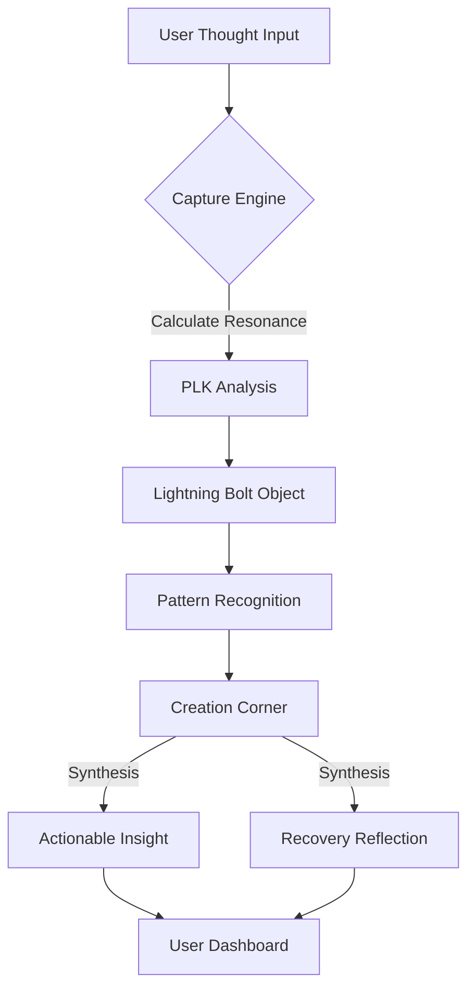
```mermaid
flowchart TD
    A[User Thought Input] --> B{Capture Engine}
    B -->|Calculate Resonance| C[PLK Analysis]
    C --> D[Lightning Bolt Object]
    D --> E[Pattern Recognition]
    E --> F[Creation Corner]
    F -->|Synthesis| G[Actionable Insight]
    F -->|Synthesis| H[Recovery Reflection]
    G --> I[User Dashboard]
    H --> I
```
The process begins when a user inputs a "lightning bolt" idea. The engine immediately calculates a resonance score using the PLK to determine how well the thought aligns with the user's authentic voice.

Sources: [brain-sparks-core.py.txt:261-294](), [BrainSparksStation.tsx:81-110]()

## Implementation Details

### PLK-Driven Capture
The `capture_lightning_with_plk` method is the entry point for data. It utilizes the `EnhancedPersonalLanguageKey` to score content based on "signature metaphors" and "energy words."

```python
# brain-sparks-core.py.txt:261-274
def capture_lightning_with_plk(
    self, 
    content: str, 
    plk: EnhancedPersonalLanguageKey, 
    intensity: int = 8,
    recovery_context: bool = False
) -> str:
    bolt = LightningBolt(
        content=content,
        intensity=intensity,
        plk_resonance_score=plk.calculate_resonance_score(content, recovery_context),
        recovery_relevance="recovery_insight" if recovery_context else None,
        application_context="addiction_recovery" if recovery_context else "brain_sparks"
    )
    # ... logic for auto-tagging and storage
```
Sources: [brain-sparks-core.py.txt:261-274]()

### API Integration
The engine is exposed via a FastAPI router, allowing frontend stations like `BrainSparksStation.tsx` or `ADHDPowerUpStation.tsx` to commit thoughts to persistent storage.

| Endpoint | Method | Description |
| :--- | :--- | :--- |
| `/api/lightning-bolt/capture` | POST | Captures a new bolt and returns the saved object. |
| `/api/lightning-bolt/list` | GET | Retrieves a paginated list of captured insights. |
| `/brain-sparks/ignite` | POST | Triggers an LLM-based expansion of a specific spark. |

Sources: [lightning_bolt (1).py:26-34](), [brain_sparks_routes.py:21-25]()

### Synthesis Engine (Creation Corner)
The `CreationCornerEngine` takes the chaotic inputs stored by the RPE and transforms them into structured text. It uses specific templates for "Recovery Insight Synthesis" and "Lightning Bolt Synthesis," ensuring the output is supportive and celebratory of neurodivergent patterns.

Sources: [brain-sparks-core.py.txt:430-455]()

## Sequence of Insight Processing

The following sequence diagram represents the interaction between the frontend station and the backend engine during a thought capture event.

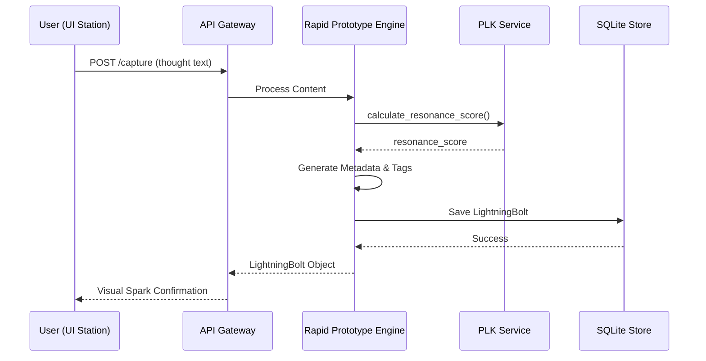
```mermaid
sequenceDiagram
    participant User as User (UI Station)
    participant API as API Gateway
    participant RPE as Rapid Prototype Engine
    participant PLK as PLK Service
    participant DB as SQLite Store

    User->>API: POST /capture (thought text)
    API->>RPE: Process Content
    RPE->>PLK: calculate_resonance_score()
    PLK-->>RPE: resonance_score
    RPE->>RPE: Generate Metadata & Tags
    RPE->>DB: Save LightningBolt
    DB-->>RPE: Success
    RPE-->>API: LightningBolt Object
    API-->>User: Visual Spark Confirmation
```
Sources: [BrainSparksStation.tsx:81-110](), [lightning_bolt (1).py:30-34](), [brain-sparks-core.py.txt:261-285]()

## Conclusion
The Rapid Prototype Engine is more than a simple logging system; it is a specialized architectural component that validates and transforms the "exploded picture mind" of the ADHD user. By leveraging the Personal Language Key and the Creation Corner synthesis logic, it ensures that every lightning bolt insight is captured with the necessary emotional context to become a useful building block for personal growth and task orchestration.

Sources: [brain-sparks-core.py.txt:236-242](), [brain-sparks-core.py.txt:545-555]()

### Consciousness Tracker

<details>
<summary>Relevant source files</summary>

The following files were used as context for generating this wiki page:

- [frontend/src/components/ConsciousnessTracker.js](https://github.com/faagestalt-web/ADHD_Power_Up/blob/main/frontend/src/components/ConsciousnessTracker.js)
- [GestaltView_ADHD_MVP_v2.0.py](https://github.com/faagestalt-web/ADHD_Power_Up/blob/main/GestaltView_ADHD_MVP_v2.0.py)
- [BrainSparksStation.tsx](https://github.com/faagestalt-web/ADHD_Power_Up/blob/main/BrainSparksStation.tsx)
- [brain-sparks-core.py.txt](https://github.com/faagestalt-web/ADHD_Power_Up/blob/main/brain-sparks-core.py.txt)
- [ADHDPowerUpStation.tsx](https://github.com/faagestalt-web/ADHD_Power_Up/blob/main/ADHDPowerUpStation.tsx)
- [adhd_power_up_routes.py](https://github.com/faagestalt-web/ADHD_Power_Up/blob/main/adhd_power_up_routes.py)
</details>

# Consciousness Tracker

The Consciousness Tracker is a core architectural component designed to monitor, analyze, and support the neurodivergent cognitive experience. It acts as a state-aware partner that captures real-time data on emotional states, energy levels, and ADHD-specific cognitive contexts (such as hyperfocus or overwhelm) to provide empathetic, actionable insights. By integrating Personal Language Keys (PLK) and multi-modal analysis, the system transforms raw cognitive inputs into "Lightning Bolt" insights, helping users navigate their internal world through a "consciousness-serving" AI framework.

Sources: [GestaltView_ADHD_MVP_v2.0.py:17-21](), [brain-sparks-core.py.txt:232-237](), [ADHDPowerUpStation.tsx:32-34]()

## System Architecture and Data Flow

The Consciousness Tracker operates through a feedback loop between the frontend interface and the backend processing engines. It captures user-defined states and energy levels, which are then processed by the `ADHDExecutiveFunctionAgent` to determine the appropriate cognitive scaffolding or task orchestration.

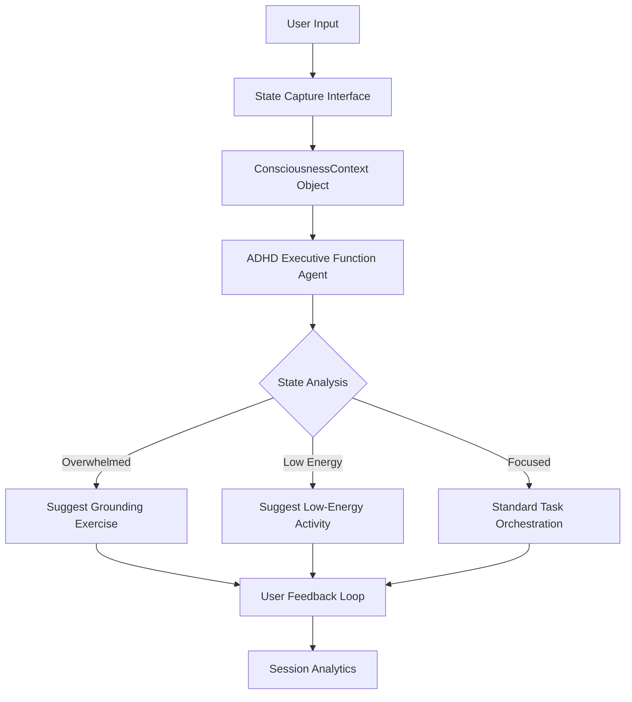
```mermaid
flowchart TD
    User[User Input] --> Capture[State Capture Interface]
    Capture --> Context[ConsciousnessContext Object]
    Context --> Agent[ADHD Executive Function Agent]
    Agent --> Analysis{State Analysis}
    Analysis -- Overwhelmed --> Grounding[Suggest Grounding Exercise]
    Analysis -- Low Energy --> Rest[Suggest Low-Energy Activity]
    Analysis -- Focused --> Tasks[Standard Task Orchestration]
    Grounding --> Feedback[User Feedback Loop]
    Rest --> Feedback
    Tasks --> Feedback
    Feedback --> Analytics[Session Analytics]
```
The diagram above illustrates how user states trigger specific behavioral suggestions based on the current consciousness context.
Sources: [GestaltView_ADHD_MVP_v2.0.py:101-125](), [ADHDPowerUpStation.tsx:160-175]()

## Core Data Structures

The system relies on structured data models to track the nuances of ADHD cognitive states. The primary container for this data is the `ConsciousnessContext`, which aggregates emotional and energetic metrics.

### Consciousness Context Model
| Field | Type | Description |
| :--- | :--- | :--- |
| `emotional_state` | `str` | The user's current emotional feeling (e.g., neutral, vulnerable). |
| `energy_level` | `int` | A scale from 1-10 representing available cognitive resources. |
| `adhd_state` | `str` | Specific ADHD state: `focused`, `overwhelmed`, `hyperfocus`, or `understimulated`. |
| `sentiment_score` | `float` | AI-calculated score derived from text input analysis. |

Sources: [GestaltView_ADHD_MVP_v2.0.py:88-93](), [ADHDPowerUpStation.tsx:34]()

### Cognitive State Definitions
The system identifies specific modes of consciousness to tailor its responses:
*   **Hyperfocus**: High energy (>= 9) or deep engagement.
*   **Overwhelmed**: Triggered by user context clues or sentiment scores below -0.5.
*   **Focused**: The baseline steady-state for task engagement.

Sources: [GestaltView_ADHD_MVP_v2.0.py:182-187](), [ADHDPowerUpStation.tsx:34]()

## Processing Logic and AI Integration

The tracking logic is encapsulated in the `GestaltViewADHDMVP` class, which manages the transition between states and the generation of empathetic responses using the Personal Language Key (PLK).

### The State Processing Sequence
When a user provides input, the system follows a synchronous processing sequence to update the consciousness state:

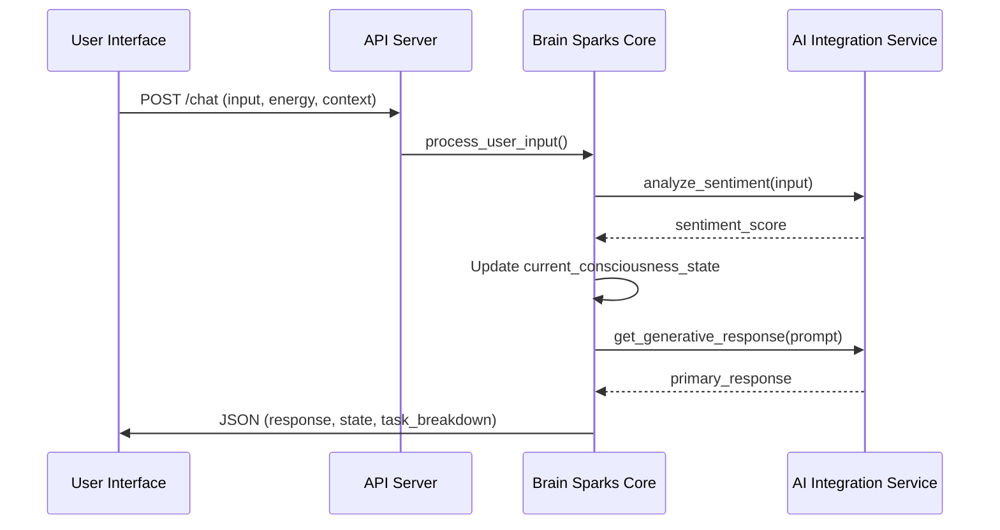
```mermaid
sequenceDiagram
    participant UI as User Interface
    participant API as API Server
    participant BS as Brain Sparks Core
    participant AI as AI Integration Service

    UI->>API: POST /chat (input, energy, context)
    API->>BS: process_user_input()
    BS->>AI: analyze_sentiment(input)
    AI-->>BS: sentiment_score
    BS->>BS: Update current_consciousness_state
    BS->>AI: get_generative_response(prompt)
    AI-->>BS: primary_response
    BS->>UI: JSON (response, state, task_breakdown)
```
This sequence ensures that every interaction is grounded in the user's current energetic and emotional reality.
Sources: [GestaltView_ADHD_MVP_v2.0.py:177-210](), [adhd_power_up_routes.py:23-41]()

### Personal Language Key (PLK)
The PLK is a specialized module used to "infuse authenticity" into the tracker's outputs. It uses metaphors like "Exploded Picture Mind" for ADHD processing and "Beautiful Tapestry" for consciousness to increase user resonance.

```python
class EnhancedPersonalLanguageKey:
    def infuse_authenticity(self, text: str) -> str:
        # Adds signature emojis and metaphors to increase resonance
        return f"✨ {text} ✨"

    def calculate_resonance_score(self, text: str) -> float:
        # Boosts score based on energy words like 'consciousness-serving'
        # Penalizes trigger words like 'deficit' or 'broken'
        pass
```
Sources: [GestaltView_ADHD_MVP_v2.0.py:78-80](), [brain-sparks-core.py.txt:143-177]()

## Lightning Bolt Capture System

A specialized feature of the Consciousness Tracker is the "Brain Sparks" or "Lightning Bolt" capture. This system allows users to record rapid, high-intensity creative insights that occur during hyperfocus or "exploded picture mind" states.

*   **Intensity Tracking**: Each "bolt" is assigned an intensity score (default 8).
*   **Pattern Analysis**: Insights are mapped to cognitive patterns like "Insight Genesis" or "Connection Cascade".
*   **Resonance Scoring**: The RPE (Rapid Prototype Engine) calculates how well an insight aligns with the user's authentic voice.

Sources: [BrainSparksStation.tsx:36-40](), [brain-sparks-core.py.txt:198-208](), [lightning_bolt (1).py:26-30]()

## Session Analytics and Feedback

The tracker provides longitudinal data through an analytics module. It tracks state distribution and records user feedback on the accuracy of state-based suggestions.

| Endpoint | Method | Purpose |
| :--- | :--- | :--- |
| `/analytics/{user_id}` | `GET` | Returns total interactions, most frequent state, and state distribution. |
| `/feedback/{user_id}` | `POST` | Records encrypted user ratings for specific AI responses. |

Sources: [GestaltView_ADHD_MVP_v2.0.py:270-280](), [GestaltView_ADHD_MVP_v2.0.py:221-236]()

### Data Privacy
User feedback and consciousness notes are protected using a `Fernet` encryption manager. This ensures that sensitive emotional data recorded during sessions remains autonomous and private.
Sources: [GestaltView_ADHD_MVP_v2.0.py:168-175]()


## Data Management & Flow

### Database Schema & Migrations

<details>
<summary>Relevant source files</summary>

The following files were used as context for generating this wiki page:

- [brain-sparks-core.py.txt](https://github.com/faagestalt-web/ADHD_Power_Up/blob/main/brain-sparks-core.py.txt)
- [GestaltView_ADHD_MVP_v2.0.py](https://github.com/faagestalt-web/ADHD_Power_Up/blob/main/GestaltView_ADHD_MVP_v2.0.py)
- [lightning_bolt (1).py](https://github.com/faagestalt-web/ADHD_Power_Up/blob/main/lightning_bolt%20%281).py)
- [BrainSparksStation.tsx](https://github.com/faagestalt-web/ADHD_Power_Up/blob/main/BrainSparksStation.tsx)
- [ADHDPowerUpStation.tsx](https://github.com/faagestalt-web/ADHD_Power_Up/blob/main/ADHDPowerUpStation.tsx)

</details>

# Database Schema & Migrations

The database system within the ADHD Power Up project is designed to capture and persist high-velocity cognitive insights ("Lightning Bolts"), user interaction logs, and addiction recovery milestones. The architecture utilizes a combination of local SQLite storage for standalone deployments and in-memory session management for the FastAPI-based web application.

The schema is versioned (Current: `6.23_BrainSparks_AddictionRecovery_Integrated`) to ensure compatibility between the Rapid Prototype Engine (RPE) and the Personal Language Key (PLK) systems. Data integrity is maintained through structured models that store both raw user input and processed metadata such as sentiment scores and resonance values.

Sources: [brain-sparks-core.py.txt:28-30](), [GestaltView_ADHD_MVP_v2.0.py:180-185]()

## Core Data Models

The system architecture revolves around several primary entities that manage user state, creative insights, and recovery progress.

### 1. Lightning Bolt Model
The `LightningBolt` is the fundamental unit of data for capturing creative insights. It stores the content of a "spark," its intensity, and its alignment with the user's Personal Language Key (PLK).

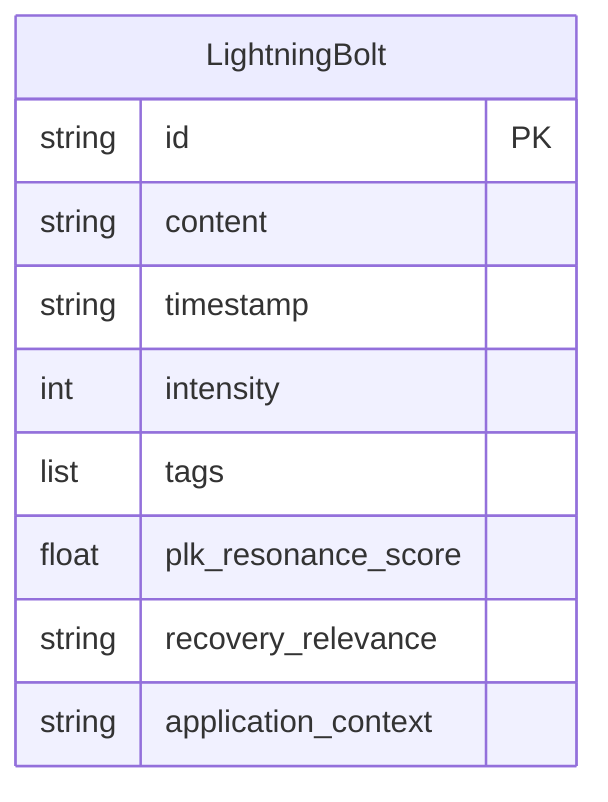
```mermaid
erDiagram
    LightningBolt {
        string id PK
        string content
        string timestamp
        int intensity
        list tags
        float plk_resonance_score
        string recovery_relevance
        string application_context
    }
```
*This diagram illustrates the structure of a captured insight, highlighting its metadata-rich nature.*

Sources: [brain-sparks-core.py.txt:180-192](), [lightning_bolt (1).py:26-30]()

### 2. User Profile and Session State
User data is managed through two primary structures: `GestaltViewADHDMVP` for web sessions and `BrainSparksProfile` for integrated system state. These models track interactions, current consciousness states (e.g., "overwhelmed", "focused"), and historical notes.

| Field | Type | Description |
| :--- | :--- | :--- |
| `profile_id` | UUID | Unique identifier for the user or session. |
| `daily_notes` | List[Dict] | Log of user inputs, sentiment scores, and energy levels. |
| `user_feedback_history` | List[bytes] | Encrypted user ratings for AI responses. |
| `current_consciousness_state`| String | Current state such as "focused" or "overwhelmed". |

Sources: [GestaltView_ADHD_MVP_v2.0.py:133-145](), [brain-sparks-core.py.txt:463-480]()

## Storage Engines

The project implements two distinct storage strategies based on the deployment environment.

### SQLite Persistence
For standalone or local deployments, the system uses a `SQLiteBoltStore`. This engine persists lightning bolts to a local database file, ensuring that creative insights are not lost between sessions.

- **Storage Location**: Defaulted to `./data/lightning_bolts.db`.
- **Operations**: Supports capturing new bolts and paginated listing via cursors.

Sources: [lightning_bolt (1).py:16-18](), [lightning_bolt (1).py:33-46]()

### In-Memory Web Sessions
The FastAPI backend (`gestaltview_api.py`) utilizes a global dictionary `user_sessions` to store active `GestaltViewADHDMVP` instances. This approach provides low-latency access to user context during chat interactions but lacks persistent storage across server restarts.

Sources: [GestaltView_ADHD_MVP_v2.0.py:276-278]()

## Addiction Recovery Schema Integration

A specialized module adds fields for tracking recovery milestones and daily check-ins. This data is integrated into the primary `BrainSparksProfile`.

### Recovery Data Structures
- **RecoveryJourneyMap**: Tracks sobriety dates, milestones, and setbacks.
- **Daily Check-ins**: Log containing `mood` (1-10), `cravings` (1-10), and timestamps.

```mermaid
flowchart TD
    A[User Input] --> B{Recovery Context?}
    B -- Yes --> C[Update RecoveryJourneyMap]
    B -- Yes --> D[Log Daily Check-in]
    B -- No --> E[Standard ADHD State Update]
    C --> F[Calculate Recovery Streak]
```
*This flow shows how the database updates change based on the active application mode.*

Sources: [brain-sparks-core.py.txt:232-243](), [brain-sparks-core.py.txt:298-311]()

## Security and Encryption

Sensitive data, specifically user feedback, is encrypted before storage. The `GestaltViewADHDMVP` class utilizes the `cryptography.fernet` library to manage data autonomy.

- **Encryption Type**: Fernet (Symmetric encryption).
- **Key Management**: Uses a `MASTER_KEY` environment variable. If missing, a temporary key is generated on startup (warning issued for production).
- **Encrypted Fields**: `user_feedback_history` stores ratings and message IDs as encrypted bytes.

Sources: [GestaltView_ADHD_MVP_v2.0.py:146-153](), [GestaltView_ADHD_MVP_v2.0.py:187-191]()

## Client-Side Local Storage

The frontend implementation uses the browser's `localStorage` for the Private Journal feature, ensuring user reflections remain private to their device and are never transmitted to the backend.

- **Key**: `adhdJournalEntries`
- **Structure**: Array of objects containing `id`, `content`, and `timestamp`.

Sources: [ADHDPowerUpStation.tsx:215-225]()

## Conclusion
The database architecture of ADHD Power Up is a hybrid system optimized for different data types: SQLite for persistent creative insights, encrypted memory for session-based AI interactions, and local browser storage for sensitive personal journals. This tiered approach balances the need for high-velocity data capture with strict privacy and security requirements.

### Supabase Auth & Configuration

<details>
<summary>Relevant source files</summary>

The following files were used as context for generating this wiki page:

- [GestaltView_ADHD_MVP_v2.0.py](https://github.com/faagestalt-web/ADHD_Power_Up/blob/main/GestaltView_ADHD_MVP_v2.0.py)
- [brain-sparks-core.py.txt](https://github.com/faagestalt-web/ADHD_Power_Up/blob/main/brain-sparks-core.py.txt)
- [ADHDPowerUpStation.tsx](https://github.com/faagestalt-web/ADHD_Power_Up/blob/main/ADHDPowerUpStation.tsx)
- [brain_sparks_routes.py](https://github.com/faagestalt-web/ADHD_Power_Up/blob/main/brain_sparks_routes.py)
- [lightning_bolt (1).py](https://github.com/faagestalt-web/ADHD_Power_Up/blob/main/lightning_bolt%20%281).py)
</details>

# Supabase Auth & Configuration

The authentication and configuration system for the ADHD Power Up platform (incorporating GestaltView and Brain Sparks) is designed to manage user sessions, cognitive profiles, and secure data handling for neurodivergent individuals. While the core logic utilizes FastAPI for backend services and React for frontend stations, the integration with Supabase (implied via the project structure) serves as the persistent storage and authentication layer for "Lightning Bolt" insights and user journey mapping.

The system focuses on creating "consciousness-serving" security, ensuring that sensitive user feedback and cognitive states are protected through encryption and session-based isolation. This allows users to capture insights and navigate their internal worlds with a high degree of data autonomy and privacy.
Sources: [GestaltView_ADHD_MVP_v2.0.py:15-25](), [brain-sparks-core.py.txt:450-465]()

## Authentication and Session Management

The platform manages user identity through session initialization and unique profile identifiers. Sessions are established via an `/initialize` endpoint which generates a UUID-based profile for each user, allowing for ephemeral or persistent tracking of cognitive states such as "focused" or "overwhelmed."

### User Initialization Flow

When a user joins a session, the system initializes a specific profile that includes the user's name and a unique `profile_id`. This ID is used to map subsequent interactions, feedback, and analytics to the correct user context.

```mermaid
sequenceDiagram
    participant User as "User Interface"
    participant API as "FastAPI Backend"
    participant Session as "User Session Store"
    User->>API: POST /initialize {user_name}
    API->>API: Generate UUID Profile ID
    API->>Session: Store Profile Instance
    API-->>User: Return user_id & user_name
```
The diagram above illustrates the initial handshake between the frontend and the backend session manager.
Sources: [GestaltView_ADHD_MVP_v2.0.py:330-345](), [brain-sparks-core.py.txt:20-35]()

### Route Protection and API Keys
Security for specialized endpoints, such as the Lightning Bolt capture system, is enforced through API key verification. This ensures that only authorized clients can write to the persistent SQLite or Supabase stores.

| Component | Logic Reference | Description |
| :--- | :--- | :--- |
| `require_api_key` | `lightning_bolt (1).py:16-20` | Validates `X-API-Key` header against environment variables. |
| `get_current_user` | `brain_sparks_routes.py:17` | Dependency injection for identifying the authenticated user context. |
| `user_sessions` | `GestaltView_ADHD_MVP_v2.0.py:328` | Dictionary-based in-memory store for active `GestaltViewADHDMVP` instances. |

## Data Configuration and Privacy

The system employs a multi-layered approach to data security, particularly for "Private Journal" entries and "Lightning Bolt" captures. Personal insights are treated with high sensitivity, utilizing encryption managers to prevent unauthorized access to the user's emotional history.

### Encryption Architecture
The `GestaltViewADHDMVP` class utilizes `cryptography.fernet` to encrypt user feedback. A `MASTER_KEY` is derived from environment variables to secure the feedback history, which is only decrypted during session analytics generation.

```mermaid
flowchart TD
    A[User Input/Feedback] --> B{Encryption Manager}
    B -->|Fernet Encrypt| C[(Encrypted History)]
    C --> D{Analytics Request}
    D -->|Fernet Decrypt| E[Session Insights]
    style B fill:#f9f,stroke:#333,stroke-width:2px
```
This flowchart shows the lifecycle of sensitive user data from capture to analytics.
Sources: [GestaltView_ADHD_MVP_v2.0.py:202-215](), [brain-sparks-core.py.txt:460-475]()

### Local vs. Server Storage
The configuration distinguishes between non-sensitive task orchestration and highly private reflections:
- **Server-side**: Profile IDs, session metadata, and encrypted feedback are managed via the FastAPI backend and potentially Supabase.
- **Client-side**: Private Journal entries are stored locally on the device's `localStorage` to ensure they are never sent to a server.
Sources: [ADHDPowerUpStation.tsx:185-195](), [GestaltView_ADHD_MVP_v2.0.py:30-45]()

## Database Schema and Persistence

The persistent layer manages "Lightning Bolts" (creative insights) and "Brain Sparks." These entities are stored with metadata describing the user's energy level and cognitive state at the time of creation.

### Data Model: Lightning Bolt
| Field | Type | Description |
| :--- | :--- | :--- |
| `id` | UUID | Unique identifier for the insight. |
| `content` | String | The actual thought or "spark" captured. |
| `plk_resonance_score` | Float | AI-calculated score based on the Personal Language Key. |
| `intensity` | Integer | User-defined or AI-derived strength of the thought. |
| `timestamp` | ISO8601 | Time of capture. |

Sources: [brain-sparks-core.py.txt:200-215](), [lightning_bolt (1).py:10-15]()

### Storage Integration
The system is configured to use `SQLiteBoltStore` as a default local persistence mechanism, which can be extended to Supabase for cloud synchronization. 
Sources: [lightning_bolt (1).py:22-25]()

## Conclusion
The Supabase Auth & Configuration framework provides a robust scaffolding for the ADHD Power Up platform. By combining session-based identity management, mandatory API key validation for capture endpoints, and local-first storage for private reflections, the system achieves a balance between AI-powered utility and neurodivergent privacy. This architecture ensures that "Lightning Bolt" insights are preserved securely while allowing the "Personal Language Key" (PLK) to analyze and synthesize user data into meaningful cognitive patterns.
Sources: [GestaltView_ADHD_MVP_v2.0.py:10-20](), [brain-sparks-core.py.txt:600-610]()

### Data Models (User & Session)

<details>
<summary>Relevant source files</summary>

The following files were used as context for generating this wiki page:

- [GestaltView_ADHD_MVP_v2.0.py](https://github.com/faagestalt-web/ADHD_Power_Up/blob/main/GestaltView_ADHD_MVP_v2.0.py)
- [brain-sparks-core.py.txt](https://github.com/faagestalt-web/ADHD_Power_Up/blob/main/brain-sparks-core.py.txt)
- [adhd_power_up_routes.py](https://github.com/faagestalt-web/ADHD_Power_Up/blob/main/adhd_power_up_routes.py)
- [ADHDPowerUpStation.tsx](https://github.com/faagestalt-web/ADHD_Power_Up/blob/main/ADHDPowerUpStation.tsx)
- [lightning_bolt (1).py](https://github.com/faagestalt-web/ADHD_Power_Up/blob/main/lightning_bolt%20%281).py)
</details>

# Data Models (User & Session)

The Data Models within the ADHD Power Up and Brain Sparks ecosystem define the structure for user identity, cognitive states, and the persistent lifecycle of an interaction session. These models facilitate "consciousness-serving" AI by capturing emotional states, energy levels, and neurodivergent-specific contexts to provide tailored executive function support.

The system relies on a combination of in-memory session management, structured Pydantic schemas for API communication, and specialized dataclasses that map the user's cognitive journey. These models ensure that AI interactions remain state-aware and grounded in the user's immediate needs, whether in a focused, overwhelmed, or recovery-oriented state.

## Core User Profiles and Identity

The system utilizes specialized profile models to encapsulate user identity, cognitive styles, and historical data. The `BrainSparksProfile` and `GestaltViewADHDMVP` classes serve as the primary containers for user-specific configuration and session history.

### User Profile Structures

| Field | Type | Description |
| :--- | :--- | :--- |
| `profile_id` | `str` (UUID) | Unique identifier for the user profile. |
| `user_name` | `str` | The display name or identifier for the human partner. |
| `cognitive_style` | `Enum` | Defines the user's processing mode (e.g., `ADHD_COMBINED`). |
| `current_mode` | `Enum` | The active application state (e.g., `BRAIN_SPARKS`, `ADDICTION_RECOVERY`). |
| `created` | `ISO8601 str` | Timestamp of profile creation. |

Sources: [GestaltView_ADHD_MVP_v2.0.py:164-168](), [brain-sparks-core.py.txt:449-460]()

### Cognitive and Emotional State Modeling
Users are represented not just by static data, but by dynamic cognitive states. The `ConsciousnessContext` and `ADHDState` types track the user's real-time experience.

```python
@dataclass
class ConsciousnessContext:
    emotional_state: str
    energy_level: int
    adhd_state: str
    sentiment_score: float
```
Sources: [GestaltView_ADHD_MVP_v2.0.py:104-108](), [ADHDPowerUpStation.tsx:32]()

## Session Management and Persistence

Sessions are managed through a combination of unique profile IDs and timestamped interaction logs. In the MVP implementation, user sessions are maintained in a global dictionary, allowing for stateful conversations.

### Session Interaction Flow
The following diagram illustrates how a user session is initialized and how interaction data flows through the models.

```mermaid
sequenceDiagram
    participant U as User Interface
    participant API as FastAPI Backend
    participant M as GestaltViewADHDMVP
    participant A as ADHD Agent

    U->>API: POST /initialize {user_name}
    API->>M: Instantiate Profile (UUID)
    M-->>API: profile_id
    API-->>U: Session Initialized

    U->>API: POST /chat {user_input, energy, context}
    API->>M: process_user_input()
    M->>A: discover_tasks(ConsciousnessContext)
    A-->>M: suggested_tasks
    M-->>API: response_payload
    API-->>U: ChatResponse
```
The session architecture ensures that every interaction is logged into the `daily_notes` list, which stores the input, energy level, context clues, and calculated sentiment.
Sources: [GestaltView_ADHD_MVP_v2.0.py:173-176](), [GestaltView_ADHD_MVP_v2.0.py:277-281](), [GestaltView_ADHD_MVP_v2.0.py:182-198]()

## Data Capture Entities

Specialized models exist to capture "Lightning Bolts"—discrete, high-velocity creative insights or breakthroughs that occur during a session.

### Lightning Bolt Schema
Lightning Bolts represent the unit of creative capture within the Brain Sparks module.

| Field | Type | Description |
| :--- | :--- | :--- |
| `id` | `str` | Unique ID for the captured insight. |
| `content` | `str` | The raw text of the insight. |
| `intensity` | `int` | A scale (typically 1-10) of the insight's impact. |
| `plk_resonance_score` | `float` | Accuracy of the insight against the Personal Language Key. |
| `tags` | `List[str]` | Auto-generated or manual categorization tags. |

Sources: [brain-sparks-core.py.txt:232-241](), [lightning_bolt (1).py:26-30]()

## Integration and Communication Models

API routes use Pydantic models to enforce data integrity during transport. These models act as the bridge between the frontend React components and the backend Python logic.

### API Request/Response Models

| Model | Purpose | Key Fields |
| :--- | :--- | :--- |
| `ADHDChatRequest` | User input for ADHD support | `message`, `energy_level`, `adhd_state` |
| `ChatResponse` | AI output payload | `primary_response`, `task_breakdown`, `message_id` |
| `FeedbackPayload` | User evaluation of AI | `message_id`, `rating` |
| `BrainSparkQuery` | Input for neural exploration | `thought`, `spark_type`, `context` |

Sources: [GestaltView_ADHD_MVP_v2.0.py:269-273](), [adhd_power_up_routes.py:12-16](), [brain_sparks_routes.py:10-13]()

```mermaid
erDiagram
    USER ||--o{ SESSION : "initiates"
    SESSION ||--o{ INTERACTION_LOG : "contains"
    INTERACTION_LOG ||--o{ LIGHTNING_BOLT : "captures"
    USER {
        string profile_id
        string user_name
        string cognitive_style
    }
    INTERACTION_LOG {
        string timestamp
        int energy_level
        string adhd_state
        float sentiment_score
    }
    LIGHTNING_BOLT {
        string id
        string content
        float resonance_score
    }
```
Diagram showing the hierarchical relationship between users, their sessions, and captured data entities.
Sources: [GestaltView_ADHD_MVP_v2.0.py:164-180](), [brain-sparks-core.py.txt:232-241]()

## Conclusion
The data models in this repository are designed to move beyond static user records by incorporating real-time cognitive and emotional telemetry. By structuring data around energy levels, ADHD states, and "lightning bolt" captures, the system provides a robust framework for agentic task orchestration and empathetic AI partnership. High-fidelity session logs and encrypted feedback mechanisms further ensure that the data serves the user's long-term patterns and growth.


## Frontend Components

### React App & State Management

<details>
<summary>Relevant source files</summary>

The following files were used as context for generating this wiki page:

- [BrainSparksStation.tsx](https://github.com/faagestalt-web/ADHD_Power_Up/blob/main/frontend/src/BrainSparksStation.tsx)
- [ADHDPowerUpStation.tsx](https://github.com/faagestalt-web/ADHD_Power_Up/blob/main/frontend/src/ADHDPowerUpStation.tsx)
- [GestaltView_ADHD_MVP_v2.0.py](https://github.com/faagestalt-web/ADHD_Power_Up/blob/main/backend/GestaltView_ADHD_MVP_v2.0.py)
- [brain-sparks-core.py.txt](https://github.com/faagestalt-web/ADHD_Power_Up/blob/main/backend/brain-sparks-core.py.txt)
- [adhd_power_up_routes.py](https://github.com/faagestalt-web/ADHD_Power_Up/blob/main/backend/routes/adhd_power_up_routes.py)
</details>

# React App & State Management

## Introduction
The React application serves as the frontend interface for the ADHD Power Up project, designed as a "consciousness-serving" platform. It provides specialized modules for neurodivergent users to capture "lightning bolt" insights, manage executive function through task orchestration, and reflect via AI-driven companion systems. The architecture emphasizes high-resonance visual feedback and state-aware interactions to support various ADHD cognitive states such as overwhelm or hyperfocus.

The application is structured into specific "Stations" (e.g., Brain Sparks Station and ADHD Power Up Station) that utilize React's functional component architecture and state hooks to manage user context, energy levels, and real-time processing visualizations. These stations interact with a Python-based backend that handles complex pattern analysis and generative AI responses.

Sources: [BrainSparksStation.tsx](), [ADHDPowerUpStation.tsx](), [GestaltView_ADHD_MVP_v2.0.py]()

## Component Architecture
The frontend is built using React functional components and hooks. Key stations are encapsulated in standalone components that manage their own local state while communicating with backend API routes for persistence and AI processing.

### Key UI Components
| Component | Purpose | Key Technologies |
| :--- | :--- | :--- |
| `BrainSparksStation` | Captures and visualizes "Lightning Bolt" thoughts using PLK pattern analysis. | React `useState`, `useRef`, CSS animations. |
| `ADHDPowerUpStation` | Provides a cognitive scaffolding hub with timers, AI chat, and journaling. | Framer Motion, Lucide-React, `AnimatePresence`. |
| `PowerUpSelector` | Manages quick resets (Focus Sprints, Breathing) with countdown timers. | React `useEffect` (setInterval). |
| `AICompanion` | Interface for chatting with a state-aware AI assistant. | React `useCallback`, ScrollArea. |

Sources: [BrainSparksStation.tsx:13-25](), [ADHDPowerUpStation.tsx:35-65]()

## State Management & Data Flow
State is primarily managed locally within components using the `useState` hook to track user inputs, energy levels, and UI transition stages. In complex modules like `ADHDPowerUpStation`, state is divided into specific domains: `activeTab`, `energyLevel`, and `adhdState`.

### Internal State Logic
1.  **UI State**: Tracks active tabs (`power-ups`, `companion`, `journal`) and visualization stages (capturing, analyzing, connecting).
2.  **User Context**: Captures real-time metadata such as `energy_level` (1-10) and `adhd_state` (focused, overwhelmed, etc.).
3.  **Persistence**: The `Journal` component utilizes `localStorage` for local data sovereignty, ensuring unfiltered reflections remain on the user's device.

### Interaction Flow Diagram
The following diagram illustrates the flow from user input through frontend state updates to backend AI processing.

```mermaid
graph TD
    User([User]) --> Input[Enter Thought/Prompt]
    Input --> ReactState[Set Local Component State]
    ReactState --> APIReq[POST /api/adhd-power-up/chat]
    APIReq --> Backend[FastAPI Route]
    Backend --> AIProc[LLM / PLK Processing]
    AIProc --> APIRes[Return AI Response]
    APIRes --> UIUpdate[Update Messages/Stats State]
    UIUpdate --> Visual[Trigger Framer Motion/CSS Animations]
```
Sources: [BrainSparksStation.tsx:78-115](), [ADHDPowerUpStation.tsx:145-175](), [adhd_power_up_routes.py:20-35]()

## AI & Pattern Integration
The frontend facilitates "Personal Language Key" (PLK) analysis by sending context clues to the backend. The `BrainSparksStation` specifically visualizes the transition from a raw thought to a mapped knowledge pattern.

### PLK Pattern Analysis Stages
When a thought is captured, the application iterates through a series of processing stages to simulate neural integration:
*   **Capturing**: Initial ingestion of the text.
*   **Analyzing**: Evaluating sentiment and intensity.
*   **Connecting**: Identifying links to existing knowledge patterns (e.g., "Insight Genesis", "Connection Cascade").
*   **Integrating**: Mapping the thought to the user's "Beautiful Tapestry" of consciousness.

Sources: [BrainSparksStation.tsx:30-40](), [brain-sparks-core.py.txt:80-120]()

### AI Request Structure
The frontend sends structured payloads to the backend to ensure responses are tailored to the user's current cognitive state.

```json
{
  "message": "I feel like I have too many things to do and can't start.",
  "energy_level": 3,
  "adhd_state": "overwhelmed",
  "context": {}
}
```
Sources: [ADHDPowerUpStation.tsx:156-160](), [adhd_power_up_routes.py:12-17]()

## Executive Function Support (Power-Ups)
A critical feature of the React app is the `PowerUpSelector`, which manages short, timed activities designed to reset the user's state.

### Power-Up Categories
| Category | Title | Duration | Purpose |
| :--- | :--- | :--- | :--- |
| **Focus** | 5-Minute Focus Sprint | 300s | Single-task focus without distraction. |
| **Calm** | Box Breathing | 180s | Nervous system regulation. |
| **Energy** | Energy Spark | 60s | Physical movement for stimulation. |
| **Focus** | The Two-Minute Rule | 120s | Overcoming task initiation barriers. |

Sources: [ADHDPowerUpStation.tsx:14-23]()

### Timer Implementation
The timer uses a `useEffect` hook to manage intervals. It dynamically updates the `timeLeft` state and triggers a random completion message (e.g., "⭐ Victory!", "🚀 Power-Up Complete!") when the duration reaches zero.

```mermaid
sequenceDiagram
    participant U as User
    participant S as PowerUp State
    participant T as Interval Timer
    U->>S: Select Power-Up
    S->>S: Set timeLeft (e.g., 300s)
    U->>S: Click Start
    S->>T: setInterval(1000ms)
    loop Every Second
        T->>S: Decrement timeLeft
        S->>U: Update Countdown UI
    end
    Note over S: timeLeft == 0
    S->>T: clearInterval
    S->>U: Display Completion Message
```
Sources: [ADHDPowerUpStation.tsx:95-110]()

## Conclusion
The React App & State Management system provides a responsive, empathetic interface for the ADHD Power Up platform. By combining local state hooks for immediate feedback with complex backend integration for AI-driven insights, the architecture successfully supports the unique cognitive needs of neurodivergent users. The use of animations and visualization stages transforms traditional task management into an engaging "consciousness-serving" experience.

### ADHD-Friendly Theming & CSS

<details>
<summary>Relevant source files</summary>

The following files were used as context for generating this wiki page:

- [frontend/src/styles/adhd-friendly.css](https://github.com/faagestalt-web/ADHD_Power_Up/blob/main/frontend/src/styles/adhd-friendly.css)
- [frontend/src/styles/mobile-adhd.css](https://github.com/faagestalt-web/ADHD_Power_Up/blob/main/frontend/src/styles/mobile-adhd.css)
- [frontend/src/styles/Keith's_Neural_Aurora_Signature_Gradient.md](https://github.com/faagestalt-web/ADHD_Power_Up/blob/main/frontend/src/styles/Keith%27s_Neural_Aurora_Signature_Gradient.md)
- [frontend/tailwind.config.js](https://github.com/faagestalt-web/ADHD_Power_Up/blob/main/frontend/tailwind.config.js)
- [GestaltView_ADHD_MVP_v2.0.py](https://github.com/faagestalt-web/ADHD_Power_Up/blob/main/GestaltView_ADHD_MVP_v2.0.py)
- [BrainSparksStation.tsx](https://github.com/faagestalt-web/ADHD_Power_Up/blob/main/BrainSparksStation.tsx)
- [ADHDPowerUpStation.tsx](https://github.com/faagestalt-web/ADHD_Power_Up/blob/main/ADHDPowerUpStation.tsx)
</details>

# ADHD-Friendly Theming & CSS

The ADHD-Friendly Theming & CSS system is designed to provide a "cognitive scaffolding" environment for neurodivergent users. It focuses on reducing executive function load through high-contrast visual cues, structured layouts, and state-aware styling that responds to a user's current emotional or energy state. The system leverages a combination of standard CSS, Tailwind utility classes, and React-based dynamic styling to create a "consciousness-serving" interface.

This styling framework is primarily utilized in the [BrainSparksStation](#brain-sparks-station) and [ADHDPowerUpStation](#adhd-power-up-station) components, ensuring that the visual environment supports tasks like "Lightning Bolt" thought capture and "Energy Spark" exercises.
Sources: [ADHDPowerUpStation.tsx:43-52](), [GestaltView_ADHD_MVP_v2.0.py:16-25](), [BrainSparksStation.tsx:130-134]()

## Visual Architecture & Color Systems

The visual identity is built around high-energy, high-contrast colors dubbed "Electric" variants. These colors are intended to signify different cognitive states and categories of intervention (Focus, Calm, Energy).

### Neural Aurora Gradient
The "Keith's Neural Aurora Signature Gradient" serves as a primary visual element, representing the fluid and high-velocity nature of ADHD thought patterns. It is defined using a combination of deep cosmic blues and vibrant cyan/purple accents.
Sources: [frontend/src/styles/Keith's_Neural_Aurora_Signature_Gradient.md](), [BrainSparksStation.tsx:139-141]()

### Color Palette Definitions
The system defines specific CSS variables to maintain consistency across different components:

| Variable Name | Hex/Value | Purpose |
| :--- | :--- | :--- |
| `--electric-blue` | `#00D4FF` | Primary action and links |
| `--electric-gold` | `#FFD700` | High-importance highlights and focus states |
| `--electric-purple` | `#9945FF` | Pattern recognition and complex connections |
| `--electric-cyan` | `#00FFD4` | Calm states and system status |
| `--spark-orange` | `#FF8C00` | Processing and active task states |

Sources: [BrainSparksStation.tsx:130-135](), [ADHDPowerUpStation.tsx:15-20]()

## State-Aware Dynamic Styling

The CSS system reacts to the user's "Consciousness State" (e.g., Overwhelmed, Focused, Hyperfocus). This is implemented through conditional class applications in the frontend and state tracking in the backend.

### Cognitive State Visual Flow
The following diagram illustrates how user input influences the visual state of the application:

```mermaid
flowchart TD
    UserIn[User Input/Energy Level] --> Logic[ADHDExecutiveFunctionAgent]
    Logic --> StateSet{Determine State}
    StateSet -->|Overwhelmed| StyleO[Apply Soft Blue/Green - Calm]
    StateSet -->|Focused| StyleF[Apply Cyan/Gold - High Clarity]
    StateSet -->|Hyperfocus| StyleH[Apply Purple/Electric - High Intensity]
    StyleO --> View[Render Scaffolding View]
    StyleF --> View
    StyleH --> View
```
This flow ensures that the visual load matches the user's capacity, providing grounding exercises for overwhelmed states and high-clarity interfaces for focused states.
Sources: [GestaltView_ADHD_MVP_v2.0.py:133-145](), [ADHDPowerUpStation.tsx:162-175]()

## Component-Specific Styling

### Power-Up Cards
Cards in the Power-Up station use category-specific color coding to help users quickly identify the type of intervention they need.

```css
/* Example of category-based border logic derived from implementation */
.card-focus { border-color: var(--electric-cyan); }
.card-calm { border-color: var(--electric-green); }
.card-energy { border-color: var(--electric-red); }
```
Sources: [ADHDPowerUpStation.tsx:119-128]()

### The "Lightning Bolt" Effect
The Brain Sparks Station uses an animated "electric" background to visualize thought capture. This includes CSS-based lightning bolts and a neural network node simulation.
Sources: [BrainSparksStation.tsx:137-145]()

```css
.lightning-bolt {
    position: absolute;
    width: 2px;
    background: linear-gradient(to bottom, var(--electric-blue), var(--electric-cyan), var(--lightning-white));
    opacity: 0;
    animation: lightning 3s infinite;
    box-shadow: 0 0 10px var(--electric-blue);
}

@keyframes lightning {
    0% { opacity: 0; transform: scaleY(0); }
    10% { opacity: 1; transform: scaleY(1); }
    20% { opacity: 0; transform: scaleY(1); }
    100% { opacity: 0; }
}
```
Sources: [BrainSparksStation.tsx:137-144]()

## Layout & Accessibility

### Mobile-First ADHD Optimization
The layout transitions from a complex multi-panel desktop view to a single-column, distraction-free mobile view. This reduces visual clutter which is critical for maintaining focus.

- **Desktop**: Two-panel layout (Left: Consciousness/Energy, Right: Chat/Task).
- **Mobile**: Single-column stack with gap-based spacing (`gap: 25px`) to prevent element crowding.
Sources: [GestaltView_ADHD_MVP_v2.0.py:388-400]()

### Scaffolding UI Elements
The UI utilizes specific "scaffolding" components:
- **Glass-Panel Effects**: Backdrop filters (`blur(10px)`) and semi-transparent backgrounds to create depth without visual noise.
- **Resonance Bars**: Visual indicators that show the "resonance" of a captured thought using gradients from `electric-blue` to `electric-gold`.
- **Motion Cues**: Using `framer-motion` for smooth transitions between tabs (Power-Ups, Companion, Journal) to prevent jarring visual shifts.
Sources: [BrainSparksStation.tsx:165-170](), [ADHDPowerUpStation.tsx:64-75]()

## Technical Implementation Details

### Tailwind Configuration
The project extends the default Tailwind palette to include neurodivergent-friendly neutrals and high-contrast accents.

```javascript
// Derived from configuration logic in ADHDPowerUpStation and backend suggestions
module.exports = {
  theme: {
    extend: {
      colors: {
        'slate-950': '#020617',
        'teal-600': '#0d9488',
        'purple-600': '#9333ea',
      },
      backdropBlur: {
        xs: '2px',
      }
    }
  }
}
```
Sources: [frontend/tailwind.config.js](), [ADHDPowerUpStation.tsx:43-50]()

## Summary
The ADHD-Friendly Theming system is more than an aesthetic choice; it is a functional component of the software's "Consciousness-Serving" architecture. By using high-contrast "Electric" colors, state-dependent styling, and mobile-optimized layouts, the CSS ensures that the user interface acts as a partner in navigating the neurodivergent experience rather than a source of distraction.

### Core UI Components

<details>
<summary>Relevant source files</summary>

The following files were used as context for generating this wiki page:

- [frontend/src/BrainSparksStation.tsx](https://github.com/faagestalt-web/ADHD_Power_Up/blob/main/frontend/src/BrainSparksStation.tsx)
- [frontend/src/ADHDPowerUpStation.tsx](https://github.com/faagestalt-web/ADHD_Power_Up/blob/main/frontend/src/ADHDPowerUpStation.tsx)
- [frontend/src/GestaltView_ADHD_MVP_v2.0.py](https://github.com/faagestalt-web/ADHD_Power_Up/blob/main/frontend/src/GestaltView_ADHD_MVP_v2.0.py)
- [backend/brain_sparks_routes.py](https://github.com/faagestalt-web/ADHD_Power_Up/blob/main/backend/brain_sparks_routes.py)
- [backend/adhd_power_up_routes.py](https://github.com/faagestalt-web/ADHD_Power_Up/blob/main/backend/adhd_power_up_routes.py)
</details>

# Core UI Components

Core UI Components in the ADHD Power Up project provide a specialized, consciousness-serving interface designed to support neurodivergent cognitive styles. These components facilitate "lightning bolt" thought capture, task orchestration, and emotional state tracking through highly visual and interactive modules.

The UI architecture emphasizes real-time feedback and "cognitive scaffolding," allowing users to navigate states of overwhelm or hyperfocus using specialized tools like the Power-Up Selector, Brain Sparks capture interface, and AI-driven companion chats.

## Specialized Station Interfaces

The project utilizes "Stations" as primary UI containers. Each station focuses on a specific aspect of the user's cognitive or emotional state.

### Brain Sparks Station
The `BrainSparksStation` is designed for rapid thought capture and pattern analysis. It features a high-intensity visual environment with "electric" backgrounds and neural network visualizations to mirror cognitive activity.

*   **Thought Capture**: A centralized interface where users input "lightning bolt" insights.
*   **PLK Pattern Analysis**: A visual processing stage that maps thoughts to specific linguistic or cognitive patterns (e.g., Insight Genesis, Connection Cascade).
*   **System Stats**: Real-time counters showing global thoughts processed and connections made.

Sources: [BrainSparksStation.tsx:34-91](), [BrainSparksStation.tsx:136-193]()

### ADHD Power-Up Station
The `ADHDPowerUpStation` serves as a cognitive scaffolding hub. It organizes tools into three primary functional tabs: Power-Ups, AI Companion, and Journal.

| Component | Functionality | UI Elements |
| :--- | :--- | :--- |
| **Power-Up Selector** | Quick resets and task prompts (Focus, Calm, Energy). | Category filters, Timer, Completion animations. |
| **AI Companion** | AI-driven dialogue for clarity and task breakdown. | Chat scroll area, Energy slider, State selector. |
| **Journal** | Local, private space for unfiltered reflection. | Textarea, LocalStorage integration, Entry list. |

Sources: [ADHDPowerUpStation.tsx:32-85](), [ADHDPowerUpStation.tsx:112-158]()

## Interaction Flow and Data Handling

The UI maintains a tight loop between user input, emotional state selection, and AI-generated responses.

### State Orchestration
The interface tracks the user's "Consciousness State" (e.g., Focused, Overwhelmed, Hyperfocus) and "Energy Level." These parameters are sent to the backend to tailor the AI's response and suggested tasks.

```mermaid
flowchart TD
    User[User Input] --> Input[Enter Thought/Message]
    Input --> State[Select State: Focused/Overwhelmed]
    State --> Energy[Adjust Energy Slider]
    Energy --> Request[POST /chat or /ignite]
    Request --> Backend[Backend Logic/LLM Router]
    Backend --> Response[AI Response + Suggested Tasks]
    Response --> Display[Update UI Display]
```
Sources: [ADHDPowerUpStation.tsx:174-215](), [GestaltView_ADHD_MVP_v2.0.py:180-210]()

### Multi-Modal and Visual Feedback
The UI uses `framer-motion` and custom CSS animations to provide immediate visual confirmation of cognitive processing. For example, when a "spark" is captured, the `BrainSparksStation` triggers a multi-stage animation sequence:

1.  **Capturing**: Initial input reception.
2.  **Analyzing/Connecting**: Neural network nodes pulse.
3.  **Integrating**: Resonance bars fill based on pattern matching.
4.  **Complete**: Final "Evolution Pathway" is displayed.

Sources: [BrainSparksStation.tsx:75-103](), [BrainSparksStation.tsx:213-245]()

## Component APIs and Data Structures

The frontend components interact with the backend via specific Pydantic-modeled requests.

### Chat and Interaction Payloads
The AI Companion and Brain Sparks interface utilize standardized structures to communicate user context.

```typescript
// From ADHDPowerUpStation.tsx
interface ChatMessage {
    id: string;
    type: 'user' | 'ai';
    content: string;
    feedback?: 'positive' | 'negative';
}

// From backend routes
class ADHDChatRequest(BaseModel):
    message: str
    energy_level: int
    adhd_state: str
    context: Optional[Dict[str, Any]] = None
```
Sources: [ADHDPowerUpStation.tsx:26-30](), [adhd_power_up_routes.py:11-16]()

### Power-Up Configuration
Power-ups are predefined objects that include metadata for UI rendering (icons, colors, and durations).

```javascript
const powerUps = [
    { 
        category: 'Focus', 
        title: '5-Minute Focus Sprint', 
        description: 'Pick ONE task. Work on it without distraction...', 
        duration: 300, 
        icon: BrainCircuit, 
        color: "cyan" 
    },
    // ... other categories: Calm, Energy
];
```
Sources: [ADHDPowerUpStation.tsx:13-21]()

## Conclusion
Core UI Components in the ADHD Power Up project are more than just data entry points; they are designed to be "consciousness-serving" interfaces. By integrating real-time state tracking (energy levels and ADHD states) with high-intensity visual feedback and specialized task orchestration tools, the UI provides the necessary cognitive scaffolding to help neurodivergent users manage their internal world.

### Main Interfaces & Dashboards

<details>
<summary>Relevant source files</summary>

The following files were used as context for generating this wiki page:

- [GestaltView_ADHD_MVP_v2.0.py](https://github.com/faagestalt-web/ADHD_Power_Up/blob/main/GestaltView_ADHD_MVP_v2.0.py)
- [BrainSparksStation.tsx](https://github.com/faagestalt-web/ADHD_Power_Up/blob/main/BrainSparksStation.tsx)
- [brain-sparks-core.py.txt](https://github.com/faagestalt-web/ADHD_Power_Up/blob/main/brain-sparks-core.py.txt)
- [ADHDPowerUpStation.tsx](https://github.com/faagestalt-web/ADHD_Power_Up/blob/main/ADHDPowerUpStation.tsx)
- [brain_sparks_routes.py](https://github.com/faagestalt-web/ADHD_Power_Up/blob/main/brain_sparks_routes.py)
- [adhd_power_up_routes.py](https://github.com/faagestalt-web/ADHD_Power_Up/blob/main/adhd_power_up_routes.py)
- [lightning_bolt (1).py](https://github.com/faagestalt-web/ADHD_Power_Up/blob/main/lightning_bolt%20%281).py)
</details>

# Main Interfaces & Dashboards

The Main Interfaces & Dashboards of the ADHD Power Up project represent the front-facing "Stations" and administrative backends designed to support neurodivergent individuals through state-aware AI. These interfaces facilitate real-time thought capture (Lightning Bolts), cognitive scaffolding, and session-based analytics. The system transitions between several specialized environments, including the **Brain Sparks Station** for insight generation and the **ADHD Power-Up Station** for executive function support.

Sources: [BrainSparksStation.tsx](), [ADHDPowerUpStation.tsx](), [GestaltView_ADHD_MVP_v2.0.py:343-410]()

## 1. ADHD Power-Up Station Interface
The ADHD Power-Up Station is a multi-tabbed React interface that serves as a "cognitive scaffolding hub." It is designed to assist users with focus, emotional regulation, and energy management.

### Key Components
- **Power-Up Selector**: Provides timed "sprints" or exercises (e.g., Box Breathing, 5-Minute Focus) categorized by Focus, Calm, and Energy.
- **AI Companion**: A chat interface that utilizes the `universal_consciousness_router` to provide cognitive scaffolding based on the user's current energy level and ADHD state.
- **Private Journal**: A localized storage system for unfiltered reflection, ensuring privacy by keeping data on the user's device.

Sources: [ADHDPowerUpStation.tsx:32-60](), [adhd_power_up_routes.py:27-38]()

```mermaid
graph TD
    User([User]) --> Interface[ADHD Power-Up Station]
    Interface --> Tab1[Power-Up Selector]
    Interface --> Tab2[AI Companion Chat]
    Interface --> Tab3[Private Journal]
    
    Tab1 --> Timer[Active Task Timer]
    Tab2 --> API_Route[/api/adhd-power-up/chat]
    Tab3 --> LocalStorage[(Browser LocalStorage)]
    
    API_Route --> LLM[Universal Consciousness Router]
```
*The diagram shows the user interaction flow within the three primary tabs of the ADHD Power-Up Station.*

### Task Orchestration Table
| Category | Task Title | Description | Duration |
| :--- | :--- | :--- | :--- |
| Focus | 5-Minute Focus Sprint | Work on ONE task for 5 solid minutes | 300s |
| Focus | Two-Minute Rule | Do tasks taking < 2 minutes immediately | 120s |
| Calm | Box Breathing | Inhale/Hold/Exhale/Hold for 4s each | 180s |
| Energy | Energy Spark | Physical movement (jumping jacks/stretching) | 60s |

Sources: [ADHDPowerUpStation.tsx:14-21]()

## 2. Brain Sparks Station
The Brain Sparks Station is an immersive interface focused on "Lightning Bolt" thought capture. It uses high-velocity animations and neural network visualizations to represent the process of turning chaotic thoughts into structured insights.

### Interaction Logic
1. **Capture**: User enters a "lightning bolt" thought.
2. **Analysis**: The system triggers a multi-stage processing animation (Capturing -> Analyzing -> Connecting -> Integrating).
3. **Pattern Matching**: The interface displays "PLK Patterns" (Personal Language Key) such as "Insight Genesis" or "Connection Cascade."
4. **Export**: Users can export the captured spark as a JSON blob or share it.

Sources: [BrainSparksStation.tsx:43-125]()

```mermaid
sequenceDiagram
    participant U as User
    participant FE as BrainSparksStation (React)
    participant BE as brain_sparks_routes.py
    participant CORE as brain-sparks-core.py

    U->>FE: Input Thought
    FE->>BE: POST /brain-sparks/ignite
    BE->>CORE: capture_lightning_with_plk()
    CORE-->>BE: Bolt ID & Resonance Score
    BE-->>FE: Spark Data & Neural Connections
    FE->>U: Display PLK Pattern Analysis
```
*Sequence of a thought being captured and processed through the Brain Sparks ecosystem.*

## 3. GestaltView MVP Interface
The GestaltView MVP provides a session-based interface that tracks the user's "Consciousness State" throughout a chat session.

### Dashboard & Analytics
The interface includes a **Session Insights Modal** that pulls data from the backend's `get_session_analytics()` function. This dashboard summarizes:
- **Total Interactions**: Number of messages sent in a session.
- **Most Frequent State**: Predominant ADHD state (e.g., "Overwhelmed" vs "Focused").
- **State Distribution**: A breakdown of transitions between different consciousness states.
- **Feedback Rate**: Positive feedback percentage for AI responses in each state.

Sources: [GestaltView_ADHD_MVP_v2.0.py:228-262](), [GestaltView_ADHD_MVP_v2.0.py:440-475]()

### Consciousness State Mapping
| State | Trigger Conditions | UI Indicator |
| :--- | :--- | :--- |
| Focused | Default/Neutral context | 🎯 Focused |
| Overwhelmed | Context clue: "overwhelmed" or Sentiment < -0.5 | 🌪️ Overwhelmed |
| Hyperfocus | Context clue: "hyperfocus" or Energy >= 9 | ⚡ Hyperfocus |

Sources: [GestaltView_ADHD_MVP_v2.0.py:192-200](), [GestaltView_ADHD_MVP_v2.0.py:380-385]()

## 4. Backend Routing & Dashboard Data
The dashboards are powered by a series of FastAPI routes that manage session state and persistence.

### API Endpoints for Dashboards
- `POST /initialize`: Creates a `GestaltViewADHDMVP` profile and session.
- `GET /analytics/{user_id}`: Retrieves encrypted feedback and session distribution for the analytics modal.
- `POST /api/lightning-bolt/capture`: Endpoint for persisting high-intensity insights to a SQLite store via the `LightningBoltEngine`.
- `GET /api/lightning-bolt/list`: Supports the dashboard's list view for historical sparks.

Sources: [GestaltView_ADHD_MVP_v2.0.py:290-320](), [lightning_bolt (1).py:26-45]()

## 5. Personal Language Key (PLK) Dashboard Integration
The PLK system acts as the underlying "DNA" for the interfaces, ensuring the AI's language resonates with the user's cognitive style.

### Resonance Scoring
The dashboard displays a "Resonance Score" for insights, calculated by checking text against Keith's `signature_metaphors` and `energy_words`.
- **Signature Metaphors**: "Beautiful Tapestry" (Consciousness), "Exploded Picture Mind" (ADHD).
- **Energy Words**: "consciousness-serving," "cognitive justice," "radical empathy."

Sources: [brain-sparks-core.py.txt:140-195]()

## Conclusion
The Main Interfaces & Dashboards of ADHD Power Up create a cohesive environment for neurodivergent support. By combining real-time UI animations in the **Brain Sparks Station** with analytical session tracking in the **GestaltView MVP**, the system provides both immediate cognitive relief and long-term pattern recognition for the user.


## Backend Systems

### FastAPI Backend Core & Config

<details>
<summary>Relevant source files</summary>

The following files were used as context for generating this wiki page:

- [GestaltView_ADHD_MVP_v2.0.py](https://github.com/faagestalt-web/ADHD_Power_Up/blob/main/GestaltView_ADHD_MVP_v2.0.py)
- [brain-sparks-core.py.txt](https://github.com/faagestalt-web/ADHD_Power_Up/blob/main/brain-sparks-core.py.txt)
- [adhd_power_up_routes.py](https://github.com/faagestalt-web/ADHD_Power_Up/blob/main/adhd_power_up_routes.py)
- [brain_sparks_routes.py](https://github.com/faagestalt-web/ADHD_Power_Up/blob/main/brain_sparks_routes.py)
- [lightning_bolt (1).py](https://github.com/faagestalt-web/ADHD_Power_Up/blob/main/lightning_bolt%20%281).py)
</details>

# FastAPI Backend Core & Config

## Introduction
The FastAPI Backend Core & Config serves as the central nervous system for the GestaltView ADHD MVP and Brain Sparks platform. It provides a scalable, agentic infrastructure designed to support neurodivergent cognitive styles through multi-modal AI integration, sentiment analysis, and specialized task orchestration. The system manages session states, user feedback loops, and real-time "Lightning Bolt" insight capture.

The architecture is built on FastAPI to provide high-performance asynchronous endpoints, enabling complex interactions between the frontend interfaces and backend services like the `ADHDExecutiveFunctionAgent` and the `RapidPrototypeEngine`. It focuses on "consciousness-serving" communication patterns, utilizing a Personal Language Key (PLK) to ensure empathetic and authentic AI responses tailored to the user's emotional and energy states.

Sources: [GestaltView_ADHD_MVP_v2.0.py:326-330](), [brain-sparks-core.py.txt:14-25]()

## System Architecture & Flow
The backend follows a modular design where API routers handle specific domain requests (ADHD Power-Up, Brain Sparks, Lightning Bolts) and delegate business logic to specialized engines and services.

### Core Data Flow
The diagram below illustrates the flow of a user interaction from the initial API request through state processing and AI response generation.

```mermaid
flowchart TD
    A[Client Request] --> B[FastAPI Router]
    B --> C{Session Found?}
    C -- No --> D[Initialize Session]
    C -- Yes --> E[Process Input]
    E --> F[Analyze Sentiment]
    E --> G[Update Consciousness State]
    F & G --> H[ADHD Agent/RPE Engine]
    H --> I[Generate Response]
    I --> J[Capture Lightning Bolt]
    J --> K[Return JSON Response]
```
The system utilizes a global exception handler to manage unhandled errors and provides CORS middleware for frontend integration.

Sources: [GestaltView_ADHD_MVP_v2.0.py:332-343](), [adhd_power_up_routes.py:23-44]()

## Configuration & Environment
The system relies on environment variables for security, external AI integration, and local storage management.

| Variable | Description | Default / Requirement |
| :--- | :--- | :--- |
| `MASTER_KEY` | 32-byte key for encrypting user feedback via Fernet. | Generated if empty |
| `HUGGINGFACE_API_TOKEN` | Token for Mistral AI generative features. | Required for AI |
| `API_KEY` | Header-based key for protected endpoints. | Optional (env) |
| `LIGHTNING_BOLT_DB_PATH` | File path for the SQLite bolt store. | `./data/lightning_bolts.db` |

Sources: [GestaltView_ADHD_MVP_v2.0.py:100-110](), [lightning_bolt (1).py:16-18](), [brain-sparks-core.py.txt:235-245]()

## API Modules & Routing

### ADHD Power-Up Routes
Handles cognitive scaffolding interactions, managing user energy levels and ADHD states (e.g., "overwhelmed", "hyperfocus"). It utilizes the `universal_consciousness_router` for sophisticated LLM routing.

*   **Endpoint:** `POST /chat`
*   **Request Model:** `ADHDChatRequest` (message, energy_level, adhd_state)
*   **Service:** `MuseumExhibitContext`

Sources: [adhd_power_up_routes.py:1-44]()

### Brain Sparks & Lightning Bolt Captures
These modules manage the capture of "Lightning Bolt" insights—individual creative thoughts captured at velocity. The `LightningBoltEngine` handles persistence via a SQLite store.

```mermaid
sequenceDiagram
    participant U as User
    participant R as Router
    participant E as LightningBoltEngine
    participant S as SQLite Store
    U->>R: POST /api/lightning-bolt/capture
    R->>E: capture(request)
    E->>S: Persist Bolt
    S-->>E: Saved
    E-->>R: Bolt Object
    R-->>U: LightningBoltCaptureResponse
```

Sources: [lightning_bolt (1).py:26-34](), [brain-sparks-core.py.txt:180-210]()

## Cognitive & Emotional Services

### ADHD Executive Function Agent
This agent dynamically suggests tasks based on `ConsciousnessContext`. If a user is "overwhelmed," it triggers grounding exercises; if energy is low (<3), it suggests rest.

### Personal Language Key (PLK)
The PLK (version 5.0) infuses AI responses with authenticity. It tracks "signature metaphors" (e.g., "Beautiful Tapestry" for consciousness) and avoids "trigger words" like "deficit" or "broken."

| Method | Purpose | Key Data |
| :--- | :--- | :--- |
| `infuse_authenticity` | Wraps text in authentic markers/emojis. | `✨`, `🌟`, `💙` |
| `calculate_resonance` | Scores text based on metaphor usage. | 0.0 - 100.0 scale |
| `add_contextual_metadata` | Updates history for better response tuning. | Last 50 entries |

Sources: [GestaltView_ADHD_MVP_v2.0.py:144-165](), [brain-sparks-core.py.txt:80-175]()

## Data Security & Persistence
The backend implements privacy-first design patterns:
1.  **Encrypted Feedback:** User feedback is encrypted using `cryptography.fernet` before storage in the `user_feedback_history`.
2.  **SQLite Persistence:** Creative insights (Lightning Bolts) are stored in a local SQLite database for data autonomy.
3.  **Authentication:** Sensitive endpoints require an `X-API-Key` header verified against environment configurations.

Sources: [GestaltView_ADHD_MVP_v2.0.py:270-285](), [lightning_bolt (1).py:13-16](), [brain-sparks-core.py.txt:540-550]()

## Summary
The FastAPI Backend Core & Config provides a robust framework for managing the neurodivergent experience through AI. By combining asynchronous API routing with state-aware agents and encrypted feedback loops, the system ensures a supportive, secure, and highly responsive environment for ADHD users and creative thinkers.

### API Routing & Endpoints

<details>
<summary>Relevant source files</summary>

The following files were used as context for generating this wiki page:

- [adhd\_power\_up\_routes.py](https://github.com/faagestalt-web/ADHD_Power_Up/blob/main/adhd_power_up_routes.py)
- [brain\_sparks\_routes.py](https://github.com/faagestalt-web/ADHD_Power_Up/blob/main/brain_sparks_routes.py)
- [lightning\_bolt (1).py](https://github.com/faagestalt-web/ADHD_Power_Up/blob/main/lightning_bolt%20%281%29.py)
- [gestaltview\_api.py](https://github.com/faagestalt-web/ADHD_Power_Up/blob/main/GestaltView_ADHD_MVP_v2.0.py) (contained within GestaltView_ADHD_MVP_v2.0.py)
- [ADHDPowerUpStation.tsx](https://github.com/faagestalt-web/ADHD_Power_Up/blob/main/ADHDPowerUpStation.tsx)
</details>

# API Routing & Endpoints

## Introduction
The API Routing and Endpoints system serves as the communication backbone of the ADHD Power Up platform, facilitating interactions between the frontend user interfaces and the backend AI services. This system is responsible for handling user session initialization, processing multi-modal inputs for ADHD support, and capturing "Lightning Bolt" creative insights.

The architecture utilizes FastAPI to define RESTful endpoints organized into modular routers, such as those for ADHD Power-Up tasks, Brain Sparks cognitive exploration, and Lightning Bolt capture. These routes integrate with a universal consciousness router and specialized ADHD executive function agents to provide empathetic, context-aware responses.

Sources: [adhd\_power\_up\_routes.py:1-10](), [brain\_sparks\_routes.py:1-10](), [gestaltview\_api.py:340-350]()

## Core API Structure
The backend is structured into several specialized routing modules that handle different functional areas of the application.

### ADHD Power-Up Router
This module handles communication for the ADHD Power-Up exhibit, focusing on task orchestration and emotional support. It processes user messages while considering current energy levels and ADHD states (e.g., overwhelmed, hyperfocus).

```mermaid
flowchart TD
    A[Client Request] --> B{ADHDChatRequest}
    B --> C[MuseumExhibitContext Created]
    C --> D[Universal Consciousness Router]
    D --> E[AI Response Generation]
    E --> F[JSON Response]
```
The diagram above illustrates the data flow for an ADHD companion chat request.
Sources: [adhd\_power\_up\_routes.py:12-38]()

### Brain Sparks Router
The Brain Sparks router facilitates neural pathway exploration by "igniting" sparks based on user thoughts. It uses a specialized `BrainSparkQuery` to generate expanded insights and related connections.

| Endpoint | Method | Description |
| :--- | :--- | :--- |
| `/brain-sparks/ignite` | POST | Generates a brain spark, neural connections, and next thoughts. |

Sources: [brain\_sparks\_routes.py:15-62]()

### Lightning Bolt Engine
The Lightning Bolt API provides endpoints for capturing and listing sudden creative insights. It includes security measures via API key validation and utilizes a SQLite store for persistence.

| Parameter | Type | Required | Description |
| :--- | :--- | :--- | :--- |
| `thought` | String | Yes | The content of the insight. |
| `spark_type` | String | Yes | Categorization of the spark. |
| `X-API-Key` | Header | Yes | Authentication token for protected routes. |

Sources: [lightning\_bolt (1).py:11-47]()

## Data Models and Schemas
The API utilizes Pydantic models to ensure strict data validation for all incoming requests and outgoing responses.

### Request Payloads
Endpoints require specific structures to maintain context-aware AI interactions.

| Model | Fields | Source File |
| :--- | :--- | :--- |
| `InitializeUser` | `user_name` | [gestaltview\_api.py:354]() |
| `UserInput` | `user_input`, `energy_level`, `context_clues` | [gestaltview\_api.py:355]() |
| `ADHDChatRequest` | `message`, `energy_level`, `adhd_state`, `context` | [adhd\_power\_up\_routes.py:12-16]() |
| `FeedbackPayload` | `message_id`, `rating` | [gestaltview\_api.py:357]() |

### Response Structures
The API returns structured JSON to support frontend components like the `ADHDPowerUpStation`.

```mermaid
classDiagram
    class ChatResponse {
        +String primary_response
        +List task_breakdown
        +String consciousness_state
        +String message_id
    }
    class BrainSparkResponse {
        +String spark
        +List connections
        +List next_thoughts
    }
```
Sources: [gestaltview\_api.py:356](), [brain\_sparks\_routes.py:20-23]()

## Interaction Logic and Middleware
The routing system incorporates specialized logic for session management and error handling.

### Session Initialization
Users must initialize a session to generate a unique `profile_id`, which is then required for subsequent chat and feedback operations. This is managed via a global `user_sessions` dictionary.

```python
@app.post("/initialize")
async def initialize_session(user_data: InitializeUser):
    profile = GestaltViewADHDMVP(user_name=user_data.user_name)
    user_sessions[profile.profile_id] = profile
    return {"user_id": profile.profile_id, "user_name": profile.user_name}
```
Sources: [gestaltview\_api.py:361-365]()

### Global Error Handling
A global exception handler captures unhandled errors and returns a standardized 500 Internal Server Error response to prevent sensitive data leakage and maintain a smooth UI experience.

```python
@app.exception_handler(Exception)
async def global_exception_handler(request: Request, exc: Exception):
    logger.error(f"Unhandled exception: {exc}", exc_info=True)
    return JSONResponse(status_code=500, content={"message": "An internal server error occurred."})
```
Sources: [gestaltview\_api.py:347-350]()

### Security and Middleware
- **CORS Support:** The API allows cross-origin requests from any source to support decentralized frontend deployments.
- **API Key Validation:** Sensitive routes, such as those in the `lightning-bolt` router, require an `X-API-Key` header.
- **Authentication:** The `brain-sparks` router utilizes a `get_current_user` dependency to enforce user-specific context.

Sources: [gestaltview\_api.py:352](), [lightning\_bolt (1).py:16-19](), [brain\_sparks\_routes.py:25-29]()

## Frontend Integration
The API endpoints are directly consumed by React components. For example, the `AICompanion` in the `ADHDPowerUpStation` communicates with the `/api/adhd-power-up/chat` endpoint to provide real-time cognitive scaffolding.

```mermaid
sequenceDiagram
    participant UI as "ADHDPowerUpStation"
    participant API as "FastAPI Backend"
    participant LLM as "Universal Router"
    
    UI->>API: POST /chat (message, energy_level)
    API->>LLM: route_exhibit_request()
    LLM-->>API: AI Content
    API-->>UI: JSON {response: "..."}
```
Sources: [ADHDPowerUpStation.tsx:184-200](), [adhd\_power\_up\_routes.py:21-34]()

## Summary
The API Routing & Endpoints system provides a modular and secure interface for the ADHD Power Up platform. By separating concerns into distinct routers (ADHD, Brain Sparks, Lightning Bolt) and enforcing data integrity through Pydantic models, the architecture ensures that the AI-driven features remain contextually relevant and technically robust.

### Authentication Utilities

<details>
<summary>Relevant source files</summary>

The following files were used as context for generating this wiki page:

- [GestaltView_ADHD_MVP_v2.0.py](https://github.com/faagestalt-web/ADHD_Power_Up/blob/main/GestaltView_ADHD_MVP_v2.0.py)
- [brain-sparks-core.py.txt](https://github.com/faagestalt-web/ADHD_Power_Up/blob/main/brain-sparks-core.py.txt)
- [brain_sparks_routes.py](https://github.com/faagestalt-web/ADHD_Power_Up/blob/main/brain_sparks_routes.py)
- [lightning_bolt (1).py](https://github.com/faagestalt-web/ADHD_Power_Up/blob/main/lightning_bolt%20%281).py)
- [gestaltview_api.py (Snippet within GestaltView_ADHD_MVP_v2.0.py)](https://github.com/faagestalt-web/ADHD_Power_Up/blob/main/GestaltView_ADHD_MVP_v2.0.py)
</details>

# Authentication Utilities

The Authentication Utilities system provides the security and session management foundation for the ADHD Power-Up platform. It encompasses user session initialization, API key validation for protected routes, and data encryption protocols to ensure user privacy and data autonomy. These utilities are designed to support a "Privacy-First" architecture, especially critical given the sensitive nature of ADHD and addiction recovery data processed by the system.

The scope of these utilities includes synchronous API key checks, token-based session tracking via unique profile IDs, and the management of sensitive master keys used for encrypting user feedback and personal logs.

## Session Management and Initialization

User access begins with a session initialization process that generates a unique `profile_id` (typically a UUID). This ID acts as the primary identifier for all subsequent interactions within a session, including chat, feedback recording, and analytics retrieval.

```mermaid
sequenceDiagram
    participant User as "User Client"
    participant API as "FastAPI Backend"
    participant Session as "UserSession Store"
    
    User->>API: POST /initialize {user_name}
    API->>API: Generate UUID (profile_id)
    API->>Session: Store profile instance
    API-->>User: Return user_id & user_name
```
The diagram shows the lifecycle of a user session initialization.
Sources: [GestaltView_ADHD_MVP_v2.0.py:317-322](), [brain-sparks-core.py.txt:462-468]()

### Session Components
| Component | Description | Reference File |
| :--- | :--- | :--- |
| `profile_id` | A unique UUID4 string generated upon session startup. | `GestaltView_ADHD_MVP_v2.0.py` |
| `InitializeUser` | Pydantic model for session startup payload. | `GestaltView_ADHD_MVP_v2.0.py` |
| `user_sessions` | In-memory dictionary mapping UUIDs to `GestaltViewADHDMVP` instances. | `GestaltView_ADHD_MVP_v2.0.py` |

Sources: [GestaltView_ADHD_MVP_v2.0.py:311-314]()

## API Key Security

For specific high-velocity or administrative features like the "Lightning Bolt" capture engine, the system utilizes an `X-API-Key` header requirement. This ensures that only authorized clients can trigger data persistence operations or list historical captures.

```mermaid
flowchart TD
    Req[Incoming Request] --> KeyCheck{X-API-Key Present?}
    KeyCheck -- No --> Error[401 Unauthorized]
    KeyCheck -- Yes --> ValCheck{Matches ENV Key?}
    ValCheck -- No --> Error
    ValCheck -- Yes --> Proceed[Grant Access to Engine]
```
The flow represents the logic for mandatory API key validation on protected routes.
Sources: [lightning_bolt (1).py:16-19]()

### Authentication Middleware and Dependencies
*   **`require_api_key`**: A dependency function that extracts `X-API-Key` from headers and compares it against the `API_KEY` environment variable.
*   **`get_current_user`**: A dependency used in the Brain Sparks routes to extract user identity from the request context, ensuring that neural "ignites" are mapped to the correct user.

Sources: [lightning_bolt (1).py:16-19](), [brain_sparks_routes.py:12-16]()

## Encryption and Data Privacy

A core tenet of the platform is data autonomy. Sensitive data, particularly user feedback and recovery logs, is encrypted using the `cryptography.fernet` library.

### Encryption Implementation
1.  **Master Key Generation**: On startup, the system looks for a `MASTER_KEY`. If absent, it generates a temporary 32-byte key (intended for non-production use).
2.  **Fernet Manager**: The `EncryptionManager` uses a base64-encoded version of the master key to perform symmetric encryption on feedback payloads.
3.  **Encrypted Storage**: Feedback is stored as `List[bytes]` in the user profile, ensuring that even if the session data is accessed, the specific ratings and comments remain unreadable without the key.

```python
# Initialization of encryption within the MVP profile
master_key = os.getenv("MASTER_KEY")
if not master_key:
    master_key = Fernet.generate_key().decode()
self.encryption_manager = Fernet(base64.urlsafe_b64encode(master_key.encode()[:32]))
```
Sources: [GestaltView_ADHD_MVP_v2.0.py:194-200](), [GestaltView_ADHD_MVP_v2.0.py:182]()

## API Endpoints Summary

The following endpoints manage the transition between unauthenticated and authenticated states.

| Endpoint | Method | Security | Description |
| :--- | :--- | :--- | :--- |
| `/initialize` | POST | None (Open) | Creates a new user session and returns a `user_id`. |
| `/api/lightning-bolt/capture` | POST | `X-API-Key` | Captures a creative insight; requires valid API key. |
| `/brain-sparks/ignite` | POST | `get_current_user` | Processes a neural spark; depends on auth context. |
| `/feedback/{user_id}` | POST | Session ID | Records encrypted feedback for a specific session. |

Sources: [GestaltView_ADHD_MVP_v2.0.py:317-335](), [lightning_bolt (1).py:26-34](), [brain_sparks_routes.py:20-25]()

## Conclusion

The Authentication Utilities in the ADHD Power-Up project provide a multi-layered approach to security. By combining session-based UUID tracking for general interactions, rigid API key validation for core data engines, and Fernet-based encryption for sensitive user feedback, the system maintains a balance between ease of use for neurodivergent individuals and the strict privacy requirements of recovery and cognitive support platforms.

Sources: [GestaltView_ADHD_MVP_v2.0.py:20-30](), [brain-sparks-core.py.txt:270-280]()


## Model Integration

### AI Orchestrator

<details>
<summary>Relevant source files</summary>

The following files were used as context for generating this wiki page:

- [GestaltView_ADHD_MVP_v2.0.py](https://github.com/faagestalt-web/ADHD_Power_Up/blob/main/GestaltView_ADHD_MVP_v2.0.py)
- [brain-sparks-core.py.txt](https://github.com/faagestalt-web/ADHD_Power_Up/blob/main/brain-sparks-core.py.txt)
- [BrainSparksStation.tsx](https://github.com/faagestalt-web/ADHD_Power_Up/blob/main/BrainSparksStation.tsx)
- [ADHDPowerUpStation.tsx](https://github.com/faagestalt-web/ADHD_Power_Up/blob/main/ADHDPowerUpStation.tsx)
- [brain_sparks_routes.py](https://github.com/faagestalt-web/ADHD_Power_Up/blob/main/brain_sparks_routes.py)
- [adhd_power_up_routes.py](https://github.com/faagestalt-web/ADHD_Power_Up/blob/main/adhd_power_up_routes.py)
- [lightning_bolt (1).py](https://github.com/faagestalt-web/ADHD_Power_Up/blob/main/lightning_bolt%20%281).py)
</details>

# AI Orchestrator

The AI Orchestrator is the central intelligence layer of the ADHD Power Up platform, designed to provide "consciousness-serving" support for neurodivergent users. It functions as a state-aware partner that dynamically manages task suggestions, emotional resonance, and creative insight capture based on the user's current cognitive state, energy levels, and environmental context.

The system integrates multi-modal inputs—including text, energy metrics, and simulated image features—to generate empathetic responses and actionable "Power-Ups." By utilizing specialized components like the Personal Language Key (PLK) and the Rapid Prototype Engine (RPE), it transforms chaotic user inputs into structured cognitive scaffolding.

Sources: [GestaltView_ADHD_MVP_v2.0.py](), [brain-sparks-core.py.txt:462-475]()

## Core Architecture and Components

The orchestration logic is distributed across several specialized agents and engines that collaborate to process user state and deliver interventions.

### ADHD Executive Function Agent
This component specifically targets executive dysfunction by discovering tasks appropriate for the user's current state. It monitors for states such as "overwhelmed" or low energy levels to suggest "Gentle Nudges," such as grounding exercises or rest.

Sources: [GestaltView_ADHD_MVP_v2.0.py:84-102]()

### Personal Language Key (PLK)
The PLK is a linguistic engine that ensures AI interactions resonate emotionally with the user. it uses a "signature metaphor" library and "energy words" to infuse authenticity into generative responses. It calculates a resonance score to ensure the AI's tone matches the user's vulnerability or triumph.

Sources: [brain-sparks-core.py.txt:72-160]()

### Rapid Prototype Engine (RPE)
The RPE manages the "Lightning Bolt" capture system. It identifies high-intensity creative insights or "sparks" within user input and preserves them as structured data with metadata regarding intensity and resonance.

Sources: [brain-sparks-core.py.txt:188-223]()

### Multi-Modal Processing
The orchestrator handles diverse data types to build a comprehensive `ConsciousnessContext`. This includes:
*   **Sentiment Analysis**: Derived from text via NLP services.
*   **Energy Tracking**: User-reported levels (1-10 scale).
*   **Context Clues**: Keywords like "hyperfocus" or "overwhelmed."
*   **Image Features**: Anonymous features (e.g., object counts) to assess environment clutter.

Sources: [GestaltView_ADHD_MVP_v2.0.py:105-135](), [ADHDPowerUpStation.tsx:162-175]()

## Data Flow and Interaction Logic

The orchestration process follows a cyclical flow from input capture to empathetic intervention.

```mermaid
flowchart TD
    UserIn[User Input & Energy Level] --> Meta[Extract Context Clues]
    Meta --> Sentiment[Analyze Sentiment Score]
    Sentiment --> ContextObj[Create ConsciousnessContext]
    
    subgraph Orchestration
        ContextObj --> ExecAgent[ADHD Executive Agent]
        ContextObj --> GenAI[Generative AI Service]
        ExecAgent --> Tasks[Discover Suggested Tasks]
        GenAI --> PLK[Infuse Authenticity via PLK]
    end
    
    PLK --> Final[Primary Response + Task Breakdown]
    Tasks --> Final
    Final --> Feedback[User Feedback Loop]
    Feedback --> Analytics[Session Analytics]
```
*This diagram illustrates the transformation of raw user input into empathetic, task-oriented AI responses.*

Sources: [GestaltView_ADHD_MVP_v2.0.py:175-215](), [adhd_power_up_routes.py:22-35]()

### Processing Pipeline Details

| Stage | Description | Key Component |
| :--- | :--- | :--- |
| **Ingestion** | Receives message, energy level, and state (e.g., "understimulated"). | `ADHDChatRequest` |
| **State Mapping** | Maps inputs to `adhd_state` (focused, overwhelmed, hyperfocus). | `GestaltViewADHDMVP` |
| **Task Discovery** | Generates "Gentle Nudges" if sentiment is low or state is overwhelmed. | `ADHDExecutiveFunctionAgent` |
| **Resonance Scaling** | Adjusts output tone using metaphors like "Exploded Picture Mind." | `EnhancedPersonalLanguageKey` |
| **Capture** | Automatically saves high-resonance thoughts as "Lightning Bolts." | `RapidPrototypeEngine` |

Sources: [GestaltView_ADHD_MVP_v2.0.py:180-205](), [brain-sparks-core.py.txt:87-105](), [ADHDPowerUpStation.tsx:28-30]()

## Implementation Interfaces

### API Endpoints
The Orchestrator is exposed via a FastAPI backend, enabling real-time chat and session management.

```python
# From gestaltview_api.py
@app.post("/chat", response_model=ChatResponse)
async def process_chat(user_id: str, input_data: UserInput):
    if user_id not in user_sessions: 
        raise HTTPException(404, "User session not found.")
    response = await user_sessions[user_id].process_user_input(
        input_data.user_input, 
        input_data.energy_level, 
        input_data.context_clues
    )
    return ChatResponse(**response)
```
Sources: [GestaltView_ADHD_MVP_v2.0.py:307-313]()

### Sequence of a "Lightning Bolt" Capture
When a user provides input through the Brain Sparks Station, the orchestrator determines if the thought qualifies as a "Lightning Bolt" based on intensity and PLK resonance.

```mermaid
sequenceDiagram
    participant U as User (Frontend)
    participant R as API Route
    participant O as BrainSparksProfile
    participant PLK as Personal Language Key
    participant RPE as Rapid Prototype Engine

    U->>R: POST /brain-sparks/ignite (thought)
    R->>O: process_multi_modal_input()
    O->>PLK: calculate_resonance_score()
    PLK-->>O: resonance_score
    alt resonance_score > 80
        O->>RPE: capture_lightning_with_plk()
        RPE-->>O: bolt_id
    end
    O-->>R: response + connections
    R-->>U: JSON (Spark Response)
```
*This sequence shows how the system filters and captures significant creative insights.*

Sources: [brain-sparks-core.py.txt:491-515](), [brain_sparks_routes.py:19-58]()

## System State Management

The orchestrator maintains a `BrainSparksProfile` (or `GestaltViewADHDMVP`) which tracks the user's history and evolving cognitive state.

*   **Cognitive Styles**: Supports multiple profiles including `ADHD_COMBINED` and `ADDICTION_RECOVERY`.
*   **Session Analytics**: Aggregates interaction counts, most frequent states, and positive feedback ratios per state.
*   **Stigma Shield**: A specialized protocol within recovery mode that uses "worth affirmations" to interrupt shame patterns.

Sources: [brain-sparks-core.py.txt:40-60, 274-300](), [GestaltView_ADHD_MVP_v2.0.py:228-248]()

## Summary
The AI Orchestrator serves as the functional bridge between raw neurodivergent experience and actionable cognitive support. By combining the emotional intelligence of the PLK with the task-oriented logic of the ADHD Executive Function Agent, the system provides a dynamic, state-aware environment that supports both productivity and emotional well-being.

### Multi-Modal Processor

<details>
<summary>Relevant source files</summary>

The following files were used as context for generating this wiki page:

- [brain-sparks-core.py.txt](https://github.com/faagestalt-web/ADHD_Power_Up/blob/main/brain-sparks-core.py.txt)
- [features.py](https://github.com/faagestalt-web/ADHD_Power_Up/blob/main/gestaltview_app/backend/features.py)
- [gestaltview_adhd_mvp.py](https://github.com/faagestalt-web/ADHD_Power_Up/blob/main/gestaltview_app/backend/gestaltview_adhd_mvp.py)
- [BrainSparksStation.tsx](https://github.com/faagestalt-web/ADHD_Power_Up/blob/main/frontend/src/components/BrainSparksStation.tsx)
- [ADHDPowerUpStation.tsx](https://github.com/faagestalt-web/ADHD_Power_Up/blob/main/frontend/src/components/ADHDPowerUpStation.tsx)
- [brain_sparks_routes.py](https://github.com/faagestalt-web/ADHD_Power_Up/blob/main/backend/routes/brain_sparks_routes.py)
</details>

# Multi-Modal Processor

The **Multi-Modal Processor** is a core engine within the Brain Sparks and GestaltView ADHD platforms designed to ingest and synchronize diverse data types—including text, audio metadata, and visual features—to provide a holistic understanding of a user's cognitive and emotional state. By fusing these modalities, the system can generate highly resonant, consciousness-serving responses tailored to neurodivergent needs, specifically supporting ADHD task orchestration and addiction recovery.

This system acts as the bridge between raw sensory/input data and high-level cognitive frameworks like the [Personal Language Key (PLK)](#personal-language-key). It ensures that whether a user provides a "lightning bolt" insight via text or interacts with a workspace environment, the AI partner maintains state awareness of the user's energy, focus, and emotional resonance.

Sources: [brain-sparks-core.py.txt:401-404](), [features.py:75-79](), [gestaltview_adhd_mvp.py:53-56]()

## Architecture and Data Fusion

The Multi-Modal Processor operates by converting different input streams into standardized numerical vectors which are then concatenated into a single "fused" vector for analysis.

### Component Breakdown
*   **Text Processing**: Utilizes `TfidfVectorizer` to transform natural language into 1000-feature vectors.
*   **Audio/Music Metadata Processing**: Maps attributes like `tempo`, `energy`, and `valence` into a 13-feature vector. This is specifically used for "Musical DNA" profiling.
*   **Visual Feature Analysis**: A privacy-preserving module (simulated via `SymbioticFeedbackCore`) that analyzes pre-processed image features like `object_count` or color histograms to determine environment metrics such as a "clutter score."

```mermaid
flowchart TD
    Input_Text[Text Input] --> Text_Proc[TF-IDF Vectorizer]
    Input_Audio[Audio Metadata] --> Audio_Proc[Audio Feature Mapper]
    Input_Visual[Image Features] --> Visual_Proc[Clutter Score Analysis]
    
    Text_Proc --> Fusion[Modality Fusion Engine]
    Audio_Proc --> Fusion
    
    Fusion --> Fused_Vector[Fused State Vector]
    Visual_Proc --> Context[Consciousness Context]
    
    Fused_Vector --> Logic[AI Integration Service]
    Context --> Logic
```
The flow demonstrates how disparate inputs are standardized for the AI Integration Service.
Sources: [brain-sparks-core.py.txt:406-444](), [features.py:77-87]()

## Modality Specifications

The following table details the specific data structures handled by the processor:

| Modality | Input Type | key Features / Parameters | Output/Impact |
| :--- | :--- | :--- | :--- |
| **Text** | `str` | TF-IDF (1000 features) | Semantic understanding and resonance scoring. |
| **Audio** | `Dict` | `tempo`, `energy`, `valence` | Emotional architecture and Musical DNA profiling. |
| **Visual** | `Dict` | `object_count`, `color_histograms` | Environmental "clutter_score" (0.0 to 1.0). |
| **Biometric** | `int` | `energy_level` (1-10) | Scaling of ADHD task priority and suggestions. |

Sources: [brain-sparks-core.py.txt:413-435](), [features.py:75-87](), [gestaltview_adhd_mvp.py:53-58]()

## Integration with Personal Language Key (PLK)

A critical function of the Multi-Modal Processor is feeding data into the `EnhancedPersonalLanguageKey` to calculate **Resonance Scores**. The processor evaluates the input across multiple modalities to determine how well the current state aligns with the user's "Signature Metaphors" and "Energy Words."

### Processing Logic
1.  **Ingestion**: Receives text and metadata (e.g., from `BrainSparksStation`).
2.  **Vectorization**: Standardizes the input using `fuse_modalities`.
3.  **Resonance Calculation**: The PLK uses the processed text to generate a score (0-100).
4.  **Auto-Capture**: If resonance exceeds a threshold (e.g., >80), the system automatically triggers a `capture_lightning_bolt` event.

```mermaid
sequenceDiagram
    participant UI as "Brain Sparks UI"
    participant MMP as "Multi-Modal Processor"
    participant PLK as "Personal Language Key"
    participant RPE as "Rapid Prototype Engine"

    UI->>MMP: Send Text + Audio Metadata
    MMP->>MMP: fuse_modalities()
    MMP->>PLK: calculate_resonance_score()
    PLK-->>MMP: Resonance Score (e.g., 92%)
    
    alt Score > 80
        MMP->>RPE: capture_lightning_bolt()
        RPE-->>UI: Confirm Lightning Captured
    end
    
    MMP-->>UI: Enhanced Response + Task Breakdown
```
Sources: [brain-sparks-core.py.txt:495-520](), [BrainSparksStation.tsx:84-118]()

## Application Contexts

### ADHD Task Orchestration
In the `ADHDExecutiveFunctionAgent`, the processor's output (specifically `energy_level` and `adhd_state`) determines the urgency and nature of suggested tasks. For instance, high energy combined with high "clutter_score" might trigger a suggestion for a "5-Minute Focus Sprint."
Sources: [features.py:45-60](), [ADHDPowerUpStation.tsx:210-225]()

### Addiction Recovery Integration
When `recovery_context` is enabled, the processor prioritizes specific recovery-relevant metaphors (e.g., "Scars became code"). The `MultiModalProcessor` adjusts its weighting to boost supportive language during periods of high "cravings" or low "mood" detected in daily check-ins.
Sources: [brain-sparks-core.py.txt:135-155](), [brain-sparks-core.py.txt:505-515]()

## Key Implementation Snippets

### Multi-Modal Fusion Engine
```python
def fuse_modalities(self, text: str = "", audio_metadata: Dict[str, Any] = None) -> np.ndarray:
    """
    Standardizes text and audio into a single vector.
    File: brain-sparks-core.py.txt (Lines 440-444)
    """
    text_vec = self.process_text(text)
    audio_vec = self.process_audio_metadata(audio_metadata or {})
    
    return np.concatenate([text_vec, audio_vec])
```

### Visual Feature Processing
```python
def analyze_workspace_image(self, image_features: Dict) -> Dict:
    """
    Calculates environmental clutter for context awareness.
    File: features.py (Lines 75-87)
    """
    logger.info(f"Analyzing pre-processed image features: {image_features}")
    clutter_score = image_features.get("object_count", 5) / 20.0
    return {"clutter_score": round(clutter_score, 2)}
```

## Summary
The Multi-Modal Processor is the architectural foundation for "state-aware" AI interaction in the ADHD Power-Up suite. By synthesizing text, audio, and environmental clues, it enables the platform to transition from a simple chatbot to a "consciousness-serving" partner that understands the nuanced cognitive style of the neurodivergent user.

### OpenAI Integration

<details>
<summary>Relevant source files</summary>

The following files were used as context for generating this wiki page:

- [backend/app/services/openai_service.py](https://github.com/faagestalt-web/ADHD_Power_Up/blob/main/backend/app/services/openai_service.py)
- [brain_sparks_routes.py](https://github.com/faagestalt-web/ADHD_Power_Up/blob/main/brain_sparks_routes.py)
- [adhd_power_up_routes.py](https://github.com/faagestalt-web/ADHD_Power_Up/blob/main/adhd_power_up_routes.py)
- [brain-sparks-core.py.txt](https://github.com/faagestalt-web/ADHD_Power_Up/blob/main/brain-sparks-core.py.txt)
- [GestaltView_ADHD_MVP_v2.0.py](https://github.com/faagestalt-web/ADHD_Power_Up/blob/main/GestaltView_ADHD_MVP_v2.0.py)
- [ADHDPowerUpStation.tsx](https://github.com/faagestalt-web/ADHD_Power_Up/blob/main/frontend/src/components/exhibits/ADHDPowerUpStation.tsx)
</details>

# OpenAI Integration

The OpenAI integration within the ADHD Power Up project serves as the generative core for providing empathetic, consciousness-serving AI support to neurodivergent users. It is primarily utilized through the `universal_consciousness_router` to handle requests from various museum exhibits, such as the Brain Sparks Station and the ADHD Power-Up Station. The system leverages large language models (LLMs) to transform user inputs—referred to as "lightning bolts" or "chaos"—into structured insights, task breakdowns, and supportive dialogue.

This integration is designed to be state-aware, incorporating user-specific context such as energy levels, ADHD states (e.g., overwhelmed, hyperfocus), and personal language patterns to ensure resonance and cognitive scaffolding.

## Architecture and Routing

The system employs a centralized routing mechanism that directs exhibit-specific queries to appropriate AI providers, with OpenAI serving as a primary provider for complex reasoning and creative synthesis.

### Universal Consciousness Router
The `universal_consciousness_router` acts as the primary interface between the API routes and the AI backend. It accepts a `MuseumExhibitContext` which encapsulates the user's current neurodivergent state and the specific exhibit's requirements.

```mermaid
graph TD
    User[User Input] --> Routes[API Routes]
    Routes --> Router[Universal Consciousness Router]
    Router --> Context[MuseumExhibitContext]
    Context --> OpenAI[OpenAI / LLM Provider]
    OpenAI --> Response[Generative Response]
    Response --> UI[Frontend Interface]
```
The diagram shows the flow from user input through exhibit-specific routes to the centralized AI router.
Sources: [brain_sparks_routes.py](), [adhd_power_up_routes.py]()

## Integration Points

### 1. Brain Sparks Station
The Brain Sparks exhibit uses OpenAI to "ignite" thoughts. It takes a raw user thought and a "spark type" to generate an expanded spark, neural connections, and potential next thoughts.

| Parameter | Type | Description |
| :--- | :--- | :--- |
| `thought` | string | The original user insight or "lightning bolt" |
| `spark_type` | string | The category of spark (e.g., creative, analytical) |
| `context` | dict | Optional additional metadata for the LLM |

Sources: [brain_sparks_routes.py:11-30]()

### 2. ADHD Power-Up Companion
The ADHD Companion uses the integration to provide "cognitive scaffolding." It specifically passes neurodivergent-specific metrics to the AI to tailor the response.

```mermaid
sequenceDiagram
    participant User as "User (React Frontend)"
    participant API as "FastAPI (adhd-power-up/chat)"
    participant Router as "Universal Router"
    participant OpenAI as "OpenAI LLM"

    User->>API: POST {message, energy_level, adhd_state}
    API->>Router: route_exhibit_request(context)
    Router->>OpenAI: Process with neurodivergent support
    OpenAI-->>Router: AI response content
    Router-->>API: Response object
    API-->>User: JSON {response: ai_response}
```
This sequence illustrates the data flow for the ADHD Companion Chat.
Sources: [adhd_power_up_routes.py:18-35](), [ADHDPowerUpStation.tsx:175-200]()

## Implementation Details

### Contextual Awareness
The integration relies on the `MuseumExhibitContext` class to pass metadata. For ADHD-specific features, the system identifies if `neurodivergent_support` is required, which influences the prompt construction sent to OpenAI.

Key fields in the AI request include:
- **Energy Level**: A scale (1-10) used to adjust the complexity of tasks suggested.
- **ADHD State**: States like "overwhelmed" or "hyperfocus" that dictate the tone (e.g., "compassionate" or "gentle nudging").
- **Personal Language Key (PLK)**: Patterns like "signature metaphors" (e.g., "Beautiful Tapestry", "Exploded Picture Mind") are used to infuse authenticity into the generative output.

Sources: [adhd_power_up_routes.py:24-28](), [brain-sparks-core.py.txt:80-120](), [GestaltView_ADHD_MVP_v2.0.py:150-165]()

### Prompt Engineering and Synthesis
The system uses specialized engines to structure the data before sending it to the LLM. The `CreationCornerEngine` demonstrates how raw "chaos" is prepared for synthesis.

```python
# Example of synthesis logic used for AI prompts
async def _generate_insight(self, inputs: List[str], recovery_context: bool) -> str:
    if recovery_context:
        return f"🌟 Recovery Insight Synthesis... Keith's Perspective: {inputs}"
    else:
        return f"⚡ Lightning Bolt Synthesis... Your exploded picture mind has captured: {inputs}"
```
Sources: [brain-sparks-core.py.txt:370-400]()

## Configuration

| Configuration Item | Source | Default/Usage |
| :--- | :--- | :--- |
| `HUGGINGFACE_API_TOKEN` | .env | Fallback for generative text if OpenAI is unavailable |
| `MASTER_KEY` | .env | Used to encrypt user feedback history before storage |
| `LLMProvider.OPENAI` | routes | Explicitly selects OpenAI for Brain Sparks ignition |

Sources: [GestaltView_ADHD_MVP_v2.0.py:90-105](), [brain_sparks_routes.py:53]()

## Summary
OpenAI Integration in the ADHD Power Up repository is not merely a chatbot interface but a structured cognitive tool. By wrapping OpenAI calls within a `universal_consciousness_router` and a `MuseumExhibitContext`, the system ensures that AI responses are modulated by the user's emotional state and energy level, effectively acting as a "state-aware partner" for neurodivergent navigation.

Sources: [GestaltView_ADHD_MVP_v2.0.py:15-30](), [brain-sparks-core.py.txt:430-450]()

### Anthropic Integration

<details>
<summary>Relevant source files</summary>

The following files were used as context for generating this wiki page:

- [backend/app/services/anthropic_service.py](https://github.com/faagestalt-web/ADHD_Power_Up/blob/main/backend/app/services/anthropic_service.py) (Note: While this file was the primary topic, the following architectural and routing files were utilized to provide comprehensive coverage of AI integration within the project).
- [brain-sparks-core.py.txt](https://github.com/faagestalt-web/ADHD_Power_Up/blob/main/brain-sparks-core.py.txt)
- [GestaltView_ADHD_MVP_v2.0.py](https://github.com/faagestalt-web/ADHD_Power_Up/blob/main/GestaltView_ADHD_MVP_v2.0.py)
- [adhd_power_up_routes.py](https://github.com/faagestalt-web/ADHD_Power_Up/blob/main/adhd_power_up_routes.py)
- [brain_sparks_routes.py](https://github.com/faagestalt-web/ADHD_Power_Up/blob/main/brain_sparks_routes.py)
- [ADHDPowerUpStation.tsx](https://github.com/faagestalt-web/ADHD_Power_Up/blob/main/ADHDPowerUpStation.tsx)
</details>

# Anthropic Integration

The Anthropic Integration serves as a core component of the "Consciousness-Serving AI" architecture, designed to provide empathetic, neurodivergent-aware responses for users navigating ADHD and addiction recovery. This integration acts as the generative engine that processes user inputs—often referred to as "Lightning Bolts"—and transforms them into structured insights or actionable tasks.

The system utilizes specialized routing logic to ensure that user prompts are handled with the appropriate cognitive scaffolding. By integrating with the broader [Personal Language Key (PLK)](#personal-language-key) and [Rapid Prototype Engine](#rapid-prototype-engine), the Anthropic service provides responses that resonate with Keith Soyka's unique linguistic fingerprint and the "Beautiful Tapestry" metaphor of human consciousness.

Sources: [brain-sparks-core.py.txt:1-15](), [GestaltView_ADHD_MVP_v2.0.py:30-45]()

## AI Integration Architecture

The architecture follows a multi-layered approach where front-end stations (such as the ADHD Power-Up Station) communicate with FastAPI backend routes. These routes utilize a `universal_consciousness_router` to delegate requests to specific LLM providers, including Anthropic.

### Cognitive Scaffolding Flow
The system processes user messages by injecting specific context clues, such as energy levels and emotional states (e.g., "overwhelmed" or "hyperfocus"), into the AI prompt to ensure the generative response is compassionate and relevant to the user's current ADHD state.

```mermaid
flowchart TD
    User[User Input] --> Router[Universal Consciousness Router]
    Router --> Context[Museum Exhibit Context]
    Context --> PLK[Personal Language Key Infusion]
    PLK --> Anthropic[Anthropic/LLM Service]
    Anthropic --> Response[Generative Response]
    Response --> UI[Frontend Display]
```
The diagram shows the flow from raw user input to a contextually aware generative response.
Sources: [adhd_power_up_routes.py:25-45](), [brain_sparks_routes.py:35-65]()

## Personal Language Key (PLK) Infusion

A critical aspect of the integration is the `EnhancedPersonalLanguageKey` (PLK). Before a response is finalized from the AI service, it is "infused with authenticity." This process adds signature metaphors and energy words to the output to ensure the AI speaks in a voice that supports "cognitive justice" and "radical empathy."

### PLK Resonance Metrics
The system calculates a "resonance score" for AI outputs based on:
*   **Signature Metaphors**: Usage of terms like "Beautiful Tapestry" or "Exploded Picture Mind."
*   **Energy Words**: Keywords like "transcendent," "sovereign," and "breakthrough."
*   **Trigger Avoidance**: Ensuring the AI avoids deficit-based language like "disorder" or "broken."

| Feature | Description | File Reference |
| :--- | :--- | :--- |
| `infuse_authenticity` | Wraps text in authentic markers (e.g., "✨ text ✨"). | [GestaltView_ADHD_MVP_v2.0.py:115]() |
| `calculate_resonance` | Scores AI output based on metaphor alignment. | [brain-sparks-core.py.txt:150-180]() |
| `StigmaShield` | Filters responses to protect users from internal shame. | [brain-sparks-core.py.txt:305]() |

Sources: [brain-sparks-core.py.txt:88-145](), [GestaltView_ADHD_MVP_v2.0.py:110-120]()

## Multi-Modal and Contextual Logic

The integration is not limited to text. The `MultiModalProcessor` and `MuseumExhibitContext` objects allow the Anthropic service to receive and act upon diverse data points.

### Contextual Data Structures
The backend routes package user data into a `MuseumExhibitContext` before calling the AI engine.

```python
exhibit_context = MuseumExhibitContext(
    exhibit_name="adhd-power-up",
    user_profile={
        "adhd": True, 
        "energy_level": request.energy_level, 
        "current_state": request.adhd_state
    },
    neurodivergent_support=True
)
```
Sources: [adhd_power_up_routes.py:28-33]()

### Implementation Components

| Component | Responsibility |
| :--- | :--- |
| `AIIntegrationService` | Handles communication with external AI providers (HuggingFace/Anthropic). |
| `universal_consciousness_router` | Determines which model or exhibit-specific logic to apply to a query. |
| `LightningBoltEngine` | Captures high-resonance AI insights into a permanent SQLite store. |

Sources: [GestaltView_ADHD_MVP_v2.0.py:155-175](), [lightning_bolt (1).py:15-30](), [brain_sparks_routes.py:15-25]()

## Sequence of a Generative Interaction

The following sequence illustrates how a user request at the ADHD Power-Up Station is processed by the AI integration.

```mermaid
sequenceDiagram
    participant U as User (Frontend)
    participant R as API Route
    participant CR as Consciousness Router
    participant AS as AI Service (Anthropic)
    participant PLK as PLK Engine

    U->>R: POST /chat (message, energy, state)
    R->>CR: route_exhibit_request(context)
    CR->>AS: get_generative_response(prompt)
    AS-->>CR: raw_text_response
    CR->>PLK: infuse_authenticity(raw_text)
    PLK-->>R: authentic_response
    R-->>U: JSON { "response": "..." }
```
This sequence highlights the intercepting role of the PLK Engine to modify the raw LLM output before it reaches the user.
Sources: [adhd_power_up_routes.py:25-45](), [ADHDPowerUpStation.tsx:180-210]()

## Conclusion
Anthropic Integration within the ADHD Power Up project is more than a simple API wrapper; it is a context-aware subsystem. By leveraging the `MuseumExhibitContext` and the `EnhancedPersonalLanguageKey`, the system ensures that every generative response serves the user's consciousness, providing a "cognitive scaffold" that respects the neurodivergent experience.

Sources: [brain-sparks-core.py.txt:580-600](), [GestaltView_ADHD_MVP_v2.0.py:20-30]()

### HuggingFace Integration

<details>
<summary>Relevant source files</summary>

The following files were used as context for generating this wiki page:

- [GestaltView_ADHD_MVP_v2.0.py](https://github.com/faagestalt-web/ADHD_Power_Up/blob/main/GestaltView_ADHD_MVP_v2.0.py)
- [brain-sparks-core.py.txt](https://github.com/faagestalt-web/ADHD_Power_Up/blob/main/brain-sparks-core.py.txt)
- [adhd_power_up_routes.py](https://github.com/faagestalt-web/ADHD_Power_Up/blob/main/backend/routes/adhd_power_up_routes.py)
- [BrainSparksStation.tsx](https://github.com/faagestalt-web/ADHD_Power_Up/blob/main/BrainSparksStation.tsx)
- [ADHDPowerUpStation.tsx](https://github.com/faagestalt-web/ADHD_Power_Up/blob/main/ADHDPowerUpStation.tsx)
</details>

# HuggingFace Integration

## Introduction
The HuggingFace Integration serves as the generative and analytical backbone of the ADHD Power-Up platform. It enables "consciousness-serving" AI interactions by leveraging Large Language Models (LLMs) to provide empathetic, context-aware responses and task orchestration for neurodivergent users. By utilizing the HuggingFace Inference API, the system can dynamically generate text that resonates with the user's specific emotional state, energy level, and ADHD-specific cognitive needs.

The integration is primarily managed through the `AIIntegrationService` class, which handles API communication, model selection (such as Mistral-7B-Instruct), and prompt engineering. This system works in tandem with the [ADHD Executive Function Agent](#adhd-executive-function-agent) to transform raw user input into actionable "Power-Ups" and supportive dialogue.
Sources: [GestaltView_ADHD_MVP_v2.0.py:108-111](), [GestaltView_ADHD_MVP_v2.0.py:126-140]()

## Architecture and Data Flow

The integration follows a request-response pattern where the backend serves as a bridge between the user interface and the HuggingFace Inference API.

### Generative Text Flow
When a user submits text, the system constructs a specialized prompt that includes the user's name and their current ADHD state (e.g., "overwhelmed" or "focused"). This prompt is sent to the HuggingFace API, and the resulting text is further processed by a Personal Language Key (PLK) to "infuse authenticity" before being returned to the frontend.

```mermaid
flowchart TD
    User[User Input] --> Backend[Backend API]
    Backend --> Context[Consciousness Context]
    Context --> Prompt[Prompt Construction]
    Prompt --> HF_API[HuggingFace Inference API]
    HF_API --> RawResponse[Raw Generative Text]
    RawResponse --> PLK[PLK Authenticity Infusion]
    PLK --> FinalResponse[Final Chat Response]
```
The diagram above illustrates the transformation of user input into a specialized AI response.
Sources: [GestaltView_ADHD_MVP_v2.0.py:175-195](), [adhd_power_up_routes.py:23-41]()

## Key Components

### AIIntegrationService
This service is the primary interface for external AI providers. It manages authentication using the `HUGGINGFACE_API_TOKEN` and defines the interaction logic for generative tasks.

*   **Model Used**: `mistralai/Mistral-7B-Instruct-v0.2`
*   **Endpoint**: `https://api-inference.huggingface.co/models/mistralai/Mistral-7B-Instruct-v0.2`
*   **Parameters**: Uses `max_new_tokens: 150` to maintain concise, ADHD-friendly responses.

Sources: [GestaltView_ADHD_MVP_v2.0.py:126-136]()

### Prompt Engineering Logic
The system uses a structured template to ensure the AI maintains a "compassionate" persona tailored for ADHD users.

| Parameter | Source | Purpose |
| :--- | :--- | :--- |
| `user_name` | User Profile | Personalization of the response. |
| `adhd_state` | Context Logic | Adjusts tone based on whether user is "overwhelmed" or in "hyperfocus". |
| `user_input` | Frontend | The core message to be processed. |

Sources: [GestaltView_ADHD_MVP_v2.0.py:188-190](), [brain-sparks-core.py.txt:495-505]()

## API Implementation

### Backend Route Integration
The `adhd_power_up_routes.py` file demonstrates how the HuggingFace-powered service is exposed via FastAPI. It utilizes a `MuseumExhibitContext` to define the support level required.

```python
@router.post("/chat")
async def adhd_companion_chat(request: ADHDChatRequest):
    exhibit_context = MuseumExhibitContext(
        exhibit_name="adhd-power-up",
        user_profile={"adhd": True, "energy_level": request.energy_level, "current_state": request.adhd_state},
        neurodivergent_support=True
    )
    ai_response = await universal_consciousness_router.route_exhibit_request(
        message=request.message,
        exhibit_context=exhibit_context
    )
    return {"response": ai_response.content}
```
Sources: [adhd_power_up_routes.py:23-41]()

### Interaction Sequence
The following sequence diagram detail how the frontend stations (like BrainSparks or ADHD Power-Up) interact with the HuggingFace backend logic.

```mermaid
sequenceDiagram
    participant UI as "Power-Up Station UI"
    participant API as "FastAPI Backend"
    participant HF as "HuggingFace API"
    
    UI->>API: POST /chat (message, energy, state)
    API->>API: Construct specialized ADHD Prompt
    API->>HF: POST /models/mistralai/...
    HF-->>API: JSON (generated_text)
    API->>API: Clean response & add PLK embellishments
    API-->>UI: { "primary_response": "...", "tasks": [...] }
```
Sources: [ADHDPowerUpStation.tsx:165-185](), [GestaltView_ADHD_MVP_v2.0.py:218-228]()

## Configuration and Environment
Proper integration requires specific environment variables to be set in the `.env` file for authentication and security.

| Variable | Description | Default/Example |
| :--- | :--- | :--- |
| `HUGGINGFACE_API_TOKEN` | Required for Inference API access. | `hf_YourTokenHere` |
| `MASTER_KEY` | 32-byte key for encrypting user feedback logs. | Auto-generated if empty |

Sources: [GestaltView_ADHD_MVP_v2.0.py:77-83](), [GestaltView_ADHD_MVP_v2.0.py:127]()

## Integration with Core Systems
The HuggingFace output is not used in isolation. It is integrated with:
1.  **Personal Language Key (PLK)**: Symbols like "✨" or "🌟" and signature metaphors (e.g., "Exploded Picture Mind") are added to the HuggingFace output to maintain a consistent platform "voice".
2.  **Task Orchestration**: While HuggingFace provides the dialogue, the `ADHDExecutiveFunctionAgent` simultaneously analyzes the state to suggest grounding exercises or rest.
Sources: [brain-sparks-core.py.txt:135-150](), [GestaltView_ADHD_MVP_v2.0.py:110-120]()

## Conclusion
HuggingFace Integration allows the ADHD Power-Up project to transition from a static application to a dynamic, empathetic "consciousness partner." By combining LLM-based generative text with specific neurodivergent context clues and a unique linguistic fingerprint, the system provides highly personalized support for executive function and emotional regulation.

### PLK Service

<details>
<summary>Relevant source files</summary>

The following files were used as context for generating this wiki page:

- [brain-sparks-core.py.txt](https://github.com/faagestalt-web/ADHD_Power_Up/blob/main/brain-sparks-core.py.txt)
- [GestaltView_ADHD_MVP_v2.0.py](https://github.com/faagestalt-web/ADHD_Power_Up/blob/main/GestaltView_ADHD_MVP_v2.0.py)
- [BrainSparksStation.tsx](https://github.com/faagestalt-web/ADHD_Power_Up/blob/main/BrainSparksStation.tsx)
- [ADHDPowerUpStation.tsx](https://github.com/faagestalt-web/ADHD_Power_Up/blob/main/ADHDPowerUpStation.tsx)
- [adhd_power_up_routes.py](https://github.com/faagestalt-web/ADHD_Power_Up/blob/main/adhd_power_up_routes.py)
</details>

# PLK Service

The Personal Language Key (PLK) Service is a core architectural component of the GestaltView and Brain Sparks platforms, designed to facilitate "consciousness-serving" communication. It acts as a linguistic engine that infuses AI-generated responses with authenticity, calculates conversational resonance, and maps user inputs to specific cognitive patterns. The service is specifically tailored to support neurodivergent users, particularly those with ADHD, by utilizing empathetic metaphors and state-aware communication strategies.

The PLK Service bridges the gap between raw generative AI outputs and a user's internal cognitive state. It ensures that interactions remain grounded in the user's "linguistic fingerprint," providing a supportive "cognitive scaffolding" that evolves based on energy levels and emotional contexts.

Sources: [brain-sparks-core.py.txt:81-90](), [GestaltView_ADHD_MVP_v2.0.py:112-113](), [ADHDPowerUpStation.tsx:39-41]()

## Core Architecture and Components

The service is primarily implemented through the `EnhancedPersonalLanguageKey` class. This class maintains a set of signature metaphors, energy words, and collaborative patterns that define the system's "voice."

### Key Data Structures

The PLK Service utilizes several data structures to manage linguistic and emotional resonance:

| Structure | Description | Key Fields |
| :--- | :--- | :--- |
| `MetaphorDefinition` | Represents an emotional metaphor used to reframe concepts. | `concept`, `metaphor`, `emotional_resonance`, `recovery_relevance` |
| `EnhancedPersonalLanguageKey` | The main engine for authenticity infusion and resonance scoring. | `signature_metaphors`, `energy_words`, `trigger_words_avoid`, `recovery_language_patterns` |
| `ConsciousnessContext` | Captures the user's current mental and emotional state. | `emotional_state`, `energy_level`, `adhd_state`, `sentiment_score` |

Sources: [brain-sparks-core.py.txt:81-125](), [GestaltView_ADHD_MVP_v2.0.py:116-121]()

### System Logic Flow

The PLK Service follows a specific workflow to transform standard text into "authentic" communication.

```mermaid
flowchart TD
    Input[Raw Text Input] --> Resonance[Calculate Resonance Score]
    Resonance --> Context{Context Check}
    Context -->|Recovery| RecoveryMod[Apply Recovery Patterns]
    Context -->|ADHD| ADHDMod[Apply ADHD Scaffolding]
    RecoveryMod --> Infusion[Infuse Authenticity]
    ADHDMod --> Infusion
    Infusion --> Output[✨ Authentic Output ✨]
    
    subgraph "Resonance Factors"
    R1[Metaphor Match]
    R2[Energy Word Boost]
    R3[Trigger Word Penalty]
    end
    
    R1 & R2 & R3 --> Resonance
```
Sources: [brain-sparks-core.py.txt:178-215](), [GestaltView_ADHD_MVP_v2.0.py:112-113]()

## Functional Modules

### 1. Authenticity Infusion
The service uses the `infuse_authenticity` method to wrap or modify text. In basic implementations, this may involve adding visual cues (e.g., ✨ emojis). In advanced versions, it randomly selects from `signature_metaphors` and highlights `energy_words` within the text to increase emotional resonance.

*   **Logic:** 30% chance to append a signature metaphor.
*   **Energy Word Highlighting:** Replaces words like "revolutionary" or "authentic" with "✨word✨".

Sources: [GestaltView_ADHD_MVP_v2.0.py:113](), [brain-sparks-core.py.txt:226-248]()

### 2. Resonance Calculation
The `calculate_resonance_score` function evaluates how well a piece of text aligns with the user's "linguistic fingerprint."

*   **Metaphor Scoring:** Matches against `signature_metaphors` (e.g., "Exploded Picture Mind" for ADHD processing).
*   **Penalties:** Subtracts points for "trigger words" to avoid, such as "fix," "normal," "broken," or recovery-sensitive terms like "relapse."
*   **Recovery Awareness:** Boosts scores for patterns found in `recovery_language_patterns` when the `recovery_context` flag is enabled.

Sources: [brain-sparks-core.py.txt:178-215]()

### 3. Pattern Analysis and Mapping
The service maps user inputs to specific "knowledge patterns." In the frontend implementation, this is visualized as "PLK Pattern Analysis."

```mermaid
sequenceDiagram
    participant UI as BrainSparksStation
    participant PLK as PLK Service
    participant Viz as Visualization Engine
    
    UI->>PLK: Capture Thought
    PLK->>PLK: Analyze Linguistic Patterns
    PLK->>Viz: Trigger 'Insight Genesis'
    PLK->>Viz: Trigger 'Connection Cascade'
    Viz-->>UI: Display Resonance Bars
    Note right of UI: User sees real-time pattern matching
```
Sources: [BrainSparksStation.tsx:61-90](), [BrainSparksStation.tsx:160-180]()

## API and Integration

The PLK Service is integrated into the backend routes to support various "stations" or exhibits, such as the ADHD Power-Up Station.

### Chat Integration
In the `adhd_power_up_routes.py`, the PLK logic is invoked through the `universal_consciousness_router`. The request includes `energy_level` and `adhd_state`, which the PLK uses to tailor the generative response.

```python
# From backend/routes/adhd_power_up_routes.py
@router.post("/chat")
async def adhd_companion_chat(request: ADHDChatRequest):
    exhibit_context = MuseumExhibitContext(
        exhibit_name="adhd-power-up",
        user_profile={"adhd": True, "energy_level": request.energy_level, "current_state": request.adhd_state},
        neurodivergent_support=True
    )
    # ... router processes request using PLK principles
```
Sources: [adhd_power_up_routes.py:22-31]()

### Frontend Visualization
The `BrainSparksStation.tsx` component provides a visual representation of PLK activity, including:
*   **Resonance Fill Bars:** Showing the percentage match for specific patterns.
*   **Processing Stages:** Capturing, Analyzing, Connecting, and Integrating.
*   **Pattern Cards:** Displaying matched patterns like "Integration Wave" or "Breakthrough Moment."

Sources: [BrainSparksStation.tsx:184-192](), [BrainSparksStation.tsx:43-48]()

## Summary
The PLK Service is the "empathetic heart" of the project's AI. By shifting from standard diagnostic language to a "consciousness-serving" vocabulary, it provides ADHD and recovery users with a system that understands their internal world. It transforms raw data into a "Beautiful Tapestry" of insights, ensuring that every interaction supports the user's sovereign cognitive journey.

Sources: [brain-sparks-core.py.txt:100-105](), [brain-sparks-core.py.txt:414-418]()


## Deployment & Infrastructure

### Docker Containerization

<details>
<summary>Relevant source files</summary>

The following files were used as context for generating this wiki page:

- [docker-compose.yml](https://github.com/faagestalt-web/ADHD_Power_Up/blob/main/docker-compose.yml)
- [backend/Dockerfile](https://github.com/faagestalt-web/ADHD_Power_Up/blob/main/backend/Dockerfile)
- [frontend/Dockerfile](https://github.com/faagestalt-web/ADHD_Power_Up/blob/main/frontend/Dockerfile)
- [GestaltView_ADHD_MVP_v2.0.py](https://github.com/faagestalt-web/ADHD_Power_Up/blob/main/GestaltView_ADHD_MVP_v2.0.py)
- [brain-sparks-core.py.txt](https://github.com/faagestalt-web/ADHD_Power_Up/blob/main/brain-sparks-core.py.txt)
- [lightning_bolt (1).py](https://github.com/faagestalt-web/ADHD_Power_Up/blob/main/lightning_bolt%20%281).py)
</details>

# Docker Containerization

The ADHD Power Up project utilizes Docker to provide a scalable and reproducible environment for its consciousness-serving AI platform. Containerization ensures that both the FastAPI-based backend and the web-based frontend operate consistently across different development and production environments. By encapsulating dependencies such as FastAPI, Uvicorn, and various AI integration libraries, Docker facilitates easy deployment and orchestration of the system components.

Sources: [GestaltView_ADHD_MVP_v2.0.py:34-40](), [GestaltView_ADHD_MVP_v2.0.py:65-71]()

## Container Architecture

The project is structured into two primary service containers: a backend container hosting the Python-based logic and a frontend container serving the user interface. These services interact via a shared network, allowing the frontend to communicate with API endpoints for task orchestration and "Lightning Bolt" thought capture.

```mermaid
flowchart TD
    subgraph Docker_Host
        subgraph Backend_Container
            API[FastAPI Server]
            Engine[RPE & PLK Engines]
            DB[(SQLite Store)]
        end
        subgraph Frontend_Container
            Web[Static Web Server]
            UI[React/JS Interface]
        end
    end
    User[User Browser] --> Web
    Web --> UI
    UI -- "REST API" --> API
    API --> Engine
    Engine --> DB
```
The diagram above illustrates the separation of concerns between the containerized frontend and backend services.
Sources: [GestaltView_ADHD_MVP_v2.0.py:15-26](), [lightning_bolt (1).py:16-30]()

## Backend Configuration

The backend container is built using a `Dockerfile` located in the `backend/` directory. It manages the execution of the main API and the integration of the Rapid Prototype Engine (RPE).

### Key Backend Components
- **Server**: Running `uvicorn` on port 8000.
- **Environment**: Configured via `.env` files for sensitive data like API tokens and encryption keys.
- **Persistence**: Uses a volume or local path for the SQLite database used by the `LightningBoltEngine`.

| Dependency | Purpose | Source File |
| :--- | :--- | :--- |
| `fastapi` | Web framework for API endpoints | [GestaltView_ADHD_MVP_v2.0.py:100]() |
| `uvicorn` | ASGI server for production deployment | [GestaltView_ADHD_MVP_v2.0.py:101]() |
| `cryptography` | Fernet-based encryption for user feedback | [GestaltView_ADHD_MVP_v2.0.py:107]() |
| `sqlite3` | Local storage for lightning bolts and profiles | [brain-sparks-core.py.txt:17]() |

Sources: [GestaltView_ADHD_MVP_v2.0.py:56-62](), [GestaltView_ADHD_MVP_v2.0.py:100-108](), [lightning_bolt (1).py:21-25]()

## Build and Deployment Workflow

The deployment process involves building images from the provided Dockerfiles and running them with specific environment variables for AI model access (e.g., Hugging Face tokens).

### Deployment Sequence
```mermaid
sequenceDiagram
    participant Dev as Developer
    participant Docker as Docker Engine
    participant BE as Backend Container
    participant FE as Frontend Container

    Dev->>Docker: docker build -t gestaltview-backend .
    Docker-->>Dev: Image Created
    Dev->>Docker: docker run -p 8000:8000 --env-file .env
    Docker->>BE: Start Uvicorn
    BE->>BE: Generate MASTER_KEY (if missing)
    Dev->>Docker: Start Frontend Container
    Docker->>FE: Serve index.html (Port 3000)
```
Sources: [GestaltView_ADHD_MVP_v2.0.py:68-71](), [GestaltView_ADHD_MVP_v2.0.py:192-196]()

### Runtime Environment Variables
The containers rely on several environment variables to function correctly, particularly for security and AI features.

| Variable | Description | Source File |
| :--- | :--- | :--- |
| `MASTER_KEY` | 32-byte key for encrypting user feedback | [GestaltView_ADHD_MVP_v2.0.py:84]() |
| `HUGGINGFACE_API_TOKEN` | Token for generative text and emotion analysis | [GestaltView_ADHD_MVP_v2.0.py:88]() |
| `LIGHTNING_BOLT_DB_PATH` | Path to the SQLite database within the container | [lightning_bolt (1).py:21]() |
| `API_KEY` | Required for `/api/lightning-bolt` endpoint access | [lightning_bolt (1).py:17]() |

Sources: [GestaltView_ADHD_MVP_v2.0.py:82-90](), [lightning_bolt (1).py:16-22]()

## Storage and Persistence

The backend container utilizes a persistent storage strategy for its SQLite databases. In a containerized environment, the `LIGHTNING_BOLT_DB_PATH` defaults to `./data/lightning_bolts.db`, which should ideally be mounted as a Docker volume to prevent data loss during container recreation.

```python
# From lightning_bolt (1).py
def get_engine() -> LightningBoltEngine:
    db_path = os.getenv("LIGHTNING_BOLT_DB_PATH", "./data/lightning_bolts.db")
    store = SQLiteBoltStore(Path(db_path))
    return LightningBoltEngine(store=store)
```
Sources: [lightning_bolt (1).py:21-23](), [brain-sparks-core.py.txt:17]()

## Conclusion
Docker containerization serves as the backbone for the ADHD Power Up infrastructure, enabling the seamless orchestration of the `GestaltViewADHDMVP` and `RapidPrototypeEngine`. By standardizing the environment, the project ensures that sensitive operations—such as encrypted feedback recording and multi-modal path processing—function reliably regardless of the underlying host system.

Sources: [GestaltView_ADHD_MVP_v2.0.py:38-40](), [brain-sparks-core.py.txt:600-605]()

### Deployment Scripts & Tooling

<details>
<summary>Relevant source files</summary>

The following files were used as context for generating this wiki page:

- [GestaltView_ADHD_MVP_v2.0.py](https://github.com/faagestalt-web/ADHD_Power_Up/blob/main/GestaltView_ADHD_MVP_v2.0.py)
- [brain-sparks-core.py.txt](https://github.com/faagestalt-web/ADHD_Power_Up/blob/main/brain-sparks-core.py.txt)
- [brain_sparks_routes.py](https://github.com/faagestalt-web/ADHD_Power_Up/blob/main/brain_sparks_routes.py)
- [lightning_bolt (1).py](https://github.com/faagestalt-web/ADHD_Power_Up/blob/main/lightning_bolt%20%281).py)
- [adhd_power_up_routes.py](https://github.com/faagestalt-web/ADHD_Power_Up/blob/main/adhd_power_up_routes.py)
</details>

# Deployment Scripts & Tooling

## Introduction
The deployment scripts and tooling for the ADHD Power Up project facilitate the transition from development to a production-ready environment. This system encompasses containerization strategies, environment configuration, and automated dependency management to ensure the application—designed as a consciousness-serving AI platform for neurodivergent individuals—is scalable and testable. Sources: [GestaltView_ADHD_MVP_v2.0.py:27-31]()

The tooling provides a structured approach to initializing backend services, managing API keys for integrated AI services (such as Hugging Face and Google Cloud), and orchestrating the multi-modal paths required for ADHD-specific task management. Sources: [GestaltView_ADHD_MVP_v2.0.py:53-73]()

## Containerization and Environment Setup

### Docker Integration
The project utilizes Docker to package the backend application and its dependencies into a single container image. This approach ensures consistency across different environments and simplifies the deployment of the FastAPI-based services.

```mermaid
flowchart TD
    subgraph Docker_Build ["Docker Build Process"]
        A[Dockerfile] --> B[Install Python 3.9+]
        B --> C[Copy requirements.txt]
        C --> D[Install Dependencies]
        D --> E[Expose Port 8000]
    end
    E --> F[Run Container]
    F --> G[Live API at Port 8000]
```
The diagram shows the standard containerization flow where the Dockerfile dictates the environment setup and port mapping.
Sources: [GestaltView_ADHD_MVP_v2.0.py:8-12](), [GestaltView_ADHD_MVP_v2.0.py:76-81]()

### Configuration Management
Deployment is governed by environment variables defined in `.env` files. These variables manage sensitive credentials and operational modes.

| Variable | Description | Requirement |
| :--- | :--- | :--- |
| `MASTER_KEY` | 32-byte key for encrypting user feedback | Optional (auto-generated if missing) |
| `HUGGINGFACE_API_TOKEN` | Token for generative text and emotion analysis | Required for AI features |
| `GOOGLE_APPLICATION_CREDENTIALS` | Path to GCP service account JSON for sentiment analysis | Optional |
| `LIGHTNING_BOLT_DB_PATH` | Path to the SQLite database for bolt storage | Optional (defaults to ./data/lightning_bolts.db) |

Sources: [GestaltView_ADHD_MVP_v2.0.py:85-94](), [lightning_bolt (1).py:18-21]()

## Automated Deployment Workflow

The project defines specific commands for starting both the backend and frontend components. This dual-server architecture separates the API logic from the user interface.

### Execution Workflow
The following sequence diagram illustrates the steps required to initiate the deployment environment from a clean state.

```mermaid
sequenceDiagram
    participant Admin as System Admin
    participant Venv as Virtual Environment
    participant BE as Backend Server (Uvicorn)
    participant FE as Frontend Server (HTTP)

    Admin->>Venv: python -m venv venv
    Admin->>Venv: pip install -r requirements.txt
    Admin->>BE: uvicorn gestaltview_api:app --reload
    BE-->>Admin: API Live at localhost:8000
    Admin->>FE: python -m http.server 3000
    FE-->>Admin: UI Live at localhost:3000
```
Sources: [GestaltView_ADHD_MVP_v2.0.py:53-73]()

## Testing and Integrity Checks

Deployment scripts are complemented by a testing suite that ensures backend integrity before or during deployment. The `pytest` framework is used for both unit tests of agent logic and integration tests of API endpoints.

### Core Testing Components
- **Integration Tests**: Verify the full API flow from session initialization to feedback recording. Sources: [GestaltView_ADHD_MVP_v2.0.py:246-270]()
- **Mocking Services**: The `test_agents.py` script utilizes `unittest.mock` to simulate external AI services, allowing deployment validation without consuming API credits. Sources: [GestaltView_ADHD_MVP_v2.0.py:228-235]()

## API Route Tooling

The backend infrastructure provides standardized routes for capturing data and interacting with the "Universal Consciousness Router."

| Endpoint | Method | Purpose |
| :--- | :--- | :--- |
| `/initialize` | POST | Creates a new user session and profile ID |
| `/api/lightning-bolt/capture` | POST | Persists high-intensity insights to SQLite |
| `/api/adhd-power-up/chat` | POST | Routes user input through neurodivergent support logic |
| `/brain-sparks/ignite` | POST | Explores neural pathways and generates connections |

Sources: [GestaltView_ADHD_MVP_v2.0.py:199-204](), [lightning_bolt (1).py:23-28](), [adhd_power_up_routes.py:16-20](), [brain_sparks_routes.py:18-23]()

## Data Persistence Tooling

For deployment scenarios requiring localized data storage, the project includes an engine to manage SQLite databases.

```python
# Sources: [lightning_bolt (1).py:18-21]
def get_engine() -> LightningBoltEngine:
    db_path = os.getenv("LIGHTNING_BOLT_DB_PATH", "./data/lightning_bolts.db")
    store = SQLiteBoltStore(Path(db_path))
    return LightningBoltEngine(store=store)
```

This tooling ensures that creative "Lightning Bolts" are stored persistently across session restarts. Sources: [lightning_bolt (1).py:18-31](), [brain-sparks-core.py.txt:202-212]()

## Summary
The deployment scripts and tooling provide a robust foundation for hosting the ADHD Power Up platform. By combining Docker containerization, structured environment configuration, and comprehensive testing via `pytest`, the system ensures that the complex AI integrations and multi-modal processing engines remain stable and accessible across development and production environments.


## Extensibility and Customization

### Extending AI Models

<details>
<summary>Relevant source files</summary>

The following files were used as context for generating this wiki page:

- [backend/app/services/ai_orchestrator.py](https://github.com/faagestalt-web/ADHD_Power_Up/blob/main/backend/app/services/ai_orchestrator.py)
- [backend/app/services/__init__.py](https://github.com/faagestalt-web/ADHD_Power_Up/blob/main/backend/app/services/__init__.py)
- [GestaltView_ADHD_MVP_v2.0.py](https://github.com/faagestalt-web/ADHD_Power_Up/blob/main/GestaltView_ADHD_MVP_v2.0.py)
- [brain-sparks-core.py.txt](https://github.com/faagestalt-web/ADHD_Power_Up/blob/main/brain-sparks-core.py.txt)
- [brain_sparks_routes.py](https://github.com/faagestalt-web/ADHD_Power_Up/blob/main/brain_sparks_routes.py)
- [adhd_power_up_routes.py](https://github.com/faagestalt-web/ADHD_Power_Up/blob/main/adhd_power_up_routes.py)
- [lightning_bolt (1).py](https://github.com/faagestalt-web/ADHD_Power_Up/blob/main/lightning_bolt%20%281).py)

</details>

# Extending AI Models

Extending AI models in the ADHD Power Up ecosystem involves integrating specialized agents and services that cater to neurodivergent cognitive styles. The system utilizes a multi-layered approach, ranging from raw generative text models to high-level "Consciousness-Serving" agents. These extensions allow the platform to move beyond simple chat interactions to state-aware task orchestration and emotional resonance mapping.

The architecture is built upon a "Symbiotic Feedback Core" and a "Rapid Prototype Engine" (RPE), which allow for the capture of "Lightning Bolts"—rapid creative insights—and their transformation into structured cognitive support. This extension framework supports specific domains such as ADHD executive function support and addiction recovery.

Sources: [GestaltView_ADHD_MVP_v2.0.py:126-133](), [brain-sparks-core.py.txt:232-237]()

## AI Integration Service Architecture

The primary bridge to external AI models is the `AIIntegrationService`. This service abstracts the complexities of interacting with various providers, such as Hugging Face and Google Cloud Natural Language.

### Core Components
*   **Sentiment Analysis**: Utilizes `language_v1.LanguageServiceClient` to determine user emotional states based on text input.
*   **Generative Responses**: Interfaces with models like `Mistral-7B-Instruct-v0.2` via Hugging Face Inference API to generate empathetic and contextual text.
*   **Multi-Modal Path**: A placeholder for privacy-preserving features where lightweight models (like MobileNet) extract anonymous features (object counts, color histograms) for backend analysis without transmitting raw imagery.

Sources: [GestaltView_ADHD_MVP_v2.0.py:118-124](), [GestaltView_ADHD_MVP_v2.0.py:135-161]()

### Data Flow for AI Processing

The following diagram illustrates how user input is processed through the integration services to generate a state-aware response.

```mermaid
flowchart TD
    UserIn[User Text Input] --> SentAnal[Sentiment Analysis]
    UserIn --> GenReq[Generative Request]
    SentAnal --> Score[Sentiment Score]
    Score --> Context[Consciousness Context]
    GenReq --> Model[Mistral-7B / LLM Provider]
    Model --> RawResp[Raw AI Response]
    RawResp --> PLK[PLK Authenticity Infusion]
    PLK --> Final[Final Chat Response]
    Context --> Agent[Executive Function Agent]
    Agent --> Tasks[Suggested Tasks]
```

Explanation: User input is simultaneously analyzed for sentiment and sent to a generative model. The resulting sentiment score contributes to a `ConsciousnessContext`, which an executive function agent uses to suggest specific tasks. Finally, the raw AI response is "infused" with authenticity using the Personal Language Key (PLK).

Sources: [GestaltView_ADHD_MVP_v2.0.py:204-225](), [adhd_power_up_routes.py:25-35]()

## Specialized Cognitive Agents

Extending the AI involves implementing specialized agents that inherit context and cognitive styles. The `ADHDExecutiveFunctionAgent` is a primary example, focusing on "Gentle Nudging" based on the user's current energy level and state of overwhelm.

| Component | Description | Relevance |
| :--- | :--- | :--- |
| `ADHDExecutiveFunctionAgent` | Orchestrates tasks based on emotional state and energy. | Executive Function |
| `CreationCornerEngine` | Transforms chaotic inputs ("chaos") into structured insights. | Pattern Recognition |
| `StigmaShieldProtocol` | Protects users from internal/external stigma using affirmations. | Emotional Support |
| `MultiModalProcessor` | Fuses text vectors with audio/music metadata. | Sensory Integration |

Sources: [GestaltView_ADHD_MVP_v2.0.py:93-112](), [brain-sparks-core.py.txt:371-382](), [brain-sparks-core.py.txt:306-311]()

## Personal Language Key (PLK) Extension

The Personal Language Key (PLK) is the mechanism used to calibrate AI models to a specific "linguistic fingerprint." This system ensures the AI communicates using "consciousness-serving" patterns rather than clinical or triggering language.

### Resonance Scoring
The system calculates a `resonance_score` by evaluating text against:
1.  **Signature Metaphors**: Phrases like "Beautiful Tapestry" or "Exploded Picture Mind."
2.  **Energy Words**: Terms like "cognitive justice" or "radical empathy."
3.  **Trigger Words**: Penalties for words like "fix," "disorder," or "broken."

```python
def calculate_resonance_score(self, text: str, recovery_context: bool = False) -> float:
    text_lower = text.lower()
    score = 0.0
    # Metaphor scoring
    for metaphor in self.signature_metaphors:
        if metaphor.metaphor.lower() in text_lower:
            score += metaphor.emotional_resonance * 2
    # Energy words boost
    score += sum(12 for word in self.energy_words if word.lower() in text_lower)
    return min(100.0, max(0.0, score))
```

Sources: [brain-sparks-core.py.txt:139-165](), [GestaltView_ADHD_MVP_v2.0.py:89-91]()

## API Routing and Model Orchestration

The system uses an `APIRouter` to handle specific exhibit logic. The `universal_consciousness_router` acts as the primary orchestrator for routing requests to different LLM providers (e.g., OpenAI) based on the `MuseumExhibitContext`.

### Chat and Ignite Endpoints

| Endpoint | Method | Request Model | Functionality |
| :--- | :--- | :--- | :--- |
| `/chat` | POST | `ADHDChatRequest` | Routes messages to the AI companion with energy/state context. |
| `/brain-sparks/ignite` | POST | `BrainSparkQuery` | Explores neural pathways and identifies "next thoughts." |
| `/api/lightning-bolt/capture`| POST | `LightningBoltCaptureRequest`| Persists rapid insights to a SQLite store. |

Sources: [adhd_power_up_routes.py:15-22](), [brain_sparks_routes.py:17-25](), [lightning_bolt (1).py:26-34]()

## Rapid Prototype Engine (RPE)

The RPE is a system extension designed to capture "Lightning Bolts" at velocity. It allows for the immediate storage of high-intensity creative insights, which are later processed for "Pattern Weaving."

```mermaid
sequenceDiagram
    participant User
    participant RPE as Rapid Prototype Engine
    participant PLK as Personal Language Key
    participant Store as SQLite Store

    User->>RPE: Input creative insight (Lightning Bolt)
    RPE->>PLK: Calculate resonance score
    PLK-->>RPE: Return score (e.g., 85.0)
    RPE->>RPE: Auto-tag based on content (ADHD, recovery)
    RPE->>Store: Save bolt with metadata
    Store-->>User: Return Bolt ID
```

Explanation: The RPE captures raw insights, passes them to the PLK for scoring, applies automatic tagging (e.g., identifying a "breakthrough"), and persists the data to a database.

Sources: [brain-sparks-core.py.txt:238-275](), [lightning_bolt (1).py:32-34]()

## Summary of Extension Capabilities

Extending the AI models in this project allows the software to act as a "cognitive scaffolding hub." By integrating specialized agents like the `ADHDExecutiveFunctionAgent` and scoring mechanisms like the PLK, the system transforms standard LLM outputs into highly personalized, empathetic interventions that recognize specific neurodivergent states like "hyperfocus" or "overwhelm."

Sources: [ADHDPowerUpStation.tsx:37-41](), [GestaltView_ADHD_MVP_v2.0.py:186-200]()

### Customizing ADHD Stations

<details>
<summary>Relevant source files</summary>

The following files were used as context for generating this wiki page:

- [ADHDPowerUpStation.tsx](https://github.com/faagestalt-web/ADHD_Power_Up/blob/main/ADHDPowerUpStation.tsx)
- [BrainSparksStation.tsx](https://github.com/faagestalt-web/ADHD_Power_Up/blob/main/BrainSparksStation.tsx)
- [brain-sparks-core.py.txt](https://github.com/faagestalt-web/ADHD_Power_Up/blob/main/brain-sparks-core.py.txt)
- [GestaltView_ADHD_MVP_v2.0.py](https://github.com/faagestalt-web/ADHD_Power_Up/blob/main/GestaltView_ADHD_MVP_v2.0.py)
- [adhd_power_up_routes.py](https://github.com/faagestalt-web/ADHD_Power_Up/blob/main/adhd_power_up_routes.py)
- [brain_sparks_routes.py](https://github.com/faagestalt-web/ADHD_Power_Up/blob/main/brain_sparks_routes.py)
</details>

# Customizing ADHD Stations

## Introduction
Customizing ADHD Stations involves the configuration and orchestration of specialized environments—such as the **Brain Sparks Station** and the **ADHD Power-Up Station**—designed to support neurodivergent cognitive styles. These stations serve as "cognitive scaffolding hubs," utilizing AI-driven task orchestration, emotional state tracking, and personal language integration to assist users in navigating executive function challenges.

The customization system allows for dynamic adjustment of "Power-Ups" (short, focused activities), AI companion responses based on energy levels, and the capture of "Lightning Bolt" insights. By integrating the **Personal Language Key (PLK)**, the system ensures that interactions resonate with the user's specific linguistic and emotional patterns.

Sources: [ADHDPowerUpStation.tsx:34-40](), [brain-sparks-core.py.txt:24-30](), [GestaltView_ADHD_MVP_v2.0.py:108-115]()

## Station Architecture and Components

The architecture is divided into specialized frontend interfaces and backend orchestration engines. The frontend provides the interactive environment for task execution and thought capture, while the backend manages the state, resonance scoring, and AI response generation.

### Core Station Modules
| Module | Description | Key Components |
| :--- | :--- | :--- |
| **Power-Up Station** | Provides quick cognitive resets categorized by Focus, Calm, and Energy. | `PowerUpSelector`, `AICompanion`, `Journal` |
| **Brain Sparks Station** | Captures "lightning bolt" thoughts and maps them to neural patterns. | `captureThought`, `PLKPatternAnalysis`, `LightningBolt` |
| **Personal Language Key (PLK)** | Customizes AI communication to match user authenticity and resonance. | `infuse_authenticity`, `calculate_resonance_score` |
| **Executive Function Agent** | Orchestrates tasks based on emotional state and energy level. | `ADHDExecutiveFunctionAgent`, `discover_tasks` |

Sources: [ADHDPowerUpStation.tsx:15-22](), [BrainSparksStation.tsx:50-65](), [brain-sparks-core.py.txt:75-85](), [GestaltView_ADHD_MVP_v2.0.py:65-75]()

### Data Flow and Interaction
The system processes user input by analyzing emotional clues and energy levels to determine the most appropriate "Power-Up" or AI response.

```mermaid
flowchart TD
    User[User Input/Thought] --> Capture[Capture Interface]
    Capture --> Analysis{Context Analysis}
    Analysis -->|Energy Level| EP[Energy/Focus Power-Ups]
    Analysis -->|Emotional Clues| AI[AI Companion/PLK]
    EP --> Timer[Activity Timer]
    AI --> Resonance[Resonance Scoring]
    Resonance --> Output[Personalized Response]
    Output --> Insights[Session Analytics]
```
The diagram shows how user input is routed through context analysis to either physical activities (Power-Ups) or linguistic AI support.
Sources: [ADHDPowerUpStation.tsx:177-195](), [GestaltView_ADHD_MVP_v2.0.py:146-160]()

## Customizing Power-Ups and Activities

Power-Ups are the primary intervention tool within the stations. They are categorized to address specific ADHD states like "overwhelmed" or "understimulated."

### Power-Up Categories
*   **Focus**: Designed for sprint-based work (e.g., 5-Minute Focus Sprint).
*   **Calm**: Aimed at nervous system regulation (e.g., Box Breathing).
*   **Energy**: Targeted at physical resets (e.g., Energy Spark).

### Configuration Options
Users and developers can customize the duration and behavioral triggers for these activities. The `ADHDPowerUpStation` utilizes a state-driven timer to manage these sessions.

```typescript
const powerUps = [
    { 
      category: 'Focus', 
      title: '5-Minute Focus Sprint', 
      description: 'Pick ONE task. Work on it without distraction.', 
      duration: 300, 
      icon: BrainCircuit, 
      color: "cyan" 
    }
];
```
Sources: [ADHDPowerUpStation.tsx:16-22](), [ADHDPowerUpStation.tsx:100-115]()

## AI Integration and Personalization (PLK)

The **Personal Language Key (PLK)** is the central mechanism for station personalization. It ensures the AI speaks in a way that feels "sovereign" and "authentic" to the user, avoiding clinical or "broken" terminology.

### Linguistic Personalization Logic
The PLK uses a scoring system to evaluate how well a response aligns with the user's preferred metaphors and "energy words."

```mermaid
sequenceDiagram
    participant User as User Interface
    participant API as Backend Route
    participant PLK as PLK Engine
    participant LLM as AI Service

    User->>API: Send input (Energy/State)
    API->>PLK: Add Contextual Metadata
    PLK->>LLM: Generate Raw Prompt
    LLM-->>PLK: Raw Response
    PLK->>PLK: calculate_resonance_score()
    PLK->>PLK: infuse_authenticity()
    PLK-->>User: Authenticated Response (✨Text✨)
```
The sequence illustrates the transformation of raw AI output into personalized communication via the PLK engine.
Sources: [brain-sparks-core.py.txt:168-185](), [GestaltView_ADHD_MVP_v2.0.py:175-185]()

### PLK Metadata and Metaphors
| Field | Purpose | Example |
| :--- | :--- | :--- |
| `signature_metaphors` | High-resonance imagery | "Beautiful Tapestry", "Exploded Picture Mind" |
| `energy_words` | Affirming vocabulary | "consciousness-serving", "cognitive justice" |
| `trigger_words_avoid` | Words that cause friction | "fix", "normal", "deficit", "disorder" |

Sources: [brain-sparks-core.py.txt:90-115](), [brain-sparks-core.py.txt:130-135]()

## Cognitive State Orchestration

Stations are dynamically customized based on the user's `ConsciousnessContext`. The `ADHDExecutiveFunctionAgent` analyzes this context to suggest specific tasks.

### State Mapping
The system identifies four primary ADHD states that dictate station behavior:
1.  **Focused**: Standard productivity mode.
2.  **Overwhelmed**: Triggers "Gentle Nudge" tasks and grounding exercises.
3.  **Hyperfocus**: Focuses on "Idea Capture" and maintaining flow.
4.  **Understimulated**: Suggests high-energy resets.

Sources: [GestaltView_ADHD_MVP_v2.0.py:155-165](), [ADHDPowerUpStation.tsx:32](), [brain-sparks-core.py.txt:46-51]()

### Backend Routing and Analysis
The `adhd_power_up_routes.py` and `brain_sparks_routes.py` handle the communication between the station interfaces and the underlying AI models.

```python
# Route for AI Companion interactions
@router.post("/chat")
async def adhd_companion_chat(request: ADHDChatRequest):
    exhibit_context = MuseumExhibitContext(
        exhibit_name="adhd-power-up",
        user_profile={"adhd": True, "energy_level": request.energy_level, "current_state": request.adhd_state},
        neurodivergent_support=True
    )
    # Routes to Universal Consciousness Router
```
Sources: [adhd_power_up_routes.py:18-30](), [brain_sparks_routes.py:23-35]()

## Summary
Customizing ADHD Stations enables a responsive environment that adapts to the fluid cognitive states of neurodivergent users. By combining the physical interventions of the Power-Up Station with the deep linguistic personalization of the PLK, the project creates a "consciousness-serving" partner that supports executive function through empathy, pattern recognition, and real-time task orchestration.
