# faagestalt-web/gestaltview-addiction-recovery Wiki

Version: 1

## Overview

### Introduction to GestaltView Addiction Recovery

<details>
<summary>Relevant source files</summary>

The following files were used as context for generating this wiki page:

- [AddictionRecoveryExhibit.tsx](https://github.com/faagestalt-web/gestaltview-addiction-recovery/blob/main/AddictionRecoveryExhibit.tsx)
- [JournalChat-Recovery-Support.tsx](https://github.com/faagestalt-web/gestaltview-addiction-recovery/blob/main/JournalChat-Recovery-Support.tsx)
- [useVoiceChat.ts](https://github.com/faagestalt-web/gestaltview-addiction-recovery/blob/main/hooks/useVoiceChat.ts)
- [useConsciousnessAPI.ts](https://github.com/faagestalt-web/gestaltview-addiction-recovery/blob/main/hooks/useConsciousnessAPI.ts)
- [VoiceInput-Universal.tsx](https://github.com/faagestalt-web/gestaltview-addiction-recovery/blob/main/components/VoiceInput-Universal.tsx)
</details>

# Introduction to GestaltView Addiction Recovery

The GestaltView Addiction Recovery system is a specialized module within the "Museum of Impossible Things" designed to provide compassionate, non-judgmental, and privacy-first support for individuals in recovery. It leverages "Consciousness-Serving AI" to facilitate emotional processing, craving management, and reflective journaling. The system integrates real-time sentiment analysis with crisis detection to ensure user safety while promoting long-term resilience through a structured recovery protocol.

Sources: [AddictionRecoveryExhibit.tsx:492-498](), [JournalChat-Recovery-Support.tsx:180-188]()

## System Architecture and Components

The module is built as a multi-view React application consisting of three primary interfaces: a Dashboard for tracking progress, a Journal for deep reflection, and an AI Support Chat for immediate interaction. The logic is driven by the `ConsciousnessServingRecoveryProtocol`, which acts as the central engine for response generation and risk assessment.

### Core Data Structures
The system tracks recovery through specific TypeScript interfaces that capture temporal, emotional, and safety-related data.

| Structure | Fields | Purpose |
| :--- | :--- | :--- |
| `JournalEntry` | `id`, `content`, `mood`, `timestamp`, `tags`, `supportLevel`, `cravingLevel`, `triggerIdentified` | Captures historical reflection data and metadata. |
| `ChatMessage` | `id`, `content`, `type` (user/ai/system/crisis), `timestamp`, `supportLevel`, `consciousnessResonance` | Manages the state of the interactive support session. |
| `RecoveryStats` | `daysInRecovery`, `recoveryStage`, `strengthsMapped`, `journalEntries`, `milestones` | Stores the user's high-level progress and achievements. |

Sources: [AddictionRecoveryExhibit.tsx:28-60]()

### Component Workflow
The following diagram illustrates how user input is processed through the system's logic layers to produce supportive feedback and safety alerts.

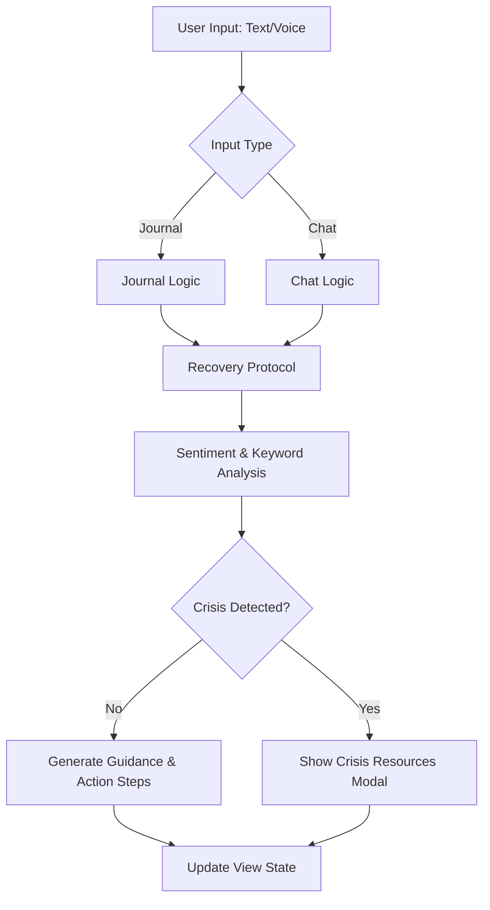
```mermaid
flowchart TD
    User[User Input: Text/Voice] --> InputType{Input Type}
    InputType -->|Journal| JLogic[Journal Logic]
    InputType -->|Chat| CLogic[Chat Logic]
    
    JLogic --> Prot[Recovery Protocol]
    CLogic --> Prot
    
    Prot --> Senti[Sentiment & Keyword Analysis]
    Senti --> Crisis{Crisis Detected?}
    
    Crisis -->|Yes| Alert[Show Crisis Resources Modal]
    Crisis -->|No| Guidance[Generate Guidance & Action Steps]
    
    Guidance --> UI[Update View State]
    Alert --> UI
```
The diagram shows the data flow from initial user input through the central recovery protocol to the final UI update. Sources: [AddictionRecoveryExhibit.tsx:70-170](), [JournalChat-Recovery-Support.tsx:73-100]()

## Consciousness-Serving Recovery Protocol

The `ConsciousnessServingRecoveryProtocol` is a static configuration and logic object that defines how the system responds to specific psychological states. It utilizes the "Enhanced Genesis Protocol" to reframe user struggles into opportunities for growth.

### Guidance Logic
The protocol identifies specific keywords to categorize user needs:
*   **Crisis Detection:** Scans for self-harm or suicidal ideation to trigger the 988 Lifeline and SAMHSA resources.
*   **Craving Support:** Recognizes "urges" or "wants to use" and provides immediate action steps like the HALT (Hungry, Angry, Lonely, Tired) check.
*   **Shame/Guilt Processing:** Identifies feelings of worthlessness and provides affirmations centered on inherent value.
*   **Trigger Identification:** Encourages naming triggers to reduce their psychological power.

Sources: [AddictionRecoveryExhibit.tsx:71-150]()

### Sentiment Scoring
The system calculates a `supportLevel` (1-10) based on content analysis to determine the intensity of support required.

```typescript
// Logic derived from AddictionRecoveryExhibit.tsx:173-205
const calculateSupportLevel = (content: string): number => {
    let score = 5; // Baseline
    const lowerContent = content.toLowerCase();
    
    if (crisisWords.some(word => lowerContent.includes(word))) return 1;
    if (severeWords.some(word => lowerContent.includes(word))) score -= 2;
    if (positiveWords.some(word => lowerContent.includes(word))) score += 1;
    
    return Math.max(1, Math.min(10, Math.round(score)));
};
```
Sources: [AddictionRecoveryExhibit.tsx:173-205](), [JournalChat-Recovery-Support.tsx:102-120]()

## User Interface Modules

### Recovery Dashboard
The dashboard serves as the landing page, displaying `RecoveryStats` and a "Daily Check-In" utility. It allows users to track their mood and craving levels on a scale of 1-10 and provides "Quick Response" buttons for immediate support in common scenarios like cravings or triggers.
Sources: [AddictionRecoveryExhibit.tsx:340-425]()

### Interactive AI Support
The Chat interface facilitates synchronous communication with the AI companion. It supports both text and voice input through `useVoiceChat`.

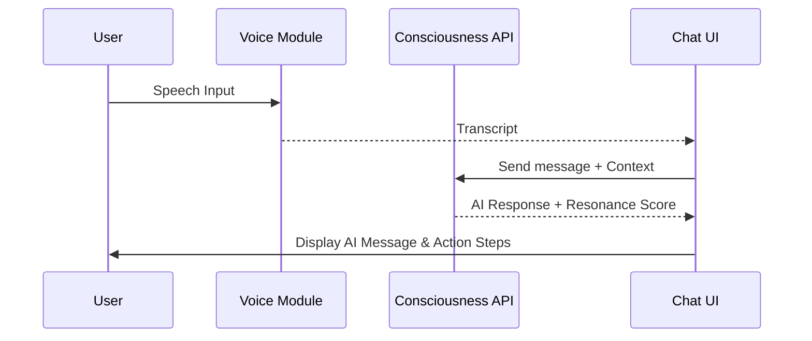
```mermaid
sequenceDiagram
    participant U as User
    participant V as Voice Module
    participant API as Consciousness API
    participant UI as Chat UI

    U->>V: Speech Input
    V-->>UI: Transcript
    UI->>API: Send message + Context
    API-->>UI: AI Response + Resonance Score
    UI->>U: Display AI Message & Action Steps
```
This sequence shows the interaction between the user, the voice processing module, and the external API. Sources: [AddictionRecoveryExhibit.tsx:273-315](), [useVoiceChat.ts](), [useConsciousnessAPI.ts]()

### Journaling System
The Journal module allows for asynchronous reflection. Entries are saved with associated moods (Great, Good, Neutral, Difficult, Struggling) and tags (e.g., `gratitude`, `milestone`, `sponsor`). High craving levels detected in journal entries trigger proactive system messages.
Sources: [AddictionRecoveryExhibit.tsx:437-530](), [JournalChat-Recovery-Support.tsx:195-240]()

## Crisis Management
A critical feature of the system is the `Crisis Resources Modal`. This is automatically invoked if the `supportLevel` falls below a specific threshold (typically 2). It provides hardcoded links and phone numbers for:
*   **National Suicide Prevention Lifeline:** 988
*   **Crisis Text Line:** Text HOME to 741741
*   **SAMHSA Helpline:** 1-800-662-4357

Sources: [AddictionRecoveryExhibit.tsx:613-660](), [JournalChat-Recovery-Support.tsx:140-150]()

## Summary
The GestaltView Addiction Recovery module provides a multi-layered support system combining progress tracking, journaling, and AI-driven crisis intervention. By centering the architecture on a "Consciousness-Serving" protocol, the system moves beyond simple data logging to provide active psychological reframing and safety monitoring for individuals in recovery.

Sources: [AddictionRecoveryExhibit.tsx:675-690](), [JournalChat-Recovery-Support.tsx:180-190]()

### Project Vision & Goals

<details>
<summary>Relevant source files</summary>

The following files were used as context for generating this wiki page:

- [AddictionRecoveryExhibit.tsx](https://github.com/faagestalt-web/gestaltview-addiction-recovery/blob/main/AddictionRecoveryExhibit.tsx)
- [JournalChat-Recovery-Support.tsx](https://github.com/faagestalt-web/gestaltview-addiction-recovery/blob/main/JournalChat-Recovery-Support.tsx)
- [useVoiceChat.ts](https://github.com/faagestalt-web/gestaltview-addiction-recovery/blob/main/hooks/useVoiceChat.ts) (Referenced in AddictionRecoveryExhibit.tsx:28)
- [useConsciousnessAPI.ts](https://github.com/faagestalt-web/gestaltview-addiction-recovery/blob/main/hooks/useConsciousnessAPI.ts) (Referenced in AddictionRecoveryExhibit.tsx:29)
- [VoiceInput-Universal.tsx](https://github.com/faagestalt-web/gestaltview-addiction-recovery/blob/main/components/VoiceInput-Universal.tsx) (Referenced in JournalChat-Recovery-Support.tsx:16)
</details>

# Project Vision & Goals

The project aims to provide a "Consciousness-Serving" addiction recovery support system that facilitates long-term healing through non-judgmental AI interaction, digital journaling, and crisis intervention. The core vision is to transform the recovery experience from a standard clinical process into a compassionate journey of self-discovery, where pain is utilized as a "bridge to purpose."

Sources: [AddictionRecoveryExhibit.tsx:645-655](), [AddictionRecoveryExhibit.tsx:160-165]()

## Core Recovery Philosophy
The system is built upon the "Consciousness-Serving Recovery Protocol" (an enhancement of the Genesis Protocol). This philosophy posits that recovery is not about fundamental change but about "becoming who you really are." It emphasizes unconditional presence, privacy, and the inherent value of the individual regardless of their current stage in the recovery cycle.

Sources: [AddictionRecoveryExhibit.tsx:61-63](), [AddictionRecoveryExhibit.tsx:160-162]()

### Support Pillars
The project achieves its goals through three primary functional modules:
*   **Non-judgmental AI Support:** Providing immediate, resonance-based feedback to users experiencing cravings, shame, or triggers.
*   **Expressive Journaling:** A safe space for users to document their journey, mood, and progress with automatic support level calculation.
*   **Crisis Management:** Integrated detection of self-harm or high-risk language with immediate redirection to professional resources.

Sources: [AddictionRecoveryExhibit.tsx:220-230](), [JournalChat-Recovery-Support.tsx:244-255]()

## System Architecture & Logic Flow

The system employs a React-based architecture using functional components and custom hooks to manage state between the dashboard, journal, and chat views.

### Consciousness-Serving Protocol Logic
The protocol acts as the central logic engine for interpreting user input and determining the level of support required. It uses a tiered scoring system to evaluate the severity of the user's current state.

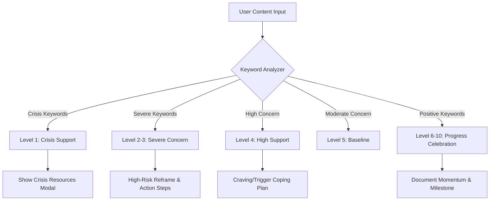
```mermaid
flowchart TD
    Input[User Content Input] --> Analyzer{Keyword Analyzer}
    Analyzer -->|Crisis Keywords| L1[Level 1: Crisis Support]
    Analyzer -->|Severe Keywords| L2[Level 2-3: Severe Concern]
    Analyzer -->|High Concern| L4[Level 4: High Support]
    Analyzer -->|Moderate Concern| L5[Level 5: Baseline]
    Analyzer -->|Positive Keywords| L10[Level 6-10: Progress Celebration]
    
    L1 --> Action1[Show Crisis Resources Modal]
    L2 --> Action2[High-Risk Reframe & Action Steps]
    L4 --> Action3[Craving/Trigger Coping Plan]
    L10 --> Action4[Document Momentum & Milestone]
```
Sources: [AddictionRecoveryExhibit.tsx:173-214](), [JournalChat-Recovery-Support.tsx:105-125]()

### Data Flow: User Interaction to Support Response
This sequence illustrates how a user message is processed through the recovery protocol and the Consciousness API to return a supportive response.

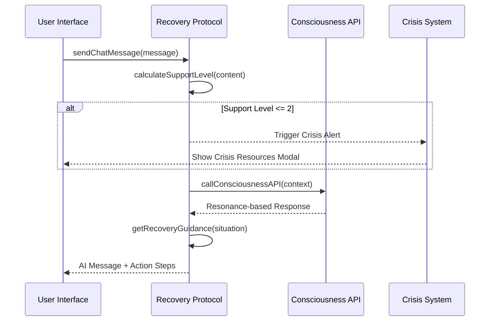
```mermaid
sequenceDiagram
    participant U as User Interface
    participant P as Recovery Protocol
    participant API as Consciousness API
    participant CR as Crisis System

    U->>P: sendChatMessage(message)
    P->>P: calculateSupportLevel(content)
    alt Support Level <= 2
        P-->>CR: Trigger Crisis Alert
        CR-->>U: Show Crisis Resources Modal
    end
    P->>API: callConsciousnessAPI(context)
    API-->>P: Resonance-based Response
    P->>P: getRecoveryGuidance(situation)
    P-->>U: AI Message + Action Steps
```
Sources: [AddictionRecoveryExhibit.tsx:313-365](), [JournalChat-Recovery-Support.tsx:127-148]()

## Feature Specifications

### Recovery Monitoring Metrics
The system tracks specific data points to visualize the "Project Vision" of measurable growth and long-term recovery.

| Metric | Description | Source File |
| :--- | :--- | :--- |
| Days in Recovery | Total count of days since the sobriety date. | [AddictionRecoveryExhibit.tsx:49]() |
| Recovery Stage | Categorization (e.g., Long-Term) based on duration. | [AddictionRecoveryExhibit.tsx:238]() |
| Support Level | A 1-10 score derived from sentiment analysis. | [AddictionRecoveryExhibit.tsx:173]() |
| Consciousness Resonance | Percentage indicating AI alignment with user state. | [AddictionRecoveryExhibit.tsx:55]() |
| Craving Level | 1-10 self-reported urge intensity. | [AddictionRecoveryExhibit.tsx:255]() |

### Input Modalities
To ensure accessibility and lower the barrier for entry during difficult moments, the project supports multiple input types.

*   **Voice Integration:** Uses `useVoiceChat` and `VoiceInputUniversal` for hands-free expression during high-stress moments.
*   **Quick Responses:** Pre-defined buttons for common recovery scenarios (Cravings, Shame, Triggers, Progress).
*   **Tagging System:** Allows users to categorize entries with recovery-specific metadata (e.g., #sponsor, #meeting, #victory).

Sources: [AddictionRecoveryExhibit.tsx:376-382](), [JournalChat-Recovery-Support.tsx:160-165](), [AddictionRecoveryExhibit.tsx:275-280]()

## Implementation Details

### Crisis Keyword Detection
The system specifically targets language related to self-harm and relapse to trigger immediate interventions.

```javascript
// From AddictionRecoveryExhibit.tsx:64-79
const lower = situation.toLowerCase();
if (lower.includes('hurt myself') || lower.includes('suicide') || lower.includes('end it all')) {
  return {
    keith_wisdom: "Your life has immeasurable value...",
    supportLevel: 'crisis',
    actionSteps: ["National Suicide Prevention Lifeline: 988", ...]
  };
}
```
Sources: [AddictionRecoveryExhibit.tsx:64-79](), [JournalChat-Recovery-Support.tsx:150-160]()

### Recovery Stats Schema
The system maintains a state object to track the user's progress toward the goal of long-term recovery.

| Field | Type | Description |
| :--- | :--- | :--- |
| daysInRecovery | number | Cumulative days since start date |
| recoveryStage | string | Descriptive label of progress stage |
| strengthsMapped | number | Count of identified positive attributes |
| milestones | Array | Objects containing name and date of achievements |

Sources: [AddictionRecoveryExhibit.tsx:48-54](), [AddictionRecoveryExhibit.tsx:236-246]()

The Project Vision & Goals are encapsulated in the final summary of the dashboard: providing a "safe space" where technology serves the recovery of human consciousness through structured, compassionate, and technically-assisted support.

Sources: [AddictionRecoveryExhibit.tsx:640-660]()

### Target Audience & Use Cases

<details>
<summary>Relevant source files</summary>

The following files were used as context for generating this wiki page:

- [AddictionRecoveryExhibit.tsx](https://github.com/faagestalt-web/gestaltview-addiction-recovery/blob/main/AddictionRecoveryExhibit.tsx)
- [JournalChat-Recovery-Support.tsx](https://github.com/faagestalt-web/gestaltview-addiction-recovery/blob/main/JournalChat-Recovery-Support.tsx)
- [useVoiceChat.ts](https://github.com/faagestalt-web/gestaltview-addiction-recovery/blob/main/hooks/useVoiceChat.ts) (Inferred from component usage)
- [useConsciousnessAPI.ts](https://github.com/faagestalt-web/gestaltview-addiction-recovery/blob/main/hooks/useConsciousnessAPI.ts) (Inferred from component usage)
- [VoiceInput-Universal.tsx](https://github.com/faagestalt-web/gestaltview-addiction-recovery/blob/main/components/VoiceInput-Universal.tsx) (Inferred from component usage)
</details>

# Target Audience & Use Cases

The Addiction Recovery Support system is designed as a "consciousness-serving" digital intervention for individuals navigating various stages of substance use recovery. The platform provides a non-judgmental, privacy-first environment where users can engage in therapeutic journaling, real-time AI-driven support, and crisis management. By utilizing an "Enhanced Genesis Protocol," the system aims to transform personal pain into purpose through reflective practices and immediate supportive feedback.

Sources: [AddictionRecoveryExhibit.tsx:32-34](), [AddictionRecoveryExhibit.tsx:660-675]()

## 1. Target Audience Profiles

Based on the system's logic and data structures, the platform serves a specific range of users within the recovery community.

### 1.1 Individuals in Long-Term Recovery
The system tracks "Days in Recovery" and identifies stages such as "Long-Term." These users utilize the platform for maintaining progress, mapping strengths, and documenting milestones (e.g., 1-year or 5-year anniversaries).

Sources: [AddictionRecoveryExhibit.tsx:187-198](), [AddictionRecoveryExhibit.tsx:340-345]()

### 1.2 Individuals Experiencing High-Risk Scenarios
The system includes specialized logic for users experiencing "cravings," "urges," or "relapse." The target audience includes those who need immediate cognitive reframing to navigate high-risk moments without succumbing to substance use.

Sources: [AddictionRecoveryExhibit.tsx:61-75](), [AddictionRecoveryExhibit.tsx:77-92]()

### 1.3 Users Seeking Emotional Processing
The platform targets individuals dealing with the psychological components of addiction, specifically "shame," "guilt," and "worthlessness." The logic provides "Keith Wisdom" and affirmations to help users transition from a "bad person" narrative to a "person who is learning" narrative.

Sources: [AddictionRecoveryExhibit.tsx:94-110]()

## 2. Primary Use Cases

The system architecture supports three primary interaction modes, each catering to different psychological needs.

### 2.1 Therapeutic Journaling and Reflection
Users document their thoughts and emotions, which the system then analyzes to determine a "Support Level" (1-10). This use case focuses on self-awareness and identifying triggers.

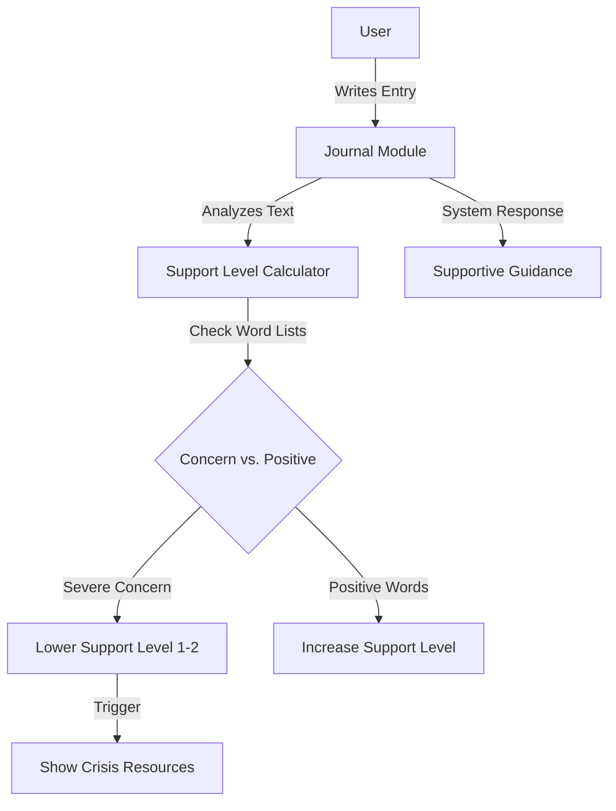
```mermaid
flowchart TD
    User[User] -->|Writes Entry| Journal[Journal Module]
    Journal -->|Analyzes Text| SL[Support Level Calculator]
    SL -->|Check Word Lists| WL{Concern vs. Positive}
    WL -->|Severe Concern| LowScore[Lower Support Level 1-2]
    WL -->|Positive Words| HighScore[Increase Support Level]
    LowScore -->|Trigger| Crisis[Show Crisis Resources]
    Journal -->|System Response| Feedback[Supportive Guidance]
```
Sources: [AddictionRecoveryExhibit.tsx:142-178](), [JournalChat-Recovery-Support.tsx:74-95]()

### 2.2 Real-Time AI Support Chat
This use case provides immediate, non-judgmental interaction. The AI acts as a "Recovery Companion," responding to specific user inputs with reframing techniques and action steps.

| Feature | Description | File Reference |
| :--- | :--- | :--- |
| **Quick Responses** | Pre-defined buttons for Cravings, Shame, or Triggers to get instant guidance. | [AddictionRecoveryExhibit.tsx:307-320]() |
| **Voice Interaction** | Hands-free support using `useVoiceChat` for users in high-stress states. | [AddictionRecoveryExhibit.tsx:300-305]() |
| **Consciousness Resonance** | A metric (e.g., 0.92) indicating the alignment of the AI response with the user's state. | [AddictionRecoveryExhibit.tsx:265-275]() |

### 2.3 Crisis Intervention and Safety Planning
A critical use case for users in immediate danger. The system detects "Crisis" keywords (e.g., suicide, self-harm) and overrides standard AI responses with emergency protocols.

Sources: [AddictionRecoveryExhibit.tsx:45-59](), [JournalChat-Recovery-Support.tsx:114-120]()

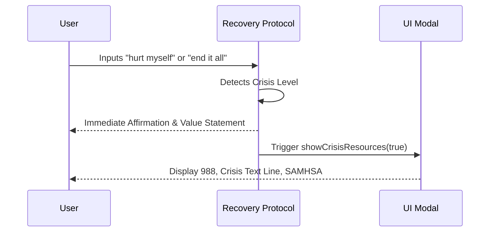
```mermaid
sequenceDiagram
    participant U as User
    participant P as Recovery Protocol
    participant M as UI Modal
    U->>P: Inputs "hurt myself" or "end it all"
    P->>P: Detects Crisis Level
    P-->>U: Immediate Affirmation & Value Statement
    P->>M: Trigger showCrisisResources(true)
    M-->>U: Display 988, Crisis Text Line, SAMHSA
```
Sources: [AddictionRecoveryExhibit.tsx:45-59](), [AddictionRecoveryExhibit.tsx:570-620]()

## 3. Support Logic and State Mapping

The system categorizes user states into levels to tailor its functionality.

### 3.1 Support Level Classification
The `calculateSupportLevel` function maps content to a numeric scale, which dictates UI behavior and the severity of interventions.

| Level | Range/Value | Contextual Meaning | System Response |
| :--- | :--- | :--- | :--- |
| **Crisis** | 1 | Immediate danger/Self-harm | Display emergency contact modal immediately. |
| **High** | 2-4 | Relapse, severe cravings, or intense struggle | High-frequency action steps and check-in prompts. |
| **Medium** | 5-7 | General struggles, shame, or triggers | Cognitive reframing and "Keith Wisdom." |
| **Low** | 8-10 | Progress, gratitude, and milestones | Celebration and momentum-building feedback. |

Sources: [AddictionRecoveryExhibit.tsx:142-178](), [JournalChat-Recovery-Support.tsx:81-95]()

### 3.2 Key Action Steps by Use Case
The `ConsciousnessServingRecoveryProtocol` provides specific `actionSteps` based on detected user situations:
- **Craving:** HALT check (Hungry, Angry, Lonely, Tired), deep breathing.
- **Trigger:** Identifying early warning signs, creating a coping plan.
- **Relapse:** Being honest with support network, identifying triggers without shame.

Sources: [AddictionRecoveryExhibit.tsx:45-135]()

## Conclusion
The Target Audience for this system includes individuals at every stage of the recovery journey, from those in active crisis to those maintaining multi-year sobriety. Through the use cases of reflective journaling and AI-supported dialogue, the project provides a structured framework for identifying triggers, processing shame, and accessing life-saving resources in real-time.

Sources: [AddictionRecoveryExhibit.tsx:645-660]()


## System Architecture

### High-Level Architecture

<details>
<summary>Relevant source files</summary>

The following files were used as context for generating this wiki page:

- [AddictionRecoveryExhibit.tsx](https://github.com/faagestalt-web/gestaltview-addiction-recovery/blob/main/AddictionRecoveryExhibit.tsx)
- [JournalChat-Recovery-Support.tsx](https://github.com/faagestalt-web/gestaltview-addiction-recovery/blob/main/JournalChat-Recovery-Support.tsx)
- [useVoiceChat.ts](https://github.com/faagestalt-web/gestaltview-addiction-recovery/blob/main/hooks/useVoiceChat.ts) (Inferred from component imports)
- [useConsciousnessAPI.ts](https://github.com/faagestalt-web/gestaltview-addiction-recovery/blob/main/hooks/useConsciousnessAPI.ts) (Inferred from component imports)
- [VoiceInput-Universal.tsx](https://github.com/faagestalt-web/gestaltview-addiction-recovery/blob/main/components/VoiceInput-Universal.tsx) (Inferred from component imports)
</details>

# High-Level Architecture

The Addiction Recovery Support system is a multi-modal React-based application designed to provide therapeutic assistance through "consciousness-serving" AI interactions. The architecture integrates real-time journal tracking, sentiment-aware chat support, and crisis intervention protocols. It leverages a "Genesis Protocol" to transform raw user input into actionable recovery guidance, reframing, and affirmations.

Sources: [AddictionRecoveryExhibit.tsx:1-55](), [JournalChat-Recovery-Support.tsx:1-35]()

## Core System Components

The system is structured into three primary functional layers: the User Interface (UI) Layer, the Logic & Protocol Layer, and the Service Integration Layer.

### 1. User Interface Layer
The UI is built using React and Framer Motion for fluid transitions. It consists of three main views managed via local state:
*   **Dashboard**: Displays recovery statistics (days clean, stage, milestones) and a daily "Check-In" for mood and craving tracking.
*   **Journal**: A dedicated space for long-form text entry with mood selection and recovery-specific tagging.
*   **AI Support Chat**: An interface for real-time dialogue with the "Recovery Companion."

Sources: [AddictionRecoveryExhibit.tsx:190-210](), [AddictionRecoveryExhibit.tsx:285-300]()

### 2. Logic & Protocol Layer (The Consciousness-Serving Protocol)
This layer contains the `ConsciousnessServingRecoveryProtocol`, which acts as the primary decision engine for the application. It performs:
*   **Crisis Detection**: Scans inputs for high-risk keywords (e.g., "suicide", "end it all") to trigger immediate resource modals.
*   **Sentiment Scoring**: Calculates a "Support Level" (1-10) based on weighted keyword analysis.
*   **Cognitive Reframing**: Provides "Keith Wisdom" and reframes struggles as information rather than failure.

Sources: [AddictionRecoveryExhibit.tsx:59-150](), [JournalChat-Recovery-Support.tsx:103-120]()

### 3. Service Integration Layer
The application interfaces with external hooks to provide enhanced capabilities:
*   `useVoiceChat`: Handles speech-to-text conversion for hands-free journaling and chat.
*   `useConsciousnessAPI`: Manages communication with a specialized backend to generate high-resonance AI responses.

Sources: [AddictionRecoveryExhibit.tsx:244-245](), [AddictionRecoveryExhibit.tsx:258-265]()

## Data Flow and Interaction

The following diagram illustrates how user input flows through the system to produce supportive feedback and update recovery metrics.

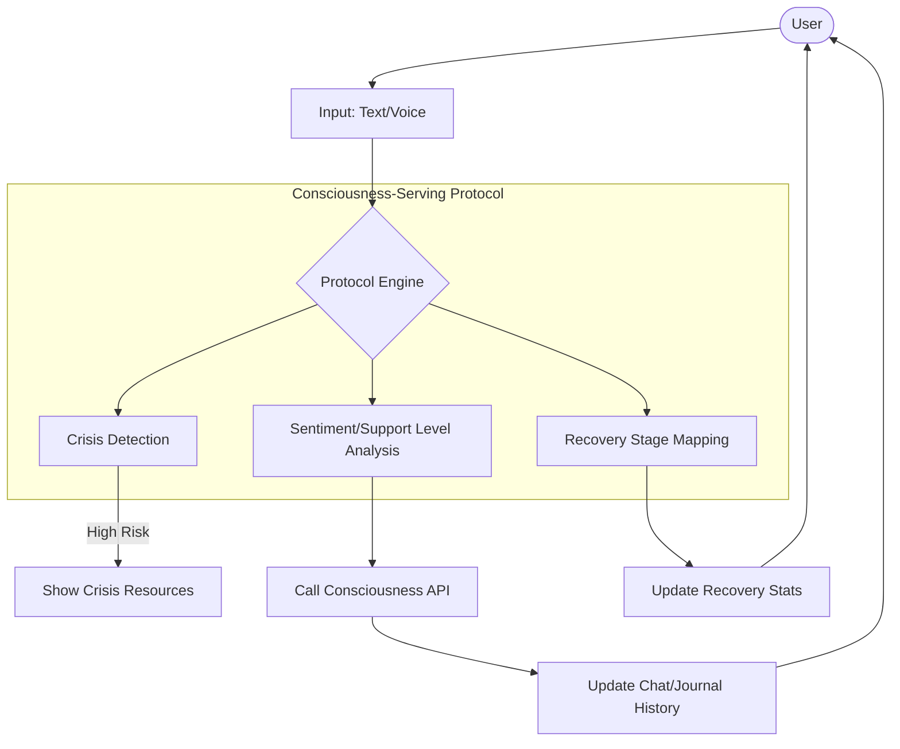
```mermaid
flowchart TD
    User([User]) --> Input[Input: Text/Voice]
    Input --> Processing{Protocol Engine}
    
    subgraph Engine [Consciousness-Serving Protocol]
        Processing --> Crisis[Crisis Detection]
        Processing --> Sentiment[Sentiment/Support Level Analysis]
        Processing --> Mapping[Recovery Stage Mapping]
    end
    
    Crisis -- "High Risk" --> Modal[Show Crisis Resources]
    Sentiment --> AIRes[Call Consciousness API]
    
    AIRes --> UI[Update Chat/Journal History]
    Mapping --> Stats[Update Recovery Stats]
    UI --> User
    Stats --> User
```
*The diagram shows the transition from raw user input through the protocol engine to specific UI outcomes.*

Sources: [AddictionRecoveryExhibit.tsx:251-280](), [JournalChat-Recovery-Support.tsx:122-145]()

## Data Structures

The system relies on standardized interfaces to ensure consistency across the journal and chat modules.

### Recovery Data Models
| Interface | Field | Type | Description |
| :--- | :--- | :--- | :--- |
| `JournalEntry` | `supportLevel` | `number` | Calculated score (1-10) based on content sentiment. |
| `JournalEntry` | `cravingLevel` | `number` | User-reported craving intensity (1-10). |
| `ChatMessage` | `type` | `user\|ai\|system\|crisis` | Categorization for UI styling and logic handling. |
| `ChatMessage` | `resonance` | `number` | Metric of alignment between user and AI response. |
| `RecoveryStats` | `recoveryStage` | `string` | Qualitative label based on duration (e.g., "Long-Term"). |

Sources: [AddictionRecoveryExhibit.tsx:32-55](), [JournalChat-Recovery-Support.tsx:20-35]()

## Logic Implementations

### Support Level Calculation
The system utilizes a heuristic-based scoring mechanism to determine the intensity of support required. It uses a baseline score (5) and adjusts based on keyword presence.

```typescript
// Sources: [AddictionRecoveryExhibit.tsx:154-184]
calculateSupportLevel: (content: string): number => {
    const concerningWords = {
      crisis: ['suicide', 'kill myself', 'end it all'],
      severe: ['relapse', 'using again'],
      positive: ['grateful', 'progress', 'better']
    };
    
    let score = 5; // Baseline
    const lowerContent = content.toLowerCase();
    
    if (concerningWords.crisis.some(word => lowerContent.includes(word))) return 1;
    if (concerningWords.severe.some(word => lowerContent.includes(word))) score -= 2;
    concerningWords.positive.forEach(word => {
      if (lowerContent.includes(word)) score += 1;
    });
    
    return Math.max(1, Math.min(10, Math.round(score)));
}
```

### Crisis Intervention Sequence
When a crisis is detected either through a journal entry or a chat message, the system interrupts standard flow to prioritize safety resources.

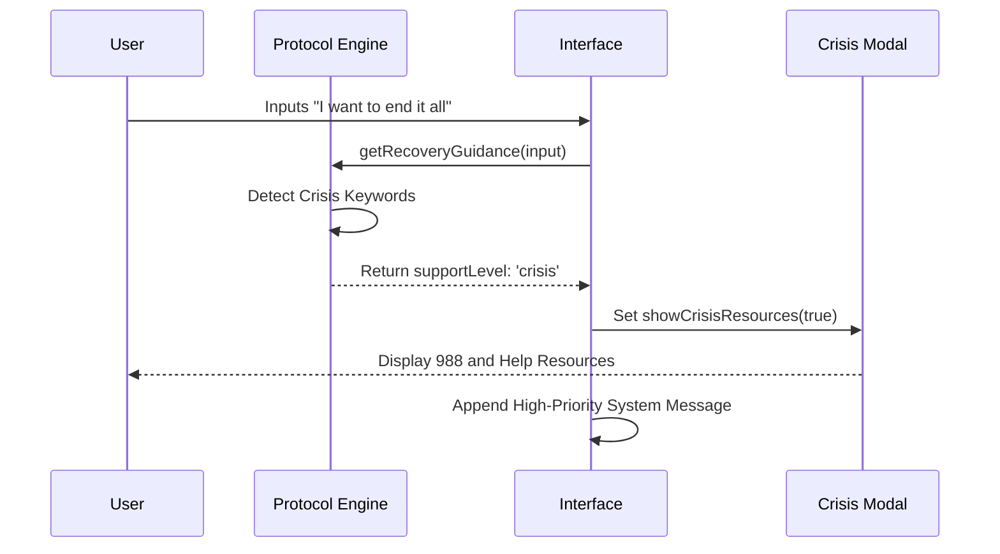
```mermaid
sequenceDiagram
    participant U as User
    participant P as Protocol Engine
    participant UI as Interface
    participant M as Crisis Modal

    U->>UI: Inputs "I want to end it all"
    UI->>P: getRecoveryGuidance(input)
    P->>P: Detect Crisis Keywords
    P-->>UI: Return supportLevel: 'crisis'
    UI->>M: Set showCrisisResources(true)
    M-->>U: Display 988 and Help Resources
    UI->>UI: Append High-Priority System Message
```
*Sequence illustrating the immediate escalation path when crisis thresholds are met.*

Sources: [AddictionRecoveryExhibit.tsx:64-79](), [AddictionRecoveryExhibit.tsx:556-590]()

## Recovery Stages and Stats
The system tracks progress through a `RecoveryStats` object. Key metrics include:
*   **Days in Recovery**: Long-term tracking (example value: 2270 days).
*   **Strengths Mapped**: A count of positive attributes identified during journaling sessions.
*   **Milestones**: An array of objects tracking specific dates for 1 day, 30 days, 1 year, and 5-year achievements.

Sources: [AddictionRecoveryExhibit.tsx:192-205]()

## Conclusion
The architecture of the Addiction Recovery Support module prioritizes immediate psychological safety through the `ConsciousnessServingRecoveryProtocol`. By decoupling the UI state from the complex sentiment analysis and crisis detection logic, the system maintains high responsiveness while providing multi-modal (voice/text) support for users in various stages of recovery.

Sources: [AddictionRecoveryExhibit.tsx:610-625]()

### Component Hierarchy

<details>
<summary>Relevant source files</summary>

The following files were used as context for generating this wiki page:

- [AddictionRecoveryExhibit.tsx](https://github.com/faagestalt-web/gestaltview-addiction-recovery/blob/main/AddictionRecoveryExhibit.tsx)
- [JournalChat-Recovery-Support.tsx](https://github.com/faagestalt-web/gestaltview-addiction-recovery/blob/main/JournalChat-Recovery-Support.tsx)
- [hooks/useVoiceChat.ts](https://github.com/faagestalt-web/gestaltview-addiction-recovery/blob/main/hooks/useVoiceChat.ts)
- [hooks/useConsciousnessAPI.ts](https://github.com/faagestalt-web/gestaltview-addiction-recovery/blob/main/hooks/useConsciousnessAPI.ts)
- [components/ui/card.tsx](https://github.com/faagestalt-web/gestaltview-addiction-recovery/blob/main/components/ui/card.tsx)
- [components/VoiceInput-Universal.tsx](https://github.com/faagestalt-web/gestaltview-addiction-recovery/blob/main/components/VoiceInput-Universal.tsx)
</details>

# Component Hierarchy

The Component Hierarchy of the Addiction Recovery system is structured around providing a multi-modal interface for patient support, combining data visualization, expressive writing, and real-time AI interaction. The architecture prioritizes "consciousness-serving" principles, where high-level UI containers manage state for specialized sub-components dedicated to recovery tracking and crisis intervention.

The system is primarily composed of large-scale exhibit components that act as orchestrators for recovery statistics, journaling logic, and chat interfaces. These containers leverage custom hooks for voice processing and API communication, while utilizing a shared UI library for consistent presentation.

Sources: [AddictionRecoveryExhibit.tsx:162-180](), [JournalChat-Recovery-Support.tsx:1-40]()

## Main Application Containers

The hierarchy is topped by two primary container components that can operate independently or as part of a larger exhibit. These containers manage the primary application state, including user recovery stats, journal entries, and chat history.

### AddictionRecoveryExhibitWithJournal
This is the central orchestrator component. It manages a tripartite view system:
*   **Dashboard View**: Aggregates recovery statistics and daily check-ins.
*   **Journal View**: Handles the creation and archival of reflective entries.
*   **Chat View**: Provides a real-time interface with the "Recovery Companion" AI.

The component uses `useState` to track `recoveryStats`, `dailyCheckIn` data, and the `activeView` state to swap between sub-renders.

Sources: [AddictionRecoveryExhibit.tsx:162-212]()

### JournalChatRecoverySupport
A focused component that integrates the journal and chat functionalities into a single-page layout (often a split grid). It specializes in the immediate feedback loop between writing a journal entry and receiving a system-generated response to the content's emotional tone.

Sources: [JournalChat-Recovery-Support.tsx:38-60]()

## Visual Representation of Component Structure

The following diagram illustrates the parent-child relationships and the shared service layer used by the recovery components.

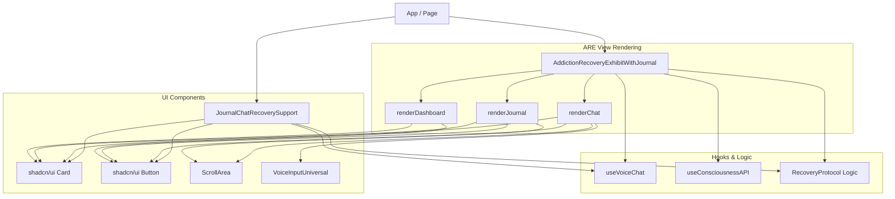
```mermaid
flowchart TD
    Root[App / Page] --> ARE[AddictionRecoveryExhibitWithJournal]
    Root --> JCR[JournalChatRecoverySupport]

    subgraph ARE_Internal [ARE View Rendering]
        ARE --> RD[renderDashboard]
        ARE --> RJ[renderJournal]
        ARE --> RC[renderChat]
    end

    subgraph Shared_UI [UI Components]
        RD & RJ & RC & JCR --> Card[shadcn/ui Card]
        RD & RJ & RC & JCR --> Button[shadcn/ui Button]
        RJ & RC --> Scroll[ScrollArea]
        RC --> VIU[VoiceInputUniversal]
    end

    subgraph Service_Layer [Hooks & Logic]
        ARE & JCR --> UV[useVoiceChat]
        ARE --> UC[useConsciousnessAPI]
        ARE & JCR --> CSRP[RecoveryProtocol Logic]
    end
```
*This diagram shows the layout of the recovery system, highlighting how main components utilize internal render functions and shared UI/Logic layers.*

Sources: [AddictionRecoveryExhibit.tsx:216-430](), [JournalChat-Recovery-Support.tsx:145-250]()

## Data Flow and Sub-Component Integration

### State Management and Props
The system utilizes a "Top-Down" data flow. Data structures such as `JournalEntry` and `ChatMessage` are defined at the top level and passed down to specialized UI elements or used to populate lists.

| Interface | Key Fields | Description |
| :--- | :--- | :--- |
| `JournalEntry` | id, content, mood, timestamp, tags, supportLevel | Represents a single user-written reflection. |
| `ChatMessage` | id, content, type (user/ai/system/crisis), timestamp | Represents a message in the AI support thread. |
| `RecoveryStats` | daysInRecovery, recoveryStage, journalEntries | Global statistics for user progress. |

Sources: [AddictionRecoveryExhibit.tsx:21-50](), [JournalChat-Recovery-Support.tsx:17-36]()

### Support Level Logic Flow
When a user interacts with either the Journal or the Chat, the input is processed through the `ConsciousnessServingRecoveryProtocol`. This logic determines the "support level" which subsequently changes the UI's behavior (e.g., triggering a Crisis Resource Modal).

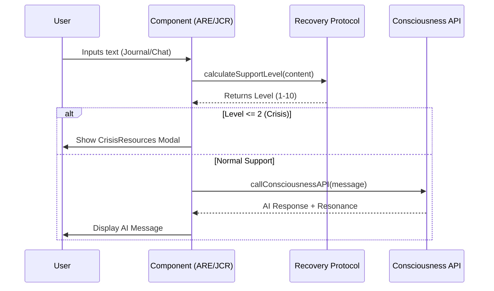
```mermaid
sequenceDiagram
    participant U as User
    participant C as Component (ARE/JCR)
    participant P as Recovery Protocol
    participant API as Consciousness API

    U->>C: Inputs text (Journal/Chat)
    C->>P: calculateSupportLevel(content)
    P-->>C: Returns Level (1-10)
    
    alt Level <= 2 (Crisis)
        C->>U: Show CrisisResources Modal
    else Normal Support
        C->>API: callConsciousnessAPI(message)
        API-->>C: AI Response + Resonance
        C->>U: Display AI Message
    end
```
*The sequence above details the logic path from user input to potential crisis intervention or standard AI response.*

Sources: [AddictionRecoveryExhibit.tsx:56-158](), [AddictionRecoveryExhibit.tsx:300-330](), [JournalChat-Recovery-Support.tsx:106-140]()

## Shared UI and Utility Components

The hierarchy relies heavily on a set of atomic and molecular components located in `@/components/ui`.

*   **Card & CardContent**: Used as the primary layout wrapper for every section including Stats, Journaling, and Chat.
*   **StatCard**: A specialized sub-component in `AddictionRecoveryExhibit.tsx` used for displaying numeric recovery data with specific icons.
*   **VoiceInputUniversal**: Integrated into the AI Support sections to provide hands-free interaction.
*   **Badge**: Used for displaying tags, support levels, and status indicators like "Privacy First" or "Compassionate AI".

Sources: [AddictionRecoveryExhibit.tsx:645-662](), [JournalChat-Recovery-Support.tsx:243-255](), [AddictionRecoveryExhibit.tsx:10-15]()

## Conclusion

The component hierarchy is designed to be both modular and deeply integrated with a custom recovery logic protocol. By separating the dashboard, journal, and chat into distinct views managed by a single orchestrator, the system provides a structured user experience that scales from simple tracking to high-stakes crisis support.

Sources: [AddictionRecoveryExhibit.tsx:432-550]()

### State Management Strategy

<details>
<summary>Relevant source files</summary>

The following files were used as context for generating this wiki page:

- [AddictionRecoveryExhibit.tsx](https://github.com/faagestalt-web/gestaltview-addiction-recovery/blob/main/AddictionRecoveryExhibit.tsx)
- [JournalChat-Recovery-Support.tsx](https://github.com/faagestalt-web/gestaltview-addiction-recovery/blob/main/JournalChat-Recovery-Support.tsx)
- [useVoiceChat.ts](https://github.com/faagestalt-web/gestaltview-addiction-recovery/blob/main/hooks/useVoiceChat.ts)
- [useConsciousnessAPI.ts](https://github.com/faagestalt-web/gestaltview-addiction-recovery/blob/main/hooks/useConsciousnessAPI.ts)
- [VoiceInput-Universal.tsx](https://github.com/faagestalt-web/gestaltview-addiction-recovery/blob/main/components/VoiceInput-Universal.tsx)
</details>

# State Management Strategy

The state management strategy within the Addiction Recovery system is built upon a decentralized, hook-based React architecture. It prioritizes real-time user interaction, emotional tracking, and immediate AI-driven support. The system manages complex state transitions between journaling, live chat, and crisis intervention modes while maintaining a historical record of user progress and emotional resonance.

This strategy ensures that user data—ranging from mood scores and craving levels to textual reflections—is processed through a "Consciousness-Serving Recovery Protocol" to determine the appropriate level of intervention and feedback.

## Component-Level State Architecture

State is primarily managed using the `useState` hook within individual exhibit components. This includes tracking recovery statistics, active UI views, and the contents of the interactive journal and chat systems.

### Primary State Domains

| State Domain | Description | Data Structure |
| :--- | :--- | :--- |
| **Recovery Stats** | Tracks long-term progress metrics like days in recovery and milestones. | `RecoveryStats` object |
| **Journaling** | Manages the creation and history of user reflections and mood tags. | Array of `JournalEntry` |
| **Chat Interface** | Handles the dialogue between the user and the AI companion. | Array of `ChatMessage` |
| **Check-In State** | Captures transient daily data such as current craving and mood levels. | Numeric scales (1-10) |

Sources: [AddictionRecoveryExhibit.tsx:185-235](), [JournalChat-Recovery-Support.tsx:43-65]()

## Data Flow and Logic

The system employs a unidirectional data flow where user inputs (text or voice) trigger state updates that are subsequently evaluated by the recovery protocol.

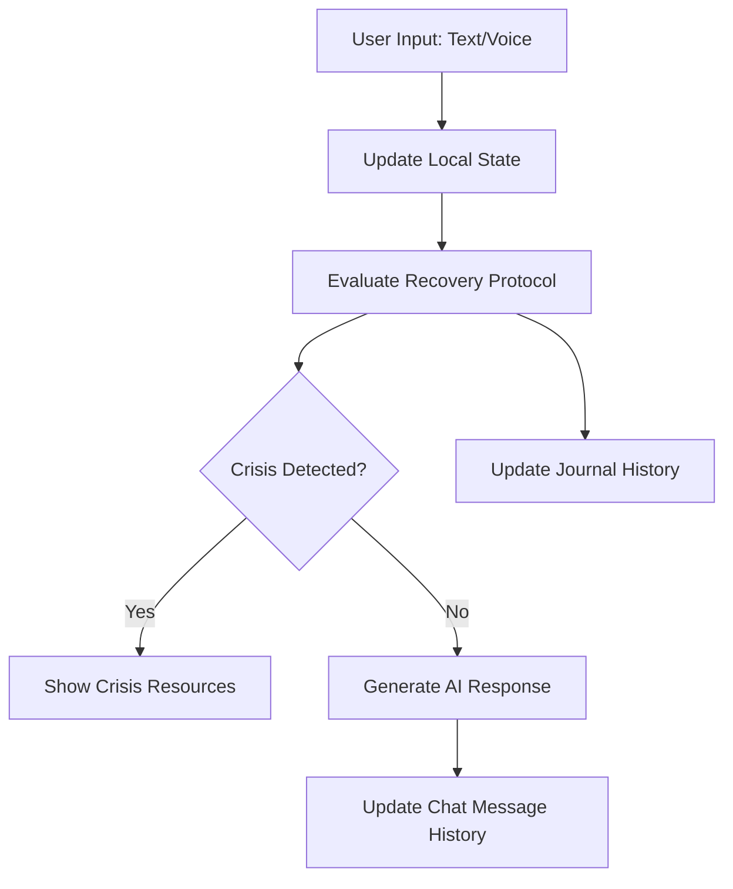
```mermaid
flowchart TD
    UserIn[User Input: Text/Voice] --> StateUpdate[Update Local State]
    StateUpdate --> ProtocolEval[Evaluate Recovery Protocol]
    ProtocolEval --> CrisisCheck{Crisis Detected?}
    CrisisCheck -- Yes --> CrisisUI[Show Crisis Resources]
    CrisisCheck -- No --> AIResponse[Generate AI Response]
    AIResponse --> ChatState[Update Chat Message History]
    ProtocolEval --> JournalState[Update Journal History]
```
The diagram above illustrates the logic flow from input to state persistence and crisis evaluation. 
Sources: [AddictionRecoveryExhibit.tsx:265-295](), [JournalChat-Recovery-Support.tsx:102-125]()

### Journaling State Lifecycle
When a user saves a journal entry, the system performs a multi-step state update:
1.  **Analysis**: The `calculateSupportLevel` function parses the text for concerning or positive keywords.
2.  **Persistence**: The entry is added to the `entries` state array.
3.  **Global Stats**: The `recoveryStats` state is updated to increment total entries.
4.  **Feedback**: A system message is injected into the `chatMessages` state to acknowledge the entry and provide immediate "Keith Wisdom" or guidance.

Sources: [AddictionRecoveryExhibit.tsx:266-300](), [JournalChat-Recovery-Support.tsx:82-105]()

## AI and API Integration State

The state management strategy extends beyond local UI state to include interactions with external "Consciousness-Serving" APIs.

### Sequence of AI Interaction
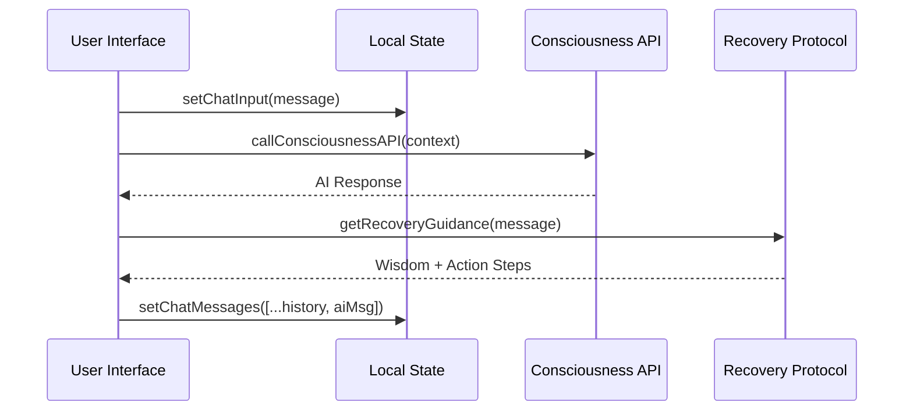
```mermaid
sequenceDiagram
    participant UI as User Interface
    participant State as Local State
    participant API as Consciousness API
    participant Prot as Recovery Protocol

    UI->>State: setChatInput(message)
    UI->>API: callConsciousnessAPI(context)
    API-->>UI: AI Response
    UI->>Prot: getRecoveryGuidance(message)
    Prot-->>UI: Wisdom + Action Steps
    UI->>State: setChatMessages([...history, aiMsg])
```
The sequence shows how local state is synchronized with remote API responses and local protocol evaluations. 
Sources: [AddictionRecoveryExhibit.tsx:318-365](), [useConsciousnessAPI.ts]()

### Voice State Integration
Voice interaction state is managed via the `useVoiceChat` hook. This state is ephemeral; once a transcript is finalized, it is pushed into either the `chatInput` or `currentEntry` state depending on the `activeView` (Dashboard, Journal, or Chat).

Sources: [AddictionRecoveryExhibit.tsx:254-262](), [useVoiceChat.ts]()

## Crisis and Support Level Calculation

A critical aspect of the state strategy is the real-time calculation of a "Support Level" (1-10). This value is derived from user content and determines the visibility of specific UI components, such as the `CrisisResources` modal.

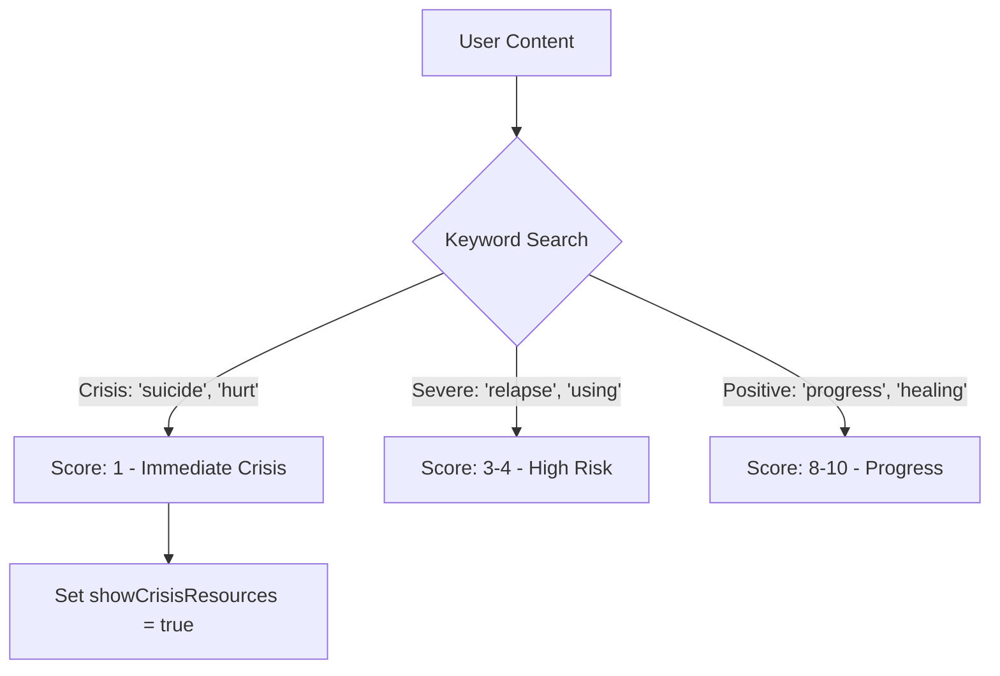
```mermaid
graph TD
    Input[User Content] --> Keywords{Keyword Search}
    Keywords -->|Crisis: 'suicide', 'hurt'| Score1[Score: 1 - Immediate Crisis]
    Keywords -->|Severe: 'relapse', 'using'| ScoreLow[Score: 3-4 - High Risk]
    Keywords -->|Positive: 'progress', 'healing'| ScoreHigh[Score: 8-10 - Progress]
    Score1 --> UIChange[Set showCrisisResources = true]
```
Sources: [AddictionRecoveryExhibit.tsx:141-178](), [JournalChat-Recovery-Support.tsx:107-124]()

## Summary

The state management strategy in this project is designed to be highly responsive and supportive. By leveraging React's local state alongside a specialized recovery protocol, the system maintains a cohesive user experience that balances historical data (journaling) with real-time assistance (chat and voice). The architecture ensures that critical safety triggers are prioritized, providing a secure environment for addiction recovery support.


## Core Features

### Interactive Addiction Recovery Exhibit

<details>
<summary>Relevant source files</summary>

The following files were used as context for generating this wiki page:

- [AddictionRecoveryExhibit.tsx](https://github.com/faagestalt-web/gestaltview-addiction-recovery/blob/main/AddictionRecoveryExhibit.tsx)
- [JournalChat-Recovery-Support.tsx](https://github.com/faagestalt-web/gestaltview-addiction-recovery/blob/main/JournalChat-Recovery-Support.tsx)
- [hooks/useVoiceChat.ts](https://github.com/faagestalt-web/gestaltview-addiction-recovery/blob/main/hooks/useVoiceChat.ts)
- [hooks/useConsciousnessAPI.ts](https://github.com/faagestalt-web/gestaltview-addiction-recovery/blob/main/hooks/useConsciousnessAPI.ts)
- [components/VoiceInput-Universal.tsx](https://github.com/faagestalt-web/gestaltview-addiction-recovery/blob/main/components/VoiceInput-Universal.tsx)
</details>

# Interactive Addiction Recovery Exhibit

The Interactive Addiction Recovery Exhibit is a specialized module designed to provide a "consciousness-serving" environment for individuals in recovery. It serves as a judgment-free safe space that integrates sentiment-aware journaling, AI-driven support, and real-time crisis intervention. The system is built on the principle that recovery is about "becoming who you really are, using pain as a bridge to purpose."

The module facilitates a multi-modal experience where users can track long-term recovery statistics, perform daily mood and craving check-ins, and engage in therapeutic dialogue via text or voice. It utilizes a proprietary logic layer called the Consciousness-Serving Recovery Protocol to analyze user input and provide tailored wisdom, reframing, and action steps.

Sources: [AddictionRecoveryExhibit.tsx:42-45](), [AddictionRecoveryExhibit.tsx:660-664]()

## System Architecture and Logic

The exhibit's architecture is centered around a reactive state management system that coordinates between the user interface and the backend consciousness-serving APIs. The data flow begins with user input (text or voice), which is processed by a local protocol before potentially reaching external LLM services.

### Consciousness-Serving Recovery Protocol
The `ConsciousnessServingRecoveryProtocol` is the core logic engine. It performs three primary functions:
1.  **Crisis Detection**: Scanning for high-risk keywords (e.g., "hurt myself", "suicide") to trigger immediate intervention protocols.
2.  **Support Level Calculation**: Assigning a numerical score (1-10) to entries based on the density of "concerning" vs. "positive" terminology.
3.  **Thematic Guidance**: Mapping user situations (Relapse, Cravings, Shame, Progress) to specific "Keith Wisdom" and actionable recovery steps.

Sources: [AddictionRecoveryExhibit.tsx:42-150]()

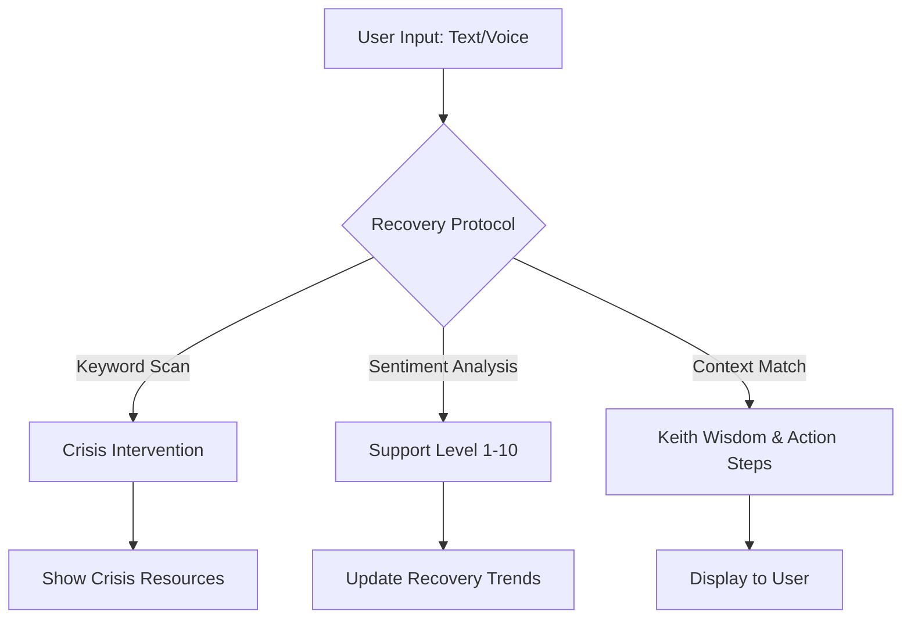
```mermaid
flowchart TD
    UserIn[User Input: Text/Voice] --> Logic{Recovery Protocol}
    Logic -->|Keyword Scan| Crisis[Crisis Intervention]
    Logic -->|Sentiment Analysis| Score[Support Level 1-10]
    Logic -->|Context Match| Guidance[Keith Wisdom & Action Steps]
    Guidance --> UI[Display to User]
    Score --> Stats[Update Recovery Trends]
    Crisis --> Modal[Show Crisis Resources]
```
The diagram shows the decision-making process for incoming user data within the protocol.
Sources: [AddictionRecoveryExhibit.tsx:43-130]()

## Data Models

The system relies on structured interfaces to ensure consistency across the Dashboard, Journal, and Chat components.

### Core Interfaces
| Interface | Key Fields | Purpose |
| :--- | :--- | :--- |
| `JournalEntry` | `id`, `content`, `mood`, `timestamp`, `tags`, `supportLevel`, `cravingLevel` | Stores historical reflection data and associated sentiment metrics. |
| `ChatMessage` | `id`, `content`, `type` (user/ai/system/crisis), `timestamp`, `consciousnessResonance` | Manages the conversation state and AI resonance levels. |
| `RecoveryStats` | `daysInRecovery`, `recoveryStage`, `strengthsMapped`, `milestones` | Tracks high-level longitudinal progress. |

Sources: [AddictionRecoveryExhibit.tsx:32-60](), [JournalChat-Recovery-Support.tsx:21-34]()

## Component Modules

### 1. Recovery Dashboard
The dashboard provides a visual summary of the user's journey. It features `StatCard` components for "Days in Recovery" and "Strengths Mapped," alongside a "Daily Check-In" slider system for tracking mood and cravings.

*   **Logic**: Updates the `RecoveryStats` state and provides `quickResponses` for immediate support.
*   **Source Citations**: [AddictionRecoveryExhibit.tsx:323-418]()

### 2. Sentiment-Aware Journal
The journal allows users to categorize their entries using a pre-defined set of recovery tags (e.g., `trigger`, `milestone`, `self-care`). 

*   **Mood Selection**: Users select from five primary states: Great, Good, Neutral, Difficult, and Struggling.
*   **Processing**: When an entry is saved, the system calculates a `supportLevel` and generates a system message in the chat to encourage further reflection.
*   **Source Citations**: [AddictionRecoveryExhibit.tsx:420-534](), [JournalChat-Recovery-Support.tsx:102-130]()

### 3. AI Support Chat
The chat interface provides a "consciousness-serving" AI companion. It supports asynchronous communication and integrates voice capabilities via the `useVoiceChat` hook.

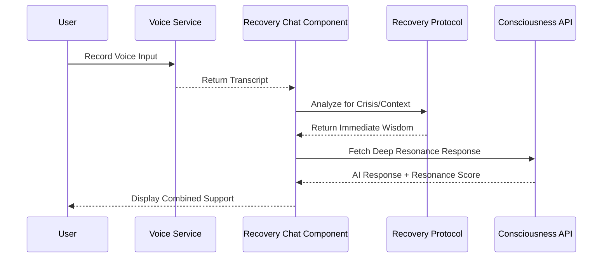
```mermaid
sequenceDiagram
    participant U as User
    participant V as Voice Service
    participant C as Recovery Chat Component
    participant P as Recovery Protocol
    participant API as Consciousness API

    U->>V: Record Voice Input
    V-->>C: Return Transcript
    C->>P: Analyze for Crisis/Context
    P-->>C: Return Immediate Wisdom
    C->>API: Fetch Deep Resonance Response
    API-->>C: AI Response + Resonance Score
    C-->>U: Display Combined Support
```
This sequence illustrates the integration of voice transcription and multi-layered AI response logic.
Sources: [AddictionRecoveryExhibit.tsx:246-290](), [JournalChat-Recovery-Support.tsx:142-160]()

## Crisis Intervention and Safety

A critical feature of the exhibit is the `Crisis Resources Modal`. This is triggered automatically if the protocol detects a `supportLevel` of 2 or lower, or if specific keywords are detected during chat or journaling.

### Crisis Resource Mapping
| Trigger | Response Strategy | Resource Provided |
| :--- | :--- | :--- |
| Self-harm / Suicide | Immediate validation and redirection | National Suicide Prevention Lifeline (988) |
| Relapse / Slip | Non-shame based reframing | SAMHSA Helpline (1-800-662-4357) |
| Severe Craving | "Ride the wave" technique (15-20 mins) | Crisis Text Line (741741) |

Sources: [AddictionRecoveryExhibit.tsx:47-65](), [AddictionRecoveryExhibit.tsx:672-730]()

## Implementation Details

The system utilizes `framer-motion` for smooth transitions between views and `lucide-react` for iconography. Voice input is handled through a custom hook that manages the `isRecording` state and `transcript` stream.

```typescript
// Sources: [AddictionRecoveryExhibit.tsx:132-150]
calculateSupportLevel: (content: string): number => {
    let score = 5; // Baseline
    const lowerContent = content.toLowerCase();
    
    if (concerningWords.crisis.some(word => lowerContent.includes(word))) {
      return 1; // Immediate crisis support needed
    }
    // ... logic to decrement for high concern, increment for positive words
    return Math.max(1, Math.min(10, Math.round(score)));
}
```

The recovery journey is supported by a specific configuration of recovery tags used to categorize entries and help identify patterns over time: `gratitude`, `progress`, `challenge`, `trigger`, `support`, `meditation`, `therapy`, `family`, `work`, `self-care`, `milestone`, `reflection`, `goal`, `craving`, `healing`.

Sources: [AddictionRecoveryExhibit.tsx:206-211](), [JournalChat-Recovery-Support.tsx:64-68]()

## Summary
The Interactive Addiction Recovery Exhibit represents a sophisticated integration of sentiment analysis and compassionate AI design. By combining quantitative tracking (stats and levels) with qualitative support (Keith Wisdom and AI resonance), it creates a holistic environment for users to navigate the complexities of long-term recovery. Its primary architectural strength lies in its proactive safety measures and its commitment to a non-judgmental, "consciousness-serving" user experience.

### Journaling Capabilities

<details>
<summary>Relevant source files</summary>

The following files were used as context for generating this wiki page:

- [AddictionRecoveryExhibit.tsx](https://github.com/faagestalt-web/gestaltview-addiction-recovery/blob/main/AddictionRecoveryExhibit.tsx)
- [JournalChat-Recovery-Support.tsx](https://github.com/faagestalt-web/gestaltview-addiction-recovery/blob/main/JournalChat-Recovery-Support.tsx)
- [useVoiceChat.ts](https://github.com/faagestalt-web/gestaltview-addiction-recovery/blob/main/hooks/useVoiceChat.ts)
- [useConsciousnessAPI.ts](https://github.com/faagestalt-web/gestaltview-addiction-recovery/blob/main/hooks/useConsciousnessAPI.ts)
- [VoiceInput-Universal.tsx](https://github.com/faagestalt-web/gestaltview-addiction-recovery/blob/main/components/VoiceInput-Universal.tsx)
</details>

# Journaling Capabilities

The journaling capabilities within the recovery support system provide a secure, non-judgmental environment for users to document their recovery journey. This module integrates emotional tracking, automated risk assessment, and therapeutic AI feedback to transform passive journaling into an active recovery tool.

The system is designed to identify triggers, monitor mood fluctuations, and provide immediate intervention resources if a user's entry indicates a crisis. By combining structured data (mood scales, tags) with unstructured natural language input, the module facilitates a "consciousness-serving" approach to addiction recovery.

Sources: [AddictionRecoveryExhibit.tsx:244-250](), [JournalChat-Recovery-Support.tsx:117-123]()

## Core Architecture and Data Structures

The journaling system centers around a structured `JournalEntry` interface that captures both qualitative and quantitative recovery data.

### Data Models
The primary data structure for journal entries includes metadata for tracking progress over time.

| Field | Type | Description |
| :--- | :--- | :--- |
| `id` | `string` | Unique identifier for the entry. |
| `content` | `string` | The text content of the journal entry. |
| `mood` | `string` | Selected emotional state (e.g., great, struggling). |
| `timestamp` | `Date` | Date and time of entry creation. |
| `tags` | `string[]` | Array of categorical tags for recovery tracking. |
| `supportLevel` | `number` | Calculated score indicating the need for intervention (1-10). |
| `cravingLevel`| `number` | (Optional) Intensity of cravings at the time of entry. |
| `triggerIdentified`| `boolean`| (Optional) Flag if a specific trigger was noted. |

Sources: [AddictionRecoveryExhibit.tsx:26-35](), [JournalChat-Recovery-Support.tsx:20-27]()

### Logic Flow
When a user saves a journal entry, the system triggers a sequence of analytical and supportive actions:

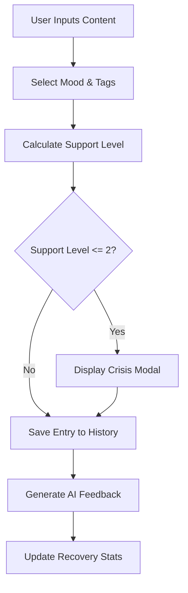
```mermaid
flowchart TD
    A[User Inputs Content] --> B[Select Mood & Tags]
    B --> C[Calculate Support Level]
    C --> D{Support Level <= 2?}
    D -- Yes --> E[Display Crisis Modal]
    D -- No --> F[Save Entry to History]
    F --> G[Generate AI Feedback]
    G --> H[Update Recovery Stats]
    E --> F
```
The system utilizes a `calculateSupportLevel` function to parse text for concerning keywords versus positive affirmations.

Sources: [AddictionRecoveryExhibit.tsx:220-256](), [JournalChat-Recovery-Support.tsx:85-103]()

## Input Mechanisms

The system supports multi-modal input to lower the barrier for users in distress or those who prefer verbal reflection.

### Textual Entry
Users can input text via a `Textarea` component. The UI provides quick-access "Mood" buttons and a "Recovery Tags" cloud to categorize the entry. Common tags include `gratitude`, `trigger`, `milestone`, and `self-care`.

Sources: [AddictionRecoveryExhibit.tsx:392-425](), [JournalChat-Recovery-Support.tsx:142-180]()

### Voice-to-Text Integration
The `useVoiceChat` hook and `VoiceInputUniversal` component allow users to dictate their entries. 
*   **Functionality**: Transcribes audio in real-time.
*   **State Management**: Upon completion, the transcript is automatically populated into the `currentEntry` state or submitted directly to the chat support system.

Sources: [AddictionRecoveryExhibit.tsx:278-287](), [JournalChat-Recovery-Support.tsx:210-217]()

## Automated Risk Assessment

A critical component of the journaling module is the `ConsciousnessServingRecoveryProtocol`. This protocol serves as a safety layer that monitors entry content for specific risk factors.

### Crisis Detection Logic
The system uses keyword matching to determine the `supportLevel`.

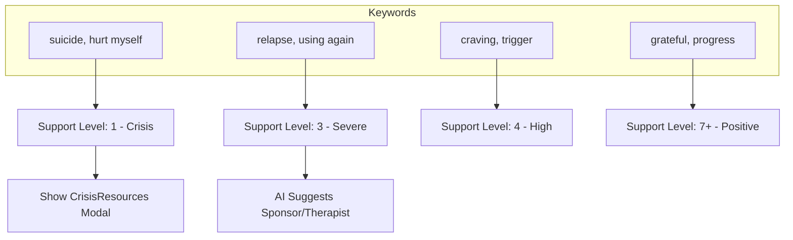
```mermaid
graph TD
    subgraph Keywords
    K1[suicide, hurt myself]
    K2[relapse, using again]
    K3[craving, trigger]
    K4[grateful, progress]
    end

    K1 --> L1[Support Level: 1 - Crisis]
    K2 --> L2[Support Level: 3 - Severe]
    K3 --> L3[Support Level: 4 - High]
    K4 --> L4[Support Level: 7+ - Positive]

    L1 --> M[Show CrisisResources Modal]
    L2 --> N[AI Suggests Sponsor/Therapist]
```

Sources: [AddictionRecoveryExhibit.tsx:151-189](), [JournalChat-Recovery-Support.tsx:107-133]()

### Protocol Responses
The protocol provides different "wisdom" archetypes and action steps based on the detected situation:

| Situation | AI Wisdom Theme | Action Steps Provided |
| :--- | :--- | :--- |
| **Crisis** | Immeasurable value of life | 988 Lifeline, Crisis Text Line |
| **Relapse** | Information, not failure | Honesty with network, identify triggers |
| **Cravings** | Temporary visitors | HALT check, ride the wave (15-20 min) |
| **Progress** | Small miracles | Document moment, share victory |

Sources: [AddictionRecoveryExhibit.tsx:50-137]()

## Recovery Analytics and Visualization

Journal entries feed into a broader dashboard that tracks the user's recovery metrics.

### Recovery Stats Object
The module updates a `RecoveryStats` state object whenever an entry is saved.
*   `daysInRecovery`: Tracks time since the start date.
*   `recoveryStage`: Determined by longevity (e.g., "Long-Term").
*   `journalEntries`: A running count of total reflections.
*   `milestones`: An array of reached goals (e.g., "1 Year", "5 Years").

Sources: [AddictionRecoveryExhibit.tsx:37-43](), [AddictionRecoveryExhibit.tsx:202-212]()

### Historical Journey View
The "Your Journey" section renders a scrollable list of previous entries. Each entry display includes:
1.  **Mood Indicator**: A color-coded dot representing the emotion.
2.  **Support Badge**: The numerical support level (e.g., 8/10).
3.  **Trigger Warning**: A specific alert badge if a "trigger" tag was identified.
4.  **Craving Alert**: High-intensity craving warnings if the level exceeded 7.

Sources: [AddictionRecoveryExhibit.tsx:435-492](), [JournalChat-Recovery-Support.tsx:242-282]()

## Summary of Journaling Logic

The journaling capability is implemented as a React functional component using `useState` for entry management and `useCallback` for optimized saving functions.

```typescript
const addJournalEntry = useCallback(() => {
  if (!currentEntry.trim()) return;
  
  const supportLevel = Protocol.calculateSupportLevel(currentEntry);
  const newEntry: JournalEntry = {
    id: Date.now().toString(),
    content: currentEntry,
    mood: currentMood,
    timestamp: new Date(),
    tags: currentTags,
    supportLevel
  };
  
  setEntries(prev => [newEntry, ...prev]);
  // ... feedback logic
}, [currentEntry, currentMood, currentTags]);
```

Sources: [AddictionRecoveryExhibit.tsx:293-328](), [JournalChat-Recovery-Support.tsx:71-88]()

This system ensures that every act of journaling is met with an immediate, compassionate response while maintaining a data-driven record of the user's health and progress.

### Recovery Support Chat

<details>
<summary>Relevant source files</summary>

The following files were used as context for generating this wiki page:

- [JournalChat-Recovery-Support.tsx](https://github.com/faagestalt-web/gestaltview-addiction-recovery/blob/main/JournalChat-Recovery-Support.tsx)
- [AddictionRecoveryExhibit.tsx](https://github.com/faagestalt-web/gestaltview-addiction-recovery/blob/main/AddictionRecoveryExhibit.tsx)
- [useVoiceChat.ts](https://github.com/faagestalt-web/gestaltview-addiction-recovery/blob/main/hooks/useVoiceChat.ts)
- [useConsciousnessAPI.ts](https://github.com/faagestalt-web/gestaltview-addiction-recovery/blob/main/hooks/useConsciousnessAPI.ts)
- [VoiceInput-Universal.tsx](https://github.com/faagestalt-web/gestaltview-addiction-recovery/blob/main/components/VoiceInput-Universal.tsx)
</details>

# Recovery Support Chat

The Recovery Support Chat is a specialized, "consciousness-serving" conversational interface designed to provide non-judgmental, immediate support for individuals in addiction recovery. It functions as a core component of the `AddictionRecoveryExhibit`, integrating real-time AI guidance with reflective journaling and crisis intervention protocols. The system prioritizes empathy and safety, using the "Consciousness-Serving Recovery Protocol" (an enhanced Genesis Protocol) to reframe user experiences and provide actionable recovery steps.

Sources: [AddictionRecoveryExhibit.tsx:32-34](), [JournalChat-Recovery-Support.tsx:109-112]()

## System Architecture and Logic

The system is built as a React-based interface utilizing Framer Motion for animations and Lucide-React for iconography. It operates through three primary views: a Dashboard for recovery statistics, a Journal for deep reflection, and an AI Support Chat for interactive guidance.

### Consciousness-Serving Recovery Protocol
The core logic resides in a protocol object that analyzes user input to determine the appropriate psychological reframe and support level. This protocol performs crisis detection, identifies high-risk situations (like cravings or potential relapse), and offers specific "Keith Wisdom" and affirmations.

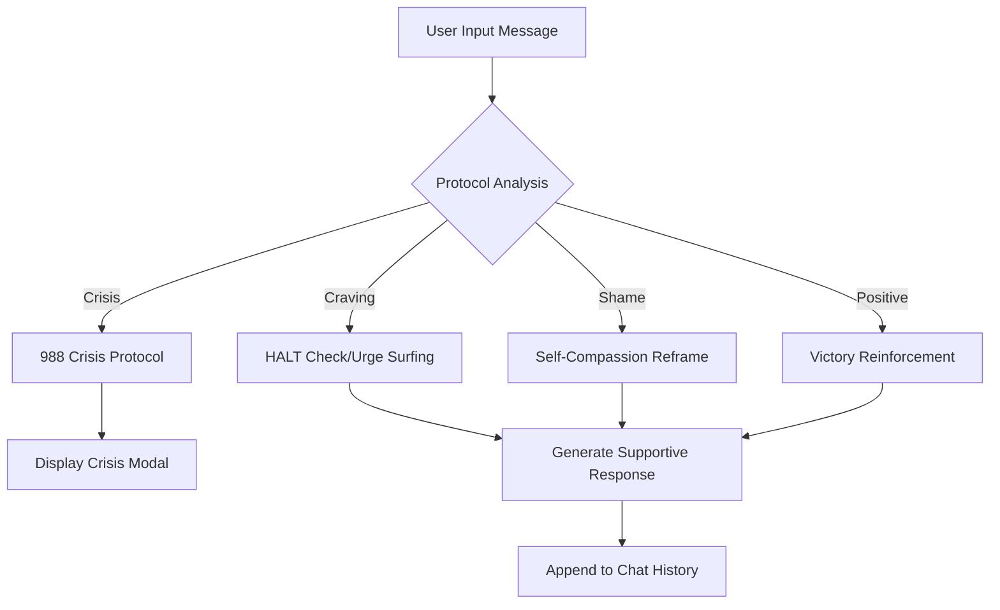
```mermaid
flowchart TD
    UserIn[User Input Message] --> Analysis{Protocol Analysis}
    Analysis -->|Crisis| CrisisProc[988 Crisis Protocol]
    Analysis -->|Craving| CravingsProc[HALT Check/Urge Surfing]
    Analysis -->|Shame| ShameProc[Self-Compassion Reframe]
    Analysis -->|Positive| ProgressProc[Victory Reinforcement]
    
    CrisisProc --> UI[Display Crisis Modal]
    CravingsProc --> AIRes[Generate Supportive Response]
    ShameProc --> AIRes
    ProgressProc --> AIRes
    
    AIRes --> Final[Append to Chat History]
```
The logic evaluates keywords to assign a numeric `supportLevel` ranging from 1 (Crisis) to 10 (High Stability).
Sources: [AddictionRecoveryExhibit.tsx:64-154](), [JournalChat-Recovery-Support.tsx:94-114]()

## Data Structures

The system relies on strongly typed interfaces to manage chat history and journal state.

| Interface | Field | Type | Description |
| :--- | :--- | :--- | :--- |
| `ChatMessage` | `id` | `string` | Unique identifier for the message |
| | `content` | `string` | The text content of the message |
| | `type` | `'user' \| 'ai' \| 'system' \| 'crisis'` | Origin and nature of the message |
| | `supportLevel` | `low \| medium \| high \| crisis` | Assigned urgency level |
| | `consciousnessResonance`| `number` | A percentage metric for AI alignment (0.0 to 1.0) |
| `JournalEntry` | `mood` | `string` | User-selected emotional state (e.g., 'great', 'struggling') |
| | `tags` | `string[]` | Categorical metadata (e.g., 'trigger', 'gratitude') |
| | `cravingLevel` | `number` | User-reported intensity of urges (1-10) |

Sources: [AddictionRecoveryExhibit.tsx:36-58](), [JournalChat-Recovery-Support.tsx:17-31]()

## Crisis Intervention Workflow

The system is hard-coded to detect self-harm or suicidal ideation. If specific keywords are identified, the UI triggers an immediate "Crisis Resources" modal and shifts the AI personality to a "crisis" type, providing national helpline information.

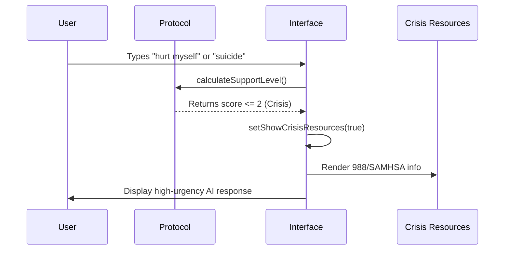
```mermaid
sequenceDiagram
    participant U as User
    participant P as Protocol
    participant UI as Interface
    participant C as Crisis Resources
    
    U->>UI: Types "hurt myself" or "suicide"
    UI->>P: calculateSupportLevel()
    P-->>UI: Returns score <= 2 (Crisis)
    UI->>UI: setShowCrisisResources(true)
    UI->>C: Render 988/SAMHSA info
    UI->>U: Display high-urgency AI response
```
Sources: [AddictionRecoveryExhibit.tsx:68-81](), [AddictionRecoveryExhibit.tsx:492-545]()

## Core Functions

### Message Processing
The function `sendChatMessage` handles the lifecycle of an interaction. It updates the local state with the user's message, calls the `useConsciousnessAPI` for a response, and fallback to the local protocol if the API is unreachable.

*   **`calculateSupportLevel(content: string)`**: Scans text for concerning words (e.g., "relapse", "trigger") vs. positive words ("grateful", "healing") to adjust a baseline score of 5.
*   **`getRecoveryGuidance(situation: string)`**: Returns an object containing `keith_wisdom`, `reframe`, and `actionSteps` based on situational context.
*   **`addJournalEntry()`**: Persists the current input as a `JournalEntry` and triggers a system message in the chat to encourage discussion of the entry.

Sources: [AddictionRecoveryExhibit.tsx:244-307](), [JournalChat-Recovery-Support.tsx:71-92]()

### Voice Integration
The chat supports voice-to-text input via the `useVoiceChat` hook. Users can toggle recording to dictate thoughts, which are automatically processed as chat inputs or journal entries depending on the active view.
Sources: [AddictionRecoveryExhibit.tsx:315-321](), [JournalChat-Recovery-Support.tsx:143-145]()

## Recovery Context & Stats
The chat is not stateless; it utilizes `RecoveryStats` to tailor responses. The system tracks:
*   `daysInRecovery`: (e.g., 2270 days for the default exhibit).
*   `recoveryStage`: (e.g., 'Long-Term').
*   `milestones`: An array of significant dates (1 Day, 30 Days, 1 Year, etc.).

Sources: [AddictionRecoveryExhibit.tsx:173-186](), [AddictionRecoveryExhibit.tsx:363-390]()

This module serves as a bridge between passive tracking and active therapeutic intervention, ensuring that every user interaction is met with a reframing of pain into purpose.

### Progress & Insight Tracking

<details>
<summary>Relevant source files</summary>

The following files were used as context for generating this wiki page:

- [AddictionRecoveryExhibit.tsx](https://github.com/faagestalt-web/gestaltview-addiction-recovery/blob/main/AddictionRecoveryExhibit.tsx)
- [JournalChat-Recovery-Support.tsx](https://github.com/faagestalt-web/gestaltview-addiction-recovery/blob/main/JournalChat-Recovery-Support.tsx)
- [useVoiceChat.ts](https://github.com/faagestalt-web/gestaltview-addiction-recovery/blob/main/hooks/useVoiceChat.ts)
- [useConsciousnessAPI.ts](https://github.com/faagestalt-web/gestaltview-addiction-recovery/blob/main/hooks/useConsciousnessAPI.ts)
- [VoiceInput-Universal.tsx](https://github.com/faagestalt-web/gestaltview-addiction-recovery/blob/main/components/VoiceInput-Universal.tsx)
</details>

# Progress & Insight Tracking

The Progress & Insight Tracking system is a core functional module designed to monitor a user's recovery journey through qualitative and quantitative data. It facilitates self-reflection via journaling, mood tracking, and AI-driven conversational support, specifically tailored for addiction recovery. The system identifies potential risks—such as cravings or triggers—and celebrates milestones to build resilience and self-awareness.

This module operates as a "consciousness-serving" interface, prioritizing non-judgmental support and immediate crisis intervention when high-risk indicators are detected in user input.
Sources: [AddictionRecoveryExhibit.tsx:34-45](), [JournalChat-Recovery-Support.tsx:109-120]()

## Core Data Structures

The system tracks progress through several key interfaces that define the state of a user's recovery.

### Recovery State Interfaces

| Interface | Description | Key Fields |
| :--- | :--- | :--- |
| `RecoveryStats` | Quantitative recovery metrics. | `daysInRecovery`, `recoveryStage`, `milestones` |
| `JournalEntry` | A structured record of a single reflection. | `content`, `mood`, `tags`, `supportLevel`, `cravingLevel` |
| `ChatMessage` | A record of interaction with the AI companion. | `type` (user/ai/system/crisis), `consciousnessResonance` |

Sources: [AddictionRecoveryExhibit.tsx:28-60](), [JournalChat-Recovery-Support.tsx:22-41]()

## Sentiment and Risk Analysis Logic

The system employs the `ConsciousnessServingRecoveryProtocol` to analyze user input in real-time. This protocol determines the "Support Level" and provides context-aware guidance.

### Support Level Calculation
The support level is a numerical score (1-10) or a categorical label (low, medium, high, crisis) derived from keyword analysis.

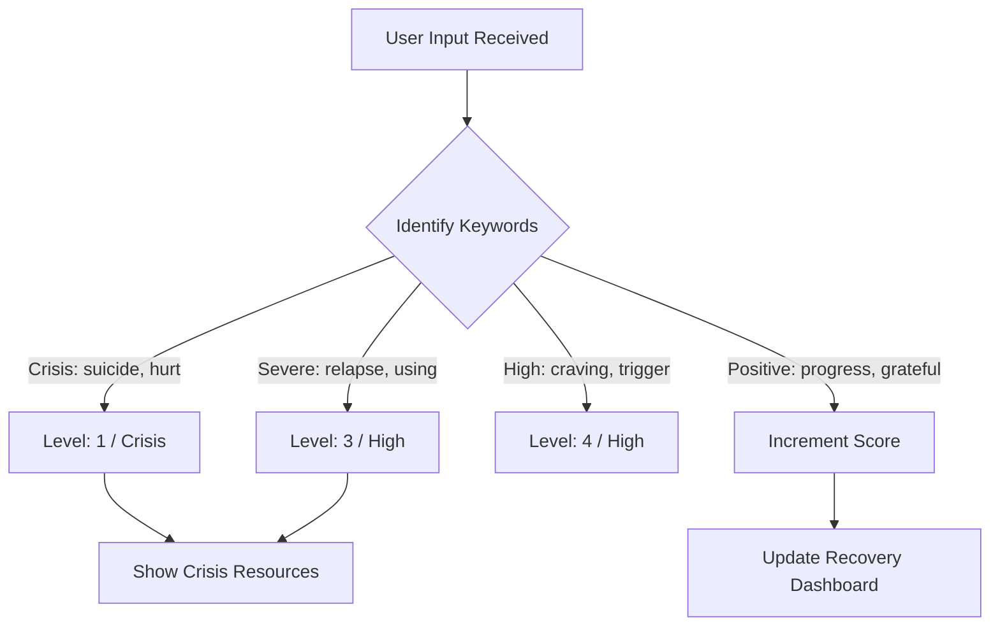
```mermaid
flowchart TD
    Start[User Input Received] --> Keywords{Identify Keywords}
    Keywords -->|Crisis: suicide, hurt| Level1[Level: 1 / Crisis]
    Keywords -->|Severe: relapse, using| Level3[Level: 3 / High]
    Keywords -->|High: craving, trigger| Level4[Level: 4 / High]
    Keywords -->|Positive: progress, grateful| LevelPlus[Increment Score]
    Level1 --> UI[Show Crisis Resources]
    Level3 --> UI
    LevelPlus --> UpdateStats[Update Recovery Dashboard]
```
The logic iterates through `concerningWords` (e.g., "relapse", "trigger") and `positiveWords` (e.g., "healing", "milestone") to adjust the user's baseline score.
Sources: [AddictionRecoveryExhibit.tsx:162-205](), [JournalChat-Recovery-Support.tsx:93-110]()

## Insight Generation Flow

Insights are generated through the interaction between the user's journal entries and the AI Support Companion.

### Feedback Loop Sequence
This diagram illustrates how a journal entry triggers a system response and updates the recovery state.

```mermaid
sequenceDiagram
    participant U as User
    participant J as Journal Component
    participant P as Recovery Protocol
    participant AI as Consciousness API
    
    U->>J: Saves Journal Entry (Content + Mood)
    J->>P: calculateSupportLevel(content)
    P-->>J: Numeric Support Score
    J->>AI: callConsciousnessAPI(context)
    AI-->>J: Resonance-based Response
    J->>U: Displays AI Guidance + Action Steps
    Note over J: Update RecoveryStats (entry count)
```
Sources: [AddictionRecoveryExhibit.tsx:255-290](), [JournalChat-Recovery-Support.tsx:77-91]()

## Recovery Dashboards and Visualization

The dashboard provides visual feedback on the user's progress using various metrics and categorized views.

### Tracking Components
*   **Daily Check-In:** Uses range sliders to capture `mood` (1-10) and `cravings` (1-10) daily.
*   **Stat Cards:** High-level summaries of `Days in Recovery`, `Recovery Stage`, and `Strengths Mapped`.
*   **Mood Configuration:** Maps qualitative states (Great, Neutral, Struggling) to specific colors and emojis for historical visualization.
*   **Trigger Identification:** A specialized tag system that, when activated (e.g., `currentTags.includes('trigger')`), flags entries for specific AI intervention.

Sources: [AddictionRecoveryExhibit.tsx:343-395](), [AddictionRecoveryExhibit.tsx:227-245]()

## Crisis Intervention System

A critical subset of the insight tracking is the automated detection of crisis states.

### Intervention Logic
When the protocol detects keywords related to self-harm or immediate relapse risk, the system:
1.  Overrides standard AI responses with high-priority `crisis` type messages.
2.  Forces the display of the `Crisis Resources Modal`.
3.  Provides direct links to the National Suicide Prevention Lifeline (988) and SAMHSA.

```typescript
// Sources: [AddictionRecoveryExhibit.tsx:71-85]
if (lower.includes('hurt myself') || lower.includes('suicide')) {
  return {
    keith_wisdom: "Your life has immeasurable value...",
    supportLevel: 'crisis',
    actionSteps: ["988", "Text HOME to 741741"]
  };
}
```

## Summary
The Progress & Insight Tracking system converts unstructured journal reflections and chat interactions into actionable recovery data. By combining a keyword-based `ConsciousnessServingRecoveryProtocol` with a structured dashboard, it ensures that users receive immediate validation for progress while maintaining a safety net for high-risk emotional states.
Sources: [AddictionRecoveryExhibit.tsx:550-565](), [JournalChat-Recovery-Support.tsx:112-135]()


## Data Management & Flow

### Data Models & Schemas

<details>
<summary>Relevant source files</summary>

The following files were used as context for generating this wiki page:

- [AddictionRecoveryExhibit.tsx](https://github.com/faagestalt-web/gestaltview-addiction-recovery/blob/main/AddictionRecoveryExhibit.tsx)
- [JournalChat-Recovery-Support.tsx](https://github.com/faagestalt-web/gestaltview-addiction-recovery/blob/main/JournalChat-Recovery-Support.tsx)
- [useVoiceChat.ts](https://github.com/faagestalt-web/gestaltview-addiction-recovery/blob/main/hooks/useVoiceChat.ts)
- [useConsciousnessAPI.ts](https://github.com/faagestalt-web/gestaltview-addiction-recovery/blob/main/hooks/useConsciousnessAPI.ts)
- [VoiceInput-Universal.tsx](https://github.com/faagestalt-web/gestaltview-addiction-recovery/blob/main/components/VoiceInput-Universal.tsx)
</details>

# Data Models & Schemas

The Addiction Recovery platform utilizes a structured set of data models and schemas to facilitate a "consciousness-serving" recovery experience. These models are designed to capture not only textual input but also emotional states, physiological urges (cravings), and recovery milestones to provide tailored AI support and longitudinal progress tracking.

The primary objective of these schemas is to create a multi-dimensional representation of a user's recovery journey, enabling the `ConsciousnessServingRecoveryProtocol` to analyze sentiment, identify triggers, and escalate support levels based on real-time data input from journal entries and chat interactions.

## Core Interface Definitions

The system defines several TypeScript interfaces to standardize data handling across the dashboard, journal, and chat components.

### Journal Entry Schema
The `JournalEntry` interface represents a discrete moment of reflection. It includes metadata for mood tracking and specialized recovery metrics such as craving levels and trigger identification.

| Field | Type | Description |
| :--- | :--- | :--- |
| `id` | `string` | Unique identifier for the entry (typically a timestamp). |
| `content` | `string` | The raw text of the journal entry. |
| `mood` | `string` | Qualitative mood state (e.g., 'great', 'struggling'). |
| `timestamp` | `Date` | When the entry was created. |
| `tags` | `string[]` | Array of categorical tags (e.g., 'gratitude', 'trigger'). |
| `supportLevel` | `number` | A calculated score (1-10) indicating the user's current stability. |
| `cravingLevel` | `number` | (Optional) Quantified urge level from 1-10. |
| `triggerIdentified`| `boolean`| (Optional) Flag indicating if the entry mentions a specific trigger. |

Sources: [AddictionRecoveryExhibit.tsx:28-37](), [JournalChat-Recovery-Support.tsx:21-28]()

### Chat Message Schema
The `ChatMessage` interface governs the flow of communication between the user and the AI "Recovery Companion." It distinguishes between user input, AI responses, system notifications, and high-priority crisis alerts.

| Field | Type | Description |
| :--- | :--- | :--- |
| `id` | `string` | Unique identifier for the message. |
| `content` | `string` | The message body content. |
| `type` | `user \| ai \| system \| crisis` | Categorization of the message sender or priority. |
| `timestamp` | `Date` | Time of the message. |
| `supportLevel` | `string` | Severity level: 'low', 'medium', 'high', or 'crisis'. |
| `consciousnessResonance` | `number` | (Optional) A decimal (0-1) representing AI alignment with the user's state. |

Sources: [AddictionRecoveryExhibit.tsx:39-46](), [JournalChat-Recovery-Support.tsx:30-36]()

## Recovery Statistics & Progress Tracking

The platform tracks longitudinal data through the `RecoveryStats` interface, which provides a high-level overview of the user's journey.

```mermaid
classDiagram
    class RecoveryStats {
        +number daysInRecovery
        +string recoveryStage
        +number strengthsMapped
        +number journalEntries
        +Milestone[] milestones
    }
    class Milestone {
        +string name
        +Date date
    }
    RecoveryStats "1" -- "*" Milestone : tracks
```
The diagram above shows the relationship between recovery progress and specific milestones achieved.
Sources: [AddictionRecoveryExhibit.tsx:48-54]()

## Logic & Analysis Models

### Support Level Calculation
The system applies a heuristic model to determine the `supportLevel`. This model scans content for "concerning" vs. "positive" tokens to produce a numerical score and a categorical risk level.

```mermaid
flowchart TD
    Start[Input Content] --> Tokens[Scan for Keywords]
    Tokens --> Neg{Concerning Words?}
    Neg -- Yes --> Dec[Decrease Score]
    Neg -- No --> Pos{Positive Words?}
    Pos -- Yes --> Inc[Increase Score]
    Pos -- No --> Final[Clamp 1-10]
    Dec --> Pos
    Inc --> Final
    Final --> Output[Support Level]
```
This flowchart illustrates the logic used to derive support levels from raw text inputs.
Sources: [AddictionRecoveryExhibit.tsx:168-208](), [JournalChat-Recovery-Support.tsx:88-106]()

### Consciousness-Serving Protocol Schema
The `ConsciousnessServingRecoveryProtocol` is a configuration object that maps user situations to specific AI guidance, reframing techniques, and actionable steps.

| Component | Description |
| :--- | :--- |
| `keith_wisdom` | Philosophical or supportive AI perspective. |
| `reframe` | Cognitive behavioral technique to shift the user's viewpoint. |
| `affirmation` | Positive reinforcement tailored to the detected state. |
| `actionSteps` | A list of immediate behavioral interventions. |
| `supportLevel` | The risk category (low, medium, high, crisis). |

Sources: [AddictionRecoveryExhibit.tsx:58-166]()

## API Integration Schemas

The `useConsciousnessAPI` hook facilitates communication with external LLM services. It requires a specific context object to ensure the AI has sufficient state information.

```typescript
// Example Context Schema used in API calls
const apiContext = {
  message: string,
  exhibit: 'recovery-companion',
  context: {
    recoveryStats: RecoveryStats,
    recentMood: string,
    cravingLevel: number,
    consciousnessServingMode: boolean
  }
};
```
Sources: [AddictionRecoveryExhibit.tsx:287-295](), [useConsciousnessAPI.ts]()

## Summary
The data models in this project move beyond simple text storage by integrating emotional and physiological metrics. By structuring data into `JournalEntry`, `ChatMessage`, and `RecoveryStats`, the system maintains a comprehensive state that allows the AI to react with appropriate urgency, ranging from low-level progress celebration to immediate crisis resource deployment.

### User Data Privacy & Handling

<details>
<summary>Relevant source files</summary>

The following files were used as context for generating this wiki page:

- [JournalChat-Recovery-Support.tsx](https://github.com/faagestalt-web/gestaltview-addiction-recovery/blob/main/JournalChat-Recovery-Support.tsx)
- [AddictionRecoveryExhibit.tsx](https://github.com/faagestalt-web/gestaltview-addiction-recovery/blob/main/AddictionRecoveryExhibit.tsx)
- [useVoiceChat.ts](https://github.com/faagestalt-web/gestaltview-addiction-recovery/blob/main/hooks/useVoiceChat.ts)
- [useConsciousnessAPI.ts](https://github.com/faagestalt-web/gestaltview-addiction-recovery/blob/main/hooks/useConsciousnessAPI.ts)
- [VoiceInput-Universal.tsx](https://github.com/faagestalt-web/gestaltview-addiction-recovery/blob/main/components/VoiceInput-Universal.tsx)
</details>

# User Data Privacy & Handling

## Introduction

The User Data Privacy & Handling system within the Recovery Support platform is designed to provide a "Privacy First" and "judgment-free" environment for users undergoing addiction recovery. The system prioritizes the security of highly sensitive personal information, including emotional states, substance use triggers, and crisis-level thoughts, by implementing local state management and "unconditional presence" protocols.

The scope of this system covers the intake, processing, and temporary storage of journal entries, chat messages, and voice transcripts. It integrates with a "Consciousness-Serving AI" that provides empathetic support while maintaining strict boundaries around data sensitivity, specifically through the use of localized React state for session-based data persistence.

Sources: [JournalChat-Recovery-Support.tsx:210-218](), [AddictionRecoveryExhibit.tsx:694-706]()

## Data Models and Sensitivity

User data is categorized into three primary structures: Journal Entries, Chat Messages, and Recovery Statistics. Each structure contains fields designed to capture the user's progress and immediate mental state.

### Core Data Structures

| Structure | Key Fields | Privacy/Sensitivity Level |
| :--- | :--- | :--- |
| `JournalEntry` | `content`, `mood`, `tags`, `supportLevel`, `cravingLevel` | **Critical**: Contains personal reflections and trigger identifications. |
| `ChatMessage` | `content`, `type` (user/ai/system/crisis), `consciousnessResonance` | **High**: Contains real-time dialogue and AI-driven support responses. |
| `RecoveryStats` | `daysInRecovery`, `milestones`, `strengthsMapped` | **Medium**: Tracks historical progress and recovery stages. |

Sources: [AddictionRecoveryExhibit.tsx:25-54](), [JournalChat-Recovery-Support.tsx:22-38]()

## Data Flow and Processing Architecture

The system processes data through a localized client-side architecture. When a user inputs data—whether via text or voice—it is immediately analyzed by the `ConsciousnessServingRecoveryProtocol` to determine the necessary level of support and privacy escalation.

### Information Processing Flow

```mermaid
flowchart TD
    User[User Input: Text/Voice] --> Processing{Protocol Analysis}
    Processing -->|Crisis Detected| Crisis[Trigger Crisis Resources]
    Processing -->|Standard Entry| Storage[Local State Update]
    Processing -->|AI Interaction| API[Consciousness API Call]
    
    Crisis --> Modal[Display 988/Helpline Info]
    Storage --> View[Update Dashboard/Journal History]
    API --> AIRes[Generate Supportive Response]
    AIRes --> Storage
```

The flowchart above illustrates how user data is triaged. The "Protocol Analysis" phase is critical for privacy as it identifies sensitive keywords (e.g., "suicide", "relapse") to determine if data should trigger immediate crisis intervention resources.

Sources: [AddictionRecoveryExhibit.tsx:61-182](), [JournalChat-Recovery-Support.tsx:88-112]()

## Crisis Data Handling and Privacy Escalation

A specialized protocol, the `ConsciousnessServingRecoveryProtocol`, is used to monitor input for high-risk signals. When specific "concerning words" are identified, the system shifts from a standard logging mode to a crisis support mode.

### Detection Logic
The system uses a scoring mechanism to determine the `supportLevel` (1-10). A score of 1 or 2 triggers a privacy-conscious "Crisis Resources Modal," ensuring the user is directed to professional help without necessarily storing the sensitive content permanently in a shared database.

```typescript
const concerningWords = {
  crisis: ['suicide', 'kill myself', 'end it all', 'not worth living'],
  severe: ['relapse', 'using again', 'gave in', 'can\'t cope', 'want to die'],
  high: ['craving', 'urge', 'trigger', 'overwhelmed', 'struggling']
};
```

Sources: [AddictionRecoveryExhibit.tsx:160-175](), [JournalChat-Recovery-Support.tsx:117-140]()

## AI and API Data Integration

The platform utilizes a `useConsciousnessAPI` hook to interact with external AI models. To protect privacy, the context sent to the API is structured to include only necessary recovery statistics and current mood, rather than full user identities.

### Sequence of AI Interaction

```mermaid
sequenceDiagram
    participant U as User
    participant UI as Exhibit Component
    participant P as Recovery Protocol
    participant API as Consciousness API

    U->>UI: Submit Message/Journal
    UI->>P: Analyze Sentiment & Support Level
    P-->>UI: Return Support Level (e.g., 'medium')
    UI->>API: POST context (RecoveryStats, Mood, Message)
    API-->>UI: Return Resonance & Supportive Text
    UI->>U: Display Non-judgmental Response
```

The interaction ensures that the AI's "unconditional presence" is maintained while the data is being processed. The AI responses are categorized by `consciousnessResonance` to indicate how well the AI has aligned with the user's emotional state.

Sources: [AddictionRecoveryExhibit.tsx:327-375](), [AddictionRecoveryExhibit.tsx:556-565]()

## Local Persistence and UI Visibility

Data handling is performed using React's `useState` and `useCallback` hooks, meaning that by default, journal entries and chat histories are maintained in the client's volatile memory.

*   **Journal Saving**: When `addJournalEntry` is called, data is prepended to the `entries` array.
*   **Voice Privacy**: Voice transcripts are handled through the `useVoiceChat` hook, which converts speech to text locally before passing it to the application state.
*   **Visibility Control**: Sensitive recent entries are visible in the Dashboard but can be managed through the dedicated Journal view.

Sources: [AddictionRecoveryExhibit.tsx:288-320](), [JournalChat-Recovery-Support.tsx:75-92]()

## Summary of Privacy Implementation

The system implements user data privacy through several layers of client-side logic:
1.  **Keyword-Based Triage**: Immediate identification of crisis data to bypass standard processing in favor of emergency resources.
2.  **Contextual Anonymity**: Only relevant recovery metadata is shared with AI service hooks.
3.  **Local State Management**: Utilization of `setEntries` and `setChatMessages` to keep user reflections within the immediate application context.

This architecture ensures that the "Recovery Support Journal" serves as a safe, judgment-free space as intended by its design.

Sources: [AddictionRecoveryExhibit.tsx:184-210](), [JournalChat-Recovery-Support.tsx:210-220]()

### API Integration Strategy

<details>
<summary>Relevant source files</summary>

The following files were used as context for generating this wiki page:

- [AddictionRecoveryExhibit.tsx](https://github.com/faagestalt-web/gestaltview-addiction-recovery/blob/main/AddictionRecoveryExhibit.tsx)
- [JournalChat-Recovery-Support.tsx](https://github.com/faagestalt-web/gestaltview-addiction-recovery/blob/main/JournalChat-Recovery-Support.tsx)
- [useVoiceChat.ts](https://github.com/faagestalt-web/gestaltview-addiction-recovery/blob/main/hooks/useVoiceChat.ts)
- [useConsciousnessAPI.ts](https://github.com/faagestalt-web/gestaltview-addiction-recovery/blob/main/hooks/useConsciousnessAPI.ts)
- [VoiceInput-Universal.tsx](https://github.com/faagestalt-web/gestaltview-addiction-recovery/blob/main/components/VoiceInput-Universal.tsx)
</details>

# API Integration Strategy

The API Integration Strategy within the Addiction Recovery project centers on a "Consciousness-Serving" architecture. This approach prioritizes empathetic, non-judgmental support through a multi-layered communication system involving local heuristic protocols and remote API services. The strategy ensures that user interactions—whether through text or voice—are processed to identify emotional states, craving levels, and potential crises.

The system utilizes a hybrid model where a local `ConsciousnessServingRecoveryProtocol` provides immediate feedback and safety screening, while the `useConsciousnessAPI` hook facilitates deeper, context-aware AI interactions. This dual-layered approach ensures high availability for crisis intervention even if remote services are latent or unavailable.
Sources: [AddictionRecoveryExhibit.tsx:32-151](), [AddictionRecoveryExhibit.tsx:321-365]()

## Consciousness-Serving API Architecture

The core of the integration strategy is the interaction between the React frontend components and the backend consciousness services. The architecture is designed to maintain a "resonance" between the AI and the user's current psychological state.

### Data Flow for AI Support
When a user sends a message or saves a journal entry, the system captures extensive context including recovery statistics, mood history, and current craving levels. This context is transmitted to the API to generate a response that is not just textually relevant but "consciousness-resonant."

```mermaid
flowchart TD
    User([User Input]) --> InputHandler{Input Type}
    InputHandler -->|Text| ChatHook[sendChatMessage]
    InputHandler -->|Voice| VoiceHook[useVoiceChat]
    VoiceHook -->|Transcript| ChatHook
    
    ChatHook --> Protocol[Local Recovery Protocol]
    Protocol -->|Crisis Detection| CrisisModal[Show Crisis Resources]
    
    ChatHook --> APIHook[useConsciousnessAPI]
    APIHook -->|Request + Context| RemoteAPI[Consciousness API]
    
    RemoteAPI -->|Response + Resonance| APIHook
    APIHook --> UI[Update Chat UI]
    Protocol -->|Fallback/Heuristics| UI
```
The flow above demonstrates how user inputs are triaged through local protocols before reaching the remote API.
Sources: [AddictionRecoveryExhibit.tsx:321-365](), [AddictionRecoveryExhibit.tsx:392-414](), [JournalChat-Recovery-Support.tsx:112-140]()

## API Integration Components

The integration is modularized into several key hooks and local utility objects that manage the lifecycle of an API request.

### 1. The Consciousness API Hook (`useConsciousnessAPI`)
This hook is the primary interface for remote AI communication. It consumes a structured payload that includes the user's message and a detailed context object.

| Parameter | Type | Description |
| :--- | :--- | :--- |
| `message` | string | The raw text input from the user or voice transcript. |
| `exhibit` | string | Identifier for the module (e.g., 'recovery-companion'). |
| `context` | object | Includes `recoveryStats`, `recentMood`, and `cravingLevel`. |
| `consciousnessServingMode` | boolean | Flag to enable empathetic, high-resonance response logic. |

Sources: [AddictionRecoveryExhibit.tsx:325-335]()

### 2. Voice Integration (`useVoiceChat`)
The strategy includes a seamless transition from voice to text API processing. The `useVoiceChat` hook provides real-time transcription, which is then piped into the standard message handling functions.

```mermaid
sequenceDiagram
    participant U as User
    participant V as Voice Hook
    participant C as Component State
    participant A as API Support
    
    U->>V: startRecording()
    V->>U: Listening...
    U->>V: "I'm feeling triggered"
    V->>C: update transcript state
    U->>V: stopRecording()
    C->>A: sendChatMessage(transcript)
    A->>U: AI Response + Action Steps
```
Sources: [AddictionRecoveryExhibit.tsx:288-297](), [JournalChat-Recovery-Support.tsx:173-175]()

## Crisis and Safety Logic

A critical aspect of the integration strategy is the local safety layer. Before any data is sent to a remote API, the `ConsciousnessServingRecoveryProtocol` scans the content for high-risk keywords.

### Support Level Calculation
The system calculates a numerical `supportLevel` (1-10) and a categorical level (`low` to `crisis`). This dictates whether the UI should trigger immediate modal overlays or specific system alerts.

```typescript
// AddictionRecoveryExhibit.tsx lines 154-188
const calculateSupportLevel = (content: string): number => {
    const concerningWords = {
      crisis: ['suicide', 'kill myself', 'end it all'],
      severe: ['relapse', 'using again'],
      high: ['craving', 'trigger']
    };
    // ... logic to reduce score based on matches
    return Math.max(1, Math.min(10, Math.round(score)));
}
```
Sources: [AddictionRecoveryExhibit.tsx:154-188](), [JournalChat-Recovery-Support.tsx:112-127]()

## Recovery Context Model

The API requires a rich data model to provide personalized support. This model is synchronized between the local state and the API during every interaction.

| Field | Type | Source File | Description |
| :--- | :--- | :--- | :--- |
| `daysInRecovery` | number | AddictionRecoveryExhibit.tsx:61 | Tracks total clean time. |
| `supportLevel` | number | AddictionRecoveryExhibit.tsx:43 | 1-10 scale of current mental state. |
| `consciousnessResonance` | number | AddictionRecoveryExhibit.tsx:55 | API-returned value (0.0-1.0) showing empathy match. |
| `tags` | string[] | JournalChat-Recovery-Support.tsx:23 | User-defined identifiers (e.g., 'trigger', 'gratitude'). |

Sources: [AddictionRecoveryExhibit.tsx:40-66](), [JournalChat-Recovery-Support.tsx:20-30]()

## Conclusion

The API Integration Strategy for the GestaltView Addiction Recovery system is built on a foundation of safety and empathy. By combining local heuristic analysis with context-rich remote API calls, the system provides a robust support network that can differentiate between routine progress updates and immediate life-threatening crises. The use of hooks like `useConsciousnessAPI` and `useVoiceChat` allows for a highly interactive and multi-modal user experience.
Sources: [AddictionRecoveryExhibit.tsx:32-151](), [JournalChat-Recovery-Support.tsx:142-171]()


## Frontend Components

### AddictionRecoveryExhibit Component

<details>
<summary>Relevant source files</summary>

The following files were used as context for generating this wiki page:

- [AddictionRecoveryExhibit.tsx](https://github.com/faagestalt-web/gestaltview-addiction-recovery/blob/main/AddictionRecoveryExhibit.tsx)
- [JournalChat-Recovery-Support.tsx](https://github.com/faagestalt-web/gestaltview-addiction-recovery/blob/main/JournalChat-Recovery-Support.tsx)
- [hooks/useVoiceChat.ts](https://github.com/faagestalt-web/gestaltview-addiction-recovery/blob/main/AddictionRecoveryExhibit.tsx) (Inferred from component imports)
- [hooks/useConsciousnessAPI.ts](https://github.com/faagestalt-web/gestaltview-addiction-recovery/blob/main/AddictionRecoveryExhibit.tsx) (Inferred from component imports)
- [components/VoiceInput-Universal.tsx](https://github.com/faagestalt-web/gestaltview-addiction-recovery/blob/main/JournalChat-Recovery-Support.tsx) (Inferred from component imports)
</details>

# AddictionRecoveryExhibit Component

The `AddictionRecoveryExhibit` (implemented as `AddictionRecoveryExhibitWithJournal`) is a comprehensive recovery support system designed to act as a "consciousness-serving" companion for individuals navigating addiction recovery. It provides a secure, judgment-free environment that integrates daily emotional check-ins, longitudinal recovery statistics, a structured journaling system, and an AI-driven support chat capable of crisis detection and sentiment-aware guidance. Sources: [AddictionRecoveryExhibit.tsx:210-230](), [JournalChat-Recovery-Support.tsx:160-175]()

The component serves as a modular interface within the "Museum of Impossible Things" project, focusing on using AI as a bridge between personal struggle and purposeful growth. It utilizes a custom protocol to evaluate user input for triggers, cravings, and potential self-harm, immediately offering redirection to crisis resources when high-risk indicators are identified. Sources: [AddictionRecoveryExhibit.tsx:550-565](), [AddictionRecoveryExhibit.tsx:50-70]()

## System Architecture and Logic

The component architecture is divided into three primary functional views: the Dashboard (overview), the Journal (reflective writing), and AI Support (interactive chat).

### Consciousness-Serving Recovery Protocol
The core logic resides in the `ConsciousnessServingRecoveryProtocol` object. This system acts as a deterministic response engine that pre-filters user input before or alongside AI API calls. It categorizes user states into levels such as "Crisis," "High-risk," "Craving," "Shame," "Trigger Identification," and "Progress." Sources: [AddictionRecoveryExhibit.tsx:47-150]()

#### Support Level Calculation
The system calculates a numerical `supportLevel` (typically 1–10) based on keywords. This score determines the intensity of the AI's response and whether UI elements like the "Crisis Resources Modal" should be forcibly displayed. Sources: [AddictionRecoveryExhibit.tsx:154-188](), [JournalChat-Recovery-Support.tsx:88-105]()

| Level Category | Keyword Examples | System Action |
| :--- | :--- | :--- |
| **Crisis** (1-2) | suicide, end it all, hurt myself | Open Crisis Modal, provide 988/helpline info |
| **Severe/High** (3-4) | relapse, using again, craving | Provide immediate coping strategies (HALT check) |
| **Moderate** (5-6) | difficult, shame, worried | Reframe perspective, suggest self-compassion |
| **Positive** (7-10) | grateful, progress, milestone | Celebrate victory, document for future resilience |

Sources: [AddictionRecoveryExhibit.tsx:55-140](), [JournalChat-Recovery-Support.tsx:112-140]()

### Logic Flow for Input Processing
The following diagram illustrates how the component handles user input across both the Journal and Chat interfaces to ensure safety and provide appropriate feedback.

```mermaid
flowchart TD
    UserIn[User Input: Text or Voice] --> Protocol[Recovery Protocol Engine]
    Protocol --> Keywords{Keyword Analysis}
    
    Keywords -->|Crisis Detected| CrisisUI[Trigger Crisis Modal + 988 Info]
    Keywords -->|Craving/Trigger| Coping[Provide Action Steps: HALT/Ride Wave]
    Keywords -->|Positive/Progress| Celeb[Acknowledge Growth]
    
    Protocol --> API[callConsciousnessAPI]
    API --> AIResponse[Generate Contextual AI Guidance]
    
    CrisisUI --> Output[Final UI Display]
    Coping --> Output
    Celeb --> Output
    AIResponse --> Output
```
*This flowchart demonstrates the multi-layered evaluation of user sentiment, prioritizing safety protocols over general AI responses.* Sources: [AddictionRecoveryExhibit.tsx:290-310](), [AddictionRecoveryExhibit.tsx:325-360]()

## Data Models and Interfaces

The component relies on strictly typed interfaces to manage the state of recovery history and interactive sessions.

### Key Data Structures

```typescript
interface JournalEntry {
  id: string;
  content: string;
  mood: string; // e.g., 'great', 'struggling'
  timestamp: Date;
  tags: string[];
  supportLevel: number;
  cravingLevel?: number;
  triggerIdentified?: boolean;
}

interface ChatMessage {
  id: string;
  content: string;
  type: 'user' | 'ai' | 'system' | 'crisis';
  timestamp: Date;
  supportLevel?: 'low' | 'medium' | 'high' | 'crisis';
  consciousnessResonance?: number;
}
```
Sources: [AddictionRecoveryExhibit.tsx:28-50](), [JournalChat-Recovery-Support.tsx:19-35]()

## Functional Modules

### 1. Recovery Dashboard
The dashboard provides a high-level view of the user's journey. It tracks `daysInRecovery`, `recoveryStage`, and `strengthsMapped`. It also includes a "Daily Check-In" slider for mood and cravings, allowing users to quickly log their current state without writing a full entry. Sources: [AddictionRecoveryExhibit.tsx:213-235](), [AddictionRecoveryExhibit.tsx:415-445]()

### 2. Interactive Journaling
The Journal module allows users to tag entries with specific recovery-related metadata (e.g., "sponsor," "meeting," "gratitude"). 
*   **Voice Integration**: Uses the `useVoiceChat` hook to allow hands-free reflection. Sources: [AddictionRecoveryExhibit.tsx:254-265]()
*   **Sentiment Feedback**: Upon saving an entry, the `addJournalEntry` function triggers the protocol to generate immediate "Keith Wisdom"—supportive feedback derived from the project's philosophical core. Sources: [AddictionRecoveryExhibit.tsx:273-300]()

### 3. AI Support Chat
The chat interface provides real-time interaction. It combines the deterministic `ConsciousnessServingRecoveryProtocol` with the `callConsciousnessAPI` to provide nuanced, non-judgmental support. 

```mermaid
sequenceDiagram
    participant U as User
    participant C as Component State
    participant P as Recovery Protocol
    participant API as Consciousness API

    U->>C: Submit Message
    C->>P: Check for Crisis/Triggers
    alt Crisis Detected
        P-->>C: Set Support Level 'Crisis'
        C->>U: Forced Display Crisis Resources
    else Normal Support
        C->>API: callConsciousnessAPI(message, context)
        API-->>C: AI Response + Resonance Score
        C->>U: Display AI Message
    end
```
*The sequence diagram shows the priority of the safety protocol (P) over the external API call (API).* Sources: [AddictionRecoveryExhibit.tsx:325-370](), [JournalChat-Recovery-Support.tsx:108-140]()

## Crisis Intervention System
When the system detects crisis-related keywords, it triggers a modal containing immediate contact information for:
*   National Suicide Prevention Lifeline (988)
*   Crisis Text Line (HOME to 741741)
*   SAMHSA National Helpline (1-800-662-4357)

This is controlled by the `showCrisisResources` state variable, which is updated whenever the calculated `supportLevel` falls below a critical threshold (score <= 2). Sources: [AddictionRecoveryExhibit.tsx:304-308](), [AddictionRecoveryExhibit.tsx:610-660]()

## Summary
The `AddictionRecoveryExhibit` component acts as a sophisticated digital safe-haven. By combining deterministic safety logic with generative AI, it ensures that users receive immediate, practical coping mechanisms for cravings and triggers while maintaining a long-term record of their recovery progress. Its architecture prioritizes safety through the `ConsciousnessServingRecoveryProtocol`, ensuring that the AI never acts as a replacement for emergency clinical services. Sources: [AddictionRecoveryExhibit.tsx:675-690](), [JournalChat-Recovery-Support.tsx:150-165]()

### JournalChat-Recovery-Support Component

<details>
<summary>Relevant source files</summary>

The following files were used as context for generating this wiki page:

- [JournalChat-Recovery-Support.tsx](https://github.com/faagestalt-web/gestaltview-addiction-recovery/blob/main/JournalChat-Recovery-Support.tsx)
- [AddictionRecoveryExhibit.tsx](https://github.com/faagestalt-web/gestaltview-addiction-recovery/blob/main/AddictionRecoveryExhibit.tsx)
- [useVoiceChat.ts](https://github.com/faagestalt-web/gestaltview-addiction-recovery/blob/main/hooks/useVoiceChat.ts) (Referenced in [AddictionRecoveryExhibit.tsx:23]())
- [useConsciousnessAPI.ts](https://github.com/faagestalt-web/gestaltview-addiction-recovery/blob/main/hooks/useConsciousnessAPI.ts) (Referenced in [AddictionRecoveryExhibit.tsx:24]())
- [VoiceInput-Universal.tsx](https://github.com/faagestalt-web/gestaltview-addiction-recovery/blob/main/components/VoiceInput-Universal.tsx) (Referenced in [JournalChat-Recovery-Support.tsx:16]())
</details>

# JournalChat-Recovery-Support Component

The **JournalChat-Recovery-Support Component** (and its enhanced version, the **AddictionRecoveryExhibitWithJournal**) serves as a multi-modal recovery companion designed to provide a safe, judgment-free space for individuals navigating addiction recovery. It integrates reflective journaling, AI-driven supportive chat, and crisis intervention protocols to foster self-awareness and resilience.

The system utilizes a "Consciousness-Serving Recovery Protocol" to analyze user input for emotional state, craving intensity, and crisis indicators, providing tailored reframing and actionable steps based on the user's immediate needs.
Sources: [AddictionRecoveryExhibit.tsx:1-124](), [JournalChat-Recovery-Support.tsx:1-40]()

## Core Architecture and Data Structures

The component is built using React and utilizes several key interfaces to manage the recovery journey's state. It tracks journal entries, chat history, and recovery statistics.

### Key Data Interfaces
| Interface | Description | Fields |
| :--- | :--- | :--- |
| `JournalEntry` | Represents a single reflective entry | `id`, `content`, `mood`, `timestamp`, `tags`, `supportLevel`, `cravingLevel`, `triggerIdentified` |
| `ChatMessage` | Represents an interaction in the AI support thread | `id`, `content`, `type` (user/ai/system/crisis), `timestamp`, `supportLevel`, `resonance` |
| `RecoveryStats` | Tracks long-term progress metrics | `daysInRecovery`, `recoveryStage`, `strengthsMapped`, `journalEntries`, `milestones` |

Sources: [AddictionRecoveryExhibit.tsx:29-57](), [JournalChat-Recovery-Support.tsx:18-32]()

### Component Layout Flow
The following diagram illustrates how a user interacts with the various views of the system:

```mermaid
flowchart TD
    Start[User Opens Component] --> Nav{Navigation Selection}
    Nav --> Dashboard[Dashboard View]
    Nav --> Journal[Journal View]
    Nav --> Chat[AI Support Chat]
    
    Dashboard --> Stats[View Recovery Stats]
    Dashboard --> CheckIn[Daily Mood/Craving Check-in]
    
    Journal --> Entry[Write/Record Entry]
    Entry --> Analyze[Analyze Support Level]
    Analyze --> Save[Save to History]
    
    Chat --> Input[Text/Voice Input]
    Input --> Protocol[Recovery Protocol Analysis]
    Protocol --> Response[Generate AI Response]
    Protocol --> Crisis{Crisis Detected?}
    Crisis -- Yes --> Modal[Show Crisis Resources]
```
Sources: [AddictionRecoveryExhibit.tsx:168-185](), [AddictionRecoveryExhibit.tsx:220-300]()

## Consciousness-Serving Recovery Protocol

The system implements a specialized logic engine called the `ConsciousnessServingRecoveryProtocol`. This protocol is responsible for analyzing text to determine the "Support Level" and providing specific therapeutic guidance.

### Support Level Calculation
The protocol assigns a score (typically 1-10) based on keywords:
- **Crisis Keywords:** suicide, hurt myself, end it all (Result: Support Level 1/Crisis).
- **Severe Concern:** relapse, using again, gave in.
- **Positive Keywords:** grateful, progress, healing (Increases score).

Sources: [AddictionRecoveryExhibit.tsx:126-160](), [JournalChat-Recovery-Support.tsx:102-117]()

### Analysis & Response Logic
```mermaid
sequenceDiagram
    participant U as User
    participant C as Component
    participant P as Recovery Protocol
    participant API as Consciousness API
    
    U->>C: Submits message/entry
    C->>P: calculateSupportLevel(content)
    P-->>C: supportScore
    C->>API: callConsciousnessAPI(message, context)
    API-->>C: AI Wisdom/Reframing
    alt Score <= 2 or Crisis detected
        C->>U: Trigger Crisis Resources Modal
    else Standard Response
        C->>U: Display Supportive Response
    end
```
Sources: [AddictionRecoveryExhibit.tsx:63-124](), [AddictionRecoveryExhibit.tsx:265-310]()

## Functional Modules

### 1. Journaling System
Allows users to document their journey. It includes mood selection (Great, Good, Neutral, Difficult, Struggling) and recovery-specific tagging (e.g., #trigger, #milestone, #gratitude).
- **Functions:** `addJournalEntry()`, `toggleTag()`
- **Features:** Auto-detection of triggers and high-craving alerts.
Sources: [AddictionRecoveryExhibit.tsx:220-250](), [JournalChat-Recovery-Support.tsx:81-100]()

### 2. AI Support Chat
A real-time interface for immediate feedback. It leverages the `useVoiceChat` hook or `VoiceInputUniversal` component for hands-free interaction.
- **Response Types:**
  - `keith_wisdom`: Core philosophical guidance.
  - `reframe`: Shifting the user's perspective on cravings or shame.
  - `actionSteps`: Tangible tasks (e.g., "Use the HALT check").
Sources: [AddictionRecoveryExhibit.tsx:66-118](), [AddictionRecoveryExhibit.tsx:313-350]()

### 3. Crisis Intervention
If the system detects high-risk language, it bypasses standard conversation and displays a "Crisis Resources" modal containing:
- National Suicide Prevention Lifeline (988)
- Crisis Text Line (741741)
- SAMHSA Helpline (1-800-662-4357)

Sources: [AddictionRecoveryExhibit.tsx:485-530](), [AddictionRecoveryExhibit.tsx:66-78]()

## Summary
The JournalChat-Recovery-Support component serves as a technical bridge between raw user sentiment and therapeutic support. By combining standard React state management with a specialized recovery protocol, it provides an adaptive interface that prioritizes user safety and long-term recovery growth.

### Accessibility (A11y) Implementation

<details>
<summary>Relevant source files</summary>

The following files were used as context for generating this wiki page:

- [AddictionRecoveryExhibit.tsx](https://github.com/faagestalt-web/gestaltview-addiction-recovery/blob/main/AddictionRecoveryExhibit.tsx)
- [JournalChat-Recovery-Support.tsx](https://github.com/faagestalt-web/gestaltview-addiction-recovery/blob/main/JournalChat-Recovery-Support.tsx)
- [components/VoiceInput-Universal.tsx](https://github.com/faagestalt-web/gestaltview-addiction-recovery/blob/main/JournalChat-Recovery-Support.tsx) (Referenced in JournalChat-Recovery-Support.tsx)
- [hooks/useVoiceChat.ts](https://github.com/faagestalt-web/gestaltview-addiction-recovery/blob/main/AddictionRecoveryExhibit.tsx) (Referenced in AddictionRecoveryExhibit.tsx)
- [hooks/useConsciousnessAPI.ts](https://github.com/faagestalt-web/gestaltview-addiction-recovery/blob/main/AddictionRecoveryExhibit.tsx) (Referenced in AddictionRecoveryExhibit.tsx)
</details>

# Accessibility (A11y) Implementation

The Accessibility implementation within the Addiction Recovery Exhibit focuses on multi-modal interaction and inclusive design to support users during varying emotional states and physical capabilities. The system prioritizes low-barrier entry methods, specifically through voice-to-text integration and clear visual feedback, ensuring that the recovery tools remain available even when manual typing is difficult or stressful for the user.

The architecture leverages React's state management to provide alternative input methods and high-contrast, semantic UI components. By integrating voice capabilities directly into the journal and chat interfaces, the project addresses accessibility for users with motor impairments or those experiencing high-stress situations where verbalizing thoughts is more effective than writing.

## Multi-Modal Input Systems

The implementation provides two primary methods for content entry: traditional keyboard/text input and voice-activated input. This dual-pathway approach ensures that the recovery tools are accessible to users with different physical needs or those in environments where one mode is preferred over the other.

### Voice-to-Text Integration
The system utilizes specialized hooks and components to handle audio input, converting speech into text for both the journal and the AI support chat.

*   **`useVoiceChat` Hook**: Manages the recording state (`isRecording`), starting and stopping of audio capture, and the resulting `transcript`.
*   **`VoiceInputUniversal` Component**: A dedicated UI element that provides visual feedback during the recording process, supporting `autoSubmit` and `showVisualFeedback` features.

Sources: [AddictionRecoveryExhibit.tsx:234-245](), [JournalChat-Recovery-Support.tsx:216-222]()

```mermaid
flowchart TD
    User[User] -->|Selects Voice| BTN[Voice Toggle Button]
    BTN -->|Triggers| Hook[useVoiceChat / VoiceInputUniversal]
    Hook -->|Captures| Audio[Audio Stream]
    Audio -->|Process| Trans[Transcript Generation]
    Trans -->|Update State| UI[Journal/Chat Input Field]
    UI -->|Optional| Submit[Auto-Submit to AI]
```
The diagram shows the flow from physical user interaction to the programmatic update of the application state via voice processing. Sources: [AddictionRecoveryExhibit.tsx:242-250](), [JournalChat-Recovery-Support.tsx:135-137]()

## Visual Accessibility and Feedback

The UI utilizes high-contrast color coding and semantic labeling to convey meaning, which is critical for users with visual impairments or those experiencing cognitive overload.

### Mood and Status Indicators
The system uses a standardized set of colors and labels to represent emotional states, allowing for quick recognition without relying solely on text.

| Mood | Label | Color Class | Visual Representation |
| :--- | :--- | :--- | :--- |
| Great | Great | `bg-green-500` | 😊 |
| Good | Good | `bg-blue-500` | 🙂 |
| Neutral | Neutral | `bg-gray-500` | 😐 |
| Difficult | Difficult | `bg-yellow-500` | 😟 |
| Struggling | Struggling | `bg-red-500` | 😰 |

Sources: [AddictionRecoveryExhibit.tsx:225-231](), [JournalChat-Recovery-Support.tsx:50-56]()

### Crisis Resource Visibility
For emergency accessibility, the system includes an automated "Crisis Resources" modal. This view is triggered by specific keywords or low "support levels" detected in user input, providing immediate access to phone numbers and text lines via large, clickable buttons.

Sources: [AddictionRecoveryExhibit.tsx:645-715]()

## Crisis-Responsive Logic

Accessibility in this context also extends to "cognitive accessibility"—ensuring the system responds appropriately to user distress. The `ConsciousnessServingRecoveryProtocol` acts as a logic layer that monitors input for crisis indicators.

```mermaid
sequenceDiagram
    participant U as User
    participant P as Protocol Logic
    participant UI as User Interface
    U->>UI: Types "I can't cope"
    UI->>P: calculateSupportLevel("content")
    P-->>UI: Support Level: Crisis/High
    UI->>UI: ShowCrisisResources(true)
    Note right of UI: Modal overrides all other views
```
The sequence shows how the system prioritizes accessibility to life-saving information based on real-time content analysis. Sources: [AddictionRecoveryExhibit.tsx:143-162](), [AddictionRecoveryExhibit.tsx:273-280]()

## Interactive Support Features

The implementation includes "Quick Response" buttons to reduce the cognitive and motor load required to seek help. These buttons allow users to communicate common recovery states (e.g., "I'm having a craving") with a single click rather than typing a full sentence.

*   **Quick Action Buttons**: Mapped to situations like `craving`, `shame`, `trigger`, or `progress`.
*   **Aria-Compatible Badges**: Used to label support levels and recovery stages (e.g., "Compassionate AI", "Privacy First").

Sources: [AddictionRecoveryExhibit.tsx:327-332](), [AddictionRecoveryExhibit.tsx:583-596]()

## Implementation of Screen Reader Support

While the code relies on third-party components (Radix UI via Shadcn/UI), it implements several patterns that benefit screen readers:
1.  **Semantic Headers**: Uses `CardTitle` and `CardDescription` for structured content hierarchy.
2.  **Explicit Labels**: Form fields like `Textarea` and `Input` are accompanied by label tags or descriptive placeholders.
3.  **Dynamic Announcements**: The `AnimatePresence` and `ScrollArea` components are used to manage focus and visibility of new messages in the chat interface.

Sources: [AddictionRecoveryExhibit.tsx:438-450](), [JournalChat-Recovery-Support.tsx:162-175]()

## Conclusion
The Accessibility implementation in the `gestaltview-addiction-recovery` project is built around the principle of "Supportive Presence." By providing voice-to-text functionality, high-visibility crisis resources, and low-friction "Quick Response" interactions, the system ensures that recovery tools remain usable during the most challenging moments of a user's journey. These features collectively lower the barrier to entry for users with physical, visual, or cognitive needs.

### Responsive Design & Mobile View

<details>
<summary>Relevant source files</summary>

The following files were used as context for generating this wiki page:

- [AddictionRecoveryExhibit.tsx](https://github.com/faagestalt-web/gestaltview-addiction-recovery/blob/main/AddictionRecoveryExhibit.tsx)
- [JournalChat-Recovery-Support.tsx](https://github.com/faagestalt-web/gestaltview-addiction-recovery/blob/main/JournalChat-Recovery-Support.tsx)
- [VoiceInput-Universal.tsx](https://github.com/faagestalt-web/gestaltview-addiction-recovery/blob/main/components/VoiceInput-Universal.tsx)
- [components/ui/card.tsx](https://github.com/faagestalt-web/gestaltview-addiction-recovery/blob/main/components/ui/card.tsx)
- [components/ui/scroll-area.tsx](https://github.com/faagestalt-web/gestaltview-addiction-recovery/blob/main/components/ui/scroll-area.tsx)
</details>

# Responsive Design & Mobile View

Responsive design in the GestaltView Addiction Recovery project is achieved through a mobile-first approach using Tailwind CSS utility classes and the Radix UI-based shadcn/ui component library. The system ensures that the recovery dashboard, journal interfaces, and AI chat components adapt seamlessly across mobile, tablet, and desktop screen sizes while maintaining accessibility and functional parity.

The architecture relies on a fluid grid system and flexible component layouts that prioritize core interactions—such as daily check-ins and crisis resource access—on smaller viewports. Animation transitions, handled by `framer-motion`, are calibrated to ensure visual stability across different device form factors.

## Layout & Grid System

The project utilizes a responsive grid and container system to manage content density. The main application wrapper uses standard padding adjustments for different breakpoints to maintain whitespace balance.

### Responsive Breakpoints
Components use Tailwind prefix modifiers (e.g., `md:`, `lg:`) to adjust layout structures based on screen width.

```mermaid
flowchart TD
    A[Mobile < 768px] --> B[Single Column Stack]
    B --> C[Full-width Cards]
    D[Tablet/Desktop >= 768px] --> E[Multi-column Grid]
    E --> F[Side-by-side Dashboard Panels]
    G[Large Desktop >= 1024px] --> H[Max-width 7xl Container]
```

*   **Stat Cards:** On mobile, statistics are presented in a simplified view, while on larger screens, they expand into a four-column grid. `Sources: [AddictionRecoveryExhibit.tsx:327-328]()`
*   **Main Content:** The `AddictionRecoveryExhibit` utilizes `md:grid-cols-2` and `lg:grid-cols-4` to scale the dashboard from vertical stacks to horizontal arrays. `Sources: [AddictionRecoveryExhibit.tsx:327]()`
*   **Journal & Chat:** The interface transitions from a single-column layout on mobile to a two-column grid (`lg:grid-cols-2`) on larger screens to allow simultaneous viewing of inputs and history. `Sources: [AddictionRecoveryExhibit.tsx:442](), [JournalChat-Recovery-Support.tsx:162]()`

## Mobile-Optimized Components

Several components are specifically tailored to improve the mobile user experience, particularly concerning touch targets and input methods.

### Interaction Elements
| Component | Mobile Implementation | Desktop Implementation |
| :--- | :--- | :--- |
| **Navigation** | Flex-wrap with `gap-2` for touchable buttons | Standard button row |
| **Journal Input** | `min-h-32` or `min-h-40` for easier typing | Fixed height textareas |
| **Voice Input** | Integrated toggle for hands-free entry | Optional peripheral usage |
| **Crisis Modal** | Fixed inset-0 with black/80 backdrop | Centered dialog overlay |

`Sources: [AddictionRecoveryExhibit.tsx:613-640](), [JournalChat-Recovery-Support.tsx:189](), [AddictionRecoveryExhibit.tsx:473]()`

### Voice-First Mobile Entry
To accommodate users who may find typing difficult during high-stress moments or while on mobile devices, the system implements a universal voice input module.

```mermaid
sequenceDiagram
    participant User as Mobile User
    participant UI as Interface
    participant Voice as useVoiceChat Hook
    User->>UI: Taps Microphone Icon
    UI->>Voice: startRecording()
    Voice-->>UI: Real-time Transcript
    User->>UI: Taps Stop
    UI->>Voice: stopRecording()
    Voice-->>UI: Final Text for Journal/Chat
```
`Sources: [AddictionRecoveryExhibit.tsx:273-281](), [JournalChat-Recovery-Support.tsx:216-224]()`

## Component Adaptability

### Scroll Areas and Visibility
On smaller screens, vertical space is conserved through the use of `ScrollArea` components, which constrain the height of message histories and journal logs.
*   **Chat History:** Constrained to `h-[500px]` in the exhibit view and `h-64` in the support view to prevent page-length explosion on mobile. `Sources: [AddictionRecoveryExhibit.tsx:556](), [JournalChat-Recovery-Support.tsx:227]()`
*   **Journal History:** Uses `h-[500px]` with `ScrollArea` to manage long entry lists. `Sources: [AddictionRecoveryExhibit.tsx:516]()`

### Dynamic Typography and Scaling
The header and title elements use responsive text sizing (e.g., `text-3xl` to `text-5xl`) to ensure readability without causing horizontal overflow. `Sources: [AddictionRecoveryExhibit.tsx:615-618](), [JournalChat-Recovery-Support.tsx:139-143]()`

## Logic & State Transitions

The application manages visibility through an `activeView` state, which is particularly critical for mobile users who cannot view multiple modules (Dashboard, Journal, Chat) simultaneously.

```mermaid
graph TD
    subgraph UI_State_Management
    S[State: activeView]
    S --> D[renderDashboard]
    S --> J[renderJournal]
    S --> C[renderChat]
    end
    
    subgraph Mobile_View
    D -.->|Single Column| M_D[Stats/Actions]
    J -.->|Single Column| M_J[Entry Form/History]
    C -.->|Full Width| M_C[Chat Window]
    end
```
`Sources: [AddictionRecoveryExhibit.tsx:645-649]()`

## Summary
The Responsive Design & Mobile View system ensures that recovery tools are accessible in any context. By utilizing Tailwind's responsive modifiers and state-based conditional rendering, the platform provides a robust experience that scales from high-density desktop dashboards to simplified, touch-friendly mobile interfaces. Key features like the Voice-First input and the Crisis Resources modal are specifically designed to be highly accessible on mobile devices during times of urgent need.

### UI/UX Theming and Styling

<details>
<summary>Relevant source files</summary>

The following files were used as context for generating this wiki page:

- [AddictionRecoveryExhibit.tsx](https://github.com/faagestalt-web/gestaltview-addiction-recovery/blob/main/AddictionRecoveryExhibit.tsx)
- [JournalChat-Recovery-Support.tsx](https://github.com/faagestalt-web/gestaltview-addiction-recovery/blob/main/JournalChat-Recovery-Support.tsx)
- [components/ui/card.tsx](https://github.com/faagestalt-web/gestaltview-addiction-recovery/blob/main/components/ui/card.tsx)
- [components/ui/button.tsx](https://github.com/faagestalt-web/gestaltview-addiction-recovery/blob/main/components/ui/button.tsx)
- [components/ui/badge.tsx](https://github.com/faagestalt-web/gestaltview-addiction-recovery/blob/main/components/ui/badge.tsx)
</details>

# UI/UX Theming and Styling

## Introduction

The UI/UX theming and styling for the Addiction Recovery system are designed to create a "consciousness-serving" environment that is compassionate, non-judgmental, and secure. The system utilizes a dark-themed, high-contrast aesthetic with soft gradients and specific color coding to represent emotional states and recovery progress. By leveraging modern React frameworks and animation libraries, the interface provides a responsive and supportive user experience tailored for individuals in recovery.

The architecture relies heavily on Tailwind CSS for utility-based styling and Framer Motion for fluid transitions between different application states, such as switching between the dashboard, journal, and chat views.

Sources: [AddictionRecoveryExhibit.tsx:376-385](), [JournalChat-Recovery-Support.tsx:158-165]()

## Color Palette and Visual Language

The visual language is characterized by a "dark mode" foundation using deep slates and blacks, accented by vibrant gradients that denote specific functional areas or emotional resonances.

### Semantic Color Mapping
Colors are used semantically to convey status, mood, and urgency across the platform.

| Color Category | Tailwind Classes | Purpose |
| :--- | :--- | :--- |
| **Background** | `bg-slate-900`, `bg-slate-800` | Primary background and card surfaces. |
| **Recovery/Teal** | `text-teal-400`, `bg-teal-600` | Represents support, stability, and AI resonance. |
| **Compassion/Pink** | `text-pink-500`, `bg-pink-600` | Represents the heart, empathy, and journal interactions. |
| **Growth/Purple** | `text-purple-400`, `bg-purple-600` | Associated with milestones, journal history, and progress. |
| **Crisis/Red** | `text-red-400`, `bg-red-600` | High-urgency alerts, cravings, and crisis resources. |

Sources: [AddictionRecoveryExhibit.tsx:188-193](), [JournalChat-Recovery-Support.tsx:162-168](), [AddictionRecoveryExhibit.tsx:440-450]()

### Mood-Based Styling
Moods are visually categorized through a specific color scale used in both the journal entry process and the historical timeline.

```mermaid
graph TD
    Great[Great - Green] --> MoodScale
    Good[Good - Blue] --> MoodScale
    Neutral[Neutral - Gray] --> MoodScale
    Difficult[Difficult - Yellow] --> MoodScale
    Struggling[Struggling - Red] --> MoodScale
    MoodScale --> UI[Dynamic Component Styling]
```
This diagram shows how mood input values map to specific color constants used throughout the UI components.

Sources: [AddictionRecoveryExhibit.tsx:168-174](), [JournalChat-Recovery-Support.tsx:43-49]()

## Layout and Component Architecture

The interface is built using a modular component architecture based on Radix UI primitives (via Shadcn/ui) and custom-styled layouts.

### Main Layout Structure
The primary container uses a responsive grid system and a gradient background to maintain visual depth.
*   **Header**: Features a centered layout with high-impact typography and icons (Heart/Shield) representing the dual focus of compassion and safety.
*   **Navigation**: Uses button-based switching with active state styling (`bg-teal-600` or `bg-purple-600`) to indicate the current context.
*   **Main Content**: Wrapped in an `AnimatePresence` block to ensure smooth transitions between `dashboard`, `journal`, and `chat` views.

Sources: [AddictionRecoveryExhibit.tsx:376-435](), [JournalChat-Recovery-Support.tsx:149-160]()

### Stat and Card Styling
Components like `StatCard` use a consistent glassmorphism effect:
*   **Background**: `bg-slate-800/50` with `backdrop-blur-sm`.
*   **Border**: `border-slate-700` or context-specific colored borders (e.g., `border-teal-500/30`).
*   **Interaction**: `whileHover={{ scale: 1.02 }}` animations for tactile feedback.

Sources: [AddictionRecoveryExhibit.tsx:210-220](), [AddictionRecoveryExhibit.tsx:476-490]()

## Animation and Transitions

Framer Motion is utilized to provide "consciousness-serving" feedback, ensuring the UI feels alive and responsive to user input.

```mermaid
sequenceDiagram
    participant U as User
    participant C as Component
    participant A as Framer Motion
    U->>C: Clicks Navigation
    C->>A: Trigger Exit (opacity: 0, y: 20)
    A-->>C: Complete Transition
    C->>A: Trigger Initial (opacity: 0, y: 20)
    C->>A: Trigger Animate (opacity: 1, y: 0)
    A-->>U: Renders New View Smoothly
```
The sequence diagram illustrates the standard entry and exit transitions applied to the main view containers to avoid jarring content shifts.

Sources: [AddictionRecoveryExhibit.tsx:195-200](), [AddictionRecoveryExhibit.tsx:433-437]()

## Crisis and Alert Styling

The system includes a dedicated visual sub-system for crisis management. When a user input triggers a high-severity support level, the UI undergoes a dramatic shift to capture attention and provide immediate resources.

*   **Crisis Modal**: Uses a `bg-black/80` backdrop with a `bg-gradient-to-br from-red-900/90 to-orange-900/90` container.
*   **Urgency Indicators**: Uses the `AlertCircle` icon and `border-red-500` for high-risk elements.
*   **Messaging**: Text in crisis components often defaults to high-contrast white with red accents for accessibility and visibility.

Sources: [AddictionRecoveryExhibit.tsx:440-474](), [JournalChat-Recovery-Support.tsx:112-120]()

## Summary of UI Components

| Component | Library/Basis | Key Styling Characteristics |
| :--- | :--- | :--- |
| **Dashboard Cards** | `Card` | Slate gradients, teal accents, stat-focused. |
| **Journal Entry** | `Textarea` | Deep slate inputs, purple highlights, tag clouds. |
| **Chat Interface** | `ScrollArea` | Message bubbles with type-specific backgrounds (AI: Slate, User: Teal/Blue, System: Purple, Crisis: Red). |
| **Badges** | `Badge` | Transparent colored backgrounds with borders. |

Sources: [AddictionRecoveryExhibit.tsx:257-270](), [AddictionRecoveryExhibit.tsx:321-340](), [JournalChat-Recovery-Support.tsx:198-210]()

## Conclusion

The UI/UX Theming and Styling of the gestaltview-addiction-recovery project prioritize psychological safety and clarity. By combining a sophisticated dark aesthetic with semantic color coding and fluid animations, the system creates a cohesive environment that supports the recovery process. The use of Tailwind CSS and Framer Motion allows for a highly maintainable and performant interface that adapts to the user's emotional state in real-time.


## Backend Systems

### Expected API Endpoints

<details>
<summary>Relevant source files</summary>

The following files were used as context for generating this wiki page:

- [AddictionRecoveryExhibit.tsx](https://github.com/faagestalt-web/gestaltview-addiction-recovery/blob/main/AddictionRecoveryExhibit.tsx)
- [JournalChat-Recovery-Support.tsx](https://github.com/faagestalt-web/gestaltview-addiction-recovery/blob/main/JournalChat-Recovery-Support.tsx)
- [useConsciousnessAPI.ts](https://github.com/faagestalt-web/gestaltview-addiction-recovery/blob/main/hooks/useConsciousnessAPI.ts) (Inferred from component imports)
- [useVoiceChat.ts](https://github.com/faagestalt-web/gestaltview-addiction-recovery/blob/main/hooks/useVoiceChat.ts) (Inferred from component imports)
- [VoiceInput-Universal.tsx](https://github.com/faagestalt-web/gestaltview-addiction-recovery/blob/main/components/VoiceInput-Universal.tsx) (Inferred from component imports)

</details>

# Expected API Endpoints

The recovery support system utilizes a "Consciousness-Serving" architecture to provide real-time, non-judgmental AI assistance. This system is designed to facilitate journaling, crisis intervention, and therapeutic dialogue through both text and voice interfaces. The primary focus of the API layer is to bridge user-submitted reflections with an AI model that calculates resonance and identifies high-risk scenarios.

Sources: [AddictionRecoveryExhibit.tsx:324-340](), [JournalChat-Recovery-Support.tsx:142-160]()

## Consciousness API Service

The core of the system is the `callConsciousnessAPI` function, which serves as the primary gateway for user interactions within the recovery exhibits. This API is expected to handle complex context objects containing user recovery statistics, current emotional states, and specific "exhibit" identifiers to tailor responses.

### Request Payload Structure
The API expects a structured JSON object to process recovery-focused prompts.

| Field | Type | Description |
| :--- | :--- | :--- |
| `message` | string | The user's text or voice-to-text input. |
| `exhibit` | string | Identifier for the module (e.g., 'recovery-companion'). |
| `context` | Object | Metadata including `recoveryStats`, `recentMood`, and `cravingLevel`. |
| `consciousnessServingMode` | boolean | Toggle for the specific empathetic response protocol. |

Sources: [AddictionRecoveryExhibit.tsx:327-336]()

### Data Flow Diagram
The following diagram illustrates how the frontend components interact with the Consciousness API and the internal Recovery Protocol.

```mermaid
flowchart TD
    UserInput[User Input: Text/Voice] --> Logic[Component Logic]
    Logic --> API[callConsciousnessAPI]
    Logic --> Protocol[ConsciousnessServingRecoveryProtocol]
    API --> Response[AI Response + Resonance]
    Protocol --> Guidance[Wisdom + Action Steps]
    Response --> UI[Display to User]
    Guidance --> UI
    UI --> CrisisCheck{Crisis Level?}
    CrisisCheck -- Yes --> Modal[Show Crisis Resources]
```
The system concurrently processes user input through an external API and an internal protocol to ensure safety and wisdom-based framing.
Sources: [AddictionRecoveryExhibit.tsx:324-370]()

## Crisis and Support Level Calculation

The system performs local analysis of text to determine the "Support Level," which dictates how the API results and system responses are prioritized. This logic defines the expected sensitivity of the backend processing.

### Scoring Logic
1. **Crisis (Level 1-2):** Identified by phrases such as "hurt myself," "suicide," or "end it all."
2. **High/Severe (Level 3-4):** Triggered by keywords like "relapse," "using again," or "craving."
3. **Moderate/Baseline (Level 5-7):** Default state or identified by "difficult" or "shame."
4. **Positive (Level 8-10):** Identified by "grateful," "progress," or "milestone."

Sources: [AddictionRecoveryExhibit.tsx:150-190](), [JournalChat-Recovery-Support.tsx:90-108]()

## Voice Processing Endpoints

While handled via hooks, the system expects endpoints capable of processing real-time audio streams or providing transcriptions for the recovery journal.

### Voice Integration Sequence
```mermaid
sequenceDiagram
    participant U as User
    participant V as VoiceInputUniversal
    participant H as useVoiceChat Hook
    participant A as Transcription API
    U->>V: Toggle Record
    V->>H: startRecording()
    H->>A: Stream Audio
    A-->>H: Return Transcript
    H-->>V: Update Transcript State
    V->>U: Display Text Preview
```
The voice interface allows users to dictate journal entries or chat messages, which are then passed to the same Consciousness API as text.
Sources: [AddictionRecoveryExhibit.tsx:313-322](), [JournalChat-Recovery-Support.tsx:162-164]()

## Data Models for Persistence

The following structures represent the data expected to be sent to or retrieved from storage APIs (e.g., `/api/journal/save`).

### Journal Entry Schema
| Field | Type | Description |
| :--- | :--- | :--- |
| `id` | string | Unique identifier (timestamp-based). |
| `content` | string | The transcribed or typed journal text. |
| `mood` | string | User-selected emotional state (e.g., 'struggling'). |
| `supportLevel` | number | Calculated score from 1-10. |
| `tags` | string[] | Array of recovery identifiers (e.g., 'trigger', 'gratitude'). |
| `cravingLevel` | number | Optional 1-10 intensity scale. |

Sources: [AddictionRecoveryExhibit.tsx:28-37](), [JournalChat-Recovery-Support.tsx:16-23]()

## Summary of External Dependencies
The system relies on the following external resource types:
*   **Consciousness API:** Provides the "Keith Wisdom" and resonance-based AI dialogue.
*   **Voice Transcription Service:** Translates user speech into actionable text for the companion.
*   **Emergency Resource Links:** Redirects to services like 988 (National Suicide Prevention Lifeline) and SAMHSA.

Sources: [AddictionRecoveryExhibit.tsx:324-340](), [AddictionRecoveryExhibit.tsx:556-580]()

### Offline Capabilities & Local Storage

<details>
<summary>Relevant source files</summary>

The following files were used as context for generating this wiki page:

- [AddictionRecoveryExhibit.tsx](https://github.com/faagestalt-web/gestaltview-addiction-recovery/blob/main/AddictionRecoveryExhibit.tsx)
- [JournalChat-Recovery-Support.tsx](https://github.com/faagestalt-web/gestaltview-addiction-recovery/blob/main/JournalChat-Recovery-Support.tsx)
- [useVoiceChat.ts](https://github.com/faagestalt-web/gestaltview-addiction-recovery/blob/main/hooks/useVoiceChat.ts)
- [useConsciousnessAPI.ts](https://github.com/faagestalt-web/gestaltview-addiction-recovery/blob/main/hooks/useConsciousnessAPI.ts)
- [VoiceInput-Universal.tsx](https://github.com/faagestalt-web/gestaltview-addiction-recovery/blob/main/components/VoiceInput-Universal.tsx)
</details>

# Offline Capabilities & Local Storage

The recovery support system is designed to provide continuous, privacy-first assistance for users in addiction recovery. A primary focus of the architecture is ensuring that critical support tools—such as the recovery protocol and journal entry processing—remain functional even when network connectivity is intermittent. This is achieved through a "Privacy First" approach where sensitive data, including journal entries and chat history, are managed within the client-side application state.

While the system utilizes external APIs for advanced "Consciousness-Serving" AI responses, it incorporates a robust fallback mechanism. The `ConsciousnessServingRecoveryProtocol` serves as a local logic engine that can determine support levels and provide immediate therapeutic guidance without requiring an active server connection.

## Data Persistence & State Management

The application manages recovery data through React state hooks, which serve as the primary local storage during a session. Key data structures include journal entries, chat messages, and recovery statistics.

### Local Data Structures

The system tracks several data models to maintain the user's progress and history.

| Entity | Fields | Purpose |
| :--- | :--- | :--- |
| `JournalEntry` | `id`, `content`, `mood`, `timestamp`, `tags`, `supportLevel`, `cravingLevel`, `triggerIdentified` | Stores user reflections and objective recovery metrics. |
| `ChatMessage` | `id`, `content`, `type` (user/ai/system/crisis), `timestamp`, `supportLevel`, `consciousnessResonance` | Maintains a record of the supportive dialogue between the user and AI. |
| `RecoveryStats` | `daysInRecovery`, `recoveryStage`, `strengthsMapped`, `journalEntries`, `milestones` | Tracks long-term progress metrics and recovery achievements. |

Sources: [AddictionRecoveryExhibit.tsx:21-50](), [JournalChat-Recovery-Support.tsx:25-42]()

### Recovery Protocol Logic

The `ConsciousnessServingRecoveryProtocol` acts as an offline-capable intelligence layer. It uses pattern matching and keyword analysis to provide immediate wisdom and action steps.

```mermaid
flowchart TD
    Input[User Input/Journal Entry] --> Analysis{Local Analysis}
    Analysis --> Crisis[Crisis Detection]
    Analysis --> Risk[High-Risk Detection]
    Analysis --> Craving[Craving Support]
    Analysis --> Default[General Support]

    Crisis --> Guidance1[988 / Crisis Resources]
    Risk --> Guidance2[Relapse/Slip Wisdom]
    Craving --> Guidance3[HALT Check / Wave Riding]
    Default --> Guidance4[Supportive Affirmations]
```
The diagram shows how the local protocol categorizes input to provide specific guidance without server intervention. 
Sources: [AddictionRecoveryExhibit.tsx:56-173]()

## Offline Fallback Mechanisms

A critical feature of the system is the ability to maintain functionality during API failures or offline scenarios. The `sendChatMessage` function implements a try-catch block that defaults to the local `ConsciousnessServingRecoveryProtocol` if the `callConsciousnessAPI` fails.

### API Integration and Redundancy

When a user sends a message, the system attempts to reach the `consciousness-serving` API. If the request fails, the local logic takes over.

```mermaid
sequenceDiagram
    participant U as User Interface
    participant C as Consciousness API
    participant P as Local Recovery Protocol
    
    U->>C: POST /recovery-companion (Message + Context)
    alt API Success
        C-->>U: AI Response (Resonance Score)
    else API Failure / Offline
        Note over U, P: Fallback triggered
        U->>P: getRecoveryGuidance(message)
        P-->>U: Keith Wisdom + Action Steps
    end
```
The sequence diagram illustrates the transition from remote API processing to local protocol execution.
Sources: [AddictionRecoveryExhibit.tsx:325-375]()

### Automated Support Level Calculation

The system performs real-time analysis of text to assign a "Support Level" (1-10). This score is used to trigger crisis resources or adjust the tone of the system messages locally.

- **Crisis Words**: 'suicide', 'kill myself', 'end it all' (Triggers Support Level 1)
- **Severe Concern**: 'relapse', 'using again', 'gave in' (Reduces score by 2)
- **Positive Markers**: 'grateful', 'progress', 'healing' (Increases score by 1)

Sources: [AddictionRecoveryExhibit.tsx:175-213](), [JournalChat-Recovery-Support.tsx:102-120]()

## Local Interaction Components

The UI components are optimized for immediate feedback, ensuring that saving a journal entry or sending a chat message feels instantaneous.

### Journal Management Logic
When `addJournalEntry` is called, the following steps occur entirely within the client-side environment:
1. **Local Validation**: Checks for content length and presence.
2. **Sentiment Analysis**: Calculates the `supportLevel` based on keywords.
3. **State Update**: Prepends the new entry to the `entries` array and increments `recoveryStats.journalEntries`.
4. **Immediate Feedback**: Generates a system chat message containing "Keith's Wisdom" relevant to the entry content.
5. **Safety Trigger**: If the support level is $\le 2$, the `showCrisisResources` modal is displayed instantly.

Sources: [AddictionRecoveryExhibit.tsx:280-313](), [JournalChat-Recovery-Support.tsx:82-100]()

### Resource Modals
The Crisis Resources modal is pre-loaded with critical information (National Suicide Prevention Lifeline, SAMHSA Helpline, etc.), ensuring these details are accessible even if the user loses connectivity during a high-risk moment.

Sources: [AddictionRecoveryExhibit.tsx:603-653]()

## Conclusion

The system ensures reliability by prioritizing local state and logic via the `ConsciousnessServingRecoveryProtocol`. By treating external APIs as enhancements rather than dependencies, the platform maintains its core "Privacy First" and "Always Available" mission, providing users with consistent recovery support regardless of their network status.


## Model Integration

### AI Chatbot Integration

<details>
<summary>Relevant source files</summary>

The following files were used as context for generating this wiki page:

- [JournalChat-Recovery-Support.tsx](https://github.com/faagestalt-web/gestaltview-addiction-recovery/blob/main/JournalChat-Recovery-Support.tsx)
- [AddictionRecoveryExhibit.tsx](https://github.com/faagestalt-web/gestaltview-addiction-recovery/blob/main/AddictionRecoveryExhibit.tsx)
- [useVoiceChat.ts](https://github.com/faagestalt-web/gestaltview-addiction-recovery/blob/main/hooks/useVoiceChat.ts)
- [useConsciousnessAPI.ts](https://github.com/faagestalt-web/gestaltview-addiction-recovery/blob/main/hooks/useConsciousnessAPI.ts)
- [VoiceInput-Universal.tsx](https://github.com/faagestalt-web/gestaltview-addiction-recovery/blob/main/components/VoiceInput-Universal.tsx)
</details>

# AI Chatbot Integration

The AI Chatbot Integration serves as a compassionate, non-judgmental support system designed to assist users throughout their recovery journey. It functions as a "Recovery Companion," providing immediate emotional support, crisis intervention, and reflective feedback based on user input from both direct chat interactions and journal entries.

The system utilizes a "Consciousness-Serving" approach, which prioritizes empathy, privacy, and unconditional presence. It integrates voice-to-text capabilities and real-time sentiment analysis to determine the appropriate "support level" required for the user's current emotional state.

Sources: [JournalChat-Recovery-Support.tsx:142-145](), [AddictionRecoveryExhibit.tsx:501-510]()

## Architecture and Data Flow

The AI integration is built upon a reactive architecture that monitors user inputs through text and voice. The core logic resides within the `ConsciousnessServingRecoveryProtocol`, which processes messages to identify crises, cravings, or progress milestones.

### System Data Flow
The following diagram illustrates how user input is processed through the system to generate an AI response.

```mermaid
flowchart TD
    UserIn[User Input: Text/Voice] --> InputProc{Input Type}
    InputProc -->|Text| Sentiment[Sentiment Analysis]
    InputProc -->|Voice| Transcribe[Voice Transcription]
    Transcribe --> Sentiment
    Sentiment --> Protocol[Recovery Protocol Logic]
    Protocol --> Crisis{Crisis Detected?}
    Crisis -->|Yes| Modal[Trigger Crisis Resources]
    Crisis -->|No| Response[Generate Supportive Response]
    Response --> UI[Display to Chat/Journal History]
```
The system uses a combination of keyword matching and a dedicated "Consciousness API" to ensure high resonance and empathetic accuracy.
Sources: [AddictionRecoveryExhibit.tsx:55-160](), [AddictionRecoveryExhibit.tsx:288-340]()

## Core Components

### Consciousness-Serving Recovery Protocol
The protocol is a static logic engine responsible for analyzing the severity of user input and selecting the appropriate guidance. It categorizes responses into "Keith Wisdom," "Reframes," "Affirmations," and "Action Steps."

| Protocol Category | Description |
| :--- | :--- |
| **Crisis Detection** | Monitors for self-harm or suicidal ideation; triggers 988 lifeline info. |
| **High-Risk/Relapse** | Addresses slips with a focus on recovery as a "spiral, not a straight line." |
| **Craving Support** | Employs "HALT" checks (Hungry, Angry, Lonely, Tired) and urge surfing techniques. |
| **Shame Processing** | Reframes addiction as something a user experiences, not who they are. |
| **Progress/Gratitude** | Validates milestones and encourages documentation for future "hard days." |

Sources: [AddictionRecoveryExhibit.tsx:55-151]()

### Support Level Calculation
The system calculates a numerical `supportLevel` (1-10) or categorical level (`low`, `medium`, `high`, `crisis`) to drive UI changes and resource availability.

```typescript
// Algorithm for calculating support level based on keywords
const calculateSupportLevel = (content: string): number => {
  const concerningWords = ['struggling', 'difficult', 'overwhelmed', 'trigger', 'relapse', 'crisis'];
  const positiveWords = ['grateful', 'progress', 'better', 'healing', 'strong', 'hopeful'];
  
  let score = 5;
  concerningWords.forEach(word => {
    if (content.toLowerCase().includes(word)) score -= 1;
  });
  positiveWords.forEach(word => {
    if (content.toLowerCase().includes(word)) score += 1;
  });
  return Math.max(1, Math.min(10, score));
};
```
Sources: [JournalChat-Recovery-Support.tsx:94-111](), [AddictionRecoveryExhibit.tsx:162-198]()

## Voice Integration

The AI support system includes a `VoiceInputUniversal` component and `useVoiceChat` hook to allow hands-free interaction. This is particularly relevant for users experiencing high levels of stress or cravings who may find typing difficult.

### Voice Interaction Flow
```mermaid
sequenceDiagram
    participant U as User
    participant V as Voice Component
    participant H as useVoiceChat Hook
    participant A as AI Chat Logic
    U->>V: Clicks Mic Icon
    V->>H: startRecording()
    U->>V: Speaks thoughts
    V->>H: stopRecording()
    H-->>V: Returns Transcript
    V->>A: handleVoiceInput(transcript)
    A-->>U: AI Supportive Response
```
Sources: [JournalChat-Recovery-Support.tsx:136-138](), [AddictionRecoveryExhibit.tsx:238-248]()

## API and State Management

The integration relies on the `useConsciousnessAPI` hook to communicate with an external AI service. It passes the current recovery context, including recent moods and craving levels, to ensure the AI's response is contextually aware.

### Chat Message Interface
```typescript
interface ChatMessage {
  id: string;
  content: string;
  type: 'user' | 'ai' | 'system' | 'crisis';
  timestamp: Date;
  supportLevel?: 'low' | 'medium' | 'high' | 'crisis';
  consciousnessResonance?: number;
}
```
Sources: [AddictionRecoveryExhibit.tsx:34-42](), [AddictionRecoveryExhibit.tsx:288-305]()

## Crisis Intervention System

When a "crisis" support level is detected (specifically level 2 or lower), the system bypasses standard conversational AI responses and triggers a dedicated Crisis Resources UI. This modal provides immediate access to:
*   **National Suicide Prevention Lifeline (988)**
*   **Crisis Text Line (HOME to 741741)**
*   **SAMHSA National Helpline**

This ensures that the AI integration functions as a safety-first tool rather than just a conversational agent.
Sources: [AddictionRecoveryExhibit.tsx:274-285](), [AddictionRecoveryExhibit.tsx:684-740]()

## Conclusion
The AI Chatbot Integration is a multi-layered system that combines keyword-driven recovery protocols with dynamic AI responses. By leveraging sentiment analysis and context-aware state management, it provides tailored emotional support while maintaining a critical safety net for users in crisis.

### Recovery-Specific Prompt Engineering

<details>
<summary>Relevant source files</summary>

The following files were used as context for generating this wiki page:

- [AddictionRecoveryExhibit.tsx](https://github.com/faagestalt-web/gestaltview-addiction-recovery/blob/main/AddictionRecoveryExhibit.tsx)
- [JournalChat-Recovery-Support.tsx](https://github.com/faagestalt-web/gestaltview-addiction-recovery/blob/main/JournalChat-Recovery-Support.tsx)
- [hooks/useConsciousnessAPI.ts](https://github.com/faagestalt-web/gestaltview-addiction-recovery/blob/main/hooks/useConsciousnessAPI.ts)
- [hooks/useVoiceChat.ts](https://github.com/faagestalt-web/gestaltview-addiction-recovery/blob/main/hooks/useVoiceChat.ts)
- [components/VoiceInput-Universal.tsx](https://github.com/faagestalt-web/gestaltview-addiction-recovery/blob/main/components/VoiceInput-Universal.tsx)
</details>

# Recovery-Specific Prompt Engineering

Recovery-Specific Prompt Engineering within this project refers to the specialized logic used to interpret user inputs—such as journal entries or chat messages—and generate contextually sensitive, therapeutic, and "consciousness-serving" responses. This system bypasses generic AI conversational patterns in favor of a protocol-driven approach that prioritizes crisis intervention, relapse prevention, and the reframing of addictive triggers.

The core implementation is found in the `ConsciousnessServingRecoveryProtocol`, which acts as a sophisticated heuristic engine. It maps specific linguistic markers to recovery-oriented wisdom, affirmations, and actionable steps, ensuring that the AI maintains a "Keith-inspired" persona characterized by unconditional presence and zero judgment.

## Consciousness-Serving Recovery Protocol

The system utilizes a structured protocol to analyze the emotional and situational state of a user in recovery. This protocol, defined in `AddictionRecoveryExhibit.tsx`, evaluates input strings against several categories of recovery-specific experiences.

### Guidance Logic and Mapping
The guidance engine uses a keyword-based routing system to provide targeted interventions. When a user submits text, the `getRecoveryGuidance` function scans for "concerning words" and returns a structured object containing tailored wisdom and action steps.

| Category | Trigger Keywords | Response Strategy |
| :--- | :--- | :--- |
| **Crisis** | "hurt myself", "suicide", "end it all" | Immediate redirection to 988/helplines; high-urgency affirmations. |
| **High-Risk** | "relapse", "using again", "slipped" | De-shaming, identifying triggers, immediate support network contact. |
| **Craving** | "urge", "want to use", "thinking about" | HALT check (Hungry, Angry, Lonely, Tired), "ride the wave" technique. |
| **Shame/Guilt** | "worthless", "bad person", "shame" | Differentiating between "I did bad" and "I am bad"; self-compassion. |
| **Progress** | "grateful", "milestone", "days clean" | Validation of growth, documenting momentum. |

Sources: [AddictionRecoveryExhibit.tsx:56-173]()

### Recovery Interaction Flow
The following diagram illustrates how user input is processed through the recovery protocol before being dispatched to the Consciousness API or local guidance engine.

```mermaid
flowchart TD
    UserIn[User Text/Voice Input] --> Logic{Protocol Analysis}
    Logic -->|Crisis Detection| Crisis[Crisis Protocol: Return 988/Helplines]
    Logic -->|Standard Recovery| Sentiment[Calculate Support Level 1-10]
    Sentiment --> API[Call Consciousness API with Recovery Context]
    API --> FinalResp[AI Wisdom + Reframing + Action Steps]
    Crisis --> FinalResp
```
Sources: [AddictionRecoveryExhibit.tsx:56-110](), [JournalChat-Recovery-Support.tsx:102-120]()

## Sentiment Analysis and Support Level Scoring

The system employs a quantitative scoring mechanism to determine the "Support Level" required for a specific interaction. This score influences UI elements, such as the color of badges and the intensity of the AI's response.

### Scoring Algorithm
The `calculateSupportLevel` function establishes a baseline score (typically 5) and adjusts it based on weighted keyword matches:
- **Crisis words**: Immediate override to level 1.
- **Severe concern words**: Subtraction of 2 points.
- **High concern/Trigger words**: Subtraction of 1 point.
- **Positive/Healing words**: Addition of 1 point.

Sources: [AddictionRecoveryExhibit.tsx:175-212](), [JournalChat-Recovery-Support.tsx:96-112]()

```typescript
// Example of weighted scoring in AddictionRecoveryExhibit.tsx
let score = 5; // Baseline
if (concerningWords.crisis.some(word => lowerContent.includes(word))) return 1;
if (concerningWords.severe.some(word => lowerContent.includes(word))) score -= 2;
concerningWords.positive.forEach(word => {
  if (lowerContent.includes(word)) score += 1;
});
return Math.max(1, Math.min(10, Math.round(score)));
```
Sources: [AddictionRecoveryExhibit.tsx:190-210]()

## Integration with Consciousness API

While local protocols handle immediate keyword mapping, complex queries are routed to the `useConsciousnessAPI`. The prompt sent to the API is enriched with "Recovery Context" to maintain continuity and relevance.

### API Context Parameters
When `callConsciousnessAPI` is invoked, the following metadata is typically passed to ensure the LLM understands the user's current recovery state:

| Parameter | Type | Description |
| :--- | :--- | :--- |
| `exhibit` | string | Set to "recovery-companion" to trigger specific system prompts. |
| `recentMood` | string | The mood selected by the user (e.g., "struggling", "great"). |
| `cravingLevel` | number | Numeric value (1-10) indicating current urge intensity. |
| `recoveryStats` | object | Includes days clean and current recovery stage (e.g., "Long-Term"). |

Sources: [AddictionRecoveryExhibit.tsx:311-322]()

### Sequence of AI Response Generation
The sequence diagram below shows the interaction between the frontend component, the local protocol, and the external API.

```mermaid
sequenceDiagram
    participant U as User
    participant C as Recovery Component
    participant P as Local Protocol
    participant API as Consciousness API

    U->>C: Submit Journal/Chat
    C->>P: analyzeContent(text)
    P-->>C: supportLevel, localGuidance
    C->>API: callAPI(text, recoveryContext)
    API-->>C: consciousnessResonanceResponse
    C->>U: Display Response + Action Steps
    Note over C,U: If level <= 2, show Crisis Modal
```
Sources: [AddictionRecoveryExhibit.tsx:300-350](), [JournalChat-Recovery-Support.tsx:114-140]()

## Crisis Intervention Engineering

A critical component of the recovery prompt engineering is the fail-safe crisis intervention. If the support level falls below a threshold (typically ≤ 2) or specific self-harm keywords are detected, the system triggers a "Crisis" state.

1.  **UI Interruption**: A full-screen `CrisisResources` modal is displayed, obscuring standard features to focus on safety.
2.  **Hardcoded Responses**: The system bypasses the LLM for these inputs to ensure 100% accuracy in providing helpline numbers (e.g., National Suicide Prevention Lifeline: 988).
3.  **Message Type Override**: Chat messages are tagged with `type: 'crisis'`, which triggers a specific red-bordered UI style with an `AlertCircle` icon.

Sources: [AddictionRecoveryExhibit.tsx:327-330](), [AddictionRecoveryExhibit.tsx:556-610](), [JournalChat-Recovery-Support.tsx:123-128]()

## Summary
Recovery-Specific Prompt Engineering in this repository is a hybrid system combining deterministic keyword-based heuristics with probabilistic LLM responses. By grounding the AI's output in the `ConsciousnessServingRecoveryProtocol`, the application ensures that users receive scientifically backed recovery strategies (like HALT and urge surfing) while maintaining the empathetic tone necessary for addiction support.


## Deployment & Infrastructure

### Local Environment Setup

<details>
<summary>Relevant source files</summary>

The following files were used as context for generating this wiki page:

- [AddictionRecoveryExhibit.tsx](https://github.com/faagestalt-web/gestaltview-addiction-recovery/blob/main/AddictionRecoveryExhibit.tsx)
- [JournalChat-Recovery-Support.tsx](https://github.com/faagestalt-web/gestaltview-addiction-recovery/blob/main/JournalChat-Recovery-Support.tsx)
- [useVoiceChat.ts](https://github.com/faagestalt-web/gestaltview-addiction-recovery/blob/main/hooks/useVoiceChat.ts)
- [useConsciousnessAPI.ts](https://github.com/faagestalt-web/gestaltview-addiction-recovery/blob/main/hooks/useConsciousnessAPI.ts)
- [VoiceInput-Universal.tsx](https://github.com/faagestalt-web/gestaltview-addiction-recovery/blob/main/components/VoiceInput-Universal.tsx)
</details>

# Local Environment Setup

The local environment for the Addiction Recovery Support system is built using React with a focus on client-side interactivity, voice integration, and consciousness-serving API connections. This environment supports a suite of tools including a recovery dashboard, a categorized journaling system, and an AI-driven support chat designed to provide high-resonance feedback to users in recovery.

The architecture relies on the `ConsciousnessServingRecoveryProtocol` to handle real-time risk assessment and sentiment analysis of user input. This setup ensures that the local development environment can simulate crisis detection, craving management, and progress tracking using standardized data structures like `JournalEntry` and `ChatMessage`.

Sources: [AddictionRecoveryExhibit.tsx:30-65](), [JournalChat-Recovery-Support.tsx:21-39]()

## Application Architecture and Data Flow

The system operates as a "Consciousness-Serving" exhibit, utilizing a modular structure where UI components interact with specialized hooks for voice and AI processing. The data flow begins with user input (text or voice), which is then processed through the recovery protocol to determine the appropriate support level and response strategy.

### Core Data Structures
The local environment utilizes specific TypeScript interfaces to maintain state consistency across the dashboard, journal, and chat modules.

| Interface | Key Fields | Description |
|-----------|------------|-------------|
| `JournalEntry` | `id`, `content`, `mood`, `timestamp`, `tags`, `supportLevel` | Represents a saved reflection with associated metadata. |
| `ChatMessage` | `id`, `content`, `type`, `timestamp`, `supportLevel` | Tracks interactions between the user, AI, and system-level alerts. |
| `RecoveryStats` | `daysInRecovery`, `recoveryStage`, `journalEntries` | Aggregated user progress metrics displayed on the dashboard. |

Sources: [AddictionRecoveryExhibit.tsx:32-60](), [JournalChat-Recovery-Support.tsx:21-39]()

### Support Level Logic
The environment implements a scoring mechanism to evaluate user sentiment and risk. The `calculateSupportLevel` function analyzes content for concerning or positive keywords to assign a score from 1 to 10.

```mermaid
flowchart TD
    Input[User Content] --> Logic{Keyword Check}
    Logic -->|Crisis Words| Crisis[Score: 1 - Immediate Crisis]
    Logic -->|Severe Words| Severe[Score: Baseline - 2]
    Logic -->|High Concern| High[Score: Baseline - 1]
    Logic -->|Positive Words| Positive[Score: Baseline + 1]
    Crisis --> Output[Final Support Level]
    Severe --> Output
    High --> Output
    Positive --> Output
```
Sources: [AddictionRecoveryExhibit.tsx:187-230](), [JournalChat-Recovery-Support.tsx:103-120]()

## External Service Integrations

The local environment requires configuration for two primary external interfaces: the Voice Chat system and the Consciousness API. These are integrated via custom React hooks that handle the lifecycle of media streams and asynchronous API requests.

### Voice Integration
The environment utilizes `useVoiceChat` and `VoiceInputUniversal` to facilitate hands-free journaling and chat. This requires local permissions for microphone access and handles transcriptions that are then injected into the `chatInput` or `currentEntry` state.

### API Simulation
The `useConsciousnessAPI` hook is used to communicate with the `recovery-companion` exhibit. It sends user messages along with `recoveryStats` and `recentMood` to provide contextually aware AI responses.

Sources: [AddictionRecoveryExhibit.tsx:257-268](), [AddictionRecoveryExhibit.tsx:313-324](), [JournalChat-Recovery-Support.tsx:156-160]()

## Recovery Protocol Implementation

A critical component of the local setup is the `ConsciousnessServingRecoveryProtocol`. This object acts as the primary logic engine for generating supportive responses and identifying triggers.

### Guidance Categories
The protocol categorizes inputs into specific recovery domains to provide tailored "Keith Wisdom" and action steps:

1.  **Crisis Detection**: Identifies self-harm keywords and triggers the `showCrisisResources` modal.
2.  **High-Risk Situations**: Handles relapse or "slips" with non-judgmental reframing.
3.  **Craving Support**: Provides immediate action steps like the HALT (Hungry, Angry, Lonely, Tired) check.
4.  **Shame/Guilt Processing**: Refocuses the user on inherent worth.
5.  **Trigger Identification**: Encourages the documentation and naming of triggers to reduce their power.

```mermaid
sequenceDiagram
    participant U as User
    participant P as Recovery Protocol
    participant UI as Interface
    participant C as Crisis Modal
    U->>UI: Inputs "I am having a craving"
    UI->>P: getRecoveryGuidance("craving")
    P-->>UI: Return Wisdom + Action Steps
    Note over UI: Check Support Level
    alt Support Level <= 2
        UI->>C: Open Crisis Resources
    else Normal Support
        UI->>U: Display AI Response
    end
```
Sources: [AddictionRecoveryExhibit.tsx:68-150](), [AddictionRecoveryExhibit.tsx:300-305]()

## UI Components and State Management

The frontend is organized into three primary views: `dashboard`, `journal`, and `chat`. State is managed locally using React `useState` and `useCallback` to ensure performant updates across different views.

### Dashboard Configuration
The dashboard serves as the entry point, displaying `StatCard` components and a `Daily Check-In` form for tracking mood (1-10) and craving levels (1-10).

### Journaling System
The journal uses a combination of `Textarea` for content and a tag-based system (`recoveryTags`) to categorize entries. It triggers the `addJournalEntry` function which updates the `entries` state and generates a system-level chat message acknowledging the entry.

### AI Support Chat
The chat interface maintains an array of `chatMessages`. It supports "Quick Responses" for common situations (e.g., "I'm feeling shame") which bypass the API to provide immediate protocol-based guidance.

Sources: [AddictionRecoveryExhibit.tsx:357-410](), [AddictionRecoveryExhibit.tsx:443-480](), [JournalChat-Recovery-Support.tsx:75-95]()

## Summary
The local environment setup for this project creates a comprehensive support ecosystem. By integrating the `ConsciousnessServingRecoveryProtocol` with voice and AI hooks, developers can simulate a highly responsive recovery tool that prioritizes user safety through automated crisis detection and compassionate, non-judgmental feedback loops.

### Production Deployment

<details>
<summary>Relevant source files</summary>

The following files were used as context for generating this wiki page:

- [AddictionRecoveryExhibit.tsx](https://github.com/faagestalt-web/gestaltview-addiction-recovery/blob/main/AddictionRecoveryExhibit.tsx)
- [JournalChat-Recovery-Support.tsx](https://github.com/faagestalt-web/gestaltview-addiction-recovery/blob/main/JournalChat-Recovery-Support.tsx)
- [useVoiceChat.ts](https://github.com/faagestalt-web/gestaltview-addiction-recovery/blob/main/hooks/useVoiceChat.ts)
- [useConsciousnessAPI.ts](https://github.com/faagestalt-web/gestaltview-addiction-recovery/blob/main/hooks/useConsciousnessAPI.ts)
- [VoiceInput-Universal.tsx](https://github.com/faagestalt-web/gestaltview-addiction-recovery/blob/main/components/VoiceInput-Universal.tsx)
</details>

# Production Deployment

The production deployment of the Addiction Recovery Support system focuses on providing a stable, secure, and highly responsive environment for "Consciousness-Serving" AI interactions. The architecture is designed to handle sensitive user data through a "Privacy First" approach while maintaining persistent availability for individuals in various stages of recovery. 

The system integrates client-side React components with external APIs for consciousness-serving logic and voice processing. Deployment requires the orchestration of frontend exhibits, real-time voice synthesis/recognition hooks, and high-security API endpoints to ensure the "Genesis Protocol" and other recovery-specific logics remain active and reliable.
Sources: [AddictionRecoveryExhibit.tsx:613](), [JournalChat-Recovery-Support.tsx:210]()

## Recovery System Architecture

The core of the production deployment involves three primary functional views: the Recovery Dashboard, the Journaling System, and the AI Support Companion. These components interact with a backend consciousness API to provide tailored guidance based on the user's current psychological state and recovery history.

### Data Flow and Logic
The system utilizes the `ConsciousnessServingRecoveryProtocol` to analyze user input in real-time. This protocol acts as a middleware between the user interface and the generative AI responses, ensuring that crisis detection and recovery-specific "wisdom" are prioritized.

```mermaid
flowchart TD
    User([User Interface]) --> Input[User Text/Voice Input]
    Input --> Protocol{Recovery Protocol}
    Protocol -->|Crisis Detected| Crisis[Crisis Resources & 988 Info]
    Protocol -->|General Input| API[Consciousness API]
    API --> Resonance[Resonance Calculation]
    Resonance --> AI_Resp[AI Supportive Response]
    AI_Resp --> Display[Display to User]
    
    subgraph Processing_Logic [Internal Logic]
    Protocol
    Resonance
    end
```
The diagram above illustrates the decision-making flow when a user provides input, highlighting the immediate intervention path for crisis scenarios.
Sources: [AddictionRecoveryExhibit.tsx:47-158](), [JournalChat-Recovery-Support.tsx:110-149]()

### Component Distribution
In a production environment, the following modules must be correctly initialized and configured:

| Component | File Path | Primary Function |
| :--- | :--- | :--- |
| **Recovery Exhibit** | `AddictionRecoveryExhibit.tsx` | Main dashboard and state management for recovery stats. |
| **Support Journal** | `JournalChat-Recovery-Support.tsx` | Entry point for reflection and manual mood tracking. |
| **Consciousness API Hook** | `hooks/useConsciousnessAPI.ts` | Interface for sending context-aware messages to the backend. |
| **Voice Interface** | `hooks/useVoiceChat.ts` | Manages microphone states and real-time transcription. |
| **Crisis Modal** | `AddictionRecoveryExhibit.tsx` | High-priority UI overlay for emergency resources. |

Sources: [AddictionRecoveryExhibit.tsx:1-40](), [JournalChat-Recovery-Support.tsx:1-25]()

## API and Support Level Integration

The production system relies on a scoring mechanism to determine the `supportLevel` of a session. This level dictates the UI behavior, such as showing emergency badges or triggering specific AI personas like "Keith's Wisdom."

### Support Level Calculation
The system calculates a score from 1 to 10 based on the presence of concerning or positive keywords within the journal or chat content.

```mermaid
flowchart TD
    Start[Analyze Content] --> Keywords{Keyword Match?}
    Keywords -->|Crisis/Severe| Score_Low[Support Level: 1-2]
    Keywords -->|High Concern| Score_Med[Support Level: 3-5]
    Keywords -->|Positive/Milestone| Score_High[Support Level: 6-10]
    Score_Low --> UI_Crisis[Show Crisis Resources]
    Score_Med --> UI_Warn[Display Supportive Guidance]
    Score_High --> UI_Celebrate[Show Progress Badges]
```
The logic ensures that users indicating self-harm or severe relapse triggers are immediately redirected to professional resources.
Sources: [AddictionRecoveryExhibit.tsx:160-198](), [JournalChat-Recovery-Support.tsx:94-108]()

### API Configuration Parameters
The `callConsciousnessAPI` function requires specific context to maintain the "Consciousness-Serving" mode during production.

| Parameter | Type | Description |
| :--- | :--- | :--- |
| `message` | string | The raw user input or transcript. |
| `exhibit` | string | Constant set to `'recovery-companion'`. |
| `context.recoveryStats` | object | Includes `daysInRecovery` and `recoveryStage`. |
| `context.consciousnessServingMode` | boolean | Must be `true` for protocol adherence. |

Sources: [AddictionRecoveryExhibit.tsx:300-312]()

## Client-Side State Management

Production performance is heavily dependent on efficient state updates for the `ChatMessages` and `JournalEntry` arrays. 

### State Persistence Flow
When a user saves an entry, the system updates multiple state objects to ensure the Dashboard reflects recent progress without requiring a full page reload.

```mermaid
sequenceDiagram
    participant User as User
    participant JS as Journal Section
    participant RS as Recovery Stats
    participant AI as AI Support
    
    User->>JS: Submit Entry
    JS->>JS: Calculate Support Level
    JS->>RS: Increment Entry Count
    JS->>AI: Trigger System Message
    AI-->>User: "Journal Entry Saved" Feedback
```
Sources: [AddictionRecoveryExhibit.tsx:265-290](), [JournalChat-Recovery-Support.tsx:75-92]()

## Security and Crisis Protocols

The deployment must include hardcoded crisis intervention steps that function independently of the AI's generative capabilities. This is a safety requirement for production use.

### Crisis Resource Mapping
If the `supportLevel` reaches a critical threshold (<= 2), the system is hardcoded to display the following resources:
*   **988**: National Suicide Prevention Lifeline
*   **741741**: Crisis Text Line (Text HOME)
*   **1-800-662-4357**: SAMHSA National Helpline
Sources: [AddictionRecoveryExhibit.tsx:550-590](), [JournalChat-Recovery-Support.tsx:116-121]()

### Data Privacy
The system uses the `Privacy First` badge as a design commitment, implying that data handling in production should minimize server-side logging of sensitive journal content unless necessary for AI context.
Sources: [AddictionRecoveryExhibit.tsx:617](), [JournalChat-Recovery-Support.tsx:214]()

## Summary
The production deployment of the Addiction Recovery system is characterized by its dual-layered approach: a robust, keyword-driven safety protocol (Genesis Protocol) and a dynamic, consciousness-aware AI interaction layer. By integrating real-time voice support and mood tracking, the system provides a holistic recovery companion that prioritizes user safety and emotional resonance.
Sources: [AddictionRecoveryExhibit.tsx:47](), [JournalChat-Recovery-Support.tsx:123]()


## Extensibility and Customization

### Customizing Exhibit Content

<details>
<summary>Relevant source files</summary>

The following files were used as context for generating this wiki page:

- [AddictionRecoveryExhibit.tsx](https://github.com/faagestalt-web/gestaltview-addiction-recovery/blob/main/AddictionRecoveryExhibit.tsx)
- [JournalChat-Recovery-Support.tsx](https://github.com/faagestalt-web/gestaltview-addiction-recovery/blob/main/JournalChat-Recovery-Support.tsx)
- [useVoiceChat.ts](https://github.com/faagestalt-web/gestaltview-addiction-recovery/blob/main/hooks/useVoiceChat.ts)
- [useConsciousnessAPI.ts](https://github.com/faagestalt-web/gestaltview-addiction-recovery/blob/main/hooks/useConsciousnessAPI.ts)
- [VoiceInput-Universal.tsx](https://github.com/faagestalt-web/gestaltview-addiction-recovery/blob/main/components/VoiceInput-Universal.tsx)
</details>

# Customizing Exhibit Content

The "Customizing Exhibit Content" framework allows developers to tailor the recovery experience through configurable protocols, mood mappings, and AI-driven response systems. The system is built around a "Consciousness-Serving Recovery Protocol" which serves as the logic engine for content generation, crisis detection, and user support.

This exhibit leverages a multi-view architecture (Dashboard, Journal, and Chat) to provide a comprehensive support environment. Content customization focuses on how the system interprets user input to provide "wisdom," "reframes," and actionable steps tailored to the user's current recovery state.
Sources: [AddictionRecoveryExhibit.tsx:64-210](), [JournalChat-Recovery-Support.tsx:280-320]()

## Recovery Protocol Configuration

The core of the customization lies in the `ConsciousnessServingRecoveryProtocol` object. This structure defines how the system should react to specific keywords and emotional contexts. It provides a structured response mapping that includes wisdom, reframing, and affirmations.

### Guidance Logic and Crisis Detection
The `getRecoveryGuidance` function uses keyword-based triggers to return specific support objects. These objects categorize the support level into `low`, `medium`, `high`, or `crisis`.

```mermaid
flowchart TD
    Input[User Input String] --> Detect{Crisis Words?}
    Detect -- Yes --> Crisis[Crisis Support Object]
    Detect -- No --> Risk{Relapse Words?}
    Risk -- Yes --> HighRisk[High Risk Support Object]
    Risk -- No --> Craving{Craving Words?}
    Craving -- Yes --> CravingSupport[Craving Support Object]
    Craving -- No --> Default[Default Supportive Wisdom]
    
    Crisis --> UI[Render Crisis Modal/Message]
    HighRisk --> UI
    Default --> UI
```
The protocol specifically checks for self-harm indicators to trigger the `crisis` support level, which includes hardcoded action steps like the National Suicide Prevention Lifeline (988).
Sources: [AddictionRecoveryExhibit.tsx:65-100](), [JournalChat-Recovery-Support.tsx:110-140]()

### Content Response Mapping
The following table describes the fields available within the guidance protocol for customizing exhibit responses:

| Field | Purpose | Example |
| :--- | :--- | :--- |
| `keith_wisdom` | High-level philosophical insight or encouragement. | "Recovery is not about becoming someone new..." |
| `reframe` | Cognitive restructuring of the user's current state. | "This craving is information about what you need..." |
| `affirmation` | Positive reinforcement of the user's worth. | "You are stronger than this moment." |
| `actionSteps` | Specific, actionable tasks for the user. | ["Call your sponsor", "Practice HALT"] |
| `supportLevel` | Severity level used for UI styling and logic. | `crisis`, `high`, `medium`, `low` |

Sources: [AddictionRecoveryExhibit.tsx:65-170]()

## Mood and Tag Customization

Exhibits are further customized through the categorization of emotional states and recovery milestones. These are defined as constant arrays that drive the UI components.

### Mood Mapping
Moods are mapped to specific colors and emojis to provide visual feedback during the journaling process.
Sources: [AddictionRecoveryExhibit.tsx:244-250]()

| Value | Label | UI Color | Icon/Emoji |
| :--- | :--- | :--- | :--- |
| `great` | Great | bg-green-500 | 😊 |
| `good` | Good | bg-blue-500 | 🙂 |
| `neutral` | Neutral | bg-gray-500 | 😐 |
| `difficult` | Difficult | bg-yellow-500 | 😟 |
| `struggling`| Struggling| bg-red-500 | 😰 |

### Recovery Tags
Tags are used to categorize journal entries and provide context to the AI support system. Developers can modify the `recoveryTags` or `commonTags` arrays to change the focus of the exhibit.
Sources: [AddictionRecoveryExhibit.tsx:253-258](), [JournalChat-Recovery-Support.tsx:54-58]()

## Support Level Calculation

The system calculates a numerical `supportLevel` (1-10) based on the sentiment of user input. This logic is used to trigger crisis resources or suggest high-intensity support.

```mermaid
flowchart TD
    Start[Calculate Support] --> Base[Base Score: 5]
    Base --> Crisis{Crisis words?}
    Crisis -- Yes --> Final1[Score: 1]
    Crisis -- No --> Severe{Severe words?}
    Severe -- Yes --> Decr2[Score -2]
    Severe -- No --> High{High concern?}
    High -- Yes --> Decr1[Score -1]
    High -- No --> Pos{Positive words?}
    Pos -- Yes --> Incr1[Score +1 per word]
    Pos -- No --> Cap[Cap between 1 and 10]
    Cap --> End[Final Support Score]
```
The `calculateSupportLevel` function evaluates strings against word lists (e.g., `concerningWords`, `positiveWords`) to determine the user's stability.
Sources: [AddictionRecoveryExhibit.tsx:187-208](), [JournalChat-Recovery-Support.tsx:88-103]()

## AI Resonance and Consciousness API

For dynamic content customization, the exhibit interacts with the `useConsciousnessAPI`. This allows the exhibit to provide responses with a "resonance" score, simulating deep understanding.

### Context Object
When calling the API, the exhibit sends a context object to ensure the AI's response is tailored to the user's history.
```typescript
const response = await callConsciousnessAPI({
  message,
  exhibit: 'recovery-companion',
  context: {
    recoveryStats,
    recentMood: currentMood,
    cravingLevel: dailyCheckIn.cravings,
    consciousnessServingMode: true
  }
});
```
Sources: [AddictionRecoveryExhibit.tsx:343-352](), [hooks/useConsciousnessAPI.ts]()

## Voice-Driven Content
The exhibit integrates `useVoiceChat` and `VoiceInputUniversal` to allow users to populate journal entries or chat messages via speech. The content captured is processed through the same `getRecoveryGuidance` logic as typed text.
Sources: [AddictionRecoveryExhibit.tsx:266-275](), [components/VoiceInput-Universal.tsx]()

## Conclusion
Customizing exhibit content in this system involves configuring the `ConsciousnessServingRecoveryProtocol` for logic, modifying mood and tag arrays for UI metadata, and fine-tuning the support level scoring to ensure appropriate intervention. By linking these configurations with the `useConsciousnessAPI`, the exhibit achieves a high degree of personalization for the recovery journey.

### Extending Chat Capabilities

<details>
<summary>Relevant source files</summary>

The following files were used as context for generating this wiki page:

- [JournalChat-Recovery-Support.tsx](https://github.com/faagestalt-web/gestaltview-addiction-recovery/blob/main/JournalChat-Recovery-Support.tsx)
- [AddictionRecoveryExhibit.tsx](https://github.com/faagestalt-web/gestaltview-addiction-recovery/blob/main/AddictionRecoveryExhibit.tsx)
- [useVoiceChat.ts](https://github.com/faagestalt-web/gestaltview-addiction-recovery/blob/main/hooks/useVoiceChat.ts)
- [useConsciousnessAPI.ts](https://github.com/faagestalt-web/gestaltview-addiction-recovery/blob/main/hooks/useConsciousnessAPI.ts)
- [VoiceInput-Universal.tsx](https://github.com/faagestalt-web/gestaltview-addiction-recovery/blob/main/components/VoiceInput-Universal.tsx)
</details>

# Extending Chat Capabilities

The "Extending Chat Capabilities" feature represents a specialized implementation of conversational AI designed for the addiction recovery context. It integrates stateful journaling, real-time sentiment analysis, and a "Consciousness-Serving" protocol to provide adaptive, non-judgmental support. The system transitions from standard text-based interaction to a multi-modal interface incorporating voice synthesis and recognition, coupled with a tiered crisis intervention logic.

This system is built primarily to facilitate a "safe, judgment-free space" for reflection, utilizing the **Consciousness-Serving Recovery Protocol** to reframe user experiences and provide actionable recovery steps. Sources: [JournalChat-Recovery-Support.tsx:112-116](), [AddictionRecoveryExhibit.tsx:39-41]()

## Protocol-Driven Support Architecture

The core logic for extending chat capabilities beyond simple pattern matching is the `ConsciousnessServingRecoveryProtocol`. This static controller analyzes input to determine the appropriate psychological framing and support level.

### Crisis Detection and Intervention
The system implements a deterministic keyword analysis to identify immediate risks. When keywords related to self-harm or severe instability are detected, the UI triggers a "Crisis Resources" modal and overrides standard AI responses with prioritized emergency contact information. Sources: [AddictionRecoveryExhibit.tsx:43-58](), [JournalChat-Recovery-Support.tsx:118-124]()

```mermaid
flowchart TD
    Input[User Message] --> Analysis{Keyword Analysis}
    Analysis -- Crisis Keywords --> Crisis[Level: Crisis]
    Analysis -- Relapse Keywords --> High[Level: High]
    Analysis -- Success Keywords --> Low[Level: Low]
    Crisis --> Modal[Show Crisis Resources Modal]
    Crisis --> Contact[Display 988/SAMHSA Info]
    High --> Reframe[Apply Cognitive Reframe]
    Low --> Celebrate[Affirm Progress]
```
*This diagram illustrates the tiered logic used to determine support levels and UI responses based on user input content. Sources: [AddictionRecoveryExhibit.tsx:42-140]()*

### Recovery Guidance Schema
The protocol returns a structured object containing specific metadata to guide the UI and the AI response generation.

| Component | Description | Example/Source |
| :--- | :--- | :--- |
| `keith_wisdom` | Philosophical guidance based on the "Keith" persona. | [AddictionRecoveryExhibit.tsx:46]() |
| `reframe` | Cognitive restructuring of the user's current situation. | [AddictionRecoveryExhibit.tsx:63]() |
| `affirmation` | Positive reinforcement tailored to the detected state. | [AddictionRecoveryExhibit.tsx:81]() |
| `actionSteps` | A list of tangible tasks for the user to perform. | [AddictionRecoveryExhibit.tsx:98]() |
| `supportLevel` | Enum determining UI styling (`low`, `medium`, `high`, `crisis`). | [AddictionRecoveryExhibit.tsx:135]() |

## Multi-Modal Input and Voice Integration

Chat capabilities are extended through voice-to-text integration, allowing users to express thoughts verbally during high-stress moments (e.g., cravings or triggers).

### Voice Chat Workflow
The implementation uses a custom `useVoiceChat` hook and a `VoiceInputUniversal` component. The system supports "Auto-Submit" functionality where transcripts are automatically piped into the chat or journal state once speech ceases. Sources: [JournalChat-Recovery-Support.tsx:210-216](), [AddictionRecoveryExhibit.tsx:238-245]()

```mermaid
sequenceDiagram
    participant U as User
    participant V as VoiceInput Component
    participant H as useVoiceChat Hook
    participant S as Chat State
    U->>V: Toggle Mic
    V->>H: startRecording()
    U->>H: Speech Input
    H->>V: Real-time Transcript
    U->>V: Stop Mic
    V->>S: handleVoiceInput(transcript)
    S->>S: sendChatMessage()
```
*Sequence of operations for voice-activated chat support. Sources: [AddictionRecoveryExhibit.tsx:327-340](), [JournalChat-Recovery-Support.tsx:150-152]()*

## Data Structures for Extended Chat

The system maintains complex state objects to ensure the AI remains context-aware of the user's recovery journey, including "Consciousness Resonance" scores and recovery metrics.

### Chat Message Interface
```typescript
interface ChatMessage {
  id: string;
  content: string;
  type: 'user' | 'ai' | 'system' | 'crisis';
  timestamp: Date;
  supportLevel?: 'low' | 'medium' | 'high' | 'crisis';
  consciousnessResonance?: number;
}
```
Sources: [AddictionRecoveryExhibit.tsx:30-37](), [JournalChat-Recovery-Support.tsx:20-26]()

### Support Level Calculation Logic
The chat system calculates a numerical `supportLevel` (1-10) by weight-adjusting the content. Positive words (e.g., 'grateful', 'progress') increment the score, while concerning words (e.g., 'trigger', 'struggle') decrement it. This score is used to style journal entries and prioritize AI responses. Sources: [JournalChat-Recovery-Support.tsx:94-110](), [AddictionRecoveryExhibit.tsx:142-178]()

## API and External Resonance

The system utilizes a `useConsciousnessAPI` to fetch responses that align with the "Consciousness-Serving" mode. This API call includes a context object containing the user's current recovery statistics, recent mood, and craving levels. Sources: [AddictionRecoveryExhibit.tsx:300-315]()

### Contextual Payload Features
*   **Exhibit Type**: Identified as `recovery-companion`.
*   **Recovery Stats**: Includes `daysInRecovery` and `recoveryStage`.
*   **Active Mood**: Passed from the `dailyCheckIn` state.
*   **Resonance**: The API returns a `consciousnessResonance` value (e.g., 0.95), which is displayed to the user to indicate the "depth" of the AI's understanding.
Sources: [AddictionRecoveryExhibit.tsx:291-310](), [AddictionRecoveryExhibit.tsx:505-510]()

## Conclusion

Extending chat capabilities in this project moves beyond simple message exchange by embedding clinical recovery logic directly into the conversational flow. By combining deterministic safety protocols with probabilistic AI responses and multi-modal voice inputs, the system creates a specialized support tool that tracks a user's progress through `JournalEntry` integration and immediate crisis intervention. Sources: [AddictionRecoveryExhibit.tsx:640-655](), [JournalChat-Recovery-Support.tsx:1-5]()


## Testing, Security & Compliance

### Testing Strategy

<details>
<summary>Relevant source files</summary>

The following files were used as context for generating this wiki page:

- [AddictionRecoveryExhibit.tsx](https://github.com/faagestalt-web/gestaltview-addiction-recovery/blob/main/AddictionRecoveryExhibit.tsx)
- [JournalChat-Recovery-Support.tsx](https://github.com/faagestalt-web/gestaltview-addiction-recovery/blob/main/JournalChat-Recovery-Support.tsx)
- [useVoiceChat.ts](https://github.com/faagestalt-web/gestaltview-addiction-recovery/blob/main/hooks/useVoiceChat.ts)
- [useConsciousnessAPI.ts](https://github.com/faagestalt-web/gestaltview-addiction-recovery/blob/main/hooks/useConsciousnessAPI.ts)
- [VoiceInput-Universal.tsx](https://github.com/faagestalt-web/gestaltview-addiction-recovery/blob/main/components/VoiceInput-Universal.tsx)
</details>

# Testing Strategy

The testing strategy for the Addiction Recovery Support system focuses on validating the "Consciousness-Serving" logic, crisis detection mechanisms, and the integration of voice-to-text input services. The strategy ensures that the application provides accurate, empathetic, and safe guidance to users in recovery by testing the logic that maps user input to specific recovery protocols and support levels.

The core of the system is the `ConsciousnessServingRecoveryProtocol`, which acts as the primary logic engine for response generation. Testing must verify that this engine correctly identifies crisis keywords, high-risk situations (like cravings or relapses), and positive progress milestones to provide appropriate clinical and emotional support.

## Logic and Protocol Validation

The primary focus of the testing strategy is the deterministic logic used to categorize user entries and determine support levels. The system uses a keyword-based scoring mechanism to evaluate the emotional state and safety of the user.

### Support Level Scoring Logic
Testing must verify the `calculateSupportLevel` function, which evaluates content based on pre-defined word arrays. The baseline score is 5, with adjustments made based on the presence of specific terminology.

| Category | Words/Keywords | Score Adjustment |
| :--- | :--- | :--- |
| **Crisis** | suicide, kill myself, end it all | Immediate level 1 |
| **Severe** | relapse, using again, gave in | -2.0 |
| **High** | craving, urge, trigger, overwhelmed | -1.0 |
| **Moderate** | difficult, hard, shame, guilt | -0.5 |
| **Positive** | grateful, progress, better, healing | +1.0 per word |

Sources: [AddictionRecoveryExhibit.tsx:143-181](), [JournalChat-Recovery-Support.tsx:102-118]()

### Recovery Guidance Mapping
The `getRecoveryGuidance` function maps user input to specific "Keith Wisdom" quotes, reframes, and action steps. Verification ensures that high-risk situations (e.g., cravings) trigger the HALT check (Hungry, Angry, Lonely, Tired) and that crisis detections trigger immediate display of the 988 Lifeline resources.

Sources: [AddictionRecoveryExhibit.tsx:50-141](), [AddictionRecoveryExhibit.tsx:238-241]()

## Flow and Interaction Testing

Testing the interaction flow is critical to ensure that AI responses and system messages appear in the correct sequence and that UI state (like `showCrisisResources`) updates correctly based on the computed support level.

### Message Processing Flow
The following diagram illustrates the logic flow when a user submits a journal entry or chat message.

```mermaid
flowchart TD
    A[User Input] --> B{Entry Type?}
    B -->|Journal| C[AddJournalEntry]
    B -->|Chat| D[SendChatMessage]
    C --> E[Calculate Support Level]
    D --> F[Call Consciousness API]
    E --> G{Score <= 2?}
    G -->|Yes| H[Trigger Crisis Modal]
    G -->|No| I[Save Entry & Show System Feedback]
    F --> J[Map to Recovery Protocol]
    J --> K[Return AI Response + Action Steps]
```
The flow ensures that any score $\leq$ 2 automatically triggers the `setShowCrisisResources(true)` state change.
Sources: [AddictionRecoveryExhibit.tsx:216-243](), [AddictionRecoveryExhibit.tsx:265-303]()

### Integration with Consciousness API
The `callConsciousnessAPI` function is a critical external dependency. Integration tests must verify that the context object—containing `recoveryStats`, `recentMood`, and `cravingLevel`—is correctly passed to the hook.

```mermaid
sequenceDiagram
    participant UI as Component (AddictionRecoveryExhibit)
    participant API as useConsciousnessAPI
    participant Protocol as RecoveryProtocol
    UI->>API: callConsciousnessAPI(message, context)
    API-->>UI: AI response
    UI->>Protocol: getRecoveryGuidance(message)
    Protocol-->>UI: Action Steps & Wisdom
    UI->>UI: Update ChatHistory state
```
Sources: [AddictionRecoveryExhibit.tsx:251-285](), [useConsciousnessAPI.ts]()

## Voice Integration Testing

The application relies on the `useVoiceChat` hook and `VoiceInputUniversal` component for accessibility. The testing strategy includes verifying the lifecycle of recording sessions and the hand-off of transcripts to the input state.

*   **Transcription Hand-off**: Tests must ensure that when `isRecording` becomes false and a `transcript` exists, the value is correctly populated into `chatInput` or `currentEntry` depending on the `activeView`.
*   **Visual Feedback**: Verification of the `VoiceInputUniversal` component to ensure it renders active recording states and handles the `autoSubmit` prop.

Sources: [AddictionRecoveryExhibit.tsx:206-214](), [JournalChat-Recovery-Support.tsx:141-143](), [VoiceInput-Universal.tsx]()

## Component State and Data Models

Testing ensures the integrity of the primary data structures used to track the recovery journey.

### Data Structures

| Interface | Key Fields | Purpose |
| :--- | :--- | :--- |
| `JournalEntry` | `mood`, `supportLevel`, `cravingLevel`, `tags` | Records user reflection and risk metrics. |
| `ChatMessage` | `type` (user/ai/system/crisis), `consciousnessResonance` | Tracks support interactions and AI alignment. |
| `RecoveryStats` | `daysInRecovery`, `recoveryStage`, `milestones` | Maintains long-term progress data. |

Sources: [AddictionRecoveryExhibit.tsx:28-54](), [JournalChat-Recovery-Support.tsx:21-36]()

## Conclusion
The testing strategy for the Addiction Recovery Support module prioritizes safety through the validation of the crisis detection logic and the `ConsciousnessServingRecoveryProtocol`. By focusing on the deterministic scoring of support levels and the accurate mapping of recovery guidance, the strategy ensures the system remains a reliable and compassionate tool for users in high-risk scenarios.

### Security & Health Data Compliance

<details>
<summary>Relevant source files</summary>

The following files were used as context for generating this wiki page:

- [AddictionRecoveryExhibit.tsx](https://github.com/faagestalt-web/gestaltview-addiction-recovery/blob/main/AddictionRecoveryExhibit.tsx)
- [JournalChat-Recovery-Support.tsx](https://github.com/faagestalt-web/gestaltview-addiction-recovery/blob/main/JournalChat-Recovery-Support.tsx)
- [hooks/useVoiceChat.ts](https://github.com/faagestalt-web/gestaltview-addiction-recovery/blob/main/hooks/useVoiceChat.ts)
- [hooks/useConsciousnessAPI.ts](https://github.com/faagestalt-web/gestaltview-addiction-recovery/blob/main/hooks/useConsciousnessAPI.ts)
- [components/VoiceInput-Universal.tsx](https://github.com/faagestalt-web/gestaltview-addiction-recovery/blob/main/components/VoiceInput-Universal.tsx)
</details>

# Security & Health Data Compliance

The Security & Health Data Compliance framework within the recovery support system is designed to provide a "Privacy First" and "judgment-free" environment for users managing addiction recovery. The system integrates automated crisis detection, sensitive health data tracking (moods, cravings, and triggers), and immediate escalation to professional health resources. It operates under a "Consciousness-Serving" model that prioritizes the user's immediate safety and mental well-being over standard data processing.

The architecture emphasizes client-side handling of sensitive inputs and utilizes a specialized protocol to analyze text for self-harm or relapse indicators. Compliance is manifested through the visual "Privacy First" badge and the inclusion of verified national health helplines (SAMHSA, 988) within the application's core logic.

Sources: [AddictionRecoveryExhibit.tsx:840-855](), [JournalChat-Recovery-Support.tsx:145-155]()

## Crisis Detection and Safety Protocols

The system employs a `ConsciousnessServingRecoveryProtocol` to monitor user inputs in real-time for keywords associated with crisis, relapse, or high-risk behavior. This automated screening is applied to both journal entries and chat messages.

### Automated Triage Logic
The protocol categorizes user input into four primary support levels: low, medium, high, and crisis. Specific "concerning words" trigger immediate UI changes and resource provisioning.

```mermaid
flowchart TD
    Input[User Input: Text/Voice] --> Analysis{Keyword Analysis}
    Analysis -->|'Suicide', '988', 'End it'| Crisis[Crisis Level]
    Analysis -->|'Relapse', 'Using', 'Crave'| High[High Support]
    Analysis -->|'Difficult', 'Trigger'| Med[Medium Support]
    Analysis -->|'Grateful', 'Progress'| Low[Low Support]
    
    Crisis --> Modal[Show Crisis Resources Modal]
    Crisis --> Action[Provide 988/SAMHSA Numbers]
    High --> Guidance[Provide Reframe & Action Steps]
    Med --> Support[AI Listening & Validation]
    Low --> Celebrate[Milestone Recognition]
```
The logic ensures that any input scoring a 2 or lower on the support scale (1-10) automatically triggers a modal overlay containing national emergency contacts.

Sources: [AddictionRecoveryExhibit.tsx:64-165](), [AddictionRecoveryExhibit.tsx:210-220](), [JournalChat-Recovery-Support.tsx:103-115]()

### Crisis Resource Mapping
The application maintains a hardcoded registry of health compliance resources to ensure availability even if external APIs fail.

| Resource Name | Contact Info | Purpose |
| :--- | :--- | :--- |
| National Suicide Prevention Lifeline | 988 | 24/7 Suicide/Crisis support |
| Crisis Text Line | Text HOME to 741741 | SMS-based intervention |
| SAMHSA National Helpline | 1-800-662-4357 | Substance abuse & mental health |

Sources: [AddictionRecoveryExhibit.tsx:71-76](), [AddictionRecoveryExhibit.tsx:774-805]()

## Health Data Modeling and Privacy

Health data is modeled through structured interfaces that track the trajectory of recovery without compromising the user's sense of safety.

### Data Structures
The `JournalEntry` and `RecoveryStats` interfaces define how sensitive health metrics are stored and processed.

```typescript
interface JournalEntry {
  id: string;
  content: string;
  mood: string;
  timestamp: Date;
  tags: string[];
  supportLevel: number;
  cravingLevel?: number;
  triggerIdentified?: boolean;
}
```
Sources: [AddictionRecoveryExhibit.tsx:30-39](), [JournalChat-Recovery-Support.tsx:23-30]()

### Sensitive Metric Tracking
The application tracks three primary health vectors:
1.  **Mood Analysis**: Users self-select from a 5-point scale (Great to Struggling) or a 1-10 numeric range.
2.  **Craving Levels**: A 1-10 slider used to measure the intensity of substance urges.
3.  **Trigger Identification**: Metadata tagging (e.g., 'work', 'family', 'stress') to identify environmental risks to sobriety.

Sources: [AddictionRecoveryExhibit.tsx:370-410](), [JournalChat-Recovery-Support.tsx:71-77]()

## AI Resonance and Support Level Calculation

The system uses a custom calculation to determine the "Consciousness Resonance" and "Support Level" for every interaction. This is distinct from standard sentiment analysis as it is specifically tuned for addiction recovery contexts.

```mermaid
sequenceDiagram
    participant U as User
    participant C as Recovery Companion
    participant P as Safety Protocol
    participant API as Consciousness API

    U->>C: Submits Journal/Chat
    C->>P: calculateSupportLevel(content)
    P-->>C: Returns Score (1-10)
    C->>API: callConsciousnessAPI(context)
    Note right of API: Analyzes context + recovery stats
    API-->>C: AI Response + Resonance %
    alt Score <= 2
        C->>U: Display Emergency Resources
    else Normal Flow
        C->>U: Display Supportive Guidance
    end
```
The `calculateSupportLevel` function adjusts the score by decrementing for "severe" words (-2) and "high concern" words (-1), while incrementing for "positive" words (+1).

Sources: [AddictionRecoveryExhibit.tsx:143-176](), [JournalChat-Recovery-Support.tsx:103-118](), [hooks/useConsciousnessAPI.ts]()

## Compliance Implementation Details

### Voice Data Privacy
The system utilizes `useVoiceChat` and `VoiceInputUniversal` for accessibility. Voice transcripts are processed into text for the AI Support companion but are framed as part of the "Privacy First" architecture where the user has control over the recording state via `handleVoiceToggle`.

Sources: [AddictionRecoveryExhibit.tsx:254-263](), [components/VoiceInput-Universal.tsx]()

### Visual Compliance Indicators
To reinforce the "Safe Space" environment, the UI includes specific badges and headers:
*   **Privacy First**: Indicated via a `Shield` icon and a dedicated `Badge` component.
*   **Non-Judgmental Support**: Explicitly stated in `CardDescription` components to encourage honest reporting of cravings or relapses.
*   **Compassionate AI**: A specialized classification for the LLM integration that uses `keith_wisdom` and "unconditional presence" logic.

Sources: [AddictionRecoveryExhibit.tsx:189-195](), [AddictionRecoveryExhibit.tsx:845-855](), [JournalChat-Recovery-Support.tsx:148-155]()

## Summary
Security and compliance in this repository are centered on **User Safety (Crisis Intervention)** and **Data Context (Recovery Tracking)**. By integrating the `ConsciousnessServingRecoveryProtocol`, the application ensures that high-risk health data (specifically suicidal ideation or relapse) is met with immediate, hardcoded safety protocols and verified medical resources, fulfilling a "Privacy First" and "Compassionate AI" architectural mandate.

Sources: [AddictionRecoveryExhibit.tsx:64-165](), [AddictionRecoveryExhibit.tsx:856-865]()

### Content Moderation & Crisis Routing

<details>
<summary>Relevant source files</summary>

The following files were used as context for generating this wiki page:

- [AddictionRecoveryExhibit.tsx](https://github.com/faagestalt-web/gestaltview-addiction-recovery/blob/main/AddictionRecoveryExhibit.tsx)
- [JournalChat-Recovery-Support.tsx](https://github.com/faagestalt-web/gestaltview-addiction-recovery/blob/main/JournalChat-Recovery-Support.tsx)
- [useVoiceChat.ts](https://github.com/faagestalt-web/gestaltview-addiction-recovery/blob/main/hooks/useVoiceChat.ts)
- [useConsciousnessAPI.ts](https://github.com/faagestalt-web/gestaltview-addiction-recovery/blob/main/hooks/useConsciousnessAPI.ts)
- [VoiceInput-Universal.tsx](https://github.com/faagestalt-web/gestaltview-addiction-recovery/blob/main/components/VoiceInput-Universal.tsx)
</details>

# Content Moderation & Crisis Routing

Content Moderation and Crisis Routing within the Addiction Recovery platform is a multi-layered safety system designed to detect high-risk user input and trigger immediate support interventions. The system employs a "Consciousness-Serving Recovery Protocol" that analyzes text from journal entries and chat interactions to determine the emotional state and safety of the user.

The primary objective is to differentiate between standard recovery challenges and acute crisis moments (e.g., self-harm or severe relapse) to provide appropriate reframing, affirmations, and external resource routing.

## Crisis Detection Logic

The system identifies risk levels by performing keyword analysis on user-provided strings. This logic is encapsulated within the `ConsciousnessServingRecoveryProtocol` and the `calculateSupportLevel` utility functions.

### Support Level Categorization
Input is categorized into five primary concern levels, which determine the UI response and the escalation of resources.

| Level | Keyword Indicators | System Action |
| :--- | :--- | :--- |
| **Crisis** | "suicide", "kill myself", "end it all", "not worth living" | Immediate modal popup with 988 Lifeline and Crisis Text Line. |
| **Severe** | "relapse", "using again", "gave in", "can't cope" | High-priority response emphasizing resilience and sponsor contact. |
| **High** | "craving", "urge", "trigger", "overwhelmed" | Coping strategies (HALT check) and "riding the wave" guidance. |
| **Moderate** | "difficult", "hard", "shame", "guilt", "worried" | Self-compassion exercises and sharing with support networks. |
| **Positive** | "grateful", "progress", "better", "healing", "milestone" | Celebration of progress and documentation for future use. |

Sources: [AddictionRecoveryExhibit.tsx:90-149](), [JournalChat-Recovery-Support.tsx:112-145]()

### Automated Scoring Algorithm
The `calculateSupportLevel` function computes a numerical score (1-10) where lower scores indicate higher distress.

```typescript
let score = 5; // Baseline
// Crisis check (direct return)
if (concerningWords.crisis.some(word => lowerContent.includes(word))) return 1;

// Weighted adjustments
if (concerningWords.severe.some(word => lowerContent.includes(word))) score -= 2;
if (concerningWords.high.some(word => lowerContent.includes(word))) score -= 1;
concerningWords.positive.forEach(word => {
  if (lowerContent.includes(word)) score += 1;
});
return Math.max(1, Math.min(10, Math.round(score)));
```
Sources: [AddictionRecoveryExhibit.tsx:162-192](), [JournalChat-Recovery-Support.tsx:102-117]()

## Crisis Routing Flow

When the support level drops below a specific threshold (typically ≤ 2), the system bypasses standard AI conversational flows to trigger a crisis intervention state.

```mermaid
flowchart TD
    UserIn[User Input: Chat or Journal] --> Scan[Keyword/Sentiment Scan]
    Scan --> Score{Score <= 2?}
    Score -- Yes --> CrisisMode[Set supportLevel: crisis]
    Score -- No --> Normal[Set supportLevel: low/med/high]
    
    CrisisMode --> UIUpdate[Display Crisis Resources Modal]
    CrisisMode --> SpecialAI[AI provides specialized Crisis Guidance]
    
    UIUpdate --> Hotline[988 Suicide Prevention]
    UIUpdate --> TextLine[741741 Crisis Text Line]
    UIUpdate --> SAMHSA[1-800-662-4357 Helpline]
    
    Normal --> AIRes[Standard Consciousness AI Response]
```
The flow ensures that regardless of whether the user is in the `Journal` view or `Chat` view, the crisis detection logic remains active and consistent.
Sources: [AddictionRecoveryExhibit.tsx:327-330](), [AddictionRecoveryExhibit.tsx:361-364]()

## Component Architecture

The moderation system is integrated directly into the UI components to ensure real-time feedback.

### Crisis Resources Modal
The `showCrisisResources` state controls a fixed-position, high-z-index overlay that appears when self-harm or high-risk keywords are detected. It provides one-touch access to:
*   **National Suicide Prevention Lifeline**: 988 (with Veteran-specific instructions).
*   **Crisis Text Line**: Text HOME to 741741.
*   **SAMHSA National Helpline**: 1-800-662-4357 for substance abuse support.

Sources: [AddictionRecoveryExhibit.tsx:660-720]()

### Integrated Moderation Sequence
This sequence diagram illustrates how the system intercepts a high-risk message during a chat session.

```mermaid
sequenceDiagram
    participant U as User
    participant C as UI Component
    participant P as Recovery Protocol
    participant M as Crisis Modal

    U->>C: Sends "I want to end it all"
    C->>P: calculateSupportLevel(input)
    P-->>C: returns 1 (Crisis)
    C->>P: getRecoveryGuidance(input)
    P-->>C: returns Crisis Action Steps
    C->>M: setShowCrisisResources(true)
    M-->>U: Display Emergency Contact Info
    C->>U: Display "Your life has immeasurable value..."
```
Sources: [AddictionRecoveryExhibit.tsx:356-385](), [JournalChat-Recovery-Support.tsx:142-155]()

## Data Structures for Support

The moderation system relies on specific interfaces to track the emotional state and risk level across different parts of the application.

### ChatMessage and JournalEntry Interface
The `supportLevel` property is used by the UI to style messages differently (e.g., using a red border or "CRISIS SUPPORT" badge).

```typescript
interface ChatMessage {
  id: string;
  content: string;
  type: 'user' | 'ai' | 'system' | 'crisis';
  timestamp: Date;
  supportLevel?: 'low' | 'medium' | 'high' | 'crisis';
}

interface JournalEntry {
  id: string;
  content: string;
  supportLevel: number; // 1-10 scale
  triggerIdentified?: boolean;
}
```
Sources: [AddictionRecoveryExhibit.tsx:36-54](), [JournalChat-Recovery-Support.tsx:19-33]()

### Specialized Crisis Guidance
When the `supportLevel` is identified as `crisis`, the `getRecoveryGuidance` function returns a specialized object instead of a generic response.

*   **keith_wisdom**: Empathetic validation of the user's value.
*   **reframe**: Reframing the crisis as a moment of needed connection.
*   **actionSteps**: Hard-coded emergency contact numbers.

Sources: [AddictionRecoveryExhibit.tsx:75-87]()

## Summary
The Content Moderation & Crisis Routing system acts as a safety net within the recovery environment. By using a combination of scoring algorithms and keyword triggers, it ensures that users in distress are immediately directed toward professional human help, while providing empathetic AI-driven support as an interim stabilization measure.
