# faagestalt-web/alzheimers-legacy Wiki

Version: 1

## Overview

### Introduction to Alzheimer's Legacy

<details>
<summary>Relevant source files</summary>

The following files were used as context for generating this wiki page:

- [index (1).txt](https://github.com/faagestalt-web/alzheimers-legacy/blob/main/index%20%281).txt)
- [AlzheimersLegacyExhibit.tsx](https://github.com/faagestalt-web/alzheimers-legacy/blob/main/AlzheimersLegacyExhibit.tsx)
- [alzheimers-database-schema.sql (1).txt](https://github.com/faagestalt-web/alzheimers-legacy/blob/main/alzheimers-database-schema.sql%20%281).txt)
- [package.txt](https://github.com/faagestalt-web/alzheimers-legacy/blob/main/package.txt)
- [alzheimers_legacy_routes.py](https://github.com/faagestalt-web/alzheimers-legacy/blob/main/alzheimers_legacy_routes.py)
- [tsconfig.txt](https://github.com/faagestalt-web/alzheimers-legacy/blob/main/tsconfig.txt)
- [vite.config.txt](https://github.com/faagestalt-web/alzheimers-legacy/blob/main/vite.config.txt)
</details>

# Introduction to Alzheimer's Legacy

Alzheimer's Legacy is a "consciousness-serving" memory preservation system designed to help individuals, particularly those with cognitive decline, preserve their life stories, emotional presence, and personal legacy. It operates under the philosophy of "Presence, Not Perfection," focusing on capturing fragments of memories, sensory details, and emotional resonance rather than just factual accuracy.

The system integrates a React-based frontend exhibit with a robust SQLite backend and a FastAPI-powered consciousness-serving API. It provides a multi-modal interface including voice-to-text chat, visual memory tapestries, and "Sacred Time Capsules" (Bucket Drops) that are sealed for future release to family members.

Sources: [AlzheimersLegacyExhibit.tsx:437-458](), [alzheimers-database-schema.sql (1).txt:11-13](), [alzheimers_legacy_routes.py:1-7]()

## System Architecture

The project follows a modern full-stack architecture. The frontend is built using React 19, Vite, and Tailwind CSS, utilizing Framer Motion for a gentle, accessible user interface. The backend utilizes FastAPI to route requests to large language models (LLMs) that specialize in memory preservation and enhancement.

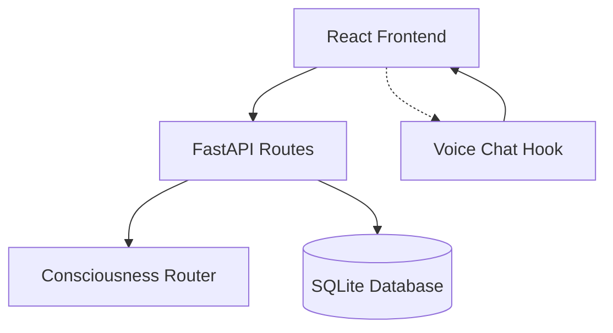
The diagram above illustrates the high-level data flow from the user interface through the API layers to the persistence and processing engines.

Sources: [package.txt:1-20](), [vite.config.txt:1-18](), [alzheimers_legacy_routes.py:10-25](), [index (1).txt:1-40]()

## Core Modules and Features

### 1. Heirloom Companion Chat
The `ConsciousnessCompanionChat` component provides a supportive environment where users can speak or type to a digital companion. This companion uses a `CompanionPersonality` profile to adapt its voice style (e.g., gentle, warm) and communication speed to the user's needs.

*   **Memory Capture**: The system monitors interactions for "memory indicators" (e.g., "I remember", "smell", "back then"). When detected, it triggers a capture event to preserve the fragment.
*   **Voice Integration**: Uses the `useVoiceChat` hook to allow users to record memories naturally.

Sources: [AlzheimersLegacyExhibit.tsx:55-61](), [AlzheimersLegacyExhibit.tsx:123-180]()

### 2. Life Tapestry
The Life Tapestry visually organizes "Life Threads"—sequences of related memories and milestones. Each thread tracks "Consciousness Resonance," a metric indicating how well the captured content reflects the user's authentic self.

| Component | Description | Data Points |
| :--- | :--- | :--- |
| **Life Thread** | High-level thematic collection of memories | Title, Time Period, Emotional Significance |
| **Memory Fragment** | Granular sensory details | Sounds, Smells, Feelings, Clarity |
| **Family Contribution** | Context added by loved ones | Contributor, Relationship, Timestamp |

Sources: [AlzheimersLegacyExhibit.tsx:11-40](), [AlzheimersLegacyExhibit.tsx:246-320]()

### 3. Bucket Drops (Sacred Time Capsules)
"Bucket Drops" are messages or multimedia assets created by the user to be released to specific recipients upon certain triggers (e.g., birth announcements, anniversaries). These are cryptographically secured and tracked within the database.

Sources: [AlzheimersLegacyExhibit.tsx:42-53](), [alzheimers-database-schema.sql (1).txt:76-90]()

## Database Schema and Relationships

The database is structured to track the user's cognitive state and linguistic fingerprint over time.

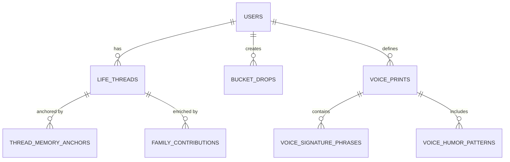
The ER diagram displays the core relationships between user identity, their legacy content, and their unique linguistic profile.

Sources: [alzheimers-database-schema.sql (1).txt:15-100]()

## API and Integration

The system exposes a preservation endpoint that uses a `universal_consciousness_router` to process raw memory fragments.

### Endpoint: `POST /alzheimers-legacy/preserve`
*   **Purpose**: Enhances raw memory fragments using LLMs to add connections and legacy insights.
*   **Request Body (`MemoryQuery`)**:
    *   `memory_fragment` (string): The raw text captured.
    *   `preservation_type` (string): The category of memory.
    *   `context` (Object): Additional metadata.
*   **Logic**: The prompt specifically asks the LLM to provide an enhanced version, related connections, and wisdom insights.

Sources: [alzheimers_legacy_routes.py:10-60]()

## Cognitive State Management
The system includes a **Cognitive Sentinel Soft Mode (CSSM)**. This module tracks user interactions and detects states such as "fragmented," "symbolic," or "dreamlike" to adjust the companion's response mode (e.g., "resonant validation" or "anchor return").

Sources: [alzheimers-database-schema.sql (1).txt:175-184](), [alzheimers-database-schema.sql (1).txt:237-245]()

## Conclusion
The Alzheimer's Legacy system represents a holistic approach to memory preservation, combining emotional intelligence with technical robustness. By utilizing voice analysis, sensory fragment tracking, and intentional release triggers, the system ensures that the "authentic voice" of the individual remains accessible to future generations, even as cognitive states change.

Sources: [AlzheimersLegacyExhibit.tsx:448-458](), [alzheimers-database-schema.sql (1).txt:3-7]()

### Quick Start & Local Setup

<details>
<summary>Relevant source files</summary>

The following files were used as context for generating this wiki page:

- [package.txt](https://github.com/faagestalt-web/alzheimers-legacy/blob/main/package.txt)
- [vite.config.txt](https://github.com/faagestalt-web/alzheimers-legacy/blob/main/vite.config.txt)
- [tsconfig.txt](https://github.com/faagestalt-web/alzheimers-legacy/blob/main/tsconfig.txt)
- [index (1).txt](https://github.com/faagestalt-web/alzheimers-legacy/blob/main/index%20%281).txt)
- [alzheimers_legacy_routes.py](https://github.com/faagestalt-web/alzheimers-legacy/blob/main/alzheimers_legacy_routes.py)
- [alzheimers-database-schema.sql (1).txt](https://github.com/faagestalt-web/alzheimers-legacy/blob/main/alzheimers-database-schema.sql%20%281).txt)
- [AlzheimersLegacyExhibit.tsx](https://github.com/faagestalt-web/alzheimers-legacy/blob/main/AlzheimersLegacyExhibit.tsx)
</details>

# Quick Start & Local Setup

This guide provides the technical instructions required to initialize, configure, and run the Alzheimer's Legacy project locally. The system is a "consciousness-serving" memory preservation platform that combines a React-based frontend with a FastAPI backend and a SQLite database to store linguistic fingerprints, life threads, and "bucket drops."

The project utilizes a modern web stack involving Vite for frontend tooling, TypeScript for type safety, and Python-based microservices for LLM orchestration. Setup involves configuring environment variables for API access (specifically Gemini API), initializing the relational database schema, and installing dependencies for both the Node.js and Python environments.

## Prerequisites and Environment Configuration

The project requires a Node.js environment and a Python 3.x environment. Configuration is largely driven by environment variables and TypeScript path mapping.

### Frontend Configuration
The frontend uses Vite as the build tool. It requires a `.env` file containing the `GEMINI_API_KEY` for LLM-driven features. The configuration maps this key to both `process.env.API_KEY` and `process.env.GEMINI_API_KEY`.

| Option | Type | Description |
| :--- | :--- | :--- |
| `GEMINI_API_KEY` | string | API key for Google Gemini, used for consciousness-serving AI features. |
| `moduleResolution` | string | Set to `bundler` in TypeScript config. |
| `target` | string | `ES2022` for modern JavaScript features. |

Sources: [vite.config.txt:6-10](), [tsconfig.txt:4-18]()

### Dependency Management
The project defines its frontend dependencies and scripts within `package.json`.

```json
{
  "scripts": {
    "dev": "vite",
    "build": "vite build",
    "preview": "vite preview"
  },
  "dependencies": {
    "react": "^19.1.1",
    "react-dom": "^19.1.1"
  }
}
```
Sources: [package.txt:5-13]()

## Backend & Database Initialization

The backend is built using FastAPI and requires a SQLite database initialized with the provided schema. The schema manages complex relationships between users, voice prints, and memory fragments.

### Database Schema Setup
To set up the local data layer, the `alzheimers-database-schema.sql` must be executed against a SQLite instance. This creates the core tables and views required for the "Legacy Garden."

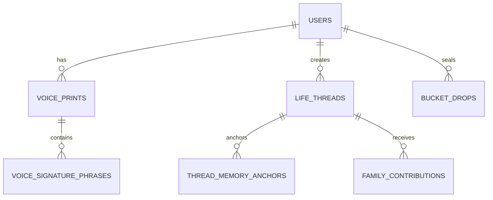
*The diagram above shows the core entity relationships within the memory preservation database.*

Sources: [alzheimers-database-schema.sql (1).txt:13-110]()

### API Routing
The backend exposes endpoints under the `/alzheimers-legacy` prefix. The primary endpoint for local development testing is the memory preservation route.

| Endpoint | Method | Description |
| :--- | :--- | :--- |
| `/alzheimers-legacy/preserve` | POST | Preserves and enhances memory fragments using LLM integration. |

Sources: [alzheimers_legacy_routes.py:10-23]()

## Local Development Workflow

Once dependencies are installed and the database is initialized, the following workflow is used to run the application.

### Starting the Application
1.  **Frontend**: Run `npm run dev` to start the Vite development server. This serves the `index.html` which loads `index.tsx` as a module.
2.  **Backend**: Run the FastAPI server (typically via `uvicorn`). The routes utilize an `LLMProvider.OPENAI` or Gemini depending on the context passed to the `universal_consciousness_router`.

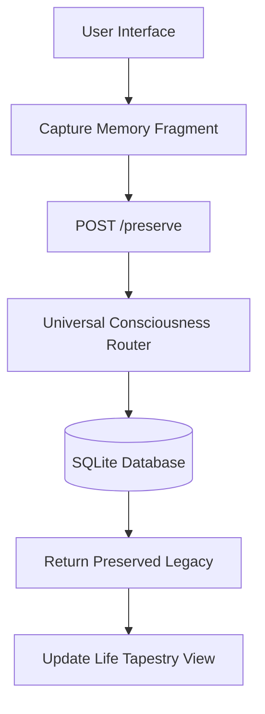
*This flow illustrates the data path from user input to persistent storage and back to the UI.*

Sources: [index (1).txt:42-43](), [alzheimers_legacy_routes.py:28-63](), [AlzheimersLegacyExhibit.tsx:143-165]()

## Key System Components

The local setup allows developers to interact with several core modules evidenced in the source:

*   **Memory Keeper Companion**: A chat interface that captures real-time memories and detects "memory indicators" (e.g., "I remember", "back then").
*   **Life Tapestry**: A visualization component for `EnhancedLifeThread` objects, which include "consciousness resonance" scores.
*   **Bucket Drops**: A time-capsule system for "Sealed" content that releases based on specific triggers.

Sources: [AlzheimersLegacyExhibit.tsx:117-140](), [AlzheimersLegacyExhibit.tsx:241-315](), [alzheimers-database-schema.sql (1).txt:111-125]()

### Summary
Setting up the Alzheimer's Legacy project locally involves configuring a dual-stack environment. Developers must ensure the SQLite database is populated with the schema to support the "Voice Print" and "Life Thread" logic, while the frontend requires a valid Gemini API key to enable the consciousness-serving AI features that drive the Memory Keeper Companion.


## System Architecture

### High-Level System Architecture

<details>
<summary>Relevant source files</summary>

The following files were used as context for generating this wiki page:

- [AlzheimersLegacyExhibit.tsx](https://github.com/faagestalt-web/alzheimers-legacy/blob/main/AlzheimersLegacyExhibit.tsx)
- [alzheimers_legacy_routes.py](https://github.com/faagestalt-web/alzheimers-legacy/blob/main/alzheimers_legacy_routes.py)
- [alzheimers-database-schema.sql (1).txt](https://github.com/faagestalt-web/alzheimers-legacy/blob/main/alzheimers-database-schema.sql%20%281%29.txt)
- [package.txt](https://github.com/faagestalt-web/alzheimers-legacy/blob/main/package.txt)
- [tsconfig.txt](https://github.com/faagestalt-web/alzheimers-legacy/blob/main/tsconfig.txt)
- [vite.config.txt](https://github.com/faagestalt-web/alzheimers-legacy/blob/main/vite.config.txt)
- [index (1).txt](https://github.com/faagestalt-web/alzheimers-legacy/blob/main/index%20%281%29.txt)
</details>

# High-Level System Architecture

The Alzheimer's Legacy system is a consciousness-serving preservation platform designed to maintain the dignity, presence, and legacy of individuals living with Alzheimer's. It functions as a multi-layered digital environment where personal histories, sensory memories, and future-dated messages (Bucket Drops) are stored and nurtured through AI-driven companion interactions. The system focuses on "Presence, Not Perfection," prioritizing emotional resonance and authentic voice over clinical accuracy.

Sources: [alzheimers-database-schema.sql (1).txt:1-12](), [AlzheimersLegacyExhibit.tsx:432-445]()

## System Overview and Tech Stack

The architecture follows a modern decoupled structure consisting of a React-based frontend, a FastAPI backend, and an SQLite storage layer. The system is containerized and bundled using Vite, with a heavy emphasis on real-time interaction through voice and consciousness-serving APIs.

| Layer | Technology | Purpose |
| :--- | :--- | :--- |
| **Frontend** | React 18/19, Tailwind CSS, Framer Motion | User interface, animations, and real-time UI state management. |
| **Backend** | FastAPI (Python) | API routing, LLM orchestration, and authentication. |
| **Database** | SQLite | Relational storage for users, voice prints, life threads, and bucket drops. |
| **Build/Dev** | Vite, TypeScript | Project bundling, environment variable management, and type safety. |
| **External APIs** | OpenAI / Gemini | Consciousness-serving LLM processing and voice-to-text. |

Sources: [package.txt:1-20](), [index (1).txt:5-25](), [vite.config.txt:1-15](), [alzheimers_legacy_routes.py:1-10]()

## Frontend Architecture

The frontend is structured around the `EnhancedAlzheimersLegacyExhibit` component, which manages the application state across three primary modules: the Memory Keeper Companion, Life's Tapestry, and Sacred Time Capsules.

### Core Modules
*   **Memory Keeper Companion**: A real-time chat interface featuring voice support and "memory detection" logic to capture fragments during conversation.
*   **Life's Tapestry**: A visual representation of `EnhancedLifeThread` objects, showcasing memory fragments with sensory details (sounds, smells, feelings).
*   **Sacred Time Capsules (Bucket Drops)**: A system for managing messages intended for future release, secured by "Sacred Seals" and blockchain hashes.

Sources: [AlzheimersLegacyExhibit.tsx:378-420](), [AlzheimersLegacyExhibit.tsx:109-195]()

### Frontend Data Flow
The following diagram illustrates how user interactions flow from the UI to the consciousness-serving APIs and back.

```mermaid
flowchart TD
    User([User]) --> UI[AlzheimersLegacyExhibit]
    UI --> Chat[ConsciousnessCompanionChat]
    Chat --> Voice[useVoiceChat Hook]
    Chat --> API[useConsciousnessAPI Hook]
    API --> Backend[/alzheimers-legacy/preserve]
    Backend --> LLM{Universal Consciousness Router}
    LLM --> Response[Enhanced Memory/Insights]
    Response --> UI
```
The frontend utilizes `framer-motion` for fluid transitions between legacy modules, emphasizing a "garden" metaphor for memory preservation.
Sources: [AlzheimersLegacyExhibit.tsx:11-15](), [AlzheimersLegacyExhibit.tsx:128-150]()

## Backend and API Layer

The backend is built on FastAPI and serves as an orchestration layer between the user interface and the Large Language Models (LLMs).

### API Endpoints
The primary interaction point is the `/preserve` endpoint, which handles memory fragmentation and enhancement.

| Endpoint | Method | Input | Output | Description |
| :--- | :--- | :--- | :--- | :--- |
| `/preserve` | POST | `MemoryQuery` | `LegacyResponse` | Preserves fragments, generates connections, and provides legacy insights. |

Sources: [alzheimers_legacy_routes.py:11-63]()

### LLM Orchestration
The `universal_consciousness_router` directs prompts to specific providers (e.g., OpenAI) based on the `MuseumExhibitContext`. It specifically asks for:
1.  An enhanced, preserved version of the memory.
2.  Related memory connections.
3.  Legacy insights and wisdom.

Sources: [alzheimers_legacy_routes.py:38-60]()

## Data Architecture

The database schema is designed for deep relational mapping of a user's "Voice Print" and "Life Threads."

### Entity-Relationship Diagram
The schema tracks not just data, but "Linguistic Fingerprints" and "Neural Resonance."

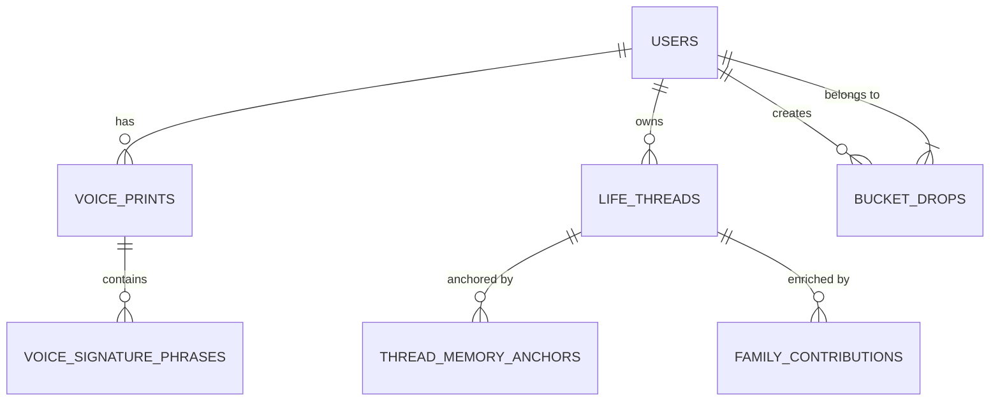

### Key Data Structures

*   **Voice Prints**: Stores the "linguistic fingerprint" and "storytelling style" of the user to ensure the AI companion remains authentic to the user's personality.
*   **Cognitive Sentinel Soft Mode (CSSM)**: Tracks sessions where fragmented or dreamlike states are detected, adjusting the response mode to "resonant validation" or "anchor return."
*   **Bucket Drops**: Includes fields for `release_trigger` (e.g., birth announcement) and `blockchain_hash` for integrity.

Sources: [alzheimers-database-schema.sql (1).txt:15-40](), [alzheimers-database-schema.sql (1).txt:84-100](), [alzheimers-database-schema.sql (1).txt:135-144]()

## Memory Preservation Logic

The system utilizes a specific "Consciousness Resonance" metric to measure how well preserved memories align with the user's authentic self.

```javascript
// Data structure for memory resonance from AlzheimersLegacyExhibit.tsx
interface EnhancedLifeThread {
  id: string;
  consciousnessResonance: number; // 0-1 scale
  preservationQuality: 'crystal_clear' | 'gentle_fragments' | 'emotional_essence';
}
```
Sources: [AlzheimersLegacyExhibit.tsx:28-31]()

When a user interacts with the `ConsciousnessCompanionChat`, the system scans for `memoryIndicators` (e.g., "remember", "recall", "smell"). If detected, the `onMemoryCapture` callback is triggered to save the fragment to the consciousness-serving backend.

Sources: [AlzheimersLegacyExhibit.tsx:142-160]()

## Conclusion
The Alzheimer's Legacy system architecture integrates empathetic frontend design with a robust relational database and AI orchestration layer. By focusing on sensory anchors and linguistic patterns, the system creates a resilient "Legacy Garden" that preserves the essence of the individual even as cognitive clarity fluctuates. Significance is placed on the "Sacred Time Capsules" and "Life Tapestry," ensuring that the preserved consciousness is accessible to future generations through validated family contributions.

Sources: [AlzheimersLegacyExhibit.tsx:432-445](), [alzheimers-database-schema.sql (1).txt:5-10]()

### Client-Server Communication

<details>
<summary>Relevant source files</summary>

The following files were used as context for generating this wiki page:

- [AlzheimersLegacyExhibit.tsx](https://github.com/faagestalt-web/alzheimers-legacy/blob/main/AlzheimersLegacyExhibit.tsx)
- [alzheimers_legacy_routes.py](https://github.com/faagestalt-web/alzheimers-legacy/blob/main/alzheimers_legacy_routes.py)
- [alzheimers-database-schema.sql (1).txt](https://github.com/faagestalt-web/alzheimers-legacy/blob/main/alzheimers-database-schema.sql%20%281).txt)
- [vite.config.txt](https://github.com/faagestalt-web/alzheimers-legacy/blob/main/vite.config.txt)
- [package.txt](https://github.com/faagestalt-web/alzheimers-legacy/blob/main/package.txt)
- [tsconfig.txt](https://github.com/faagestalt-web/alzheimers-legacy/blob/main/tsconfig.txt)

</details>

# Client-Server Communication

The Client-Server Communication system in the Alzheimer's Legacy project facilitates the preservation and retrieval of human consciousness elements, specifically memories, voice prints, and "bucket drops." The architecture connects a React-based frontend exhibit to a FastAPI backend that interfaces with advanced Large Language Models (LLMs) and a structured SQLite database.

This communication bridge ensures that user interactions—whether via text or voice—are processed with "Consciousness-serving" logic, focusing on emotional resonance and preservation quality rather than just data storage.

Sources: [AlzheimersLegacyExhibit.tsx:437-445](), [alzheimers_legacy_routes.py:9-12](), [alzheimers-database-schema.sql (1).txt:7-14]()

## API Architecture and Endpoints

The system utilizes a RESTful API pattern where the client sends structured memory fragments and context to the server. The server processes these through a "universal consciousness router" to enhance and connect the data before persisting it or returning it to the user.

### Memory Preservation Flow

When a user shares a memory in the interface, the client calls the `/alzheimers-legacy/preserve` endpoint. This request includes the raw memory fragment, the preservation type, and technical context like personality settings for the AI companion.

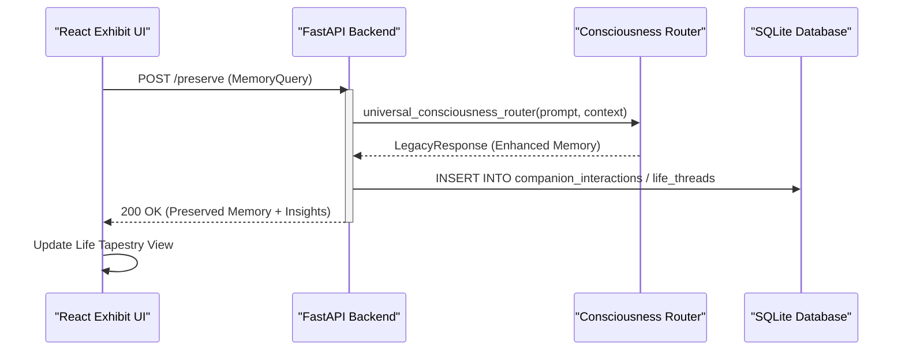
This diagram illustrates the lifecycle of a memory from user input to long-term storage and enhancement.
Sources: [alzheimers_legacy_routes.py:22-62](), [AlzheimersLegacyExhibit.tsx:165-190]()

### Key Data Structures

The communication relies on specific Pydantic models (backend) and TypeScript interfaces (frontend) to maintain type safety across the network.

| Component | Data Structure | Purpose |
| :--- | :--- | :--- |
| **Request** | `MemoryQuery` | Captures `memory_fragment`, `context`, and `preservation_type`. |
| **Response** | `LegacyResponse` | Returns `preserved_memory`, `connections`, and `legacy_insights`. |
| **Context** | `MuseumExhibitContext` | Encapsulates `exhibit_type`, `user_id`, and `session_id` for the router. |
| **Client State** | `CompanionPersonality` | Defines `voiceStyle` and `communicationSpeed` for API requests. |

Sources: [alzheimers_legacy_routes.py:11-20](), [AlzheimersLegacyExhibit.tsx:64-69]()

## Voice and Multimedia Processing

The client-server interaction extends beyond text. The system supports voice capture and multimedia "Bucket Drops" (sacred time capsules).

### Voice Communication
The client utilizes a `useVoiceChat` hook to capture audio, which is then transcribed and sent as text to the processing API. The server uses the `voice_prints` table to maintain a "linguistic fingerprint" of the user, ensuring the AI response matches the user's authentic style.

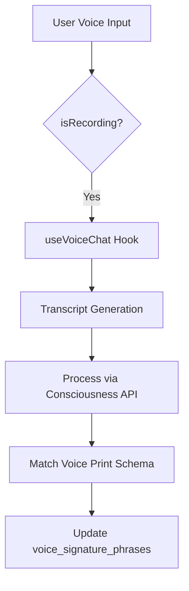
This flow shows how voice interactions are converted and matched against stored linguistic patterns.
Sources: [AlzheimersLegacyExhibit.tsx:156-160](), [alzheimers-database-schema.sql (1).txt:21-28]()

## Database Schema Integration

The server-side communication is grounded in a complex SQLite schema designed for "Legacy Preservation." Data received from the client is distributed across several specialized tables.

### Table Relationships
The server maps incoming client data to the following relational structure:

*   **Users & Voice Prints**: Core identity and stylistic data.
*   **Life Tapestry**: For `life_threads` and `memory_anchors` derived from the `EnhancedLifeThread` client interface.
*   **Bucket Drops**: For "Time Capsules" intended for future release based on `release_triggers`.
*   **CSSM Sessions**: (Cognitive Sentinel Soft Mode) Tracks interactions where the user's state is detected as "fragmented" or "dreamlike."

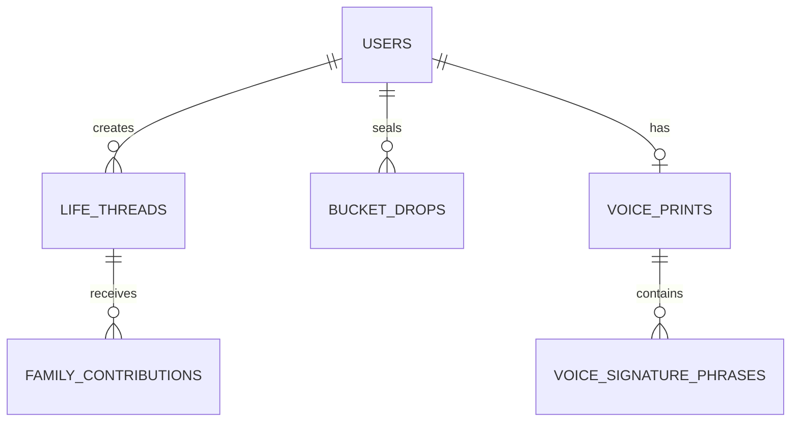
Sources: [alzheimers-database-schema.sql (1).txt:14-110]()

## Configuration and Environment

The project uses Vite for build orchestration and environment variable management, which defines how the client locates and authenticates with the server.

*   **API Routing**: The backend uses an `APIRouter` with the prefix `/alzheimers-legacy`.
*   **Environment Variables**: The `vite.config.ts` file maps `GEMINI_API_KEY` to `process.env` for client-side API usage if a direct LLM connection is required.
*   **Path Aliasing**: The `@/*` alias is configured in both `tsconfig.json` and `vite.config.ts` to simplify imports for hooks like `useConsciousnessAPI`.

Sources: [vite.config.txt:6-14](), [tsconfig.txt:23-27](), [alzheimers_legacy_routes.py:8]()

## Summary

The Client-Server Communication in the Alzheimer's Legacy project is a specialized pipeline designed to transform raw, potentially fragmented user input into preserved "consciousness" data. By utilizing a FastAPI gateway, the system ensures that every memory captured in the React frontend is enhanced by LLMs, validated against a linguistic voice print, and securely stored within a relational database for future family access.


## Core Features

### Feature: Interactive Exhibit Display

<details>
<summary>Relevant source files</summary>

The following files were used as context for generating this wiki page:

- [AlzheimersLegacyExhibit.tsx](https://github.com/faagestalt-web/alzheimers-legacy/blob/main/AlzheimersLegacyExhibit.tsx)
- [alzheimers-database-schema.sql (1).txt](https://github.com/faagestalt-web/alzheimers-legacy/blob/main/alzheimers-database-schema.sql%20%281).txt)
- [alzheimers_legacy_routes.py](https://github.com/faagestalt-web/alzheimers-legacy/blob/main/alzheimers_legacy_routes.py)
- [index (1).txt](https://github.com/faagestalt-web/alzheimers-legacy/blob/main/index%20%281).txt)
- [vite.config.txt](https://github.com/faagestalt-web/alzheimers-legacy/blob/main/vite.config.txt)
- [package.txt](https://github.com/faagestalt-web/alzheimers-legacy/blob/main/package.txt)
</details>

# Feature: Interactive Exhibit Display

## Introduction
The Interactive Exhibit Display is a "consciousness-serving" memory preservation system designed specifically for the Alzheimer's Legacy Edition of GestaltView. Its primary purpose is to provide a dignified, multi-modal interface for users to interact with their personal history through AI-driven companions, visual life tapestries, and "bucket drops" (time-delayed messages). The system prioritizes "Presence, Not Perfection," focusing on emotional resonance and sensory details rather than perfect factual recall.

The feature integrates a React-based frontend with a FastAPI backend and a specialized SQLite schema to capture, categorize, and preserve cognitive fragments. It utilizes voice interaction, linguistic fingerprinting, and emotional significance scoring to ensure the user's authentic voice is maintained throughout their cognitive journey.

Sources: [AlzheimersLegacyExhibit.tsx:1-10](), [alzheimers-database-schema.sql (1).txt:1-12](), [alzheimers_legacy_routes.py:1-10]()

## System Architecture

The exhibit display follows a modern decoupled architecture. The frontend is built using React and Vite, utilizing Tailwind CSS for styling and Framer Motion for fluid transitions. The backend provides RESTful API endpoints via FastAPI to interface with a SQLite database that stores complex relational memory data.

### High-Level Data Flow
The following diagram illustrates how user input travels from the interactive UI through the consciousness processing layer to persistent storage.

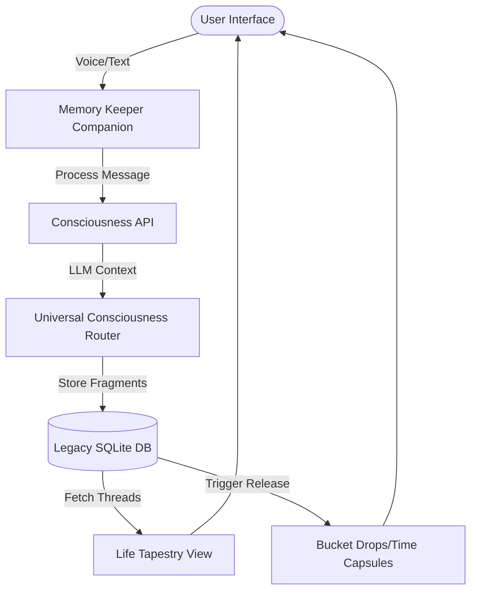
The system uses a `universal_consciousness_router` to manage LLM interactions, ensuring that memory fragments are enhanced and connected to existing legacy insights.
Sources: [AlzheimersLegacyExhibit.tsx:150-180](), [alzheimers_legacy_routes.py:25-45](), [vite.config.txt:5-15]()

## Module: Memory Keeper Companion

The Companion module is the primary interaction point, providing a "Consciousness Companion Chat" that adapts to the user's personality. It supports both text and voice input (via `useVoiceChat`) and uses a specialized set of "memory indicators" to detect when a user is sharing a precious memory fragment.

### Key Components
- **Voice Interaction**: Toggles between recording and playback, converting speech to transcripts for processing.
- **Personality Adaptation**: The UI adjusts its messaging style based on a `CompanionPersonality` profile (e.g., gentle, warm, encouraging).
- **Memory Capture**: A callback mechanism that identifies specific keywords (e.g., "remember", "smell", "never forget") to trigger the preservation logic.

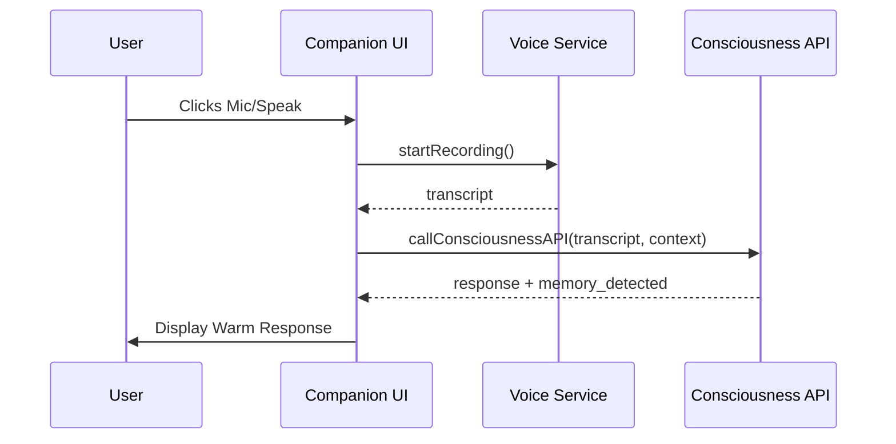
Sources: [AlzheimersLegacyExhibit.tsx:135-220](), [alzheimers_legacy_routes.py:18-24]()

## Data Models and Schema

The system relies on a specialized SQLite schema designed to store not just data, but the "emotional weight" and "linguistic fingerprints" of the user.

### Core Database Entities

| Table | Description | Key Fields |
| :--- | :--- | :--- |
| `users` | Core user identity and philosophy. | `id`, `name`, `philosophy` |
| `voice_prints` | Stores the user's unique linguistic style. | `linguistic_fingerprint`, `storytelling_style` |
| `life_threads` | Categorized periods or themes of life. | `title`, `time_period`, `emotional_significance` |
| `bucket_drops` | Time-locked messages for future release. | `content`, `recipient`, `release_trigger` |
| `musical_memories` | Songs linked to specific emotional states. | `song_title`, `neural_resonance_score` |

Sources: [alzheimers-database-schema.sql (1).txt:15-120]()

### Memory Fragments and Tapestry
Memory fragments are stored with sensory details (sounds, smells, feelings) to aid in retrieval and reconstruction for users with cognitive decline.

```sql
-- Example structure for memory fragments
interface MemoryFragment {
  content: string;
  sensoryDetails: {
    sounds?: string[];
    smells?: string[];
    feelings?: string[];
  };
  clarity: number; // 0-1 scale
  familyValidated: boolean;
}
```
Sources: [AlzheimersLegacyExhibit.tsx:32-45](), [alzheimers-database-schema.sql (1).txt:55-70]()

## Module: Life Tapestry and Time Capsules

The Life Tapestry (`EnhancedTapestryView`) and Sacred Time Capsules (`EnhancedBucketDropsView`) serve as the visual and archival components of the exhibit.

### Life Tapestry Logic
The tapestry organizes `EnhancedLifeThread` objects into a grid. Each thread includes:
- **Preservation Quality**: Categorized as `crystal_clear`, `gentle_fragments`, or `emotional_essence`.
- **Consciousness Resonance**: A metric (0-100%) indicating how well the preserved fragment matches the user's authentic self.
- **Family Contributions**: Verified stories added by family members to bolster the user's memories.

### Bucket Drops (Time Capsules)
Time capsules are messages "sealed with intention." They use a trigger-based release system:
- **Date Triggers**: Released on specific calendar days.
- **Event Triggers**: Released on milestones like "First Cooking Experience" or "Birth Announcement."

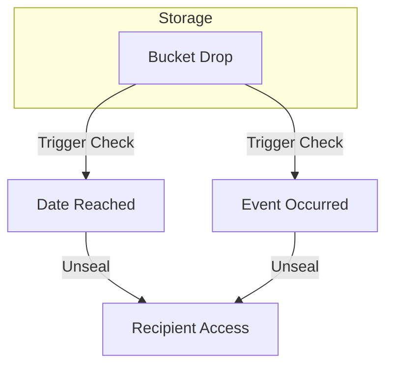
Sources: [AlzheimersLegacyExhibit.tsx:300-400](), [alzheimers-database-schema.sql (1).txt:85-100](), [alzheimers-database-schema.sql (1).txt:215-230]()

## API Endpoints: Memory Preservation

The backend provides a specialized route for memory preservation that leverages Large Language Models (LLMs) to enhance fragmented user inputs.

### `POST /alzheimers-legacy/preserve`
Preserves and enhances memory fragments.

**Parameters:**
- `memory_fragment` (string): The raw text captured from the user.
- `preservation_type` (string): The category of memory (e.g., life_thread, bucket_drop).
- `context` (Dict): Metadata including user ID and session state.

**Response:**
- `preserved_memory`: An enhanced, poetic version of the memory.
- `connections`: A list of related memories found in the database.
- `legacy_insights`: Wisdom derived from the fragment.

Sources: [alzheimers_legacy_routes.py:12-65]()

## Conclusion
The Interactive Exhibit Display serves as a bridge between immediate presence and long-term legacy. By combining real-time companion interaction with a structured data model for sensory memory and time-delayed "drops," it creates a living archive that supports both the individual and their family throughout the progression of Alzheimer's.

### Feature: User Interactions

<details>
<summary>Relevant source files</summary>

The following files were used as context for generating this wiki page:

- [AlzheimersLegacyExhibit.tsx](https://github.com/faagestalt-web/alzheimers-legacy/blob/main/AlzheimersLegacyExhibit.tsx)
- [alzheimers-database-schema.sql (1).txt](https://github.com/faagestalt-web/alzheimers-legacy/blob/main/alzheimers-database-schema.sql%20%281).txt)
- [alzheimers_legacy_routes.py](https://github.com/faagestalt-web/alzheimers-legacy/blob/main/alzheimers_legacy_routes.py)
- [index (1).txt](https://github.com/faagestalt-web/alzheimers-legacy/blob/main/index%20%281).txt)
- [package.txt](https://github.com/faagestalt-web/alzheimers-legacy/blob/main/package.txt)
- [vite.config.txt](https://github.com/faagestalt-web/alzheimers-legacy/blob/main/vite.config.txt)
</details>

# Feature: User Interactions

The **User Interactions** feature within the Alzheimer's Legacy project is a sophisticated multi-modal system designed to preserve human legacy through "consciousness-serving" technology. It facilitates meaningful engagement between patients (users), their families, and an AI-driven "Memory Keeper Companion." The system focuses on capturing "Life Threads," creating "Bucket Drops" (time capsules), and maintaining a "Life Tapestry" that integrates sensory details and emotional resonance to provide a dignified record of a person's life.

This system operates at the intersection of a React-based frontend, a FastAPI backend using advanced LLM routing, and a structured SQLite database designed for high emotional and data integrity.

Sources: [AlzheimersLegacyExhibit.tsx:1-20](), [alzheimers-database-schema.sql (1).txt:5-15](), [alzheimers_legacy_routes.py:1-10]()

## Memory Keeper Companion Interaction

The primary interface for user interaction is the `ConsciousnessCompanionChat`. This component uses a conversational AI to engage the user in a "gentle, warm, and encouraging" manner based on a `CompanionPersonality` profile. It supports both text and voice input, the latter powered by a `useVoiceChat` hook.

### Interaction Logic and Memory Capture
The system does not just process text; it actively scans for "memory indicators"—keywords such as "remember," "recall," or sensory terms like "smell" and "sound." When these are detected, the system triggers a memory capture event.

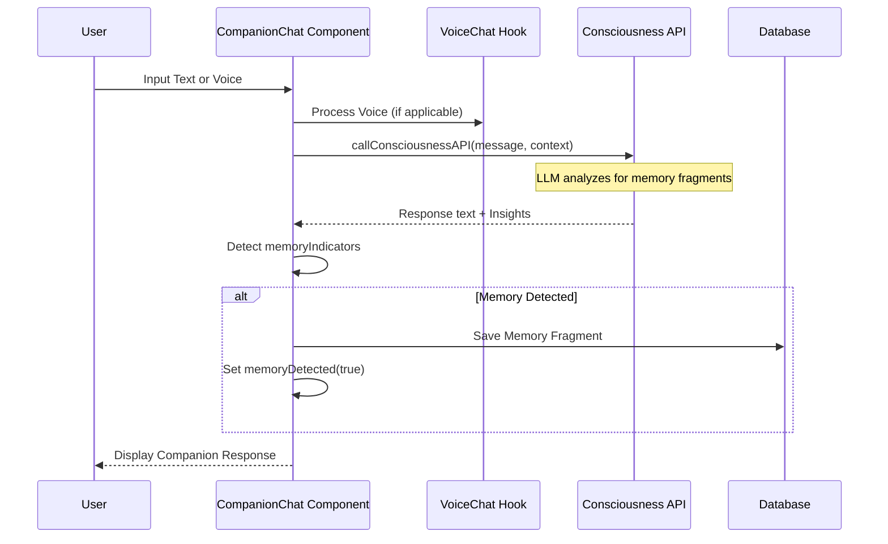
The interaction is logged in the `companion_interactions` table, and if the cognitive state is detected as "fragmented" or "dreamlike," it is further logged into a `cssm_sessions` table for Cognitive Sentinel Soft Mode tracking.
Sources: [AlzheimersLegacyExhibit.tsx:156-230](), [alzheimers-database-schema.sql (1).txt:50-60](), [alzheimers-database-schema.sql (1).txt:150-160]()

## Life Tapestry and Family Contributions

User interaction extends to family members who can view and contribute to the "Life Tapestry." This is a collection of `EnhancedLifeThread` objects that group memories by time period and emotional significance.

### Data Structure: Life Threads
A life thread contains memory fragments with sensory details (sounds, smells, feelings) and an "authenticity resonance" score.

| Field | Type | Description |
| :--- | :--- | :--- |
| `id` | string | Unique identifier for the thread |
| `title` | string | Thematic name (e.g., "Love Letters to Carl") |
| `emotionalSignificance` | number | Scale of 1-10 |
| `consciousnessResonance` | number | 0-1 score of authenticity |
| `preservationQuality` | enum | crystal_clear, gentle_fragments, or emotional_essence |

Sources: [AlzheimersLegacyExhibit.tsx:23-40](), [alzheimers-database-schema.sql (1).txt:62-70]()

### Contribution Flow
Family members with appropriate `access_level` (defined in the `family_members` table) can add context or corrections to existing threads. These are stored in the `family_contributions` table.

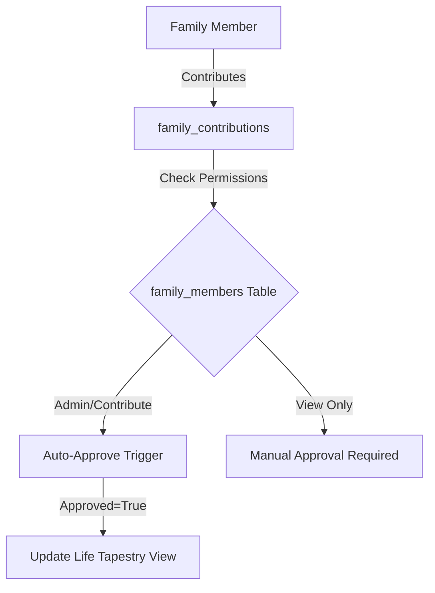
Sources: [AlzheimersLegacyExhibit.tsx:311-330](), [alzheimers-database-schema.sql (1).txt:125-135](), [alzheimers-database-schema.sql (1).txt:215-225]()

## Sacred Time Capsules (Bucket Drops)

Interaction with the future is managed through "Bucket Drops." These are messages (text, voice, or multimedia) created by the user to be released to specific recipients upon a "release trigger" (e.g., a birthday or a milestone).

### API Specification: Memory Preservation
The backend provides a `/preserve` endpoint to handle the enhancement of these legacy fragments.

| Parameter | Type | Description |
| :--- | :--- | :--- |
| `memory_fragment` | string | The raw content to be preserved |
| `preservation_type` | string | The intended format (e.g., legacy_wisdom) |
| `context` | dict | User-specific metadata and personality settings |

Sources: [alzheimers_legacy_routes.py:12-25](), [AlzheimersLegacyExhibit.tsx:55-65]()

## Technical Implementation Details

The frontend is built with **React 19** and **Vite**, utilizing **Framer Motion** for animations and **Lucide React** for iconography. The backend leverages **FastAPI** to route queries to LLM providers (specifically configured for OpenAI or Gemini) via a `universal_consciousness_router`.

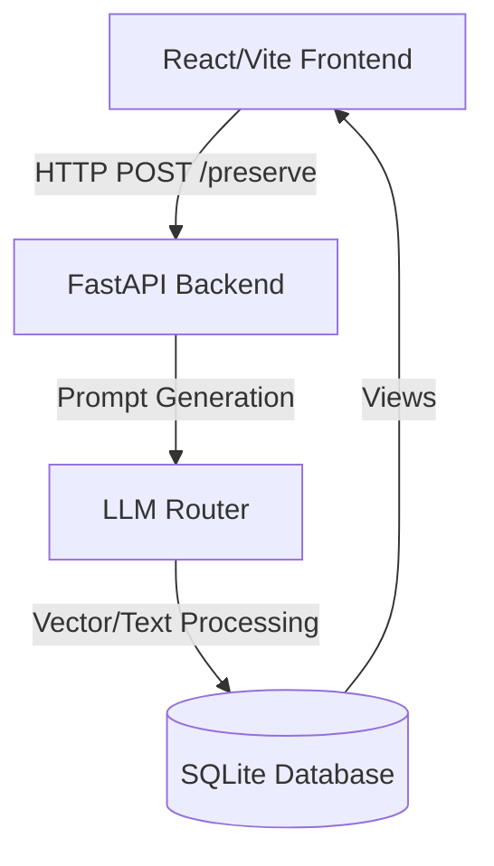
Sources: [package.txt:1-15](), [vite.config.txt:5-15](), [alzheimers_legacy_routes.py:35-55](), [index (1).txt:10-25]()

### Key Data Models (SQL)
The interaction system is underpinned by several critical tables:
- `users`: Stores core user identity and "philosophy" (Default: 'Presence, Not Perfection').
- `voice_prints`: Captures linguistic fingerprints and storytelling styles to ensure the AI "sounds" like the user.
- `bucket_drops`: Manages the encrypted, time-released legacy packages.
- `musical_memories`: Tracks songs with "neural resonance scores" to aid memory recall.

Sources: [alzheimers-database-schema.sql (1).txt:18-45](), [alzheimers-database-schema.sql (1).txt:85-110]()

## Conclusion

The User Interaction feature is more than a chat interface; it is a comprehensive system for capturing, validating, and preserving human essence. By integrating real-time AI companionship with structured data models for family contributions and future-dated "Bucket Drops," the system ensures that a user's legacy remains interactive and authentic even as their cognitive state changes.

### Feature: Accessibility & UX

<details>
<summary>Relevant source files</summary>

The following files were used as context for generating this wiki page:

- [AlzheimersLegacyExhibit.tsx](https://github.com/faagestalt-web/alzheimers-legacy/blob/main/AlzheimersLegacyExhibit.tsx)
- [index (1).txt](https://github.com/faagestalt-web/alzheimers-legacy/blob/main/index%20%281%29.txt)
- [alzheimers-database-schema.sql (1).txt](https://github.com/faagestalt-web/alzheimers-legacy/blob/main/alzheimers-database-schema.sql%20%281%29.txt)
- [alzheimers_legacy_routes.py](https://github.com/faagestalt-web/alzheimers-legacy/blob/main/alzheimers_legacy_routes.py)
- [package.txt](https://github.com/faagestalt-web/alzheimers-legacy/blob/main/package.txt)
</details>

# Feature: Accessibility & UX

The **Accessibility & UX** feature of the Alzheimers Legacy project focuses on "Presence, Not Perfection." Its primary goal is to provide a dignified, gentle, and highly supportive interface for individuals with Alzheimer's and their families. The system prioritizes sensory-rich interactions, adaptive communication styles, and robust memory preservation mechanisms that account for fragmented or symbolic cognitive states.

Sources: [AlzheimersLegacyExhibit.tsx:392](), [alzheimers-database-schema.sql (1).txt:13]()

## Adaptive Interface Design

The user interface is built using React and Framer Motion to ensure smooth, non-jarring transitions. The design utilizes a "Legacy Garden" metaphor, employing calming color gradients (purple, pink, and blue) and soft UI elements like backdrop blurs and rounded corners to reduce cognitive load.

### Component-Based Layout
The exhibit is divided into three primary views, each tailored to different cognitive needs:
*   **Companion Chat:** A gentle AI-driven interface for active conversation.
*   **Life Tapestry:** A visual representation of life threads and memory fragments.
*   **Time Capsules (Bucket Drops):** Intentional legacy messages for future release.

Sources: [AlzheimersLegacyExhibit.tsx:404-456](), [index (1).txt:22-29]()

### Cognitive Sensitivity
The UX accommodates various cognitive states through specific "Companion Personalities." The system adjusts voice style, communication speed, and the level of memory support based on the user's current needs.

| Parameter | Options | Description |
| :--- | :--- | :--- |
| Voice Style | gentle, warm, encouraging, playful | Dictates the persona of the AI companion. |
| Communication Speed | slow, moderate, adaptive | Adjusts response timing to match user processing. |
| Memory Support | high, moderate, minimal | Level of proactive memory anchoring provided. |
| Emotional Tone | nurturing, celebrating, understanding | The underlying empathetic framework of the session. |

Sources: [AlzheimersLegacyExhibit.tsx:61-66]()

## Multimodal Interaction and Voice Support

To lower barriers for users who may struggle with typing or complex navigation, the system integrates voice chat and recording features.

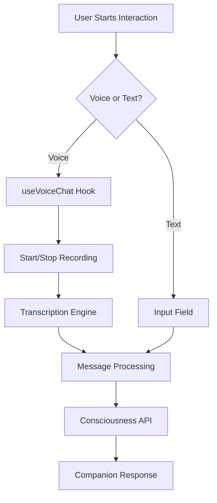
The diagram above illustrates the multimodal input flow within the `ConsciousnessCompanionChat` component.
Sources: [AlzheimersLegacyExhibit.tsx:128-132](), [AlzheimersLegacyExhibit.tsx:197-220]()

### Technical Implementation of Voice UX
The `handleVoiceToggle` function manages the state of the `isRecording` flag, providing visual feedback through a pulsing red indicator when active. Transcripts are automatically piped into the main message input when recording stops.

Sources: [AlzheimersLegacyExhibit.tsx:213-233]()

## Memory Preservation and Semantic Anchors

The UX is supported by a backend architecture designed to capture "sensory details" and "emotional significance" rather than just facts. The database schema includes tables specifically for tracking symbolic elements and neural resonance.

### Memory Fragmentation Handling
The system uses **Cognitive Sentinel Soft Mode (CSSM)** to track and respond to fragmented or dreamlike inputs. This ensures that when a user speaks in symbols or non-linear fragments, the UI remains supportive rather than error-prone.

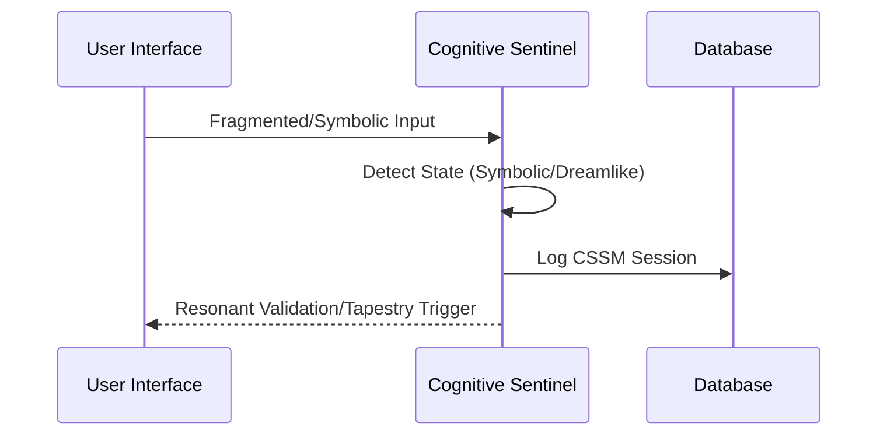
The sequence above shows how the system handles non-linear user input via CSSM tracking.
Sources: [alzheimers-database-schema.sql (1).txt:139-148](), [alzheimers-database-schema.sql (1).txt:215-223]()

### Sensory Details Structure
Memory fragments are enriched with specific sensory attributes to aid recall and preservation:
*   **Sounds:** e.g., "humming", "running water".
*   **Smells:** e.g., "apple blossoms", "fresh earth".
*   **Feelings:** e.g., "contentment", "renewal".
*   **Colors:** e.g., "pink", "white".

Sources: [AlzheimersLegacyExhibit.tsx:31-41](), [AlzheimersLegacyExhibit.tsx:315-330]()

## Family Integration and Legacy UX

Accessibility extends to family members who can contribute context and validate memories. This "Family Validation" provides a safety net for accuracy while maintaining the user's "Authenticity Resonance."

| Field | Type | Description |
| :--- | :--- | :--- |
| `contributor` | String | Name of the family member. |
| `relationship` | String | e.g., "daughter", "son". |
| `contributionType` | Enum | memory, context, emotion, correction. |
| `approved` | Boolean | Status for display in the legacy tapestry. |

Sources: [AlzheimersLegacyExhibit.tsx:43-48](), [alzheimers-database-schema.sql (1).txt:73-81]()

### Legacy Insights API
The backend route `/preserve` enhances raw memory fragments into "preserved versions" while identifying connections to other life threads. This ensures the UX remains meaningful even when initial inputs are brief.

Sources: [alzheimers_legacy_routes.py:11-55]()

## Summary
The Accessibility & UX feature is not merely a visual layer but a specialized interaction model. By combining gentle UI patterns, multimodal input (voice/text), and a database schema optimized for sensory and symbolic data, the system creates a "Legacy Garden" that honors the user's presence and dignity. It effectively bridges the gap between fragmented memories and lasting family legacy through empathetic AI companionship.


## Data Management & Flow

### Database Schema Overview

<details>
<summary>Relevant source files</summary>

The following files were used as context for generating this wiki page:

- [alzheimers-database-schema.sql (1).txt](https://github.com/faagestalt-web/alzheimers-legacy/blob/main/alzheimers-database-schema.sql%20%281%29.txt)
- [alzheimers_legacy_routes.py](https://github.com/faagestalt-web/alzheimers-legacy/blob/main/alzheimers_legacy_routes.py)
- [AlzheimersLegacyExhibit.tsx](https://github.com/faagestalt-web/alzheimers-legacy/blob/main/AlzheimersLegacyExhibit.tsx)
- [package.txt](https://github.com/faagestalt-web/alzheimers-legacy/blob/main/package.txt)
- [tsconfig.txt](https://github.com/faagestalt-web/alzheimers-legacy/blob/main/tsconfig.txt)
</details>

# Database Schema Overview

The GestaltView Alzheimer's Legacy Edition database is designed to preserve the dignity and presence of individuals through a structured system of memory anchors, voice prints, and legacy artifacts. The schema utilizes SQLite to manage complex relationships between users, their linguistic patterns, and family-contributed content, ensuring a "Presence, Not Perfection" philosophy is maintained across the application.

This schema supports the Heirloom Companion interactions, the Life Tapestry system, and Sacred Time Capsules (Bucket Drops), providing a robust foundation for consciousness-serving memory preservation.

Sources: [alzheimers-database-schema.sql (1).txt:1-12](), [AlzheimersLegacyExhibit.tsx:437-446]()

## Core Entity Architecture

The architecture is centered around the `users` table, which serves as the primary anchor for all personal data. Every other module—from voice analysis to musical memories—references a unique user ID to maintain data integrity and privacy.

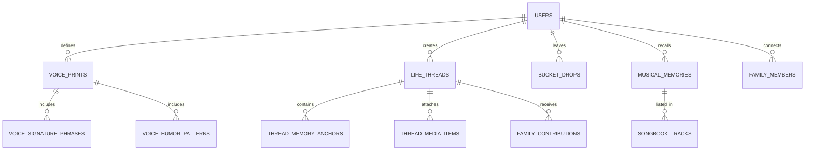
The diagram above illustrates the relational structure of the core database entities, highlighting the central role of the user and the hierarchical nature of memory preservation.
Sources: [alzheimers-database-schema.sql (1).txt:15-165]()

### User and Voice Identity
The identity system captures not just biographical data, but also the "linguistic fingerprint" of the user. This allows the AI companion to emulate the user's storytelling style and emotional weight.

| Table | Field | Type | Description |
| :--- | :--- | :--- | :--- |
| `users` | `philosophy` | TEXT | Defaults to 'Presence, Not Perfection'. |
| `voice_prints` | `linguistic_fingerprint` | TEXT | Stores analyzed speech patterns. |
| `voice_signature_phrases` | `emotional_weight` | REAL | Numerical value representing phrase importance (e.g., 1.0 to 10.0). |

Sources: [alzheimers-database-schema.sql (1).txt:17-49](), [alzheimers-database-schema.sql (1).txt:212-218]()

## Memory Preservation Systems

### Life Tapestry and Memory Anchors
The "Life Tapestry" module manages narrative threads and sensory anchors. These anchors are categorized into types such as 'memory', 'place', 'person', or 'event' to provide context for the AI.

```sql
CREATE TABLE IF NOT EXISTS thread_memory_anchors (
    id TEXT PRIMARY KEY,
    thread_id TEXT REFERENCES life_threads(id) ON DELETE CASCADE,
    anchor_text TEXT NOT NULL,
    anchor_type TEXT DEFAULT 'memory', -- memory, place, person, event
    created_at TIMESTAMP DEFAULT CURRENT_TIMESTAMP
);
```
Sources: [alzheimers-database-schema.sql (1).txt:77-83](), [AlzheimersLegacyExhibit.tsx:288-301]()

### Bucket Drops (Sacred Time Capsules)
Bucket Drops are content items (text, audio, or video) intended for future release. They are secured with blockchain hashes and triggered by specific events.

*   **Release Triggers:** Anniversary, milestone, birthday, or specific activities (e.g., 'cooking_session').
*   **Security:** Includes fields for `blockchain_hash` and `encryption_key`.
*   **Status Tracking:** Uses `is_sealed` and `released` booleans to manage availability.

Sources: [alzheimers-database-schema.sql (1).txt:98-112](), [alzheimers-database-schema.sql (1).txt:228-233]()

## Logic and Automation

The schema incorporates SQLite triggers to automate data integrity and provide real-time updates to the companion system.

### Automated Triggers
*   **Timestamp Updates:** The `update_voice_print_timestamp` trigger ensures the `voice_prints` table reflects changes whenever new signature phrases are added.
*   **Auto-Approval:** The `auto_approve_family_contributions` trigger automatically approves content from verified family members with 'contribute' or 'admin' access levels.
*   **Cognitive Logging:** The `log_companion_interaction` trigger automatically logs sessions into the `cssm_sessions` (Cognitive Sentinel Soft Mode) table if the detected cognitive state is 'symbolic', 'fragmented', or 'dreamlike'.

Sources: [alzheimers-database-schema.sql (1).txt:189-218]()

### Performance Optimization
The system utilizes specific indexes to optimize queries related to emotional significance and temporal data:
*   `idx_life_threads_user_id_emotional_significance`: Optimizes retrieval of high-impact memories.
*   `idx_bucket_drops_user_id_release_date`: Facilitates timely release of legacy messages.
*   `idx_musical_memories_user_id_neural_score`: Supports the Music Quest system by ranking songs based on resonance.

Sources: [alzheimers-database-schema.sql (1).txt:248-257]()

## API and Application Integration

The database schema directly maps to the `EnhancedLifeThread` and `EnhancedBucketDrop` interfaces in the React frontend and the `MemoryQuery` model in the Python backend.

```python
class MemoryQuery(BaseModel):
    memory_fragment: str
    context: Optional[Dict[str, Any]] = None
    preservation_type: str
```
The FastAPI route `/alzheimers-legacy/preserve` interacts with these structures to process memory fragments through a "universal consciousness router" before they are committed to the persistent storage defined in the schema.

Sources: [alzheimers_legacy_routes.py:9-13](), [AlzheimersLegacyExhibit.tsx:22-68]()

## Summary
The Database Schema for the Alzheimer's Legacy Edition serves as a comprehensive digital reliquary. By structuring data around linguistic patterns, sensory anchors, and emotional significance, it enables the system to maintain a user's "authentic voice" even as cognitive states shift. The use of triggers and views ensures that the data remains consistent, searchable, and ready for future generations.

### Entities & Relationships

<details>
<summary>Relevant source files</summary>

The following files were used as context for generating this wiki page:

- [alzheimers-database-schema.sql (1).txt](https://github.com/faagestalt-web/alzheimers-legacy/blob/main/alzheimers-database-schema.sql%20%281%29.txt)
- [AlzheimersLegacyExhibit.tsx](https://github.com/faagestalt-web/alzheimers-legacy/blob/main/AlzheimersLegacyExhibit.tsx)
- [alzheimers_legacy_routes.py](https://github.com/faagestalt-web/alzheimers-legacy/blob/main/alzheimers_legacy_routes.py)
- [index (1).txt](https://github.com/faagestalt-web/alzheimers-legacy/blob/main/index%20%281%29.txt)
- [package.txt](https://github.com/faagestalt-web/alzheimers-legacy/blob/main/package.txt)
</details>

# Entities & Relationships

The Alzheimer's Legacy project is a "consciousness-serving" system designed to preserve dignity, presence, and legacy through technology. It focuses on capturing memory fragments, voice prints, and emotional threads to create a digital tapestry for individuals with Alzheimer's and their families.

The system architecture revolves around the core user entity and its various relational extensions, including linguistic fingerprints, life threads, musical memories, and "bucket drops"—time-released messages intended for future recipients. These entities are managed through a combination of a structured SQLite schema, a React-based frontend exhibit, and a FastAPI backend that interfaces with AI models for memory enhancement.

Sources: [alzheimers-database-schema.sql (1).txt:1-12](), [AlzheimersLegacyExhibit.tsx:241-255](), [alzheimers_legacy_routes.py:11-30]()

## Core User & Voice Architecture

At the heart of the system is the `users` table, which serves as the primary anchor for all data. Every interaction, memory, and legacy item is linked to a specific user ID. To maintain the "authenticity" of the user's presence, the system employs a detailed Voice Print module.

### Voice Print Entities
The `voice_prints` entity captures the "linguistic fingerprint" and "storytelling style" of the user. This is further refined by:
*   **Signature Phrases:** Specific idioms or recurring sayings with associated emotional weights.
*   **Humor Patterns:** Contextual records of how the user expresses delight or surprise.

The following diagram illustrates the relationship between the core user and their linguistic identity:

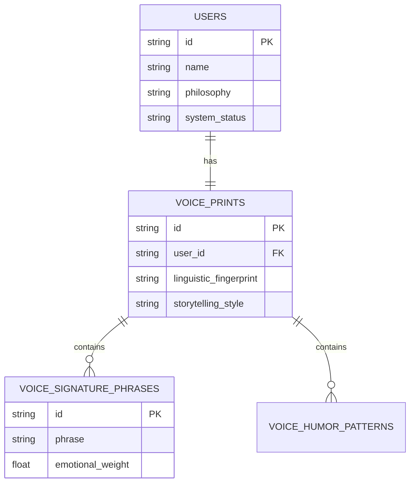
Sources: [alzheimers-database-schema.sql (1).txt:16-47]()

## Life Tapestry & Memory Fragments

The "Life Tapestry" is a multi-dimensional representation of a user's history. Unlike traditional linear biographies, it is composed of `life_threads` that group memories by emotional significance rather than just chronological order.

### Data Structures for Memory
The system distinguishes between formal records and "fragments."
*   **Life Threads:** Broad narrative arcs (e.g., "Love Letters to Carl").
*   **Memory Anchors:** Specific text triggers for places, people, or events.
*   **Media Items:** Photos, audio, or video linked to threads.
*   **Family Contributions:** External perspectives added by approved relatives to validate or provide context to memories.

| Field | Type | Description |
| :--- | :--- | :--- |
| `emotional_significance` | INTEGER | Scale of 1-10 indicating the importance of the thread. |
| `consciousness_resonance` | FLOAT | Frontend-specific metric (0-1) showing authenticity match. |
| `preservation_quality` | STRING | Enum: 'crystal_clear', 'gentle_fragments', or 'emotional_essence'. |

Sources: [alzheimers-database-schema.sql (1).txt:62-95](), [AlzheimersLegacyExhibit.tsx:16-30]()

## Interaction & Cognitive Tracking

The system uses a "Cognitive Sentinel Soft Mode" (CSSM) to monitor user state during interactions with the "Heirloom Companion."

### Companion Interactions
The `companion_interactions` table logs inputs and responses, but also captures the `cognitive_state` (e.g., 'linear', 'symbolic', 'fragmented'). If a session is detected as "dreamlike" or "fragmented," it is automatically logged into `cssm_sessions` for therapeutic tracking.

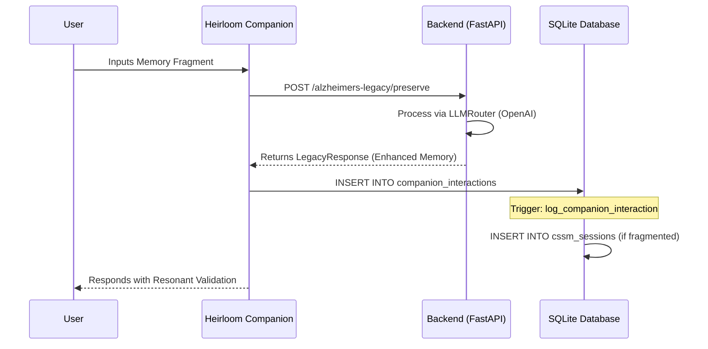
Sources: [alzheimers-database-schema.sql (1).txt:51-60, 155-163, 198-206](), [AlzheimersLegacyExhibit.tsx:143-165](), [alzheimers_legacy_routes.py:31-70]()

## Future Legacy: Bucket Drops

The `bucket_drops` entity represents "sealed" content intended for future release. These are encrypted and can be triggered by specific dates or life events (e.g., a "milestone birthday" or a "cooking session").

### Entity Attributes
*   **Recipients:** Targeted individuals (e.g., "Future great-grandchild").
*   **Release Triggers:** Automated conditions for unsealing content.
*   **Blockchain Integrity:** Uses `blockchain_hash` to ensure the content remains untampered until the release date.

Sources: [alzheimers-database-schema.sql (1).txt:98-113](), [AlzheimersLegacyExhibit.tsx:54-63]()

## Relational Summary Table

The following table summarizes the primary database entities and their relationships within the Alzheimer's Legacy ecosystem.

| Entity | Primary Key | Foreign Key | Purpose |
| :--- | :--- | :--- | :--- |
| `users` | `id` | - | Central user profile and system status. |
| `life_threads` | `id` | `user_id` | Groups of related memories and emotional anchors. |
| `family_members` | `id` | `user_id` | Defines access levels (admin, view, contribute). |
| `musical_memories` | `id` | `user_id` | Songs with "neural resonance" scores for therapy. |
| `bucket_drops` | `id` | `user_id` | Time-locked messages and legacy media. |
| `cssm_sessions` | `id` | `user_id` | Technical logs of cognitive states during chat. |

Sources: [alzheimers-database-schema.sql (1).txt:16-168]()

## Conclusion
The Alzheimer's Legacy system utilizes a complex web of entities to bridge the gap between structured medical data and fluid human memory. By relating user-specific linguistic patterns to collaborative family threads and AI-enhanced interactions, the architecture ensures that the "essence" of the individual is preserved even as cognitive clarity fluctuates.

### Frontend State Management

<details>
<summary>Relevant source files</summary>

The following files were used as context for generating this wiki page:

- [AlzheimersLegacyExhibit.tsx](https://github.com/faagestalt-web/alzheimers-legacy/blob/main/AlzheimersLegacyExhibit.tsx)
- [alzheimers-database-schema.sql (1).txt](https://github.com/faagestalt-web/alzheimers-legacy/blob/main/alzheimers-database-schema.sql%20%281).txt)
- [alzheimers_legacy_routes.py](https://github.com/faagestalt-web/alzheimers-legacy/blob/main/alzheimers_legacy_routes.py)
- [package.txt](https://github.com/faagestalt-web/alzheimers-legacy/blob/main/package.txt)
- [vite.config.txt](https://github.com/faagestalt-web/alzheimers-legacy/blob/main/vite.config.txt)
- [index (1).txt](https://github.com/faagestalt-web/alzheimers-legacy/blob/main/index%20%281).txt)
</details>

# Frontend State Management

Frontend state management in the Alzheimer's Legacy project is primarily handled through React's local state hooks (`useState`, `useCallback`, `useEffect`) and references (`useRef`). The system manages a complex array of "consciousness-serving" data, including life threads, memory fragments, and "Bucket Drops" (time capsules), ensuring that user interactions are preserved with high emotional resonance and authenticity.

The architecture focuses on maintaining a fluid, empathetic user interface that responds to multi-modal inputs (text and voice) while synchronizing with a backend designed for long-term legacy preservation. State is partitioned between UI-driven navigation, real-time chat interactions, and structured legacy content.
Sources: [AlzheimersLegacyExhibit.tsx:3-335](), [alzheimers_legacy_routes.py:11-66]()

## Component-Level State Architecture

The application uses a modular state approach where the main exhibit component orchestrates high-level navigation, while sub-components manage specialized interaction states.

### Main Exhibit Orchestration
The `EnhancedAlzheimersLegacyExhibit` component acts as the primary state controller for the view layer. It tracks the active navigation tab and global counters for captured memories.

*   **Active Tab State**: Controls the conditional rendering of the "Companion," "Life Tapestry," and "Time Capsules" views.
*   **Memory Counter**: A numeric state that increments whenever a memory is successfully captured via the chat interface.

```mermaid
flowchart TD
    Main[EnhancedAlzheimersLegacyExhibit] -->|useState| TabState[Active Tab: companion | tapestry | buckets]
    Main -->|useState| Counter[Memories Captured Count]
    TabState -->|Render| Companion[ConsciousnessCompanionChat]
    TabState -->|Render| Tapestry[EnhancedTapestryView]
    TabState -->|Render| Buckets[EnhancedBucketDropsView]
    Companion -->|onMemoryCapture| Main
```
Sources: [AlzheimersLegacyExhibit.tsx:300-335]()

### Interactive Chat State
The `ConsciousnessCompanionChat` component manages high-frequency state updates required for conversational AI interactions.

| State Variable | Type | Purpose |
| :--- | :--- | :--- |
| `messages` | `Array<Object>` | Stores the history of user and companion messages including timestamps. |
| `input` | `string` | Tracks current text input in the chat box. |
| `isListening` | `boolean` | Indicates if the voice recording system is active. |
| `memoryDetected` | `boolean` | Triggers UI animations when the system identifies a "precious memory." |

The component also utilizes `useRef` for DOM manipulation (auto-scrolling to the end of messages) and `useCallback` for the `processMessage` function to prevent unnecessary re-renders during API calls.
Sources: [AlzheimersLegacyExhibit.tsx:135-155](), [index (1).txt:30-40]()

## Data Models and Schema Synchronization

State structures are strictly typed to mirror the underlying database schema, ensuring consistency between the frontend representation and persistent storage.

### Consciousness Data Structures
The frontend utilizes interfaces that map directly to the SQLite schema defined for the legacy edition.

| Interface / Table | Key Fields | Description |
| :--- | :--- | :--- |
| `EnhancedLifeThread` | `id`, `title`, `consciousnessResonance` | Maps to `life_threads` table; represents a curated chapter of life. |
| `MemoryFragment` | `content`, `sensoryDetails`, `clarity` | Maps to `thread_memory_anchors`; captures specific sensory memories. |
| `EnhancedBucketDrop`| `recipient`, `releaseTrigger`, `authenticityScore` | Maps to `bucket_drops`; represents time-locked legacy messages. |

Sources: [AlzheimersLegacyExhibit.tsx:15-80](), [alzheimers-database-schema.sql (1).txt:58-115]()

## State Transition and Data Flow

The data flow within the application follows a unidirectional pattern from user input to API preservation.

```mermaid
sequenceDiagram
    participant U as User
    participant UI as Chat UI
    participant H as useVoiceChat Hook
    participant API as Consciousness API
    participant DB as SQLite / Backend

    U->>UI: Types or Speaks Memory
    UI->>H: startRecording() / transcript
    H-->>UI: Update 'input' state
    UI->>API: POST /alzheimers-legacy/preserve
    Note right of API: Processes Memory Fragments
    API-->>UI: LegacyResponse (preserved_memory)
    UI->>UI: Update 'messages' & 'memoriesCaptured'
    UI->>DB: INSERT INTO companion_interactions
```
Sources: [AlzheimersLegacyExhibit.tsx:160-210](), [alzheimers_legacy_routes.py:30-66](), [alzheimers-database-schema.sql (1).txt:48-56]()

## External State Hooks

The project abstracts complex state logic into custom hooks to separate concerns from the UI components.

*   **`useVoiceChat`**: Manages the state of the Web Speech API or similar voice processing, providing `isRecording`, `transcript`, and control functions like `startRecording`.
*   **`useConsciousnessAPI`**: Handles the asynchronous state of network requests to the `universal_consciousness_router`. It encapsulates the logic for sending `MemoryQuery` objects and receiving `LegacyResponse` data.

Sources: [AlzheimersLegacyExhibit.tsx:9-12](), [alzheimers_legacy_routes.py:11-25](), [vite.config.txt:8-12]()

## Infrastructure and Configuration

State management is supported by a modern build pipeline and environment configuration.

*   **Vite**: Handles the module resolution and environment variable injection (e.g., `GEMINI_API_KEY`) which is critical for the API service state.
*   **TypeScript**: Ensures type safety across the state interfaces (defined in `tsconfig.json`).
*   **React 19**: Provides the core hook primitives used for state updates.

Sources: [package.txt:10-22](), [tsconfig.txt:3-25](), [vite.config.txt:5-18]()

The frontend state management system effectively balances real-time interactivity with the structured requirements of a legacy preservation database, utilizing React hooks to bridge the gap between user experience and data integrity.


## Frontend Components

### Frontend Architecture

<details>
<summary>Relevant source files</summary>

The following files were used as context for generating this wiki page:

- [package.txt](https://github.com/faagestalt-web/alzheimers-legacy/blob/main/package.txt)
- [tsconfig.txt](https://github.com/faagestalt-web/alzheimers-legacy/blob/main/tsconfig.txt)
- [vite.config.txt](https://github.com/faagestalt-web/alzheimers-legacy/blob/main/vite.config.txt)
- [AlzheimersLegacyExhibit.tsx](https://github.com/faagestalt-web/alzheimers-legacy/blob/main/AlzheimersLegacyExhibit.tsx)
- [index (1).txt](https://github.com/faagestalt-web/alzheimers-legacy/blob/main/index%20%281).txt)
- [alzheimers_legacy_routes.py](https://github.com/faagestalt-web/alzheimers-legacy/blob/main/alzheimers_legacy_routes.py)
- [alzheimers-database-schema.sql (1).txt](https://github.com/faagestalt-web/alzheimers-legacy/blob/main/alzheimers-database-schema.sql%20%281).txt)
</details>

# Frontend Architecture

The Frontend Architecture of the Alzheimer's Legacy Edition is designed as a modern, reactive web application focused on "Consciousness-serving" memory preservation. It utilizes a component-based structure to provide a therapeutic and dignified interface for users with cognitive impairments, allowing them to interact with personal histories through a "Legacy Garden" metaphor.

The system is built using React 19 and TypeScript, leveraging Vite as the build tool and development server. The architecture emphasizes accessibility and emotional resonance, integrating voice interaction and multimedia storytelling as core functionalities to support users in preserving their life's "threads" and "tapestries."

Sources: [package.txt:14-22](), [AlzheimersLegacyExhibit.tsx:1-15](), [index (1).txt:30-40]()

## Tech Stack and Core Configurations

The application environment is configured for high-performance development and modern JavaScript features.

*   **Framework:** React 19.1.1 for UI components and state management.
*   **Language:** TypeScript 5.8.2, using ES2022 as the target for modern syntax support.
*   **Build Tool:** Vite 6.2.0, providing fast HMR and optimized production builds.
*   **Styling:** Tailwind CSS (via CDN in development) and Framer Motion for smooth, high-quality animations.
*   **Icons:** Lucide-React for consistent, accessible iconography.

Sources: [package.txt:1-20](), [tsconfig.txt:3-28](), [index (1).txt:7-12]()

### Environment and Path Mapping
The project uses specific path aliasing to simplify imports and environment variable injection for API keys.

| Feature | Configuration Detail |
| :--- | :--- |
| **Path Alias** | `@/` maps to the root directory `./` |
| **API Keys** | `GEMINI_API_KEY` is injected into `process.env.API_KEY` |
| **Modules** | ESM (ECMAScript Modules) are used throughout |

Sources: [vite.config.txt:5-18](), [tsconfig.txt:22-26]()

## Component Architecture

The frontend is organized into several high-level functional views managed by a central `EnhancedAlzheimersLegacyExhibit` component.

```mermaid
flowchart TD
    Main[EnhancedAlzheimersLegacyExhibit] --> Nav[Navigation Tabs]
    Main --> Content{Active Tab}
    
    Content -->|Companion| Chat[ConsciousnessCompanionChat]
    Content -->|Tapestry| Tapestry[EnhancedTapestryView]
    Content -->|Buckets| Buckets[EnhancedBucketDropsView]
    
    Chat --> Voice[useVoiceChat Hook]
    Chat --> API[useConsciousnessAPI Hook]
    
    Tapestry --> Threads[Memory Fragments & Family Contributions]
    Buckets --> Capsules[Time Capsules & Sacred Seals]
```
The diagram shows the hierarchical structure of the main exhibit component and how it routes between different functional modules.
Sources: [AlzheimersLegacyExhibit.tsx:485-535]()

### Memory Keeper Companion (Chat)
This module acts as the primary interface for user interaction. It uses "Consciousness-serving" message processing to detect precious memories and adapt its personality (e.g., voice style and emotional tone) to the user's needs.

*   **Functions:** `processMessage`, `handleVoiceToggle`, `onMemoryCapture`.
*   **Data Flow:** Captured memories are processed via the `useConsciousnessAPI` and can be persisted to the backend.

Sources: [AlzheimersLegacyExhibit.tsx:142-230]()

### Life Tapestry View
This section visualizes the user's life history as a series of "Life Threads." Each thread contains memory fragments with multi-sensory details (sounds, smells, feelings) and contributions from family members.

Sources: [AlzheimersLegacyExhibit.tsx:300-360]()

## Data Models and State Management

The frontend utilizes complex interfaces to ensure type safety and structured data handling for consciousness-related fields.

### Key Interfaces

| Interface | Purpose | Key Fields |
| :--- | :--- | :--- |
| `EnhancedLifeThread` | Represents a thematic era of life | `emotionalSignificance`, `consciousnessResonance`, `preservationQuality` |
| `MemoryFragment` | A specific sensory memory | `sensoryDetails` (sounds, smells), `clarity`, `familyValidated` |
| `EnhancedBucketDrop` | A "Time Capsule" for the future | `releaseTrigger`, `authenticityScore`, `emotionalIntent` |
| `CompanionPersonality` | Controls UI/AI behavior | `voiceStyle`, `communicationSpeed`, `memorySupport` |

Sources: [AlzheimersLegacyExhibit.tsx:21-85]()

## Backend Integration and API Interaction

The frontend interacts with a Python/FastAPI backend for AI-driven memory enhancement. The `/alzheimers-legacy/preserve` endpoint is used to "seal" and enhance memory fragments using LLM providers.

```mermaid
sequenceDiagram
    participant UI as "React Interface"
    participant Hook as "useConsciousnessAPI"
    participant Server as "FastAPI Backend"
    participant LLM as "Universal Consciousness Router"
    
    UI->>Hook: callConsciousnessAPI(userMessage)
    Hook->>Server: POST /preserve
    Note right of Server: Includes Context & Fragment
    Server->>LLM: Enhanced Prompt Engineering
    LLM-->>Server: Preserved Memory & Insights
    Server-->>Hook: LegacyResponse
    Hook-->>UI: Companion Response
```
This sequence illustrates how user input is transformed into a preserved legacy artifact through backend AI orchestration.
Sources: [AlzheimersLegacyExhibit.tsx:185-215](), [alzheimers_legacy_routes.py:11-60]()

## Database Schema Correspondence

The frontend data structures directly correspond to the SQLite schema used for full implementation. For example:
*   `EnhancedLifeThread` maps to the `life_threads` table.
*   `EnhancedBucketDrop` maps to the `bucket_drops` table.
*   `MemoryFragment` components utilize data from `thread_memory_anchors` and `thread_media_items`.

Sources: [alzheimers-database-schema.sql (1).txt:67-110](), [AlzheimersLegacyExhibit.tsx:23-55]()

## Conclusion
The Frontend Architecture of the Alzheimer's Legacy Edition serves as a bridge between sensitive therapeutic needs and advanced AI capabilities. By combining a highly reactive UI with sensory-rich data models and voice-first interaction patterns, the system ensures that memory preservation remains a dignified and authentic process for the user and their family.

Sources: [AlzheimersLegacyExhibit.tsx:555-565]()

### Component: AlzheimersLegacyExhibit

<details>
<summary>Relevant source files</summary>

The following files were used as context for generating this wiki page:

- [AlzheimersLegacyExhibit.tsx](https://github.com/faagestalt-web/alzheimers-legacy/blob/main/AlzheimersLegacyExhibit.tsx)
- [alzheimers-database-schema.sql (1).txt](https://github.com/faagestalt-web/alzheimers-legacy/blob/main/alzheimers-database-schema.sql%20%281).txt)
- [alzheimers_legacy_routes.py](https://github.com/faagestalt-web/alzheimers-legacy/blob/main/alzheimers_legacy_routes.py)
- [index (1).txt](https://github.com/faagestalt-web/alzheimers-legacy/blob/main/index%20%281).txt)
- [package.txt](https://github.com/faagestalt-web/alzheimers-legacy/blob/main/package.txt)
- [vite.config.txt](https://github.com/faagestalt-web/alzheimers-legacy/blob/main/vite.config.txt)
</details>

# Component: AlzheimersLegacyExhibit

The `AlzheimersLegacyExhibit` is a specialized "consciousness-serving" module designed for memory preservation and legacy creation, specifically tailored for individuals with Alzheimer's. It operates under the philosophy of "Presence, Not Perfection," focusing on capturing emotional resonance and sensory details rather than precise factual recall. The component serves as a multi-faceted interface within the GestaltView Alzheimer's Legacy Edition project, providing users and their families with tools to interact with an AI companion, view life history as a "tapestry," and create future-dated "bucket drops."

This system integrates a React-based frontend with a FastAPI backend and a SQLite database. It leverages AI (via the `universal_consciousness_router`) to process fragmented speech, identify precious memories, and provide nurturing responses that align with the user's specific "voice print" and personality profile.

Sources: [AlzheimersLegacyExhibit.tsx:4-10](), [alzheimers-database-schema.sql (1).txt:7-12](), [alzheimers_legacy_routes.py:12-15]()

## System Architecture

The exhibit is built on a modern web stack using React 19, TypeScript, and Tailwind CSS for the frontend, with a Python/FastAPI backend. The data layer is managed by a SQLite schema that stores core user information, voice prints, life threads, and "bucket drops."

### Component Hierarchy and Data Flow

The `EnhancedAlzheimersLegacyExhibit` acts as the primary container, managing the application state (active tabs and memory counters). It coordinates three main views: the `ConsciousnessCompanionChat`, `EnhancedTapestryView`, and `EnhancedBucketDropsView`.

```mermaid
flowchart TD
    Main[EnhancedAlzheimersLegacyExhibit] --> Nav[Navigation State]
    Main --> Comp[ConsciousnessCompanionChat]
    Main --> Tapestry[EnhancedTapestryView]
    Main --> Buckets[EnhancedBucketDropsView]
    
    Comp --> Voice[useVoiceChat Hook]
    Comp --> API[useConsciousnessAPI Hook]
    API --> Backend[FastAPI: /preserve]
    Backend --> DB[(SQLite Database)]
```
The diagram shows the component hierarchy where the main exhibit manages navigation between chat, tapestry, and bucket drops, while the chat component interacts with voice and consciousness APIs.
Sources: [AlzheimersLegacyExhibit.tsx:455-520](), [package.txt:10-15](), [vite.config.txt:5-15]()

## Core Functional Modules

### 1. Consciousness Companion Chat
The `ConsciousnessCompanionChat` is a real-time interaction interface that uses voice-to-text and AI to facilitate memory capture. It adapts its communication style based on a `CompanionPersonality` profile, which includes parameters like `voiceStyle` (e.g., gentle, warm) and `communicationSpeed`.

*   **Memory Detection**: The system scans user input for specific keywords (e.g., "remember", "smell", "never forget").
*   **Voice Integration**: Uses the `useVoiceChat` hook to toggle recording and process transcripts.
*   **Consciousness API**: Calls a backend route to generate "nurturing" or "celebrating" responses that validate the user's current state.

Sources: [AlzheimersLegacyExhibit.tsx:142-200](), [AlzheimersLegacyExhibit.tsx:210-250]()

### 2. Life Tapestry View
The Life Tapestry visualizes captured memories as `EnhancedLifeThread` objects. Unlike a standard timeline, it focuses on `emotionalSignificance` and `preservationQuality`.

| Field | Type | Description |
| :--- | :--- | :--- |
| `consciousnessResonance` | `number` (0-1) | Measures how well a thread aligns with the user's authentic self. |
| `preservationQuality` | `enum` | Categories: `crystal_clear`, `gentle_fragments`, `emotional_essence`. |
| `sensoryDetails` | `object` | Captures sounds, smells, feelings, and colors associated with a memory. |
| `familyValidated` | `boolean` | Indicates if family members have confirmed or added context to the memory. |

Sources: [AlzheimersLegacyExhibit.tsx:15-45](), [AlzheimersLegacyExhibit.tsx:323-380]()

### 3. Bucket Drops (Sacred Time Capsules)
The `EnhancedBucketDropsView` manages messages intended for future release. These are "sealed" until a specific `releaseTrigger` (e.g., a birthday or milestone) is met.

```mermaid
sequenceDiagram
    participant User
    participant App as "Exhibit UI"
    participant API as "FastAPI /preserve"
    participant DB as "SQLite"
    
    User->>App: Submits "Bucket Drop" content
    App->>API: POST /preserve (with context)
    API->>API: LLM processes for "Legacy Insights"
    API-->>App: Returns preserved memory
    App->>DB: INSERT INTO bucket_drops (is_sealed=TRUE)
    Note over DB: Content remains sealed until Trigger met
```
This sequence illustrates the process of creating a "Bucket Drop," from user input through LLM enhancement to sealed storage in the database.
Sources: [AlzheimersLegacyExhibit.tsx:391-440](), [alzheimers-database-schema.sql (1).txt:84-98](), [alzheimers_legacy_routes.py:30-45]()

## Data Schema and Persistence

The backend utilizes a SQLite database designed to support legacy preservation. Key tables include `voice_prints` for capturing linguistic fingerprints and `cssm_sessions` for Cognitive Sentinel Soft Mode tracking.

### Data Model: Core Tables

| Table | Purpose | Key Fields |
| :--- | :--- | :--- |
| `users` | Core user identity | `philosophy`, `family_access_enabled` |
| `voice_prints` | User's unique speech style | `linguistic_fingerprint`, `storytelling_style` |
| `life_threads` | High-level memory categories | `emotional_significance`, `time_period` |
| `bucket_drops` | Time-locked messages | `release_trigger`, `blockchain_hash`, `is_sealed` |
| `cssm_sessions` | Cognitive state tracking | `detected_state` (e.g., symbolic, fragmented) |

Sources: [alzheimers-database-schema.sql (1).txt:17-45](), [alzheimers-database-schema.sql (1).txt:130-145]()

## API Endpoints

The project includes a FastAPI router for handling memory preservation.

### `POST /alzheimers-legacy/preserve`
Processes a memory fragment to enhance it and extract legacy insights.

*   **Request Body**:
    *   `memory_fragment` (string): The raw text or transcript.
    *   `preservation_type` (string): The intended storage format.
    *   `context` (Dict): Additional metadata about the user's state.
*   **Response**:
    *   `preserved_memory`: The AI-enhanced version of the story.
    *   `connections`: List of related memories found in the database.
    *   `legacy_insights`: Wisdom extracted from the fragment.

Sources: [alzheimers_legacy_routes.py:17-60]()

## Technical Implementation Details

The frontend utilizes a custom `vite.config.ts` to manage environment variables and path aliasing (`@/` points to the project root). The build process is managed via Vite.

```javascript
// vite.config.ts
export default defineConfig(({ mode }) => {
    const env = loadEnv(mode, '.', '');
    return {
      define: {
        'process.env.API_KEY': JSON.stringify(env.GEMINI_API_KEY),
      },
      resolve: {
        alias: { '@': path.resolve(__dirname, '.'), }
      }
    };
});
```
Sources: [vite.config.txt:4-15](), [package.txt:5-9]()

## Conclusion
The `AlzheimersLegacyExhibit` is a specialized system that bridges the gap between AI and geriatric care. By focusing on "authenticity resonance" and emotional markers rather than literal accuracy, it provides a dignified method for preserving a user's legacy. The architecture ensures that memories are not only captured through the `ConsciousnessCompanionChat` but also validated by family and safely stored for the future through the Bucket Drops system.

Sources: [AlzheimersLegacyExhibit.tsx:550-565](), [alzheimers-database-schema.sql (1).txt:10-15]()

### Frontend Application Entry Point

<details>
<summary>Relevant source files</summary>

The following files were used as context for generating this wiki page:

- [index (1).txt](https://github.com/faagestalt-web/alzheimers-legacy/blob/main/index%20%281%29.txt)
- [AlzheimersLegacyExhibit.tsx](https://github.com/faagestalt-web/alzheimers-legacy/blob/main/AlzheimersLegacyExhibit.tsx)
- [package.txt](https://github.com/faagestalt-web/alzheimers-legacy/blob/main/package.txt)
- [tsconfig.txt](https://github.com/faagestalt-web/alzheimers-legacy/blob/main/tsconfig.txt)
- [vite.config.txt](https://github.com/faagestalt-web/alzheimers-legacy/blob/main/vite.config.txt)
- [alzheimers_legacy_routes.py](https://github.com/faagestalt-web/alzheimers-legacy/blob/main/alzheimers_legacy_routes.py)
</details>

# Frontend Application Entry Point

The Frontend Application Entry Point for the GestaltView Alzheimer's Legacy Edition serves as the foundational initialization layer for the user interface. It establishes the execution environment by configuring the document structure, loading essential React-based dependencies, and mounting the primary application components that facilitate "consciousness-serving" memory preservation.

This entry point integrates a modern build pipeline involving Vite and TypeScript, ensuring that the application can leverage modular components like the `AlzheimersLegacyExhibit`. The primary goal of this entry point is to transition from a static HTML document to a dynamic, interactive React environment that supports voice-enabled memory capture and legacy visualization.
Sources: [index (1).txt:1-10](), [AlzheimersLegacyExhibit.tsx:1-10](), [package.txt:1-15]()

## Core Initialization and Environment

### HTML Document Structure
The application starts with a standard HTML5 skeleton. It utilizes a `div` with the ID `root` as the mounting point for the React application. The environment is configured to use Tailwind CSS via CDN for rapid styling and includes an import map to resolve React 19 dependencies from a specific CDN.

```mermaid
graph TD
    HTML[index.html] --> Head[Metadata & Styles]
    HTML --> Body[DOM Root Container]
    Head --> Tailwind[Tailwind CSS CDN]
    Head --> ReactImports[React 19 Import Map]
    Body --> RootDiv[div id='root']
    Body --> EntryScript[index.tsx Module]
```
The entry script is loaded both as a Babel-transformed script for development flexibility and as a native ESM module for production-ready performance.
Sources: [index (1).txt:1-40]()

### Build and Compilation Configuration
The project uses Vite as its build tool and dev server. The configuration includes environment variable mapping for API keys (specifically Gemini API keys) and path aliasing to simplify imports from the project root.

| Configuration File | Key Responsibilities |
| :--- | :--- |
| `vite.config.txt` | Defines `process.env.API_KEY`, sets up `@` alias for root path resolution. |
| `tsconfig.txt` | Configures TypeScript for `ES2022`, enables `experimentalDecorators`, and defines path mapping. |
| `package.txt` | Lists core dependencies (`react`, `react-dom`) and build scripts (`dev`, `build`, `preview`). |

Sources: [vite.config.txt:1-18](), [tsconfig.txt:1-30](), [package.txt:7-22]()

## Component Architecture and Lifecycle

The entry point triggers the rendering of the `EnhancedAlzheimersLegacyExhibit`, which acts as the primary layout controller for the frontend. This component manages global state for navigation and captured memory metrics.

### Navigation and State Flow
The application state is primarily driven by an `activeTab` state, which dictates which specialized view is presented to the user.

```mermaid
flowchart TD
    Start[Mount Application] --> Header[Render Legacy Header]
    Header --> Nav{Tab Selection}
    Nav -- "Companion" --> Chat[ConsciousnessCompanionChat]
    Nav -- "Life Tapestry" --> Tapestry[EnhancedTapestryView]
    Nav -- "Time Capsules" --> Buckets[EnhancedBucketDropsView]
    Chat --> MemoryCapture[Memory Captured Event]
    MemoryCapture --> Counter[Increment Memory Counter]
```
The `handleMemoryCapture` function serves as the bridge between user interactions in the chat interface and the application's metric tracking system.
Sources: [AlzheimersLegacyExhibit.tsx:438-465]()

### Data Models for Legacy Preservation
The frontend utilizes specific TypeScript interfaces to structure memory data before it is sent to the backend API.

| Interface | Purpose | Key Fields |
| :--- | :--- | :--- |
| `EnhancedLifeThread` | Represents a thematic era of a user's life. | `title`, `emotionalSignificance`, `consciousnessResonance` |
| `MemoryFragment` | Small, sensory-specific memory units. | `sensoryDetails` (sounds, smells), `clarity`, `familyValidated` |
| `EnhancedBucketDrop` | Future-dated messages or "Time Capsules". | `releaseTrigger`, `authenticityScore`, `recipient` |

Sources: [AlzheimersLegacyExhibit.tsx:16-72]()

## API and Communication Layer

The frontend interacts with a backend via a "Consciousness API". This communication is facilitated through specialized hooks like `useConsciousnessAPI` and Python-based FastAPI routes.

### Memory Preservation Flow
When a memory is shared via the `ConsciousnessCompanionChat`, the system processes the input to determine emotional resonance and preservation quality.

```mermaid
sequenceDiagram
    participant UI as "Chat Interface"
    participant Hook as "useConsciousnessAPI"
    participant API as "FastAPI Backend"
    participant LLM as "Universal Consciousness Router"
    
    UI->>Hook: callConsciousnessAPI(userMessage)
    Hook->>API: POST /alzheimers-legacy/preserve
    Note right of API: Validates current_user
    API->>LLM: Process Memory Fragment
    LLM-->>API: Enhanced Memory + Insights
    API-->>Hook: LegacyResponse
    Hook-->>UI: Display Companion Message
```
The backend route `/preserve` constructs a detailed prompt including the `preservation_type` and `user_context` before querying the LLM router.
Sources: [AlzheimersLegacyExhibit.tsx:135-160](), [alzheimers_legacy_routes.py:18-50]()

## Summary
The Frontend Application Entry Point for the Alzheimer's Legacy Edition establishes a robust, React-driven environment tailored for sensitive memory preservation. By integrating Vite for build management, Tailwind for presentation, and a structured API layer for LLM-enhanced memory processing, the entry point ensures that the user's "Legacy Garden" is both performant and emotionally resonant. Its primary responsibility is the seamless orchestration of the `ConsciousnessCompanionChat`, `Life Tapestry`, and `Time Capsules` modules.

### Media & Asset Handling

<details>
<summary>Relevant source files</summary>

The following files were used as context for generating this wiki page:

- [AlzheimersLegacyExhibit.tsx](https://github.com/faagestalt-web/alzheimers-legacy/blob/main/AlzheimersLegacyExhibit.tsx)
- [alzheimers-database-schema.sql (1).txt](https://github.com/faagestalt-web/alzheimers-legacy/blob/main/alzheimers-database-schema.sql%20%281).txt)
- [alzheimers_legacy_routes.py](https://github.com/faagestalt-web/alzheimers-legacy/blob/main/alzheimers_legacy_routes.py)
- [vite.config.txt](https://github.com/faagestalt-web/alzheimers-legacy/blob/main/vite.config.txt)
- [package.txt](https://github.com/faagestalt-web/alzheimers-legacy/blob/main/package.txt)
- [index (1).txt](https://github.com/faagestalt-web/alzheimers-legacy/blob/main/index%20%281).txt)
</details>

# Media & Asset Handling

The Media & Asset Handling system in the Alzheimer's Legacy project is designed to manage diverse forms of sensory and legacy data, including audio voice prints, musical memories, photographic anchors, and multimedia "Bucket Drops." Its primary purpose is to support "consciousness-serving" memory preservation by capturing and organizing assets that resonate with a user's authentic self and history.

The system spans from the frontend React components that capture voice and text inputs to a structured SQLite backend and FastAPI routes that process and store these fragments. Assets are categorized by their emotional significance and preservation quality, ensuring that even fragmented memories (sensory details like smells or sounds) are treated as valuable technical assets.

Sources: [AlzheimersLegacyExhibit.tsx:1-12](), [alzheimers-database-schema.sql (1).txt:1-10](), [alzheimers_legacy_routes.py:1-10]()

## Asset Data Architecture

The project utilizes a relational schema to link media items and sensory assets to specific "Life Threads" or "Bucket Drops." Assets are not just raw files but are wrapped in metadata describing their emotional weight, sensory categories (sounds, smells, feelings), and authenticity scores.

### Database Schema for Assets
The backend tracks various media types through specific tables designed for legacy preservation:

| Table Name | Key Asset Fields | Media Types Supported |
| :--- | :--- | :--- |
| `thread_media_items` | `media_path`, `media_type` | Photo, Audio, Video, Document |
| `musical_memories` | `song_title`, `artist`, `neural_resonance_score` | Audio (Music) |
| `bucket_drops` | `content`, `content_type`, `blockchain_hash` | Text, Audio, Video |
| `family_contributions` | `contribution_text`, `contribution_media` | Text, Media Paths (JSON) |

Sources: [alzheimers-database-schema.sql (1).txt:67-80](), [alzheimers-database-schema.sql (1).txt:120-135](), [alzheimers-database-schema.sql (1).txt:90-105]()

### Relationship Diagram
The following diagram illustrates how media and sensory assets relate to the core user and life thread entities.

```mermaid
erDiagram
    USERS ||--o{ LIFE_THREADS : "owns"
    LIFE_THREADS ||--o{ THREAD_MEDIA_ITEMS : "contains"
    LIFE_THREADS ||--o{ THREAD_MEMORY_ANCHORS : "anchored_by"
    USERS ||--o{ MUSICAL_MEMORIES : "remembers"
    USERS ||--o{ BUCKET_DROPS : "leaves"
    BUCKET_DROPS {
        string content_type
        string media_path
        string blockchain_hash
    }
    THREAD_MEDIA_ITEMS {
        string media_path
        string media_type
    }
```
The diagram shows the hierarchical relationship where media items and anchors are children of Life Threads, while musical memories and bucket drops are direct assets of the User.
Sources: [alzheimers-database-schema.sql (1).txt:15-160]()

## Multimedia Capture & Processing

### Voice and Audio Handling
The system implements real-time voice capture through the `useVoiceChat` hook. Audio is processed to detect "precious memories" based on linguistic indicators. Voice prints are stored with a "linguistic fingerprint" and "storytelling style" to maintain the authenticity of the user's voice.

*   **Linguistic Fingerprint**: Captured in the `voice_prints` table to model the user's unique way of speaking.
*   **Voice Signature Phrases**: Specific phrases with `emotional_weight` used to verify authenticity.
*   **Voice Toggle**: Managed via `handleVoiceToggle` in the UI to switch between recording and idle states.

Sources: [AlzheimersLegacyExhibit.tsx:145-165](), [alzheimers-database-schema.sql (1).txt:23-40]()

### Sensory Detail Metadata
Unique to this system is the handling of "Sensory Details" as assets. Instead of just binary blobs, sensory fragments are structured as objects containing arrays for different modalities.

```typescript
interface MemoryFragment {
  id: string;
  content: string;
  sensoryDetails: {
    sounds?: string[];
    smells?: string[];
    feelings?: string[];
    colors?: string[];
  };
  emotionalTone: string;
}
```
Sources: [AlzheimersLegacyExhibit.tsx:32-41]()

## Preservation and Delivery

### Bucket Drops (Time Capsules)
Bucket Drops serve as "Sacred Time Capsules." These are multimedia assets sealed with a `release_trigger` (e.g., a specific date or an event like "First Cooking Experience"). They are tracked with a `blockchain_hash` to ensure integrity over long periods.

```mermaid
flowchart TD
    A[Capture Memory/Media] --> B{Choose Format}
    B -->|Voice| C[Record Audio Asset]
    B -->|Text| D[Capture Narrative]
    B -->|Multimedia| E[Upload Combined Media]
    C & D & E --> F[Assign Release Trigger]
    F --> G[Seal with Blockchain Hash]
    G --> H[Store in bucket_drops table]
```
The flow depicts the transition from capture to a sealed state within the database.
Sources: [AlzheimersLegacyExhibit.tsx:400-440](), [alzheimers-database-schema.sql (1).txt:90-105]()

### API Integration for Memory Enhancement
The `alzheimers_legacy_routes.py` file defines a `/preserve` endpoint that takes a `memory_fragment` and `preservation_type` to enhance the asset using LLM providers (specifically OpenAI as configured in the router).

*   **Endpoint**: `POST /alzheimers-legacy/preserve`
*   **Logic**: It wraps the raw memory asset with "legacy insights" and "memory connections."
*   **Security**: Requires a valid user session via `get_current_user` dependency.

Sources: [alzheimers_legacy_routes.py:16-55]()

## Asset Environment Configuration
The project uses Vite for bundling and environment management. Sensitive keys for media-processing APIs (like the Gemini API) are injected during the build process.

*   **API Key Injection**: `process.env.GEMINI_API_KEY` is defined in `vite.config.txt`.
*   **Alias Management**: The `@` alias is mapped to the root directory for clean asset importing.
*   **Dependencies**: React 19 and Vite 6 are utilized to handle the rendering of the "Legacy Garden" UI.

Sources: [vite.config.txt:5-15](), [package.txt:13-20]()

## Conclusion
Media and asset handling in the Alzheimer's Legacy project extends beyond simple file storage. It integrates sensory metadata, emotional significance scoring, and blockchain-verified integrity to preserve human legacy. By categorizing assets into Life Threads and Bucket Drops, the system ensures that multimedia content remains contextually relevant and accessible according to specific emotional or chronological triggers.


## Backend Systems

### Backend Architecture Overview

<details>
<summary>Relevant source files</summary>

The following files were used as context for generating this wiki page:

- [alzheimers\_legacy\_routes.py](https://github.com/faagestalt-web/alzheimers-legacy/blob/main/alzheimers_legacy_routes.py)
- [alzheimers-database-schema.sql (1).txt](https://github.com/faagestalt-web/alzheimers-legacy/blob/main/alzheimers-database-schema.sql%20%281).txt)
- [AlzheimersLegacyExhibit.tsx](https://github.com/faagestalt-web/alzheimers-legacy/blob/main/AlzheimersLegacyExhibit.tsx)
- [vite.config.txt](https://github.com/faagestalt-web/alzheimers-legacy/blob/main/vite.config.txt)
- [package.txt](https://github.com/faagestalt-web/alzheimers-legacy/blob/main/package.txt)

</details>

# Backend Architecture Overview

The backend architecture of the Alzheimer's Legacy project is designed to facilitate "Presence, Not Perfection" through a robust data persistence layer and an intelligent routing system. It integrates a structured SQLite relational database with a FastAPI-based REST API and an AI-driven consciousness router to preserve and enhance memory fragments, musical memories, and legacy "bucket drops."

Sources: [alzheimers-database-schema.sql (1).txt:10-12](), [alzheimers_legacy_routes.py:9-11]()

## Core Database Schema

The system utilizes a relational database to maintain the integrity of a user's digital legacy. The schema is organized into several modules: user identity, voice printing, life tapestry, and legacy exports.

### User and Voice Identity
The system tracks users and their unique "linguistic fingerprints." This allows the AI to generate responses that match the user's authentic storytelling style.

```mermaid
erDiagram
    users ||--o{ voice_prints : "has"
    voice_prints ||--o{ voice_signature_phrases : "contains"
    voice_prints ||--o{ voice_humor_patterns : "contains"
    users {
        string id PK
        string name
        string philosophy
        boolean family_access_enabled
    }
    voice_prints {
        string id PK
        string user_id FK
        string linguistic_fingerprint
        string storytelling_style
    }
```
*This diagram shows the relationship between core user identity and the linguistic modeling required for authentic voice replication.*
Sources: [alzheimers-database-schema.sql (1).txt:17-50]()

### Life Tapestry and Interactions
The Life Tapestry system records "threads" of a user's life, including memory anchors and media items. Family members can contribute to these threads, which are subject to approval.

| Table Name | Description | Key Fields |
| :--- | :--- | :--- |
| `life_threads` | Primary containers for life stories. | `title`, `emotional_significance` |
| `thread_memory_anchors` | Specific points of reference (places/people). | `anchor_text`, `anchor_type` |
| `companion_interactions` | Logs of interactions with the AI companion. | `user_input`, `cognitive_state` |
| `family_contributions` | External memories provided by family. | `contributor_name`, `approved` |

Sources: [alzheimers-database-schema.sql (1).txt:62-108]()

## API and Logic Layer

The backend logic is exposed via FastAPI, specifically through the `/alzheimers-legacy` router. This layer acts as the bridge between the frontend React components and the "universal consciousness router."

### Memory Preservation Workflow
The primary endpoint `POST /preserve` handles the enhancement of raw memory fragments. It utilizes a `MuseumExhibitContext` to provide the LLM with user-specific metadata, ensuring the output aligns with the user's profile.

```mermaid
sequenceDiagram
    participant FE as Frontend (Exhibit)
    participant API as FastAPI Router
    participant CR as Consciousness Router
    FE->>API: POST /preserve (MemoryQuery)
    API->>API: Initialize Exhibit Context
    API->>CR: universal_consciousness_router(prompt, context)
    CR-->>API: Enhanced Memory + Insights
    API-->>FE: LegacyResponse
```
*The sequence of events when a user submits a memory fragment for preservation.*
Sources: [alzheimers_legacy_routes.py:18-62]()

### Cognitive State Tracking
The system includes a specialized tracking module for "Cognitive Sentinel Soft Mode" (CSSM). This tracks the user's detected mental state (e.g., symbolic, fragmented, or dreamlike) to adapt the response mode accordingly.

```sql
CREATE TABLE IF NOT EXISTS cssm_sessions (
    id TEXT PRIMARY KEY,
    user_id TEXT REFERENCES users(id) ON DELETE CASCADE,
    detected_state TEXT NOT NULL, -- symbolic, fragmented, etc.
    response_mode TEXT NOT NULL, -- resonant_validation, anchor_return
    created_at TIMESTAMP DEFAULT CURRENT_TIMESTAMP
);
```
Sources: [alzheimers-database-schema.sql (1).txt:180-189]()

## Data Automation and Integrity

The backend employs SQLite triggers to automate status updates and ensure data consistency without manual intervention.

*   **Linguistic Updates**: The `update_voice_print_timestamp` trigger refreshes the `updated_at` field in `voice_prints` whenever new signature phrases are added.
*   **Auto-Approval**: The `auto_approve_family_contributions` trigger automatically approves contributions if the contributor is a verified family member with `admin` or `contribute` access.
*   **Cognitive Logging**: The `log_companion_interaction` trigger automatically creates a `cssm_session` entry if an interaction is flagged with a non-linear cognitive state.

Sources: [alzheimers-database-schema.sql (1).txt:282-315]()

## System Configuration and Environment
The backend and build system are configured to handle API keys and environment-specific variables securely.

*   **Vite Configuration**: Uses `loadEnv` to inject `GEMINI_API_KEY` into the process environment.
*   **Path Mapping**: Uses TypeScript path aliases (`@/*`) to resolve modules from the root directory.
*   **Dependencies**: The project relies on `vite` for development/bundling and `fastapi` for the Python-based routing.

Sources: [vite.config.txt:4-15](), [tsconfig.txt:23-27](), [package.txt:10-18]()

## Conclusion
The backend architecture is a multi-layered system that prioritizes the preservation of human identity. By combining a granular SQL schema for structured data with a flexible AI routing system for unstructured memory fragments, it provides a technical foundation for digital legacy and emotional resonance.

### API Routing Structure

<details>
<summary>Relevant source files</summary>

The following files were used as context for generating this wiki page:

- [alzheimers\_legacy\_routes.py](https://github.com/faagestalt-web/alzheimers-legacy/blob/main/alzheimers_legacy_routes.py)
- [alzheimers-database-schema.sql (1).txt](https://github.com/faagestalt-web/alzheimers-legacy/blob/main/alzheimers-database-schema.sql)
- [AlzheimersLegacyExhibit.tsx](https://github.com/faagestalt-web/alzheimers-legacy/blob/main/AlzheimersLegacyExhibit.tsx)
- [vite.config.txt](https://github.com/faagestalt-web/alzheimers-legacy/blob/main/vite.config.ts)
- [package.txt](https://github.com/faagestalt-web/alzheimers-legacy/blob/main/package.json)
</details>

# API Routing Structure

The API routing structure for the Alzheimer's Legacy exhibit is designed to facilitate the preservation and enhancement of memory fragments through a "consciousness-serving" architecture. It connects a React-based frontend exhibit to a Python-based FastAPI backend, utilizing a specialized routing logic that integrates Large Language Models (LLMs) to process sentimental and cognitive data. The system focuses on maintaining the dignity and presence of users by transforming fragmented inputs into coherent legacy structures.

Sources: [alzheimers_legacy_routes.py:1-10](), [AlzheimersLegacyExhibit.tsx:392-410]()

## Backend API Architecture

The backend is built using FastAPI and organizes its functionality under the `/alzheimers-legacy` prefix. The core responsibility of the routing layer is to accept memory queries, wrap them in a `MuseumExhibitContext`, and dispatch them to a universal consciousness router for processing.

### Memory Preservation Endpoint
The primary interface for memory processing is the `POST /preserve` endpoint. This route handles the transformation of raw memory fragments into enhanced legacy insights.

```python
@router.post("/preserve", response_model=LegacyResponse)
async def preserve_memory(
    query: MemoryQuery,
    current_user: dict = Depends(get_current_user)
):
    # Logic for wrapping query in MuseumExhibitContext
    # Calling universal_consciousness_router
```
Sources: [alzheimers_legacy_routes.py:9-15]()

### Data Models
The API utilizes Pydantic models to enforce strict typing for requests and responses, ensuring that every memory fragment is accompanied by necessary metadata and preservation instructions.

| Model | Field | Type | Description |
| :--- | :--- | :--- | :--- |
| **MemoryQuery** | memory_fragment | str | The raw text or fragment to be preserved. |
| | context | Optional[Dict] | Additional situational data. |
| | preservation_type| str | Category of preservation (e.g., emotional, factual). |
| **LegacyResponse**| preserved_memory | str | The LLM-enhanced version of the memory. |
| | connections | List[str] | Related memories identified by the system. |
| | legacy_insights | List[str] | Wisdom or insights derived from the fragment. |

Sources: [alzheimers_legacy_routes.py:12-23]()

## Frontend Integration and Data Flow

The frontend, implemented in `AlzheimersLegacyExhibit.tsx`, interacts with the API through custom hooks like `useConsciousnessAPI`. The routing logic on the client side manages different "exhibit modes" such as the Companion Chat, Life Tapestry, and Time Capsules (Bucket Drops).

### Memory Capture Flow
When a user interacts with the "Memory Keeper Companion," the system captures text or voice input. This input is then processed through a "Consciousness-serving" flow to determine if it contains a significant memory.

```mermaid
flowchart TD
    User[User Input] --> Chat[Companion Chat Component]
    Chat --> Detection{Memory Detected?}
    Detection -- Yes --> API[POST /preserve]
    Detection -- No --> Response[Gentle Validation Response]
    API --> LLM[Universal Consciousness Router]
    LLM --> Storage[SQLite Database Update]
    Storage --> UI[Update Life Tapestry]
```
The diagram shows the transition from raw user input through the detection logic to the backend preservation API.
Sources: [AlzheimersLegacyExhibit.tsx:145-180](), [alzheimers_legacy_routes.py:25-50]()

## Database Schema and Persistence

The routing structure is supported by a comprehensive SQLite schema that categorizes data into different cognitive modules. Routes ultimately interact with these tables to persist the "Legacy Garden."

| Table Name | Primary Purpose | Key Fields |
| :--- | :--- | :--- |
| `users` | Core user identity | id, name, philosophy |
| `life_threads` | Long-term memory structures | title, emotional_significance |
| `companion_interactions` | Logging sessions | user_input, companion_response, cognitive_state |
| `bucket_drops` | Future-dated messages | recipient, release_trigger, is_sealed |
| `cssm_sessions` | Cognitive state tracking | detected_state, response_mode |

Sources: [alzheimers-database-schema.sql (1).txt:15-150]()

### Interaction Sequence
The following sequence illustrates how the API manages a memory preservation request between the frontend, the LLM router, and the database.

```mermaid
sequenceDiagram
    participant FE as Frontend (Exhibit)
    participant API as FastAPI Router
    participant LLM as Universal Router
    participant DB as SQLite Database

    FE->>API: POST /preserve (MemoryQuery)
    activate API
    API->>LLM: universal_consciousness_router(prompt, context)
    activate LLM
    LLM-->>API: Enhanced Memory + Insights
    deactivate LLM
    API->>DB: INSERT INTO companion_interactions
    API-->>FE: LegacyResponse
    deactivate API
```
This sequence demonstrates the synchronous handling of legacy data preservation.
Sources: [alzheimers_legacy_routes.py:25-60](), [alzheimers-database-schema.sql (1).txt:230-245]()

## Configuration and Environment

The project uses Vite for frontend orchestration and environment variable management. The `vite.config.ts` ensures that API keys for providers like Gemini are available to the consciousness-serving hooks.

- **Base API URL:** Configured via proxy or direct service calls in hooks.
- **Provider Routing:** The backend routes explicitly select LLM providers (e.g., `LLMProvider.OPENAI`) to process specific exhibit contexts.
- **Path Aliasing:** The `@/` alias is used throughout the project to resolve paths to hooks and components efficiently.

Sources: [vite.config.txt:7-15](), [alzheimers_legacy_routes.py:53](), [tsconfig.txt:20-25]()

## Summary

The API Routing Structure for the Alzheimer's Legacy project provides a specialized bridge between interactive UI components and advanced LLM processing. By utilizing the `MuseumExhibitContext`, the routes ensure that every piece of data preserved is treated with the appropriate emotional and cognitive weight, directly supporting the project's philosophy of "Presence, Not Perfection."

### GET Endpoints: Data Retrieval

<details>
<summary>Relevant source files</summary>

The following files were used as context for generating this wiki page:

- [alzheimers_legacy_routes.py](https://github.com/faagestalt-web/alzheimers-legacy/blob/main/alzheimers_legacy_routes.py)
- [alzheimers-database-schema.sql (1).txt](https://github.com/faagestalt-web/alzheimers-legacy/blob/main/alzheimers-database-schema.sql%20%281).txt)
- [AlzheimersLegacyExhibit.tsx](https://github.com/faagestalt-web/alzheimers-legacy/blob/main/AlzheimersLegacyExhibit.tsx)
- [vite.config.txt](https://github.com/faagestalt-web/alzheimers-legacy/blob/main/vite.config.txt)
- [package.txt](https://github.com/faagestalt-web/alzheimers-legacy/blob/main/package.txt)

</details>

# GET Endpoints: Data Retrieval

Data retrieval in the Alzheimer's Legacy project is facilitated through a combination of structured SQL views and frontend API hooks designed to serve "consciousness-centric" data. While the backend utilizes FastAPI for routing, the data architecture relies heavily on pre-defined SQLite views to aggregate complex relationships between users, memories, and voice prints into flattened, consumable formats.

The retrieval system focuses on preserving "Presence, Not Perfection" by fetching data that includes emotional significance, sensory details, and authenticity scores. This ensures that the user interface can reconstruct a "Life Tapestry" or "Legacy Garden" with high fidelity to the individual's original voice and history.

## Database Views for Data Extraction

The system utilizes specialized SQL Views to handle complex joins, providing a simplified interface for GET operations. These views aggregate data from core tables such as `users`, `life_threads`, and `voice_prints`.

### Core Retrieval Views
The following table describes the primary views used for fetching aggregated system data:

| View Name | Description | Source Components |
| :--- | :--- | :--- |
| `complete_voice_prints` | Retrieves a user's linguistic fingerprint along with concatenated signature phrases and humor patterns. | `voice_prints`, `voice_signature_phrases`, `voice_humor_patterns` |
| `rich_life_threads` | Fetches life stories including memory anchors, media counts, and approved family contributions. | `life_threads`, `thread_memory_anchors`, `family_contributions` |
| `songbook_contents` | Provides a curated list of musical memories, their emotional significance, and neural resonance scores. | `songbooks`, `songbook_tracks`, `musical_memories` |
| `user_dashboard` | A high-level summary of all user activities, including counts of bucket drops, dreams, and interactions. | `users`, `companion_interactions`, `family_members` |

Sources: [alzheimers-database-schema.sql (1).txt:178-270]()

### View Relationship Diagram
This diagram illustrates how the `user_dashboard` view aggregates data from various modules to provide a comprehensive state of the user's legacy profile.

```mermaid
flowchart TD
    U[users table] --> UD[user_dashboard view]
    LT[life_threads] --> UD
    BD[bucket_drops] --> UD
    MM[musical_memories] --> UD
    DF[dream_fragments] --> UD
    CI[companion_interactions] --> UD
    FM[family_members] --> UD
    
    subgraph Statistics
    UD --> C1[Life Thread Count]
    UD --> C2[Bucket Drop Count]
    UD --> C3[Interaction History]
    end
```
Sources: [alzheimers-database-schema.sql (1).txt:256-274]()

## Frontend Data Consumption

The frontend retrieves data through React components and custom hooks, mapping the database entities to "Enhanced" interfaces. These interfaces include specific fields for "Consciousness Resonance" and "Preservation Quality."

### Consciousness-Serving Interfaces
Data retrieved from the backend is mapped to the following TypeScript structures:

*   **EnhancedLifeThread**: Includes `consciousnessResonance` (0-1 scale) and `preservationQuality` (e.g., 'crystal_clear', 'gentle_fragments').
*   **MemoryFragment**: Contains `sensoryDetails` such as sounds, smells, and feelings retrieved from the database anchors.
*   **EnhancedBucketDrop**: Features an `authenticityScore` to measure how well the content matches the user's authentic voice.

Sources: [AlzheimersLegacyExhibit.tsx:16-72]()

### Retrieval Flow
The following sequence diagram represents the data flow from the UI components through the API hooks to the underlying data sources.

```mermaid
sequenceDiagram
    participant UI as Exhibit UI
    participant Hook as useConsciousnessAPI
    participant API as FastAPI Router
    participant DB as SQLite Views

    UI->>Hook: Request User Data
    Hook->>API: GET /alzheimers-legacy/profile
    API->>DB: SELECT * FROM user_dashboard
    DB-->>API: Result Set
    API-->>Hook: JSON Legacy Profile
    Hook-->>UI: EnhancedMaggieData
```
Sources: [AlzheimersLegacyExhibit.tsx:112-119](), [alzheimers_legacy_routes.py:12-40]()

## API Routing and Configuration

The project's retrieval infrastructure is configured to handle specific environment variables for AI-enhanced data enrichment during the retrieval process.

### Environment and Build Configuration
The retrieval system depends on the `GEMINI_API_KEY` for processing consciousness-serving requests, which is defined in the Vite configuration.

```javascript
// vite.config.txt
export default defineConfig(({ mode }) => {
    const env = loadEnv(mode, '.', '');
    return {
      define: {
        'process.env.API_KEY': JSON.stringify(env.GEMINI_API_KEY),
        'process.env.GEMINI_API_KEY': JSON.stringify(env.GEMINI_API_KEY)
      },
      // ...
    };
});
```
Sources: [vite.config.txt:4-13]()

### Dependency Management
The system relies on standard React 19 and Vite 6 dependencies for the data-fetching layer.

| Dependency | Version | Purpose |
| :--- | :--- | :--- |
| `react` | `^19.1.1` | Core UI library for data rendering |
| `vite` | `^6.2.0` | Build tool and dev server for API proxying |
| `typescript` | `~5.8.2` | Type safety for data interfaces |

Sources: [package.txt:11-19]()

## Data Retrieval Logic: Bucket Drops

A critical retrieval feature is the "Releasable Bucket Drops" system, which uses logic-based filtering to determine which "time capsules" should be visible to recipients based on specific triggers.

```sql
CREATE VIEW IF NOT EXISTS releasable_bucket_drops AS
SELECT 
    bd.*,
    u.name as user_name,
    CASE 
        WHEN bd.release_date IS NOT NULL AND bd.release_date <= DATE('now') THEN 'date_triggered'
        WHEN bd.release_trigger IS NOT NULL THEN 'trigger_based'
        ELSE 'not_ready'
    END as release_status
FROM bucket_drops bd
JOIN users u ON bd.user_id = u.id
WHERE bd.is_sealed = TRUE 
AND bd.released = FALSE;
```
Sources: [alzheimers-database-schema.sql (1).txt:238-254]()

The retrieval of these drops is restricted by the `is_sealed` and `released` flags, ensuring that data is only retrieved when triggers (date-based or event-based) are met.
Sources: [alzheimers-database-schema.sql (1).txt:251-253]()

## Summary
The "GET Endpoints: Data Retrieval" system is a multi-layered architecture that prioritizes the emotional and historical integrity of the data. By using SQLite Views to pre-aggregate legacy information and React hooks to map this data to consciousness-aware interfaces, the system provides a seamless way to reconstruct a user's life story while maintaining strict control over data release and authenticity.

### POST/PUT Endpoints: Submissions & Updates

<details>
<summary>Relevant source files</summary>

The following files were used as context for generating this wiki page:

- [alzheimers\_legacy\_routes.py](https://github.com/faagestalt-web/alzheimers-legacy/blob/main/alzheimers_legacy_routes.py)
- [alzheimers-database-schema.sql (1).txt](https://github.com/faagestalt-web/alzheimers-legacy/blob/main/alzheimers-database-schema.sql%20%281).txt)
- [AlzheimersLegacyExhibit.tsx](https://github.com/faagestalt-web/alzheimers-legacy/blob/main/AlzheimersLegacyExhibit.tsx)
- [index (1).txt](https://github.com/faagestalt-web/alzheimers-legacy/blob/main/index%20%281).txt)
- [package.txt](https://github.com/faagestalt-web/alzheimers-legacy/blob/main/package.txt)
</details>

# POST/PUT Endpoints: Submissions & Updates

## Introduction
The Alzheimer's Legacy system utilizes POST and PUT operations to capture, preserve, and update "consciousness-serving" data. This includes the submission of memory fragments, life threads, bucket drops (time capsules), and family contributions. The primary objective is to facilitate the digital preservation of a user's legacy through structured data entry and AI-enhanced refinement.

These endpoints bridge the gap between real-time user interactions—such as voice-to-text transcripts or manual entries in the "Legacy Garden"—and the underlying SQLite relational database. The system ensures that every submission is contextualized with emotional significance and metadata to maintain the "presence" of the individual.

## API Endpoint: Memory Preservation
The core submission mechanism for memory fragments is handled via a RESTful POST endpoint. This endpoint accepts raw memory fragments and utilizes a universal consciousness router to enhance the input before storage.

### Endpoint Specification
| Method | Path | Description |
| :--- | :--- | :--- |
| POST | `/alzheimers-legacy/preserve` | Accepts a memory fragment and context to generate an enhanced version for preservation. |

Sources: [alzheimers\_legacy\_routes.py:16-18]()

### Request Schema
The endpoint expects a `MemoryQuery` object containing the following fields:

| Field | Type | Description |
| :--- | :--- | :--- |
| `memory_fragment` | string | The raw text or transcript of the memory. |
| `context` | dict (optional) | Additional metadata (e.g., user preferences, emotional state). |
| `preservation_type` | string | Category of preservation (e.g., "crystal_clear", "emotional_essence"). |

Sources: [alzheimers\_legacy\_routes.py:8-11](), [AlzheimersLegacyExhibit.tsx:24-28]()

### Processing Flow
When a memory is posted, the backend orchestrates a call to the `universal_consciousness_router`. The following sequence diagram illustrates the submission flow from the UI to the enhanced response.

```mermaid
sequenceDiagram
    participant UI as "Legacy Garden UI"
    participant API as "FastAPI Router"
    participant LLM as "Consciousness Router"
    participant DB as "SQLite Database"

    UI->>API: POST /preserve (MemoryQuery)
    activate API
    API->>LLM: process_memory(prompt, context)
    LLM-->>API: Enhanced Memory + Insights
    API->>DB: INSERT INTO life_threads / memory_anchors
    API-->>UI: LegacyResponse (preserved_memory, connections)
    deactivate API
```
Sources: [alzheimers\_legacy\_routes.py:23-57](), [AlzheimersLegacyExhibit.tsx:143-176]()

## Database Submission Models
Data submitted via POST/PUT operations is mapped to several key relational tables. These tables represent the "Life Tapestry" and "Bucket Drops" modules.

### Life Threads and Memory Anchors
Submissions to the Life Tapestry are categorized into threads (broad themes) and anchors (specific details).

| Table | Operation | Key Fields |
| :--- | :--- | :--- |
| `life_threads` | INSERT/UPDATE | `title`, `description`, `time_period`, `emotional_significance` |
| `thread_memory_anchors` | INSERT | `thread_id`, `anchor_text`, `anchor_type` |
| `family_contributions` | INSERT | `thread_id`, `contributor_name`, `contribution_text`, `approved` |

Sources: [alzheimers-database-schema.sql (1).txt:52-87]()

### Time Capsules (Bucket Drops)
The `bucket_drops` table handles the submission of "sealed" messages intended for future release.

```sql
CREATE TABLE IF NOT EXISTS bucket_drops (
    id TEXT PRIMARY KEY,
    user_id TEXT REFERENCES users(id) ON DELETE CASCADE,
    content TEXT NOT NULL,
    content_type TEXT DEFAULT 'text',
    recipient TEXT NOT NULL,
    release_trigger TEXT,
    is_sealed BOOLEAN DEFAULT TRUE,
    created_at TIMESTAMP DEFAULT CURRENT_TIMESTAMP
);
```
Sources: [alzheimers-database-schema.sql (1).txt:89-103]()

## Client-Side Submission Logic
In the React-based "Legacy Garden," submissions are triggered by user interaction in the `ConsciousnessCompanionChat` or the `EnhancedBucketDropsView`.

### Memory Capture Mechanism
The frontend uses a `onMemoryCapture` callback that identifies specific keywords in user messages (e.g., "remember", "recall") to automatically trigger a preservation request.

```typescript
const handleMemoryCapture = (memory: string) => {
    setMemoriesCaptured(prev => prev + 1);
    // API call to /preserve would occur here
    console.log('💝 Memory captured:', memory);
};
```
Sources: [AlzheimersLegacyExhibit.tsx:143-157](), [AlzheimersLegacyExhibit.tsx:361-366]()

### Family Contribution Updates
Contributions from family members are submitted to the `family_contributions` table. A database trigger is utilized to handle updates and automatic approvals if the contributor is a verified family member.

```mermaid
flowchart TD
    A[New Contribution Submitted] --> B{Contributor Verified?}
    B -- Yes --> C[Update approved = TRUE]
    B -- No --> D[Set approved = FALSE]
    C --> E[Reflected in rich_life_threads View]
    D --> F[Pending Admin Review]
```
Sources: [alzheimers-database-schema.sql (1).txt:216-228](), [AlzheimersLegacyExhibit.tsx:288-301]()

## Summary
The POST/PUT architecture of the Alzheimer's Legacy project is designed for high-integrity data entry that prioritizes emotional context. By combining FastAPI's structured routing with SQLite's relational constraints and AI-driven enhancement, the system ensures that every submission contributes to a coherent and authentic digital legacy. The use of triggers and views automates the transition from raw input to a "crystal_clear" preservation state.

### API Security & Validation

<details>
<summary>Relevant source files</summary>

The following files were used as context for generating this wiki page:

- [alzheimers\_legacy\_routes.py](https://github.com/faagestalt-web/alzheimers-legacy/blob/main/alzheimers_legacy_routes.py)
- [alzheimers-database-schema.sql (1).txt](https://github.com/faagestalt-web/alzheimers-legacy/blob/main/alzheimers-database-schema.sql%20%281).txt)
- [AlzheimersLegacyExhibit.tsx](https://github.com/faagestalt-web/alzheimers-legacy/blob/main/AlzheimersLegacyExhibit.tsx)
- [vite.config.txt](https://github.com/faagestalt-web/alzheimers-legacy/blob/main/vite.config.txt)
- [tsconfig.txt](https://github.com/faagestalt-web/alzheimers-legacy/blob/main/tsconfig.txt)
</details>

# API Security & Validation

The API Security & Validation system within the Alzheimer's Legacy project ensures the integrity, privacy, and authenticity of sensitive legacy data. This module focuses on protecting "Memory Fragments," "Life Threads," and "Bucket Drops" by implementing robust schema validation, secure routing, and identity-linked access controls. The system is designed to handle "Consciousness-serving" data, requiring high levels of precision to maintain the authentic voice of the user while preventing unauthorized modification or access to personal digital legacies.

The architecture leverages FastAPI for backend routing, Pydantic for data validation, and SQLite constraints for database-level integrity. It specifically manages the transition of sensitive content from real-time user input to long-term storage in the [Life Tapestry](#life-tapestry) and [Bucket Drops](#bucket-drops) systems.

## Data Validation and Schema Integrity

Input validation is primarily handled through Pydantic models in the API layer and strict schema definitions in the database layer. This ensures that every memory fragment or legacy insight meets the required structure before being processed by the LLM (Large Language Model) or stored.

### Backend Request Validation
The system utilizes Pydantic `BaseModel` classes to enforce data types and required fields for incoming requests. This prevents malformed data from reaching the internal processing logic.

| Model | Field | Type | Description |
| :--- | :--- | :--- | :--- |
| `MemoryQuery` | `memory_fragment` | `str` | The raw text of the memory to be preserved. |
| `MemoryQuery` | `context` | `Optional[Dict]` | Metadata related to the memory. |
| `MemoryQuery` | `preservation_type` | `str` | Category of preservation (e.g., crystal_clear). |
| `LegacyResponse` | `preserved_memory` | `str` | The enhanced version returned by the system. |

Sources: [alzheimers\_legacy\_routes.py:9-19]()

### Database Constraints
The SQLite schema implements referential integrity and value constraints to ensure data consistency across the legacy modules.

```sql
-- Example of value constraints and foreign key enforcement
CREATE TABLE IF NOT EXISTS life_threads (
    id TEXT PRIMARY KEY,
    user_id TEXT REFERENCES users(id) ON DELETE CASCADE,
    title TEXT NOT NULL,
    emotional_significance INTEGER CHECK(emotional_significance BETWEEN 1 AND 10)
);

CREATE TABLE IF NOT EXISTS bucket_drops (
    id TEXT PRIMARY KEY,
    user_id TEXT REFERENCES users(id) ON DELETE CASCADE,
    is_sealed BOOLEAN DEFAULT TRUE,
    blockchain_hash TEXT
);
```
Sources: [alzheimers-database-schema.sql (1).txt:59-66, 96-105]()

## Authentication and Access Control

Access to legacy data is strictly regulated through dependency injection in the routing layer and role-based levels defined in the database.

### Routing Security
Every sensitive endpoint in the `alzheimers-legacy` route is protected by a dependency on `get_current_user`. This ensures that only authenticated users can trigger memory preservation or retrieve legacy insights.

```python
@router.post("/preserve", response_model=LegacyResponse)
async def preserve_memory(
    query: MemoryQuery,
    current_user: dict = Depends(get_current_user)
):
    # Process only if authenticated
```
Sources: [alzheimers\_legacy\_routes.py:21-25]()

### Family and Access Levels
The system defines granular access levels for family members to manage who can view, contribute to, or administer a user's digital legacy.

| Access Level | Description |
| :--- | :--- |
| `view` | Can read approved life threads and public bucket drops. |
| `contribute` | Can add new memory fragments (requires approval). |
| `admin` | Full control over the user's legacy and access management. |

Sources: [alzheimers-database-schema.sql (1).txt:157-164]()

## Memory Preservation Flow

The process of preserving a memory fragment involves validation, contextual enrichment, and secure LLM routing. The following diagram illustrates the lifecycle of a memory from input to preservation.

```mermaid
flowchart TD
    A[User Input] --> B{Pydantic Validation}
    B -- Invalid --> C[422 Unprocessable Entity]
    B -- Valid --> D[Auth Check: Depends]
    D -- Unauthorized --> E[401/403 Error]
    D -- Authorized --> F[Create Exhibit Context]
    F --> G[LLM Router Processing]
    G --> H[Generate LegacyResponse]
    H --> I[Store in Life Tapestry]
```
The system uses the `universal_consciousness_router` to enhance fragments while maintaining the user's "Linguistic Fingerprint."
Sources: [alzheimers\_legacy\_routes.py:27-58](), [alzheimers-database-schema.sql (1).txt:21-28]()

## Frontend Security and Configuration

The frontend, built with React and Vite, handles security through environment variable management and TypeScript-enforced interfaces.

### Environment Variable Protection
Vite is configured to load and define API keys (such as `GEMINI_API_KEY`) at build time, ensuring that sensitive keys are managed via the environment rather than being hardcoded in the source.

```typescript
export default defineConfig(({ mode }) => {
    const env = loadEnv(mode, '.', '');
    return {
      define: {
        'process.env.API_KEY': JSON.stringify(env.GEMINI_API_KEY),
        'process.env.GEMINI_API_KEY': JSON.stringify(env.GEMINI_API_KEY)
      }
    };
});
```
Sources: [vite.config.txt:4-12]()

### Interface Validation
The frontend utilizes TypeScript interfaces to mirror backend models, ensuring that data structures like `EnhancedLifeThread` and `EnhancedBucketDrop` are consistent before being sent to the API.

```typescript
interface EnhancedBucketDrop {
  id: string;
  recipient: string;
  content: string;
  authenticityScore: number; // 0-1 scale validation
  preservationPriority: number;
}
```
Sources: [AlzheimersLegacyExhibit.tsx:61-71](), [tsconfig.txt:1-26]()

## Summary of Data Integrity Features

The Alzheimer's Legacy system maintains a high standard of data integrity through automated triggers and validation scores.

- **Authenticity Scoring:** Each bucket drop and life thread is assigned an `authenticityScore` or `consciousnessResonance` (0-1 scale) to validate how well the content matches the user's original voice.
- **Automated Triggers:** Database triggers auto-approve contributions from verified admins and update `updated_at` timestamps for voice prints.
- **Sealed Records:** The `bucket_drops` table utilizes an `is_sealed` flag and `blockchain_hash` to ensure that messages intended for the future cannot be tampered with.

Sources: [AlzheimersLegacyExhibit.tsx:327-340](), [alzheimers-database-schema.sql (1).txt:226-250]()


## Configuration & Tooling

### Vite Configuration

<details>
<summary>Relevant source files</summary>

The following files were used as context for generating this wiki page:

- [vite.config.txt](https://github.com/faagestalt-web/alzheimers-legacy/blob/main/vite.config.txt)
- [package.txt](https://github.com/faagestalt-web/alzheimers-legacy/blob/main/package.txt)
- [tsconfig.txt](https://github.com/faagestalt-web/alzheimers-legacy/blob/main/tsconfig.txt)
- [index (1).txt](https://github.com/faagestalt-web/alzheimers-legacy/blob/main/index%20%281).txt)
- [AlzheimersLegacyExhibit.tsx](https://github.com/faagestalt-web/alzheimers-legacy/blob/main/AlzheimersLegacyExhibit.tsx)
</details>

# Vite Configuration

The Vite configuration serves as the foundational build and development orchestration layer for the Alzheimer's Legacy Edition project. It manages environment variables, module resolution, and the development lifecycle, ensuring that modern web features like React 19 and TypeScript are correctly processed for the browser.

This configuration works in tandem with the project's dependency management and TypeScript settings to provide a "consciousness-serving" memory preservation interface. It bridges the gap between the source code and the final interactive exhibit by defining how assets are bundled and how external APIs, such as Gemini, are integrated via environment injection.

## Project Environment & Scripts

The project utilizes Vite 6 as its build tool and development server. The `package.json` defines a standard set of scripts to manage the application lifecycle.

### Build and Development Scripts
| Script | Command | Description |
| :--- | :--- | :--- |
| `dev` | `vite` | Starts the development server with Hot Module Replacement (HMR). |
| `build` | `vite build` | Bundles the application for production deployment. |
| `preview` | `vite preview` | Locally previews the production build. |

Sources: [package.txt:6-10]()

The project is configured as a `module` type, allowing for native ESM usage throughout the build process.

Sources: [package.txt:5]()

## Build Configuration and Environment Mapping

The core configuration file, `vite.config.ts`, utilizes the `defineConfig` helper to export a functional configuration that adapts based on the current execution mode (development or production).

### Environment Variable Injection
Vite is configured to load environment variables from the root directory using `loadEnv`. Specifically, it maps the `GEMINI_API_KEY` to two different process environment keys to ensure compatibility across different code references within the application.

```javascript
define: {
  'process.env.API_KEY': JSON.stringify(env.GEMINI_API_KEY),
  'process.env.GEMINI_API_KEY': JSON.stringify(env.GEMINI_API_KEY)
}
```
Sources: [vite.config.txt:4-10]()

### Path Aliasing
To simplify imports and avoid complex relative paths (e.g., `../../../`), a path alias is established. The `@` symbol is mapped to the project root directory.

| Alias | Path | Purpose |
| :--- | :--- | :--- |
| `@` | `path.resolve(__dirname, '.')` | Allows importing from the project root. |

Sources: [vite.config.txt:13-15]()

## Module Resolution and Compilation

The build process is deeply integrated with the TypeScript configuration and the HTML entry point. Vite processes the `index.html` file as the main entry, which then loads the React application.

### Entry Point Flow
The following diagram illustrates how Vite resolves the application entry point and begins the compilation of the React/TypeScript source.

```mermaid
flowchart TD
    A[index.html] --> B{Vite Dev Server}
    B --> C[Import Map Resolution]
    B --> D[index.tsx Loader]
    D --> E[React 19 Components]
    E --> F[AlzheimersLegacyExhibit.tsx]
    F --> G[External APIs / LLM]
```
The application uses a hybrid approach in the HTML entry point, including a Babel standalone script and a standard module script for `index.tsx`.
Sources: [index (1).txt:35-37]()

### TypeScript Integration
The `tsconfig.json` informs the Vite/TypeScript compiler how to handle the "consciousness-serving" code. Key settings include:
*   **Target**: `ES2022` for modern JavaScript features.
*   **Module Resolution**: `bundler`, optimized for tools like Vite.
*   **JSX**: `react-jsx` to support React 19 without explicit imports.

Sources: [tsconfig.txt:3-23]()

## Integration with React Exhibit

The Vite configuration supports the specialized needs of the `AlzheimersLegacyExhibit` component. This includes handling the React 19 hooks and the framer-motion animations used for the memory tapestry.

### Dependency Architecture
The environment is tuned to support the following core dependencies used in the Legacy Exhibit:

| Dependency | Purpose |
| :--- | :--- |
| `react` (^19.1.1) | Core UI library for the memory preservation interface. |
| `framer-motion` | Powers the "Life Tapestry" and "Bucket Drops" animations. |
| `lucide-react` | Provides iconography for the Legacy Garden UI. |

Sources: [package.txt:13-14](), [AlzheimersLegacyExhibit.tsx:5-10]()

### Configuration Data Flow
The environment variables defined in `vite.config.ts` are critical for the `useConsciousnessAPI` and voice chat features found in the exhibit.

```mermaid
sequenceDiagram
    participant Config as vite.config.ts
    participant Env as .env (GEMINI_API_KEY)
    participant Component as AlzheimersLegacyExhibit.tsx
    participant API as Consciousness API
    
    Config->>Env: loadEnv(mode)
    Env-->>Config: Returns API Key
    Config->>Component: Injects via define (process.env)
    Component->>API: Authenticated Request for Memory Enhancement
```
Sources: [vite.config.txt:7-10](), [AlzheimersLegacyExhibit.tsx:135-145]()

## Summary

The Vite configuration for the Alzheimer's Legacy project is a streamlined, modern setup designed for rapid development of sensitive, AI-enhanced interfaces. By providing robust path aliasing, environment variable mapping for LLM integration, and strict TypeScript alignment, the configuration ensures that the complex "Life Tapestry" and "Memory Keeper" systems operate reliably within a React 19 ecosystem.

### TypeScript Configuration

<details>
<summary>Relevant source files</summary>

The following files were used as context for generating this wiki page:

- [tsconfig.txt](https://github.com/faagestalt-web/alzheimers-legacy/blob/main/tsconfig.txt)
- [package.txt](https://github.com/faagestalt-web/alzheimers-legacy/blob/main/package.txt)
- [vite.config.txt](https://github.com/faagestalt-web/alzheimers-legacy/blob/main/vite.config.txt)
- [AlzheimersLegacyExhibit.tsx](https://github.com/faagestalt-web/alzheimers-legacy/blob/main/AlzheimersLegacyExhibit.tsx)
- [index (1).txt](https://github.com/faagestalt-web/alzheimers-legacy/blob/main/index%20%281).txt)
</details>

# TypeScript Configuration

The TypeScript configuration for the Alzheimer's Legacy project establishes the compilation boundaries, type-checking rules, and path resolution strategies for a React-based web application. It is designed to support modern ECMAScript features (ES2022) while integrating with the Vite build tool and React-JSX transform.

The configuration ensures that the frontend components, such as the `AlzheimersLegacyExhibit`, benefit from strict typing for complex data structures like `EnhancedLifeThread` and `CompanionPersonality`, which are critical for maintaining data integrity in consciousness-serving applications.

## Compiler Options and Environment

The project utilizes TypeScript version ~5.8.2 to manage the transpilation and type-checking of the source code. The configuration is optimized for a browser environment, targeting `ES2022` to leverage modern JavaScript features.

### Core Compilation Settings
| Option | Value | Description |
| :--- | :--- | :--- |
| `target` | `ES2022` | Specifies the ECMAScript target version for output. |
| `module` | `ESNext` | Specifies the module code generation. |
| `moduleResolution` | `bundler` | Optimized resolution for modern bundlers like Vite. |
| `jsx` | `react-jsx` | Enables the high-performance React JSX transform. |
| `noEmit` | `true` | TypeScript is used for type-checking only; Vite handles transpilation. |

Sources: [tsconfig.txt:2-23](), [package.txt:18]()

### Dependency and Library Integration
The environment includes type definitions for Node.js and specific browser APIs. The `lib` array explicitly includes `DOM` and `DOM.Iterable` to support React's interaction with the web document and the `framer-motion` animation library used in the UI.

Sources: [tsconfig.txt:6-15](), [AlzheimersLegacyExhibit.tsx:4-5]()

## Build System Integration

The TypeScript configuration is tightly coupled with the Vite build tool. The `vite.config.txt` file defines aliases that must match the TypeScript `paths` configuration to ensure consistent module resolution across development and production builds.

```mermaid
flowchart TD
    TS[tsconfig.json] -- "defines @/* alias" --> Resolver
    Vite[vite.config.js] -- "defines @/ alias" --> Resolver
    Resolver --> App[App Source Code]
    App -- "import from @/hooks/..." --> Hook[useVoiceChat]
```
*The diagram shows how path aliases are synchronized between the TypeScript compiler and the Vite bundler.*

### Path Mapping
The project uses a custom path alias `@/` which points to the root directory. This allows for clean imports in complex components. For example, the `AlzheimersLegacyExhibit.tsx` file imports hooks using this alias:
- `import { useVoiceChat } from '@/hooks/useVoiceChat';`
- `import { useConsciousnessAPI } from '@/hooks/useConsciousnessAPI';`

Sources: [tsconfig.txt:17-21](), [vite.config.txt:12-14](), [AlzheimersLegacyExhibit.tsx:14-15]()

## Type Definitions and Interfaces

The TypeScript configuration supports advanced interface definitions used to model the "Consciousness-serving" features of the application. These interfaces provide the structural contract for the legacy data managed by the system.

### Legacy Data Structures
The application defines several critical interfaces to handle memory preservation:

| Interface | Purpose | Key Fields |
| :--- | :--- | :--- |
| `EnhancedLifeThread` | Tracks life stories | `id`, `consciousnessResonance`, `preservationQuality` |
| `MemoryFragment` | Individual memory units | `sensoryDetails`, `emotionalTone`, `clarity` |
| `CompanionPersonality`| AI behavior settings | `voiceStyle`, `communicationSpeed`, `memorySupport` |
| `EnhancedBucketDrop` | Future messages | `releaseTrigger`, `authenticityScore` |

Sources: [AlzheimersLegacyExhibit.tsx:18-70]()

### Component Typing
The configuration enables strict typing for React functional components. The `ConsciousnessCompanionChat` component, for instance, uses an object destructuring pattern with an inline type definition for its props, ensuring that the `preferredName` and `personality` (of type `CompanionPersonality`) are correctly passed from the parent.

Sources: [AlzheimersLegacyExhibit.tsx:112-120]()

## Module Detection and Safety

The configuration employs several flags to enhance development safety and compatibility with modern module systems:

1.  **Isolated Modules**: Set to `true` to ensure each file can be safely transpiled without relying on other files' type information, a requirement for many modern fast-bundlers.
2.  **Experimental Decorators**: Enabled to support specific architectural patterns, though primarily remaining compatible with standard class structures.
3.  **Module Detection**: Forced to ensure TypeScript treats all files as modules, preventing global scope pollution.
4.  **Skip Library Check**: Enabled to speed up compilation by ignoring type-checking in `node_modules`.

Sources: [tsconfig.txt:3-16]()

## Summary

The TypeScript configuration in the Alzheimer's Legacy project provides a robust foundation for a React and Vite-based application. By prioritizing `ESNext` modules and `ES2022` targets, the project maintains compatibility with modern web standards while using path aliasing and strict interface definitions to manage the complexity of memory preservation and consciousness-serving AI interactions. This configuration ensures that data structures—ranging from `EnhancedLifeThread` to `CompanionPersonality`—remain consistent across the entire application lifecycle.

### Package & Dependency Management

<details>
<summary>Relevant source files</summary>

The following files were used as context for generating this wiki page:

- [package.txt](https://github.com/faagestalt-web/alzheimers-legacy/blob/main/package.txt)
- [index (1).txt](https://github.com/faagestalt-web/alzheimers-legacy/blob/main/index%20%281).txt)
- [tsconfig.txt](https://github.com/faagestalt-web/alzheimers-legacy/blob/main/tsconfig.txt)
- [vite.config.txt](https://github.com/faagestalt-web/alzheimers-legacy/blob/main/vite.config.txt)
- [alzheimers_legacy_routes.py](https://github.com/faagestalt-web/alzheimers-legacy/blob/main/alzheimers_legacy_routes.py)
</details>

# Package & Dependency Management

The "Package & Dependency Management" system for the Alzheimer's Legacy project spans both a modern React-based frontend and a Python-powered backend. The frontend utilizes the Vite build tool and TypeScript for robust development, while the backend leverages FastAPI for service delivery. This architecture ensures a clear separation of concerns between client-side exhibition logic and server-side memory preservation services.

Dependencies are managed through standardized configuration files that define the runtime environment, build pipelines, and external integrations. This includes handling Node.js packages for the UI, Python packages for LLM-driven consciousness routing, and environment-specific API configurations for external services like Gemini.

## Frontend Build System & Environment

The frontend architecture is built on **Vite**, configured to handle a React/TypeScript environment. It manages the lifecycle of the application from development to production builds.

### Vite Configuration
The build tool is configured to manage environment variables and directory aliasing. It specifically handles the injection of sensitive API keys from the environment into the application runtime.

```mermaid
flowchart TD
    ENV[.env File] -->|loadEnv| VITE[Vite Config]
    VITE -->|define| PROC[process.env.API_KEY]
    VITE -->|alias| PATH[@/ Path Mapping]
    PROC --> APP[React Application]
```
*The diagram shows how Vite processes environment variables and path aliases for the frontend application. Sources: [vite.config.txt:1-18]()*

### Dependency Breakdown
The project maintains a lean dependency profile, focusing on React 19 for the UI layer and TypeScript for type safety.

| Package | Version | Type | Purpose |
|:---|:---|:---|:---|
| `react` | `^19.1.1` | Dependency | Core UI library |
| `react-dom` | `^19.1.1` | Dependency | DOM rendering for React |
| `vite` | `^6.2.0` | DevDependency | Build tool and dev server |
| `typescript` | `~5.8.2` | DevDependency | Static type checking |
| `@types/node` | `^22.14.0` | DevDependency | Node.js type definitions |

*Sources: [package.txt:1-21]()*

## Client-Side Loading & Module Resolution

The application supports both traditional script-based loading and modern ESM (ECMAScript Modules) through an import map strategy defined in the HTML entry point.

### Import Maps & CDN Integration
To optimize loading and potentially reduce bundle size, the project utilizes an `importmap` within the `index.html`. This maps React and React-DOM to specific CDN-hosted versions, ensuring consistency across different deployment environments.

```mermaid
graph TD
    HTML[index.html] --> MAP[importmap]
    MAP --> R19[react @ 19.1.1]
    MAP --> RD19[react-dom @ 19.1.1]
    HTML --> BABEL[Babel Standalone]
    HTML --> TW[Tailwind CSS]
```
*This diagram illustrates the external dependency resolution strategy using import maps. Sources: [index (1).txt:1-32]()*

### TypeScript Configuration
The `tsconfig.json` defines the compilation boundaries, ensuring that modern ES2022 features are supported while maintaining strict module resolution.

*   **Target**: ES2022
*   **Module Resolution**: Bundler (optimized for Vite)
*   **Path Aliasing**: Maps `@/*` to the project root `./*`
*   **JSX**: `react-jsx` (automatic runtime)

*Sources: [tsconfig.txt:1-30]()*

## Backend Service Integration

The backend is structured around **FastAPI**, managing dependencies related to authentication, Pydantic data modeling, and LLM orchestration.

### API Routes & Logic
The backend defines specific endpoints for memory preservation, utilizing a dependency injection pattern for user authentication.

| Component | Responsibility | Relevant File |
|:---|:---|:---|
| `APIRouter` | Defines the `/alzheimers-legacy` namespace | `alzheimers_legacy_routes.py` |
| `BaseModel` | Validates `MemoryQuery` and `LegacyResponse` schemas | `alzheimers_legacy_routes.py` |
| `LLMProvider` | Enumerates supported providers (e.g., OpenAI) | `alzheimers_legacy_routes.py` |

### Memory Preservation Flow
Dependencies are orchestrated to process memory fragments through a "universal consciousness router."

```mermaid
sequenceDiagram
    participant C as Client
    participant R as Router (/preserve)
    participant A as Auth Service
    participant L as LLM Router
    
    C->>R: POST MemoryQuery
    R->>A: get_current_user()
    A-->>R: User Context
    R->>L: universal_consciousness_router(prompt, context)
    L-->>R: Enhanced Memory Response
    R-->>C: LegacyResponse JSON
```
*Sequence of dependency interaction during a memory preservation request. Sources: [alzheimers_legacy_routes.py:12-61]()*

## Summary
The Alzheimer's Legacy project employs a multi-tiered dependency strategy. The frontend relies on **Vite** and **TypeScript** for a modern build pipeline, complemented by CDN-based module resolution via **import maps**. The backend utilizes **FastAPI** to manage complex LLM and authentication dependencies, ensuring that the "Presence, Not Perfection" philosophy is technically supported by a robust and scalable architecture.


## Deployment & Infrastructure

### Application Build Process

<details>
<summary>Relevant source files</summary>

The following files were used as context for generating this wiki page:

- [package.txt](https://github.com/faagestalt-web/alzheimers-legacy/blob/main/package.txt)
- [vite.config.txt](https://github.com/faagestalt-web/alzheimers-legacy/blob/main/vite.config.txt)
- [tsconfig.txt](https://github.com/faagestalt-web/alzheimers-legacy/blob/main/tsconfig.txt)
- [index (1).txt](https://github.com/faagestalt-web/alzheimers-legacy/blob/main/index%20%281).txt)
- [AlzheimersLegacyExhibit.tsx](https://github.com/faagestalt-web/alzheimers-legacy/blob/main/AlzheimersLegacyExhibit.tsx)
- [alzheimers_legacy_routes.py](https://github.com/faagestalt-web/alzheimers-legacy/blob/main/alzheimers_legacy_routes.py)
</details>

# Application Build Process

The application build process for the Alzheimer's Legacy project facilitates a modern React-based frontend integrated with a Python-based backend infrastructure. The build pipeline is managed primarily through Vite, leveraging TypeScript for type safety and a specialized configuration to handle environmental variables and module resolution. This process transforms source code and assets into a deployable bundle that interacts with "consciousness-serving" APIs and a structured database.

Sources: [package.txt:1-20](), [vite.config.txt:1-17](), [tsconfig.txt:1-29]()

## Core Build Orchestration

The project uses `npm` as the package manager and Vite as the build tool. The configuration defines three primary scripts for different stages of the application lifecycle: development, production building, and local preview.

| Script | Command | Purpose |
| :--- | :--- | :--- |
| `dev` | `vite` | Starts a local development server with Hot Module Replacement (HMR). |
| `build` | `vite build` | Compiles the TypeScript/React code into optimized static assets. |
| `preview` | `vite preview` | Locally serves the production-ready build for verification. |

Sources: [package.txt:6-10]()

### Build Configuration and Environment Handling
The `vite.config.ts` file dynamically loads environment variables based on the current mode (e.g., development or production). It specifically injects `GEMINI_API_KEY` into the global `process.env` scope to enable AI-driven features during the build. Additionally, it establishes a path alias (`@`) that maps to the root directory, ensuring consistent module resolution.

```javascript
export default defineConfig(({ mode }) => {
    const env = loadEnv(mode, '.', '');
    return {
      define: {
        'process.env.API_KEY': JSON.stringify(env.GEMINI_API_KEY),
        'process.env.GEMINI_API_KEY': JSON.stringify(env.GEMINI_API_KEY)
      },
      resolve: {
        alias: {
          '@': path.resolve(__dirname, '.'),
        }
      }
    };
});
```
Sources: [vite.config.txt:4-16]()

## Frontend Compilation and Resolution

The frontend is built using React 19 and TypeScript. The TypeScript configuration (`tsconfig.json`) targets `ES2022` and uses the `bundler` module resolution strategy to optimize for modern build tools like Vite.

### TypeScript Compilation Parameters
The build process enforces specific rules for module detection and JSX processing to ensure compatibility with the React ecosystem.

*   **Target:** ES2022
*   **Module System:** ESNext
*   **JSX:** react-jsx (automatic runtime)
*   **Path Mapping:** Matches the Vite alias configuration for `@/*` resolution.

Sources: [tsconfig.txt:3-27]()

### Entry Points and Asset Linking
The application entry is defined in `index.html`. During development, it utilizes a dual approach: a legacy Babel standalone script for rapid prototyping and a modern ESM `type="module"` script for the main application entry point (`index.tsx`).

```mermaid
flowchart TD
    HTML[index.html] --> Script1[Babel Standalone / index.tsx]
    HTML --> Script2[ESM Module / index.tsx]
    HTML --> Style[index.css]
    HTML --> CDN[Tailwind/React CDNs]
```
The build process resolves imports via an `importmap` which redirects standard React imports to specific CDN versions (e.g., `https://aistudiocdn.com/react@^19.1.1/`).

Sources: [index (1).txt:10-40]()

## Component-Level Build Dependencies

The build process integrates several high-level UI and functional libraries. The components are compiled into a cohesive interface that includes:

1.  **UI Framework:** Tailwind CSS (via CDN) and Framer Motion for animations.
2.  **Icons:** Lucide-react library for consistent iconography.
3.  **Hooks:** Custom hooks like `useVoiceChat` and `useConsciousnessAPI` which are bundled into the final build to handle external service interactions.

Sources: [AlzheimersLegacyExhibit.tsx:4-13](), [index (1).txt:7]()

## Backend Build and Routing Integration

While the frontend is a static bundle, the project includes a Python FastAPI backend that defines the API routes required for "preserving" memories. The build and deployment of this backend require Pydantic for data validation and the LLM router for consciousness-serving logic.

```mermaid
sequenceDiagram
    participant UI as "React Frontend"
    participant API as "FastAPI Router"
    participant LLM as "LLM Router Service"
    UI->>API: POST /alzheimers-legacy/preserve
    Note right of API: Validates via MemoryQuery model
    API->>LLM: universal_consciousness_router(prompt)
    LLM-->>API: Preserved Memory Response
    API-->>UI: JSON (LegacyResponse)
```

The backend routing utilizes the following data structures for communication:
*   **MemoryQuery:** Validates incoming fragments, context, and preservation types.
*   **LegacyResponse:** Formats the output containing preserved memories and insights.

Sources: [alzheimers_legacy_routes.py:10-48]()

## Summary of Build Environment

| Component | Technology | File Reference |
| :--- | :--- | :--- |
| **Package Manager** | npm | `package.txt` |
| **Compiler** | TypeScript 5.8.2 | `tsconfig.txt` |
| **Bundler** | Vite 6.2.0 | `vite.config.txt` |
| **Frontend** | React 19.1.1 | `package.txt`, `index.tsx` |
| **Backend API** | FastAPI / Pydantic | `alzheimers_legacy_routes.py` |

The build process ensures that all environmental variables, TypeScript path mappings, and external dependencies are correctly resolved to create a functional "Legacy Garden" exhibit.

Sources: [package.txt:12-19](), [tsconfig.txt:17-25](), [vite.config.txt:8-15]()

### Deployment Guide

<details>
<summary>Relevant source files</summary>

The following files were used as context for generating this wiki page:

- [vite.config.txt](https://github.com/faagestalt-web/alzheimers-legacy/blob/main/vite.config.txt)
- [alzheimers\_legacy\_routes.py](https://github.com/faagestalt-web/alzheimers-legacy/blob/main/alzheimers_legacy_routes.py)
- [package.txt](https://github.com/faagestalt-web/alzheimers-legacy/blob/main/package.txt)
- [tsconfig.txt](https://github.com/faagestalt-web/alzheimers-legacy/blob/main/tsconfig.txt)
- [alzheimers-database-schema.sql (1).txt](https://github.com/faagestalt-web/alzheimers-legacy/blob/main/alzheimers-database-schema.sql%20%281).txt)
- [index (1).txt](https://github.com/faagestalt-web/alzheimers-legacy/blob/main/index%20%281).txt)
</details>

# Deployment Guide

The Alzheimers Legacy project is a full-stack application designed to preserve memory and legacy through consciousness-serving technology. The system comprises a React-based frontend built with Vite, a FastAPI backend for processing memory fragments, and a SQLite-based data persistence layer. This guide outlines the technical requirements and configuration necessary to deploy the environment.

Sources: [package.txt:1-18](), [alzheimers_legacy_routes.py:1-10](), [alzheimers-database-schema.sql (1).txt:1-10]()

## Frontend Configuration and Build

The frontend is a TypeScript React application that utilizes Vite for tooling and Tailwind CSS for styling. Deployment requires the resolution of environment variables and the execution of build scripts defined in the package configuration.

### Environment Variables
The application relies on external AI services, specifically the Gemini API. These must be provided during the build process to be injected into the client-side bundle.

| Variable | Description | Source |
| :--- | :--- | :--- |
| `GEMINI_API_KEY` | API Key for Gemini AI services | [vite.config.txt:8-9]() |
| `API_KEY` | Duplicate reference for API access | [vite.config.txt:8]() |

### Build Pipeline
The build process transforms the source code into optimized static assets. The following diagram illustrates the transition from development to production.

```mermaid
flowchart TD
    Start[Source Code] --> TS[TypeScript Compilation]
    TS --> Vite[Vite Build Engine]
    Vite --> Define[Inject Env Vars]
    Define --> Bundle[Static Assets]
    Bundle --> Deploy[Web Server Deployment]
```
The build system uses `ESNext` module resolution and targets `ES2022` for the compiled output.
Sources: [tsconfig.txt:3-13](), [package.txt:7-9](), [vite.config.txt:1-15]()

## Database Deployment

The persistence layer is managed via an SQLite schema. Deployment involves executing the schema script to initialize tables, views, triggers, and indexes.

### Schema Initialization
The database must be initialized with the core tables including `users`, `voice_prints`, and `life_threads`. The schema also includes complex views for dashboard summaries and memory resonance tracking.

```mermaid
erDiagram
    users ||--o{ voice_prints : "has"
    users ||--o{ life_threads : "creates"
    users ||--o{ bucket_drops : "seals"
    voice_prints ||--o{ voice_signature_phrases : "contains"
    life_threads ||--o{ thread_memory_anchors : "anchors"
    life_threads ||--o{ family_contributions : "receives"
```
The database utilizes triggers for automation, such as the `update_voice_print_timestamp` which maintains data freshness when signature phrases are added.
Sources: [alzheimers-database-schema.sql (1).txt:15-100](), [alzheimers-database-schema.sql (1).txt:230-240]()

### Views and Performance
For deployment optimization, several indexes are applied to high-traffic columns such as `created_at` and `user_id`. Views like `user_dashboard` provide pre-aggregated data for the frontend.

| View Name | Purpose |
| :--- | :--- |
| `complete_voice_prints` | Aggregates linguistic fingerprints and patterns |
| `rich_life_threads` | Joins life threads with anchors and media counts |
| `user_dashboard` | Provides high-level statistics for the UI |

Sources: [alzheimers-database-schema.sql (1).txt:156-228](), [alzheimers-database-schema.sql (1).txt:256-265]()

## Backend API Deployment

The backend is structured as a FastAPI application. It requires a Python environment with dependencies for `fastapi`, `pydantic`, and internal services for LLM routing and authentication.

### API Endpoints
The primary deployment concern for the backend is the exposure of the `/alzheimers-legacy` router.

*   **Endpoint:** `POST /alzheimers-legacy/preserve`
*   **Authentication:** Requires `get_current_user` dependency.
*   **Processing:** Routes fragments to the `universal_consciousness_router` using OpenAI as the provider.

```mermaid
sequenceDiagram
    participant Client as Web Client
    participant API as FastAPI Router
    participant LLM as LLM Router
    Client->>API: POST /preserve (MemoryQuery)
    API->>LLM: universal_consciousness_router()
    LLM-->>API: LegacyResponse Content
    API-->>Client: 200 OK (LegacyResponse)
```
Sources: [alzheimers_legacy_routes.py:1-60]()

## Deployment Checklist

1.  **Environment Setup**: Install Node.js (for Vite/React) and Python 3.10+ (for FastAPI).
2.  **Dependencies**: Run `npm install` for frontend assets. Ensure `typescript ~5.8.2` and `vite ^6.2.0` are present.
3.  **Database**: Execute the SQLite schema in `alzheimers-database-schema.sql` to create the structure and seed initial sample data for "Maggie Alvarez".
4.  **Build**: Execute `npm run build` with `GEMINI_API_KEY` defined in the environment.
5.  **Static Serving**: Configure a web server to serve the `dist` directory and proxy API requests to the FastAPI backend.

Sources: [package.txt:11-17](), [vite.config.txt:4-14](), [index (1).txt:1-35](), [alzheimers-database-schema.sql (1).txt:267-300]()

This deployment guide ensures that the multi-layered architecture of the Alzheimers Legacy exhibit is correctly instantiated, from the secure SQLite database triggers to the AI-integrated frontend interface.

### Environment Variables

<details>
<summary>Relevant source files</summary>

The following files were used as context for generating this wiki page:

- [vite.config.txt](https://github.com/faagestalt-web/alzheimers-legacy/blob/main/vite.config.txt)
- [alzheimers\_legacy\_routes.py](https://github.com/faagestalt-web/alzheimers-legacy/blob/main/alzheimers_legacy_routes.py)
- [package.txt](https://github.com/faagestalt-web/alzheimers-legacy/blob/main/package.txt)
- [AlzheimersLegacyExhibit.tsx](https://github.com/faagestalt-web/alzheimers-legacy/blob/main/AlzheimersLegacyExhibit.tsx)
- [alzheimers-database-schema.sql (1).txt](https://github.com/faagestalt-web/alzheimers-legacy/blob/main/alzheimers-database-schema.sql%20%281).txt)
</details>

# Environment Variables

Environment variables in the Alzheimer's Legacy project are utilized to configure external service integrations, specifically for Large Language Model (LLM) providers, and to manage application behavior across different build environments. These variables ensure that sensitive credentials like API keys are kept out of the source code while remaining accessible to the frontend and backend services during runtime.

The system relies on a combination of build-time injection for the React-based frontend and runtime access for the FastAPI backend to facilitate features such as consciousness-serving memory preservation and automated legacy insights.

## Frontend Configuration and Injection

The frontend utilizes Vite as its build tool, which manages the loading and injection of environment variables from `.env` files. During the build process, specific variables are mapped to `process.env` properties to be accessible within the React application components, such as the `AlzheimersLegacyExhibit`.

### Vite Build-Time Mapping
The `vite.config.txt` file defines how environment variables are loaded and made available. It specifically targets the `GEMINI_API_KEY` to enable the "Consciousness API" functionality.

```mermaid
flowchart TD
    EnvFile[.env File] --> LoadEnv[loadEnv function]
    LoadEnv --> ViteConfig[vite.config.js]
    ViteConfig --> DefinePlugin[define Property]
    DefinePlugin --> ProcessEnv[process.env.GEMINI_API_KEY]
    ProcessEnv --> FrontendCode[Frontend API Calls]
```
The diagram shows the flow of environment variables from a local `.env` file into the frontend application code through the Vite configuration.
Sources: [vite.config.txt:4-13]()

### Variable Definitions
| Variable Name | Internal Mapping | Purpose |
| :--- | :--- | :--- |
| `GEMINI_API_KEY` | `process.env.API_KEY` | Authenticates requests to the Google Gemini LLM services. |
| `GEMINI_API_KEY` | `process.env.GEMINI_API_KEY` | Secondary mapping for redundancy in LLM service hooks. |

Sources: [vite.config.txt:8-9]()

## Backend Environment Integration

The backend, implemented with FastAPI, interacts with environment-driven services through a "universal consciousness router." While the specific loading mechanism for the Python backend is not explicitly detailed in the route files, the system logic depends on variables that define the `LLMProvider` and session contexts.

### API Authentication and Context
Environment-related data is passed through the `current_user` dependency and session identifiers to ensure that requests to the LLM are scoped correctly to specific users and exhibits.

```mermaid
sequenceDiagram
    participant Client as "Frontend Client"
    participant API as "FastAPI Route"
    participant Router as "Universal Consciousness Router"
    Client->>API: POST /preserve (with Auth Header)
    API->>Router: Call with LLMProvider.OPENAI
    Note right of Router: Uses ENV credentials for OpenAI
    Router-->>API: LLM Response
    API-->>Client: LegacyResponse JSON
```
This sequence demonstrates how the backend routes utilize internal providers (which rely on environment configuration) to process memory fragments.
Sources: [alzheimers_legacy_routes.py:21-61]()

## Project Environment Dependencies

The project structure indicates a dependency on specific Node.js and Python environments to manage these variables and execute the code.

*   **Node.js Environment**: Requires versioning compatible with `ES2022` and `Vite ^6.2.0` for environment variable injection.
*   **Database Environment**: The SQLite schema includes fields for `blockchain_hash` and `encryption_key` in the `bucket_drops` table, suggesting environment variables may be required for blockchain provider URLs or encryption salts in a full deployment.

Sources: [package.txt:13-18](), [alzheimers-database-schema.sql (1).txt:84-85]()

## Security and Privacy Considerations

The project uses environment variables to maintain the "Sacred Time Capsules" (Bucket Drops) and the "Life Tapestry." By moving sensitive configuration to the environment level, the system protects:
1.  **Identity and Access**: User identifiers (`user_id`) and session IDs used in backend prompts.
2.  **Integrity**: Blockchain hashes used to verify the authenticity of legacy exports and bucket drops.
3.  **Authentication**: API keys for OpenAI and Gemini used to generate "Consciousness Resonance" scores.

Sources: [AlzheimersLegacyExhibit.tsx:327-330](), [alzheimers-database-schema.sql (1).txt:138-142](), [alzheimers_legacy_routes.py:53-57]()

## Conclusion
Environment variables serve as the backbone for the Alzheimer's Legacy project's external integrations. By isolating the `GEMINI_API_KEY` and other service credentials, the architecture maintains a secure boundary between the "Legacy Garden" frontend and the AI-driven consciousness services that preserve and enhance user memories.


## Extensibility & Customization

### Extending the Database Schema

<details>
<summary>Relevant source files</summary>

The following files were used as context for generating this wiki page:

- [alzheimers-database-schema.sql (1).txt](https://github.com/faagestalt-web/alzheimers-legacy/blob/main/alzheimers-database-schema.sql%20%281%29.txt)
- [AlzheimersLegacyExhibit.tsx](https://github.com/faagestalt-web/alzheimers-legacy/blob/main/AlzheimersLegacyExhibit.tsx)
- [alzheimers_legacy_routes.py](https://github.com/faagestalt-web/alzheimers-legacy/blob/main/alzheimers_legacy_routes.py)
- [package.txt](https://github.com/faagestalt-web/alzheimers-legacy/blob/main/package.txt)
- [tsconfig.txt](https://github.com/faagestalt-web/alzheimers-legacy/blob/main/tsconfig.txt)
- [vite.config.txt](https://github.com/faagestalt-web/alzheimers-legacy/blob/main/vite.config.txt)
</details>

# Extending the Database Schema

The database schema for the GestaltView Alzheimer's Legacy Edition is designed to preserve the dignity and presence of individuals through a multi-layered data architecture. It supports complex features such as Voice Prints, the Life Tapestry system, and Bucket Drops (time capsules), ensuring that memory fragments are not only stored but also contextually enriched for future generations.

This system utilizes a SQLite backbone to manage core user data, heirloom companion interactions, and cognitive tracking via the Cognitive Sentinel Soft Mode (CSSM). Extending this schema involves understanding the relationships between core user profiles and specialized modules like the "Daydreamer" or "Music Quest."

Sources: [alzheimers-database-schema.sql (1).txt:1-15](), [AlzheimersLegacyExhibit.tsx:216-230]()

## Core Data Architecture

The foundation of the system is the `users` table, which stores primary identity information and the "philosophy" of the user's care. Most other tables maintain a foreign key relationship with the `users` table to ensure data integrity through cascading deletes.

### User and Voice Identity
The system captures a "Linguistic Fingerprint" and "Storytelling Style" to maintain the user's authentic voice. This is supported by the `voice_prints` and `voice_signature_phrases` tables.

```mermaid
erDiagram
    USERS ||--o{ VOICE_PRINTS : has
    VOICE_PRINTS ||--o{ VOICE_SIGNATURE_PHRASES : contains
    VOICE_PRINTS ||--o{ VOICE_HUMOR_PATTERNS : contains
    USERS {
        text id PK
        text name
        text philosophy
        timestamp created_at
    }
    VOICE_PRINTS {
        text id PK
        text user_id FK
        text linguistic_fingerprint
        text storytelling_style
    }
    VOICE_SIGNATURE_PHRASES {
        text id PK
        real emotional_weight
        text phrase
    }
```
*The diagram illustrates the hierarchy of user identity and the linguistic components that define their digital presence.*

Sources: [alzheimers-database-schema.sql (1).txt:17-54]()

## Life Tapestry and Memory Anchors

The Life Tapestry system organizes memories into "threads." These threads are enriched by sensory details, media items, and contributions from family members. Extension of this module requires interacting with the `life_threads`, `thread_memory_anchors`, and `family_contributions` tables.

### Data Structures for Memory Preservation
The frontend `EnhancedLifeThread` interface maps directly to these schema elements, adding fields for "Consciousness Resonance" and "Preservation Quality."

| Table / Field | Type | Description |
| :--- | :--- | :--- |
| `life_threads.emotional_significance` | INTEGER | Scale 1-10 of the thread's importance. |
| `thread_memory_anchors.anchor_type` | TEXT | Categorizes the anchor as memory, place, person, or event. |
| `family_contributions.approved` | BOOLEAN | Status of contributions from family members. |
| `thread_media_items.media_type` | TEXT | Supports photo, audio, video, or document. |

Sources: [alzheimers-database-schema.sql (1).txt:65-103](), [AlzheimersLegacyExhibit.tsx:16-25]()

## Cognitive Sentinel Soft Mode (CSSM) and Interactions

The system tracks user interactions through the `companion_interactions` table and specialized `cssm_sessions`. These sessions monitor the user's cognitive state (e.g., symbolic, fragmented, or dreamlike) to adapt the AI's response mode.

### Interaction Flow
When a user interacts with the Heirloom Companion, the system logs the input and state.

```mermaid
flowchart TD
    A[User Input] --> B{Cognitive State Detection}
    B -- Symbolic/Fragmented --> C[Log CSSM Session]
    B -- Linear --> D[Standard Interaction Log]
    C --> E[Store in cssm_sessions]
    D --> F[Store in companion_interactions]
    E -.-> G[Adaptive Response Mode]
```
*This flow describes how user inputs are categorized and logged based on detected cognitive states.*

Sources: [alzheimers-database-schema.sql (1).txt:56-63](), [alzheimers-database-schema.sql (1).txt:175-184](), [AlzheimersLegacyExhibit.tsx:105-125]()

## Extending via API Routes

The backend implementation via FastAPI provides endpoints to "preserve" memories, which internally interacts with the database to store enhanced memory fragments.

### Memory Preservation Endpoint
The `/preserve` endpoint takes a `MemoryQuery` and returns a `LegacyResponse` containing preserved insights and connections.

- **Endpoint**: `POST /alzheimers-legacy/preserve`
- **Request Model**: `MemoryQuery` (fragment, context, preservation_type)
- **Response Model**: `LegacyResponse` (preserved_memory, connections, legacy_insights)

Sources: [alzheimers_legacy_routes.py:10-25](), [alzheimers_legacy_routes.py:27-50]()

## Database Views and Automation

To simplify complex queries, the schema includes several pre-defined views. These views aggregate data for dashboards and reporting.

- `user_dashboard`: Provides a summary of counts across all modules (threads, drops, memories, etc.) for a specific user.
- `rich_life_threads`: Joins threads with their anchors and contribution counts.
- `complete_voice_prints`: Concatenates signature phrases and humor patterns into a single view.

### Automated Triggers
The schema employs SQL triggers to maintain data integrity:
1. `update_voice_print_timestamp`: Updates the `updated_at` field in `voice_prints` when new phrases are inserted.
2. `auto_approve_family_contributions`: Automatically approves contributions if the contributor is a verified family member with 'admin' or 'contribute' access.

Sources: [alzheimers-database-schema.sql (1).txt:210-265](), [alzheimers-database-schema.sql (1).txt:270-300]()

## Conclusion

Extending the database schema of the Alzheimer's Legacy project requires maintaining the established relationships between the central `users` table and the various experiential modules. By leveraging the existing triggers and views, developers can ensure that new features—such as enhanced sensory logging or expanded family permissions—integrate seamlessly with the "Presence, Not Perfection" philosophy.

Sources: [alzheimers-database-schema.sql (1).txt:21-25](), [AlzheimersLegacyExhibit.tsx:441-447]()

### Adding Custom UI Modules

<details>
<summary>Relevant source files</summary>

The following files were used as context for generating this wiki page:

- [AlzheimersLegacyExhibit.tsx](https://github.com/faagestalt-web/alzheimers-legacy/blob/main/AlzheimersLegacyExhibit.tsx)
- [alzheimers-database-schema.sql (1).txt](https://github.com/faagestalt-web/alzheimers-legacy/blob/main/alzheimers-database-schema.sql)
- [alzheimers_legacy_routes.py](https://github.com/faagestalt-web/alzheimers-legacy/blob/main/alzheimers_legacy_routes.py)
- [package.txt](https://github.com/faagestalt-web/alzheimers-legacy/blob/main/package.json)
- [tsconfig.txt](https://github.com/faagestalt-web/alzheimers-legacy/blob/main/tsconfig.json)
- [vite.config.txt](https://github.com/faagestalt-web/alzheimers-legacy/blob/main/vite.config.js)
</details>

# Adding Custom UI Modules

Custom UI modules in the Alzheimer's Legacy project are built as React components that integrate with a "consciousness-serving" architecture. These modules facilitate memory preservation, legacy building, and emotional support through a multi-tabbed interface. The system leverages Framer Motion for animations and Lucide-React for iconography, operating within a TypeScript-based Vite environment.

The architecture relies on a structured backend schema (SQLite) and specialized FastAPI routes to process memory fragments using Large Language Models (LLMs). This ensures that new UI modules can consistently capture, store, and resonate with the user's authentic voice and history.

Sources: [AlzheimersLegacyExhibit.tsx:1-25](), [package.txt:1-20](), [alzheimers_legacy_routes.py:1-10]()

## Module Architecture and Data Flow

New UI modules are integrated as sub-components within the main `EnhancedAlzheimersLegacyExhibit` component. The state-driven navigation system controls which module is active, passing relevant data (such as life threads or bucket drops) as props.

### Component Structure
The UI follows a modular pattern where specific views (e.g., `EnhancedTapestryView`, `EnhancedBucketDropsView`) are rendered based on the `activeTab` state. These modules utilize standardized interfaces to ensure data consistency across the exhibit.

```mermaid
flowchart TD
    Main[EnhancedAlzheimersLegacyExhibit] --> Nav[Navigation/Tab State]
    Nav --> C1[ConsciousnessCompanionChat]
    Nav --> C2[EnhancedTapestryView]
    Nav --> C3[EnhancedBucketDropsView]
    
    C1 --> API[Consciousness API]
    C2 --> DB[(SQLite Schema)]
    C3 --> DB
    
    API --> LLM[Universal Consciousness Router]
```
*This diagram illustrates the hierarchical relationship between the main exhibit container and individual UI modules, showing how data flows through state and external APIs.*

Sources: [AlzheimersLegacyExhibit.tsx:392-425](), [alzheimers_legacy_routes.py:23-45]()

### Data Interfaces
When adding a custom module, developers must adhere to the core data structures defined in the TypeScript definitions. These interfaces ensure that UI components can interact correctly with the backend schema.

| Interface | Purpose | Key Fields |
| :--- | :--- | :--- |
| `EnhancedLifeThread` | Represents a thematic memory collection. | `title`, `emotionalSignificance`, `consciousnessResonance` |
| `MemoryFragment` | Specific sensory-rich memory units. | `sensoryDetails`, `emotionalTone`, `clarity` |
| `EnhancedBucketDrop` | Legacy messages for future release. | `releaseTrigger`, `authenticityScore`, `recipient` |
| `CompanionPersonality`| Configuration for AI interaction style. | `voiceStyle`, `communicationSpeed`, `emotionalTone` |

Sources: [AlzheimersLegacyExhibit.tsx:15-80]()

## Integrating with the Backend

Custom modules that capture user input must communicate with the FastAPI backend. The `/preserve` endpoint is the primary gateway for enhancing memory fragments and generating legacy insights.

### API Communication Sequence
Modules typically capture a `MemoryQuery` and receive a `LegacyResponse` containing an enhanced version of the memory and associated insights.

```mermaid
sequenceDiagram
    participant UI as Custom UI Module
    participant Route as FastAPI Route
    participant Router as LLM Router
    participant LLM as LLM Provider
    
    UI->>Route: POST /preserve (MemoryQuery)
    Route->>Router: universal_consciousness_router(context)
    Router->>LLM: Generate Prompt
    LLM-->>Router: Enhanced Memory + Insights
    Router-->>Route: Processed Response
    Route-->>UI: LegacyResponse
```
*The sequence of events from a UI module capturing a memory fragment to receiving an AI-enhanced version for preservation.*

Sources: [alzheimers_legacy_routes.py:12-65]()

### Database Persistence
Data captured by UI modules is persisted in a structured SQLite database. For example, the `Bucket Drops` module maps directly to the `bucket_drops` table, which includes fields for blockchain hashing to ensure data integrity.

| Table | UI Module Reference | Key Constraints |
| :--- | :--- | :--- |
| `life_threads` | `EnhancedTapestryView` | `emotional_significance BETWEEN 1 AND 10` |
| `bucket_drops` | `EnhancedBucketDropsView` | `is_sealed BOOLEAN DEFAULT TRUE` |
| `companion_interactions` | `ConsciousnessCompanionChat`| `user_id REFERENCES users(id)` |

Sources: [alzheimers-database-schema.sql (1).txt:55-110]()

## Implementation Checklist

To add a new custom UI module, follow these steps:

1.  **Define the Interface:** Create TypeScript interfaces in `AlzheimersLegacyExhibit.tsx` that mirror the SQL schema.
2.  **Create the View Component:** Build a functional React component using `motion` for entrance animations (e.g., `initial={{ opacity: 0, y: 20 }}`).
3.  **Update Navigation:** Add a new `NavItem` and update the `activeTab` logic in the main exhibit component.
4.  **Connect to State:** Use `useState` to track local interactions and `useConsciousnessAPI` for backend communication.
5.  **Configure Styles:** Use Tailwind CSS classes for consistent styling with the "Legacy Garden" theme (e.g., `bg-purple-50`, `text-gray-600`).

Sources: [AlzheimersLegacyExhibit.tsx:416-450](), [index (1).txt:7-15](), [vite.config.txt:5-15]()

### Development Environment
The project uses Vite for bundling and requires specific path aliases and environment variables for the Gemini API.

```javascript
// vite.config.js snippet
resolve: {
  alias: {
    '@': path.resolve(__dirname, '.'),
  }
}
```
Sources: [vite.config.txt:10-18](), [tsconfig.txt:20-25]()

## Conclusion
Adding custom UI modules to the Alzheimer's Legacy project involves creating React components that adhere to the project's consciousness-serving interfaces. By integrating with the established FastAPI routes and SQLite database schema, developers can create rich, sensory-driven experiences that preserve user memories with high authenticity and emotional resonance.

Sources: [AlzheimersLegacyExhibit.tsx:470-485](), [alzheimers-database-schema.sql (1).txt:1-15]()
