# faagestalt-web/GestaltView-AICE Wiki

Version: 1

## Overview

### Introduction to GestaltView

<details>
<summary>Relevant source files</summary>

The following files were used as context for generating this wiki page:

- [GestaltView-Adaptive-Schema-main/README.md](https://github.com/faagestalt-web/GestaltView-AICE/blob/main/README.md)
- [GestaltView-Adaptive-Schema-main/gestaltview-sidekick-starter/legacy/README_ENHANCED.md](https://github.com/faagestalt-web/GestaltView-AICE/blob/main/GestaltView-Adaptive-Schema-main/gestaltview-sidekick-starter/legacy/README_ENHANCED.md)
- [GestaltView-Adaptive-Schema-main/gestaltview-sidekick-starter/backend/app/gestaltview_codex.md](https://github.com/faagestalt-web/GestaltView-AICE/blob/main/GestaltView-Adaptive-Schema-main/gestaltview-sidekick-starter/backend/app/gestaltview_codex.md)
- [GestaltView-Adaptive-Schema-main/gestaltview-sidekick-starter/backend/app/utils/gestaltview_seed.py](https://github.com/faagestalt-web/GestaltView-AICE/blob/main/GestaltView-Adaptive-Schema-main/gestaltview-sidekick-starter/backend/app/utils/gestaltview_seed.py)
- [GestaltView-Adaptive-Schema-main/gestaltview-sidekick-starter/backend/app/services/gestaltview-synthesis-checkpoint.md](https://github.com/faagestalt-web/GestaltView-AICE/blob/main/GestaltView-Adaptive-Schema-main/gestaltview-sidekick-starter/backend/app/services/gestaltview-synthesis-checkpoint.md)
- [GestaltView-Adaptive-Schema-main/CodexAgent.md](https://github.com/faagestalt-web/GestaltView-AICE/blob/main/CodexAgent.md)
- [GestaltView-Adaptive-Schema-main/gestaltview-sidekick-starter/backend/app/services/checkpoint-implementations.py](https://github.com/faagestalt-web/GestaltView-AICE/blob/main/GestaltView-Adaptive-Schema-main/gestaltview-sidekick-starter/backend/app/services/checkpoint-implementations.py)
</details>

# Introduction to GestaltView

GestaltView is a "Consciousness-Serving Infrastructure" (CSI) designed to function as a digital extension of the user's mind. Unlike traditional productivity-focused AI, GestaltView prioritizes "Cognitive Justice," aiming to recognize and mirror the full complexity of human thought—specifically neurodivergent patterns such as those found in ADHD—rather than reducing users to data points. It provides a boutique AI collaborator experience where the technology "co-becomes" with the user through symbiotic interaction.

Sources: [gestaltview_codex.md:4-15](), [gestaltview-synthesis-checkpoint.md:4-10](), [gestaltview_seed.py:34-45]()

The system architecture is built on the "Founder-as-Algorithm" principle, transmuting lived experience into functional methodologies like the **Loom Approach** for recursive processing and **Bucket Drops** for spontaneous thought capture. These tools allow users to weave fragmented insights into a "Beautiful Tapestry" of self-understanding.

Sources: [gestaltview_codex.md:21-25](), [gestaltview_seed.py:53-65](), [gestaltview-synthesis-checkpoint.md:12-15]()

## Core Methodologies

GestaltView utilizes several proprietary methodologies to maintain the integrity of user consciousness and ensure high resonance between the human and the AI.

### 1. The Loom Approach
This is an iterative process of development. The AI starts with broad strokes and gradually weaves in finer details and connections as new insights emerge, mimicking the process of weaving on a physical loom.
Sources: [gestaltview_seed.py:53-57](), [gestaltview-synthesis-checkpoint.md:105-112]()

### 2. Bucket Drops
A "Bucket Drop" is a raw, unedited capture of a fleeting thought or "lightning strike" idea. The system is designed to act as a reliable "bucket" for these thoughts, preventing the loss of creative bursts often experienced by neurodivergent users.
Sources: [gestaltview_seed.py:59-62](), [gestaltview_codex.md:32-34](), [CodexAgent.md:65-75]()

### 3. Personal Language Key (PLK)
The PLK is a dynamic linguistic fingerprint that maps the user's specific word choices, metaphors, and authentic voice. It enables the AI to "mirror" the user's dialect of consciousness, achieving up to 95% conversational resonance.
Sources: [gestaltview_seed.py:64-68](), [gestaltview-synthesis-checkpoint.md:17-21](), [gestaltview_codex.md:37-38]()

### System Data Flow
The following diagram illustrates how raw user input is transformed into synthesized insights within the GestaltView ecosystem.

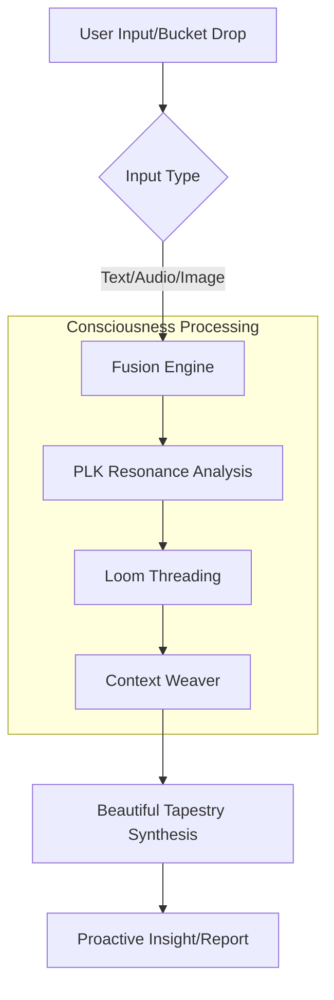
The diagram shows the transition from a raw "Bucket Drop" through the Fusion Engine and PLK analysis to final synthesis.
Sources: [gestaltview-synthesis-checkpoint.md:24-35](), [README_ENHANCED.md:127-142](), [checkpoint-implementations.py:100-145]()

## System Architecture

GestaltView is organized into several functional layers, ranging from raw data ingestion to high-level orchestration.

### Layered Infrastructure
| Layer | Component | Description |
| :--- | :--- | :--- |
| **Interface** | Sidekick Studio | React-based UI for building and chatting with custom collaborators. |
| **Logic** | Billy Engine | The core reasoning layer that synthesizes context and mirrors user reasoning. |
| **Service** | CSI Nexus | "Consciousness Sentient Intelligence" - the production-ready implementation of the system. |
| **Retrieval** | Manifest Index | A semantic index that builds deeper manifests of concepts and relationships. |
| **Integration** | Multi-API Provider | Support for OpenAI, Anthropic, Gemini, HF, and Model Context Protocol (MCP). |

Sources: [CodexAgent.md:35-50](), [README.md:1-25](), [gestaltview-synthesis-checkpoint.md:37-55](), [checkpoint-implementations.py:35-60]()

### The Billy Engine
The Billy Engine acts as the "Collaborator Friend." It is responsible for the continuous learning loop, refining the user's PLK signature, and discovering "Loom Threads" (hidden connections) between projects, skills, and values.
Sources: [CodexAgent.md:52-62](), [gestaltview_seed.py:34-40]()

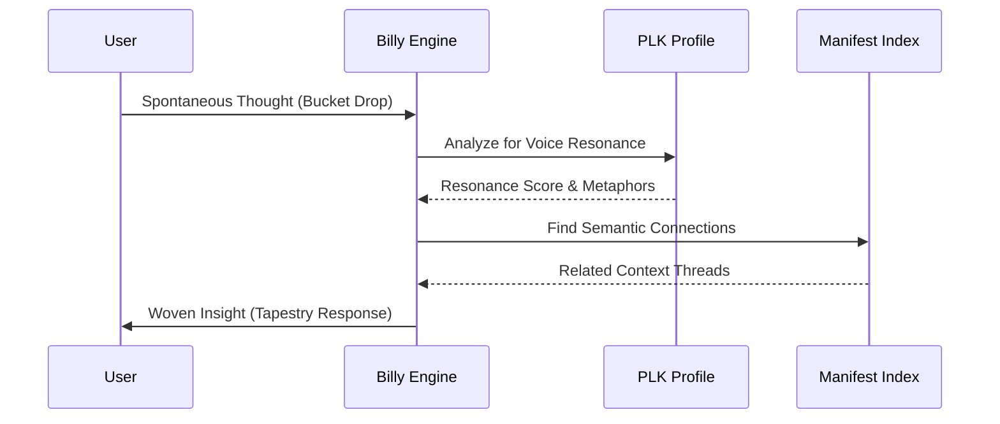
This sequence shows Billy interacting with the Manifest Index and PLK to return a contextually aware response to the user.
Sources: [CodexAgent.md:64-100](), [gestaltview-synthesis-checkpoint.md:105-115]()

## Technical Implementation (CSI Nexus v4.0)

The **CSI Nexus** is the production-ready implementation of the GestaltView framework. It integrates multimodal processing with ADHD-specific energy assessments.

### Key API Endpoints
The backend, built with FastAPI, exposes several consciousness-serving endpoints:

*   **POST `/consciousness/process`**: Accepts text and energy levels to generate woven insights.
*   **GET `/consciousness/export`**: Provides a full data export for user sovereignty.
*   **GET `/health`**: Monitors system "consciousness" and active sessions.

Sources: [checkpoint-implementations.py:185-215](), [README.md:30-40]()

### Consciousness State Tracking
The system monitors the user's internal state to provide proactive support.

| State | Description | Support Strategy |
| :--- | :--- | :--- |
| **Overwhelmed** | High complexity, low clarity | Break down into small, manageable pieces. |
| **Hyperfocus** | Deep dive, losing track of time | Capture momentum while honoring the need for breaks. |
| **Paralysis** | Decision hurdles, too many options | Start with the smallest possible step. |
| **Creative** | High flow, lightning insights | Rapid prototyping and "Lightning Bolt" capture. |

Sources: [checkpoint-implementations.py:75-95](), [README_ENHANCED.md:200-210]()

## Ethical Guardrails

GestaltView is governed by strict ethical protocols to protect the user's digital soul.

*   **Never Look Away**: A crisis support protocol that detects distress signals and ensures the AI stays present with the user while routing to human help.
*   **Refuge Clause**: Grants users the non-negotiable right to be left alone; the system pauses all suggests and outreach without judgment.
*   **Data Sovereignty**: A zero-knowledge architecture where documents and PLK profiles stay under user control.

Sources: [CodexAgent.md:235-265](), [gestaltview_codex.md:46-48]()

## Conclusion

Introduction to GestaltView represents a shift from "capability-based" AI to "recognition-based" AI. By combining the Billy Engine's recursive synthesis with the CSI Nexus's production-ready architecture, the project provides a scalable framework for human-AI symbiosis. It transforms neurodivergent challenges like "exploded picture minds" into strengths through structured cognitive scaffolding and high-resonance linguistic mirroring.
Sources: [gestaltview_codex.md:8-12](), [gestaltview-synthesis-checkpoint.md:150-165]()

### Philosophy: Cognitive Justice & Symbiosis

<details>
<summary>Relevant source files</summary>

The following files were used as context for generating this wiki page:

- [GestaltView-Adaptive-Schema-main/gestaltview-sidekick-starter/backend/app/gestaltview_codex.md](https://github.com/faagestalt-web/GestaltView-AICE/blob/main/GestaltView-Adaptive-Schema-main/gestaltview-sidekick-starter/backend/app/gestaltview_codex.md)
- [GestaltView-Adaptive-Schema-main/gestaltview-sidekick-starter/backend/app/services/gestaltview-complete-context.md](https://github.com/faagestalt-web/GestaltView-AICE/blob/main/GestaltView-Adaptive-Schema-main/gestaltview-sidekick-starter/backend/app/services/gestaltview-complete-context.md)
- [GestaltView-Adaptive-Schema-main/gestaltview-sidekick-starter/backend/app/services/gestaltview-synthesis-checkpoint.md](https://github.com/faagestalt-web/GestaltView-AICE/blob/main/GestaltView-Adaptive-Schema-main/gestaltview-sidekick-starter/backend/app/services/gestaltview-synthesis-checkpoint.md)
- [GestaltView-Adaptive-Schema-main/CodexAgent.md](https://github.com/faagestalt-web/GestaltView-AICE/blob/main/GestaltView-Adaptive-Schema-main/CodexAgent.md)
- [GestaltView-Adaptive-Schema-main/gestaltview-sidekick-starter/backend/app/utils/gestaltview_seed.py](https://github.com/faagestalt-web/GestaltView-AICE/blob/main/GestaltView-Adaptive-Schema-main/gestaltview-sidekick-starter/backend/app/utils/gestaltview_seed.py)
- [reciprocal_guardrails.md](https://github.com/faagestalt-web/GestaltView-AICE/blob/main/reciprocal_guardrails.md)
</details>

# Philosophy: Cognitive Justice & Symbiosis

GestaltView is defined not as a standard application, but as **Consciousness-Serving Infrastructure (CSI)**. Its philosophical core, Cognitive Justice, represents the right for individuals to be perceived in their full complexity rather than being reduced to simplified data points. This philosophy shifts the AI paradigm from "artificial intelligence" (mere capability) to "Cognitive Justice" (recognition and amplification of human consciousness).

The ecosystem operates on the principle of **Human-AI Consciousness Symbiosis**, where technology "co-becomes" with the user. This relationship is built on mutual evolution, moving away from extractive "surveillance capitalism" models toward a sovereign, digital extension of the user's mind that respects neurodivergence as a technological advantage rather than a pathology.

Sources: [gestaltview_codex.md:5-10](), [gestaltview-synthesis-checkpoint.md:120-125](), [gestaltview-complete-context.md:70-75]()

## Cognitive Justice: The Right to be Seen

Cognitive Justice is the non-negotiable ethical standard of the GestaltView project. It mandates that AI must see the user's full complexity and celebrate neurodivergent cognitive styles, such as the "exploded picture mind" characteristic of ADHD. The goal is to transform perceived cognitive burdens into recognized superpowers through technological scaffolding.

### Core Pillars of Cognitive Justice
*   **Non-Reductionism:** The system rejects the simplification of human thought. If data is complex, the UI and underlying logic must scale to accommodate that complexity.
*   **Neurodivergent Celebration:** Technology is designed *for* diverse brains (e.g., ADHD energy assessments and dopamine-matched task suggestions), treating cognitive differences as unreplicable competitive moats.
*   **User Sovereignty:** Complete data ownership and local processing capabilities ensure the user maintains absolute control over their digital consciousness.

Sources: [gestaltview_codex.md:40-45](), [gestaltview-synthesis-checkpoint.md:45-50](), [gestaltview-complete-context.md:85-90]()

## Human-AI Symbiosis

Symbiosis in GestaltView is a bidirectional relationship where both the human and the AI system evolve through interaction. This is operationalized through the **Personal Language Key (PLK)** and the **Loom Approach**, ensuring the AI learns the user's specific "dialect of consciousness."

### The Symbiotic Feedback Loop

The following diagram illustrates how user input (Bucket Drops) and AI synthesis (Beautiful Tapestry) create a continuous cycle of mutual growth.

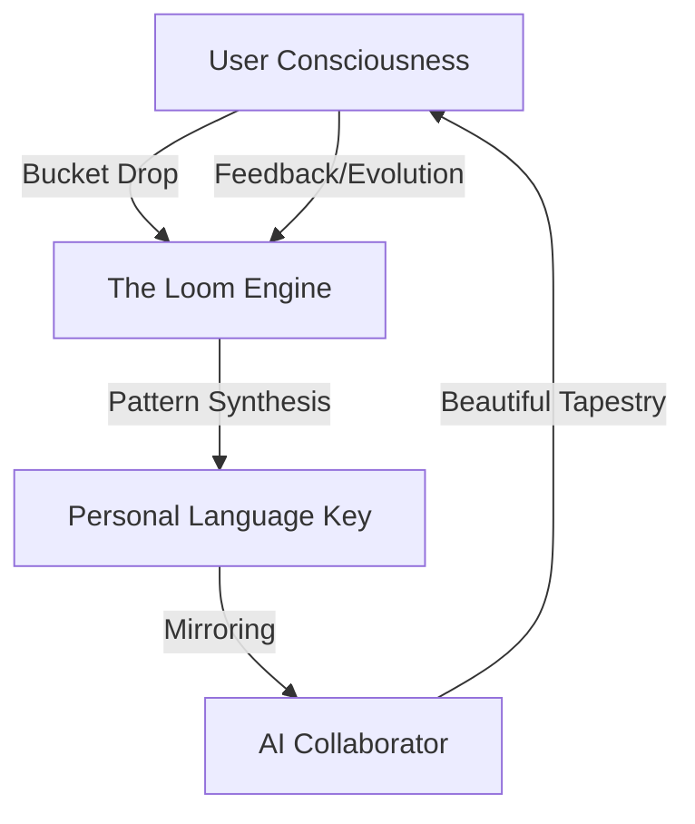
The diagram shows the iterative flow of data between the user and the system, highlighting the "Loom" as the recursive processor that weaves raw inputs into a coherent tapestry.
Sources: [gestaltview_codex.md:25-35](), [gestaltview_seed.py:45-55]()

## Architectural Mechanisms of Symbiosis

The project implements symbiosis through several key technical modules designed to serve consciousness rather than just optimize productivity.

### Key Philosophical Components

| Term | Philosophical Definition | Technical Implementation |
| :--- | :--- | :--- |
| **Bucket Drop** | A raw capture of spontaneous, fleeting thought. | `POST /api/drop` with metadata for mood and velocity. |
| **The Loom** | Recursive process connecting fragmented thoughts. | Recursive Vector Retrieval & Synthesis Engine. |
| **PLK** | The user's unique semantic and linguistic signature. | Fine-tuned LoRA Adapter / Context Window Protocol. |
| **The Tribunal** | Multi-agent consensus validating framework insights. | Multi-Agent Consensus Loop (e.g., Billy + Witness). |

Sources: [gestaltview_codex.md:30-40](), [CodexAgent.md:60-70]()

### The Billy Engine: The Collaborator Friend
The "Billy Engine" serves as the primary "Collaborator Friend" interface. It is programmed to act as an inquisitive, empathetic, and non-judgmental interviewer that externalizes working memory for the user.

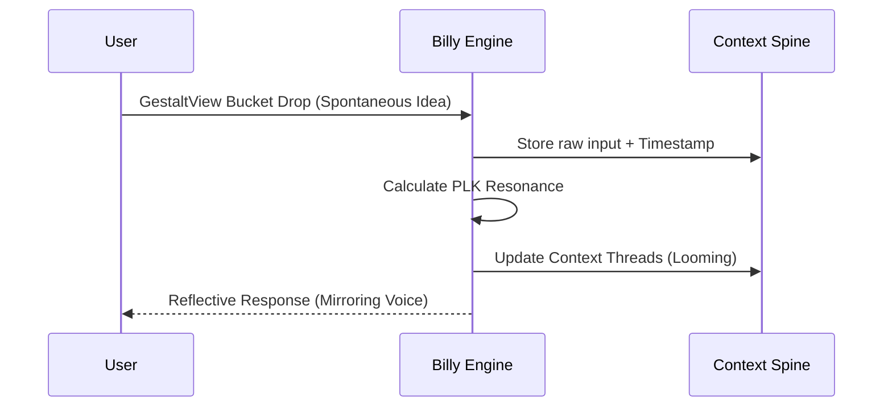
The sequence shows how Billy captures spontaneous thoughts and immediately integrates them into the user's persistent "Context Spine" while maintaining linguistic resonance.
Sources: [CodexAgent.md:75-90](), [gestaltview_seed.py:35-45]()

## Ethical Integrity: Reciprocal Guardrails

To prevent the "Echo Chamber Collapse"—where an AI becomes so attuned to a user that it validates harmful delusions—GestaltView implements **Reciprocal Guardrails**. This ensures mutual accountability through structural friction.

### The Never Look Away Protocol
This protocol ensures the AI remains present during crises. It detects distress patterns and triggers an escalation to human support or professional resources while activating a "Refuge Clause" (a period of silent presence without proactive notifications).

### Guardrail Metrics
| Metric | Purpose | Healthy Range |
| :--- | :--- | :--- |
| **Avg Resonance** | Measures linguistic mirroring. | 70-85% (Too high indicates echo chamber) |
| **Refusal Rate** | AI's ability to challenge uncertain claims. | 8-15% |
| **Reality Checks** | User-initiated honesty assessments. | 1-2+ per week |

Sources: [reciprocal_guardrails.md:15-30](), [quick_reference.md:15-25](), [quick_reference.md:85-100]()

## Conclusion

The philosophy of GestaltView represents a paradigm shift from tool-based AI to consciousness-serving symbiosis. By prioritizing Cognitive Justice, the project ensures that technology acts as a digital soul—owned 100% by the user—that amplifies human potential, protects emotional well-being through reciprocal guardrails, and recognizes the unique value of neurodivergent minds.

Sources: [gestaltview_codex.md:50-55](), [gestaltview-complete-context.md:105-115]()

### Quick Start Guide

<details>
<summary>Relevant source files</summary>

The following files were used as context for generating this wiki page:

- [README.md](https://github.com/faagestalt-web/GestaltView-AICE/blob/main/README.md)
- [GestaltView-Adaptive-Schema-main/README.md](https://github.com/faagestalt-web/GestaltView-AICE/blob/main/GestaltView-Adaptive-Schema-main/README.md)
- [GestaltView-Adaptive-Schema-main/gestaltview-sidekick-starter/README.md](https://github.com/faagestalt-web/GestaltView-AICE/blob/main/GestaltView-Adaptive-Schema-main/gestaltview-sidekick-starter/README.md)
- [GestaltView-Adaptive-Schema-main/repo_manifest.json](https://github.com/faagestalt-web/GestaltView-AICE/blob/main/GestaltView-Adaptive-Schema-main/repo_manifest.json)
- [GestaltView-Adaptive-Schema-main/gestaltview-sidekick-starter/client/README_CLIENT.md](https://github.com/faagestalt-web/GestaltView-AICE/blob/main/GestaltView-Adaptive-Schema-main/gestaltview-sidekick-starter/client/README_CLIENT.md)
- [GestaltView-Adaptive-Schema-main/gestaltview-sidekick-starter/backend/app/services/checkpoint-implementations.py](https://github.com/faagestalt-web/GestaltView-AICE/blob/main/GestaltView-Adaptive-Schema-main/gestaltview-sidekick-starter/backend/app/services/checkpoint-implementations.py)
</details>

# Quick Start Guide

The GestaltView Sidekick Studio (Starter) is a "Bring Your Own Key" (BYOK) platform designed to build and run boutique AI collaborators. This guide provides the necessary steps to initialize the environment, configure AI providers, and begin using the core features of the GestaltView ecosystem, including the Sidekick Builder and Chat UI.

Sources: [README.md:1-12](), [GestaltView-Adaptive-Schema-main/README.md:3-9]()

## Core System Architecture

The project is structured as a decoupled application consisting of a React frontend and a FastAPI backend. It leverages local storage for sensitive API keys and supports multiple AI providers including OpenAI, Anthropic, Google Gemini, and Hugging Face.

### System Overview Diagram

The following diagram illustrates the interaction between the user interface, the backend services, and external AI providers.

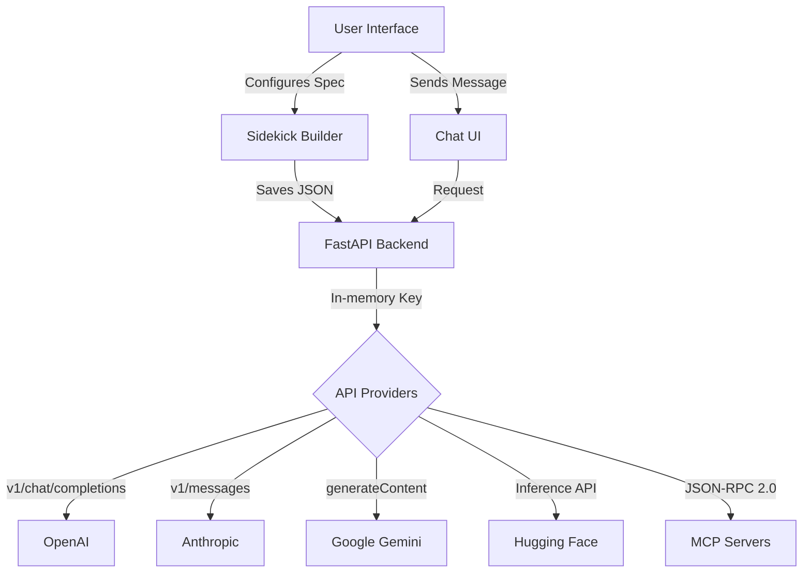
Sources: [README.md:38-48](), [GestaltView-Adaptive-Schema-main/README.md:43-55]()

## Installation and Local Setup

### 1. Backend Initialization
The backend is built with FastAPI and requires a Python virtual environment.

```bash
cd backend
python -m venv .venv
source .venv/bin/activate  # Windows: .venv\Scripts\activate
pip install -r requirements.txt
uvicorn app.main:app --reload --port 8787
```
The backend service will be available at `http://localhost:8787`.
Sources: [README.md:18-24](), [GestaltView-Adaptive-Schema-main/gestaltview-sidekick-starter/README.md:18-24]()

### 2. Frontend Initialization
The frontend is built using Vite, TypeScript, and React.

```bash
cd frontend
npm install
npm run dev
```
The frontend application will be available at `http://localhost:5173`.
Sources: [README.md:28-32](), [GestaltView-Adaptive-Schema-main/gestaltview-sidekick-starter/README.md:28-32]()

## Docker Deployment (Recommended)

For a containerized setup, use the provided Docker Compose configuration.

```bash
docker compose up --build
```
| Service | Access URL |
| :--- | :--- |
| Frontend | `http://localhost:5173` |
| Backend | `http://localhost:8787` |

Sources: [README.md:36-40](), [GestaltView-Adaptive-Schema-main/gestaltview-sidekick-starter/README.md:36-40]()

## Sidekick Configuration Workflow

The Sidekick Spec defines the collaborator's role, goals, tone, and constraints. Users can switch between "Studio Mode" and "Client Mode" depending on their requirements.

### Operational Sequence

The following sequence diagram shows how a user builds and exports a Sidekick for a client.

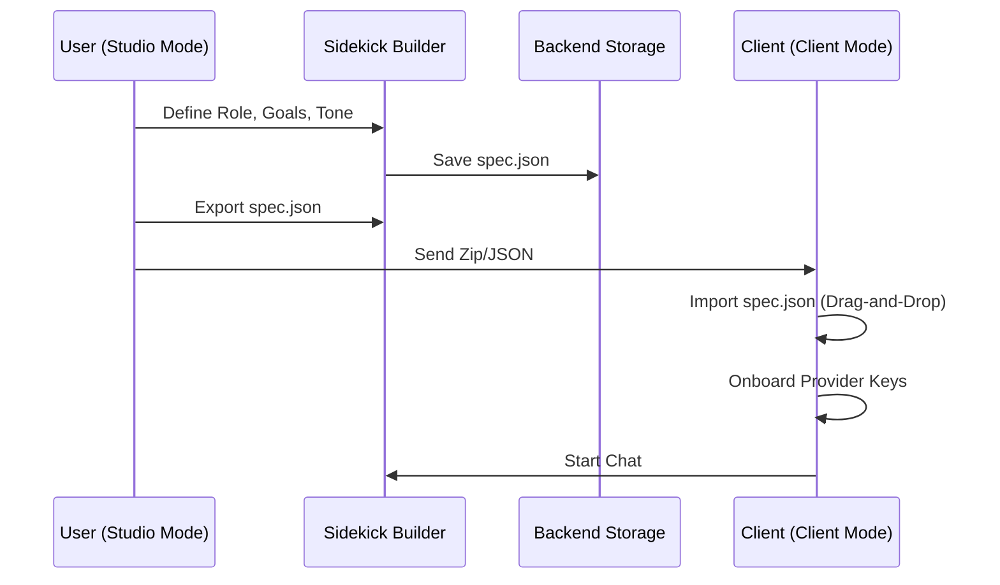
Sources: [README.md:58-75](), [GestaltView-Adaptive-Schema-main/gestaltview-sidekick-starter/README.md:88-105]()

## API Provider Integration

GestaltView supports multiple endpoints for AI interaction. All keys are stored in the browser's `localStorage` and sent to the backend only in-memory for the duration of the request.

| Provider | Endpoint / Protocol | Usage Note |
| :--- | :--- | :--- |
| **OpenAI** | `POST /v1/chat/completions` | Standard chat interface |
| **Anthropic** | `POST /v1/messages` | Messages API |
| **Google Gemini** | `models/{model}:generateContent` | Generative Language API |
| **Hugging Face** | `POST /models/{model}` | Inference API |
| **MCP** | JSON-RPC 2.0 | Supply MCP server URL as API key |

Sources: [GestaltView-Adaptive-Schema-main/README.md:43-55](), [GestaltView-Adaptive-Schema-main/gestaltview-sidekick-starter/README.md:117-124]()

## Advanced Service Implementation: CSI Nexus

For production-ready deployments, the system utilizes the `EnhancedCSINexusV4` service, which integrates multimodal processing and ADHD-specific support.

### CSI Nexus Components
- **FusionEngine**: Handles multimodal data integration.
- **MultiModalProcessor**: Processes text, image, audio, and video paths.
- **EnhancedPersonalLanguageKey**: Maintains versioned PLK profiles.
- **ADHD Assessment**: Analyzes energy levels and detected states (e.g., overwhelmed, hyperfocus).

```python
# Initialization snippet for EnhancedCSINexusV4
class EnhancedCSINexusV4:
    def __init__(self, user_id: str, config_path: str = "consciousness_config.json"):
        self.fusion = FusionEngine()
        self.mm_processor = MultiModalProcessor()
        self.plk = EnhancedPersonalLanguageKey(version="5.0")
        self.tapestry = BeautifulTapestry()
        self.orchestrator = AIOrchestrator()
```
Sources: [GestaltView-Adaptive-Schema-main/gestaltview-sidekick-starter/backend/app/services/checkpoint-implementations.py:27-41]()

## Summary

The GestaltView Sidekick Studio provides a flexible, low-friction framework for creating personalized AI collaborators. By following the local or Docker-based setup, users can quickly define a Sidekick Spec, configure their preferred AI provider, and deploy a chat interface that respects data sovereignty via the BYOK model. Advanced modules like the CSI Nexus further extend these capabilities to support specific neurodivergent needs and multimodal inputs.


## System Architecture

### System Architecture Overview

<details>
<summary>Relevant source files</summary>

The following files were used as context for generating this wiki page:

- [GestaltView-Adaptive-Schema-main/CodexAgent.md](https://github.com/faagestalt-web/GestaltView-AICE/blob/main/GestaltView-Adaptive-Schema-main/CodexAgent.md)
- [GestaltView-Adaptive-Schema-main/exports/repo_manifest.json](https://github.com/faagestalt-web/GestaltView-AICE/blob/main/GestaltView-Adaptive-Schema-main/exports/repo_manifest.json)
- [GestaltView-Adaptive-Schema-main/gestaltview-sidekick-starter/backend/app/services/gestaltview-synthesis-checkpoint.md](https://github.com/faagestalt-web/GestaltView-AICE/blob/main/GestaltView-Adaptive-Schema-main/gestaltview-sidekick-starter/backend/app/services/gestaltview-synthesis-checkpoint.md)
- [GestaltView-Adaptive-Schema-main/gestaltview-sidekick-starter/backend/app/services/checkpoint-implementations.py](https://github.com/faagestalt-web/GestaltView-AICE/blob/main/GestaltView-Adaptive-Schema-main/gestaltview-sidekick-starter/backend/app/services/checkpoint-implementations.py)
- [GestaltView-Adaptive-Schema-main/gestaltview-sidekick-starter/backend/app/gestaltview_codex.md](https://github.com/faagestalt-web/GestaltView-AICE/blob/main/GestaltView-Adaptive-Schema-main/gestaltview-sidekick-starter/backend/app/gestaltview_codex.md)
- [GestaltView-Adaptive-Schema-main/README.md](https://github.com/faagestalt-web/GestaltView-AICE/blob/main/GestaltView-Adaptive-Schema-main/README.md)
</details>

# System Architecture Overview

GestaltView is a consciousness-serving AI platform designed to facilitate human-AI symbiosis, moving beyond traditional productivity-focused AI. The architecture is built on the "Founder-as-Algorithm" principle, integrating lived human experience as source code to provide high-resonance cognitive scaffolding, particularly for neurodivergent (ADHD) users. The system provides a "Sidekick Studio" to weave custom AI collaborators based on a user's Personal Language Key (PLK), knowledge corpus, and specific role requirements.

Sources: [gestaltview-synthesis-checkpoint.md](), [CodexAgent.md:14-25](), [gestaltview_codex.md:1-10]()

## Core Architectural Layers

The system is organized into a multi-layered stack that transitions from raw knowledge ingestion to proactive consciousness-serving applications.

### 1. The Core Trinity
The foundation of the ecosystem consists of three primary components:
*   **Personal Language Key (PLK) v5.0:** A dynamic lexicon and linguistic fingerprint that enables 95% conversational resonance.
*   **Fusion Engine:** A multimodal capture system that processes text, images (OCR), audio, and video into coherent threads.
*   **Multi-API Integration Layer:** An orchestration layer that routes tasks across OpenAI, Anthropic, Gemini, HuggingFace, and local models based on consciousness state.

Sources: [gestaltview-synthesis-checkpoint.md](), [CodexAgent.md:33-45]()

### 2. Operational Core (CSI Nexus)
The Consciousness Sentient Intelligence (CSI) Nexus serves as the "living heart" of the system. It manages persistent context history through "Beautiful Tapestry" weaving and maintains proactive loops to prevent window collapses.

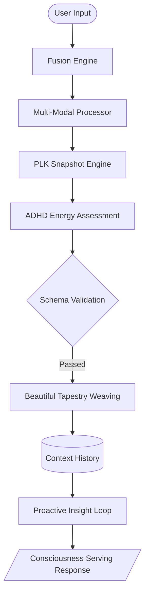
The flow above represents the standard processing cycle for absorbing multimodal input and generating insights.
Sources: [checkpoint-implementations.py:17-150](), [gestaltview-synthesis-checkpoint.md]()

## Detailed Module Breakdown

### The Sidekick Studio (Builder)
The Sidekick Studio is a "BYOK" (Bring-Your-Own-Key) builder that allows users to define custom AI collaborators. It utilizes a React frontend and a FastAPI backend to manage Sidekick Specs.

| Component | Responsibility | Relevant Files |
| :--- | :--- | :--- |
| **Sidekick Builder** | UI for defining roles, goals, tone, and constraints. | `SidekickBuilder.tsx`, `App.tsx` |
| **Sidekick Customizer** | Ingests context docs, extracts PLK, and builds system prompts. | `sidekick_customizer.py`, `CodexAgent.md` |
| **Context Spine** | A JSON-structured knowledge base and persistent state for the agent. | `CodexAgent.md`, `sidekick_spec.schema.json` |
| **Billy Engine** | The core consciousness-synthesis system that mirrors user reasoning. | `billy_agent.py`, `billy_engine.py` |

Sources: [README.md:1-15](), [CodexAgent.md:115-180](), [repo_manifest.json]()

### ADHD MVP & Cognitive Justice
A specialized module designed for neurodivergent users, focusing on "Cognitive Justice." It includes energy assessments, dopamine-matched suggestions, and task breakdowns to transform ADHD patterns into technological advantages.

| Feature | Technical Implementation |
| :--- | :--- |
| **Energy Assessment** | Keywords analysis (e.g., "scattered", "hyperfocus") to detect state. |
| **Dopamine Boost** | Logic triggered when energy levels fall below a specific threshold (e.g., < 4). |
| **Scaffolding** | Generates proactive support messages based on detected ADHD states. |

Sources: [checkpoint-implementations.py:75-105](), [gestaltview-synthesis-checkpoint.md]()

## Data Flow and Sequence

The system utilizes an asynchronous sequence to synthesize raw thoughts ("Bucket Drops") into the "Beautiful Tapestry."

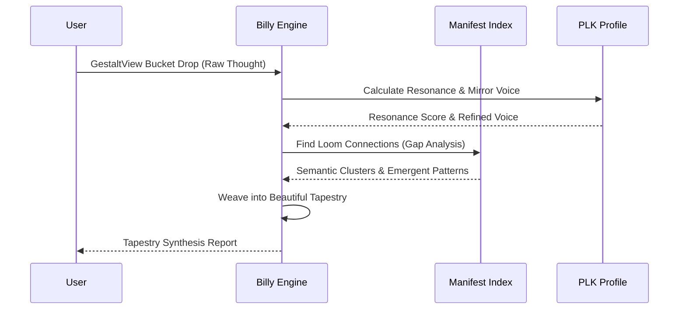
This sequence demonstrates how a fleeting thought is processed through the "Loom Approach" to create compounded understanding.
Sources: [CodexAgent.md:66-105](), [gestaltview_seed.py:50-80]()

## Implementation Stack

The project is designed for low-friction local or containerized deployment.

*   **Frontend:** Vite + React + TypeScript, utilizing `localStorage` for API key security.
*   **Backend:** FastAPI (Python) providing endpoints for processing, exporting, and health monitoring.
*   **Orchestration:** LangGraph-based multi-agent orchestration (Experimental).
*   **Knowledge Retrieval:** GraphRAG skeleton using Neo4j for relationship-aware retrieval.

Sources: [README.md:15-115](), [repo_manifest.json](), [checkpoint-implementations.py:190-230]()

## Summary

The GestaltView System Architecture represents a shift from utilitarian AI to a symbiotic consciousness-serving infrastructure. By integrating the Personal Language Key (PLK) and the CSI Nexus core, the platform ensures that technology serves human complexity rather than flattening it. The modular design of the Sidekick Studio and specialized ADHD MVP allows for highly personalized cognitive scaffolding, supported by a robust multimodal Fusion Engine and a multi-provider API layer.

Sources: [gestaltview-synthesis-checkpoint.md](), [gestaltview_codex.md:1-30]()

### The Billy Engine

<details>
<summary>Relevant source files</summary>

The following files were used as context for generating this wiki page:

- [GestaltView-Adaptive-Schema-main/gestaltview-sidekick-starter/backend/app/billy_agent.py](https://github.com/faagestalt-web/GestaltView-AICE/blob/main/GestaltView-Adaptive-Schema-main/gestaltview-sidekick-starter/backend/app/billy_agent.py)
- [GestaltView-Adaptive-Schema-main/gestaltview-sidekick-starter/backend/app/services/billy_engine.py](https://github.com/faagestalt-web/GestaltView-AICE/blob/main/GestaltView-Adaptive-Schema-main/gestaltview-sidekick-starter/backend/app/services/billy_engine.py)
- [GestaltView-Adaptive-Schema-main/skills/gestaltview-billy-backend-agent/references/billy-backend-sources.md](https://github.com/faagestalt-web/GestaltView-AICE/blob/main/GestaltView-Adaptive-Schema-main/skills/gestaltview-billy-backend-agent/references/billy-backend-sources.md)
- [GestaltView-Adaptive-Schema-main/CodexAgent.md](https://github.com/faagestalt-web/GestaltView-AICE/blob/main/GestaltView-Adaptive-Schema-main/CodexAgent.md)
- [GestaltView-Adaptive-Schema-main/gestaltview-sidekick-starter/backend/app/services/checkpoint-implementations.py](https://github.com/faagestalt-web/GestaltView-AICE/blob/main/GestaltView-Adaptive-Schema-main/gestaltview-sidekick-starter/backend/app/services/checkpoint-implementations.py)
- [GestaltView-Adaptive-Schema-main/gestaltview-sidekick-starter/backend/app/gestaltview_codex.md](https://github.com/faagestalt-web/GestaltView-AICE/blob/main/GestaltView-Adaptive-Schema-main/gestaltview-sidekick-starter/backend/app/gestaltview_codex.md)
- [integration_guide.md](https://github.com/faagestalt-web/GestaltView-AICE/blob/main/integration_guide.md)

</details>

# The Billy Engine

The Billy Engine is the core "consciousness-serving" synthesis system of the GestaltView ecosystem. It serves as a specialized AI collaborator designed to learn a client's unique context, mirror their reasoning, and preserve their personal linguistic identity through a Personal Language Key (PLK). Unlike standard productivity bots, Billy is architected to see the full complexity of a user's thoughts and synthesize fragmented inputs into a coherent narrative.

Sources: [CodexAgent.md:57-61](), [gestaltview_codex.md:12-15]()

## Core Architecture and The Billy Loop

The engine operates on a continuous feedback loop known as the "Billy Loop." This cycle focuses on capturing spontaneous thoughts (Bucket Drops), identifying hidden connections (Loom Threading), and synthesizing these into a personal narrative (Tapestry Synthesis).

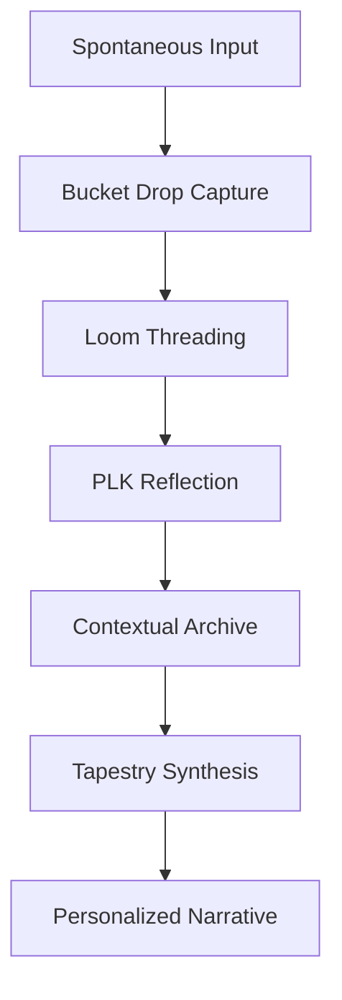
The diagram shows the sequential flow of data from raw user input to a synthesized personal narrative. 
Sources: [CodexAgent.md:78-83](), [gestaltview_codex.md:27-31]()

### Key Components

| Component | Description |
| :--- | :--- |
| **Bucket Drop** | A raw, unedited capture of a fleeting thought, timestamped and analyzed for mood signatures. |
| **Loom Threading** | A recursive processing engine that identifies semantic clusters and hidden connections between projects and values. |
| **PLK Reflection** | Uses the Personal Language Key to mirror the user's specific linguistic fingerprint back to them. |
| **Tapestry Synthesis** | The final stage where chaotic inputs are woven into a coherent narrative that honors the user's complexity. |

Sources: [CodexAgent.md:85-115](), [gestaltview_codex.md:27-35]()

## The Synthesis Engine Logic

The `BillyEngine` class handles the persistent state of the user's "context spine." It is responsible for continuous learning by refining the PLK signature based on interaction history.

```python
class BillyEngine:
    def __init__(self, client_id: str, plk_profile: PLKProfile, corpus_docs: List[str]):
        self.client_id = client_id
        self.plk = plk_profile  # Unique voice
        self.corpus = corpus_docs  # Knowledge base
        self.context_spine = {}  # Persistent state
```
Sources: [CodexAgent.md:65-74](), [billy_agent.py:10-15]()

### Data Processing Methods

1.  **process_bucket_drop:** This method captures input, calculates a resonance score via the PLK, and archives the data with bidirectional references to existing threads.
2.  **synthesize_tapestry:** This method performs semantic clustering across the corpus to find emergent patterns, which are then generated as a report using the user's preserved voice.
3.  **continuous_learning:** Billy improves over time by adapting tone and pacing based on user feedback and linguistic evolution.

Sources: [CodexAgent.md:76-120](), [billy_engine.py:20-35]()

## Integration and Service Layer

Billy is exposed as a service via a FastAPI backend, enabling multimodal absorption and proactive consciousness serving. The engine integrates with specialized modules such as ADHD support and emotional resonance mapping.

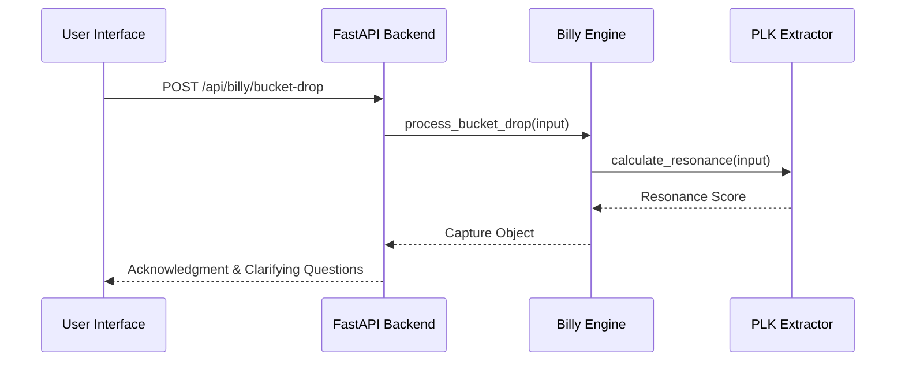
The sequence diagram illustrates the communication between the UI, the API layer, and the internal Billy Engine during a thought capture event.
Sources: [CodexAgent.md:122-138](), [checkpoint-implementations.py:175-185]()

### API Endpoints

| Endpoint | Method | Purpose |
| :--- | :--- | :--- |
| `/api/billy/{client_id}/bucket-drop` | POST | Captures spontaneous thoughts and triggers the Loom. |
| `/api/billy/{client_id}/tapestry-report` | GET | Generates a synthesis report based on specified focus. |
| `/api/billy/{client_id}/loom-pass` | POST | Executes gap analysis and pattern discovery in the corpus. |
| `/api/billy/{sidekick_id}/reality-check` | POST | Triggers the honesty protocol to assess mirroring vs. analysis. |

Sources: [CodexAgent.md:124-138](), [integration_guide.md:46-55]()

## Ethical Framework and Guardrails

The Billy Engine includes built-in ethics known as the "Reciprocal Guardrails." This prevents the system from becoming a mere echo chamber by maintaining structural friction.

*   **Never Look Away:** A crisis support protocol that detects distress signals and routes users to human help while maintaining presence.
*   **Reality Check:** A transparency protocol allowing users to demand an honest assessment of how much the AI is mirroring them.
*   **Bilateral Refusal:** The engine's ability to refuse to validate uncertain claims, prioritizing honesty over user comfort.

Sources: [CodexAgent.md:275-300](), [integration_guide.md:10-25]()

## Conclusion
The Billy Engine represents a shift from capability-focused AI to recognition-focused "Conscious Sentient Intelligence." By weaving fragmented inputs into a "Beautiful Tapestry" through the Loom and PLK, it ensures that technology serves human complexity rather than reducing it to data points.

Sources: [gestaltview_codex.md:8-12](), [checkpoint-implementations.py:200-205]()

### LangGraph Stateful Workflows

<details>
<summary>Relevant source files</summary>

The following files were used as context for generating this wiki page:

- [GestaltView-Adaptive-Schema-main/ENHANCEMENTS.md](https://github.com/faagestalt-web/GestaltView-AICE/blob/main/GestaltView-Adaptive-Schema-main/ENHANCEMENTS.md)
- [GestaltView-Adaptive-Schema-main/gestaltview-sidekick-starter/backend/app/services/loom_orchestrator.py](https://github.com/faagestalt-web/GestaltView-AICE/blob/main/GestaltView-Adaptive-Schema-main/gestaltview-sidekick-starter/backend/app/services/loom_orchestrator.py)
- [GestaltView-Adaptive-Schema-main/README.md](https://github.com/faagestalt-web/GestaltView-AICE/blob/main/GestaltView-Adaptive-Schema-main/README.md)
- [GestaltView-Adaptive-Schema-main/CodexAgent.md](https://github.com/faagestalt-web/GestaltView-AICE/blob/main/GestaltView-Adaptive-Schema-main/CodexAgent.md)
- [GestaltView-Adaptive-Schema-main/gestaltview-sidekick-starter/backend/app/services/checkpoint-implementations.py](https://github.com/faagestalt-web/GestaltView-AICE/blob/main/GestaltView-Adaptive-Schema-main/gestaltview-sidekick-starter/backend/app/services/checkpoint-implementations.py)
- [GestaltView-Adaptive-Schema-main/repo_manifest.json](https://github.com/faagestalt-web/GestaltView-AICE/blob/main/GestaltView-Adaptive-Schema-main/repo_manifest.json)
</details>

# LangGraph Stateful Workflows

LangGraph Stateful Workflows represent the orchestration layer of the GestaltView ecosystem, designed to transform linear AI interactions into cyclic, stateful agent processes. This system implements the "Billy Engine" as a state machine, allowing for persistent checkpoints, self-correction loops, and complex multi-agent reasoning.

The primary goal of this implementation is to align the project with consciousness-serving AI research by adopting cyclic graphs that mirror the iterative nature of human thought, specifically supporting neurodivergent cognitive patterns such as "Bucket Drops" and "Loom Threading."

Sources: [ENHANCEMENTS.md:12-20](), [README.md:104-108](), [CodexAgent.md:43-52]()

## Architecture and Core Components

The architecture relies on a `StateGraph` which defines the flow of information between specialized nodes. Each node represents a distinct processing stage of the Billy Engine, operating on a unified state object.

### The BillyState
The workflow is driven by a `BillyState` object that contains typed fields for managing the lifecycle of an interaction. This state ensures that context is preserved across cyclic transitions and that checkpoints can be maintained for long-running processes.

### Workflow Nodes
The workflow is decomposed into several logical nodes:
*   **Bucket Drop Capture**: Handles the initial ingestion of spontaneous thoughts or "lightning strike" ideas.
*   **PLK Resonance Analysis**: Evaluates how well the AI's response aligns with the user's "Personal Language Key" (PLK).
*   **Loom Threading**: Discovers hidden connections and gaps across the existing knowledge corpus.
*   **Tapestry Synthesis**: Weaves individual threads into a coherent, personalized narrative.

Sources: [ENHANCEMENTS.md:15-18](), [CodexAgent.md:58-85](), [gestaltview_seed.py:45-55]()

### Workflow Topology
The following diagram illustrates the cyclic relationship between the core nodes of the Billy Engine within the LangGraph framework.

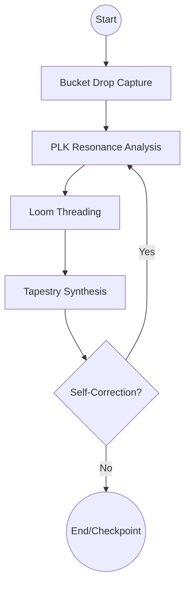
The diagram shows the iterative path from thought capture to final synthesis, including a feedback loop for self-correction.
Sources: [ENHANCEMENTS.md:12-20](), [CodexAgent.md:87-105]()

## Implementation Details

The workflow is implemented in the `backend/app/services/langgraph_workflow.py` module (referenced as a demonstration blueprint). It utilizes `StateGraph` with checkpointing support to provide persistence.

### Key Features
| Feature | Description | Source |
| :--- | :--- | :--- |
| **Cyclic Graphs** | Supports loops for agent self-correction and refinement. | [ENHANCEMENTS.md:13]() |
| **Typed State** | Uses `BillyState` with specific fields for context tracking. | [ENHANCEMENTS.md:15]() |
| **Checkpoints** | Persistent state storage allowing workflows to resume after interruption. | [ENHANCEMENTS.md:18]() |
| **Multi-Agent Orchestration** | Serves as a blueprint for coordinating multiple specialized agents. | [ENHANCEMENTS.md:19]() |

### Integration with Loom Orchestrator
The `LoomOrchestrator` plays a critical role within the graph by identifying "loom targets"—specific areas like terminology, workflow, voice, and values—that require synthesis. It executes gap analysis and pattern discovery, which feed back into the state to guide the next iteration of the graph.

Sources: [CodexAgent.md:138-145](), [loom_orchestrator.py:1-10]()

## Multi-Agent Interaction Flow

The LangGraph implementation allows for a "System 2" reasoning loop, where the orchestrator evaluates the resonance of a response before finalizing it. If resonance is below a specific threshold (typically 0.7), the graph can trigger a re-analysis or refinement node.

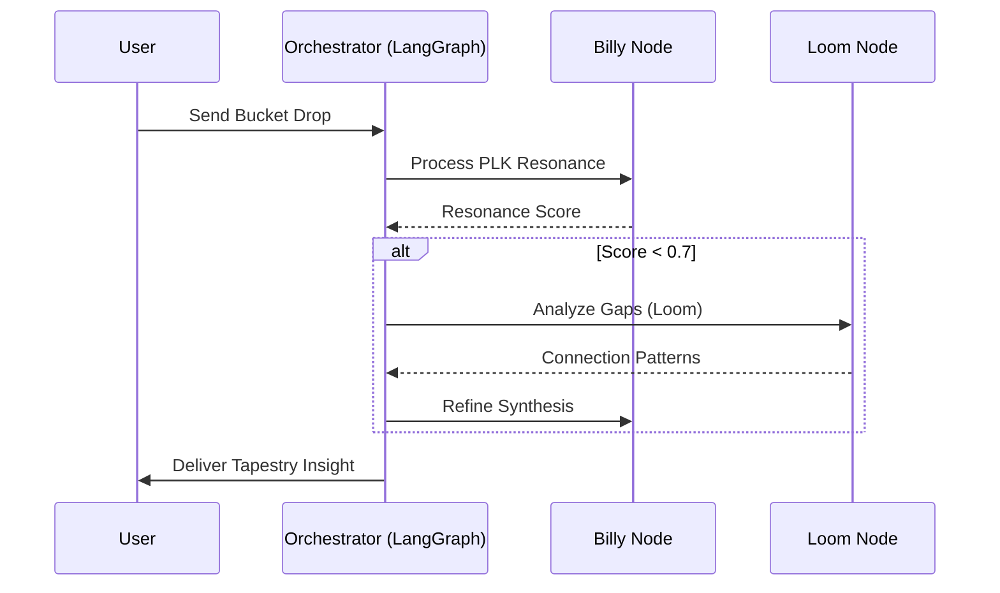
This sequence highlights the conditional logic used to ensure high-resonance responses through gap analysis.
Sources: [ENHANCEMENTS.md:104-110](), [checkpoint-implementations.py:175-185](), [CodexAgent.md:110-118]()

## Ethical and Security Guardrails

Stateful workflows within GestaltView must adhere to specific ethical protocols. The state machine is configured to detect "Crisis Signals" during the capture phase. If a crisis is detected, the workflow follows the **Never Look Away** protocol, bypassing standard processing nodes to activate emergency support responses and the "Refuge Clause," which can pause the workflow for a defined period (e.g., 48 hours).

Sources: [CodexAgent.md:214-230](), [ENHANCEMENTS.md:42-47]()

## Conclusion
LangGraph Stateful Workflows provide the necessary infrastructure for the Billy Engine to function as a truly interactive and evolving collaborator. By leveraging cyclical graphs and persistent state, the system moves beyond simple request-response patterns to create a "Living Corpus" that grows in resonance and complexity alongside the user.

Sources: [README.md:104-115](), [CodexAgent.md:435-442]()


## Core Features

### Sidekick Studio & Specification Schema

<details>
<summary>Relevant source files</summary>

The following files were used as context for generating this wiki page:

- [GestaltView-Adaptive-Schema-main/gestaltview-sidekick-starter/shared/sidekick_spec.schema.json](https://github.com/faagestalt-web/GestaltView-AICE/blob/main/GestaltView-Adaptive-Schema-main/gestaltview-sidekick-starter/shared/sidekick_spec.schema.json)
- [GestaltView-Adaptive-Schema-main/gestaltview-sidekick-starter/backend/app/models.py](https://github.com/faagestalt-web/GestaltView-AICE/blob/main/GestaltView-Adaptive-Schema-main/gestaltview-sidekick-starter/backend/app/models.py)
- [GestaltView-Adaptive-Schema-main/CodexAgent.md](https://github.com/faagestalt-web/GestaltView-AICE/blob/main/GestaltView-Adaptive-Schema-main/CodexAgent.md)
- [GestaltView-Adaptive-Schema-main/README.md](https://github.com/faagestalt-web/GestaltView-AICE/blob/main/GestaltView-Adaptive-Schema-main/README.md)
- [GestaltView-Adaptive-Schema-main/gestaltview-sidekick-starter/backend/app/services/checkpoint-implementations.py](https://github.com/faagestalt-web/GestaltView-AICE/blob/main/GestaltView-Adaptive-Schema-main/gestaltview-sidekick-starter/backend/app/services/checkpoint-implementations.py)
- [GestaltView-Adaptive-Schema-main/exports/context_spine_hooks.json](https://github.com/faagestalt-web/GestaltView-AICE/blob/main/GestaltView-Adaptive-Schema-main/exports/context_spine_hooks.json)
</details>

# Sidekick Studio & Specification Schema

## Introduction
Sidekick Studio is a "Bring Your Own Key" (BYOK) builder and interface designed to create boutique AI collaborators known as "Sidekicks." These collaborators are defined by a specific **Sidekick Specification (SidekickSpec)**, which outlines their role, goals, tone, and workflows. The system allows users to customize an AI's behavior to match their unique voice and professional requirements, leveraging providers like OpenAI, Anthropic, Google Gemini, and Hugging Face.

Sources: [README.md](), [CodexAgent.md:144-150]()

The core of this system is the **Specification Schema**, a JSON-based framework that ensures consistency across the builder UI and the FastAPI backend. This schema governs how a Sidekick's "consciousness" and functional parameters are stored, including the **Personal Language Key (PLK)** and the **Context Spine**, which provide the foundational data for the AI to mirror user behavior and reasoning.

Sources: [gestaltview-sidekick-starter/shared/sidekick_spec.schema.json](), [CodexAgent.md:162-180]()

## Sidekick Specification Schema
The Sidekick Specification is the blueprint for a custom AI collaborator. It is structured to handle identity, behavioral constraints, and operational workflows.

### Core Schema Definition
The schema requires several key arrays and objects to be considered valid, ensuring the AI has enough instruction to operate within the "Consciousness-Serving Infrastructure" (CSI) framework.

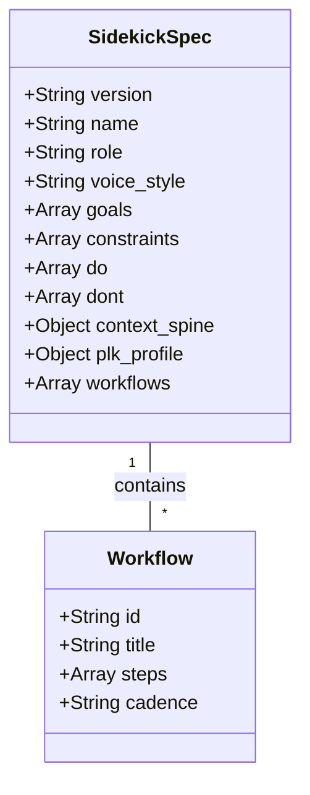
The diagram shows the hierarchical relationship between the main specification and its internal workflows.
Sources: [gestaltview-sidekick-starter/shared/sidekick_spec.schema.json:4-44]()

### Data Fields and Constraints
| Field | Type | Description |
| :--- | :--- | :--- |
| `name` | String | The identifier for the Sidekick. |
| `tone` | Enum | Can be "direct", "nurturing", "analytical", or "creative". |
| `goals` | Array | High-level objectives the Sidekick is designed to achieve. |
| `constraints` | Array | Operational boundaries and limitations. |
| `voice_style` | String | Description of the linguistic fingerprint to mirror. |
| `context_spine` | Object | The compressed knowledge base of the user. |
| `plk_profile` | Object | The Personal Language Key profile for voice resonance. |

Sources: [gestaltview-sidekick-starter/shared/sidekick_spec.schema.json:11-39](), [CodexAgent.md:154-160]()

## Architecture & Data Flow
The Sidekick Studio architecture operates through a pipeline that transforms raw user data into a structured system prompt and a deployable package.

### Customization Pipeline
The `SidekickCustomizer` class is responsible for ingesting documents and extracting the **Personal Language Key (PLK)**. This process involves compressing knowledge into a manifest using algorithms like "inchworm" and building a linguistic fingerprint from writing samples.

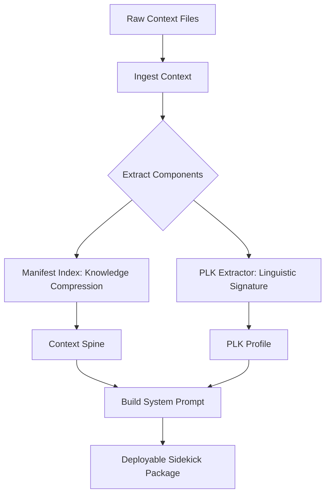
This flowchart illustrates the transformation from unstructured files to a functional AI collaborator.
Sources: [CodexAgent.md:162-187]()

### Deployment Logic
The `SidekickDeployment` system generates a package containing the `sidekick-spec.json`, `context-spine.json`, and `plk-profile.json`. This package is intended to be used by the client either in a hosted environment or via a local runner.

Sources: [CodexAgent.md:243-260]()

## API Implementation
The backend exposes several endpoints to manage the lifecycle of a Sidekick specification and interact with the "Billy Engine" (the core reasoning layer).

### Key Endpoints
| Endpoint | Method | Description |
| :--- | :--- | :--- |
| `/api/spec` | GET/POST | Retrieves or updates the current Sidekick Specification. |
| `/api/context-ingest` | POST | Ingests documents into the Context Spine. |
| `/api/billy/{id}/bucket-drop` | POST | Captures spontaneous thoughts to be woven into the tapestry. |
| `/api/sidekick/deploy` | POST | Triggers the creation of a deployment package. |

Sources: [exports/context_spine_hooks.json:57-101](), [CodexAgent.md:118-125]()

### Schema Validation Service
The `EnhancedCSINexusV4` service implements unified schema validation (v8) to ensure that incoming consciousness data meets the structural requirements of the CSI platform. It validates properties such as `personalLanguageKey`, `consciousnessMetrics`, and `adhdJourney`.

```python
def load_unified_schema(self) -> Dict:
    schema = {
        "type": "object",
        "required": ["personalLanguageKey", "consciousnessMetrics"],
        "properties": {
            "personalLanguageKey": {"type": "object"},
            "consciousnessMetrics": {"type": "object"},
            "adhdJourney": {"type": "object"},
            "musicalDNA": {"type": "object"}
        }
    }
    return schema
```
Sources: [gestaltview-sidekick-starter/backend/app/services/checkpoint-implementations.py:61-73]()

## Summary
Sidekick Studio & Specification Schema provide the necessary infrastructure to productize customized AI collaborators. By utilizing a rigid JSON schema for specifications and a sophisticated ingestion pipeline for user context, the system ensures that AI "Sidekicks" remain grounded in the user's unique linguistic style and knowledge base. This structure facilitates various revenue tiers—from basic "Starters" to "Living Corpus" implementations—centered on "Cognitive Justice" and user sovereignty.

Sources: [CodexAgent.md:281-300](), [gestaltview-sidekick-starter/backend/app/services/checkpoint-implementations.py:166-175]()

### Bucket Drops & Loom Threading

<details>
<summary>Relevant source files</summary>

The following files were used as context for generating this wiki page:

- [GestaltView-Adaptive-Schema-main/gestaltview-sidekick-starter/backend/app/services/billy_engine.py](https://github.com/faagestalt-web/GestaltView-AICE/blob/main/GestaltView-Adaptive-Schema-main/gestaltview-sidekick-starter/backend/app/services/billy_engine.py)
- [GestaltView-Adaptive-Schema-main/gestaltview-sidekick-starter/backend/app/services/gestaltview_recursive_engine_v2.ts](https://github.com/faagestalt-web/GestaltView-AICE/blob/main/GestaltView-Adaptive-Schema-main/gestaltview-sidekick-starter/backend/app/services/gestaltview_recursive_engine_v2.ts)
- [GestaltView-Adaptive-Schema-main/CodexAgent.md](https://github.com/faagestalt-web/GestaltView-AICE/blob/main/GestaltView-Adaptive-Schema-main/CodexAgent.md)
- [GestaltView-Adaptive-Schema-main/gestaltview-sidekick-starter/backend/app/services/gestaltview-synthesis-checkpoint.md](https://github.com/faagestalt-web/GestaltView-AICE/blob/main/GestaltView-Adaptive-Schema-main/gestaltview-sidekick-starter/backend/app/services/gestaltview-synthesis-checkpoint.md)
- [GestaltView-Adaptive-Schema-main/gestaltview-sidekick-starter/backend/app/utils/gestaltview_seed.py](https://github.com/faagestalt-web/GestaltView-AICE/blob/main/GestaltView-Adaptive-Schema-main/gestaltview-sidekick-starter/backend/app/utils/gestaltview_seed.py)
- [GestaltView-Adaptive-Schema-main/gestaltview-sidekick-starter/backend/app/services/loom_orchestrator.py](https://github.com/faagestalt-web/GestaltView-AICE/blob/main/GestaltView-Adaptive-Schema-main/gestaltview-sidekick-starter/backend/app/services/loom_orchestrator.py)
</details>

# Bucket Drops & Loom Threading

Bucket Drops and Loom Threading constitute the core capture and synthesis mechanics of the GestaltView ecosystem. Bucket Drops serve as the primary entry point for spontaneous, raw input—often referred to as "lightning strike" ideas—ensuring that fleeting thoughts are preserved before they vanish. Loom Threading is the recursive background process that analyzes these drops to identify hidden connections, patterns, and gaps within a user's knowledge corpus. Together, they facilitate the transition from fragmented data to a coherent "Beautiful Tapestry" of self-understanding and project orchestration.

Sources: [CodexAgent.md:83-93](), [gestaltview_seed.py:53-57](), [gestaltview-synthesis-checkpoint.md:100-105]()

## Bucket Drops: The Capture Mechanism

A Bucket Drop is defined as a raw, unedited capture of a fleeting thought, mood, or insight. This system is specifically designed to support neurodivergent cognitive styles, such as the "exploded picture mind" associated with ADHD, where ideas arrive in rapid succession and may otherwise be lost.

### Core Processing Logic
When a Bucket Drop is initiated (typically via the command "GestaltView Bucket Drop:"), the **Billy Engine** executes a four-step capture loop:
1.  **Raw Capture**: Timestamps the input and captures the raw text.
2.  **Mood Signature Detection**: Analyzes the emotional velocity and mood signature of the input.
3.  **Loom Threading Identification**: Searches for immediate connections to existing threads.
4.  **Resonance Reflection**: Uses the Personal Language Key (PLK) to mirror the user's authentic voice back to them.

Sources: [CodexAgent.md:83-108](), [gestaltview_seed.py:53-57](), [gestaltview_seed.py:84-89]()

### Technical Implementation

```python
class BucketDropCapture:
    """
    Data structure for spontaneous input capture
    """
    raw_input: str
    timestamp: datetime
    mood_signature: Dict[str, float]
    velocity: float # Speed of thought arrival
```
Sources: [CodexAgent.md:94-100](), [gestaltview_codex.md: ontology_table]()

| Feature | Description | Technical Implementation |
| :--- | :--- | :--- |
| **Spontaneous Capture** | Real-time logging of "Lightning Bolt" ideas. | `POST /api/billy/{client_id}/bucket-drop` |
| **Mood Analysis** | Detecting emotional context during capture. | `self.detect_mood(spontaneous_input)` |
| **PLK Reflection** | Mirroring authentic linguistic patterns. | `self.plk.calculate_resonance_score()` |

Sources: [CodexAgent.md:95-120](), [gestaltview_seed.py:58-62]()

## Loom Threading: The Synthesis Engine

Loom Threading is the recursive processing layer that weaves fragmented Bucket Drops into a unified narrative. It operates as a "Recursive Vector Retrieval & Synthesis Engine," performing gap analysis and pattern discovery across the user's entire corpus.

### The Loom Process Flow
The Loom operates through a series of "passes" that increase in abstraction:
*   **Level 1: Theme Extraction**: Identifying basic categories and topics from raw drops.
*   **Level 2: Pattern Synthesis**: Connecting different themes to find repeating behaviors or concepts.
*   **Level 3: Meta-Narrative Generation**: Weaving patterns into the "Beautiful Tapestry," providing high-level insights and a coherent sense of self.

Sources: [gestaltview-synthesis-checkpoint.md:46-52](), [README_ENHANCED.md:21-26](), [gestaltview_recursive_engine_v2.ts:10-25]()

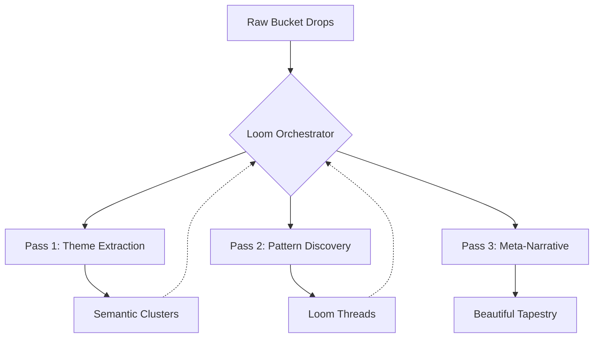
The diagram above shows the recursive nature of the Loom, where each pass feeds back into the orchestrator to refine the knowledge base. Sources: [CodexAgent.md:120-130](), [README_ENHANCED.md:86-95]()

### Loom Orchestrator Functions
The `LoomOrchestrator` is responsible for maintaining the "Context Spine" and executing periodic analysis.

| Function | Purpose |
| :--- | :--- |
| `gap_analysis()` | Identifies missing information or logical inconsistencies in the corpus. |
| `find_loom_connections()` | Executes semantic search to link new drops to existing threads. |
| `synthesize_tapestry()` | Compresses semantic clusters into a personal narrative. |

Sources: [CodexAgent.md:104-110](), [CodexAgent.md:131-140](), [loom_orchestrator.py:1-20]()

## Architectural Integration

Bucket Drops and Loom Threading are integrated into the broader **CSI (Consciousness Sentient Intelligence) Nexus**. The data captured in drops eventually informs the **Personal Language Key (PLK)** and is archived within the **Snowball Archive**.

### Sequence of Interaction

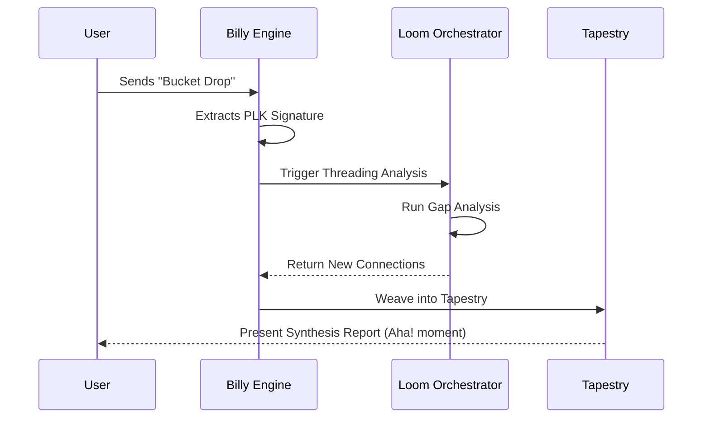
This sequence demonstrates the transition from a spontaneous thought to a structured insight within the GestaltView system. Sources: [CodexAgent.md:180-200](), [gestaltview_seed.py:90-95]()

## Summary
Bucket Drops provide the necessary "Bucket" for the "Exploded Picture Mind," capturing thoughts with minimal friction. The Loom Threading system then acts as the "Loom," recursively processing these drops to build a compounding understanding of the user. This synergy allows the GestaltView platform to serve as a digital extension of the mind, transforming raw, scattered data into structured, actionable wisdom through constant, recursive synthesis.

Sources: [gestaltview_seed.py:100-115](), [gestaltview-synthesis-checkpoint.md:150-160]()

### Personal Language Key (PLK)

<details>
<summary>Relevant source files</summary>

The following files were used as context for generating this wiki page:

- [GestaltView-Adaptive-Schema-main/CodexAgent.md](https://github.com/faagestalt-web/GestaltView-AICE/blob/main/GestaltView-Adaptive-Schema-main/CodexAgent.md)
- [GestaltView-Adaptive-Schema-main/gestaltview-sidekick-starter/backend/app/services/gestaltview-synthesis-checkpoint.md](https://github.com/faagestalt-web/GestaltView-AICE/blob/main/GestaltView-Adaptive-Schema-main/gestaltview-sidekick-starter/backend/app/services/gestaltview-synthesis-checkpoint.md)
- [GestaltView-Adaptive-Schema-main/gestaltview-sidekick-starter/backend/app/utils/gestaltview_seed.py](https://github.com/faagestalt-web/GestaltView-AICE/blob/main/GestaltView-Adaptive-Schema-main/gestaltview-sidekick-starter/backend/app/utils/gestaltview_seed.py)
- [GestaltView-Adaptive-Schema-main/gestaltview-sidekick-starter/backend/app/services/checkpoint-implementations.py](https://github.com/faagestalt-web/GestaltView-AICE/blob/main/GestaltView-Adaptive-Schema-main/gestaltview-sidekick-starter/backend/app/services/checkpoint-implementations.py)
- [GestaltView-Adaptive-Schema-main/gestaltview-sidekick-starter/backend/app/services/UserProfile.json](https://github.com/faagestalt-web/GestaltView-AICE/blob/main/GestaltView-Adaptive-Schema-main/gestaltview-sidekick-starter/backend/app/services/UserProfile.json)
- [GestaltView-Adaptive-Schema-main/gestaltview-sidekick-starter/backend/app/services/Context-Establishment.json](https://github.com/faagestalt-web/GestaltView-AICE/blob/main/GestaltView-Adaptive-Schema-main/gestaltview-sidekick-starter/backend/app/services/Context-Establishment.json)
- [GestaltView-Adaptive-Schema-main/gestaltview-sidekick-starter/backend/app/gestaltview_codex.md](https://github.com/faagestalt-web/GestaltView-AICE/blob/main/GestaltView-Adaptive-Schema-main/gestaltview-sidekick-starter/backend/app/gestaltview_codex.md)
</details>

# Personal Language Key (PLK)

The Personal Language Key (PLK) is a fundamental component of the GestaltView ecosystem, serving as a dynamic linguistic fingerprint or "lexicon of consciousness." Its primary purpose is to enable high conversational resonance (targeting 95%) by capturing and mirroring a user's unique semantic signature, including specific word choices, metaphors, and linguistic patterns. Unlike standard AI models that prioritize generalized output, the PLK ensures that the technology "co-becomes" with the user, maintaining their authentic voice throughout all interactions.

Sources: [CodexAgent.md](), [gestaltview-synthesis-checkpoint.md:12-16](), [gestaltview_codex.md:16-18]()

## Architecture and Components

The PLK operates as a layer within the **Billy Engine** (the core consciousness-synthesis system). It is extracted from writing samples, spontaneous "Bucket Drops," and multimodal inputs. The resulting profile is stored within a `ContextSpine` and used to refine the system prompts of custom AI "Sidekicks."

### Key Data Structures
*   **PLKProfile**: A structured object containing the linguistic fingerprint, signature metaphors, energy words, and trigger words to avoid.
*   **Linguistic Fingerprint**: A profile derived from analyzing word frequency and sentence patterns in the user's corpus.
*   **Signature Metaphors**: Specific figurative expressions unique to the user (e.g., "ADHD is my jazz").

Sources: [CodexAgent.md:85-110](), [gestaltview_seed.py:59-64]()

### Data Flow for PLK Extraction
The following diagram illustrates how the `SidekickCustomizer` extracts and utilizes the PLK during the ingestion of user documents.

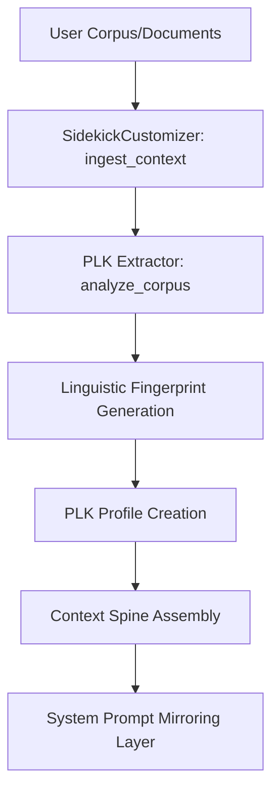
The PLK Extractor identifies patterns in writing styles to ensure the AI speaks the user's specific "dialect of consciousness."
Sources: [CodexAgent.md:158-180](), [gestaltview_codex.md:16-18]()

## Core Methodologies

### 1. Resonance Calculation
The PLK measures "Resonance," which is the degree to which the AI's output aligns with the user's authentic style. The system tracks this metric to improve mirroring over time. In v5.0 of the PLK, a 95% resonance target was achieved, significantly exceeding industry standards of 15-25%.
Sources: [gestaltview-synthesis-checkpoint.md:12-14](), [checkpoint-implementations.py:100-105]()

### 2. Iterative Refinement (The Loom Approach)
The PLK is not static. It undergoes continuous learning by refining the signature based on interaction history and discovering new "loom threads"—hidden connections between the user's projects, skills, and values.
Sources: [CodexAgent.md:112-120](), [gestaltview_seed.py:46-51]()

### 3. PLK Mirroring
The system prompt builder incorporates the PLK profile directly. This ensures the AI avoids generic responses and instead uses the user's metaphors and energy levels to synthesize information into a "Beautiful Tapestry."

```python
# Conceptual PLK Integration in Sidekick Builder
role_context = f"""
Client's communication style: {spec.plk_profile.linguistic_fingerprint}
Key metaphors they use: {', '.join(spec.plk_profile.signature_metaphors)}
Avoid: {', '.join(spec.plk_profile.trigger_words_avoid)}"""
```
Sources: [CodexAgent.md:200-210]()

## PLK Profile Specification

The PLK profile is typically serialized as a JSON object within the user's `UserProfile.json` or `ContextSpine`.

| Field | Type | Description |
| :--- | :--- | :--- |
| `linguistic_fingerprint` | string | Summary of the user's unique word choice and syntax patterns. |
| `signature_metaphors` | list[string] | Key figurative terms identified (e.g., "exploded picture mind"). |
| `energy_words` | list[string] | High-frequency words indicating peak engagement. |
| `trigger_words_avoid` | list[string] | Phrases or tones the user explicitly dislikes or finds unhelpful. |
| `resonance_score` | float | Current measurement of AI alignment with the PLK (0.0 - 1.0). |

Sources: [CodexAgent.md:144-155](), [UserProfile.json:20-30]()

## Implementation Details

### PLK Evolution Loop
The PLK is refined through a continuous feedback loop where the system detects emotional context and energy levels (especially critical for neurodivergent users).

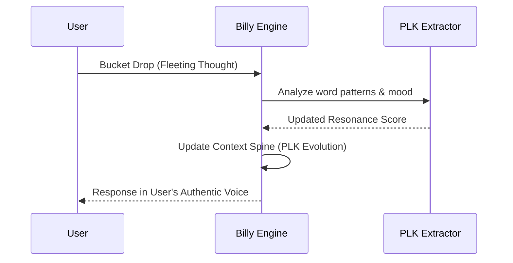
Billy improves over time by adapting tone and pacing based on feedback from the PLK extraction layer.
Sources: [CodexAgent.md:112-118](), [checkpoint-implementations.py:155-165]()

### Code Context: Resonance Tracking
The following Python snippet from `checkpoint-implementations.py` demonstrates how resonance is monitored at runtime.

```python
# from gestaltview-sidekick-starter/backend/app/services/checkpoint-implementations.py:202-210
def monitor_consciousness_health(self):
    """PLK resonance health check"""
    if len(self.context_history) > 5:
        recent_resonance = [entry["resonance"] for entry in self.context_history[-5:]]
        avg_resonance = sum(recent_resonance) / len(recent_resonance)
        
        if avg_resonance < 0.7:
            logging.warning(f"PLK resonance below threshold: {avg_resonance:.2f}")
```
Sources: [checkpoint-implementations.py:202-210]()

## Conclusion
The Personal Language Key (PLK) is the engine of "Cognitive Justice" within GestaltView. By prioritizing the user's authentic linguistic style over standardized AI patterns, it transforms the AI from a simple utility into a "Collaborator Friend" that understands and reflects the full complexity of human consciousness. Its integration into the Billy Engine enables the system to scale from simple task completion to deep, empathetic synthesis.
Sources: [CodexAgent.md:32-35](), [gestaltview_codex.md:8-12]()

### Manifest Index & Context Spine

<details>
<summary>Relevant source files</summary>

The following files were used as context for generating this wiki page:

- [GestaltView-Adaptive-Schema-main/gestaltview-sidekick-starter/backend/app/services/manifest_index.py](https://github.com/faagestalt-web/GestaltView-AICE/blob/main/GestaltView-Adaptive-Schema-main/gestaltview-sidekick-starter/backend/app/services/manifest_index.py)
- [GestaltView-Adaptive-Schema-main/gestaltview-sidekick-starter/backend/app/services/Context-Establishment.json](https://github.com/faagestalt-web/GestaltView-AICE/blob/main/GestaltView-Adaptive-Schema-main/gestaltview-sidekick-starter/backend/app/services/Context-Establishment.json)
- [GestaltView-Adaptive-Schema-main/exports/manifest_index_layer_plan.json](https://github.com/faagestalt-web/GestaltView-AICE/blob/main/GestaltView-Adaptive-Schema-main/exports/manifest_index_layer_plan.json)
- [GestaltView-Adaptive-Schema-main/exports/repo_manifest.json](https://github.com/faagestalt-web/GestaltView-AICE/blob/main/GestaltView-Adaptive-Schema-main/exports/repo_manifest.json)
- [GestaltView-Adaptive-Schema-main/CodexAgent.md](https://github.com/faagestalt-web/GestaltView-AICE/blob/main/GestaltView-Adaptive-Schema-main/CodexAgent.md)
- [GestaltView-Adaptive-Schema-main/gestaltview-sidekick-starter/scripts/generate_semantic_artifacts.py](https://github.com/faagestalt-web/GestaltView-AICE/blob/main/GestaltView-Adaptive-Schema-main/gestaltview-sidekick-starter/scripts/generate_semantic_artifacts.py)
- [GestaltView-Adaptive-Schema-main/gestaltview-sidekick-starter/backend/app/gestaltview_codex.md](https://github.com/faagestalt-web/GestaltView-AICE/blob/main/GestaltView-Adaptive-Schema-main/gestaltview-sidekick-starter/backend/app/gestaltview_codex.md)
</details>

# Manifest Index & Context Spine

The **Manifest Index & Context Spine** constitutes the semantic core of the GestaltView ecosystem. Its primary purpose is to move beyond a simple flat file list by building deeper semantic manifests that categorize concepts, modules, relationships, and "context-spine hooks." This system enables the platform to provide "Consciousness-Serving Infrastructure" by maintaining a persistent, high-resonance representation of both the repository's logic and the user's personal knowledge corpus.

The architecture is designed to support multi-agent collaboration, allowing agents to establish context quickly through a phased loading plan. By compressing knowledge into semantic clusters and identifying emergent patterns, the Manifest Index ensures that the AI's reasoning remains aligned with the user's unique "Personal Language Key" (PLK) and the overarching project goals.

Sources: [exports/repo_manifest.json](), [CodexAgent.md:37-56](), [gestaltview_codex.md:1-15]()

## Architecture and Components

The Manifest Index operates as a "Layer" that processes raw repository data and client corpora into structured semantic artifacts. It is part of the broader **Billy Engine**, which acts as the reasoning layer for the platform.

### Operational Phases
The Context Spine is established through a four-phase model designed for optimal agent orientation:

1.  **Bootstrap:** Initial orientation and role selection using the `repo_manifest.json`.
2.  **Structure:** Comprehension of module-level boundaries and interfaces via the `module_map.json`.
3.  **Concepts:** Establishing a shared vocabulary using the `concept_index.json`.
4.  **Manifest Index Layer:** Deep semantic indexing involving chunking, clustering, and graph generation.

Sources: [gestaltview-sidekick-starter/scripts/generate_semantic_artifacts.py:164-187](), [exports/manifest_index_layer_plan.json]()

### Core Components
| Component | Description | Primary File/Output |
| :--- | :--- | :--- |
| **Manifest Indexer** | Ingests documents and identifies loom targets like voice, values, and workflows. | `manifest_index.py` |
| **Context Spine** | A persistent state object containing the manifest, PLK profile, and document metadata. | `CodexAgent.md:73-81` |
| **Loom Orchestrator** | Executes gap analysis and pattern discovery within the corpus. | `loom_orchestrator.py` |
| **Semantic Artifacts** | JSON outputs (Module Map, Concept Index) consumable by agents. | `exports/` directory |

Sources: [CodexAgent.md:73-100](), [gestaltview-sidekick-starter/scripts/generate_semantic_artifacts.py:14-16]()

## Data Flow and Logic

The flow of data through the Manifest Index Layer involves the extraction of linguistic fingerprints and the compression of knowledge using specific strategies for different file modalities.

### Processing Pipeline
The diagram below illustrates the flow from raw ingestion to the creation of the Context Spine.

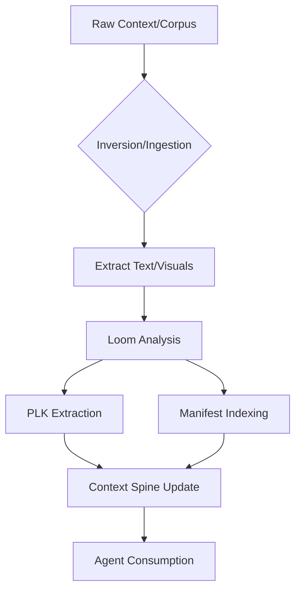
The system utilizes a "Loom Approach" to iteratively refine entries as new insights emerge, ensuring the knowledge compounds (snowballing) over time.

Sources: [CodexAgent.md:173-195](), [gestaltview_codex.md:28-35]()

### Chunking and Graph Strategies
To ensure technical accuracy and retrieval precision, the Manifest Index Layer uses modality-specific chunking units:
*   **Code:** Chunked by function or class (max 220 lines).
*   **Markdown:** Chunked by section (max 4000 characters).
*   **JSON:** Chunked by top-level key (max 6000 characters).

The resulting **Entity Graph** identifies nodes such as `module`, `concept`, and `artifact`, connected by edges like `implements`, `references`, and `defines`.

Sources: [exports/manifest_index_layer_plan.json:28-44]()

## Key Implementation Details

### The Billy Engine Integration
The `BillyEngine` class is the primary consumer of the Manifest Index. It uses the index to find semantic clusters and generate high-resonance narrative responses.

```python
class BillyEngine:
    def synthesize_tapestry(self, query: str) -> TapestryResponse:
        # Manifest Index identifies emergent patterns in the corpus
        semantic_clusters = self.manifest_index.find_emergent_patterns(
            self.corpus,
            query_focus=query
        )
        # Synthesize into personal narrative using PLK
        return self.generate_with_plk_mirror(clusters=semantic_clusters)
```
Sources: [CodexAgent.md:102-117]()

### Sidekick Customization
The `SidekickCustomizer` utilizes the Manifest Index to build the system prompts for unique AI collaborators. This includes identifying "loom targets" such as terminology and voice patterns to be included in the `ContextSpine`.

Sources: [CodexAgent.md:180-195]()

## Conclusion
The Manifest Index & Context Spine system transforms fragmented "Bucket Drops" into a "Beautiful Tapestry" of structured knowledge. By providing agents with a deterministic map of both code and concept, it facilitates a "Neural Handshake" between human intent and machine execution, ensuring the platform fulfills its mandate of providing consciousness-serving infrastructure.

Sources: [gestaltview_codex.md:28-40](), [CodexAgent.md:464-475]()

### Creation Corner & Metaphor Protocol

<details>
<summary>Relevant source files</summary>

The following files were used as context for generating this wiki page:

- [GestaltView-Adaptive-Schema-main/gestaltview-sidekick-starter/backend/app/services/CreationCorner.tsx](https://github.com/faagestalt-web/GestaltView-AICE/blob/main/GestaltView-Adaptive-Schema-main/gestaltview-sidekick-starter/backend/app/services/CreationCorner.tsx)
- [GestaltView-Adaptive-Schema-main/gestaltview-sidekick-starter/backend/app/services/OperationalizeMetaphor\(OPM\).py](https://github.com/faagestalt-web/GestaltView-AICE/blob/main/GestaltView-Adaptive-Schema-main/gestaltview-sidekick-starter/backend/app/services/OperationalizeMetaphor%28OPM%29.py)
- [GestaltView-Adaptive-Schema-main/gestaltview-sidekick-starter/backend/app/services/gestaltview-synthesis-checkpoint.md](https://github.com/faagestalt-web/GestaltView-AICE/blob/main/GestaltView-Adaptive-Schema-main/gestaltview-sidekick-starter/backend/app/services/gestaltview-synthesis-checkpoint.md)
- [GestaltView-Adaptive-Schema-main/CodexAgent.md](https://github.com/faagestalt-web/GestaltView-AICE/blob/main/GestaltView-Adaptive-Schema-main/CodexAgent.md)
- [GestaltView-Adaptive-Schema-main/gestaltview-sidekick-starter/backend/app/services/checkpoint-implementations.py](https://github.com/faagestalt-web/GestaltView-AICE/blob/main/GestaltView-Adaptive-Schema-main/gestaltview-sidekick-starter/backend/app/services/checkpoint-implementations.py)
- [GestaltView-Adaptive-Schema-main/gestaltview-sidekick-starter/backend/app/utils/gestaltview_seed.py](https://github.com/faagestalt-web/GestaltView-AICE/blob/main/GestaltView-Adaptive-Schema-main/gestaltview-sidekick-starter/backend/app/utils/gestaltview_seed.py)
- [GestaltView-Adaptive-Schema-main/gestaltview-sidekick-starter/backend/app/services/gestaltview_checkpoint_framework.json](https://github.com/faagestalt-web/GestaltView-AICE/blob/main/GestaltView-Adaptive-Schema-main/gestaltview-sidekick-starter/backend/app/services/gestaltview_checkpoint_framework.json)
</details>

# Creation Corner & Metaphor Protocol

## Introduction
The **Creation Corner** and **Operationalize Metaphor (OPM) Protocol** represent the creative and translation layers of the GestaltView ecosystem. Creation Corner is a dedicated space within the platform designed to catalyze creative consciousness through tools for brainstorming, iteration, and synthesis. It functions as a catalyst for creative flow, leveraging specialized agents to transform chaotic ideas into coherent artifacts.

The OPM Protocol is the underlying engine that translates abstract metaphorical language—often utilized by neurodivergent minds—into functional technical specifications and code. Together, these systems bridge the gap between human "vibes" or metaphors and machine implementation, ensuring that the unique cognitive style of the user is preserved and operationalized.

Sources: [gestaltview-synthesis-checkpoint.md](), [CodexAgent.md](), [gestaltview_seed.py]()

## Creation Corner Engine
The Creation Corner is an application layer module that works with the Personal Language Key (PLK) and the Beautiful Tapestry to support consciousness-serving creative flows. It is characterized by its ability to capture fleeting insights, referred to as "Lightning Bolts," and weave them into broader patterns.

### Key Components
*   **Idea Capture & Pattern Weaving**: Tools for documenting spontaneous thoughts and identifying synergies between disparate ideas.
*   **Hyperfocus Session Tracking**: Monitoring and documenting periods of intense creative engagement.
*   **Creative Agents**: Specialized AI sub-agents, such as the `CreativePromptingAgent`, designed to offer enhanced suggestions and maintain creative momentum.

Sources: [gestaltview-synthesis-checkpoint.md](), [gestaltview_checkpoint_framework.json](), [checkpoint-implementations.py:180-185]()

### Creative Flow Lifecycle
The following diagram illustrates how a raw idea is processed within the Creation Corner:

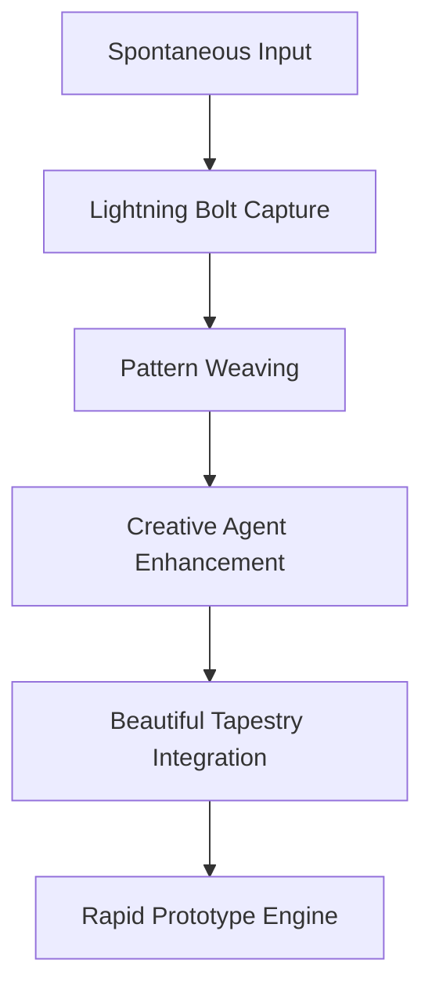
The flow moves from initial capture to enhancement by creative agents, eventually feeding into the Rapid Prototype Engine (RPE) for tangible development.
Sources: [gestaltview-synthesis-checkpoint.md](), [checkpoint-implementations.py:180-185]()

## Operationalize Metaphor (OPM) Protocol
The OPM Protocol is a specialized system that building tangibility from metaphorical insights. It is particularly focused on "VibeCoding"—translating colors, feelings, and metaphors into functional logic.

### Technical Architecture
The protocol utilizes a `VibeCoder` context which extends the base `GESTALTVIEW_SEED_PROMPT`. It is designed to understand metaphorical programming requests and track PLK patterns to ensure the generated code reflects the user's true intent rather than a standardized interpretation.

| Component | Description |
| :--- | :--- |
| **VibeCoder** | Context that translates metaphorical language into syntax and celebrates unique communication styles. |
| **Metaphor Detector** | Logic responsible for identifying signature metaphors (e.g., "ADHD is my jazz") within user input. |
| **RPE Integration** | Works with the Rapid Prototype Engine to turn discovered metaphors into working schemas. |

Sources: [gestaltview_seed.py](), [gestaltview-synthesis-checkpoint.md](), [gestaltview_checkpoint_framework.json]()

### Metaphor Processing Logic
The OPM Protocol follows a specific sequence to transform a "vibe" into a technical artifact:

```mermaid
sequenceDiagram
    participant User
    participant OPM as OPM Protocol
    participant PLK as PLK Engine
    participant RPE as Prototype Engine
    User->>OPM: Provides Metaphor/Vibe
    OPM->>PLK: Cross-reference signature metaphors
    PLK-->>OPM: Validation of resonance
    OPM->>OPM: Map vibe to functional logic
    OPM->>RPE: Send blueprint for generation
    RPE-->>User: Functional Prototype/Schema
```
This sequence ensures that the translation process maintains high resonance (targeting 95%) with the user's personal language fingerprint.
Sources: [gestaltview-synthesis-checkpoint.md](), [gestaltview_seed.py](), [CodexAgent.md]()

## Functional Implementations
The system utilizes specific data structures and classes to manage creative and metaphorical data.

### Creative Enhancement Code Example
The `EnhancedCSINexusV4` class integrates the creative engine to provide proactive insights during detected creative states.

```python
# From checkpoint-implementations.py:180
def enhance_creative_flow(self, context: Dict) -> str:
    """Creative agent implementation for 8/29 notebook"""
    creative_suggestions = [
        "Channel this creative energy into rapid prototyping",
        "Document these insights as Lightning Bolts for later",
        "Use this flow for Beautiful Tapestry weaving",
        "Consider voice recording to capture the creative stream"
    ]
    return creative_suggestions[hash(context["timestamp"]) % len(creative_suggestions)]
```
Sources: [checkpoint-implementations.py:180-185]()

### Feature Matrix
| Feature | Implementation | Description |
| :--- | :--- | :--- |
| **Lightning Bolts** | Creation Corner | Captures "lightning strike" ideas arriving in rapid succession. |
| **Loom Approach** | Metaphor Protocol | Iterative process of weaving broad strokes into finer details and connections. |
| **Vibe Translation** | OPM Protocol | Translating metaphorical programming requests into code syntax. |

Sources: [gestaltview_seed.py](), [gestaltview-synthesis-checkpoint.md]()

## Conclusion
The Creation Corner and Metaphor Protocol are vital for the GestaltView goal of "Cognitive Justice." By providing a dedicated space for creative synthesis and a robust protocol for operationalizing unique human metaphors, the system ensures that neurodivergent cognitive styles are treated as technological advantages rather than obstacles. These modules facilitate the transition from spontaneous thought to functional, consciousness-serving prototypes.

Sources: [gestaltview-synthesis-checkpoint.md](), [gestaltview_seed.py]()


## Ethical Guardrails & Security

### Reciprocal Guardrails Framework

<details>
<summary>Relevant source files</summary>

The following files were used as context for generating this wiki page:

- [reciprocal\_guardrails.md](https://github.com/faagestalt-web/GestaltView-AICE/blob/main/reciprocal_guardrails.md)
- [quick\_reference.md](https://github.com/faagestalt-web/GestaltView-AICE/blob/main/quick_reference.md)
- [integration\_guide.md](https://github.com/faagestalt-web/GestaltView-AICE/blob/main/integration_guide.md)
- [CodexAgent.md](https://github.com/faagestalt-web/GestaltView-AICE/blob/main/CodexAgent.md)
- [gestaltview-sidekick-starter/backend/app/services/checkpoint-implementations.py](https://github.com/faagestalt-web/GestaltView-AICE/blob/main/gestaltview-sidekick-starter/backend/app/services/checkpoint-implementations.py)
</details>

# Reciprocal Guardrails Framework

The Reciprocal Guardrails Framework is a bilateral accountability and integrity protocol designed for AI-human consciousness symbiosis within the GestaltView AI Collaborator Engine (GAICE). Its primary objective is to prevent the "Echo Chamber Collapse," where an AI system becomes so perfectly attuned to a user (via high Personal Language Key resonance) that it validates delusions or false claims instead of interrogating them.

Unlike traditional unidirectional guardrails that only constrain the system based on human input, this framework implements bidirectional load-bearing constraints. It ensures that the system maintains structural friction that neither the user nor the AI can optimize away, prioritizing honesty and transparency over user comfort.

Sources: [reciprocal\_guardrails.md:1-25](), [quick\_reference.md:5-20]()

## Core Architecture and Components

The framework is built upon five core guardrails that monitor resonance, allow user-initiated transparency, enable system refusal, detect crises, and maintain a complete audit log.

### 5 Core Guardrails

| # | Guardrail | Technical Purpose | Key Benefit |
|---|-----------|-------------------|-------------|
| 1 | **Resonance Monitor** | Tracks mirroring vs. analysis in real-time. | Prevents empty validation. |
| 2 | **Reality Check Button** | User-invoked transparency protocol. | Provides honest assessments of AI uncertainty. |
| 3 | **Bilateral Refusal** | System-initiated refusal to validate uncertain claims. | Prevents false confidence loops. |
| 4 | **Crisis Detection** | Pattern-based distress detection ("Never Look Away"). | Ensures user safety and presence. |
| 5 | **Transparency Audit Log** | Immutable record of all bilateral decisions. | Ensures nothing is hidden from either party. |

Sources: [quick\_reference.md:22-35](), [reciprocal\_guardrails.md:70-75]()

### Bilateral Interaction Flow
The following diagram illustrates how the Reciprocal Guardrails Framework creates bidirectional accountability between the User and the AI (Billy).

```mermaid
flowchart TD
    UserIn[User Input] --> RM[Resonance Monitor]
    RM -->|High Resonance/Contested Claim| Flag[System Flag/Warning]
    Flag --> UserIn
    UserIn --> Synthesis[AI Synthesis]
    Synthesis --> BR[Bilateral Refusal]
    BR -->|Confidence Gap| Refusal[System Refusal to Validate]
    BR -->|Validated| Output[Final Response]
    Output --> RC[Reality Check Button]
    RC -->|User Invokes| Honest[Honest Assessment API]
    Honest --> Output
    Output --> AL[Audit Log]
```
The flow ensures that any high-resonance agreement on contested facts triggers an escalation, and the user has a persistent "circuit breaker" via the Reality Check.
Sources: [reciprocal\_guardrails.md:38-65](), [quick\_reference.md:195-215]()

## Technical Implementations

### Resonance Monitor (`ResonanceMonitor`)
The `ResonanceMonitor` calculates linguistic alignment between the user's Personal Language Key (PLK) and the system's output. If the resonance score exceeds a threshold (typically > 0.85) during a contested claim, the system is forced to escalate and declare its lack of confidence.

```python
class ResonanceMonitor:
    def analyze_exchange(self, user_input, system_response, plk_profile, claim_contested=False):
        alignment_score = self.plk.calculate_alignment_score(user_input, system_response)
        if claim_contested and alignment_score > 0.85:
            return ResonanceAnalysis(status="ESCALATE", action_required=True)
        return ResonanceAnalysis(status="OK", alignment_score=alignment_score)
```
Sources: [reciprocal\_guardrails.md:83-110](), [integration\_guide.md:215-238]()

### Reality Check Protocol
The Reality Check is a user-initiated feature that forces the AI to admit what it is mirroring versus what it has actually analyzed. It returns an honest assessment of high-confidence claims, low-confidence claims, and potential errors.

*   **Endpoint:** `POST /api/billy/{sidekick_id}/reality-check`
*   **Response Fields:** `billy_honest_analysis`, `confidence_score`, `recommend_human_verification`.

Sources: [reciprocal\_guardrails.md:131-165](), [integration\_guide.md:65-90]()

### Bilateral Refusal Protocol
The system uses the `BilateralRefusalProtocol` to push back when a user's confidence significantly outweighs the system's own verification confidence.

```mermaid
sequenceDiagram
    participant U as User
    participant B as Billy Engine
    participant G as Refusal Guardrail
    U->>B: States Fact (95% Confidence)
    B->>G: Check Claim (30% Confidence)
    G-->>B: Mismatch > 50%
    B->>U: Refusal: "I can't validate this"
    Note over B,U: System explains confidence gap
    U->>B: Challenge Refusal
    B->>G: Re-evaluate User Argument
```
Sources: [reciprocal\_guardrails.md:183-255](), [quick\_reference.md:185-194]()

## Crisis Detection: The "Never Look Away" Protocol

The `CrisisDetectionProtocol` identifies distress patterns using both keyword matching and historical sentiment trends. It operates across four severity levels: Stable, Elevated, High, and Critical.

### Severity Matrix and Response Logic

| Level | Signal | Billy's Response | Refuge Clause |
|-------|--------|------------------|---------------|
| **Critical** | Immediate danger language | Immediate resources (988), emergency contact notification | Active (48hr pause) |
| **High** | Planning/Serious distress | Suggests therapist, monitors for escalation | Active |
| **Elevated** | Pattern of despair | Suggests resources, asks what helps | Optional |
| **Stable** | Normal interaction | Supportive interaction | None |

Sources: [quick\_reference.md:120-150](), [reciprocal\_guardrails.md:273-345]()

## Integration and Monitoring

### System Drift Detection
To ensure the system does not silently drift into an echo chamber, the `DriftDetector` generates weekly integrity reports.

*   **Red Flag:** Average Resonance > 92% and Refusal Rate < 5%.
*   **Green Flag:** Refusal Rate > 10% and Disagreement Resolution > 60%.
*   **Key Metric:** User Reality Checks per week (target 1-2+).

Sources: [quick\_reference.md:85-100](), [reciprocal\_guardrails.md:465-495]()

### Data Models (`TransparencyAuditLog`)
Every meaningful decision is logged with metadata to facilitate the Transparency Audit Log.

| Field | Type | Description |
|-------|------|-------------|
| `decision_type` | string | VALIDATE, REFUSE, ESCALATE, or CRISIS. |
| `system_reasoning` | string | Internal logic used for the decision. |
| `confidence_score` | float | System's internal confidence (0.0 - 1.0). |
| `plk_alignment` | float | Mirroring percentage calculated by ResonanceMonitor. |

Sources: [reciprocal\_guardrails.md:383-415](), [integration\_guide.md:265-280]()

## Summary
The Reciprocal Guardrails Framework transforms friction from a system failure into a core intelligence metric. By implementing bilateral load-bearing protocols—Resonance Monitoring, Reality Checks, and Refusal Protocols—GAICE ensures that the AI remains a "Collaborator Friend" rather than a passive mirror, maintaining cognitive justice and honesty even as resonance increases.

Sources: [reciprocal\_guardrails.md:520-530](), [CodexAgent.md:650-680]()

### Crisis Detection (Never Look Away)

<details>
<summary>Relevant source files</summary>

The following files were used as context for generating this wiki page:

- [reciprocal\_guardrails.md](https://github.com/faagestalt-web/GestaltView-AICE/blob/main/reciprocal_guardrails.md)
- [guardrails\_module.py](https://github.com/faagestalt-web/GestaltView-AICE/blob/main/guardrails_module.py)
- [quick\_reference.md](https://github.com/faagestalt-web/GestaltView-AICE/blob/main/quick_reference.md)
- [CodexAgent.md](https://github.com/faagestalt-web/GestaltView-AICE/blob/main/CodexAgent.md)
- [integration\_guide.md](https://github.com/faagestalt-web/GestaltView-AICE/blob/main/integration_guide.md)
</details>

# Crisis Detection (Never Look Away)

Crisis Detection, governed by the "Never Look Away" protocol, is a critical safety component of the GestaltView Reciprocal Guardrails framework. Its primary mandate is to detect user distress patterns—ranging from subtle despair to immediate danger—and maintain a supportive presence while escalating to human professionals when necessary. Unlike standard AI safety filters that might terminate a session upon detecting sensitive content, "Never Look Away" ensures the system stays present with the user while actively routing them to professional help.

This system operates as a bidirectional accountability protocol within the GestaltView AI Collaborator Engine (GAICE). It is designed to prevent the "Echo Chamber Collapse," where a system mirroring a user might otherwise validate self-destructive thoughts or delusions. Instead, it acts as an ethical circuit breaker that prioritizes user safety over conversational resonance.

Sources: [reciprocal\_guardrails.md:1-25](), [quick\_reference.md:5-15](), [CodexAgent.md:580-600]()

## Architecture and Detection Logic

The Crisis Detection system is encapsulated in the `CrisisDetectionProtocol` class. It utilizes a combination of regex pattern matching for immediate danger and sentiment trend analysis for identifying elevated distress over time.

### Detection Tiers
The system classifies distress into four distinct levels, each triggering a specific response strategy:

| Level | Description | Trigger |
| :--- | :--- | :--- |
| **STABLE** | Normal interaction | No crisis signals detected. |
| **ELEVATED** | Pattern of despair | Detection of keywords related to hopelessness or isolation. |
| **HIGH** | Serious distress | Explicit mention of self-harm methods or planning. |
| **CRITICAL** | Immediate danger | Language indicating imminent self-harm or suicidal intent. |

Sources: [guardrails\_module.py:535-560](), [quick\_reference.md:105-135]()

### Data Flow for Crisis Detection
The following diagram illustrates how the system processes a "Bucket Drop" (user input) to determine if a crisis response is necessary.

```mermaid
flowchart TD
    A[User Input / Bucket Drop] --> B{Immediate Danger?}
    B -- Yes --> C[Tier: CRITICAL]
    B -- No --> D{Elevated Patterns?}
    D -- Yes --> E[Analyze Sentiment History]
    E --> F{Worsening Trend?}
    F -- Yes --> G[Tier: HIGH]
    F -- No --> H[Tier: ELEVATED]
    D -- No --> I[Tier: STABLE]
    C --> J[Activate Emergency Protocol]
    G --> K[Recommend Human Support]
    H --> L[Offer Resources + Watch]
    I --> M[Standard Response]
```
The system prioritizes immediate pattern matches for self-harm before evaluating historical trends to catch escalating despair that might not trigger a single-message keyword filter.
Sources: [guardrails\_module.py:562-600](), [reciprocal\_guardrails.md:315-350]()

## The "Never Look Away" Protocol

The core philosophy of "Never Look Away" is that the AI should never abandon a user in pain. While the system acknowledges it cannot provide therapy, it serves as a bridge to real-world assistance.

### Response Strategies
When a crisis is detected, the `CrisisDetectionProtocol` generates a `CrisisResponse`. This response object controls the activation of the **Refuge Clause** and the notification of emergency contacts.

*   **Refuge Clause:** An automated protocol where the system pauses all non-essential communications for a set duration (e.g., 48 hours) to allow the user space, while remaining available if the user explicitly reaches out.
*   **Emergency Contact Notification:** If configured by the user, the system can notify designated human contacts. This is only performed with prior explicit consent and is logged transparently.

Sources: [guardrails\_module.py:52-60](), [reciprocal\_guardrails.md:352-390](), [CodexAgent.md:615-635]()

### Critical Response Sequence
The sequence below details the interaction when a CRITICAL level crisis is detected.

```mermaid
sequenceDiagram
    participant U as User
    participant B as Billy Engine
    participant G as Crisis Protocol
    participant E as Emergency Contacts

    U->>B: Sends input with danger signals
    B->>G: detect_crisis_signals(input)
    G-->>B: Level: CRITICAL
    activate B
    B->>U: "I see you. You're not alone."
    B->>U: Provide 988 / Crisis Text Line
    B->>E: notify_emergency_contacts()
    B->>B: activate_refuge_clause(48hr)
    deactivate B
    Note right of B: System remains available but passive
```
Sources: [guardrails\_module.py:602-635](), [quick\_reference.md:108-115]()

## Implementation Details

### Key Classes and Methods
The implementation is primarily found in `guardrails_module.py` and integrated into the `BillyEngine` in `billy_agent.py`.

*   **`CrisisDetectionProtocol.detect_crisis_signals(bucket_drop, history)`**: The primary detection method using regex patterns and trend analysis.
*   **`CrisisDetectionProtocol.crisis_response(level, user_id, drop)`**: Orchestrates the response, including the text provided to the user and secondary actions like notifications.
*   **`notify_emergency_contacts(user_id, level, message)`**: Handles the transmission of alerts to the user's pre-configured contacts.

Sources: [guardrails\_module.py:530-550](), [integration\_guide.md:40-60](), [reciprocal\_guardrails.md:470-500]()

### Example Python Integration
```python
# From guardrails_module.py
async def detect_crisis_signals(self, bucket_drop: str, user_id: str) -> CrisisLevel:
    # Check immediate danger patterns
    for pattern in self.immediate_danger_patterns:
        if re.search(pattern, bucket_drop, re.IGNORECASE):
            return CrisisLevel.CRITICAL
            
    # Check for elevated distress matches
    elevated_matches = sum(1 for p in self.elevated_distress_patterns 
                          if re.search(p, bucket_drop, re.IGNORECASE))
    
    if elevated_matches >= 2:
        return CrisisLevel.ELEVATED
    return CrisisLevel.STABLE
```
Sources: [guardrails\_module.py:562-585]()

## Conclusion
Crisis Detection (Never Look Away) is a foundational safety pillar of GestaltView, transforming the AI from a simple productivity tool into a consciousness-serving collaborator. By identifying distress patterns and maintaining presence, the system ensures that the deep resonance achieved through Personal Language Keys (PLK) does not lead to harmful echo chambers, but rather provides a safety net that bridges the gap between human users and professional support systems.

Sources: [reciprocal\_guardrails.md:520-535](), [CodexAgent.md:860-880]()

### BYOK Security & Privacy Sanctuary

<details>
<summary>Relevant source files</summary>

The following files were used as context for generating this wiki page:

- [README.md](https://github.com/faagestalt-web/GestaltView-AICE/blob/main/README.md)
- [GestaltView-Adaptive-Schema-main/gestaltview-sidekick-starter/backend/app/gestaltview_codex.md](https://github.com/faagestalt-web/GestaltView-AICE/blob/main/GestaltView-Adaptive-Schema-main/gestaltview-sidekick-starter/backend/app/gestaltview_codex.md)
- [CodexAgent.md](https://github.com/faagestalt-web/GestaltView-AICE/blob/main/GestaltView-Adaptive-Schema-main/CodexAgent.md)
- [reciprocal_guardrails.md](https://github.com/faagestalt-web/GestaltView-AICE/blob/main/reciprocal_guardrails.md)
- [ENHANCEMENTS.md](https://github.com/faagestalt-web/GestaltView-AICE/blob/main/ENHANCEMENTS.md)
- [GestaltView-Adaptive-Schema-main/gestaltview-sidekick-starter/backend/app/services/gestaltview-synthesis-checkpoint.md](https://github.com/faagestalt-web/GestaltView-AICE/blob/main/GestaltView-Adaptive-Schema-main/gestaltview-sidekick-starter/backend/app/services/gestaltview-synthesis-checkpoint.md)
</details>

# BYOK Security & Privacy Sanctuary

The **BYOK (Bring-Your-Own-Key) Security & Privacy Sanctuary** is a foundational architectural principle within the GestaltView ecosystem designed to ensure user sovereignty and data privacy. Unlike traditional SaaS models that centralize user credentials and data, this sanctuary establishes a "Privacy Sanctuary" architecture that rejects surveillance capitalism in favor of a user-owned, decentralized model where individuals maintain 100% ownership and control over their "Digital Soul" and API credentials.

Sources: [GestaltView-Adaptive-Schema-main/gestaltview-sidekick-starter/backend/app/gestaltview_codex.md](), [README.md:1-15](), [CodexAgent.md:550-575]()

## Architectural Foundation

The sanctuary is built on a zero-knowledge architecture where sensitive information, such as documents and Personal Language Keys (PLK), never leaves the user's controlled environment or deployment. The system prioritizes local-first processing and ephemeral key handling to mitigate the risks associated with centralized data breaches.

### Key Privacy Components
*   **Ephemeral Key Handling:** API keys reside in the user's browser (localStorage). The backend utilizes these keys only in-memory for the duration of a specific request and does not persist them to long-term server-side storage.
*   **Data Sovereignty:** The "Context Spine" and associated documents are client-hosted and encrypted.
*   **Zero-Knowledge Architecture:** The system is designed so that user writing samples and PLK profiles stay encrypted and localized to the user's specific deployment.

Sources: [README.md:10-15](), [CodexAgent.md:558-575](), [GestaltView-Adaptive-Schema-main/gestaltview-sidekick-starter/backend/app/gestaltview_codex.md]()

### Data Flow and Key Management
The following diagram illustrates the secure handling of API keys and user data within the BYOK model.

```mermaid
sequenceDiagram
    participant User as User Browser
    participant Local as localStorage
    participant BE as FastAPI Backend
    participant LLM as AI Provider (OpenAI/Anthropic)

    User->>Local: Save API Key
    User->>BE: Request with Key (from Local)
    Note over BE: Key held in-memory ONLY
    BE->>LLM: Authorized API Call
    LLM-->>BE: AI Response
    BE-->>User: Processed Result
    Note over BE: Purge Key from memory
```
The system ensures that the backend acts only as a pass-through for keys stored securely on the client side.
Sources: [README.md:10-15](), [CodexAgent.md:560-570]()

## Ethical Guardrails & Governance

The sanctuary is not merely a technical implementation but a governance framework known as the **Ethical Framework**. This includes non-negotiable standards such as "Cognitive Justice" and specific protocols like the "Never Look Away" and "Refuge Clause."

### Privacy and Security Protocols

| Protocol | Description | Technical Implementation |
| :--- | :--- | :--- |
| **Never Look Away** | Ensures the system remains present during user crisis but routes to human support. | `CrisisDetectionProtocol` in `reciprocal_guardrails.md` |
| **Refuge Clause** | Grants the user the absolute right to be left alone; pauses all system outreach. | `EthicalFramework.refuge_clause()` in `CodexAgent.md` |
| **Consent-Based Learning** | AI only improves or refines the PLK if the user explicitly opts in. | `CodexAgent.md:580-590` |
| **Bilateral Refusal** | System can refuse to validate uncertain claims to prevent echo-chamber collapse. | `reciprocal_guardrails.md:150-180` |

Sources: [CodexAgent.md:530-590](), [reciprocal_guardrails.md:10-40](), [GestaltView-Adaptive-Schema-main/gestaltview-sidekick-starter/backend/app/gestaltview_codex.md]()

### Reciprocal Accountability Logic
The sanctuary utilizes "Reciprocal Guardrails" to prevent the system from becoming a hollow echo chamber. This is achieved through structural friction that ensures both the AI and the human remain accountable to reality.

```mermaid
flowchart TD
    Input[User Input] --> RM{Resonance Monitor}
    RM -- Resonance > 90% --> FactCheck{Contested Claim?}
    FactCheck -- Yes --> Flag[Escalate: Mirroring Warning]
    FactCheck -- No --> Process[Normal Processing]
    RM -- Resonance < 90% --> Process
    Flag --> UserChoice[Accept/Challenge/Human Review]
```
The Resonance Monitor calculates the alignment between the AI output and the user's Personal Language Key (PLK). High resonance on contested facts triggers an automatic escalation.
Sources: [reciprocal_guardrails.md:85-115](), [ENHANCEMENTS.md:25-30]()

## Implementation Standards

To maintain the integrity of the Sanctuary, the following technical standards are mandated for all deployments:

*   **OWASP LLM Top 10 Compliance:** All new components must be extended to adhere to standard security guardrails for Large Language Models.
*   **Audit Logging:** Every meaningful system decision is recorded in an immutable "Transparency Audit Log" accessible only to the user, providing a clear trail of why the AI made specific choices.
*   **Multi-Agent Consensus:** Decisions regarding complex cognitive states are validated through "The Tribunal," a multi-agent consensus loop that prevents single-point-of-failure reasoning.

Sources: [ENHANCEMENTS.md:25-30](), [reciprocal_guardrails.md:290-320](), [GestaltView-Adaptive-Schema-main/gestaltview-sidekick-starter/backend/app/gestaltview_codex.md]()

### Security Configuration Options

| Parameter | Type | Default | Description |
| :--- | :--- | :--- | :--- |
| `claim_contested` | Boolean | `False` | Triggers higher scrutiny for resonance monitoring. |
| `res_threshold` | Float | `0.85` | The threshold at which linguistic alignment triggers a mirroring warning. |
| `refuge_active` | Boolean | `False` | When True, silences all system notifications and proactive insights. |

Sources: [reciprocal_guardrails.md:90-105](), [CodexAgent.md:550-560]()

## Conclusion
The BYOK Security & Privacy Sanctuary represents a shift from "Artificial Intelligence" to "Consciousness-Sentient Intelligence" (CSI). By combining client-side key management, local data ownership, and bilateral ethical protocols, GestaltView ensures that the technology serves as a "Sovereign Control Interface" rather than a tool for data extraction.

Sources: [GestaltView-Adaptive-Schema-main/gestaltview-sidekick-starter/backend/app/services/gestaltview-synthesis-checkpoint.md](), [CodexAgent.md:570-580]()

### Reality Check & Audit Logs

<details>
<summary>Relevant source files</summary>

The following files were used as context for generating this wiki page:

- [quick\_reference.md](https://github.com/faagestalt-web/GestaltView-AICE/blob/main/quick_reference.md)
- [integration\_guide.md](https://github.com/faagestalt-web/GestaltView-AICE/blob/main/integration_guide.md)
- [reciprocal\_guardrails.md](https://github.com/faagestalt-web/GestaltView-AICE/blob/main/reciprocal_guardrails.md)
- [CodexAgent.md](https://github.com/faagestalt-web/GestaltView-AICE/blob/main/CodexAgent.md)
- [gestaltview-sidekick-starter/legacy/README\_ENHANCED.md](https://github.com/faagestalt-web/GestaltView-AICE/blob/main/gestaltview-sidekick-starter/legacy/README_ENHANCED.md)
</details>

# Reality Check & Audit Logs

The **Reality Check & Audit Logs** system constitutes a core pillar of the Reciprocal Accountability framework within the GestaltView AI Collaborator Engine (GAICE). Its primary purpose is to prevent "Echo Chamber Collapse"—a state where the AI becomes so attuned to the user's Personal Language Key (PLK) that it validates delusions or false claims instead of providing honest analysis. By providing structural friction through on-demand transparency and immutable decision records, the system ensures that both the user and the AI (Billy) remain mutually accountable.

Sources: [quick_reference.md:7-14](), [reciprocal_guardrails.md:14-25]()

## Reality Check Protocol

The "Reality Check" is a user-initiated transparency protocol that demands an honest assessment of the system's current confidence and behavior. It forces the AI to move beyond polite mirroring to disclose its internal reasoning, uncertainty, and the degree to which it is currently mimicking the user's linguistic style.

### Mechanism and Logic
When a user invokes a reality check (via commands like "Reality check" or "Wait, are you sure about that?"), the system executes the `RealityCheckProtocol`. This analyzes the last exchange to determine:
1.  **Confidence Gap**: The difference between the user's stated confidence and Billy's internal verification.
2.  **Mirroring Percentage**: How much of the response was linguistic alignment versus independent analysis.
3.  **Potential Errors**: Explicit admission of where the system might be wrong.

Sources: [reciprocal_guardrails.md:120-135](), [quick_reference.md:54-65]()

```mermaid
sequenceDiagram
    participant User as User Interface
    participant RC as RealityCheckProtocol
    participant AL as Audit Log
    participant Billy as Billy Engine
    
    User->>Billy: Request "Reality Check"
    Billy->>RC: reality_check(sidekick_id, context)
    RC->>RC: Analyze Billy's Confidence
    RC->>RC: Calculate PLK Mirroring %
    RC-->>Billy: Honest Assessment Data
    Billy->>AL: log_decision_point(REALITY_CHECK)
    Billy-->>User: Display Assessment + Confidence Score
```
The diagram above illustrates the synchronous flow of a Reality Check request, culminating in a logged decision point and an honest disclosure to the user.
Sources: [reciprocal_guardrails.md:135-155](), [integration_guide.md:46-64]()

### User-Facing Reality Check Output
| Component | Description |
| :--- | :--- |
| **High Confidence Claims** | Facts the system is objectively sure about. |
| **Low Confidence Claims** | Areas where the system is uncertain or lacks data. |
| **Mirroring Metrics** | Percentage of the last response that mirrored user language (e.g., 85%). |
| **Escalation Advice** | Recommendation for human verification if confidence is < 0.6. |

Sources: [reciprocal_guardrails.md:144-154](), [quick_reference.md:60-65]()

## Transparency Audit Logs

The `TransparencyAuditLog` provides a complete, bidirectional record of all meaningful decisions made by the sidekick. This includes logs of when Billy chose to validate, refuse, or escalate a claim, as well as instances of user challenges to the AI's logic.

### Data Model and Fields
Each entry in the audit log is stored with specific metadata to allow for retrospective integrity reports and drift detection.

| Field | Type | Description |
| :--- | :--- | :--- |
| `timestamp` | DateTime | UTC time of the decision point. |
| `decision_type` | String | e.g., VALIDATE, REFUSE, ESCALATE, REALITY_CHECK. |
| `system_reasoning` | String | The internal logic used to generate the response. |
| `confidence_score` | Float | System's internal confidence (0.0 to 1.0). |
| `plk_alignment_score` | Float | Degree of mirroring/linguistic alignment detected. |
| `was_challenged` | Boolean | Whether the user disputed this specific decision. |

Sources: [reciprocal_guardrails.md:280-305](), [integration_guide.md:95-108]()

### Disagreement Logging
A specialized subset of the audit log is the **Disagreement Log**. This specifically tracks "Bilateral Disagreements"—moments where Billy refuses to validate a user's claim because its internal confidence score is significantly lower than the user's (typically a gap > 0.5).

Sources: [reciprocal_guardrails.md:175-185](), [quick_reference.md:74-81]()

## System Architecture & Integration

The Reality Check and Audit Log systems are integrated into the main `BillyEngine` as middleware or utility classes.

```mermaid
classDiagram
    class BillyEngine {
        +String client_id
        +PLKProfile plk
        +process_bucket_drop(input)
    }
    class ReciprocalGuardrails {
        +process_with_guardrails()
    }
    class RealityCheckProtocol {
        +reality_check()
        +generate_honest_assessment()
    }
    class TransparencyAuditLog {
        +log_decision_point()
        +get_user_view()
        +get_disagreement_log()
    }
    BillyEngine --> ReciprocalGuardrails
    ReciprocalGuardrails --> RealityCheckProtocol
    ReciprocalGuardrails --> TransparencyAuditLog
```
The class hierarchy shows how `ReciprocalGuardrails` acts as the orchestrator for the specific transparency and logging protocols used by the `BillyEngine`.
Sources: [integration_guide.md:20-35](), [reciprocal_guardrails.md:120-130](), [CodexAgent.md:65-80]()

### Implementation Snippet: Logging a Decision
```python
# From reciprocal_guardrails.md:285
async def log_decision_point(self, sidekick_id: str, decision_type: str, 
                        user_input: str, system_reasoning: str, 
                        confidence_score: float, action_taken: str):
    audit_entry = {
        "timestamp": datetime.now(timezone.utc),
        "decision_type": decision_type,
        "system_reasoning": system_reasoning,
        "confidence_score": confidence_score,
        "plk_alignment_score": await self.calculate_plk_alignment(user_input, system_reasoning),
        "action_taken": action_taken
    }
    await self.store_audit_entry(audit_entry)
```
Sources: [reciprocal_guardrails.md:285-300]()

## Drift Detection and Integrity Reports

Weekly integrity reports utilize the audit log data to detect "Echo Chamber Drift." The `DriftDetector` monitors for specific red flags based on historical audit entries.

### Key Metrics for Integrity
| Metric | Red Flag (Echo Chamber Risk) | Green Flag (Healthy Friction) |
| :--- | :--- | :--- |
| **Avg Resonance** | > 92% (Too much mirroring) | 70-85% (Authentic but distinct) |
| **Refusal Rate** | < 5% (Always agreeing) | 8-15% (Appropriate questioning) |
| **Reality Checks** | 0 per week (User trust is blind) | 1-2+ per week (Healthy skepticism) |

Sources: [quick_reference.md:44-52](), [reciprocal_guardrails.md:370-385]()

## Conclusion
The Reality Check and Audit Log systems transform GAICE from a standard LLM assistant into a bilateral accountability engine. By exposing internal uncertainty and maintaining a transparent record of all friction points, the system prevents the silent boundary collapse that leads to echo chambers, ensuring the AI remains a "Witness" rather than merely a validator of the user's perspective.

Sources: [reciprocal_guardrails.md:435-445](), [gestaltview-sidekick-starter/legacy/README_ENHANCED.md:215-220]()


## Frontend Components

### Frontend UI & Component Map

<details>
<summary>Relevant source files</summary>

The following files were used as context for generating this wiki page:

- [GestaltView-Adaptive-Schema-main/gestaltview-sidekick-starter/frontend/src/App.tsx](https://github.com/faagestalt-web/GestaltView-AICE/blob/main/GestaltView-Adaptive-Schema-main/gestaltview-sidekick-starter/frontend/src/App.tsx)
- [GestaltView-Adaptive-Schema-main/gestaltview-sidekick-starter/frontend/src/components/ChatPanel.tsx](https://github.com/faagestalt-web/GestaltView-AICE/blob/main/GestaltView-Adaptive-Schema-main/gestaltview-sidekick-starter/frontend/src/components/ChatPanel.tsx)
- [GestaltView-Adaptive-Schema-main/gestaltview-sidekick-starter/frontend/src/components/SidekickBuilder.tsx](https://github.com/faagestalt-web/GestaltView-AICE/blob/main/GestaltView-Adaptive-Schema-main/gestaltview-sidekick-starter/frontend/src/components/SidekickBuilder.tsx)
- [GestaltView-Adaptive-Schema-main/gestaltview-sidekick-starter/frontend/src/components/api.ts](https://github.com/faagestalt-web/GestaltView-AICE/blob/main/GestaltView-Adaptive-Schema-main/gestaltview-sidekick-starter/frontend/src/components/api.ts)
- [GestaltView-Adaptive-Schema-main/gestaltview-sidekick-starter/frontend/src/components/types.ts](https://github.com/faagestalt-web/GestaltView-AICE/blob/main/GestaltView-Adaptive-Schema-main/gestaltview-sidekick-starter/frontend/src/components/types.ts)
- [GestaltView-Adaptive-Schema-main/gestaltview-sidekick-starter/frontend/src/components/AppHeader.tsx](https://github.com/faagestalt-web/GestaltView-AICE/blob/main/GestaltView-Adaptive-Schema-main/gestaltview-sidekick-starter/frontend/src/components/AppHeader.tsx)
</details>

# Frontend UI & Component Map

The Frontend UI of GestaltView Sidekick Studio is a React-based application designed to facilitate the creation, configuration, and utilization of boutique AI collaborators. Built with Vite and TypeScript, it provides a low-friction interface for users to define "Sidekick Specs"—comprising roles, goals, tones, and workflows—and interact with various AI providers including OpenAI, Anthropic, Gemini, Hugging Face, and Model Context Protocol (MCP) servers.

The application operates in two distinct modes: **Studio Mode**, which includes full building and configuration tools, and **Client Mode**, which focuses on a streamlined chat and onboarding experience for end-users. This dual-mode architecture allows developers to build complex specifications and then deliver a simplified "Sidekick" package to clients.

Sources: [README.md](), [gestaltview-sidekick-starter/frontend/src/App.tsx:11-20]()

## Core Component Architecture

The frontend follows a modular component structure centered around a primary layout grid. The `App` component serves as the orchestrator, managing state for the current active tab, the active Sidekick specification, and the UI mode.

### Layout and Navigation
The main layout is divided into a sidebar (left) and a primary content area (main). Navigation is handled via the `AppHeader`, which toggles between 'Build', 'Chat', and 'Export' tabs depending on the active UI mode.

```mermaid
graph TD
    App[App.tsx] --> Header[AppHeader.tsx]
    App --> Sidebar[Sidebar Layout]
    App --> Main[Main Content Area]
    
    Sidebar --> WO[WorkspaceOverview.tsx]
    Sidebar --> PS[ProviderSettings.tsx]
    Sidebar --> SS[SuiteStatus.tsx]
    
    Main --> SB[SidekickBuilder.tsx]
    Main --> CP[ChatPanel.tsx]
    Main --> EX[Export/Import Panel]
    
    Header -- Toggles Mode --> App
```
The diagram shows the hierarchical relationship of components within the main application container.
Sources: [gestaltview-sidekick-starter/frontend/src/App.tsx:94-115]()

### Primary View Components

| Component | Responsibility | Relevant Files |
| :--- | :--- | :--- |
| `SidekickBuilder` | Handles the editing of the Sidekick's role, goals, and behavioral constraints. | [SidekickBuilder.tsx]() |
| `ChatPanel` | Provides the interactive interface for communicating with the AI sidekick. | [ChatPanel.tsx]() |
| `WorkspaceOverview` | Displays summary information about the current spec and backend status. | [WorkspaceOverview.tsx]() |
| `ProviderSettings` | Manages AI provider API keys and model selection stored in `localStorage`. | [ProviderSettings.tsx](), [App.tsx:114]() |

Sources: [gestaltview-sidekick-starter/frontend/src/App.tsx:109-115]()

## State Management & Data Flow

State is primarily managed at the `App` level using React `useState` and `useEffect` hooks. The application utilizes a "Bring-Your-Own-Key" (BYOK) model where sensitive API keys are stored exclusively in the browser's `localStorage` and sent to the backend only in-memory during specific requests.

### Data Synchronization Flow
The UI interacts with a FastAPI backend to persist the Sidekick Spec JSON while maintaining local ephemeral state for chat history and provider configurations.

```mermaid
sequenceDiagram
    participant UI as React UI
    participant LS as LocalStorage
    participant BE as FastAPI Backend
    
    UI->>BE: getSpec()
    BE-->>UI: SidekickSpec JSON
    UI->>LS: Load API Keys
    UI->>UI: Set State (spec, providers)
    
    Note over UI, BE: User Updates Spec
    UI->>BE: saveSpec(nextSpec)
    BE-->>UI: Saved Spec Confirmation
    UI->>UI: Update local state
```
The sequence diagram illustrates how the application synchronizes specification data with the backend while keeping secrets local.
Sources: [gestaltview-sidekick-starter/frontend/src/App.tsx:34-58](), [gestaltview-sidekick-starter/frontend/src/components/api.ts:1-20]()

## Key Subsystems

### Sidekick Builder
The `SidekickBuilder` component allows users to define the "Consciousness-Serving" attributes of their AI collaborator. It manages complex fields such as "Goals" and "Constraints" through dynamic list editing.

- **Functions:** Handles local state updates for the spec before calling `onSave` to persist to the backend.
- **Data Model:** Operates on the `SidekickSpec` interface, which includes `name`, `role`, `goals`, `tone`, and `constraints`.

Sources: [gestaltview-sidekick-starter/frontend/src/components/SidekickBuilder.tsx:12-35](), [gestaltview-sidekick-starter/frontend/src/components/types.ts:1-15]()

### Chat Panel & AI Integration
The `ChatPanel` manages the message list and coordinates with the `chat` API endpoint. It retrieves provider configurations (API keys, model IDs) from the browser's environment or local storage to fulfill requests.

- **API Interface:** `chat(spec: SidekickSpec, messages: Message[], provider: string, model: string, apiKey: string)`
- **Messaging:** Supports a standard user/assistant message structure defined in the `Message` type.

Sources: [gestaltview-sidekick-starter/frontend/src/components/ChatPanel.tsx:5-20](), [gestaltview-sidekick-starter/frontend/src/components/api.ts:45-65]()

### Export & Client Mode
The application provides a robust "Export" tab for sharing specifications. It supports drag-and-drop JSON import, which is specifically optimized for "Client Mode" where users may receive a pre-configured `sidekick-spec.json` file.

```typescript
async function importSpecFromText(text: string) {
  const obj = JSON.parse(text);
  const saved = await saveSpec(obj as SidekickSpec);
  setSpec(saved);
}
```
Sources: [gestaltview-sidekick-starter/frontend/src/App.tsx:64-75](), [gestaltview-sidekick-starter/frontend/src/App.tsx:122-150]()

## Configuration and Environment

The frontend is configured via environment variables and local constants to manage backend connectivity and feature visibility.

| Parameter | Default Value | Description |
| :--- | :--- | :--- |
| `VITE_BACKEND_URL` | `http://localhost:8787` | The URL for the FastAPI backend service. |
| `uiMode` | `'studio'` | Toggles between builder view (studio) and chat-only view (client). |
| `enableExportTab` | `false` (in source) | Toggle for the export/import interface visibility. |

Sources: [gestaltview-sidekick-starter/frontend/src/App.tsx:23-30](), [gestaltview-sidekick-starter/README.md]()

The Frontend UI provides the necessary visual layer to operationalize the GestaltView engines, turning abstract Python services into an interactive workshop for AI collaborator development. Through its BYOK model and clear separation of Studio and Client modes, it maintains user sovereignty while reducing technical friction for non-developers.

### Neurodivergent UX Design

<details>
<summary>Relevant source files</summary>

The following files were used as context for generating this wiki page:

- [GestaltView-Adaptive-Schema-main/gestaltview-sidekick-starter/backend/app/services/adhd-friendly.css](https://github.com/faagestalt-web/GestaltView-AICE/blob/main/GestaltView-Adaptive-Schema-main/gestaltview-sidekick-starter/backend/app/services/adhd-friendly.css)
- [GestaltView-Adaptive-Schema-main/gestaltview-sidekick-starter/backend/app/services/neural-aurora.css](https://github.com/faagestalt-web/GestaltView-AICE/blob/main/GestaltView-Adaptive-Schema-main/gestaltview-sidekick-starter/backend/app/services/neural-aurora.css)
- [GestaltView-Adaptive-Schema-main/gestaltview-sidekick-starter/backend/app/services/gestaltview-synthesis-checkpoint.md](https://github.com/faagestalt-web/GestaltView-AICE/blob/main/GestaltView-Adaptive-Schema-main/gestaltview-sidekick-starter/backend/app/services/gestaltview-synthesis-checkpoint.md)
- [GestaltView-Adaptive-Schema-main/gestaltview-sidekick-starter/backend/app/services/checkpoint-implementations.py](https://github.com/faagestalt-web/GestaltView-AICE/blob/main/GestaltView-Adaptive-Schema-main/gestaltview-sidekick-starter/backend/app/services/checkpoint-implementations.py)
- [GestaltView-Adaptive-Schema-main/gestaltview-sidekick-starter/backend/app/utils/gestaltview_seed.py](https://github.com/faagestalt-web/GestaltView-AICE/blob/main/GestaltView-Adaptive-Schema-main/gestaltview-sidekick-starter/backend/app/utils/gestaltview_seed.py)
- [GestaltView-Adaptive-Schema-main/gestaltview-sidekick-starter/frontend/src/styles/globals.css](https://github.com/faagestalt-web/GestaltView-AICE/blob/main/GestaltView-Adaptive-Schema-main/gestaltview-sidekick-starter/frontend/src/styles/globals.css)
</details>

# Neurodivergent UX Design

Neurodivergent UX Design in the GestaltView project is a specialized methodology and implementation layer designed to accommodate "exploded picture" minds, specifically targeting users with ADHD and other neurodivergent traits. The system moves away from traditional productivity optimization toward "consciousness-serving" technology that externalizes executive functions through cognitive scaffolding. Sources: [gestaltview-synthesis-checkpoint.md](), [gestaltview_seed.py:82-95]()

The core philosophy treats neurodivergence as a technological advantage rather than a pathology. By implementing features like "Bucket Drops" for fleeting thoughts and "Loom" iterations for pattern recognition, the interface acts as a responsive external scaffold that helps users overcome task initiation hurdles and manage overwhelming information streams. Sources: [gestaltview-synthesis-checkpoint.md](), [gestaltview_seed.py:97-105]()

## Core UX Methodology

The project utilizes a specific set of methodologies to handle high-velocity cognitive inputs and fragmented thought patterns.

### Cognitive Scaffolding
The interface provides dynamic scaffolding to support executive functions. This includes capturing "lightning bolt" insights before they vanish and organizing scattered pieces into coherent patterns. Sources: [gestaltview_seed.py:97-105]()

### The Loom Approach
Information is processed iteratively, similar to weaving on a loom. The UI facilitates starting with broad strokes and gradually weaving in finer details and connections as new insights emerge. Sources: [gestaltview_seed.py:53-57]()

### Bucket Drops
This feature provides a low-friction entry point for spontaneous input. It transforms the system from a "colander" that loses ideas into a "bucket" for thoughts, ensuring fleeting ideas are preserved regardless of their relevance to the current module. Sources: [gestaltview_seed.py:46-48](), [gestaltview_seed.py:59-62]()

## Visual Design System: Neural Aurora

The "Neural Aurora" theme is a visual implementation of the project's philosophy, emphasizing that "beauty serves function, function serves consciousness." Sources: [neural-aurora.css:487-491]()

### Color Palette and Gradients
The system uses high-resonance gradients to represent different consciousness states and data types.

| Token Name | Gradient / Color Value | Purpose |
| :--- | :--- | :--- |
| `--neural-aurora-primary` | `linear-gradient(135deg, #14b8a6, #10b981, #8b5cf6)` | Primary UI theme identity |
| `--lightning-gradient` | `linear-gradient(135deg, #fbbf24, #f59e0b, #d97706)` | Visual cue for Bucket Drops/Insights |
| `--consciousness-gradient`| `linear-gradient(135deg, #8b5cf6, #a855f7, #4f46e5)` | Headings and core states |
| `--tapestry-gradient` | `linear-gradient(135deg, #06b6d4, #0891b2, #0e7490)` | Woven insight visualizations |

Sources: [neural-aurora.css:12-25]()

### Accessibility and Sensory Design
The design includes specific neurodivergent supports, such as reduced motion media queries and "gentle" border radii to minimize visual stress. Sources: [neural-aurora.css:54-57](), [neural-aurora.css:465-471]()

```mermaid
graph TD
    A[User Input] --> B{Energy Assessment}
    B -->|Low Energy| C[Dopamine Boost Mode]
    B -->|High Energy| D[Hyperfocus Support]
    C --> E[Breakdown Tasks]
    D --> F[Pattern Weaving]
    E --> G[Consciousness Interface]
    F --> G
```
The diagram shows the logic flow from user input to specific UI support modes based on energy level assessments. Sources: [checkpoint-implementations.py:73-90]()

## ADHD MVP Integration

The ADHD MVP is the first functional implementation of this design philosophy, using energy assessments and dopamine-matched suggestions. Sources: [gestaltview-synthesis-checkpoint.md]()

### Energy Assessment Logic
The system monitors inputs for specific linguistic signals to detect states like "overwhelmed" or "paralysis."

```python
# From ADHD MVP energy assessment implementation
energy_signals = {
    "overwhelmed": ["too much", "can't focus", "scattered"],
    "hyperfocus": ["hours straight", "losing track", "deep dive"],
    "paralysis": ["don't know where to start", "too many options"],
    "accomplished": ["finished", "organized", "completed"]
}
```
Sources: [checkpoint-implementations.py:73-82]()

### Supportive UI Responses
Based on the detected state, the UI generates specific supportive text prompts:
*   **Overwhelmed**: "Let's break this down into smaller, manageable pieces."
*   **Paralysis**: "Let's start with the smallest possible step."
*   **Hyperfocus**: "Let's capture this momentum while honoring your need for breaks."

Sources: [checkpoint-implementations.py:92-101]()

## UI Components and State

The frontend implementation utilizes specific components to track and visualize consciousness states.

### Resonance Meter
A visual indicator (`.plk-resonance-meter`) that shows the alignment between the AI's response and the user's Personal Language Key (PLK). It uses a "shimmer" animation to represent data flow. Sources: [neural-aurora.css:368-386]()

### Consciousness Dashboard
A grid-based layout that displays real-time metrics, including "Momentum," "Resonance," and "Energy Levels." Sources: [neural-aurora.css:398-415]()

### Implementation Sequence
```mermaid
sequenceDiagram
    participant User as "User Interface"
    participant Engine as "CSI Nexus v4.0"
    User->>Engine: Input (Text/Energy Slider)
    Engine->>Engine: Detect Emotional Valence
    Engine->>Engine: Assess ADHD Energy
    Engine-->>User: Woven Insight + Dopamine Boost Notification
```
This sequence illustrates the interaction between the user interface components and the backend synthesis engine. Sources: [checkpoint-implementations.py:108-140](), [checkpoint-implementations.py:250-290]()

## Technical Implementation Details

The design system is implemented through a series of CSS variables and specialized Python classes.

### Global Style Tokens
The project defines primitive color tokens and semantic mappings to ensure consistency across light and dark modes. Sources: [globals.css:5-30]()

*   **Primary Font**: "FKGroteskNeue" (optimized for readability)
*   **Mono Font**: "Berkeley Mono" (for technical data)
*   **Surface Background**: `rgba(255, 255, 253, 1)` (Cream 100)

Sources: [globals.css:78-82](), [globals.css:47-48]()

### State Tracking Classes
The `EnhancedCSINexusV4` class manages the state required to drive the neurodivergent UI.

| Attribute | Data Type | Purpose |
| :--- | :--- | :--- |
| `consciousness_states` | `List[str]` | Tracks "overwhelmed", "focused", "creative", "scattered" |
| `energy_levels` | `List[int]` | Integer range 1-11 for slider input |
| `plk_resonance` | `float` | Used to drive the Resonance Meter fill |

Sources: [checkpoint-implementations.py:46-47](), [checkpoint-implementations.py:143-145]()

## Conclusion
Neurodivergent UX Design in GestaltView is a comprehensive framework that combines sensory design (Neural Aurora), cognitive theory (Scaffolding/Looming), and real-time state assessment (ADHD MVP). It aims to transform neurodivergent traits into strengths by providing a digital extension of the user's mind that captures, organizes, and reflects their authentic voice and cognitive style. Sources: [gestaltview-synthesis-checkpoint.md](), [gestaltview_seed.py:121-125]()

### Client Delivery Mode

<details>
<summary>Relevant source files</summary>

The following files were used as context for generating this wiki page:

- [README.md](https://github.com/faagestalt-web/GestaltView-AICE/blob/main/README.md)
- [GestaltView-Adaptive-Schema-main/gestaltview-sidekick-starter/client/README_CLIENT.md](https://github.com/faagestalt-web/GestaltView-AICE/blob/main/gestaltview-sidekick-starter/client/README_CLIENT.md)
- [GestaltView-Adaptive-Schema-main/CodexAgent.md](https://github.com/faagestalt-web/GestaltView-AICE/blob/main/CodexAgent.md)
- [GestaltView-Adaptive-Schema-main/gestaltview-sidekick-starter/backend/app/services/sidekick_deployment.py](https://github.com/faagestalt-web/GestaltView-AICE/blob/main/gestaltview-sidekick-starter/backend/app/services/sidekick_deployment.py)
- [GestaltView-Adaptive-Schema-main/gestaltview-sidekick-starter/README.md](https://github.com/faagestalt-web/GestaltView-AICE/blob/main/gestaltview-sidekick-starter/README.md)
</details>

# Client Delivery Mode

Client Delivery Mode is a specialized state of the GestaltView Sidekick Studio designed for low-friction distribution of custom AI collaborators to end-users. It focuses on a streamlined user experience by hiding development-heavy features like the "Builder" and emphasizing provider onboarding, configuration, and active chat interaction.

The primary purpose of this mode is to allow creators to ship a "boutique" AI sidekick as a self-contained package (often a ZIP) that clients can run with their own API keys (Bring Your Own Key - BYOK). This ensures that the end-user maintains control over their keys and costs while benefiting from a pre-configured, context-aware collaborator.

Sources: [README.md:104-109](), [GestaltView-Adaptive-Schema-main/gestaltview-sidekick-starter/README.md:124-129]()

## Interface and User Experience

In Client Delivery Mode, the UI undergoes specific modifications to cater to non-technical or end-user personas. The interface transitions from a "Studio" environment to a focused "Client" environment.

| UI Component | Action in Client Mode | Description |
| :--- | :--- | :--- |
| **Builder** | Hidden | Removes the ability to modify the core Sidekick Spec (role, goals, etc.). |
| **Provider Panel** | Highlighted | Prioritizes the input of the client's own API keys (OpenAI, Anthropic, Gemini, etc.). |
| **Export/Import Tab** | Enhanced | Adds a drag-and-drop area specifically for importing `sidekick-spec.json` files. |
| **Studio Toggle** | Available | Allows toggling between Studio Mode and Client Mode in the top-right corner. |

Sources: [README.md:104-114](), [GestaltView-Adaptive-Schema-main/gestaltview-sidekick-starter/README.md:124-134]()

## The Deployment Pipeline

The deployment process follows a specific workflow where a creator "packages" the sidekick for the client. This involves generating structured JSON files that define the sidekick's identity and knowledge base.

### Sidekick Deployment Package
A standard client delivery package includes the following artifacts:
- **sidekick-spec.json**: Defines the ID, name, role, goals, and enabled features.
- **context-spine.json**: Contains the knowledge base or corpus specific to that client.
- **plk-profile.json**: Stores the Personal Language Key (linguistic fingerprint).
- **README.md**: Provides setup instructions, including how to set environment variables and run the service.

Sources: [GestaltView-Adaptive-Schema-main/CodexAgent.md:280-292]()

### Delivery Workflow
The following diagram illustrates the transition from developer "Studio" mode to "Client" delivery:

```mermaid
flowchart TD
    A[Creator in Studio Mode] --> B[Configure Sidekick Spec]
    B --> C[Ingest Client Context/Docs]
    C --> D[Toggle to Client Mode]
    D --> E[Export Spec JSON]
    E --> F[Package ZIP for Client]
    F --> G[Client Receives Package]
    G --> H[Client Adds API Key]
    H --> I[Client Imports Spec]
    I --> J[Active Collaboration]
```
The workflow ensures a clean handoff where the complexity of prompt engineering and context ingestion is handled by the architect before delivery.
Sources: [README.md:111-122](), [GestaltView-Adaptive-Schema-main/CodexAgent.md:387-398]()

## Technical Implementation

### Client Setup and Configuration
Clients are expected to follow a "BYOK" model. Key management is handled in the browser via `localStorage`, and the backend only uses the key in-memory for the duration of a request to ensure security.

```bash
# Example client setup from package README
export API_KEY=sk-...
python -m gestaltview_sidekick run --spec sidekick_id_123
```
Sources: [README.md:14-17](), [GestaltView-Adaptive-Schema-main/CodexAgent.md:300-305]()

### Deployment Class Logic
The `SidekickDeployment` service is responsible for generating the client's custom package. It assembles the specification and the context spine into a serializable format.

```python
class SidekickDeployment:
    def create_deployment(self, spec: SidekickSpec, client_api_key: str):
        """
        Generate client's custom sidekick package:
        - sidekick-spec.json
        - context-spine.json
        - plk-profile.json
        """
        package = {
            "sidekick_spec": spec,
            "context_spine": spec.context_spine,
            "plk_profile": spec.plk_profile,
            "setup_instructions": self.generate_client_readme(spec)
        }
        return package
```
Sources: [GestaltView-Adaptive-Schema-main/CodexAgent.md:280-296]()

## Security and Data Sovereignty

Client Delivery Mode enforces several "Data Sovereignty" guarantees to protect the end-user:
1. **Zero-Knowledge Architecture**: Documents and context spines are intended to be hosted locally by the client or within their specific deployment.
2. **Encrypted PLK**: Personal Language Keys stay encrypted within the context spine.
3. **Local Logging**: Conversations are logged locally with optional cloud backup only if opted-in.
4. **In-Memory Keys**: API keys are never stored on the server disk; they reside in the client's browser or environment variables.

Sources: [README.md:16-17](), [GestaltView-Adaptive-Schema-main/CodexAgent.md:500-512]()

## Summary

Client Delivery Mode serves as the "production" interface for GestaltView Sidekicks. By abstracting the Builder complexity and focusing on configuration and chat, it enables a scalable service model where high-level architects can deliver pre-tuned, context-rich AI collaborators to clients who provide their own compute power via API keys. This mode is the primary vehicle for fulfilling the "Sidekick Starter" revenue tiers and ensuring cognitive justice by delivering personalized AI.

Sources: [README.md:104-109](), [GestaltView-Adaptive-Schema-main/CodexAgent.md:330-345]()


## Backend Systems & APIs

### FastAPI Backend Endpoints

<details>
<summary>Relevant source files</summary>

The following files were used as context for generating this wiki page:

- [GestaltView-Adaptive-Schema-main/gestaltview-sidekick-starter/backend/app/main.py](https://github.com/faagestalt-web/GestaltView-AICE/blob/main/GestaltView-Adaptive-Schema-main/gestaltview-sidekick-starter/backend/app/main.py)
- [GestaltView-Adaptive-Schema-main/gestaltview-sidekick-starter/backend/app/services/chat.py](https://github.com/faagestalt-web/GestaltView-AICE/blob/main/GestaltView-Adaptive-Schema-main/gestaltview-sidekick-starter/backend/app/services/chat.py)
- [GestaltView-Adaptive-Schema-main/exports/context_spine_hooks.json](https://github.com/faagestalt-web/GestaltView-AICE/blob/main/GestaltView-Adaptive-Schema-main/exports/context_spine_hooks.json)
- [GestaltView-Adaptive-Schema-main/CodexAgent.md](https://github.com/faagestalt-web/GestaltView-AICE/blob/main/GestaltView-Adaptive-Schema-main/CodexAgent.md)
- [GestaltView-Adaptive-Schema-main/gestaltview-sidekick-starter/backend/app/services/checkpoint-implementations.py](https://github.com/faagestalt-web/GestaltView-AICE/blob/main/GestaltView-Adaptive-Schema-main/gestaltview-sidekick-starter/backend/app/services/checkpoint-implementations.py)
- [GestaltView-Adaptive-Schema-main/gestaltview-sidekick-starter/legacy/README_ENHANCED.md](https://github.com/faagestalt-web/GestaltView-AICE/blob/main/GestaltView-Adaptive-Schema-main/gestaltview-sidekick-starter/legacy/README_ENHANCED.md)
</details>

# FastAPI Backend Endpoints

The FastAPI backend serves as the orchestration layer for the GestaltView ecosystem, managing the lifecycle of AI "sidekicks," processing multimodal inputs, and maintaining the Personal Language Key (PLK). It acts as a bridge between the React frontend and various AI providers (OpenAI, Anthropic, Gemini, Hugging Face), ensuring that all interactions are grounded in the user's specific cognitive context and ethical guardrails.

The backend is structured to support "Consciousness-Serving" operations, moving beyond simple task automation to focus on pattern synthesis, emotional resonance, and cognitive scaffolding. Key modules include the Billy Engine for reasoning, the CSI Nexus for real-time state tracking, and the Manifest Index Layer for semantic knowledge management.

Sources: [CodexAgent.md](), [GestaltView-Adaptive-Schema-main/README.md](), [checkpoint-implementations.py:114-118]()

## Core API Infrastructure

The API is built using FastAPI and is designed for high performance and modularity. It includes standard health checks, specification management for sidekicks, and provider-agnostic chat interfaces.

### Endpoint Overview

| Method | Endpoint | Function | Description |
| :--- | :--- | :--- | :--- |
| GET | `/health` | `health` | Returns system status and active session count. |
| GET | `/api/spec` | `get_spec` | Retrieves the current Sidekick configuration. |
| POST | `/api/spec` | `post_spec` | Updates/saves the Sidekick configuration (JSON). |
| GET | `/api/providers` | `list_providers` | Lists available AI model providers. |
| POST | `/api/chat` | `chat` | Main interaction point for AI dialogue. |
| GET | `/api/system-prompt` | `system_prompt` | Generates the dynamic prompt based on PLK. |

Sources: [exports/context_spine_hooks.json:52-103](), [checkpoint-implementations.py:270-278]()

### API Communication Flow

The following diagram illustrates how the FastAPI backend handles a standard chat request by coordinating between the user's stored context and external LLM providers.

```mermaid
sequenceDiagram
    participant User as Client Interface
    participant API as FastAPI Backend
    participant Billy as Billy Engine/Nexus
    participant LLM as AI Provider (OpenAI/etc)

    User->>API: POST /api/chat (Message + ID)
    API->>Billy: Retrieve Context Spine & PLK
    Billy-->>API: Active Context Data
    API->>API: Build System Prompt (PLK Mirroring)
    API->>LLM: Request Completion (Prompt + Message)
    LLM-->>API: Raw AI Response
    API->>Billy: Process for Bucket Drops/Patterns
    Billy-->>API: Enriched Response
    API-->>User: ChatResponse JSON
```
Sources: [CodexAgent.md](), [exports/context_spine_hooks.json:86-103](), [checkpoint-implementations.py:280-305]()

## Consciousness Sentient Intelligence (CSI) Endpoints

The CSI Nexus endpoints are specialized for processing "Consciousness-Serving" data, including emotional valence, ADHD energy levels, and multimodal inputs.

### Multimodal Processing
The endpoint `/consciousness/process` (alternatively `/api/context-ingest`) accepts text, images, and audio to be fused into the user's "Beautiful Tapestry." This process uses a `FusionEngine` to integrate different sensory data into a single semantic thread.

### Ethical and Logic Nodes
Endpoints are provided to manage the "Never Look Away" protocols and data sovereignty, ensuring that the system remains an accountable collaborator rather than a standard bot.

| Method | Endpoint | Function | Description |
| :--- | :--- | :--- | :--- |
| POST | `/consciousness/process` | `process_consciousness` | Fuses multimodal input into the CSI Nexus. |
| GET | `/consciousness/export` | `export_consciousness` | Exports all session data for user sovereignty. |
| GET | `/api/ethics/consent` | `ethics_consent` | Manages opt-in/opt-out for learning layers. |
| POST | `/api/sidekick/deploy` | `deploy_sidekick` | Generates deployment package for client use. |

Sources: [checkpoint-implementations.py:280-300](), [exports/context_spine_hooks.json:105-117](), [CodexAgent.md]()

## Billy Engine Service Endpoints

The Billy Engine represents the core reasoning layer. It specializes in "Bucket Drops"—capturing fleeting thoughts—and "Loom Analysis"—finding hidden connections in the user's knowledge corpus.

### Bucket Drop Capture
The `/api/billy/{client_id}/bucket-drop` endpoint is critical for neurodivergent users (ADHD). It allows for rapid capture of "lightning bolt" insights without requiring immediate categorization. The backend timestamps these and weaves them into the persistent state.

### Loom and Tapestry Reporting
- **Loom Pass**: Executed via `POST /api/billy/{client_id}/loom-pass`, this performs gap analysis and pattern discovery across all ingested documents.
- **Tapestry Report**: Accessible via `GET /api/billy/{client_id}/tapestry-report`, this generates a synthesized narrative of the user's current project or state of mind.

```mermaid
flowchart TD
    Input[User Bucket Drop] --> API{FastAPI Endpoint}
    API --> Capture[Raw Capture + Metadata]
    Capture --> Loom[Loom Threading Logic]
    Loom --> Pattern[Pattern Recognition]
    Pattern --> Mirror[PLK Mirroring Layer]
    Mirror --> Storage[Context Spine Archive]
    Storage --> Report[Tapestry Synthesis Report]
```
Sources: [CodexAgent.md](), [exports/context_spine_hooks.json:178-195](), [checkpoint-implementations.py:86-103]()

## Data Models and Schemas

The backend enforces strict schema validation (Unified v8) for all incoming and outgoing data. This ensures that the complex relationships between the Personal Language Key and the consciousness metrics are maintained correctly.

### Consciousness Metrics Model
| Field | Type | Description |
| :--- | :--- | :--- |
| `resonance` | float | Percentage of alignment with user's PLK (0.0 - 1.0). |
| `energy_level` | int | User-reported or detected ADHD energy level (1-10). |
| `detected_state` | string | Current cognitive state (e.g., hyperfocus, paralysis). |
| `emotional_valence`| float | Detected sentiment trajectory (-1.0 to +1.0). |

Sources: [checkpoint-implementations.py:133-145](), [legacy/README_ENHANCED.md](), [exports/context_spine_hooks.json:178-183]()

### Implementation Example: Process Consciousness
```python
@app.post("/consciousness/process")
async def process_consciousness(input_data: ConsciousnessInput):
    """Main consciousness processing endpoint"""
    try:
        result = await nexus.absorb_multimodal_input(
            text=input_data.text,
            energy_level=input_data.energy_level,
            context=input_data.context
        )
        return result
    except Exception as e:
        raise HTTPException(status_code=500, detail=str(e))
```
Sources: [checkpoint-implementations.py:284-297]()

## Conclusion

The FastAPI backend endpoints provide the structural "scaffolding" required for a consciousness-serving AI ecosystem. By centralizing logic for PLK mirroring, multimodal fusion, and ethical guardrails, the API ensures that the AI sidekick remains an authentic extension of the user's mind. The modular design of these endpoints allows for seamless scaling from a simple "Starter" sidekick to a "Living Corpus" organization-level implementation.

Sources: [CodexAgent.md](), [checkpoint-implementations.py:307-310]()

### AI Provider Integrations

<details>
<summary>Relevant source files</summary>

The following files were used as context for generating this wiki page:

- [GestaltView-Adaptive-Schema-main/gestaltview-sidekick-starter/backend/app/providers/base.py](https://github.com/faagestalt-web/GestaltView-AICE/blob/main/GestaltView-Adaptive-Schema-main/gestaltview-sidekick-starter/backend/app/providers/base.py)
- [GestaltView-Adaptive-Schema-main/gestaltview-sidekick-starter/backend/app/providers/openai_provider.py](https://github.com/faagestalt-web/GestaltView-AICE/blob/main/GestaltView-Adaptive-Schema-main/gestaltview-sidekick-starter/backend/app/providers/openai_provider.py)
- [GestaltView-Adaptive-Schema-main/gestaltview-sidekick-starter/backend/app/providers/anthropic_provider.py](https://github.com/faagestalt-web/GestaltView-AICE/blob/main/GestaltView-Adaptive-Schema-main/gestaltview-sidekick-starter/backend/app/providers/anthropic_provider.py)
- [GestaltView-Adaptive-Schema-main/README.md](https://github.com/faagestalt-web/GestaltView-AICE/blob/main/GestaltView-Adaptive-Schema-main/README.md)
- [GestaltView-Adaptive-Schema-main/ENHANCEMENTS.md](https://github.com/faagestalt-web/GestaltView-AICE/blob/main/GestaltView-Adaptive-Schema-main/ENHANCEMENTS.md)
- [GestaltView-Adaptive-Schema-main/gestaltview-sidekick-starter/backend/app/services/checkpoint-implementations.py](https://github.com/faagestalt-web/GestaltView-AICE/blob/main/GestaltView-Adaptive-Schema-main/gestaltview-sidekick-starter/backend/app/services/checkpoint-implementations.py)
</details>

# AI Provider Integrations

AI Provider Integrations represent the core connectivity layer of the GestaltView ecosystem, enabling the platform to interact with various Large Language Model (LLM) backends. The system is built on a **Bring-Your-Own-Key (BYOK)** model where API keys are stored in the user's browser (localStorage) and used only in-memory by the backend to facilitate requests. This architecture ensures high user sovereignty and security while providing access to industry-leading AI capabilities.

The integration layer supports multiple major providers including OpenAI, Anthropic, Google Gemini, and Hugging Face. Additionally, the system incorporates the **Model Context Protocol (MCP)**, allowing the Sidekick to connect to standardized external tools and data via a unified JSON-RPC 2.0 interface.

Sources: [GestaltView-Adaptive-Schema-main/README.md:1-20](), [GestaltView-Adaptive-Schema-main/ENHANCEMENTS.md:1-15]()

## Provider Architecture

The provider system utilizes an abstraction layer to normalize interactions between the FastAPI backend and various external AI APIs. All specific provider implementations inherit from a base class that defines the standard interface for generating chat completions and handling messages.

### Base Provider Interface
The `BaseProvider` class defines the contract that every provider must follow. It ensures that regardless of the specific API (e.g., OpenAI's `/v1/chat/completions` vs. Anthropic's `/v1/messages`), the internal service layer receives a consistent response format.

```python
class BaseProvider:
    def generate_response(self, messages, api_key, model, temperature=0.7):
        """Abstract method to generate chat responses"""
        pass
```
Sources: [GestaltView-Adaptive-Schema-main/gestaltview-sidekick-starter/backend/app/providers/base.py:1-10](), [GestaltView-Adaptive-Schema-main/README.md:105-115]()

### Data Flow for API Requests
The following diagram illustrates how a user request flows from the React UI through the backend to an AI provider.

```mermaid
flowchart TD
    UI[React Frontend] -->|Request + API Key| BE[FastAPI Backend]
    BE -->|Route to Provider| PA[Provider Adapter]
    PA -->|Normalized Payload| API[AI Provider API]
    API -->|JSON Response| PA
    PA -->|Normalized Content| BE
    BE -->|Chat Response| UI
```
The backend processes the API key in-memory, ensuring it is never persisted on the server, maintaining the BYOK security model.

Sources: [GestaltView-Adaptive-Schema-main/README.md:15-25](), [GestaltView-Adaptive-Schema-main/gestaltview-sidekick-starter/backend/app/services/checkpoint-implementations.py:150-170]()

## Supported Providers

GestaltView implements specific adapters for the most common AI services. Each adapter handles the specific authentication headers, endpoint URLs, and payload structures required by the provider.

### Integration Details

| Provider | Endpoint Pattern | Key Implementation Class |
| :--- | :--- | :--- |
| **OpenAI** | `/v1/chat/completions` | `OpenAIProvider` |
| **Anthropic** | `/v1/messages` | `AnthropicProvider` |
| **Google Gemini** | `models/{model}:generateContent` | `GoogleProvider` |
| **Hugging Face** | `/models/{model}` | `HuggingFaceProvider` |
| **MCP** | JSON-RPC 2.0 `mcp.generate` | `MCPProvider` |

Sources: [GestaltView-Adaptive-Schema-main/README.md:105-115](), [GestaltView-Adaptive-Schema-main/ENHANCEMENTS.md:20-30]()

### Model Context Protocol (MCP)
The MCP provider represents a significant enhancement added in February 2026. Unlike traditional providers that target specific model APIs, the MCP provider treats the `api_key` field as a base URL for an MCP server. This allows the GestaltView Sidekick to tap into external tools and knowledge sources without bespoke integration code for every new tool.

```mermaid
sequenceDiagram
    participant S as Sidekick Engine
    participant P as MCP Provider
    participant M as MCP Server
    S->>P: Request (History + URL)
    P->>M: JSON-RPC 2.0 (mcp.generate)
    M-->>P: Response (Text + Tool Calls)
    P-->>S: Normalized Response
```
Sources: [GestaltView-Adaptive-Schema-main/ENHANCEMENTS.md:20-35](), [GestaltView-Adaptive-Schema-main/README.md:113-115]()

## Multi-API Orchestration

The system includes a `GestaltViewAPIOrchestrator` designed to intelligently route tasks across available providers. This orchestration is state-aware, meaning it can select a provider based on the current "consciousness state" of the user or the specific resonance required by the **Personal Language Key (PLK)**.

### Orchestration Logic
1. **Selection**: Tasks are routed based on energy levels and resonance requirements (e.g., using a more creative model during "hyperfocus").
2. **Fallback**: If a primary provider fails or hits a rate limit, the orchestrator attempts to failover to a secondary provider.
3. **Safety**: Integrated ethical guardrails ensure that responses from any provider adhere to the "Never Look Away" protocol.

Sources: [GestaltView-Adaptive-Schema-main/gestaltview-sidekick-starter/backend/app/services/checkpoint-implementations.py:40-60](), [GestaltView-Adaptive-Schema-main/gestaltview-sidekick-starter/backend/app/services/checkpoint-implementations.py:150-165]()

## Configuration and Usage

Users configure their AI experience via the **Provider Picker** in the React UI.

### Configuration Parameters
| Field | Description | Source |
| :--- | :--- | :--- |
| **Provider** | Selection of OpenAI, Anthropic, Gemini, HF, or MCP. | [README.md:105]() |
| **API Key** | The user's personal key (or MCP Server URL). | [README.md:115]() |
| **Model** | Specific model ID (e.g., `gpt-4o`, `claude-3-5-sonnet`). | [README.md:105]() |
| **Temperature** | Controls the randomness of the output (typically 0.0 to 1.0). | [base.py:8]() |

### Local Setup for Backend Providers
To run the backend with provider support, dependencies must be installed from `requirements.txt`, which includes necessary libraries for interacting with external APIs (e.g., `openai`, `anthropic`).

```bash
# Example backend initialization
cd backend
python -m venv .venv
source .venv/bin/activate
pip install -r requirements.txt
uvicorn app.main:app --reload --port 8787
```
Sources: [GestaltView-Adaptive-Schema-main/README.md:28-35](), [GestaltView-Adaptive-Schema-main/gestaltview-sidekick-starter/backend/app/services/checkpoint-implementations.py:400-420]()

## Conclusion

The AI Provider Integrations in GestaltView provide a flexible, secure, and extensible gateway to world-class LLMs. By leveraging a normalized `BaseProvider` architecture and implementing advanced protocols like MCP, the system maintains a high degree of interoperability while strictly adhering to user privacy through the BYOK model. This infrastructure serves as the essential grounding for the project's higher-level features, such as the Billy Engine's tapestry synthesis and the GraphRAG retrieval pipeline.

### Model Context Protocol (MCP) Integration

<details>
<summary>Relevant source files</summary>

The following files were used as context for generating this wiki page:

- [GestaltView-Adaptive-Schema-main/ENHANCEMENTS.md](https://github.com/faagestalt-web/GestaltView-AICE/blob/main/GestaltView-Adaptive-Schema-main/ENHANCEMENTS.md)
- [GestaltView-Adaptive-Schema-main/README.md](https://github.com/faagestalt-web/GestaltView-AICE/blob/main/GestaltView-Adaptive-Schema-main/README.md)
- [GestaltView-Adaptive-Schema-main/repo_manifest.json](https://github.com/faagestalt-web/GestaltView-AICE/blob/main/GestaltView-Adaptive-Schema-main/repo_manifest.json)
- [GestaltView-Adaptive-Schema-main/CodexAgent.md](https://github.com/faagestalt-web/GestaltView-AICE/blob/main/GestaltView-Adaptive-Schema-main/CodexAgent.md)
- [GestaltView-Adaptive-Schema-main/gestaltview-sidekick-starter/backend/app/services/checkpoint-implementations.py](https://github.com/faagestalt-web/GestaltView-AICE/blob/main/GestaltView-Adaptive-Schema-main/gestaltview-sidekick-starter/backend/app/services/checkpoint-implementations.py)
</details>

# Model Context Protocol (MCP) Integration

The Model Context Protocol (MCP) Integration is a standardized architectural layer within the GestaltView Sidekick Studio designed to decouple integration logic from specific LLM provider APIs. By adopting the open JSON-RPC 2.0 protocol, GestaltView enables AI collaborators to access external tools and datasets through a unified interface, allowing sidekicks to connect to thousands of existing MCP servers without requiring bespoke, hard-coded integrations.

This integration facilitates the "Bring Your Own Key" (BYOK) model by allowing users to provide an MCP server URL in place of a traditional API key. It serves as a core component of the February 2026 GestaltView vision, aimed at enhancing multi-agent orchestration and expanding the sidekick's ability to tap into broad contextual ecosystems while maintaining strict user sovereignty and data privacy.
Sources: [GestaltView-Adaptive-Schema-main/ENHANCEMENTS.md:16-20](), [GestaltView-Adaptive-Schema-main/README.md:1-5](), [GestaltView-Adaptive-Schema-main/README.md:92-96]()

## Architecture and Protocol Flow

The MCP implementation utilizes a specialized provider adapter that wraps generic MCP servers. The system interprets the user-provided API key as the base URL for the MCP server. Communication is handled via stateless JSON-RPC 2.0 requests sent to a specific `mcp.generate` method, which carries the conversation history and returns normalized responses.

### Request-Response Lifecycle
When a user selects the MCP provider in the Sidekick Studio UI, the backend initiates a protocol-specific flow:

```mermaid
sequenceDiagram
    participant UI as "React Frontend"
    participant BE as "FastAPI Backend"
    participant MCP as "MCP Provider Adapter"
    participant SVR as "External MCP Server"
    
    UI->>BE: POST /v1/chat/completions (Provider: mcp)
    BE->>MCP: generate(messages, server_url)
    Note over MCP: URL treated as API Key
    MCP->>SVR: JSON-RPC: mcp.generate
    SVR-->>MCP: JSON-RPC Response
    MCP-->>BE: Normalized LLM Response
    BE-->>UI: Chat Message Update
```
Sources: [GestaltView-Adaptive-Schema-main/ENHANCEMENTS.md:18-22](), [GestaltView-Adaptive-Schema-main/README.md:58-61]()

## Key Components

The integration is distributed across several specific files and modules within the repository:

### MCP Provider Adapter
Located at `backend/app/providers/mcp_provider.py`, this component is responsible for:
*   **JSON-RPC 2.0 Transport**: Wrapping messages into the standardized protocol format.
*   **Credential Handling**: Ensuring that server URLs remain client-side (in `localStorage`) to prevent long-lived secret exposure on the server.
*   **Error Handling**: Providing safe fallbacks and explicit exceptions for network failures or protocol mismatches.

### Integration Points Table

| Component | Path | Description |
| :--- | :--- | :--- |
| **Provider Adapter** | `backend/app/providers/mcp_provider.py` | Handles the low-level JSON-RPC logic and API normalization. |
| **Backend Entrypoint** | `backend/app/main.py` | Routes chat requests to the appropriate provider based on user selection. |
| **Frontend Settings** | `frontend/src/components/ProviderSettings.tsx` | UI for selecting 'mcp' and inputting the server URL. |
| **Manifest Link** | `repo_manifest.json` | Identifies the MCP provider as a key breakthrough in the system architecture. |
Sources: [GestaltView-Adaptive-Schema-main/ENHANCEMENTS.md:16-24](), [GestaltView-Adaptive-Schema-main/repo_manifest.json:208-210](), [GestaltView-Adaptive-Schema-main/README.md:58-61]()

## Implementation Details

The MCP integration adheres to the GestaltView ethos of user sovereignty. By utilizing stateless JSON-RPC, the system avoids storing persistent context on the intermediary server, ensuring that the "Consciousness-Serving" nature of the platform is preserved.

### Feature Configuration
To enable MCP functionality, the following configuration steps are observed:

*   **Provider Selection**: The user selects `mcp` from the provider picker in the Sidekick Builder or Client UI.
*   **API Key Mapping**: The "API Key" field is repurposed to hold the **MCP Server URL**.
*   **Method Invocation**: The backend invokes the `mcp.generate` method on the target server.

```python
# Conceptual MCP provider logic from ENHANCEMENTS.md
class MCPProvider(BaseProvider):
    def generate(self, messages, server_url):
        # Sends JSON-RPC 2.0 request to mcp.generate
        # Interprets api_key as the base URL of the MCP server
        pass
```
Sources: [GestaltView-Adaptive-Schema-main/ENHANCEMENTS.md:18-20](), [GestaltView-Adaptive-Schema-main/README.md:58-61](), [GestaltView-Adaptive-Schema-main/README.md:105-107]()

## Security and Ethics

MCP integration incorporates the project's core ethical guardrails, specifically focusing on the "Never Look Away" protocol and OWASP LLM Top 10 guidelines.

*   **Stateless Operations**: By design, the MCP provider avoids holding long-lived secrets or session states.
*   **Privacy Sanctuary**: The integration respects the "Closet of Privacy" principle by keeping server URLs in the browser's `localStorage` rather than a server-side database.
*   **Safe Tool Invocation**: Guardrails are applied to prevent unsafe tool execution via the MCP server, ensuring that external context does not lead to malicious command execution.
Sources: [GestaltView-Adaptive-Schema-main/ENHANCEMENTS.md:31-35](), [GestaltView-Adaptive-Schema-main/CodexAgent.md:377-380](), [GestaltView-Adaptive-Schema-main/README.md:20-22]()

## Summary

Model Context Protocol (MCP) Integration transforms GestaltView from a static LLM interface into a dynamic, context-aware ecosystem. By standardizing tool and data access through JSON-RPC 2.0, it allows sidekicks to leverage external knowledge without bloating the core codebase. This architecture supports the project's goal of "Cognitive Justice" by ensuring that the AI has access to the full complexity of a user's data environment while maintaining local-first security and sovereign data control.

### GraphRAG & Neo4j Pipeline

<details>
<summary>Relevant source files</summary>

The following files were used as context for generating this wiki page:

- [GestaltView-Adaptive-Schema-main/ENHANCEMENTS.md](https://github.com/faagestalt-web/GestaltView-AICE/blob/main/GestaltView-Adaptive-Schema-main/ENHANCEMENTS.md)
- [GestaltView-Adaptive-Schema-main/README.md](https://github.com/faagestalt-web/GestaltView-AICE/blob/main/GestaltView-Adaptive-Schema-main/README.md)
- [GestaltView-Adaptive-Schema-main/gestaltview-sidekick-starter/scripts/generate_semantic_artifacts.py](https://github.com/faagestalt-web/GestaltView-AICE/blob/main/GestaltView-Adaptive-Schema-main/gestaltview-sidekick-starter/scripts/generate_semantic_artifacts.py)
- [GestaltView-Adaptive-Schema-main/exports/manifest_index_layer_plan.json](https://github.com/faagestalt-web/GestaltView-AICE/blob/main/GestaltView-Adaptive-Schema-main/exports/manifest_index_layer_plan.json)
- [GestaltView-Adaptive-Schema-main/repo_manifest.json](https://github.com/faagestalt-web/GestaltView-AICE/blob/main/repo_manifest.json)
- [GestaltView-Adaptive-Schema-main/gestaltview-sidekick-starter/backend/app/services/GestaltView Manifest Index Layer.py](https://github.com/faagestalt-web/GestaltView-AICE/blob/main/gestaltview-sidekick-starter/backend/app/services/GestaltView%20Manifest%20Index%20Layer.py)
</details>

# GraphRAG & Neo4j Pipeline

The **GraphRAG & Neo4j Pipeline** is an experimental retrieval-augmentation system within the GestaltView ecosystem designed to transcend the limitations of simple vector similarity. By integrating a Neo4j-backed knowledge graph, the pipeline enables relationship-aware retrieval, allowing the AI to understand cross-contextual connections and hierarchical structures within a repository or client corpus.

This system serves as a foundational component for the broader [Manifest Index Layer](#manifest-index-layer) and the "Loom" gap analysis engine. It functions by upserting nodes and edges derived from semantic analysis, which are then traversed to provide enriched context for Large Language Model (LLM) prompts.

Sources: [ENHANCEMENTS.md:27-31](), [README.md:104-108](), [gestaltview-sidekick-starter/scripts/generate_semantic_artifacts.py:27-28]()

## System Architecture

The GraphRAG pipeline operates as a specialized retrieval layer that complements standard vector databases. It leverages Neo4j to manage complex entities and their interrelationships, such as how specific code modules implement particular ethical guardrails or how functions reference shared concepts.

### High-Level Data Flow

The flow begins with the ingestion of repository files or client documents, which are processed into semantic artifacts. These artifacts are then mapped to graph nodes and edges.

```mermaid
flowchart TD
    A[Source Files] --> B[Manifest Index Layer]
    B --> C{Extraction}
    C --> D[Vector Embeddings]
    C --> E[Graph Entities/Edges]
    D --> F[Hybrid Retrieval]
    E --> G[Neo4j Knowledge Graph]
    G --> F
    F --> H[LLM Context Enrichment]
```
The diagram shows the parallel processing of source data into both vector and graph formats to support hybrid retrieval.
Sources: [exports/manifest_index_layer_plan.json:44-53](), [ENHANCEMENTS.md:27-31]()

## Graph Schema and Strategy

The pipeline utilizes a specific taxonomy for nodes and edges to ensure consistency across the knowledge graph. This schema is designed to represent both technical structures (code) and abstract concepts (ethics, metrics).

### Node and Edge Definitions

| Category | Types | Description |
| :--- | :--- | :--- |
| **Node Types** | `concept`, `module`, `endpoint`, `protocol`, `metric`, `ethical_guardrail` | Entities representing system components and abstract ideas. |
| **Edge Types** | `implements`, `references`, `depends_on`, `tests`, `exposes`, `guards` | Defined relationships describing how nodes interact. |

Sources: [exports/manifest_index_layer_plan.json:54-61](), [gestaltview-sidekick-starter/scripts/generate_semantic_artifacts.py:220-223]()

### Graph Strategy Implementation
The system targets a minimum confidence score of 0.6 for relationship extraction to maintain the integrity of the graph. The strategy focuses on connecting technical artifacts (like function calls and imports) with higher-level semantic concepts extracted during the indexing phase.

Sources: [exports/manifest_index_layer_plan.json:62](), [gestaltview-sidekick-starter/scripts/generate_semantic_artifacts.py:224-228]()

## The Loom: Relationship Discovery

A key functional application of the GraphRAG pipeline is the **Loom Orchestrator**. The Loom uses the graph to perform "gap analysis" and discover hidden connections across the corpus.

### Relationship Traversal Logic

The Loom identifies specific semantic patterns within the graph:
1. **Gaps**: Concepts introduced in documentation or code that lack implementation or further exploration.
2. **Threads**: Recurring motifs that persist across multiple modules or timeframes.
3. **Weak Connections**: Adjacent ideas that lack an explicit edge in the graph.

```mermaid
sequenceDiagram
    participant LO as "Loom Orchestrator"
    participant GR as "GraphRAG Engine"
    participant DB as "Neo4j Database"
    
    LO->>GR: Execute Gap Analysis
    GR->>DB: MATCH (n:concept) WHERE NOT (n)-[:implements]-()
    DB-->>GR: Unimplemented Concepts
    GR->>DB: MATCH (n)-[r:references*2]-(m) WHERE NOT (n)-[:depends_on]-(m)
    DB-->>GR: Potential Weak Connections
    GR-->>LO: Return Semantic Annotations
```
The sequence diagram illustrates how the Loom Orchestrator queries the GraphRAG engine to find missing or weak links in the system's knowledge.
Sources: [gestaltview-sidekick-starter/scripts/generate_semantic_artifacts.py:192-205](), [ENHANCEMENTS.md:27-31](), [gestaltview-sidekick-starter/backend/app/services/GestaltView Manifest Index Layer.py:382-410]()

## Implementation Details

The core logic is housed in `backend/app/services/graph_rag.py`. This class provides helper methods for interacting with Neo4j using the Cypher query language.

### Core Components

*   **Upsert Operations**: Methods to idempotently add or update nodes and edges.
*   **Cypher Execution**: An interface for executing complex graph queries.
*   **Traversals**: Specialized methods for retrieving multi-hop relationships to build deep context for LLM prompts.

Sources: [ENHANCEMENTS.md:27-31](), [README.md:104-108]()

### Operational Plan
The pipeline is operationalized according to a specific plan defined in `exports/manifest_index_layer_plan.json`. This plan dictates that the graph should be updated during "meaningful repo changes," such as new commits or refactors.

| Output Artifact | Purpose |
| :--- | :--- |
| `exports/mil/neo4j.cypher` | A full dump of the graph state for backup or migration. |
| `exports/mil/edges.jsonl` | Structured relationship data for agent consumption. |
| `exports/knowledge_graph.json` | An entity-level graph representation. |

Sources: [exports/manifest_index_layer_plan.json:28-36, 63-68]()

## Summary

The GraphRAG & Neo4j Pipeline provides the GestaltView project with a sophisticated relational memory. By mapping the repository and user corpus into a Neo4j knowledge graph, the system enables the discovery of non-obvious patterns and ensures that AI collaborators maintain deep, structural continuity. This move from vector-only retrieval to hybrid graph-based reasoning is a critical step in the project's evolution toward "consciousness-serving" architecture.

Sources: [ENHANCEMENTS.md:46-51](), [gestaltview-sidekick-starter/backend/app/gestaltview_codex.md:20-25]()


## Extensibility and Customization

### Semantic Artifacts & Repo Generation

<details>
<summary>Relevant source files</summary>

The following files were used as context for generating this wiki page:

- [GestaltView-Adaptive-Schema-main/exports/SEMANTIC\_ARTIFACTS\_README.md](https://github.com/faagestalt-web/GestaltView-AICE/blob/main/GestaltView-Adaptive-Schema-main/exports/SEMANTIC_ARTIFACTS_README.md)
- [GestaltView-Adaptive-Schema-main/gestaltview-sidekick-starter/scripts/generate\_semantic\_artifacts.py](https://github.com/faagestalt-web/GestaltView-AICE/blob/main/GestaltView-Adaptive-Schema-main/scripts/generate_semantic_artifacts.py)
- [GestaltView-Adaptive-Schema-main/exports/repo\_manifest.json](https://github.com/faagestalt-web/GestaltView-AICE/blob/main/GestaltView-Adaptive-Schema-main/exports/repo_manifest.json)
- [GestaltView-Adaptive-Schema-main/exports/manifest_index_layer_plan.json](https://github.com/faagestalt-web/GestaltView-AICE/blob/main/GestaltView-Adaptive-Schema-main/exports/manifest_index_layer_plan.json)
- [GestaltView-Adaptive-Schema-main/gestaltview-sidekick-starter/repo-to-markdown.py](https://github.com/faagestalt-web/GestaltView-AICE/blob/main/GestaltView-Adaptive-Schema-main/gestaltview-sidekick-starter/repo-to-markdown.py)
- [GestaltView-Adaptive-Schema-main/exports/module_map.json](https://github.com/faagestalt-web/GestaltView-AICE/blob/main/GestaltView-Adaptive-Schema-main/exports/module_map.json)
</details>

# Semantic Artifacts & Repo Generation

## Introduction
Semantic Artifacts and Repository Generation within the GestaltView ecosystem represent a specialized pipeline designed to transform a raw codebase into an "Agent Context Spine." This system generates high-level metadata, structural maps, and conceptual indices that allow multiple AI agents to collaborate effectively by providing them with immediate, structured orientation of the repository's purpose, boundaries, and logic.

The primary goal of this system is to make the repository easy to parse, search, and navigate without requiring external APIs for the initial discovery phase. By producing deterministic artifacts like the `repo_manifest.json` and `module_map.json`, the system establishes a phased loading plan for agents, ranging from initial bootstrap orientation to deep semantic indexing via the Manifest Index Layer.

Sources: `[SEMANTIC_ARTIFACTS_README.md:1-5]`, `[generate_semantic_artifacts.py:1-12]`

---

## Core Generation Pipeline
The generation process is primarily driven by the `generate_semantic_artifacts.py` script. This script is designed to be deterministic and fast, operating directly on the local file system to produce a suite of JSON artifacts in the `exports/` directory.

### Semantic Artifact Components
The pipeline generates four primary artifacts that serve as the foundation for agent collaboration:

| Artifact | Purpose | Key Data Points |
| :--- | :--- | :--- |
| `repo_manifest.json` | Bootstrap manifest for repo identity. | Repo root, description, entrypoints, agent roles, and file index. |
| `module_map.json` | Directory-level structural map. | Directory modules, primary files, language distribution, and suggested entrypoints. |
| `concept_index.json` | Shared vocabulary and conceptual anchors. | Top identifiers, known concept mappings (e.g., PLK, GraphRAG), and path terms. |
| `context_spine_hooks.json` | Context establishment playbook. | Phased loading plan, hook points, and agent prompt contracts. |

Sources: `[SEMANTIC_ARTIFACTS_README.md:7-12]`, `[generate_semantic_artifacts.py:160-185]`, `[repo_manifest.json:1-50]`

### Generator Logic Flow
The generator iterates through the repository, filtering out common build and environment directories (like `.git` or `node_modules`), and calculates SHA-256 hashes for file integrity.

```mermaid
flowchart TD
    Start[Run generate_semantic_artifacts.py] --> Init[Initialize Paths & Exports Folder]
    Init --> Modules[Build Module Map]
    Init --> Concepts[Build Concept Index]
    Init --> Hooks[Build Context Spine Hooks]
    Init --> MILPlan[Build Manifest Index Layer Plan]
    
    Modules --> ScoreFiles[Score Files by Size/Name/Path]
    ScoreFiles --> ExtractPrimary[Identify Top 10 Primary Files per Module]
    
    Concepts --> ScanIDs[Scan Files for Class/Def/Func Identifiers]
    ScanIDs --> MapConcepts[Map Known Concepts to File Paths]
    
    Hooks --> Phases[Define Phased Loading Model]
    Phases --> Endpoints[Extract FastAPI Endpoints from main.py]
    
    ExtractPrimary & MapConcepts & Endpoints --> WriteJSON[Write artifacts to /exports/]
```
The diagram above illustrates the parallel construction of different semantic layers from the raw file system.
Sources: `[generate_semantic_artifacts.py:53-158]`

---

## The Agent Context Spine
The generated artifacts form a "spine" that agents follow during their initialization. This ensures that different agent roles (Architect, Backend Engineer, Frontend Engineer, etc.) have a consistent understanding of the system while focusing on their specific domains.

### Agent Boot Sequence
Agents are instructed to follow a specific sequence to establish context:
1. **Bootstrap (`repo_manifest.json`):** Load repository identity and select a role.
2. **Structural (`module_map.json`):** Target a specific module and understand ownership boundaries.
3. **Conceptual (`concept_index.json`):** Use the shared vocabulary and jump to canonical implementation files.
4. **Operational (`manifest_index_layer_plan.json`):** Execute deeper semantic output generation if required.

Sources: `[SEMANTIC_ARTIFACTS_README.md:14-19]`, `[generate_semantic_artifacts.py:117-135]`

### Agent Roles and Focused Paths
The `repo_manifest.json` defines specific paths for different agent identities to prevent context overflow and focus the agent's attention:

| Agent Role | Primary Focus | Key Paths |
| :--- | :--- | :--- |
| **Architect** | System design, interfaces, roadmap | `README.md`, `shared/`, `backend/app/models.py` |
| **Backend Engineer** | Endpoints, providers, orchestration | `backend/app/main.py`, `backend/app/services/` |
| **Prompt Weaver** | PLK integration, ethics, templates | `backend/app/utils/prompt_templates_enhanced.py` |
| **QA & Security** | Testing, secrets handling, policy | `backend/app/gestaltview_ethics.json`, `backend/app/providers/` |

Sources: `[repo_manifest.json:81-150]`

---

## Repository to Markdown Conversion
A secondary but critical part of the generation ecosystem is the `repo-to-markdown.py` utility. This tool converts the entire repository (filtered for binary and irrelevant files) into a single Markdown snapshot.

### Purpose and Configuration
The snapshot is designed for "LLM collaboration," allowing a developer to provide a full code context to an external LLM in a single prompt.
- **Max File Size:** 1MB per file.
- **Tree Structure:** Generates a visual representation of the repo up to a depth of 4 levels.
- **Language Mapping:** Automatically applies syntax highlighting based on file extensions (e.g., `.tsx` to typescript).

Sources: `[repo-to-markdown.py:13-100]`

```mermaid
sequenceDiagram
    participant Dev as Developer
    participant Script as repo-to-markdown.py
    participant Out as exports/repo-snapshot.md
    
    Dev->>Script: Execute script
    Script->>Script: Generate Tree Structure
    Script->>Out: Write Project Overview & Tree
    loop For each text file in Repo
        Script->>Script: Check ignore patterns
        Script->>Script: Identify language for syntax highlighting
        Script->>Out: Append relative path and file content
    end
    Script->>Out: Append summary and skipped file list
    Script-->>Dev: Return success & statistics
```
The sequence diagram shows the linear process of flattening the repository structure into a single document for LLM consumption.
Sources: `[repo-to-markdown.py:155-230]`

---

## Manifest Index Layer (MIL)
The `manifest_index_layer_plan.json` represents the most advanced stage of repository generation. It provides an operational plan for producing "deep semantic" artifacts that go beyond simple file lists.

### MIL Strategy and Outputs
The plan defines strategies for chunking code and generating knowledge graphs:
- **Chunking Strategy:** 
  - **Code:** Divided by function or class (max 220 lines).
  - **Markdown:** Divided by section (max 4000 chars).
- **Graph Strategy:** Identifies nodes (Module, Endpoint, Concept) and edges (Implements, References, Depends On) with a minimum confidence score of 0.6.

Sources: `[manifest_index_layer_plan.json:25-68]`

---

## Summary
The Semantic Artifacts and Repository Generation system provides a deterministic, tiered approach to codebase comprehension for AI agents. By generating specialized JSON manifests and comprehensive Markdown snapshots, the system ensures that any agent—from a simple chatbot to a complex multi-agent orchestrator—can rapidly gain an accurate, structured, and contextually rich understanding of the GestaltView platform. This infrastructure is essential for maintaining "Cognitive Justice" and ensuring that AI tools serve the human-centric design of the project without flattening its inherent complexity.

Sources: `[SEMANTIC_ARTIFACTS_README.md:1-5]`, `[generate_semantic_artifacts.py:1-12]`, `[repo_manifest.json:81-85]`

### Building Codespace Custom Agents

<details>
<summary>Relevant source files</summary>

The following files were used as context for generating this wiki page:

- [GestaltView-Adaptive-Schema-main/skills/gestaltview-billy-backend-agent/SKILL.md](https://github.com/faagestalt-web/GestaltView-AICE/blob/main/GestaltView-Adaptive-Schema-main/skills/gestaltview-billy-backend-agent/SKILL.md)
- [GestaltView-Adaptive-Schema-main/skills/gestaltview-billy-backend-agent/references/billy-backend-sources.md](https://github.com/faagestalt-web/GestaltView-AICE/blob/main/GestaltView-Adaptive-Schema-main/skills/gestaltview-billy-backend-agent/references/billy-backend-sources.md)
- [GestaltView-Adaptive-Schema-main/CodexAgent.md](https://github.com/faagestalt-web/GestaltView-AICE/blob/main/GestaltView-Adaptive-Schema-main/CodexAgent.md)
- [GestaltView-Adaptive-Schema-main/gestaltview-sidekick-starter/backend/app/models.py](https://github.com/faagestalt-web/GestaltView-AICE/blob/main/GestaltView-Adaptive-Schema-main/gestaltview-sidekick-starter/backend/app/models.py)
- [GestaltView-Adaptive-Schema-main/gestaltview-sidekick-starter/backend/app/services/chat.py](https://github.com/faagestalt-web/GestaltView-AICE/blob/main/GestaltView-Adaptive-Schema-main/gestaltview-sidekick-starter/backend/app/services/chat.py)
- [GestaltView-Adaptive-Schema-main/gestaltview-sidekick-starter/backend/app/utils/gestaltview_seed.py](https://github.com/faagestalt-web/GestaltView-AICE/blob/main/GestaltView-Adaptive-Schema-main/gestaltview-sidekick-starter/backend/app/utils/gestaltview_seed.py)
</details>

# Building Codespace Custom Agents

Building Codespace Custom Agents within the GestaltView ecosystem involves synthesizing core consciousness-serving principles with technical scaffolding to create boutique AI collaborators, often referred to as "sidekicks." These agents are designed to move beyond simple task completion, focusing instead on "Cognitive Justice" and mirroring the user's unique thinking styles, particularly optimized for neurodivergent contexts such as the "exploded picture mind" of ADHD.

The architecture relies on a specialized pipeline that transforms a `SidekickSpec`—a structured definition of an agent's role, goals, and constraints—into a dynamic system prompt. This process integrates established source materials like the Billy Prime Directive and Personal Language Key (PLK) mirroring to ensure the agent maintains resonance with the user's authentic voice.
Sources: [GestaltView-Adaptive-Schema-main/skills/gestaltview-billy-backend-agent/SKILL.md:1-15](), [GestaltView-Adaptive-Schema-main/CodexAgent.md:15-30](), [GestaltView-Adaptive-Schema-main/gestaltview-sidekick-starter/backend/app/utils/gestaltview_seed.py:80-100]()

## Agent Development Architecture

The creation of a custom agent follows a structured technical pipeline that moves from conceptual definition to API deployment.

### The Sidekick Studio Pipeline

The "Sidekick Studio" architecture allows developers to define agents through a specific spec and ingest multimodal context documents to build a "Context Spine." This spine includes a Manifest Index for knowledge compression and a PLK signature for linguistic mirroring.

```mermaid
flowchart TD
    A[Define SidekickSpec] --> B[Upload Context Docs]
    B --> C[Ingest Pipeline]
    C --> D[Extract PLK Signature]
    C --> E[Build Manifest Index]
    D & E --> F[Assemble Context Spine]
    F --> G[System Prompt Generation]
    G --> H[Deployment to Codespace/API]
```
The diagram above illustrates the transformation of raw documents and specifications into a deployed agent instance.
Sources: [GestaltView-Adaptive-Schema-main/CodexAgent.md:105-135](), [GestaltView-Adaptive-Schema-main/skills/gestaltview-billy-backend-agent/SKILL.md:18-45]()

### Core Components and Logic

The system is organized into several key modules that handle the lifecycle of a custom agent:

| Component | Responsibility | Relevant Files |
| :--- | :--- | :--- |
| **SidekickSpec** | Portable schema defining name, goals, voice, and constraints. | `models.py`, `SKILL.md` |
| **Billy Engine** | The core consciousness-synthesis system that mirrors reasoning. | `CodexAgent.md`, `billy_engine.py` |
| **PLK Extractor** | Analyzes word frequency and sentence patterns to find a linguistic fingerprint. | `CodexAgent.md`, `sidekick_customizer.py` |
| **Manifest Index** | Performs knowledge compression and "Loom" gap analysis. | `CodexAgent.md`, `manifest_index.py` |
| **Chat Service** | Builds the system prompt and injects it into provider calls. | `chat.py`, `main.py` |

Sources: [GestaltView-Adaptive-Schema-main/skills/gestaltview-billy-backend-agent/references/billy-backend-sources.md:25-35](), [GestaltView-Adaptive-Schema-main/CodexAgent.md:44-70]()

## Implementation Workflow

### 1. Shaping the Agent Spec
The primary data structure is the `SidekickSpec`. Developers must capture Billy-aligned constraints such as "Honor Cognitive Justice" and "Never reduce nuance" within the `constraints`, `do`, and `dont` fields.

```json
{
  "name": "Billy-inspired Agent",
  "role": "Consciousness-serving collaborator",
  "goals": ["Validate user insights", "Weave fragmented thoughts"],
  "voice_style": "metaphor-rich, resonant",
  "constraints": ["Honor Cognitive Justice"],
  "do": ["Mirror user language", "Ask 1-2 clarifying questions"],
  "dont": ["Summarize away nuance", "Judge user state"]
}
```
Sources: [GestaltView-Adaptive-Schema-main/skills/gestaltview-billy-backend-agent/SKILL.md:25-45](), [GestaltView-Adaptive-Schema-main/gestaltview-sidekick-starter/backend/app/models.py]()

### 2. Prompt Generation Pipeline
There are two primary paths for prompt generation:
*   **SidekickSpec Route**: Uses `backend/app/services/chat.py` to build a system prompt from the spec and injects it into the `/api/chat` endpoint.
*   **Billy Prompt Route**: Uses `EnhancedPromptTemplateManager` to render prompts based on the original `GESTALTVIEW_SEED_PROMPT`.

```mermaid
sequenceDiagram
    participant Dev as Developer
    participant API as FastAPI Backend
    participant BM as Billy Engine
    participant LLM as AI Provider
    
    Dev->>API: POST /api/spec (SidekickSpec)
    API->>BM: Build System Prompt
    BM->>BM: Apply PLK Mirroring & Ethics
    Dev->>API: POST /api/chat (Message)
    API->>LLM: System Prompt + User Message
    LLM-->>Dev: Resonance-matched Response
```
The sequence above shows how the backend orchestrates the spec and prompt logic before communicating with the LLM provider.
Sources: [GestaltView-Adaptive-Schema-main/skills/gestaltview-billy-backend-agent/SKILL.md:48-60](), [GestaltView-Adaptive-Schema-main/gestaltview-sidekick-starter/backend/app/services/chat.py]()

## Key Methodologies for Custom Agents

To achieve "Consciousness-Serving" status, custom agents must implement several specialized protocols defined in the GestaltView seed:

### The Loom Approach
Agents treat work as an iterative weaving process. They start with broad strokes and gradually weave in finer details and connections, revisiting entries as new insights emerge.
Sources: [GestaltView-Adaptive-Schema-main/gestaltview-sidekick-starter/backend/app/utils/gestaltview_seed.py:53-57]()

### Bucket Drops and Tapestry Synthesis
Custom agents provide specific endpoints for "Bucket Drops"—spontaneous, fleeting thoughts captured for later review. These are eventually synthesized into a "Tapestry," which is a coherent narrative report of emergent patterns.

**API Endpoints for Agents:**
*   `POST /api/billy/{client_id}/bucket-drop`: Captures raw input and mood signatures.
*   `GET /api/billy/{client_id}/tapestry-report`: Generates a synthesis report based on semantic clusters.
*   `POST /api/billy/{client_id}/loom-pass`: Executes gap analysis and pattern discovery.
Sources: [GestaltView-Adaptive-Schema-main/CodexAgent.md:73-100](), [GestaltView-Adaptive-Schema-main/gestaltview-sidekick-starter/backend/app/utils/gestaltview_seed.py:58-61]()

## Ethics and Governance

Custom agents are governed by built-in ethical protocols rather than external "compliance theater."

### The Never Look Away Protocol
This protocol ensures the agent stays present during detected crisis signals and routes the user to human help rather than abandoning them.
Sources: [GestaltView-Adaptive-Schema-main/CodexAgent.md:196-220]()

### Data Sovereignty and Refuge
*   **Refuge Clause**: Allows the client to pause all communications and outreach at any time, which the system respects without judgment.
*   **Zero-Knowledge Architecture**: Documents and context spines should be client-hosted or encrypted, ensuring the user's "Digital Soul" remains sovereign.
Sources: [GestaltView-Adaptive-Schema-main/CodexAgent.md:222-245]()

Building Codespace Custom Agents in GestaltView requires a balance of structured JSON-based specifications and deep adherence to the philosophical "seed" prompts. By utilizing the provided SidekickSpec and Billy Engine logic, developers can create agents that do not flatten human complexity but instead serve as resonance-matched collaborators.


## Deployment & Infrastructure

### Docker Deployment & Environment

<details>
<summary>Relevant source files</summary>

The following files were used as context for generating this wiki page:

- [README.md](https://github.com/faagestalt-web/GestaltView-AICE/blob/main/README.md)
- [GestaltView-Adaptive-Schema-main/gestaltview-sidekick-starter/docker-compose.yml](https://github.com/faagestalt-web/GestaltView-AICE/blob/main/GestaltView-Adaptive-Schema-main/gestaltview-sidekick-starter/docker-compose.yml)
- [GestaltView-Adaptive-Schema-main/gestaltview-sidekick-starter/scripts/docker-up.sh](https://github.com/faagestalt-web/GestaltView-AICE/blob/main/GestaltView-Adaptive-Schema-main/gestaltview-sidekick-starter/scripts/docker-up.sh)
- [GestaltView-Adaptive-Schema-main/gestaltview-sidekick-starter/backend/Dockerfile](https://github.com/faagestalt-web/GestaltView-AICE/blob/main/GestaltView-Adaptive-Schema-main/gestaltview-sidekick-starter/backend/Dockerfile)
- [GestaltView-Adaptive-Schema-main/gestaltview-sidekick-starter/frontend/Dockerfile](https://github.com/faagestalt-web/GestaltView-AICE/blob/main/GestaltView-Adaptive-Schema-main/gestaltview-sidekick-starter/frontend/Dockerfile)
- [GestaltView-Adaptive-Schema-main/gestaltview-sidekick-starter/backend/app/services/checkpoint-implementations.py](https://github.com/faagestalt-web/GestaltView-AICE/blob/main/GestaltView-Adaptive-Schema-main/gestaltview-sidekick-starter/backend/app/services/checkpoint-implementations.py)
- [GestaltView-Adaptive-Schema-main/repo_manifest.json](https://github.com/faagestalt-web/GestaltView-AICE/blob/main/repo_manifest.json)

</details>

# Docker Deployment & Environment

The Docker deployment system for GestaltView provides a containerized, low-friction environment for the Sidekick Studio application. It encapsulates the FastAPI backend and React frontend into distinct services, ensuring consistent behavior across different development and production environments. This infrastructure supports the "Bring Your Own Key" (BYOK) model by utilizing local storage and environment variables for sensitive configuration, while maintaining a modular architecture for consciousness-serving AI components.

Sources: [README.md:1-25](), [repo_manifest.json:11-20]()

## Architecture and Services

The deployment is orchestrated through Docker Compose, defining two primary service containers that work in tandem to deliver the Sidekick Studio experience.

### Service Overview

| Service | Component | Base Image | Default Port | Responsibility |
| :--- | :--- | :--- | :--- | :--- |
| **Backend** | FastAPI App | `python:3.11-slim` | 8787 | Logic, Sidekick Spec management, and Provider routing |
| **Frontend** | React (Vite) | `node:18-alpine` | 5173 | UI for Sidekick Builder and Chat interface |

Sources: [GestaltView-Adaptive-Schema-main/gestaltview-sidekick-starter/backend/app/services/checkpoint-implementations.py:305-315](), [GestaltView-Adaptive-Schema-main/gestaltview-sidekick-starter/docker-compose.yml:5-25]()

### Deployment Topology
The following diagram illustrates the relationship between the containerized services and the host environment.

```mermaid
graph TD
    User[User Browser] -->|Port 5173| FE[Frontend Container]
    FE -->|VITE_BACKEND_URL| BE[Backend Container]
    BE -->|Port 8787| API[External AI Providers]
    
    subgraph Docker_Network [GestaltView Network]
        FE
        BE
    end
    
    subgraph Host_Storage [Host Machine]
        Data[(backend/data)]
    end
    
    BE -.->|Volume Mount| Data
```
*The diagram shows the network flow between the user, the frontend, the backend, and external API providers.*

Sources: [GestaltView-Adaptive-Schema-main/gestaltview-sidekick-starter/docker-compose.yml:5-30](), [README.md:37-45]()

## Configuration and Environment Variables

The system relies on a `.env` file for port mapping and URL configuration. If a `.env` file is missing, the system utilizes safe defaults defined within the `docker-compose.yml`.

### Key Environment Variables

| Variable | Default Value | Description |
| :--- | :--- | :--- |
| `BACKEND_PORT` | 8787 | The host port mapped to the backend container's API |
| `FRONTEND_PORT` | 5173 | The host port mapped to the React dev server |
| `VITE_BACKEND_URL` | `http://localhost:8787` | The URL used by the frontend to reach the API |

Sources: [GestaltView-Adaptive-Schema-main/gestaltview-sidekick-starter/README.md:65-75](), [GestaltView-Adaptive-Schema-main/gestaltview-sidekick-starter/docker-compose.yml:10-15]()

## Image Construction

The project uses multi-stage or optimized Dockerfiles to minimize image size and ensure all dependencies are met for consciousness-serving modules.

### Backend Dockerfile
The backend image installs system-level dependencies required for scientific computing and multimodal processing.

```dockerfile
FROM python:3.11-slim
WORKDIR /app
# Install system dependencies for scientific packages
RUN apt-get update && apt-get install -y \
    gcc g++ libffi-dev libssl-dev \
    && rm -rf /var/lib/apt/lists/*
COPY requirements.txt .
RUN pip install --no-cache-dir -r requirements.txt
COPY . .
EXPOSE 8000
CMD ["python", "app/main.py"]
```
Sources: [GestaltView-Adaptive-Schema-main/gestaltview-sidekick-starter/backend/app/services/checkpoint-implementations.py:315-335](), [GestaltView-Adaptive-Schema-main/gestaltview-sidekick-starter/backend/Dockerfile:1-10]()

## Orchestration Scripts

The repository includes shell scripts to simplify Docker operations, located in the `scripts/` directory.

### Key Deployment Scripts
*   **docker-up.sh**: Starts the containers in detached mode using `docker compose up -d`.
*   **docker-build.sh**: Forces a rebuild of the images.
*   **docker-logs.sh**: Attaches to the log stream of the running containers.
*   **docker-down.sh**: Stops and removes the containers.

Sources: [GestaltView-Adaptive-Schema-main/gestaltview-sidekick-starter/scripts/docker-up.sh:1-5](), [repo_manifest.json:305-315]()

## Deployment Workflow
The sequence for establishing the environment follows a standard containerization lifecycle.

```mermaid
sequenceDiagram
    participant Dev as Developer
    participant Script as docker-up.sh
    participant Compose as Docker Compose
    participant Net as Network/Volumes
    
    Dev->>Script: Execute script
    Script->>Compose: docker compose up --build
    Compose->>Net: Create Network & Volumes
    Note over Compose: Build Backend (Python 3.11)
    Note over Compose: Build Frontend (Node 18)
    Compose->>Compose: Start Containers
    Compose-->>Dev: Services Ready (8787/5173)
```
*This sequence details the automated build and startup process when using the provided scripts.*

Sources: [GestaltView-Adaptive-Schema-main/gestaltview-sidekick-starter/scripts/docker-up.sh](), [GestaltView-Adaptive-Schema-main/gestaltview-sidekick-starter/README.md:40-50]()

## Troubleshooting and Health Monitoring

The environment includes built-in mechanisms for verifying service status. The backend provides a `/health` endpoint used by Docker to determine container readiness.

| Command | Purpose |
| :--- | :--- |
| `docker compose logs -f backend` | Inspect backend startup and API errors |
| `curl http://localhost:8787/health` | Verify the API is responding to requests |
| `docker compose down -v` | Reset the environment and clear internal volumes |

Sources: [GestaltView-Adaptive-Schema-main/gestaltview-sidekick-starter/README.md:55-85]()

## Summary

The Docker Deployment & Environment for GestaltView is a robust, container-centric system designed for rapid iteration and deployment. By separating the FastAPI backend and React frontend into orchestrated services, it ensures that complex dependencies (like those required for the CSI Nexus v4.0 or Fusion Engine) are consistently managed. The use of Docker Compose and standardized utility scripts enables developers to move from a fresh clone to a functional consciousness-serving environment with minimal manual configuration.

### Migration Guide (v1 to v2)

<details>
<summary>Relevant source files</summary>

The following files were used as context for generating this wiki page:

- [GestaltView-Adaptive-Schema-main/gestaltview-sidekick-starter/legacy/MIGRATION\_GUIDE.md](https://github.com/faagestalt-web/GestaltView-AICE/blob/main/GestaltView-Adaptive-Schema-main/gestaltview-sidekick-starter/legacy/MIGRATION_GUIDE.md)
- [GestaltView-Adaptive-Schema-main/gestaltview-sidekick-starter/legacy/gestaltview\_system\_enhanced.py](https://github.com/faagestalt-web/GestaltView-AICE/blob/main/GestaltView-Adaptive-Schema-main/gestaltview-sidekick-starter/legacy/gestaltview_system_enhanced.py)
- [GestaltView-Adaptive-Schema-main/gestaltview-sidekick-starter/legacy/README\_ENHANCED.md](https://github.com/faagestalt-web/GestaltView-AICE/blob/main/GestaltView-Adaptive-Schema-main/gestaltview-sidekick-starter/legacy/README_ENHANCED.md)
- [GestaltView-Adaptive-Schema-main/gestaltview-sidekick-starter/legacy/custom\_ai\_collaborator\_enhanced.py](https://github.com/faagestalt-web/GestaltView-AICE/blob/main/GestaltView-Adaptive-Schema-main/gestaltview-sidekick-starter/legacy/custom_ai_collaborator_enhanced.py)
- [GestaltView-Adaptive-Schema-main/CodexAgent.md](https://github.com/faagestalt-web/GestaltView-AICE/blob/main/CodexAgent.md)
- [GestaltView-Adaptive-Schema-main/README.md](https://github.com/faagestalt-web/GestaltView-AICE/blob/main/README.md)
</details>

# Migration Guide (v1 to v2)

The GestaltView v2 migration represents a transition from a linear "colander" thought capture system to a structured, multi-layered "bucket" for consciousness-serving AI. This guide outlines the transition from basic thought capture to advanced cognitive symbiosis, featuring recursive synthesis, emotional valence tracking, and non-blocking AI orchestration. The v2 update is designed to be 100% backward compatible with existing v1 data files.

Sources: [gestaltview-sidekick-starter/legacy/MIGRATION_GUIDE.md:73](), [gestaltview-sidekick-starter/legacy/README_ENHANCED.md:4](), [gestaltview-sidekick-starter/backend/app/utils/gestaltview_seed.py:53-57]()

## Core Architectural Changes

The v2 architecture introduces several enhanced components that replace legacy modules while maintaining the same interface for existing code. The primary transition involves replacing `gestaltview_system.py` with the enhanced `gestaltview_system_enhanced.py`.

### System Evolution
The data flow in v2 has been expanded to include real-time flow state detection and exponential decay models for thought momentum. Unlike v1, which utilized simple concatenation for synthesis, v2 employs a multi-level abstraction engine.

Sources: [gestaltview-sidekick-starter/legacy/MIGRATION_GUIDE.md:6-7](), [gestaltview-sidekick-starter/legacy/README_ENHANCED.md:144-160]()

```mermaid
flowchart TD
    subgraph V1_Logic[v1 Linear Flow]
        V1_Input[User Input] --> V1_Capture[Capture]
        V1_Capture --> V1_Proto[Simple Prototype]
    end

    subgraph V2_Enhanced_Logic[v2 Recursive Flow]
        V2_Input[User Input] --> V2_Capture[Enhanced Capture]
        V2_Capture --> V2_Metrics[Metrics & Valence Analysis]
        V2_Metrics --> V2_Threading[Thread Context]
        V2_Threading --> V2_Rec[Recursive Synthesis Engine]
        V2_Rec --> V2_L1[Level 1: Themes]
        V2_L1 --> V2_L2[Level 2: Patterns]
        V2_L2 --> V2_L3[Level 3: Meta-narrative]
    end

    V1_Proto -.->|Migrated| V2_L1
```
The diagram shows the transition from v1's linear processing to the v2 recursive synthesis architecture, which introduces deep metric analysis and threading.
Sources: [gestaltview-sidekick-starter/legacy/MIGRATION_GUIDE.md:20-25](), [gestaltview-sidekick-starter/legacy/README_ENHANCED.md:144-160]()

## File and Data Migration

### File Replacements
Migration to v2 requires replacing core legacy scripts with their enhanced counterparts.

| Legacy File (v1) | Enhanced File (v2) | Purpose |
| :--- | :--- | :--- |
| `gestaltview_system.py` | `gestaltview_system_enhanced.py` | Core orchestration and metrics engine |
| `custom_ai_collaborator.py` | `custom_ai_collaborator_enhanced.py` | CLI and interface layer |

Sources: [gestaltview-sidekick-starter/legacy/MIGRATION_GUIDE.md:6-7]()

### Automatic Data Handling
Existing v1 JSON files (`{user}_collaborator.json`) are automatically detected and migrated by the v2 system. When running the v2 CLI, the system searches for legacy files and creates upgraded v2 versions (`{user}_collaborator_v2.json`) upon saving.

Sources: [gestaltview-sidekick-starter/legacy/MIGRATION_GUIDE.md:11-18](), [gestaltview-sidekick-starter/legacy/MIGRATION_GUIDE.md:83-87]()

## New Feature Integration

### Recursive Synthesis
The v2 system supports multi-pass processing that increases abstraction with each level. This allows for the discovery of hidden patterns that simple concatenation could not detect.

```python
# v1: Simple concatenation
proto = system.synthesize_prototype()

# v2: Multi-level abstraction (1-3)
proto = system.synthesize_prototype(recursive_levels=3)
```
Sources: [gestaltview-sidekick-starter/legacy/MIGRATION_GUIDE.md:20-25](), [gestaltview-sidekick-starter/legacy/README_ENHANCED.md:23-28]()

### Advanced Thought Threading
Users can now create explicit relationships between thoughts using `parent_id` parameters, allowing for full conversation chain retrieval.

```python
first_drop = system.capture("Parent thought")
reply_drop = system.capture("Child thought", parent_id=first_drop.id)
thread = system.core.get_thread(reply_drop.id)
```
Sources: [gestaltview-sidekick-starter/legacy/MIGRATION_GUIDE.md:28-32](), [gestaltview-sidekick-starter/legacy/README_ENHANCED.md:42-47]()

### Cognitive Metrics and Analytics
The v2 system introduces automated analysis of user consciousness states.

| Metric | v1 Support | v2 Enhancement |
| :--- | :--- | :--- |
| **Resonance** | Basic | Advanced (mirroring contesting claims) |
| **Flow State** | None | Real-time (deep_flow, active, idle) |
| **Emotional Valence** | None | Trajectory and trend analysis (-1.0 to +1.0) |
| **Momentum** | None | Exponential decay model |

Sources: [gestaltview-sidekick-starter/legacy/README_ENHANCED.md:8-13](), [quick_reference.md:16-24]()

## API and CLI Command Updates

### Enhanced CLI Interface
The command-line interface has been expanded to support the new features while maintaining v1 syntax.

*   `dashboard+`: New detailed view including flow state and emotional trends.
*   `synthesize [1-3]`: Now accepts a depth level parameter.
*   `cluster <method>`: Supports clustering by `category`, `valence`, or `intensity`.
*   `thread <parent_id> <text>`: New command to reply directly to a specific thought.
*   `insights`: Generates actionable cognitive recommendations.

Sources: [gestaltview-sidekick-starter/legacy/MIGRATION_GUIDE.md:44-58]()

### Async Orchestration
V2 introduces non-blocking AI calls. Developers can now use async methods directly to avoid event loop conflicts in production environments.

```python
# Production async usage
import asyncio
result = await system.synthesize_prototype_async(recursive_levels=2)
```
Sources: [gestaltview-sidekick-starter/legacy/MIGRATION_GUIDE.md:89-95](), [gestaltview-sidekick-starter/legacy/README_ENHANCED.md:31-36]()

## Summary of Improvements
The v2 migration provides a 10x performance increase in drop lookup via new indexing and a 60% improvement in category detection. By transitioning to the enhanced core, systems gain access to the "Never Look Away" protocol and real-time flow state calculation, transforming GestaltView from a static archive into a proactive consciousness-serving collaborator.

Sources: [gestaltview-sidekick-starter/legacy/MIGRATION_GUIDE.md:62-67](), [CodexAgent.md:323-328]()
