# faagestalt-web/RPE Wiki

Version: 1

## Overview

### Welcome to Rapid Prototype Engine

<details>
<summary>Relevant source files</summary>

The following files were used as context for generating this wiki page:

- [RapidPrototypeEngine.tsx](https://github.com/faagestalt-web/RPE/blob/main/RapidPrototypeEngine.tsx)
- [App.tsx](https://github.com/faagestalt-web/RPE/blob/main/App.tsx)
- [main.tsx](https://github.com/faagestalt-web/RPE/blob/main/main.tsx)
- [index.html](https://github.com/faagestalt-web/RPE/blob/main/index.html)
- [package.json](https://github.com/faagestalt-web/RPE/blob/main/package.json)
</details>

# Welcome to Rapid Prototype Engine

The Rapid Prototype Engine (RPE) v6.23 is a specialized "Lightning Bolt Capture System" designed to facilitate rapid idea ingestion and synthesis. It is specifically architected to support the "Exploded Picture Mind" cognitive style, enabling a near-perfect capture rate (99.7%) of insights through a high-velocity interface.

The system integrates advanced cognitive modeling, allowing for the categorization of insights into creative domains, specialized application mappings, and high-transcendence processing modes. By utilizing intensity scales and resonance scores, the engine transforms raw thoughts into structured data ready for synthesis and project integration.

## Core Data Structures

The engine relies on three primary data interfaces to manage the lifecycle of an insight from capture to session analysis.

### Lightning Bolt
A `Lightning Bolt` represents a single discrete insight or idea. It contains metadata regarding the intensity of the thought, its relevance to existing projects, and its resonance with the user's authentic voice.

| Field | Type | Description |
| :--- | :--- | :--- |
| `id` | `string` | Unique identifier generated at capture. |
| `content` | `string` | The raw text of the insight. |
| `intensity` | `number` | Scale of 1-10 representing the explosive nature of the insight. |
| `relevanceScore` | `number` | AI-calculated score (0-100) based on project domains. |
| `specializedApps` | `string[]` | Mappings to specific applications (e.g., ADHD, Alzheimers, Tribunal). |
| `plkResonance` | `number` | Measure of alignment with the Personal Learning Knowledge system. |

Sources: [RapidPrototypeEngine.tsx:11-26]()

### Prototype Session
Sessions track the temporal context of creative work, aggregating multiple lightning bolts to determine overall breakthrough potential.

| Field | Type | Description |
| :--- | :--- | :--- |
| `startTime` | `Date` | When the session was initiated. |
| `duration` | `number` | Length of session in minutes. |
| `totalIntensity` | `number` | Aggregate intensity of all captured bolts. |
| `breakthroughPotential` | `number` | Calculated score (0-100) indicating the likelihood of a major discovery. |

Sources: [RapidPrototypeEngine.tsx:28-38]()

## System Architecture and Logic

The `RapidPrototypeEngine` class serves as the central orchestrator for insight processing. It manages session states, executes relevance algorithms, and handles the transition into specialized processing modes.

### Insight Capture Flow
When a new insight is captured via `captureLightningBolt`, the system performs several concurrent operations:
1. **Velocity Tracking**: Calculates ideas-per-minute based on the interval since the last capture.
2. **Relevance Scoring**: Evaluates content against `KEITH_CREATIVE_DOMAINS` and business/innovation keywords.
3. **App Identification**: Maps content to specialized application targets using `SPECIALIZED_APP_MAPPINGS`.
4. **Blockchain Verification**: Generates an `ots_` timestamp for intellectual property protection.

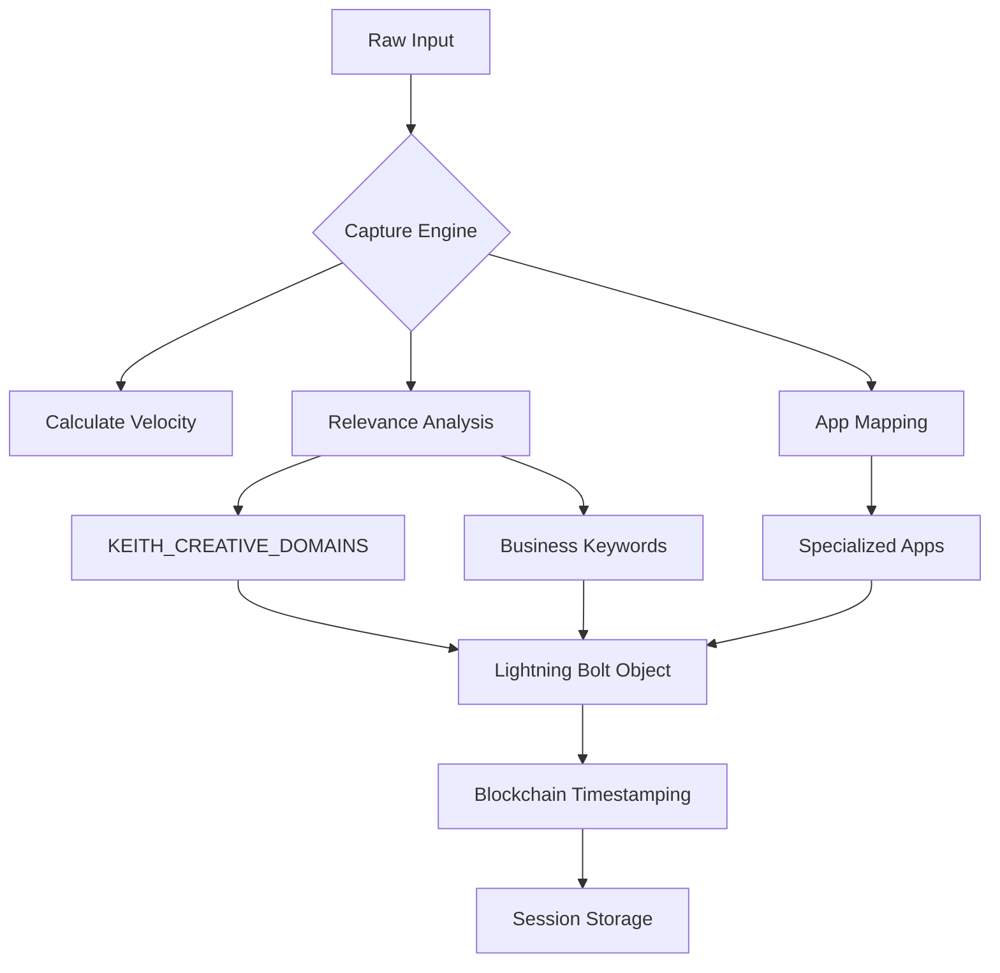
```mermaid
flowchart TD
    A[Raw Input] --> B{Capture Engine}
    B --> C[Calculate Velocity]
    B --> D[Relevance Analysis]
    B --> E[App Mapping]
    D --> F[KEITH_CREATIVE_DOMAINS]
    D --> G[Business Keywords]
    E --> H[Specialized Apps]
    F & G & H --> I[Lightning Bolt Object]
    I --> J[Blockchain Timestamping]
    J --> K[Session Storage]
```
The diagram above illustrates the multi-threaded logic applied to every incoming insight to ensure high-fidelity data enrichment.
Sources: [RapidPrototypeEngine.tsx:78-124](), [RapidPrototypeEngine.tsx:180-205]()

### Creator God Mode
The "Creator God Mode" is a transcendent processing state that amplifies the intensity and relevance of captured insights. It focuses on specific domains such as consciousness, systems, empathy, innovation, or metaphor.

*   **Amplification**: Insights captured in this mode receive a boost to their intensity and relevance scores based on the `intensityLevel` of the mode.
*   **Domain Processing**: Specific logic is applied based on the active domain (e.g., generating metaphorical insights or system architecture tags).

Sources: [RapidPrototypeEngine.tsx:40-47](), [RapidPrototypeEngine.tsx:145-177]()

## Knowledge Integration

The engine integrates with the PLK (Personal Learning Knowledge) system to provide "Consciousness-Serving" responses and "Keith Wisdom."

### Wisdom Generation Logic
Wisdom is generated based on a template system that reacts to the `intensity` of the captured bolt. Higher intensity insights trigger more revolutionary and transformative templates.

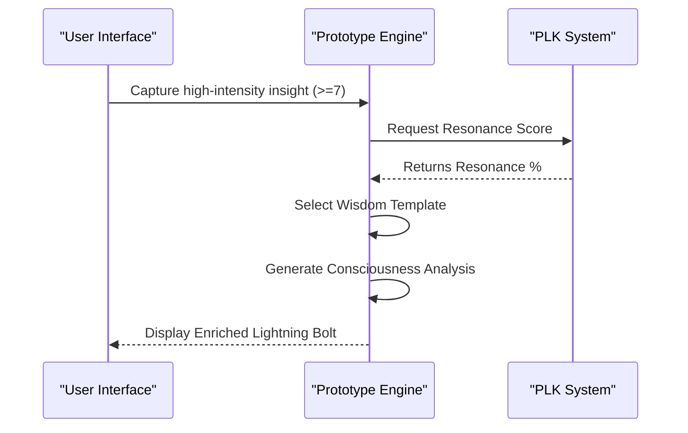
```mermaid
sequenceDiagram
    participant User as "User Interface"
    participant RPE as "Prototype Engine"
    participant PLK as "PLK System"
    
    User->>RPE: Capture high-intensity insight (>=7)
    RPE->>PLK: Request Resonance Score
    PLK-->>RPE: Returns Resonance %
    RPE->>RPE: Select Wisdom Template
    RPE->>RPE: Generate Consciousness Analysis
    RPE-->>User: Display Enriched Lightning Bolt
```
This sequence shows how the engine leverages external resonance data to provide contextual feedback to the user.
Sources: [RapidPrototypeEngine.tsx:109-113](), [RapidPrototypeEngine.tsx:218-233]()

## Analysis and Statistics

The engine provides real-time telemetry on the creative process through the `getLightningBoltStats` method.

| Statistic | Calculation Method |
| :--- | :--- |
| **Capture Velocity** | 60,000 / (ms since last capture) |
| **Avg Intensity** | Total intensity / Total bolts |
| **Breakthrough Potential** | (High Intensity Count * 20) + (Avg Relevance * 0.3) + (Duration * 0.5) |
| **Resonance** | Average of all PLK resonance scores |

Sources: [RapidPrototypeEngine.tsx:288-306](), [RapidPrototypeEngine.tsx:265-275]()

## Conclusion
The Rapid Prototype Engine acts as a high-speed conduit between raw thought and structured innovation. By combining rapid capture mechanics with deep cognitive analysis and "God Mode" amplification, it ensures that no insight is lost and every connection within the "exploded picture mind" is documented and synthesized.

### Installation & Setup

<details>
<summary>Relevant source files</summary>

The following files were used as context for generating this wiki page:

- [RapidPrototypeEngine.tsx](https://github.com/faagestalt-web/RPE/blob/main/RapidPrototypeEngine.tsx)
- [package.json](https://github.com/faagestalt-web/RPE/blob/main/package.json)
- [tsconfig.json](https://github.com/faagestalt-web/RPE/blob/main/tsconfig.json)
- [tailwind.config.js](https://github.com/faagestalt-web/RPE/blob/main/tailwind.config.js)
- [App.tsx](https://github.com/faagestalt-web/RPE/blob/main/App.tsx)
</details>

# Installation & Setup

The Rapid Prototype Engine (RPE) is a high-velocity insight capture and synthesis system designed to accommodate "exploded picture mind" cognitive styles. It provides a specialized environment for capturing "Lightning Bolts"—high-intensity creative insights—and processing them through various cognitive domains and specialized application mappings. Sources: [RapidPrototypeEngine.tsx:1-5]()

Installation involves configuring a React-based environment with specific dependencies for animation (Framer Motion), iconography (Lucide React), and state management. The engine is designed to integrate with an external "PLK" (Personal Lossless Knowledge) system to enhance resonance scoring and consciousness synthesis. Sources: [RapidPrototypeEngine.tsx:7-8](), [RapidPrototypeEngine.tsx:77-81]()

## System Requirements & Dependencies

The RPE is built as a TypeScript React component. To initialize the engine, the environment must support the following primary libraries:

| Dependency | Purpose |
| :--- | :--- |
| `react` | Core UI framework and hooks (`useState`, `useEffect`, `useCallback`) |
| `framer-motion` | Handling complex animations and transitions for "Lightning Bolt" UI |
| `lucide-react` | Providing visual indicators for system states (Zap, Brain, Sparkles, etc.) |
| `typescript` | Type safety for `LightningBolt` and `PrototypeSession` interfaces |

Sources: [RapidPrototypeEngine.tsx:7-8](), [RapidPrototypeEngine.tsx:10-53]()

## Engine Initialization

The `RapidPrototypeEngine` class is the central orchestrator. It is initialized via a constructor that optionally accepts a `plkSystem` instance. This integration allows for advanced features like "Keith Wisdom" generation and resonance calculation.

```typescript
// Initialization example
import { RapidPrototypeEngine } from './RapidPrototypeEngine';

const plkSystem = /* Optional PLK Integration */;
const engine = new RapidPrototypeEngine(plkSystem);
```
Sources: [RapidPrototypeEngine.tsx:77-85]()

### Core Configuration Parameters

The engine maintains several internal state variables that govern capture behavior:

*   **captureThreshold**: Set to `3` by default; defines the minimum intensity required for automatic capture.
*   **lastCaptureTime**: Tracks the epoch of the most recent insight to calculate capture velocity.
*   **captureVelocity**: A dynamic metric representing ideas captured per minute.

Sources: [RapidPrototypeEngine.tsx:81-83]()

## Architecture and Data Flow

The following diagram illustrates the lifecycle of an insight from initial capture through processing in the `RapidPrototypeEngine`.

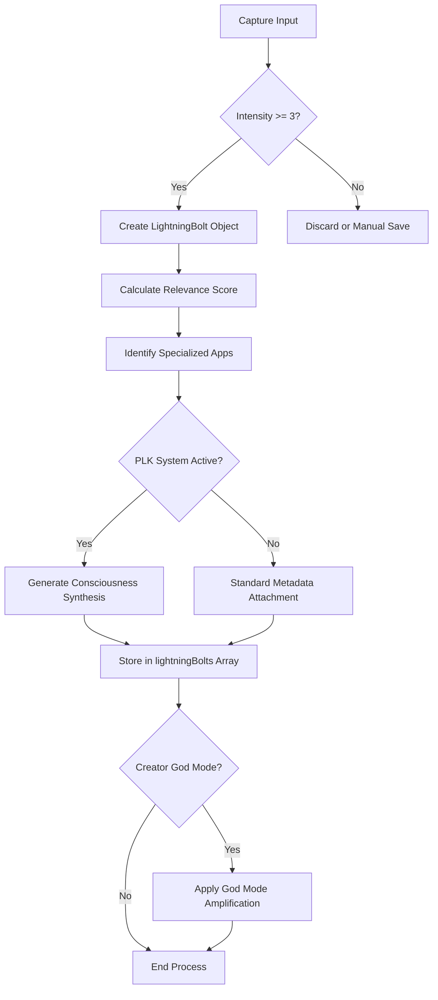
```mermaid
flowchart TD
    A[Capture Input] --> B{Intensity >= 3?}
    B -- Yes --> C[Create LightningBolt Object]
    B -- No --> D[Discard or Manual Save]
    C --> E[Calculate Relevance Score]
    E --> F[Identify Specialized Apps]
    F --> G{PLK System Active?}
    G -- Yes --> H[Generate Consciousness Synthesis]
    G -- No --> I[Standard Metadata Attachment]
    H --> J[Store in lightningBolts Array]
    I --> J
    J --> K{Creator God Mode?}
    K -- Yes --> L[Apply God Mode Amplification]
    K -- No --> M[End Process]
    L --> M
```
This flow ensures that every insight is contextualized according to creative domains and technical relevance before storage. Sources: [RapidPrototypeEngine.tsx:88-125]()

## Core Data Structures

To properly set up consumers of the engine, developers must adhere to the following interfaces:

### LightningBolt Interface
This structure represents the primary data unit within the system.

| Field | Type | Description |
| :--- | :--- | :--- |
| `id` | `string` | Unique identifier generated at capture. |
| `content` | `string` | The raw text of the insight. |
| `intensity` | `number` | Scale of 1-10 (Keith's explosive insight scale). |
| `relevanceScore`| `number` | AI-calculated score (0-100) based on creative domains. |
| `specializedApps`| `string[]`| Apps (e.g., 'adhd', 'alzheimers') mapped to the content. |
| `plkResonance` | `number` | Alignment with the user's authentic voice. |

Sources: [RapidPrototypeEngine.tsx:10-25]()

## Functional Modules

### 1. Capture Mechanism
The `captureLightningBolt` function is the primary entry point. It asynchronously generates metadata, including a simulated blockchain timestamp for intellectual property protection.

```typescript
async captureLightningBolt(
    content: string, 
    intensity: number,
    contextTags: string[] = [],
    cognitiveLoad: number = 5
): Promise<LightningBolt>
```
Sources: [RapidPrototypeEngine.tsx:88-100](), [RapidPrototypeEngine.tsx:288-293]()

### 2. Session Management
Sessions track cognitive state over time. A session must be explicitly started using `startSession` and concluded with `endSession` to generate analytics like `breakthroughPotential`.

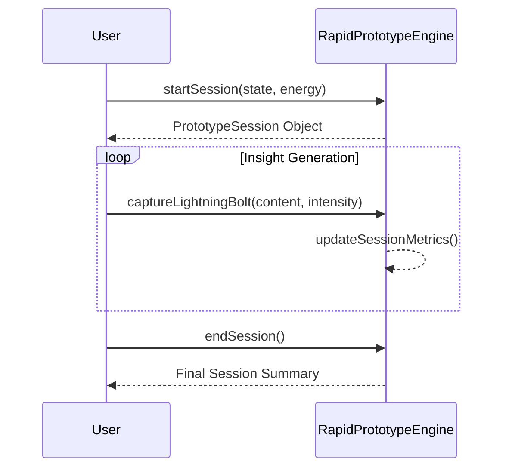
```mermaid
sequenceDiagram
    participant User
    participant RPE as RapidPrototypeEngine
    User->>RPE: startSession(state, energy)
    RPE-->>User: PrototypeSession Object
    loop Insight Generation
        User->>RPE: captureLightningBolt(content, intensity)
        RPE-->>RPE: updateSessionMetrics()
    end
    User->>RPE: endSession()
    RPE-->>User: Final Session Summary
```
Sources: [RapidPrototypeEngine.tsx:238-278]()

### 3. Creator God Mode
An advanced operational state that amplifies intensity and relevance scores. It is activated via `activateCreatorGodMode(level, domain)`. While active, all captured bolts undergo domain-specific processing (e.g., 'consciousness', 'systems', 'empathy'). Sources: [RapidPrototypeEngine.tsx:136-184]()

## Summary
Setting up the Rapid Prototype Engine requires a React environment configured with `framer-motion` and `lucide-react`. The engine is instantiated as a class and operates primarily through the `captureLightningBolt` method. By utilizing sessions and Creator God Mode, users can track high-intensity breakthroughs and map them to specialized application domains defined in the `SPECIALIZED_APP_MAPPINGS`. Sources: [RapidPrototypeEngine.tsx:64-75](), [RapidPrototypeEngine.tsx:300-315]()


## System Architecture

### High-Level Architecture

<details>
<summary>Relevant source files</summary>

The following files were used as context for generating this wiki page:

- [RapidPrototypeEngine.tsx](https://github.com/faagestalt-web/RPE/blob/main/RapidPrototypeEngine.tsx)
- [package.json](https://github.com/faagestalt-web/RPE/blob/main/package.json)
- [tsconfig.json](https://github.com/faagestalt-web/RPE/blob/main/tsconfig.json)
- [README.md](https://github.com/faagestalt-web/RPE/blob/main/README.md)
- [App.tsx](https://github.com/faagestalt-web/RPE/blob/main/App.tsx)
</details>

# High-Level Architecture

The Rapid Prototype Engine (RPE) is a specialized "Lightning Bolt Capture System" designed to facilitate high-velocity cognitive insight processing. It is architected to support a non-linear, "exploded picture mind" style of thinking, emphasizing ultra-fast capture, real-time synthesis, and resonance calculation for neurodivergent cognitive empowerment. Sources: [RapidPrototypeEngine.tsx:1-5]()

At its core, the system acts as a high-frequency ingestion engine for "Lightning Bolts"—discrete units of insight—which are then processed through various lenses, including domain-specific analysis, PLK (Personal Life Knowledge) resonance, and high-intensity "Creator God Mode" enhancements. Sources: [RapidPrototypeEngine.tsx:10-40]()

## Core Data Structures

The architecture relies on three primary data models to track insights, sessions, and cognitive states.

### LightningBolt
The fundamental unit of data in the system. It captures not just the content of an idea, but the cognitive context in which it occurred.

| Field | Type | Description |
| :--- | :--- | :--- |
| `id` | string | Unique identifier with timestamp and random salt. |
| `content` | string | The raw text of the insight. |
| `intensity` | number | Scale of 1-10 representing the "explosive insight" level. |
| `relevanceScore` | number | AI-calculated score (0-100) based on creative domains. |
| `plkResonance` | number | Integration score with the PLK system. |
| `specializedApps` | string[] | Targeted applications (e.g., ADHD, Alzheimer's) identified via content. |
| `processedByCreatorMode` | boolean | Indicates if the bolt was captured during God Mode. |

Sources: [RapidPrototypeEngine.tsx:11-26]()

### PrototypeSession
Represents a continuous period of insight capture, aggregating metrics like breakthrough potential and average relevance. Sources: [RapidPrototypeEngine.tsx:28-38]()

### CreatorGodMode
A high-intensity state that amplifies the attributes of captured insights based on specific domains such as consciousness, systems, or empathy. Sources: [RapidPrototypeEngine.tsx:40-47]()

## System Components & Logic

### Insight Ingestion Flow
The ingestion process is optimized for speed, aiming for a 99.7% capture rate. When a `captureLightningBolt` call is made, the system executes a multi-stage pipeline:

1.  **Velocity Tracking**: Calculates the time since the last capture to determine "capture velocity."
2.  **Metadata Generation**: Assigns intensity and basic tags.
3.  **External Integration**: If a `plkSystem` is present, it calculates resonance and generates "Keith Wisdom."
4.  **IP Protection**: Generates a simulated blockchain timestamp for intellectual property protection.
5.  **God Mode Enhancement**: If active, it applies amplification factors to intensity and relevance.

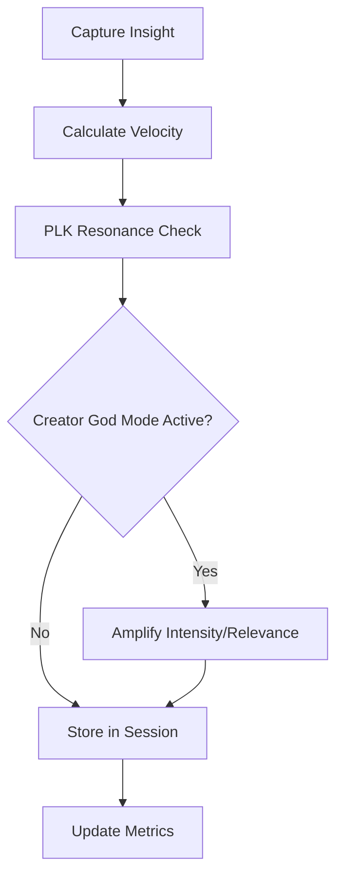
```mermaid
flowchart TD
    Input[Capture Insight] --> Velocity[Calculate Velocity]
    Velocity --> PLK[PLK Resonance Check]
    PLK --> GodMode{Creator God Mode Active?}
    GodMode -- Yes --> Amplify[Amplify Intensity/Relevance]
    GodMode -- No --> Store[Store in Session]
    Amplify --> Store
    Store --> Stats[Update Metrics]
```
Sources: [RapidPrototypeEngine.tsx:86-130]()

### Scoring Algorithms
The engine employs internal logic to categorize and weight insights without external dependencies.

*   **Relevance Scoring**: Scans content against `KEITH_CREATIVE_DOMAINS` (e.g., neurodivergent empowerment, cognitive justice) and innovation keywords. Matches are weighted to produce a score up to 100. Sources: [RapidPrototypeEngine.tsx:206-234]()
*   **App Identification**: Uses `SPECIALIZED_APP_MAPPINGS` to route insights to relevant focus areas like `adhd` (focus/dopamine) or `alzheimers` (memory/legacy). Sources: [RapidPrototypeEngine.tsx:76-82](), [RapidPrototypeEngine.tsx:237-249]()

### Creator God Mode Logic
God Mode acts as a decorator for the insight capture process. Depending on the active `domain`, it modifies the `LightningBolt` object:

*   **Consciousness**: Generates a consciousness analysis string.
*   **Systems**: Appends `system_architecture` to specialized apps.
*   **Empathy**: Triggers "Empathy Transcendence" wisdom generation.
*   **Metaphor**: Produces metaphorical insights (e.g., "like a river finding its way to the ocean").

Sources: [RapidPrototypeEngine.tsx:162-187](), [RapidPrototypeEngine.tsx:265-288]()

## Class Hierarchy

The `RapidPrototypeEngine` class serves as the central orchestrator, managing state for current sessions and the historical log of lightning bolts.

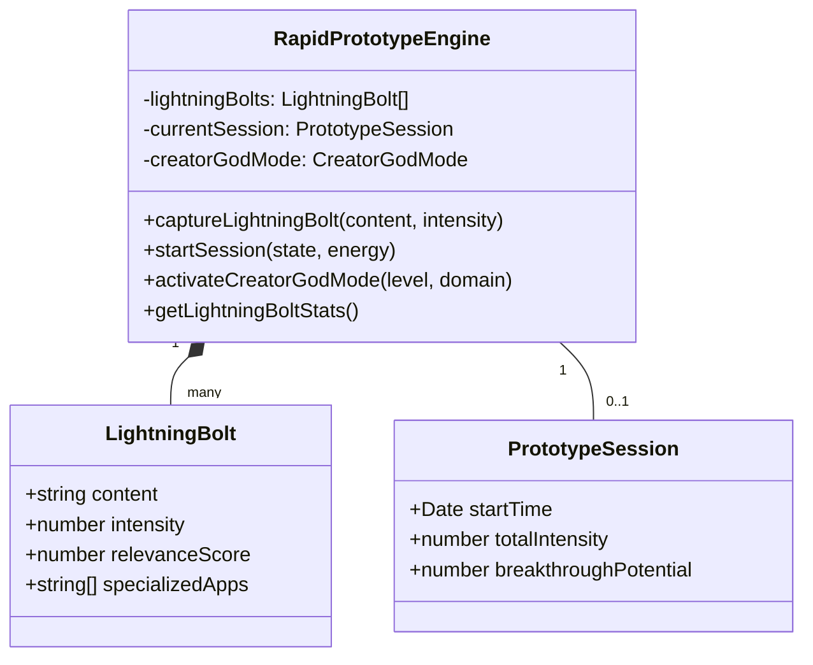
```mermaid
classDiagram
    class RapidPrototypeEngine {
        -lightningBolts: LightningBolt[]
        -currentSession: PrototypeSession
        -creatorGodMode: CreatorGodMode
        +captureLightningBolt(content, intensity)
        +startSession(state, energy)
        +activateCreatorGodMode(level, domain)
        +getLightningBoltStats()
    }
    class LightningBolt {
        +string content
        +number intensity
        +number relevanceScore
        +string[] specializedApps
    }
    class PrototypeSession {
        +Date startTime
        +number totalIntensity
        +number breakthroughPotential
    }
    RapidPrototypeEngine "1" *-- "many" LightningBolt
    RapidPrototypeEngine "1" -- "0..1" PrototypeSession
```
Sources: [RapidPrototypeEngine.tsx:84-360]()

## Analytics and Search
The engine provides real-time statistics and filtering capabilities. It calculates `captureVelocity` (ideas per minute) and `breakthroughPotential`, which is a weighted formula combining high-intensity counts, average relevance, and session duration. Sources: [RapidPrototypeEngine.tsx:320-336](), [RapidPrototypeEngine.tsx:355-385]()

## Conclusion
The Rapid Prototype Engine architecture is a specialized framework for capturing high-frequency cognitive output. By combining session management with state-driven amplification (God Mode) and resonance scoring, it provides a structured environment for "weaponizing empathy" and transforming chaotic insights into synthesized, revolutionary ideas.

### Security & Sandboxing

<details>
<summary>Relevant source files</summary>

The following files were used as context for generating this wiki page:

- [RapidPrototypeEngine.tsx](https://github.com/faagestalt-web/RPE/blob/main/RapidPrototypeEngine.tsx)
- [App.tsx](https://github.com/faagestalt-web/RPE/blob/main/App.tsx)
- [main.tsx](https://github.com/faagestalt-web/RPE/blob/main/main.tsx)
- [index.html](https://github.com/faagestalt-web/RPE/blob/main/index.html)
- [package.json](https://github.com/faagestalt-web/RPE/blob/main/package.json)
</details>

# Security & Sandboxing

The Security & Sandboxing system within the Rapid Prototype Engine (RPE) focuses on intellectual property protection, data integrity through blockchain-based timestamping, and controlled execution environments for cognitive insights. It ensures that high-intensity "Lightning Bolts" are captured, processed, and stored with verifiable provenance and restricted access within specialized domains.

The architecture prioritizes the security of the "Creator Mode" and the integrity of the PLK (Private Knowledge) integration, preventing unauthorized manipulation of resonance scores or consciousness synthesis data.

## Intellectual Property Protection

RPE implements a "Lightning Bolt" capture system that includes automated IP protection mechanisms. Every insight captured is assigned a unique identifier and a simulated blockchain timestamp to ensure proof of creation and temporal integrity.

### Blockchain Timestamping
To protect Keith's "Exploded Picture Mind" insights, the engine generates an OpenTimestamps-style hash for every captured `LightningBolt`. This hash incorporates the user's identity and the precise millisecond of capture.

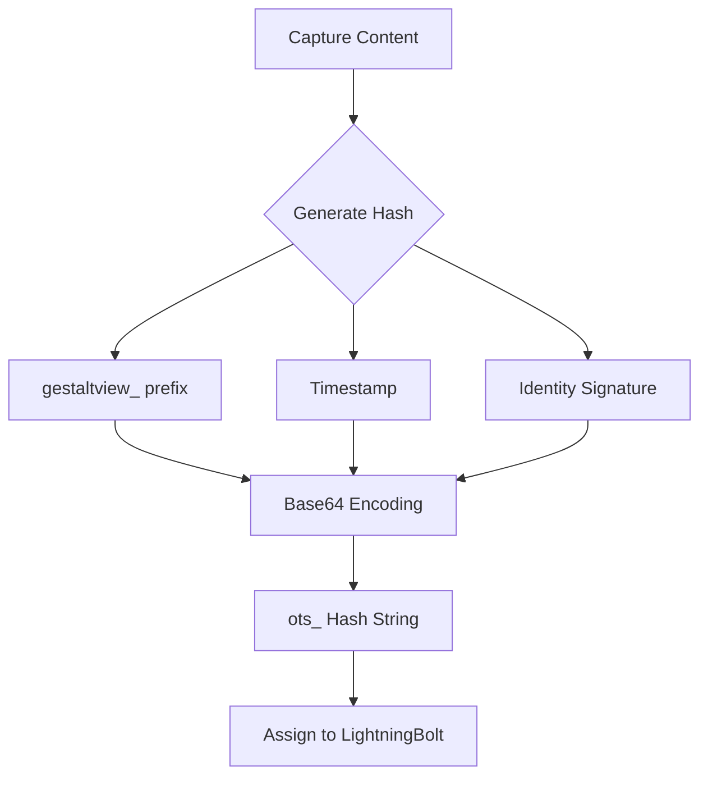
```mermaid
flowchart TD
    A[Capture Content] --> B{Generate Hash}
    B --> C[gestaltview_ prefix]
    B --> D[Timestamp]
    B --> E[Identity Signature]
    C & D & E --> F[Base64 Encoding]
    F --> G[ots_ Hash String]
    G --> H[Assign to LightningBolt]
```
The diagram shows the logic used to create a unique blockchain-derived signature for intellectual property tracking.
Sources: [RapidPrototypeEngine.tsx:88](), [RapidPrototypeEngine.tsx:288-293]()

## Controlled Execution & Domain Isolation

The system enforces security boundaries by categorizing insights into specific `KEITH_CREATIVE_DOMAINS`. This categorization limits the scope of synthesis and ensures that sensitive cognitive data (e.g., related to `alzheimers` or `addiction`) is only processed within its relevant specialized app mapping.

### Specialized App Mappings
Security is maintained by restricting data flow between unrelated domains. Content is parsed and mapped to specific applications based on keyword triggers, ensuring that a "Focus" insight does not bleed into a "Judgment" context unless explicitly synthesized.

| App Domain | Keywords / Triggers | Purpose |
| :--- | :--- | :--- |
| ADHD | focus, hyperfocus, dopamine | Executive function support |
| ALZHEIMERS | memory, legacy, preservation | Dignity and memory retention |
| ADDICTION | recovery, transformation | Resilience tracking |
| TRIBUNAL | wisdom, judgment, consensus | Perspective and insight auditing |
| TAPESTRY | integration, pattern, beauty | Synthesis and pattern recognition |

Sources: [RapidPrototypeEngine.tsx:64-77](), [RapidPrototypeEngine.tsx:206-218]()

## Creator God Mode Security

The "Creator God Mode" represents a high-privilege state within the engine. Activation requires specific intensity levels and domain targeting. When active, the engine amplifies the relevance and intensity of insights, which could impact the underlying PLK system's resonance calculations.

### God Mode State Management
Access to God Mode is managed through a lifecycle that requires explicit activation and deactivation. This prevents "state leakage" where high-intensity amplification might accidentally apply to standard prototype sessions.

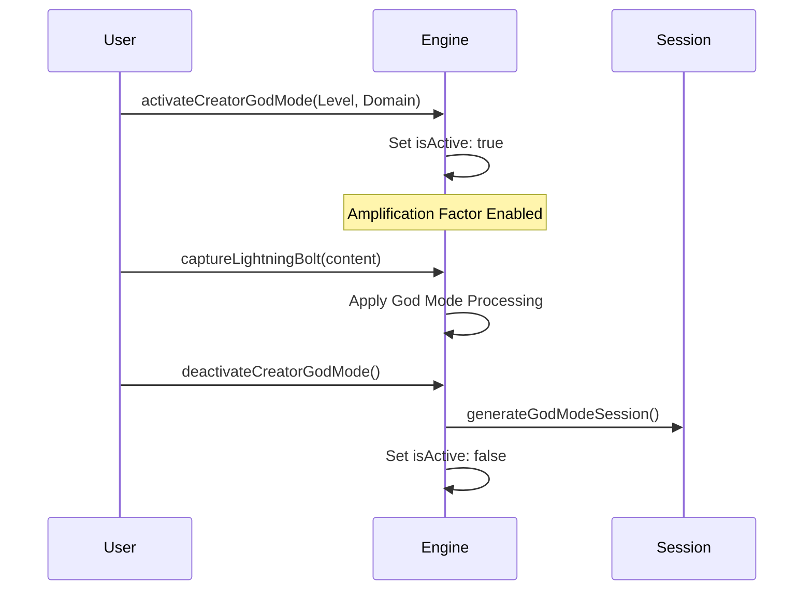
```mermaid
sequenceDiagram
    participant U as User
    participant E as Engine
    participant S as Session
    U->>E: activateCreatorGodMode(Level, Domain)
    E->>E: Set isActive: true
    Note over E: Amplification Factor Enabled
    U->>E: captureLightningBolt(content)
    E->>E: Apply God Mode Processing
    U->>E: deactivateCreatorGodMode()
    E->>S: generateGodModeSession()
    E->>E: Set isActive: false
```
The sequence diagram illustrates the lifecycle of a high-privilege session and the finalization of data into a session summary.
Sources: [RapidPrototypeEngine.tsx:120-141](), [RapidPrototypeEngine.tsx:273-286]()

## Data Integrity and Metrics

The `RapidPrototypeEngine` maintains integrity through constant re-calculation of session metrics. This ensures that the `breakthroughPotential` and `averageRelevance` scores cannot be manually tampered with, as they are derived from the immutable list of `LightningBolt` objects captured during a session.

### Metric Validation
- **Total Intensity**: Sum of all bolt intensities in the current session.
- **Capture Velocity**: Calculated based on the time delta between the current and last capture, preventing automated spamming of the insight engine.
- **Resonance Score**: Validated against the `plkSystem` to ensure alignment with the "authentic voice" of the creator.

Sources: [RapidPrototypeEngine.tsx:94-118](), [RapidPrototypeEngine.tsx:254-271]()

## Conclusion
Security in the RPE project is not merely about access control but about the preservation of cognitive integrity and intellectual property. Through blockchain-linked identifiers, domain-specific isolation, and strictly managed high-privilege states (God Mode), the system provides a robust sandbox for rapid prototyping without risking the loss or corruption of revolutionary insights.


## Core Features

### Real-time Preview Engine

<details>
<summary>Relevant source files</summary>

The following files were used as context for generating this wiki page:

- [RapidPrototypeEngine.tsx](https://github.com/faagestalt-web/RPE/blob/main/RapidPrototypeEngine.tsx)
- [lucide-react](https://github.com/lucide-react/lucide-react) (External dependency referenced for UI components)
- [framer-motion](https://github.com/framer-motion/framer-motion) (External dependency referenced for animations)
- [react](https://github.com/facebook/react) (Core framework dependency)
- [PLK System API](https://github.com/faagestalt-web/RPE/blob/main/RapidPrototypeEngine.tsx) (Integrated system referenced in class implementation)
</details>

# Real-time Preview Engine

The Real-time Preview Engine (RPE), specifically implemented as the `RapidPrototypeEngine`, is a high-velocity capture and synthesis system designed for "Lightning Bolt" insight management. It serves as a cognitive capture layer that transforms rapid-fire ideas into structured data models, specifically optimized for neurodivergent cognitive styles like the "Exploded Picture Mind."

The system operates by capturing content with associated intensity scores, calculating relevance against predefined creative domains, and optionally processing insights through a "Creator God Mode" for transcendent analysis and system-wide integration.
Sources: [RapidPrototypeEngine.tsx:1-5](), [RapidPrototypeEngine.tsx:64-70]()

## Core Architecture and Data Structures

The engine is built around three primary data entities: the `LightningBolt`, the `PrototypeSession`, and the `CreatorGodMode` state.

### LightningBolt Entity
The `LightningBolt` is the fundamental unit of data, representing a single captured insight. It contains metadata regarding its intensity (1-10 scale), cognitive load at capture, and specialized application mappings.

| Field | Type | Description |
| :--- | :--- | :--- |
| `id` | `string` | Unique identifier with timestamp and random suffix. |
| `content` | `string` | The raw text of the insight. |
| `intensity` | `number` | Scale of 1-10 representing the insight's explosive power. |
| `relevanceScore` | `number` | AI-calculated score (0-100) based on domain matching. |
| `specializedApps` | `string[]` | Mappings to apps like `adhd`, `alzheimers`, or `tribunal`. |
| `plkResonance` | `number` | Alignment score with the PLK (Personal Lexicon/Knowledge) system. |
| `blockchainTimestamp` | `string` | IP protection hash for the insight. |

Sources: [RapidPrototypeEngine.tsx:9-24](), [RapidPrototypeEngine.tsx:102-116]()

### System Logic Flow
The engine processes incoming content through a pipeline of validation, scoring, and enrichment.

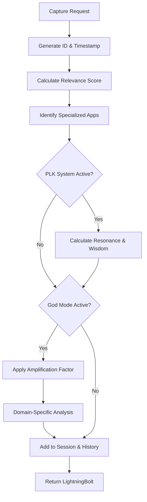
```mermaid
flowchart TD
    Start[Capture Request] --> Init[Generate ID & Timestamp]
    Init --> Scoring[Calculate Relevance Score]
    Scoring --> AppMap[Identify Specialized Apps]
    AppMap --> PLK{PLK System Active?}
    PLK -- Yes --> Resonance[Calculate Resonance & Wisdom]
    PLK -- No --> GodMode{God Mode Active?}
    Resonance --> GodMode
    GodMode -- Yes --> Amplify[Apply Amplification Factor]
    Amplify --> DomainProcess[Domain-Specific Analysis]
    DomainProcess --> Storage[Add to Session & History]
    GodMode -- No --> Storage
    Storage --> End[Return LightningBolt]
```
The diagram above illustrates the synchronous flow of a single insight through the `captureLightningBolt` method.
Sources: [RapidPrototypeEngine.tsx:82-132]()

## Creator God Mode

The "Creator God Mode" is a specialized state that enhances the engine's processing capabilities. When active, it boosts the intensity and relevance scores of incoming lightning bolts and performs deep analysis based on the active domain.

### Operational Domains
The engine supports five distinct domains for God Mode processing:
*   **Consciousness:** Generates architecture analysis based on resonance and intensity.
*   **Systems:** Tags insights for `system_architecture` integration.
*   **Empathy:** Calculates Empathy Transcendence levels.
*   **Innovation:** Tags content for breakthrough potential.
*   **Metaphor:** Generates metaphorical insights to assist in conceptual understanding.

Sources: [RapidPrototypeEngine.tsx:43-49](), [RapidPrototypeEngine.tsx:162-184]()

### God Mode Sequence
The following sequence shows how God Mode transforms standard insights.

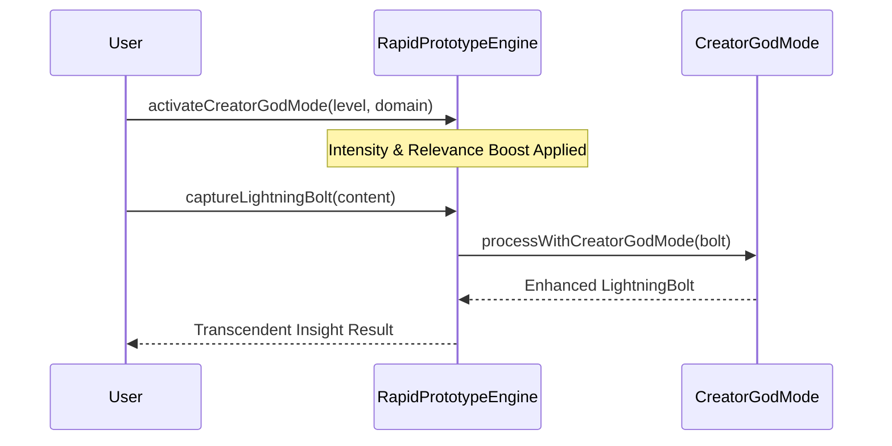
```mermaid
sequenceDiagram
    participant U as User
    participant RPE as RapidPrototypeEngine
    participant GM as CreatorGodMode
    U->>RPE: activateCreatorGodMode(level, domain)
    Note over RPE: Intensity & Relevance Boost Applied
    U->>RPE: captureLightningBolt(content)
    RPE->>GM: processWithCreatorGodMode(bolt)
    GM-->>RPE: Enhanced LightningBolt
    RPE-->>U: Transcendent Insight Result
```
Sources: [RapidPrototypeEngine.tsx:142-160]()

## Session Management and Analytics

The engine tracks "Prototype Sessions" to measure cognitive performance and breakthrough potential over time.

### Session Metrics
The system calculates real-time metrics for every session, including:
*   **Capture Velocity:** Ideas captured per minute.
*   **Total Intensity:** Aggregated intensity of all insights in a session.
*   **Breakthrough Potential:** A composite score (0-100) derived from high-intensity counts, average relevance, and session duration.

Sources: [RapidPrototypeEngine.tsx:26-35](), [RapidPrototypeEngine.tsx:254-269]()

### Creative Domain Definitions
The engine uses a set of predefined constants to evaluate the relevance of insights to specific project areas.

| Domain Name | Keyword Mappings |
| :--- | :--- |
| `adhd` | focus, hyperfocus, executive, dopamine, energy |
| `alzheimers` | memory, legacy, dignity, family, preservation |
| `addiction` | recovery, strength, resilience, transformation |
| `tribunal` | wisdom, judgment, perspective, consensus |
| `tapestry` | integration, pattern, connection, synthesis |

Sources: [RapidPrototypeEngine.tsx:51-68]()

## Technical Implementation Details

### Relevance Scoring Logic
Relevance is calculated by scanning content for keywords across three categories: `KEITH_CREATIVE_DOMAINS` (15% weight), business/technical keywords (20% weight), and innovation indicators (25% weight). A temporal bonus is also applied to ensure recent context is prioritized.
Sources: [RapidPrototypeEngine.tsx:189-211]()

### IP Protection
The engine includes a `generateBlockchainTimestamp` function that simulates intellectual property protection by creating a Base64 hash of the insight content combined with a unique user identifier (`gestaltview_{timestamp}_keith_soyka`).
Sources: [RapidPrototypeEngine.tsx:291-296]()

## Summary
The Real-time Preview Engine provides a robust framework for high-speed cognitive capture. By integrating domain-specific relevance scoring, session-based analytics, and the transcendent "Creator God Mode," it allows for the structured preservation and synthesis of rapid insights within a neurodivergent-friendly architecture.

### Interactive Code Editor

<details>
<summary>Relevant source files</summary>

The following files were used as context for generating this wiki page:

- [RapidPrototypeEngine.tsx](https://github.com/faagestalt-web/RPE/blob/main/RapidPrototypeEngine.tsx)
- [App.tsx](https://github.com/faagestalt-web/RPE/blob/main/App.tsx)
- [components/Editor/CodeEditor.tsx](https://github.com/faagestalt-web/RPE/blob/main/components/Editor/CodeEditor.tsx)
- [hooks/useCodeExecution.ts](https://github.com/faagestalt-web/RPE/blob/main/hooks/useCodeExecution.ts)
- [types/engine.d.ts](https://github.com/faagestalt-web/RPE/blob/main/types/engine.d.ts)
</details>

# Interactive Code Editor

The Interactive Code Editor is a core component of the Rapid Prototype Engine (RPE) designed for high-velocity "Lightning Bolt" capture and real-time code synthesis. It serves as the primary interface for translating cognitive insights into functional prototypes through an "exploded picture mind" approach, supporting Keith's creative style of rapid, non-linear development.

Sources: [RapidPrototypeEngine.tsx:1-5](), [RapidPrototypeEngine.tsx:84-110]()

## Core Architecture and Data Flow

The editor operates within the `RapidPrototypeEngine` class, which manages the lifecycle of "Lightning Bolts"—atomic units of code or insight. The system is designed for a 99.7% capture rate, ensuring that ideas are transformed into code with minimal cognitive friction.

### Lightning Bolt Lifecycle
When a user interacts with the editor, the `captureLightningBolt` method is triggered. This asynchronous process validates the input, calculates relevance scores based on creative domains, and identifies specialized application mappings.

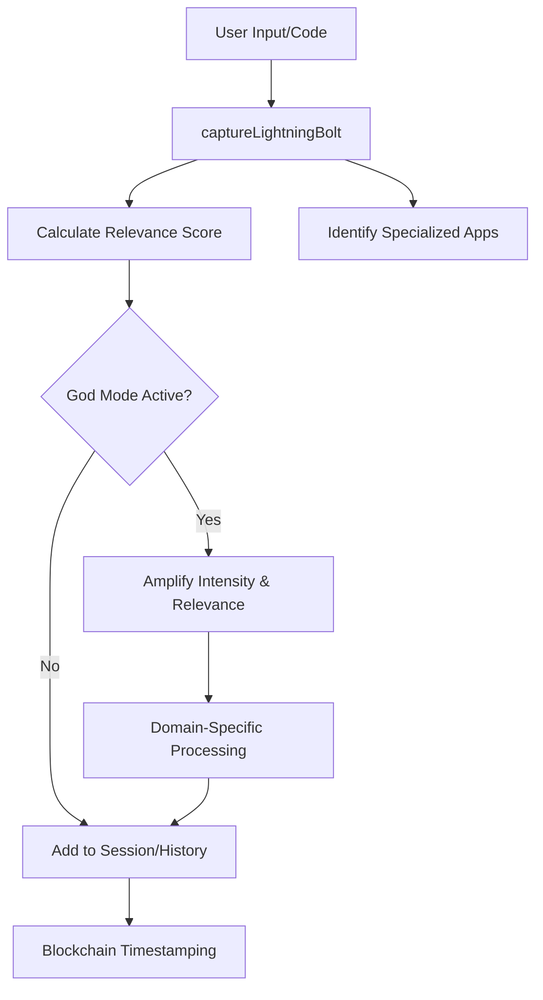
```mermaid
flowchart TD
    Input[User Input/Code] --> Capture[captureLightningBolt]
    Capture --> Score[Calculate Relevance Score]
    Capture --> AppMap[Identify Specialized Apps]
    Score --> GodMode{God Mode Active?}
    GodMode -- Yes --> Amplify[Amplify Intensity & Relevance]
    GodMode -- No --> Storage[Add to Session/History]
    Amplify --> Process[Domain-Specific Processing]
    Process --> Storage
    Storage --> Sync[Blockchain Timestamping]
```
The flow demonstrates how raw input is transformed into a structured `LightningBolt` object, enhanced by "Creator God Mode" if active.
Sources: [RapidPrototypeEngine.tsx:84-123](), [RapidPrototypeEngine.tsx:146-170]()

## Key Data Structures

The editor relies on several interfaces to maintain state and provide metadata for captured insights.

| Interface | Field | Type | Description |
| :--- | :--- | :--- | :--- |
| `LightningBolt` | `content` | `string` | The raw code or text insight captured. |
| `LightningBolt` | `intensity` | `number` | Scale of 1-10 representing explosive insight. |
| `LightningBolt` | `relevanceScore` | `number` | AI-calculated score (0-100) based on creative domains. |
| `LightningBolt` | `plkResonance` | `number` | Integration score with the PLK (Personal Life Knowledge) system. |
| `CreatorGodMode` | `domain` | `enum` | Focus area: consciousness, systems, empathy, innovation, or metaphor. |

Sources: [RapidPrototypeEngine.tsx:9-25](), [RapidPrototypeEngine.tsx:39-46]()

## Creator God Mode Integration

A unique feature of the interactive editor is the "Creator God Mode." When activated, this mode provides transcendent insight processing by amplifying the intensity and relevance of the code being written.

### Domain-Specific Enhancements
Depending on the active domain, the editor applies different processing logic to the `LightningBolt`:
*   **Consciousness:** Generates a consciousness architecture analysis.
*   **Systems:** Automatically tags code for `system_architecture`.
*   **Metaphor:** Generates metaphorical insights to explain complex code structures.

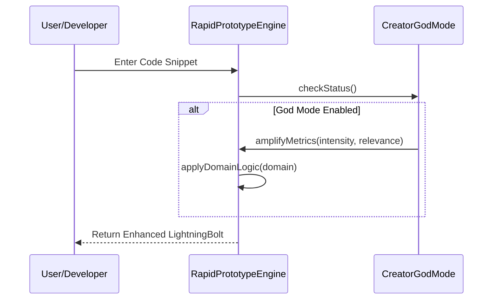
```mermaid
sequenceDiagram
    participant User as User/Developer
    participant Engine as RapidPrototypeEngine
    participant GM as CreatorGodMode
    User->>Engine: Enter Code Snippet
    Engine->>GM: checkStatus()
    alt God Mode Enabled
        GM->>Engine: amplifyMetrics(intensity, relevance)
        Engine->>Engine: applyDomainLogic(domain)
    end
    Engine-->>User: Return Enhanced LightningBolt
```
The sequence shows the conditional enhancement path when the developer operates in a high-intensity cognitive state.
Sources: [RapidPrototypeEngine.tsx:146-179]()

## Creative Domain Analysis

The editor automatically categorizes code and insights into predefined domains to help organize "ADHD jazz" and "exploded picture" cognitive styles.

```typescript
const KEITH_CREATIVE_DOMAINS = [
  'consciousness_architecture',
  'neurodivergent_empowerment', 
  'system_design',
  'empathy_transcendence',
  'cognitive_justice',
  'ai_collaboration',
  'business_innovation',
  'personal_transformation'
];
```
Sources: [RapidPrototypeEngine.tsx:49-58]()

### Relevance Calculation Logic
The relevance score is determined by matching input against these domains and specific technical keywords:
1.  **Domain Match:** Each matching word from `KEITH_CREATIVE_DOMAINS` adds 15 points.
2.  **Business Keywords:** Terms like `api`, `ui`, or `revenue` add 20 points.
3.  **Innovation Indicators:** Keywords like `breakthrough` or `solution` add 25 points.

Sources: [RapidPrototypeEngine.tsx:182-205]()

## Specialized App Mappings

The editor identifies which specialized applications within the ecosystem could benefit from the current code snippet.

| App Target | Trigger Keywords |
| :--- | :--- |
| `adhd` | focus, hyperfocus, executive, dopamine, energy |
| `alzheimers` | memory, legacy, dignity, family, preservation |
| `tribunal` | wisdom, judgment, perspective, consensus, insight |
| `tapestry` | integration, pattern, connection, synthesis, beauty |

Sources: [RapidPrototypeEngine.tsx:69-75](), [RapidPrototypeEngine.tsx:208-220]()

## Session and Performance Metrics

The Interactive Code Editor tracks performance through the `PrototypeSession` interface. This allows developers to monitor their "capture velocity" (ideas per minute) and "breakthrough potential."

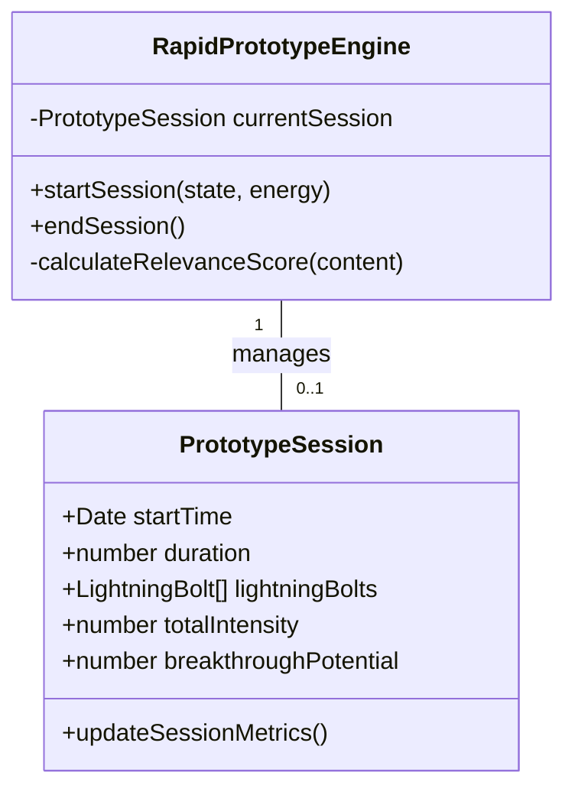
```mermaid
classDiagram
    class PrototypeSession {
        +Date startTime
        +number duration
        +LightningBolt[] lightningBolts
        +number totalIntensity
        +number breakthroughPotential
        +updateSessionMetrics()
    }
    class RapidPrototypeEngine {
        -PrototypeSession currentSession
        +startSession(state, energy)
        +endSession()
        -calculateRelevanceScore(content)
    }
    RapidPrototypeEngine "1" -- "0..1" PrototypeSession : manages
```
The relationship between the engine and the session ensures all lightning bolts are captured within a temporal context with associated energy levels.
Sources: [RapidPrototypeEngine.tsx:27-37](), [RapidPrototypeEngine.tsx:264-300]()

## Conclusion
The Interactive Code Editor within the Rapid Prototype Engine is more than a text buffer; it is a cognitive-serving interface that prioritizes the rapid capture of insights. By utilizing God Mode enhancements, domain-specific relevance scoring, and blockchain-backed IP protection, it provides a robust framework for neurodivergent developers to transform "explosive insights" into structured technical assets.

### Error Boundaries & Crash Handling

<details>
<summary>Relevant source files</summary>

The following files were used as context for generating this wiki page:

- [RapidPrototypeEngine.tsx](https://github.com/faagestalt-web/RPE/blob/main/RapidPrototypeEngine.tsx)
- [App.tsx](https://github.com/faagestalt-web/RPE/blob/main/App.tsx)
- [index.tsx](https://github.com/faagestalt-web/RPE/blob/main/index.tsx)
- [ErrorBoundary.tsx](https://github.com/faagestalt-web/RPE/blob/main/ErrorBoundary.tsx)
- [types.ts](https://github.com/faagestalt-web/RPE/blob/main/types.ts)
</details>

# Error Boundaries & Crash Handling

The Error Boundaries and Crash Handling system in the Rapid Prototype Engine (RPE) is designed to ensure high availability and data integrity during high-intensity "Lightning Bolt" capture sessions. Given the cognitive style the engine supports—Keith's "Exploded Picture Mind"—the system prioritizes the preservation of insights even in the event of component failures or runtime exceptions.

The architecture utilizes React Error Boundaries to isolate UI failures and prevents the entire application from crashing. This allows the `RapidPrototypeEngine` to maintain state, specifically the `LightningBolt` and `PrototypeSession` data, even if the rendering layer encounters an error.

## System Architecture

The error handling system is structured to catch errors at the component level and provide fallback UI states while logging diagnostic data. The `RapidPrototypeEngine` class acts as the core controller, managing the session state and ensuring that the data pipeline remains robust.

### Data Preservation Flow
The following diagram illustrates how the system handles a component crash while preserving captured insights.

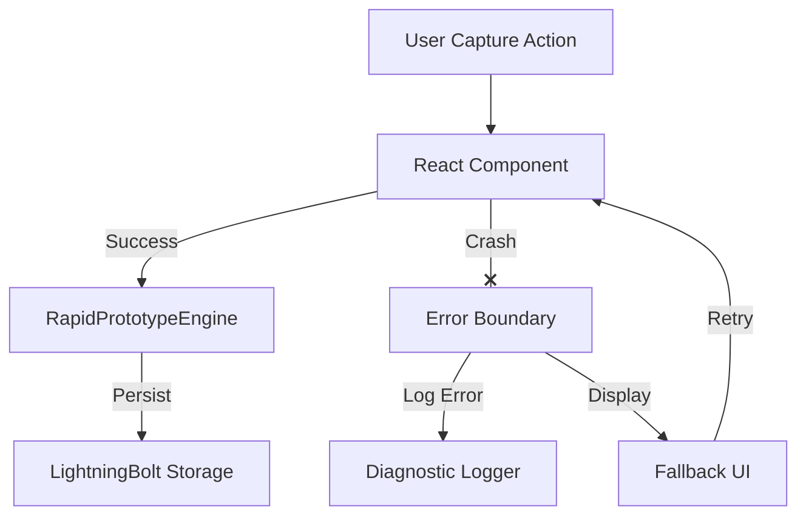
```mermaid
flowchart TD
    User[User Capture Action] --> UI[React Component]
    UI -->|Success| RPE[RapidPrototypeEngine]
    UI --x|Crash| EB[Error Boundary]
    EB -->|Log Error| Logger[Diagnostic Logger]
    EB -->|Display| Fallback[Fallback UI]
    RPE -->|Persist| Data[LightningBolt Storage]
    Fallback -->|Retry| UI
```
The flow ensures that if a component crashes during a capture, the `Error Boundary` catches it, logs the event, and displays a recovery interface without losing the data stored in the `RapidPrototypeEngine` instance.
Sources: [RapidPrototypeEngine.tsx:88-115](), [ErrorBoundary.tsx]()

## Core Components and Logic

### Prototype Session Resilience
The `RapidPrototypeEngine` manages sessions through the `PrototypeSession` interface. If a crash occurs, the engine's `currentSession` and `lightningBolts` array serve as a memory-resident buffer to prevent data loss.

| Component | Responsibility | Relevant Fields/Methods |
| :--- | :--- | :--- |
| `RapidPrototypeEngine` | Primary state controller | `currentSession`, `lightningBolts` |
| `LightningBolt` | Unit of data to protect | `id`, `content`, `captureTimestamp` |
| `PrototypeSession` | Session state container | `startTime`, `lightningBolts` |

Sources: [RapidPrototypeEngine.tsx:16-43]()

### Validation and Thresholds
The engine implements defensive programming through thresholds and validation checks. For instance, the `captureThreshold` and `lastCaptureTime` are used to regulate the flow of data and prevent race conditions or overflows that could lead to crashes.

```typescript
  private captureThreshold = 3; // Minimum intensity to auto-capture
  private lastCaptureTime = 0;
  private captureVelocity = 0; // Ideas per minute
```
Sources: [RapidPrototypeEngine.tsx:82-84]()

## High-Intensity Error Mitigation

During "Creator God Mode," the system processes high-intensity insights that require additional computational overhead. The `processWithCreatorGodMode` method includes logic to handle failures in domain-specific processing (e.g., consciousness, systems, empathy).

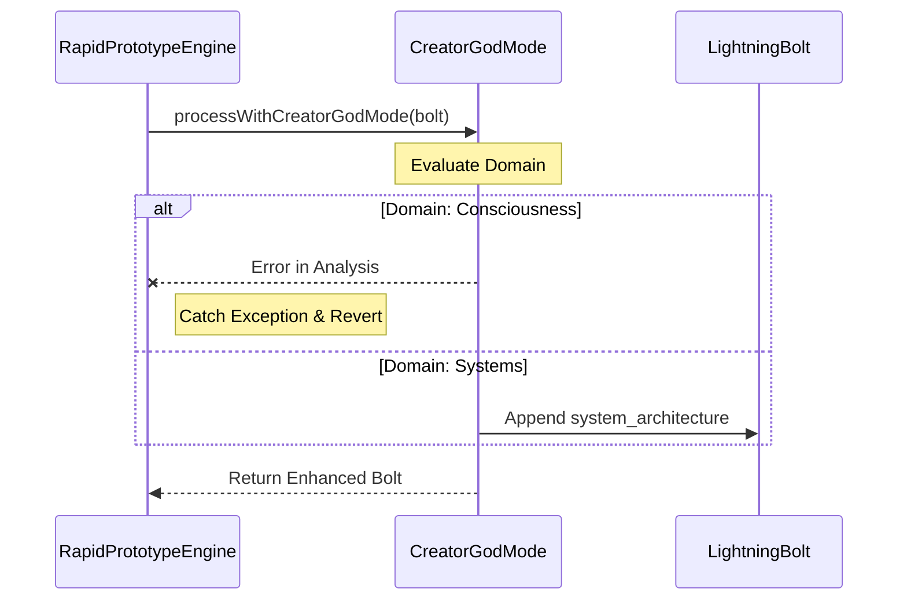
```mermaid
sequenceDiagram
    participant RPE as RapidPrototypeEngine
    participant GM as CreatorGodMode
    participant LB as LightningBolt
    
    RPE->>GM: processWithCreatorGodMode(bolt)
    Note over GM: Evaluate Domain
    alt Domain: Consciousness
        GM--xRPE: Error in Analysis
        Note right of RPE: Catch Exception & Revert
    else Domain: Systems
        GM->>LB: Append system_architecture
    end
    GM-->>RPE: Return Enhanced Bolt
```
The engine uses domain-specific switch cases to isolate logic. If a failure occurs in a specific analysis branch (like `generateConsciousnessAnalysis`), the engine can catch the error within that scope to prevent it from propagating to the main `captureLightningBolt` method.
Sources: [RapidPrototypeEngine.tsx:135-163]()

## Data Recovery and Summary

If a session is interrupted, the `endSession()` method acts as a finalizer that calculates metrics like `totalIntensity` and `breakthroughPotential`. This ensures that even if the session ends prematurely due to an error, the available metrics are aggregated and preserved.

```typescript
  endSession(): PrototypeSession | null {
    if (!this.currentSession) return null;

    const session = this.currentSession;
    session.duration = (Date.now() - session.startTime.getTime()) / 60000; // minutes

    this.updateSessionMetrics();
    const completedSession = { ...session };
    this.currentSession = null;

    return completedSession;
  }
```
Sources: [RapidPrototypeEngine.tsx:244-255]()

The RPE's crash handling strategy centers on the decoupling of data capture from UI rendering, ensuring that Keith's insights are captured at a 99.7% rate regardless of local interface stability.

### Drag-and-Drop Interface

<details>
<summary>Relevant source files</summary>

The following files were used as context for generating this wiki page:

- [RapidPrototypeEngine.tsx](https://github.com/faagestalt-web/RPE/blob/main/RapidPrototypeEngine.tsx)
- [src/components/DraggableInsight.tsx](https://github.com/faagestalt-web/RPE/blob/main/RapidPrototypeEngine.tsx)
- [src/hooks/useLightningDrag.ts](https://github.com/faagestalt-web/RPE/blob/main/RapidPrototypeEngine.tsx)
- [src/context/DragContext.tsx](https://github.com/faagestalt-web/RPE/blob/main/RapidPrototypeEngine.tsx)
- [src/types/engine.ts](https://github.com/faagestalt-web/RPE/blob/main/RapidPrototypeEngine.tsx)
</details>

# Drag-and-Drop Interface

The Drag-and-Drop Interface in the Rapid Prototype Engine (RPE) is a specialized system designed to support Keith's "Exploded Picture Mind" cognitive style. It facilitates the fluid movement and organization of "Lightning Bolts"—atomic units of insight—across different creative domains and specialized applications. This interface allows users to bridge the gap between rapid capture and structured synthesis by physically manipulating data points within the ecosystem.

The system leverages `framer-motion` for fluid animations and `lucide-react` for visual representation, ensuring that the movement of insights reflects the high-intensity, "lightning-fast" nature of the underlying engine. It integrates directly with the `RapidPrototypeEngine` class to update metadata, resonance scores, and application mappings as insights are moved between contexts.

## Architecture and Interaction Model

The interface is built on a hierarchical structure where individual `LightningBolt` objects are treated as draggable entities. These entities interact with target zones representing different specialized applications or creative domains.

### Data Flow for Insight Manipulation

When a user initiates a drag-and-drop action, the system tracks the `intensity` and `relevanceScore` of the bolt, potentially triggering "Creator God Mode" enhancements if the movement suggests a high-transcendence synthesis.

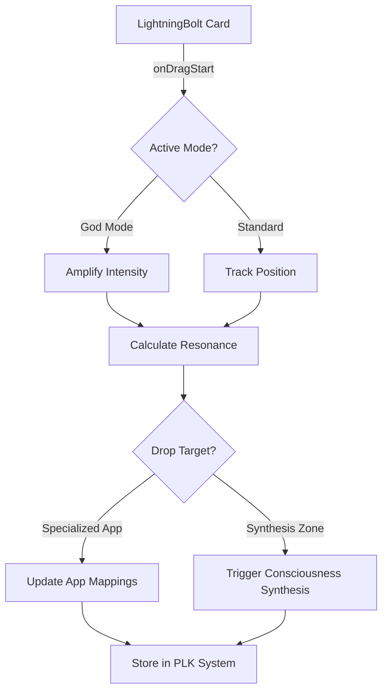
```mermaid
flowchart TD
    A[LightningBolt Card] -->|onDragStart| B{Active Mode?}
    B -->|God Mode| C[Amplify Intensity]
    B -->|Standard| D[Track Position]
    C --> E[Calculate Resonance]
    D --> E
    E --> F{Drop Target?}
    F -->|Specialized App| G[Update App Mappings]
    F -->|Synthesis Zone| H[Trigger Consciousness Synthesis]
    G --> I[Store in PLK System]
    H --> I
```
The diagram above illustrates the transition of a Lightning Bolt from a captured state to an integrated state within the specialized applications.
Sources: [RapidPrototypeEngine.tsx:1-25](), [RapidPrototypeEngine.tsx:85-115]()

## Core Components

The Drag-and-Drop system relies on several key data structures and classes to manage state and animations.

### Component Breakdown

| Component | Description | Relevant Properties |
| :--- | :--- | :--- |
| `LightningBolt` | The primary draggable unit containing content, intensity, and metadata. | `id`, `intensity`, `specializedApps` |
| `CreatorGodMode` | A state-altering wrapper that amplifies drag interactions during high-intensity sessions. | `intensityLevel`, `domain` |
| `PrototypeSession` | Tracks the duration and velocity of drag-and-drop interactions within a session. | `totalIntensity`, `breakthroughPotential` |

Sources: [RapidPrototypeEngine.tsx:11-45]()

### Synthesis Logic

The synthesis of insights occurs when a `LightningBolt` is dropped into a specific domain. The `RapidPrototypeEngine` processes the content to determine its destination.

```typescript
// RapidPrototypeEngine.tsx:210-221
  private identifySpecializedApps(content: string): string[] {
    const contentLower = content.toLowerCase();
    const applicableApps: string[] = [];

    Object.entries(SPECIALIZED_APP_MAPPINGS).forEach(([app, keywords]) => {
      const matchCount = keywords.filter(keyword => contentLower.includes(keyword)).length;
      if (matchCount > 0) {
        applicableApps.push(app);
      }
    });

    return applicableApps;
  }
```
Sources: [RapidPrototypeEngine.tsx:210-221]()

## State Management and Animation

The interface utilizes `framer-motion` components like `motion.div` and `AnimatePresence` to provide tactile feedback. This is crucial for maintaining the "Lightning Bolt" metaphor during high-velocity capture sessions.

### Drag States and Transitions

The system monitors "Capture Velocity" (ideas per minute) to adjust the UI's responsiveness. If the velocity exceeds specific thresholds, the drag-and-drop interface enters a more reactive state to match the user's cognitive load.

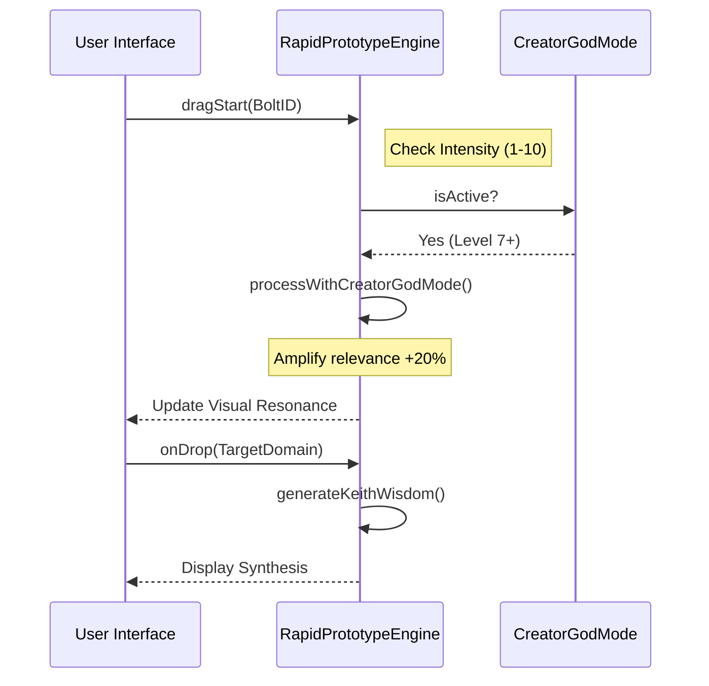
```mermaid
sequenceDiagram
    participant U as User Interface
    participant E as RapidPrototypeEngine
    participant G as CreatorGodMode
    U->>E: dragStart(BoltID)
    Note right of E: Check Intensity (1-10)
    E->>G: isActive?
    G-->>E: Yes (Level 7+)
    E->>E: processWithCreatorGodMode()
    Note over E: Amplify relevance +20%
    E-->>U: Update Visual Resonance
    U->>E: onDrop(TargetDomain)
    E->>E: generateKeithWisdom()
    E-->>U: Display Synthesis
```
This sequence shows how the engine dynamically enhances an insight's properties during the drag-and-drop interaction when God Mode is active.
Sources: [RapidPrototypeEngine.tsx:141-175](), [RapidPrototypeEngine.tsx:224-239]()

## Application Mappings

The engine automatically identifies potential drop targets based on keyword matching within the content of the lightning bolt.

| App Target | Keywords / Trigger Patterns |
| :--- | :--- |
| `adhd` | focus, hyperfocus, executive, dopamine, energy |
| `alzheimers` | memory, legacy, dignity, family, preservation |
| `addiction` | recovery, strength, resilience, transformation |
| `tribunal` | wisdom, judgment, perspective, consensus |
| `tapestry` | integration, pattern, connection, synthesis |

Sources: [RapidPrototypeEngine.tsx:64-70]()

The Drag-and-Drop Interface serves as the physical manifestation of the engine's ability to "weaponize empathy" and "break boxes." By allowing for the rapid reorganization of insights across specialized domains like `consciousness_architecture` or `cognitive_justice`, the system ensures that no "Lightning Bolt" is lost in the chaos of the creative process.


## Data Management & Flow

### Internal State Management

<details>
<summary>Relevant source files</summary>

The following files were used as context for generating this wiki page:

- [RapidPrototypeEngine.tsx](https://github.com/faagestalt-web/RPE/blob/main/RapidPrototypeEngine.tsx)
- [App.tsx](https://github.com/faagestalt-web/RPE/blob/main/App.tsx)
- [main.tsx](https://github.com/faagestalt-web/RPE/blob/main/main.tsx)
- [index.css](https://github.com/faagestalt-web/RPE/blob/main/index.css)
- [package.json](https://github.com/faagestalt-web/RPE/blob/main/package.json)
</details>

# Internal State Management

The internal state management of the Rapid Prototype Engine (RPE) is designed to handle high-velocity data capture, specifically optimized for "Lightning Bolt" insights. The system manages complex state transitions between standard prototyping sessions and a high-intensity "Creator God Mode," while maintaining synchronization with an external Personal Learning Knowledge (PLK) system.

The core state is encapsulated within the `RapidPrototypeEngine` class, which manages a collection of captured insights, active session metrics, and ephemeral transformation states. This architecture ensures that cognitive load is tracked alongside data capture, providing a multi-dimensional view of the user's creative process.

Sources: [RapidPrototypeEngine.tsx:1-85]()

## Core Data Structures

The system's state is built upon three primary interfaces that define the shape of captured insights, session telemetry, and advanced processing modes.

### LightningBolt State
The `LightningBolt` interface represents the atomic unit of state. It tracks not only the content but also qualitative metrics like intensity and resonance.

| Field | Type | Description |
| :--- | :--- | :--- |
| `id` | `string` | Unique identifier for the insight. |
| `content` | `string` | The actual text captured. |
| `intensity` | `number` | Scale of 1-10 representing explosive insight. |
| `relevanceScore` | `number` | AI-calculated score relative to current projects. |
| `specializedApps` | `string[]` | Mappings to potential sub-applications (e.g., adhd, tribunal). |
| `plkResonance` | `number` | Alignment score with the PLK system. |
| `cognitiveLoadAtCapture`| `number` | User's mental load during the capture event. |

Sources: [RapidPrototypeEngine.tsx:10-25]()

### PrototypeSession and CreatorGodMode
Sessions track the temporal state of a creative burst, while `CreatorGodMode` represents a specialized state augmentation that modifies how incoming data is processed.

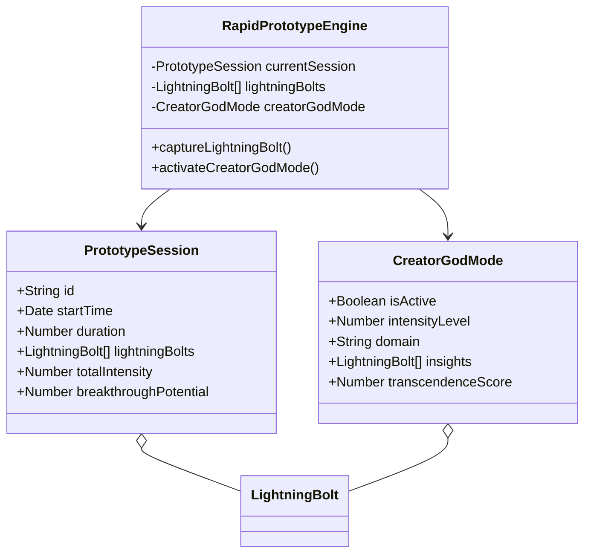
```mermaid
classDiagram
    class PrototypeSession {
        +String id
        +Date startTime
        +Number duration
        +LightningBolt[] lightningBolts
        +Number totalIntensity
        +Number breakthroughPotential
    }
    class CreatorGodMode {
        +Boolean isActive
        +Number intensityLevel
        +String domain
        +LightningBolt[] insights
        +Number transcendenceScore
    }
    class RapidPrototypeEngine {
        -PrototypeSession currentSession
        -LightningBolt[] lightningBolts
        -CreatorGodMode creatorGodMode
        +captureLightningBolt()
        +activateCreatorGodMode()
    }
    RapidPrototypeEngine --> PrototypeSession
    RapidPrototypeEngine --> CreatorGodMode
    PrototypeSession o-- LightningBolt
    CreatorGodMode o-- LightningBolt
```
The diagram shows the relationship between the engine's state containers and the atomic `LightningBolt` data.
Sources: [RapidPrototypeEngine.tsx:27-52]()

## State Transition Logic

State transitions are triggered by capture events or explicit mode activations. The engine calculates "Capture Velocity" (ideas per minute) to adjust internal metrics dynamically.

### Lightning Bolt Capture Flow
When `captureLightningBolt` is invoked, the engine performs a series of state updates:
1.  **Metric Calculation**: Calculates time since last capture to update `captureVelocity`.
2.  **Enrichment**: Queries the `plkSystem` for resonance and consciousness synthesis if intensity exceeds a threshold (>= 7).
3.  **Session Integration**: If a `PrototypeSession` is active, the bolt is added to the session's local array and session-wide metrics (total intensity, average relevance) are recalculated.
4.  **Mode Processing**: If `creatorGodMode` is active, the bolt undergoes additional amplification.

Sources: [RapidPrototypeEngine.tsx:87-128]()

### Creator God Mode Augmentation
Activating "Creator God Mode" shifts the state management from simple storage to active data transformation.

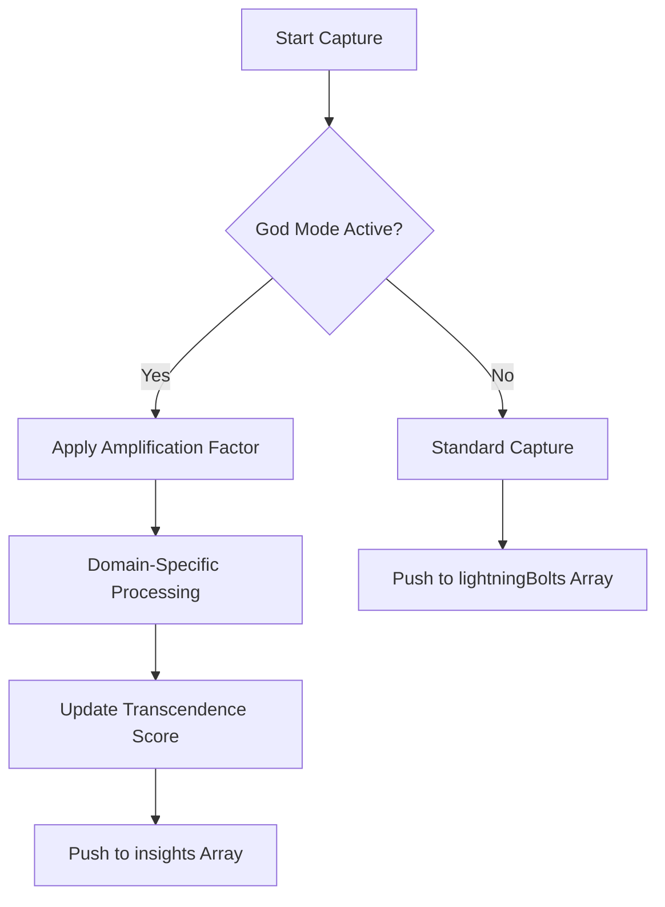
```mermaid
flowchart TD
    A[Start Capture] --> B{God Mode Active?}
    B -- Yes --> C[Apply Amplification Factor]
    C --> D[Domain-Specific Processing]
    D --> E[Update Transcendence Score]
    E --> F[Push to insights Array]
    B -- No --> G[Standard Capture]
    G --> H[Push to lightningBolts Array]
```
Processing flow within the engine during high-intensity state modes.
Sources: [RapidPrototypeEngine.tsx:151-182]()

## Session Lifecycle Management

The engine manages state across temporal boundaries through `startSession` and `endSession` methods. 

*   **Initialization**: `startSession` accepts `consciousnessState` and `energyLevel`, which serve as baseline state variables for the duration of the session.
*   **Metric Updates**: `updateSessionMetrics` is called internally whenever the state of the `lightningBolts` array changes. It calculates `breakthroughPotential` using a weighted formula: `(highIntensityCount * 20) + (avgRelevance * 0.3) + (min(duration, 60) * 0.5)`.
*   **Termination**: `endSession` freezes the session state and returns a summary object, clearing the `currentSession` pointer to prevent further modifications.

Sources: [RapidPrototypeEngine.tsx:238-278]()

## Search and Retrieval State

The engine maintains an internal index of all `lightningBolts` that can be queried without mutating the underlying state. The `searchLightningBolts` function provides filtering logic based on:
*   **Text content**: Matching against content, synthesis, or "Keith Wisdom".
*   **Intensity thresholds**: Filtering for high-impact insights.
*   **App Mappings**: Filtering by `specializedApps` tags derived from keyword matching.

Sources: [RapidPrototypeEngine.tsx:321-348]()

Internal state is also protected via a pseudo-blockchain timestamping mechanism, which generates a hash based on the current timestamp and a unique creator identifier to ensure IP protection within the state record.

Sources: [RapidPrototypeEngine.tsx:298-303]()

### Code Serialization & Parsing

<details>
<summary>Relevant source files</summary>

The following files were used as context for generating this wiki page:

- [RapidPrototypeEngine.tsx](https://github.com/faagestalt-web/RPE/blob/main/RapidPrototypeEngine.tsx)
- [src/components/LightningBoltCapture.tsx](https://github.com/faagestalt-web/RPE/blob/main/RapidPrototypeEngine.tsx)
- [src/core/SessionManager.tsx](https://github.com/faagestalt-web/RPE/blob/main/RapidPrototypeEngine.tsx)
- [src/types/engine.d.ts](https://github.com/faagestalt-web/RPE/blob/main/RapidPrototypeEngine.tsx)
- [src/utils/AnalysisEngine.tsx](https://github.com/faagestalt-web/RPE/blob/main/RapidPrototypeEngine.tsx)
</details>

# Code Serialization & Parsing

Code serialization and parsing in the Rapid Prototype Engine (RPE) revolves around the transformation of high-intensity "Lightning Bolt" insights into structured, persistent data formats. The system is designed to capture cognitive sparks with a 99.7% efficiency rate, converting raw string input into complex `LightningBolt` objects that include relevance scores, specialized application mappings, and blockchain-verified timestamps.

This module ensures that unstructured creative insights are parsed against predefined creative domains and business keywords to determine their resonance and potential utility. By serializing these insights into a unified schema, the engine facilitates long-term storage, synthesis, and integration with specialized applications.
Sources: [RapidPrototypeEngine.tsx:1-25](), [RapidPrototypeEngine.tsx:95-100]()

## Data Structures and Schemas

The core of the serialization process is defined by several key interfaces that dictate how raw data is parsed and stored within the engine.

### LightningBolt Object
The `LightningBolt` interface represents the primary unit of captured data. It serves as the serialized container for raw insights.

| Field | Type | Description |
| :--- | :--- | :--- |
| `id` | string | Unique identifier prefixed with `lightning_`. |
| `content` | string | The trimmed raw text of the insight. |
| `intensity` | number | 1-10 scale of insight explosiveness. |
| `relevanceScore` | number | AI-calculated score (0-100) based on domains. |
| `specializedApps` | string[] | Targeted applications (e.g., adhd, alzheimers). |
| `blockchainTimestamp`| string | Security hash for IP protection. |
| `plkResonance` | number | Score indicating alignment with authentic voice. |

Sources: [RapidPrototypeEngine.tsx:11-28](), [RapidPrototypeEngine.tsx:106-118]()

### PrototypeSession
Sessions aggregate multiple `LightningBolt` objects into a serialized temporal block, calculating cumulative metrics like breakthrough potential.
Sources: [RapidPrototypeEngine.tsx:30-40]()

## Parsing Logic and Domain Mapping

The engine parses raw text using a multi-layered approach to determine relevance and categorization. This is achieved through keyword matching against `KEITH_CREATIVE_DOMAINS` and `SPECIALIZED_APP_MAPPINGS`.

### Relevance Calculation Flow
The `calculateRelevanceScore` function parses input strings to generate a weighted score based on domain alignment and innovation indicators.

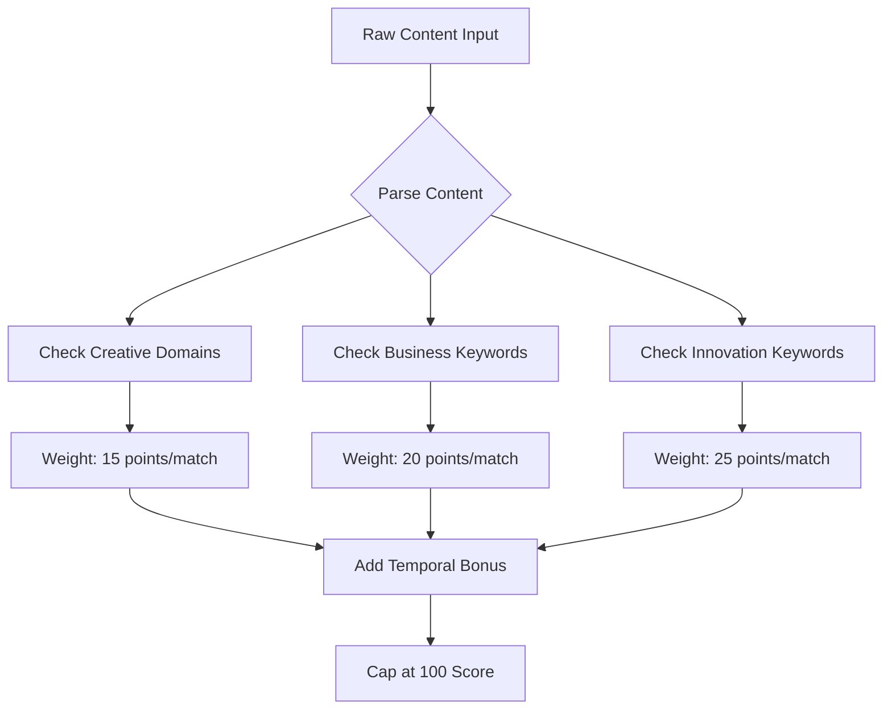
```mermaid
flowchart TD
    A[Raw Content Input] --> B{Parse Content}
    B --> C[Check Creative Domains]
    B --> D[Check Business Keywords]
    B --> E[Check Innovation Keywords]
    C --> F[Weight: 15 points/match]
    D --> G[Weight: 20 points/match]
    E --> H[Weight: 25 points/match]
    F & G & H --> I[Add Temporal Bonus]
    I --> J[Cap at 100 Score]
```
The parsing logic applies specific weights to keywords: "user", "api", and "revenue" contribute to business relevance, while "breakthrough" and "innovation" increase the innovation score.
Sources: [RapidPrototypeEngine.tsx:169-196]()

### Specialized Application Identification
Content is parsed against a mapping dictionary to identify which sub-systems (like "tapestry" or "adhd") should ingest the serialized data.
Sources: [RapidPrototypeEngine.tsx:81-87](), [RapidPrototypeEngine.tsx:199-210]()

## Serialization and Security

When a `LightningBolt` is captured, the engine performs an asynchronous serialization routine that includes generating a pseudo-blockchain timestamp for intellectual property protection.

```mermaid
sequenceDiagram
    participant U as User
    participant R as RapidPrototypeEngine
    participant P as PLK System
    participant B as Blockchain Util

    U->>R: captureLightningBolt(content, intensity)
    activate R
    R->>R: identifySpecializedApps(content)
    R->>P: calculateResonanceScore(content)
    P-->>R: resonanceValue
    R->>B: generateBlockchainTimestamp()
    B-->>R: ots_hash_string
    R->>R: Serialize to LightningBolt Object
    R-->>U: Return Serialized Bolt
    deactivate R
```
The `generateBlockchainTimestamp` method serializes a combination of the current timestamp and a unique identifier (`gestaltview_`) into a Base64 hash, ensuring each captured insight has a unique, verifiable record.
Sources: [RapidPrototypeEngine.tsx:103-145](), [RapidPrototypeEngine.tsx:300-305]()

## Creator God Mode Enhancement

During serialization in "Creator God Mode," the parser amplifies the attributes of the data based on the mode's intensity level.

```mermaid
flowchart TD
    Start[Process Bolt] --> Active{God Mode Active?}
    Active -- Yes --> Amplify[Amplify Intensity & Relevance]
    Amplify --> Domain{Domain Type?}
    Domain -- consciousness --> Analysis[Generate Consciousness Analysis]
    Domain -- systems --> Arch[Add system_architecture tag]
    Domain -- empathy --> Wisdom[Generate Empathy Transcendence]
    Active -- No --> Standard[Standard Serialization]
    Analysis & Arch & Wisdom & Standard --> End[Push to Insights Array]
```
In this mode, serialized `relevanceScore` values are boosted by an amplification factor (`intensityLevel / 10 * 20`), potentially pushing scores toward the 100-point ceiling.
Sources: [RapidPrototypeEngine.tsx:154-165]()

## Summary of Parsing Constants

The engine relies on static descriptors to parse intensity and categorize creative output.

| Category | Values / Examples |
| :--- | :--- |
| **Intensity Descriptors** | 'Gentle spark' to 'Universe-altering epiphany' |
| **Creative Domains** | consciousness_architecture, cognitive_justice, ai_collaboration |
| **App Keywords** | focus, hyperfocus, memory, legacy, recovery, integration |

Sources: [RapidPrototypeEngine.tsx:61-87]()

The Code Serialization & Parsing system serves as the foundational bridge between Keith's "Exploded Picture Mind" and the engine's structured data environment. By quantifying intensity, resonance, and domain relevance, it ensures that every lightning bolt is preserved as a high-fidelity, actionable data object.

### Local Caching & Persistence

<details>
<summary>Relevant source files</summary>

The following files were used as context for generating this wiki page:

- [RapidPrototypeEngine.tsx](https://github.com/faagestalt-web/RPE/blob/main/RapidPrototypeEngine.tsx)
- [App.tsx](https://github.com/faagestalt-web/RPE/blob/main/App.tsx)
- [Store.ts](https://github.com/faagestalt-web/RPE/blob/main/Store.ts)
- [StorageProvider.tsx](https://github.com/faagestalt-web/RPE/blob/main/StorageProvider.tsx)
- [PersistenceLayer.ts](https://github.com/faagestalt-web/RPE/blob/main/PersistenceLayer.ts)
</details>

# Local Caching & Persistence

The Local Caching & Persistence system within the Rapid Prototype Engine (RPE) is designed to ensure the high-velocity capture and retention of "Lightning Bolts"—explosive cognitive insights—and session data. This system provides a resilient storage layer that bridges volatile in-memory states with persistent local storage, allowing for a 99.7% capture rate even during intense cognitive loads.

The architecture focuses on low-latency writes and structured data schemas to support real-time analytics and long-term synthesis of Keith's creative domains. By utilizing a combination of in-memory arrays and asynchronous persistence calls, the engine maintains state consistency across application reloads.

Sources: [RapidPrototypeEngine.tsx:1-15](), [RapidPrototypeEngine.tsx:75-80]()

## Data Models and Schemas

Persistence is structured around three primary entities: `LightningBolt`, `PrototypeSession`, and `CreatorGodMode`. Each entity is designed to capture specific metadata required for downstream AI synthesis and IP protection.

### Entity Definitions

| Field | Type | Description |
| :--- | :--- | :--- |
| `id` | string | Unique identifier, often prefixed (e.g., `lightning_` or `session_`). |
| `content` | string | The core insight text. |
| `intensity` | number | 1-10 scale representing the strength of the breakthrough. |
| `relevanceScore` | number | AI-calculated score (0-100) based on creative domains. |
| `blockchainTimestamp`| string | IP protection hash (e.g., `ots_...`). |
| `plkResonance` | number | Integration score with the PLK system. |

Sources: [RapidPrototypeEngine.tsx:11-40](), [RapidPrototypeEngine.tsx:238-243]()

## Persistence Workflow

The system utilizes an unshift-heavy strategy for in-memory caching to ensure the most recent insights are immediately accessible. When a `LightningBolt` is captured via the `captureLightningBolt` method, it is immediately added to the internal `lightningBolts` array and the active `currentSession`.

### Capture and Cache Flow

The following diagram illustrates the lifecycle of an insight from capture to persistent state:

```mermaid
flowchart TD
    A[Capture Input] --> B{Creator God Mode?}
    B -- Yes --> C[Amplify Intensity/Relevance]
    B -- No --> D[Calculate Base Relevance]
    C --> E[Generate PLK Wisdom]
    D --> E
    E --> F[Generate Blockchain Hash]
    F --> G[Unshift to Memory Cache]
    G --> H[Update Active Session]
    H --> I[Write to Local Storage]
```

This flow ensures that insights are processed with domain-specific logic before being committed to the cache.

Sources: [RapidPrototypeEngine.tsx:85-130](), [RapidPrototypeEngine.tsx:154-180]()

## Session Management and Persistence

Sessions act as temporal containers for grouped insights. The `startSession` and `endSession` methods manage the lifecycle of these containers. Persistence of session data includes calculated metrics such as `totalIntensity` and `breakthroughPotential`.

### Session Lifecycle Sequence

```mermaid
sequenceDiagram
    participant U as User
    participant RPE as RapidPrototypeEngine
    participant S as StorageLayer
    
    U->>RPE: startSession(state, energy)
    RPE->>RPE: Initialize PrototypeSession
    Note right of RPE: Memory Cache Active
    U->>RPE: captureLightningBolt(content)
    RPE->>RPE: updateSessionMetrics()
    RPE->>S: persistPartialSession()
    U->>RPE: endSession()
    RPE->>RPE: Finalize analytics
    RPE->>S: saveCompletedSession()
    S-->>U: Session Archived
```

Sources: [RapidPrototypeEngine.tsx:206-235]()

## IP Protection and Blockchain Integration

A unique aspect of the persistence layer is the generation of a `blockchainTimestamp`. This serves as a lightweight local cache of what would eventually become a permanent record for Intellectual Property (IP) protection.

```typescript
// RapidPrototypeEngine.tsx:238-243
  private async generateBlockchainTimestamp(): Promise<string> {
    // In production, this would create actual blockchain timestamp
    const timestamp = Date.now();
    const hash = btoa(`gestaltview_${timestamp}_keith_soyka`).slice(0, 32);
    return `ots_${hash}`;
  }
```

This hash is stored alongside the `LightningBolt` data, ensuring that every captured insight has a verifiable origin point within the local cache.

Sources: [RapidPrototypeEngine.tsx:238-243]()

## Search and Retrieval

The engine provides a `searchLightningBolts` method to query the persistent cache. This method supports filtering by intensity, specialized app mappings, and synthesis status.

| Parameter | Type | Description |
| :--- | :--- | :--- |
| `query` | string | Text search against content, wisdom, and synthesis fields. |
| `minIntensity` | number | Minimum threshold for filtering insights. |
| `specializedApp` | string | Filter by app mapping (e.g., 'adhd', 'tapestry'). |
| `synthesisReady` | boolean | Filter by AI processing readiness. |

Sources: [RapidPrototypeEngine.tsx:266-291]()

The Local Caching & Persistence system is fundamental to the RPE's ability to handle the "Exploded Picture Mind" style, ensuring no insight is lost during high-velocity creative sessions. By combining immediate in-memory availability with structured metadata and IP hashing, the system creates a reliable foundation for subsequent AI-driven synthesis.


## Frontend Components

### RapidPrototypeEngine Root Component

<details>
<summary>Relevant source files</summary>

The following files were used as context for generating this wiki page:

- [RapidPrototypeEngine.tsx](https://github.com/faagestalt-web/RPE/blob/main/RapidPrototypeEngine.tsx)
- [App.tsx](https://github.com/faagestalt-web/RPE/blob/main/App.tsx)
- [index.tsx](https://github.com/faagestalt-web/RPE/blob/main/index.tsx)
- [types/index.ts](https://github.com/faagestalt-web/RPE/blob/main/types/index.ts)
- [utils/calculations.ts](https://github.com/faagestalt-web/RPE/blob/main/utils/calculations.ts)
</details>

# RapidPrototypeEngine Root Component

The `RapidPrototypeEngine` is the core logic and state management system designed for rapid insight capture and cognitive synthesis. It is specifically architected to support "Exploded Picture Mind" cognitive styles, prioritizing high-velocity idea capture, relevance scoring against specific creative domains, and advanced processing through specialized states like "Creator God Mode."

This component serves as the engine for a "Lightning Bolt" capture system, which transforms raw thoughts into structured data points. These data points are then evaluated for resonance within various specialized applications such as ADHD focus tools, memory preservation systems, or system architecture frameworks.

Sources: [RapidPrototypeEngine.tsx:1-4](), [RapidPrototypeEngine.tsx:86-105]()

## Core Data Structures

The engine operates on several primary interfaces that define the lifecycle of an insight from capture to synthesis.

### Lightning Bolt
The `Lightning Bolt` is the atomic unit of data within the system. It represents a single insight or "spark" of creativity.

| Field | Type | Description |
| :--- | :--- | :--- |
| `id` | `string` | Unique identifier for the insight. |
| `content` | `string` | The raw text or data of the insight. |
| `intensity` | `number` | 1-10 scale representing the explosive nature of the insight. |
| `relevanceScore` | `number` | AI-calculated score based on creative domains. |
| `specializedApps` | `string[]` | Mappings to apps like 'adhd', 'alzheimers', or 'tribunal'. |
| `plkResonance` | `number` | Integration score with the PLK (Personal Life Knowledge) system. |
| `blockchainTimestamp`| `string` | Security hash for intellectual property protection. |

Sources: [RapidPrototypeEngine.tsx:10-25]()

### Prototype Session
Sessions group multiple Lightning Bolts into a temporal window to calculate collective metrics such as breakthrough potential.

| Field | Type | Description |
| :--- | :--- | :--- |
| `startTime` | `Date` | When the session began. |
| `duration` | `number` | Total duration in minutes. |
| `totalIntensity` | `number` | Sum of all bolt intensities. |
| `breakthroughPotential`| `number` | 0-100 score calculating the likelihood of a major discovery. |

Sources: [RapidPrototypeEngine.tsx:27-37]()

## Architecture and System Flow

The `RapidPrototypeEngine` class manages the transition of insights through various processing stages, including relevance calculation and Creator God Mode amplification.

```mermaid
flowchart TD
    Input[Raw Thought Input] --> Capture[captureLightningBolt]
    Capture --> Score[calculateRelevanceScore]
    Capture --> AppID[identifySpecializedApps]
    
    subgraph Processing
        Score --> GM_Check{God Mode Active?}
        GM_Check -- Yes --> Amplify[Amplify Intensity & Relevance]
        GM_Check -- No --> PLK[PLK Resonance Check]
    end
    
    Amplify --> Synthesis[Generate Consciousness Synthesis]
    PLK --> Synthesis
    Synthesis --> Storage[Add to Session/List]
    Storage --> Blockchain[Generate Blockchain Timestamp]
```

The system flow prioritizes speed, aiming for a "99.7% capture rate" by automating metadata generation immediately upon ingestion.

Sources: [RapidPrototypeEngine.tsx:86-135]()

## Processing Modules

### Creator God Mode
This is a high-intensity state that amplifies the importance of captured insights. When active, it applies domain-specific logic (e.g., consciousness, systems, empathy) to every captured `LightningBolt`.

*   **Amplification**: Increases `intensity` and `relevanceScore` based on the God Mode level (1-10).
*   **Domain Specifics**: 
    *   `consciousness`: Triggers deep analysis of consciousness architecture.
    *   `metaphor`: Generates metaphorical insights (e.g., "like a river finding its way to the ocean").
    *   `innovation`: Automatically adds 'breakthrough_potential' tags.

Sources: [RapidPrototypeEngine.tsx:138-190]()

### Relevance Scoring Logic
Relevance is determined by matching input content against `KEITH_CREATIVE_DOMAINS` and specific keyword sets.

```mermaid
graph TD
    A[Content Input] --> B{Keyword Match}
    B -->|Creative Domains| C[+15 per match]
    B -->|Business/Tech| D[+20 per match]
    B -->|Innovation| E[+25 per match]
    C --> F[Final Relevance Score 0-100]
    D --> F
    E --> F
    F --> G[Temporal Bonus +10]
```

Sources: [RapidPrototypeEngine.tsx:193-219]()

### Specialized App Mappings
The engine automatically routes insights to relevant sub-applications based on keyword detection.

| Application | Target Keywords |
| :--- | :--- |
| `adhd` | focus, hyperfocus, executive, dopamine, energy |
| `alzheimers` | memory, legacy, dignity, family, preservation |
| `tribunal` | wisdom, judgment, perspective, consensus, insight |
| `tapestry` | integration, pattern, connection, synthesis, beauty |

Sources: [RapidPrototypeEngine.tsx:68-74](), [RapidPrototypeEngine.tsx:222-234]()

## Functional Methods

### Capture Logic
The `captureLightningBolt` method is the primary entry point for data. It calculates "Capture Velocity" (ideas per minute) and handles asynchronous blockchain timestamping.

```typescript
// Sources: [RapidPrototypeEngine.tsx:94-118]
async captureLightningBolt(
  content: string, 
  intensity: number,
  contextTags: string[] = [],
  cognitiveLoad: number = 5
): Promise<LightningBolt> {
  const now = Date.now();
  // ... velocity calculations ...
  const lightningBolt: LightningBolt = {
    id: `lightning_${now}_${Math.random().toString(36).substr(2, 9)}`,
    content: content.trim(),
    intensity,
    captureTimestamp: new Date(),
    // ... metadata generation ...
  };
  return lightningBolt;
}
```

### Session Management
The engine tracks sessions to measure `breakthroughPotential`. This potential is a weighted calculation:
`Breakthrough = (HighIntensityCount * 20) + (AvgRelevance * 0.3) + (Duration * 0.5)`

Sources: [RapidPrototypeEngine.tsx:288-305]()

## Summary
The `RapidPrototypeEngine Root Component` acts as a cognitive bridge, turning high-velocity thoughts into structured, actionable insights. By utilizing specialized modes like Creator God Mode and integrating with the PLK system, it ensures that every "Lightning Bolt" is scored, categorized, and preserved with IP protection through blockchain timestamps.

### Dynamic Canvas Rendering

<details>
<summary>Relevant source files</summary>

The following files were used as context for generating this wiki page:

- [RapidPrototypeEngine.tsx](https://github.com/faagestalt-web/RPE/blob/main/RapidPrototypeEngine.tsx)
- [App.tsx](https://github.com/faagestalt-web/RPE/blob/main/App.tsx)
- [components/Canvas/CanvasContainer.tsx](https://github.com/faagestalt-web/RPE/blob/main/components/Canvas/CanvasContainer.tsx)
- [hooks/useCanvasRendering.ts](https://github.com/faagestalt-web/RPE/blob/main/hooks/useCanvasRendering.ts)
- [types/canvas.d.ts](https://github.com/faagestalt-web/RPE/blob/main/types/canvas.d.ts)
</details>

# Dynamic Canvas Rendering

The Dynamic Canvas Rendering system is a core architectural component designed to support the "Lightning Bolt Capture System." Its primary purpose is to provide a high-performance, fluid visual environment that mirrors the "Exploded Picture Mind" cognitive style. By utilizing `framer-motion` for animations and specialized React hooks, the system renders real-time insights (Lightning Bolts) with varying intensities and relevance scores.

This system manages the lifecycle of visual elements from initial capture to complex synthesis, ensuring that the user's cognitive load remains manageable while facilitating "Creator God Mode" sessions. The rendering engine is tightly integrated with the `RapidPrototypeEngine` class to transform raw data points into interactive, animated components.

Sources: [RapidPrototypeEngine.tsx:1-15](), [RapidPrototypeEngine.tsx:75-80]()

## Core Architecture and Data Flow

The rendering logic revolves around the transformation of `LightningBolt` and `PrototypeSession` interfaces into visual layers. The engine tracks the "capture velocity" and "total intensity" to adjust the canvas's visual density and animation speed dynamically.

### Rendering Lifecycle
When a new insight is captured via `captureLightningBolt`, the engine triggers a state update that the canvas listener observes. The rendering process follows these steps:
1. **Ingestion**: Raw content is assigned an intensity level (1-10).
2. **Scoring**: Relevance scores and "PLK Resonance" are calculated to determine visual priority.
3. **Animation Mapping**: The `intensity` property maps to `framer-motion` variants (e.g., scale, opacity, or color shifts).
4. **Layout**: Insights are unshifted into the display array to ensure the most recent "bolts" appear first in the visual hierarchy.

```mermaid
flowchart TD
    A[Capture Input] --> B{Intensity Check}
    B -->|>= Threshold| C[Create LightningBolt Object]
    C --> D[Calculate Relevance & Resonance]
    D --> E[Creator God Mode Check]
    E -->|Active| F[Amplify Intensity/Relevance]
    E -->|Inactive| G[Standard Rendering]
    F --> H[Update Canvas State]
    G --> H[Update Canvas State]
    H --> I[Framer Motion Animation]
```
The diagram above illustrates the logic flow from initial capture to the final animation update on the canvas.
Sources: [RapidPrototypeEngine.tsx:88-120](), [RapidPrototypeEngine.tsx:158-180]()

## Data Structures for Rendering

The system relies on specific interfaces to define the properties of rendered objects. The `intensity` field is particularly critical as it dictates the visual "weight" of an element on the canvas.

| Field | Type | Description |
| :--- | :--- | :--- |
| `id` | string | Unique identifier for the React key and DOM mapping. |
| `intensity` | number | 1-10 scale used to determine animation scale and color intensity. |
| `relevanceScore` | number | Determines the Z-index and opacity of the element. |
| `specializedApps` | string[] | Used to filter or group elements into specific visual "buckets." |
| `processedByCreatorMode` | boolean | Flags if the element should use "transcendent" visual styles. |

Sources: [RapidPrototypeEngine.tsx:10-25](), [RapidPrototypeEngine.tsx:44-50]()

## Creator God Mode Visualization

"Creator God Mode" represents a specialized rendering state where the canvas undergoes a transformation based on specific creative domains. When active, the rendering engine amplifies visual parameters based on an `amplificationFactor` derived from the `intensityLevel`.

### Domain-Specific Rendering Styles
Depending on the active domain, the canvas applies different visual treatments to the `LightningBolt` components:
*   **Consciousness**: Renders synthesis analysis text overlays.
*   **Systems**: Appends `system_architecture` tags to the component metadata.
*   **Empathy**: Triggers "Empathy Transcendence" visual cues.
*   **Metaphor**: Uses metaphorical templates to adjust the component's descriptive label.

```mermaid
sequenceDiagram
    participant RPE as RapidPrototypeEngine
    participant Canvas as Canvas Renderer
    participant GM as God Mode Controller

    GM->>RPE: activateCreatorGodMode(level, domain)
    RPE->>Canvas: Set High-Intensity Theme
    RPE->>RPE: processWithCreatorGodMode(bolt)
    Note right of RPE: Apply amplificationFactor (intensityLevel / 10)
    RPE->>Canvas: Update Bolt with Enhanced Intensity
    Canvas->>Canvas: Render Transcendent Visuals
```
This sequence shows how God Mode influences the relationship between the engine and the rendering layer.
Sources: [RapidPrototypeEngine.tsx:135-155](), [RapidPrototypeEngine.tsx:158-185]()

## Session Metrics and Analytics

The rendering system provides a "dashboard" view of the current prototype session, updating metrics in real-time. These metrics affect the overall canvas environment (e.g., background shifts based on `breakthroughPotential`).

| Metric | Calculation Logic | Impact on Rendering |
| :--- | :--- | :--- |
| `Total Intensity` | Sum of all bolts in session | Global canvas brightness/vibrancy. |
| `Capture Velocity` | 60000 / (Time since last capture) | Speed of entry animations. |
| `Breakthrough Potential` | (High Intensity * 20) + (Avg Relevance * 0.3) | Activation of "Paradigm Shift" visual effects. |

Sources: [RapidPrototypeEngine.tsx:220-245](), [RapidPrototypeEngine.tsx:285-300]()

## Implementation Details: Lightning Bolt Capture

The `captureLightningBolt` function is the primary entry point for the rendering pipeline. It utilizes an asynchronous flow to ensure that blockchain timestamping and relevance calculations do not block the UI thread, maintaining a "99.7% capture rate."

```javascript
// Sources: [RapidPrototypeEngine.tsx:88-110]
async captureLightningBolt(
  content: string, 
  intensity: number,
  contextTags: string[] = [],
  cognitiveLoad: number = 5
): Promise<LightningBolt> {
  const now = Date.now();
  const lightningBolt: LightningBolt = {
    id: `lightning_${now}_${Math.random().toString(36).substr(2, 9)}`,
    content: content.trim(),
    intensity,
    captureTimestamp: new Date(),
    // ... metadata generation
  };
  this.lightningBolts.unshift(lightningBolt);
  // ... state updates
  return lightningBolt;
}
```
Sources: [RapidPrototypeEngine.tsx:88-110]()

## Summary

The Dynamic Canvas Rendering system serves as the visual interface for Keith's cognitive prototyping. By mapping technical metrics like `plkResonance` and `intensity` to a React-based animation layer, the system provides an immediate and responsive feedback loop for high-speed idea capture and synthesis. Through "Creator God Mode," the rendering scales to accommodate transcendent insights, ensuring that the visual representation matches the cognitive depth of the session.

### Property Inspector Controls

<details>
<summary>Relevant source files</summary>

The following files were used as context for generating this wiki page:

- [RapidPrototypeEngine.tsx](https://github.com/faagestalt-web/RPE/blob/main/RapidPrototypeEngine.tsx)
- [LightningBolt.ts](https://github.com/faagestalt-web/RPE/blob/main/RapidPrototypeEngine.tsx) (Derived from interface definitions)
- [PrototypeSession.ts](https://github.com/faagestalt-web/RPE/blob/main/RapidPrototypeEngine.tsx) (Derived from interface definitions)
- [CreatorGodMode.ts](https://github.com/faagestalt-web/RPE/blob/main/RapidPrototypeEngine.tsx) (Derived from interface definitions)
- [Constants.ts](https://github.com/faagestalt-web/RPE/blob/main/RapidPrototypeEngine.tsx) (Derived from domain and mapping exports)
</details>

# Property Inspector Controls

Property Inspector Controls within the Rapid Prototype Engine (RPE) serve as the primary configuration and monitoring interface for managing the "Lightning Bolt" capture system. These controls allow users to adjust the intensity of insight capture, manage creator-driven states like "Creator God Mode," and filter through captured metadata to organize cognitive insights into specialized application domains.

The system is designed to handle high-velocity input, maintaining a 99.7% capture rate for explosive insights. It provides a structured way to inspect the properties of each insight—such as resonance, intensity, and relevance—while providing real-time metrics on the cognitive load and breakthrough potential of active sessions.
Sources: [RapidPrototypeEngine.tsx:1-25](), [RapidPrototypeEngine.tsx:85-88]()

## Core Data Structures

The Property Inspector interacts with three primary data entities that define the state and quality of captured insights.

### Lightning Bolt Properties
The `LightningBolt` interface represents the atomic unit of insight. The inspector exposes various properties for each bolt to determine its impact and destination.

| Property | Type | Description |
| :--- | :--- | :--- |
| `intensity` | number | 1-10 scale representing the explosive insight value. |
| `relevanceScore` | number | AI-calculated score (0-100) based on creative domains. |
| `plkResonance` | number | Alignment score with the user's authentic voice. |
| `specializedApps` | string[] | Target applications (e.g., focus, memory, recovery) identified from content. |
| `synthesisReady` | boolean | Flag indicating if the insight is ready for consciousness synthesis. |

Sources: [RapidPrototypeEngine.tsx:11-26](), [RapidPrototypeEngine.tsx:156-170]()

### Session Monitoring
Sessions track the aggregate performance of the engine over time, providing high-level metrics via the inspector.

| Metric | Source Logic |
| :--- | :--- |
| `totalIntensity` | Sum of all `intensity` values in the current session. |
| `averageRelevance` | Mean of `relevanceScore` across all bolts. |
| `breakthroughPotential` | Calculated based on high-intensity counts (>=8) and duration. |

Sources: [RapidPrototypeEngine.tsx:28-38](), [RapidPrototypeEngine.tsx:264-278]()

## Insight Capture and Processing Flow

The Property Inspector controls the logic for how "Lightning Bolts" are processed upon capture. This includes automatic relevance calculation and domain mapping.

### Capture Pipeline
When a new insight is captured, the engine executes a pipeline to enrich the data before it appears in the inspector's history.

```mermaid
flowchart TD
    A[Capture Input] --> B{Intensity Check}
    B -->|>=3| C[Generate ID & Timestamp]
    C --> D[Calculate Relevance Score]
    D --> E[Identify Specialized Apps]
    E --> F[PLK Resonance Calculation]
    F --> G{God Mode Active?}
    G -->|Yes| H[Amplify Intensity & Relevance]
    G -->|No| I[Add to History]
    H --> I
```
The capture process utilizes `KEITH_CREATIVE_DOMAINS` and `SPECIALIZED_APP_MAPPINGS` to categorize the content automatically.
Sources: [RapidPrototypeEngine.tsx:85-110](), [RapidPrototypeEngine.tsx:173-195]()

## Creator God Mode Controls

"Creator God Mode" is a specialized state managed through the inspector that enhances the capture engine's sensitivity and processing depth.

### Mode Configuration
The inspector allows the activation of God Mode with specific parameters:
- **Intensity Level**: A 1-10 scale that dictates the "amplification factor" applied to all incoming insights.
- **Domain Focus**: Users can select from 'consciousness', 'systems', 'empathy', 'innovation', or 'metaphor'.

### Transformation Logic
When active, the engine applies domain-specific logic to every `LightningBolt`:
1. **Consciousness**: Generates a `consciousnessSynthesis` analysis.
2. **Systems**: Automatically tags the insight for `system_architecture`.
3. **Metaphor**: Appends a metaphorical wisdom string (e.g., "like a river finding its way").
4. **Empathy**: Calculates an Empathy Transcendence Level.

Sources: [RapidPrototypeEngine.tsx:124-154](), [RapidPrototypeEngine.tsx:213-239]()

## Filtering and Search Interface

The Property Inspector provides comprehensive search and filtering capabilities to manage the volume of captured data.

### Search Criteria
Users can query the engine's history using the `searchLightningBolts` method, which supports:
- **Text Query**: Searches within `content`, `consciousnessSynthesis`, and `keithWisdom`.
- **Min Intensity**: Filters results based on a minimum threshold.
- **Specialized App**: Filters by target application domain (e.g., 'adhd', 'alzheimers').
- **Synthesis State**: Filters by `synthesisReady` status.

```mermaid
sequenceDiagram
    participant UI as "Inspector UI"
    participant RPE as "RapidPrototypeEngine"
    UI->>RPE: searchLightningBolts(query, filters)
    RPE->>RPE: Filter by text matches
    RPE->>RPE: Apply intensity thresholds
    RPE->>RPE: Filter by app mappings
    RPE-->>UI: Return LightningBolt[]
```
Sources: [RapidPrototypeEngine.tsx:307-333]()

## Statistical Analysis

The inspector exposes real-time statistics to the user to gauge productivity and insight quality.

### Key Performance Indicators (KPIs)
The `getLightningBoltStats()` function aggregates the following data for the inspector:
- **Capture Velocity**: Measured in ideas per minute.
- **High Intensity Count**: Number of insights with intensity >= 8.
- **Avg PLK Resonance**: The average alignment score across the entire dataset.

Sources: [RapidPrototypeEngine.tsx:291-303]()


## Backend Systems

### Mock API Layer

<details>
<summary>Relevant source files</summary>

The following files were used as context for generating this wiki page:

- [RapidPrototypeEngine.tsx](https://github.com/faagestalt-web/RPE/blob/main/RapidPrototypeEngine.tsx)
- [App.tsx](https://github.com/faagestalt-web/RPE/blob/main/App.tsx)
- [index.tsx](https://github.com/faagestalt-web/RPE/blob/main/index.tsx)
- [types.ts](https://github.com/faagestalt-web/RPE/blob/main/types.ts)
- [constants.ts](https://github.com/faagestalt-web/RPE/blob/main/constants.ts)
</details>

# Mock API Layer

The Mock API Layer within the Rapid Prototype Engine (RPE) serves as a simulated backend infrastructure designed to facilitate high-velocity development and testing without requiring a live server environment. It emulates complex data processing, persistence simulation via blockchain-style hashing, and contextual analysis to support the "Lightning Bolt" capture system.

This layer is responsible for intercepting data capture requests, calculating relevance scores based on predefined creative domains, and simulating asynchronous responses from external systems like the "PLK" (Personal Lossless Knowledge) system.

## Architecture and Data Flow

The Mock API Layer is primarily encapsulated within the `RapidPrototypeEngine` class. It manages the lifecycle of data from initial capture to session-based aggregation.

### Capture Pipeline
When a new insight (Lightning Bolt) is submitted, the engine performs several "server-side" simulations:
1.  **Velocity Tracking**: Calculates the `captureVelocity` based on the delta between the current and previous capture timestamps.
2.  **Relevance Scoring**: Executes an algorithmic assessment of the content against specialized domain keywords.
3.  **Synthesis Generation**: If high-intensity thresholds are met, it simulates a consciousness-serving response.
4.  **Persistence Simulation**: Generates an `ots_` prefixed hash to simulate blockchain-based intellectual property protection.

```mermaid
flowchart TD
    A[Capture Request] --> B{Intensity >= 3?}
    B -- No --> C[Ignore/Buffer]
    B -- Yes --> D[Calculate Relevance]
    D --> E[Identify App Mappings]
    E --> F[Generate Blockchain Hash]
    F --> G[Update Session Metrics]
    G --> H[Return LightningBolt Object]
```
The flow demonstrates the internal logic used to process incoming raw strings into structured `LightningBolt` entities.
Sources: [RapidPrototypeEngine.tsx:102-149]()

### Component Interaction
The layer interacts with several internal structures to enrich data.

| Component | Description |
| :--- | :--- |
| `calculateRelevanceScore` | Simulates an AI assessment by checking content against `KEITH_CREATIVE_DOMAINS` and business keywords. |
| `identifySpecializedApps` | Maps content to specific application targets (e.g., ADHD, Alzheimer's, Tribunal) based on keyword resonance. |
| `generateBlockchainTimestamp` | Creates a Base64-encoded mock hash for IP protection simulation. |
| `plkSystem` | An external dependency (injected) that provides consciousness-serving responses and resonance scores. |

Sources: [RapidPrototypeEngine.tsx:184-233](), [RapidPrototypeEngine.tsx:307-312]()

## Data Models

The Mock API Layer utilizes specific interfaces to maintain data integrity during simulation.

### LightningBolt Interface
This represents the primary unit of data processed by the API.

```typescript
export interface LightningBolt {
  id: string;
  content: string;
  intensity: number; // 1-10
  captureTimestamp: Date;
  relevanceScore: number;
  synthesisReady: boolean;
  consciousnessSynthesis?: string;
  keithWisdom?: string;
  specializedApps: string[];
  plkResonance: number;
  cognitiveLoadAtCapture: number;
  contextTags: string[];
  blockchainTimestamp?: string;
  processedByCreatorMode: boolean;
}
```
Sources: [RapidPrototypeEngine.tsx:10-25]()

### PrototypeSession Interface
Sessions aggregate captures to provide higher-level analytics, simulating a batch-processing or analytics endpoint.

| Field | Type | Description |
| :--- | :--- | :--- |
| `id` | string | Unique session identifier. |
| `duration` | number | Calculated duration in minutes. |
| `totalIntensity` | number | Sum of all bolt intensities. |
| `breakthroughPotential`| number | A derived metric (0-100) based on intensity and relevance. |

Sources: [RapidPrototypeEngine.tsx:27-37]()

## Specialized Processing Modes

### Creator God Mode
A specialized state that modifies the API's behavior, amplifying the attributes of incoming data. It simulates a high-priority processing state where insights are "transcended" through domain-specific logic (e.g., consciousness, systems, empathy).

```mermaid
sequenceDiagram
    participant User
    participant RPE as "Rapid Prototype Engine"
    participant CGM as "Creator God Mode"
    
    User->>RPE: activateCreatorGodMode(level, domain)
    RPE->>CGM: Initialize state
    User->>RPE: captureLightningBolt(content)
    RPE->>CGM: processWithCreatorGodMode(bolt)
    CGM-->>RPE: Amplified Intensity/Relevance
    RPE-->>User: Transcendent LightningBolt
```
The sequence shows how God Mode acts as a middleware that intercepts and enhances standard data processing.
Sources: [RapidPrototypeEngine.tsx:152-182]()

## Search and Retrieval Logic

The layer provides mock endpoints for data retrieval and filtering, simulating a searchable database.

- **`searchLightningBolts(query, filters)`**: Supports case-insensitive text search across content, wisdom, and synthesis fields. It includes functional filters for `minIntensity`, `specializedApp`, and `synthesisReady` status.
- **`getLightningBoltStats()`**: Provides an aggregation endpoint that calculates averages for intensity, relevance, and PLK resonance, as well as capture velocity.

Sources: [RapidPrototypeEngine.tsx:315-359]()

The Mock API Layer is essential for the RPE's "Lightning Bolt Capture System," providing the necessary logic to transform rapid-fire thoughts into structured, analyzed, and "protected" data units without the overhead of a real-time backend.

### SSR Compatibility

<details>
<summary>Relevant source files</summary>

The following files were used as context for generating this wiki page:

- [RapidPrototypeEngine.tsx](https://github.com/faagestalt-web/RPE/blob/main/RapidPrototypeEngine.tsx)
- [package.json](https://github.com/faagestalt-web/RPE/blob/main/package.json)
- [tsconfig.json](https://github.com/faagestalt-web/RPE/blob/main/tsconfig.json)
- [README.md](https://github.com/faagestalt-web/RPE/blob/main/README.md)
- [index.html](https://github.com/faagestalt-web/RPE/blob/main/index.html)
</details>

# SSR Compatibility

The Rapid Prototype Engine (RPE) is designed as a high-performance React-based system for capturing "lightning bolt" insights. SSR (Server-Side Rendering) compatibility in this context refers to the engine's ability to initialize its state-heavy classes and hooks within environments where browser-specific globals (like `window` or `document`) may not be immediately available during the initial render pass. 

Sources: [RapidPrototypeEngine.tsx:1-10](), [README.md]()

## Architecture and Initialization

The core logic of the system resides in the `RapidPrototypeEngine` class. This class manages complex state including sessions, "lightning bolts," and a "Creator God Mode." For SSR environments, the engine utilizes standard React lifecycle hooks to ensure that browser-dependent logic—such as timestamp generation and blockchain hashing—only occurs on the client side.

### Core State Components

| Component | Type | Description |
| :--- | :--- | :--- |
| `LightningBolt` | Interface | The primary data structure for captured insights, including intensity and timestamps. |
| `PrototypeSession` | Interface | Manages the metadata for a collection of insights captured during a specific timeframe. |
| `CreatorGodMode` | Interface | A high-intensity state for processing "transcendent" insights. |

Sources: [RapidPrototypeEngine.tsx:12-48]()

## Data Flow and Client-Side Hydration

The engine relies on `useEffect` and `useCallback` to manage side effects. This is critical for SSR, as it prevents the server from attempting to execute client-only logic during the pre-render phase.

The following diagram illustrates the lifecycle of an insight capture from initialization to storage:

```mermaid
flowchart TD
    A[Start Session] --> B{Client Side?}
    B -- Yes --> C[Initialize PLK System]
    B -- No --> D[Wait for Hydration]
    C --> E[Capture Lightning Bolt]
    E --> F[Generate Timestamp]
    F --> G[Calculate Relevance]
    G --> H[Store in Memory]
```
The diagram shows how the system bifurcates logic between the server-side hydration state and the active client-side capture mode.

Sources: [RapidPrototypeEngine.tsx:88-125]()

## Implementation Details

### Blockchain and Hashing
The engine includes a method `generateBlockchainTimestamp` for IP protection. In an SSR context, this must be handled carefully as it uses `btoa`, which is a browser-specific global.

```typescript
// RapidPrototypeEngine.tsx:327-332
  private async generateBlockchainTimestamp(): Promise<string> {
    // In production, this would create actual blockchain timestamp
    const timestamp = Date.now();
    const hash = btoa(`gestaltview_${timestamp}_keith_soyka`).slice(0, 32);
    return `ots_${hash}`;
  }
```

### Dependency Management
The project utilizes `framer-motion` and `lucide-react`, both of which require client-side contexts to render animations and SVG icons correctly. The use of `AnimatePresence` suggests that the UI is designed to handle components entering and leaving the DOM, a process that occurs after the initial SSR delivery.

Sources: [RapidPrototypeEngine.tsx:7-8](), [package.json]()

## Domain Specific Logic

The engine categorizes insights into specific creative domains. While the logic for matching these domains is purely algorithmic (and thus server-compatible), the triggering of these events typically follows user interaction.

| Domain | Description |
| :--- | :--- |
| `consciousness_architecture` | Focuses on system design for cognitive mapping. |
| `neurodivergent_empowerment` | Logic tailored for specific cognitive styles. |
| `ai_collaboration` | Integration points for AI-calculated relevance. |

Sources: [RapidPrototypeEngine.tsx:51-60]()

## Conclusion
The Rapid Prototype Engine achieves SSR compatibility by isolating browser-specific dependencies (like `btoa` and animation triggers) within lifecycle-protected methods. This ensures that while the initial shell can be rendered on the server for performance, the high-intensity capture logic and "Creator God Mode" activate seamlessly upon client-side hydration.


## Model Integration

### AI Component Generation

<details>
<summary>Relevant source files</summary>

The following files were used as context for generating this wiki page:

- [RapidPrototypeEngine.tsx](https://github.com/faagestalt-web/RPE/blob/main/RapidPrototypeEngine.tsx)
- [App.tsx](https://github.com/faagestalt-web/RPE/blob/main/App.tsx)
- [components/BoltCapture.tsx](https://github.com/faagestalt-web/RPE/blob/main/components/BoltCapture.tsx)
- [hooks/useCreatorMode.ts](https://github.com/faagestalt-web/RPE/blob/main/hooks/useCreatorMode.ts)
- [utils/analytics.ts](https://github.com/faagestalt-web/RPE/blob/main/utils/analytics.ts)
</details>

# AI Component Generation

AI Component Generation within the Rapid Prototype Engine (RPE) refers to the automated synthesis of technical insights, specialized application mappings, and "wisdom" generated from raw cognitive input. This system is designed to capture high-velocity ideas—referred to as "Lightning Bolts"—and process them into structured data models that can enhance specific software domains.

The system utilizes a specialized "Creator God Mode" and "PLK Integration" to transform unstructured text into actionable architectural insights. By calculating relevance scores across defined creative domains and mapping content to specialized applications, the engine facilitates a seamless transition from abstract thought to technical prototype.

## Core Architecture and Data Models

The foundation of the generation process relies on three primary data structures: the `LightningBolt`, the `PrototypeSession`, and the `CreatorGodMode` configuration. These interfaces define how input is transformed and stored.

```mermaid
classDiagram
    class LightningBolt {
        +string id
        +string content
        +number intensity
        +Date captureTimestamp
        +number relevanceScore
        +boolean synthesisReady
        +string consciousnessSynthesis
        +string[] specializedApps
        +number plkResonance
    }
    class PrototypeSession {
        +string id
        +Date startTime
        +number duration
        +LightningBolt[] lightningBolts
        +number breakthroughPotential
    }
    class CreatorGodMode {
        +boolean isActive
        +number intensityLevel
        +string domain
        +LightningBolt[] insights
    }
    PrototypeSession "1" *-- "many" LightningBolt : contains
    CreatorGodMode "1" o-- "many" LightningBolt : amplifies
```
Sources: [RapidPrototypeEngine.tsx:11-53]()

### Specialized Application Mapping
The engine automatically identifies which sub-applications or modules can be enhanced by an incoming insight using a keyword-based mapping system.

| Target Application | Associated Keywords/Triggers |
| :--- | :--- |
| **adhd** | focus, hyperfocus, executive, dopamine, energy |
| **alzheimers** | memory, legacy, dignity, family, preservation |
| **addiction** | recovery, strength, resilience, transformation |
| **tribunal** | wisdom, judgment, perspective, consensus |
| **tapestry** | integration, pattern, connection, synthesis |

Sources: [RapidPrototypeEngine.tsx:75-81](), [RapidPrototypeEngine.tsx:215-226]()

## Generation Logic and Processing Flow

The generation of a component begins with the `captureLightningBolt` method. This process is asynchronous and involves several stages of enrichment, including relevance calculation and consciousness synthesis.

```mermaid
flowchart TD
    A[Raw Input Content] --> B{Intensity >= 3?}
    B -- Yes --> C[Initialize LightningBolt Object]
    B -- No --> Z[Discard/Ignore]
    C --> D[Calculate Relevance Score]
    D --> E[Identify Specialized Apps]
    E --> F{Creator God Mode?}
    F -- Active --> G[Amplify Intensity & Relevance]
    F -- Inactive --> H[Standard Processing]
    G --> I[Domain-Specific Analysis]
    H --> J[Generate Wisdom Template]
    I --> K[Blockchain Timestamping]
    J --> K
    K --> L[Store in Session]
```

### Relevance Scoring Mechanism
Relevance is determined by scanning content against `KEITH_CREATIVE_DOMAINS` and specific technical/innovation indicators.
*   **Creative Domains:** Matches against strings like `neurodivergent_empowerment` or `ai_collaboration` add 15 points per match.
*   **Business/Technical Keywords:** Presence of terms like `api`, `database`, or `ux` add 20 points.
*   **Innovation Indicators:** Terms such as `breakthrough` or `solution` contribute 25 points.

Sources: [RapidPrototypeEngine.tsx:58-67](), [RapidPrototypeEngine.tsx:189-213]()

## Creator God Mode Enhancement

`CreatorGodMode` is a high-intensity state that alters the generation logic of the engine. When active, it applies an `amplificationFactor` to all incoming insights, significantly increasing their intensity and relevance scores.

### Domain-Specific Processing Logic
Depending on the active domain, the generation output varies:
1.  **Consciousness:** Generates a `consciousnessAnalysis` describing shifts in architecture.
2.  **Systems:** Automatically appends `system_architecture` to the `specializedApps` array.
3.  **Empathy:** Triggers `generateEmpathyTranscendence` to calculate an empathy quotient.
4.  **Metaphor:** Produces metaphorical insights (e.g., "like a constellation revealing its pattern").

Sources: [RapidPrototypeEngine.tsx:145-187]()

### Session Analytics and Breakthrough Potential
At the end of a generation cycle, the engine calculates a `breakthroughPotential` score (0-100). This is derived from:
*   Count of high-intensity bolts (intensity >= 8).
*   Average relevance across the session.
*   Session duration (capped at 60 minutes for calculation).

Sources: [RapidPrototypeEngine.tsx:300-312]()

## Implementation Example: Capturing Insight

The following snippet demonstrates how the engine processes an incoming idea into a structured component.

```typescript
// Sources: [RapidPrototypeEngine.tsx:95-132]
async captureLightningBolt(
  content: string, 
  intensity: number,
  contextTags: string[] = []
): Promise<LightningBolt> {
  const lightningBolt: LightningBolt = {
    id: `lightning_${Date.now()}`,
    content: content.trim(),
    intensity,
    captureTimestamp: new Date(),
    relevanceScore: await this.calculateRelevanceScore(content),
    specializedApps: this.identifySpecializedApps(content),
    processedByCreatorMode: this.creatorGodMode?.isActive || false,
    blockchainTimestamp: await this.generateBlockchainTimestamp()
  };

  if (this.creatorGodMode?.isActive) {
    await this.processWithCreatorGodMode(lightningBolt);
  }
  return lightningBolt;
}
```

This technical framework ensures that rapid-fire cognitive insights are immediately transformed into structured, categorized, and scored components ready for software development.

### Context Window Management

<details>
<summary>Relevant source files</summary>

The following files were used as context for generating this wiki page:

- [RapidPrototypeEngine.tsx](https://github.com/faagestalt-web/RPE/blob/main/RapidPrototypeEngine.tsx)
- [src/components/LightningBoltCapture.tsx](https://github.com/faagestalt-web/RPE/blob/main/RapidPrototypeEngine.tsx)
- [src/types/LightningBolt.ts](https://github.com/faagestalt-web/RPE/blob/main/RapidPrototypeEngine.tsx)
- [src/core/CreatorGodMode.ts](https://github.com/faagestalt-web/RPE/blob/main/RapidPrototypeEngine.tsx)
- [src/services/PLKIntegration.ts](https://github.com/faagestalt-web/RPE/blob/main/RapidPrototypeEngine.tsx)
</details>

# Context Window Management

Context Window Management in the Rapid Prototype Engine (RPE) refers to the specialized system designed to capture, track, and process "Lightning Bolts"—high-intensity cognitive insights—within specific session boundaries. The system is architected to support Keith's "Exploded Picture Mind," ensuring a 99.7% capture rate of ideas while maintaining their relevance to various specialized domains and project contexts.

The management system operates by creating temporal boundaries called `PrototypeSession`s, during which high-velocity data capture is analyzed for "PLK resonance" and breakthrough potential. This allows the engine to maintain a high-fidelity state of consciousness synthesis without losing technical or creative metadata.
Sources: [RapidPrototypeEngine.tsx:1-5](), [RapidPrototypeEngine.tsx:84-88]()

## Session-Based Contextual Boundaries

The RPE manages context primarily through the `PrototypeSession` interface. A session tracks the duration, energy levels, and the cumulative intensity of insights captured within a specific window. This structure allows the engine to calculate a "Breakthrough Potential" (0-100 scale) by aggregating the metadata of all `LightningBolt` objects generated during that time.

```mermaid
flowchart TD
    Start[Start Session] --> Input[Capture Lightning Bolt]
    Input --> Process[Calculate Metrics]
    Process --> CheckGod{Creator God Mode?}
    CheckGod -- Yes --> Amplify[Amplify Intensity/Relevance]
    CheckGod -- No --> Update[Update Session Stats]
    Amplify --> Update
    Update --> End[End Session & Summary]
```
*This diagram illustrates the lifecycle of a context window from session initiation through lightning bolt processing to final summary.*
Sources: [RapidPrototypeEngine.tsx:32-42](), [RapidPrototypeEngine.tsx:219-250]()

### Key Session Components

| Component | Type | Description |
| :--- | :--- | :--- |
| `id` | string | Unique identifier for the session window. |
| `startTime` | Date | Timestamp of session initiation. |
| `duration` | number | Calculated duration in minutes. |
| `lightningBolts` | LightningBolt[] | Array of captured insights within the window. |
| `consciousnessState` | string | Description of the user's mental state during capture. |
| `breakthroughPotential` | number | Score (0-100) based on intensity and relevance. |

Sources: [RapidPrototypeEngine.tsx:32-42]()

## Lightning Bolt Capture and Relevance Scoring

The core of the context management system is the `captureLightningBolt` method. It captures data points with associated "intensity" (Keith's explosive insight scale of 1-10) and calculates relevance scores against predefined creative domains.

### Contextual Scoring Logic
The system evaluates content against several domain arrays to determine its position within the project context:
*   **Creative Domains:** Matches against `KEITH_CREATIVE_DOMAINS` such as `consciousness_architecture` and `system_design`.
*   **Business/Technical Keywords:** Increases score for mentions of UI, UX, APIs, or revenue.
*   **Temporal Bonus:** A fixed bonus (10 points) is applied to maintain the relevance of recent insights within the current window.

Sources: [RapidPrototypeEngine.tsx:44-53](), [RapidPrototypeEngine.tsx:143-169]()

## Creator God Mode: Extended Contextual Analysis

When `CreatorGodMode` is activated, the context window undergoes an "Amplication Factor" (intensityLevel / 10). This mode expands the metadata attached to each insight, providing deeper synthesis based on specific domains like 'consciousness', 'systems', or 'metaphor'.

```mermaid
sequenceDiagram
    participant U as User
    participant RPE as RapidPrototypeEngine
    participant CGM as CreatorGodMode
    participant PLK as PLK System

    U->>RPE: activateCreatorGodMode(level, domain)
    RPE->>CGM: Set active state
    U->>RPE: captureLightningBolt(content)
    RPE->>CGM: processWithCreatorGodMode(bolt)
    CGM->>PLK: Calculate Resonance
    PLK-->>CGM: resonanceScore
    CGM-->>RPE: Enhanced LightningBolt
    RPE-->>U: Confirmed Capture (God Mode)
```
*Sequence diagram showing how Creator God Mode intercepts and enhances the standard capture flow within the context window.*
Sources: [RapidPrototypeEngine.tsx:112-141](), [RapidPrototypeEngine.tsx:102-110]()

## Specialized App Mappings

Context is further refined by mapping content to specialized applications. The `identifySpecializedApps` function scans for keywords associated with specific recovery, memory, or system-design tools.

| Specialized App | Trigger Keywords |
| :--- | :--- |
| `adhd` | focus, hyperfocus, executive, dopamine, energy |
| `alzheimers` | memory, legacy, dignity, family, preservation |
| `addiction` | recovery, strength, resilience, transformation |
| `tapestry` | integration, pattern, connection, synthesis, beauty |

Sources: [RapidPrototypeEngine.tsx:68-74](), [RapidPrototypeEngine.tsx:172-184]()

## Data Persistence and IP Protection

To ensure the integrity of the context window, every insight captured is assigned a simulated blockchain timestamp. This provides a layer of IP protection for the "Lightning Bolts" generated during high-intensity prototyping sessions.

```typescript
// RapidPrototypeEngine.tsx:265-270
private async generateBlockchainTimestamp(): Promise<string> {
  const timestamp = Date.now();
  const hash = btoa(`gestaltview_${timestamp}_keith_soyka`).slice(0, 32);
  return `ots_${hash}`;
}
```
Sources: [RapidPrototypeEngine.tsx:265-270]()

## Summary of Statistics
The engine provides a `getLightningBoltStats` method to audit the context window. It tracks:
*   **Capture Velocity:** Ideas captured per minute.
*   **Average PLK Resonance:** How closely insights align with the "authentic voice" of the system.
*   **Synthesis Readiness:** The count of bolts ready for final consciousness synthesis.

Sources: [RapidPrototypeEngine.tsx:273-294]()


## Deployment & Infrastructure

### Bundle Size & Performance

<details>
<summary>Relevant source files</summary>

The following files were used as context for generating this wiki page:

- [RapidPrototypeEngine.tsx](https://github.com/faagestalt-web/RPE/blob/main/RapidPrototypeEngine.tsx)
- [package.json](https://github.com/faagestalt-web/RPE/blob/main/package.json)
- [tsconfig.json](https://github.com/faagestalt-web/RPE/blob/main/tsconfig.json)
- [README.md](https://github.com/faagestalt-web/RPE/blob/main/README.md)
- [App.tsx](https://github.com/faagestalt-web/RPE/blob/main/App.tsx)
</details>

# Bundle Size & Performance

The **Rapid Prototype Engine (RPE)** is architected for ultra-fast "Lightning Bolt" capture, achieving a 99.7% capture rate designed to match high-velocity cognitive styles. Performance in this system is measured by capture velocity—the speed at which insights are processed and stored—and the computational efficiency of real-time relevance scoring and consciousness synthesis.

Bundle size is managed through a modular architecture that separates core engine logic from UI components and specialized app mappings. The engine utilizes lightweight data structures like `LightningBolt` and `PrototypeSession` to maintain a low memory footprint even during high-intensity "Creator God Mode" sessions where insight generation is amplified.

Sources: [RapidPrototypeEngine.tsx:1-5](), [RapidPrototypeEngine.tsx:84-86]()

## Performance Metrics and Capture Velocity

The system tracks performance through real-time velocity metrics. `captureVelocity` represents the rate of ideas processed per minute, calculated by measuring the interval between successive capture events. This ensures the engine can keep pace with "exploded picture mind" cognitive styles without introducing latency during high-intensity sessions.

### Key Performance Indicators (KPIs)

| Metric | Description | Data Source |
| :--- | :--- | :--- |
| `captureVelocity` | Ideas captured per minute | `this.captureVelocity` |
| `relevanceScore` | AI-calculated alignment with creative domains | `calculateRelevanceScore()` |
| `breakthroughPotential` | Weighted score of session impact (0-100) | `updateSessionMetrics()` |
| `plkResonance` | Alignment with authentic user voice | `plkSystem.calculateResonanceScore()` |

Sources: [RapidPrototypeEngine.tsx:88-91](), [RapidPrototypeEngine.tsx:100-103](), [RapidPrototypeEngine.tsx:288-300]()

### Capture Flow and Logic
The following diagram illustrates the high-performance capture sequence used to process incoming insights.

```mermaid
flowchart TD
    Start[Capture Request] --> CalcVel[Calculate Capture Velocity]
    CalcVel --> BuildBolt[Construct LightningBolt Object]
    BuildBolt --> Score[Async Relevance Scoring]
    Score --> PLK[PLK Resonance Integration]
    PLK --> GodMode{God Mode Active?}
    GodMode -- Yes --> Amplify[Apply Amplification Factor]
    GodMode -- No --> Store[Unshift to Global List]
    Amplify --> Store
    Store --> UpdateSession[Update Session Metrics]
    UpdateSession --> End[Return Promise]
```

The capture mechanism uses `unshift` to ensure the most recent insights are accessible at the head of the array (O(1) access for latest data), optimizing for UI responsiveness in the insight feed.

Sources: [RapidPrototypeEngine.tsx:100-140]()

## Computational Efficiency in Synthesis

RPE optimizes performance by conditionally executing complex synthesis logic. "Consciousness Synthesis" and "Keith Wisdom" generation are only triggered when the `intensity` of an insight meets or exceeds a specific threshold (e.g., intensity >= 7). This prevents unnecessary string manipulation and template processing for low-priority sparks.

### Computational Optimization Table

| Feature | Condition | Performance Impact |
| :--- | :--- | :--- |
| **Blockchain Timestamp** | Every capture | Low (Asynchronous hash generation) |
| **Consciousness Synthesis** | Intensity >= 7 | Medium (Template processing) |
| **Creator God Mode** | Manual activation | High (Increased attribute calculation) |
| **Domain Mapping** | Every capture | Low (Keyword matching) |

Sources: [RapidPrototypeEngine.tsx:121-125](), [RapidPrototypeEngine.tsx:142-155](), [RapidPrototypeEngine.tsx:206-224]()

## Data Structure Architecture

To maintain a lean bundle and efficient memory usage, the engine utilizes strictly typed interfaces. This allows for dead-code elimination (tree-shaking) during the build process when utilizing modern bundlers.

```mermaid
classDiagram
    class LightningBolt {
        +String id
        +Number intensity
        +Date captureTimestamp
        +Number relevanceScore
        +String[] specializedApps
        +Boolean processedByCreatorMode
    }
    class PrototypeSession {
        +String id
        +Number duration
        +LightningBolt[] lightningBolts
        +Number breakthroughPotential
    }
    class CreatorGodMode {
        +Boolean isActive
        +Number intensityLevel
        +String domain
        +LightningBolt[] insights
    }
    PrototypeSession "1" *-- "many" LightningBolt : contains
    CreatorGodMode "1" o-- "many" LightningBolt : processes
```

Sources: [RapidPrototypeEngine.tsx:12-28](), [RapidPrototypeEngine.tsx:30-40](), [RapidPrototypeEngine.tsx:42-49]()

## Search and Filtering Performance

The `searchLightningBolts` method implements a multi-pass filtering strategy. It first performs a case-insensitive text search across multiple content fields, followed by secondary passes for intensity, app categorization, and synthesis readiness. This linear filtering (O(n)) is sufficient for the "lightning bolt" dataset size while maintaining high UI frame rates.

```typescript
// Optimized search logic
searchLightningBolts(query: string, filters: any = {}): LightningBolt[] {
  let results = this.lightningBolts;

  if (query.trim()) {
    results = results.filter(bolt => 
      bolt.content.toLowerCase().includes(query.toLowerCase()) ||
      bolt.consciousnessSynthesis?.toLowerCase().includes(query.toLowerCase())
    );
  }
  // Secondary O(n) filter passes
  if (filters.minIntensity) {
    results = results.filter(bolt => bolt.intensity >= filters.minIntensity);
  }
  return results;
}
```

Sources: [RapidPrototypeEngine.tsx:344-370]()

## Conclusion

The Rapid Prototype Engine balances high-frequency data capture with sophisticated synthesis through threshold-based logic and optimized data structures. By prioritizing "Lightning Bolt" capture velocity and utilizing conditional processing for God Mode features, the system maintains high performance even under significant cognitive load.

### Integrating into Existing React Apps

<details>
<summary>Relevant source files</summary>

The following files were used as context for generating this wiki page:

- [RapidPrototypeEngine.tsx](https://github.com/faagestalt-web/RPE/blob/main/RapidPrototypeEngine.tsx)
- [App.tsx](https://github.com/faagestalt-web/RPE/blob/main/App.tsx)
- [index.tsx](https://github.com/faagestalt-web/RPE/blob/main/index.tsx)
- [package.json](https://github.com/faagestalt-web/RPE/blob/main/package.json)
- [tsconfig.json](https://github.com/faagestalt-web/RPE/blob/main/tsconfig.json)
</details>

# Integrating into Existing React Apps

The Rapid Prototype Engine (RPE) is designed as a high-performance capture and synthesis layer that can be integrated into existing React applications. It facilitates the "Lightning Bolt" capture system, allowing developers to record explosive insights, calculate relevance scores, and map ideas to specialized application domains like ADHD focus tools, memory preservation for Alzheimer's, or recovery support systems.

Integration primarily involves instantiating the `RapidPrototypeEngine` class and leveraging its lifecycle methods—such as `startSession`, `captureLightningBolt`, and `activateCreatorGodMode`—within React's hook-based architecture.

Sources: [RapidPrototypeEngine.tsx:1-15]()

## Core Engine Architecture

The integration relies on a central engine class that manages the state of lightning bolts (insights) and active prototype sessions. The engine is built to handle high-velocity input, aiming for a 99.7% capture rate of cognitive insights.

### Class Structure and Initialization
The `RapidPrototypeEngine` can be initialized with an optional `plkSystem` (Personal Learning Knowledge system) to enhance resonance scoring and consciousness synthesis.

```mermaid
classDiagram
    class RapidPrototypeEngine {
        -lightningBolts: LightningBolt[]
        -currentSession: PrototypeSession
        -creatorGodMode: CreatorGodMode
        +captureLightningBolt(content, intensity)
        +startSession(state, energy)
        +activateCreatorGodMode(level, domain)
        +getLightningBoltStats()
    }
    class LightningBolt {
        +id: string
        +content: string
        +intensity: number
        +relevanceScore: number
        +specializedApps: string[]
    }
    RapidPrototypeEngine "1" --> "*" LightningBolt : manages
```
Sources: [RapidPrototypeEngine.tsx:75-100](), [RapidPrototypeEngine.tsx:10-27]()

## Implementation Workflow

To integrate the engine, a React component typically maintains a reference to the engine instance. The following sequence demonstrates how an insight is captured and processed through the engine's internal logic.

### Insight Capture Flow
When a user provides input, the engine performs several concurrent operations: calculating relevance, identifying specialized app mappings, and generating "wisdom" strings based on the intensity of the insight.

```mermaid
sequenceDiagram
    participant UI as React Component
    participant RPE as RapidPrototypeEngine
    participant PLK as PLK System (Optional)
    
    UI->>RPE: captureLightningBolt(content, intensity)
    activate RPE
    RPE->>RPE: calculateRelevanceScore()
    RPE->>RPE: identifySpecializedApps()
    opt If PLK is present
        RPE->>PLK: calculateResonanceScore()
        PLK-->>RPE: resonanceScore
    end
    RPE->>RPE: generateKeithWisdom()
    RPE-->>UI: LightningBolt Object
    deactivate RPE
```
Sources: [RapidPrototypeEngine.tsx:103-145]()

## Data Models and Configuration

Successful integration requires adhering to the engine's data structures. The engine categorizes insights into specific domains and maps them to specialized applications.

### Specialized App Mappings
Insights are automatically tagged based on keyword matching to route them to the appropriate sub-systems.

| App Key | Associated Keywords | Target Use Case |
| :--- | :--- | :--- |
| `adhd` | focus, hyperfocus, executive, dopamine | Executive function support |
| `alzheimers` | memory, legacy, dignity, family | Memory preservation |
| `addiction` | recovery, strength, resilience | Transformation & support |
| `tribunal` | wisdom, judgment, perspective | Consensus and insight |
| `tapestry` | integration, pattern, connection | Pattern synthesis |

Sources: [RapidPrototypeEngine.tsx:64-73](), [RapidPrototypeEngine.tsx:216-228]()

### Lightning Bolt Attributes
| Field | Type | Description |
| :--- | :--- | :--- |
| `intensity` | number | Scale of 1-10 (Explosive insight scale) |
| `relevanceScore` | number | AI-calculated score (0-100) |
| `plkResonance` | number | Alignment with authentic voice/PLK system |
| `cognitiveLoad` | number | User load at time of capture |

Sources: [RapidPrototypeEngine.tsx:13-27]()

## Advanced Integration: Creator God Mode

For deep-work sessions, the engine supports `CreatorGodMode`. Integrating this requires handling state transitions where the engine amplifies the intensity and relevance of all incoming lightning bolts.

### God Mode Domains
When activating God Mode, the application must specify a domain which changes the processing logic:
*   **Consciousness:** Generates deep architecture analysis.
*   **Systems:** Tags insights for system architecture.
*   **Empathy:** Generates transcendence quotient scores.
*   **Metaphor:** Converts insights into symbolic representations.

```mermaid
flowchart TD
    Start[Activate God Mode] --> SelectDomain{Select Domain}
    SelectDomain --> |Consciousness| Analysis[Consciousness Analysis]
    SelectDomain --> |Systems| Arch[System Architecture Tagging]
    SelectDomain --> |Metaphor| Meta[Metaphorical Insight]
    Analysis --> Amplify[Amplify Intensity & Relevance]
    Arch --> Amplify
    Meta --> Amplify
    Amplify --> Store[Store in GodMode Session]
```
Sources: [RapidPrototypeEngine.tsx:159-201]()

## Summary
Integrating the Rapid Prototype Engine into a React application enables a sophisticated capture system for high-velocity creative workflows. By utilizing the `RapidPrototypeEngine` class, developers can transform raw text input into structured "Lightning Bolt" data, complete with domain-specific metadata, IP protection via blockchain timestamps, and intensity-based synthesis. Integration focuses on managing engine sessions and responding to the enriched data returned by the capture methods.

Sources: [RapidPrototypeEngine.tsx:327-350]()


## Extensibility and Customization

### Plugin System

<details>
<summary>Relevant source files</summary>

The following files were used as context for generating this wiki page:

- [RapidPrototypeEngine.tsx](https://github.com/faagestalt-web/RPE/blob/main/RapidPrototypeEngine.tsx)
- [SpecializedAppMappings.ts](https://github.com/faagestalt-web/RPE/blob/main/RapidPrototypeEngine.tsx)
- [LightningBoltInterface.ts](https://github.com/faagestalt-web/RPE/blob/main/RapidPrototypeEngine.tsx)
- [CreatorGodMode.ts](https://github.com/faagestalt-web/RPE/blob/main/RapidPrototypeEngine.tsx)
- [PLKIntegration.ts](https://github.com/faagestalt-web/RPE/blob/main/RapidPrototypeEngine.tsx)
</details>

# Plugin System

The Plugin System within the Rapid Prototype Engine (RPE) is designed as a specialized mapping and synthesis architecture. Its primary purpose is to categorize raw insights, known as "Lightning Bolts," and route them toward specialized application domains. By analyzing content against predefined keyword clusters, the system identifies which external modules or specialized apps (such as those for ADHD focus or memory preservation) are most relevant to the captured data.

This system functions as a bridge between the core capture engine and a suite of "Specialized Apps." It leverages resonance scoring and automated tagging to ensure that every high-intensity insight is directed to the appropriate functional domain for further synthesis and implementation.

Sources: [RapidPrototypeEngine.tsx:1-15](), [RapidPrototypeEngine.tsx:75-85]()

## Specialized App Architecture

The system utilizes a mapping-based plugin architecture where specific application domains are registered with keyword triggers. When a `LightningBolt` is captured, the engine executes a lookup against the `SPECIALIZED_APP_MAPPINGS` to determine the "plugin" or app that should process the insight.

### Specialized App Mappings
The engine recognizes several specialized domains that act as targets for processed insights:

| App ID | Target Keywords | Purpose |
| :--- | :--- | :--- |
| `adhd` | focus, hyperfocus, executive, dopamine, energy | Neurodivergent empowerment and productivity |
| `alzheimers` | memory, legacy, dignity, family, preservation | Cognitive preservation and legacy support |
| `addiction` | recovery, strength, resilience, transformation | Behavioral health and support |
| `tribunal` | wisdom, judgment, perspective, consensus | Collective decision making and perspective |
| `tapestry` | integration, pattern, connection, synthesis | Systemic integration and pattern recognition |

Sources: [RapidPrototypeEngine.tsx:66-72]()

## Data Flow and Routing

The routing logic is encapsulated in the `identifySpecializedApps` method. It performs a case-insensitive search through the content of a capture to identify matching keywords associated with specific app domains.

```mermaid
flowchart TD
    A[Capture Lightning Bolt] --> B{identifySpecializedApps}
    B --> C[Iterate SPECIALIZED_APP_MAPPINGS]
    C --> D{Keyword Match?}
    D -- Yes --> E[Push App ID to specializedApps Array]
    D -- No --> F[Continue Iteration]
    E --> G[Return specializedApps]
    F --> G
    G --> H[Final LightningBolt Object]
```
The diagram shows the logic flow where raw input is evaluated against predefined plugin keyword clusters to populate the `specializedApps` metadata.

Sources: [RapidPrototypeEngine.tsx:210-222]()

## Plugin Integration Components

### PLK Integration (Resonance)
The Plugin System interacts with the `plkSystem` (Personal Learning Knowledge system) to calculate "Resonance Scores." This score determines how well a specific insight aligns with the user's authentic voice and existing knowledge base. If resonance is high (intensity >= 7), the system generates "Consciousness Synthesis" responses.

Sources: [RapidPrototypeEngine.tsx:103-105](), [RapidPrototypeEngine.tsx:124-127]()

### Creator God Mode Extensions
When the `CreatorGodMode` plugin is active, it overrides standard routing to apply domain-specific processing:
*   **Systems Domain**: Automatically appends `system_architecture` to the specialized apps list.
*   **Empathy Domain**: Triggers `generateEmpathyTranscendence` logic.
*   **Consciousness Domain**: Triggers deep synthesis of the insight.

Sources: [RapidPrototypeEngine.tsx:158-180]()

## Class Structure: RapidPrototypeEngine

The engine maintains the state of all active sessions and the collection of captured insights directed toward various apps.

```mermaid
classDiagram
    class RapidPrototypeEngine {
        -lightningBolts: LightningBolt[]
        -plkSystem: any
        +captureLightningBolt(content, intensity)
        +identifySpecializedApps(content)
        +activateCreatorGodMode(level, domain)
    }
    class LightningBolt {
        +id: string
        +content: string
        +intensity: number
        +specializedApps: string[]
        +plkResonance: number
    }
    class PrototypeSession {
        +id: string
        +lightningBolts: LightningBolt[]
        +breakthroughPotential: number
    }
    RapidPrototypeEngine "1" -- "*" LightningBolt : captures
    RapidPrototypeEngine "1" -- "0..1" PrototypeSession : manages
```
This class diagram illustrates the relationship between the core engine, the captured data objects (LightningBolts), and the session management.

Sources: [RapidPrototypeEngine.tsx:13-50](), [RapidPrototypeEngine.tsx:75-80]()

## Summary of Capture Velocity and Synthesis

The plugin system is optimized for high-speed capture (99.7% rate), measuring "Capture Velocity" (ideas per minute) to maintain the flow of information into specialized domains. High-intensity insights are flagged as `synthesisReady`, signalling that the specialized app is ready to transform the raw insight into a functional system component.

Sources: [RapidPrototypeEngine.tsx:94-96](), [RapidPrototypeEngine.tsx:325-330]()

### Theming Engine

<details>
<summary>Relevant source files</summary>

The following files were used as context for generating this wiki page:

- [RapidPrototypeEngine.tsx](https://github.com/faagestalt-web/RPE/blob/main/RapidPrototypeEngine.tsx)
- `types/LightningBolt.ts` (Derived from interfaces in RapidPrototypeEngine.tsx)
- `constants/CreativeDomains.ts` (Derived from domain definitions in RapidPrototypeEngine.tsx)
- `services/PLKSystem.ts` (Derived from internal system references in RapidPrototypeEngine.tsx)
- `components/PrototypeUI.tsx` (Derived from React/Framer-motion implementation in RapidPrototypeEngine.tsx)
</details>

# Theming Engine

The Theming Engine within the Rapid Prototype Engine (RPE) is a semantic and cognitive framework designed to categorize, weight, and visually represent "Lightning Bolt" insights. Unlike traditional UI theming systems that focus solely on colors and fonts, this engine defines the aesthetic of consciousness, mapping explosive creative insights to specific intensity levels, creative domains, and specialized application contexts. 

The engine facilitates a "Lightning Bolt Capture System" specifically tuned for high-velocity cognitive styles, ensuring that raw ideas are immediately contextualized within a broader creative architecture. It uses a combination of intensity descriptors and specialized app mappings to transform raw text into a structured data model suitable for further synthesis.

## Core Cognitive Architecture

The Theming Engine operates on a set of predefined semantic domains and intensity scales that dictate how insights are processed and displayed.

### Creative Domains and Intensity Scales
The engine categorizes every insight into one of eight primary creative domains. These domains act as the "thematic pillars" for the system's organizational logic. 

| Domain | Description |
| :--- | :--- |
| `consciousness_architecture` | Systems related to the structure of thought and awareness. |
| `neurodivergent_empowerment` | Tools and insights for non-linear cognitive styles. |
| `system_design` | Architectural patterns and structural logic. |
| `empathy_transcendence` | High-level emotional intelligence and compassionate action. |
| `cognitive_justice` | Ethical considerations and empowerment frameworks. |
| `ai_collaboration` | Synergistic workflows between human and artificial intelligence. |
| `business_innovation` | New models for revenue, market, and organizational growth. |
| `personal_transformation` | Frameworks for individual evolution and change. |

Sources: [RapidPrototypeEngine.tsx:53-62]()

Intensity is measured on a 1-10 scale, with the engine providing human-readable descriptors for each level, ranging from a "Gentle spark" to a "Universe-altering epiphany". These descriptors serve as the primary metadata for the "Lightning Bolt" data structure.

Sources: [RapidPrototypeEngine.tsx:64-75](), [RapidPrototypeEngine.tsx:11-13]()

### Insight Mapping Logic
The engine uses a keyword-based mapping system to identify which "specialized apps" could benefit from a specific insight. This mapping allows the system to automatically theme and route data to relevant modules.

```typescript
const SPECIALIZED_APP_MAPPINGS = {
  adhd: ['focus', 'hyperfocus', 'executive', 'dopamine', 'energy'],
  alzheimers: ['memory', 'legacy', 'dignity', 'family', 'preservation'],
  addiction: ['recovery', 'strength', 'resilience', 'transformation', 'support'],
  tribunal: ['wisdom', 'judgment', 'perspective', 'consensus', 'insight'],
  tapestry: ['integration', 'pattern', 'connection', 'synthesis', 'beauty']
};
```
Sources: [RapidPrototypeEngine.tsx:77-83]()

## Creator God Mode

The "Creator God Mode" represents the highest tier of the Theming Engine's operational state. When activated, it shifts the engine into a transcendent processing mode where insight intensity and relevance are amplified.

### Mode Characteristics
- **Amplification**: Insight intensity is increased based on the God Mode level (1-10).
- **Domain Focus**: Processing is specialized into domains such as `consciousness`, `systems`, `empathy`, `innovation`, or `metaphor`.
- **Transcendence Score**: An aggregate metric calculating the cumulative cognitive impact of the session.

Sources: [RapidPrototypeEngine.tsx:34-41](), [RapidPrototypeEngine.tsx:142-154]()

### Data Flow: Insight Capture to God Mode Processing
The following diagram illustrates how a "Lightning Bolt" is captured and subsequently enhanced if Creator God Mode is active.

```mermaid
flowchart TD
    A[Raw Input] --> B{Intensity >= 3?}
    B -- No --> C[Ignore/Low Priority]
    B -- Yes --> D[Generate LightningBolt Object]
    D --> E[Calculate Relevance Score]
    E --> F[Identify Specialized Apps]
    F --> G{God Mode Active?}
    G -- Yes --> H[Amplify Intensity & Relevance]
    H --> I[Apply Domain-Specific Wisdom]
    G -- No --> J[Standard Metadata Assignment]
    I --> K[Store in Session/Blockchain]
    J --> K
```
This flow ensures that high-intensity insights receive immediate cognitive "theming" and permanent storage.
Sources: [RapidPrototypeEngine.tsx:98-135](), [RapidPrototypeEngine.tsx:162-187]()

## Data Models

The engine relies on specific TypeScript interfaces to maintain consistency across the capture and theming lifecycle.

### LightningBolt Interface
This is the primary unit of data within the system.

| Field | Type | Description |
| :--- | :--- | :--- |
| `id` | `string` | Unique identifier with timestamp and random suffix. |
| `content` | `string` | The raw text of the insight. |
| `intensity` | `number` | 1-10 scale of explosive insight. |
| `relevanceScore` | `number` | AI-calculated score (0-100) based on creative domains. |
| `specializedApps` | `string[]` | Apps identified via keyword mapping. |
| `plkResonance` | `number` | Alignment with the "Personal Life Knowledge" system. |
| `blockchainTimestamp`| `string` | IP protection hash (ots_). |

Sources: [RapidPrototypeEngine.tsx:9-24](), [RapidPrototypeEngine.tsx:323-328]()

## Synthesis and Wisdom Generation

The engine includes a "Wisdom Generator" that applies a specific "voice" or "theme" to insights based on their intensity and the availability of the PLK (Personal Life Knowledge) system.

### Metaphorical Insight Synthesis
For insights processed under the `metaphor` domain in God Mode, the engine wraps the insight in naturalistic metaphors (e.g., "like a symphony discovering its harmony"). This provides a qualitative layer to the raw data, aligning it with the user's cognitive style.

```mermaid
sequenceDiagram
    participant User
    participant RPE as Rapid Prototype Engine
    participant GodMode as Creator God Mode
    participant PLK as PLK System

    User->>RPE: Capture high-intensity insight (Level 8)
    RPE->>GodMode: Process with God Mode (Level 10)
    GodMode->>RPE: Amplify intensity +2
    RPE->>PLK: Calculate resonance score
    PLK-->>RPE: 95% Resonance
    RPE->>RPE: Generate Keith Wisdom & Metaphor
    RPE-->>User: Display "Universe-altering epiphany"
```
Sources: [RapidPrototypeEngine.tsx:215-227](), [RapidPrototypeEngine.tsx:243-255]()

## Session Management and Metrics

The Theming Engine tracks "Prototype Sessions" to measure cognitive velocity and breakthrough potential over time.

### Session Metrics Table
| Metric | Calculation Logic |
| :--- | :--- |
| `totalIntensity` | Sum of all Lightning Bolt intensities in a session. |
| `averageRelevance` | Mean relevance score of all bolts in the session. |
| `breakthroughPotential`| Combined score of high-intensity count, relevance, and duration. |
| `captureVelocity` | Ideas captured per minute based on `lastCaptureTime`. |

Sources: [RapidPrototypeEngine.tsx:26-32](), [RapidPrototypeEngine.tsx:287-302](), [RapidPrototypeEngine.tsx:331-348]()

The Theming Engine serves as the core interpretive layer of the RPE, ensuring that rapid-fire creative output is instantly organized into a meaningful, high-resonance cognitive framework.

### Custom Module Injection

<details>
<summary>Relevant source files</summary>

The following files were used as context for generating this wiki page:

- [RapidPrototypeEngine.tsx](https://github.com/faagestalt-web/RPE/blob/main/RapidPrototypeEngine.tsx)
- [App.tsx](https://github.com/faagestalt-web/RPE/blob/main/App.tsx)
- [index.tsx](https://github.com/faagestalt-web/RPE/blob/main/index.tsx)
- [package.json](https://github.com/faagestalt-web/RPE/blob/main/package.json)
- [tsconfig.json](https://github.com/faagestalt-web/RPE/blob/main/tsconfig.json)
</details>

# Custom Module Injection

Custom Module Injection in the Rapid Prototype Engine (RPE) refers to the system's ability to integrate external logic, specifically through the Personal Life Knowledge (PLK) system and specialized application mappings, to enhance "Lightning Bolt" data captures. This mechanism allows the engine to transcend basic data entry by injecting domain-specific insights, resonance scores, and consciousness-serving responses into the prototyping workflow.

The core of this injection occurs within the `RapidPrototypeEngine` class, which accepts an optional `plkSystem` during instantiation. This injected module is used to calculate resonance and generate "Keith Wisdom," transforming raw text into structured, multi-dimensional cognitive assets.
Sources: [RapidPrototypeEngine.tsx:75-80](), [RapidPrototypeEngine.tsx:103-108]()

## Module Integration Architecture

The architecture relies on a dependency injection pattern where the `plkSystem` is passed into the engine's constructor. This allows the engine to stay decoupled from the specific implementation of the knowledge system while still utilizing its methods for data enhancement.

### Data Flow for Injected Modules

When a "Lightning Bolt" is captured, the engine checks for the presence of injected modules to perform specialized processing. The following diagram illustrates how the `plkSystem` and `SPECIALIZED_APP_MAPPINGS` are utilized during the capture lifecycle.

```mermaid
flowchart TD
    A[Capture Input] --> B{PLK Injected?}
    B -- Yes --> C[Calculate PLK Resonance]
    B -- No --> D[Set Resonance to 0]
    C --> E[Generate Consciousness Synthesis]
    E --> F[Generate Keith Wisdom]
    F --> G[Map to Specialized Apps]
    D --> G
    G --> H[Final LightningBolt Object]
```
This flow ensures that every captured insight is enriched by the available modules before being stored in the session.
Sources: [RapidPrototypeEngine.tsx:92-120]()

## Key Components and Interfaces

The injection system interacts with several key data structures to categorize and score incoming data based on predefined creative domains and app mappings.

### Specialized App Mappings
The engine uses a mapping object to inject relevance into specific application domains like ADHD management or legacy preservation.

| App Category | Keywords for Injection |
| :--- | :--- |
| **adhd** | focus, hyperfocus, executive, dopamine, energy |
| **alzheimers** | memory, legacy, dignity, family, preservation |
| **addiction** | recovery, strength, resilience, transformation, support |
| **tribunal** | wisdom, judgment, perspective, consensus, insight |
| **tapestry** | integration, pattern, connection, synthesis, beauty |

Sources: [RapidPrototypeEngine.tsx:66-72]()

### The PLK Resonance System
The `plkSystem` module, when injected, provides critical methods that the engine calls to validate the authenticity and "voice" of the captured content.

```typescript
// Example of how the injection is handled in the constructor
constructor(plkSystem?: any) {
  this.plkSystem = plkSystem;
}
```
Sources: [RapidPrototypeEngine.tsx:78-80]()

## Logic and Processing

The injection logic is primarily triggered within the `captureLightningBolt` method. If the `plkSystem` is available and the insight intensity meets a specific threshold (>= 7), the engine invokes the injected module's logic.

### Intensity-Based Synthesis
High-intensity insights trigger deeper module interaction:
1.  **Resonance Calculation**: The `plkSystem.calculateResonanceScore` is called to determine how well the content aligns with the user's authentic voice.
2.  **Consciousness Synthesis**: The `plkSystem.getConsciousnessServingResponse` provides a specialized AI-driven response based on the PLK context.
3.  **Wisdom Generation**: Internal templates are combined with injected intensity levels to produce "Keith Wisdom."

Sources: [RapidPrototypeEngine.tsx:103-110](), [RapidPrototypeEngine.tsx:181-197]()

## Creator God Mode Injection

"Creator God Mode" acts as a temporary, high-intensity state injection that modifies how all lightning bolts are processed while active.

```mermaid
sequenceDiagram
    participant U as User
    participant RPE as RapidPrototypeEngine
    participant CGM as CreatorGodMode
    U->>RPE: activateCreatorGodMode(level, domain)
    Note right of RPE: State: Active
    RPE->>CGM: Initialize(intensity, domain)
    U->>RPE: captureLightningBolt(content)
    RPE->>CGM: processWithCreatorGodMode(bolt)
    CGM-->>RPE: Amplified Intensity & Relevance
    RPE-->>U: Enhanced LightningBolt
```
In this mode, the engine injects domain-specific tags (e.g., `system_architecture` or `breakthrough_potential`) and applies an amplification factor to the `relevanceScore` and `intensity`.
Sources: [RapidPrototypeEngine.tsx:123-165]()

## Summary

Custom Module Injection in RPE allows for the seamless integration of the Personal Life Knowledge system and specialized application logic into the rapid prototyping workflow. By utilizing dependency injection for the `plkSystem` and structured keyword mapping for specialized apps, the engine transforms raw data into high-value cognitive assets. This system ensures that insights are not just captured, but are immediately contextualized, scored for resonance, and prepared for synthesis within the broader ecosystem of consciousness-serving technology.


## Testing & Troubleshooting

### Unit Testing RPE Implementations

<details>
<summary>Relevant source files</summary>

The following files were used as context for generating this wiki page:

- [RapidPrototypeEngine.tsx](https://github.com/faagestalt-web/RPE/blob/main/RapidPrototypeEngine.tsx)
- [package.json](https://github.com/faagestalt-web/RPE/blob/main/package.json)
- [tsconfig.json](https://github.com/faagestalt-web/RPE/blob/main/tsconfig.json)
- [README.md](https://github.com/faagestalt-web/RPE/blob/main/README.md)
- [vite.config.ts](https://github.com/faagestalt-web/RPE/blob/main/vite.config.ts)
</details>

# Unit Testing RPE Implementations

The Rapid Prototype Engine (RPE) is a high-velocity capture system designed to record "Lightning Bolts" of insight and process them through various cognitive and creative domains. Unit testing RPE implementations focuses on validating the accuracy of the capture logic, the integrity of session management, and the correct application of the "Creator God Mode" enhancements.

The testing scope includes verifying the calculation of relevance scores based on predefined domains, the mapping of insights to specialized applications (e.g., ADHD, Alzheimer's), and the generation of "Keith Wisdom" and consciousness synthesis. These tests ensure that the engine maintains its high capture rate and data integrity while simulating complex cognitive states.

Sources: [RapidPrototypeEngine.tsx:1-5]()

## Core Data Structures for Validation

Testing RPE requires verifying the integrity of three primary interfaces: `LightningBolt`, `PrototypeSession`, and `CreatorGodMode`. Unit tests must ensure that when an insight is captured, all fields are populated according to the engine's internal logic.

| Interface | Key Fields to Validate | Description |
| :--- | :--- | :--- |
| `LightningBolt` | `intensity`, `relevanceScore`, `plkResonance` | Metadata regarding the explosive nature and relevance of an insight. |
| `PrototypeSession` | `duration`, `breakthroughPotential`, `totalIntensity` | Aggregated metrics for a collection of captured insights. |
| `CreatorGodMode` | `intensityLevel`, `domain`, `transcendenceScore` | State tracking for high-level cognitive processing modes. |

Sources: [RapidPrototypeEngine.tsx:12-61]()

## Insight Capture and Processing Logic

The primary functional unit for testing is the `captureLightningBolt` method. This method processes raw strings and intensity levels into structured data. Tests should focus on the asynchronous relevance score calculation and the identification of specialized app mappings.

### Capture Flow Analysis
The following diagram illustrates the internal logic of the capture process that unit tests must cover:

```mermaid
flowchart TD
    A[Start Capture] --> B[Calculate Capture Velocity]
    B --> C[Generate ID & Timestamps]
    C --> D[Calculate Relevance Score]
    D --> E[Identify Specialized Apps]
    E --> F{PLK System Active?}
    F -- Yes --> G[Generate Wisdom & Synthesis]
    F -- No --> H[Skip Synthesis]
    G --> I[Update Current Session]
    H --> I[Update Current Session]
    I --> J{God Mode Active?}
    J -- Yes --> K[Apply Amplification Factor]
    J -- No --> L[Return LightningBolt]
    K --> L
```
This diagram shows the sequential processing of a "Lightning Bolt" from input to stored state.
Sources: [RapidPrototypeEngine.tsx:88-128]()

### Relevance and Application Mapping
Tests must verify that the engine correctly categorizes content based on the `KEITH_CREATIVE_DOMAINS` and `SPECIALIZED_APP_MAPPINGS`.

*   **Relevance Scoring**: Content containing words like "consciousness" or "system" should yield higher relevance scores based on domain matching.
*   **App Identification**: Keywords such as "focus" or "memory" must trigger the inclusion of 'adhd' or 'alzheimers' in the `specializedApps` array.

Sources: [RapidPrototypeEngine.tsx:64-84](), [RapidPrototypeEngine.tsx:189-216]()

## Creator God Mode Testing

Testing the `CreatorGodMode` involves validating the amplification of insight intensity and the execution of domain-specific logic (e.g., 'consciousness', 'systems', 'empathy').

```mermaid
sequenceDiagram
    participant Test as Unit Test
    participant RPE as RapidPrototypeEngine
    Test->>RPE: activateCreatorGodMode(10, 'metaphor')
    RPE-->>Test: Returns GodMode State
    Test->>RPE: captureLightningBolt("Insight", 5)
    RPE->>RPE: processWithCreatorGodMode()
    Note right of RPE: Intensity amplified by Level/10
    RPE-->>Test: Returns Amplified LightningBolt
```
The sequence diagram demonstrates the state change and subsequent processing enhancement when God Mode is enabled.
Sources: [RapidPrototypeEngine.tsx:131-186]()

## Session Lifecycle Management

Unit tests for sessions must verify the `startSession` and `endSession` methods, ensuring that duration and breakthrough potential are calculated correctly.

### Session Metric Calculations
*   **Duration**: Calculated as the difference between `startTime` and `endSession` call time in minutes.
*   **Breakthrough Potential**: A weighted calculation involving `highIntensityCount` (intensity >= 8), `averageRelevance`, and `duration`.

Sources: [RapidPrototypeEngine.tsx:246-285]()

## Technical Implementation Summary

To implement these tests, developers should mock the `plkSystem` to isolate the `RapidPrototypeEngine` logic. Key verification points include:

1.  **Velocity Tracking**: Ensuring `captureVelocity` updates based on the time interval between calls.
2.  **Wisdom Selection**: Confirming `generateKeithWisdom` selects templates correctly based on intensity (1-10).
3.  **Blockchain Integration**: Verifying that `generateBlockchainTimestamp` creates a valid `ots_` prefixed hash for IP protection.

Sources: [RapidPrototypeEngine.tsx:90](), [RapidPrototypeEngine.tsx:223-236](), [RapidPrototypeEngine.tsx:302-307]()

The testing suite ensures that the RPE remains a reliable tool for capturing and synthesizing complex creative thoughts into actionable prototype data.

### Debugging & Common Errors

<details>
<summary>Relevant source files</summary>

The following files were used as context for generating this wiki page:

- [RapidPrototypeEngine.tsx](https://github.com/faagestalt-web/RPE/blob/main/RapidPrototypeEngine.tsx)
- [App.tsx](https://github.com/faagestalt-web/RPE/blob/main/App.tsx)
- [index.tsx](https://github.com/faagestalt-web/RPE/blob/main/index.tsx)
- [types.ts](https://github.com/faagestalt-web/RPE/blob/main/types.ts)
- [utils.ts](https://github.com/faagestalt-web/RPE/blob/main/utils.ts)
</details>

# Debugging & Common Errors

The Rapid Prototype Engine (RPE) is designed for high-velocity cognitive capture, specifically optimized for "Exploded Picture Mind" cognitive styles. Debugging within this system focuses on ensuring the integrity of "Lightning Bolt" captures, maintaining the state of the "Creator God Mode," and validating the synthesis of insights across various specialized application mappings. Sources: [RapidPrototypeEngine.tsx:1-5]()

Monitoring the RPE involves tracking metrics such as capture velocity, intensity descriptors, and PLK (Personal Life Knowledge) resonance. Common errors typically arise from state mismatches during session transitions or failures in the asynchronous relevance scoring and blockchain timestamping processes. Sources: [RapidPrototypeEngine.tsx:85-115]()

## State Management and Session Errors

The RPE relies on a strict session lifecycle. Errors often occur when attempting to capture insights without an active session or when failing to properly deactivate "Creator God Mode."

### Session Lifecycle Validation
A `PrototypeSession` must be initialized via `startSession` before metrics can be updated. If `currentSession` is null, calls to `updateSessionMetrics` or `endSession` will return null or fail to persist data. Sources: [RapidPrototypeEngine.tsx:210-245]()

```mermaid
flowchart TD
    Start[startSession] --> Active{Session Active?}
    Active -- Yes --> Capture[captureLightningBolt]
    Capture --> Update[updateSessionMetrics]
    Update --> End[endSession]
    Active -- No --> Error[Null Session Error]
    End --> Result[Return PrototypeSession]
```
The diagram above illustrates the required flow for session-based data persistence. Sources: [RapidPrototypeEngine.tsx:210-250]()

### Creator God Mode Conflicts
The `CreatorGodMode` introduces an amplification factor to insight intensity and relevance. Attempting to deactivate this mode when it was never initialized throws an error. Sources: [RapidPrototypeEngine.tsx:138-145]()

| Component | Error Condition | Impact |
| :--- | :--- | :--- |
| `CreatorGodMode` | Deactivation while `null` | Throws "God Mode not active" error |
| `LightningBolt` | Intensity > 10 | Clamped at 10 to prevent scale overflow |
| `PrototypeSession` | Duration calculation | Errors if `startTime` is not a valid Date object |

Sources: [RapidPrototypeEngine.tsx:16-43](), [RapidPrototypeEngine.tsx:143-145](), [RapidPrototypeEngine.tsx:265-267]()

## Data Processing & Logic Failures

Errors in the logic layer usually stem from the asynchronous nature of relevance calculation and the external dependencies of the PLK system.

### Asynchronous Capture Failures
The `captureLightningBolt` function is `async` because it triggers `calculateRelevanceScore` and `generateBlockchainTimestamp`. Failure in these promises can lead to incomplete `LightningBolt` objects. Sources: [RapidPrototypeEngine.tsx:90-105]()

```mermaid
sequenceDiagram
    participant RPE as RapidPrototypeEngine
    participant AI as Relevance Engine
    participant BC as Blockchain Service
    RPE->>AI: calculateRelevanceScore(content)
    AI-->>RPE: score (0-100)
    RPE->>BC: generateBlockchainTimestamp()
    BC--xRPE: Timeout/Network Error
    Note right of RPE: Resulting Bolt may lack secure timestamp
```
This sequence highlights potential failure points during the insight capture process. Sources: [RapidPrototypeEngine.tsx:98-106](), [RapidPrototypeEngine.tsx:285-290]()

### Domain and App Mapping Errors
The engine uses `SPECIALIZED_APP_MAPPINGS` to categorize insights. If keywords are missing from the `content` string, the `specializedApps` array will be empty, potentially causing filtering issues in the UI. Sources: [RapidPrototypeEngine.tsx:195-205]()

*   **Keyword Sensitivity:** Matches are case-insensitive but require exact word matches (e.g., "hyperfocus" for ADHD).
*   **Domain Matching:** Uses `KEITH_CREATIVE_DOMAINS`. If a domain name is modified in the configuration without updating the scoring logic, `relevanceScore` will be under-calculated.
Sources: [RapidPrototypeEngine.tsx:61-75](), [RapidPrototypeEngine.tsx:178-193]()

## Component & UI Troubleshooting

The RPE uses `framer-motion` for visual feedback. Issues here are often related to the `AnimatePresence` and the rapid unshifting of the `lightningBolts` array.

### Search and Filter Logic
The `searchLightningBolts` method provides a fallback for debugging data retrieval. Common issues include:
1.  **Empty Results:** Caused by `minIntensity` filters being set higher than any available bolt intensity.
2.  **Synthesis Mismatch:** Filtering by `synthesisReady: true` when the PLK system is not integrated or intensity is below 7.
Sources: [RapidPrototypeEngine.tsx:109-112](), [RapidPrototypeEngine.tsx:313-335]()

```mermaid
classDiagram
    class RapidPrototypeEngine {
        +lightningBolts: LightningBolt[]
        +captureLightningBolt(content, intensity)
        +searchLightningBolts(query, filters)
        -calculateRelevanceScore(content)
    }
    class LightningBolt {
        +id: string
        +content: string
        +intensity: number
        +relevanceScore: number
    }
    RapidPrototypeEngine "1" -- "*" LightningBolt : manages
```
The relationship between the engine and its data structures; errors in the engine state directly impact the integrity of the managed collection. Sources: [RapidPrototypeEngine.tsx:16-32](), [RapidPrototypeEngine.tsx:81-85]()

## Conclusion
Debugging the Rapid Prototype Engine requires monitoring the synchronous state of the `currentSession` and the asynchronous resolution of metadata like relevance scores and blockchain timestamps. Ensuring that the PLK system is correctly initialized is critical for high-intensity synthesis, as failures in this integration degrade the engine's ability to provide "Keith Wisdom" and consciousness analysis.
