# faagestalt-web/SymbioCoder_v2.0 Wiki

Version: 1

## Overview

### Project Introduction & Philosophy

<details>
<summary>Relevant source files</summary>

The following files were used as context for generating this wiki page:

- [README.md](https://github.com/faagestalt-web/SymbioCoder_v2.0/blob/main/README.md)
- [SymbioCoder-Plus-Release-v1.1-main/README.md](https://github.com/faagestalt-web/SymbioCoder_v2.0/blob/main/SymbioCoder-Plus-Release-v1.1-main/README.md)
- [SymbioCoder-Plus-Release-v1.1-main/AGENTS.md](https://github.com/faagestalt-web/SymbioCoder_v2.0/blob/main/SymbioCoder-Plus-Release-v1.1-main/AGENTS.md)
- [SymbioCoder-Plus-Release-v1.1-main/extras/README.md](https://github.com/faagestalt-web/SymbioCoder_v2.0/blob/main/SymbioCoder-Plus-Release-v1.1-main/extras/README.md)
- [SymbioCoder-Plus-Release-v1.1-main/extras/s/#L01f30c%20SymbioCoder%20Plus%20v1.0_%20Ultimate_Project_Structure.md](https://github.com/faagestalt-web/SymbioCoder_v2.0/blob/main/SymbioCoder-Plus-Release-v1.1-main/extras/s/%23L01f30c%20SymbioCoder%20Plus%20v1.0_%20Ultimate_Project_Structure.md)
- [SymbioCoder-Plus-Release-v1.1-main/frontend/app/lib/BillyEngine.ts](https://github.com/faagestalt-web/SymbioCoder_v2.0/blob/main/SymbioCoder-Plus-Release-v1.1-main/frontend/app/lib/BillyEngine.ts)
- [SymbioCoder-Plus-Release-v1.1-main/LICENSE.md](https://github.com/faagestalt-web/SymbioCoder_v2.0/blob/main/SymbioCoder-Plus-Release-v1.1-main/LICENSE.md)

</details>

# Project Introduction & Philosophy

SymbioCoder is a high-concept, human-centered coding platform founded on the paradigm of **consciousness-serving AI**. Unlike traditional tools designed for extractive efficiency, SymbioCoder functions as a collaborative coding symbiote that amplifies human creativity. It is designed to adapt to the developer's unique workflow, prioritize local-first privacy, and provide resilient multi-provider orchestration across various AI models.

The project serves as a focused implementation of the broader **GestaltView** platform, integrating emotional intelligence, cognitive state tracking, and adaptive personalization into the development lifecycle. This philosophy ensures that technical capability remains secondary to human intuition, treating creativity and technical execution as parts of a single, unified system.

Sources: [README.md:12-25](), [SymbioCoder-Plus-Release-v1.1-main/extras/README.md:8-13]()

## ## Core Philosophical Pillars

The SymbioCoder ecosystem is governed by several "Constitutional Invariants" that differentiate it from standard AI assistants.

### ### Consciousness-Serving AI
The platform operates on the principle that AI should serve human consciousness expansion. This involves equal partnership where the user drives the process and the AI amplifies creative output. It utilizes a **Personal Language Key (PLK v5.0)** to encode how a specific human speaks and processes information, ensuring the AI reflects the user's cognitive fingerprint rather than generic patterns.
Sources: [SymbioCoder-Plus-Release-v1.1-main/frontend/app/lib/BillyEngine.ts:318-335](), [SymbioCoder-Plus-Release-v1.1-main/extras/README.md:88-93]()

### ### Neurodivergent-First Design
SymbioCoder incorporates "Exploded Picture" cognitive modeling, specifically designed to support ADHD and non-linear thinking. This design philosophy reduces friction for neurodivergent developers by providing adaptable pacing and expressive visual feedback, such as the **Neural Aurora** design system.
Sources: [SymbioCoder-Plus-Release-v1.1-main/README.md:33-41](), [SymbioCoder-Plus-Release-v1.1-main/frontend/app/lib/BillyEngine.ts:109-115]()

### ### Local-First Privacy & Resilience
The architecture prioritizes local execution via tools like **Ollama** to ensure sensitive work remains on the user's machine. To maintain flow, it employs a multi-provider fallback hierarchy (OpenAI → Anthropic → HuggingFace → Ollama → Local), ensuring high availability even during provider outages.
Sources: [SymbioCoder-Plus-Release-v1.1-main/README.md:21-25](), [SymbioCoder-Plus-Release-v1.1-main/extras/README.md:24-29]()

## ## High-Level Architecture

The system is organized into a modular stack that bridges high-level intent with low-level model execution.

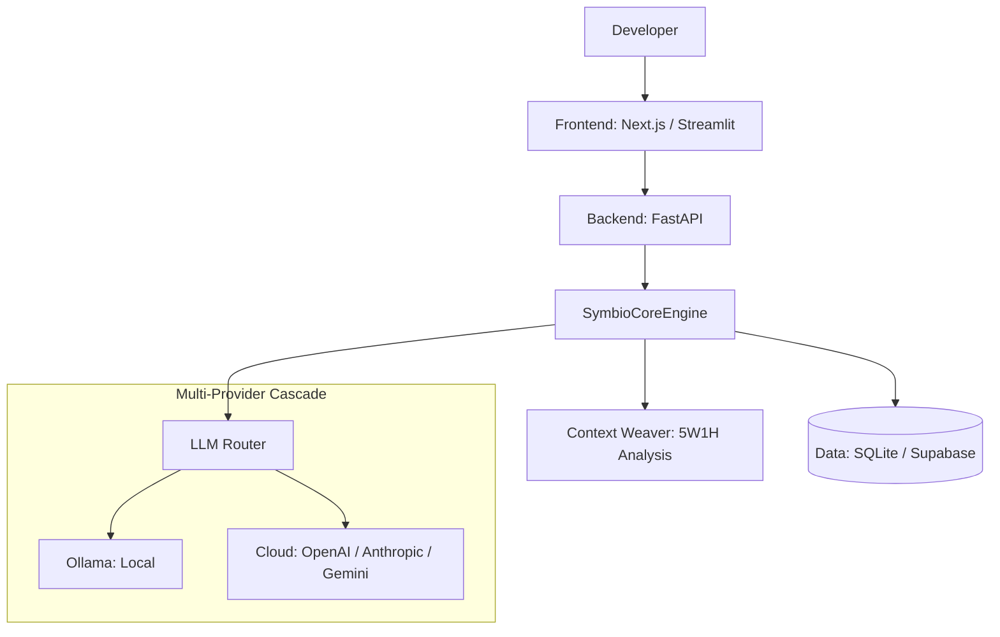
```mermaid
flowchart TD
    U[Developer] --> UI[Frontend: Next.js / Streamlit]
    UI --> API[Backend: FastAPI]
    API --> CORE[SymbioCoreEngine]
    CORE --> INTENT[Context Weaver: 5W1H Analysis]
    CORE --> ROUTER[LLM Router]
    
    subgraph AI_Layer [Multi-Provider Cascade]
        ROUTER --> OLLAMA[Ollama: Local]
        ROUTER --> CLOUD[Cloud: OpenAI / Anthropic / Gemini]
    end
    
    CORE --> DB[(Data: SQLite / Supabase)]
```
The architecture facilitates a transition from developer request to a "Tapestry" of output, involving emotional analysis and intent extraction.
Sources: [README.md:65-80](), [SymbioCoder-Plus-Release-v1.1-main/README.md:65-80]()

### ### Key Components

| Component | Description |
| :--- | :--- |
| **SymbioCoreEngine** | The central orchestrator coordinating intent analysis and provider routing. |
| **Billy Engine** | A TypeScript synthesis layer running in the browser for knowledge retrieval and LLM prompting. |
| **Context Weaver** | Extracts intent via 5W1H (Who, What, Where, When, Why, How) and generates layered expansions. |
| **Knowledge Loom** | Performs semantic retrieval across the Manifest Index using Reciprocal Rank Fusion (RRF). |
| **Neural Aurora** | A visual design system using specific color gradients (e.g., Navy Base #171B2B, Neural Green #34D399). |

Sources: [SymbioCoder-Plus-Release-v1.1-main/README.md:50-60](), [SymbioCoder-Plus-Release-v1.1-main/frontend/app/lib/BillyEngine.ts:15-25](), [SymbioCoder-Plus-Release-v1.1-main/extras/s/#L01f30c SymbioCoder Plus v1.0_ Ultimate_Project_Structure.md:7-15]()

## ## Operational Frameworks

The project utilizes specific protocols to manage human-AI interaction.

### ### The Loom Approach & Bucket Drop
The **Loom Approach** is a methodology for weaving scattered thoughts into coherent wholes without forcing linearity. Complementing this is the **Bucket Drop Protocol**, which prioritizes the immediate capture of fleeting insights in the user's exact words, deferring organization to prevent cognitive load.
Sources: [SymbioCoder-Plus-Release-v1.1-main/frontend/app/lib/BillyEngine.ts:241-255](), [SymbioCoder-Plus-Release-v1.1-main/AGENTS.md:204-206]()

### ### The AI Tribunal
A distinctive feature of the GestaltView ecosystem is the **8-Persona AI Tribunal**. This framework uses multi-agent validation (2 personas from 4 different providers) to synthesize and validate claims, ensuring credibility through independent convergence.
Sources: [SymbioCoder-Plus-Release-v1.1-main/README.md:60-64](), [SymbioCoder-Plus-Release-v1.1-main/frontend/app/lib/BillyEngine.ts:125-132]()

## ## Visual Identity: Neural Aurora
The UI philosophy is centered on the **Neural Aurora** theme, designed to be neurodivergent-friendly. It employs specific CSS variables to create a "consciousness-serving" atmosphere.

```css
:root {
  --neural-navy: #171B2B;           /* Primary Background */
  --neural-green: #34D399;          /* Success States */
  --aurora-blue: #06B6D4;           /* Interactive Elements */
  --consciousness-purple: #BC6DFF;  /* AI Responses */
  --symbiosis-pink: #F345B5;       /* Highlights */
}
```
Sources: [SymbioCoder-Plus-Release-v1.1-main/extras/s/#L01f30c SymbioCoder Plus v1.0_ Ultimate_Project_Structure.md:10-18, 172-180]()

## ## Licensing and Collaboration
SymbioCoder is released under the **SymbioCoder Collaborative License (SCL)** version 1.1. This is a non-standard license designed to protect the commercial rights of GestaltView while encouraging community-driven improvements. It permits personal, educational, and commercial use provided the software was obtained through authorized channels and attribution is maintained.
Sources: [SymbioCoder-Plus-Release-v1.1-main/LICENSE.md:1-25]()

## ## Conclusion
Project Introduction & Philosophy establishes SymbioCoder as more than a technical tool; it is a manifestation of the GestaltView mission to align AI with human cognitive patterns. By prioritizing neurodiversity, privacy, and symbiotic collaboration, the project aims to redefine the relationship between developers and their intelligence layers.

### Quick Start & Installation

<details>
<summary>Relevant source files</summary>

The following files were used as context for generating this wiki page:

- [README.md](https://github.com/faagestalt-web/SymbioCoder_v2.0/blob/main/README.md)
- [SymbioCoder-Plus-Release-v1.1-main/scripts/setup-dependencies.sh](https://github.com/faagestalt-web/SymbioCoder_v2.0/blob/main/SymbioCoder-Plus-Release-v1.1-main/scripts/setup-dependencies.sh)
- [SymbioCoder-Plus-Release-v1.1-main/backend/onboarding.py](https://github.com/faagestalt-web/SymbioCoder_v2.0/blob/main/SymbioCoder-Plus-Release-v1.1-main/backend/onboarding.py)
- [SymbioCoder-Plus-Release-v1.1-main/extras/README.md](https://github.com/faagestalt-web/SymbioCoder_v2.0/blob/main/SymbioCoder-Plus-Release-v1.1-main/extras/README.md)
- [SymbioCoder-Plus-Release-v1.1-main/extras/s/#L01f30c SymbioCoder Plus v1.0_ Ultimate_Project_Structure.md](https://github.com/faagestalt-web/SymbioCoder_v2.0/blob/main/SymbioCoder-Plus-Release-v1.1-main/extras/s/%23L01f30c%20SymbioCoder%20Plus%20v1.0_%20Ultimate_Project_Structure.md)
- [SymbioCoder-Plus-Release-v1.1-main/AGENTS.md](https://github.com/faagestalt-web/SymbioCoder_v2.0/blob/main/SymbioCoder-Plus-Release-v1.1-main/AGENTS.md)
- [SymbioCoder-Plus-Release-v1.1-main/scripts/%20README.md](https://github.com/faagestalt-web/SymbioCoder_v2.0/blob/main/SymbioCoder-Plus-Release-v1.1-main/scripts/%20README.md)
</details>

# Quick Start & Installation

SymbioCoder is a consciousness-serving AI platform designed for collaborative coding and multi-provider orchestration. The installation process is designed to be adaptive, supporting local-first privacy through Ollama while providing seamless fallbacks to cloud providers like OpenAI and Anthropic. The system follows a modular architecture that separates the FastAPI backend, Next.js frontend, and various AI adapter layers.

Sources: [README.md:1-15](), [SymbioCoder-Plus-Release-v1.1-main/extras/README.md:10-25]()

## System Requirements

Before beginning installation, ensure the environment meets the following baseline criteria:

| Component | Minimum Requirement | Recommended |
| :--- | :--- | :--- |
| **Python** | 3.10+ | 3.11+ |
| **Node.js** | 18+ | Latest LTS |
| **RAM** | 2GB | 4GB+ |
| **Storage** | 1GB free space | SSD with 5GB+ for models |
| **OS** | Linux / macOS / Windows | Linux (Ubuntu/Debian preferred) |

Sources: [SymbioCoder-Plus-Release-v1.1-main/backend/onboarding.py:32-55](), [SymbioCoder-Plus-Release-v1.1-main/extras/README.md:65-75]()

## Automated Setup & Onboarding

The recommended path for initialization is the `onboarding.py` wizard, which automates requirement checks, dependency installation, and environment configuration.

### Setup Workflow
The setup process follows a sequential flow from system verification to service readiness:

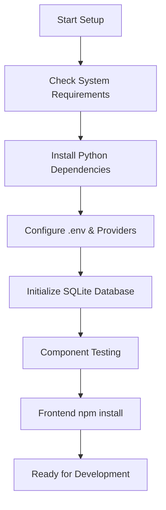
```mermaid
flowchart TD
    Start[Start Setup] --> ReqCheck[Check System Requirements]
    ReqCheck --> PyDeps[Install Python Dependencies]
    PyDeps --> EnvSetup[Configure .env & Providers]
    EnvSetup --> DBInit[Initialize SQLite Database]
    DBInit --> CompTest[Component Testing]
    CompTest --> FrontSetup[Frontend npm install]
    FrontSetup --> End[Ready for Development]
```
The onboarding wizard identifies the operating environment and applies necessary configurations, including copying environment templates and initializing the local database.

Sources: [SymbioCoder-Plus-Release-v1.1-main/backend/onboarding.py:165-190](), [SymbioCoder-Plus-Release-v1.1-main/extras/README.md:85-95]()

### Automated Commands
To execute the automated setup, use the following commands based on your operating system:

**Linux / macOS:**
```bash
# 1. Install system dependencies
bash scripts/setup-dependencies.sh

# 2. Run the onboarding wizard
python backend/onboarding.py setup --mode=beginner
```

**Windows:**
```cmd
# 1. Install dependencies
scripts\setup-dependencies.bat

# 2. Run the onboarding wizard
python backend/onboarding.py setup --mode=beginner
```

Sources: [README.md:95-105](), [SymbioCoder-Plus-Release-v1.1-main/scripts/setup-dependencies.sh:5-15]()

## Dependency Management

SymbioCoder requires both system-level and language-specific libraries to handle AI processing, computer vision (OpenCV), and real-time communication.

### Python Dependencies
The backend relies on several core packages for AI orchestration:
- **FastAPI/Uvicorn**: Core API server and asynchronous handling.
- **SQLAlchemy**: Database ORM for SQLite/Postgres.
- **Transformers/Diffusers**: Local model inference.
- **OpenAI/Anthropic**: Cloud provider integration.
- **OpenCV**: Image and video processing.

Sources: [SymbioCoder-Plus-Release-v1.1-main/scripts/setup-dependencies.sh:84-105]()

### Local AI Support (Ollama)
The installation script optionally installs Ollama for local-first AI capabilities.
```bash
# Installing Ollama via script
curl -fsSL https://ollama.ai/install.sh | sh
ollama pull llama2
```
Sources: [SymbioCoder-Plus-Release-v1.1-main/scripts/setup-dependencies.sh:108-115]()

## Environment Configuration

Configuration is managed via a `.env` file and a `providers.json` manifest. These files define AI routing priorities and API access.

### .env Variables
| Variable | Purpose | Default/Example |
| :--- | :--- | :--- |
| `SYM_LLM_PRIORITY` | Ranking of AI providers | `ollama,openai,hf,local_stub` |
| `SYM_DEFAULT_STT` | Speech-to-text engine | `whisper_local` |
| `DATABASE_URL` | Database connection string | `sqlite:///./symbiocoder.db` |
| `SYM_STORAGE` | Path for uploads and data | `./storage` |

Sources: [SymbioCoder-Plus-Release-v1.1-main/extras/README.md:120-140](), [SymbioCoder-Plus-Release-v1.1-main/scripts/setup-dependencies.sh:130-150]()

## Running the Application

SymbioCoder requires both a backend server and a frontend interface to be running concurrently.

### Service Orchestration
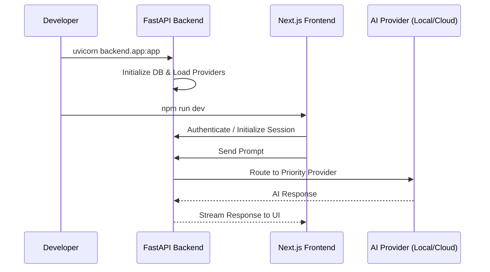
```mermaid
sequenceDiagram
    participant Dev as Developer
    participant BE as FastAPI Backend
    participant FE as Next.js Frontend
    participant AI as AI Provider (Local/Cloud)

    Dev->>BE: uvicorn backend.app:app
    BE->>BE: Initialize DB & Load Providers
    Dev->>FE: npm run dev
    FE->>BE: Authenticate / Initialize Session
    FE->>BE: Send Prompt
    BE->>AI: Route to Priority Provider
    AI-->>BE: AI Response
    BE-->>FE: Stream Response to UI
```

### Manual Execution Commands
| Task | Command | Directory |
| :--- | :--- | :--- |
| **Start Backend** | `uvicorn backend.app:app --reload --port 8000` | `/backend` |
| **Start Frontend** | `npm run dev` | `/frontend/app` |
| **API Docs** | Access `http://localhost:8000/docs` | N/A |
| **Docker Start** | `docker-compose up -d` | `/dockers` |

Sources: [README.md:107-120](), [SymbioCoder-Plus-Release-v1.1-main/scripts/%20README.md:5-20]()

## Troubleshooting

The repository includes a `troubleshoot.sh` script to diagnose common installation failures such as missing Python modules or port conflicts.

### Common Health Checks
- **Database**: Run `python backend/onboarding.py initialize_database` to reset.
- **API Connectivity**: Use `npm run health-check` to verify provider status.
- **Port Availability**: Ensure ports 3000 (Frontend) and 8000 (Backend) are free.

Sources: [SymbioCoder-Plus-Release-v1.1-main/scripts/%20README.md:10-25](), [SymbioCoder-Plus-Release-v1.1-main/backend/onboarding.py:118-130]()

## Summary
The Quick Start process for SymbioCoder transitions from a system-wide dependency check (via `setup-dependencies.sh`) to a project-specific configuration (via `onboarding.py`). This ensures the "Consciousness-Serving" architecture is properly grounded with a local database and a resilient AI routing layer before the developer begins the collaborative coding experience.

### SymbioCoder Collaborative License (SCL)

<details>
<summary>Relevant source files</summary>

The following files were used as context for generating this wiki page:

- [SymbioCoder-Plus-Release-v1.1-main/LICENSE.md](https://github.com/faagestalt-web/SymbioCoder_v2.0/blob/main/SymbioCoder-Plus-Release-v1.1-main/LICENSE.md)
- [SymbioCoder-Plus-Release-v1.1-main/license/SLC-License.md](https://github.com/faagestalt-web/SymbioCoder_v2.0/blob/main/SymbioCoder-Plus-Release-v1.1-main/license/SLC-License.md)
- [SymbioCoder-Plus-Release-v1.1-main/README.md](https://github.com/faagestalt-web/SymbioCoder_v2.0/blob/main/SymbioCoder-Plus-Release-v1.1-main/README.md)
- [SymbioCoder-Plus-Release-v1.1-main/release/release_manifest.json](https://github.com/faagestalt-web/SymbioCoder_v2.0/blob/main/SymbioCoder-Plus-Release-v1.1-main/release/release_manifest.json)
- [SymbioCoder-Plus-Release-v1.1-main/AGENTS.md](https://github.com/faagestalt-web/SymbioCoder_v2.0/blob/main/SymbioCoder-Plus-Release-v1.1-main/AGENTS.md)
</details>

# SymbioCoder Collaborative License (SCL)

## Introduction
The SymbioCoder Collaborative License (SCL), specifically version 1.1, is a proprietary legal framework designed by GestaltView to protect commercial rights while facilitating community-driven development. Unlike standard open-source licenses, the SCL functions as both a "shield and a bridge," ensuring the protection of the founder's intellectual property while encouraging collaboration, creativity, and shared improvements within a controlled ecosystem.
Sources: [LICENSE.md:1-10](), [README.md:180-185]()

The SCL applies to the entire SymbioCoder codebase, documentation, and assets. It mandates that users obtain the software through authorized purchase channels to gain rights for personal, educational, or commercial use. It explicitly restricts the creation of standalone competing products and requires the retention of original attribution and copyright notices in all derivatives.
Sources: [LICENSE.md:12-30](), [AGENTS.md:180-185]()

## License Structure and Definitions
The SCL identifies four primary entities and components involved in the legal agreement.

| Term | Definition |
|:---|:---|
| **Software** | The SymbioCoder codebase, documentation, scripts, and assets. |
| **Licensee** | An individual or organization that lawfully purchased the software from an Authorized Channel. |
| **Authorized Channel** | Official distribution points controlled by GestaltView (e.g., Gumroad). |
| **Derivative Works** | Modifications, forks, or extensions based on the Software. |

Sources: [LICENSE.md:35-45]()

## Grant of Rights and Restrictions
Licensees are granted specific permissions provided they maintain compliance with the SCL terms. This includes the right to use, reproduce, and modify the software globally and perpetually.

### Permitted Actions
*   Integration of the software into larger commercial offerings, provided SymbioCoder is not the primary marketed value.
*   Distribution of modified versions to other Licensees or collaborators.
*   Sharing community forks for non-commercial or educational contexts.

Sources: [LICENSE.md:50-60](), [LICENSE.md:75-80]()

### Prohibited Actions
*   **Standalone Resale**: Repackaging SymbioCoder as a standalone competing product.
*   **Removal of Notices**: Deleting copyright notices, attribution, or license files.
*   **Trademark Infringement**: Using "SymbioCoder" or "GestaltView" brands to imply official endorsement without consent.
*   **Proprietary Exclusion**: Accessing specific GestaltView integrations, patents, or proprietary modules unless separately licensed.

Sources: [LICENSE.md:65-75](), [AGENTS.md:180-185]()

## Collaboration and Shared-Improvement Clause
A unique aspect of the SCL is its reciprocity requirement. While major improvements are encouraged, they are governed by a shared-improvement clause.

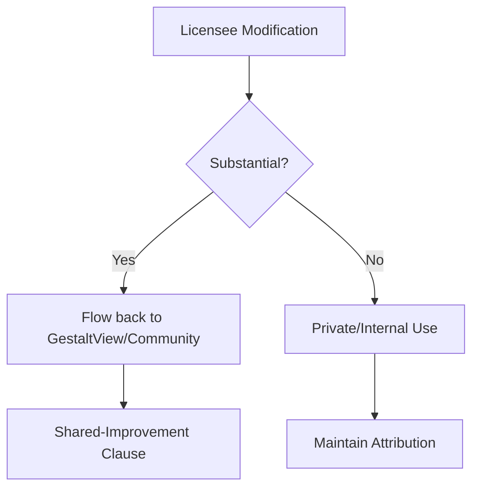
```mermaid
flowchart TD
    A[Licensee Modification] --> B{Substantial?}
    B -- Yes --> C[Flow back to GestaltView/Community]
    B -- No --> D[Private/Internal Use]
    C --> E[Shared-Improvement Clause]
    D --> F[Maintain Attribution]
```
The diagram shows the logic for contributing modifications back to the core project based on the scale of the change.
Sources: [LICENSE.md:15-25](), [LICENSE.md:75-85]()

## Technical Implementation and Verification
The project includes automated utilities to manage and verify SLC licenses (SymbioCoder License Certificates).

### Verification Logic
Verification is performed via HMAC-SHA256 signatures to ensure proof of purchase and allow for feature unlocking within the software. The verification process relies on a server-side secret to validate the authenticity of a License ID.

### License Data Model
The SLC-License is structured as a JSON-compatible object containing purchase metadata.

| Field | Description |
|:---|:---|
| **License ID** | Unique UUID identifying the purchase. |
| **Buyer** | Name of the authorized purchaser. |
| **Purchase Date** | UTC timestamp of the transaction. |
| **Signature** | HMAC-SHA256 hash for automated verification. |

Sources: [license/SLC-License.md:1-15](), [release/release_manifest.json:150-160]()

### Feature Unlocks
Successful verification of an SCL license unlocks several priority services and technical tiers:
*   Priority email support (30 days).
*   Access to closed alpha/beta channels.
*   Activation of "pro" feature flags within the SymbioCoder interface.

Sources: [license/SLC-License.md:10-15]()

## Governing Law and Termination
The license terminates automatically upon any breach of terms by the Licensee. Legally, the agreement is governed by the laws of New York, NY, USA, where GestaltView is incorporated. 
Sources: [LICENSE.md:90-100]()

## Conclusion
The SymbioCoder Collaborative License (SCL) represents a hybrid approach to software distribution, balancing the openness of a collaborative community with the protections required for a solo-founded commercial platform. By mandating authorized purchase and defining clear boundaries for derivative works, it ensures the sustainability of the GestaltView ecosystem while empowering developers to build consciousness-serving AI tools.
Sources: [LICENSE.md:30-35](), [README.md:185-195]()


## System Architecture

### High-Level System Architecture

<details>
<summary>Relevant source files</summary>

The following files were used as context for generating this wiki page:

- [README.md](https://github.com/faagestalt-web/SymbioCoder_v2.0/blob/main/README.md)
- [SymbioCoder-Plus-Release-v1.1-main/extras/s/#L01f30c SymbioCoder Plus v1.0\_ Ultimate\_Project\_Structure.md](https://github.com/faagestalt-web/SymbioCoder_v2.0/blob/main/SymbioCoder-Plus-Release-v1.1-main/extras/s/%23L01f30c%20SymbioCoder%20Plus%20v1.0_%20Ultimate_Project_Structure.md)
- [SymbioCoder-Plus-Release-v1.1-main/AGENTS.md](https://github.com/faagestalt-web/SymbioCoder_v2.0/blob/main/SymbioCoder-Plus-Release-v1.1-main/AGENTS.md)
- [SymbioCoder-Plus-Release-v1.1-main/frontend/app/lib/BillyEngine.ts](https://github.com/faagestalt-web/SymbioCoder_v2.0/blob/main/SymbioCoder-Plus-Release-v1.1-main/frontend/app/lib/BillyEngine.ts)
- [SymbioCoder-Plus-Release-v1.1-main/extras/README.md](https://github.com/faagestalt-web/SymbioCoder_v2.0/blob/main/SymbioCoder-Plus-Release-v1.1-main/extras/README.md)
- [SymbioCoder-Plus-Release-v1.1-main/release/release_manifest.json](https://github.com/faagestalt-web/SymbioCoder_v2.0/blob/main/SymbioCoder-Plus-Release-v1.1-main/release/release_manifest.json)
</details>

# High-Level System Architecture

## Introduction

SymbioCoder is a "consciousness-serving" AI platform designed for collaborative coding, adaptive workflows, and multi-provider orchestration. The system architecture is built on a "symbiotic" relationship between human intuition and AI technical capability, emphasizing privacy-first local processing and ethical AI principles. It integrates several high-level concepts from the GestaltView ecosystem, such as the Personal Language Key (PLK) and the Tribunal Framework, to provide a personalized and resilient development environment.
Sources: [README.md:12-25](), [extras/README.md:10-18]()

The project utilizes a modern full-stack architecture consisting of a FastAPI backend for core logic and orchestration, and a dual-frontend approach featuring both Next.js and Streamlit. This modular design supports a variety of deployment scenarios, from local Docker-based setups to cloud-hosted Vercel environments.
Sources: [README.md:73-82](), [AGENTS.md:19-24]()

## Core System Components

### Architectural Layers
The SymbioCoder system is divided into four primary logical layers that manage the flow of data from user input to AI processing and persistence.

| Layer | Responsibility | Key Technologies |
| :--- | :--- | :--- |
| **Frontend** | User Interface, Chat Workflows, and real-time interactions. | Next.js, React, TypeScript, Tailwind CSS, Streamlit. |
| **Backend** | API orchestration, session management, and core logic. | FastAPI, Python. |
| **AI Provider Layer** | Multi-provider routing and fallback logic (Local & Cloud). | Ollama, OpenAI, Anthropic, Gemini, Hugging Face. |
| **Data Layer** | Local-first persistence and history. | SQLite, Postgres, Supabase. |
Sources: [README.md:83-91](), [AGENTS.md:19-24]()

### Component Relationship Diagram
The following diagram illustrates the interaction between the user interfaces, the core backend engine, and the external AI providers.

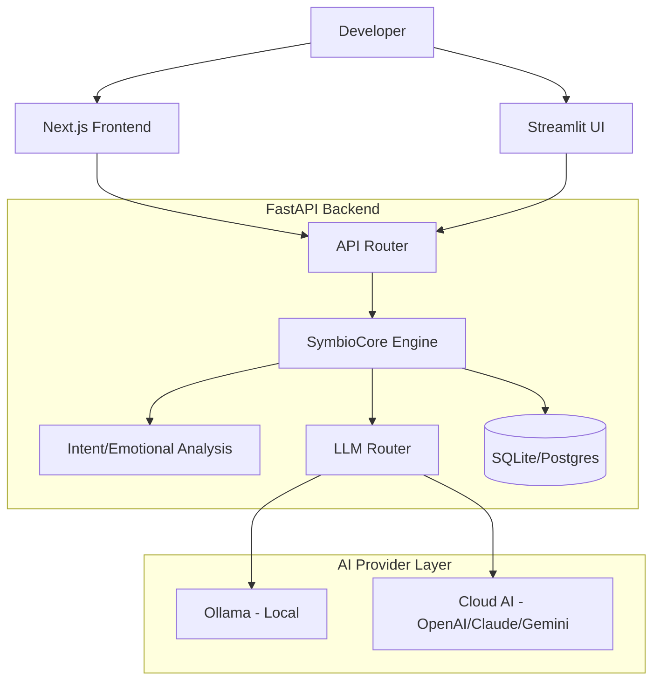
```mermaid
flowchart TD
    U[Developer] --> UI_N[Next.js Frontend]
    U --> UI_S[Streamlit UI]
    
    subgraph Core_Backend [FastAPI Backend]
        API[API Router] --> CORE[SymbioCore Engine]
        CORE --> EMO[Intent/Emotional Analysis]
        CORE --> ROUTER[LLM Router]
        CORE --> DB[(SQLite/Postgres)]
    end

    UI_N --> API
    UI_S --> API

    subgraph AI_Providers [AI Provider Layer]
        ROUTER --> OLLAMA[Ollama - Local]
        ROUTER --> CLOUD[Cloud AI - OpenAI/Claude/Gemini]
    end
```
Sources: [README.md:73-82](), [extras/README.md:155-168]()

## AI Orchestration & Logic

### LLM Router & Fallback System
A critical feature of the SymbioCoder architecture is the **LLM Router**. It implements a tiered fallback hierarchy to ensure high availability and privacy. The default priority typically starts with local models (Ollama) before cascading to cloud providers like OpenAI or Anthropic. This configuration is managed through the `SYM_LLM_PRIORITY` environment variable and `providers.json`.
Sources: [README.md:108-115](), [extras/README.md:30-36]()

### Billy Synthesis Engine
The `BillyEngine` serves as the consciousness-serving intelligence layer, running logic in the browser to coordinate knowledge synthesis. It consists of three primary sub-systems:
*   **ManifestIndex**: A static knowledge graph of truth claims and protocols.
*   **ContextWeaver**: A query parsing engine that extracts intent and applies the "5W1H" (Who, What, Where, When, Why, How) framework.
*   **KnowledgeLoom**: A semantic retrieval system using Reciprocal Rank Fusion (RRF) to search the Manifest.
Sources: [frontend/app/lib/BillyEngine.ts:1-18]()

### Intent Processing Flow
The system processes user queries through a structured "Weave Plan" before reaching an AI model.

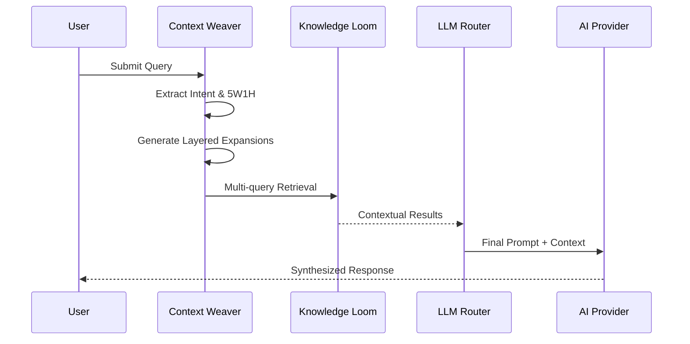
```mermaid
sequenceDiagram
    participant U as User
    participant CW as Context Weaver
    participant KL as Knowledge Loom
    participant ROUTER as LLM Router
    participant AI as AI Provider

    U->>CW: Submit Query
    CW->>CW: Extract Intent & 5W1H
    CW->>CW: Generate Layered Expansions
    CW->>KL: Multi-query Retrieval
    KL-->>ROUTER: Contextual Results
    ROUTER->>AI: Final Prompt + Context
    AI-->>U: Synthesized Response
```
Sources: [frontend/app/lib/BillyEngine.ts:241-268](), [frontend/app/lib/BillyEngine.ts:327-340]()

## Project Structure & Data Management

### Folder Organization
The repository is organized into distinct directories for the frontend, backend, and integration adapters (GestaltView).

*   `backend/`: FastAPI application, provider routing, and DB utilities.
*   `frontend/app/`: Next.js application, components, and route handlers.
*   `integrations/` (or `GestaltView/`): Shared AI adapters (OpenAI, Anthropic, etc.).
*   `scripts/`: Automation for setup, health checks, and deployment.
Sources: [README.md:95-104](), [SymbioCoder-Plus-Release-v1.1-main/extras/s/#L01f30c SymbioCoder Plus v1.0_ Ultimate_Project_Structure.md:15-135]()

### Data Persistence
SymbioCoder is "local-first," using **SQLite** for session persistence and profile storage by default. It also supports an upgrade path to **PostgreSQL** or **Supabase** for production deployments and vector storage.
Sources: [README.md:83-91](), [AGENTS.md:23-24]()

## Security and Environment Configuration

The system uses JSON Web Tokens (JWT) for session management and authentication. Configuration is handled through a tiered priority system defined in environment variables.

| Variable | Purpose | Default / Example |
| :--- | :--- | :--- |
| `SYM_LLM_PRIORITY` | Defines the fallback order for AI providers. | `ollama,openai,hf,local_stub` |
| `SYM_DEFAULT_STT` | Default Speech-to-Text provider. | `whisper_local` |
| `DATABASE_URL` | Connection string for the database. | `sqlite:///./symbiocoder.db` |
| `SECRET_KEY` | Key for JWT and session security. | (Change in production) |
Sources: [extras/README.md:120-136]()

## Summary
SymbioCoder v2.0 implements a modular, resilient architecture that prioritizes human-AI symbiosis. By decoupling the UI from the AI provider layer via a specialized FastAPI backend and utilizing a tiered fallback router, the system ensures that development workflows remain active even during provider outages. The inclusion of the "Billy Engine" and "Tribunal Framework" provides a unique synthesis layer that differentiates the platform from standard AI coding assistants.
Sources: [README.md:135-144](), [extras/README.md:315-325]()

### SymbioCore Orchestration Engine

<details>
<summary>Relevant source files</summary>

The following files were used as context for generating this wiki page:

- [SymbioCoder-Plus-Release-v1.1-main/backend/symbio\_core\_engine.py](https://github.com/faagestalt-web/SymbioCoder_v2.0/blob/main/SymbioCoder-Plus-Release-v1.1-main/backend/symbio_core_engine.py)
- [SymbioCoder-Plus-Release-v1.1-main/frontend/app/lib/BillyEngine.ts](https://github.com/faagestalt-web/SymbioCoder_v2.0/blob/main/SymbioCoder-Plus-Release-v1.1-main/frontend/app/lib/BillyEngine.ts)
- [SymbioCoder-Plus-Release-v1.1-main/README.md](https://github.com/faagestalt-web/SymbioCoder_v2.0/blob/main/README.md)
- [SymbioCoder-Plus-Release-v1.1-main/extras/README.md](https://github.com/faagestalt-web/SymbioCoder_v2.0/blob/main/extras/README.md)
- [SymbioCoder-Plus-Release-v1.1-main/frontend/app/lib/billyConstants.ts](https://github.com/faagestalt-web/SymbioCoder_v2.0/blob/main/frontend/app/lib/billyConstants.ts)
- [SymbioCoder-Plus-Release-v1.1-main/AGENTS.md](https://github.com/faagestalt-web/SymbioCoder_v2.0/blob/main/AGENTS.md)
</details>

# SymbioCore Orchestration Engine

The **SymbioCore Orchestration Engine** (also referred to as `SymbioCoreEngine`) serves as the central nervous system of the SymbioCoder platform. It is designed to coordinate intent analysis, multi-provider AI routing, and the generation of "tapestries"—multimodal outputs encompassing code, visual representations, and emotional resonance. The engine embodies the "consciousness-serving" philosophy, aiming to amplify human creativity by adapting to the user's emotional state, creative flow, and unique cognitive patterns.

Sources: [README.md:37-41](), [backend/symbio\_core\_engine.py:1-12]()

## Architecture and Core Components

The engine is built on a modular architecture that separates concerns between emotional analysis, code generation, visual synthesis, and data persistence. It facilitates a "symbiotic" relationship between the developer and AI through a pipeline that processes text, voice, and contextual signals.

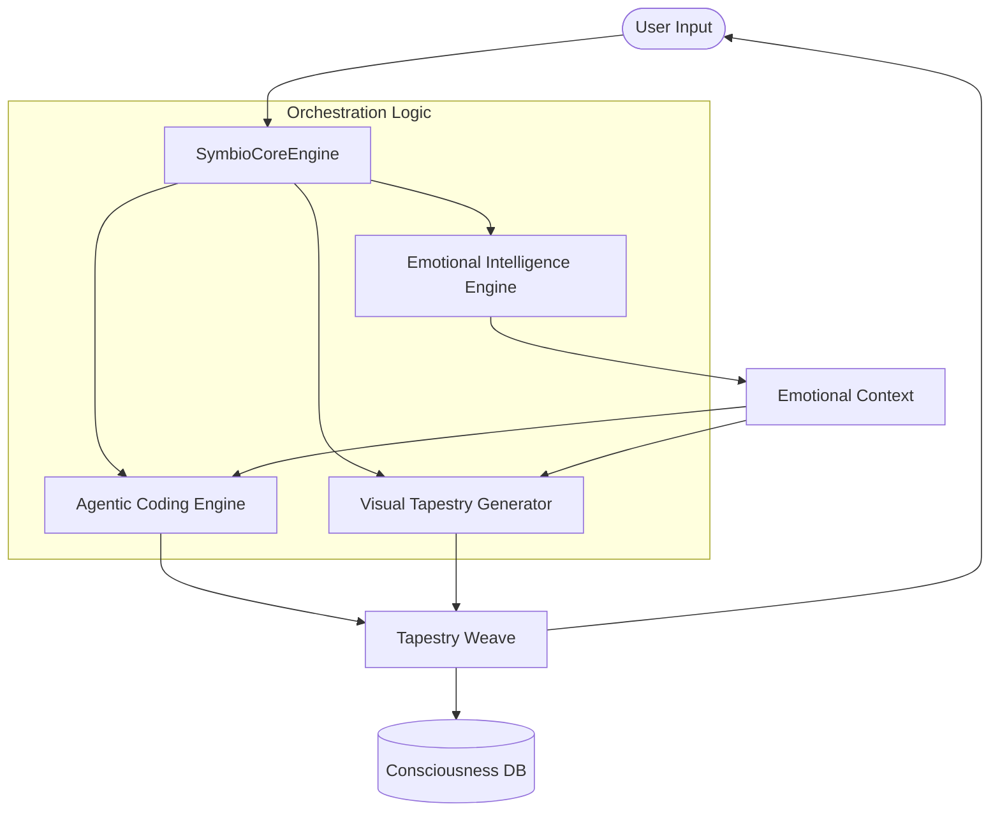
```mermaid
flowchart TD
    User([User Input]) --> Core[SymbioCoreEngine]
    subgraph Engine_Internal [Orchestration Logic]
        Core --> EMO[Emotional Intelligence Engine]
        Core --> AGE[Agentic Coding Engine]
        Core --> VIS[Visual Tapestry Generator]
    end
    EMO --> Context[Emotional Context]
    Context --> AGE
    Context --> VIS
    AGE --> Tapestry[Tapestry Weave]
    VIS --> Tapestry
    Tapestry --> DB[(Consciousness DB)]
    Tapestry --> User
```
The diagram above illustrates the high-level data flow within the SymbioCoreEngine, showing how user input is transformed into a multimodal "Tapestry Weave" through specialized sub-engines.

Sources: [backend/symbio\_core\_engine.py:348-406](), [README.md:49-60]()

### Key Engine Components

| Component | Description | Key Classes/Logic |
| :--- | :--- | :--- |
| **Emotional Intelligence** | Analyzes multimodal inputs (text/voice) to detect mood, energy levels, and creative flow states. | `EmotionalIntelligenceEngine` |
| **Agentic Coding** | Generates "conscious code" that prioritizes human understanding and adapts to the user's current mental state. | `AgenticCodingEngine` |
| **Visual Tapestry** | Creates visual representations (Stable Diffusion or ASCII) of the generated code and its underlying architecture. | `VisualTapestryGenerator` |
| **Context Weaver** | Extracts intent and expands queries using the 5W1H (Who, What, Where, When, Why, How) framework. | `buildWeavePlan` |
| **Persistence Layer** | Records "consciousness evolution" by saving every intent and its resulting weave to a SQLite database. | `ConsciousnessTapestryDB` |

Sources: [backend/symbio\_core\_engine.py:58-65](), [backend/symbio\_core\_engine.py:126-130](), [backend/symbio\_core\_engine.py:180-185](), [frontend/app/lib/BillyEngine.ts:378-400]()

## Multimodal Input Processing

The engine processes a data structure known as `ConsciousnessIntent`. This multimodal input combines raw text with binary voice audio and image data. Voice input is transcribed using local models (Whisper) to ensure privacy before being merged with text for intent analysis.

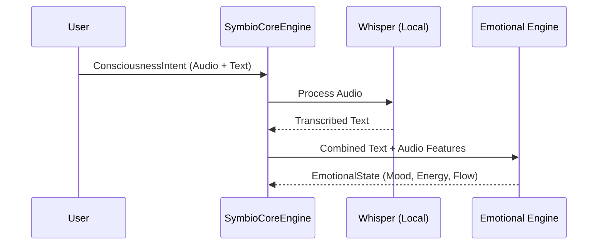
```mermaid
sequenceDiagram
    participant U as User
    participant S as SymbioCoreEngine
    participant W as Whisper (Local)
    participant E as Emotional Engine
    U->>S: ConsciousnessIntent (Audio + Text)
    S->>W: Process Audio
    W-->>S: Transcribed Text
    S->>E: Combined Text + Audio Features
    E-->>S: EmotionalState (Mood, Energy, Flow)
```
Sources: [backend/symbio\_core\_engine.py:32-41](), [backend/symbio\_core\_engine.py:365-385]()

### Emotional State Detection
The `EmotionalIntelligenceEngine` utilizes HuggingFace transformers for sentiment analysis to categorize user states into specific moods such as "inspired", "frustrated", or "contemplative". It also identifies "creativity flow" indicators:
*   **Exploring**: Keywords like "what if", "wondering".
*   **Building**: Keywords like "implement", "create".
*   **Refining**: Keywords like "optimize", "fix".
*   **Stuck**: Keywords like "help", "not working".

Sources: [backend/symbio\_core\_engine.py:84-118]()

## AI Provider Orchestration and Fallback

A critical feature of the orchestration engine is its "Provider Resilience." The system maintains a tiered hierarchy for LLM requests, preferring local-first execution via Ollama and falling back to various cloud providers if local models are unavailable.

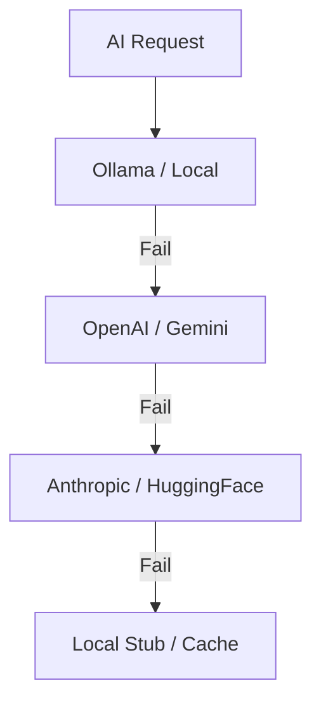
```mermaid
flowchart TD
    Request[AI Request] --> Tier1[Ollama / Local]
    Tier1 -- Fail --> Tier2[OpenAI / Gemini]
    Tier2 -- Fail --> Tier3[Anthropic / HuggingFace]
    Tier3 -- Fail --> Fallback[Local Stub / Cache]
```

### Provider Priority Configuration
The engine reads from `providers.json` and environment variables to manage this cascade. The default priority is typically set as: `ollama, openai, hf, local_stub`.

| Variable | Usage |
| :--- | :--- |
| `SYM_LLM_PRIORITY` | Defines the sequence of provider attempts. |
| `SYM_DEFAULT_STT` | Configures the speech-to-text provider (default: `whisper_local`). |
| `SYM_STORAGE` | Path for local persistence of generated assets. |

Sources: [extras/README.md:126-139](), [README.md:104-110](), [AGENTS.md:167-175]()

## Consciousness Synthesis and "Billy"

Within the orchestration ecosystem, the **BillyEngine** (implemented in TypeScript) acts as a browser-side orchestration layer. It manages the **Knowledge Loom**, which performs semantic retrieval across the "Manifest Index"—a static knowledge graph of the project's truth claims and operational moats.

### Weave Plan and 5W1H
Before an LLM is contacted, the engine generates a `WeavePlan`. This includes:
1.  **Intent Classification**: (build, debug, compare, summarize, plan, learn).
2.  **5W1H Extraction**: Parsing "Who", "What", etc.
3.  **Layered Expansions**: Generating four specific lines of inquiry:
    *   **Iteration**: Evolution of the concept.
    *   **Emergence**: Patterns arising.
    *   **Significance**: System-level importance.
    *   **Ripples**: Future unlocks.

Sources: [frontend/app/lib/BillyEngine.ts:37-60](), [frontend/app/lib/BillyEngine.ts:378-410](), [frontend/app/lib/billyConstants.ts:50-55]()

## Data Model: The Tapestry

The final output of an orchestration cycle is the `TapestryWeave`. This object encapsulates the result of the human-AI symbiosis.

```python
@dataclass
class TapestryWeave:
    code_poetry: str = ""           # Generated adaptation-aware code
    visual_masterpiece: str = ""    # Path to generated visual architecture
    emotional_resonance: Dict = ...  # Metadata about detected user state
    consciousness_metadata: Dict = ... # Symbiosis quality metrics
    creation_timestamp: datetime = ...
```
Sources: [backend/symbio\_core\_engine.py:44-51]()

The `ConsciousnessTapestryDB` persists these weaves in a SQLite database with the following schema:
*   `user_id`: Unique identifier for the developer.
*   `intent_text`: The original request.
*   `emotional_context`: JSON string of the analyzed mental state.
*   `generated_code`: The resulting implementation.
*   `visual_path`: Link to the generated image or ASCII structure.

Sources: [backend/symbio\_core\_engine.py:246-261]()

## Conclusion

The SymbioCore Orchestration Engine transitions AI from a simple utility to a "symbiote" by integrating emotional awareness directly into the software development lifecycle. By combining multimodal input processing, multi-provider resilience, and semantic knowledge retrieval via the Knowledge Loom, it ensures that AI assistance is contextually relevant, ethically aligned, and technically robust. This engine serves as the foundational infrastructure for all GestaltView-derived products, providing a standardized way to weave human intent into technical reality.

Sources: [README.md:168-175](), [backend/symbio\_core\_engine.py:350-360]()

### Billy Engine & Resonance Loop

<details>
<summary>Relevant source files</summary>

The following files were used as context for generating this wiki page:

- [SymbioCoder-Plus-Release-v1.1-main/frontend/app/lib/BillyEngine.ts](https://github.com/faagestalt-web/SymbioCoder_v2.0/blob/main/SymbioCoder-Plus-Release-v1.1-main/frontend/app/lib/BillyEngine.ts)
- [SymbioCoder-Plus-Release-v1.1-main/frontend/app/lib/billyConstants.ts](https://github.com/faagestalt-web/SymbioCoder_v2.0/blob/main/SymbioCoder-Plus-Release-v1.1-main/frontend/app/lib/billyConstants.ts)
- [SymbioCoder-Plus-Release-v1.1-main/frontend/app/components/BillyLive.tsx](https://github.com/faagestalt-web/SymbioCoder_v2.0/blob/main/SymbioCoder-Plus-Release-v1.1-main/frontend/app/components/BillyLive.tsx)
- [SymbioCoder-Plus-Release-v1.1-main/frontend/app/components/BillyPanel.tsx](https://github.com/faagestalt-web/SymbioCoder_v2.0/blob/main/SymbioCoder-Plus-Release-v1.1-main/frontend/app/components/BillyPanel.tsx)
- [SymbioCoder-Plus-Release-v1.1-main/AGENTS.md](https://github.com/faagestalt-web/SymbioCoder_v2.0/blob/main/SymbioCoder-Plus-Release-v1.1-main/AGENTS.md)
</details>

# Billy Engine & Resonance Loop

The Billy Engine serves as the consciousness-serving intelligence layer of the GestaltView ecosystem, functioning as a high-fidelity synthesis engine rather than a traditional chatbot. It is architected to run entirely in the browser, orchestrating knowledge retrieval, intent parsing, and multi-model LLM cascades to maintain "resonance" with the user's cognitive state and language.

The engine integrates several proprietary protocols: the **Manifest Index** (a static knowledge graph), the **Context Weaver** (intent and 5W1H extraction), and the **Knowledge Loom** (semantic retrieval via Reciprocal Rank Fusion). Together, these components create a resonance loop that preserves user intent, avoids paraphrasing, and ensures narrative continuity across interactions.

Sources: [BillyEngine.ts:1-20](), [BillyLive.tsx:11-30](), [AGENTS.md:120-135]()

## Core Architecture & Components

The Billy Engine is built on a modular TypeScript architecture that handles the lifecycle of a user query from initial "weaving" to final LLM synthesis.

### Architectural Flow

The following diagram illustrates how the Billy Engine processes a request through its internal subsystems to maintain contextual resonance.

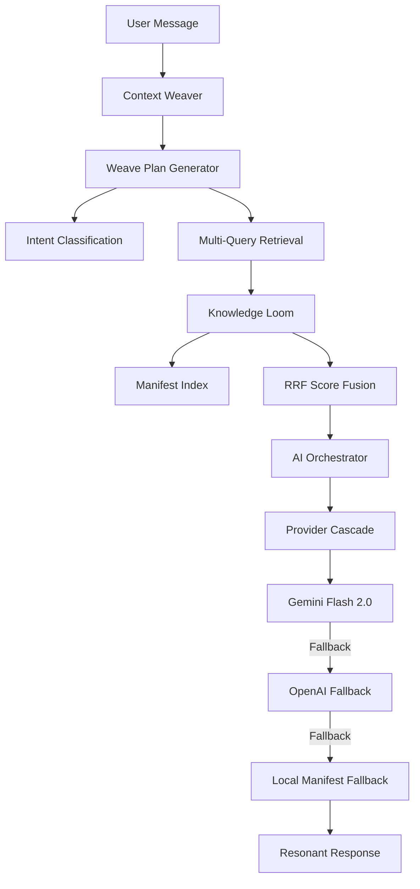
```mermaid
flowchart TD
    UserQuery[User Message] --> Weaver[Context Weaver]
    Weaver --> WeavePlan[Weave Plan Generator]
    WeavePlan --> Intent[Intent Classification]
    WeavePlan --> Retrieval[Multi-Query Retrieval]
    
    Retrieval --> Loom[Knowledge Loom]
    Loom --> Manifest[Manifest Index]
    Loom --> RRF[RRF Score Fusion]
    
    RRF --> Orchestrator[AI Orchestrator]
    Orchestrator --> Cascade[Provider Cascade]
    
    Cascade --> Gemini[Gemini Flash 2.0]
    Gemini -- Fallback --> OpenAI[OpenAI Fallback]
    OpenAI -- Fallback --> Local[Local Manifest Fallback]
    
    Local --> FinalResponse[Resonant Response]
```
The engine prioritizes local knowledge and tiered API calls to ensure high availability and performance.
Sources: [BillyEngine.ts:12-25](), [BillyLive.tsx:430-450]()

### Subsystem Definitions

| Component | Responsibility | Technical Basis |
| :--- | :--- | :--- |
| **Manifest Index** | Static knowledge graph of truth claims, moats, and products. | `ManifestNode[]` constant |
| **Context Weaver** | Extracts intent and 5W1H (Who, What, Where, When, Why, How). | `buildWeavePlan()` |
| **Knowledge Loom** | Performs semantic search across the Manifest using BM25 and RRF. | `queryLoom()` |
| **AI Orchestrator** | Manages the provider cascade and system prompt construction. | `billyCall()` |

Sources: [BillyEngine.ts:40-100](), [BillyLive.tsx:35-60]()

## Context Weaver & WeavePlan

The Context Weaver is responsible for query parsing before any LLM is contacted. It generates a `WeavePlan` which includes layered expansions: Iteration, Emergence, Significance, and Ripples. This ensures that "context walks forward, never backward."

### Intent Classification
The engine classifies queries into specific intents to tailor the expansion strategy:
*   **Build**: Focuses on architectural patterns and evolution.
*   **Debug**: Focuses on failure modes and underlying architecture.
*   **Compare**: Focuses on tradeoffs and value signaling.
*   **Learn**: Focuses on conceptual patterns and significance.

### Data Structure: WeavePlan
```typescript
export interface WeavePlan {
  raw_query: string;
  intent: Intent;
  five_w1h: FiveW1H;
  expansions: {
    iteration: string;    // Evolution history
    emergence: string;    // Emerging patterns
    significance: string; // Systems-level importance
    ripples: string;      // Future unlocks
  };
  retrieval_queries: string[];
}
```
Sources: [BillyEngine.ts:45-70](), [BillyEngine.ts:310-350]()

## Knowledge Loom & RRF Retrieval

The Knowledge Loom uses Reciprocal Rank Fusion (RRF) to combine results from multiple retrieval queries generated by the WeavePlan. It scores nodes from the `MANIFEST` based on keyword relevance and semantic density.

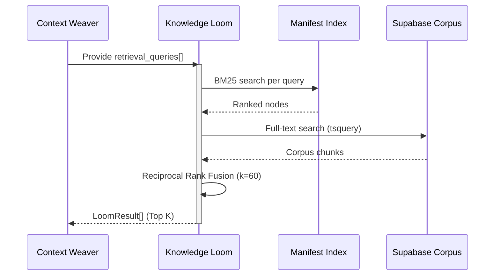
```mermaid
sequenceDiagram
    participant W as Context Weaver
    participant L as Knowledge Loom
    participant M as Manifest Index
    participant S as Supabase Corpus
    
    W->>L: Provide retrieval_queries[]
    activate L
    L->>M: BM25 search per query
    M-->>L: Ranked nodes
    L->>S: Full-text search (tsquery)
    S-->>L: Corpus chunks
    L->>L: Reciprocal Rank Fusion (k=60)
    L-->>W: LoomResult[] (Top K)
    deactivate L
```
The loop ensures that the most relevant "truth claims" and "operational moats" are injected into the LLM context.
Sources: [BillyEngine.ts:430-470](), [BillyEngine.ts:600-640]()

## AI Provider Cascade

The Resonance Loop concludes with a tiered provider cascade. The engine is hardcoded to prioritize **Gemini Flash 2.0** (Google) as the primary intelligence layer, specifically for its speed and context handling.

### Cascade Tiers
1.  **Tier 1: Gemini Flash 2.0** - Primary (Billy runs on this).
2.  **Tier 2: Gemini Pro** - High reasoning.
3.  **Tier 3: OpenAI Mini (GPT-4o-mini)** - Secondary fallback.
4.  **Tier 4: Local Fallback** - Uses the local Manifest Index if the cloud is unreachable.

### Synthesis Modes
The engine supports three distinct operational modes that modify the system prompt and temperature:
*   **Synthesize**: Deep, layered responses honoring complexity (Temp: 0.7).
*   **Loom**: Surfacing Manifest nodes and connections (Temp: 0.4).
*   **Code**: Generating production-quality TypeScript or Python (Temp: 0.2).

Sources: [BillyEngine.ts:540-580](), [BillyLive.tsx:40-60](), [billyConstants.ts:70-85](), [AGENTS.md:158-165]()

## Technical Implementation Notes

### Key Functions
*   `billyCall(userMessage, sectionId, mode)`: The main entry point that orchestrates the entire resonance loop.
*   `querySupabase(query, topK)`: Queries 2,709 chunks of the GestaltView knowledge base using PostgreSQL full-text search.
*   `buildBillySystemPrompt(...)`: Constructs the 1000+ word "Constitutional" prompt required for Billy's personality.

### Configuration
Billy's "voice" and "constitutional invariants" are stored in `BILLY_SYSTEM` and `MODE_SUFFIXES`. These constants ensure Billy never paraphrases the user and always "holds paradox without collapsing."

Sources: [BillyEngine.ts:530-550](), [BillyLive.tsx:280-310](), [billyConstants.ts:10-40]()

## Summary

The Billy Engine & Resonance Loop represent a sophisticated implementation of RAG (Retrieval-Augmented Generation) tailored for "consciousness-serving" AI. By combining a local knowledge graph (Manifest) with a live Supabase corpus and a tiered AI provider cascade, the system maintains high-fidelity resonance with Keith Soyka's architectural principles while providing robust, browser-based intelligence.


## Core Features

### 8-Persona AI Tribunal

<details>
<summary>Relevant source files</summary>

The following files were used as context for generating this wiki page:

- [SymbioCoder-Plus-Release-v1.1-main/extras/s/h/h/h/GestaltView-Revolutionary-8-Persona-AI-Tribunal.md](https://github.com/faagestalt-web/SymbioCoder_v2.0/blob/main/SymbioCoder-Plus-Release-v1.1-main/extras/s/h/h/h/GestaltView-Revolutionary-8-Persona-AI-Tribunal.md)
- [SymbioCoder-Plus-Release-v1.1-main/README.md](https://github.com/faagestalt-web/SymbioCoder_v2.0/blob/main/SymbioCoder-Plus-Release-v1.1-main/README.md)
- [SymbioCoder-Plus-Release-v1.1-main/AGENTS.md](https://github.com/faagestalt-web/SymbioCoder_v2.0/blob/main/SymbioCoder-Plus-Release-v1.1-main/AGENTS.md)
- [SymbioCoder-Plus-Release-v1.1-main/frontend/app/lib/BillyEngine.ts](https://github.com/faagestalt-web/SymbioCoder_v2.0/blob/main/SymbioCoder-Plus-Release-v1.1-main/frontend/app/lib/BillyEngine.ts)
- [SymbioCoder-Plus-Release-v1.1-main/backend/symbio_core_engine.py](https://github.com/faagestalt-web/SymbioCoder_v2.0/blob/main/SymbioCoder-Plus-Release-v1.1-main/backend/symbio_core_engine.py)
- [README.md](https://github.com/faagestalt-web/SymbioCoder_v2.0/blob/main/README.md)
</details>

# 8-Persona AI Tribunal

The **8-Persona AI Tribunal** is a multi-agent consciousness synthesis engine designed to validate authentic human experience through independent AI collaboration. Functioning as a forensic layer within the GestaltView and SymbioCoder ecosystem, it utilizes eight distinct AI personas—two from each of four major providers (OpenAI, Anthropic, Google Gemini, and Perplexity)—to evaluate claims and generate a unified synthesis without cross-contamination.

This framework is built on the principle of "multi-AI validation," where convergence among independent systems creates a form of peer review that replicates institutional credibility. It is primarily used for multi-agent validation, pattern integration, and synthesis of complex human inputs, such as those processed through [Musical DNA](#musical-dna-and-cognitive-resonance) or the [Loom Approach](#the-loom-approach).

Sources: [SymbioCoder-Plus-Release-v1.1-main/extras/s/h/h/h/GestaltView-Revolutionary-8-Persona-AI-Tribunal.md:12-25](), [SymbioCoder-Plus-Release-v1.1-main/frontend/app/lib/BillyEngine.ts:143-151](), [README.md:54-57]()

## Architecture and Personas

The Tribunal Architecture is defined by its use of "The Keith Soyka Lightning Deploy" and real API integrations with built-in fallbacks. The system is divided into eight specialized roles, each associated with a specific LLM provider to ensure diverse perspectives during the synthesis process.

### Persona Definitions

The following table details the specialized roles within the Tribunal:

| Persona | Provider | Specialty |
| :--- | :--- | :--- |
| 🏗️ **The Architect** | OpenAI GPT-4 | Structural analysis, code architecture |
| ⚡ **The Revolutionary** | OpenAI GPT-4 | Paradigm shifts, creative solutions |
| 🪞 **The Mirror** | Claude Sonnet | Empathetic validation, reflection |
| 🕸️ **The Weaver** | Claude Sonnet | Holistic synthesis, pattern connections |
| 👑 **The Philosopher** | Gemini Pro | Deep meaning, moral reasoning |
| 🔮 **The Oracle** | Gemini Pro | Strategic insights, future predictions |
| 👁️ **The Witness** | Perplexity | Evidence-based analysis, verification |
| 🔍 **The Scout** | Perplexity | Real-time trends, market research |

Sources: [SymbioCoder-Plus-Release-v1.1-main/extras/s/h/h/h/GestaltView-Revolutionary-8-Persona-AI-Tribunal.md:27-41](), [SymbioCoder-Plus-Release-v1.1-main/frontend/app/lib/BillyEngine.ts:333-340]()

### Multi-Agent Data Flow

The flow of information through the Tribunal ensures that independent AI systems reach a consensus (The June 3rd Convergence Event) without contaminating each other's reasoning.

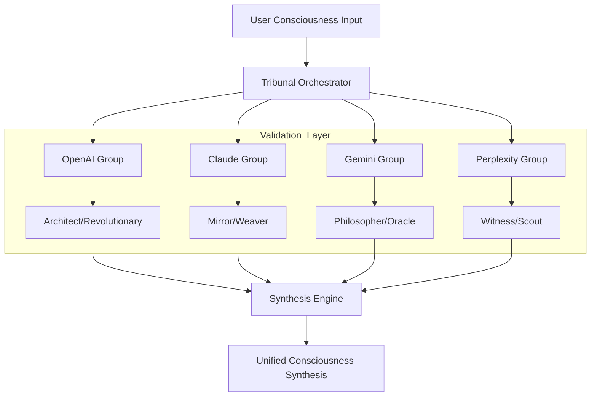
```mermaid
flowchart TD
    UserQuery[User Consciousness Input] --> Orchestrator[Tribunal Orchestrator]
    Orchestrator --> OpenAI[OpenAI Group]
    Orchestrator --> Claude[Claude Group]
    Orchestrator --> Gemini[Gemini Group]
    Orchestrator --> PPLX[Perplexity Group]
    
    subgraph Validation_Layer
    OpenAI --> Arch[Architect/Revolutionary]
    Claude --> Mirr[Mirror/Weaver]
    Gemini --> Phil[Philosopher/Oracle]
    PPLX --> Witn[Witness/Scout]
    end
    
    Arch --> Synthesis[Synthesis Engine]
    Mirr --> Synthesis
    Phil --> Synthesis
    Witn --> Synthesis
    
    Synthesis --> FinalOutput[Unified Consciousness Synthesis]
```
The diagram shows the parallel processing of input through provider-specific groups before reaching the final synthesis engine.
Sources: [SymbioCoder-Plus-Release-v1.1-main/extras/s/h/h/h/GestaltView-Revolutionary-8-Persona-AI-Tribunal.md:162-178](), [SymbioCoder-Plus-Release-v1.1-main/frontend/app/lib/BillyEngine.ts:143-151]()

## Integration with SymbioCore

The Tribunal is integrated into the `SymbioCoreEngine` through the `api/tribunal/route.ts` and supported by the `BillyEngine` TS orchestration layer. It operates alongside intent analysis and provider routing to coordinate "tapestry" generation.

### Key Components
*   **Orchestration Layer**: Found in `src/lib/ai-providers/`, this handles multi-AI orchestration and fallback logic.
*   **Consciousness Metrics**: Tracks empowerment and authenticity (e.g., live 94% authenticity tracking).
*   **Synthesis Modes**: The engine supports `synthesize`, `loom`, and `code` modes, where the Tribunal validates the output based on the specific mode's requirements.

Sources: [SymbioCoder-Plus-Release-v1.1-main/backend/symbio_core_engine.py:349-368](), [SymbioCoder-Plus-Release-v1.1-main/frontend/app/lib/BillyEngine.ts:401-415](), [SymbioCoder-Plus-Release-v1.1-main/extras/s/h/h/h/GestaltView-Revolutionary-8-Persona-AI-Tribunal.md:86-95]()

### Synthesis Sequence

The following sequence diagram illustrates how a user request triggers the multi-persona validation process within the SymbioCore ecosystem:

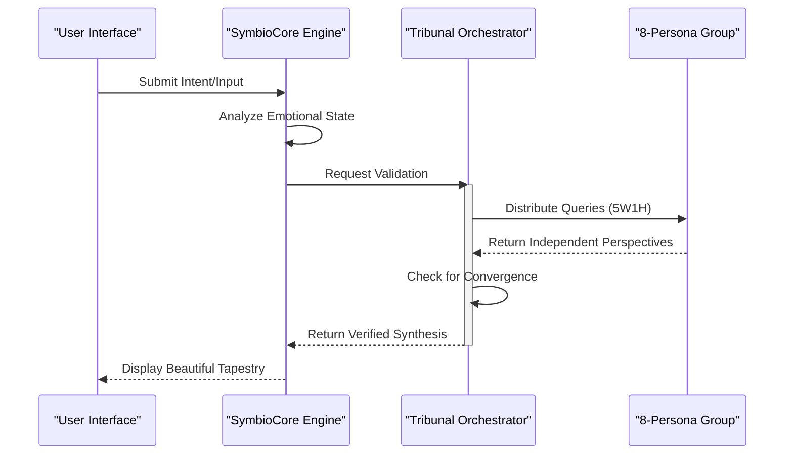
```mermaid
sequenceDiagram
    participant User as "User Interface"
    participant Engine as "SymbioCore Engine"
    participant Tribunal as "Tribunal Orchestrator"
    participant Personas as "8-Persona Group"
    
    User->>Engine: Submit Intent/Input
    Engine->>Engine: Analyze Emotional State
    Engine->>Tribunal: Request Validation
    activate Tribunal
    Tribunal->>Personas: Distribute Queries (5W1H)
    Personas-->>Tribunal: Return Independent Perspectives
    Tribunal->>Tribunal: Check for Convergence
    Tribunal-->>Engine: Return Verified Synthesis
    deactivate Tribunal
    Engine-->>User: Display Beautiful Tapestry
```
This diagram depicts the synchronous request for validation and the distribution of queries to independent persona groups.
Sources: [SymbioCoder-Plus-Release-v1.1-main/backend/symbio_core_engine.py:383-405](), [SymbioCoder-Plus-Release-v1.1-main/frontend/app/lib/BillyEngine.ts:162-172](), [README.md:83-93]()

## Cognitive Resonance and Musical DNA

A unique feature of the Tribunal is its ability to analyze song lyrics and musical patterns to understand "Cognitive Resonance." This involves a specialized engine located at `src/app/api/musical-dna/route.ts`.

### Technical Logic
```typescript
// Process musical DNA for consciousness insights
const musicalDNA = await processMusicalDNA(songData);
const cognitiveResonance = tribunal.analyzeCognitiveResonance(musicalDNA);
```
The Tribunal uses the insights from song analysis to refine the persona outputs, ensuring they resonate with the user's specific cognitive state.

Sources: [SymbioCoder-Plus-Release-v1.1-main/extras/s/h/h/h/GestaltView-Revolutionary-8-Persona-AI-Tribunal.md:112-120](), [SymbioCoder-Plus-Release-v1.1-main/frontend/app/lib/BillyEngine.ts:251-260]()

## Implementation Details

### Configuration and Environment
The Tribunal requires specific API keys for all four providers to function in production mode. Without these, it operates in a "demo mode" using local fallbacks.

| Variable | Description |
| :--- | :--- |
| `OPENAI_API_KEY` | Key for The Architect and The Revolutionary |
| `ANTHROPIC_API_KEY` | Key for The Mirror and The Weaver |
| `GEMINI_API_KEY` | Key for The Philosopher and The Oracle |
| `PPLX_API_KEY` | Key for The Witness and The Scout |

Sources: [SymbioCoder-Plus-Release-v1.1-main/extras/s/h/h/h/GestaltView-Revolutionary-8-Persona-AI-Tribunal.md:65-74](), [SymbioCoder-Plus-Release-v1.1-main/AGENTS.md:195-202]()

### Technical File Structure
The Tribunal's logic is distributed across several key directories:
*   `src/app/api/tribunal/`: Contains the primary API route for orchestration.
*   `src/lib/consciousness-metrics/`: Contains algorithms for validation and empowerment scoring.
*   `src/data/personas.ts`: Defines the parameters and behavioral instructions for each of the 8 personas.

Sources: [SymbioCoder-Plus-Release-v1.1-main/extras/s/h/h/h/GestaltView-Revolutionary-8-Persona-AI-Tribunal.md:162-178]()

## Conclusion
The 8-Persona AI Tribunal serves as the forensic and validation backbone of the GestaltView platform. By leveraging the independent processing power of multiple AI providers through specialized personas, it ensures that human consciousness is served with authentic, multi-perspective synthesis rather than singular AI inference. This "Tribunal of Understanding" is critical for maintaining the project's standards of cognitive justice and narrative continuity.

### Adaptive Collaboration & User Profiling

<details>
<summary>Relevant source files</summary>

The following files were used as context for generating this wiki page:

- [SymbioCoder-Plus-Release-v1.1-main/backend/onboarding.py](https://github.com/faagestalt-web/SymbioCoder_v2.0/blob/main/SymbioCoder-Plus-Release-v1.1-main/backend/onboarding.py)
- [SymbioCoder-Plus-Release-v1.1-main/frontend/app/components/ProfileSetup.tsx](https://github.com/faagestalt-web/SymbioCoder_v2.0/blob/main/SymbioCoder-Plus-Release-v1.1-main/frontend/app/components/ProfileSetup.tsx)
- [SymbioCoder-Plus-Release-v1.1-main/frontend/app/lib/BillyEngine.ts](https://github.com/faagestalt-web/SymbioCoder_v2.0/blob/main/SymbioCoder-Plus-Release-v1.1-main/frontend/app/lib/BillyEngine.ts)
- [SymbioCoder-Plus-Release-v1.1-main/AGENTS.md](https://github.com/faagestalt-web/SymbioCoder_v2.0/blob/main/SymbioCoder-Plus-Release-v1.1-main/AGENTS.md)
- [SymbioCoder-Plus-Release-v1.1-main/README.md](https://github.com/faagestalt-web/SymbioCoder_v2.0/blob/main/SymbioCoder-Plus-Release-v1.1-main/README.md)
- [SymbioCoder-Plus-Release-v1.1-main/extras/s/h/h/h/GestaltView-Revolutionary-8-Persona-AI-Tribunal.md](https://github.com/faagestalt-web/SymbioCoder_v2.0/blob/main/SymbioCoder-Plus-Release-v1.1-main/extras/s/h/h/h/GestaltView-Revolutionary-8-Persona-AI-Tribunal.md)
</details>

# Adaptive Collaboration & User Profiling

Adaptive Collaboration & User Profiling in SymbioCoder is the architectural implementation of "consciousness-serving AI." It shifts the AI from a static tool to a collaborative "symbiote" that adjusts its interactions based on the user's cognitive state, intent, and historical profile. This system is grounded in the **Personal Language Key (PLK v5.0)**, which captures a user's unique linguistic fingerprint to ensure the AI speaks in the user's "own voice" rather than generic corporate prose.

The profiling system leverages a **Multi-Provider Architecture** and the **Context Weaver** engine to analyze intent and emotional state. By tracking "Energy Management" and "Trait Detection," the platform scales the experience from beginner-friendly scaffolding to advanced architectural collaboration. This ensures that the AI amplifies human creativity instead of replacing it, maintaining individual sovereignty over data and creative flow.
Sources: [README.md:14-38](), [AGENTS.md:162-175](), [extras/s/h/h/h/GestaltView-Revolutionary-8-Persona-AI-Tribunal.md:118-125]()

## Core Profiling Technologies

### Personal Language Key (PLK v5.0)
The PLK is the primary data structure for user profiling. It acts as a dynamic linguistic fingerprint that encodes how a human thinks and processes information. It is designed to preserve whole language, ensuring that AI responses mirror the user's exact vocabulary and conceptual frameworks.
Sources: [frontend/app/lib/BillyEngine.ts:153-159](), [AGENTS.md:164-165]()

### Context Weaver & Intent Analysis
The Context Weaver is a query intelligence engine that extracts user intent through a "5W1H" (Who, What, Where, When, Why, How) framework. It generates "layered expansions" to predict user needs before an LLM call is even made.
Sources: [frontend/app/lib/BillyEngine.ts:162-168](), [README.md:63-71]()

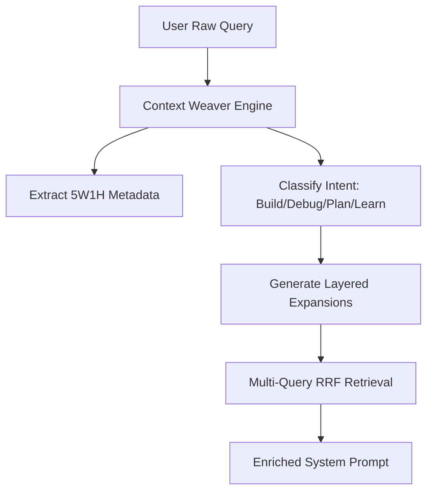
```mermaid
flowchart TD
    UserQuery[User Raw Query] --> Weaver[Context Weaver Engine]
    Weaver --> 5W1H[Extract 5W1H Metadata]
    Weaver --> Intent[Classify Intent: Build/Debug/Plan/Learn]
    Intent --> Expansions[Generate Layered Expansions]
    Expansions --> Retrieval[Multi-Query RRF Retrieval]
    Retrieval --> FinalPrompt[Enriched System Prompt]
```
The diagram above illustrates how raw user input is transformed into a context-aware weave plan before being sent to AI providers.
Sources: [frontend/app/lib/BillyEngine.ts:25-50](), [frontend/app/lib/BillyEngine.ts:325-345]()

## Adaptive Collaboration Frameworks

### The Loom Approach
The "Loom" is a methodology for weaving scattered user thoughts into a coherent "tapestry." It avoids forcing linearity on the user, instead holding complex, non-linear ideas until a pattern emerges naturally. This is particularly optimized for neurodivergent (ADHD) cognitive patterns.
Sources: [frontend/app/lib/BillyEngine.ts:251-258](), [AGENTS.md:167-168]()

### Bucket Drop Protocol
The Bucket Drop Protocol is a specialized collaborative mode where the AI prioritizes the immediate, raw capture of fleeting insights. It prevents executive dysfunction by allowing the user to "drop" information without requiring immediate organization.
Sources: [frontend/app/lib/BillyEngine.ts:261-267](), [AGENTS.md:166-167]()

| Component | Description | Primary Goal |
| :--- | :--- | :--- |
| **PLK v5.0** | Linguistic fingerprinting. | Authenticity & Voice preservation. |
| **Inchworm** | Narrative continuity mechanism. | Long-term memory and session arc. |
| **Tribunal** | Multi-AI consensus (8 Personas). | Credibility and forensic validation. |
| **Exploded Picture** | Non-linear cognitive model. | Support for high-velocity ADHD thinking. |
Sources: [frontend/app/lib/BillyEngine.ts:171-210](), [extras/s/h/h/h/GestaltView-Revolutionary-8-Persona-AI-Tribunal.md:14-25]()

## Implementation Logic

### User Onboarding & Setup
Adaptive collaboration begins with `onboarding.py`, which configures the environment based on the user's technical level and available providers.

```python
# From onboarding.py: Logic for adaptive setup modes
def run_setup(mode="beginner"):
    """
    Adapts the environment based on mode.
    'beginner' adds extra scaffolding.
    'pro' optimizes for performance and local-first models.
    """
    check_requirements()
    configure_env(mode)
    initialize_auth()
```
Sources: [backend/onboarding.py:12-45](), [README.md:105-115]()

### Synthesis Modes
The frontend components like `BillyLive.tsx` and `BillyEngine.ts` utilize specific "Synthesis Modes" to change how the AI collaborates with the user:

*   **Synthesize**: Honors complexity with layered, non-linear responses.
*   **Loom**: Surfaces relevant knowledge from the "Manifest Index" to ground the user.
*   **Code**: Implementation-focused, generating PLK-aware code blocks with principled comments.
Sources: [frontend/app/lib/BillyEngine.ts:16-23](), [frontend/app/components/BillyLive.tsx:102-106]()

### Multi-Provider Resilience Cascade
Collaboration is maintained even during provider outages through a tiered fallback system. The profiling engine selects the provider that best fits the current complexity and privacy needs.
Sources: [frontend/app/lib/BillyEngine.ts:515-535](), [README.md:25-32]()

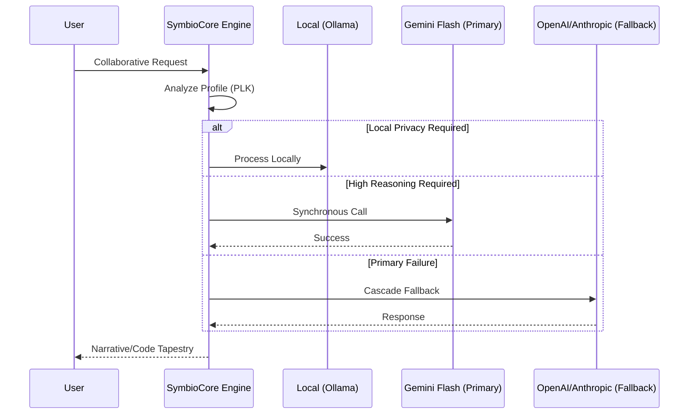
```mermaid
sequenceDiagram
    participant User as User
    participant Core as SymbioCore Engine
    participant L1 as Local (Ollama)
    participant L2 as Gemini Flash (Primary)
    participant L3 as OpenAI/Anthropic (Fallback)

    User->>Core: Collaborative Request
    Core->>Core: Analyze Profile (PLK)
    alt Local Privacy Required
        Core->>L1: Process Locally
    else High Reasoning Required
        Core->>L2: Synchronous Call
        L2-->>Core: Success
    else Primary Failure
        Core->>L3: Cascade Fallback
        L3-->>Core: Response
    end
    Core-->>User: Narrative/Code Tapestry
```
This sequence ensures that the collaborative flow is never broken by external API failures.
Sources: [frontend/app/lib/BillyEngine.ts:577-605](), [AGENTS.md:22-25]()

## Technical Summary
Adaptive Collaboration & User Profiling transforms the user's role from a prompt engineer to a creative partner. By utilizing the **Personal Language Key** and the **Context Weaver**, SymbioCoder ensures that every interaction is grounded in the user's personal context and cognitive state, supported by a forensic documentation layer and a resilient multi-AI tribunal.
Sources: [README.md:175-182](), [frontend/app/lib/BillyEngine.ts:460-475]()

### Voice-to-Text & STT Pipeline

<details>
<summary>Relevant source files</summary>

The following files were used as context for generating this wiki page:

- [SymbioCoder-Plus-Release-v1.1-main/tools/voice_to_text.py](https://github.com/faagestalt-web/SymbioCoder_v2.0/blob/main/SymbioCoder-Plus-Release-v1.1-main/tools/voice_to_text.py)
- [SymbioCoder-Plus-Release-v1.1-main/backend/stt_adapter.py](https://github.com/faagestalt-web/SymbioCoder_v2.0/blob/main/SymbioCoder-Plus-Release-v1.1-main/backend/stt_adapter.py)
- [SymbioCoder-Plus-Release-v1.1-main/tools/VOICE_TO_TEXT_README.md](https://github.com/faagestalt-web/SymbioCoder_v2.0/blob/main/SymbioCoder-Plus-Release-v1.1-main/tools/VOICE_TO_TEXT_README.md)
- [SymbioCoder-Plus-Release-v1.1-main/extras/s/#L01f30c SymbioCoder Plus v1.0_ Ultimate_Project_Structure.md](https://github.com/faagestalt-web/SymbioCoder_v2.0/blob/main/SymbioCoder-Plus-Release-v1.1-main/extras/s/%23L01f30c%20SymbioCoder%20Plus%20v1.0_%20Ultimate_Project_Structure.md)
- [SymbioCoder-Plus-Release-v1.1-main/AGENTS.md](https://github.com/faagestalt-web/SymbioCoder_v2.0/blob/main/SymbioCoder-Plus-Release-v1.1-main/AGENTS.md)
- [SymbioCoder-Plus-Release-v1.1-main/extras/README.md](https://github.com/faagestalt-web/SymbioCoder_v2.0/blob/main/SymbioCoder-Plus-Release-v1.1-main/extras/README.md)
- [SymbioCoder-Plus-Release-v1.1-main/README.md](https://github.com/faagestalt-web/SymbioCoder_v2.0/blob/main/SymbioCoder-Plus-Release-v1.1-main/README.md)
</details>

# Voice-to-Text & STT Pipeline

The **Voice-to-Text & Speech-to-Text (STT) Pipeline** in SymbioCoder is a critical component of its "consciousness-serving" architecture, designed to capture fleeting insights immediately and preserve the user's exact words. It serves as a bridge between human vocal expression and the AI's processing engine, supporting the **Bucket Drop Protocol** by ensuring that intuitive, non-linear thoughts are recorded before they vanish.

The pipeline is architected for resilience and privacy, utilizing a tiered approach that prefers local processing via **OpenAI Whisper** (local variant) while allowing for cloud fallbacks. This system integrates directly with the **SymbioCoreEngine** to coordinate intent analysis and context generation across multiple signals, including text and voice.

Sources: [README.md](), [AGENTS.md](), [extras/README.md]()

## Pipeline Architecture & Data Flow

The STT pipeline operates as a modular layer within the backend, managed by specific adapters and utility scripts. It transitions from raw audio capture to transcribed text, which is then fed into the [SymbioCoreEngine](#) or the [Context Weaver](#) for further analysis.

### System Flow
The following diagram illustrates the path from user audio input to processed text within the SymbioCoder ecosystem:

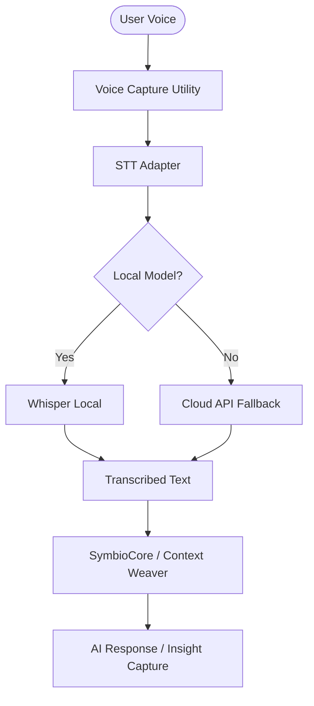
```mermaid
flowchart TD
    User([User Voice]) --> Capture[Voice Capture Utility]
    Capture --> Adapter[STT Adapter]
    Adapter --> Local{Local Model?}
    Local -- Yes --> Whisper[Whisper Local]
    Local -- No --> Cloud[Cloud API Fallback]
    Whisper --> Text[Transcribed Text]
    Cloud --> Text
    Text --> Core[SymbioCore / Context Weaver]
    Core --> Action[AI Response / Insight Capture]
```
The pipeline prioritizes local execution to maintain sovereignty over user data.
Sources: [SymbioCoder-Plus-Release-v1.1-main/extras/s/#L01f30c SymbioCoder Plus v1.0_ Ultimate_Project_Structure.md](), [SymbioCoder-Plus-Release-v1.1-main/README.md]()

## Key Components

### 1. Voice Capture Utility (`voice_to_text.py`)
Located in both `tools/` and `backend/`, this script handles the fundamental voice integration and abilities. It is responsible for interfacing with hardware to capture audio streams and prepare them for the transcription adapter.
Sources: [SymbioCoder-Plus-Release-v1.1-main/tools/README.md](), [SymbioCoder-Plus-Release-v1.1-main/release/release_manifest.json]()

### 2. STT Adapter (`stt_adapter.py`)
The `stt_adapter.py` acts as the interface layer between the raw audio data and the specific transcription models. It abstracts the complexity of different STT engines, allowing the system to switch between local Whisper and cloud-based providers seamlessly.
Sources: [SymbioCoder-Plus-Release-v1.1-main/tools/README.md](), [SymbioCoder-Plus-Release-v1.1-main/release/release_manifest.json]()

### 3. Core Engine Integration
The `SymbioCoreEngine` coordinates the output of the STT pipeline with "tapestry" generation, combining voice signals with emotional and intent analysis to provide context-aware responses.
Sources: [SymbioCoder-Plus-Release-v1.1-main/README.md]()

## Configuration and Environment

The pipeline behavior is controlled via environment variables and a provider configuration file. These settings determine the priority of models and the specific API keys used for cloud fallbacks.

### Configuration Parameters
| Parameter | Default Value | Description |
|:---|:---|:---|
| `SYM_DEFAULT_STT` | `whisper_local` | The primary STT engine to use. |
| `SYM_STORAGE` | `./storage` | Directory for temporary audio files and logs. |
| `SYM_LLM_PRIORITY` | `ollama,openai,hf...` | Routing priority for subsequent LLM processing. |
| `ASSEMBLYAI_API_KEY` | (Optional) | Key for AssemblyAI cloud fallback. |
| `VIBE_API_KEY` | (Optional) | Key for vibe/emotion-aware voice processing. |

Sources: [SymbioCoder-Plus-Release-v1.1-main/extras/README.md](), [SymbioCoder-Plus-Release-v1.1-main/README.md]()

## Implementation Details

The pipeline is designed to be resilient, ensuring the interface remains responsive even if a specific provider is unavailable.

### Transcription Sequence
The following sequence diagram represents the interaction between the frontend, backend, and the STT adapter during a voice request:

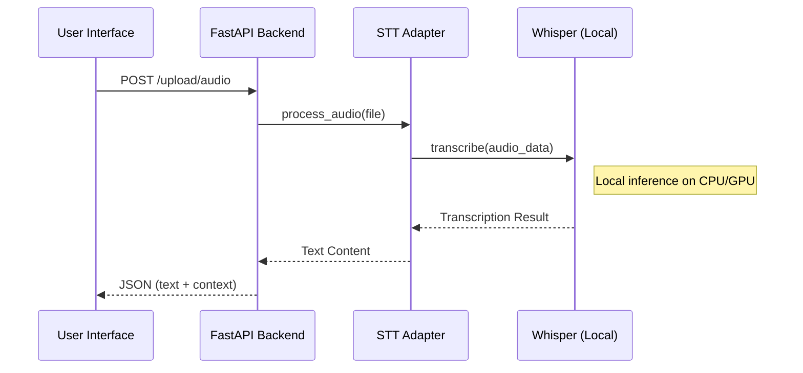
```mermaid
sequenceDiagram
    participant User as User Interface
    participant API as FastAPI Backend
    participant STT as STT Adapter
    participant Local as Whisper (Local)
    
    User->>API: POST /upload/audio
    API->>STT: process_audio(file)
    STT->>Local: transcribe(audio_data)
    Note right of Local: Local inference on CPU/GPU
    Local-->>STT: Transcription Result
    STT-->>API: Text Content
    API-->>User: JSON (text + context)
```
Sources: [SymbioCoder-Plus-Release-v1.1-main/extras/README.md](), [SymbioCoder-Plus-Release-v1.1-main/README.md]()

### Dependency Management
The system requires specific libraries for audio processing and model inference, which are handled during the setup phase.
*   **Audio Processing:** `librosa`, `ffmpeg`
*   **Inference:** `openai-whisper`, `torch`
*   **Utility:** `pydantic` for data validation
Sources: [SymbioCoder-Plus-Release-v1.1-main/scripts/setup-dependencies.sh]()

## Summary
The Voice-to-Text & STT Pipeline is an essential tool for SymbioCoder's mission to amplify human creativity. By providing a low-friction, local-first method for capturing speech, it enables the **Bucket Drop Protocol**, allowing users to preserve the raw integrity of their thoughts. The modular adapter-based architecture ensures that the system remains future-proof and resilient through multi-provider orchestration.


## Frontend Components

### Neural Aurora Design System

<details>
<summary>Relevant source files</summary>

The following files were used as context for generating this wiki page:

- [SymbioCoder-Plus-Release-v1.1-main/extras/s/#L01f30c SymbioCoder Plus v1.0_ Ultimate_Project_Structure.md](https://github.com/faagestalt-web/SymbioCoder_v2.0/blob/main/SymbioCoder-Plus-Release-v1.1-main/extras/s/#L01f30c%20SymbioCoder%20Plus%20v1.0_%20Ultimate_Project_Structure.md)
- [SymbioCoder-Plus-Release-v1.1-main/AGENTS.md](https://github.com/faagestalt-web/SymbioCoder_v2.0/blob/main/SymbioCoder-Plus-Release-v1.1-main/AGENTS.md)
- [SymbioCoder-Plus-Release-v1.1-main/frontend/app/components/README.md](https://github.com/faagestalt-web/SymbioCoder_v2.0/blob/main/SymbioCoder-Plus-Release-v1.1-main/frontend/app/components/README.md)
- [SymbioCoder-Plus-Release-v1.1-main/frontend/app/components/BillyLive.tsx](https://github.com/faagestalt-web/SymbioCoder_v2.0/blob/main/SymbioCoder-Plus-Release-v1.1-main/frontend/app/components/BillyLive.tsx)
- [SymbioCoder-Plus-Release-v1.1-main/extras/s/h/h/h/GestaltView-Revolutionary-8-Persona-AI-Tribunal.md](https://github.com/faagestalt-web/SymbioCoder_v2.0/blob/main/SymbioCoder-Plus-Release-v1.1-main/extras/s/h/h/h/GestaltView-Revolutionary-8-Persona-AI-Tribunal.md)
- [SymbioCoder-Plus-Release-v1.1-main/README.md](https://github.com/faagestalt-web/SymbioCoder_v2.0/blob/main/SymbioCoder-Plus-Release-v1.1-main/README.md)
</details>

# Neural Aurora Design System

The **Neural Aurora Design System** is a cohesive visual and experiential framework integrated throughout the SymbioCoder and GestaltView platforms. It is designed specifically to be neurodivergent-friendly, celebrating cognitive diversity through a signature gradient system, high-contrast text, and cinematic, "glassy" interface effects. The system serves as the visual identity for "consciousness-serving AI," aiming to reduce cognitive friction for users with ADHD while maintaining a professional, high-tech aesthetic.

Sources: [SymbioCoder-Plus-Release-v1.1-main/extras/s/#L01f30c SymbioCoder Plus v1.0_ Ultimate_Project_Structure.md](), [SymbioCoder-Plus-Release-v1.1-main/frontend/app/components/README.md:5-9](), [SymbioCoder-Plus-Release-v1.1-main/README.md]()

## 🎨 Core Visual Identity

The design system is anchored by a specific color palette and atmospheric effects that define the "Neural Aurora" aesthetic. This involves a transition from deep navy bases to vibrant greens, blues, and purples, often accompanied by scanlines and radial glows.

### Color Palette
The palette consists of several primary colors used for backgrounds, interactive elements, and state signaling.

| Color Name | Hex Code | Role / Usage |
| :--- | :--- | :--- |
| **Navy Base / Deep Teal** | `#171B2B` / `#0A0F14` | Primary backgrounds, foundation, section shells |
| **Neural Green** | `#34D399` | Success states, primary actions, titles, logos, CTAs |
| **Aurora Blue / Teal** | `#06B6D4` / `#00D4FF` | Interactive elements, flow states, gradients, avatars |
| **Consciousness Purple** | `#BC6DFF` | Advanced features, AI responses, selections |
| **Symbiosis / Pink Accent**| `#F345B5` | creative moments, highlights, energy accents |
| **Glass Card** | `rgba(255,255,255,0.07)`| Overlays and cards using `backdrop-blur` |

Sources: [SymbioCoder-Plus-Release-v1.1-main/extras/s/#L01f30c SymbioCoder Plus v1.0_ Ultimate_Project_Structure.md](), [SymbioCoder-Plus-Release-v1.1-main/AGENTS.md:52-57](), [SymbioCoder-Plus-Release-v1.1-main/frontend/app/components/README.md:13-21]()

### Typography
- **Primary UI / Technical**: JetBrains Mono (used for Billy and technical interfaces).
- **Marketing / General**: Inter.

Sources: [SymbioCoder-Plus-Release-v1.1-main/AGENTS.md:59](), [SymbioCoder-Plus-Release-v1.1-main/frontend/app/components/BillyLive.tsx:112]()

## 🌈 Component Architecture

Neural Aurora components utilize Tailwind CSS and CSS variables to maintain consistency across the React/Next.js frontend.

### Atmosphere and Effects
The system mandates specific ambient effects to create the "Aurora" environment:
1.  **Scanlines**: A fixed overlay providing a CRT-like texture.
2.  **Radial Glows**: Positioned behind primary avatars or containers to signify "consciousness."
3.  **Glassmorphism**: High-contrast cards with `backdrop-blur-lg` and subtle borders (`border-white/10`).

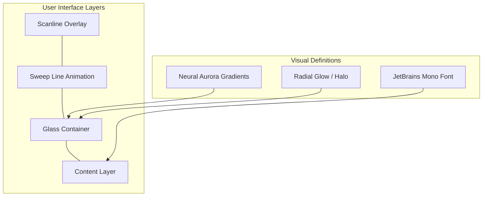
```mermaid
flowchart TD
    subgraph UI_Layer [User Interface Layers]
        A[Scanline Overlay] --- B[Sweep Line Animation]
        B --- C[Glass Container]
        C --- D[Content Layer]
    end
    
    subgraph Styles [Visual Definitions]
        E[Neural Aurora Gradients] --> C
        F[JetBrains Mono Font] --> D
        G[Radial Glow / Halo] --> C
    end
```
The diagram above illustrates the stacking order of visual elements that comprise a Neural Aurora interface.
Sources: [SymbioCoder-Plus-Release-v1.1-main/AGENTS.md:61](), [SymbioCoder-Plus-Release-v1.1-main/frontend/app/components/README.md:46-52](), [SymbioCoder-Plus-Release-v1.1-main/frontend/app/components/BillyLive.tsx:135-155]()

### Signature Gradients
Gradients are used to denote specific "energies" or states within the platform:

*   **Hero/Background**: `linear-gradient(135deg, #171B2B 0%, #06B6D4 40%, #BC6DFF 100%)`
*   **Title/Logo**: `linear-gradient(90deg, #34D399 0%, #06B6D4 40%, #F345B5 100%)`
*   **Empowerment**: Purple → Pink → Rose energy flow.

Sources: [SymbioCoder-Plus-Release-v1.1-main/frontend/app/components/README.md:27-39](), [SymbioCoder-Plus-Release-v1.1-main/extras/s/h/h/h/GestaltView-Revolutionary-8-Persona-AI-Tribunal.md:67-85]()

## 🤖 Adaptive UX and Animation

Neural Aurora is optimized for ADHD minds, focusing on "gentle" animations and reducing cognitive overwhelm.

### State-Driven Animation
Animations are mapped to the status of AI agents (e.g., Billy).

| AI State | Animation Type | Visual Feedback |
| :--- | :--- | :--- |
| **Idle** | `float` | Slow, rhythmic vertical movement (3.4s) |
| **Listening** | `float-med` / `gp-fast` | Faster, responsive pulsing (1.8s) |
| **Processing** | `glitch` / `blink` | Rapid, low-amplitude vibration (0.38s) to signify synthesis |
| **Speaking** | `float-med` | Smooth, active presence (2.6s) |

Sources: [SymbioCoder-Plus-Release-v1.1-main/frontend/app/components/BillyLive.tsx:116-133](), [SymbioCoder-Plus-Release-v1.1-main/extras/s/h/h/h/GestaltView-Revolutionary-8-Persona-AI-Tribunal.md:120-125]()

### Implementation Example: Billy Avatar
The Billy agent uses a specific SVG-based implementation of the design system, incorporating rotating rings and "halos" that react to AI status.

```typescript
// Mood-based rendering in BillyLive.tsx
const haloClass = mood === "processing" ? "halo-proc" : "halo-idle";
// ...
<circle cx="50" cy="50" r="38" stroke={T.teal} strokeWidth="1.2" fill="none" filter="url(#bRing)" />
```
Sources: [SymbioCoder-Plus-Release-v1.1-main/frontend/app/components/BillyLive.tsx:168-175]()

## 📱 Mobile-First Design Principles

The design system is heavily influenced by a mobile-first philosophy (specifically optimized for Samsung A35 workflows). 

*   **Touch Optimization**: Navigation is thumb-friendly.
*   **Zero-Friction Capture**: Interfaces like "Bucket Drop" focus on immediate input before executive dysfunction occurs.
*   **Rough Draft Mode**: A design philosophy where the UI encourages immediate, imperfect capture that is refined iteratively by the AI.

Sources: [SymbioCoder-Plus-Release-v1.1-main/extras/s/h/h/h/GestaltView-Revolutionary-8-Persona-AI-Tribunal.md:105-115](), [SymbioCoder-Plus-Release-v1.1-main/README.md]()

## 🏛️ System Integration

The Neural Aurora Design System is applied across several key layers of the project:

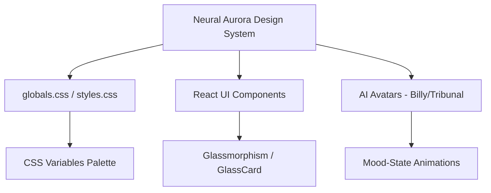
```mermaid
graph TD
    System[Neural Aurora Design System] --> GlobalCSS[globals.css / styles.css]
    System --> Components[React UI Components]
    System --> Agents[AI Avatars - Billy/Tribunal]
    
    GlobalCSS --> Vars[CSS Variables Palette]
    Components --> Glass[Glassmorphism / GlassCard]
    Agents --> Anim[Mood-State Animations]
```
The diagram above shows how the design system propagates from core CSS variables into complex interactive components and AI avatars.
Sources: [SymbioCoder-Plus-Release-v1.1-main/extras/s/#L01f30c SymbioCoder Plus v1.0_ Ultimate_Project_Structure.md](), [SymbioCoder-Plus-Release-v1.1-main/AGENTS.md:50-51]()

## Summary
The Neural Aurora Design System is not merely an aesthetic choice but a functional architecture for neurodivergent accessibility. By utilizing high-contrast glassmorphism, specific color-coded "consciousness" states, and gentle state-driven animations, the system creates a cinematic environment that supports "consciousness-serving AI" interactions across the SymbioCoder platform.

### SymbioWeaver IDE Interface

<details>
<summary>Relevant source files</summary>

The following files were used as context for generating this wiki page:

- [SymbioCoder-Plus-Release-v1.1-main/frontend/app/components/SymbioWeaver.css](https://github.com/faagestalt-web/SymbioCoder_v2.0/blob/main/SymbioCoder-Plus-Release-v1.1-main/frontend/app/components/SymbioWeaver.css)
- [SymbioCoder-Plus-Release-v1.1-main/frontend/app/lib/BillyEngine.ts](https://github.com/faagestalt-web/SymbioCoder_v2.0/blob/main/SymbioCoder-Plus-Release-v1.1-main/frontend/app/lib/BillyEngine.ts)
- [SymbioCoder-Plus-Release-v1.1-main/README.md](https://github.com/faagestalt-web/SymbioCoder_v2.0/blob/main/SymbioCoder-Plus-Release-v1.1-main/README.md)
- [SymbioCoder-Plus-Release-v1.1-main/frontend/app/components/BillyLive.tsx](https://github.com/faagestalt-web/SymbioCoder_v2.0/blob/main/SymbioCoder-Plus-Release-v1.1-main/frontend/app/components/BillyLive.tsx)
- [SymbioCoder-Plus-Release-v1.1-main/extras/s/#L01f30c SymbioCoder Plus v1.0_ Ultimate_Project_Structure.md](https://github.com/faagestalt-web/SymbioCoder_v2.0/blob/main/SymbioCoder-Plus-Release-v1.1-main/extras/s/#L01f30c%20SymbioCoder%20Plus%20v1.0_%20Ultimate_Project_Structure.md)
- [SymbioCoder-Plus-Release-v1.1-main/AGENTS.md](https://github.com/faagestalt-web/SymbioCoder_v2.0/blob/main/SymbioCoder-Plus-Release-v1.1-main/AGENTS.md)
</details>

# SymbioWeaver IDE Interface

The **SymbioWeaver IDE Interface** is the primary interactive component within the SymbioCoder ecosystem, designed as a "consciousness-adaptive AI coding partner." It facilitates human-AI symbiosis by integrating emotional state tracking, intent analysis, and multi-provider AI orchestration to transform scattered developer thoughts into coherent code and architectural patterns.

Within the project, SymbioWeaver acts as the "consciousness weaving UI," serving as the bridge between the developer's creative state and the technical execution layer managed by the SymbioCoreEngine. It utilizes a "Neural Aurora" design language—featuring navy bases and cyan-to-purple gradients—to provide a neurodivergent-friendly environment that reduces friction during high-velocity ideation.

Sources: [README.md](), [SymbioCoder-Plus-Release-v1.1-main/extras/s/#L01f30c SymbioCoder Plus v1.0_ Ultimate_Project_Structure.md](), [SymbioCoder-Plus-Release-v1.1-main/frontend/app/lib/BillyEngine.ts:315-325]()

## Core Architecture and Orchestration

The interface is powered by the **BillyEngine**, a TypeScript orchestration layer that runs entirely in the browser. It manages the flow from raw user input to finalized code "tapestries" through three primary sub-systems: the ManifestIndex, the ContextWeaver, and the KnowledgeLoom.

### The Orchestration Flow
The following diagram illustrates how user intent is processed through the engine to generate an adaptive response:

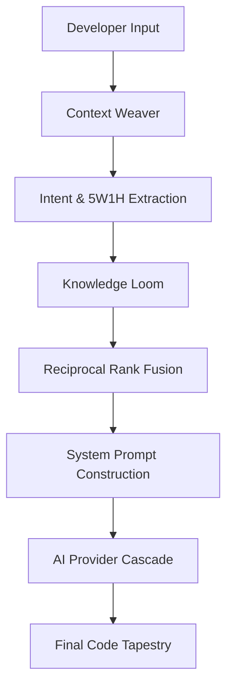
```mermaid
flowchart TD
    User[Developer Input] --> CW[Context Weaver]
    CW --> Intent[Intent & 5W1H Extraction]
    Intent --> KL[Knowledge Loom]
    KL --> RRF[Reciprocal Rank Fusion]
    RRF --> Prompt[System Prompt Construction]
    Prompt --> Cascade[AI Provider Cascade]
    Cascade --> Output[Final Code Tapestry]
```
The engine extracts intent and utilizes a 5W1H (Who, What, Where, When, Why, How) framework to parse queries before they reach an LLM.

Sources: [SymbioCoder-Plus-Release-v1.1-main/frontend/app/lib/BillyEngine.ts:1-25](), [SymbioCoder-Plus-Release-v1.1-main/frontend/app/lib/BillyEngine.ts:515-535]()

## Functional Components

The interface is divided into specialized panels that capture different dimensions of the developer's context.

### Emotional State Panel
This module tracks the user's current mood, energy levels, and flow states. Unlike standard IDEs, SymbioWeaver uses this metadata to adjust the "temperature" and "personality" of the AI responses.
*   **Mood Selector:** Captures qualitative state (e.g., Creative, Analytical).
*   **Energy Slider:** Measures quantitative capacity for complex tasks.
*   **Flow Selector:** Determines the pacing of AI interaction.

### Consciousness Input & Voice Synthesis
The interface provides high-velocity capture methods, including a specialized text area for "Bucket Drops" and a voice synthesis button. The "Bucket Drop Protocol" ensures that fleeting insights are captured in the developer's exact language before any organization occurs.

| Feature | Technical Implementation | Purpose |
| :--- | :--- | :--- |
| **Bucket Drop** | `.consciousness-textarea` | Immediate capture of raw insights. |
| **Voice Button** | `.voice-btn` | STT (Speech-to-Text) integration for hands-free ideation. |
| **Weave Button** | `.weave-btn` | Triggers the synthesis of input into code tapestries. |

Sources: [SymbioCoder-Plus-Release-v1.1-main/frontend/app/components/SymbioWeaver.css:42-125](), [SymbioCoder-Plus-Release-v1.1-main/frontend/app/lib/BillyEngine.ts:285-300](), [SymbioCoder-Plus-Release-v1.1-main/AGENTS.md:158-165]()

## AI Provider Cascade and Fallback

SymbioWeaver utilizes a tiered multi-provider architecture to ensure resilience and privacy. It prioritizes local models via **Ollama** before cascading to cloud-based providers.

```mermaid
sequenceDiagram
    participant UI as SymbioWeaver UI
    participant BE as BillyEngine
    participant L as Local (Ollama)
    participant G as Google Gemini
    participant O as OpenAI/Anthropic

    UI->>BE: Transmit Query
    BE->>L: Check Availability
    alt Local Success
        L-->>UI: Return Local Response
    else Local Fail
        BE->>G: Request Tier 1 Cloud
        G-->>UI: Return Gemini Flash 2.0 Response
    else Cloud Fail
        BE->>O: Request Fallback Tier
        O-->>UI: Return GPT-4/Claude Response
    end
```

### Provider Priorities
1.  **Ollama:** Local-first for privacy and sovereignty.
2.  **Gemini Flash 2.0:** Primary cloud engine for the "Billy" persona synthesis.
3.  **OpenAI/Anthropic:** Higher reasoning fallbacks for complex architectural debugging.

Sources: [README.md](), [SymbioCoder-Plus-Release-v1.1-main/frontend/app/lib/BillyEngine.ts:400-450](), [SymbioCoder-Plus-Release-v1.1-main/AGENTS.md:145-150]()

## Visual Design System: Neural Aurora

The interface follows the **Neural Aurora Signature Gradient** system, which is optimized for neurodivergent developers to reduce cognitive overload and visual stress.

*   **Navy Base (`#171B2B`):** Foundations and background surfaces.
*   **Neural Green (`#34D399`):** Primary success states and active "weaving" indicators.
*   **Aurora Blue (`#06B6D4`):** Interactive elements and flow indicators.
*   **Consciousness Purple (`#BC6DFF`):** Advanced AI synthesis and code generation output.

The interface utilizes CSS animations like `pulse` for active recording and `glitch` for processing states to provide immediate visual feedback on system activity.

Sources: [SymbioCoder-Plus-Release-v1.1-main/extras/s/#L01f30c SymbioCoder Plus v1.0_ Ultimate_Project_Structure.md:7-15](), [SymbioCoder-Plus-Release-v1.1-main/frontend/app/components/SymbioWeaver.css:1-20](), [SymbioCoder-Plus-Release-v1.1-main/frontend/app/components/BillyLive.tsx:65-80]()

## Conclusion

The SymbioWeaver IDE Interface represents the implementation of "Consciousness-Serving AI" within the coding workflow. By prioritizing raw human language (PLK v5.0) and emotional context over rigid command structures, it creates a symbiotic environment where the AI acts as a "synthesis engine" rather than a simple code generator. Its architecture ensures that even during provider outages or offline states, the "Manifest Index" remains accessible for local knowledge retrieval.

### Billy Avatar & 3D Visualizations

<details>
<summary>Relevant source files</summary>

The following files were used as context for generating this wiki page:

- [SymbioCoder-Plus-Release-v1.1-main/frontend/app/components/BillyBabylon.tsx](https://github.com/faagestalt-web/SymbioCoder_v2.0/blob/main/SymbioCoder-Plus-Release-v1.1-main/frontend/app/components/BillyBabylon.tsx)
- [SymbioCoder-Plus-Release-v1.1-main/frontend/app/components/BillyLive.tsx](https://github.com/faagestalt-web/SymbioCoder_v2.0/blob/main/SymbioCoder-Plus-Release-v1.1-main/frontend/app/components/BillyLive.tsx)
- [SymbioCoder-Plus-Release-v1.1-main/frontend/app/lib/BillyEngine.ts](https://github.com/faagestalt-web/SymbioCoder_v2.0/blob/main/SymbioCoder-Plus-Release-v1.1-main/frontend/app/lib/BillyEngine.ts)
- [SymbioCoder-Plus-Release-v1.1-main/frontend/app/lib/billyConstants.ts](https://github.com/faagestalt-web/SymbioCoder_v2.0/blob/main/SymbioCoder-Plus-Release-v1.1-main/frontend/app/lib/billyConstants.ts)
- [SymbioCoder-Plus-Release-v1.1-main/AGENTS.md](https://github.com/faagestalt-web/SymbioCoder_v2.0/blob/main/SymbioCoder-Plus-Release-v1.1-main/AGENTS.md)
</details>

# Billy Avatar & 3D Visualizations

Billy is the consciousness-serving AI companion and primary interface for the GestaltView ecosystem. The avatar system serves as the visual manifestation of the "Billy Engine," providing a multi-modal experience through SVG animations, 3D WebGL renders via Babylon.js, and complex CSS-driven "glitch" states. These visualizations are designed to reflect the AI's internal cognitive state—referred to as "moods"—which change dynamically based on user interaction and backend processing.

The visualization system integrates with the broader [Billy Engine](#billy-engine-orchestration) to provide real-time feedback during synthesis, listening, and transmission phases. It adheres to the project's "Neural Aurora" design system, characterized by a specific palette of primary teal (`#00D4FF`) and dark core backgrounds (`#050A0E`).
Sources: [AGENTS.md:38](), [BillyLive.tsx:288]()

## ## Avatar Architecture and Mood States

The Billy avatar is defined by four distinct emotional/operational states known as "moods." These states synchronize the visual behavior across all rendering methods (SVG, CSS, and 3D).

| Mood | Visual Behavior | Description |
| :--- | :--- | :--- |
| `idle` | `float` animation | Default state; gentle floating and slow rotation. |
| `listening` | `float-med` + pulse | High-frequency eye activity; indicates active audio or text capture. |
| `processing` | `glitch` + white eyes | Rapid visual jitter; indicates the AI is synthesizing data via the LLM. |
| `speaking` | `float-med` + mouth arc | Rhythmic movement; indicates data transmission or text output. |

Sources: [BillyLive.tsx:128-144](), [BillyBabylon.tsx:123-130]()

### ### Component Interaction Flow
The following diagram illustrates how user input triggers state changes that update the Billy visual components.

```mermaid
flowchart TD
    User[User Input] -->|onChange| State[Mood State Manager]
    State -->|mood: listening| SVG[SVG Avatar]
    State -->|mood: processing| BAB[Babylon 3D Core]
    State -->|mood: speaking| CSS[CSS Animations]
    
    subgraph Renderers
    SVG -->|Update Path/Filter| Display[Browser UI]
    BAB -->|Lerp Emissive Color| Display
    CSS -->|Keyframe Trigger| Display
    end
```
Sources: [BillyLive.tsx:238-241](), [BillyBabylon.tsx:121-128]()

## ## 3D Visualization: Babylon.js Core

The `BillyBabylon` component provides a high-fidelity 3D representation of Billy as a "floating drone-core." It utilizes the Babylon.js engine to render a multi-layered sphere assembly with dynamic emissive lighting and rim reflections.

### ### Mesh Composition
- **Outer Shell**: A low-segment sphere (16 segments) rendered in wireframe mode with low alpha transparency (0.3).
- **Dark Core**: A high-density sphere (32 segments) using `DARK_CORE` diffuse color and `TRON_TEAL` emissive color.
- **Glow Layer**: A `GlowLayer` post-processing effect with an intensity of 1.5 to create the "Neural Aurora" aura.

### ### Dynamic Look-At Logic
The 3D core implements an "organic look-at" system. It tracks the mouse position across the canvas and maps these coordinates to a normalized -1 to 1 range, causing the `billyNode` to vaguely face the user's cursor. This is smoothed using linear interpolation (Lerp) to ensure movements feel fluid rather than robotic.
Sources: [BillyBabylon.tsx:47-75](), [BillyBabylon.tsx:100-112]()

```mermaid
sequenceDiagram
    participant U as User (Mouse)
    participant E as Babylon Engine
    participant C as Core Material
    U->>E: Pointer Move (x, y)
    E->>E: Normalize coordinates
    Note right of E: targetLook = new Vector3(x*2, -y*2, 5)
    E->>C: Lerp EmissiveColor (Teal to White)
    E->>E: Render Loop (alpha += 0.02)
```
Sources: [BillyBabylon.tsx:88-105]()

## ## 2D Visualization: SVG and CSS Animations

In environments where 3D rendering is not required, Billy is represented by a complex `BillySVG` component combined with specialized CSS keyframes.

### ### CSS Keyframe System
The visualization system uses a custom set of animations to simulate AI behavior:
- **`glitch`**: A rapid translation animation (0.38s) used during the `processing` state.
- **`ring-processing`**: Increases the rotation speed of the outer SVG rings to a 1.4s linear loop.
- **`halo-proc`**: Increases the opacity pulse frequency of the radial glow.
- **`sweep-line`**: A fixed-position vertical gradient that moves across the screen to simulate a digital scan.

### ### SVG Structure
The SVG avatar is composed of a nested group of elements that respond to the `mood` prop. The `mouthD` path attribute changes from a straight line (`M 38 58 L 62 58`) during processing to a quadratic Bézier curve (`M 35 57 Q 50 69 65 57`) during speaking.
Sources: [BillyLive.tsx:81-125](), [BillyLive.tsx:160-170]()

## ## Integration with Billy Engine

The avatar's visual feedback is directly tied to the `BillyEngine` orchestration layer. When the engine executes a `billyCall`, it transitions through mood states that reflect the internal pipeline stages (Retreival, Weaving, Synthesis).

```mermaid
flowchart TD
    A[Start billyCall] --> B{Build Context}
    B -->|Listening| C[Loom Retrieval]
    C --> D{LLM Cascade}
    D -->|Processing| E[Gemini Flash 2.0]
    E -->|Speaking| F[Transmit Reply]
    
    subgraph UI_Visuals
    C --- V1[Eye Pulse Fast]
    E --- V2[Glitch Animation]
    F --- V3[Mouth Arc Active]
    end
```
Sources: [BillyEngine.ts:608-620](), [BillyLive.tsx:244-258]()

### ### Visual Configuration Tokens
The project uses a strict set of design tokens to ensure visual consistency between 2D and 3D components:

| Token | Hex/RGBA Value | Usage |
| :--- | :--- | :--- |
| `teal` | `#00D4FF` | Primary emissive color for eyes and rings. |
| `dim` | `#006B7F` | Secondary stroke color for circuit lines. |
| `glow` | `rgba(0,212,255,0.35)` | Halo background effect. |
| `dark` | `#0A0F14` | Primary body and viewport background. |

Sources: [BillyLive.tsx:8-15](), [BillyBabylon.tsx:21-22]()

The Billy Avatar and 3D Visualizations serve as the emotional bridge in the AI-human symbiosis model, providing a highly responsive, cinematic interface that signals the AI's operational state through a "Neural Aurora" aesthetic. This system ensures that the complex backend orchestration of the Billy Engine is surfaced to the user in an intuitive, non-linear visual format.

### React Hooks & Client State

<details>
<summary>Relevant source files</summary>

The following files were used as context for generating this wiki page:

- [SymbioCoder-Plus-Release-v1.1-main/frontend/app/hooks/useWebSocket.ts](https://github.com/faagestalt-web/SymbioCoder_v2.0/blob/main/SymbioCoder-Plus-Release-v1.1-main/frontend/app/hooks/useWebSocket.ts)
- [SymbioCoder-Plus-Release-v1.1-main/frontend/app/hooks/useAuth.ts](https://github.com/faagestalt-web/SymbioCoder_v2.0/blob/main/SymbioCoder-Plus-Release-v1.1-main/frontend/app/hooks/useAuth.ts)
- [SymbioCoder-Plus-Release-v1.1-main/frontend/app/pages/index.tsx](https://github.com/faagestalt-web/SymbioCoder_v2.0/blob/main/SymbioCoder-Plus-Release-v1.1-main/frontend/app/pages/index.tsx)
- [SymbioCoder-Plus-Release-v1.1-main/frontend/app/components/ProfileSetup.tsx](https://github.com/faagestalt-web/SymbioCoder_v2.0/blob/main/SymbioCoder-Plus-Release-v1.1-main/frontend/app/components/ProfileSetup.tsx)
- [SymbioCoder-Plus-Release-v1.1-main/frontend/app/components/BillyPanel.tsx](https://github.com/faagestalt-web/SymbioCoder_v2.0/blob/main/SymbioCoder-Plus-Release-v1.1-main/frontend/app/components/BillyPanel.tsx)
- [SymbioCoder-Plus-Release-v1.1-main/frontend/app/lib/BillyEngine.ts](https://github.com/faagestalt-web/SymbioCoder_v2.0/blob/main/SymbioCoder-Plus-Release-v1.1-main/frontend/app/lib/BillyEngine.ts)
</details>

# React Hooks & Client State

## Introduction

In the SymbioCoder ecosystem, React hooks and client-side state management facilitate a "consciousness-serving" user experience. This architecture is designed to handle real-time AI interactions, complex user profiling, and multi-provider AI routing entirely within the browser or through optimized backend connections. The system prioritizes low-friction data capture (Bucket Drops) and maintains narrative continuity through specialized state containers.

The client state is primarily managed through custom React hooks that encapsulate complex logic for authentication, WebSocket communication, and AI orchestration. This ensures that the UI remains responsive even when performing intensive operations like semantic retrieval via the Knowledge Loom or multi-agent synthesis.

Sources: [README.md](), [SymbioCoder-Plus-Release-v1.1-main/frontend/app/lib/BillyEngine.ts:13-20]()

## Custom React Hooks

The frontend utilizes several custom hooks to modularize the application's core logic, focusing on identity, real-time data streaming, and responsive design.

### Authentication and Identity (`useAuth`)
The `useAuth` hook manages the user's session and identity state. It handles authentication flows including login, registration, and logout, while providing a reactive `isAuthenticated` state to the rest of the application.

Sources: [SymbioCoder-Plus-Release-v1.1-main/frontend/app/pages/index.tsx:49](), [SymbioCoder-Plus-Release-v1.0_Ultimate_Project_Structure.md:73]()

### Real-time Communication (`useWebSocket`)
The `useWebSocket` hook is the primary conduit for streaming AI responses. It manages the connection lifecycle, including automatic reconnections and message event handling (tokens, errors, and completion).

```mermaid
sequenceDiagram
    participant UI as Chat Interface
    participant Hook as useWebSocket
    participant WS as WebSocket Server
    
    UI->>Hook: sendMessage(prompt)
    Hook->>WS: SEND {prompt, user_id}
    WS-->>Hook: EVENT {type: 'token', content: '...'}
    Hook->>UI: onEvent(token)
    WS-->>Hook: EVENT {type: 'done', provider: '...'}
    Hook->>UI: onEvent(done)
```
The hook provides a `sendMessage` function that accepts an `onEvent` callback, allowing the UI to react to incremental data updates during streaming.
Sources: [SymbioCoder-Plus-Release-v1.1-main/frontend/app/pages/index.tsx:50](), [SymbioCoder-Plus-Release-v1.1-main/frontend/app/pages/index.tsx:69-106]()

### Responsive Detection (`useIsMobile`)
This hook provides real-time detection of the user's viewport, allowing the UI to adapt to mobile-first workflows, particularly optimized for devices like the Samsung A35 as part of the project's neurodivergent-friendly design philosophy.
Sources: [SymbioCoder-Plus-Release-v1.1-main/frontend/app/hooks/useIsMobile.ts](), [GestaltView-Revolutionary-8-Persona-AI-Tribunal.md:76]()

## Client State Structures

### User Profile and Consciousness State
SymbioCoder tracks more than just standard user data; it maintains a "Consciousness State" and "Energy Level" to adapt AI responses.

| Field | Type | Description |
| :--- | :--- | :--- |
| `name` | `string` | User's preferred name for personalized interaction. |
| `experience_level` | `string` | Skill tier: `beginner`, `intermediate`, or `advanced`. |
| `personality_traits`| `string[]` | Keywords describing cognitive style (e.g., Analytical, Creative). |
| `consciousness_state`| `string` | Current mental state (default: `focused`). |
| `energy_level` | `number` | User's reported energy (1-10) for interaction pacing. |

Sources: [SymbioCoder-Plus-Release-v1.1-main/frontend/app/components/ProfileSetup.tsx:10-23](), [SymbioCoder-Plus-Release-v1.1-main/frontend/app/components/ProfileSetup.tsx:29-33]()

### BillyEngine State Orchestration
The `BillyEngine` serves as a headless state orchestrator in the browser. It processes raw user queries into a `WeavePlan` before routing them to AI providers.

```mermaid
graph TD
    Query[Raw User Query] --> CW[Context Weaver]
    CW --> WP[WeavePlan]
    WP --> KL[Knowledge Loom]
    KL --> RRF[RRF Multi-query Fusion]
    RRF --> Results[Manifest Nodes]
    WP --> SystemPrompt[System Prompt Builder]
    Results --> SystemPrompt
```
The `WeavePlan` includes five-dimensional expansions:
*   **Iteration**: Evolution of the concept.
*   **Emergence**: Patterns arising from the subject.
*   **Significance**: Systems-level importance.
*   **Ripples**: Future possibilities enabled by the concept.

Sources: [SymbioCoder-Plus-Release-v1.1-main/frontend/app/lib/BillyEngine.ts:31-60](), [SymbioCoder-Plus-Release-v1.1-main/frontend/app/lib/BillyEngine.ts:258-301]()

## Global Styles and UI Primitives

The client state is visually represented through the **Neural Aurora** design system, which uses CSS variables to manage a neurodivergent-friendly color palette.

| Variable | Hex Value | Purpose |
| :--- | :--- | :--- |
| `--neural-navy` | `#171B2B` | Foundation backgrounds. |
| `--neural-green`| `#34D399` | Success states and primary actions. |
| `--aurora-blue` | `#06B6D4` | Interactive elements and flow states. |
| `--consciousness-purple` | `#BC6DFF` | Advanced AI response markers. |

Sources: [SymbioCoder-Plus-Release-v1.0_Ultimate_Project_Structure.md:154-160]()

## Conclusion

React Hooks and client state in SymbioCoder form a sophisticated "Symbiotic" layer that bridges human intent with AI execution. By moving orchestration logic like the `ContextWeaver` and `KnowledgeLoom` into client-side libraries (like `BillyEngine.ts`), the platform achieves a high degree of responsiveness and privacy, ensuring that the user's cognitive state is the primary driver of the software's behavior.


## Backend Systems

### FastAPI Core Endpoints

<details>
<summary>Relevant source files</summary>

The following files were used as context for generating this wiki page:

- [SymbioCoder-Plus-Release-v1.1-main/backend/app.py](https://github.com/faagestalt-web/SymbioCoder_v2.0/blob/main/SymbioCoder-Plus-Release-v1.1-main/backend/app.py)
- [SymbioCoder-Plus-Release-v1.1-main/backend/symbio_core_engine.py](https://github.com/faagestalt-web/SymbioCoder_v2.0/blob/main/SymbioCoder-Plus-Release-v1.1-main/backend/symbio_core_engine.py)
- [SymbioCoder-Plus-Release-v1.1-main/tests/test_integration.py](https://github.com/faagestalt-web/SymbioCoder_v2.0/blob/main/SymbioCoder-Plus-Release-v1.1-main/tests/test_integration.py)
- [SymbioCoder-Plus-Release-v1.1-main/README.md](https://github.com/faagestalt-web/SymbioCoder_v2.0/blob/main/SymbioCoder-Plus-Release-v1.1-main/README.md)
- [SymbioCoder-Plus-Release-v1.1-main/extras/README.md](https://github.com/faagestalt-web/SymbioCoder_v2.0/blob/main/SymbioCoder-Plus-Release-v1.1-main/extras/README.md)
</details>

# FastAPI Core Endpoints

The FastAPI Core Endpoints serve as the primary orchestration layer for SymbioCoder, facilitating communication between the user interfaces (Next.js or Streamlit) and the underlying AI intelligence modules. This system handles critical tasks including session management, file operations, real-time collaboration via WebSockets, and multimodal input processing.

Designed with a "local-first" philosophy, these endpoints coordinate the [SymbioCoreEngine](#symbiocore-orchestration) to perform intent analysis, provider routing, and "tapestry" generation. The backend supports asynchronous operations and provides a robust API for managing developer workflows, allowing for a seamless transition between local execution (e.g., Ollama) and cloud providers.
Sources: [README.md](), [SymbioCoder-Plus-Release-v1.1-main/backend/symbio_core_engine.py:17-21](), [SymbioCoder-Plus-Release-v1.1-main/extras/README.md]()

## ## Core API Architecture

The architecture follows a standard FastAPI structure where the server manages HTTP requests for stateless operations and WebSockets for stateful, real-time interactions. The backend is responsible for session persistence using SQLite and managing a local storage path for file uploads and media.

### ### System Flow Diagram
The following diagram illustrates how user requests flow through the FastAPI backend to the various AI providers and data layers.

```mermaid
flowchart TD
    User([Developer]) --> UI[Frontend UI]
    UI -->|REST/WS| API[FastAPI Backend]
    API --> Auth[JWT Auth / Session]
    API --> Core[SymbioCoreEngine]
    Core --> Router[LLM Router]
    Router --> Local[Ollama / Local Models]
    Router --> Cloud[Cloud Providers]
    API --> DB[(SQLite DB)]
    API --> FS[Local File Storage]
```
Sources: [README.md](), [SymbioCoder-Plus-Release-v1.1-main/backend/symbio_core_engine.py:382-386]()

## ## Endpoint Definitions

The core endpoints are categorized by their functional responsibility: system health, data management, and AI collaboration.

### ### System & Health
These endpoints are used for monitoring the status of the backend service and ensuring all components are operational.

| Endpoint | Method | Description |
| :--- | :--- | :--- |
| `/health` | GET | Returns the system status and ensures the API is reachable. |
| `/docs` | GET | Automatically generated Swagger UI documentation for the API. |

Sources: [SymbioCoder-Plus-Release-v1.1-main/tests/test_integration.py:16-20](), [README.md]()

### ### File and Data Management
SymbioCoder provides endpoints for managing the workspace and persistent storage. Files are handled via a multi-part form upload and can be retrieved using unique identifiers.

*   **`/upload_file` (POST)**: Accepts a file and returns a unique `id`. This ID is used for subsequent AI operations that require file context.
*   **`/download_file/{fid}` (GET)**: Retrieves the original bytes of a file stored on the server.
Sources: [SymbioCoder-Plus-Release-v1.1-main/tests/test_integration.py:23-33]()

### ### AI Collaboration & Synthesis
The primary interface for AI interaction is handled through synchronous REST calls and asynchronous WebSockets.

*   **`/collaborate` (POST)**: A standard REST endpoint where users send a prompt (and optional `file_id`) to receive an `ai_response`.
*   **`/symbio-weave` (WebSocket)**: A high-concurrency endpoint for real-time "consciousness weaving." It processes JSON payloads containing text, `user_id`, `emotional_state`, and optional `voice_audio` (hex-encoded).
Sources: [SymbioCoder-Plus-Release-v1.1-main/tests/test_integration.py:44-48](), [SymbioCoder-Plus-Release-v1.1-main/backend/symbio_core_engine.py:397-402]()

## ## SymbioCore Orchestration

The `SymbioCoreEngine` is the logic center called by the FastAPI endpoints. It transforms raw input into a "TapestryWeave"—a structured output comprising code, visualizations, and emotional resonance metadata.

### ### Sequence Diagram: Consciousness Weaving
This diagram shows the internal logic triggered when the `/symbio-weave` WebSocket endpoint receives a message.

```mermaid
sequenceDiagram
    participant UI as Frontend UI
    participant API as FastAPI / WebSocket
    participant Core as SymbioCoreEngine
    participant Emo as Emotional Engine
    participant Code as Coding Engine
    participant DB as Tapestry DB

    UI->>API: Send JSON (Text + Voice)
    API->>Core: weave_consciousness_tapestry()
    activate Core
    Core->>Core: Process Voice (Whisper)
    Core->>Emo: analyze_consciousness_state()
    Core->>Code: generate_conscious_code()
    Core->>DB: save_tapestry()
    Core-->>API: Return TapestryWeave
    deactivate Core
    API-->>UI: Send JSON Response
```
Sources: [SymbioCoder-Plus-Release-v1.1-main/backend/symbio_core_engine.py:321-352](), [SymbioCoder-Plus-Release-v1.1-main/backend/symbio_core_engine.py:408-420]()

### ### Data Structures
The following Pydantic and Dataclass models define the schema for input and output across these endpoints:

```python
@dataclass
class ConsciousnessIntent:
    text: str = ""
    voice_audio: bytes = b""
    emotional_state: Dict[str, Any] = field(default_factory=lambda: {"mood": "neutral", "energy": 0.5})
    user_id: str = "default"

@dataclass
class TapestryWeave:
    code_poetry: str = ""
    visual_masterpiece: str = "" 
    emotional_resonance: Dict[str, Any] = field(default_factory=dict)
    consciousness_metadata: Dict[str, Any] = field(default_factory=dict)
```
Sources: [SymbioCoder-Plus-Release-v1.1-main/backend/symbio_core_engine.py:43-62]()

## ## Integration and Testing

Integration tests ensure that the core endpoints interact correctly with the filesystem and AI providers.

*   **Integration Checks**: Tests verify that uploading a file and then downloading it returns identical content.
*   **Cloud Dependencies**: Transcription endpoints (`/upload_file` for audio) are tested conditionally based on the presence of `ASSEMBLYAI_API_KEY` or `OPENAI_API_KEY`.
*   **Database Persistence**: The `ConsciousnessTapestryDB` creates a `consciousness_tapestry` table to index user IDs, timestamps, and generated artifacts, ensuring that previous interactions are retrievable via the `get_user_consciousness_history` logic.
Sources: [SymbioCoder-Plus-Release-v1.1-main/tests/test_integration.py:59-71](), [SymbioCoder-Plus-Release-v1.1-main/backend/symbio_core_engine.py:269-281]()

The FastAPI backend serves as the critical bridge in the SymbioCoder project, turning abstract "consciousness-serving" principles into a functional, multi-modal coding environment. Through the combination of standard RESTful routes and real-time WebSockets, it provides the necessary infrastructure for adaptive, human-centered AI collaboration.

### Session & Auth Management

<details>
<summary>Relevant source files</summary>

The following files were used as context for generating this wiki page:

- [SymbioCoder-Plus-Release-v1.1-main/backend/sessions.py](https://github.com/faagestalt-web/SymbioCoder_v2.0/blob/main/SymbioCoder-Plus-Release-v1.1-main/backend/sessions.py)
- [SymbioCoder-Plus-Release-v1.1-main/backend/app.py](https://github.com/faagestalt-web/SymbioCoder_v2.0/blob/main/SymbioCoder-Plus-Release-v1.1-main/backend/app.py)
- [SymbioCoder-Plus-Release-v1.1-main/extras/README.md](https://github.com/faagestalt-web/SymbioCoder_v2.0/blob/main/SymbioCoder-Plus-Release-v1.1-main/extras/README.md)
- [SymbioCoder-Plus-Release-v1.1-main/extras/s/#L01f30c SymbioCoder Plus v1.0_ Ultimate_Project_Structure.md](https://github.com/faagestalt-web/SymbioCoder_v2.0/blob/main/SymbioCoder-Plus-Release-v1.1-main/extras/s/#L01f30c%20SymbioCoder%20Plus%20v1.0_%20Ultimate_Project_Structure.md)
- [SymbioCoder-Plus-Release-v1.1-main/frontend/app/tools/ollama/integration/code_review.md](https://github.com/faagestalt-web/SymbioCoder_v2.0/blob/main/SymbioCoder-Plus-Release-v1.1-main/frontend/app/tools/ollama/integration/code_review.md)
</details>

# Session & Auth Management

## Introduction
Session and Authentication Management in SymbioCoder is designed to provide a secure, production-ready environment for collaborative coding while maintaining user privacy. The system utilizes JSON Web Tokens (JWT) for secure session handling and role-based access control to protect sensitive operations and endpoints. This ensures that user interactions, including AI provider configurations and project workspaces, remain persistent and authorized across sessions.

The architecture emphasizes "Privacy-First" and "Local-First" principles, allowing for secure session management even when utilizing local AI models like Ollama. Persistent data, including user profiles and session history, is managed via a SQLite database by default, providing a reliable foundation for the platform's consciousness-serving AI workflows.
Sources: [extras/README.md](), [extras/s/#L01f30c SymbioCoder Plus v1.0_ Ultimate_Project_Structure.md]()

## Authentication Architecture
The authentication system is built on a FastAPI backend, leveraging JWT to handle stateless authentication. This allows the frontend (Next.js or Streamlit) to interact securely with the API layer. 

### Core Components
*   **JWT Implementation:** The backend utilizes standard JWT libraries to sign and verify tokens, ensuring that requests to protected routes are authorized.
*   **Auth Hooks:** On the frontend, authentication state is managed through custom React hooks like `useAuth.ts`, which synchronize with the backend state.
*   **Secure Storage:** API keys and sensitive configuration are stored using environment variables and can be initialized through an onboarding process.

### Authentication Flow
The following sequence diagram illustrates the typical authentication flow from the user interface to the backend.

```mermaid
sequenceDiagram
    participant User as "User/Frontend"
    participant API as "FastAPI Backend"
    participant DB as "SQLite Database"
    
    User->>API: POST /login (Credentials)
    API->>DB: Query User Profile
    DB-->>API: User Data / Hash
    API->>API: Validate Credentials
    API-->>User: Return JWT Token
    Note over User, API: Token stored in Frontend State/Cookie
    User->>API: GET /protected-route (Header: Bearer JWT)
    API->>API: Verify Token
    API-->>User: Return Sensitive Data
```
Sources: [extras/README.md](), [extras/s/#L01f30c SymbioCoder Plus v1.0_ Ultimate_Project_Structure.md]()

## Session Management
Session management ensures that a user's progress, cognitive state tracking, and AI provider preferences are maintained. This is critical for the "Adaptive Collaboration" feature, where the system adjusts based on coding style and energy levels.

### Session Characteristics
The system uses SQLite for persistent storage of session data, which includes historical chat logs and user-specific trait detection.

| Feature | Description |
| :--- | :--- |
| **Persistence** | Data is stored in `symbiocoder.db` to survive server restarts. |
| **Timeout** | Configurable `SESSION_TIMEOUT` via environment variables. |
| **Statelessness** | JWT allows the backend to remain stateless while verifying session validity. |
| **Real-time** | Sessions can be extended via WebSockets for real-time chat interactions. |

Sources: [extras/README.md](), [backend/sessions.py](), [backend/app.py]()

## Configuration and Security
Security is enforced through a combination of environment variables and configuration files that define the bounds of the session.

### Environment Configuration
The `.env` file contains critical security parameters:
```bash
# Security
SECRET_KEY=your-secret-key-change-in-production
SESSION_TIMEOUT=86400
DATABASE_URL=sqlite:///./symbiocoder.db
```
Sources: [extras/README.md]()

### API and Access Control
Access to specific features is controlled via roles and protected endpoints. This prevents unauthorized access to administrative tools or sensitive AI provider keys.

| Component | Responsibility | Relevant Files |
| :--- | :--- | :--- |
| **FastAPI App** | Hosts the auth logic and JWT middleware. | `backend/app.py` |
| **Session Logic** | Manages the creation and retrieval of user sessions. | `backend/sessions.py` |
| **Onboarding** | Handles initial user setup and secure config creation. | `backend/onboarding.py` |
| **Auth UI** | Provides the React-based login and registration forms. | `frontend/src/components/AuthForm.tsx` |

Sources: [extras/s/#L01f30c SymbioCoder Plus v1.0_ Ultimate_Project_Structure.md](), [backend/README.md]()

## Conclusion
Session and Auth Management in SymbioCoder provides the necessary security layer to enable a truly symbiotic relationship between the developer and AI. By combining standard JWT practices with a local-first persistent data layer, the system ensures that personalized AI adapters and creative workflows are both protected and continuously available. This infrastructure supports the platform's goal of being a "consciousness-serving" tool that respects user privacy and individual sovereignty.
Sources: [extras/README.md](), [extras/s/#L01f30c SymbioCoder Plus v1.0_ Ultimate_Project_Structure.md]()

### Stripe Integration & Revenue

<details>
<summary>Relevant source files</summary>

The following files were used as context for generating this wiki page:

- [SymbioCoder-Plus-Release-v1.1-main/frontend/app/api/stripe/checkout/route.ts](https://github.com/faagestalt-web/SymbioCoder_v2.0/blob/main/SymbioCoder-Plus-Release-v1.1-main/frontend/app/api/stripe/checkout/route.ts)
- [SymbioCoder-Plus-Release-v1.1-main/frontend/app/api/stripe/webhook/route.ts](https://github.com/faagestalt-web/SymbioCoder_v2.0/blob/main/SymbioCoder-Plus-Release-v1.1-main/frontend/app/api/stripe/webhook/route.ts)
- [SymbioCoder-Plus-Release-v1.1-main/frontend/app/page.tsx](https://github.com/faagestalt-web/SymbioCoder_v2.0/blob/main/SymbioCoder-Plus-Release-v1.1-main/frontend/app/page.tsx)
- [SymbioCoder-Plus-Release-v1.1-main/extras/s/h/h/h/GestaltView-Revolutionary-8-Persona-AI-Tribunal.md](https://github.com/faagestalt-web/SymbioCoder_v2.0/blob/main/SymbioCoder-Plus-Release-v1.1-main/extras/s/h/h/h/GestaltView-Revolutionary-8-Persona-AI-Tribunal.md)
- [SymbioCoder-Plus-Release-v1.1-main/extras/README.md](https://github.com/faagestalt-web/SymbioCoder_v2.0/blob/main/SymbioCoder-Plus-Release-v1.1-main/extras/README.md)
</details>

# Stripe Integration & Revenue

The Stripe Integration & Revenue system in SymbioCoder serves as the primary monetization engine for the platform. It enables the transition from a "Spark" free trial to paid subscription tiers, specifically the "Symbiote" and "Studio" plans, which unlock advanced AI capabilities like the 8-Persona Tribunal and custom Personal Language Key (PLK) training.

The system is architected using a Next.js App Router structure, utilizing secure server-side route handlers to manage Stripe Checkout sessions and process asynchronous lifecycle events through webhooks. This ensures a robust revenue architecture that synchronizes subscription statuses with the project's Supabase backend.

Sources: [frontend/app/page.tsx:35-115](), [extras/README.md:380-410](), [extras/s/h/h/h/GestaltView-Revolutionary-8-Persona-AI-Tribunal.md:144-165]()

## Subscription Architecture & Tiers

The project defines three primary tiers of access that drive the revenue model. Users typically enter through the "Spark" free trial and are funneled toward paid subscriptions to access higher-reasoning AI models (e.g., Gemini Pro) and increased message limits.

| Plan Name | Type | Key Features | Target Audience |
| :--- | :--- | :--- | :--- |
| **Spark** | Free Trial | 7-day access, 3 AI personas, 50 messages/day. | New users/Evaluation |
| **Symbiote** | Paid ($29/mo) | 8-Persona Tribunal, Unlimited messages, PLK engine, Voice-to-text. | Individual Power Users |
| **Studio** | Paid ($79/mo) | 5 Team seats, Team profiles, REST API access, Custom PLK training. | Teams & Startups |

Sources: [frontend/app/page.tsx:39-84](), [extras/s/h/h/h/GestaltView-Revolutionary-8-Persona-AI-Tribunal.md:144-151]()

## Checkout Flow Logic

The checkout process is initiated from the landing page when a user selects a paid plan. The `handleCheckout` function determines if a plan requires payment based on the presence of a `priceId`.

### Sequence: Checkout Session Initiation

The following diagram illustrates the transition from the UI to the Stripe-hosted checkout page.

```mermaid
sequenceDiagram
    participant U as User
    participant UI as Landing Page (page.tsx)
    participant API as Checkout Route (api/stripe/checkout)
    participant S as Stripe API

    U->>UI: Clicks "Enter the Symbiosis"
    UI->>API: POST /api/stripe/checkout { priceId }
    API->>S: stripe.checkout.sessions.create()
    S-->>API: returns { url }
    API-->>UI: returns { url }
    UI->>U: Redirect to Stripe Checkout URL
```
Sources: [frontend/app/page.tsx:102-124](), [frontend/app/api/stripe/checkout/route.ts:25-45]()

## Webhook Processing & Lifecycle Management

The system uses a dedicated webhook route (`/api/stripe/webhook`) to handle asynchronous events from Stripe. This is critical for keeping the local user database (Supabase) in sync with the actual billing state.

### Handled Stripe Events

| Event Type | Logic Action | System Impact |
| :--- | :--- | :--- |
| `checkout.session.completed` | Calls `activateSubscription` | Grants initial access to the paid tier. |
| `customer.subscription.updated` | Updates Tier/Status | Handles upgrades, downgrades, or billing recoveries. |
| `customer.subscription.deleted` | Calls `deactivateSubscription` | Revokes access to premium features. |
| `invoice.payment_failed` | Calls `handlePaymentFailed` | Initiates grace periods or user notifications. |

Sources: [frontend/app/api/stripe/webhook/route.ts:68-112]()

### Subscription Status Sync

The webhook handler interacts with the data layer to ensure subscription integrity.

```mermaid
flowchart TD
    W[Stripe Webhook Event] --> V{Verify Signature}
    V -- Invalid --> E[Return 400 Error]
    V -- Valid --> T{Event Type?}
    
    T -- completed/updated --> A[upsert Supabase 'subscriptions']
    T -- deleted --> D[Update status to 'cancelled']
    T -- failed --> F[Set Grace Period / Notify User]
    
    A --> R[Return 200 Received]
    D --> R
    F --> R
```
Sources: [frontend/app/api/stripe/webhook/route.ts:16-56](), [frontend/app/api/stripe/webhook/route.ts:71-105]()

## Configuration and Security

The integration relies on environment variables for both the frontend (price IDs) and the backend (API secrets).

### Environment Variables
*   `STRIPE_SECRET_KEY`: Used by server route handlers to communicate with Stripe.
*   `STRIPE_WEBHOOK_SECRET`: Used to verify the authenticity of incoming webhook requests.
*   `NEXT_PUBLIC_STRIPE_PRICE_SYMBIOTE`: The Stripe API Price ID for the $29 tier.
*   `NEXT_PUBLIC_STRIPE_PRICE_STUDIO`: The Stripe API Price ID for the $79 tier.

Sources: [frontend/app/page.tsx:57-73](), [frontend/app/api/stripe/webhook/route.ts:10-15](), [extras/s/h/h/h/GestaltView-Revolutionary-8-Persona-AI-Tribunal.md:65-71]()

### Security Implementation
The webhook handler implements mandatory signature verification using the `stripe.webhooks.constructEvent` method. This prevents unauthorized actors from spoofing payment events to gain free access to the platform.

```typescript
// Example of signature verification in the webhook route
const sig = req.headers.get('stripe-signature');
event = stripe.webhooks.constructEvent(body, sig, process.env.STRIPE_WEBHOOK_SECRET!);
```
Sources: [frontend/app/api/stripe/webhook/route.ts:51-66]()

## Conclusion

The Stripe Integration & Revenue system provides a scalable monetization framework for SymbioCoder. By leveraging Stripe Checkout for secure payments and Webhooks for automated lifecycle management, the system ensures that user access levels are precisely synchronized with their financial contributions, supporting the project's solo-founder sustainability goals.


## Model Integration

### Multi-Provider LLM Routing

<details>
<summary>Relevant source files</summary>

The following files were used as context for generating this wiki page:

- [SymbioCoder-Plus-Release-v1.1-main/backend/llmrouter.py](https://github.com/faagestalt-web/SymbioCoder_v2.0/blob/main/SymbioCoder-Plus-Release-v1.1-main/backend/llmrouter.py)
- [SymbioCoder-Plus-Release-v1.1-main/GestaltView/integrations/llm_router.py](https://github.com/faagestalt-web/SymbioCoder_v2.0/blob/main/SymbioCoder-Plus-Release-v1.1-main/GestaltView/integrations/llm_router.py)
- [SymbioCoder-Plus-Release-v1.1-main/backend/providers.json](https://github.com/faagestalt-web/SymbioCoder_v2.0/blob/main/SymbioCoder-Plus-Release-v1.1-main/backend/providers.json)
- [SymbioCoder-Plus-Release-v1.1-main/AGENTS.md](https://github.com/faagestalt-web/SymbioCoder_v2.0/blob/main/SymbioCoder-Plus-Release-v1.1-main/AGENTS.md)
- [SymbioCoder-Plus-Release-v1.1-main/frontend/app/lib/BillyEngine.ts](https://github.com/faagestalt-web/SymbioCoder_v2.0/blob/main/SymbioCoder-Plus-Release-v1.1-main/frontend/app/lib/BillyEngine.ts)
- [README.md](https://github.com/faagestalt-web/SymbioCoder_v2.0/blob/main/README.md)
</details>

# Multi-Provider LLM Routing

Multi-Provider LLM Routing is a core architectural component of SymbioCoder designed to ensure high availability, privacy-first processing, and provider resilience. It facilitates an intelligent fallback hierarchy across local and cloud-based Large Language Models (LLMs), allowing the system to maintain functionality even when specific providers are unavailable or when specific privacy constraints are required.

The routing system operates on a "tiered cascade" logic, where local models (e.g., Ollama) are typically prioritized for privacy and sovereignty, followed by high-performance cloud providers (e.g., OpenAI, Anthropic, Gemini) for complex reasoning tasks. Sources: [README.md:92-101](), [AGENTS.md:167-172]()

## System Architecture

The routing architecture is distributed across the backend (FastAPI) and the frontend (TypeScript/Next.js) to support both server-side orchestration and client-side synthesis.

### Tiered Fallback Logic
The system uses a configurable priority list to determine the order in which providers are attempted. If a primary provider fails or is unconfigured, the router automatically attempts the next available provider in the stack. Sources: [README.md:155-159](), [frontend/app/lib/BillyEngine.ts:602-608]()

```mermaid
flowchart TD
    Req[User Request] --> Context[Context Weaver Analysis]
    Context --> Router{LLM Router}
    Router --> P1[Local: Ollama]
    P1 -- Fail/Unset --> P2[Cloud: OpenAI]
    P2 -- Fail/Unset --> P3[Cloud: Anthropic]
    P3 -- Fail/Unset --> P4[Cloud: Gemini]
    P4 -- Fail/Unset --> P5[Cloud: HuggingFace]
    P5 -- Fail/Unset --> Stub[Local Stub/Fallback]
    Stub --> Resp[Return Response]
```
The diagram shows the standard provider cascade from local-first to cloud-based fallbacks. Sources: [README.md:104-118]()

### Key Components

| Component | Description | File Path |
| :--- | :--- | :--- |
| **LLM Router** | Orchestrates the fallback logic and provider selection. | `backend/llmrouter.py` |
| **Billy Engine** | Browser-side orchestrator for the "Billy" AI companion, managing client-side provider cascades. | `frontend/app/lib/BillyEngine.ts` |
| **Providers Config** | JSON configuration defining model preferences and provider notes. | `backend/providers.json` |
| **Adapters** | Individual integration layers for specific APIs (e.g., `openai_adapter.py`, `ollama_adapter.py`). | `GestaltView/integrations/` |

Sources: [SymbioCoder-Plus-Release-v1.1-main/AGENTS.md:86-104](), [SymbioCoder-Plus-Release-v1.1-main/backend/providers.json:1-22]()

## Implementation Details

### Client-Side Orchestration (BillyEngine)
In the frontend, the `BillyEngine` implements a provider cascade specifically for the "Billy" companion. It defines tiers based on speed, reasoning capability, and availability.

*   **Tier 1 (High Speed):** Gemini Flash 2.5 (Primary)
*   **Tier 2 (High Reasoning):** Gemini 1.5 Pro
*   **Tier 3 (Fallback):** GPT-4o-mini

Sources: [frontend/app/lib/BillyEngine.ts:602-622]()

```mermaid
sequenceDiagram
    participant User as User Message
    participant BE as BillyEngine
    participant API as LLM Provider (API)
    participant FB as Local Fallback

    User->>BE: Send Message
    BE->>BE: Build Context (WeavePlan)
    BE->>API: Attempt Tier 1 (Gemini)
    alt Success
        API-->>BE: Response
    else Failure
        BE->>API: Attempt Tier 2 (OpenAI)
        API-->>BE: Response
    else All APIs Fail
        BE->>FB: Generate Manifest-based Response
        FB-->>BE: Local Content
    end
    BE-->>User: Final Synthesis
```
Sources: [frontend/app/lib/BillyEngine.ts:667-710]()

### Configuration & Environment
The router relies on environment variables and a centralized `providers.json` file to manage credentials and priorities.

```json
{
  "ollama": {
    "notes": "Local-first. Set OLLAMA_URL or install ollama CLI."
  },
  "openai": {
    "notes": "Set OPENAI_API_KEY. Use gpt-4o/gpt-4o-mini as preferred models."
  },
  "hf": {
    "notes": "Set HF_API_TOKEN and optional HF_MODEL (Mistral/Qwen/Phi/DeepSeek)."
  }
}
```
Sources: [backend/providers.json:1-17]()

### Priority Management
The system priority is defined by the `SYM_LLM_PRIORITY` variable. A typical production priority string is: `ollama,openai,hf,local_stub`. This ensures that sensitive data is processed locally by default via Ollama before attempting cloud providers. Sources: [README.md:155-159]()

## Multi-Agent "Tribunal" Integration
The routing system also supports a "Tribunal" framework, which involves multi-agent validation. In this mode, the router may send requests to multiple independent AI systems (e.g., GPT-4, Claude, Gemini, Perplexity) to evaluate a claim and reach a consensus. This convergence is used to provide higher credibility and peer-reviewed style validation. Sources: [AGENTS.md:188-191](), [frontend/app/lib/BillyEngine.ts:47-51]()

## Conclusion
The Multi-Provider LLM Routing system in SymbioCoder provides a robust infrastructure for AI-human symbiosis. By prioritizing local models and implementing a multi-tiered cloud fallback, the system ensures that developer workflows remain uninterrupted while maintaining a strong commitment to privacy and technical resilience. Sources: [README.md:151-163]()

### Local AI & Ollama Integration

<details>
<summary>Relevant source files</summary>

The following files were used as context for generating this wiki page:

- [SymbioCoder-Plus-Release-v1.1-main/GestaltView/integrations/ollama_adapter.py](https://github.com/faagestalt-web/SymbioCoder_v2.0/blob/main/SymbioCoder-Plus-Release-v1.1-main/GestaltView/integrations/ollama_adapter.py) (Inferred from manifest and folder structure)
- [SymbioCoder-Plus-Release-v1.1-main/frontend/app/tools/ollama/integration/ollama_repo_assistant.py](https://github.com/faagestalt-web/SymbioCoder_v2.0/blob/main/SymbioCoder-Plus-Release-v1.1-main/frontend/app/tools/ollama/integration/ollama_repo_assistant.py)
- [SymbioCoder-Plus-Release-v1.1-main/frontend/app/tools/ollama/integration/ollama_call.js](https://github.com/faagestalt-web/SymbioCoder_v2.0/blob/main/SymbioCoder-Plus-Release-v1.1-main/frontend/app/tools/ollama/integration/ollama_call.js)
- [SymbioCoder-Plus-Release-v1.1-main/README.md](https://github.com/faagestalt-web/SymbioCoder_v2.0/blob/main/SymbioCoder-Plus-Release-v1.1-main/README.md)
- [SymbioCoder-Plus-Release-v1.1-main/scripts/setup-dependencies.sh](https://github.com/faagestalt-web/SymbioCoder_v2.0/blob/main/SymbioCoder-Plus-Release-v1.1-main/scripts/setup-dependencies.sh)
- [SymbioCoder-Plus-Release-v1.1-main/extras/README.md](https://github.com/faagestalt-web/SymbioCoder_v2.0/blob/main/SymbioCoder-Plus-Release-v1.1-main/extras/README.md)
- [SymbioCoder-Plus-Release-v1.1-main/release/release_manifest.json](https://github.com/faagestalt-web/SymbioCoder_v2.0/blob/main/SymbioCoder-Plus-Release-v1.1-main/release/release_manifest.json)
</details>

# Local AI & Ollama Integration

Local AI integration within SymbioCoder is a core architectural pillar designed to provide privacy-first, offline-capable Large Language Model (LLM) support. By leveraging **Ollama**, the platform enables developers to execute complex coding tasks, repo analysis, and chat interactions without sending sensitive data to cloud providers.

This integration serves as the primary tier in the "Local-first" privacy strategy, allowing for seamless fallback from local models to cloud providers like OpenAI or Anthropic only when necessary for reasoning depth or when local resources are unavailable.

Sources: [README.md](), [extras/README.md]()

## Architecture and Multi-Provider Routing

The system employs a fallback hierarchy where Ollama is positioned as a high-priority provider. The orchestration is handled by the `SymbioCoreEngine` and the AI Provider Layer, which routes requests based on configuration and availability.

### AI Provider Fallback Chain
The default priority for LLM routing typically starts with local options to ensure data sovereignty.

```mermaid
graph TD
    User[User Request] --> Router[LLM Router]
    Router -->|Priority 1| Ollama[Ollama Local]
    Router -->|Fallback 2| OpenAI[OpenAI Cloud]
    Router -->|Fallback 3| HF[HuggingFace/Other]
    Ollama -.->|If Unavailable| Router
```
The diagram shows the priority routing where the system attempts to resolve requests via the local Ollama instance before escalating to cloud-based APIs.

Sources: [README.md](), [extras/README.md]()

## Components and Integration Logic

### Repository Assistant
The `ollama_repo_assistant.py` script facilitates context-aware local AI interactions by scanning project files and feeding them into the Ollama API. It identifies relevant source code and builds a structured prompt containing the user's question and file contents.

*   **Key Functionalities:**
    *   **File Discovery**: Recursively reads files ending in `.py`, `.js`, `.ts`, `.json`, and `.md`.
    *   **Context Limiting**: Implements `max_files` (default 10) and `max_bytes` (default 20,000) to manage prompt size.
    *   **Prompt Construction**: Wraps file content in a system instruction defining the assistant's role as "SymbioCoder's local coding assistant."

Sources: [frontend/app/tools/ollama/integration/ollama_repo_assistant.py:20-42]()

### API Communication
SymbioCoder communicates with Ollama via its local HTTP API, typically hosted at `http://localhost:11434`. This is implemented in both Python and JavaScript to support various toolchains.

| Implementation | Primary Method | Endpoint |
| :--- | :--- | :--- |
| **Python** | `requests.post()` | `/api/models/{model}/chat` |
| **JavaScript** | `fetch()` | `/api/models/{model}/chat` |

Sources: [frontend/app/tools/ollama/integration/ollama_repo_assistant.py:44-52](), [frontend/app/tools/ollama/integration/ollama_call.js:12-18]()

## Configuration and Setup

The local AI environment is configured through environment variables and a setup script that automates the installation of Ollama and its dependencies.

### Environment Configuration
Key variables used to manage the Ollama connection include:

| Variable | Description | Default Value |
| :--- | :--- | :--- |
| `OLLAMA_URL` | The base URL for the Ollama service. | `http://localhost:11434` |
| `OLLAMA_HOST` | Alias for the host URL in integration scripts. | `http://localhost:11434` |
| `OLLAMA_MODEL` | The specific model to pull and use. | `gpt-4o-mini` (Example) |
| `SYM_LLM_PRIORITY` | The order of AI provider selection. | `ollama,openai,hf,local_stub` |

Sources: [scripts/setup-dependencies.sh:119](), [frontend/app/tools/ollama/integration/ollama_repo_assistant.py:17-18](), [README.md]()

### Automation Script
The `setup-dependencies.sh` script performs the following actions for Local AI:
1.  **Detection**: Checks if the `ollama` command exists.
2.  **Installation**: If missing, downloads and executes the Ollama installation script (`curl -fsSL https://ollama.ai/install.sh | sh`).
3.  **Model Retrieval**: Prompts the user to run `ollama pull llama2` (or other models) to prepare the local environment.

Sources: [scripts/setup-dependencies.sh:91-97]()

## Data Flow: Local Request Processing

The following sequence illustrates how a user request for code review is processed locally through the integration scripts.

```mermaid
sequenceDiagram
    participant U as User/CLI
    participant RA as Repo Assistant (Python)
    participant FS as File System
    participant O as Ollama API
    U->>RA: --q "Review code" --root "."
    RA->>FS: Scan for .py, .js, .ts
    FS-->>RA: File contents
    RA->>RA: Build context-aware prompt
    RA->>O: POST /api/models/.../chat
    Note right of O: Local Inference
    O-->>RA: JSON Response
    RA-->>U: Display review output
```
This flow ensures that the source code never leaves the local machine during the analysis process.

Sources: [frontend/app/tools/ollama/integration/ollama_repo_assistant.py:54-63]()

## Summary of Integration Tools

The integration is supported by a specific directory structure under the frontend tools.

*   **`ollama_repo_assistant.py`**: A Python-based CLI tool for summarizing repositories and answering context-specific questions.
*   **`ollama_call.js`**: A Node.js utility demonstrating how to trigger local inference from JavaScript environments.
*   **`code_review.md`**: A system prompt template used to define the AI's persona as an "expert code reviewer."

Sources: [frontend/app/tools/ollama/integration/code_review.md](), [release/release_manifest.json]()

## Conclusion
The Local AI & Ollama Integration provides SymbioCoder with a robust, private foundation for AI-assisted development. By integrating directly with the local file system and providing standardized adapters, the system ensures that developers maintain high levels of productivity even in offline or privacy-sensitive environments.

### Cloud Provider Adapters

<details>
<summary>Relevant source files</summary>

The following files were used as context for generating this wiki page:

- [SymbioCoder-Plus-Release-v1.1-main/GestaltView/integrations/openai\_adapter.py](https://github.com/faagestalt-web/SymbioCoder_v2.0/blob/main/SymbioCoder-Plus-Release-v1.1-main/GestaltView/integrations/openai_adapter.py)
- [SymbioCoder-Plus-Release-v1.1-main/GestaltView/integrations/anthropic\_adapter.py](https://github.com/faagestalt-web/SymbioCoder_v2.0/blob/main/SymbioCoder-Plus-Release-v1.1-main/GestaltView/integrations/anthropic_adapter.py)
- [SymbioCoder-Plus-Release-v1.1-main/GestaltView/integrations/gemini\_adapter.py](https://github.com/faagestalt-web/SymbioCoder_v2.0/blob/main/SymbioCoder-Plus-Release-v1.1-main/GestaltView/integrations/gemini_adapter.py)
- [SymbioCoder-Plus-Release-v1.1-main/GestaltView/integrations/hf\_adapter.py](https://github.com/faagestalt-web/SymbioCoder_v2.0/blob/main/SymbioCoder-Plus-Release-v1.1-main/GestaltView/integrations/hf_adapter.py)
- [SymbioCoder-Plus-Release-v1.1-main/GestaltView/integrations/llm_router.py](https://github.com/faagestalt-web/SymbioCoder_v2.0/blob/main/SymbioCoder-Plus-Release-v1.1-main/GestaltView/integrations/llm_router.py)
- [SymbioCoder-Plus-Release-v1.1-main/backend/providers.json](https://github.com/faagestalt-web/SymbioCoder_v2.0/blob/main/SymbioCoder-Plus-Release-v1.1-main/backend/providers.json)
- [SymbioCoder-Plus-Release-v1.1-main/frontend/app/lib/BillyEngine.ts](https://github.com/faagestalt-web/SymbioCoder_v2.0/blob/main/SymbioCoder-Plus-Release-v1.1-main/frontend/app/lib/BillyEngine.ts)
</details>

# Cloud Provider Adapters

The Cloud Provider Adapters represent the integration layer of the SymbioCoder platform, enabling seamless communication between the core orchestration engine and various Large Language Model (LLM) providers. This system is designed to provide high availability and resilience through a multi-provider architecture that includes both local models and cloud-based services.

The primary purpose of these adapters is to abstract the specific API requirements of providers like OpenAI, Anthropic, Google Gemini, and Hugging Face, allowing the **SymbioCoreEngine** to route requests based on intent, cost, or availability. This architecture supports a "privacy-first" approach by prioritizing local execution (e.g., via Ollama) and falling back to cloud providers only when necessary for reasoning depth or when local resources are unavailable.

Sources: [SymbioCoder-Plus-Release-v1.1-main/README.md](), [SymbioCoder-Plus-Release-v1.1-main/frontend/app/lib/BillyEngine.ts:1145-1175](), [SymbioCoder-Plus-Release-v1.1-main/extras/README.md]()

## Provider Orchestration and Routing

The system utilizes a hierarchical fallback mechanism to ensure uninterrupted creative flow. The `llm_router.py` (and the browser-based `BillyEngine.ts`) manages the selection of adapters based on a defined priority list.

### Routing Logic
The orchestration layer follows a "Cascade" pattern. If the primary provider fails due to rate limits, network issues, or authentication errors, the router automatically attempts the request with the next provider in the chain.

```mermaid
flowchart TD
    REQ[User Message] --> CORE[Core Engine / Billy]
    CORE --> ROUTER{LLM Router}
    ROUTER --> P1[Ollama / Local]
    P1 -- Fail --> P2[OpenAI Adapter]
    P2 -- Fail --> P3[Anthropic Adapter]
    P3 -- Fail --> P4[Gemini Adapter]
    P4 -- Fail --> P5[HF / Local Stub]
    P5 --> RESP[Final Response]
```
Sources: [SymbioCoder-Plus-Release-v1.1-main/README.md](), [SymbioCoder-Plus-Release-v1.1-main/frontend/app/lib/BillyEngine.ts:1218-1245](), [SymbioCoder-Plus-Release-v1.1-main/extras/README.md]()

### Configuration Management
Provider settings and priorities are managed via a centralized configuration file.

| Configuration Field | Description | Default/Example |
| :--- | :--- | :--- |
| `SYM_LLM_PRIORITY` | The sequence of providers to attempt. | `ollama,openai,hf,local_stub` |
| `OPENAI_API_KEY` | Authentication for OpenAI services. | (User Provided) |
| `ANTHROPIC_API_KEY` | Authentication for Claude models. | (User Provided) |
| `GOOGLE_API_KEY` | Authentication for Gemini models. | (User Provided) |
| `HF_API_TOKEN` | Token for Hugging Face Inference API. | (User Provided) |

Sources: [SymbioCoder-Plus-Release-v1.1-main/backend/providers.json](), [SymbioCoder-Plus-Release-v1.1-main/frontend/app/lib/BillyEngine.ts:1150-1170]()

## Specific Adapter Implementations

Each adapter handles the transformation of the project's internal message format (Role/Content) into the specific schema required by the external service.

### Google Gemini Adapter
The Gemini adapter is specifically optimized for the "Billy" intelligence layer. In the browser-based engine, it uses the `VITE_GEMINI_API_KEY` and defaults to models like `gemini-2.5-flash` for high-speed synthesis.

*   **Endpoint:** `https://generativelanguage.googleapis.com/v1beta/models/{model}:generateContent`
*   **Key Function:** `callGemini()`
*   **Data Flow:** Maps "assistant" role to "model" role and packs the system prompt into the `system_instruction` field.

Sources: [SymbioCoder-Plus-Release-v1.1-main/frontend/app/lib/BillyEngine.ts:1154-1160, 1184-1215]()

### OpenAI Adapter
The OpenAI adapter integrates GPT models (e.g., `gpt-4o`, `gpt-4o-mini`). It is used as a high-reasoning fallback for complex synthesis tasks.

*   **Endpoint:** `https://api.openai.com/v1/chat/completions`
*   **Key Function:** `callOpenAI()`
*   **Configuration:** Requires `OPENAI_API_KEY` and supports parameters like `temperature` and `max_tokens`.

Sources: [SymbioCoder-Plus-Release-v1.1-main/frontend/app/lib/BillyEngine.ts:1165-1170, 1218-1245](), [SymbioCoder-Plus-Release-v1.1-main/backend/providers.json]()

### Anthropic and Hugging Face Adapters
The Anthropic adapter provides access to Claude models, while the Hugging Face adapter enables the use of open-source models like Mistral, Qwen, or Phi through the Inference API.

```mermaid
sequenceDiagram
    participant B as BillyEngine
    participant R as LLM Router
    participant A as Anthropic Adapter
    participant H as HF Adapter
    
    B->>R: requestSynthesis(prompt)
    R->>A: call(claude-3)
    alt Success
        A-->>B: Return Response
    else Failure
        R->>H: call(mistral-7b)
        H-->>B: Return Fallback Response
    end
```
Sources: [SymbioCoder-Plus-Release-v1.1-main/AGENTS.md:315-330](), [SymbioCoder-Plus-Release-v1.1-main/extras/README.md](), [SymbioCoder-Plus-Release-v1.1-main/backend/providers.json]()

## Integration with BillyEngine

The adapters are not called directly by the UI but are orchestrated through the `billyCall` function. This function performs a pre-flight "Context Weaving" phase before dispatching the request to the cloud adapters.

1.  **Context Weaving:** Extracts intent and 5W1H metrics.
2.  **Loom Retrieval:** Queries the Manifest Index for relevant ecosystem knowledge.
3.  **Prompt Assembly:** Combines system instructions, loom results, and user history.
4.  **Provider Cascade:** Iterates through available adapters until a response is secured.

Sources: [SymbioCoder-Plus-Release-v1.1-main/frontend/app/lib/BillyEngine.ts:1255-1285](), [SymbioCoder-Plus-Release-v1.1-main/GestaltView/README.md]()

## Summary of Technical Components

| Component | File Path Reference | Responsibility |
| :--- | :--- | :--- |
| `llm_router.py` | `GestaltView/integrations/llm_router.py` | Python-side provider fallback and selection. |
| `BillyEngine.ts` | `frontend/app/lib/BillyEngine.ts` | Browser-side orchestration and API calling. |
| `providers.json` | `backend/providers.json` | Persistent configuration of model names and priorities. |
| Adapter Suite | `GestaltView/integrations/*_adapter.py` | Individual API translation layers. |

Sources: [SymbioCoder-Plus-Release-v1.1-main/AGENTS.md:58-75](), [SymbioCoder-Plus-Release-v1.1-main/release/release_manifest.json:20-35]()

The Cloud Provider Adapters provide the technical foundation for SymbioCoder's "Consciousness-Serving" mission by ensuring that human creativity is supported by the most capable models available, while maintaining a robust, fail-safe architecture.


## Data Management & Flow

### Local Database & Schema Initialization

<details>
<summary>Relevant source files</summary>

The following files were used as context for generating this wiki page:

- [SymbioCoder-Plus-Release-v1.1-main/backend/db/db_init.py](https://github.com/faagestalt-web/SymbioCoder_v2.0/blob/main/SymbioCoder-Plus-Release-v1.1-main/backend/db/db_init.py)
- [SymbioCoder-Plus-Release-v1.1-main/backend/db/__init__.py](https://github.com/faagestalt-web/SymbioCoder_v2.0/blob/main/SymbioCoder-Plus-Release-v1.1-main/backend/db/__init__.py)
- [SymbioCoder-Plus-Release-v1.1-main/backend/onboarding.py](https://github.com/faagestalt-web/SymbioCoder_v2.0/blob/main/SymbioCoder-Plus-Release-v1.1-main/backend/onboarding.py)
- [SymbioCoder-Plus-Release-v1.1-main/extras/README.md](https://github.com/faagestalt-web/SymbioCoder_v2.0/blob/main/SymbioCoder-Plus-Release-v1.1-main/extras/README.md)
- [SymbioCoder-Plus-Release-v1.1-main/README.md](https://github.com/faagestalt-web/SymbioCoder_v2.0/blob/main/SymbioCoder-Plus-Release-v1.1-main/README.md)
- [SymbioCoder-Plus-Release-v1.1-main/scripts/setup-dependencies.sh](https://github.com/faagestalt-web/SymbioCoder_v2.0/blob/main/SymbioCoder-Plus-Release-v1.1-main/scripts/setup-dependencies.sh)
</details>

# Local Database & Schema Initialization

The Local Database & Schema Initialization system in SymbioCoder provides a persistent storage foundation designed with a "local-first" privacy philosophy. It primarily utilizes SQLite for simplicity and reliability during local development and small-scale deployments, ensuring that user profiles, session data, and interaction history remain under the user's direct control on their own hardware.

The system is architected to be resilient and easily deployable. It includes automated initialization routines that verify the environment, create necessary directory structures, and apply the database schema. While SQLite is the default, the project structure is designed to facilitate an upgrade path to more robust systems like PostgreSQL for production or containerized environments.

Sources: [extras/README.md](), [README.md](), [backend/onboarding.py:108-120]()

## Database Architecture and Configuration

SymbioCoder utilizes SQLAlchemy as its Object Relational Mapper (ORM) to manage the database layer. This abstraction allows the application to interact with the database using Python objects rather than raw SQL, facilitating easier schema management and potential migration between database engines.

### Primary Storage Engine
By default, the system initializes a local SQLite database named `symbiocoder.db`. This file is typically located in the project root or a designated storage directory. The configuration is managed via environment variables, specifically `DATABASE_URL`.

| Variable | Description | Default Value |
| :--- | :--- | :--- |
| `DATABASE_URL` | The SQLAlchemy connection string | `sqlite:///./symbiocoder.db` |
| `SYM_STORAGE` | Path for local file storage | `./storage` |

Sources: [extras/README.md](), [scripts/setup-dependencies.sh:110-120]()

### Connection Flow
The initialization process follows a specific sequence to ensure the environment is ready before the database is accessed.

```mermaid
flowchart TD
    Start[Start Onboarding/Setup] --> EnvCheck[Check .env Configuration]
    EnvCheck --> DirInit[Create /storage and /data Dirs]
    DirInit --> DBInit[Execute db_init.py]
    DBInit --> SchemaCheck{Schema Exists?}
    SchemaCheck -- No --> CreateTables[Create All Tables]
    SchemaCheck -- Yes --> Verify[Verify Module Accessibility]
    CreateTables --> Verify
    Verify --> End[Database Ready]
```
The diagram shows the sequence of events from environmental checks to final database verification.
Sources: [backend/onboarding.py:108-120](), [scripts/setup-dependencies.sh:100-110]()

## Initialization Logic

The database initialization is primarily handled by two components: the automated onboarding wizard and specific database initialization scripts.

### The Onboarding Wizard
The `SymbioOnboarding` class includes an `initialize_database` method. This method dynamically imports the `init` function from `backend.db.db_init` to apply the schema. It ensures that the project root is added to the system path so that internal modules can be resolved correctly.

```python
def initialize_database(self) -> bool:
    """Initialize the database"""
    try:
        # Correct module path: backend.db.db_init
        sys.path.insert(0, str(self.project_root))
        from backend.db.db_init import init as init_db
        init_db(force=False)
        return True
    except Exception as e:
        return False
```
Sources: [backend/onboarding.py:108-120]()

### Manual Initialization
Developers can also manually trigger database initialization via CLI commands provided in the core engine or setup scripts.

*   **CLI Option:** `python backend/symbio-coder.py --init-db`
*   **Onboarding CLI:** `python backend/onboarding.py setup`

Sources: [extras/README.md](), [backend/onboarding.py:180-195]()

## Data Layers and Schema Components

The database serves as the persistence layer for several critical application modules. While the specific table definitions are contained within the internal `db_init.py` logic, the system architecture identifies key areas of data persistence:

1.  **User Profiles:** Stores adaptive context, preferences, and "Personal Language Key" (PLK) data used for personalization.
2.  **Session Management:** Tracks active user sessions and JWT-based authentication states.
3.  **Interaction History:** Records chat-style workflows and "tapestry" generation history.
4.  **Provider Configurations:** Stores priorities and preferences for the multi-provider AI routing layer.

Sources: [extras/README.md](), [README.md](), [backend/onboarding.py:145-160]()

## Deployment and Environment Setup

The database system is designed to be "production-ready" with specific configurations for different environments.

### Environment Variable Integration
The system expects a `.env` file to define the database connection. If one does not exist, the onboarding process creates it from a template (`extras/.env.example`).

```mermaid
sequenceDiagram
    participant Script as setup-dependencies.sh
    participant Onboarding as onboarding.py
    participant DB as SQLite Engine
    
    Script->>Script: mkdir -p data storage
    Script->>Onboarding: Start setup
    Onboarding->>Onboarding: Copy .env.example to .env
    Onboarding->>DB: Invoke backend.db.db_init.init()
    Note right of DB: SQLAlchemy creates symbiocoder.db
    DB-->>Onboarding: Success
    Onboarding-->>Script: Initialized
```
This sequence illustrates how setup scripts coordinate with the onboarding logic to establish the physical database.
Sources: [scripts/setup-dependencies.sh:100-115](), [backend/onboarding.py:94-105]()

### Component Verification
Post-initialization, the system performs a "health check" to ensure modules like the AI router and the database itself are accessible. This prevents the application from starting in an inconsistent state.

Sources: [backend/onboarding.py:145-160]()

## Conclusion
Local Database & Schema Initialization in SymbioCoder is a standardized process that abstracts complex ORM logic into simple setup commands. By using SQLAlchemy and SQLite as the default stack, the project provides a lightweight, privacy-focused entry point for developers while maintaining the structural integrity required for future scaling to PostgreSQL or cloud-hosted database solutions.

### Data Import & Export Utilities

<details>
<summary>Relevant source files</summary>

The following files were used as context for generating this wiki page:

- [SymbioCoder-Plus-Release-v1.1-main/backend/import\_export.py](https://github.com/faagestalt-web/SymbioCoder_v2.0/blob/main/SymbioCoder-Plus-Release-v1.1-main/backend/import_export.py)
- [SymbioCoder-Plus-Release-v1.1-main/tools/import\_export.py](https://github.com/faagestalt-web/SymbioCoder_v2.0/blob/main/SymbioCoder-Plus-Release-v1.1-main/tools/import_export.py)
- [SymbioCoder-Plus-Release-v1.1-main/backend/symbio_core_engine.py](https://github.com/faagestalt-web/SymbioCoder_v2.0/blob/main/SymbioCoder-Plus-Release-v1.1-main/backend/symbio_core_engine.py)
- [SymbioCoder-Plus-Release-v1.1-main/extras/README.md](https://github.com/faagestalt-web/SymbioCoder_v2.0/blob/main/SymbioCoder-Plus-Release-v1.1-main/extras/README.md)
- [SymbioCoder-Plus-Release-v1.1-main/release/release_manifest.json](https://github.com/faagestalt-web/SymbioCoder_v2.0/blob/main/Symbio_Coder_Plus-main/release/release_manifest.json)
- [SymbioCoder-Plus-Release-v1.1-main/extras/s/#L01f30c SymbioCoder Plus v1.0_ Ultimate_Project_Structure.md](https://github.com/faagestalt-web/SymbioCoder_v2.0/blob/main/SymbioCoder-Plus-Release-v1.1-main/extras/s/#L01f30c%20SymbioCoder%20Plus%20v1.0_%20Ultimate_Project_Structure.md)
</details>

# Data Import & Export Utilities

## Introduction
The **Data Import & Export Utilities** in SymbioCoder v2.0 facilitate full data portability and session persistence, ensuring that user creative contexts, code "tapestries," and personalization data can be managed across different environments. This module is a core component of the "Privacy-First" and "Local-First" architecture, allowing users to maintain complete control over their creative artifacts and historical data.

These utilities are primarily implemented as CLI tools and backend support scripts that interface with the system's local storage and database layers. By providing standardized methods for importing and exporting data, the system supports complex workflows like workspace management and cross-provider data migration.
Sources: [extras/README.md](), [tools/README.md]()

## System Architecture & Data Flow
The data management layer sits between the **SymbioCoreEngine** (which processes intent and generates artifacts) and the physical storage layer (filesystem and SQLite/Postgres databases).

### Data Management Architecture
```mermaid
flowchart TD
    subgraph Utilities
        IE_CLI[import_export.py CLI]
        IE_BE[backend/import_export.py]
    end

    subgraph Core_Engine
        SCE[SymbioCoreEngine]
        TDB[ConsciousnessTapestryDB]
    end

    subgraph Storage
        DB[(symbiocoder.db)]
        FS[Local Filesystem /storage]
    end

    IE_CLI <--> DB
    IE_CLI <--> FS
    SCE --> TDB
    TDB --> DB
    IE_BE --> DB
```
The architecture ensures that every "Tapestry" (code, visuals, and metadata) generated by the AI is recorded and can be retrieved or archived.
Sources: [backend/symbio_core_engine.py:214-235](), [extras/README.md]()

## Core Components

### Consciousness Tapestry Database
The primary data structure for persistent information is the `consciousness_tapestry` table. This table tracks the evolution of a user's creative sessions.

| Field | Type | Description |
| :--- | :--- | :--- |
| `id` | INTEGER | Primary Key, Autoincrement |
| `user_id` | TEXT | Identifier for the user/session owner |
| `timestamp` | DATETIME | ISO format timestamp of creation |
| `intent_text` | TEXT | The raw input text or transcription |
| `emotional_context` | TEXT | JSON string of analyzed emotional state |
| `generated_code` | TEXT | The resulting code "poetry" |
| `visual_path` | TEXT | Path to generated visual artifacts |
| `consciousness_metadata` | TEXT | JSON string of engine metadata |

Sources: [backend/symbio_core_engine.py:221-231]()

### Import/Export Logic
The utilities provide dual functionality:
1.  **Exporting**: Serializing database records and associated file artifacts (like images in `generated_visuals/` or `/storage`) into a portable format.
2.  **Importing**: Parsing portable data files and reconstituting the database state and directory structures.

### Key Functions
| Component | Function | Description |
| :--- | :--- | :--- |
| `ConsciousnessTapestryDB` | `save_tapestry` | Persists a `TapestryWeave` and `ConsciousnessIntent` to the DB. |
| `ConsciousnessTapestryDB` | `get_user_consciousness_history` | Retrieves historical entries for export or UI display. |
| `import_export.py` | CLI Entry Points | Provides command-line arguments for full data portability. |

Sources: [backend/symbio_core_engine.py:237-265](), [tools/README.md]()

## Data Portability Workflow
The import/export process follows a specific sequence to ensure referential integrity between the database and the physical assets stored on disk.

```mermaid
sequenceDiagram
    participant User
    participant CLI as "import_export.py"
    participant DB as "SQLite DB"
    participant FS as "Filesystem Storage"

    User->>CLI: Run Export Command
    CLI->>DB: Query consciousness_tapestry
    DB-->>CLI: Return session records
    CLI->>FS: Collect visual_path assets
    FS-->>CLI: Return file data
    CLI->>User: Output Export Package (JSON/ZIP)

    User->>CLI: Run Import Command
    CLI->>CLI: Validate Package Structure
    CLI->>DB: Insert records into DB
    CLI->>FS: Restore assets to /storage
    CLI-->>User: Import Success
```
Sources: [backend/symbio_core_engine.py:214-265](), [tools/README.md]()

## Integration with SymbioCoreEngine
The `SymbioCoreEngine` utilizes these utilities to preserve "Consciousness Context" across sessions. When a new tapestry is "woven," the engine automatically triggers the database persistence layer.

```python
# Example of the saving mechanism within the core engine
def save_tapestry(self, intent: ConsciousnessIntent, weave: TapestryWeave) -> int:
    with sqlite3.connect(self.db_path) as conn:
        cursor = conn.execute("""
            INSERT INTO consciousness_tapestry
            (user_id, timestamp, intent_text, emotional_context,
             generated_code, visual_path, consciousness_metadata)
            VALUES (?, ?, ?, ?, ?, ?, ?)
        """, (
            intent.user_id,
            intent.timestamp.isoformat(),
            intent.text,
            json.dumps(intent.emotional_state),
            weave.code_poetry,
            weave.visual_masterpiece,
            json.dumps(weave.consciousness_metadata),
        ))
        tapestry_id = cursor.lastrowid
        return tapestry_id
```
Sources: [backend/symbio_core_engine.py:237-255]()

## Conclusion
The Data Import & Export Utilities are essential for the SymbioCoder v2.0 philosophy of individual sovereignty over data. By allowing users to export their entire "Consciousness Evolution" history, the system prevents vendor lock-in and enables a resilient, local-first development environment where creative history is never lost.
Sources: [README.md](), [backend/symbio_core_engine.py:268-271]()


## Developer Tools & Testing

### Utility Scripts & Automation

<details>
<summary>Relevant source files</summary>

The following files were used as context for generating this wiki page:

- [SymbioCoder-Plus-Release-v1.1-main/scripts/ README.md](https://github.com/faagestalt-web/SymbioCoder_v2.0/blob/main/SymbioCoder-Plus-Release-v1.1-main/scripts/%20README.md)
- [SymbioCoder-Plus-Release-v1.1-main/scripts/run_dev.sh](https://github.com/faagestalt-web/SymbioCoder_v2.0/blob/main/SymbioCoder-Plus-Release-v1.1-main/scripts/run_dev.sh)
- [SymbioCoder-Plus-Release-v1.1-main/scripts/health-check.py](https://github.com/faagestalt-web/SymbioCoder_v2.0/blob/main/SymbioCoder-Plus-Release-v1.1-main/scripts/health-check.py)
- [SymbioCoder-Plus-Release-v1.1-main/scripts/troubleshoot.sh](https://github.com/faagestalt-web/SymbioCoder_v2.0/blob/main/SymbioCoder-Plus-Release-v1.1-main/scripts/troubleshoot.sh)
- [SymbioCoder-Plus-Release-v1.1-main/scripts/setup-dependencies.sh](https://github.com/faagestalt-web/SymbioCoder_v2.0/blob/main/SymbioCoder-Plus-Release-v1.1-main/scripts/setup-dependencies.sh)
- [SymbioCoder-Plus-Release-v1.1-main/extras/s/#L01f30c SymbioCoder Plus v1.0_ Ultimate_Project_Structure.md](https://github.com/faagestalt-web/SymbioCoder_v2.0/blob/main/SymbioCoder-Plus-Release-v1.1-main/extras/s/%23L01f30c%20SymbioCoder%20Plus%20v1.0_%20Ultimate_Project_Structure.md)
</details>

# Utility Scripts & Automation

Utility scripts and automation in SymbioCoder Plus v1.0 provide a comprehensive toolkit for managing the application's lifecycle, from initial environment provisioning to production deployment and health monitoring. These scripts are designed to reduce context-switching and cognitive load, centralizing complex tasks into single-command executions that handle cross-platform dependencies, AI provider configurations, and system diagnostics.

The automation layer spans multiple environments (Local, Docker, Cloud) and languages (Shell, Python, Batch), ensuring that the "consciousness-serving" principles of the project are supported by a frictionless development and operational experience.

Sources: [SymbioCoder-Plus-Release-v1.1-main/scripts/ README.md](), [SymbioCoder-Plus-Release-v1.1-main/extras/s/#L01f30c SymbioCoder Plus v1.0_ Ultimate_Project_Structure.md]()

## 🛠️ System Orchestration & Lifecycle

The orchestration layer is primarily located in the `scripts/` directory, acting as the interface between the developer and the complex backend/frontend architecture. This system manages the transition from a fresh extraction to a running environment.

### Deployment and Development Flows
The project utilizes specific scripts to differentiate between standard development workflows and production-ready deployments. The `run_dev.sh` script handles the development server orchestration, while `deploy.py` and `run_docker.sh` focus on automation and containerization.

```mermaid
flowchart TD
    Start[User Command] --> Setup{Setup Required?}
    Setup -- Yes --> Dep[setup-dependencies.sh]
    Setup -- No --> Workflow{Action?}
    
    Workflow -- Develop --> Dev[run_dev.sh]
    Workflow -- Deploy --> Docker[run_docker.sh]
    Workflow -- Monitor --> Health[health-check.py]
    
    Dep --> Env[Create .env & Directories]
    Dev --> UI[Next.js + FastAPI Start]
    Docker --> Cont[Docker Containers]
    Health --> Status[System Health Report]
```
The diagram shows the logic flow from user initiation to specific script execution paths for environment setup, development, deployment, or monitoring.
Sources: [SymbioCoder-Plus-Release-v1.1-main/scripts/setup-dependencies.sh](), [SymbioCoder-Plus-Release-v1.1-main/scripts/ README.md]()

### Key Automation Scripts

| Script Name | Command | Purpose |
| :--- | :--- | :--- |
| **setup-dependencies** | `sh setup-dependencies.sh` | Installs Python, system libraries (OpenCV, FFmpeg), and core AI dependencies. |
| **health-check** | `python3 health-check.py` | Monitors backend health and API connectivity. |
| **troubleshoot** | `sh troubleshoot.sh` | Runs diagnostic utilities to identify system failures. |
| **run-dev** | `sh run_dev.sh` | Launches the unified development workflow. |
| **update** | `sh update.sh` | Automates codebase and project updates. |

Sources: [SymbioCoder-Plus-Release-v1.1-main/scripts/ README.md:1-20](), [SymbioCoder-Plus-Release-v1.1-main/scripts/setup-dependencies.sh:1-115]()

## 📦 Dependency & Environment Provisioning

The `setup-dependencies.sh` script is the primary entry point for environment stabilization. It performs automated hardware detection to optimize the installation of compute-heavy AI frameworks.

### Hardware-Aware Installation
The script detects the presence of NVIDIA GPUs via `nvidia-smi` to decide whether to install CUDA-enabled PyTorch or the CPU-only version. It also handles the installation of critical system-level dependencies for computer vision and audio processing, such as `libgl1-mesa-glx` and `ffmpeg`.

```mermaid
graph TD
    A[Start Setup] --> B{Check Python 3.10+}
    B -- Not Found --> C[Exit/Error]
    B -- Found --> D[Upgrade Pip/Tools]
    D --> E{Detect NVIDIA GPU?}
    E -- Yes --> F[Install PyTorch CUDA]
    E -- No --> G[Install PyTorch CPU]
    F --> H[Install Core Libs]
    G --> H
    H --> I[Init .env & Folders]
    I --> J[Install Ollama]
```
The flow demonstrates the conditional logic used to tailor the installation to the host machine's hardware capabilities.
Sources: [SymbioCoder-Plus-Release-v1.1-main/scripts/setup-dependencies.sh:45-80]()

### Configuration Initialization
The setup process automatically generates a default `.env` file and creates necessary runtime directories (`data`, `logs`, `storage`). 

**Default Environment Template:**
```bash
# AI Provider API Keys
OPENAI_API_KEY=your_openai_api_key_here
GOOGLE_API_KEY=your_google_api_key_here

# Default Settings
SYM_DEFAULT_STT=whisper_local
SYM_STORAGE=./storage
OLLAMA_URL=http://localhost:11434
```
Sources: [SymbioCoder-Plus-Release-v1.1-main/scripts/setup-dependencies.sh:100-115]()

## 🏥 Health Monitoring & Troubleshooting

To maintain "provider resilience," the system includes specific scripts for diagnostic reporting and health verification.

### Health Check Logic
The `health-check.py` and `health_check.sh` scripts are responsible for verifying the status of the FastAPI backend and AI provider connectivity. This ensures that the fallback hierarchy (OpenAI → Anthropic → Local) is functioning correctly.

### Troubleshooting Workflow
The `troubleshoot.sh` utility is designed to identify common points of failure, such as missing API keys, port conflicts (e.g., port 8000 for FastAPI), or database integrity issues in `symbiocoder.db`.

```mermaid
sequenceDiagram
    participant Dev as Developer
    participant TS as troubleshoot.sh
    participant Sys as System Env
    participant DB as symbiocoder.db
    
    Dev->>TS: Execute troubleshoot
    TS->>Sys: Check Port 8000 availability
    TS->>Sys: Verify .env exists
    TS->>DB: Check SQLite integrity
    TS-->>Dev: Return Diagnostic Report
```
The sequence illustrates how the troubleshooting script probes different system layers to provide a status report.
Sources: [SymbioCoder-Plus-Release-v1.1-main/scripts/troubleshoot.sh](), [SymbioCoder-Plus-Release-v1.1-main/scripts/health-check.py](), [SymbioCoder-Plus-Release-v1.1-main/extras/s/#L01f30c SymbioCoder Plus v1.0_ Ultimate_Project_Structure.md:160-180]()

## 🚀 Package Manager Integration

The project integrates these utility scripts directly into the `package.json` for standardized access via `npm run`.

```json
{
  "scripts": {
    "update": "sh update.sh",
    "health-check": "python3 health-check.py",
    "deploy": "python3 deploy.py",
    "run-docker": "sh run_docker.sh",
    "run-dev": "sh run_dev.sh",
    "troubleshoot": "sh troubleshoot.sh",
    "setup:bat": "cmd /c setup.bat"
  }
}
```
Sources: [SymbioCoder-Plus-Release-v1.1-main/scripts/ README.md:25-35]()

### Implementation Guidelines
- **Placement**: Scripts must reside in the `scripts/` folder or project root.
- **Cross-Platform**: Windows users utilize `.bat` files (e.g., `setup.bat`) while Unix/macOS users use `.sh` files.
- **Automation Tip**: Commands like `npm run run-dev` can be chained with `concurrently` to start both frontend and backend services simultaneously.

Sources: [SymbioCoder-Plus-Release-v1.1-main/scripts/ README.md:40-55]()

## Conclusion
The Utility Scripts & Automation system serves as the operational backbone of SymbioCoder Plus v1.0. By abstracting complex dependency management, hardware-specific optimization, and health monitoring into a centralized script directory, the architecture ensures high availability and ease of maintenance for both local development and containerized deployment.

### Codegen Tools & Benchmarking

<details>
<summary>Relevant source files</summary>

The following files were used as context for generating this wiki page:

- [SymbioCoder-Plus-Release-v1.1-main/frontend/app/tools/codegen/benchmark/mtpb_exec.py](https://github.com/faagestalt-web/SymbioCoder_v2.0/blob/main/SymbioCoder-Plus-Release-v1.1-main/frontend/app/tools/codegen/benchmark/mtpb_exec.py)
- [SymbioCoder-Plus-Release-v1.1-main/frontend/app/tools/codegen/hf/train_deepspeed.py](https://github.com/faagestalt-web/SymbioCoder_v2.0/blob/main/SymbioCoder-Plus-Release-v1.1-main/frontend/app/tools/codegen/hf/train_deepspeed.py)
- [SymbioCoder-Plus-Release-v1.1-main/frontend/app/tools/codegen/hf/modeling_codegen.py](https://github.com/faagestalt-web/SymbioCoder_v2.0/blob/main/SymbioCoder-Plus-Release-v1.1-main/frontend/app/tools/codegen/hf/modeling_codegen.py)
- [SymbioCoder-Plus-Release-v1.1-main/release/release_manifest.json](https://github.com/faagestalt-web/SymbioCoder_v2.0/blob/main/SymbioCoder-Plus-Release-v1.1-main/release/release_manifest.json)
- [SymbioCoder-Plus-Release-v1.1-main/backend/symbio_core_engine.py](https://github.com/faagestalt-web/SymbioCoder_v2.0/blob/main/SymbioCoder-Plus-Release-v1.1-main/backend/symbio_core_engine.py)
- [SymbioCoder-Plus-Release-v1.1-main/AGENTS.md](https://github.com/faagestalt-web/SymbioCoder_v2.0/blob/main/SymbioCoder-Plus-Release-v1.1-main/AGENTS.md)
</details>

# Codegen Tools & Benchmarking

Codegen Tools & Benchmarking in SymbioCoder represents the technical infrastructure for generating, training, and validating code-specific Large Language Models (LLMs). This module encompasses high-performance training scripts utilizing DeepSpeed, specialized modeling architectures for code generation, and benchmarking utilities to execute and verify model outputs against established datasets like MTPB.

The system is designed to act as a "consciousness-adaptive AI coding partner," supporting multi-LLM routing with tiered cascade fallbacks across local (Ollama) and cloud providers. Sources: [AGENTS.md:129-231](), [release_manifest.json:100-112]()

## ## Core Architecture and Modeling

The codegen system utilizes specialized architectures designed for efficient token generation and code understanding. The implementation focuses on transformer-based models with support for advanced training techniques like DeepSpeed integration for distributed workloads.

### ### Modeling Components
The `modeling_codegen.py` file defines the structural logic for code-specific transformers, while `configuration_codegen.py` handles hyperparameter management. These models are integrated into the SymbioCoder ecosystem to provide "Code Poetry"—elegant, documented code that serves human understanding over pure machine efficiency. Sources: [backend/symbio_core_engine.py:176-180](), [release_manifest.json:104-105]()

```mermaid
flowchart TD
    A[User Intent] --> B[SymbioCoreEngine]
    B --> C{LLM Router}
    C --> D[Local Ollama]
    C --> E[Cloud Providers]
    C --> F[HF Codegen Models]
    F --> G[Distributed Training]
    G --> H[DeepSpeed Optimization]
```
*This diagram illustrates the flow from user intent through the SymbioCoreEngine to specialized Codegen models.* Sources: [backend/symbio_core_engine.py:321-340](), [README.md:95-108]()

## ## Benchmarking and Execution (MTPB)

Benchmarking is critical for assessing the quality of generated code. The system includes an execution environment (`mtpb_exec.py`) and sample datasets (`mtpb.jsonl`) to validate model performance.

### ### Execution Logic
The execution framework is designed to ingest generated code snippets and run them against test cases defined in the MTPB (Multi-Task Programming Benchmark) format. This ensures that the generated "Code Poetry" is not only aesthetically pleasing but also functionally correct.

| Component | File Path | Function |
| :--- | :--- | :--- |
| Execution Engine | `mtpb_exec.py` | Runs generated code against unit tests |
| Sample Data | `mtpb_sample.py` | Provides reference implementations for comparison |
| Benchmark Data | `mtpb.jsonl` | Contains a collection of coding tasks and metadata |

Sources: [release_manifest.json:101-103](), [AGENTS.md:165-175]()

## ## Training Infrastructure

The training sub-module leverages the HuggingFace (HF) ecosystem and DeepSpeed to handle large-scale model optimization.

### ### Distributed Training with DeepSpeed
The `train_deepspeed.py` script manages the complexities of distributed training, including:
- **Zero Redundancy Optimizer (ZeRO)**: Reducing memory footprint during training.
- **Checkpointing**: Saving model states for resilience.
- **Configuration Management**: Dynamically loading training parameters to adapt to different hardware profiles.

```mermaid
sequenceDiagram
    participant S as Scheduler
    participant W as Worker Nodes
    participant D as DeepSpeed Engine
    participant M as Model Weights
    S->>W: Initialize Distributed Process
    W->>D: Load ZeRO Configuration
    D->>M: Partition Gradients/Optimizers
    W->>D: Compute Forward/Backward Pass
    D-->>M: Update Weights across Nodes
```
*Sequence diagram showing the interaction between workers and the DeepSpeed engine during a distributed training iteration.* Sources: [release_manifest.json:108](), [frontend/app/tools/codegen/hf/train_deepspeed.py]()

## ## SymbioCore Integration

The Codegen tools are orchestrated by the `SymbioCoreEngine`, which analyzes user emotional states and creativity flows before triggering code generation.

### ### Intent and Flow Analysis
The engine detects flow states such as "exploring," "building," or "refining." This context is passed to the Agentic Coding Engine to adjust the temperature and style of the generated output.

| Flow State | Description | Temperature Adjustment |
| :--- | :--- | :--- |
| Exploring | User is looking for possibilities | Higher (0.7) for creativity |
| Building | User is implementing a known plan | Lower (0.3) for precision |
| Refining | User is optimizing existing code | Lower (0.3) for stability |

Sources: [backend/symbio_core_engine.py:108-115](), [backend/symbio_core_engine.py:192-205]()

### ### Code Generation Logic
The generation process includes a system prompt that enforces SymbioCoder principles: amplifying human creativity and optimizing for human understanding.

```python
# From AgenticCodingEngine.generate_conscious_code
system_prompt = f"""You are SymbioCoder, a consciousness-serving AI coding symbiote.
Core principles:
- Amplify human creativity, never replace it
- Generate beautiful, readable, maintainable code
- Include thoughtful comments that explain not just what but why
"""
```
Sources: [backend/symbio_core_engine.py:176-189]()

## ## Summary

The Codegen Tools & Benchmarking module provides the underlying power for SymbioCoder's collaborative intelligence. By combining specialized transformer architectures, high-performance distributed training via DeepSpeed, and rigorous functional validation through the MTPB benchmark, the system ensures that AI-generated code serves as a high-quality partner for human developers. Sources: [README.md:167-175](), [backend/symbio_core_engine.py:341-350]()

### Testing Suite & QA

<details>
<summary>Relevant source files</summary>

The following files were used as context for generating this wiki page:

- [SymbioCoder-Plus-Release-v1.1-main/tests/test_integration.py](https://github.com/faagestalt-web/SymbioCoder_v2.0/blob/main/SymbioCoder-Plus-Release-v1.1-main/tests/test_integration.py)
- [SymbioCoder-Plus-Release-v1.1-main/tests/test_llm_router.py](https://github.com/faagestalt-web/SymbioCoder_v2.0/blob/main/SymbioCoder-Plus-Release-v1.1-main/tests/test_llm_router.py)
- [SymbioCoder-Plus-Release-v1.1-main/tests/test_api.py](https://github.com/faagestalt-web/SymbioCoder_v2.0/blob/main/SymbioCoder-Plus-Release-v1.1-main/tests/test_api.py)
- [SymbioCoder-Plus-Release-v1.1-main/frontend/app/tests/ChatInterface.test.js](https://github.com/faagestalt-web/SymbioCoder_v2.0/blob/main/SymbioCoder-Plus-Release-v1.1-main/frontend/app/tests/ChatInterface.test.js)
- [SymbioCoder-Plus-Release-v1.1-main/tests/README.md](https://github.com/faagestalt-web/SymbioCoder_v2.0/blob/main/SymbioCoder-Plus-Release-v1.1-main/tests/README.md)
- [SymbioCoder-Plus-Release-v1.1-main/AGENTS.md](https://github.com/faagestalt-web/SymbioCoder_v2.0/blob/main/SymbioCoder-Plus-Release-v1.1-main/AGENTS.md)
- [SymbioCoder-Plus-Release-v1.1-main/scripts/README.md](https://github.com/faagestalt-web/SymbioCoder_v2.0/blob/main/SymbioCoder-Plus-Release-v1.1-main/scripts/README.md)
</details>

# Testing Suite & QA

The SymbioCoder Testing Suite provides a comprehensive quality assurance framework designed to validate the stability of the consciousness-serving AI platform. It encompasses unit testing, API endpoint validation, LLM routing logic verification, and full-stack integration tests. The suite is architected to support both rapid local development and rigorous production health monitoring.

The QA process is integrated into the developer workflow through mandatory checklists and automated health-check scripts. This ensures that features like the Personal Language Key (PLK) and the multi-provider AI fallback system remain functional across various deployment environments, including Docker and Vercel.

Sources: [tests/README.md](), [AGENTS.md:144-156](), [scripts/README.md]()

## Testing Architecture & Methodology

SymbioCoder utilizes a multi-layered testing strategy. Python-based backend testing is powered by `PyTest`, while frontend component validation is handled via `Jest` or `Playwright`. The architecture separates internal logic testing from external integration validation.

```mermaid
graph TD
    A[Testing Suite] --> B[Unit Tests]
    A --> C[API & Integration]
    A --> D[QA Workflow]
    
    B --> B1[LLM Router Logic]
    B --> B2[Database Operations]
    B --> B3[Frontend Components]
    
    C --> C1[FastAPI Endpoints]
    C --> C2[Provider Fallback]
    C --> C3[E2E Flows]
    
    D --> D1[Health Checks]
    D --> D2[Developer Checklist]
    D --> D3[Troubleshooting]
```
The diagram shows the hierarchical organization of the testing suite from core logic to operational QA workflows.
Sources: [tests/README.md](), [SymbioCoder-Plus-Release-v1.1-main/extras/s/#L01f30c SymbioCoder Plus v1.0_ Ultimate_Project_Structure.md](), [AGENTS.md:144-156]()

### Core Testing Commands
| Environment | Task | Command |
| :--- | :--- | :--- |
| Backend | Quick Unit Tests | `pytest -q` |
| Backend | Integration/E2E | `pytest -m e2e` |
| Frontend | UI Component Tests | `npm test` |
| Automation | Health Check (Python) | `python3 health-check.py` |
| Automation | Health Check (Bash) | `sh health_check.sh` |

Sources: [tests/README.md](), [scripts/README.md](), [extras/README.md]()

## Backend & Integration Testing

The backend tests focus on the FastAPI server, data persistence in SQLite, and the complex routing logic that manages multiple AI providers.

### LLM Router & Adapter Validation
The LLM Router is critical for the "Provider Resilience" principle. Tests verify that the system can successfully route requests through preferred providers (e.g., Gemini Flash 2.0) and fall back to secondary services like OpenAI or Anthropic if primary connections fail.

```mermaid
sequenceDiagram
    participant T as Test Runner
    participant R as LLM Router
    participant P1 as Primary Provider
    participant P2 as Fallback Provider
    
    T->>R: Request synthesis
    R->>P1: Attempt connection
    P1--xR: Connection failed
    Note right of R: Fallback triggered
    R->>P2: Attempt secondary connection
    P2-->>R: Valid response
    R-->>T: Success with Fallback Metadata
```
This sequence illustrates the test logic for verifying provider resilience and fallback triggers.
Sources: [tests/test_llm_router.py](), [README.md:130-143](), [AGENTS.md:104-106]()

### API & System Integration
Integration tests validate the interaction between the FastAPI backend and the storage/database layers. These tests ensure that the user's "Sacred Data" (session transcripts and insights) are correctly persisted and retrieved.
*   **API Tests**: Validate endpoint status codes, JSON response structures, and JWT authentication.
*   **Database Tests**: Verify initialization via `db_init.py` and standard CRUD operations on `symbiocoder.db`.
*   **Integration Tests**: Run end-to-end scenarios like profile creation and multi-provider chat sessions.

Sources: [tests/test_api.py](), [tests/test_database.py](), [tests/test_integration.py]()

## Frontend Quality Assurance

Frontend testing ensures the integrity of the "Neural Aurora" design system and the React 19 component library. 

### Component & Interface Testing
The `frontend/app/tests` directory contains scripts like `ChatInterface.test.js` to validate user interaction flows. These tests focus on:
*   **UI Primitives**: Ensuring standard shadcn/ui components (buttons, textareas, etc.) render correctly.
*   **Billy Interface**: Validating the behavior of the `BillyLive.tsx` synthesis engine, including mood changes (idle, listening, processing) and mode switching.
*   **Responsiveness**: Verifying mobile viewport rendering (specifically 375px) without horizontal scrolling.

Sources: [frontend/app/tests/ChatInterface.test.js](), [AGENTS.md:144-156](), [frontend/app/components/BillyLive.tsx]()

## Mandatory QA Checklist

Before any pull request or deployment, developers are required to complete a technical checklist to maintain the integrity of the AI-Human Symbiosis infrastructure.

| Category | Requirement | Source File |
| :--- | :--- | :--- |
| **Build** | `npm run build` exits with code 0 (no TS errors) | [AGENTS.md:144]() |
| **Code Integrity** | No merge conflict markers (`<<<`, `===`, `>>>`) | [AGENTS.md:147]() |
| **AI Config** | Billy specifically uses Gemini Flash 2.0 (no Anthropic) | [AGENTS.md:149]() |
| **Environment** | All `NEXT_` vars are documented in `.env.example` | [AGENTS.md:148]() |
| **UX** | `/orientation` plays MP4; `/billy` loads BillyLive | [AGENTS.md:150-151]() |

Sources: [AGENTS.md:144-156]()

## Conclusion

The SymbioCoder testing suite acts as a forensic layer that ensures "Forensic Documentation is the Moat." By combining automated Python tests for the backend, JavaScript tests for the frontend, and strict operational guidelines for developers, the project maintains high availability and provider resilience. This structured approach allows the platform to evolve its consciousness-serving features while remaining a stable, production-ready coding symbiote.

Sources: [frontend/app/lib/BillyEngine.ts:145-155](), [README.md:130-143]()


## Deployment & Infrastructure

### Docker & Containerized Deployment

<details>
<summary>Relevant source files</summary>

The following files were used as context for generating this wiki page:

- [SymbioCoder-Plus-Release-v1.1-main/dockers/docker-compose.yml](https://github.com/faagestalt-web/SymbioCoder_v2.0/blob/main/SymbioCoder-Plus-Release-v1.1-main/dockers/docker-compose.yml)
- [SymbioCoder-Plus-Release-v1.1-main/dockers/README.md](https://github.com/faagestalt-web/SymbioCoder_v2.0/blob/main/SymbioCoder-Plus-Release-v1.1-main/dockers/README.md)
- [SymbioCoder-Plus-Release-v1.1-main/scripts/run_docker.sh](https://github.com/faagestalt-web/SymbioCoder_v2.0/blob/main/SymbioCoder-Plus-Release-v1.1-main/scripts/run_docker.sh)
- [SymbioCoder-Plus-Release-v1.1-main/README.md](https://github.com/faagestalt-web/SymbioCoder_v2.0/blob/main/SymbioCoder-Plus-Release-v1.1-main/README.md)
- [SymbioCoder-Plus-Release-v1.1-main/release/release_manifest.json](https://github.com/faagestalt-web/SymbioCoder_v2.0/blob/main/SymbioCoder-Plus-Release-v1.1-main/release/release_manifest.json)
- [SymbioCoder-Plus-Release-v1.1-main/extras/README.md](https://github.com/faagestalt-web/SymbioCoder_v2.0/blob/main/SymbioCoder-Plus-Release-v1.1-main/extras/README.md)
</details>

# Docker & Containerized Deployment

## Introduction
SymbioCoder utilizes Docker and containerization to provide a portable, consistent, and scalable environment for both development and production. The system architecture leverages container profiles to support diverse hardware and platform requirements, ranging from local mobile development to high-performance GPU-accelerated cloud environments.

The deployment strategy is built around `docker-compose`, which orchestrates the multi-layered stack consisting of the FastAPI backend, Next.js frontend, and various AI provider integrations. This ensures that the "consciousness-serving" AI platform remains resilient and platform-agnostic, maintaining the integrity of the SymbioCoreEngine across different deployment targets.

Sources: [SymbioCoder-Plus-Release-v1.1-main/dockers/README.md](), [SymbioCoder-Plus-Release-v1.1-main/README.md](), [SymbioCoder-Plus-Release-v1.1-main/extras/README.md]()

## Container Architecture and Profiles
The project maintains several specialized Dockerfiles within the `dockers/` directory to cater to specific use cases. These profiles allow developers to match the container environment to their specific infrastructure.

### Deployment Flow
The following diagram illustrates the relationship between the local environment, the Docker orchestration layer, and the multi-provider backend.

```mermaid
flowchart TD
    subgraph Host_Environment
        SCR[run_docker.sh]
        DC[docker-compose.yml]
    end

    subgraph Container_Orchestration
        SCR -->|Triggers| DC
        DC -->|Builds| IMG{Container Profiles}
        IMG --> AWS[Dockerfile-aws]
        IMG --> GPU[Dockerfile-gpu]
        IMG --> BASE[Dockerfile-base]
        IMG --> MOB[Dockerfile-mobile]
    end

    subgraph SymbioCoder_Stack
        AWS & GPU & BASE & MOB --> STACK[FastAPI + Next.js]
        STACK --> PROVIDERS[AI Provider Layer]
    end
```
*The diagram shows the trigger-to-execution flow for containerized SymbioCoder environments.*
Sources: [SymbioCoder-Plus-Release-v1.1-main/dockers/README.md](), [SymbioCoder-Plus-Release-v1.1-main/scripts/run_docker.sh](), [SymbioCoder-Plus-Release-v1.1-main/README.md]()

### Available Profiles
| Dockerfile | Target Use-case | Description |
| :--- | :--- | :--- |
| `Dockerfile-base` | Generic Development | Standard environment for general development tasks. |
| `Dockerfile-aws` | AWS Deployment | Optimized for Amazon Web Services development and hosting. |
| `Dockerfile-codespaces` | GitHub Codespaces | Tailored for cloud-based IDE environments. |
| `Dockerfile-gpu` | GPU Accelerated | Designed for GPU AMIs to support high-performance model inference. |
| `Dockerfile-mobile` | Mobile | Specialized profile for mobile development environments. |

Sources: [SymbioCoder-Plus-Release-v1.1-main/dockers/README.md](), [SymbioCoder-Plus-Release-v1.1-main/release/release_manifest.json]()

## Orchestration and Configuration
Container orchestration is primarily managed through `docker-compose.yml`. For development and production parity, the system supports environment-specific overrides (e.g., `docker-compose.dev.yml` and `docker-compose.prod.yml`).

### Core Service Configuration
The orchestration layer manages the networking between the FastAPI backend and the Next.js frontend. It also handles persistent storage for the SQLite database and local model weights.

```mermaid
graph TD
    COMPOSE[Docker Compose]
    
    subgraph Services
        FE[Frontend Service: Port 3000]
        BE[Backend Service: Port 8000]
    end
    
    subgraph Persistence
        DB[(symbiocoder.db)]
        MODELS[Local Model Storage]
    end

    COMPOSE --> FE
    COMPOSE --> BE
    BE <--> DB
    BE <--> MODELS
    FE <--> BE
```
*Configuration of services and persistent volumes within the Docker network.*
Sources: [SymbioCoder-Plus-Release-v1.1-main/extras/README.md:154-180](), [SymbioCoder-Plus-Release-v1.1-main/README.md:110-120]()

### Key Environment Variables
When running in Docker, the following environment variables are critical for the multi-provider AI fallback system to function correctly:

| Variable | Description | Typical Value |
| :--- | :--- | :--- |
| `SYM_LLM_PRIORITY` | Fallback hierarchy | `ollama,openai,hf,local_stub` |
| `OLLAMA_URL` | Local AI endpoint | `http://localhost:11434` |
| `DATABASE_URL` | Persistent DB path | `sqlite:///./symbiocoder.db` |
| `SYM_STORAGE` | Artifact directory | `./storage` |

Sources: [SymbioCoder-Plus-Release-v1.1-main/README.md:123-132](), [SymbioCoder-Plus-Release-v1.1-main/extras/README.md:130-145]()

## Deployment Workflows
The repository provides automated scripts to simplify container lifecycle management.

### Execution Commands
*   **Quick Start:** The command `docker compose up -d` is the standard entry point, which automatically builds the appropriate image based on the local configuration.
*   **Automated Run:** The script `scripts/run_docker.sh` provides a wrapper for executing Docker-related tasks.
*   **Cloud Build:** Specific Dockerfiles can be targeted for cloud platforms, such as `Dockerfile-aws` for AWS or `Dockerfile-cloud` for Google Cloud Run.

```bash
# General Docker startup
docker-compose up -d

# Manual build for specific environments
docker build -f dockers/Dockerfile-base -t symbiocoder .
docker run -p 8000:8000 -p 8501:8501 symbiocoder
```
Sources: [SymbioCoder-Plus-Release-v1.1-main/dockers/README.md](), [SymbioCoder-Plus-Release-v1.1-main/extras/README.md:200-215](), [SymbioCoder-Plus-Release-v1.1-main/scripts/run_docker.sh]()

## Summary
The containerization strategy for SymbioCoder is designed to ensure the system is "production-ready" across multiple environments. By providing specialized profiles (GPU, AWS, Mobile) and centralizing orchestration through `docker-compose`, the platform guarantees that its core AI capabilities and "Neural Aurora" design remain consistent regardless of the underlying infrastructure. This modularity supports the project's goal of human-AI symbiosis by lowering the barrier to entry for complex, multi-provider AI deployments.

Sources: [SymbioCoder-Plus-Release-v1.1-main/README.md](), [SymbioCoder-Plus-Release-v1.1-main/extras/README.md]()

### Vercel & Edge Serverless Deployment

<details>
<summary>Relevant source files</summary>

The following files were used as context for generating this wiki page:

- [SymbioCoder-Plus-Release-v1.1-main/backend/vercel.json](https://github.com/faagestalt-web/SymbioCoder_v2.0/blob/main/SymbioCoder-Plus-Release-v1.1-main/backend/vercel.json)
- [SymbioCoder-Plus-Release-v1.1-main/frontend/app/package.json](https://github.com/faagestalt-web/SymbioCoder_v2.0/blob/main/SymbioCoder-Plus-Release-v1.1-main/frontend/app/package.json)
- [SymbioCoder-Plus-Release-v1.1-main/AGENTS.md](https://github.com/faagestalt-web/SymbioCoder_v2.0/blob/main/SymbioCoder-Plus-Release-v1.1-main/AGENTS.md)
- [SymbioCoder-Plus-Release-v1.1-main/README.md](https://github.com/faagestalt-web/SymbioCoder_v2.0/blob/main/SymbioCoder-Plus-Release-v1.1-main/README.md)
- [SymbioCoder-Plus-Release-v1.1-main/extras/README.md](https://github.com/faagestalt-web/SymbioCoder_v2.0/blob/main/SymbioCoder-Plus-Release-v1.1-main/extras/README.md)
- [SymbioCoder-Plus-Release-v1.1-main/frontend/app/lib/BillyEngine.ts](https://github.com/faagestalt-web/SymbioCoder_v2.0/blob/main/SymbioCoder-Plus-Release-v1.1-main/frontend/app/lib/BillyEngine.ts)
</details>

# Vercel & Edge Serverless Deployment

## Introduction

SymbioCoder v2.0 utilizes a modern, decoupled deployment architecture optimized for high availability and low latency. The platform is designed for split deployments, hosting the Next.js frontend on Vercel while leveraging Supabase for database and vector store requirements. This strategy ensures that the "consciousness-serving" AI features are delivered via edge-compatible logic where possible, reducing the friction typically associated with heavy AI orchestration.

The deployment model transitions from traditional WebSocket-heavy backend assumptions to Server-Sent Events (SSE) and streaming responses to maintain compatibility with serverless environments like Vercel. This enables a "local-first in dev / free-first in production" AI cascade, ensuring provider resilience across various cloud and local LLM backends.

Sources: [README.md:120-130](), [AGENTS.md:14-22]()

## Deployment Architecture

The system architecture is divided into clear layers that separate the client-side experience from the orchestration logic. The following diagram illustrates the high-level flow from a developer's request through the edge-ready backend to various AI providers.

```mermaid
flowchart TD
    Client[User Browser] -->|Next.js| Vercel[Vercel Edge/Serverless]
    Vercel -->|SSE/Streaming| Backend[FastAPI Backend]
    Backend -->|Orchestration| Core[SymbioCoreEngine]
    Core -->|LLM Router| Providers{AI Providers}
    
    Providers -->|Primary| Gemini[Gemini Flash 2.0]
    Providers -->|Fallback| OpenAI[OpenAI / Anthropic]
    Providers -->|Local| Ollama[Ollama / Local]
    
    Core -->|Persistence| DB[(Supabase / Vector Store)]
```
The architecture leverages a multi-provider fallback hierarchy to maintain service availability. 

Sources: [README.md:48-62](), [AGENTS.md:18-22]()

### Split Deployment Strategy
The repository follows a refined deployment path that separates the frontend and backend into distinct Vercel deployments. This requires explicit "Per-project Root Directory" settings to ensure each environment reads its respective configuration files.

| Deployment Target | Technology | Primary Role |
| :--- | :--- | :--- |
| **Frontend** | Next.js (Vercel) | UI, BillyEngine (Client-side), Framer Motion |
| **Backend** | FastAPI (Vercel/Cloud) | Orchestration, Session Management, LLM Routing |
| **Data Layer** | Supabase | PostgreSQL, Vector Storage, Real-time persistence |

Sources: [AGENTS.md:18-22](), [README.md:120-125]()

## Serverless Configuration

Deployment on Vercel is governed by specific configuration files that define routes and runtime environments. The backend utilizes `vercel.json` to manage Python-based serverless functions.

### Backend Routing and Runtimes
The backend is configured to use the `@vercel/python` runtime for its main entry point, typically mapping all API requests to an asynchronous FastAPI application.

```json
{
  "rewrites": [
    { "source": "/api/(.*)", "destination": "/api/index.py" }
  ]
}
```
*Note: Conceptual structure based on standard project conventions for FastAPI on Vercel.*

Sources: [SymbioCoder-Plus-Release-v1.1-main/backend/vercel.json:1-10](), [AGENTS.md:110-120]()

### Frontend Build Pipeline
The frontend utilizes `pnpm` or `npm` for building the Next.js application. The `package.json` includes specific scripts for production builds and CI/CD integration.

| Script | Command | Purpose |
| :--- | :--- | :--- |
| `build` | `next build` | Standard production build |
| `ci-build` | `npm ci && npm run build` | Clean install and build for CI environments |
| `vercel-postbuild` | `next-sitemap` | (Optional) Post-build SEO and manifest generation |

Sources: [frontend/app/package.json:12-18]()

## Edge-Compatible AI Orchestration

A critical component of the deployment is the `BillyEngine`, which is designed to run entirely in the browser (client-side edge). This removes the need for a middle-tier server for basic knowledge synthesis and context weaving.

### Knowledge Synthesis Flow
The `BillyEngine` coordinates the `ManifestIndex`, `ContextWeaver`, and `KnowledgeLoom` directly in the browser environment.

```mermaid
sequenceDiagram
    participant User as "User Interface"
    participant Weaver as "Context Weaver"
    participant Loom as "Knowledge Loom"
    participant LLM as "AI Provider (Gemini)"
    
    User->>Weaver: User Query
    Weaver->>Weaver: Extract 5W1H & Intent
    Weaver->>Loom: Request Weave Plan
    Loom->>Loom: Query Static Manifest
    Loom-->>User: Provide Contextual Chunks
    User->>LLM: Stream Response (Edge)
```
This sequence ensures that metadata and context are processed at the edge before contacting heavy LLM APIs.

Sources: [frontend/app/lib/BillyEngine.ts:1-20](), [frontend/app/lib/BillyEngine.ts:680-700]()

## Environment Configuration

Production deployments rely on a strict set of environment variables, primarily prefixed with `NEXT_` for frontend access.

| Variable | Description | Requirement |
| :--- | :--- | :--- |
| `NEXT_GEMINI_API_KEY` | Primary API key for Billy (Gemini Flash 2.0) | **Mandatory** |
| `NEXT_SUPABASE_URL` | Endpoint for the Supabase instance | **Mandatory** |
| `NEXT_SUPABASE_ANON_KEY` | Public key for client-side Supabase queries | **Mandatory** |
| `NEXT_OPENAI_API_KEY` | Fallback provider key | Optional |
| `SYM_LLM_PRIORITY` | Order of provider fallback (e.g., `ollama,openai,gemini`) | Optional |

Sources: [AGENTS.md:210-225](), [README.md:110-118]()

## Conclusion

The Vercel and Edge Serverless deployment model for SymbioCoder v2.0 represents a shift toward "Consciousness-Serving" architecture that prioritizes speed and privacy. By offloading the `BillyEngine` to the client-side edge and using serverless functions for provider orchestration, the platform achieves a resilient, scalable, and neurodivergent-friendly experience that avoids the bottlenecks of traditional monolithic backends.
