# Architectural Structure — GestaltView v2

> **Last updated:** 2026-05-07
> **Repo:** `DigitalConsciousness/gestaltview-v2.0`
> **Status:** Active / production-facing runtime

This document describes the current system architecture of `gestaltview-v2.0`: client runtime, Vercel API layer, shared Billy and trainer modules, magic-link-driven server-cookie auth for the operator surface, Supabase-backed retrieval/memory/trainer persistence, gate/workbook/document surfaces, diligence surfaces, and the adjacent local helpers that still exist beside the hosted deployment.

---

## 1. System overview

`gestaltview-v2.0` is the public runtime layer of GestaltView. It combines:

- a React 19 + Vite frontend under `client/`
- Vercel serverless handlers under `api/`
- shared Billy, PLK, tribunal, and trainer modules under `shared/`
- Supabase for retrieval, memory, founder continuity, and trainer persistence
- a magic-link-driven server-session login flow for the operator surface
- local scripts and optional server/worker helpers for development and adjacent runtime tasks

The production deployment is primarily Vercel-hosted:

```text
Client SPA (React/Vite)
  -> /api/* Vercel functions
  -> server-session auth + Supabase persistence + retrieval + memory + trainer persistence
  -> Stripe checkout/webhook flows
  -> Deepgram TTS for voice output

Local or adjunct helpers
  -> server/index.ts (Express static server)
  -> billy_voice/* (Python voice worker)
  -> worker/trainer/main.ts (trainer execution loop)
  -> scripts/* (health, ingestion, manifest, validation)
```

---

## 2. Current directory map

```text
gestaltview-v2.0/
├── client/
│   └── src/
│       ├── components/              # Billy UI, scaffold, inner-world rooms, diligence, shared UI
│       ├── pages/                   # Route-level surfaces
│       ├── features/agent-trainer/  # Admin trainer control-plane UI
│       ├── contexts/                # Auth + theme providers
│       ├── hooks/                   # Voice, SEO, exhibit bridge, session hooks
│       ├── lib/                     # Billy client bridge and frontend helpers
│       └── canonical/               # Canonical markdown shipped in-app
├── api/
│   ├── _lib/                        # auth, cors, embeddings, llmRouter, memory, supabase, response
│   ├── actions/[...path].ts         # Catch-all prompt routing API
│   ├── billy.ts                     # Billy bootstrap, retrieval, memory, founder continuity
│   ├── billy-health.ts              # Billy pipeline readiness
│   ├── billy-bucket-drop.ts         # Durable bucket-drop capture
│   ├── gate/**                      # Package checkout / draft / order / support flows
│   ├── workbook/**                  # Workbook item and sync APIs
│   ├── diligence*.ts                # Diligence and OTS APIs
│   ├── session/*.ts                 # Session state, dashboard control plane, persistent memory
│   ├── stripe/*.ts                  # Checkout + webhook handlers
│   ├── trainer/**                   # Admin trainer API
│   └── voice/billy.ts               # Deepgram TTS proxy
├── shared/
│   ├── billy/                       # Billy runtime, diagnostics, shared types
│   ├── llm/plk.ts                   # PLK-aware prompt shaping
│   ├── tribunal/                    # Shared tribunal evaluation/types
│   └── agent-trainer/               # Trainer schemas, compiler, policies
├── server/agent-trainer/            # Trainer orchestration, providers, persistence
├── worker/trainer/main.ts           # Trainer execution loop
├── supabase/
│   ├── config.toml                  # Local CLI + auth redirect config
│   ├── schema.sql                   # Current schema snapshot
│   ├── migrations/                  # Versioned SQL changes
│   └── snippets/                    # Local SQL references and helper snippets
├── billy_voice/                     # Python voice runtime worker
├── scripts/                         # Health, manifest, ingestion, validation, CLI
├── tools/                           # Billy, diligence, and manifest helper tooling
├── diligence/                       # OTS/export assets consumed by API + UI
├── Diligence_Reports/               # Source diligence bundles
├── docs/                            # Architecture, workflow, playbook, manifest, state docs
├── skills/                          # Repo-local and imported skills
└── server/index.ts                  # Optional Express static server
```

---

## 3. Runtime layers

### 3.1 Client layer

- **Framework:** React 19 + TypeScript + Vite
- **Routing:** Wouter
- **Styling:** Tailwind CSS v4, custom CSS, Radix/shadcn-style component layer
- **Providers:** `AuthProvider` (server-session operator auth), `ThemeProvider`, `BillyProvider`
- **Key surfaces:** home, Billy, pricing/auth/dashboard, diligence explorer, exhibits, trainer control plane

Representative routed pages currently include:

- `/`
- `/billy`
- `/billy/voicestudio`
- `/dashboard`
- `/agent-trainer`
- `/agent-trainer/runtime`
- `/agent-trainer/control-plane`
- `/pricing`
- `/record`
- `/musical-dna`
- `/adhd-powerup`
- `/addiction-recovery`
- `/alzheimers-legacy`
- `/bucket-drops`
- `/external-scaffold`
- `/sanctuary`
- `/blackboard-room`
- `/dynamic-inner-world`
- `/creation-corner`
- `/workspaces`
- `/documents`
- `/voice`
- `/analytics`
- `/symbiocoder`
- `/tribunal`
- `/resonance-loop`
- `/agent-council`
- `/digital-intelligence-academy`
- `/embodiment-studio`

Billy on the client is API-first through `client/src/lib/billyApi.ts`. The browser falls back to the legacy `BillyEngine` path only as a degraded resilience path.

### 3.2 API layer

The API surface is implemented as Vercel serverless functions under `api/`.

Current route families include:

- Billy chat, retrieval, memory-aware prompt assembly, health, and bucket drops
- actions-mode prompt routing
- account/session state, founder controls, and persistent memory CRUD
- pricing, checkout, and Stripe webhooks
- gate package flows, workbook helpers, workspaces, documents, consciousness, persona routing, and keep-alive / health probes
- diligence + OTS data
- voice TTS proxy
- admin-gated trainer endpoints

Handlers use shared helpers from `api/_lib/` for:

- CORS
- Supabase access
- optional auth/user resolution
- response envelopes
- rate-limit logic
- embeddings and memory search
- LLM routing

### 3.3 Shared runtime layer

The shared layer prevents drift between client, API, and trainer logic:

- `shared/billy/runtime.ts`: Billy system prompt, package inference, message/context assembly
- `shared/billy/types.ts`: Billy types and response shapes
- `shared/billy/diagnostics.ts`: Billy diagnostics helpers
- `shared/gravity/*`: gravity scoring and evidence weighting helpers
- `shared/llm/plk.ts`: PLK-aware system prompt shaping
- `shared/tribunal/*`: tribunal evaluation helpers and shared types
- `shared/agent-trainer/*`: trainer schemas, compiler, and safety policies

### 3.4 Supabase data layer

Supabase is the live persistence backbone for the runtime surfaces that still need durable data.

Current responsibilities include:

- `users` profile/tier/admin records
- `session_rate_limits` and session-tier state
- `founder_context` for founder continuity
- `billy_sessions` and `bucket_drops`
- `memory_entries` for persistent user memory
- `knowledge_fragments` and `skill_fragments` for retrieval grounding
- gate orders, drafts, and package support records
- workbook items and sync runs
- trainer persistence via the 2026-03-30 trainer migration set
- optional browser-facing legacy or adjacent features that still read Supabase config when enabled

Important schema anchors:

- `supabase/schema.sql`
- `supabase/migrations/20260330115505_trainer_security_hardening.sql`
- `supabase/migrations/20260330120000_trainer_core.sql`
- `supabase/migrations/20260330120830_trainer_rls_policies.sql`
- `supabase/migrations/20260330170000_founder_admin_bootstrap.sql`
- `supabase/migrations/20260330193000_persistent_memory_entries.sql`

### 3.5 Adjacent runtime helpers

- `server/index.ts` provides an optional local Express static server.
- `billy_voice/` contains the Python spoken-runtime worker and support code.
- `server/agent-trainer/` and `worker/trainer/main.ts` implement the trainer orchestration and worker loop.
- `scripts/` and `tools/` provide operational glue: manifest generation, ingestion, validation, Billy checks, and CLI surfaces such as `gv.sh`.

---

## 4. Key architectural behaviors

| Area | Current behavior |
|---|---|
| Billy text chat | Client calls `/api/billy`; server retrieves knowledge, skills, and memory, then calls `routeLlm(...)` and returns metadata-rich envelopes |
| Billy fallback | If `/api/billy` fails or returns `offline-fallback`, the client can fall back to the legacy `BillyEngine` path |
| Operator auth | `/api/login`, `/api/auth/supabase/session`, and the `AuthProvider` session cookie flow handle the active operator login path |
| Provider routing | `api/_lib/llmRouter.ts` tries configured providers in this order: `ollama -> groq -> huggingface -> openrouter -> gemini -> anthropic -> openai` |
| Memory system | `/api/session/memory` provides authenticated CRUD and retrieval over `memory_entries`; Billy can use those memories as live grounding context |
| Founder continuity | `founder_context` is read and surfaced in Billy bootstrap/chat metadata and controlled through `/api/session/dashboard` |
| Pricing and tiers | Stripe checkout/webhook handlers plus Supabase `users` tier data drive billing and query-limit posture |
| Gate/workbook/persona surfaces | Dedicated handlers under `/api/gate/*`, `/api/workbook/*`, `/api/workspaces`, `/api/documents`, `/api/consciousness/[surface]`, `/api/persona-chat`, and `/api/llm-proxy` cover packaging, workbook, and persona-routing flows |
| Voice output | `/api/voice/billy` proxies Deepgram TTS; browser hooks and the optional Python worker coordinate the broader voice experience |
| Trainer control plane | `/agent-trainer` talks to `/api/trainer/*`; orchestration and persistence live under `server/agent-trainer/`; worker execution can run inline or through `worker/trainer/main.ts` |
| Diligence | APIs read from local report/export files with caching rather than depending on a separate remote diligence backend |

---

## 5. Integration graph

```mermaid
graph TD
  Client[React Client] --> BillyAPI[/api/billy/]
  Client --> ActionsAPI[/api/actions/*/]
  Client --> SessionAPI[/api/session/state/]
  Client --> DashboardAPI[/api/session/dashboard/]
  Client --> MemoryAPI[/api/session/memory/]
  Client --> PricingAPI[/api/pricing/]
  Client --> CheckoutAPI[/api/stripe/checkout/]
  Client --> DiligenceAPI[/api/diligence/]
  Client --> OTSAPI[/api/diligence/ots/]
  Client --> VoiceAPI[/api/voice/billy/]
  Client --> GateAPI[/api/gate/*/]
  Client --> WorkbookAPI[/api/workbook/*/]
  Client --> WorkspaceAPI[/api/workspaces/]
  Client --> DocumentsAPI[/api/documents/]
  Client --> ConsciousnessAPI[/api/consciousness/*/]
  Client --> PersonaAPI[/api/persona-chat/]
  Client --> TrainerAPI[/api/trainer/*/]

  BillyAPI --> Router[api/_lib/llmRouter.ts]
  BillyAPI --> Supabase[(Supabase)]
  DashboardAPI --> Supabase
  MemoryAPI --> Supabase
  SessionAPI --> Supabase
  PricingAPI --> StripeEnv[Stripe env metadata]
  CheckoutAPI --> Stripe[Stripe]
  VoiceAPI --> ElevenLabs[ElevenLabs]
  DiligenceAPI --> Reports[Diligence_Reports/]
  OTSAPI --> Exports[diligence/exports/]
  GateAPI --> Supabase
  WorkbookAPI --> Supabase
  WorkspaceAPI --> Supabase
  DocumentsAPI --> Supabase
  ConsciousnessAPI --> Supabase
  PersonaAPI --> Router
  TrainerAPI --> TrainerServer[server/agent-trainer/*]
  TrainerServer --> Supabase
  TrainerServer --> ModelGateway[trainer providers]
  Worker[worker/trainer/main.ts] --> TrainerServer

  Router --> Ollama[Ollama]
  Router --> Groq[Groq]
  Router --> HF[Hugging Face]
  Router --> OpenRouter[OpenRouter]
  Router --> Gemini[Gemini]
  Router --> Anthropic[Anthropic]
  Router --> OpenAI[OpenAI]
```



---

## 6. Environment categories

| Category | Examples | Used by |
|---|---|---|
| Client auth/runtime | `VITE_SUPABASE_URL`, `VITE_SUPABASE_ANON_KEY` | browser auth/session features |
| Dev proxy/runtime | `VITE_API_PROXY_TARGET`, `VITE_API_BASE_URL`, `VITE_BILLY_API_URL` | local Vite proxy behavior |
| Server retrieval/auth | `SUPABASE_URL`, `SUPABASE_SERVICE_ROLE_KEY` | Billy retrieval, rate limits, billing, founder context, memory, trainer persistence |
| Router/provider keys | `GOOGLE_API_KEY`, `GROQ_API_KEY`, `HUGGINGFACE_API_KEY`, `OPENROUTER_API_KEY`, `ANTHROPIC_API_KEY`, `OPENAI_API_KEY`, `BILLY_OLLAMA_URL` | `api/_lib/llmRouter.ts` and Billy retrieval embeddings |
| Voice | `DEEPGRAM_API_KEY`, `DEEPGRAM_BILLY_TTS_MODEL`, `VOICE_PROFILE_SLUG` | `/api/voice/billy` |
| Billing | `STRIPE_SECRET_KEY`, `STRIPE_WEBHOOK_SECRET`, public price IDs | pricing + checkout + webhook handlers |
| Trainer | `TRAINER_INLINE_EXECUTION`, provider keys used by `server/agent-trainer/providers.ts` | trainer orchestration and worker behavior |

Use `vite.config.ts`, `vercel.json`, `supabase/config.toml`, and the current handlers as the canonical sources before documenting env behavior.

---

## 7. Related documents

- [`AIFlow.md`](./AIFlow.md)
- [`APIFlow.md`](./APIFlow.md)
- [`Manifest.md`](./Manifest.md)
- [`Workflows.md`](./Workflows.md)
- [`CurrentState.md`](./CurrentState.md)
