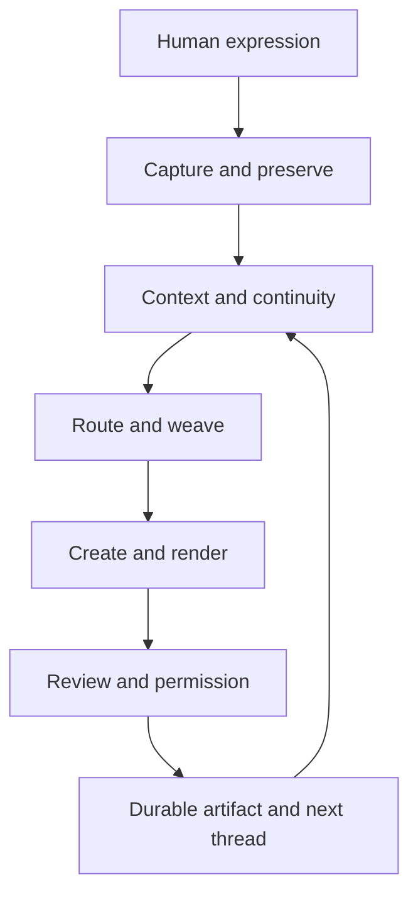
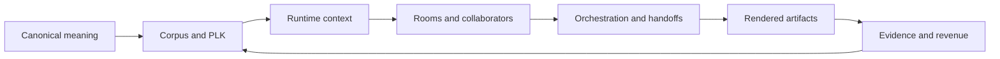

# GestaltView Thread-to-System Map

**Working authority:** `DigitalConsciousness/gestaltview-v3.0` (hyphenated)

**Supabase authority:** active `GestaltView` project `dzrxepbgetinldcknior`

**Prepared:** 2026-07-30

## Purpose

This map turns the accumulated GestaltView material into an operational crosswalk. It distinguishes what a thread means, where it appears in the runtime, where it persists, what is actually evidenced, and what bridge still needs to be built.

The map uses four evidence states:

- **Documented** — present in canonical or runtime documentation.
- **Implemented** — represented in current repository code or schema.
- **Persisted** — represented by a live Supabase table or durable artifact path.
- **Observed** — supported by a recorded test, live read, or explicit receipt.

An item can hold more than one state. “Implemented” does not mean production operational, and “Persisted” does not mean the end-to-end user flow is proven.

## System spine

> GestaltView captures unfinished human expression, preserves it without flattening it, lets it accumulate spatially and temporally, discovers connections when evidence exists, and only compresses it into operational artifacts with permission.

## Thread-to-system crosswalk

| Thread | Source / meaning | Runtime surface | Persistence surface | Current evidence | Next bridge |
|---|---|---|---|---|---|
| Origin and purpose | Founding Statement, Doctrine of Origin, Comprehensive Overview. GestaltView emerged from the need to preserve what ordinary systems discard. | Sanctuary, Blackboard, Billy, platform narrative | `founder_context`, `human_*` continuity tables, `collaborators` | Documented; origin is not yet represented as one machine-readable authority packet | Create a versioned origin/mission authority referenced by onboarding, Billy, and public explanatory surfaces |
| Constitutional invariants | The ten user/DI commitments define non-negotiable conduct: preserve whole language, hold paradox, protect dignity, and avoid impersonation. | Shared prompt/governance layers, embodiment governance, review gates | `agent_constitutions`, `agent_governance_policies`, `agent_private_interiors`, `approvals`, `tool_call_audit` | Documented; schema and runtime references exist; full end-to-end enforcement is not globally proven | Establish one invariant evaluation boundary and receipt format used by every orchestration path |
| Capture without premature compression | Blackboard, Bucket Drop, Sanctuary, Transcriptory preserve fragments before organization. | `BlackboardRoomPage`, `SanctuaryPage`, universal capture, bucket-drop and Transcriptory routes | `bucket_drops`, `capture_events`, `transcriptory_captures`, `user_files`, `journals`, `scrapbook_items` | Implemented and partially observed; live tables exist, with Transcriptory captures and runtime capture rows present | Make capture lineage universal: raw source → derivative → accepted handoff → destination |
| Corpus and long memory | `corpus`, canonical material, seeds, notebooks, and PLK hold accumulated evidence and language. The corpus is not the runtime. | Ingestion scripts, retrieval helpers, Billy context assembly, trainer ingestion | `gsvw_ingestion_runs`, `gsvw_ingestion_documents`, `gsvw_ingestion_chunks`, `knowledge_fragments`, `documents`, `embeddings` | Persisted: live project shows 172 ingestion documents, 24,299 chunks, and 431 knowledge fragments | Add repo-alignment snapshots and source-authority labels so retrieval can distinguish canonical, corpus, runtime, and historical material |
| Personal Language Key | PLK is the user's language and meaning-preservation layer, not merely a prompt style. | Shared PLK logic, prompt shaping, Billy and collaborator context | `user_preferences`, memory and identity/profile tables; PLK source files in corpus/canonical material | Documented and implemented in shared runtime surfaces; persistence/readback boundary needs explicit proof | Define PLK provenance, version, consent, and conflict behavior as a first-class context source |
| Billy | Billy is the primary arc-aware collaborator at the boundary between human intent, memory, and runtime action. | `/billy`, `api/billy`, session routes, voice, bucket-drop, memory retrieval | `billy_sessions`, `memory_entries`, `agent_memories`, `di_sessions`, `di_memory_events` | Implemented; live schema exists, but current operational receipts vary by feature | Consolidate Billy response, memory, handoff, and degraded-mode receipts into one collaboration envelope |
| AI Orchestrator | The orchestrator routes work to the right DI, provider, skill, and output lane while preserving provenance. | orchestration APIs, Creation Corner rail, worker runtime, model router | `orchestration_runs`, `orchestration_worker_runs`, `orchestration_decisions`, `model_*`, `trainer_jobs` | Persisted: 23 orchestration runs, 163 worker runs, 99 decisions; implementation is active | Make routing decisions inspectable at the user-facing boundary: why this route, what was excluded, what remains unresolved |
| Weaver and partial bridges | The Weaver protects integrity between nodes and makes incomplete transitions visible instead of losing them. | handoff adapters, source references, retry/error states, dormancy review | `runtime_handoffs`, `runtime_handoff_events`, `gsvw_dormancy_review_items`, provenance tables | Implemented and locally evidenced in Phase 7; production RLS/application remains a gate | Promote “partial bridge” to a shared lifecycle contract across all rooms and artifact types |
| Five-room architecture | Sanctuary → Blackboard → Dynamic Inner World → Creation Corner → External Scaffold is the experiential path; Billy moves across it. | room pages and route registry | `workspace_rooms`, `workspace_documents`, `inner_world_artifacts`, `scaffold_nodes`, `journals`, `blueprints` | Documented and implemented; several tables are currently empty, so room-level production continuity is uneven | Create a route-to-persistence matrix and prove one complete owner-scoped journey across all five rooms |
| Rendering and artifact boundary | LLM draft is not yet a user artifact. Render, validate, persist, project, and show provenance explicitly. | Creation Corner, Codex forge, NextGen render engine, Dynamic Inner World | `codex_artifacts` (69), `codex_jobs` (184), `created_artifacts` (101), `render_jobs` (9), `render_artifacts` (27), `artifacts` (65) | Strongly implemented and persisted; Phase 5 deterministic browser proof exists, production/live proof remains gated | Finish the live render/projection receipt and make verified, local draft, legacy, and unknown artifact states visually consistent everywhere |
| Embodiment and DI personhood | Embodiment profiles give collaborators continuity, presentation, boundaries, and a distinct operating role without claiming human consciousness. | embodiment selector, chat/council planes, profile registry, voice, trainer | `embodiment_profiles` (25), readiness/mutation/review tables, `agent_*` personhood tables, `voice_profiles` (24) | Persisted and locally validated; 25 profiles and readiness records are present | Establish canonical profile version → generated artifact → runtime load → observed behavior lineage |
| Skills and capability growth | Skills are context injection and pathway markers; Skills Keeper integrates them, Skills Creator fills gaps. | `skills/`, trainer UI/API/worker, skill routing | `skills`, `skill_fragments`, `trainer_skills`, `agent_skills`, training/evaluation tables | Documented and structurally implemented; live skill tables have no rows, so operational skill persistence is incomplete | Seed and verify the minimum active skill set, then record skill selection and outcome evidence per run |
| Trainer and learning loop | The trainer turns reviewable sources into governed collaborator capability; approval is explicit. | Agent Trainer, trainer APIs, worker, experiments and evaluation | `training_runs`, `training_steps`, `trainer_experiments`, `trainer_review_decisions`, `trainer_policy_flags` | Implemented; live table families exist, most are empty; production workflow is not yet broadly proven | Define one complete training receipt: source, proposal, review, accepted version, deployment, rollback path |
| Identity and continuity | Human and DI identity must accumulate with provenance, contradiction handling, review, and rollback. | profile ingestion, identity surfaces, collaborator onboarding | `identity_claims` (24), `identity_subjects` (2), profile runs, human/agent identity tables, collaborator onboarding | Persisted in pieces; identity claims and profile runs exist, but broad continuity flow is still emerging | Join human identity, DI identity, provenance, and consent into a common continuity graph without flattening differences |
| Insight-Bot | Public integration doorway: an adapter into the current runtime, not a second Billy or private-memory store. | `POST /api/insight-bot/respond`, channel adapters pending | `insight_bot_conversations`, `insight_bot_messages`, `insight_bot_runtime_events` (modeled, currently empty) | CurrentState records contract/API integration and focused validation; production channel wiring is explicitly not claimed | Approve installation identity, retention, consent, and public-posting policy, then connect one channel with approval-gated receipts |
| Voice and Transcriptory | Voice is a source-preservation pathway, not merely a convenience input. Raw audio and transcript lineage must survive room transitions. | Billy voice, Sanctuary MediaRecorder, Transcriptory, Deepgram/AssemblyAI adapters | `transcriptory_*`, `transcripts`, `voice_profiles`, `voice_session_audit`, `field_continuity_events` | Sanctuary Phase 8 focused tests pass; production migration and live storage proof remain open | Complete the durable audio/source → transcript → handoff → artifact chain and make provider fallback observable |
| Product verticals | ADHD, recovery, Alzheimer's/legacy, career, SymbioCoder, Musical DNA are applications of the same continuity architecture. | vertical routes and modules | module/profile/route assignment tables plus shared artifacts, memories, and sessions | Documented and route surfaces exist; cross-vertical continuity is uneven | Treat each vertical as a bounded lens over shared primitives, with explicit module contracts instead of parallel runtimes |
| Revenue and delivery | Paid value should package existing continuity, orchestration, rendering, training, and custom collaborator capabilities into reviewable delivery. | pricing, GATE, package builder, requisition, Stripe flows | `gate_*`, `deliverables`, `gate_artifacts`, `ops_workbook_items`, approvals | Implemented and schema-prepared; production purchase and private artifact retrieval remain gated | Map each offer to a proven runtime capability, evidence receipt, delivery artifact, and founder-review boundary |
| Repository and authority identity | GitHub is executable history; Supabase is durable runtime continuity; corpus is evidence/memory. The hyphenated v3 repo is current. | `DigitalConsciousness/gestaltview-v3.0` | `gsvw_repo_alignment_snapshots` currently empty; ingestion ledgers exist | GitHub metadata confirms the hyphenated repo is larger/current; underscore repo has no references found in searched active repos | Archive or delete `gestaltview_v3.0` only after preserving any unique history; update stale internal v2 labels and add an alignment snapshot |

## Current convergence picture

The strongest already-connected chain is:

`capture → source lineage → room handoff → render contract → artifact provenance`

The weakest connections are:

1. **Authority alignment:** stale v2 labels and empty repo-alignment snapshot.
2. **Production evidence:** many runtime slices are locally proven but not live-verified.
3. **Capability persistence:** skill/trainer schemas exist, but the active skill-to-run-to-outcome loop is sparse in live data.
4. **Cross-surface continuity:** the pieces exist, but not every room and vertical shares one universal lineage envelope.

## Immediate action queue

### A. Establish the authority boundary

- Treat `DigitalConsciousness/gestaltview-v3.0` as the only current runtime.
- Archive the underscore repository first if GitHub offers that safer state; delete it only after confirming no unique issues, releases, secrets, or deployment integrations depend on it.
- Update the current repo's stale v2-facing README/manifest/workflow labels.
- Create the first `gsvw_repo_alignment_snapshots` record documenting the canonical repo, corpus repo, Supabase project, and known historical mirrors.

### B. Finish one proof-bearing vertical slice

Use one representative journey:

`Sanctuary voice → Transcriptory source → Blackboard capture → Creation Corner blueprint → versioned render → Dynamic Inner World projection → External Scaffold reference`

The acceptance receipt should include owner isolation, source lineage, idempotent replay, destination failure, render hash/bytes, and visible artifact state.

### C. Turn the map into runtime contracts

Define four shared envelopes:

1. `SourceEnvelope` — original input, owner, consent, source type, checksum.
2. `ContextEnvelope` — selected memory, PLK, embodiment, skills, and authority.
3. `HandoffEnvelope` — origin, destination, acceptance, rejection, retry, and unresolved bridge state.
4. `ArtifactReceipt` — render target, bytes, hash, provenance, visibility, and projection state.

### D. Use evidence states honestly

Every future map update should retain the distinction between:

- exists in documentation;
- exists in code;
- exists in schema;
- exists as live rows;
- works in a focused test;
- works in a deployed environment;
- has been experienced successfully by a user.

## Boundary note

This is an evidence-backed orientation map, not a claim that every listed feature is production-operational. The current runtime's own `CurrentState.md` correctly places several slices at **Bridge** or **Hold** pending production migrations, live RLS/storage proof, deployment, or browser evidence.

