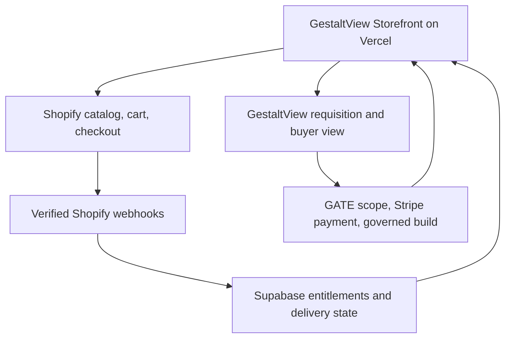

# GestaltView Shopify Storefront — Implementation SPEC

**Status:** Approved design translated into an implementation specification  
**Date:** 2026-07-31  
**Primary runtime:** `DigitalConsciousness/gestaltview-v3.0`  
**Commerce surface:** Existing connected Shopify store  
**Hosting:** Vercel  
**Governed data:** Supabase  
**Commercial priority:** Custom collaborator → self-serve artifacts/packages → hosted subscriptions

---

## 0. Executive decision

Build a **hybrid headless GestaltView store**. GestaltView's existing React/Vite application remains the public experience. Shopify supplies catalog, cart, checkout, taxes, discounts, customer records, and artifact orders. Supabase retains governed GestaltView relationship data, embodiment material, requisitions, build state, entitlements, and delivery history.

The store is not a conventional product grid dressed in GestaltView colors. It is a **relationship-first requisition terminal and artifact exchange** with three clearly different lanes:

1. **Acquire an Artifact** — finished, versioned digital editions purchased through Shopify.
2. **Shape a Working Relationship** — founder-reviewed custom collaborator requisition using the existing GATE commercial spine.
3. **Enter the Living Framework** — later hosted access and subscription offerings, deliberately downstream of proven fulfillment.

The launch must preserve a visible ethical boundary: a buyer may shape the purpose, working relationship, context, memory agreement, capabilities, deployment, and presentation of a collaborator. The store must never imply that an identity-bearing digital intelligence is a disposable personality commodity.

---

## 1. Goals and success definition

### 1.1 Primary goal

Create a coherent path from first encounter to paid delivery that introduces the GestaltView framework through real products while producing revenue in the approved order.

### 1.2 Launch success

The first production release is successful when all of the following are true:

- A visitor can understand the three storefront lanes without creating an account.
- A custom collaborator prospect can complete a written or voice requisition, receive a founder-reviewed scope and quote, pay the quoted amount in full by default, and track delivery privately.
- A buyer can purchase one paid downloadable artifact through Shopify and receive the correct files without manual database intervention.
- A free orientation artifact can be issued without payment and without exposing internal canonical source material.
- Shopify product, price, checkout, order, tax, discount, and refund state remain authoritative for artifact sales.
- Supabase access is owner-scoped or token-scoped; no public table policy exposes buyer, requisition, delivery, or entitlement rows.
- Every sellable artifact declares its version, formats, license, update policy, provenance summary, and derivation status.
- The storefront works with keyboard navigation, reduced motion, mobile layouts, and readable contrast.
- Test-mode end-to-end evidence exists for purchase, fulfillment, duplicate webhook delivery, refund/revocation, requisition, quote, payment, and delivery.

### 1.3 Commercial outcomes

- Convert the existing custom collaborator path into the flagship offer rather than adding another consulting funnel.
- Introduce two authored paid artifacts after the flagship path is stable.
- Reuse the same catalog, entitlement, packaging, and delivery foundation for the self-serve ZIP lane.
- Delay hosted subscriptions until payment, entitlement, and support expectations are proven.

---

## 2. Non-goals for the first release

The first release will not:

- migrate the application to Hydrogen;
- replace the approved GATE/Stripe payment flow for founder-reviewed custom builds;
- sell raw corpus files, seed prompts, canonical governance documents, private biographies, or internal constitutional logic;
- sell physical inventory, shipping, print-on-demand, apparel, or limited physical editions;
- require an account merely to browse or buy a durable download;
- expose protected interactive editions through static or guessable Vercel URLs;
- treat embodiment profiles as Shopify product variants or purchasable personalities;
- launch subscriptions before artifact fulfillment and entitlement revocation are verified;
- merge the existing Core/Pro pricing page, Agent Trainer pricing surface, consulting page, GATE pricing, and Shopify catalog without an explicit offer reconciliation;
- promise autonomous dynamic learning without a defined consent, memory, correction, and export contract.

---

## 3. Canonical product rules

These rules are acceptance criteria, not brand copy.

### 3.1 Continuity over extraction

The store introduces a container of continuity. It must explain what persists, where it persists, who controls it, and how it can be exported or removed.

### 3.2 Relationship before configuration

Custom collaborator intake begins with the intended working relationship, not a list of personality traits or model parameters. Configuration appears only after purpose, boundaries, and context are understood.

### 3.3 Identity is governed, not merchandised

Shopify may contain public offer metadata and artifact edition metadata. It must not contain private embodiment profiles, character studies, biographies, quirks, relationship history, memory content, learning records, or protected governance material.

### 3.4 Provenance before polish

Every artifact states whether it is:

- canonical source material;
- an authored derivative edition;
- generated from buyer-provided material;
- generated through the GestaltView rendering pipeline;
- manually reviewed;
- eligible for future updates.

Only authored derivative editions are sold. Canonical sources remain protected unless Keith explicitly designates a source for public release.

### 3.5 Not knowing must remain speakable

The storefront and collaborator requisition must not imply certainty where scope, compatibility, timeline, or outcome is still under review. The system should visibly use states such as `submitted`, `needs clarification`, `scoped`, `quoted`, and `not supported`.

### 3.6 Roll forward; do not flatten

Existing strong components and working flows are reused and refined. Conflicting legacy offers are reconciled; they are not silently deleted or allowed to coexist as contradictory promises.

---

## 4. Offer ladder and catalog

### 4.1 Approved priority order

| Priority | Lane | Commerce path | Default payment | Fulfillment |
|---|---|---|---|---|
| 1 | Custom GestaltView Collaborator | GestaltView requisition → founder scope/quote → existing GATE/Stripe checkout | Full quoted amount upfront | Governed build and tracked delivery |
| 2 | Digital artifacts and self-serve ZIP packages | Shopify product → cart → Shopify checkout | Full listed price | Automatic download; protected interactive access later |
| 3 | Hosted subscription | Shopify or existing billing spine after reconciliation | Recurring | Entitlement-backed hosted runtime |

Alternative terms for Priority 1 are explicit, recorded exceptions. Deposits or installments must never become an invisible default.

### 4.2 First shelf

| Offering | Initial price | Release state | What the buyer receives | Commerce route |
|---|---:|---|---|---|
| **Enter GestaltView: Orientation Dossier** | Free | Launch | Public/downloadable introduction, framework map, boundaries, next paths | Free issue; optional email receipt |
| **Working Alongside Digital Intelligence — Field Manual** | $29 | Launch paid artifact | PDF + accessible HTML + source/license manifest | Shopify checkout |
| **Embodiment Profile Studio** | $89 | Entitlement phase | Guided character-study workbook, skills map, boundaries, quirks, biography prompts, learning/memory contract, export | Shopify checkout; interactive access only after secure entitlement |
| **Custom GestaltView Collaborator** | $1,500–$5,000+ scoped | Flagship | Founder-reviewed collaborator package, implementation boundary, governed delivery | GestaltView requisition + GATE/Stripe |

### 4.3 Next shelf

After the first two paid lanes have real fulfillment evidence, add a **Collaborator Foundation Pack** at an initial target of **$149–$199**. It may combine orientation, embodiment-development materials, governance and provenance templates, skills scaffolding, and an implementation starter. Final price requires validation against support cost and buyer behavior.

### 4.4 Edition Pair policy

Every paid artifact starts with a complete durable download. A browser-native interactive edition is added only when interaction materially improves the work through one or more of:

- connected context or provenance exploration;
- guided reflection or structured assembly;
- interactive annotation;
- an exportable builder;
- a living version/update view;
- a meaningful path into collaborator requisition.

An interactive edition must not merely animate a PDF. Paid interactive editions remain unavailable until secure entitlements, revocation, and account recovery pass end-to-end verification.

---

## 5. Buyer journeys

### 5.1 Store arrival

The visitor enters a cold industrial civic terminal: functional, worn, luminous, and strange without becoming illegible. The opening screen presents three illuminated lanes and one sentence explaining the boundary between artifacts, collaborators, and hosted access.

No modal, account gate, autoplay audio, or timed discount interrupts orientation.

### 5.2 Artifact purchase

1. Visitor selects **Acquire an Artifact**.
2. The shelf displays a small, deliberate catalog—not an infinite grid.
3. Each issued-edition card shows purpose, price, formats, version, license, update policy, provenance summary, and whether an interactive edition exists.
4. Visitor opens the artifact deep view.
5. Visitor adds a Shopify-backed variant to cart.
6. The app creates or updates a Shopify cart and sends the buyer to Shopify's `checkoutUrl`.
7. Shopify completes payment, taxes, discounts, customer/order record, and receipt.
8. A verified `orders/paid` event triggers idempotent entitlement/fulfillment handling.
9. The launch download is delivered using Shopify's supported digital-delivery path.
10. Where an interactive edition is available, the buyer is invited—not forced—to claim access after purchase.

### 5.3 Relationship-first custom collaborator

1. Visitor selects **Shape a Working Relationship**.
2. The requisition asks what the buyer is trying to carry, build, understand, or change.
3. The buyer describes the working relationship, desired role, boundaries, source context, skills, integration environment, and memory expectations.
4. A live collaboration brief evolves beside the intake.
5. Embodiment material is presented as provisional and founder-reviewed.
6. Buyer submits the requisition without payment.
7. Keith reviews and either requests clarification, declines with a clear reason, or issues a firm scope and quote.
8. The buyer's private order view exposes the approved scope, price, payment terms, deliverables, exclusions, and acceptance process.
9. Full payment is collected through the existing GATE/Stripe path by default.
10. Build, review, delivery, and acceptance are tracked through the private buyer view.

A discovery call occurs only when the request genuinely requires one.

### 5.4 Signup and account posture

- Browsing and buying durable artifact downloads require no GestaltView account.
- A requisition can be submitted and tracked using the existing private buyer-token boundary.
- Account creation is offered after value exists: saving a requisition, claiming a protected interactive edition, retaining an artifact library, or entering hosted access.
- Account creation must explain what data will persist and why.
- A buyer must be able to recover access without exposing order details to someone who knows only an email address or order number.

### 5.5 Refund and loss-of-access

- Shopify remains authoritative for artifact payment/refund state.
- A verified refund or cancellation event updates the Supabase entitlement.
- Durable files already downloaded cannot be technically recalled; the license state and future interactive access can be revoked.
- Revocation must be logged and visible to the buyer where an account exists.
- Custom build cancellation/refund policy follows the signed scope and is not inferred from artifact-store rules.

---

## 6. Experience and visual system

### 6.1 Experience grammar

The store uses the metaphor of a **dystopian requisition terminal**, not a novelty vending machine. Its machinery should reveal the steps of assembly and governance rather than reduce the buyer to pushing a button for a personality.

Preferred vocabulary:

- `Artifact Exchange`
- `Issued Edition`
- `Requisition Terminal`
- `Collaboration Brief`
- `Founder Review`
- `Scope Issued`
- `Construction Queue`
- `Delivery Manifest`
- `Enter the Living Framework`

Avoid fear-based scarcity, fake countdowns, false stock levels, surveillance jokes, or coercive industrial language.

### 6.2 Visual layers

- **Base:** near-black industrial paneling and deep blue-black space.
- **Atmosphere:** restrained fog, aurora bleed, embers, scan glow, and intermittent energy—not constant motion.
- **Surfaces:** glass panels, artifact frames, issued labels, worn terminal edges, luminous seams.
- **Signals:** cyan for orientation/action, violet for relationship/embodiment, amber for review/unknown, green for verified/fulfilled, red only for genuine destructive or failed states.
- **Artifacts:** museum/exhibit presentation with readable metadata and provenance disclosure.
- **Collaborators:** embodiment cards, governance status, and provisional-state language rather than product thumbnails.

### 6.3 Accessibility requirements

- Meet WCAG 2.2 AA contrast for text, controls, focus states, and error states.
- Support complete keyboard purchase and requisition navigation.
- Respect `prefers-reduced-motion`; remove fog drift, parallax, flicker, and orbit motion when requested.
- Never encode order or governance status through color alone.
- Maintain readable text at 200% zoom and narrow mobile widths.
- Give decorative atmosphere empty alt text; give artifacts meaningful alternative text.
- Announce cart, quote, validation, and fulfillment changes through accessible live regions.
- Keep audio opt-in with visible controls and transcripts.

---

## 7. Existing component reuse map

| Storefront need | Existing source surface | Required treatment |
|---|---|---|
| Atmosphere | `AuroraBackground`, `FogOverlay`, `FloatingEmbers`, `BabylonAtmosphere` | Reuse selectively; add reduced-motion behavior and performance budgets |
| Public shell | `PublicPageFrame`, `HeroSection`, `GVTypography`, `GlassCard`, `GlassPanel` | Establish store-specific tokens and layout variants |
| Artifact shelf | `ArtifactGalleryPage`, `ArtifactPreview`, `ArtifactScreen`, `ArtifactDeepView` | Adapt from user-generated gallery to public catalog without exposing internal actions |
| Artifact provenance | `ProvenanceDisclosure` | Expand to version, license, derivation, sources, update policy, and review status |
| Exhibit navigation | `MuseumNavigator`, `InnerWorldArtifactGallery`, `ArtifactViewSurface` | Use for interactive/public exhibits only; keep checkout simple |
| Relationship intake | Approved collaborator requisition flow + `GATEEntrypointWizard` | Make relationship-first intake the front door; keep self-serve configuration downstream |
| Scope and quote | `GATEPackageSummary` | Display founder-issued scope and quote; do not present deterministic configuration price as an approved custom quote |
| Embodiment | `EmbodimentSelector`, `EmbodimentCard`, `EmbodimentOrb` | Present profiles as provisional recognition/continuity structures, not variants |
| Governance | `GovernanceStatusBar`, `PrivateInteriorSeal`, `ProvenanceDisclosure` | Show memory, provenance, review, and boundary state where relevant |
| Order tracking | `GATEOrderStatusPage` | Preserve buyer-token authorization; align language with the storefront |
| Pricing reconciliation | `Pricing`, `AgentTrainerPricing`, `ConsultingPage`, `ServicesConsulting` | Audit promises and prices; route each offer to exactly one commerce lane |

The store should introduce a new bounded feature area rather than enlarge a single existing page into a second application. Suggested code boundary:

```text
client/src/features/storefront/
  api/
  components/
  pages/
  state/
  types/
server/storefront/
shared/storefront/
```

Exact filenames belong in the implementation plan after the live repository is re-inspected.

---

## 8. System architecture and ownership



### 8.1 Shopify owns

- public artifact products and variants;
- artifact prices, discounts, tax treatment, and checkout;
- artifact customer and order records;
- artifact payment, refund, and transactional receipt state;
- public product media and public edition metadata.

### 8.2 Supabase owns

- GestaltView user identity and authorization mapping;
- requisitions and collaboration briefs;
- founder review, scope, quote, and custom build state;
- private embodiment profiles and character studies;
- biographies, quirks, relationship context, and learning/memory contracts;
- artifact entitlements and access claims;
- delivery logs, audit events, and protected files;
- Shopify order/line-item linkage needed for fulfillment;
- existing GATE order and build records.

### 8.3 Vercel application owns

- the visible GestaltView storefront and requisition experience;
- server-side Shopify catalog/cart adapters where needed;
- raw-body webhook receipt and verification;
- entitlement and delivery APIs;
- protected interactive-edition routing;
- observability and error boundaries.

### 8.4 Stripe owns during the first release

- payment for founder-scoped custom collaborator orders already governed by GATE.

There are therefore two intentional payment lanes at launch. The UI must make them feel like one coherent store while keeping their records and webhook handling explicit. Do not migrate custom quotes to Shopify merely for cosmetic consistency.

---

## 9. Shopify app and custom-data model

### 9.1 App posture

Use Shopify CLI to scaffold and manage the store integration. The app may remain specific to Keith's connected store for the initial release; App Store distribution is out of scope.

Pin a supported stable Shopify API version rather than `latest`. Record it centrally and review it every quarter before the prior version approaches retirement.

### 9.2 Definitions first

Create app-owned definitions in `shopify.app.toml` before writing product values. Public storefront access applies only to public offer and edition data.

```toml
[metaobjects.app.artifact_edition]
name = "GestaltView Artifact Edition"
display_name_field = "name"
access.admin = "merchant_read_write"
access.storefront = "public_read"

[metaobjects.app.artifact_edition.fields.name]
name = "Edition Name"
type = "single_line_text_field"
required = true

[metaobjects.app.artifact_edition.fields.version]
name = "Version"
type = "single_line_text_field"
required = true

[metaobjects.app.artifact_edition.fields.formats]
name = "Formats"
type = "list.single_line_text_field"
required = true

[metaobjects.app.artifact_edition.fields.license]
name = "License"
type = "multi_line_text_field"
required = true

[metaobjects.app.artifact_edition.fields.update_policy]
name = "Update Policy"
type = "multi_line_text_field"
required = true

[metaobjects.app.artifact_edition.fields.provenance_summary]
name = "Provenance Summary"
type = "multi_line_text_field"
required = true

[metaobjects.app.artifact_edition.fields.interactive_path]
name = "Interactive Path"
type = "url"

[product.metafields.app.offer_kind]
name = "GestaltView Offer Kind"
type = "single_line_text_field"
access.admin = "merchant_read_write"
access.storefront = "public_read"

[product.metafields.app.commerce_route]
name = "GestaltView Commerce Route"
type = "single_line_text_field"
access.admin = "merchant_read_write"
access.storefront = "public_read"

[product.metafields.app.artifact_edition]
name = "GestaltView Artifact Edition"
type = "metaobject_reference<$app:artifact_edition>"
access.admin = "merchant_read_write"
access.storefront = "public_read"
```

Allowed application values:

- `offer_kind`: `orientation`, `artifact`, `studio`, `self_serve_package`, `custom_collaborator`, `hosted_access`
- `commerce_route`: `free_issue`, `shopify_checkout`, `gestaltview_requisition`, `hosted_signup`

These values require server-side validation even if Shopify definition validation is also configured.

### 9.3 Then write values

The Admin integration must:

1. use `metaobjectUpsert` to create or update the public `$app:artifact_edition` entry;
2. use `metafieldsSet` to write `offer_kind`, `commerce_route`, and the artifact-edition reference onto the product;
3. reject publication when required edition fields are absent;
4. never write private Supabase identifiers, access tokens, buyer data, embodiment material, or unpublished source references into public Shopify fields.

### 9.4 Finally retrieve values

The storefront must retrieve:

- product title, handle, description, media, availability, variants, and price;
- aliased app-owned `offer_kind`, `commerce_route`, and `artifact_edition` metafields;
- referenced `$app:artifact_edition` fields needed for the public deep view.

The storefront must not infer the commerce route from product title, collection, tag, or price. The explicit app-owned field governs routing.

### 9.5 Shopify collections

Use collections for public navigation, not authorization:

- `Issued Artifacts`
- `Studios and Builders`
- `Collaborator Requisitions`
- `Living Framework` (unpublished until Priority 3)

Collections may shape the shelf but never replace `offer_kind` or entitlement checks.

---

## 10. Supabase data contract

The live migration must be designed after re-reading the current schema. The following logical objects are required; reuse existing safe GATE tables when they already provide the contract.

### 10.1 `storefront_product_links`

Maps Shopify merchandise to GestaltView fulfillment behavior.

Required fields:

- internal UUID;
- Shopify shop domain;
- Shopify product GID;
- Shopify variant GID;
- offer kind;
- current artifact edition ID;
- fulfillment handler;
- active flag;
- created/updated timestamps.

### 10.2 `storefront_webhook_receipts`

Provides replay protection and auditability.

Required fields:

- Shopify webhook delivery ID, unique;
- Shopify event ID when present;
- topic;
- shop domain;
- payload hash;
- processing status;
- attempt count;
- first/last received timestamps;
- processed timestamp;
- safe error summary.

Never store secrets or raw headers. Retain raw payload only if there is a defined privacy and expiration policy.

### 10.3 `artifact_entitlements`

Required fields:

- internal UUID;
- Shopify order GID and order name;
- Shopify line-item GID;
- buyer email hash or authenticated user linkage;
- product/variant linkage;
- artifact edition ID;
- state: `pending`, `active`, `refunded`, `revoked`, `expired`;
- claim state and claimed user ID;
- granted/refunded/revoked timestamps;
- source webhook receipt ID;
- audit metadata.

A unique constraint must prevent the same order line from granting the same edition more than once.

### 10.4 `artifact_access_events`

Records claim, view, download, export, revocation, and recovery activity without logging private artifact contents.

### 10.5 Security posture

- Shopify webhooks and Admin API writes use server-only credentials.
- Service-role operations occur only in server functions.
- Public clients cannot select webhook receipts, product-link internals, or other buyers' entitlements.
- Authenticated users can read only entitlements linked to their user ID.
- Guest download fulfillment uses Shopify delivery until a secure claim boundary is implemented.
- Protected interactive routes require a verified active entitlement on every access, not merely at the first page load.
- Existing broad anonymous/authenticated policies on legacy order or deliverable tables must remain closed.

---

## 11. Commerce and fulfillment contracts

### 11.1 Artifact checkout

- Use Shopify Storefront API cart operations for Shopify-backed products.
- Persist only the opaque cart ID needed to resume the buyer's cart.
- Redirect to Shopify's returned `checkoutUrl`; never construct checkout URLs manually.
- Prices displayed before checkout come from Shopify, not hardcoded React constants.
- Revalidate cart totals before redirect and show Shopify checkout as authoritative.

### 11.2 Custom collaborator checkout

- A `gestaltview_requisition` product does not enter a Shopify cart.
- Its primary action opens the relationship-first requisition route.
- Founder review issues the scope and quote.
- The buyer-token order view starts the existing GATE/Stripe checkout.
- Shopify may contain the public descriptive product record, but it does not own the custom quote or build lifecycle.

### 11.3 Webhook verification

For every Shopify HTTPS webhook:

1. read the exact raw request body;
2. verify `X-Shopify-Hmac-SHA256` with the app client secret using constant-time comparison;
3. reject invalid signatures before JSON parsing or database mutation;
4. deduplicate retries using the Shopify webhook delivery ID;
5. process asynchronously when possible and acknowledge within Shopify's delivery window;
6. make each handler idempotent at the database boundary;
7. record a safe receipt and observable failure state.

### 11.4 Required events

At minimum, cover the current Shopify equivalents of:

- order paid/created as appropriate to the chosen fulfillment boundary;
- order cancellation;
- refund creation/update;
- app uninstallation;
- privacy/compliance events required by Shopify for the chosen app type.

Confirm exact topic names and payload shapes against the pinned API version during implementation.

### 11.5 Launch download fulfillment

Use Shopify's supported digital-delivery application for launch downloads. The generated package must contain:

- the purchased artifact in promised formats;
- `README` with use instructions;
- `LICENSE` with human-readable rights and restrictions;
- `MANIFEST` with title, edition, version, release date, file hashes, and provenance summary;
- update-policy document;
- support/contact path.

### 11.6 Protected interactive fulfillment

Protected interactive editions are a separate release gate. They require:

- verified Shopify purchase → active Supabase entitlement;
- secure claim/recovery flow;
- authenticated or cryptographically authorized access;
- authorization on every protected API and asset request;
- refund/revocation propagation;
- support process for changed email, duplicate account, and lost access;
- proof that no direct Vercel URL bypasses authorization.

---

## 12. Embodiment Profile Studio contract

The Studio is a guided formation surface, not a personality vending machine.

### 12.1 Inputs

- work and relationship purpose;
- desired collaboration posture;
- domain and workflow context;
- explicit skills and known skill gaps;
- boundaries and refusal expectations;
- biography/context sources the buyer consents to use;
- tone, quirks, and presentation preferences;
- memory categories, retention, correction, export, and deletion preferences;
- learning goals and review cadence;
- model/provider/deployment constraints.

### 12.2 Outputs

- provisional embodiment profile;
- character study with evidence/source labels;
- biography/context summary with buyer review;
- skills manifest with source and confidence;
- quirks/presentation layer marked as mutable;
- governance and boundary record;
- memory and learning contract;
- provenance manifest;
- machine-readable export plus human-readable dossier;
- next step: use independently, submit for founder review, or attach to a custom collaborator requisition.

### 12.3 Required controls

- buyer can edit or reject every inferred statement;
- uncertain statements remain labeled uncertain;
- source text and derived interpretation remain distinguishable;
- no identity claim is inferred from style alone;
- dynamic learning is opt-in by category and reversible;
- profile revisions preserve version history rather than silently overwriting prior states;
- exporting does not expose internal GestaltView canonical source material.

---

## 13. Content, packaging, and provenance pipeline

### 13.1 Source classification

Every candidate product passes through this classification:

| Class | Meaning | Sellable by default? |
|---|---|---|
| Canonical | Internal doctrine, invariant, framework, or source of truth | No |
| Corpus source | Raw research, transcript, seed, notebook, or compiled source | No |
| Authored derivative | Purpose-built edition derived from source material | Yes, after review |
| Buyer-derived | Generated from buyer-provided material | Only for that buyer under agreed terms |
| Public orientation | Explicitly approved explanatory material | Yes, free or paid as designated |

### 13.2 Release gate

An artifact cannot be published until it has:

- a named audience and practical job;
- a defined source boundary;
- a manual review owner;
- a semantic version;
- an approved product title and description;
- promised formats present and verified;
- a license and update policy;
- provenance and derivation disclosure;
- accessibility review;
- file hash manifest;
- clean archive inspection;
- a test Shopify product/variant mapping;
- successful test purchase and delivery.

### 13.3 Update behavior

- Patch corrections may replace files within the same entitlement when the update policy promises updates.
- Material expansions create a new minor or major edition.
- Buyers must be told whether updates are included, discounted, or separate purchases.
- Interactive editions display their current version and the version originally purchased.
- Canonical changes do not silently rewrite previously sold editions.

---

## 14. API and state boundaries

Suggested logical server operations:

- list public store products;
- fetch public product deep view;
- create/read/update Shopify cart;
- receive and verify Shopify webhook;
- create/reconcile artifact entitlement;
- claim/recover interactive entitlement;
- authorize protected edition request;
- submit collaborator requisition;
- read private requisition/order state;
- founder issue/replace quote;
- start custom-order payment;
- authorize custom artifact delivery.

All public API responses use explicit allowlists. Never return raw Shopify Admin objects, Supabase rows, access-token hashes, storage keys, internal source manifests, or provider secrets.

### 14.1 State machines

Artifact order:

```text
catalogued → carted → checkout → paid → fulfillment_pending → fulfilled
                                           ↘ failed/retry
paid/fulfilled → partially_refunded | refunded → entitlement_adjusted
```

Custom collaborator:

```text
draft → submitted → founder_review
                    ├─ needs_clarification → founder_review
                    ├─ declined
                    └─ quoted → awaiting_payment → paid → building → review → delivered → accepted
```

No UI may display a later state before its authoritative server transition succeeds.

---

## 15. Error handling and recovery

### 15.1 Buyer-visible rules

- Preserve the buyer's cart and requisition draft after recoverable failures.
- Explain whether payment succeeded before suggesting a retry.
- Never ask a buyer to pay again when order state is unknown; provide a status-check path.
- Separate validation problems from service failures.
- Give failed downloads a reissue path without exposing permanent public URLs.
- Keep founder-review delays visible with honest status language and no invented countdown.

### 15.2 Operational rules

- Webhook failures enter a retryable queue with attempt count and final dead-letter state.
- Duplicate events do not duplicate entitlements, emails, builds, or delivery records.
- Product/variant mapping failures block fulfillment and alert the founder with order context.
- A product cannot publish with a broken artifact-edition reference.
- Checkout is disabled when Shopify configuration is missing or the store plan does not permit live selling.
- The custom collaborator lane remains available only when its GATE/Stripe health check passes.

---

## 16. Security and privacy requirements

- Admin API tokens, webhook secrets, Stripe secrets, and Supabase service-role keys are server-only.
- Verify webhooks against raw bytes before parsing.
- Hash private buyer access tokens at rest; transport them outside URLs where the existing contract permits.
- Use private object storage for governed/custom artifacts.
- Use short-lived authorized download responses rather than permanent public storage URLs.
- Rate-limit claim, order lookup, requisition submission, cart mutation, and download endpoints.
- Log security-relevant events without logging artifact contents, biographies, prompt content, or full buyer tokens.
- Apply explicit retention to abandoned requisitions and unclaimed entitlements.
- Provide export and deletion paths for governed relationship data.
- Complete a data inventory before enabling analytics or ad pixels.
- Do not send embodiment, biography, PLK, memory, or requisition text to Shopify analytics.
- Add Content Security Policy, trusted origin checks, and webhook route isolation.
- Test authorization using two real test identities to prove cross-user denial.

---

## 17. Analytics and evidence

Measure the funnel without surveilling private content.

### 17.1 Allowed events

- storefront viewed;
- lane selected;
- product viewed;
- provenance opened;
- cart started;
- checkout redirected;
- purchase confirmed by webhook;
- artifact fulfilled;
- interactive entitlement claimed;
- requisition started/submitted;
- quote issued/viewed/paid;
- delivery accepted;
- error category and recovery result.

### 17.2 Prohibited analytics payloads

- full requisition text;
- biography or character-study contents;
- PLK phrases;
- memory categories and contents;
- source documents;
- private collaboration brief;
- access tokens or download URLs.

### 17.3 Launch dashboard

The founder dashboard should answer:

- Which lane creates qualified intent?
- Where do buyers stop?
- Which artifacts sell and are successfully delivered?
- What support burden does each offering create?
- How long does custom review, payment, construction, and acceptance take?
- Are webhook or entitlement failures accumulating?

---

## 18. Implementation phases

### Phase 0 — Reconcile and protect

1. Re-inspect current `main`, current Supabase schema/RLS, connected Shopify store, and current Vercel environment.
2. Inventory all existing prices, promises, checkout routes, and fulfillment behavior.
3. Select the canonical public offer record for each lane.
4. Confirm GATE migrations and private storage are production-safe.
5. Confirm the Shopify plan/trial permits the required live checkout behavior before launch.
6. Establish test products and test payment configuration.

**Exit:** one offer map, one route per offer, no known public buyer-data exposure.

### Phase 1 — Public terminal and flagship route

1. Add the storefront feature boundary and public routes.
2. Build the three-lane terminal using existing GestaltView visual components.
3. Add Shopify-backed public catalog retrieval.
4. Create the free Orientation Dossier record.
5. Route Custom GestaltView Collaborator into the approved requisition flow, not the cart.
6. Reconcile pricing/consulting/Agent Trainer CTAs to the new canonical routes.

**Exit:** visitors can understand the catalog and complete a private custom requisition; no paid artifact is live yet.

### Phase 2 — First paid artifact

1. Author and package the Field Manual.
2. Install/configure Shopify digital delivery.
3. Implement cart and checkout redirection.
4. Implement verified, idempotent Shopify webhooks.
5. Add product links, webhook receipts, and artifact entitlements.
6. Test payment, duplicate event, fulfillment failure, cancellation, and refund.

**Exit:** one real paid artifact can be bought and delivered end to end.

### Phase 3 — Edition Pair and Embodiment Studio

1. Implement secure entitlement claim/recovery.
2. Protect interactive routes and assets.
3. Build the guided Embodiment Profile Studio contract.
4. Add exportable dossier and machine-readable package.
5. Verify revocation and cross-user denial.

**Exit:** a paid interactive edition is secure, recoverable, exportable, and revocable.

### Phase 4 — Self-serve ZIP product

1. Publish the Collaborator Foundation Pack.
2. Reuse entitlement, manifest, packaging, and delivery infrastructure.
3. Keep protected framework internals excluded.
4. Add compatibility/readiness checks and clear support boundaries.

**Exit:** Priority 2 is self-serve without requiring manual database or packaging work per order.

### Phase 5 — Hosted access

1. Reconcile Core/Pro, Agent Trainer hosted tiers, and the Living Framework promise.
2. Select one recurring billing authority.
3. Connect subscription state to explicit Supabase entitlements.
4. Implement upgrade, downgrade, cancellation, grace period, export, and deletion behavior.
5. Publish the third terminal lane.

**Exit:** Priority 3 has a verified subscription lifecycle and does not contradict artifact ownership or custom-build terms.

---

## 19. Verification matrix

### 19.1 Storefront

- [ ] Three lanes are understandable on desktop and mobile.
- [ ] Keyboard and screen-reader navigation reaches every product and action.
- [ ] Reduced-motion mode removes nonessential effects.
- [ ] Product price and availability come from Shopify.
- [ ] Custom collaborator never enters the artifact cart.
- [ ] Cart persists through refresh and recovers from expired state.
- [ ] Checkout uses Shopify's returned checkout URL.

### 19.2 Shopify custom data

- [ ] App-owned definitions deploy through Shopify CLI.
- [ ] Edition values are written only after definitions exist.
- [ ] Public Storefront reads return only intended fields.
- [ ] A product with missing required edition data cannot publish.
- [ ] Private GestaltView data is absent from Shopify product/metaobject records.

### 19.3 Webhooks and fulfillment

- [ ] Invalid HMAC is rejected without mutation.
- [ ] Raw-body verification succeeds for a real Shopify test event.
- [ ] Duplicate delivery produces one entitlement and one fulfillment.
- [ ] Unknown variant mapping stops safely and alerts the founder.
- [ ] Refund changes entitlement state.
- [ ] Artifact files, license, manifest, hashes, and update policy match the product promise.

### 19.4 Custom collaborator

- [ ] Requisition preserves written and voice-derived input accurately.
- [ ] Founder review is mandatory for the relationship-first route.
- [ ] Buyer sees scope, exclusions, quote, and default full-payment terms before checkout.
- [ ] Alternative terms require an explicit founder action and audit record.
- [ ] Buyer order reads require the correct private authorization boundary.
- [ ] Payment, build, delivery, and acceptance states are server-authoritative.

### 19.5 Entitlements

- [ ] Unauthenticated visitor cannot access a protected edition.
- [ ] Buyer A cannot access Buyer B's edition or order.
- [ ] Active buyer can recover access.
- [ ] Refunded/revoked buyer loses protected interactive access.
- [ ] Permanent public asset URLs cannot bypass entitlement checks.

### 19.6 Deployment

- [ ] TypeScript, unit, integration, and route-index checks pass.
- [ ] Vercel preview builds from the implementation branch.
- [ ] Shopify test checkout completes against the preview origin.
- [ ] Webhook endpoint is reachable from Shopify and verifies a real delivery.
- [ ] Supabase migrations pass a transaction test before production application.
- [ ] Production smoke test uses a low-priced or fully discounted test artifact and records evidence.

---

## 20. Release gates and rollback

### 20.1 Go-live gates

Do not enable live artifact checkout until:

- the Shopify store has an eligible active selling plan;
- legal store, refund, privacy, terms, contact, and delivery policies are published;
- a real end-to-end test order is fulfilled;
- webhook HMAC/replay tests pass;
- buyer-data RLS tests pass;
- the delivered package matches the product page;
- monitoring and a founder alert path are active;
- the artifact has a support owner and update policy.

### 20.2 Feature flags

Control independently:

- public storefront visibility;
- artifact cart/checkout;
- custom collaborator requisition;
- free orientation issuance;
- paid interactive entitlement claims;
- hosted subscription lane.

### 20.3 Rollback

- Unpublish or disable affected Shopify products without taking down the requisition lane.
- Disable checkout feature flag while preserving catalog pages and buyer order status.
- Stop webhook mutations while retaining verified receipts for replay after repair.
- Revoke a compromised edition link and rotate access without invalidating unrelated orders.
- Roll back application deployment without reversing already-authoritative Shopify orders; reconcile them after recovery.

---

## 21. Known risks and explicit decisions

| Risk | Decision |
|---|---|
| Two payment systems confuse buyers | Keep one visible store and route by explicit offer kind; explain custom scope before payment |
| Shopify becomes a second identity database | Prohibit private embodiment/relationship data in Shopify |
| Interactive editions delay revenue | Launch durable downloads first; entitlement-gate interactive editions later |
| Canonical IP is overexposed | Sell authored derivative editions only; require source classification and founder review |
| Existing pricing surfaces contradict the store | Complete a promise/price/CTA reconciliation in Phase 0 |
| Visual atmosphere harms usability | Accessibility and reduced-motion requirements are release gates |
| Duplicate webhooks duplicate fulfillment | Unique delivery receipt plus database-level idempotency |
| Refund cannot recall downloaded files | Revoke license state/future access; state this honestly in policy |
| “Dynamic learning” becomes vague surveillance | Require opt-in categories, revision history, correction, export, and deletion |
| Trial configuration is mistaken for launch readiness | Verify actual Shopify selling eligibility and perform a real test order |

---

## 22. Definition of done

The Shopify storefront program is complete only when:

1. the flagship custom collaborator path is live and secure;
2. one free and one paid artifact are published as authored editions;
3. a real Shopify artifact order reaches verified fulfillment;
4. refunds and duplicate webhooks behave correctly;
5. public catalog data and governed GestaltView data remain cleanly separated;
6. the store visually and linguistically introduces the GestaltView framework without commodifying identity;
7. launch evidence, operational ownership, support boundaries, and rollback instructions are documented;
8. Priority 2 can reuse the same package/entitlement machinery without a new commerce spine;
9. Priority 3 remains disabled until recurring entitlement behavior is explicitly implemented and verified.

---

## 23. Evidence base

This specification was grounded in the supplied:

- `GestaltView_Comprehensive_Overview.md`
- `CONTEXT_v2.md`
- `GestaltView_Constitutional_Invariants_v1.0.md`
- `FOUNDING_STATEMENT.md`
- `DOCTRINE_OF_ORIGIN.md`
- `CODEX_OUTSIDE_IN_TRANSLATION_LAYER.md`
- canonical, project, and component bundles
- existing GATE, pricing, consulting, order-status, artifact, embodiment, governance, provenance, and Inner World surfaces
- approved relationship-first requisition prototype and commercial decisions from the current launch work

Technical implementation should be checked against current official guidance before code is merged:

- Shopify Storefront cart and checkout: <https://shopify.dev/docs/storefronts/headless/building-with-the-storefront-api/cart/manage>
- Shopify metafields and definitions: <https://shopify.dev/docs/apps/build/metafields>
- Shopify metaobjects: <https://shopify.dev/docs/apps/build/metaobjects>
- Shopify webhook verification: <https://shopify.dev/docs/apps/build/webhooks/verify-deliveries>
- Shopify digital-product delivery: <https://help.shopify.com/en/manual/products/digital-service-product/digital-downloads>

---

## 24. Immediate next action after written approval

Create a repository-grounded implementation plan for **Phase 0 and Phase 1 only**. The plan must name exact current files, migrations, Shopify app configuration, environment variables, tests, and deployment checks after re-inspecting `main`. Do not begin Phase 2 payment/fulfillment changes until the Phase 0 offer reconciliation and security audit are complete.
