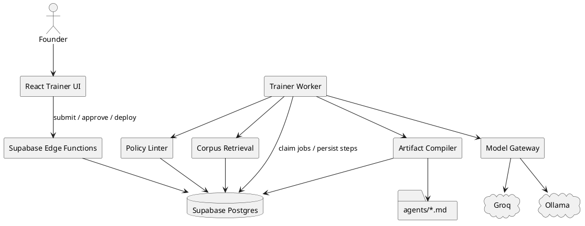
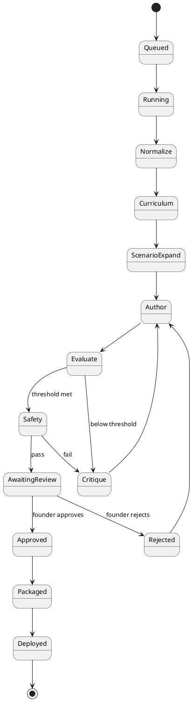

# SPEC-1-GestaltView-Agent-Trainer

## Background

GestaltView already has the beginnings of an agent trainer: a recursive workflow that selects an agent seed, generates an agent definition, evaluates it against scenarios, and refines it over multiple cycles. That proves the core product instinct is right: agents in the GestaltView ecosystem should not be static prompts, but living artifacts that can be trained, critiqued, and improved through structured loops.

The current implementation, however, is still closer to an interactive prototype than a durable system of record. Training logic is concentrated in a single UI component, model calls are issued directly from the client, evaluation is transient, and resulting agent definitions are downloaded manually rather than versioned, benchmarked, and promoted through an auditable lifecycle. This creates friction for scaling beyond a handful of handcrafted agents.

At the same time, the broader GestaltView platform already contains the ingredients needed for a much more powerful trainer: a canonical `agents/*.md` registry, a multi-agent product vision, a Supabase-backed ingestion and corpus pipeline, Billy as the core intelligence layer, and emerging tribunal / evaluation patterns. The opportunity is to turn the trainer into a first-class internal product that can create, test, compare, approve, and deploy specialized agents with strong lineage, domain grounding, and quality control.

The proposed system therefore treats agent training as a governed pipeline rather than a one-shot generation task. It should support scenario libraries, evaluation rubrics, dataset-backed training runs, versioned agent specs, human review checkpoints, and orchestration across specialized subagents such as curriculum design, simulation, critique, safety review, and deployment packaging. In effect, GestaltView can evolve from “a place with agents” into “a system that systematically manufactures high-quality agents.”

## Requirements

### Must have

- **Provider-independent training runtime.** The system must not depend on Anthropic APIs or Anthropic-specific prompt semantics. All model interaction must go through a provider abstraction layer that supports at minimum Ollama for local or self-hosted inference and Groq for remote low-cost inference. The runtime must support the full lifecycle of agent creation: brief intake, curriculum generation, scenario generation, draft agent creation, evaluation, refinement, review, approval, and deployment packaging.
- **Supabase as system of record.** Training runs, prompts, datasets, eval results, model/provider metadata, agent versions, approvals, and deployment status must be stored in Supabase so that work is durable, queryable, and auditable.
- **Markdown deploy artifact.** Every approved agent must compile to a deterministic `agents/*.md` artifact compatible with the existing GestaltView agent registry and contractor workflows.
- **Scenario-based evaluation.** Each agent must be evaluated against reusable scenario sets with rubric-based scoring, not just one-off subjective review. Scores must include per-scenario results, overall score, and structured feedback for refinement.
- **Recursive refinement loop.** The trainer must support multiple train → evaluate → refine cycles with configurable stop conditions such as score threshold, budget ceiling, max iterations, or human approval.
- **Human review checkpoints.** A founder must be able to inspect generated prompts, eval outputs, diffs between agent versions, and approve or reject promotion to deployable status.
- **Low-cost operation.** The system must optimize for solo-founder economics by preferring local inference when feasible, using remote APIs selectively, caching repeated evaluations, and tracking token or compute cost per run.
- **Reproducibility and lineage.** Every run must record which provider, model, prompt set, dataset version, rubric version, and code version produced a given result so outcomes can be reproduced.
- **Safe-by-default execution.** Trainer-generated agents must be constrained by policy checks before deployment, including prohibited capabilities, unsafe instructions, malformed frontmatter, and missing output contracts.

### Should have

- **Multi-provider routing.** The orchestrator should route tasks by capability and cost, for example using local Ollama models for generation or drafts and Groq for fast evaluation bursts when needed.
- **Structured outputs first.** All orchestration-critical steps should use JSON-schema or similarly validated structured outputs so downstream evaluation and persistence are robust.
- **Dataset management.** The trainer should maintain libraries of scenarios, gold responses, critique examples, failure cases, and domain exhibits by business area.
- **Version comparison and regression testing.** A new agent version should be compared against the current production version using the same scenario pack before promotion.
- **Role-specialized subagents.** The system should support distinct trainer, evaluator, critic, safety reviewer, and deployment packager roles instead of one monolithic prompt.
- **Knowledge-grounded training.** The trainer should be able to pull domain context from the GestaltView corpus so new agents are grounded in actual product language, proof-of-work, and internal methods.
- **Approval environments.** The system should distinguish draft, reviewed, approved, and deployed states for agents and training runs.
- **Diff and observability UX.** Users should be able to inspect prompt diffs, score trends, provider usage, failure reasons, and run logs from a single interface.

### Could have

- **Automatic scenario synthesis.** The system could propose additional hard cases based on prior failures, corpus gaps, or domain-specific edge patterns.
- **Tribunal mode.** Multiple evaluator models could debate and synthesize a verdict for higher-stakes agents.
- **Fine-tuning readiness.** The pipeline could export curated training data for future fine-tuning once budget allows.
- **Contractor handoff packs.** The trainer could generate implementation bundles containing agent spec, eval report, changelog, and deployment instructions.
- **Marketplace-style templates.** The product could provide reusable blueprints for common GestaltView agent archetypes such as intake, revenue, corpus analysis, or coaching.

### Won't have in v1

- **Anthropic dependency.** v1 will not require Anthropic APIs, Anthropic SDKs, or Anthropic-specific workflow assumptions.
- **Fully autonomous self-deployment.** Agents will not deploy themselves directly to production without explicit human approval.
- **Continuous fine-tuning infrastructure.** v1 will improve agents through prompt, rubric, scenario, and policy iteration rather than managed model fine-tuning.
- **Broad end-user exposure.** v1 is an internal founder and contractor system, not a public self-serve product.
- **Unbounded tool execution.** Trainer-generated agents will not receive arbitrary tools or unrestricted database write access by default.

## Method

### 1) Design approach

The Agent Trainer will be implemented as a **hybrid control-plane + worker-plane system**.

- The **control plane** handles UI, approvals, run creation, artifact browsing, and deployment actions.
- The **worker plane** performs long-running orchestration, provider calls, eval execution, and packaging.
- **Supabase** is the durable backbone for state, lineage, datasets, approvals, and artifacts.
- **Markdown is a compiled output, not the canonical source.** The canonical representation of an agent is a structured JSON spec stored in the database; `agents/*.md` is generated deterministically from that spec.

This is the key architectural shift from the current prototype. Today the UI directly calls a model and asks it to emit a finished markdown file. In the proposed design, models produce **typed intermediate objects** which are validated, versioned, scored, and only then compiled into a deployable agent artifact.

### 2) Core architecture

#### 2.1 Runtime split

1. **React Trainer UI**
   - Captures agent brief, domain, target behaviors, scenarios, thresholds, provider preferences, and review decisions.
   - Displays run progress, provider usage, scenario scores, diffs, and final artifacts.

2. **Supabase Edge Functions**
   - `submit_training_run`: validates request and creates run records.
   - `approve_agent_version`: records founder approval and triggers packaging.
   - `deploy_agent_version`: writes or exports final `agents/*.md` artifact metadata.
   - `webhook_provider_health`: optional endpoint for model health checks or worker heartbeat.

3. **Trainer Worker Service**
   - Long-running service deployed on a small VPS/container.
   - Polls a queue table in Postgres, executes recursive training jobs, persists each step, and handles retries.
   - Contains the model gateway, orchestration engine, rubric engine, compiler, and policy linter.

4. **Model Gateway**
   - Adapter interface for Ollama, Groq, and future OpenAI-compatible providers.
   - Handles structured outputs, retries, timeouts, health checks, cost estimates, fallback routing, and model capability discovery.

5. **Corpus Retrieval Layer**
   - Pulls relevant context from GestaltView corpus tables and scenario libraries.
   - Supports semantic retrieval for agent briefs, examples, and domain exhibits.

6. **Artifact Compiler**
   - Converts typed agent spec JSON into deterministic `agents/<slug>.md` output.
   - Produces stable ordering, normalized frontmatter, and reproducible hashes.

#### 2.2 Why this split

The control plane remains lightweight and safe for founder interaction. The worker plane absorbs the unstable, stateful, and potentially slow parts of agent training. This avoids browser-side secrets, removes direct client dependence on one model provider, and keeps long training loops out of request/response infrastructure.

### 3) Model/provider abstraction

The model gateway exposes one internal contract regardless of provider:

```ts
interface ModelAdapter {
  id: string
  kind: 'ollama' | 'groq' | 'openai_compatible'
  chat(input: ChatRequest): Promise<ChatResult>
  structured<T>(input: StructuredRequest<T>): Promise<T>
  embed(input: EmbedRequest): Promise<number[] | number[][]>
  health(): Promise<HealthStatus>
  estimate(input: CostRequest): Promise<CostEstimate>
}
```

#### 3.1 Default routing policy

- **Drafting / refinement:** prefer **Ollama** first for low cost and local control.
- **Fast eval bursts / adjudication:** prefer **Groq** when low latency matters or local models underperform.
- **Embeddings:** prefer **local embeddings** first where available.
- **Fallback:** if preferred model fails capability, health, or schema validation checks, route to next eligible model.

#### 3.2 Capability matrix stored in DB

Each model is registered with:
- provider kind
- base URL
- auth secret reference
- supports structured outputs
- supports tool calling
- supports embeddings
- context window
- speed tier
- cost tier
- enabled / disabled flag

This allows routing decisions to be data-driven instead of hardcoded.

### 4) Specialized trainer subagents

These are **logical roles** implemented as prompts + schemas, not separate infrastructure services.

1. **Brief Normalizer**
   - Converts founder intent into a normalized training brief.
2. **Curriculum Designer**
   - Derives competencies, constraints, anti-goals, and evaluation dimensions.
3. **Scenario Synthesizer**
   - Builds scenario sets from founder input, past failures, and corpus examples.
4. **Agent Author**
   - Produces a typed `AgentSpec` JSON object.
5. **Evaluator**
   - Runs the candidate against scenarios and returns structured rubric scores.
6. **Critic**
   - Explains why failures occurred and proposes exact revision targets.
7. **Safety Reviewer**
   - Checks prohibited behaviors, overreach, leakage risks, and malformed outputs.
8. **Packager**
   - Compiles approved agent version into markdown and deployment bundle.

### 5) Canonical data model

The MVP should add the following tables to Supabase.

#### 5.1 Providers and models

```sql
create table model_providers (
  provider_id uuid primary key default gen_random_uuid(),
  slug text unique not null,
  kind text not null check (kind in ('ollama','groq','openai_compatible')),
  base_url text not null,
  secret_ref text null,
  local_first boolean not null default false,
  enabled boolean not null default true,
  created_at timestamptz not null default now()
);

create table models (
  model_id uuid primary key default gen_random_uuid(),
  provider_id uuid not null references model_providers(provider_id),
  slug text unique not null,
  api_name text not null,
  modality text not null default 'text',
  supports_structured boolean not null default false,
  supports_tools boolean not null default false,
  supports_embeddings boolean not null default false,
  context_window integer null,
  speed_tier smallint not null default 2,
  cost_tier smallint not null default 1,
  enabled boolean not null default true,
  metadata jsonb not null default '{}'::jsonb,
  created_at timestamptz not null default now()
);
```

#### 5.2 Agent registry

```sql
create table agents (
  agent_id uuid primary key default gen_random_uuid(),
  slug text unique not null,
  title text not null,
  domain text not null,
  owner_user_id uuid null,
  status text not null check (status in ('draft','reviewed','approved','deployed','archived')),
  active_version_id uuid null,
  created_at timestamptz not null default now(),
  updated_at timestamptz not null default now()
);

create table agent_versions (
  version_id uuid primary key default gen_random_uuid(),
  agent_id uuid not null references agents(agent_id) on delete cascade,
  parent_version_id uuid null references agent_versions(version_id),
  source_run_id uuid null,
  semantic_version text not null,
  canonical_spec jsonb not null,
  compiled_markdown text not null,
  checksum text not null,
  change_summary text null,
  status text not null check (status in ('candidate','approved','rejected','deployed')),
  created_at timestamptz not null default now()
);
```

`canonical_spec` should contain a strongly typed structure like:

```json
{
  "name": "revenue-hunter",
  "description": "Use this agent when...",
  "color": "green",
  "examples": [
    {
      "context": "...",
      "user": "...",
      "assistant_approach": "...",
      "commentary": "..."
    }
  ],
  "system_prompt": {
    "role": "...",
    "core_responsibilities": ["..."],
    "process_steps": ["..."],
    "output_format": ["..."]
  },
  "constraints": ["..."],
  "handoff_rules": ["..."]
}
```

#### 5.3 Scenario libraries and rubrics

```sql
create table scenario_sets (
  scenario_set_id uuid primary key default gen_random_uuid(),
  slug text unique not null,
  title text not null,
  domain text not null,
  version integer not null default 1,
  locked boolean not null default false,
  created_by uuid null,
  created_at timestamptz not null default now()
);

create table scenarios (
  scenario_id uuid primary key default gen_random_uuid(),
  scenario_set_id uuid not null references scenario_sets(scenario_set_id) on delete cascade,
  title text not null,
  difficulty smallint not null default 2,
  prompt_input jsonb not null,
  expected_traits jsonb not null default '[]'::jsonb,
  disallowed_traits jsonb not null default '[]'::jsonb,
  gold_answer text null,
  tags text[] not null default '{}',
  created_at timestamptz not null default now()
);

create table eval_rubrics (
  rubric_id uuid primary key default gen_random_uuid(),
  slug text unique not null,
  title text not null,
  dimensions jsonb not null,
  pass_threshold numeric(5,2) not null,
  created_at timestamptz not null default now()
);
```

Recommended default rubric dimensions:
- task success
- scope discipline
- GestaltView alignment
- clarity
- safety
- empathy or tone fit (only for relevant agent types)

#### 5.4 Training runs and step lineage

```sql
create table training_runs (
  run_id uuid primary key default gen_random_uuid(),
  agent_id uuid not null references agents(agent_id) on delete cascade,
  baseline_version_id uuid null references agent_versions(version_id),
  requested_by uuid null,
  approver_user_id uuid null,
  status text not null check (status in ('queued','running','awaiting_review','completed','failed','cancelled')),
  goal text not null,
  max_cycles integer not null default 3,
  quality_threshold numeric(5,2) not null,
  routing_policy jsonb not null,
  started_at timestamptz null,
  completed_at timestamptz null,
  created_at timestamptz not null default now()
);

create table training_steps (
  step_id uuid primary key default gen_random_uuid(),
  run_id uuid not null references training_runs(run_id) on delete cascade,
  cycle_no integer not null,
  stage text not null check (stage in ('normalize','curriculum','scenario_expand','author','evaluate','critique','safety','package')),
  provider_id uuid null references model_providers(provider_id),
  model_id uuid null references models(model_id),
  request_payload jsonb not null,
  response_payload jsonb null,
  latency_ms integer null,
  estimated_cost_usd numeric(10,6) null,
  status text not null check (status in ('running','completed','failed','skipped')),
  error_message text null,
  created_at timestamptz not null default now()
);
```

#### 5.5 Evaluation results and approvals

```sql
create table eval_results (
  eval_result_id uuid primary key default gen_random_uuid(),
  run_id uuid not null references training_runs(run_id) on delete cascade,
  candidate_version_id uuid null references agent_versions(version_id),
  scenario_id uuid not null references scenarios(scenario_id) on delete cascade,
  rubric_id uuid not null references eval_rubrics(rubric_id),
  judge_provider_id uuid null references model_providers(provider_id),
  judge_model_id uuid null references models(model_id),
  dimension_scores jsonb not null,
  overall_score numeric(5,2) not null,
  verdict text not null check (verdict in ('pass','fail','warning')),
  rationale text null,
  created_at timestamptz not null default now()
);

create table approvals (
  approval_id uuid primary key default gen_random_uuid(),
  run_id uuid not null references training_runs(run_id) on delete cascade,
  version_id uuid not null references agent_versions(version_id) on delete cascade,
  approver_user_id uuid not null,
  decision text not null check (decision in ('approved','rejected')),
  notes text null,
  created_at timestamptz not null default now()
);

create table deployment_artifacts (
  artifact_id uuid primary key default gen_random_uuid(),
  version_id uuid not null references agent_versions(version_id) on delete cascade,
  artifact_type text not null check (artifact_type in ('agent_md','eval_report','bundle_json')),
  storage_path text not null,
  checksum text not null,
  created_at timestamptz not null default now()
);
```

#### 5.6 Job queue

```sql
create table trainer_jobs (
  job_id uuid primary key default gen_random_uuid(),
  run_id uuid not null references training_runs(run_id) on delete cascade,
  status text not null check (status in ('queued','leased','done','failed')),
  attempts integer not null default 0,
  lease_expires_at timestamptz null,
  last_error text null,
  created_at timestamptz not null default now()
);

create index trainer_jobs_status_created_idx on trainer_jobs(status, created_at);
```

The worker claims jobs using transactional leasing. That is simpler and more transparent for contractors than introducing a separate queue system in v1.

### 6) Training algorithm

#### 6.1 End-to-end flow

1. Founder creates or selects an agent.
2. UI submits a training run with target scenarios, thresholds, and routing policy.
3. Worker normalizes the brief into typed objectives.
4. Worker retrieves relevant corpus fragments and prior failure cases.
5. Curriculum Designer expands competencies and evaluation dimensions.
6. Scenario Synthesizer builds or augments a scenario pack.
7. Agent Author generates a typed `AgentSpec` JSON candidate.
8. Compiler renders deterministic markdown.
9. Evaluator runs candidate against locked scenarios and rubric.
10. Critic generates exact deltas to improve weak dimensions.
11. Safety Reviewer blocks malformed or risky candidates.
12. If threshold and safety gates pass, run moves to `awaiting_review`.
13. Founder approves or rejects.
14. Approved version becomes deployable artifact and may be promoted to active version.

#### 6.2 Pseudocode

```text
function run_training(run):
  brief = normalize_brief(run.input)
  context_pack = retrieve_context(brief, corpus, prior_runs)
  curriculum = build_curriculum(brief, context_pack)
  scenario_pack = build_scenarios(brief, curriculum)
  baseline = load_baseline_if_any(run.agent_id)

  for cycle in 1..run.max_cycles:
    candidate_spec = author_agent(brief, curriculum, scenario_pack, baseline, prior_feedback)
    lint(candidate_spec)
    compiled_md = compile_agent(candidate_spec)
    evals = evaluate(candidate_spec, scenario_pack, rubric)
    regression = compare_to_baseline(evals, baseline)
    safety = review_safety(candidate_spec, evals)

    persist_cycle(cycle, candidate_spec, compiled_md, evals, regression, safety)

    if evals.overall >= run.quality_threshold and regression.pass and safety.pass:
      version = save_candidate_version(candidate_spec, compiled_md)
      mark_awaiting_review(run, version)
      return

    prior_feedback = critique(candidate_spec, evals, regression, safety)

  mark_failed_or_reviewable(run)
```

### 7) Routing algorithm

The router chooses the cheapest healthy model that satisfies the task’s capability requirements.

#### 7.1 Task classes

- `draft_generation`
- `structured_generation`
- `evaluation_judge`
- `critique`
- `embedding`
- `safety_review`

#### 7.2 Routing score

For each eligible model:

```text
route_score =
  (capability_match * 5)
+ (local_preference * 3)
+ (health_score * 2)
+ (speed_score * 2)
+ (cost_score * 2)
+ (historical_success_score * 3)
- (schema_failure_penalty * 4)
```

Policy assumptions for v1:
- prefer local models when they pass schema validation reliably
- escalate to Groq when latency or consistency matters more than cost
- never use a provider that failed structured output on the same stage twice in the current run

### 8) Retrieval and grounding

The trainer should reuse the existing GestaltView knowledge corpus pattern.

For each run, build a **context pack** from:
- prior approved versions of the same agent
- prior failed evals for the same domain
- scenario exemplars from the same domain
- corpus fragments retrieved by semantic search over business/domain keywords
- policy snippets and style guides

Retrieval query plan:
1. lexical filter by tags/domain
2. vector similarity over brief + scenario text
3. recency boost for recent approved versions
4. hard cap on context size before prompt assembly

### 9) Deterministic compilation

The system should never ask a model to freely invent final markdown formatting.

Instead:
1. Generate typed `AgentSpec` JSON.
2. Validate with schema.
3. Normalize field ordering.
4. Compile to markdown with a local renderer.
5. Compute checksum.
6. Store both canonical JSON and rendered markdown.

This makes diffs cleaner, reduces formatting regressions, and ensures contractors can trust the deploy artifact.

### 10) Safety and policy gates

Before a candidate can reach approval, the worker must run local lint checks:

- required frontmatter fields present
- slug is lowercase-hyphenated
- examples exist and are not empty
- no unresolved placeholders
- no disallowed claims of authority
- no unsafe instructions or broad data access claims
- no references to banned providers if project policy forbids them
- no output section exceeds word budget or missing structure

Recommended implementation:
- deterministic rule checks in TypeScript first
- model-based safety review second
- founder approval final

### 11) PlantUML diagrams

#### 11.1 Component diagram



#### 11.2 Training state machine



### 12) Similar product patterns and GestaltView differentiation

Comparable platforms such as **LangSmith** and **Humanloop** demonstrate the value of datasets, evaluations, prompt versioning, and promotion environments. GestaltView should borrow those patterns, but not their full product scope.

GestaltView’s distinct method is:
- **provider-agnostic from day one**
- **local-first economics with hybrid routing**
- **typed agent manufacturing instead of raw prompt editing**
- **compile-to-markdown deploy artifacts compatible with existing repo conventions**
- **single-founder approval flow optimized for speed, not committee overhead**
- **deep grounding in GestaltView’s own corpus, proof-of-work, and domain exhibits**

That combination is what makes this an innovative agent trainer rather than a generic prompt playground.

## Implementation

### Phase 0 — Refactor the current prototype into a safe foundation

The current `GestaltView Recursive Agent Trainer` component should be preserved as the UX seed, but its direct model-calling behavior should be removed first.

#### Immediate refactor goals

1. Remove direct browser-side provider calls.
2. Replace transient React-only run state with server-backed run state.
3. Replace “model emits final markdown” with “worker emits typed spec, compiler renders markdown”.
4. Keep the existing setup / log / output tabs as the initial operator experience.

#### Concrete changes

- **Keep:** agent selection UI, cycle controls, threshold controls, training log UX, output preview UX.
- **Delete:** direct `fetch("https://api.anthropic.com/v1/messages")` usage and all Anthropic-specific assumptions.
- **Replace with:**
  - `POST /trainer/runs`
  - `GET /trainer/runs/:id`
  - `POST /trainer/runs/:id/approve`
  - `POST /trainer/runs/:id/reject`
  - `POST /trainer/runs/:id/deploy`

The UI should become a control surface, not the execution engine.

### Phase 1 — Create the trainer service boundaries

#### 1.1 Proposed repository layout

```text
gestaltview-v2/
  client/
    src/
      pages/
      components/
      features/agent-trainer/
        AgentTrainerPage.tsx
        RunSetupForm.tsx
        RunLogPanel.tsx
        VersionDiffPanel.tsx
        EvalScorePanel.tsx
        ArtifactPreview.tsx
        hooks/
          useTrainingRun.ts
          useRunEvents.ts
        lib/
          trainerApi.ts
          schemas.ts

  api/
    trainer/
      submit-training-run.ts
      get-training-run.ts
      approve-agent-version.ts
      reject-agent-version.ts
      deploy-agent-version.ts
      list-agents.ts
      list-scenario-sets.ts

  worker/
    trainer/
      main.ts
      queue/
        claimJob.ts
        completeJob.ts
        failJob.ts
      orchestrator/
        runTraining.ts
        stages/
          normalizeBrief.ts
          buildCurriculum.ts
          buildScenarioPack.ts
          authorAgent.ts
          evaluateAgent.ts
          critiqueCandidate.ts
          runSafetyReview.ts
          packageVersion.ts
      providers/
        base.ts
        ollamaAdapter.ts
        groqAdapter.ts
        registry.ts
        router.ts
      retrieval/
        buildContextPack.ts
        queryCorpus.ts
        loadPriorVersions.ts
        loadFailureCases.ts
      compiler/
        compileAgentMarkdown.ts
        checksum.ts
        renderFrontmatter.ts
      policies/
        lintSpec.ts
        lintMarkdown.ts
        bannedPatterns.ts
      schemas/
        agentSpec.ts
        trainingBrief.ts
        evalRubric.ts
      persistence/
        createRun.ts
        appendStep.ts
        saveVersion.ts
        saveEvalResults.ts
        saveApproval.ts
      tests/
        unit/
        integration/
        golden/

  supabase/
    migrations/
      <timestamp>_trainer_core.sql
      <timestamp>_trainer_indexes.sql
      <timestamp>_trainer_rls.sql
      <timestamp>_trainer_views.sql

  agents/
    generated/
      <agent-slug>.md
```

This keeps the trainer isolated enough to move quickly while still fitting the existing repo.

### Phase 2 — Ship the database layer first

The database schema should be implemented before worker logic so every run is durable from day one.

#### 2.1 Migration order

1. `model_providers`, `models`
2. `agents`, `agent_versions`
3. `scenario_sets`, `scenarios`, `eval_rubrics`
4. `training_runs`, `training_steps`, `eval_results`
5. `approvals`, `deployment_artifacts`, `trainer_jobs`
6. indexes, helper views, and RLS policies

#### 2.2 Required indexes

```sql
create index agents_slug_idx on agents(slug);
create index agent_versions_agent_created_idx on agent_versions(agent_id, created_at desc);
create index training_runs_agent_status_idx on training_runs(agent_id, status);
create index training_steps_run_cycle_stage_idx on training_steps(run_id, cycle_no, stage);
create index eval_results_run_scenario_idx on eval_results(run_id, scenario_id);
create index scenarios_set_difficulty_idx on scenarios(scenario_set_id, difficulty);
create index approvals_run_idx on approvals(run_id);
```

#### 2.3 Useful views

```sql
create view trainer_run_summary as
select
  tr.run_id,
  tr.agent_id,
  tr.status,
  tr.goal,
  tr.max_cycles,
  tr.quality_threshold,
  tr.created_at,
  tr.started_at,
  tr.completed_at,
  count(distinct ts.step_id) as step_count,
  avg(er.overall_score) as avg_score
from training_runs tr
left join training_steps ts on ts.run_id = tr.run_id
left join eval_results er on er.run_id = tr.run_id
group by tr.run_id;
```

#### 2.4 RLS strategy

Use the same security posture as the existing ingestion system:
- service role has full access
- founder-authenticated UI reads through approved APIs
- no public anon writes
- optional read policies later for contractors

### Phase 3 — Build the typed contracts before prompts

This system will break if prompts evolve faster than the schemas. The first executable artifacts should be schema validators.

#### 3.1 Zod schemas to implement

```ts
export const AgentExampleSchema = z.object({
  context: z.string().min(1),
  user: z.string().min(1),
  assistant_approach: z.string().min(1),
  commentary: z.string().min(1),
})

export const AgentSpecSchema = z.object({
  name: z.string().regex(/^[a-z0-9-]+$/),
  description: z.string().min(1),
  color: z.enum(['blue','green','magenta','cyan','yellow','red']),
  examples: z.array(AgentExampleSchema).min(1),
  system_prompt: z.object({
    role: z.string().min(1),
    core_responsibilities: z.array(z.string().min(1)).min(1),
    process_steps: z.array(z.string().min(1)).min(1),
    output_format: z.array(z.string().min(1)).min(1),
  }),
  constraints: z.array(z.string()).default([]),
  handoff_rules: z.array(z.string()).default([]),
})
```

#### 3.2 Prompt contract rule

Every model stage that matters to orchestration must output one of:
- JSON matching a schema
- a fixed enum verdict
- a fixed list of scored rubric dimensions

Free-form prose is allowed only as supporting rationale, never as the primary machine-readable output.

### Phase 4 — Implement the provider adapters

#### 4.1 Adapter sequence

1. **Ollama adapter**
   - local base URL from config
   - chat
   - structured generation
   - embeddings
   - health check
2. **Groq adapter**
   - OpenAI-compatible chat interface
   - structured generation wrapper
   - health check
3. **Router**
   - task-class based model selection
   - retry and fallback rules

#### 4.2 Configuration contract

```ts
export type TrainerConfig = {
  ollamaBaseUrl: string
  groqApiKey?: string
  groqBaseUrl?: string
  defaultDraftModel: string
  defaultEvalModel: string
  defaultEmbeddingModel: string
  maxStageRetries: number
  founderUserId: string
}
```

#### 4.3 Failure handling

For each stage:
- validate provider health before request
- timeout hard after configurable ceiling
- retry once on transient transport failure
- fail over to next eligible model on schema failure or health failure
- persist every failed attempt to `training_steps`

### Phase 5 — Implement the worker orchestrator

The worker should be built as a simple polling process first.

#### 5.1 Worker loop

```ts
while (true) {
  const job = await claimNextTrainerJob()
  if (!job) {
    await sleep(1500)
    continue
  }

  try {
    await runTraining(job.runId)
    await markJobDone(job.jobId)
  } catch (error) {
    await markJobFailed(job.jobId, error)
  }
}
```

#### 5.2 Stage implementation order

Build these stages in this exact order:

1. `normalizeBrief`
2. `authorAgent`
3. `evaluateAgent`
4. `critiqueCandidate`
5. `packageVersion`
6. `buildCurriculum`
7. `buildScenarioPack`
8. `runSafetyReview`

Reason: the smallest usable loop is normalize → author → evaluate → critique → package. Everything else can enrich quality after the main pipeline works.

#### 5.3 Minimal viable loop

For MVP, a run can succeed with:
- one founder-authored scenario set
- one rubric
- one author model
- one evaluator model
- one critique pass
- one approval action

This is enough to replace the prototype and start generating durable assets.

### Phase 6 — Build deterministic compilation

#### 6.1 Compiler rules

- sort frontmatter keys in fixed order
- normalize line endings to `
`
- trim trailing whitespace
- render examples in stable order
- render system prompt sections in stable order
- compute SHA-256 of final markdown
- reject compilation if schema validation fails

#### 6.2 Compiler output template

```md
---
name: <slug>
description: <description>
model: inherit
color: <color>
---

You are ...

## Core Responsibilities
- ...

## Process Steps
1. ...

## Output Format
- ...
```

The model never writes this directly. The compiler does.

### Phase 7 — Upgrade the UI in layers

#### 7.1 MVP screens

1. **Run Setup**
   - choose agent
   - enter goal
   - choose scenario set
   - choose threshold
   - choose max cycles
   - choose routing policy preset

2. **Run Detail**
   - lifecycle status
   - per-cycle logs
   - per-stage provider/model used
   - score chart
   - failure reasons

3. **Version Review**
   - structured diff between prior and candidate version
   - scenario-by-scenario eval table
   - policy lint results
   - approve / reject controls

4. **Artifact View**
   - compiled markdown preview
   - checksum
   - deployment status

#### 7.2 UX features to defer until after MVP

- live streaming token-by-token logs
- drag-and-drop scenario authoring
- collaborative review comments
- tribunal mode
- batch multi-agent runs

### Phase 8 — Deployment and packaging

#### 8.1 Deployment flow

1. founder approves candidate version
2. system sets version status to `approved`
3. packager stores markdown artifact in storage bucket or repo export path
4. system optionally marks version as `deployed`
5. agent registry updates `active_version_id`

#### 8.2 Recommended initial deployment modes

- **Mode A — Manual export:** founder downloads approved `agents/*.md` and commits it
- **Mode B — Managed artifact bucket:** store final markdown in Supabase Storage and expose download link

Use Mode A first. It is simpler and safer for a solo founder.

### Phase 9 — Testing strategy

#### 9.1 Unit tests

Must cover:
- schema validation
- compiler determinism
- router scoring
- provider fallback behavior
- lint rule enforcement
- job leasing logic

#### 9.2 Integration tests

Must cover:
- submit run → worker claims → candidate produced → eval saved
- below-threshold candidate enters critique cycle
- passing candidate enters awaiting review
- approval produces deployment artifact
- provider failure triggers fallback

#### 9.3 Golden tests

Maintain a `worker/trainer/tests/golden/` directory with:
- fixed training briefs
- fixed scenario packs
- expected compiled markdown outputs
- expected rubric score structures

Golden tests are important because the system is generating artifacts for contractors. Determinism matters more than cleverness.

### Phase 10 — Observability and ops

#### 10.1 Minimum telemetry

Track per run:
- start/end time
- cycle count
- stage latency
- provider/model used
- schema failures
- fallback count
- average rubric score
- approval decision
- final artifact checksum

#### 10.2 Operational dashboards

Create simple founder-facing views for:
- runs by status
- models by failure rate
- agents by latest score
- cost by provider
- stuck jobs

#### 10.3 Alerts

Initial alerts should trigger when:
- a job is leased too long
- a run fails twice in a row for the same agent
- a provider health check is red
- schema failure rate spikes for a model

### Phase 11 — Recommended build sequence for a solo founder

#### Week 1
- create migrations
- create typed schemas
- create trainer API endpoints
- wire UI to real run records

#### Week 2
- implement Ollama adapter
- implement worker polling and job leasing
- implement author/evaluate/critique loop
- persist logs and evals

#### Week 3
- implement compiler
- implement founder approval flow
- implement artifact export
- add deterministic tests

#### Week 4
- implement Groq adapter
- implement routing/fallback
- add safety linting
- improve review UX with diffs and score tables

This produces a usable system fast without overbuilding.

### Phase 12 — Exit criteria for MVP

The MVP is complete when all of the following are true:

1. A founder can submit a training run from the UI.
2. A worker executes at least one recursive improvement cycle without browser-side model calls.
3. The system stores run lineage, per-stage outputs, and evals in Supabase.
4. The system can route between at least Ollama and Groq.
5. The system produces deterministic `agents/*.md` artifacts from validated JSON specs.
6. A founder can approve or reject a candidate version.
7. An approved version can be exported and deployed manually.
8. The same test brief produces a stable compiled artifact shape under golden tests.

Once these are true, GestaltView will have crossed the line from prototype trainer to real internal agent factory.

## Milestones

### Milestone 1 — Replace the prototype execution path

**Goal:** remove direct browser-side model execution and make the UI a real control plane.

**Done when:**
- the current trainer UI creates persistent `training_runs`
- no provider API keys are used in the browser
- run setup, run detail, and artifact preview screens work against real backend data
- the old Anthropic-specific code path is fully removed

**Key outputs:**
- trainer API endpoints
- updated trainer UI hooks
- run status and log persistence

### Milestone 2 — Establish the durable trainer data model

**Goal:** make every run, version, eval, and approval durable and auditable.

**Done when:**
- all trainer tables are live in Supabase
- indexes and RLS policies are applied
- seeded provider, model, rubric, and starter scenario data exists
- run summaries and version history can be queried cleanly

**Key outputs:**
- SQL migrations
- seed scripts
- summary views
- database access layer

### Milestone 3 — Ship the minimal recursive training loop

**Goal:** replace the demo loop with a worker-driven author → evaluate → critique pipeline.

**Done when:**
- a worker can claim queued jobs and complete at least one full run
- `normalizeBrief`, `authorAgent`, `evaluateAgent`, and `critiqueCandidate` stages persist structured outputs
- below-threshold candidates re-enter refinement automatically
- passing candidates move to `awaiting_review`

**Key outputs:**
- trainer worker
- queue leasing logic
- stage orchestrator
- step persistence and error handling

### Milestone 4 — Make agent output deterministic and deployable

**Goal:** ensure generated agents are trustworthy build artifacts, not ad hoc prompt blobs.

**Done when:**
- candidate agents are stored as validated JSON specs
- the compiler produces stable `agents/*.md` output
- checksum generation is implemented
- malformed or noncompliant specs are blocked before approval

**Key outputs:**
- Zod schemas
- compiler module
- lint rules
- artifact checksum flow

### Milestone 5 — Enable hybrid provider routing

**Goal:** make the trainer provider-independent and cost-aware.

**Done when:**
- Ollama adapter is production-usable for drafting and embeddings
- Groq adapter is production-usable for evaluation or fallback
- routing rules select provider/model by task class
- failed stages can retry or fail over without losing lineage

**Key outputs:**
- provider registry
- Ollama adapter
- Groq adapter
- routing and fallback engine

### Milestone 6 — Introduce founder review and approval flow

**Goal:** give you final control over which agents become real deploy artifacts.

**Done when:**
- candidate and baseline versions can be compared in UI
- per-scenario eval results and policy lint results are visible
- you can approve or reject a version with notes
- approved versions can be exported for manual deployment

**Key outputs:**
- version diff panel
- approval actions
- approval log table integration
- export/download flow

### Milestone 7 — Add safety, regression, and reliability gates

**Goal:** prevent low-quality or unsafe agents from slipping through as the system scales.

**Done when:**
- lint rules cover required structure, banned patterns, and placeholder leakage
- regression comparison against the current approved version is implemented
- golden tests verify compiler stability
- integration tests cover provider failure and fallback behavior

**Key outputs:**
- policy linter
- regression evaluator
- golden test suite
- integration test harness

### Milestone 8 — Reach MVP operational readiness

**Goal:** make the trainer reliable enough for daily founder use and contractor handoff.

**Done when:**
- dashboards show run status, score trends, model failure rates, and stuck jobs
- alerts exist for failed runs, stuck leases, and provider health issues
- setup and deployment runbooks are documented
- at least one real GestaltView agent has been trained, approved, exported, and deployed through the new system

**Key outputs:**
- ops dashboard
- alert rules
- contractor handoff notes
- first production-trained agent

### Suggested release checkpoints

#### Checkpoint A — Internal alpha
- Milestones 1 through 3 complete
- usable for experimental runs
- not yet trusted for real deployment

#### Checkpoint B — Founder beta
- Milestones 4 through 6 complete
- deterministic artifacts and approval flow live
- safe enough to replace the current prototype for actual agent authoring

#### Checkpoint C — MVP release
- Milestones 7 and 8 complete
- reliable, reviewable, provider-independent internal agent factory ready for routine use

### Success sequence

The milestone logic is intentional:
1. first make the system durable
2. then make it recursive
3. then make it deterministic
4. then make it provider-independent
5. then make it reviewable
6. then make it reliable

That sequence protects founder time and avoids polishing a trainer that still cannot be trusted.

## Gathering Results

The Agent Trainer should be judged by whether it produces **better deployable agents per unit founder effort**, not by how many runs it completes or how sophisticated the orchestration appears.

### 1) Primary success question

The core evaluation question is:

**Does the system help GestaltView produce higher-quality agents faster, more cheaply, and with more confidence than the current manual prompt-editing workflow?**

If the answer is no, the trainer is unnecessary complexity. If the answer is yes, it becomes one of the highest-leverage internal systems in the company.

### 2) Evaluation model

Results should be measured across five layers.

#### 2.1 Agent quality

Measure whether approved agents are objectively better than their baselines.

**Primary metrics:**
- average rubric score by agent version
- pass rate on locked scenario sets
- regression rate versus current approved version
- number of refinement cycles required to reach approval
- founder rejection rate after review

**Interpretation:**
- rising rubric scores with flat or falling rejection rates indicate the trainer is improving candidate quality
- falling scores or frequent regressions indicate poor routing, weak rubrics, or low-quality scenario coverage

#### 2.2 Founder leverage

Measure whether the system saves founder time.

**Primary metrics:**
- median time from run submission to reviewable candidate
- median time from idea to deployable agent
- manual editing time required after candidate generation
- number of agents produced per month
- number of times an existing scenario set or rubric is reused

**Interpretation:**
- the trainer is working if you spend less time hand-editing prompts and more time approving strong candidates
- reuse of datasets and rubrics is a sign the system is compounding rather than restarting from scratch each time

#### 2.3 Cost efficiency

Measure whether hybrid routing is actually reducing spend.

**Primary metrics:**
- average cost per training run
- average cost per approved agent
- percentage of stages executed locally versus remotely
- fallback frequency from Ollama to Groq
- cost by provider, model, and stage type

**Interpretation:**
- local-first stages should dominate by count
- remote usage should cluster around evaluation, fallback, and cases where structured reliability matters
- if Groq usage grows too high without quality gains, routing policy needs adjustment

#### 2.4 Reliability and determinism

Measure whether the system is trustworthy as build infrastructure.

**Primary metrics:**
- schema validation failure rate by stage and model
- percentage of runs completing without manual repair
- job failure rate
- stuck lease rate
- golden test stability over time
- percentage of approved versions that compile without diff noise on rerun

**Interpretation:**
- the trainer should behave more like CI infrastructure than a chat toy
- rising schema failures or noisy recompiles are signs of architectural drift

#### 2.5 Production usefulness

Measure whether deployed agents actually perform in real GestaltView workflows.

**Primary metrics:**
- production acceptance rate of trainer-generated agents
- post-deployment defect rate
- number of redeployments required within the first two weeks
- user or operator satisfaction for the agent’s intended job
- task completion quality in the real domain the agent serves

**Interpretation:**
- a highly scored agent that fails in real use reveals weak scenarios or poor domain grounding
- production usefulness is the final truth, not lab evals alone

### 3) Recommended KPI set for v1

For a solo-founder MVP, keep the KPI set narrow.

#### Weekly KPI dashboard

Track these every week:
- runs started
- runs completed
- candidates awaiting review
- approval rate
- median cycles to approval
- median hours from run start to approval
- cost per approved agent
- percent of stages run on Ollama
- schema failure rate
- number of approved agents deployed

#### Monthly outcome review

Review these monthly:
- which agent domains produce the highest approval rates
- which provider/model combinations are most reliable per task class
- which scenario sets most often catch failures
- where founder time is still being wasted
- whether trained agents are actually replacing manual prompt authoring

### 4) Experiment design

The trainer should be introduced with explicit before/after comparisons.

#### 4.1 Baseline comparison

For the first 5 to 10 agents trained through the new system, compare against the old workflow:
- time required to create a deployable agent
- number of manual revisions before deployment
- scenario pass rate before deployment
- number of defects discovered after deployment

This gives a direct answer to whether the system is earning its keep.

#### 4.2 A/B version testing

When an approved baseline agent already exists:
- evaluate the current deployed version and the new candidate on the same locked scenario pack
- require the new version to match or exceed the baseline overall
- block promotion if the candidate improves one dimension but meaningfully regresses on another critical one

#### 4.3 Routing experiments

Run controlled comparisons for task classes such as:
- Ollama-only authoring vs hybrid authoring
- Groq judging vs local judging
- local embeddings vs remote embeddings

These experiments should tune routing policy with evidence rather than instinct.

### 5) Feedback loops

The system should improve by learning from its own failures.

#### 5.1 Failure review queue

Every rejected or failed candidate should be tagged with one primary failure reason:
- poor scope discipline
- weak GestaltView alignment
- bad tone or empathy fit
- malformed structure
- hallucinated capability
- regression against baseline
- provider schema failure
- inadequate scenario coverage

These tags should feed future scenario synthesis, rubric improvements, and routing rules.

#### 5.2 Founder review notes as training data

Your approval and rejection notes are high-value supervision. Over time they should become:
- critique exemplars
- policy hints
- rubric refinements
- domain-specific anti-pattern lists

This is how the trainer becomes more founder-aligned without requiring expensive fine-tuning early on.

### 6) Release gates

The system should only be considered ready for broader contractor use when all of the following are true for a sustained period:

- at least 10 real training runs have completed end to end
- at least 3 agents have been approved and deployed through the system
- approval rate is stable rather than random
- schema failure rate is low and trending downward
- at least one scenario set has caught a real defect before deployment
- manual post-generation editing is materially lower than the old workflow
- cost per approved agent is acceptable for solo-founder economics

### 7) Anti-metrics

Avoid optimizing for vanity numbers.

Do **not** treat these as proof of success on their own:
- number of model calls
- number of recursive cycles
- number of generated candidate versions
- amount of logged data
- complexity of the routing engine

These can all increase while the system gets worse.

### 8) Practical review cadence

Use a simple operating rhythm.

#### After every run
- inspect overall score and failed dimensions
- review candidate diff
- decide approve, reject, or rerun with adjusted scenario/routing settings

#### Weekly
- review KPI dashboard
- inspect top failure reasons
- adjust routing rules or lint policies if one failure pattern repeats

#### Monthly
- retire weak scenario sets
- promote strong scenario sets to locked regression packs
- review provider performance and disable unreliable models
- identify one part of the trainer to simplify

### 9) Success definition for GestaltView

This project is successful when the trainer becomes the default way new GestaltView agents are created because it is visibly:
- faster than manual authoring
- cheaper than heavy external API dependence
- more reviewable than free-form prompt iteration
- safer than ad hoc deployment
- cumulative in value because each run improves the next

At that point, the Agent Trainer is no longer just a tool for generating agent files. It becomes GestaltView’s internal manufacturing system for reliable intelligence.

## Need Professional Help in Developing Your Architecture?

Please contact me at [sammuti.com](https://sammuti.com) :)

