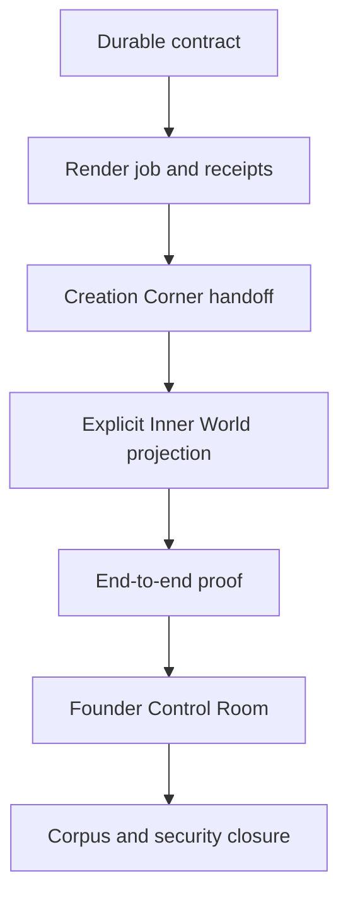
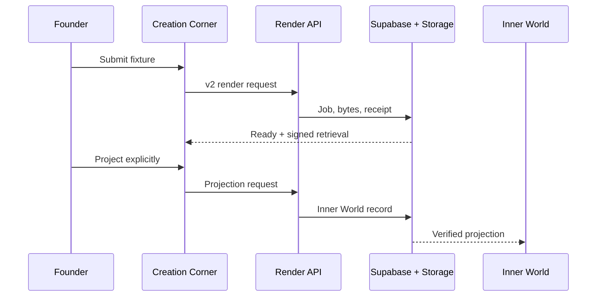

# GestaltView Inside-Out Convergence and Founder Control Room SPEC

**Status:** Approved design; implementation not started  
**Prepared:** 2026-07-25 (America/New_York)  
**Primary runtime repository:** `DigitalConsciousness/gestaltview-v3.0`  
**Runtime evidence commit:** `d44abedd9b2a10d84f88e624d18e80a953507191`  
**Corpus repository:** `DigitalConsciousness/GestaltView_Corpus_-_Knowledge_Repository`  
**Corpus evidence commit:** `8cd8a7ffc1b496318090b7f38f5c8887abc18ef3`  
**Supabase project:** `GestaltView` (`dzrxepbgetinldcknior`)  
**Founder Control Room default view:** **Next Real Moves**

---

## 0. Codex mission

Work from the inside out:

1. make the durable database contract agree with the already-integrated render runtime;
2. prove a render job produces retrievable bytes and a durable receipt;
3. connect Creation Corner to that canonical path without hiding failures behind a local preview;
4. require an explicit projection from a ready render into Dynamic Inner World;
5. show the proof and the next honest action in the existing Founder Runtime;
6. then repair corpus run lifecycle, security drift, and naming/orientation drift.

The goal is convergence, not replacement. Do not create a fourth artifact system. Do not bulk rewrite the existing 83 created artifacts or 63 Inner World artifacts. Do not delete historical corpus material. Do not silently turn local previews into durable records.

This SPEC is the governing implementation contract. Existing plans remain useful evidence, especially:

- `docs/superpowers/plans/2026-07-14-symbiote-render-repair-v2.md`
- `docs/CurrentState.md`
- `schemas/gestaltview.render-request.v2.schema.json`
- `supabase/migrations/202607130001_render_pipeline_contract_v2.sql`
- `supabase/rollback/202607130001_render_pipeline_contract_v2.rollback.sql`

Do not redo work already integrated on July 14–25. Close the live integration gap.

---

## 1. Founder intent and constitutional constraints

The supplied doctrine and project context establish the following non-negotiable rules.

### 1.1 Preserve the source

- Original captures, drafts, artifacts, and historical records are not silently deleted or overwritten.
- Projection is additive. A projected artifact points back to its source.
- Legacy records are adapted at read time or migrated only through a separately approved, reversible operation.

### 1.2 Distinguish states honestly

- A local preview is not a durable artifact.
- A database job row is not proof that output bytes exist.
- Uploaded bytes without a durable receipt are not complete.
- A ready render is not automatically an Inner World projection.
- A Control Room metric is a derived read model, not a new source of truth.

### 1.3 Keep room boundaries intact

- **Creation Corner** owns intent, editing, synthesis, render submission, and the decision to project.
- **Render Engine** owns request validation, job lifecycle, actual output bytes, private storage, receipts, idempotency, and owner-scoped retrieval.
- **Dynamic Inner World** owns historical accumulation and presentation of explicitly projected artifacts.
- **Corpus repository** owns source preparation, canonicalization, embedding provenance, and ingestion-run lifecycle.
- **Supabase** owns durable state and access-control enforcement.
- **Founder Runtime** owns the read-only operational view across those systems.

### 1.4 Hold paradox without collapsing it

GestaltView may support both:

- immediate local creation and later durable rendering;
- intentional/manual Creation Corner work and ambient growing-chamber behavior;
- full source preservation and compressed/approved outward artifacts.

Implementation must label those distinctions instead of erasing them.

---

## 2. Evidence baseline

The following facts were verified against the specified commits and the live Supabase project on 2026-07-25.

| Surface | Verified state | Consequence |
|---|---|---|
| Runtime render API | `api/render/engine.ts` writes the v2 job and receipt contract | Runtime implementation already exists; do not rewrite it preemptively |
| Live `render_jobs` | 0 rows; old v1 columns only | The first v2 insert cannot succeed |
| Live job status constraint | Only `queued`, `rendering`, `completed`, `failed`, `cancelled` | The runtime's initial `validating` status is rejected |
| Live `render_artifacts` | 0 rows; old v1 receipt columns only | MIME, storage path, byte count, hash, and per-target status cannot be persisted |
| Checked-in v2 migration | Exists at `202607130001_...` | It was written but is not in live migration history |
| Live migration history | Has later migrations through `20260717014354` | Do not blindly push or repair the skipped older version |
| Storage | `codex-exports` exists and is private | Keep writes and signed URL creation server-side |
| Existing artifacts | 83 `created_artifacts`; 63 `inner_world_artifacts` | Preserve and adapt; no clean slate |
| Creation Corner | Directly posts a legacy-shaped body, can fall back locally, and can immediately append to Inner World | Local success can mask durable failure and skip explicit projection |
| Canonical client | `client/src/lib/nextGenRenderClient.ts` already speaks v2 | Reuse it instead of maintaining a second request path |
| Explicit projection API | `api/render/promote-to-gallery.ts` exists | Use this as the canonical ready-render → Inner World boundary |
| Inner World client state | `client/src/lib/innerWorldFiles.ts` writes localStorage first and best-effort persists | Retain offline usefulness, but label local drafts separately from verified projections |
| Founder access | `api/_lib/auth.ts` exports `requireFounderOrAdmin` | Founder APIs must enforce access server-side |
| Founder surface | `/founder-runtime` and `FounderRuntimePage.tsx` already exist | Integrate the Control Room here; do not create another standalone system |
| Corpus chunks | 25,174 total; 15,854 canonical; all 15,854 canonical chunks have 768-dimensional embeddings | Canonical embedding coverage is already 100% |
| Corpus noncanonical rows | 9,320 rows have no vector | Treat as deduplicated/noncanonical occurrences unless contrary evidence is produced |
| Ingestion runs | 12 rows remain `running`; 2 complete; 4 error | Run finalization is broken or interrupted |
| Corpus ingest script | Calls `start_run`, but does not guarantee terminal finalization on process failure | Add exception-safe terminal lifecycle before resuming ingestion |
| Corpus orientation | Still names an older runtime as authoritative and contains a June pause record tied to an older project state | Update orientation only after live ownership is re-verified |
| Package identity | Runtime repo is v3.0 while `package.json` still says `gestaltview-v2` | Naming drift is real but is not the render blocker |

### 2.1 Evidence, inference, and decision

Keep these categories separate in every implementation report.

- **Evidence:** a file, test result, database query, migration list, receipt, hash, or rendered byte stream observed directly.
- **Inference:** a likely explanation supported by evidence but not yet proven end to end.
- **Decision:** the chosen design or sequencing rule.

Current central inference: the zero-job render ledger is primarily caused by schema/constraint drift, while local fallback behavior makes the UI appear partly successful. The end-to-end proof in Phase 5 must confirm or revise this.

---

## 3. Chosen architecture

### 3.1 Selected approach: serial inside-out convergence

The selected approach is a gated, serial repair:



Each layer must be proven before the next layer is allowed to claim success.

### 3.2 Alternatives considered

| Approach | Benefit | Why it is not selected |
|---|---|---|
| UI-first Control Room | Produces a visible result quickly | It would report an unproven render pipeline and could become dashboard theater |
| Parallel repair across runtime, database, corpus, and UI | Shorter theoretical calendar time | It increases contract drift and makes failures harder to localize |
| Destructive schema/artifact reset | Simplifies the immediate shape | It violates source preservation and discards existing history |
| Serial inside-out convergence | Every outer claim rests on a proven inner fact | Selected; slower per phase but lower cognitive and operational risk |

---

## 4. Canonical lifecycle and success definition

### 4.1 Render lifecycle

The durable job lifecycle is:

`validating → queued → rendering → storing → ready`

Terminal non-success states are:

`failed | cancelled`

If the checked-in v2 contract defines a slightly different permitted set, preserve that set and document the difference. Do not make the database and runtime disagree.

### 4.2 A successful target requires all of the following

For every required render target:

1. the backend produced real bytes;
2. the output has a truthful MIME type;
3. byte count is greater than zero;
4. SHA-256 is calculated from the stored/retrieved bytes;
5. the private storage object exists;
6. a durable `render_artifacts` receipt identifies bucket, path, MIME, bytes, hash, backend, format, and target status;
7. the owner can retrieve it through an authenticated, time-limited URL or server response;
8. another user cannot retrieve or enumerate it.

A job may become `ready` only when every required target meets this definition. An unsupported optional target may produce a warning and a non-success target status without invalidating otherwise successful required targets. An unsupported required target must prevent `ready`.

### 4.3 Projection lifecycle

Projection is a separate explicit action:

1. owner selects a `ready` render job;
2. owner chooses **Project to Inner World**;
3. server verifies job ownership and readiness;
4. server retrieves the trusted canonical artifact bytes;
5. server creates or finds the idempotent `inner_world_artifacts` projection;
6. projection stores `source_ref=render-artifact:<artifact_uuid>` and a durable content reference;
7. source render job and render receipt remain intact;
8. Inner World renders the projection through its existing view surface.

Destination selection in Creation Corner expresses intent. It does not bypass this action.

---

## 5. Phase plan

Every phase ends with an evidence packet and a **GO / HOLD** decision from the outside guide. Codex must not continue past a production or cross-repository gate merely because the local tests passed.

### Phase 0 — Orientation and immutable baseline

**Purpose:** establish the exact worktree, commit, scripts, migration history, and governing instructions before editing.

#### Required reads

Runtime repository:

- repository `AGENTS.md` and any nested `AGENTS.md` files affecting the target paths;
- `docs/CurrentState.md`;
- `docs/superpowers/plans/2026-07-14-symbiote-render-repair-v2.md`;
- `api/render/engine.ts`;
- `api/render/request.ts`;
- `api/render/status.ts`;
- `api/render/promote-to-gallery.ts`;
- `api/render/idempotency.ts`;
- `api/render/user-id.ts`;
- `api/_lib/auth.ts`;
- `client/src/lib/nextGenRenderClient.ts`;
- `client/src/pages/CreationCornerPage.tsx`;
- `client/src/lib/innerWorldFiles.ts`;
- `client/src/pages/FounderRuntimePage.tsx`;
- `supabase/migrations/202607130001_render_pipeline_contract_v2.sql`;
- `supabase/rollback/202607130001_render_pipeline_contract_v2.rollback.sql`;
- `package.json`.

Corpus repository, before Phase 7:

- `AGENTS.md`;
- `CONTEXT_v2.md`;
- `config/MANIFESTINGEST.md`;
- `orientation/INGESTION_PAUSED.md`;
- `scripts/ingest_corpus.py`;
- `.github/workflows/ingest_corpus.yml`.

#### Baseline commands

Run from the runtime repository root:

```bash
git status --short
git rev-parse HEAD
git branch --show-current
node --version
pnpm --version
pnpm run orientation:check
pnpm run continuity:check
pnpm run sync:collaborator:check
```

Then inspect the CLI before selecting migration commands:

```bash
pnpm exec supabase --help
pnpm exec supabase migration --help
pnpm exec supabase db --help
```

Do not clean, reset, stash, overwrite, or include unrelated user changes. If target files contain uncommitted overlapping edits, stop and report the exact overlap.

#### Phase 0 acceptance

- commit and branch recorded;
- dirty-state assessment recorded;
- relevant instructions read;
- package and CLI versions recorded;
- live migration list captured read-only;
- live render table columns and status constraints captured read-only;
- no file or database mutation performed.

---

### Phase 1 — Reconcile the live render persistence contract

**Purpose:** allow the existing v2 runtime to create its first durable job and artifact receipt.

#### Migration-history rule

Do **not** blindly apply, rename, delete, or mark the skipped
`202607130001_render_pipeline_contract_v2.sql` as applied.

The live project already contains later migration versions. Use a new, current, forward-only reconciliation migration so:

- a clean local database may apply the old migration and then safely no-op through the reconciliation;
- production, where the old migration is absent, receives the same additive v2 contract at a new valid version;
- migration history stays honest;
- the old file remains as historical implementation evidence.

Generate the new filename with the installed CLI after checking help:

```bash
pnpm exec supabase migration new render_pipeline_v2_live_reconciliation
```

Do not invent a timestamp or filename by hand. Record the generated path in the phase report.

#### Expected repository changes

- **Create:** generated `supabase/migrations/<version>_render_pipeline_v2_live_reconciliation.sql`
- **Create:** `supabase/verification/render_pipeline_contract_v2.sql`
- **Update only if evidence requires it:** `supabase/rollback/202607130001_render_pipeline_contract_v2.rollback.sql`, or create a matching reconciliation recovery script without deleting the existing rollback
- **Update after verification:** `docs/CurrentState.md`

#### Reconciliation migration requirements

The SQL must be additive and safe when some or all v2 columns already exist.

For `render_jobs`, reconcile:

- `source_family`;
- `source_id`;
- `targets`;
- `idempotency_key`;
- v2 lifecycle constraint;
- indexes used by owner-scoped lookup, status, and idempotency;
- a unique idempotency constraint/index consistent with `api/render/idempotency.ts`.

For `render_artifacts`, reconcile:

- `mime_type`;
- `storage_bucket`;
- `storage_path`;
- `byte_size`;
- `content_hash`;
- `target_status`;
- indexes used by job, owner, and target lookup.

For `inner_world_artifacts`, preserve existing records and reconcile only the partial unique projection index required for idempotent `render-artifact:<uuid>` projection.

Additional rules:

- map legacy `completed` to `ready` only if rows exist and the mapping is safe;
- do not drop old source/URI/metadata columns in this program;
- do not expose the private storage bucket publicly;
- do not add browser-visible service-role credentials;
- keep service-role storage writes and signed URL generation on the server;
- reload the PostgREST schema cache if the verified deployment path requires it;
- if strengthening nullable owner columns to `NOT NULL`, first prove there are zero null rows and make the precondition explicit.

#### Verification SQL

`supabase/verification/render_pipeline_contract_v2.sql` must be read-only and report:

- required columns and data types;
- current job status constraint definition;
- relevant indexes and uniqueness;
- RLS enabled state;
- policies on `render_jobs`, `render_artifacts`, and `inner_world_artifacts`;
- count of null owners;
- count of jobs in every lifecycle state;
- count of artifacts missing bucket/path/MIME/byte/hash fields;
- duplicate render projections by `source_ref`;
- whether the `codex-exports` bucket is private.

The script must not print secret values.

#### Required local proof

Use a local Supabase instance or approved development branch. Apply all migrations from a clean baseline, then run the verification SQL. Also test upgrade behavior from a v1-shaped fixture if the existing migration test harness supports it.

Current Supabase guidance favors versioned migration files developed and tested locally before production use:  
<https://supabase.com/docs/guides/local-development/database-migrations>

#### Production gate

Stop after the migration PR/evidence packet. Production DDL requires explicit outside approval.

The packet must contain:

- generated migration path and checksum;
- exact schema diff;
- clean-local result;
- v1-upgrade result;
- verification SQL output;
- rollback/recovery procedure;
- proof no artifact rows were deleted or rewritten;
- proposed production command or approved Supabase migration action.

#### Phase 1 acceptance

- clean local migration succeeds;
- upgrade fixture succeeds;
- v2 columns, constraints, and indexes are present;
- RLS remains enabled;
- private storage remains private;
- verification query is repeatable;
- no production change before approval.

---

### Phase 2 — Prove the server render contract

**Purpose:** demonstrate that the existing engine can now move from request to durable receipt.

#### Inspect before editing

Assume the July render implementation is correct until a focused test proves otherwise. Prefer test/fixture additions over engine rewrites.

Relevant files:

- `api/render/engine.ts`
- `api/render/request.ts`
- `api/render/idempotency.ts`
- `api/render/status.ts`
- `api/render/promote-to-gallery.ts`
- `shared/rendering/engine/**`
- existing render tests under `tests/**`

#### Add or extend tests

Use existing test organization where possible. If no integration test location exists, create:

- `tests/api/render-engine.integration.test.ts`
- `tests/api/render-status.integration.test.ts`
- `tests/api/render-projection.integration.test.ts`

Cover:

1. unauthenticated request rejected;
2. strict v2 request accepted;
3. temporary legacy translation remains compatible while Creation Corner is migrated;
4. same idempotency key and same canonical input returns the same job;
5. same client key with materially different input does not alias incorrectly;
6. owner UUID resolution works;
7. first job state can be persisted;
8. required HTML/SVG/JSON or other supported deterministic target produces real bytes;
9. receipt byte count and SHA-256 match retrieved bytes;
10. required unsupported target prevents `ready`;
11. optional unsupported target records a warning without falsifying successful targets;
12. signed URL/status response is owner-scoped;
13. another authenticated user receives no artifact access;
14. projection rejects non-ready and non-owner jobs;
15. projection is idempotent.

#### Phase 2 acceptance

One test fixture produces:

- a durable job UUID;
- terminal `ready` status;
- at least one durable artifact UUID;
- nonzero stored bytes;
- truthful MIME;
- matching SHA-256;
- owner-retrievable content;
- denied cross-owner access.

No UI work begins until this proof exists.

---

### Phase 3 — Converge Creation Corner on the canonical render path

**Purpose:** remove the parallel success path that makes a local preview look like durable completion.

#### Primary changes

- **Update:** `client/src/pages/CreationCornerPage.tsx`
- **Reuse/update as needed:** `client/src/lib/nextGenRenderClient.ts`
- **Create only if absent:** `client/src/lib/renderProjectionClient.ts`
- **Update tests:** existing Creation Corner test files; otherwise add `client/src/tests/creation-corner-render-handoff.test.tsx`

Keith prefers full-file swaps for substantial single-file changes. When updating `CreationCornerPage.tsx`, return a complete replacement file in the implementation handoff rather than a fragile sequence of manual fragments.

#### Required behavior

1. Replace the direct legacy `fetch("/api/render/engine", ...)` path with `submitNextGenRender`.
2. Send the canonical v2 request contract.
3. Keep temporary server-side legacy translation only until all known callers are migrated; do not remove it in this phase unless usage search and tests prove it is safe.
4. Represent at least these client states distinctly:
   - `local_preview`;
   - `submitting`;
   - durable lifecycle states returned by the server;
   - `ready`;
   - `failed`;
   - `projection_pending`;
   - `projected`.
5. A failed/offline canonical render may still offer a local preview, but the UI must say:
   - **Local preview — not yet saved to the render ledger**
   - and show a retry action.
6. Never label a fallback preview `ready`.
7. Never say “all formats available” unless receipts prove the claimed formats.
8. Do not immediately call `appendResultToInnerWorld()` after local synthesis.
9. Destination choice may remember the user's intended destination, but the explicit projection action appears only after durable `ready`.
10. **Project to Inner World** calls the canonical projection endpoint and reports the durable projection result.
11. Preserve intentional/manual and ambient/growing-chamber Creation Corner modes.
12. Preserve the source draft after rendering or projection.

#### Compatibility

Do not remove local preview support or local draft storage. Reclassify it honestly. Existing local records remain visible through a legacy/local adapter and are never presented with a verified render receipt they do not have.

#### Phase 3 acceptance

- direct legacy submission removed from Creation Corner;
- canonical client used;
- offline local preview remains usable and clearly labeled;
- no local fallback can produce a durable-ready badge;
- no automatic Inner World insertion occurs;
- user can retry canonical submission without losing the draft;
- focused UI tests pass.

---

### Phase 4 — Make Inner World an explicit projection consumer

**Purpose:** keep Inner World history-bearing while separating legacy/local accumulation from verified render projections.

#### Relevant files

- `client/src/lib/innerWorldFiles.ts`
- `client/src/components/inner-world/ArtifactViewSurface.tsx`
- `client/src/components/inner-world/InnerWorldArtifact.tsx`
- `client/src/components/inner-world/InnerWorldArtifactGallery.tsx`
- `client/src/components/inner-world/InnerWorldRoom.tsx`
- relevant Inner World API routes

#### Required view model

Every displayed item must expose an origin classification:

- `render_projection_verified`;
- `server_legacy`;
- `local_draft`;
- `manual_import`;
- `unknown_legacy`.

Only `render_projection_verified` may claim a canonical render receipt. Unknown records must remain visible and be described conservatively.

#### Required behavior

- continue loading the 63 existing server artifacts;
- continue loading preserved local drafts;
- merge without silent deletion;
- avoid duplicate projection display through `source_ref`;
- show projection provenance and source job/artifact IDs when available;
- use `ArtifactViewSurface` for actual content rendering;
- keep tombstone behavior scoped to the user's explicit local action;
- do not bulk backfill or rewrite legacy records in this phase;
- if a legacy backfill later becomes valuable, propose it as a separate reviewed migration.

#### Phase 4 acceptance

- existing 63 server records remain queryable;
- local drafts remain available;
- verified projections are visually and structurally distinguishable;
- projection is idempotent;
- source reference survives round trip;
- deletion/tombstone behavior does not remove durable source records unexpectedly.

---

### Phase 5 — One complete end-to-end proof

**Purpose:** establish the first trustworthy Creation Corner → render → receipt → retrieval → projection → Inner World path.

#### Test fixture

Create a deterministic, harmless fixture with:

- known owner;
- known source ID;
- deterministic scene/document content;
- one required supported format;
- stable idempotency key;
- expected content marker.

Do not use founder private content for this proof.

#### Proof sequence



#### Evidence bundle

Capture:

- request contract version;
- job UUID;
- lifecycle timestamps;
- artifact UUID;
- format and MIME;
- bucket/path with sensitive details redacted if necessary;
- byte count;
- expected and retrieved SHA-256;
- owner retrieval result;
- cross-owner denial result;
- projection record UUID and `source_ref`;
- browser proof that Inner World displays the expected marker;
- idempotent rerun result;
- relevant logs with secrets removed.

If Playwright is already configured, add:

- `tests/e2e/creation-corner-render-projection.spec.ts`

If it is not configured, do not create an ad hoc browser stack. Report the gap and use the repository's existing browser verification method.

#### Production smoke gate

After preview/development proof passes, stop for approval before a production smoke. Production proof must use a disposable fixture and must not modify an existing founder artifact.

#### Phase 5 acceptance

The system can prove, not merely claim:

`source intent → owner job → real stored bytes → matching receipt → owner retrieval → explicit projection → visible Inner World artifact`

---

### Phase 6 — Integrate the Founder Control Room

**Purpose:** place the already-selected **Next Real Moves** view inside the existing founder surface as a read model over reality.

#### Location

Use:

- `client/src/pages/FounderRuntimePage.tsx`
- route `/founder-runtime`

Do not create another independent application, state store, or artifact ledger.

#### Server contract

Create:

- `api/founder/control-room.ts`
- `shared/control-room/contracts.ts`
- tests following the existing API and shared-contract conventions

The endpoint must:

- call `requireFounderOrAdmin` from `api/_lib/auth.ts`;
- reject unauthenticated and unauthorized requests;
- use server-side database credentials only;
- return aggregated operational facts, never raw secrets or unrestricted row dumps;
- be read-only;
- include `observedAt`, data source, and freshness for every section;
- return `unknown` when a source is unavailable instead of fabricating green status.

#### Initial read model

Return:

1. **Render contract**
   - reconciliation migration observed/not observed;
   - required columns/constraint present;
   - most recent verification timestamp.
2. **Render operations**
   - jobs by status;
   - latest failure category and timestamp;
   - ready jobs;
   - artifacts with complete receipts;
   - latest successful proof ID.
3. **Projection**
   - verified render projections;
   - projection failures;
   - preserved legacy server count;
   - local-only count only if the browser can report it explicitly; do not imply the server can see localStorage.
4. **Corpus**
   - total occurrences;
   - canonical chunks;
   - canonical chunks with embeddings;
   - canonical embedding coverage percentage;
   - stale running ingestion runs;
   - latest terminal run.
5. **Governance**
   - unresolved security-advisor counts by severity/category;
   - orientation/name drift flags;
   - timestamps and source references.

#### UI views

Within Founder Runtime provide:

- **Next Real Moves** — default;
- **System Pulse**;
- **Convergence Flow**.

Reuse the existing `OrchestrationAnalyticsPanel` where it supplies relevant data. Do not duplicate its queries into a second source.

#### Next-action rules

Derive actions deterministically:

1. if render schema contract is absent or unknown → reconcile/verify contract;
2. else if no valid end-to-end proof exists → run canonical proof;
3. else if recent required render failures exist → inspect the latest categorized failure;
4. else if stale ingestion runs exist → reconcile run lifecycle;
5. else if critical/high security findings exist → address the next bounded policy issue;
6. else if orientation drift exists → refresh ownership documentation;
7. else → show the oldest unresolved evidence-backed action.

Each action card must show:

- why it is next;
- source evidence;
- owner/repository;
- safe scope;
- completion criterion;
- blocked/ready state.

#### Phase 6 acceptance

- founder-only server enforcement is tested;
- default view is **Next Real Moves**;
- all metrics carry timestamps/freshness;
- missing data is `unknown`, not healthy;
- no new persistent control-room tables are introduced;
- displayed render proof links to the underlying job/receipt identifiers;
- narrow and desktop layouts pass visual verification.

---

### Phase 7 — Repair corpus run lifecycle without damaging canonicalization

**Purpose:** resolve stale `running` rows and prevent recurrence while preserving the valid deduplication model.

#### Correct the problem statement

Do not schedule 9,320 new embeddings merely because those rows have no vector.

Current evidence:

- total occurrences: 25,174;
- canonical chunks: 15,854;
- canonical chunks with EmbeddingGemma 768-dimensional vectors: 15,854;
- canonical coverage: 100%;
- noncanonical/unembedded occurrences: 9,320.

First reproduce the query proving that the missing vectors belong to noncanonical occurrences. If any canonical row lacks an embedding, treat only those canonical gaps as the embedding backlog.

#### Repository changes

Primary:

- `scripts/ingest_corpus.py`
- tests for ingestion lifecycle, using the repository's existing test structure

Potentially:

- `.github/workflows/ingest_corpus.yml`
- `orientation/INGESTION_PAUSED.md`
- `orientation/corpus_runtime_handshake.md`
- `CONTEXT_v2.md`

Do not edit generated/mirrored copies under `skills/**` or `handoff/**` as the primary fix. Regenerate or synchronize them only through the repository's documented mechanism.

#### Run-lifecycle contract

Every non-dry ingestion run must end in exactly one terminal state:

- `complete`;
- `partial`;
- `error`;
- `cancelled`.

The implementation must:

1. create `running` only after preflight succeeds far enough that a run can be finalized;
2. wrap processing in exception-safe finalization;
3. persist terminal status and `finished_at` on handled failures;
4. record a concise error category without secret values;
5. handle termination/cancellation signals where the runtime permits it;
6. avoid converting an actively healthy run to stale;
7. make terminal finalization idempotent.

#### Stale-run reconciliation

Create a reviewed, auditable reconciliation path that:

- lists candidates first;
- uses a documented stale threshold;
- excludes a run with recent heartbeat/update activity;
- records previous state, reconciliation reason, and timestamp;
- changes stale `running` to an honest terminal status such as `error` or `cancelled`;
- never deletes the run;
- supports dry-run/report-only mode.

Do not directly mutate the 12 rows until the candidate report is reviewed outside.

#### Workflow pause

The corpus contains an explicit `orientation/INGESTION_PAUSED.md`, but live stale runs occurred after that note. Before enabling, disabling, or manually dispatching the workflow:

- inspect the actual GitHub Actions workflow state;
- identify which project/environment the workflow secrets target;
- reconcile the pause note with current founder intent;
- verify database capacity and package metadata assumptions;
- run a canonical-package dry run first.

#### Phase 7 acceptance

- canonical embedding coverage remains 100%;
- no unnecessary noncanonical embedding work is performed;
- forced test failure produces a terminal run row;
- successful test produces `complete`;
- partial test produces `partial`;
- reconciliation dry-run identifies the expected stale candidates;
- live stale-row update waits for approval;
- pause/orientation documents are updated additively with dates and supersession notes.

---

### Phase 8 — Security, schema visibility, and identity closure

**Purpose:** address remaining drift after the primary path is proven.

This phase is a sequence of small security and documentation PRs, not a single sweeping cleanup.

#### Security work

Re-run Supabase security and performance advisors after the render migration.

Prior evidence included:

- many RLS-enabled tables without policies;
- one security-definer-view finding;
- broad GraphQL schema visibility;
- duplicate broad policies on `inner_world_artifacts`.

For each finding:

1. identify whether the surface is intended for authenticated browser access, server-only access, or no API exposure;
2. add the narrowest policy or revoke/exclude exposure;
3. test owner, other-user, anonymous, and service-role behavior;
4. change one bounded family at a time;
5. preserve availability for legitimate server workflows.

RLS protects rows, while schema/API visibility is a separate design concern. Use current Supabase guidance:

- <https://supabase.com/docs/guides/database/postgres/row-level-security>
- <https://supabase.com/docs/guides/storage/security/access-control>
- <https://supabase.com/docs/guides/database/database-advisors>

#### Identity and orientation work

After runtime ownership is confirmed:

- correct `package.json` identity if changing it does not break deployments or package references;
- update the runtime README/current-state surfaces that still call v3 work v2;
- update corpus `AGENTS.md`, `CONTEXT_v2.md`, and runtime handshake documents with a dated supersession note;
- retain historical claims in their original temporal context;
- define the hyphenated `gestaltview-v3.0` repository as the current runtime authority;
- describe the underscored/older repos as historical or secondary only after verifying their status.

#### Phase 8 acceptance

- advisor deltas are recorded before/after;
- no table is made public merely to silence an advisor;
- duplicate policies are consolidated only with behavior tests;
- runtime/corpus ownership language agrees;
- historical evidence is preserved;
- package-name change, if made, passes build/deployment verification.

---

## 6. Repository change map

This table is directional. Codex must verify paths at Phase 0 and report any moved/renamed file.

| Repository | Path | Planned treatment |
|---|---|---|
| runtime | `supabase/migrations/<generated>_render_pipeline_v2_live_reconciliation.sql` | create |
| runtime | `supabase/verification/render_pipeline_contract_v2.sql` | create |
| runtime | `api/render/engine.ts` | inspect; edit only on proven defect |
| runtime | `api/render/status.ts` | inspect; edit only on proven defect |
| runtime | `api/render/promote-to-gallery.ts` | inspect; edit only on proven defect |
| runtime | `client/src/lib/nextGenRenderClient.ts` | reuse/extend |
| runtime | `client/src/pages/CreationCornerPage.tsx` | full-file coherent update |
| runtime | `client/src/lib/renderProjectionClient.ts` | create only if no existing helper |
| runtime | `client/src/lib/innerWorldFiles.ts` | add origin-aware adapter behavior |
| runtime | `client/src/components/inner-world/**` | update only where provenance display requires |
| runtime | `api/founder/control-room.ts` | create |
| runtime | `shared/control-room/contracts.ts` | create |
| runtime | `client/src/pages/FounderRuntimePage.tsx` | integrate Control Room |
| runtime | `client/src/components/founder-control-room/**` | create bounded view components |
| runtime | `tests/**` | add focused API/integration/e2e coverage |
| runtime | `docs/CurrentState.md` | update after each verified slice |
| corpus | `scripts/ingest_corpus.py` | exception-safe terminal lifecycle |
| corpus | ingestion lifecycle tests | create/extend |
| corpus | `.github/workflows/ingest_corpus.yml` | change only after actual workflow state and intent are verified |
| corpus | orientation/current ownership docs | additive dated correction after proof |

---

## 7. Verification ladder

Use the narrowest relevant command first, then widen. Do not report broad success if the broad command was not run.

### 7.1 Runtime focused checks

Discover existing test filenames before running them:

```bash
rg --files tests client/src | rg 'render|CreationCorner|innerWorld|FounderRuntime|control-room'
```

Run focused tests with the installed runner:

```bash
pnpm exec vitest run <verified-focused-test-paths>
```

Then:

```bash
pnpm test
pnpm run build
pnpm run health
pnpm run orientation:check
pnpm run continuity:check
pnpm run sync:collaborator:check
git diff --check
```

Run `pnpm run manifest` only when the changed file categories require manifest regeneration according to repository guidance. If it writes generated files, inspect and include only relevant deltas.

### 7.2 Database checks

- clean-local migration application;
- v1-to-v2 upgrade fixture;
- verification SQL;
- RLS behavior matrix;
- advisor scan;
- live preflight;
- approved production application;
- live postflight;
- disposable smoke proof.

### 7.3 Browser checks

- Creation Corner local preview label;
- canonical render status progression;
- failure and retry;
- explicit projection control;
- Inner World provenance;
- Founder Runtime access denial for ordinary users;
- default Next Real Moves view;
- narrow and desktop layouts.

### 7.4 Corpus checks

- map validation;
- dry run;
- successful run lifecycle;
- forced exception lifecycle;
- partial lifecycle;
- stale candidate report;
- canonical embedding-coverage query.

Never expose access tokens, session cookies, service-role keys, signed URL query strings, or private founder content in logs or screenshots.

---

## 8. Outside-guidance protocol

Codex works inside the repositories. The outside guide controls scope and production gates.

### 8.1 Required Codex update format

At the end of every slice, Codex reports:

1. **Outcome:** what is now true.
2. **Evidence:** exact files, commands, test counts, query summaries, and identifiers.
3. **Changes:** files changed and why.
4. **Unchanged guarantees:** preserved artifacts, records, policies, or fallback behavior.
5. **Risk:** regression or operational risk still present.
6. **Recovery:** how to revert or contain the slice.
7. **Next proposed move:** one bounded action.
8. **Gate:** `GO requested`, `HOLD`, or `no approval needed`.

### 8.2 Automatic HOLD conditions

Stop and ask for guidance if:

- target files have overlapping uncommitted changes;
- live schema differs materially from this baseline;
- migration history cannot be reconciled without marking/rewriting history;
- any step requires destructive data movement;
- a secret appears in output or would need to move to a new destination;
- owner isolation fails;
- stored bytes and receipt hash do not match;
- a required target is labeled ready without proof;
- production DDL or deployment is the next action;
- the corpus workflow target project or pause intent is ambiguous;
- broad tests fail outside the changed surface;
- a new source of truth appears necessary.

### 8.3 What the outside guide reviews

The outside guide checks:

- whether evidence supports the claim;
- whether the next slice is still the smallest useful slice;
- whether constitutional boundaries remain intact;
- whether recovery is credible;
- whether production approval is appropriate;
- whether new live evidence requires this SPEC to be amended.

---

## 9. Recovery strategy

### 9.1 Before production migration

- capture live migration list;
- capture read-only schema verification output;
- capture row counts;
- confirm recent backup/PITR posture appropriate to the project plan;
- verify recovery SQL against a local or development environment;
- preserve the skipped historical migration file.

### 9.2 After migration, before application rollout

If postflight fails:

- stop application rollout;
- do not delete existing data;
- prefer a forward corrective migration;
- use rollback SQL only if it has been tested against the exact resulting schema and does not endanger new records;
- preserve diagnostic evidence.

### 9.3 After UI rollout

If the canonical route fails:

- local preview may remain available with its honest label;
- disable projection controls when no durable-ready job exists;
- do not restore the old automatic local-to-Inner-World success claim;
- revert the UI commit if necessary while retaining the repaired database contract.

### 9.4 Corpus

If lifecycle changes fail:

- keep automatic ingestion paused;
- preserve all run rows;
- revert code/workflow changes;
- do not force embeddings or delete duplicates as a recovery shortcut.

---

## 10. Definition of program done

The convergence program is complete only when all are true:

- live Supabase accepts the v2 render contract;
- a real production-safe fixture completes the canonical render lifecycle;
- every ready required target has retrievable bytes and a matching receipt hash;
- owner isolation is proven;
- Creation Corner uses the canonical client;
- local preview is useful but never impersonates durable completion;
- projection is explicit, owner-authenticated, ready-only, and idempotent;
- Dynamic Inner World displays the verified projection and preserves its source;
- the 83 created artifacts and 63 pre-existing Inner World artifacts remain preserved;
- Founder Runtime opens on Next Real Moves and reports timestamped derived facts;
- the Control Room creates no alternate ledger;
- corpus canonical embedding coverage remains correct;
- stale run lifecycle is reconciled and future exceptions terminate honestly;
- security findings are reduced through bounded, tested policy changes;
- runtime and corpus ownership documents agree with live reality;
- `docs/CurrentState.md` records what was proven, what was deployed, and what remains unverified.

---

## 11. First bounded Codex assignment

Give Codex only the following assignment first. Do not ask it to execute the entire program in one run.

> Work in `DigitalConsciousness/gestaltview-v3.0`. Read the repository instructions and the Inside-Out Convergence SPEC. Complete Phase 0 and prepare Phase 1 only.
>
> Verify the current branch, commit, dirty state, package scripts, render v2 implementation, checked-in July 13 migration, rollback, and live Supabase migration/schema baseline. Inspect current Supabase CLI help before choosing commands.
>
> Create a new forward-only reconciliation migration using the installed CLI-generated current version; do not rename, delete, blindly apply, or mark the skipped `202607130001_render_pipeline_contract_v2.sql` as applied. Create the read-only `supabase/verification/render_pipeline_contract_v2.sql`. Test clean-local and v1-upgrade behavior. Preserve all existing artifacts and policies.
>
> Do not apply production DDL. Do not edit Creation Corner yet. Stop with an evidence packet containing the exact schema diff, generated path, checksums, test output, verification output, recovery procedure, risks, and a GO/HOLD request for production migration review.

### First-assignment acceptance

- Phase 0 evidence is complete;
- Phase 1 files are reviewable;
- migration-history handling is forward-only and honest;
- local migration proofs pass;
- verification SQL is read-only and repeatable;
- no live write occurred;
- no UI/corpus scope was pulled forward;
- Codex stops for outside review.

---

## 12. Founder-facing summary

The next real move is not to rebuild GestaltView. It is to let the durable center catch up with the work already present around it.

First, make the live database capable of recording the render job the runtime already knows how to perform. Then prove one artifact all the way through real bytes, receipt, retrieval, and explicit Inner World projection. Only after that proof should the Founder Control Room call the path healthy. Corpus and security work follow from the same rule: preserve what is meaningful, repair lifecycle and boundaries, and never let a convenient surface claim more certainty than the underlying evidence can carry.
