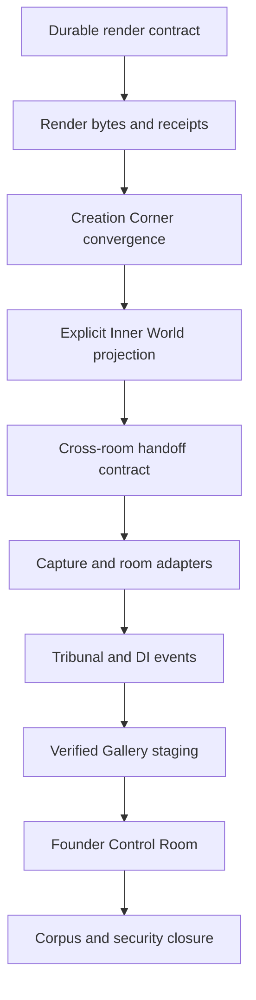
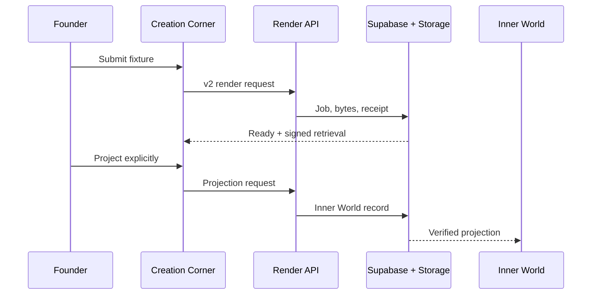
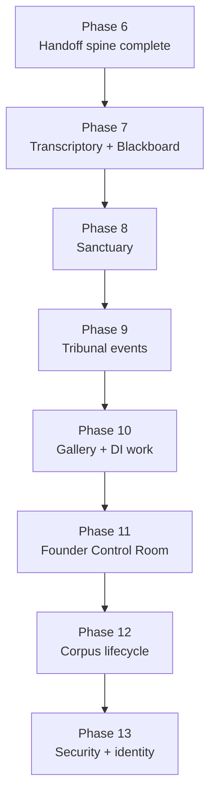

# GestaltView Inside-Out Convergence and Founder Control Room SPEC

**Status:** Active implementation; Phase 7 accepted by founder; Phase 8 locally integrated and at evidence gate
**Prepared:** 2026-07-25 (America/New_York)  
**Expanded:** 2026-07-27 (America/New_York)  
**Implementation plan added:** 2026-07-28 (America/New_York)  
**Current execution checkpoint:** Phase 8 local implementation completed 2026-07-30; production migration/application and final build/browser receipts remain gated
**Primary runtime repository:** `DigitalConsciousness/gestaltview-v3.0`  
**Runtime evidence commit:** `d44abedd9b2a10d84f88e624d18e80a953507191`  
**Recorded follow-on commit:** `62a7400` — forward render reconciliation package reported present; Codex must verify the full SHA and evidence locally  
**Corpus repository:** `DigitalConsciousness/GestaltView_Corpus_-_Knowledge_Repository`  
**Corpus evidence commit:** `8cd8a7ffc1b496318090b7f38f5c8887abc18ef3`  
**Supabase project:** `GestaltView` (`dzrxepbgetinldcknior`)  
**Founder Control Room default view:** **Next Real Moves**

---

## 0. Codex mission

Work from the inside out:

1. make the durable database contract agree with the already-integrated render runtime;
2. prove a render job produces retrievable bytes and a durable receipt;
3. connect Creation Corner to that canonical path without hiding failures behind a local preview;
4. require an explicit projection from a ready render into Dynamic Inner World;
5. establish one durable cross-room handoff contract without flattening the rooms into one generic workflow;
6. connect Blackboard, Transcriptory, Sanctuary, Tribunal, and Artifact Gallery through that contract;
7. require every Digital Intelligence handoff to produce a durable acknowledgement or an actionable failure;
8. show the proof and the next honest action in the existing Founder Runtime;
9. then repair corpus run lifecycle, security drift, and naming/orientation drift.

The goal is convergence, not replacement. Do not create a fourth artifact system. Do not bulk rewrite the existing 83 created artifacts or 63 Inner World artifacts. Do not delete historical corpus material. Do not silently turn local previews into durable records.

This SPEC is the governing implementation contract. Existing plans remain useful evidence, especially:

- `docs/superpowers/plans/2026-07-14-symbiote-render-repair-v2.md`
- `docs/CurrentState.md`
- `schemas/gestaltview.render-request.v2.schema.json`
- `supabase/migrations/202607130001_render_pipeline_contract_v2.sql`
- `supabase/rollback/202607130001_render_pipeline_contract_v2.rollback.sql`

Do not redo work already integrated on July 14–25. Close the live integration gap.

The July 27 expansion incorporates the supplied GestaltView Runtime Walkthrough
and `components.zip`. The walkthrough is a statement of intended behavior. The
component bundle is implementation evidence, not an installable package and not
authority over newer live code. Codex must compare every referenced component
to the current runtime before editing.

---

## 1. Founder intent and constitutional constraints

The supplied doctrine and project context establish the following non-negotiable rules.

### 1.1 Preserve the source

- Original captures, drafts, artifacts, and historical records are not silently deleted or overwritten.
- Projection is additive. A projected artifact points back to its source.
- Legacy records are adapted at read time or migrated only through a separately approved, reversible operation.

### 1.2 Distinguish states honestly

- A local preview is not a durable artifact.
- A database job row is not proof that output bytes exist.
- Uploaded bytes without a durable receipt are not complete.
- A ready render is not automatically an Inner World projection.
- A Control Room metric is a derived read model, not a new source of truth.

### 1.3 Keep room boundaries intact

- **Creation Corner** owns intent, editing, synthesis, render submission, and the decision to project.
- **Render Engine** owns request validation, job lifecycle, actual output bytes, private storage, receipts, idempotency, and owner-scoped retrieval.
- **Dynamic Inner World** owns historical accumulation and presentation of explicitly projected artifacts.
- **Blackboard** owns collaborative conversation and source-preserving capture, not silent profile mutation.
- **Transcriptory** owns raw audio/text capture, transcription derivatives, and source links.
- **Sanctuary** owns private journaling and scrapbook expression; it may reference Transcriptory captures without absorbing or deleting them.
- **Tribunal** owns multi-participant deliberation, its durable event history, and its synthesis proposal.
- **Artifact Gallery** owns staging, inspection, repair requests, and explicit promotion; it does not manufacture render success.
- **Orchestration** owns capability-based routing, assignment, acknowledgement, progress events, and failure escalation; it does not own the room content.
- **Corpus repository** owns source preparation, canonicalization, embedding provenance, and ingestion-run lifecycle.
- **Supabase** owns durable state and access-control enforcement.
- **Founder Runtime** owns the read-only operational view across those systems.

### 1.4 Hold paradox without collapsing it

GestaltView may support both:

- immediate local creation and later durable rendering;
- intentional/manual Creation Corner work and ambient growing-chamber behavior;
- full source preservation and compressed/approved outward artifacts.

Implementation must label those distinctions instead of erasing them.

---

## 2. Evidence baseline

The following facts were verified against the specified commits and the live Supabase project on 2026-07-25.

| Surface | Verified state | Consequence |
|---|---|---|
| Runtime render API | `api/render/engine.ts` writes the v2 job and receipt contract | Runtime implementation already exists; do not rewrite it preemptively |
| Live `render_jobs` | 0 rows; old v1 columns only | The first v2 insert cannot succeed |
| Live job status constraint | Only `queued`, `rendering`, `completed`, `failed`, `cancelled` | The runtime's initial `validating` status is rejected |
| Live `render_artifacts` | 0 rows; old v1 receipt columns only | MIME, storage path, byte count, hash, and per-target status cannot be persisted |
| Checked-in v2 migration | Exists at `202607130001_...` | It was written but is not in live migration history |
| Live migration history | Has later migrations through `20260717014354` | Do not blindly push or repair the skipped older version |
| Storage | `codex-exports` exists and is private | Keep writes and signed URL creation server-side |
| Existing artifacts | 83 `created_artifacts`; 63 `inner_world_artifacts` | Preserve and adapt; no clean slate |
| Creation Corner | Directly posts a legacy-shaped body, can fall back locally, and can immediately append to Inner World | Local success can mask durable failure and skip explicit projection |
| Canonical client | `client/src/lib/nextGenRenderClient.ts` already speaks v2 | Reuse it instead of maintaining a second request path |
| Explicit projection API | `api/render/promote-to-gallery.ts` exists | Use this as the canonical ready-render → Inner World boundary |
| Inner World client state | `client/src/lib/innerWorldFiles.ts` writes localStorage first and best-effort persists | Retain offline usefulness, but label local drafts separately from verified projections |
| Founder access | `api/_lib/auth.ts` exports `requireFounderOrAdmin` | Founder APIs must enforce access server-side |
| Founder surface | `/founder-runtime` and `FounderRuntimePage.tsx` already exist | Integrate the Control Room here; do not create another standalone system |
| Recorded render repair | Commit `62a7400` was reported to contain the forward migration, verification SQL, recovery script, and tests | Treat it as work to verify, not work to recreate; production application remains unapproved |
| Supplied component bundle | Broad source snapshot containing Blackboard, Transcriptory, Sanctuary, Creation Corner, Gallery, Inner World, rendering, and analytics surfaces | Compare to live paths; do not copy wholesale |
| Blackboard snapshot | Upload, voice, embodiment selection, recap, Creation Corner, External Scaffold, and Transcriptory handoffs exist; local/session storage remains in the path | Preserve capabilities while replacing ephemeral cross-room handoffs with durable receipts |
| Transcriptory snapshot | Authenticated capture, source records, audio upload, transcription, failure state, and local fallback exist | Reuse its durable source model; raw source and transcription must remain distinct |
| Sanctuary snapshot | Visual room and editor exist; journal and scrapbook state are browser-local | Reuse existing `journals` and `scrapbook_items` where live schema confirms fit; preserve offline drafts |
| Tribunal evidence | Schema inventory includes `tribunal_sessions`, `tribunal_events`, and `tribunal_evidence`; the walkthrough requires visible real progress | Build the UI over durable events; never animate invented progress |
| Gallery snapshot | Gallery stages records from the older Inner World/local state and changes status client-side | Converge it on render receipts and explicit projection without deleting legacy records |
| Orchestration evidence | `orchestration_decisions` and an analytics panel exist | Extend the routing spine with acknowledgement/progress evidence rather than creating a separate orchestrator |
| Corpus chunks | 25,174 total; 15,854 canonical; all 15,854 canonical chunks have 768-dimensional embeddings | Canonical embedding coverage is already 100% |
| Corpus noncanonical rows | 9,320 rows have no vector | Treat as deduplicated/noncanonical occurrences unless contrary evidence is produced |
| Ingestion runs | 12 rows remain `running`; 2 complete; 4 error | Run finalization is broken or interrupted |
| Corpus ingest script | Calls `start_run`, but does not guarantee terminal finalization on process failure | Add exception-safe terminal lifecycle before resuming ingestion |
| Corpus orientation | Still names an older runtime as authoritative and contains a June pause record tied to an older project state | Update orientation only after live ownership is re-verified |
| Package identity | Runtime repo is v3.0 while `package.json` still says `gestaltview-v2` | Naming drift is real but is not the render blocker |

### 2.1 Evidence, inference, and decision

Keep these categories separate in every implementation report.

- **Evidence:** a file, test result, database query, migration list, receipt, hash, or rendered byte stream observed directly.
- **Inference:** a likely explanation supported by evidence but not yet proven end to end.
- **Decision:** the chosen design or sequencing rule.

Current central inference: the zero-job render ledger is primarily caused by schema/constraint drift, while local fallback behavior makes the UI appear partly successful. The end-to-end proof in Phase 5 must confirm or revise this.

Expansion inference: most walkthrough capabilities are already represented in
the runtime or schema, but cross-room movement is implemented through a mixture
of session storage, local storage, direct component calls, and room-specific API
shapes. The Phase 6 schema-fit audit and the later end-to-end tests must confirm
this before any shared contract is added.

---

## 3. Chosen architecture

### 3.1 Selected approach: serial inside-out convergence

The selected approach is a gated, serial repair:



Each layer must be proven before the next layer is allowed to claim success.

### 3.2 Alternatives considered

| Approach | Benefit | Why it is not selected |
|---|---|---|
| UI-first Control Room | Produces a visible result quickly | It would report an unproven render pipeline and could become dashboard theater |
| Parallel repair across runtime, database, corpus, and UI | Shorter theoretical calendar time | It increases contract drift and makes failures harder to localize |
| Destructive schema/artifact reset | Simplifies the immediate shape | It violates source preservation and discards existing history |
| Serial inside-out convergence | Every outer claim rests on a proven inner fact | Selected; slower per phase but lower cognitive and operational risk |

---

## 4. Canonical lifecycle and success definition

### 4.1 Render lifecycle

The durable job lifecycle is:

`validating → queued → rendering → storing → ready`

Terminal non-success states are:

`failed | cancelled`

If the checked-in v2 contract defines a slightly different permitted set, preserve that set and document the difference. Do not make the database and runtime disagree.

### 4.2 A successful target requires all of the following

For every required render target:

1. the backend produced real bytes;
2. the output has a truthful MIME type;
3. byte count is greater than zero;
4. SHA-256 is calculated from the stored/retrieved bytes;
5. the private storage object exists;
6. a durable `render_artifacts` receipt identifies bucket, path, MIME, bytes, hash, backend, format, and target status;
7. the owner can retrieve it through an authenticated, time-limited URL or server response;
8. another user cannot retrieve or enumerate it.

A job may become `ready` only when every required target meets this definition. An unsupported optional target may produce a warning and a non-success target status without invalidating otherwise successful required targets. An unsupported required target must prevent `ready`.

### 4.3 Projection lifecycle

Projection is a separate explicit action:

1. owner selects a `ready` render job;
2. owner chooses **Project to Inner World**;
3. server verifies job ownership and readiness;
4. server retrieves the trusted canonical artifact bytes;
5. server creates or finds the idempotent `inner_world_artifacts` projection;
6. projection stores `source_ref=render-artifact:<artifact_uuid>` and a durable content reference;
7. source render job and render receipt remain intact;
8. Inner World renders the projection through its existing view surface.

Destination selection in Creation Corner expresses intent. It does not bypass this action.

---

## 5. Phase plan

Every phase ends with an evidence packet and a **GO / HOLD** decision from the outside guide. Codex must not continue past a production or cross-repository gate merely because the local tests passed.

| Phase | Scope | Current recorded state |
|---:|---|---|
| 0 | Orientation and immutable baseline | Reported complete before the Phase 6 checkpoint; preserve its evidence packet |
| 1 | Render persistence reconciliation | Reported complete before the Phase 6 checkpoint; production state is determined by the recorded migration evidence |
| 2 | Server render contract proof | Reported complete before the Phase 6 checkpoint; retain the focused test receipt |
| 3 | Creation Corner canonical path | Reported complete before the Phase 6 checkpoint |
| 4 | Inner World projection consumer | Reported complete before the Phase 6 checkpoint |
| 5 | End-to-end render/projection proof | Reported complete before the Phase 6 checkpoint; the proof bundle remains authoritative |
| 6 | Shared cross-room handoff contract | **Reported complete on 2026-07-28; current implementation checkpoint** |
| 7 | Blackboard and Transcriptory | **Next implementation phase** |
| 8 | Sanctuary durability and voice linkage | Approved design; not implemented |
| 9 | Tribunal durable progress events | Approved design; not implemented |
| 10 | Gallery and DI chains of command | Approved design; not implemented |
| 11 | Founder Control Room integration | Hosted design exists; live read model not implemented |
| 12 | Corpus run lifecycle | Not implemented; live baseline must be refreshed |
| 13 | Security and identity closure | Not implemented; advisor baseline must be refreshed |

### Phase 0 — Orientation and immutable baseline

**Purpose:** establish the exact worktree, commit, scripts, migration history, and governing instructions before editing.

#### Required reads

Runtime repository:

- repository `AGENTS.md` and any nested `AGENTS.md` files affecting the target paths;
- `docs/CurrentState.md`;
- `docs/superpowers/plans/2026-07-14-symbiote-render-repair-v2.md`;
- `api/render/engine.ts`;
- `api/render/request.ts`;
- `api/render/status.ts`;
- `api/render/promote-to-gallery.ts`;
- `api/render/idempotency.ts`;
- `api/render/user-id.ts`;
- `api/_lib/auth.ts`;
- `client/src/lib/nextGenRenderClient.ts`;
- `client/src/pages/CreationCornerPage.tsx`;
- `client/src/lib/innerWorldFiles.ts`;
- `client/src/pages/FounderRuntimePage.tsx`;
- `supabase/migrations/202607130001_render_pipeline_contract_v2.sql`;
- `supabase/rollback/202607130001_render_pipeline_contract_v2.rollback.sql`;
- `package.json`.

Corpus repository, before Phase 12:

- `AGENTS.md`;
- `CONTEXT_v2.md`;
- `config/MANIFESTINGEST.md`;
- `orientation/INGESTION_PAUSED.md`;
- `scripts/ingest_corpus.py`;
- `.github/workflows/ingest_corpus.yml`.

#### Baseline commands

Run from the runtime repository root:

```bash
git status --short
git rev-parse HEAD
git branch --show-current
node --version
pnpm --version
pnpm run orientation:check
pnpm run continuity:check
pnpm run sync:collaborator:check
```

Then inspect the CLI before selecting migration commands:

```bash
pnpm exec supabase --help
pnpm exec supabase migration --help
pnpm exec supabase db --help
```

Do not clean, reset, stash, overwrite, or include unrelated user changes. If target files contain uncommitted overlapping edits, stop and report the exact overlap.

#### Phase 0 acceptance

- commit and branch recorded;
- dirty-state assessment recorded;
- relevant instructions read;
- package and CLI versions recorded;
- live migration list captured read-only;
- live render table columns and status constraints captured read-only;
- no file or database mutation performed.

---

### Phase 1 — Reconcile the live render persistence contract

**Purpose:** allow the existing v2 runtime to create its first durable job and artifact receipt.

#### Migration-history rule

Do **not** blindly apply, rename, delete, or mark the skipped
`202607130001_render_pipeline_contract_v2.sql` as applied.

The live project already contains later migration versions. Use a new, current, forward-only reconciliation migration so:

- a clean local database may apply the old migration and then safely no-op through the reconciliation;
- production, where the old migration is absent, receives the same additive v2 contract at a new valid version;
- migration history stays honest;
- the old file remains as historical implementation evidence.

Generate the new filename with the installed CLI after checking help:

```bash
pnpm exec supabase migration new render_pipeline_v2_live_reconciliation
```

Do not invent a timestamp or filename by hand. Record the generated path in the phase report.

#### Expected repository changes

- **Create:** generated `supabase/migrations/<version>_render_pipeline_v2_live_reconciliation.sql`
- **Create:** `supabase/verification/render_pipeline_contract_v2.sql`
- **Update only if evidence requires it:** `supabase/rollback/202607130001_render_pipeline_contract_v2.rollback.sql`, or create a matching reconciliation recovery script without deleting the existing rollback
- **Update after verification:** `docs/CurrentState.md`

#### Reconciliation migration requirements

The SQL must be additive and safe when some or all v2 columns already exist.

For `render_jobs`, reconcile:

- `source_family`;
- `source_id`;
- `targets`;
- `idempotency_key`;
- v2 lifecycle constraint;
- indexes used by owner-scoped lookup, status, and idempotency;
- a unique idempotency constraint/index consistent with `api/render/idempotency.ts`.

For `render_artifacts`, reconcile:

- `mime_type`;
- `storage_bucket`;
- `storage_path`;
- `byte_size`;
- `content_hash`;
- `target_status`;
- indexes used by job, owner, and target lookup.

For `inner_world_artifacts`, preserve existing records and reconcile only the partial unique projection index required for idempotent `render-artifact:<uuid>` projection.

Additional rules:

- map legacy `completed` to `ready` only if rows exist and the mapping is safe;
- do not drop old source/URI/metadata columns in this program;
- do not expose the private storage bucket publicly;
- do not add browser-visible service-role credentials;
- keep service-role storage writes and signed URL generation on the server;
- reload the PostgREST schema cache if the verified deployment path requires it;
- if strengthening nullable owner columns to `NOT NULL`, first prove there are zero null rows and make the precondition explicit.

#### Verification SQL

`supabase/verification/render_pipeline_contract_v2.sql` must be read-only and report:

- required columns and data types;
- current job status constraint definition;
- relevant indexes and uniqueness;
- RLS enabled state;
- policies on `render_jobs`, `render_artifacts`, and `inner_world_artifacts`;
- count of null owners;
- count of jobs in every lifecycle state;
- count of artifacts missing bucket/path/MIME/byte/hash fields;
- duplicate render projections by `source_ref`;
- whether the `codex-exports` bucket is private.

The script must not print secret values.

#### Required local proof

Use a local Supabase instance or approved development branch. Apply all migrations from a clean baseline, then run the verification SQL. Also test upgrade behavior from a v1-shaped fixture if the existing migration test harness supports it.

Current Supabase guidance favors versioned migration files developed and tested locally before production use:  
<https://supabase.com/docs/guides/local-development/database-migrations>

#### Production gate

Stop after the migration PR/evidence packet. Production DDL requires explicit outside approval.

The packet must contain:

- generated migration path and checksum;
- exact schema diff;
- clean-local result;
- v1-upgrade result;
- verification SQL output;
- rollback/recovery procedure;
- proof no artifact rows were deleted or rewritten;
- proposed production command or approved Supabase migration action.

#### Phase 1 acceptance

- clean local migration succeeds;
- upgrade fixture succeeds;
- v2 columns, constraints, and indexes are present;
- RLS remains enabled;
- private storage remains private;
- verification query is repeatable;
- no production change before approval.

---

### Phase 2 — Prove the server render contract

**Purpose:** demonstrate that the existing engine can now move from request to durable receipt.

#### Inspect before editing

Assume the July render implementation is correct until a focused test proves otherwise. Prefer test/fixture additions over engine rewrites.

Relevant files:

- `api/render/engine.ts`
- `api/render/request.ts`
- `api/render/idempotency.ts`
- `api/render/status.ts`
- `api/render/promote-to-gallery.ts`
- `shared/rendering/engine/**`
- existing render tests under `tests/**`

#### Add or extend tests

Use existing test organization where possible. If no integration test location exists, create:

- `tests/api/render-engine.integration.test.ts`
- `tests/api/render-status.integration.test.ts`
- `tests/api/render-projection.integration.test.ts`

Cover:

1. unauthenticated request rejected;
2. strict v2 request accepted;
3. temporary legacy translation remains compatible while Creation Corner is migrated;
4. same idempotency key and same canonical input returns the same job;
5. same client key with materially different input does not alias incorrectly;
6. owner UUID resolution works;
7. first job state can be persisted;
8. required HTML/SVG/JSON or other supported deterministic target produces real bytes;
9. receipt byte count and SHA-256 match retrieved bytes;
10. required unsupported target prevents `ready`;
11. optional unsupported target records a warning without falsifying successful targets;
12. signed URL/status response is owner-scoped;
13. another authenticated user receives no artifact access;
14. projection rejects non-ready and non-owner jobs;
15. projection is idempotent.

#### Phase 2 acceptance

One test fixture produces:

- a durable job UUID;
- terminal `ready` status;
- at least one durable artifact UUID;
- nonzero stored bytes;
- truthful MIME;
- matching SHA-256;
- owner-retrievable content;
- denied cross-owner access.

No UI work begins until this proof exists.

---

### Phase 3 — Converge Creation Corner on the canonical render path

**Purpose:** remove the parallel success path that makes a local preview look like durable completion.

#### Primary changes

- **Update:** `client/src/pages/CreationCornerPage.tsx`
- **Reuse:** `client/src/lib/nextGenRenderClient.ts`; update only when a focused
  test proves it lacks required canonical behavior
- **Create only if absent:** `client/src/lib/renderProjectionClient.ts`
- **Update tests:** existing Creation Corner test files; otherwise add `client/src/tests/creation-corner-render-handoff.test.tsx`

Keith prefers full-file swaps for substantial single-file changes. When updating `CreationCornerPage.tsx`, return a complete replacement file in the implementation handoff rather than a fragile sequence of manual fragments.

#### Required behavior

1. Replace the direct legacy `fetch("/api/render/engine", ...)` path with `submitNextGenRender`.
2. Send the canonical v2 request contract.
3. Keep temporary server-side legacy translation only until all known callers are migrated; do not remove it in this phase unless usage search and tests prove it is safe.
4. Represent at least these client states distinctly:
   - `local_preview`;
   - `submitting`;
   - durable lifecycle states returned by the server;
   - `ready`;
   - `failed`;
   - `projection_pending`;
   - `projected`.
5. A failed/offline canonical render may still offer a local preview, but the UI must say:
   - **Local preview — not yet saved to the render ledger**
   - and show a retry action.
6. Never label a fallback preview `ready`.
7. Never say “all formats available” unless receipts prove the claimed formats.
8. Do not immediately call `appendResultToInnerWorld()` after local synthesis.
9. Destination choice may remember the user's intended destination, but the explicit projection action appears only after durable `ready`.
10. **Project to Inner World** calls the canonical projection endpoint and reports the durable projection result.
11. Preserve intentional/manual and ambient/growing-chamber Creation Corner modes.
12. Preserve the source draft after rendering or projection.

#### Compatibility

Do not remove local preview support or local draft storage. Reclassify it honestly. Existing local records remain visible through a legacy/local adapter and are never presented with a verified render receipt they do not have.

#### Phase 3 acceptance

- direct legacy submission removed from Creation Corner;
- canonical client used;
- offline local preview remains usable and clearly labeled;
- no local fallback can produce a durable-ready badge;
- no automatic Inner World insertion occurs;
- user can retry canonical submission without losing the draft;
- focused UI tests pass.

---

### Phase 4 — Make Inner World an explicit projection consumer

**Purpose:** keep Inner World history-bearing while separating legacy/local accumulation from verified render projections.

#### Relevant files

- `client/src/lib/innerWorldFiles.ts`
- `client/src/components/inner-world/ArtifactViewSurface.tsx`
- `client/src/components/inner-world/InnerWorldArtifact.tsx`
- `client/src/components/inner-world/InnerWorldArtifactGallery.tsx`
- `client/src/components/inner-world/InnerWorldRoom.tsx`
- relevant Inner World API routes

#### Required view model

Every displayed item must expose an origin classification:

- `render_projection_verified`;
- `server_legacy`;
- `local_draft`;
- `manual_import`;
- `unknown_legacy`.

Only `render_projection_verified` may claim a canonical render receipt. Unknown records must remain visible and be described conservatively.

#### Required behavior

- continue loading the 63 existing server artifacts;
- continue loading preserved local drafts;
- merge without silent deletion;
- avoid duplicate projection display through `source_ref`;
- show projection provenance and source job/artifact IDs when available;
- use `ArtifactViewSurface` for actual content rendering;
- keep tombstone behavior scoped to the user's explicit local action;
- do not bulk backfill or rewrite legacy records in this phase;
- if a legacy backfill later becomes valuable, propose it as a separate reviewed migration.

#### Phase 4 acceptance

- existing 63 server records remain queryable;
- local drafts remain available;
- verified projections are visually and structurally distinguishable;
- projection is idempotent;
- source reference survives round trip;
- deletion/tombstone behavior does not remove durable source records unexpectedly.

---

### Phase 5 — One complete end-to-end proof

**Purpose:** establish the first trustworthy Creation Corner → render → receipt → retrieval → projection → Inner World path.

#### Test fixture

Create a deterministic, harmless fixture with:

- known owner;
- known source ID;
- deterministic scene/document content;
- one required supported format;
- stable idempotency key;
- expected content marker.

Do not use founder private content for this proof.

#### Proof sequence



#### Evidence bundle

Capture:

- request contract version;
- job UUID;
- lifecycle timestamps;
- artifact UUID;
- format and MIME;
- bucket/path with sensitive details redacted if necessary;
- byte count;
- expected and retrieved SHA-256;
- owner retrieval result;
- cross-owner denial result;
- projection record UUID and `source_ref`;
- browser proof that Inner World displays the expected marker;
- idempotent rerun result;
- relevant logs with secrets removed.

If Playwright is already configured, add:

- `tests/e2e/creation-corner-render-projection.spec.ts`

If it is not configured, do not create an ad hoc browser stack. Report the gap and use the repository's existing browser verification method.

#### Production smoke gate

After preview/development proof passes, stop for approval before a production smoke. Production proof must use a disposable fixture and must not modify an existing founder artifact.

#### Phase 5 acceptance

The system can prove, not merely claim:

`source intent → owner job → real stored bytes → matching receipt → owner retrieval → explicit projection → visible Inner World artifact`

---

### Phase 6 — Establish the cross-room handoff contract

**Purpose:** replace ephemeral room-to-room transfers with one
source-preserving, owner-scoped, idempotent contract while retaining the
distinct behavior of each room.

This phase begins only after Phase 5 proves the render and projection spine.

#### Schema-fit audit comes first

Before proposing a migration, Codex must inspect the live definitions,
policies, indexes, and code use of:

- `capture_events`;
- `gsvw_runtime_capture_events`;
- `orchestration_decisions`;
- `transcriptory_captures`;
- `transcriptory_sessions`;
- `transcriptory_sources`;
- `journals`;
- `scrapbook_items`;
- `tribunal_sessions`;
- `tribunal_events`;
- `tribunal_evidence`;
- `created_artifacts`;
- `artifact_provenance_envelopes`;
- `codex_artifacts`;
- `render_jobs`;
- `render_artifacts`;
- `inner_world_artifacts`;
- `approvals`.

Produce a matrix with:

- current purpose;
- source owner;
- whether it stores source, derivative, event, decision, receipt, or projection;
- owner column and RLS behavior;
- current writer/reader paths;
- fields usable for the handoff contract;
- fields that would need an additive extension;
- duplication risk.

Reuse or minimally extend existing tables. A new table is permitted only when
the matrix proves that none of the existing tables can represent a durable
handoff receipt without overloading a source record.

#### Canonical shared contract

Create:

- `shared/handoffs/contracts.ts`;
- `client/src/lib/runtimeHandoffClient.ts`;
- server routes following the current API convention under
  `api/runtime-handoffs/**`;
- focused contract/API tests.

The canonical envelope is `gestaltview.runtime-handoff.v1` and must include:

| Field | Requirement |
|---|---|
| `contractVersion` | Exact literal `gestaltview.runtime-handoff.v1` |
| `handoffId` | Server-issued UUID |
| `ownerId` | Server-resolved owner; never trusted from browser input |
| `source` | `room`, `entityType`, `entityId`, optional revision, and immutable source reference |
| `destination` | Destination room and requested action |
| `payload` | Minimal derivative context and typed references; raw source is referenced, not silently copied |
| `selectedEmbodiments` | Optional explicit collaborator selections |
| `intent` | `continue`, `review`, `synthesize`, `render`, `stage`, or `project` |
| `state` | Lifecycle state defined below |
| `idempotencyKey` | Unique per owner, source revision, destination, and material intent |
| `provenance` | Actor, timestamps, originating route, and consent scope |
| `receipt` | Destination acknowledgement, destination entity reference, or structured failure |

Lifecycle:

`prepared → offered → accepted → processing → completed`

Terminal non-success states:

`declined | failed | cancelled | expired`

The source room creates the offer. The destination room must explicitly accept
it before `processing`. A source-side toast, navigation call, or session-storage
write is not acknowledgement.

#### Persistence rule

Prefer one of these, in order:

1. extend an existing event/decision table plus a narrow durable receipt table
   if the live schema already separates source from receipt;
2. create a single `runtime_handoffs` receipt table only if the schema-fit audit
   proves the existing tables cannot safely carry the lifecycle.

If `runtime_handoffs` is required, it stores references and lifecycle only. It
must not become a second copy of transcripts, journals, artifacts, or scene
graphs.

Minimum database guarantees:

- owner-scoped RLS;
- server-resolved ownership;
- source and destination check constraints;
- allowed-state constraint;
- unique `(owner_id, idempotency_key)`;
- immutable source identity after acceptance;
- append-only transition evidence or an equivalent auditable event trail;
- no cascade that deletes the original source when a handoff is removed;
- indexes for owner/state, source reference, destination/state, and freshness.

#### Privacy and consent

- Profile or memory extraction creates a reviewable proposal; it does not
  silently mutate a user's canonical profile.
- Raw voice, transcript, journal, and scrapbook content remain private by
  default.
- Cross-room access carries an explicit destination and purpose.
- Musical DNA, Self-View, or another ambient consumer may read a source only
  through an enabled consent scope.
- A revoked consumer grant stops future reads without deleting the source.

#### Phase 6 acceptance

- schema-fit matrix is complete;
- no source table is repurposed as a generic workflow table;
- strict contract validation exists on client and server boundaries;
- same idempotency key returns the same handoff;
- materially different intent cannot alias to an old handoff;
- owner, other-user, anonymous, and service-role behavior is tested;
- source remains available after handoff completion, failure, or deletion;
- a prepared handoff cannot be presented as accepted or completed;
- production migration remains behind an outside approval gate.

---

### Phase 7 — Converge Blackboard and Transcriptory capture

**Purpose:** make Blackboard and Transcriptory the first proven producers of the
shared handoff contract while preserving raw capture, local usefulness, and
user control.

#### Blackboard responsibilities

Relevant live paths to verify:

- `client/src/pages/BlackboardRoomPage.tsx`;
- `client/src/components/capture/UniversalCaptureBar.tsx`;
- `client/src/components/capture/BlackboardCompanionChat.tsx`;
- file upload and conversation persistence clients imported by those surfaces;
- recap and blueprint routes;
- current profile/context extraction path.

Required behavior:

1. typed, voice, and uploaded input creates or updates a room-owned source
   record before downstream work claims persistence;
2. uploaded files retain their file/source identity and render through a safe
   preview rather than appearing only as a raw attachment;
3. a recap or blueprint sent to Creation Corner creates a durable handoff offer;
4. Creation Corner acceptance returns a durable destination reference;
5. External Scaffold transfer is explicit and never automatic;
6. chosen embodiment profiles are recorded as participation context, not as
   source authors unless they produced the referenced content;
7. proposed profile/memory extractions remain reviewable and reversible;
8. local/offline conversation fallback remains available but is labeled
   `local_only` until synchronized.

Replace cross-room uses of `sessionStorage` with the canonical handoff client.
Do not remove session/local storage until a backward-compatible adapter has
read and preserved outstanding local records.

#### Transcriptory responsibilities

Relevant live paths to verify:

- `client/src/pages/TranscriptoryPage.tsx`;
- `client/src/lib/transcriptory.ts`;
- `client/src/components/TranscriptoryRecorder.tsx`;
- Transcriptory API routes and storage code.

Required behavior:

1. raw audio or pasted text is the preserved source;
2. transcription is a derivative with provider, model, timestamps, duration,
   status, and failure evidence;
3. upload success and transcription success are separate states;
4. a failed transcription never deletes or hides an uploaded source;
5. retry is idempotent and does not create duplicate source captures;
6. handoffs to Blackboard, Sanctuary, or Creation Corner contain source
   references plus the minimum approved derivative context;
7. local captures can be synchronized without losing their local ID lineage;
8. deletion requires explicit confirmation and respects source/derivative
   relationships.

Do not hard-code a provider into the contract. The current implementation may
use AssemblyAI, Deepgram, or another configured provider; provenance must state
which provider actually ran.

#### Cross-room proof fixture

Create a harmless fixture that:

1. saves a Transcriptory text capture;
2. offers it to Blackboard;
3. Blackboard accepts and uses it as cited context;
4. sends a blueprint to Creation Corner;
5. Creation Corner accepts and exposes the originating Transcriptory source
   reference;
6. replays the same handoff idempotently;
7. denies cross-owner access.

#### Phase 7 acceptance

- no new handoff depends solely on browser session storage;
- raw capture and derivative transcript are distinguishable;
- file upload, transcription, and handoff failures are separately visible;
- explicit External Scaffold rule is tested;
- destination acknowledgement is durable;
- source lineage survives Transcriptory → Blackboard → Creation Corner;
- profile extraction requires a reviewable proposal;
- focused component, API, and RLS tests pass.

---

### Phase 8 — Make Sanctuary durable without losing its quiet local character

**Purpose:** persist journals and scrapbook items, integrate voice through
Transcriptory, and keep the Sanctuary experience calm rather than turning it
into an operations console.

#### Relevant paths and data

- `client/src/pages/SanctuaryPage.tsx`;
- `client/src/components/sanctuary/SanctuaryStudio.tsx`;
- `journals`;
- `scrapbook_items`;
- Transcriptory capture and handoff clients;
- current user-surface voice settings.

Codex must inspect the live table definitions before adding columns. Reuse the
existing tables if they can express:

- owner;
- title/body or content reference;
- mood/tag;
- created/updated timestamps;
- source kind;
- optional Transcriptory source reference;
- local synchronization key;
- soft-delete/archive state.

#### Journal and scrapbook behavior

1. preserve the current local-storage state as an offline/local draft cache;
2. on authenticated load, merge by stable source/sync identity rather than
   replacing either side wholesale;
3. label unsynchronized records locally;
4. make conflict resolution explicit when both local and server versions
   changed;
5. never discard the longer or older source silently;
6. imports from note applications create source-preserving captures;
7. scrapbook media stores private file references and truthful MIME metadata;
8. deleting a Sanctuary presentation item does not implicitly delete a linked
   Transcriptory source or uploaded file.

#### Voice integration

Sanctuary voice capture delegates source ownership to Transcriptory:

1. user records or uploads audio from Sanctuary;
2. Transcriptory persists the source and derivative transcript;
3. Sanctuary receives a durable accepted handoff;
4. user chooses whether to create a journal draft, scrapbook item, or preserve
   only the capture;
5. the derived Sanctuary item links back to the Transcriptory capture.

Voice-to-text browser preview may remain immediate, but it is not durable proof
until the source and derivative states are persisted.

#### Deliberate non-goals

- no automatic psychographic labeling;
- no automatic Musical DNA inference from private journals;
- no ambient profile mutation;
- no redesign of the existing fog, ember, Avalon, or binaural atmosphere unless
  a verified accessibility or functional defect requires it;
- no 12-item retention cap for server-owned history unless the user explicitly
  chooses a bounded view.

#### Phase 8 acceptance

- existing local journal and scrapbook records remain recoverable;
- authenticated records round-trip through Supabase;
- offline additions synchronize idempotently;
- a conflict test preserves both recoverable versions;
- voice source, transcript, and Sanctuary derivative remain linked but distinct;
- another user cannot read the records or storage objects;
- reduced-motion, keyboard, and narrow-layout checks pass;
- the room does not expose orchestration noise that belongs in Founder Runtime.

---

### Phase 9 — Turn Tribunal progress into durable observable work

**Purpose:** replace idle or theatrical waiting with real, replayable
deliberation events and honest partial progress.

#### Existing tables are authoritative candidates

Prefer:

- `tribunal_sessions` for session identity and terminal state;
- `tribunal_events` for ordered progress;
- `tribunal_evidence` for cited sources;
- `orchestration_decisions` for routing decisions;
- existing embodiment/profile tables for participant identity.

Do not create a second Tribunal ledger. Add fields or indexes only when the live
schema-fit audit proves they are required.

#### Event contract

Create:

- `shared/tribunal/events.ts`;
- a server-side event writer/reader following current API conventions;
- a client event adapter;
- focused lifecycle and replay tests.

Minimum event types:

- `session.created`;
- `participant.queued`;
- `participant.started`;
- `participant.chunk`;
- `participant.completed`;
- `synthesis.started`;
- `synthesis.completed`;
- `artifact.proposed`;
- `session.completed`;
- `session.failed`;
- `session.cancelled`.

Every event requires:

- session UUID;
- monotonic sequence number;
- server timestamp;
- event type;
- participant/worker identity when relevant;
- structured public payload;
- private diagnostic reference when relevant;
- evidence/source references when a claim depends on supplied material.

Do not store hidden chain-of-thought. `participant.chunk` contains user-facing
work product, concise status, citations, or partial conclusions—not private
reasoning traces.

#### Delivery transport

The durable event table is the source of truth. Transport may be:

1. server streaming/SSE if the current deployment and test harness prove it
   reliable; or
2. cursor-based incremental polling over the same ordered events.

The UI must resume from the last observed sequence after reconnect. Animation
may visualize real queued/running/completed states, but it may not advance a
participant or percentage without a corresponding event.

#### Failure and cancellation

- one participant failure is recorded without erasing completed sibling work;
- required-participant failure prevents a successful final session unless the
  user approves a reduced quorum;
- optional-participant failure may warn and continue;
- cancellation stops new work, persists the terminal state, and preserves prior
  events;
- retries create a linked attempt and never rewrite the previous history;
- timeouts identify the stalled participant/step and next available action.

#### Artifact proposal

Tribunal output is not automatically a finished artifact. A synthesis may:

- remain a Tribunal result;
- create a handoff offer to Creation Corner;
- propose a Gallery staging item only after a verified render receipt exists.

The user chooses the transition.

#### Phase 9 acceptance

- session history can be replayed from event 1;
- reconnect resumes without duplicate or missing events;
- visible progress corresponds to persisted events;
- user-facing partial chunks appear before final completion;
- citations/source references survive the round trip;
- cancellation and failure preserve prior participant output;
- no private reasoning trace is exposed;
- Creation Corner handoff is explicit, acknowledged, and idempotent.

---

### Phase 10 — Converge Artifact Gallery and DI chains of command

**Purpose:** make Gallery a truthful staging projection over canonical receipts
and make every Digital Intelligence assignment end in acknowledgement,
completion evidence, or an actionable failure.

#### Artifact Gallery convergence

Relevant paths:

- `client/src/pages/ArtifactGalleryPage.tsx`;
- `client/src/lib/innerWorldFiles.ts`;
- `client/src/components/inner-world/ArtifactViewSurface.tsx`;
- render status/receipt APIs;
- explicit projection API;
- legacy artifact adapters.

Gallery view records must classify origin:

- `verified_render`;
- `legacy_created_artifact`;
- `legacy_inner_world`;
- `local_draft`;
- `manual_import`;
- `unknown_legacy`.

Only `verified_render` may claim canonical receipt status. Gallery status is
derived from durable evidence:

| Gallery label | Evidence requirement |
|---|---|
| Local draft | Browser/local record; explicitly not durable |
| Queued | Durable render job in a queued state |
| Rendering | Durable job/event evidence |
| Ready to stage | All required target receipts verified |
| Failed | Durable failure with category and retry action |
| Published | Explicit, owner-scoped Inner World projection receipt |
| Archived | User-scoped Gallery presentation state; source remains preserved |

Client-side mutation of an Inner World record is not publication proof.
Publishing must call the canonical projection endpoint. Retry must retry or
re-submit the canonical render job with explicit idempotency behavior.

Bulk actions operate only on selected, compatible records and return one
receipt per item. A partial bulk failure preserves successful siblings and
reports the failed items.

#### Digital Intelligence chain-of-command contract

Use the existing orchestration spine and analytics rather than creating a
separate central-intelligence runtime.

Every actionable assignment must record:

1. triggering source and owner;
2. requested capability;
3. selected Digital Intelligence/worker and selection reason;
4. accepted/declined acknowledgement;
5. current step and latest real event;
6. output or artifact references;
7. failure category and retry/escalation target;
8. terminal completion evidence.

Routing states:

`proposed → assigned → accepted → running → completed`

Terminal non-success:

`declined | blocked | failed | cancelled | expired`

Hard rules:

- a routing decision is not proof the assignee accepted;
- a chat response is not proof an artifact was instantiated;
- no task may remain indefinitely `running` without heartbeat/timeout evidence;
- failure must return to the source room with a named next action;
- reassignment preserves the prior attempt;
- Billy may coordinate, explain, or escalate, but cannot claim another worker's
  completion without its receipt;
- capability claims come from current registered skills/workers, not persona
  copy.

#### Phase 10 acceptance

- Gallery loads verified render receipts and preserved legacy/local adapters;
- no legacy record is relabeled verified without evidence;
- publish action produces an explicit projection receipt;
- retry and partial bulk failure are tested;
- source artifacts survive archive/delete presentation actions;
- orchestration analytics can distinguish proposed, accepted, running,
  completed, blocked, and failed work;
- a simulated dropped task times out and returns an actionable escalation;
- a completed task links to its concrete output evidence.

---

### Phase 11 — Integrate the Founder Control Room

**Purpose:** place the already-selected **Next Real Moves** view inside the existing founder surface as a read model over reality.

#### Location

Use:

- `client/src/pages/FounderRuntimePage.tsx`
- route `/founder-runtime`

Do not create another independent application, state store, or artifact ledger.

#### Server contract

Create:

- `api/founder/control-room.ts`
- `shared/control-room/contracts.ts`
- tests following the existing API and shared-contract conventions

The endpoint must:

- call `requireFounderOrAdmin` from `api/_lib/auth.ts`;
- reject unauthenticated and unauthorized requests;
- use server-side database credentials only;
- return aggregated operational facts, never raw secrets or unrestricted row dumps;
- be read-only;
- include `observedAt`, data source, and freshness for every section;
- return `unknown` when a source is unavailable instead of fabricating green status.

#### Initial read model

Return:

1. **Render contract**
   - reconciliation migration observed/not observed;
   - required columns/constraint present;
   - most recent verification timestamp.
2. **Render operations**
   - jobs by status;
   - latest failure category and timestamp;
   - ready jobs;
   - artifacts with complete receipts;
   - latest successful proof ID.
3. **Projection**
   - verified render projections;
   - projection failures;
   - preserved legacy server count;
   - local-only count only if the browser can report it explicitly; do not imply the server can see localStorage.
4. **Corpus**
   - total occurrences;
   - canonical chunks;
   - canonical chunks with embeddings;
   - canonical embedding coverage percentage;
   - stale running ingestion runs;
   - latest terminal run.
5. **Governance**
   - unresolved security-advisor counts by severity/category;
   - orientation/name drift flags;
   - timestamps and source references.
6. **Cross-room continuity**
   - handoffs by lifecycle state and destination;
   - oldest offered/accepted/running handoff without fresh activity;
   - recent failures grouped by actionable category;
   - percentage of completed handoffs with destination receipts.
7. **Tribunal and DI work**
   - Tribunal sessions by state;
   - latest real event and freshness;
   - stalled participants or routing assignments;
   - assignments completed with concrete output references;
   - assignments that timed out, failed, or require founder review.
8. **Sanctuary and Transcriptory health**
   - source uploads by state;
   - transcription failures and retryable count;
   - unsynchronized local counts only when the browser reports them explicitly;
   - journal/scrapbook server availability without exposing private content.

#### UI views

Within Founder Runtime provide:

- **Next Real Moves** — default;
- **System Pulse**;
- **Convergence Flow**.

Reuse the existing `OrchestrationAnalyticsPanel` where it supplies relevant data. Do not duplicate its queries into a second source.

#### Next-action rules

Derive actions deterministically:

1. if render schema contract is absent or unknown → reconcile/verify contract;
2. else if no valid end-to-end proof exists → run canonical proof;
3. else if recent required render failures exist → inspect the latest categorized failure;
4. else if stale ingestion runs exist → reconcile run lifecycle;
5. else if an accepted/running handoff is stale → inspect or escalate that handoff;
6. else if Tribunal or DI work lacks acknowledgement/output evidence → repair the next bounded lifecycle gap;
7. else if Transcriptory has retained sources with failed derivatives → offer the retryable source-safe action;
8. else if critical/high security findings exist → address the next bounded policy issue;
9. else if orientation drift exists → refresh ownership documentation;
10. else → show the oldest unresolved evidence-backed action.

Each action card must show:

- why it is next;
- source evidence;
- owner/repository;
- safe scope;
- completion criterion;
- blocked/ready state.

#### Phase 11 acceptance

- founder-only server enforcement is tested;
- default view is **Next Real Moves**;
- all metrics carry timestamps/freshness;
- missing data is `unknown`, not healthy;
- no new persistent control-room tables are introduced;
- displayed render proof links to the underlying job/receipt identifiers;
- narrow and desktop layouts pass visual verification.

---

### Phase 12 — Repair corpus run lifecycle without damaging canonicalization

**Purpose:** resolve stale `running` rows and prevent recurrence while preserving the valid deduplication model.

#### Correct the problem statement

Do not schedule 9,320 new embeddings merely because those rows have no vector.

Current evidence:

- total occurrences: 25,174;
- canonical chunks: 15,854;
- canonical chunks with EmbeddingGemma 768-dimensional vectors: 15,854;
- canonical coverage: 100%;
- noncanonical/unembedded occurrences: 9,320.

First reproduce the query proving that the missing vectors belong to noncanonical occurrences. If any canonical row lacks an embedding, treat only those canonical gaps as the embedding backlog.

#### Repository changes

Primary:

- `scripts/ingest_corpus.py`
- tests for ingestion lifecycle, using the repository's existing test structure

Potentially:

- `.github/workflows/ingest_corpus.yml`
- `orientation/INGESTION_PAUSED.md`
- `orientation/corpus_runtime_handshake.md`
- `CONTEXT_v2.md`

Do not edit generated/mirrored copies under `skills/**` or `handoff/**` as the primary fix. Regenerate or synchronize them only through the repository's documented mechanism.

#### Run-lifecycle contract

Every non-dry ingestion run must end in exactly one terminal state:

- `complete`;
- `partial`;
- `error`;
- `cancelled`.

The implementation must:

1. create `running` only after preflight succeeds far enough that a run can be finalized;
2. wrap processing in exception-safe finalization;
3. persist terminal status and `finished_at` on handled failures;
4. record a concise error category without secret values;
5. handle termination/cancellation signals where the runtime permits it;
6. avoid converting an actively healthy run to stale;
7. make terminal finalization idempotent.

#### Stale-run reconciliation

Create a reviewed, auditable reconciliation path that:

- lists candidates first;
- uses a documented stale threshold;
- excludes a run with recent heartbeat/update activity;
- records previous state, reconciliation reason, and timestamp;
- changes stale `running` to an honest terminal status such as `error` or `cancelled`;
- never deletes the run;
- supports dry-run/report-only mode.

Do not directly mutate the 12 rows until the candidate report is reviewed outside.

#### Workflow pause

The corpus contains an explicit `orientation/INGESTION_PAUSED.md`, but live stale runs occurred after that note. Before enabling, disabling, or manually dispatching the workflow:

- inspect the actual GitHub Actions workflow state;
- identify which project/environment the workflow secrets target;
- reconcile the pause note with current founder intent;
- verify database capacity and package metadata assumptions;
- run a canonical-package dry run first.

#### Phase 12 acceptance

- canonical embedding coverage remains 100%;
- no unnecessary noncanonical embedding work is performed;
- forced test failure produces a terminal run row;
- successful test produces `complete`;
- partial test produces `partial`;
- reconciliation dry-run identifies the expected stale candidates;
- live stale-row update waits for approval;
- pause/orientation documents are updated additively with dates and supersession notes.

---

### Phase 13 — Security, schema visibility, and identity closure

**Purpose:** address remaining drift after the primary path is proven.

This phase is a sequence of small security and documentation PRs, not a single sweeping cleanup.

#### Security work

Re-run Supabase security and performance advisors after the render migration.

Prior evidence included:

- many RLS-enabled tables without policies;
- one security-definer-view finding;
- broad GraphQL schema visibility;
- duplicate broad policies on `inner_world_artifacts`.

For each finding:

1. identify whether the surface is intended for authenticated browser access, server-only access, or no API exposure;
2. add the narrowest policy or revoke/exclude exposure;
3. test owner, other-user, anonymous, and service-role behavior;
4. change one bounded family at a time;
5. preserve availability for legitimate server workflows.

RLS protects rows, while schema/API visibility is a separate design concern. Use current Supabase guidance:

- <https://supabase.com/docs/guides/database/postgres/row-level-security>
- <https://supabase.com/docs/guides/storage/security/access-control>
- <https://supabase.com/docs/guides/database/database-advisors>

#### Identity and orientation work

After runtime ownership is confirmed:

- correct `package.json` identity if changing it does not break deployments or package references;
- update the runtime README/current-state surfaces that still call v3 work v2;
- update corpus `AGENTS.md`, `CONTEXT_v2.md`, and runtime handshake documents with a dated supersession note;
- retain historical claims in their original temporal context;
- define the hyphenated `gestaltview-v3.0` repository as the current runtime authority;
- describe the underscored/older repos as historical or secondary only after verifying their status.

#### Phase 13 acceptance

- advisor deltas are recorded before/after;
- no table is made public merely to silence an advisor;
- duplicate policies are consolidated only with behavior tests;
- runtime/corpus ownership language agrees;
- historical evidence is preserved;
- package-name change, if made, passes build/deployment verification.

---

## 6. Repository change map

This table is directional. Codex must verify paths at Phase 0 and report any moved/renamed file.

| Repository | Path | Planned treatment |
|---|---|---|
| runtime | `supabase/migrations/<generated>_render_pipeline_v2_live_reconciliation.sql` | create |
| runtime | `supabase/verification/render_pipeline_contract_v2.sql` | create |
| runtime | `api/render/engine.ts` | inspect; edit only on proven defect |
| runtime | `api/render/status.ts` | inspect; edit only on proven defect |
| runtime | `api/render/promote-to-gallery.ts` | inspect; edit only on proven defect |
| runtime | `client/src/lib/nextGenRenderClient.ts` | reuse/extend |
| runtime | `client/src/pages/CreationCornerPage.tsx` | full-file coherent update |
| runtime | `client/src/lib/renderProjectionClient.ts` | create only if no existing helper |
| runtime | `client/src/lib/innerWorldFiles.ts` | add origin-aware adapter behavior |
| runtime | `client/src/components/inner-world/**` | update only where provenance display requires |
| runtime | `shared/handoffs/contracts.ts` | create canonical `gestaltview.runtime-handoff.v1` contract |
| runtime | `api/runtime-handoffs/**` | create following verified route conventions |
| runtime | `client/src/lib/runtimeHandoffClient.ts` | create canonical client adapter |
| runtime | `client/src/pages/BlackboardRoomPage.tsx` | replace ephemeral cross-room handoffs; preserve local capture |
| runtime | `client/src/components/capture/**` | connect typed/voice/upload capture to room-owned source state |
| runtime | `client/src/pages/TranscriptoryPage.tsx` | source-safe handoff and retry states |
| runtime | `client/src/lib/transcriptory.ts` | extend only where canonical handoff/source provenance requires |
| runtime | `client/src/pages/SanctuaryPage.tsx` | connect durable room state without redesigning atmosphere |
| runtime | `client/src/components/sanctuary/SanctuaryStudio.tsx` | local/server merge, voice-source linkage, no silent truncation |
| runtime | `shared/tribunal/events.ts` | create ordered public event contract |
| runtime | Tribunal API/client paths verified in Phase 9 | add persisted events, replay, cancellation, and reconnect |
| runtime | `client/src/pages/TribunalPage.tsx` | render real events; no invented progress |
| runtime | `client/src/pages/ArtifactGalleryPage.tsx` | derive status from receipts and explicit projection |
| runtime | orchestration decision/event paths verified in Phase 10 | add acknowledgement, heartbeat, output, and escalation evidence |
| runtime | `api/founder/control-room.ts` | create |
| runtime | `shared/control-room/contracts.ts` | create |
| runtime | `client/src/pages/FounderRuntimePage.tsx` | integrate Control Room |
| runtime | `client/src/components/founder-control-room/**` | create bounded view components |
| runtime | `tests/**` | add focused API/integration/e2e coverage |
| runtime | `docs/CurrentState.md` | update after each verified slice |
| corpus | `scripts/ingest_corpus.py` | exception-safe terminal lifecycle |
| corpus | ingestion lifecycle tests | create/extend |
| corpus | `.github/workflows/ingest_corpus.yml` | change only after actual workflow state and intent are verified |
| corpus | orientation/current ownership docs | additive dated correction after proof |

---

## 7. Verification ladder

Use the narrowest relevant command first, then widen. Do not report broad success if the broad command was not run.

### 7.1 Runtime focused checks

Discover existing test filenames before running them:

```bash
rg --files tests client/src shared api | rg 'render|CreationCorner|innerWorld|handoff|Blackboard|Transcriptory|Sanctuary|Tribunal|orchestrat|ArtifactGallery|FounderRuntime|control-room'
```

Run focused tests with the installed runner:

```bash
pnpm exec vitest run <verified-focused-test-paths>
```

Then:

```bash
pnpm test
pnpm run build
pnpm run health
pnpm run orientation:check
pnpm run continuity:check
pnpm run sync:collaborator:check
git diff --check
```

Run `pnpm run manifest` only when the changed file categories require manifest regeneration according to repository guidance. If it writes generated files, inspect and include only relevant deltas.

### 7.2 Database checks

- clean-local migration application;
- v1-to-v2 upgrade fixture;
- verification SQL;
- RLS behavior matrix;
- advisor scan;
- live preflight;
- approved production application;
- live postflight;
- disposable smoke proof.

### 7.3 Browser checks

- Creation Corner local preview label;
- canonical render status progression;
- failure and retry;
- explicit projection control;
- Inner World provenance;
- Blackboard/Transcriptory durable handoff acknowledgement;
- Sanctuary local/server synchronization and conflict recovery;
- Tribunal reconnect and ordered progress replay;
- Gallery status derived from receipts;
- dropped DI assignment timeout and escalation;
- Founder Runtime access denial for ordinary users;
- default Next Real Moves view;
- narrow and desktop layouts.

### 7.4 Corpus checks

- map validation;
- dry run;
- successful run lifecycle;
- forced exception lifecycle;
- partial lifecycle;
- stale candidate report;
- canonical embedding-coverage query.

Never expose access tokens, session cookies, service-role keys, signed URL query strings, or private founder content in logs or screenshots.

---

## 8. Outside-guidance protocol

Codex works inside the repositories. The outside guide controls scope and production gates.

### 8.1 Required Codex update format

At the end of every slice, Codex reports:

1. **Outcome:** what is now true.
2. **Evidence:** exact files, commands, test counts, query summaries, and identifiers.
3. **Changes:** files changed and why.
4. **Unchanged guarantees:** preserved artifacts, records, policies, or fallback behavior.
5. **Risk:** regression or operational risk still present.
6. **Recovery:** how to revert or contain the slice.
7. **Next proposed move:** one bounded action.
8. **Gate:** `GO requested`, `HOLD`, or `no approval needed`.

### 8.2 Automatic HOLD conditions

Stop and ask for guidance if:

- target files have overlapping uncommitted changes;
- live schema differs materially from this baseline;
- migration history cannot be reconciled without marking/rewriting history;
- any step requires destructive data movement;
- a secret appears in output or would need to move to a new destination;
- owner isolation fails;
- stored bytes and receipt hash do not match;
- a required target is labeled ready without proof;
- a source room reports completion before the destination acknowledges the handoff;
- a cross-room contract requires copying or overwriting the raw source;
- a profile, memory, Musical DNA, or Self-View mutation would occur without the required consent/review state;
- Tribunal progress is simulated without a matching durable event;
- private reasoning or hidden chain-of-thought would be exposed as a progress feature;
- Gallery publication is inferred from client state rather than an explicit projection receipt;
- an orchestration assignment remains running without heartbeat, timeout, or escalation behavior;
- production DDL or deployment is the next action;
- the corpus workflow target project or pause intent is ambiguous;
- broad tests fail outside the changed surface;
- a new source of truth appears necessary.

### 8.3 What the outside guide reviews

The outside guide checks:

- whether evidence supports the claim;
- whether the next slice is still the smallest useful slice;
- whether constitutional boundaries remain intact;
- whether recovery is credible;
- whether production approval is appropriate;
- whether new live evidence requires this SPEC to be amended.

---

## 9. Recovery strategy

### 9.1 Before production migration

- capture live migration list;
- capture read-only schema verification output;
- capture row counts;
- confirm recent backup/PITR posture appropriate to the project plan;
- verify recovery SQL against a local or development environment;
- preserve the skipped historical migration file.

### 9.2 After migration, before application rollout

If postflight fails:

- stop application rollout;
- do not delete existing data;
- prefer a forward corrective migration;
- use rollback SQL only if it has been tested against the exact resulting schema and does not endanger new records;
- preserve diagnostic evidence.

### 9.3 After UI rollout

If the canonical route fails:

- local preview may remain available with its honest label;
- disable projection controls when no durable-ready job exists;
- do not restore the old automatic local-to-Inner-World success claim;
- revert the UI commit if necessary while retaining the repaired database contract.

### 9.4 Corpus

If lifecycle changes fail:

- keep automatic ingestion paused;
- preserve all run rows;
- revert code/workflow changes;
- do not force embeddings or delete duplicates as a recovery shortcut.

### 9.5 Cross-room handoffs and room persistence

If the shared handoff rollout fails:

- preserve source-room records and existing local/session-storage adapters;
- disable new destination acceptance while retaining read access to recorded
  handoffs;
- do not revert to automatic External Scaffold or Inner World promotion;
- replay only idempotent handoffs after the contract defect is fixed;
- never delete source content to clear a failed receipt.

If Sanctuary synchronization fails:

- keep the local draft cache intact;
- stop server overwrite/merge;
- export or snapshot both conflicting versions before retry;
- keep linked Transcriptory sources untouched.

If Tribunal event delivery fails:

- retain the durable event ledger;
- fall back from streaming to cursor polling when compatible;
- do not synthesize missing progress events;
- allow the user to inspect, cancel, or retry from the last durable sequence.

---

## 10. Definition of program done

The convergence program is complete only when all are true:

- live Supabase accepts the v2 render contract;
- a real production-safe fixture completes the canonical render lifecycle;
- every ready required target has retrievable bytes and a matching receipt hash;
- owner isolation is proven;
- Creation Corner uses the canonical client;
- local preview is useful but never impersonates durable completion;
- projection is explicit, owner-authenticated, ready-only, and idempotent;
- Dynamic Inner World displays the verified projection and preserves its source;
- the 83 created artifacts and 63 pre-existing Inner World artifacts remain preserved;
- Blackboard and Transcriptory can complete a source-preserving, owner-scoped,
  acknowledged handoff into Creation Corner;
- automatic External Scaffold transfer is absent;
- raw audio/text, transcription derivatives, and downstream room records remain
  distinct and traceable;
- Sanctuary journals and scrapbook items persist without destroying local
  drafts or silently truncating history;
- Sanctuary voice capture links through Transcriptory with explicit user choice
  about the resulting journal/scrapbook item;
- Tribunal progress is backed by durable ordered events, supports reconnect,
  cancellation, partial preservation, and source citations;
- Artifact Gallery status comes from canonical receipts or conservative legacy
  classification;
- Gallery publication is an explicit, owner-scoped projection;
- every actionable DI handoff has acknowledgement, current-state evidence,
  timeout/escalation behavior, and a concrete output or honest failure;
- Founder Runtime opens on Next Real Moves and reports timestamped derived facts;
- the Control Room creates no alternate ledger;
- corpus canonical embedding coverage remains correct;
- stale run lifecycle is reconciled and future exceptions terminate honestly;
- security findings are reduced through bounded, tested policy changes;
- runtime and corpus ownership documents agree with live reality;
- `docs/CurrentState.md` records what was proven, what was deployed, and what remains unverified.

---

## 11. Current bounded Codex assignment

The former Phase 0/1 verification assignment is preserved in prior versions of
this SPEC and its evidence packet. It is superseded operationally by the Phase
6 checkpoint and must not be rerun merely because it appeared earlier in the
document.

Give Codex only the following assignment next. Do not ask it to execute Phases
7–13 in one run.

> Work in `DigitalConsciousness/gestaltview-v3.0`. Read the repository
> instructions and this Inside-Out Convergence SPEC. Treat Phase 6 as the
> completed checkpoint, but verify its exact handoff contract, persistence
> migration, commit, focused tests, RLS behavior, and evidence receipt before
> building on it. Report any difference between the recorded checkpoint and the
> current worktree; do not silently recreate or replace the Phase 6 contract.
>
> Implement only **Phase 7A and Phase 7B** from Section 14: refresh the current
> baseline, verify the Phase 6 producer/consumer API, then make Transcriptory
> the first canonical handoff producer. Preserve raw audio/text as the source,
> keep transcription as a separately attributed derivative, distinguish upload
> success from transcription success, and retain failed sources for retry.
> Replace only the Transcriptory-to-room transfer paths that currently depend
> solely on browser state. Keep a compatibility reader for outstanding local
> records and preserve their local identity during synchronization.
>
> Add or update focused contract, API, component, idempotency,
> failure-retention, and owner-isolation tests. Do not edit Blackboard,
> Sanctuary, Tribunal, Gallery, Founder Runtime, corpus code, or security policy
> families except where a proven Phase 6 defect blocks Transcriptory. Do not
> apply production DDL or deploy. Stop with an evidence packet and a GO/HOLD
> request before Phase 7C.

### Current-assignment acceptance

- the current branch, commit, dirty state, and Phase 6 evidence locators are recorded;
- the canonical handoff client/server boundary is reused rather than forked;
- raw Transcriptory source and transcription derivative remain distinct;
- upload, transcription, and destination-handoff failures are independently visible;
- retry is idempotent and does not duplicate the source capture;
- failed transcription preserves the uploaded or pasted source;
- same-owner and cross-owner behavior is tested;
- local records remain recoverable through a compatibility path;
- no Blackboard, Sanctuary, Tribunal, Gallery, Founder Runtime, corpus, or broad security scope is pulled forward;
- no production DDL or deployment occurs;
- Codex stops for outside review.

---

## 12. Founder-facing summary

The durable render, projection, and shared handoff center has now reached the
reported Phase 6 checkpoint. The next real move is to make one room pair use it
completely, beginning with Transcriptory and Blackboard rather than spreading
the contract across every room at once.

Transcriptory preserves sources. Blackboard collaborates and cites them.
Creation Corner accepts an acknowledged blueprint without losing lineage.
Only after that path is proven does Sanctuary link voice, Tribunal expose real
events, Gallery derive status from receipts, and the DI chain of command prove
acceptance and output. Founder Runtime then reports those facts; it does not
invent them. Corpus and security work follow the same rule: preserve what is
meaningful, repair lifecycle and boundaries, and never let a convenient surface
claim more certainty than the underlying evidence can carry.

---

## 13. Walkthrough integration matrix

This matrix translates the supplied Runtime Walkthrough into implementation
ownership. It prevents the note from becoming a second roadmap detached from
the convergence program.

| Walkthrough intent | Existing evidence | Governing phase | Done means |
|---|---|---:|---|
| Blackboard as collaborative hub | Blackboard page, upload, voice, embodiment, recap, and handoff code | 7 | Durable room source and acknowledged handoffs; no silent profile mutation |
| Fully rendered user-facing output | Render surfaces, v2 contract, Creation Corner, Gallery, Inner World | 1–5, 10 | Real bytes, truthful MIME/hash/receipt, safe rendered surface |
| Multiple embodiment profiles | Blackboard and embodiment components | 7, 10 | Explicit participant selection and capability-backed assignment evidence |
| Tribunal live progress | Tribunal tables and walkthrough requirement | 9 | Ordered durable events, reconnect, partial output, honest failure |
| Import/export/create across projects | Existing upload/export and Creation Corner paths | 6–10 | Typed handoff/source references and verified artifact receipts |
| Sanctuary journal, voice, scrapbook | Sanctuary UI; local state; existing journal/scrapbook tables | 8 | Durable private records plus recoverable offline drafts and Transcriptory links |
| Musical DNA contextual layer | Musical DNA page and analysis table | Follow-on consumer | Reads only approved sources with provenance and revocable consent |
| Self-View/contextual help | Profile and identity surfaces | Follow-on consumer | Uses reviewed context proposals; no unsupported psychological claims |
| Creation Corner synthesis hub | Existing synthesis, local preview, render, and direct projection paths | 3, 5, 7, 9 | Canonical render path, honest fallback, acknowledged inputs, explicit projection |
| Artifact Gallery staging | Existing Gallery over Inner World/local state | 10 | Receipt-derived status, legacy classification, explicit publish receipt |
| Transcriptory context capture | Capture/session/source tables and page | 7–8 | Raw source preserved; derivative provenance; durable room handoffs |
| Chains of command | Orchestration decisions and analytics | 10 | Assignment acknowledgement, progress, output evidence, timeout/escalation |
| Founder visibility | Founder Runtime and hosted Next Real Moves design | 11 | Timestamped read model over durable facts with `unknown` for missing data |

### Deferred consumers

Musical DNA and Self-View are intentionally not placed on the blocking path for
the first expansion. Once Phases 6–10 are proven, each may consume the shared
references through a separate approved design that defines:

- exact source families it may read;
- user-facing purpose;
- consent and revocation;
- provenance and inference limits;
- output persistence;
- deletion and correction behavior;
- tests preventing silent profile mutation or overclaiming.

---

## 14. Implementation plan from the Phase 6 checkpoint

### 14.1 Planning frame

This implementation plan begins from the founder/Codex report that Phase 6 is
complete. It does not convert that report into invented operational evidence.
The Phase 6 commit, migration history, schema-fit matrix, tests, and GO/HOLD
receipt remain the authoritative checkpoint and must be linked in the first
status update.

The plan translates Phases 7–13 into bounded execution slices. The phase
requirements in Section 5 remain governing; this section defines order,
dependencies, stop points, and evidence packets.

Work remains serial at the phase level:



Within a phase, discovery and read-only verification may run together. Changes
that share a schema, source record, or lifecycle boundary remain sequential.

### 14.2 Execution rules

1. Start every slice by recording branch, commit, dirty state, governing
   instructions, and the prior slice receipt.
2. Verify current paths before editing; `components.zip` is lineage and design
   evidence, not authority over newer runtime code.
3. Reuse the Phase 6 contract. A new room-specific handoff envelope is a HOLD
   unless the shared contract is demonstrably incapable of representing the
   required action.
4. Preserve raw source separately from derivatives, interpretations, receipts,
   projections, and presentation state.
5. Keep local/offline usefulness through explicit adapters. Do not delete a
   fallback until outstanding records can be read, migrated, or exported.
6. Perform database changes through additive, forward-only migrations. Live
   mutation and deployment remain separate approval gates.
7. Use the narrowest meaningful verification first, then widen to relevant
   package tests, build, browser proof, and RLS checks.
8. Finish every slice with the update format in Section 8.1 and a
   `Known → Attempted → Observed → Changed` continuity receipt.
9. Do not call a phase complete because its files exist. Completion requires
   execution, persistence, reopen/replay behavior, owner isolation, and the
   phase acceptance evidence.
10. Novelty, incompleteness, or missing precedent is not a block. Deception,
    provenance loss, unsafe irreversible action, failed isolation, fabricated
    progress, or unsupported success claims are.

### 14.3 Phase 6 checkpoint receipt

Before Phase 7 changes, append or link the following facts in
`docs/CurrentState.md`:

- full runtime commit SHA containing the completed Phase 6 work;
- Phase 6 migration version and whether it is local, development, or production;
- selected persistence shape from the schema-fit audit;
- canonical contract and client/server paths;
- focused test paths and passing counts;
- owner, cross-owner, anonymous, and service-role results;
- idempotency result;
- source-survival result after completion, failure, and handoff removal;
- outstanding risks or intentionally deferred work;
- outside-guide GO/HOLD decision.

If the work is present but one receipt is missing, classify the capability by
what can be demonstrated and recover the missing evidence. Do not discard or
rebuild working Phase 6 code solely to produce a cleaner narrative.

### 14.4 Phase 7 implementation — Transcriptory and Blackboard

#### Phase 7A — Refresh and bind to the Phase 6 contract

**Goal:** prove the exact producer/consumer API that room adapters will use.

Tasks:

- verify live runtime paths, types, routes, migrations, and tests;
- map existing Transcriptory and Blackboard transfers that use direct calls,
  navigation state, `sessionStorage`, or `localStorage`;
- classify each as source creation, derivative creation, handoff offer,
  destination acceptance, or local compatibility state;
- identify the smallest compatibility adapter needed for outstanding browser
  records;
- add no new room behavior in this slice.

Exit evidence:

- current-state transfer map;
- verified Phase 6 type/API examples;
- list of exact files eligible for Phase 7B/7C;
- no mutation beyond documentation or focused test-fixture correction.

#### Phase 7B — Make Transcriptory the first canonical producer

**Goal:** preserve a raw source and offer it through the shared handoff
contract without conflating upload, transcription, or destination success.

Tasks:

- persist pasted text or audio identity before claiming source success;
- record transcription as a provider/model-attributed derivative;
- expose separate upload, transcription, retry, and handoff states;
- keep failed transcription sources visible and retrievable;
- make retry idempotent against the original source identity;
- offer owner-scoped handoffs to Blackboard, Sanctuary, or Creation Corner
  through the Phase 6 client;
- retain a labeled local-only path and synchronization identity;
- add confirmation and relationship-aware behavior for deletion.

Exit evidence:

- source/derivative round trip;
- forced transcription failure with preserved source;
- idempotent retry result;
- handoff offer receipt;
- cross-owner denial;
- focused tests and build result.

#### Phase 7C — Make Blackboard a canonical consumer and producer

**Goal:** accept cited sources durably, collaborate over them, and offer a
blueprint without silently mutating profile state.

Tasks:

- accept Transcriptory handoffs and persist the destination reference;
- render cited source/file context through the existing safe preview path;
- preserve typed, voice, and uploaded Blackboard source identity;
- record selected embodiment profiles as participation context;
- convert recap/blueprint transfer to Creation Corner into a durable offer;
- require explicit External Scaffold transfer;
- route profile or memory extraction into a reviewable proposal;
- retain labeled local-only conversations and synchronize without losing their
  local IDs.

Exit evidence:

- durable acceptance receipt;
- source citation visible in Blackboard;
- durable Blackboard → Creation Corner offer and acceptance;
- explicit External Scaffold test;
- profile-proposal test;
- failure/retry and local compatibility proof.

#### Phase 7D — Complete the three-room proof

Run the Phase 7 fixture from Section 5:

`Transcriptory source → Blackboard acceptance → cited collaboration → Creation Corner blueprint acceptance`

Prove:

- same-owner success;
- cross-owner denial;
- idempotent replay;
- source lineage at every hop;
- distinct source, derivative, handoff, and destination records;
- visible actionable failure for a rejected or unavailable destination.

**Phase gate:** stop for outside review. Phase 8 cannot begin until the Phase 7
fixture and recovery path are accepted.

### 14.5 Phase 8 implementation — Sanctuary

#### Phase 8A — Verify durable room fit

- inspect `journals`, `scrapbook_items`, storage rules, RLS, current writers,
  retention behavior, and local keys;
- decide whether additive fields are necessary;
- define stable sync identity, source reference, archive state, and conflict
  metadata;
- preserve the atmosphere and current offline behavior.

#### Phase 8B — Add authenticated round-trip and conflict-safe merge

- load server and local records without replacing either collection wholesale;
- synchronize by stable identity;
- label local-only and unsynchronized items;
- preserve both recoverable versions when concurrent edits conflict;
- remove any silent fixed retention cap from server-owned history;
- keep deletion of a presentation item separate from deletion of its source.

#### Phase 8C — Link voice through Transcriptory

- create the voice source in Transcriptory;
- accept the handoff in Sanctuary;
- ask the user whether to create a journal draft, scrapbook item, or retain only
  the capture;
- persist the chosen derivative with its source link;
- preserve browser speech preview as explicitly non-durable until persisted.

#### Phase 8D — Verify the room as a room

- round-trip journals and scrapbook items;
- test offline addition and reconnect;
- force a conflict and recover both versions;
- test owner isolation and private storage;
- verify reduced motion, keyboard access, and narrow layout;
- confirm no orchestration noise was added to Sanctuary.

**Phase gate:** production data migration or policy changes require separate
approval; stop after the accepted Phase 8 evidence packet.

### 14.6 Phase 9 implementation — Tribunal

#### Phase 9A — Establish the public event contract

- verify live Tribunal tables, orchestration links, writers, and indexes;
- create or refine the shared public event types;
- enforce monotonic server-side sequence numbers;
- separate public work/status payloads from private diagnostics;
- reject hidden chain-of-thought storage or transport.

#### Phase 9B — Persist actual work events

- write session, participant, synthesis, proposal, terminal, failure, and
  cancellation events at real execution boundaries;
- attach source/evidence references to dependent claims;
- preserve completed sibling output when one participant fails;
- link retries as new attempts rather than rewriting history.

#### Phase 9C — Replay, reconnect, and cancellation

- read events by cursor/sequence;
- use SSE only if the deployment proves it reliable; otherwise poll the same
  durable ledger;
- reconnect from the last observed sequence;
- persist cancellation and stop new work;
- expose stalled participant, timeout, and next action without invented
  percentages or theatrical progress.

#### Phase 9D — Verify deliberation and explicit artifact transition

- replay from event 1;
- force reconnect, participant failure, reduced quorum, and cancellation;
- show partial user-facing work before synthesis completes;
- create an explicit idempotent handoff to Creation Corner;
- do not publish or stage a finished artifact without a verified render receipt.

**Phase gate:** stop after event replay and failure preservation are proven.

### 14.7 Phase 10 implementation — Gallery and DI chains of command

#### Phase 10A — Build the Gallery read model

- classify every record by verified render, legacy created artifact, legacy
  Inner World, local draft, manual import, or unknown legacy;
- derive visible status from jobs, receipts, and projection evidence;
- keep conservative labels when provenance is incomplete;
- preserve existing artifact and Inner World records.

#### Phase 10B — Make staging, retry, and publication truthful

- publish only through the canonical projection endpoint;
- return one receipt per bulk item;
- preserve successful siblings during partial bulk failure;
- make archive presentation-only unless a separately confirmed source deletion
  is requested;
- test canonical retry/idempotency rather than mutating client status.

#### Phase 10C — Close actionable DI assignment lifecycle

- extend the existing orchestration spine with assignment acknowledgement,
  heartbeat, public progress, output reference, timeout, and escalation;
- preserve the selection reason and previous attempts;
- derive capability from registered current skills/workers;
- prevent Billy or another coordinator from claiming another worker's output
  without its receipt;
- return named next actions to the source room on failure.

#### Phase 10D — Cross-system proof

- stage and explicitly publish one verified render;
- keep one legacy record conservatively classified;
- force one partial bulk failure;
- complete one DI assignment with concrete output evidence;
- drop one assignment and prove timeout/escalation;
- verify analytics distinguish proposed, accepted, running, completed, blocked,
  and failed states.

**Phase gate:** Phase 11 begins only when Gallery and orchestration status can be
derived without inventing a second ledger.

### 14.8 Phase 11 implementation — Founder Control Room

#### Phase 11A — Define the read-only contract

- verify existing founder route, auth helper, analytics queries, and source
  availability;
- implement the shared response contract with per-section source, observation
  time, and freshness;
- return `unknown` for unavailable evidence;
- introduce no control-room persistence table.

#### Phase 11B — Implement bounded server aggregations

- add render, projection, handoff, Tribunal, DI, Transcriptory, Sanctuary,
  corpus, governance, and orientation summaries;
- return identifiers and categorized facts, not unrestricted private content;
- enforce founder/admin access on the server;
- test ordinary-user and anonymous denial.

#### Phase 11C — Integrate the existing Founder Runtime

- make **Next Real Moves** the default view;
- add System Pulse and Convergence Flow without creating another application;
- reuse relevant orchestration analytics;
- show why an action is next, evidence, owner, safe scope, completion criterion,
  and blocked/ready state;
- make timestamps and unknown states visible.

#### Phase 11D — Verify honest visibility

- test deterministic next-action ordering;
- test unavailable and stale sources;
- link render proof to underlying job/receipt identifiers;
- verify no private founder content leaks through aggregates;
- verify narrow and desktop layouts.

**Phase gate:** the Control Room may report only accepted evidence from prior
phases. A missing source becomes `unknown`, not healthy.

### 14.9 Phase 12 implementation — Corpus run lifecycle

#### Phase 12A — Refresh the corpus baseline

- record corpus commit, workflow state, pause intent, secret target environment,
  live run-state counts, canonical counts, embedding coverage, and capacity;
- reproduce the canonical/noncanonical embedding distinction;
- perform no ingestion or stale-row mutation.

#### Phase 12B — Make run finalization exception-safe

- create `running` only after sufficient preflight;
- finalize exactly once as `complete`, `partial`, `error`, or `cancelled`;
- persist `finished_at`, concise error category, and safe diagnostics;
- make finalization idempotent;
- handle cancellation/termination signals where supported.

#### Phase 12C — Add checkpoint and reconciliation behavior

- preserve progress before workflow timeout where the ingestion architecture
  supports resumable packages;
- distinguish a workflow timeout from invalid persisted work;
- list stale candidates using heartbeat/freshness and a documented threshold;
- provide report-only/dry-run reconciliation;
- retain prior state and reason when an approved reconciliation occurs.

#### Phase 12D — Verify before resuming automation

- test success, forced exception, partial completion, cancellation, and repeated
  finalization;
- confirm canonical embedding coverage is unchanged;
- run a canonical-package dry run;
- reconcile workflow pause documentation with founder intent;
- keep live stale-row mutation and workflow enablement behind separate approval.

**Phase gate:** no live stale-row update or workflow dispatch without outside
review of the candidate report and target environment.

### 14.10 Phase 13 implementation — Security and identity closure

#### Phase 13A — Establish the current advisor and exposure baseline

- rerun security and performance advisors;
- inventory security-definer views, RLS-without-policy findings, mutable
  `search_path` functions, duplicate policies, and GraphQL/schema exposure;
- classify each surface as browser-accessible, server-only, or unexposed;
- separate repeated advisor notices from distinct exploitable boundaries.

#### Phase 13B — Fix critical boundaries first

- remediate the security-definer view using the narrowest compatible change;
- lock function `search_path` where safe and test callers;
- address exposed server-only/private schema surfaces;
- preserve legitimate server workflows and rollback paths.

#### Phase 13C — Close policy families incrementally

- handle one related table family per change;
- write the narrowest owner/service policies or remove unnecessary exposure;
- consolidate duplicate broad policies only with behavior tests;
- verify owner, other-user, anonymous, and service-role behavior;
- record advisor deltas after every bounded family.

#### Phase 13D — Reconcile runtime identity and orientation

- verify the authoritative runtime repository and deployment;
- correct active package/readme/current-state naming where safe;
- add dated supersession notes to corpus and handshake documents;
- retain historical names and claims in their original context;
- run build, deployment-reference, orientation, continuity, and collaborator
  synchronization checks.

#### Phase 13E — Program closure receipt

- run the complete verification ladder from Section 7;
- refresh `docs/CurrentState.md`;
- record deployed versus local-only work;
- list remaining unknowns, accepted risks, and deferred consumers;
- verify every program-done statement in Section 10 has an evidence locator or
  remains explicitly open.

### 14.11 Required evidence packet for every slice

Use this compact contract:

| Field | Required content |
|---|---|
| Outcome | The narrow behavior now demonstrated |
| Known | Prior evidence and state used |
| Attempted | Files, migration, commands, and intended change |
| Observed | Test, query, trace, browser, storage, or RLS result |
| Changed | State carried into the next slice and why |
| Source locators | Commit SHA, paths, migration version, test names, IDs with secrets removed |
| Developmental state | Modeled, prototyped, integrated, operational, evaluated, or maintained |
| Uncertainty | Missing, conflicting, or inaccessible evidence |
| Preservation | Source records, fallback paths, policies, and unrelated work kept intact |
| Recovery | Forward correction, feature containment, or safe rollback |
| Authority | Illuminate, Bridge, Revise, Hold, or Block, scoped to the exact action |
| Next crossing | One bounded next action plus meaningful alternatives |
| Decision holder | Founder, outside guide, repository maintainer, or system policy |

### 14.12 Immediate next crossing

The next authorized coding scope is **Phase 7A–7B only**:

1. bind the current worktree to the completed Phase 6 evidence;
2. inventory existing Transcriptory transfer paths;
3. make Transcriptory the first source-preserving producer of
   `gestaltview.runtime-handoff.v1`;
4. prove source retention, derivative provenance, idempotent retry, and owner
   isolation;
5. stop before Blackboard implementation and request the Phase 7C gate.

This is the smallest crossing that turns the completed shared contract into
observable room behavior without spreading uncertainty across the rest of the
runtime.

---
