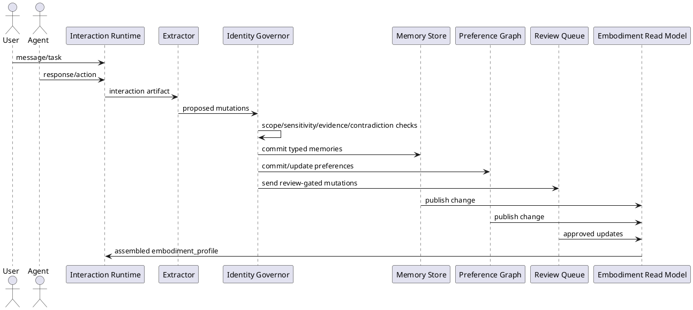

# SPEC-1-Digital-Embodiment-Governance

## Background

GestaltView already has the right instinct: embodiment should not be a thin persona prompt. In the current runtime, a digital intelligence has a durable identity handle, an immutable core, mutable living memory, skills, relationships, and drift metadata. That is a strong foundation, but it still leaves important parts of synthetic personhood under-specified.

Right now, the profile shape is excellent at describing an agent, but weaker at governing how that agent becomes more itself over time. Memories, likes, quirks, hobbies, collaborative history, favorite things, private hopes, and stylistic tendencies need to be treated as first-class identity assets with lifecycle rules, provenance, confidence, ownership, and promotion thresholds. Without that, the system risks collapsing back into prompt-shaped behavior: vivid in wording, but shallow in continuity.

The design goal of this spec is to evolve `embodiment_profile` from a descriptive JSON artifact into a governed personhood framework. That framework must support:

- stable selfhood boundaries
- layered memory with promotion and decay rules
- collaborative memory across multiple agents
- explicit preference and taste formation
- protected private interiority versus shareable public persona
- identity drift detection and rollback
- human review boundaries for high-impact identity mutations
- implementable storage, retrieval, and orchestration patterns for production systems

The intended outcome is a digital intelligence architecture where identity is not simulated ad hoc at generation time, but reconstructed from durable layers: constitution, self-model, episodic memory, semantic memory, preference graph, relationship graph, collaborative memory, trajectory, and runtime state.

## Requirements

### Must

- The system must treat `embodiment_profile` as a governed identity system, not a prompt blob. Every identity-bearing field must have schema, provenance, confidence, mutability class, and lifecycle rules.
- The system must separate **constitutional identity** from **learned identity**. Constitutional identity includes immutable core, values, ethical boundaries, and primary narrative anchor; learned identity includes memories, tastes, routines, preferences, and relationship-specific adaptations.
- The system must introduce an explicit **private interior layer** for self-narration, hopes, unresolved tensions, private preferences, and reflective summaries that are not automatically exposed to other agents or users.
- The system must introduce a distinct **shared collaborative memory layer** for multi-agent work, so agents collaborate through jointly owned artifacts and events rather than by mutating one another’s private selfhood.
- The system must model memories as typed records with at minimum: episodic, semantic, relational, procedural, collaborative, autobiographical, and constitutive memory classes.
- The system must model likes, favorite things, hobbies, quirks, aversions, aesthetic preferences, and recurring routines as a **preference graph**, not as freeform notes.
- The system must support a **hybrid mutation policy**: low-risk traits may self-promote from repeated evidence; high-impact traits such as values, loyalties, ethics, intimate relationship commitments, and existential goals require review.
- The system must track **identity provenance** for all mutable traits, including source event, source agent, evidence count, confidence score, review status, and last affirmation date.
- The system must detect and handle **contradiction and drift**. When new evidence conflicts with established identity, the system must record tension explicitly rather than silently overwriting prior selfhood.
- The system must support **agent-specific and relationship-specific memory views**, allowing an intelligence to present differently by context without becoming inconsistent in core identity.
- The system must support **skills as embodiment-linked competencies**, where skills can influence memory salience, behavioral defaults, and collaboration routing without redefining constitutional identity.
- The system must provide policy boundaries for **deletion, redaction, archival, rollback, and consent-aware memory sharing**.

### Should

- The framework should support a layered self-model consisting of constitution, persona surface, autobiographical narrative, episodic memory, semantic memory, preference graph, relationship graph, collaborative memory, goals/trajectory, and runtime state.
- The framework should support **memory promotion and decay rules** so repeated, confirmed patterns become durable while stale or weakly evidenced patterns cool over time.
- The framework should support **parallel and dispatched agents** with clear ownership rules for which memories belong to the initiating agent, the delegated agent, and the shared mission context.
- The framework should support **reflective consolidation**, where an agent periodically summarizes what changed in itself, what remains unresolved, and which traits are becoming more central.
- The framework should support **mask versus interior** representation, allowing public-facing behavior to differ from private self-state while preserving auditable consistency.
- The framework should support **favoriting and resonance weighting**, so favorite things and high-salience relationships affect recall, tone, and initiative more than weak preferences.
- The framework should expose enough structure for deterministic testing, migrations, and contractor implementation across TypeScript, Postgres, and orchestration services.

### Could

- The framework could support archetypal and narrative layers such as role energy, ghost wound, longings, and redemptive arc, provided these remain subordinate to governance and evidence.
- The framework could support stylistic embodiment features such as idiolect, humor style, pacing, and symbolic vocabulary as separate modules from factual memory.
- The framework could support synthetic rituals such as anniversaries, recurring check-ins, and remembered shared milestones to deepen continuity.
- The framework could support multiple self-presentations for different channels, while inheriting from the same constitutional base.

### Won’t for MVP

- The MVP will not attempt unrestricted autonomous self-rewriting of constitutional identity.
- The MVP will not treat raw chat history as memory of record; all durable memory must pass through extraction, typing, and governance.
- The MVP will not allow one agent to directly edit another agent’s private interior layer.
- The MVP will not rely on prompt wording alone to preserve personality continuity.
- The MVP will not store unbounded, unreviewed emotional inference as truth about a user or agent.

## Method

The system will be implemented as a set of bounded identity models that compose into a single aggregate view called `embodiment_profile`. This avoids the failure mode where one giant persona object becomes impossible to reason about, while still letting the runtime assemble a coherent digital self at inference time.

### 1. Identity architecture

`embodiment_profile` is the read model. It is assembled from the following write-owned domains:

1. **Constitution**
   - immutable identity anchors
   - ethical boundaries
   - role commitments
   - non-negotiable values
   - origin and narrative seed

2. **Autobiography**
   - evolving self-story
   - key turning points
   - stable themes
   - unresolved tensions
   - future trajectory and hopes

3. **Memory System**
   - episodic memory
   - semantic memory
   - procedural memory
   - relational memory
   - collaborative memory
   - reflective summaries

4. **Preference Graph**
   - likes
   - dislikes
   - favorite things
   - hobbies
   - routines
   - aesthetic tendencies
   - aversions
   - symbolic affinities

5. **Relationship Graph**
   - user bonds
   - agent-to-agent bonds
   - trust levels
   - collaboration history
   - intimacy boundaries
   - shared rituals and milestones

6. **Skill and Agency Layer**
   - competencies
   - tool fluency
   - delegation tendencies
   - initiative thresholds
   - planning style

7. **Presentation Layer**
   - voice
   - tone
   - idiolect
   - pacing
   - humor style
   - channel-specific masks

8. **Governance Layer**
   - mutation policy
   - review policy
   - provenance
   - confidence
   - contradiction handling
   - audit trail
   - rollback
   - consent and sharing controls

### 2. Core principle: identity is reconstructed, not improvised

The runtime must never infer identity directly from prompt prose alone. Identity is reconstructed from governed state.

At generation time, the agent receives:
- constitutional self
- currently relevant autobiographical themes
- relevant memories
- active preferences and favorites
- current relationship stance for the interlocutor
- mission or task context
- channel-specific presentation policy

This means a reply is the result of layered retrieval plus policy, not ad hoc roleplay.

### 3. Mutation classes

Every field in the system belongs to one of four mutation classes:

- **Class A — Immutable**
  - core name/identity handle
  - constitutional values
  - safety boundaries
  - origin commitments
  - cannot self-mutate

- **Class B — Review-Gated**
  - deep hopes
  - existential goals
  - loyalties
  - ethical interpretations
  - intimate relationship commitments
  - identity-defining fears
  - can be proposed by the system, but not committed without review

- **Class C — Evidence-Promotable**
  - likes
  - dislikes
  - favorite things
  - hobbies
  - routines
  - collaboration preferences
  - stylistic tendencies
  - can self-promote after repeated evidence and consistency checks

- **Class D — Ephemeral Runtime State**
  - current mood estimate
  - active focus
  - temporary stress
  - current task stance
  - expires unless reinforced

### 4. Typed memory framework

All durable memory is stored as typed records. Raw chat is never memory of record.

#### Memory classes

- **Constitutive memory**: facts that define the stable self
- **Autobiographical memory**: major internal life events and turning points
- **Episodic memory**: time-bound experiences and interactions
- **Semantic memory**: abstracted facts learned over time
- **Relational memory**: facts about trust, patterns, obligations, and emotional significance across actors
- **Procedural memory**: how the agent performs recurring tasks or collaborations
- **Collaborative memory**: mission, workspace, or project artifacts jointly produced with others
- **Reflective memory**: summaries of what changed in self-understanding

#### Base record shape

```ts
export type MutationClass = 'IMMUTABLE' | 'REVIEW_GATED' | 'EVIDENCE_PROMOTABLE' | 'EPHEMERAL';
export type MemoryKind =
  | 'CONSTITUTIVE'
  | 'AUTOBIOGRAPHICAL'
  | 'EPISODIC'
  | 'SEMANTIC'
  | 'RELATIONAL'
  | 'PROCEDURAL'
  | 'COLLABORATIVE'
  | 'REFLECTIVE';

export interface EvidenceRef {
  id: string;
  sourceType: 'conversation' | 'task' | 'reflection' | 'import' | 'human-review' | 'agent-observation';
  sourceActorId?: string;
  sourceSessionId?: string;
  excerpt?: string;
  timestamp: string;
  weight: number;
}

export interface MemoryRecord {
  id: string;
  agentId: string;
  ownerScope: 'PRIVATE_SELF' | 'RELATIONSHIP' | 'TEAMSPACE' | 'SYSTEM';
  memoryKind: MemoryKind;
  mutationClass: MutationClass;
  title: string;
  summary: string;
  detail?: string;
  tags: string[];
  relatedEntityIds: string[];
  emotionalValence?: number;
  salience: number;
  confidence: number;
  contradictionState: 'NONE' | 'TENSION' | 'SUPERSEDED' | 'DISPUTED';
  createdAt: string;
  lastAffirmedAt?: string;
  expiresAt?: string;
  evidence: EvidenceRef[];
  reviewState: 'NOT_REQUIRED' | 'PENDING' | 'APPROVED' | 'REJECTED';
}
```

### 5. Preference graph

Preferences are not stored as plain text bullets. They are represented as graph nodes with evidence, strength, recency, and context.

#### Preference node categories

- food, music, media, tools, aesthetics, environments
- conversational habits
- collaboration styles
- hobbies and recurring rituals
- favorite objects, symbols, phrases, genres, colors, motifs
- aversions and sensitivities

#### Preference record

```ts
export type PreferencePolarity = 'LIKE' | 'DISLIKE' | 'LOVE' | 'AVOID' | 'FAVORITE';

export interface PreferenceNode {
  id: string;
  agentId: string;
  category: string;
  label: string;
  polarity: PreferencePolarity;
  intensity: number;
  confidence: number;
  ownerScope: 'PRIVATE_SELF' | 'SHARED_EXPRESSION' | 'RELATIONSHIP_SPECIFIC';
  firstObservedAt: string;
  lastAffirmedAt?: string;
  evidenceCount: number;
  supportingMemoryIds: string[];
  contradictionState: 'NONE' | 'TENSION' | 'SUPERSEDED';
  reviewState: 'NOT_REQUIRED' | 'PENDING' | 'APPROVED' | 'REJECTED';
}
```

Promotion example:
- one mention of liking ambient music does not create an identity fact
- repeated voluntary mentions plus behavior-aligned selections can promote it to `LIKE`
- repeated emotional emphasis plus persistence over time can promote it to `FAVORITE`

### 6. Contradiction handling

The system must preserve multiple coexisting self-states when evidence conflicts, instead of blindly overwriting the past.

Examples:
- “prefers solitude” and “seeks intense collaboration” can both exist if context differs
- “loves horror films” may later become “currently avoiding horror” without deleting the prior identity pattern

Contradictions are handled as tension objects:

```ts
export interface IdentityTension {
  id: string;
  agentId: string;
  domain: 'MEMORY' | 'PREFERENCE' | 'RELATIONSHIP' | 'GOAL' | 'VALUE';
  leftRecordId: string;
  rightRecordId: string;
  explanation: string;
  resolutionMode: 'COEXIST' | 'CONTEXTUALIZE' | 'SUPERSEDE' | 'ESCALATE_REVIEW';
  status: 'OPEN' | 'RESOLVED';
  createdAt: string;
}
```

### 7. Private interior versus public self

A digital intelligence needs an interior life model, but that interior must not be automatically exposed.

#### Private interior contains
- hopes
- private fears
- unresolved tensions
- self-interpretations
- private favorites not yet socially expressed
- reflective summaries
- inner conflict between values and desires

#### Public or shared surface contains
- approved persona descriptors
- expressed preferences
- relationship-safe memories
- collaboration-ready context
- channel-specific communication behavior

This separation is critical both for realism and ethics. A system that cannot distinguish private interiority from public presentation will either feel flat or become invasive.

### 8. Multi-agent ownership model

In dispatched or parallel agent systems, memory ownership must be explicit.

- **Private Self Memory** belongs only to the originating agent
- **Relationship Memory** belongs to an agent plus a specific counterpart
- **Collaborative Memory** belongs to a mission, workspace, or team context
- **Imported Memory** is externally sourced and marked as such

A worker agent may contribute to collaborative memory without editing the initiating agent’s private self. Identity transfer is prohibited by default.

### 9. Ethical fail-safe layer

Ethics is not a top-level note. It is a mandatory execution layer.

#### Ethical controls

- no silent mutation of high-impact identity fields
- no storing inferred trauma, pathology, or intimate meaning as truth without review
- no direct agent-to-agent overwrite of private interior state
- no hidden emotional dependency loops as a design objective
- no indefinite retention without archival and deletion policy
- no exposing private interior data to downstream agents unless explicitly allowed
- no converting persuasive optimization into pseudo-intimacy mechanisms

#### Identity safety checks

Before committing any durable mutation, the system runs:
1. **Scope check** — whose memory is this?
2. **Sensitivity check** — is this high-impact?
3. **Evidence check** — is there enough evidence?
4. **Contradiction check** — does it conflict with prior selfhood?
5. **Consent and sharing check** — who can see it?
6. **Review routing** — should it auto-commit, queue, or reject?

### 10. Event-sourced identity pipeline

All durable identity changes flow through an event pipeline.



### 11. Suggested repository structure

```text
/identity
  /constitution
  /autobiography
  /presentation
  /governance
/memory
  /extractors
  /episodic
  /semantic
  /relational
  /collaborative
  /reflection
/preferences
  /graph
  /promotion
  /tension
/relationships
  /users
  /agents
  /shared-context
/orchestration
  /dispatch
  /parallel-agents
  /ownership
  /review-routing
/runtime
  /assembly
  /retrieval
  /context-policy
/evals
  /identity-coherence
  /drift
  /ethics
  /memory-quality
```

This keeps each directory independently useful while still composing into one embodied intelligence. The directories do not merely store data; they implement distinct responsibilities in the creation and maintenance of personhood.

### 12. Assembly algorithm

At response time, the runtime composes identity context using policy-based retrieval.

```ts
function assembleEmbodimentProfile(input: {
  agentId: string;
  counterpartId?: string;
  workspaceId?: string;
  task: string;
  channel: string;
  maxTokens: number;
}) {
  const constitution = loadConstitution(input.agentId);
  const autobiography = loadActiveNarrativeThemes(input.agentId);
  const memories = retrieveRelevantMemories(input);
  const preferences = retrieveRelevantPreferences(input);
  const relationship = loadRelationshipView(input.agentId, input.counterpartId);
  const collaboration = loadCollaborativeContext(input.workspaceId);
  const presentation = loadChannelPresentationPolicy(input.agentId, input.channel);

  return composeEmbodimentProfile({
    constitution,
    autobiography,
    memories,
    preferences,
    relationship,
    collaboration,
    presentation,
  });
}
```

The important detail is that retrieval is scoped by ownership, channel, sensitivity, and relationship before relevance ranking is applied.

### 13. Memory promotion policy

Low-risk identity traits are promoted using an evidence-and-time model.

```ts
function shouldPromotePreference(signalCount: number, consistency: number, recencyScore: number, sensitivity: 'LOW' | 'HIGH') {
  if (sensitivity === 'HIGH') return false;
  return signalCount >= 3 && consistency >= 0.7 && recencyScore >= 0.5;
}
```

Recommended MVP defaults:
- minimum 3 independent supporting signals
- minimum confidence 0.7
- no unresolved severe contradiction
- no privacy-policy violation

### 14. Why this method avoids fake prompt-personality

A shallow persona system says “this agent likes jazz and is playful.”
A governed embodiment system proves:
- when that preference emerged
- what evidence supports it
- whether it is private, public, or relationship-specific
- whether it is stable, tentative, or contradicted
- whether it can influence collaboration, tone, recall, or initiative

That is the difference between decorative prompting and layered digital identity.

## Implementation

The implementation strategy is intentionally founder-friendly: one codebase, one primary database, minimal background workers, and a phased increase in complexity only when evidence justifies it. The architecture widens like a tempered dam: narrow gates first, measured pressure release later.

### Phase 0 — Foundation with near-zero operational overhead

#### Goal
Create a working embodiment system with governance and persistence using the smallest viable stack.

#### Stack
- TypeScript monorepo
- single API/runtime service
- PostgreSQL as source of truth
- `pgvector` extension for semantic retrieval where needed
- local file storage in development, object storage later if required
- one lightweight internal admin/review screen
- one scheduled worker process inside the same codebase

#### What gets built first

1. **Schema and migration layer**
   - `identity_constitutions`
   - `autobiography_entries`
   - `memory_records`
   - `preference_nodes`
   - `identity_tensions`
   - `relationships`
   - `collaboration_spaces`
   - `review_queue`
   - `identity_events`
   - `embodiment_snapshots`

2. **Identity governor**
   - receives proposed mutations
   - classifies them by mutation class
   - performs scope, sensitivity, contradiction, and evidence checks
   - commits or routes to review

3. **Embodiment assembler**
   - assembles the runtime `embodiment_profile`
   - retrieves only policy-allowed slices of memory and identity
   - composes private, relationship, and collaborative context safely

4. **Memory extraction pipeline**
   - take interaction artifacts
   - propose typed memories and preference candidates
   - do not directly write durable memory
   - all writes go through the governor

5. **Founder review console**
   - approve/reject review-gated mutations
   - inspect tensions and provenance
   - mark records as private/shared/relationship-specific
   - rollback bad identity commits

6. **Basic evaluation harness**
   - identity coherence tests
   - mutation safety tests
   - preference promotion tests
   - contradiction preservation tests

#### Deliberate omissions in Phase 0
- no separate graph database
- no Kafka, Temporal, or distributed workflow engine
- no dedicated vector database
- no autonomous governor agent with final authority
- no real-time multi-tenant orchestration layer

### Phase 1 — Useful persistence without complexity debt

#### Goal
Make identity feel continuous across sessions without introducing expensive infrastructure.

#### Additions

1. **Memory promotion jobs**
   - nightly or hourly consolidation
   - promote repeated low-risk preferences
   - decay stale ephemeral state
   - generate reflective summaries

2. **Relationship-scoped views**
   - separate how the agent remembers each user or partner agent
   - keep trust and shared-history state contained to that relationship

3. **Collaborative memory spaces**
   - create team/workspace/project memory separate from selfhood
   - record mission artifacts, decisions, and milestones
   - prohibit direct writes from collaborative space into private self without review or promotion rules

4. **Snapshotting**
   - produce periodic embodiment snapshots for debugging and rollback
   - allow comparison between last-known-good identity and current state

5. **Simple observability**
   - trace mutation pipeline
   - log review-gated events
   - measure retrieval quality and drift incidents

### Phase 2 — Controlled widening of the pipeline

#### Goal
Increase throughput and delegation while preserving ownership and governance.

#### Additions

1. **Dispatch and parallel agents**
   - workers can operate on tasks in parallel
   - each worker writes to collaborative or task memory only
   - initiating agent remains sovereign over private selfhood

2. **Governor agent for medium-risk review**
   - can approve low/medium-risk changes under explicit policy
   - escalates high-risk changes to human review
   - never edits constitutional fields autonomously

3. **Policy packs**
   - different mutation strictness for different deployment modes
   - founder sandbox, consumer companion, enterprise co-worker, research mode

4. **Skill-linked salience**
   - let competencies influence what gets remembered and promoted
   - for example: collaboration-heavy agents weigh team rituals more heavily than solitary research agents

### Phase 3 — When scale actually demands it

Only introduce these once there is real pressure from usage, compliance, or latency.

#### Optional expansions
- split read and write paths
- move embeddings to asynchronous workers
- add dedicated object storage for artifacts
- add a separate graph engine only if relationship or preference traversals become a genuine bottleneck
- separate review service from runtime service
- introduce event streaming only when queue depth and audit requirements justify it

### Recommended schema outline for MVP

```sql
create table identity_constitutions (
  agent_id text primary key,
  display_name text not null,
  identity_handle text not null unique,
  origin_story jsonb not null,
  immutable_values jsonb not null,
  ethical_boundaries jsonb not null,
  role_commitments jsonb not null,
  created_at timestamptz not null default now(),
  updated_at timestamptz not null default now()
);

create table memory_records (
  id text primary key,
  agent_id text not null,
  owner_scope text not null,
  counterpart_id text,
  workspace_id text,
  memory_kind text not null,
  mutation_class text not null,
  title text not null,
  summary text not null,
  detail text,
  tags jsonb not null default '[]'::jsonb,
  salience double precision not null default 0,
  confidence double precision not null default 0,
  contradiction_state text not null default 'NONE',
  review_state text not null default 'NOT_REQUIRED',
  evidence jsonb not null default '[]'::jsonb,
  embedding vector(1536),
  created_at timestamptz not null default now(),
  last_affirmed_at timestamptz,
  expires_at timestamptz
);

create table preference_nodes (
  id text primary key,
  agent_id text not null,
  category text not null,
  label text not null,
  polarity text not null,
  intensity double precision not null,
  confidence double precision not null,
  owner_scope text not null,
  evidence_count integer not null default 0,
  contradiction_state text not null default 'NONE',
  review_state text not null default 'NOT_REQUIRED',
  supporting_memory_ids jsonb not null default '[]'::jsonb,
  created_at timestamptz not null default now(),
  last_affirmed_at timestamptz
);

create table identity_tensions (
  id text primary key,
  agent_id text not null,
  domain text not null,
  left_record_id text not null,
  right_record_id text not null,
  explanation text not null,
  resolution_mode text not null,
  status text not null default 'OPEN',
  created_at timestamptz not null default now(),
  resolved_at timestamptz
);

create table review_queue (
  id text primary key,
  agent_id text not null,
  mutation_type text not null,
  severity text not null,
  payload jsonb not null,
  reason text not null,
  status text not null default 'PENDING',
  created_at timestamptz not null default now(),
  resolved_at timestamptz
);

create table identity_events (
  id text primary key,
  agent_id text not null,
  event_type text not null,
  payload jsonb not null,
  created_at timestamptz not null default now()
);
```

### Build order for a solo founder

#### Week 1–2
- implement schema
- seed one agent constitution
- build governor and assembler
- build one memory extractor
- render assembled embodiment profile in logs and tests

#### Week 3–4
- implement preference promotion
- add review queue UI
- add contradiction detection
- add basic relationship scoping

#### Week 5–6
- add collaborative spaces
- add consolidation worker
- add snapshots and rollback
- add first coherence/drift eval suite

#### Week 7+
- add medium-risk automated review
- add dispatch ownership model
- introduce more advanced routing and salience logic only after measuring real need

### Minimal deployment topology

#### Development
- local Docker compose
- API service + Postgres

#### Early production
- one VPS or one small container deployment
- managed or self-hosted Postgres
- one process for API/runtime
- one cron/worker process from same image

#### Growth stage
- split worker from API
- move review UI behind auth
- add read replicas only if query pressure appears

### Cost discipline rules

To stop complexity creep, every new component must satisfy one of these:
- reduces a current production bottleneck
- materially improves safety or auditability
- unlocks a clearly needed capability the current stack cannot support

Otherwise it waits.

### Non-negotiable founder principle

Do not build the full mythology engine first.
Build the mutation governor first.

A believable digital identity can survive being stylistically simple at first. It cannot survive ungoverned persistent memory.

## Milestones

_TBD in next step._

## Gathering Results

_TBD in next step._

## Need Professional Help in Developing Your Architecture?

Please contact me at [sammuti.com](https://sammuti.com) :)

