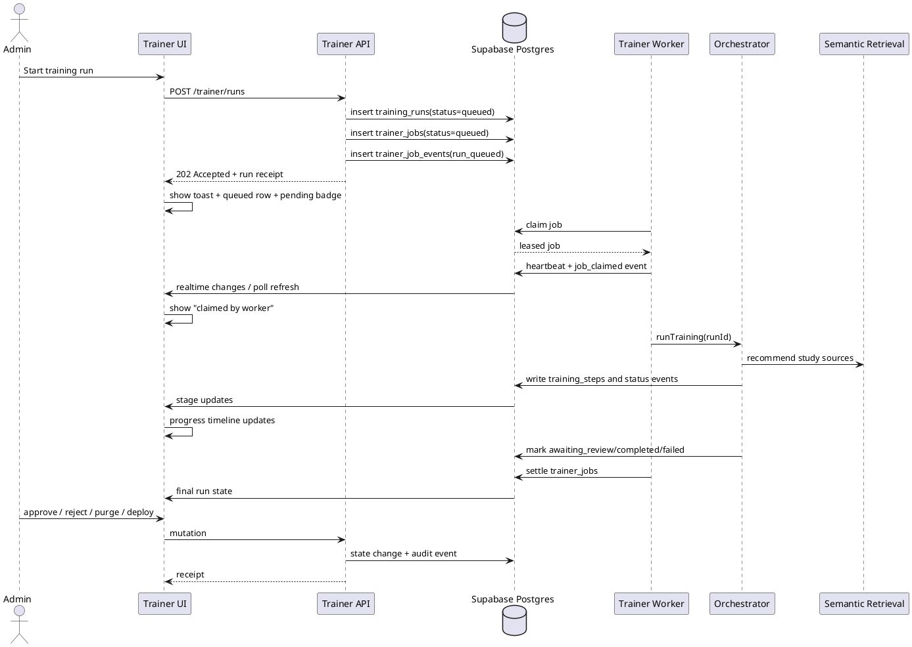
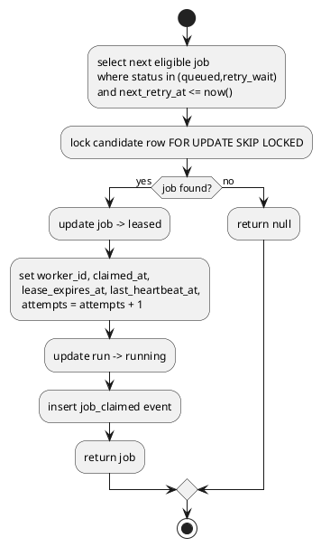
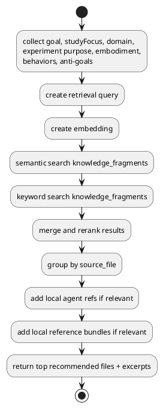

# SPEC-1-Trainer Control Plane Stabilization

## Background

The current Agent Trainer control plane is close to being useful, but it is not yet trustworthy for an operator who needs to move quickly and confidently.

From the current implementation and founder feedback, the highest-friction issues are:

- training runs can enter a queued state without obvious proof that execution has started
- queue actions such as delete and purge do not produce strong visible confirmation
- cancelled or purged work does not clearly leave the operator’s field of view
- the page relies on silent state refresh instead of explicit action receipts, progress states, and outcome messages
- study-source selection is manual and ranked heuristically, while the available Supabase knowledge corpus is already large enough to justify semantic retrieval

This creates a “traffic-jammed decoration” problem: the control plane looks like it accepts work, but does not reliably communicate whether work moved, failed, or is blocked. For a founder-led workflow, that is the wrong failure mode.

The redesign should therefore prioritize operational trust first, then visual refinement. The trainer page must become an execution dashboard with strong feedback, queue recovery, and retrieval-assisted source selection.

## Requirements

### Must

- Starting a training run must always produce an immediate visible state change.
- Every destructive or state-changing action must emit a clear success, failure, or in-progress confirmation.
- Queued runs must have an explicit execution path with no silent dependency on hidden infrastructure.
- The queue must support deterministic cleanup for queued, cancelled, failed, and awaiting-review runs.
- The page must show why a run is blocked, who can unblock it, and what the next valid action is.
- The selected run must visibly change after delete, purge, approve, reject, or deploy actions.
- Run history must distinguish active queue items from historical records.
- Training-source selection must support semantic retrieval from the existing Supabase knowledge corpus.
- The redesign must work with the current Supabase-backed training data model and be directly implementable by contractors.

### Should

- The page should separate “Create run”, “Queue health”, “Review queue”, and “History” into distinct operator zones.
- The queue should expose worker/job state in addition to run state.
- The UI should include optimistic status indicators, toast receipts, and inline recovery prompts.
- The page should support bulk queue actions for stale runs.
- Source selection should recommend the top corpus files and fragments based on experiment goal, domain, and study focus.
- The system should maintain an immutable audit trail for review and destructive actions.

### Could

- The page could support live updates through Supabase Realtime instead of polling-only behavior.
- The page could expose a “dry run / validation only” mode before spending inference budget.
- The page could add saved source presets such as Billy, PLK, Product, API, or Memory Care packs.
- The page could include neurodivergent-friendly view modes with stronger motion reduction, larger action affordances, and simplified focus states.

### Won’t for MVP

- Full visual brand overhaul before queue correctness is fixed.
- End-user hosted trainer runtime changes unrelated to admin control-plane reliability.
- Broad retraining architecture changes outside the trainer, governance, and knowledge-source flow.

## Method

This redesign treats the trainer as an **operator control plane**, not a form page. The operator must always know:

- whether an action was accepted
- whether work is queued, leased, running, blocked, awaiting review, failed, or finished
- what exactly changed after a destructive action
- which knowledge sources were selected and why

The current codebase already contains strong ingredients:

- `training_runs`, `training_steps`, `trainer_jobs`, approvals, evals, and artifacts in persistence
- an orchestrator that can run the training pipeline
- a worker loop in `main.ts` that claims and executes jobs
- an existing knowledge-fragment corpus and embeddings store in Supabase
- UI panels for experiments, review queue, and training runs

The missing piece is a reliable contract between **UI state**, **queue state**, **worker state**, and **retrieval state**.

### Design influence from proven products

This MVP borrows interaction patterns from three categories of existing systems:

- **GitHub Actions** style run/job/step visibility: operators can see a run, its sub-steps, and whether it is queued, running, failed, or completed.
- **Vercel Deployments** style actionable progress: submissions return immediate status, promotion is explicit, and historical items are clearly separated from active work.
- **Linear** style workflow lanes and health indicators: filtered views, health labeling, and strong progress/state visibility reduce operator anxiety and ambiguity.

### Core design principles

1. **No silent actions.** Every mutation returns a receipt, changes the UI immediately, and leaves an audit trail.
2. **Run state and job state are separate.** A run describes business workflow; a job describes execution.
3. **The page explains blockage.** If a run cannot start, the operator sees the blocking run, reason, and next valid action.
4. **Active work is separate from history.** Deleted, purged, cancelled, failed, awaiting-review, and completed items do not blur together.
5. **Source selection is recommendation-first.** Manual source picking remains available, but the system should recommend the best corpus fragments automatically.
6. **Trust first, polish second.** Visual improvements are important, but only after the queue is operationally trustworthy.

### Proposed control-plane architecture

The MVP keeps the current data model and orchestrator, but strengthens it with explicit worker observability, structured event logging, queue-health views, and semantic retrieval.



### Run and job state model

The existing schema already distinguishes run status and job status, but the UI does not surface that distinction well enough.

#### Run states

- `queued`
- `running`
- `awaiting_review`
- `completed`
- `failed`
- `cancelled`

#### Job states

- `queued`
- `leased`
- `done`
- `failed`
- `cancelled` (new for MVP)
- `retry_wait` (new for MVP)

#### State rules

- A run is created as `queued` only after both the `training_runs` row and the `trainer_jobs` row succeed.
- A worker claim changes job state to `leased` and writes a `job_claimed` event.
- A run becomes `running` only when the worker has actually claimed the job.
- A run becomes `awaiting_review` after successful generation and evaluation, before human approval.
- A run becomes `completed` only after approval or successful non-review finalization.
- Delete means **cancel from active queue**; purge means **hard-remove queue-local records and generated child records** for queue-mutable runs.
- If a worker lease expires, the sweeper either re-queues the job or marks it failed with a visible reason.

### Queue reliability changes

The current architecture already has a worker loop. The problem is that the operator cannot tell whether it is alive or stalled. The MVP therefore keeps the current worker model and adds the missing observability.

#### 1. Extend `trainer_jobs`

Add the following columns to the existing table:

- `worker_id text null`
- `claimed_at timestamptz null`
- `completed_at timestamptz null`
- `last_heartbeat_at timestamptz null`
- `max_attempts integer not null default 3`
- `next_retry_at timestamptz not null default now()`
- `lease_token uuid null`
- `cancel_requested boolean not null default false`

Recommended indexes:

- `(status, next_retry_at, created_at)`
- `(run_id)` unique where appropriate
- `(lease_expires_at)`

#### 2. Add `trainer_workers`

```text
trainer_workers
- worker_id text primary key
- status text check in ('starting','idle','busy','offline')
- current_job_id uuid null
- build_sha text null
- host text null
- started_at timestamptz not null default now()
- last_heartbeat_at timestamptz not null default now()
- metadata jsonb not null default '{}'
```

This lets the page show:

- no workers online
- worker online but idle
- worker busy on run X
- worker stale / heartbeat expired

#### 3. Add `trainer_job_events`

```text
trainer_job_events
- event_id uuid primary key default gen_random_uuid()
- run_id uuid not null references training_runs(run_id)
- job_id uuid null references trainer_jobs(job_id)
- actor_type text check in ('system','worker','admin')
- actor_id text null
- event_type text not null
- message text not null
- payload jsonb not null default '{}'
- created_at timestamptz not null default now()
```

This is the operational backbone for receipts and timeline entries.

Example `event_type` values:

- `run_queued`
- `job_claimed`
- `job_heartbeat`
- `stage_started`
- `stage_completed`
- `stage_failed`
- `run_cancel_requested`
- `run_cancelled`
- `run_purged`
- `review_submitted`
- `run_approved`
- `run_rejected`
- `run_deployed`

#### 4. Add a sweeper function

A scheduled cleanup function should run every minute and do three things:

- mark workers without recent heartbeat as `offline`
- move `leased` jobs with expired leases back to `retry_wait` or `failed`
- repair runs stuck in `queued` or `running` without a valid active job

This can be implemented with `pg_cron` plus an HTTP or SQL-triggered repair function.

### Blocking and duplicate-run policy

Right now the trainer can feel globally jammed. The MVP needs explicit blocking rules.

#### Rule

Allow multiple runs overall, but allow only **one active run per agent slug or experiment** in statuses:

- `queued`
- `running`
- `awaiting_review`

Implementation:

- enforce in API before insert
- optionally back with a partial unique index or conflict-check transaction
- on conflict return `409` with:
  - blocking run id
  - blocking status
  - created-at timestamp
  - allowed next actions: `resume`, `cancel`, `purge`, or `view`

The UI should surface this as a clear blocker card, not a generic error.

### Semantic study-source retrieval

The uploaded corpus already justifies semantic retrieval. The provided knowledge stats show roughly **29,466 fragments across 585 files and about 31 million characters**, distributed across document types such as Documentation, Architecture, Product, API, Diligence, PLK, Billy, and WellnessApplication. Manual source-picking should become optional, not mandatory.

The current implementation mainly lists sources by type and count. The MVP should replace that with **hybrid retrieval**.

#### Retrieval inputs

Build a retrieval query from:

- run `goal`
- `studyFocus`
- `domain`
- selected experiment title and purpose
- embodiment profile slug
- target behaviors
- anti-goals

#### Retrieval pipeline

1. Build a normalized retrieval query string.
2. Create an embedding for that query.
3. Run semantic similarity over `knowledge_fragments.embedding`.
4. Run keyword / full-text search over fragment content and tags.
5. Combine the scores.
6. Group results by `source_file`.
7. Re-rank with domain and document-type boosts.
8. Return top recommended source files plus top fragments per file.
9. Merge in deterministic local references and local subagent references when relevant.

#### Recommended scoring

```text
final_score =
  0.55 * semantic_similarity
+ 0.20 * keyword_score
+ 0.15 * document_type_boost
+ 0.10 * domain_or_embodiment_boost
```

#### Required RPCs / SQL objects

Add a hybrid-search RPC such as `trainer_search_study_sources` that returns:

```text
- source_file text
- document_type text
- fragment_id uuid
- excerpt text
- semantic_score numeric
- keyword_score numeric
- final_score numeric
- tags text[]
```

Add or maintain:

- HNSW index on `knowledge_fragments.embedding`
- generated `tsvector` column for `content`
- GIN index on the text-search column
- optional metadata GIN index for document-type and tag filters

#### What the operator sees

Instead of only a giant source list, the page shows:

- **Recommended for this run**
- why each source was chosen
- confidence score
- fragment count used
- toggles to pin, remove, or replace sources

This preserves manual control while removing the cognitive tax.

### UI redesign

The page should be split into five explicit zones.

#### 1. Create Run

Purpose: define intent, choose experiment, review auto-selected sources, and queue the run.

Behavior:

- Start button changes immediately to `Submitting...`
- on success, show inline receipt card: `Run queued • waiting for worker claim`
- selected source recommendations appear before submission
- if blocked, replace submit success with blocker card and action buttons

#### 2. Queue Health

Purpose: show whether the system itself is healthy.

Widgets:

- workers online / offline
- queued jobs count
- leased jobs count
- stale leases count
- failed jobs count
- awaiting-review count
- oldest queued age

Actions:

- retry stale job
- cancel stale run
- purge cancelled queue items
- refresh queue health

#### 3. Active Run Console

Purpose: show exactly what the current run is doing.

Content:

- prominent run state badge
- job state badge
- elapsed time
- stage timeline
- last event message
- worker identity / heartbeat freshness
- progress bar derived from stage weights

Stage weights for MVP:

- normalize 5%
- curriculum 10%
- scenario_expand 15%
- author 25%
- evaluate 25%
- critique 12%
- safety 8%

When `package` exists, it completes the final 100% state.

#### 4. Review Queue

Purpose: human governance decisions.

Enhancements:

- stronger blocked-state explanation when unresolved policy flags exist
- review submission receipt with saved scores and notes
- decision outcome immediately visible on the run card and experiment card

#### 5. History

Purpose: archive completed, failed, rejected, cancelled, and deployed runs.

Behavior:

- active queue items do not mix with historical items
- failed runs show last error inline
- purged items disappear from active views immediately but remain represented by an audit event if required by governance

### Action-feedback contract

Every mutation must return a structured response and create an event row.

#### Required client behavior per action

**Start training**
- immediate toast: `Run queued`
- inline row state: `Queued`
- when worker claims: replace with `Worker claimed job`
- while processing: update stage timeline
- on completion: `Awaiting review` or `Completed`

**Delete / cancel**
- immediate optimistic state: `Cancelling...`
- on success: move run from active queue to cancelled/history lane
- if worker already claimed the job: show `Cancel requested` until worker settles or sweeper reconciles

**Purge**
- immediate modal confirmation with exact consequences
- on success: remove row from current list and auto-select next valid row
- create event: `run_purged`

**Approve / reject**
- save decision, toast result, and visibly update version/run state

**Deploy**
- show deployment path and completion status in the run artifact list

### API contract changes

The API should return operator-friendly receipts instead of minimal mutation success.

#### Example response shape

```json
{
  "ok": true,
  "run": { "runId": "...", "status": "queued" },
  "receipt": {
    "code": "run_queued",
    "message": "Run queued and waiting for worker claim.",
    "eventId": "...",
    "createdAt": "..."
  },
  "queue": {
    "jobStatus": "queued",
    "workerOnline": true,
    "oldestQueuedAgeMs": 1200
  }
}
```

#### Required endpoints

Keep current endpoints and add:

- `GET /api/trainer/queue-health`
- `GET /api/trainer/runs/:id/events`
- `POST /api/trainer/jobs/:id/retry`
- `POST /api/trainer/runs/:id/cancel-request`
- `GET /api/trainer/study-sources/recommendations?runDraft=...`

### Realtime strategy

The existing polling behavior can remain as fallback, but the page should subscribe to live updates for:

- `training_runs`
- `trainer_jobs`
- `training_steps`
- `trainer_job_events`
- `trainer_workers`

For MVP, simple database-change subscriptions are acceptable. Later, this can move to a broadcast-based event stream if needed.

### Concrete database changes

#### Alter existing tables

**training_runs**
- add `blocked_reason text null`
- add `last_event_at timestamptz null`
- add `last_event_message text null`

**trainer_jobs**
- add queue/worker observability fields listed earlier
- extend status check to include `retry_wait` and `cancelled`

#### New view

```text
trainer_queue_health_v
- queued_count
- leased_count
- retry_wait_count
- failed_count
- awaiting_review_count
- stale_lease_count
- online_worker_count
- oldest_queued_at
```

#### New RPCs / functions

- `claim_trainer_job(_worker_id text, _lease_seconds int)`
- `heartbeat_trainer_worker(_worker_id text, _job_id uuid)`
- `repair_stale_trainer_jobs()`
- `trainer_search_study_sources(...)`
- `trainer_queue_health()`

### Claim algorithm

The worker claim path should be transactional and lease-based.



### Semantic-source recommendation flow



### Accessibility and neurodivergent-friendly UX

The page should reduce ambiguity and decision fatigue.

Required UX behaviors:

- persistent action receipts, not only transient animations
- strong contrast for state and action zones
- one primary action per zone
- no hidden queue mutations after purge/delete
- visible focus states and keyboardable bulk actions
- optional compact mode and calm mode
- explicit language such as `Queued`, `Claimed by worker`, `Waiting for review`, `Cancelled`, `Purged`

## Implementation

### Phase 1: Stabilize queue correctness

1. Add migrations for `trainer_jobs` extensions, `trainer_workers`, and `trainer_job_events`.
2. Update `claim_trainer_job` RPC to set `worker_id`, lease, heartbeat timestamps, and attempts.
3. Update the worker in `main.ts` to:
   - register itself in `trainer_workers`
   - heartbeat every 10–15 seconds while a job is active
   - write events on claim, stage changes, completion, and failure
4. Add sweeper / repair function and schedule it every minute.
5. Add API blocker detection so duplicate active runs return structured `409` responses.

### Phase 2: Expose queue health and receipts to the UI

1. Add queue-health endpoint and run-events endpoint.
2. Add `receipt` payloads to create, cancel, purge, approve, reject, and deploy mutations.
3. Use the existing toaster stack for action receipts.
4. Split active queue from history in the page layout.
5. Auto-select the next logical run after purge/delete.
6. Show worker heartbeat freshness and last event message in the active run console.

### Phase 3: Add realtime updates

1. Subscribe to run/job/step/event/worker changes.
2. Keep current polling as fallback for missed events.
3. Update stage timeline live as `training_steps` and `trainer_job_events` land.
4. Show queue-health degradation immediately when worker heartbeats go stale.

### Phase 4: Replace manual-first source selection with semantic recommendations

1. Add hybrid retrieval SQL / RPC over `knowledge_fragments`.
2. Add recommendation endpoint that accepts a draft run payload.
3. Show recommended files and rationales in the create-run zone.
4. Keep manual overrides and pin/remove controls.
5. Persist the final selected sources onto the run record for auditability.

### Phase 5: Review and deploy UX refinement

1. Strengthen the review queue panel with saved receipts and explicit post-decision states.
2. Show version and deployment artifact lineage on the run detail pane.
3. Add bulk queue cleanup for cancelled and stale failed runs.
4. Add a final founder-friendly visual pass once the queue is trustworthy.

## Milestones

### Milestone 1: Queue can be trusted

Deliverables:

- worker heartbeat
- job claim visibility
- stale-lease repair
- active-run conflict handling
- queue health endpoint

Acceptance:

- every new run moves from `queued` to either `running`, `awaiting_review`, `failed`, or visible blocker state
- no silent queue stalls longer than the lease window without visible explanation

### Milestone 2: Actions feel real

Deliverables:

- toast receipts
- inline action states
- cancel and purge behavior that visibly removes or relocates items
- event timeline for each run

Acceptance:

- each button press produces an operator-visible acknowledgment within the same interaction cycle
- delete and purge produce immediately visible list changes

### Milestone 3: Semantic retrieval reduces manual friction

Deliverables:

- recommendation endpoint
- hybrid retrieval RPC
- recommended source list with rationale
- manual pin/remove override

Acceptance:

- operators can start a valid run without manually browsing the full corpus
- selected sources are traceable and explainable

### Milestone 4: Review-first workflow is production-ready

Deliverables:

- improved review queue
- deployment lineage visibility
- historical archive separation
- calm, high-signal founder UX polish

Acceptance:

- awaiting-review runs are easy to find and resolve
- completed work is visually separate from active operations

## Gathering Results

Success should be measured operationally, not aesthetically.

### Reliability metrics

- `submit_to_receipt_ms` p95 under 500 ms
- `submit_to_claim_ms` p95 under 5 s when a worker is online
- stale leased jobs older than lease window under 1% of runs
- orphaned queued runs without valid jobs reduced to 0 after sweeper rollout
- cancel and purge success rate at 100% for queue-mutable runs

### Operator-confidence metrics

- percentage of actions with visible receipt: target 100%
- founder-reported “did it actually do anything?” moments: near-zero after rollout
- median time to identify why a run is blocked: under 15 seconds
- median time to clear a stuck queue: under 60 seconds

### Retrieval-quality metrics

- percentage of runs using recommended sources without manual browsing
- average number of manual source overrides per run
- approval rate and eval-score lift for runs using semantic recommendations versus manual-only selection

### Post-production review method

After release, review 20–30 real runs across:

- a clean success path
- worker offline path
- stale lease path
- delete path
- purge path
- awaiting-review path
- semantic-source recommendation path

For each run, verify:

- the event timeline matches database reality
- the UI always explained the current state
- no queue item became invisible without explanation
- the selected study sources were relevant to the run goal


## Need Professional Help in Developing Your Architecture?

Please contact me at [sammuti.com](https://sammuti.com) :)

